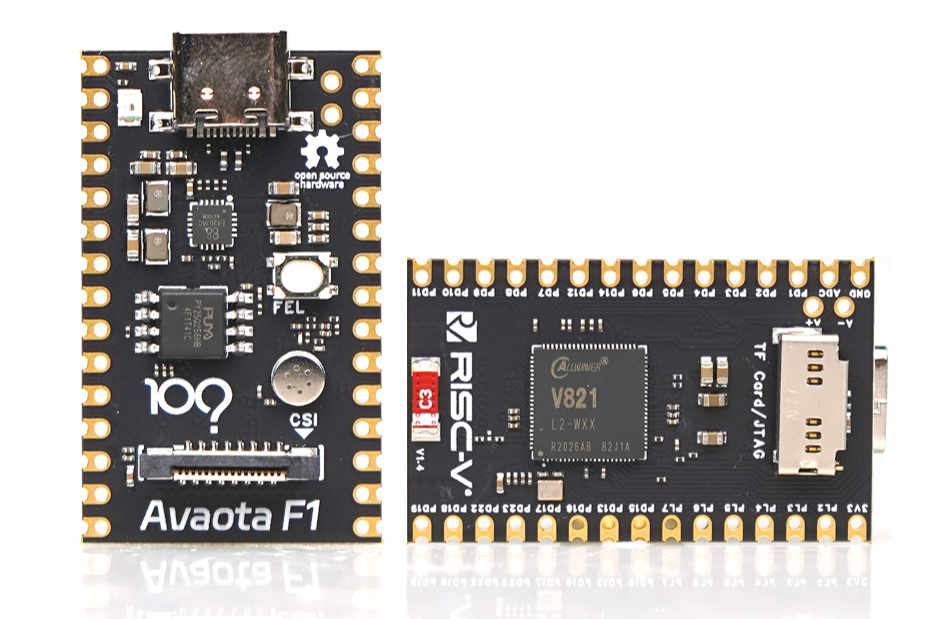
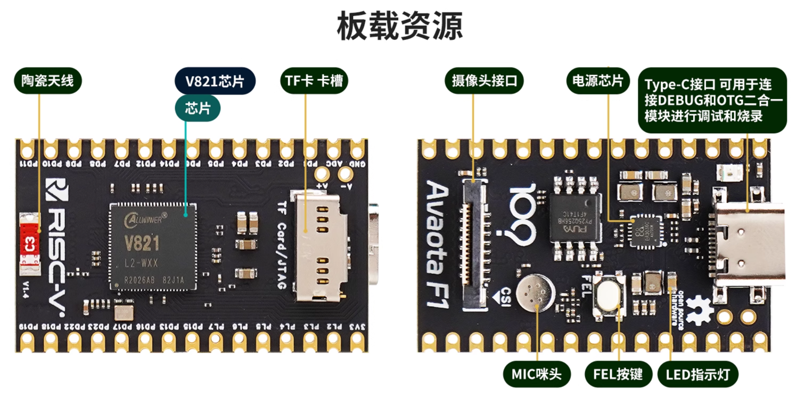
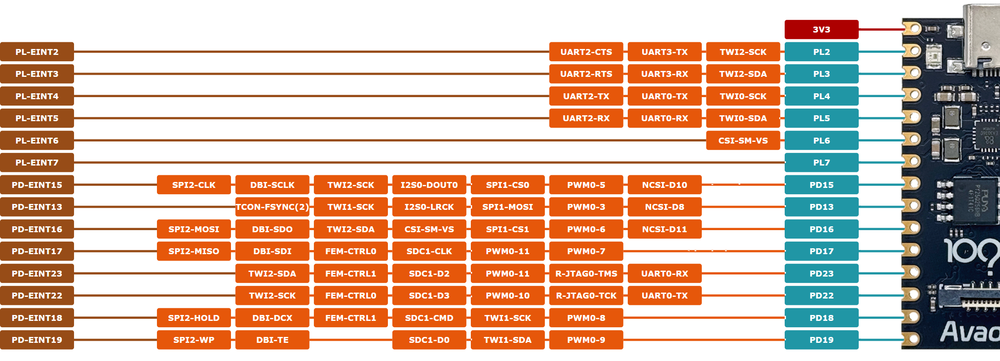
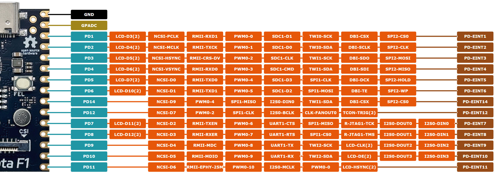

# V821 AvaotaF1 Pico

百问网的 **AvaotaF1 V821 开发套件** 采用 Pico 尺寸设计，紧凑且功能强大，支持标准 2.54 排针接口，方便与面包板连接，进行 DIY 实验。其超薄双面设计令其尺寸仅与 1 元硬币相当，集成了 V821 所有核心功能，极大地提升了开发灵活性与可扩展性。

这款开发套件具备多种强大特性：

- **板载 MIPI CSI 摄像头接口**，支持高清图像采集。
- **MIC 拾音功能**，便于音频采集。
- **SPI NOR FLASH（32MB）**，提供充足的存储空间。
- **WiFi 陶瓷天线**，支持无线连接，拓展网络功能。
- **TF 卡卡座**，方便数据存储和扩展。
- **烧录按键**，简化固件烧录操作。
- 丰富的 **GPIO 资源**，可灵活配置和控制外部硬件设备。

该开发套件支持最新的 **Tina Linux 5.0 系统**，可直接在 V821 AvaotaF1 上进行开发。除此之外，还支持多种配件：

- **MIPI 摄像头 GC2083**，提供高质量图像采集。
- **SPI 屏幕**：包括 3.5 寸 320x480 分辨率显示屏和 1.54 寸 240x240 分辨率显示屏，适应多样的显示需求。

AvaotaF1 V821 开发套件集成了丰富的功能，操作简便且便于拓展，是进行嵌入式开发与实验的理想选择。

## 核心板参数

| 项目     | 参数                                               |
| -------- | -------------------------------------------------- |
| 主控     | 全志V821L2-WXX                                     |
| PMU      | 集成电源芯片EA3036                                 |
| DDR      | Internal 64MB DDR2                                 |
| Memory   | Nor Flash 32MB（PY25Q256）                         |
| 无线网络 | SIP 2.4GHz WIFI                                    |
| 摄像头   | 单目 1920x1080@30fps                               |
| 屏幕     | 3.5寸（320*480）SPI 屏                             |
| 麦克风   | 模拟麦克风*1                                       |
| 按键     | FEL烧录                                            |
| 灯       | LED * 1                                            |
| Debug    | 支持uart串口调试，支持ADB USB调试                  |
| USB      | Type-C USB * 1, 同时支持供电和数据传输以及串口输出 |
| GPIO     | 引出双盘排针30Pin 支持多达28个GPIO信号             |
| 板身尺寸 | 长35mm*宽22mm                                      |
| 板层     | 6层板                                              |

## 核心板接口功能示意

## 核心板接口功能

| Signal Name           | Description                                                  | Type    |
| --------------------- | ------------------------------------------------------------ | ------- |
| FEL                   | Boot Process Select Jump to the Try Media Boot process when FEL is high level, or else enter into the mandatory upgrade process. | I       |
| **Clock Fanout**      |                                                              |         |
| CLK-FANOUT0           | Internal Clock Fanout Optional Frequency: 32 kHz, 12 MHz, 16 MHz, 24 MHz, 25 MHz, 27 MHz | O       |
| **RF**                |                                                              |         |
| FEM-CTRL0             | Front End Module Control, TX-EN                              | I/O     |
| FEM-CTRL1             | Front End Module Control, RX-EN                              | I/O     |
| **SD Card/SDIO/eMMC** |                                                              |         |
| SDC1-CMD              | SDIO Command Output/Response Input                           | I/O, OD |
| SDC1-CLK              | SDIO Clock Output                                            | O       |
| SDC1-D0               | SDIO Data Input/ Output 0                                    | I/O     |
| SDC1-D1               | SDIO Data Input/ Output 1                                    | I/O     |
| SDC1-D2               | SDIO Data Input/ Output 2                                    | I/O     |
| SDC1-D3               | SDIO Data Input/ Output 3                                    | I/O     |
| **I2S/PCM**           |                                                              |         |
| I2S0-MCLK             | I2S0 Master Clock                                            | O       |
| I2S0-LRCK             | I2S0/PCM0 Sample Rate Clock/Sync                             | I/O     |
| I2S0-BCLK             | I2S0/PCM0 Bit Rate Clock                                     | I/O     |
| I2S0-DIN0             | I2S0/PCM0 Serial Data Input 0                                | I       |
| I2S0-DIN1             | I2S0/PCM0 Serial Data Input 1                                | I       |
| I2S0-DIN2             | I2S0/PCM0 Serial Data Input 2                                | I       |
| I2S0-DIN3             | I2S0/PCM0 Serial Data Input 3                                | I       |
| I2S0-DOUT0            | I2S0/PCM0 Serial Data Output 0                               | O       |
| I2S0-DOUT1            | I2S0/PCM0 Serial Data Output 1                               | O       |
| I2S0-DOUT2            | I2S0/PCM0 Serial Data Output 2                               | O       |
| I2S0-DOUT3            | I2S0/PCM0 Serial Data Output 3                               | O       |
| GPADC                 |                                                              |         |
| GPADC0-0              | General Purpose ADC0 Input 0                                 | AI      |
| GPADC0-2              | General Purpose ADC0 Input 2                                 | AI      |
| GPADC0-3              | General Purpose ADC0 Input 3                                 | AI      |
| **MIPI CSI**          |                                                              |         |
| CSI-SM-HS             | CSI Horizontal SYNC                                          | O       |
| CSI-SM-VS             | CSI Vertical SYNC/Frame SYNC                                 | O       |
| **Parallel CSI**      |                                                              |         |
| NCSI-PCLK             | Parallel CSI Pixel Clock Input                               | I       |
| NCSI-MCLK             | Parallel CSI Master Clock Output                             | O       |
| NCSI-HSYNC            | Parallel CSI Horizontal Synchronous Input                    | I       |
| NCSI-VSYNC            | Parallel CSI Vertical Synchronous Input                      | I       |
| NCSI-D0               | Parallel CSI Pixel Data 0                                    | I       |
| NCSI-D1               | Parallel CSI Pixel Data 1                                    | I       |
| NCSI-D2               | Parallel CSI Pixel Data 2                                    | I       |
| NCSI-D3               | Parallel CSI Pixel Data 3                                    | I       |
| NCSI-D4               | Parallel CSI Pixel Data 4                                    | I       |
| NCSI-D5               | Parallel CSI Pixel Data 5                                    | I       |
| NCSI-D6               | Parallel CSI Pixel Data 6                                    | I       |
| NCSI-D7               | Parallel CSI Pixel Data 7                                    | I       |
| NCSI-D8               | Parallel CSI Pixel Data 8                                    | I       |
| NCSI-D9               | Parallel CSI Pixel Data 9                                    | I       |
| NCSI-D10              | Parallel CSI Pixel Data 10                                   | I       |
| NCSI-D11              | Parallel CSI Pixel Data 11                                   | I       |
| **LCD**               |                                                              |         |
| LCD-CLK               | LCD Clock                                                    | O       |
| LCD-VSYNC             | LCD Vertical Synchronization                                 | O       |
| LCD-HSYNC             | LCD Horizontal Synchronization                               | O       |
| LCD-DE                | LCD Data Enable                                              | O       |
| TCON-FSYNC            | Frame Synchronization Signal for TCON and Sensor             | O       |
| TCON-TRIG             | Screen Trigger Signal                                        | I       |
| LCD-D3                | LCD Data Input/Output 3                                      | I/O     |
| LCD-D4                | LCD Data Input/Output 4                                      | I/O     |
| LCD-D5                | LCD Data Input/Output 5                                      | I/O     |
| LCD-D6                | LCD Data Input/Output 6                                      | I/O     |
| LCD-D7                | LCD Data Input/Output 7                                      | I/O     |
| LCD-D10               | LCD Data Input/Output 10                                     | I/O     |
| LCD-D11               | LCD Data Input/Output 11                                     | I/O     |
| LCD-D12               | LCD Data Input/Output 12                                     | I/O     |
| **Ethernet MAC**      |                                                              |         |
| RMII-TXCK             | RMII Transmit Clock                                          | I       |
| RMII-RXER             | RMII Receive Error                                           | I       |
| RMII-CRS-DV           | RMII Carrier Sense Receive Data Valid                        | I       |
| RMII-TXEN             | RMII Transmit Enable                                         | O       |
| RMII-EPHY-25M         | EMAC PHY 25 MHz Clock Output                                 | O       |
| RMII-MDC              | RMII Management Data Clock                                   | O       |
| RMII-MDIO             | RMII Management Data Input/ Output                           | I/O     |
| RMII-RXD0             | RMII Receive Data 0                                          | I       |
| RMII-RXD1             | RMII Receive Data 1                                          | I       |
| RMII-TXD0             | RMII Transmit Data 0                                         | O       |
| RMII-TXD1             | RMII Transmit Data 1                                         | O       |
| **SPI&SPI DBI**       |                                                              |         |
| SPI1-CS0              | SPI1 Chip Select 0 (Active Low)                              | I/O     |
| SPI1-CS1              | SPI1 Chip Select 1 (Active Low)                              | I/O     |
| SPI1-CLK              | SPI1 Clock                                                   | I/O     |
| SPI1-MOSI             | SPI1 Master Data Out, Slave Data In                          | I/O     |
| SPI1-MISO             | SPI1 Master Data In, Slave Data Out                          | I/O     |
| SPI1-WP               | SPI1 Write Protection (Active Low)/ Serial Data Input and Output for Quad Input or Quad Output | I/O     |
| SPI1-HOLD             | SPI1 Hold Signal/ Serial Data Input and Output for Quad Input or Quad Output | I/O     |
| SPI2-CS0              | SPI2 Chip Select 0 (Active Low)                              | I/O     |
| SPI2-CLK              | SPI2 Clock                                                   | I/O     |
| SPI2-MOSI             | SPI2 Master Data Out, Slave Data In                          | I/O     |
| SPI2-MISO             | SPI2 Master Data In, Slave Data Out                          | I/O     |
| SPI2-WP               | SPI2 Write Protection (Active Low)/ Serial Data Input and Output for Quad Input or Quad Output | I/O     |
| SPI2-HOLD             | SPI2 Hold Signal/ Serial Data Input and Output for Quad Input or Quad Output | I/O     |
| DBI-CSX               | Chip Select Signal (Active Low)                              | I/O     |
| DBI-SCLK              | Serial Clock Signal                                          | I/O     |
| DBI-SDO               | Data Output Signal                                           | I/O     |
| DBI-SDI               | Data Input Signal The data is sampled on the rising edge and the falling edge. | I/O     |
| DBI-TE                | Tearing Effect Input It is used to capture the external TE signal edge. The rising and falling edge is configurable. | I/O     |
| DBI-DCX               | DCX pin is the select output signal of data and command. DCX = 0: register command; DCX = 1: data or parameter. | I/O     |
| DBI-WRX               | When DBI operates in dual data lane format, the RGB666 format 2 can use WRX to transfer data | I/O     |
| **UART**              |                                                              |         |
| UART0-RX              | UART0 Data Receiver                                          | I       |
| UART0-TX              | UART0 Data Transmitter                                       | O       |
| UART1-CTS             | UART1 Clear to Send                                          | I       |
| UART1-RTS             | UART1 Request to Send                                        | O       |
| UART1-RX              | UART1 Data Receiver                                          | I       |
| UART1-TX              | UART1 Data Transmitter                                       | O       |
| UART2-CTS             | UART2 Clear to Send                                          | I       |
| UART2-RTS             | UART2 Request to Send                                        | O       |
| UART2-RX              | UART2 Data Receiver                                          | I       |
| UART2-TX              | UART2 Data Transmitter                                       | O       |
| UART3-RX              | UART3 Data Receiver                                          | I       |
| UART3-TX              | UART3 Data Transmitter                                       | O       |
| **PWM**               |                                                              |         |
| PWM0-0                | PWM0 Wave Output /Capture Wave Input 0                       | I/O     |
| PWM0-1                | PWM0 Wave Output /Capture Wave Input 1                       | I/O     |
| PWM0-2                | PWM0 Wave Output /Capture Wave Input 2                       | I/O     |
| PWM0-3                | PWM0 Wave Output /Capture Wave Input 3                       | I/O     |
| PWM0-4                | PWM0 Wave Output /Capture Wave Input 4                       | I/O     |
| PWM0-5                | PWM0 Wave Output /Capture Wave Input 5                       | I/O     |
| PWM0-6                | PWM0 Wave Output /Capture Wave Input 6                       | I/O     |
| PWM0-7                | PWM0 Wave Output /Capture Wave Input 7                       | I/O     |
| PWM0-8                | PWM0 Wave Output /Capture Wave Input 8                       | I/O     |
| PWM0-9                | PWM0 Wave Output /Capture Wave Input 9                       | I/O     |
| PWM0-10               | PWM0 Wave Output /Capture Wave Input 10                      | I/O     |
| PWM0-11               | PWM0 Wave Output /Capture Wave Input 11                      | I/O     |
| **TWI**               |                                                              |         |
| TWI0-SCK              | TWI0 Serial Clock Signal                                     | I/O     |
| TWI0-SDA              | TWI0 Serial Data Signal                                      | I/O     |
| TWI1-SCK              | TWI1 Serial Clock Signal                                     | I/O     |
| TWI1-SDA              | TWI1 Serial Data Signal                                      | I/O     |
| TWI2-SCK              | TWI2 Serial Clock Signal                                     | I/O     |
| TWI2-SDA              | TWI2 Serial Data Signal                                      | I/O     |
| **JTAG**              |                                                              |         |
| R-JTAG0-TMS           | CPU0 JTAG Mode Select                                        | I/O     |
| R-JTAG0-TCK           | CPU0 JTAG Clock Signal                                       | I       |
| R-JTAG1-TMS           | CPU1 JTAG Mode Select                                        | I/O     |
| R-JTAG1-TCK           | CPU1 JTAG Clock Signal                                       | I       |
| **Interrupt**         |                                                              |         |
| PD-EINT1              | Port D Interrupt                                             | I       |
| PD-EINT2              | Port D Interrupt                                             | I       |
| PD-EINT3              | Port D Interrupt                                             | I       |
| PD-EINT4              | Port D Interrupt                                             | I       |
| PD-EINT5              | Port D Interrupt                                             | I       |
| PD-EINT6              | Port D Interrupt                                             | I       |
| PD-EINT7              | Port D Interrupt                                             | I       |
| PD-EINT8              | Port D Interrupt                                             | I       |
| PD-EINT9              | Port D Interrupt                                             | I       |
| PD-EINT10             | Port D Interrupt                                             | I       |
| PD-EINT11             | Port D Interrupt                                             | I       |
| PD-EINT12             | Port D Interrupt                                             | I       |
| PD-EINT13             | Port D Interrupt                                             | I       |
| PD-EINT14             | Port D Interrupt                                             | I       |
| PD-EINT15             | Port D Interrupt                                             | I       |
| PD-EINT16             | Port D Interrupt                                             | I       |
| PD-EINT17             | Port D Interrupt                                             | I       |
| PD-EINT18             | Port D Interrupt                                             | I       |
| PD-EINT19             | Port D Interrupt                                             | I       |
| PD-EINT22             | Port D Interrupt                                             | I       |
| PD-EINT23             | Port D Interrupt                                             | I       |
| PL-EINT2              | Port L Interrupt                                             | I       |
| PL-EINT3              | Port L Interrupt                                             | I       |
| PL-EINT4              | Port L Interrupt                                             | I       |
| PL-EINT5              | Port L Interrupt                                             | I       |
| PL-EINT6              | Port L Interrupt                                             | I       |
| PL-EINT7              | Port L Interrupt                                             | I       |