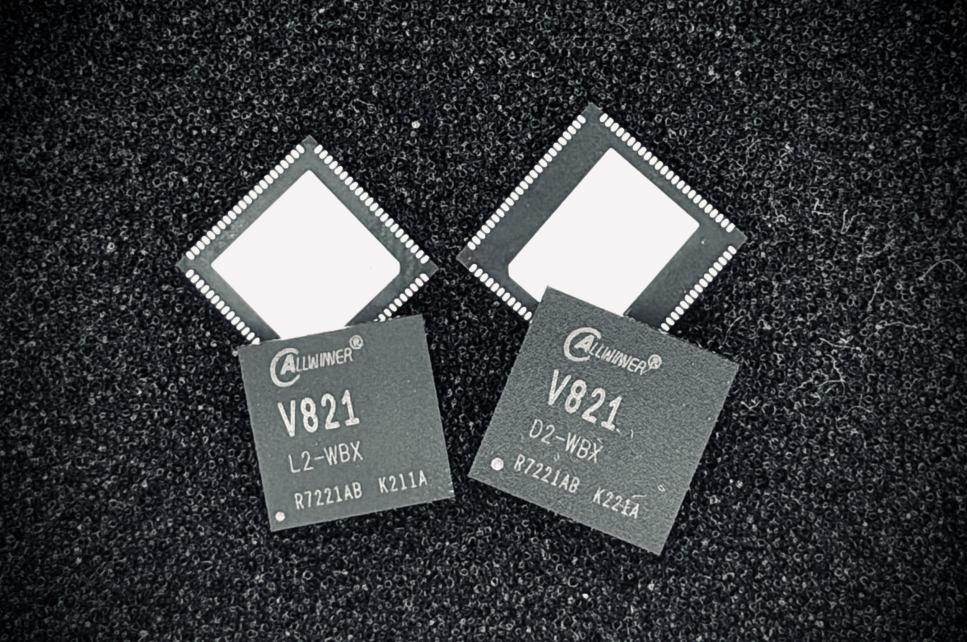
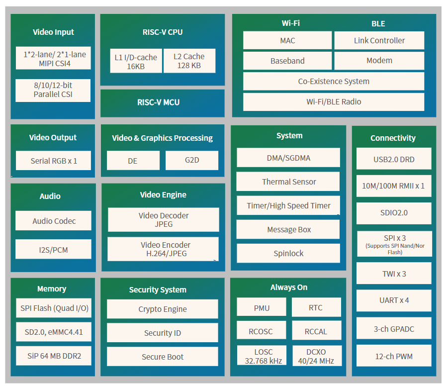
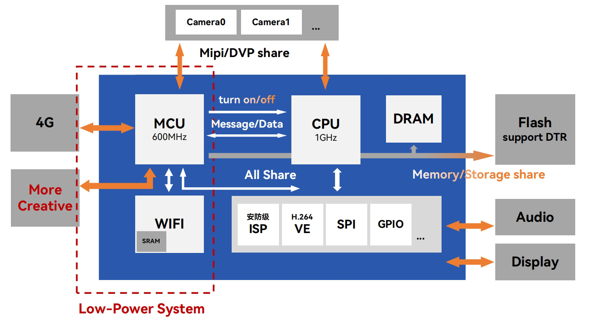
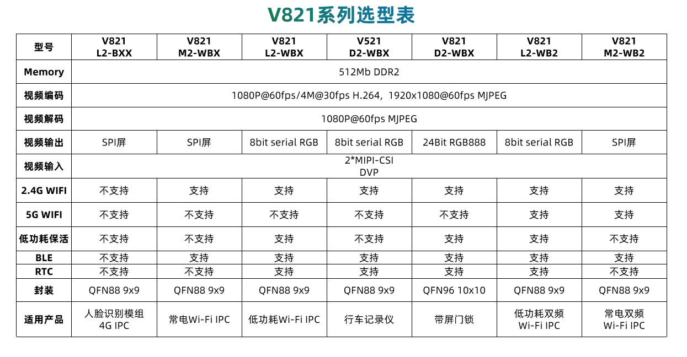

# 全志 V821 芯片介绍

V821 是全志科技推出的一颗高集成度低功耗多目 IPC SoC。芯片集成双 RISC-V 架构处理器，内部集成的高性能ISP和硬件编码单元支持 4MP 摄像头接入、ISP 处理和 H.264 编码。V821 支持单、双、三目的摄像头接入方案，同时集成了 Wi-Fi & BLE、LDO、IRCUT Driver 和 Audio Codec 等模块。基于优秀的ISP处理能力、低功耗与高扩展能力，V821 可扩展多目网络摄像头、低功耗门铃、智能门锁等产品。

:::info

:::note

信息

:::
:::note

V821系列芯片有多个不同规格子型号，本页面中介绍为 V821L2-WBX，其它子型号规格略有不同，具体以规格书为准

:::

:::

## 芯片亮点

-   **极简外围设计**：高度集成 Wi-Fi & BLE、LDO、IRCUT 等 IPC 类产品常用模块，无需外挂过多外围元器件，大幅减少硬件设计复杂度和成本。
-   **实时双目支持**：支持双目 1080P 免 Switch 实时接入，完美适配枪球一体 IPC、人脸/掌静脉+猫眼一体门锁等双目应用场景，满足复杂视觉需求。
-   **超低功耗表现**：Wi-Fi DTIM10 路由器保活功耗低至 [180uA@4.2V](mailto:180uA@4.2V)，同时支持 AOV 低功耗方案，显著延长设备续航时间。
-   **简化开发流程**：提供适用于IPC类产品的深度定制化Tina Linux SDK，支持常电和低功耗快启模式，同时提供 IPC 量产裁剪方案，降低开发难度，缩短开发周期。
-   **简化量产流程**：固件设计兼顾 IPC SoC 和 Wi-Fi MCU，产线无需额外 Wi-Fi MCU 烧录流程，提升量产效率，降低生产成本。

## 芯片规格

-   **通用算力**
    
    -   支持RISC-V CPU，时钟速率最高1.2GHz
        -   支持16KB l-cache、16KB D-cache、128KB L2 cache
        -   支持专用算子加速，支持 conv、depthwiseconv、maxpool、add、concat 等典型算子
    -   支持 RISC-V MCU，时钟速率 600MHz
-   **视频编解码**
    
    -   支持 H.264 BP/MP/HP 编码
        -   H264 编码支持 I/P 帧
        -   H264 编码支持最大分辨率为 $3072\times3072$
    -   多码流编码典型性能：
        -   单目：$1920\times1080@30fps + 640\times480@30fps$
        -   双目：$1920\times1080@15fps\times2 + 640\times480@15fps\times2$
        -   支持 JPEG 编码和解码，最大分辨率支持 $8192\times8192$，最大性能支持 $1920\times1080@60fps$
        -   支持 CBR/VBR/FIXQP/QPMAP 等码率控制模式
        -   支持 8 个感兴趣区域（ROI）编码
        -   支持 64 个区域的 OSD 叠加
        -   支持 H.264/MJPEG 编码和 MJPEG 解码同时工作
-   **ISP**
    
    -   最大支持 $3264\times2448$ 分辨率 Sensor 接入
    -   支持3A（AE/AWB/AF），支持 3A 参数可调。
    -   支持分时复用（TDM）模式，最大支持2个通道复用
    -   支持像素坏点校正和镜头阴影校正
    -   支持局部色调映射
    -   支持多级降噪（空域降噪和时域降噪），色噪消除
    -   支持色彩调节和色彩增强
    -   支持4路缩放（1x~1/16x）输出
    -   支持PC端工具调试ISP（在线/离线/远程调试）
-   **视频输入**
    
    -   符合 MIPI-CSI2 V1.1 和MIPI DPHY V1.0 标准，支持 2 个 1lane 或 1 个 2lane 的 MIPI CSI 接口，每通道最高速率 1.0Gbps
    -   MIPI CSI 最大分辨率支持 $3264\times2448$
    -   并口 CSI 支持8/10/12bit位宽
    -   支持 BT.656，BT.601 和 DC 协议
    -   BT656 接口最大支持 $2\times720\text{P}@30fps$
-   **视频输出（L2-WXX系列）**
    
    -   支持一个显示屏接口
        -   支持串行 RGB 接口，最大性能 $800\times480@60fps$
        -   支持串行 8-bit i8080接口，最大性能 $800\times480@60fps$
-   **视频和图形处理**
    
    -   支持一个 Video 通道和一个 UI 通道
    -   Video 通道支持 1/16 到 32 倍缩放
    -   支持 0/90/180/270 度图像旋转
    -   支持水平和垂直翻转
-   **音频**
    
    -   支持1路 DAC 和1路 ADC
    -   支持1路音频输入：MICINP/N
    -   支持1路音频输出：LINEOUTP/N
    -   内置1路 12S/PCM 接口，支持最大16通道，8kHz-384kHz 采样率，8-32bit 位宽
-   **存储接口**
    
    -   内置 64MB DDR2
    -   支持 SD2.0、eMMC4.41 和 SPI Flash 启动
    -   支持 QUAD DTR 模式 SPI 接口
-   **外围接口**
    
    -   支持 1 路 USB2.0 DRD，支持 UAC/UVC 协议
    -   支持 3 路 SPI，3 路 TWI，4 路 UART
    -   支持 1 路 10/100Mbit/s RMIl 接口
    -   支持 12 通道 PWM，3 通道 GPADC
-   **Wi-Fi**
    
    -   兼容 IEEE802.11b/g/n 标准
    -   支持单频 2.4GHz 1T1R 模式
    -   集成 LNA, PA 和 T/R 开关
    -   安全支持 WPA/WPA2/WPA3-personal 和 WPS2.0
    -   支持 STA、SoftAP、STA+SoftAP 和 Monitor 模式
-   **蓝牙**
    
    -   符合蓝牙低功耗 5.0 标准
    -   支持数据传输速率：2Mbps、1Mbps、500Kbps 及 125Kbps
-   **封装**
    
    -   QFN88, $9mm \times 9mm$
    -   QFN96, $10mm \times 10mm$

## 芯片框图

## 系统框图

## 版本差异

