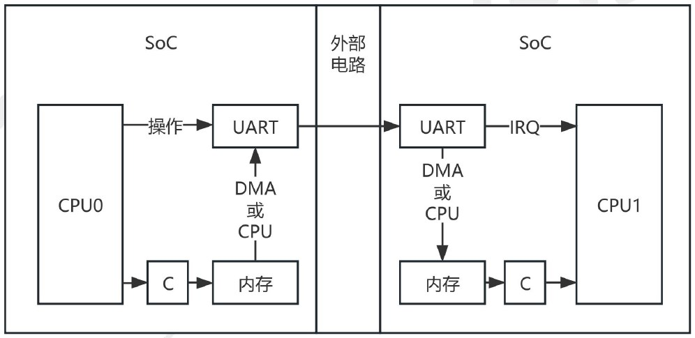
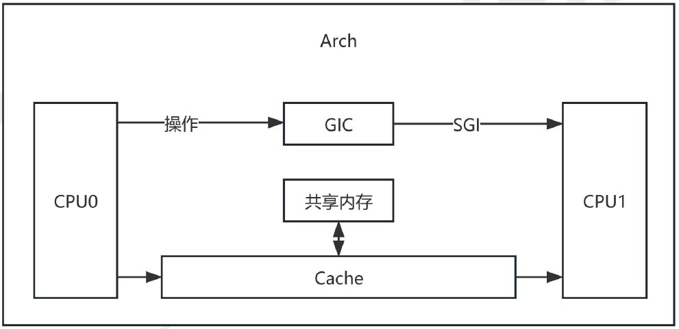
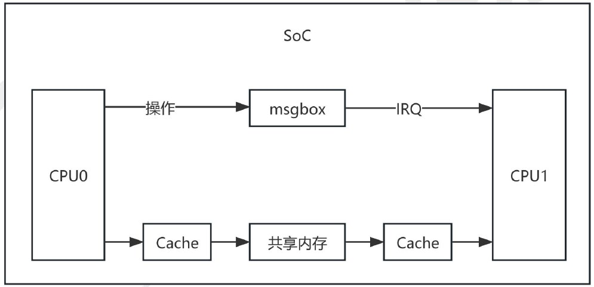
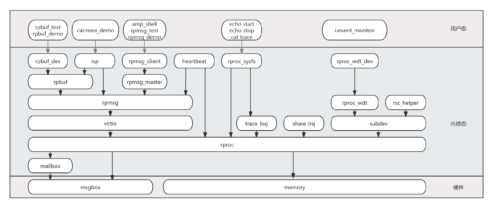
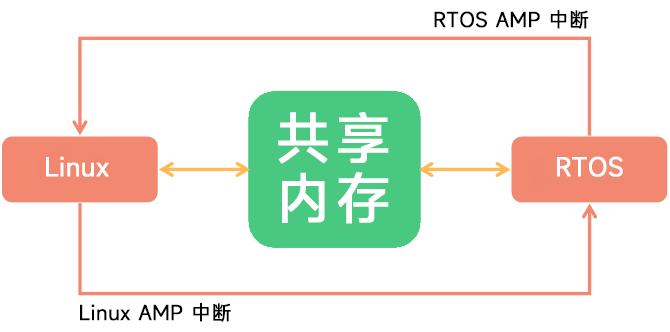
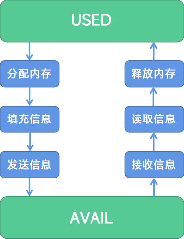

# AMP 异构 功能简介

## 异构与多核处理器

处理器芯片的发展主要在功能和性能这2个方向上进行不断演化：

-   功能：早期的处理器只集成了算术逻辑单元(ALU)、控制单元等必要模块，主要负责从外部读取计算数据、进行算术逻辑运算以及输出计算结果，随着计算机技术的发展，越来越多的模块(比如中断控制器、时钟控制器、IO控制器、存储器以及目前处理器芯片上常见的硬件外设)被集成到处理器芯片内部，导致处理器芯片越来越复杂，其提供的功能越来越多，形成了目前被大众熟知的SoC(System on Chip，片上系统)。
    
-   性能：处理器芯片的性能提升主要通过提升主频、改进制造工艺、优化处理器微架构、单个芯片集成多个CPU核、单个CPU核实现硬件多线程等方法实现的。
    

SMP：对称多处理(Symmetric multi-processing)，多个处理器核运行单个操作系统，进程可在任意处理器核上运行，操作系统可将计算任务从一个核直接迁移到另外一个核，支持SMP系统的处理器芯片内集成的多个CPU核一般具有完全相同的处理器微架构。

AMP：非对称多处理(Asymmetric multi-processing)，多个处理器核运行不同的操作系统，计算任务必须提前分配到不同的操作系统内处理，无法直接迁移，支持AMP系统的处理器芯片内集成的多个CPU核一般具有不同的处理器架构(异构)，不同的处理器架构有各自擅长的计算任务类型，但某些具有完全相同微架构的处理器也可以AMP方式运行(ARM架构的多核CPU大部分都可以AMP方式运行)。

**处理器芯片间通信**：在处理器芯片未发展为多核处理器芯片以及多核处理器芯片问世后的一段时间内，一些复杂产品内使用多颗处理器芯片时会使用一些通信外设来负责处理器芯片间的通信，这种通信方式会存在一些缺点(资源访问便利性、稳定性、通信带宽等)。



**SMP系统内CPU核间通信**：多核处理器芯片问世后，操作系统也新增了可以管理多个CPU核的功能，此时多个CPU核间通信基于共享内存以及处理器架构附带的专用核间中断，由于多个CPU核完全一致以及通信使用到的电路完全在单块芯片内部，这种情况下共享资源的访问便利性以及系统稳定性也比处理器芯片间通信时更优。



**AMP系统内CPU核间通信**：多核处理器芯片进一步发展为集成不同处理器架构的核心后，由于各个CPU核心完全不一样，基本不可能再由一个操作系统管理多个不同架构的CPU核心，但由于各个不同架构的CPU核心访问共享资源的能力基本一样，因此AMP系统内不同架构CPU核间通信实际上也是采用共享内存+中断的形式，只不过此时的中断是由一个专门的硬件外设提供的，并不是某个处理器架构附带的专用核间中断(若是支持SMP的多核处理器以AMP方式运行，也是可以使用专用的核间中断的)。



## AMP 系统架构中的基本概念

-   主核：AMP 系统内主要的 CPU 核，一般运行 Linux 系统且处理的任务较多
-   从核：AMP 系统内被主核管理生命周期的 CPU 核，一般运行 RTOS系统且处理的任务较少
-   remoteproc：远端处理器 (Remote Processor)，一般情况下指代从核，在 OpenAMP 框架和 Linux remoteproc 子系统里表示通信时对端的处理器。
-   OpenAMP：可在裸机或 RTOS 上运行的用于 AMP 系统内处理器核间通信的第三方开源软件
-   Linux remoteproc子系统：一般简称为remoteproc，主要负责管理远端处理器的生命周期。
-   Virtio：Linux内核中已有的用于宿主机和虚拟机之间通信的驱动，在 Linux 实现 rpmsg 通信时直接复用了此模块。
-   RPMsg：remoteproc message，AMP 系统内处理器核间的一种标准通信方式，基于Virtio。
-   RPBuf： remoteproc buffer，全志实现的 AMP 系统内处理器核间进行大量数据传输的通信方式，可突破 rpmsg 单次传输时的数据长度限制，其基于rpmsg实现。
-   Msgbox：全志实现的一种用于AMP系统内处理器核间通信的硬件外设。
-   malibox：Linux内核实现的用于AMP系统内处理器核间通信的子系统。



### 安全启动方案

对于安全启动方案，由于 SBOOT 不具备校验小核证书的能力，所以小核是由 U-Boot 引导加载的。SBOOT 只加载并校验 U-Boot 然后跳转执行 U-Boot。不加载小核和启动小核。

## RTOS 固件

固件文件的后缀名为 `.bin`，一般放置于 `device/config/chips/v821/bin/amp_rv0.bin` 内，虽然后缀名是 `.bin` 但是实际上是一个经过 `strip` 后的 `ELF` 文件，并非经过 `objcopy` 后的 `.bin` 文件。

SDK里小核固件保存的路径可以位于这些地方：

```
bin/*.bin
configs/*/bin/*.bin
configs/*/*/bin/*.bin
configs/*/*/*/bin/*.bin
```

如果后面的路径文件存在，它会覆盖前面路径中的文件。

### 示例说明

1.  **路径 1** `device/config/chips/v821/bin/amp_rv0.bin`
    
    这个文件位于 `bin` 文件夹内，符合第一个路径模式 `bin/*.bin`，表示主目录下的 `bin` 文件夹。
    
2.  **路径 2** `device/config/chips/v821/configs/perf2/bin/amp_rv0.bin`
    
    这个文件位于 `configs/perf2/bin/` 路径下，符合第二个路径模式 `configs/*/bin/*.bin`。 假设该路径下的文件与第一个路径模式中的文件 `amp_rv0.bin` 重名，则此文件会覆盖第一个文件。
    

### 文件覆盖规则

-   如果多个路径模式匹配到相同文件（例如 `amp_rv0.bin`），后面的路径会覆盖前面的文件。
    -   例如，`device/config/chips/v821/configs/perf2/bin/amp_rv0.bin` 将覆盖 `device/config/chips/v821/bin/amp_rv0.bin`。

通过这样的路径匹配与覆盖规则，可以精确控制文件的加载顺序与优先级。

## AMP 软件框架介绍

从系统架构的角度来看，AMP框架主要由Linux端和RTOS端两部分组成。Linux端通过三大组件协同工作来实现异构通信，RTOS端则采用OPENAMP框架来实现通信和功能。具体内容如下：

### Linux端组件

Linux端的AMP框架由以下三个关键组件组成：

-   **RPMSG**：提供异构通信驱动框架，用于管理消息的发送和接收。
-   **VIRTIO**：提供异构通信的实际数据交互区域，负责数据的传输和接收。
-   **REMOTEPROC**：负责异构小核的加载、启动和停止操作，同时兼顾VIRTIO和共享内存的初始化。

这三大组件协同工作，确保了Linux端与RTOS端之间的有效通信与数据交换。

#### Virtio（虚拟化模块）

**Virtio** 是一个用于共享内存管理的虚拟设备框架。在 Virtio 中，`vring` 是指向数据缓冲区指针的 FIFO 队列，具有两个单向的 `vring`：

-   一个 `vring` 专用于发送消息到远程处理器；
-   另一个 `vring` 用于接收从远程处理器发来的消息。

这两个 `vring` 构成了一个环形结构，Linux 和 MCU 通过 `vring` 的缓冲区来共享数据。`vring` 的缓冲区即为两个处理器之间的共享内存（也称为 Vring buffer）。

#### RPMsg（远程处理器消息传递）

**RPMsg** 框架位于 Virtio 之上，是基于 Virtio 的消息总线。RPMsg 服务通过该框架实现，具有两个 `vring`，分别用于发送和接收消息，`vring` 缓冲区即为共享内存。

RPMsg 基于 Virtio 的 `vring`，利用这些 `vring` 向远程处理器发送消息或从其接收消息。当共享内存中有新消息时，mailbox 框架会通知处理器可以接收消息。

实际上，RPMsg 是基于 Virtio 的消息总线，主要用于实现消息传递。可以将 RPMsg 看作是与远程处理器通信的通道，每个通道都有一个本地源地址和远程目标地址，消息便通过这些地址进行传输。

### RemoteProc（远程处理器控制）

**RemoteProc** 框架由 Texas Instruments 开发，之后 Mentor Graphics 基于此开发了 OpenAMP 软件框架。在此框架下，主处理器上的 Linux 操作系统可以管理远程处理器及其相关软件环境的生命周期，即启动和关闭远程处理器。

RemoteProc 框架的主要功能：

-   **加载固件：** 主处理器将 MCU 固件映像的代码段和数据段加载到 MCU 内存中，以便后续执行程序。
-   **解析资源表：** 解析 MCU 固件资源表，并设置相关资源（如固件各个段的起始地址、大小等信息，以及 Virtio 设备特性、`vring` 地址、大小和对齐信息）。
-   **启动/停止远程处理器：** 控制 MCU 核心固件的启动和停止。
-   **建立通信通道：** 为与 MCU 的通信创建 RPMsg 通道。
-   **监控与调试：** 提供远程监控和调试服务，借助 sysfs 和 debugfs 文件系统进行直接交互。

RemoteProc 控制流程：

1.  **主处理器启动：** 主处理器首先启动并引导协处理器启动。
2.  **加载固件：** 主处理器通过 RemoteProc 框架加载远程处理器固件，并解析固件资源表，配置协处理器的系统资源，同时创建 Virtio 设备。
3.  **启动远程处理器：** 主处理器启动远程处理器，远程处理器开始运行。
4.  **创建通信通道：** 在远程处理器启动后，主处理器需要先创建 RPMsg 通道，并发送第一条消息后，双核才能进行核间通信并相互传输数据。
5.  **停止固件：** 若需要停止远程处理器的运行，主处理器可以关闭固件，远端处理器停止执行。

### RTOS端实现

RTOS端使用**OPENAMP**框架，功能实现与Linux端的RPMSG、VIRTIO、REMOTEPROC类似。然而，由于RTOS端不存在用户态与内核态、物理地址与虚拟地址的限制，RTOS端的实现相对更加简洁。

## AMP 通信方式

通信采用**中断**和**共享内存**的方式进行。在这种机制下，Linux端和RTOS端可以高效地进行数据传输和任务同步。



AMP 系统在每个通信方向上都有两个缓冲区，分别是 `USED` 和 `AVAIL`，这个缓冲区可以按照 RPMsg 中消息的格式分成一块一块链接形成一个环。



当主核需要和小核进行通信的时候可以分为四步：

1.  主核先从USED中取得一块内存（Allocate）
2.  将消息按照消息协议填充
3.  将该内存链接到 AVAIL 缓冲区中（Send）
4.  触发中断，通知辅助核有消息处理

反之，小核需要和主核通信的时候也类似：

1.  小核先从AVAIL中取得一块内存（Allocate）
2.  将消息按照消息协议填充
3.  将该内存链接到 USED 缓冲区中（Send）
4.  触发中断，通知主核有消息处理。

基于此，SDK 提供了 RPMsg 通讯接口和 RPbuf 通讯接口，具体使用方法请参阅对应文档。
