# AMP 异构 启动控制与资源管理

## 小核启动和初始化

首先说明下小核启动和小核初始化的概念，小核的启动指的是让小核开始运行代码，而小核的初始化则指的是 Linux remoteproc 框架初始化 remoteproc 的操作，完成初始化后才可以和小核通信。

目前 SDK 里支持如下几种小核启动和初始化方式：

1.  小核在 bootloader 阶段启动，在 Linux **内核** 阶段初始化
2.  小核在 bootloader 阶段启动，在 Linux **应用** 阶段初始化
3.  小核在 Linux 应用阶段启动并初始化

:::tips V821 注意

一般主要使用第1种方式和第3种方式，由于 V821 小核负责 WIFI 功能，所以当前SDK默认使用第1种方式。NAND 常电方案则是内核启动小核。

::: SDK 默认方案如下配置

| 方案 | 读取方式 | 启动从阶段 | 镜像位置 |
| --- | --- | --- | --- |
| SPI NOR | 从分区表读取镜像 | BOOT0 阶段 | 分区表 riscv0 分区 |
| SPI NOR 安全 | 从分区表读取镜像 | U-Boot 阶段 | 分区表 riscv0 分区 |
| SPI NOR 快起 | 从分区表读取镜像 | BOOT0 阶段 | 分区表 riscv0 分区 |
| SPI NAND | 内核启动小核 | 内核阶段启动小核 | 分区表 riscv0 分区 |
| SPI NAND 快起 | 从 RAW 分区读取镜像 | BOOT0 阶段 | NAND RAW 分区固定地址 |
| MMC | 从分区表读取镜像 | BOOT0 阶段 | 分区表 riscv0 分区 |
| MMC 快起 | 从分区表读取镜像 | BOOT0 阶段 | 分区表 riscv0 分区 |
| 卡量产 | 从 `boot_package` 读取镜像 | BOOT0 阶段 | `device/config/chips/v821/configs/default/boot_package.cfg` 配置镜像 |

### BOOT0 启动小核

BOOT0 启动小核包括两个过程：

1.  读取 RTOS 镜像
2.  配置小核启动地址，时钟，复位

#### 读取 RTOS 镜像

RTOS 镜像支持从两个地方读取：

-   从 `boot_package` 读取镜像（支持 NOR，MMC，NAND）
-   从分区表读取镜像（对于 NAND 是从 RAW 分区读取）

#### 配置小核启动地址，时钟，复位

读取到 `elf` 固件后，便可以从 `boot_e907` 函数中解析出固件的运行地址，将其放到目标地址执行。

brandy/brandy-2.0/spl/board/sun300iw1p1/board.c

```c
void boot_e907(phys_addr_t base, unsigned long fdt_addr)
{
	u32 run_addr = 0;
	/* assert e907 */
	sunxi_e907_clock_reset();
	/* get boot address */
	run_addr = elf_get_entry_addr(base);
	/* load elf to target address */
	load_elf_image(base);
	flush_dcache_all();
	/* de-assert e907 */
	sunxi_e907_clock_init(run_addr);
}
```

### U-Boot 启动小核

#### 大核 U-Boot 的 menuconfig 配置

采用 U-Boot 启动小核的方法，大核 Linux 环境下 U-Boot 需要选中对应配置来提供启动小核的命令，SDK 中已默认选中，此章节对所需配置进行介绍。

进入 Linux 环境的 U-Boot 目录，可采用 `cboot` 命令快速切换到该目录，`make menuconfig` 选中以下配置：

```
CONFIG_CMD_SUNXI_BOOTRV=y
CONFIG_BOOT_RISCV=y
```

#### 小核固件的分区信息和小核启动命令

-   `sys_partition.fex` 中添加小核固件的分区信息，内容如下：

sys\_partition.fex | sys\_partition\_nor.fex

```ini
[partition]
	name         = riscv0
	size         = 2048
	downloadfile = "amp_rv0.fex"
	user_type    = 0x8000
```

:::tip

:::note

提示

:::
:::note

其中 `size` 以 128 对齐，可根据实际的小核固件文件大小调整。

:::

:::

-   `env.cfg` 文件中添加启动小核的命令并修改 `bootcmd` 环境变量，内容如下：

env.cfg

```c
boot_riscv=bootrv 82000000 200000 0 riscv0 riscv0-r
bootcmd=run setargs_nand boot_riscv boot_normal
```

:::tip

:::note

提示

:::
:::note

U-Boot 中 `bootrv` 命令的参数分别为固件文件加载内存地址、加载内存区域大小、小核ID、小核固件分区名、小核固件备份分区名，其中加载内存区域大小需要大于等于小核固件大小。

Linux 设备树中，`fw-partition-sectors` 需要配置与其相对应

:::

:::

#### 小核RTOS环境配置

小核在 U-Boot 阶段启动时，RTOS 端 OpenAMP 框架中部分逻辑是需要等待 Linux 端初始化小核后才能继续执行的，因此小核 RTOS 环境需要启用配置`CONFIG_SLAVE_EARLY_BOOT`。

:::warning

:::note

注意

:::
:::note

小核 RTOS 端 OpenAMP 框架默认是放在线程中初始化的，在开启上述配置后会导致用户程序先于 OpenAMP 框架初始化完成前运行(不开启上述配置时也有可能，但概率较低)，用户编写代码时需要注意这一点。

:::

:::

### Linux 启动和初始化小核

Linux 里启动和初始化小核的操作可分为如下 2 种组合：

-   启动和初始化小核，一般用于 bootloader 阶段未启动小核的场景
-   初始化小核，一般用于 bootloader 阶段已启动小核的场景

:::note

:::note

备注

:::
:::note

目前不会出现Linux内核只启动小核但不初始化小核的情况。

:::

:::

#### RemoteProcessor (remoteproc)

**remoteproc** 是一种 Linux 内核框架，用于支持多核处理器系统中，大核与小核之间的协作。它提供了启动和管理外部处理器（如 DSP、FPGA、小核等）的机制，在一个多核系统中，通常大核负责运行 Linux，而小核则运行其他任务（如 RTOS 或专用的固件）。这个框架特别适用于那些带有多个处理单元的系统，其中大核和小核需要进行互相通信和同步。

**主要功能**

1.  **启动小核**：`remoteproc` 允许 Linux 大核启动并管理小核。它负责加载固件、启动小核、以及在必要时停止小核。大核和小核之间的协调通常是通过共享内存、消息传递等方式来完成的。
2.  **固件管理**：`remoteproc` 负责加载固件到小核内存，并启动小核进行执行。固件可以通过设备树或其他配置文件来指定。
3.  **进程隔离**：在多核系统中，大核和小核之间可以通过 `remoteproc` 实现不同的进程隔离，从而确保每个核的任务不互相干扰。
4.  **共享内存和通信**：`remoteproc` 提供了共享内存区域和通信接口，确保大核和小核之间可以高效地交换数据和同步状态。
5.  **生命周期管理**：`remoteproc` 提供了小核的生命周期管理功能，包括小核的启动、暂停、重启和停止等操作，确保系统在运行时能够可靠地管理多个处理器的状态。

**工作流程**

1.  **固件加载（若 Bootloader 未加载）**：大核通过 `remoteproc` 框架加载小核固件，通常固件文件包含了用于小核的启动程序及其必要的初始化代码。
2.  **小核启动（若 Bootloader 未加载）**：加载固件后，`remoteproc` 启动小核，并为其分配必要的资源（如内存、寄存器等）。
3.  **运行和通信**：小核启动后，它可以开始执行固件中的任务。大核与小核之间可以通过共享内存、消息队列、信号等进行通信。
4.  **小核管理**：大核可以随时暂停、恢复、重启或停止小核，以便进行系统管理或处理异常情况。

**主要组件**

-   **remoteproc 驱动**：负责管理小核的启动、停止、加载固件等任务。
-   **固件加载器**：负责将固件从文件系统加载到内存中，并提供适当的接口供 `remoteproc` 使用。
-   **设备树（Device Tree）**：通过设备树中的配置指定大核和小核的通信方式及固件位置。

#### remoteproc 状态

在 Linux 的 remoteproc 框架中，`remoteproc` 有七种状态，分别如下：

1.  **offline**：关机状态，表示小核没有启动，处于关机状态。
2.  **suspended**：休眠状态，小核已经启动，但当前被暂停或挂起。
3.  **running**：运行状态，小核处于正常运行状态，正在执行固件中的任务。
4.  **crashed**：崩溃状态，小核进入了异常状态，通常表示发生了错误或崩溃。此时需要恢复小核。
5.  **deleted**：删除状态，该状态表明小核已经被删除，这种情况通常不会出现。
6.  **attached**：附加状态，表示小核已在更早的阶段启动，且 Linux 已初始化 `remoteproc`。一般来说，小核会在 Linux 系统启动时进入此状态。
7.  **detached**：分离状态，表示小核已在更早的阶段启动，如在 bootloader 阶段，但还未初始化 `remoteproc`。

在实际开发中，通常会接触到以下四种状态：

-   **offline**：表示小核未启动。
-   **running**：表示小核正在运行。
-   **attached**：表示小核已被 Linux 初始化。
-   **detached**：表示小核在 bootloader 阶段已启动，但尚未初始化 `remoteproc`。

目前的 SDK 默认在 bootloader 阶段启动小核，在 Linux 内核阶段初始化小核。因此，在大核 Linux 系统完全启动后，小核的状态通常会为 **attached**。

#### remoteproc生命周期管理相关命令

remoteproc 生命周期管理一般会用到两个命令，分别用于启动和停止 remoteproc，具体如下：

-   **启动 remoteproc**：`echo start > /sys/class/remoteproc/remoteprocx/state`
-   **停止 remoteproc**：`echo stop > /sys/class/remoteproc/remoteprocx/state`

其中的 `x` 表示 remoteproc 的 ID，在 Linux 系统的 remoteproc 框架中是唯一的。如果一个具体芯片平台有多个不同架构的小核，那么 remoteproc 的 ID 是不会重复的。在执行 `start remoteproc` 时，系统会根据 remoteproc 当前的状态执行不同的操作：

-   如果 remoteproc 处于 **offline** 状态，系统会执行小核的启动和初始化操作，执行完成后，remoteproc 会进入 **running** 状态。
-   如果 remoteproc 处于 **detached** 状态（意味着小核已在 bootloader 阶段启动），系统只会执行小核的初始化操作，执行完成后，小核将进入 **attached** 状态。

#### 查看 remoteproc 状态

-   查看 remoteproc 状态：`cat /sys/class/remoteproc/remoteprocx/state`
-   查看对应 remoteproc 的节点名：`cat /sys/class/remoteproc/remoteprocx/name` ，该命令可以帮助识别具体的小核，根据节点名在 dts 文件中查找对应的小核信息。

#### bootloader 阶段已启动小核

在这种情况下，Linux 系统只需要初始化小核即可。具体操作如下：

-   在内核阶段初始化小核时，只需要在对应的 remoteproc 节点中增加 `auto-boot` 空属性。
-   在应用阶段初始化小核时，只需执行 `start remoteproc` 命令即可启动小核。

#### bootloader 阶段未启动小核

在这种情况下，小核的固件通常会保存在文件系统中。在应用阶段，启动和初始化小核时，只需执行 `start remoteproc` 命令即可。

:::warning

:::note

注意

:::
:::note

虽然在此情况下增加 `auto-boot` 属性可以让内核尝试启动和初始化小核，但由于 remoteproc 框架的初始化过程发生得较早，而此时文件系统还未完全加载，因此会导致启动失败。通常情况下，内核并不会在此时启动和初始化小核。

:::

:::

### Linux 与小核建立通讯

当小核启动完成，会等待大核解析 `elf` 固件，大核将解析 `elf` 固件的地址表，获取到 `.resource_table` section 的偏移地址，然后对这个地址的结构体赋值，将大核预留的共享内存地址配置给小核，体现在日志中便是这部分打印：

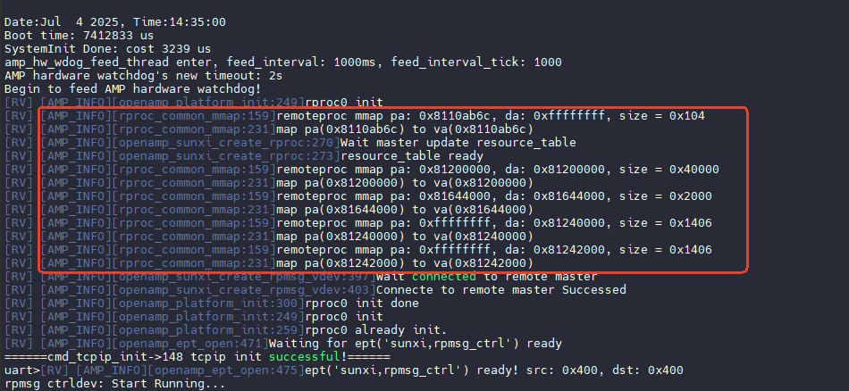

大核将维护与小核一致的结构体，直接在小核的对应地址进行赋值，将资源表初始化给小核

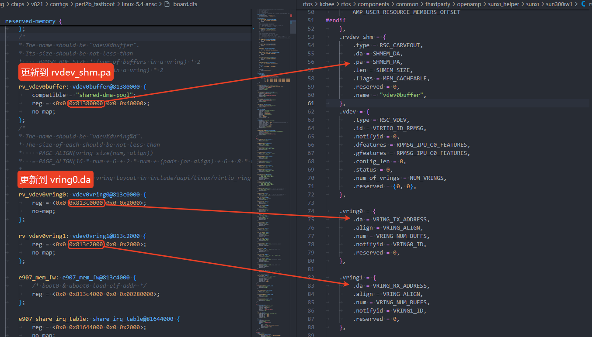

当赋值完成，小核便拥有了大核分配的可使用的地址，此时便可开始异构通讯。

## Linux 调试节点

在 remoteproc 框架中的 `remoteproc_debugfs.c` 和 `remoteproc_sysfs.c` 中分别创建了debugfs和sysfs节点。

### sysfs 节点

在remoteproc框架中向用户提供了**coredump、recovery、firmware、state、name**节点，其路径如下：

```shell
/sys/class/remoteproc/remoteproc0/state
/sys/class/remoteproc/remoteproc0/name
/sys/class/remoteproc/remoteproc0/firmware
/sys/class/remoteproc/remoteproc0/recovery
/sys/class/remoteproc/remoteproc0/coredump
```

其作用分别为：

-   **state**：通过输入不同的命令来控制远程处理器的状态；
-   **name**：显示远程处理器的名称；
-   **firmware**：通过输入来修改固件名称；
-   **recovery**：recovery 的内容可以是 enabled、disabled 或 recovery 三者之一，用于控制恢复机制的行为。
    -   enabled 表示远程处理器将在崩溃时可以自动恢复；
    -   disabled 表示远程处理器在崩溃时将保持崩溃状态；
    -   recovery 表示如果远程处理器处于崩溃状态，此功能将触发立即恢复，而不用手动更改或检查恢复状态（启用/禁用）。
-   **coredump**：coredump的内容可以是 inline、disabled 或default三者之一，用于控制核心转储机制的行为。
    -   inline 表示coredump 不会被复制到单独的缓冲区，恢复过程必须等到数据被用户空间读取；
    -   disabled 表示这是默认的核心转储机制。恢复将在不收集任何转储的情况下继续进行；
    -   enabled 表示当 remoteproc 崩溃时，整个核心转储将被复制到一个单独的缓冲区并暴露给用户空间。

### debugfs 节点

在 remoteproc 框架中向用户提供了**name、recovery、crash、resource\_table、carveout\_memories、coredump、aw\_trace\_log、aw\_trace\_event**节点，其路径如下：

```shell
/sys/kernel/debug/remoteproc/remoteproc0/name
/sys/kernel/debug/remoteproc/remoteproc0/recovery
/sys/kernel/debug/remoteproc/remoteproc0/crash
/sys/kernel/debug/remoteproc/remoteproc0/resource_table
/sys/kernel/debug/remoteproc/remoteproc0/carveout_memories
/sys/kernel/debug/remoteproc/remoteproc0/coredump
/sys/kernel/debug/remoteproc/remoteproc0/aw_trace_log 
/sys/kernel/debug/remoteproc/remoteproc0/aw_trace_event
```

其作用分别为：

-   **name**：显示远程处理器的名称；
-   **recovery**：recovery 的内容可以是 enabled、disabled 或 recovery 三者之一，用于控制恢复机制的行为。
    -   enabled 表示远程处理器将在崩溃时可以自动恢复；
    -   disabled 表示远程处理器在崩溃时将保持崩溃状态；
    -   recovery 表示如果远程处理器处于崩溃状态，此功能将触发立即恢复，而不用手动更改或检查恢复状态（启用/禁用）。
-   **crash**：记录系统崩溃时候的有关信息；
-   **resource\_table**：记录了小核的资源信息（资源表）；
-   **carveout\_memories**：记录小核的内存分配情况；
-   **coredump**：coredump的内容可以是 inline、disabled 或default三者之一，用于控制核心转储机制的行为。
    -   inline 表示coredump 不会被复制到单独的缓冲区，恢复过程必须等到数据被用户空间读取；
    -   disabled 表示这是默认的核心转储机制。恢复将在不收集任何转储的情况下继续进行；
    -   enabled 表示当 remoteproc 崩溃时，整个核心转储将被复制到一个单独的缓冲区并暴露给用户空间。
-   **aw\_trace\_log**：查看小核系统运行过程中的日志。
-   **aw\_trace\_event**：查看小核的trace event

## 小核AMP控制台

当前SDK中小核的控制台分为 2 个，一个是通过串口进入的串口控制台，另外一个是在 Linux 端通过 amp\_shell 命令进入的 AMP 控制台，AMP 控制台主要提供在 Linux 端远程执行小核固件里的命令并查看命令的输出结果，一般在实际设备未引出小核串口的情况下使用。而串口控制台除了执行命令和查看命令输出结果外还可查看小核系统运行过程中打印的一些日志。AMP控制台配置步骤如下。

### 配置信息

-   大核 Linux 环境需要启用内核配置 `CONFIG_AW_RPMSG_CTRL`

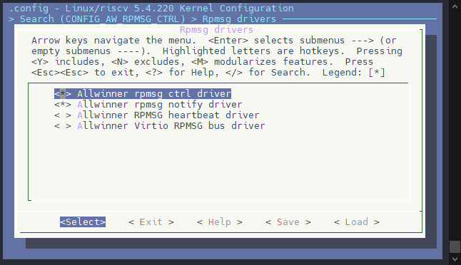

-   软件包配置 `CONFIG_PACKAGE_amp_shell`

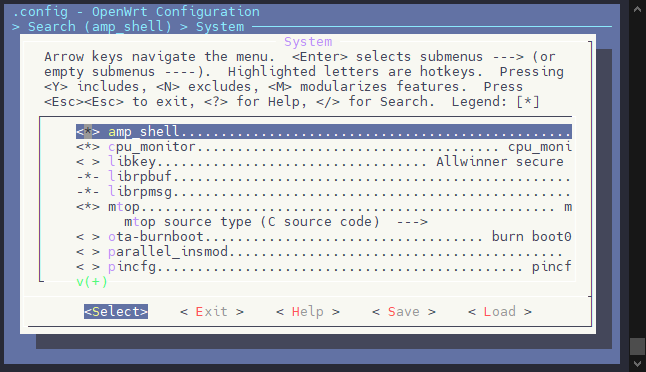

小核 RTOS 环境需要启用如下配置：

-   CONFIG\_RPMSG\_CLIENT
-   CONFIG\_MULTI\_CONSOLE
-   CONFIG\_UART\_MULTI\_CONSOLE
-   CONFIG\_UART\_MULTI\_CONSOLE\_AS\_MAIN
-   CONFIG\_RPMSG\_MULTI\_CONSOLE
-   CONFIG\_RPMSG\_CONSOLE\_CACHE

### 使用示例

在 Linux 终端运行 `amp_shell -d /dev/rpmsg_ctrl-e907_rproc@43030000` 可以进入 RV 核AMP控制台。

```
amp_shell -d /dev/rpmsg_ctrl-e907_rproc@43030000
```

amp\_shell 命令参数说明：

-   `-d devname`：指定要与哪个远端处理器建立连接，可使用 `ls /dev/rpmsg_ctrl*` 查看可用的设备文件。
-   `-e: cmd` ：不进入交互式控制台，只执行命令

:::tip

:::note

提示

:::
:::note

可使用命令 `amp_exit` 退出 AMP 控制台

:::

:::

### 注意事项

如果出现 `Failed to create auto free endpoint` 则是小核没有开启 `CONFIG_RPMSG_MULTI_CONSOLE` 和 `CONFIG_RPMSG_CONSOLE_CACHE` 配置

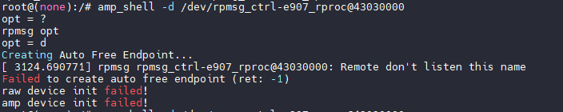

## 小核日志获取

由于 AMP 控制台只能用来执行命令并查看命令输出结果，因此在未引出小核串口的情况下若需要获取小核系统运行过程中打印的日志则需要使用 `AMP trace log` 功能。

`AMP trace log` 的实现机制说明：

-   异构系统会从 DDR SDRAM 中开辟（carveout）出一段空间用作小核的运行内存，代码段、数据段、BSS段、堆栈都在这段内存当中；
-   小核在 BSS 段中定义一个全局的数组 `amp_log_buffer`，将这个 `trace buffer` 的 `address` 和 `len`，通过 `resource table` 传递给大核
-   小核的 `printf` 打印日志接口会同步将日志写入 `amp_log_buffer`
-   大核解析 `resource table` 获得 `trace buffer` 的 `address` 和 `len`，然后从相应的内存中，读取 `trace log`

```
cat /sys/kernel/debug/remoteproc/remoteproc0/aw_trace_log
```

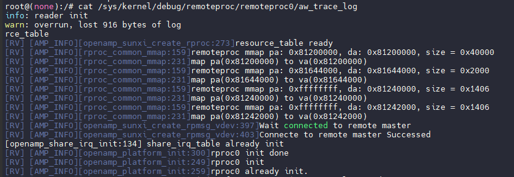

如果希望大核实时输出小核的日志到控制台，使用这个命令即可

```
tail -f /sys/kernel/debug/remoteproc/remoteproc0/aw_trace_log > /dev/console &
```

如果出现找不到 `tail` 命令，需要在 `make menuconfig` 将其开启。

### 配置信息

大核 Linux 环境需要启用内核配置 `CONFIG_AW_RPROC_ENHANCED_TRACE`。

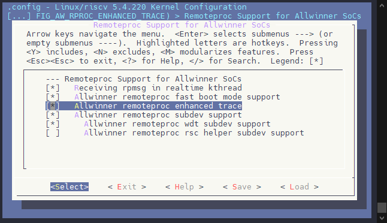

小核RTOS环境需要启用配置 `CONFIG_AMP_TRACE_SUPPORT`。

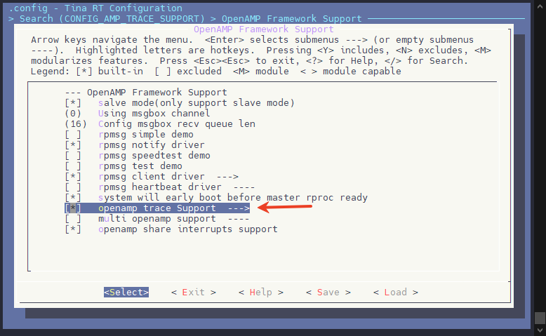

:::info

:::note

信息

:::
:::note

RTOS 环境下可通过配置 `CONFIG_AMP_TRACE_BUF_SIZE` 来修改 `trace buffer` 的大小，此 `buffer` 对应的内存来自 `RTOS` 环境的一个全局数组，定义在`rtos/lichee/rtos-components/thirdparty/openamp/trace_log/openamp_log.c` 文件里，因此配置 `CONFIG_AMP_TRACE_BUF_SIZE` 的值决定了此全局数组占用的内存大小。

:::

:::

## 小核内存区域划分

当前 SDK 中小核使用的内存区域按使用者分类主要分为临时内存区域、专用内存区域和共享内存区域，其中共享内存区域主要用于核间通信、共享中断等功能。

以 perf2b\_fastboot 为例，其内存布局示例如下所示：

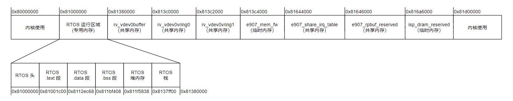

### 临时内存区域

小核若是在 BOOT0 启动，则需要在启动阶段保留这段 `elf` 固件供大核解析共享资源表地址以建立异构通讯，这块内存在大核解析完成后便会释放，小核并不在这块地址运行（BOOT0 会重定向到 `elf` 指定的运行地址），他只是一段暂存固件的地址。其定义如下：

```c
e907_mem_fw: e907_mem_fw@813c4000 {
	/* boot0 & uboot0 load elf addr */
	reg = <0x0 0x813c4000 0x0 0x00280000>;
};
```

若是快起系统，还有一块 ISP 临时地址区域，存放小核使用 ISP 时的一些算法数据，这块内存在大核初始化 VIN 后释放回大核使用

```c
isp_dram_reserved:isp_dram@816a6000 {
	reg = <0x0 0x816a6000 0x0 0x0065A000>;
};
```

### 专用内存区域

小核使用的专用内存区域主要包含小核的运行内存区域，不排除未来可能新增其他专用内存区域。这块内存是小核的运行地址，

```c
rv_ddr_reserved: rvddrreserved@81000000 {
	reg = <0x0 0x81000000 0x0 0x380000>;
	no-map;
};
```

另外小核也需要配置为同样的地址，否则将会出现小核踩大核内存的问题

```
CONFIG_ARCH_START_ADDRESS=0x81000000
CONFIG_ARCH_MEM_LENGTH=0x380000
```

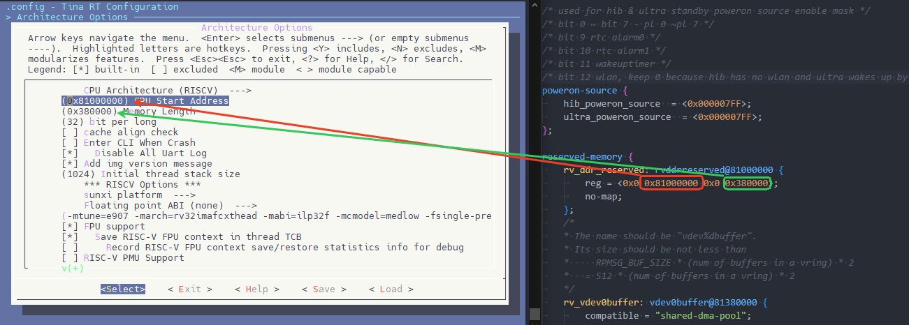

### 共享内存区域

从核使用的共享内存区域目前主要包含如下几个：

-   用于 `rpmsg` 通信的 `vdev0buffer`、`vdev0vring0` 和 `vdev0vring1` 保留内存

```c
rv_vdev0buffer: vdev0buffer@81380000 {
	compatible = "shared-dma-pool";
	reg = <0x0 0x81380000 0x0 0x40000>;
	no-map;
};

rv_vdev0vring0: vdev0vring0@813c0000 {
	reg = <0x0 0x813c0000 0x0 0x2000>;
	no-map;
};

rv_vdev0vring1: vdev0vring1@813c2000 {
	reg = <0x0 0x813c2000 0x0 0x2000>;
	no-map;
};
```

-   用于 `rpbuf` 通信的保留内存 `e907_rpbuf_reserved`

```
e907_rpbuf_reserved:e907_rpbuf@81646000 {
	compatible = "shared-dma-pool";
	reg = <0x0 0x81646000 0x0 0x60000>;
	no-map;
};
```

-   用于共享中断功能的 `share_irq_table` 保留内存

```
e907_share_irq_table: share_irq_table@81644000 {
	reg = <0x0 0x81644000 0x0 0x2000>;
	no-map;
};
```

### 共享内存布局修改

#### **RTOS 内存布局**注意事项

-   在设计 RTOS 方案时，**内核无法释放的内存**（如 `no-map` 内存）应紧跟在 RTOS 内存之后进行分配。例如：
    
    -   `rv_vdev0buffer`
    -   `vdev0vring0`
    -   `vdev0vring1`
    -   `e907_rpbuf_reserved`
    -   `irq`
    -   ...其他 no-map 内存
    
    这些内存区域不应与其他系统内存冲突，以保证内存的合理利用和系统的稳定运行。
    
-   RV32 内核的起始地址必须是 **4MB 对齐**，确保内存分配的正确性和系统启动时不会发生问题。
    
    -   可能的起始地址选择：
        
        -   0x0
        -   0x400000
    -   **注意**：不正确的内核起始地址配置会导致系统无法启动，必须选择合适的对齐地址。
        
        -   如果选择将内核的起始地址配置在 `0x400000`（4MB对齐）时，**0x0 到 0x400000** 区域的内存将无法使用。这是由于 RV32 内核 VM 是线性内存排布的限制。这部分内存会被内核标记为 `ignore`，即使该区域没有被其他程序占用，**也无法使用**，导致内存资源浪费。
-   **OpenSBI** 的内存地址必须是 **固定的**，并且设置 **PMP（物理内存保护）** 保护。
    
    -   OpenSBI 的地址应配置在一个**特定的位置**，避免随意挪动。这是确保系统稳定性、资源合理分配和安全性的关键。
    -   OpenSBI 起始地址需要 128K 对齐

#### 内存区域配置

从核使用的内存区域地址可以灵活调整，只要确保这些地址不与 Linux 环境中其他保留内存区域发生冲突。特别是当涉及到共享内存区域时，它们的配置需要同时考虑 Linux 设备树（DTS）配置和 RTOS 环境配置。

-   **内存区域更新同步**：当从核的运行内存区域发生更改时，需要同时在 Linux 设备树（DTS）和 RTOS 的配置中进行更新。这是因为从核运行的内存区域与Linux 内核之间存在紧密的耦合，且在 RTOS 启动时，相关配置也会影响到内存区域的访问。
-   **避免内存冲突**：需要确保从核使用的内存区域与 Linux 的保留内存区域不发生重叠。

#### 内存区域布局优化

由于共享内存区域的数量通常较多，且这些区域会被从核修改（除了共享中断的内存区域不会被修改），为了避免配置复杂度，可以采取以下优化措施：

-   **内存区域相邻配置**：为了减少配置条目的需求，建议将所有会被从核修改的内存区域配置为相邻的内存区域。具体来说，不同内存区域之间应当避免出现空洞（即，前一个区域的结束地址+1 应该等于下一个区域的起始地址）。这种方式有助于减少从核对内存区域进行访问控制时的配置复杂度。
-   **MPU配置优化**：RISC-V架构中的MPU配置条目可能有限。因此，合理安排共享内存区域的布局，避免在内存区域之间留有空洞，可以有效减少MPU配置条目的消耗。将相邻的共享内存区域合并到一个配置条目中，避免MPU配置条目不足的情况。
-   **减少MPU配置条目冲突**：通过优化内存区域的布局，可以最大限度地减少对多个MPU条目的需求，从而确保内存保护配置能有效应用于所有共享内存区域。这有助于防止因MPU条目不足而导致的系统异常或访问错误。
-   **临时内存配置**：临时内存建议放到共享内存的后面，不要夹在共享内存中间，方便后期释放内核可以分配出完整连续的内存。

#### 修改示例

在开发中，不免需要修改内存，这里的内存需要多块区间同时修改，包括

1.  SPL 中 RTOS 的预加载地址
2.  RTOS 的起始地址，内存大小
3.  ISP 等功能的预留地址

下面将以 `perf2b_fastboot` 为例，按照内存布局表格修改内存布局，演示需要修改的部分

| 内存类型 | 原内存起始地址 | 原内存长度 | 新内存起始地址 | 新内存长度 | 修改说明 |
| --- | --- | --- | --- | --- | --- |
| rv\_ddr\_reserved | 0x81000000 | 0x380000 | 0x80860000 | 0x300000 | 修改起始地址 |
| rv\_vdev0buffer | 0x81380000 | 0x40000 | 0x80B60000 | 0x40000 | 紧凑内存布局，跟着修改 |
| rv\_vdev0vring0 | 0x813c0000 | 0x2000 | 0x80BA0000 | 0x2000 | 紧凑内存布局，跟着修改 |
| rv\_vdev0vring1 | 0x813c2000 | 0x2000 | 0x80BA2000 | 0x2000 | 紧凑内存布局，跟着修改 |
| e907\_mem\_fw | 0x813c4000 | 0x280000 | 0x82E00000 | 0x25B000 | 减少内存大小，放到后半，给内核连续可申请内存 |
| e907\_share\_irq\_table | 0x81644000 | 0x2000 | 0x80BA4000 | 0x2000 | 紧凑内存布局，跟在 `rv_vdev0vring1` 后面 |
| e907\_rpbuf\_reserved | 0x81646000 | 0x60000 | 0x80BA6000 | 0x40000 | 紧凑内存布局，跟在 `e907_share_irq_table` 后面 |
| isp\_dram\_reserved | 0x816a6000 | 0x65A000 | 0x8305B000 | 0x8d0000 | 增加内存大小 |

-   **设备树地址布局修改**

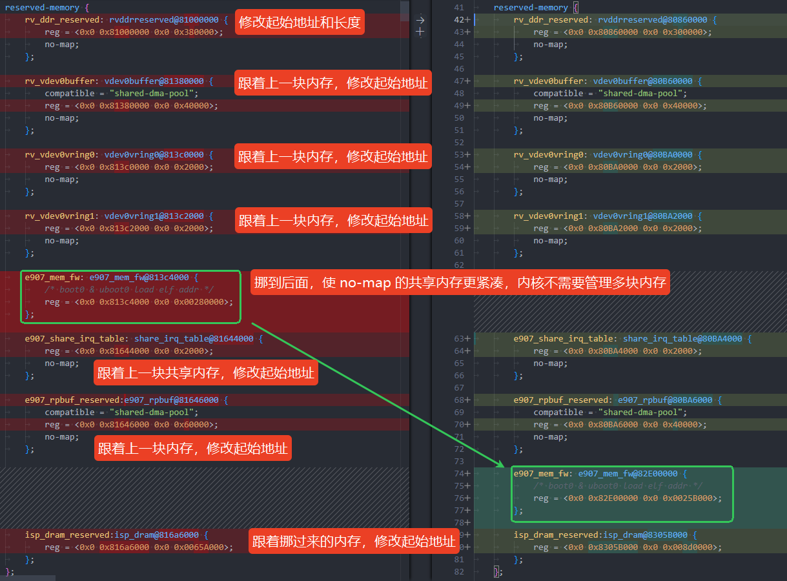

```diff
diff --git a/board.dts b/board.dts
index 4616ea2..19ed113 100755
--- a/configs/perf2b_fastboot/linux-5.4-ansc/board.dts
+++ b/configs/perf2b_fastboot/linux-5.4-ansc/board.dts
@@ -39,45 +39,45 @@
	};

	reserved-memory {
-		rv_ddr_reserved: rvddrreserved@81000000 {
-			reg = <0x0 0x81000000 0x0 0x380000>;
+		rv_ddr_reserved: rvddrreserved@80860000 {
+			reg = <0x0 0x80860000 0x0 0x300000>;
			no-map;
		};

-		rv_vdev0buffer: vdev0buffer@81380000 {
+		rv_vdev0buffer: vdev0buffer@80B60000 {
			compatible = "shared-dma-pool";
-			reg = <0x0 0x81380000 0x0 0x40000>;
+			reg = <0x0 0x80B60000 0x0 0x40000>;
			no-map;
		};

-		rv_vdev0vring0: vdev0vring0@813c0000 {
-			reg = <0x0 0x813c0000 0x0 0x2000>;
+		rv_vdev0vring0: vdev0vring0@80BA0000 {
+			reg = <0x0 0x80BA0000 0x0 0x2000>;
			no-map;
		};

-		rv_vdev0vring1: vdev0vring1@813c2000 {
-			reg = <0x0 0x813c2000 0x0 0x2000>;
+		rv_vdev0vring1: vdev0vring1@80BA2000 {
+			reg = <0x0 0x80BA2000 0x0 0x2000>;
			no-map;
		};

-		e907_mem_fw: e907_mem_fw@813c4000 {
-			/* boot0 & uboot0 load elf addr */
-			reg = <0x0 0x813c4000 0x0 0x00280000>;
-		};
-
-		e907_share_irq_table: share_irq_table@81644000 {
-			reg = <0x0 0x81644000 0x0 0x2000>;
+		e907_share_irq_table: share_irq_table@80BA4000 {
+			reg = <0x0 0x80BA4000 0x0 0x2000>;
			no-map;
		};

-		e907_rpbuf_reserved:e907_rpbuf@81646000 {
+		e907_rpbuf_reserved: e907_rpbuf@80BA6000 {
			compatible = "shared-dma-pool";
-			reg = <0x0 0x81646000 0x0 0x60000>;
+			reg = <0x0 0x80BA6000 0x0 0x40000>;
			no-map;
		};

-		isp_dram_reserved:isp_dram@816a6000 {
-			reg = <0x0 0x816a6000 0x0 0x0065A000>;
+		e907_mem_fw: e907_mem_fw@82E00000 {
+			/* boot0 & uboot0 load elf addr */
+			reg = <0x0 0x82E00000 0x0 0x0025B000>;
+		};
+
+		isp_dram_reserved:isp_dram@8305B000 {
+			reg = <0x0 0x8305B000 0x0 0x008d0000>;
		};
	};
```

-   **配置 SPL 中小核 `elf` 加载地址**

首先检查一下，是否启用了设备树与 SPL 的联动机制，查看板级目录下的 `BoardConfig_nor.mk` 文件，看看有没有配置`LICHEE_GEN_BOOT0_DTS_INFO:=yes`

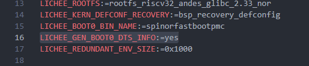

如果这个没有配置，可以增加配置使用联动机制（增加配置后需要重新 `source build/envsetup.sh && lunch` 应用配置），也可以修改文件 `brandy/brandy-2.0/spl/include/configs/sun300iw1p1.h` 配置宏 `CONFIG_RTOS_LOAD_ADDR`

brandy/brandy-2.0/spl/include/configs/sun300iw1p1.h

```c
#define CONFIG_RTOS_LOAD_ADDR             SDRAM_OFFSET(0x00860000)
```

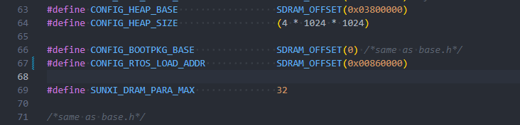

-   **配置 SPL 中小核 ISP 参数地址（快起使用 ISP 参数功能需要配）**

首先确认当前方案使用的配置文件，这里以 perf2b\_fastboot 板级为例，查看 `BoardConfig_nor.mk` 和 `BoardConfig.mk` 中配置的 `LICHEE_BOOT0_BIN_NAME`，分布对应 SPI NOR 方案与 eMMC 方案下使用的 BOOT0 配置。

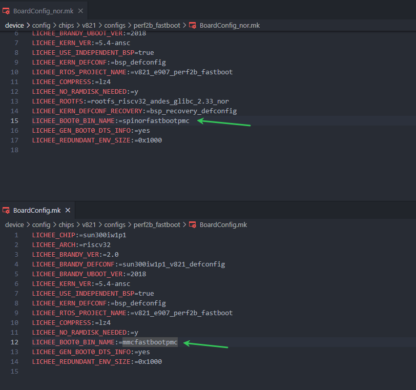

如果 `BoardConfig_nor.mk` 和 `BoardConfig.mk`中没有配置 `LICHEE_BOOT0_BIN_NAME` ，则标识方案使用默认配置，根据具体存储器件选择 `mmc.mk`，`spinor.mk`，`nand.mk` 即可

| 软件方案 | 存储器件 | 配置文件 |
| --- | --- | --- |
| 普通 | SPI NOR | `brandy/brandy-2.0/spl/board/sun300iw1p1/spinor.mk` |
| 普通 | SPI NAND | `brandy/brandy-2.0/spl/board/sun300iw1p1/nand.mk` |
| 普通 | eMMC/SD NAND | `brandy/brandy-2.0/spl/board/sun300iw1p1/mmc.mk` |
| 快起 | SPI NOR | `brandy/brandy-2.0/spl/board/sun300iw1p1/spinorfastboot.mk` |
| 快起 | eMMC/SD NAND | `brandy/brandy-2.0/spl/board/sun300iw1p1/mmcfastboot.mk` |

前往 `brandy/brandy-2.0/spl/board/sun300iw1p1` 找到配置文件

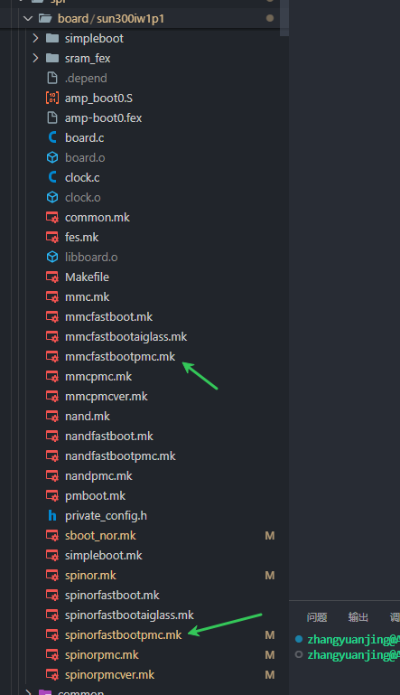

修改对应配置文件的 ISP 参数保存地址，这个地址位于 `isp_dram_reserved` 的末尾

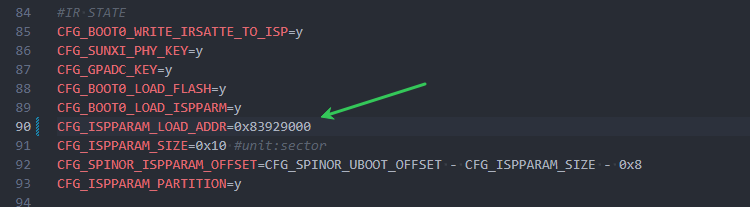

-   **配置 RTOS 启动地址**

执行 `mrtos menuconfig` 配置 RTOS 的内存，这块内存需要与 `rv_ddr_reserved` 设备树配置的一致。

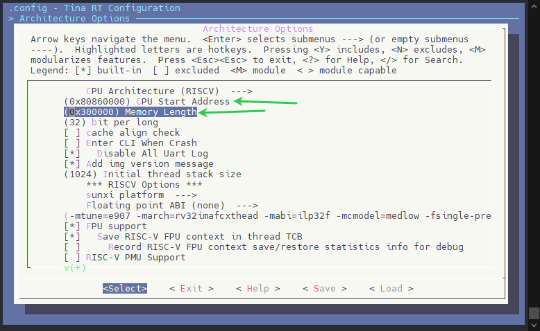

-   **配置 ISP 预留地址（快起配置）**

执行 `mrtos menuconfig` 配置 ISP 的预留内存，这块内存需要与 `isp_dram_reserved` 设备树配置的一致。

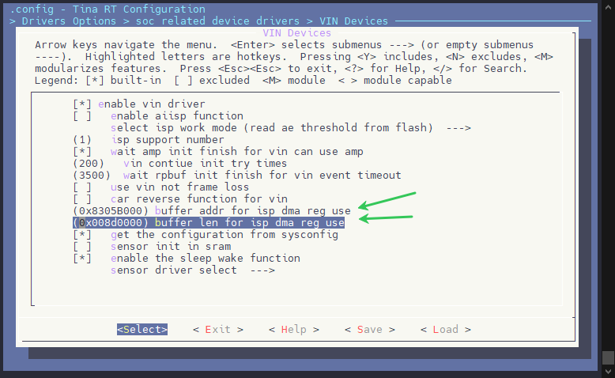

-   **配置 RTOS ISP 参数预留地址（快起使用 ISP 参数功能需要配）**

修改代码 `rtos/lichee/rtos-hal/hal/source/vin/vin_isp/isp_server/isp_server.h` 中配置宏的地址

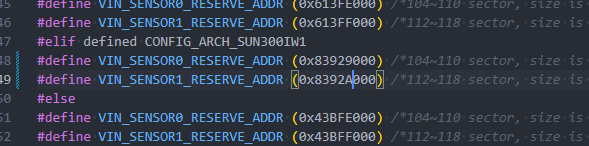

-   **配置 Linux ISP 参数预留地址（快起使用 ISP 参数功能需要配）**

进入内核 `menuconfig` 找到配置修改即可

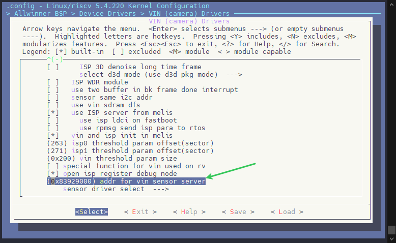

## 大核和小核共享中断

随着多核异构处理器的流行，外设中断的分配成为 AMP 场景下一个急需解决的问题，一级中断控制器控制的外设中断的分配在 AMP 场景下比较容易解决，由于一级中断控制器一般是每个 CPU 对应一个，不同 CPU 上运行的软件提前协商好某个外设中断在哪个 CPU 上处理，其他 CPU 对应的一级中断控制器禁用此外设中断即可。

但到了二级和二级以上的中断控制器时就无法简单的通过在某个 CPU 上禁用中断控制器控制的某个外设中断解决了，这些中断控制器一般是全局的，并非每个CPU 一个，以二级中断控制器为例：二级中断控制器汇聚多个中断源为一个中断信号后同时连接到多个 CPU 对应的一级中断控制器上，这些二级中断控制器控制的不同中断只要有其中一个触发，多个 CPU 都会进入对应的中断处理函数，即使触发的中断并不是分配给当前 CPU 的。

二级中断控制器的典型示例为 GPIO 中断控制器：GPIO 控制器内集成了一个比较简单的中断控制器，其将一个 GPIO 组内的所有 GPIO 的外部中断汇聚成一个中断信号然后连接到一级中断控制器上。如下图所示。

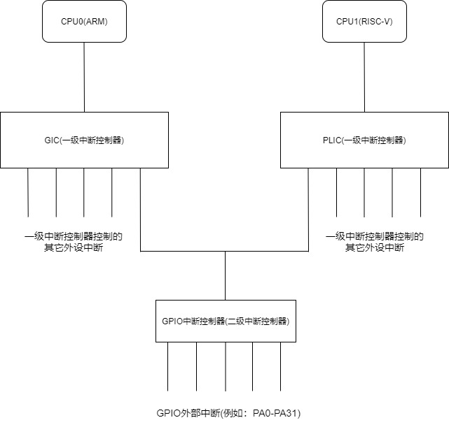

因此，为了解决 AMP 场景下外设中断的分配问题，在软件层面上设计了共享中断模块。

共享中断模块使用一块共享内存来记录某个外设中断被分配到哪个核处理，且在对应中断控制器的驱动代码里根据中断分配信息判断当前中断是否由本CPU核处理。

### 配置共享中断

RTOS 中需要勾选 `CONFIG_AMP_SHARE_IRQ` 驱动

```
System components  --->
thirdparty components  --->
	OpenAMP Support  --->
	[*]     openamp share interrupts support
```

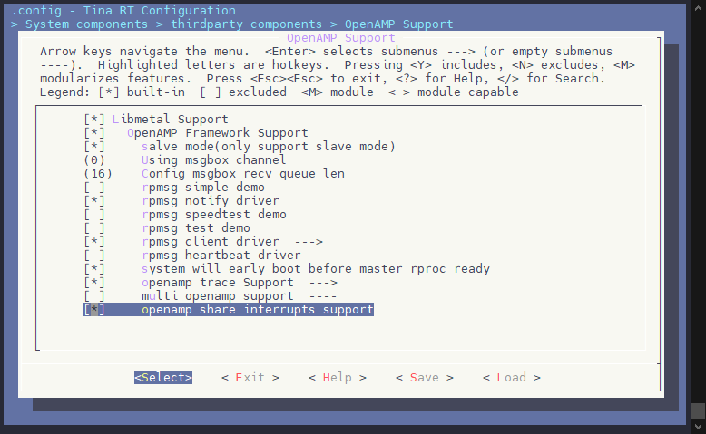

Linux 内核需要启用 `CONFIG_SUNXI_RPROC_SHARE_IRQ`

```
Allwinner BSP  --->
Device Drivers  --->
	Remoteproc drivers  --->
	[*]   SUNXI remote share irq support
```

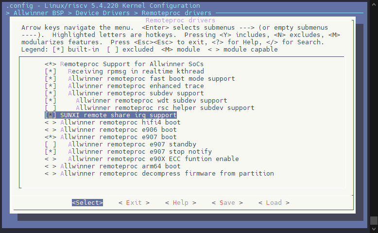

设备树中需要增加共享中断表的保留内存区域，配置具体的中断分配信息节点，并且在 `e907_rproc` 中引用该内存。

```c
/{
	reserved-memory {
		e907_share_irq_table: share_irq_table@81644000 {
			reg = <0x0 0x81644000 0x0 0x2000>;
			no-map;
		};
	};
	
	reserved-irq {
		share-e907 {
			arch-name = "e907";
			memory-region = <&e907_share_irq_table>;
			/* defined by sun300iw1-share-irq-dt.h */
			share-irq =
					<1    0x1    E907_PA_IRQ_NUM    A27_PA_IRQ_NUM    0x00000000>,
					<3    0x3    E907_PC_IRQ_NUM    A27_PC_IRQ_NUM    0x00000000>,
					<4    0x4    E907_PD_IRQ_NUM    A27_PD_IRQ_NUM    0x00000000>,
					<12   0xc    E907_PL_IRQ_NUM    A27_PL_IRQ_NUM    0x00000000>;
		};
	};
};
```

中断分配信息节点包含三个主要属性：

1.  **arch-name**：

-   用于标识此中断分配信息对应的远程处理器（remoteproc）。
-   该值需与远程处理器配置中的 `share-irq` 属性值一致。

2.  **memory-region**：

-   用于标识保存中断分配信息的内存区域。

3.  **share-irq**（数组）：

-   数组中的每五个数值构成一组，描述一个 GPIO 组内每个 GPIO 外部中断的分配信息。
-   **第1个数值（id）**：该值需要与 `share_irq_table` 数组中每个元素的 `major` 成员一致。对于 `sun55iw3`，可以在 `bsp/drivers/remoteproc/sunxi_share_interrupt/xxx-share-irq.h` 文件中找到 `share_irq_table` 数组。
-   **第2个数值（中断类型）**：从1开始，表示对应的 GPIO 中断类型。例如，1为 GPIOA 中断，2为 GPIOB 中断，依此类推。
-   **第3个数值（远端处理器中断号）**：表示远端处理器的中断号。宏定义可以在 `bsp/include/dt-bindings/gpio/xxx-share-irq-dt.h` 中找到生成中断号的宏。
-   **第4个数值（本端处理器中断号）**：表示本端处理器的中断号，宏定义同样可在 `bsp/include/dt-bindings/gpio/xxx-share-irq-dt.h` 中找到。
-   **第5个数值（中断分配信息的掩码）**：该掩码用来表明 GPIO 组内的 GPIO 外部中断是分配给本端处理器还是远端处理器。
    -   对应位为 `0` 时，表示分配给本端处理器。
    -   对应位为 `1` 时，表示分配给远端处理器。

相应 `remoteproc` 节点下增加 `share-irq` 属性，属性值和中断分配信息节点里的 `arch-name` 属性值一致，另外还需在原有的 `memory-region` 属性值的基础上增加保留内存对应的内存区域。

```c
&e907_rproc {
	firmware-name = "amp_rv0.bin";
	mboxes = <&msgbox 0>;
	mbox-names = "arm-kick";
	auto-boot;
	skip-shutdown;
	fw-region = <&e907_mem_fw>;
	memory-region = <&rv_ddr_reserved>,
		<&rv_vdev0buffer>,
		<&rv_vdev0vring0>,
		<&rv_vdev0vring1>,
		<&e907_share_irq_table>;
	fw-partitions = "riscv0", "riscv0-r";
	fw-partition-sectors = <4096>;
	memory-mappings =
	/* < DA         len             PA >    */
	/* SRAM ISP */
	< 0x2000000        0xa800        0x2000000 >,
	/* SRAM VE */
	< 0x200a800        0x17400       0x200a800 >,
	/* SRAM WIFI */
	< 0x68000000       0x1000000     0x68000000 >,
	/* DRAM */
	< 0x80000000       0x0fffffff    0x80000000 >;
	stop-record-reg = <0x4a00020c>;
	share-irq = "e907";
	status = "okay";

	rproc_wdt: rproc_wdt@0 {
		timeout_ms = <6000>;
		try_times = <1>;
		reset_type = <0x2>;
		panic_on_timeout = <1>;
		status = "okay";
	};
};
```

### 共享中断注意事项

1.  共享中断模块目前只支持GPIO中断控制器这个二级中断控制器控制的中断，一级中断控制器控制的外设中断不支持。
2.  若同一个GPIO组内的不同GPIO外部中断分配到超过2个CPU核上，可通过新增中断分配信息节点并正确设置中断分配信息的掩码来支持这种场景。
3.  若一个GPIO组内使用到的GPIO对应的外部中断只会在某一个CPU上处理，可将剩余未复用为外部中断功能的GPIO对应的外部中断也分配给这个CPU处理，此时另外一个CPU不会注册相关的GPIO中断处理函数，可避免另外的CPU不必要的进入GPIO中断处理函数

## 小核异常状态看门狗

小核异常状态获取支持使用 AMP 软件看门狗或 AMP 硬件看门狗。

### AMP软件看门狗

异构通信框架支持 AMP 软件看门狗功能，即 `rpmsg heartbeat` 功能，早期也被称为心跳保活。当小核因为异常或跑飞等原因导致无法继续发送心跳数据给大核后，大核可以检测到小核此时未正常运行，并重新启动小核，配置步骤如下：

大核 Linux 环境需要启用内核配置 `CONFIG_AW_RPMSG_HEARTBEAT`。

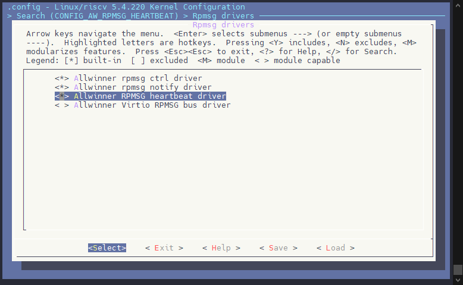

小核 RTOS 环境需要启用配置 `CONFIG_RPMSG_HEARBEAT`。

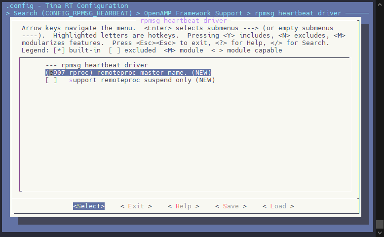

需要注意的是小核 RTOS 的 `rpmsg heartbeat` 配置目录下的 `CONFIG_RPMSG_REMOTE_NAME` 配置需要与 Linux 端 `board.dts` 里 `remoteproc dts` 节点的名字保持一致，如下：

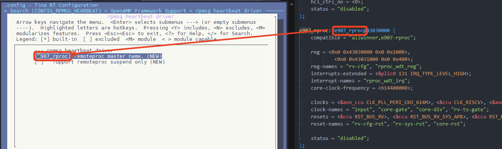

在小核系统控制台执行 `panic` 命令让小核崩溃，之后大核 Linux 端会收到小核崩溃信息。

### AMP硬件看门狗

由于 AMP 软件看门狗使用了 `rpmsg`，若 RTOS 端 `rpmsg` 通信出现问题会导致 Linux 端认为小核运行异常，因此使用硬件看门狗来检测小核运行状态会更加可靠。

大核 Linux 环境需要启用内核配置 `CONFIG_AW_RPROC_SUBDEV` 和 `CONFIG_AW_RPROC_SUBDEV_WDT`。

大核 Linux 环境 dts 配置中 `remoteproc` 节点需要增加 `reg`、`reg-names`、`interrputs` 以及 `interrupt-names` 这些 Linux 内核支持的标准属性：

sun300iw1p1.dtsi

```c
e907_rproc: e907_rproc@43030000 {
	compatible = "allwinner,e907-rproc";

	reg = <0x0 0x43030000 0x0 0x1000>,
		<0x0 0x43031000 0x0 0x400>;
	reg-names = "rv-cfg",
			"rproc_wdt_reg";
	interrupts-extended = <&plic0 131 IRQ_TYPE_LEVEL_HIGH>;
	interrupt-names = "rproc_wdt_irq";
	core-clock-frequency = <614400000>;

	clocks = <&aon_ccu CLK_PLL_PERI_CKO_614M>, <&ccu CLK_RISCV>, <&aon_ccu CLK_E907>, <&ccu CLK_E907_TS>;
	clock-names = "input", "core-gate", "core-div", "rv-ts-gate";
	resets = <&ccu RST_BUS_RV>, <&ccu RST_BUS_RV_SYS_APB>, <&ccu RST_BUS_E907>;
	reset-names = "rv-cfg-rst", "rv-sys-rst", "core-rst";

	status = "disabled";
};
```

另外 `remoteproc` 节点内还需要增加 `rproc_wdt` 子节点以及相关属性：

```c
&e907_rproc {
	firmware-name = "amp_rv0.bin";
	mboxes = <&msgbox 0>;
	mbox-names = "arm-kick";
	auto-boot;
	skip-shutdown;
	fw-region = <&e907_mem_fw>;
	memory-region = <&rv_ddr_reserved>, <&rv_vdev0buffer>, <&rv_vdev0vring0>, <&rv_vdev0vring1>, <&e907_share_irq_table>;
	fw-partitions = "riscv0", "riscv0-r";
	fw-partition-sectors = <4096>;
	memory-mappings =
	/* < DA         len             PA >    */
	/* SRAM ISP */
	< 0x2000000        0xa800        0x2000000 >,
	/* SRAM VE */
	< 0x200a800        0x17400       0x200a800 >,
	/* SRAM WIFI */
	< 0x68000000       0x1000000     0x68000000 >,
	/* DRAM */
	< 0x80000000       0x0fffffff    0x80000000 >;
	stop-record-reg = <0x4a00020c>;

	share-irq = "e907";
	status = "okay";
	rproc_wdt: rproc_wdt@0 {
		timeout_ms = <6000>;
		try_times = <1>;
		reset_type = <0x2>;
		panic_on_timeout = <1>;
		status = "okay";
	};
};
```

**rproc\_wdt 子节点属性说明**：

1.  **`timeout_ms`**:
    -   **描述**：这是Linux端初始化AMP硬件看门狗时配置的超时时间，单位为毫秒（ms）。在此超时之后，如果没有收到看门狗喂狗信号，系统将触发重启或其他指定行为。
    -   **类型**：整型数值。
    -   **默认值**：可根据具体硬件或使用需求设置，通常为6000ms（5秒）或更长。
2.  **`try_times`**:
    -   **描述**：当AMP硬件看门狗检测到远程处理器（remoteproc）状态异常时，Linux端将尝试重新启动远程处理器的次数。如果尝试次数达到此值，系统可能会进入故障处理状态。
    -   **类型**：整型数值。
    -   **默认值**：通常为1或更高，表示最多尝试1次。
3.  **`reset_type`**:
    -   **描述**：AMP硬件看门狗的复位类型。
        -   `1`：复位整个系统（通常不用于AMP场景）。
        -   `2`：仅复位远程处理器并发送中断信号，这在AMP场景下通常使用。
    -   **类型**：整型数值，通常为2。
    -   **默认值**：2。
4.  **`panic_on_timeout`**:
    -   **描述**：AMP硬件看门狗是否将大核 `panic` ，而不进行重启小核的尝试。
        -   `0`：关闭功能。
        -   `1`：当小核崩溃时 `panic` 大核
    -   **类型**：整型数值，通常为1。
    -   **默认值**：1。
5.  **`status`**:
    -   **描述**：此属性表示 `rproc_wdt` 的状态。设置为 "okay" 或 "ok" 表示AMP硬件看门狗已启用并生效，其他值（如 "disabled" 或 "none"）则表示不启用。
    -   **类型**：字符串。
    -   **默认值**："okay" 或 "ok"（表示启用）。

**RTOS 环境中相关配置说明**：

```
CONFIG_COMPONENTS_AMP_HW_WATCHDOG=y
CONFIG_AMP_HW_WATCHDOG_TIMEOUT=2
CONFIG_AMP_HW_WATCHDOG_FEED_INTERVAL=1000
CONFIG_AMP_HW_WATCHDOG_THREAD_PRIORITY=31
```

1.  **`CONFIG_COMPONENTS_AMP_HW_WATCHDOG`**:
    -   **描述**：在RTOS端启用AMP硬件看门狗的支持。需要确保该配置项在RTOS配置中开启，才能正确使用AMP硬件看门狗功能。
    -   **默认值**：默认为关闭，需手动启用。
2.  **`CONFIG_AMP_HW_WATCHDOG_TIMEOUT`**:
    -   **描述**：RTOS端启动后配置的AMP硬件看门狗的超时时间，单位为秒（s）。默认为2秒，表示如果AMP看门狗在2秒内没有得到喂狗信号，它将触发相关处理。
    -   **类型**：整型数值（单位：秒）。
    -   **默认值**：2秒。
3.  **`CONFIG_AMP_HW_WATCHDOG_FEED_INTERVAL`**:
    -   **描述**：RTOS端喂AMP硬件看门狗的时间间隔，单位为毫秒（ms）。默认为1000ms，表示每1000ms喂一次狗，以确保AMP看门狗没有超时。
    -   **类型**：整型数值（单位：毫秒）。
    -   **默认值**：1000ms。
4.  **`CONFIG_AMP_HW_WATCHDOG_THREAD_PRIORITY`**:
    -   **描述**：RTOS端喂狗线程的优先级。默认值为31，表示该线程的优先级较低。可以根据实际需求调整优先级，以便在RTOS中实现适当的任务调度。
    -   **类型**：整型数值。
    -   **默认值**：31。

在小核系统控制台执行 `panic` 命令让小核 `crash`，之后大核 Linux 端会打印`detected timeout & report crash, timeout_cnt: 1, try_times: 0`类似日志：

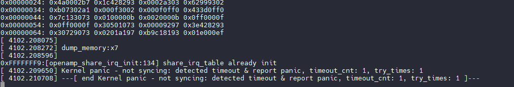

另外会将大核 Linux 也进入 panic 状态。这是因为当小核崩溃后，大核一系列任务都会进入异常导致更大破坏出现。为了保护系统便让 Linux 也崩溃，如果配置了系统看门狗则让系统看门狗重启系统以达到完整恢复的功能。

若当小核崩溃时，不希望大核也崩溃，则可以配置 `panic_on_timeout` 选项为 `0` 则关闭大核崩溃。

```c
&e907_rproc {
	firmware-name = "amp_rv0.bin";
	mboxes = <&msgbox 0>;
	mbox-names = "arm-kick";
	auto-boot;
	skip-shutdown;
	fw-region = <&e907_mem_fw>;
	memory-region = <&rv_ddr_reserved>, <&rv_vdev0buffer>, <&rv_vdev0vring0>, <&rv_vdev0vring1>, <&e907_share_irq_table>;
	fw-partitions = "riscv0", "riscv0-r";
	fw-partition-sectors = <4096>;
	memory-mappings =
	/* < DA         len             PA >    */
	/* SRAM ISP */
	< 0x2000000        0xa800        0x2000000 >,
	/* SRAM VE */
	< 0x200a800        0x17400       0x200a800 >,
	/* SRAM WIFI */
	< 0x68000000       0x1000000     0x68000000 >,
	/* DRAM */
	< 0x80000000       0x0fffffff    0x80000000 >;
	stop-record-reg = <0x4a00020c>;

	share-irq = "e907";
	status = "okay";

	rproc_wdt: rproc_wdt@0 {
		timeout_ms = <6000>;
		try_times = <1>;
		reset_type = <0x2>;
		panic_on_timeout = <0>;
		status = "okay";
	};
};
```

## 小核崩溃日志

小核进入异常状态后，大核 Linux 端自动重启小核前也会主动获取小核系统运行过程中的日志并打印出来。如下所示，小核 `panic` 异常时，大核 Linux 端既输出了内核日志，也输出了小核的日志。

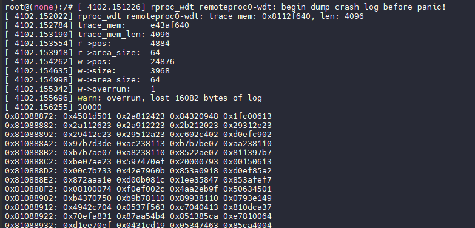

可以看到此时大核 Linux 也进入了 `kernel panic` 状态


另外用户可配置大核 Linux 端的 `CONFIG_AW_RPROC_ENHANCED_TRACE_CRASH_DUMP` 关闭，可禁止在小核异常时输出小核日志到内核日志中。当配置关闭时，小核异常时的详细日志不会输出到内核日志中，小核异常原因可通过类似如下的内核日志来判断，下面这个日志是小核 `panic` 时，大核 Linux 端打印的异常原因：

```
[   39.417880] sunxi-rproc 1a00000.e907_rproc: exception cause: EXC_BREAKPOINT
```

## 大核和小核获取相同时基的时间戳

AMP 场景下大核和小核在有些情况下需要获取相同时间基准的时间戳，比如通信耗时测量，故 SDK 中提供了 AMP 时间戳功能来满足这种需求。

### 配置信息

大核 Linux 环境需要启用内核配置 `CONFIG_AW_AMP_TIMESTAMP`。

大核Linux环境dts配置中需要增加AMP时间戳设备对应的amp\_ts节点以及相关属性：

sun300iw1p1.dtsi

```c
amp_ts0: amp_ts@43032000 {
	compatible = "sunxi,amp_timestamp";
	reg = <0x0 0x43032000 0x0 0x1000>;
	id = <0>;
	counter_type = <THEAD_RISCV_ARCH_COUNTER_TYPE>;
	clocks = <&aon_ccu CLK_DCXO>;
	clock-names = "ts_clk";
	status = "disabled";
};
```

`amp_ts` 节点内各属性(除 Linux 内核支持的标准属性外)说明如下：

-   `id`：AMP 时间戳设备 ID
-   `counter_type`：计数器类型
-   `count_freq`：计数频率，单位Hz

另外若需要使用下面章节提到的 `of_amp_ts_get_dev API` 来获取时间戳设备，则需要在使用到 AMP 时间戳设备的设备树节点里增加如下属性：

```c
amp_ts_dev = <&amp_ts0>;
```

小核 RTOS 环境需要启用配置 `CONFIG_COMPONENTS_AMP_TIMESTAMP`。

且小核 RTOS环境有如下配置可配置AMP时间戳设备的相关参数：

-   `CONFIG_AMP_TS_DEV_0`：启用AMP时间戳设备0
-   `CONFIG_AMP_TS_DEV_0_COUNTER_REG_ADDR`：AMP时间戳设备0对应的计数器的寄存器地址，可在芯片用户手册内存映射章节里找到（查找模块名带 TIMESTAMP 的模块）
-   `CONFIG_AMP_TS_DEV_0_COUNT_FREQ`：AMP时间戳设备0的计数频率
-   `CONFIG_AMP_TS_DEV_0_COUNTER_TYPE`：AMP时间戳设备0对应的计数器类型

:::warning

:::note

注意

:::
:::note

要获取相同时基的时间戳，大核和小核配置中AMP时间戳设备的参数要一致(也即使用同一个时间戳硬件)，用于标识AMP时间戳设备的ID可以不一致

:::

:::

### Linux 环境内核态 API

#### amp\_ts\_dev\_t 数据结构

`amp_ts_dev_t` 标识一个AMP时间戳设备：

```c
typedef void *amp_ts_dev_t;
```

其实际上是一个指针类型，方便快速获取到 `AMP` 时间戳设备对象，减少获取时间戳过程中的耗时。

#### 获取指定ID对应的AMP时间戳设备

```c
int amp_ts_get_dev(uint32_t id, amp_ts_dev_t *dev);
```

参数：

-   `id`：AMP 时间戳设备 ID
-   `dev`：指向获取到的 AMP 时间戳设备的指针

返回值：

-   0：获取成功
-   其他值：获取失败

#### 获取指定设备树节点对应的AMP时间戳设备

```c
int of_amp_ts_get_dev(struct device_node *np, amp_ts_dev_t *dev);
```

参数：

-   `np`：指向指定的设备树节点的指针
-   `dev`：指向获取到的 AMP 时间戳设备的指针

返回值：

-   0：获取成功
-   其他值：获取失败

此 API 为设备树相关的辅助 API，方面用户快速获取 AMP 时间戳设备，只需要在使用到 AMP 时间戳设备的设备树节点里增加如下属性后即可使用此 API 快速获取AMP时间戳设备：

```
amp_ts_dev = <&amp_ts0>;
```

#### 获取时间戳

```c
int amp_ts_get_timestamp(amp_ts_dev_t dev, uint64_t *timestamp);
```

参数：

-   `dev`：AMP时间戳设备
-   `timestamp`：指向获取到的时间戳的指针，单位：us

返回值：

-   0：获取成功
-   其他值：获取失败

#### 获取AMP时间戳设备的原始计数值

```c
int amp_ts_get_count_value(amp_ts_dev_t dev, uint64_t *count_value);
```

参数：

-   `dev`：AMP时间戳设备
-   `count_value`：指向获取到的计数值的指针

返回值：

-   0：获取成功
-   其他值：获取失败

#### 获取AMP时间戳设备的计数频率

```c
int amp_ts_get_count_freq(amp_ts_dev_t dev, uint32_t *freq);
```

参数：

-   `dev`：AMP时间戳设备
-   `freq`：指向获取到的计数频率的指针，单位：Hz

返回值：

-   0：获取成功
-   其他值：获取失败

### RTOS环境API

由于没有Linux那样的标准驱动模型，RTOS环境除新增了1个用于初始化系统内的AMP时间戳设备的API外，其余API和Linux环境下的API一致。

#### 初始化系统内的AMP时间戳设备

```c
int amp_timestamp_init(void);
```

参数：无

返回值：

-   0：初始化成功
-   其他值：初始化失败

### API使用方法

AMP 时间戳使用起来比较简单（Linux 环境内核态和 RTOS 环境用法一致），步骤如下：

1.  调用 `amp_ts_get_dev` 获取 AMP 时间戳设备，传入想要获取的 AMP 时间戳设备的 ID
2.  调用 `amp_ts_get_timestamp` 获取当前时间戳
3.  根据具体需求使用获取到的 `AMP` 时间戳

## 小核 CoreDump 使用步骤

:::warning

:::note

注意

:::
:::note

V821 当前暂不支持小核 CoreDump，V861 平台支持

:::

:::

当小核运行过程中发生异常（如内存越界、堆栈溢出、非法指针等）导致崩溃时，大核 Linux 系统会将小核使用到的内存区域的数据存储在一个文件中，这个过程称为 **coredump**。产生的文件即为 coredump 文件，通常为 ELF 格式。coredump 一般被译为“核心转储”。

1.  **修改内核配置**，启用 coredump 相关功能：

在内核配置文件中，将以下配置项设置为 `y`，以启用核心转储功能：

```bash
CONFIG_COREDUMP=y
CONFIG_WANT_DEV_COREDUMP=y
CONFIG_ALLOW_DEV_COREDUMP=y
CONFIG_DEV_COREDUMP=y
```

2.  **使能小核 coredump**：

你可以通过设置 `enabled` 来指定生成小核 coredump 文件：

```bash
echo enabled > /sys/class/remoteproc/remoteproc0/coredump
```

这会将启用生成小核 coredump 文件。

:::tip

:::note

提示

:::
:::note

如果希望永久开启此功能，请配置设备树增加 `coredump;` 属性

board.dts

```c
&e907_rproc {
	firmware-name = "amp_rv0.bin";
	mboxes = <&msgbox 0>;
	mbox-names = "arm-kick";
	auto-boot;
	coredump;
	skip-shutdown;
	fw-region = <&e907_mem_fw>;
	memory-region = <&rv_ddr_reserved>, <&rv_vdev0buffer>, <&rv_vdev0vring0>,
		<&rv_vdev0vring1>, <&e907_share_irq_table>;
	fw-partitions = "riscv0", "riscv0-r";
	fw-partition-sectors = <4096>;
	memory-mappings =
	/* < DA         len             PA >    */
	/* SRAM ISP */
	< 0x2000000        0xa800        0x2000000 >,
	/* SRAM VE */
	< 0x200a800        0x17400       0x200a800 >,
	/* SRAM WIFI */
	< 0x68000000       0x1000000     0x68000000 >,
	/* DRAM */
	< 0x80000000       0x0fffffff    0x80000000 >;
	stop-record-reg = <0x4a00020c>;

	share-irq = "e907";
	status = "okay";

	rproc_wdt: rproc_wdt@0 {
		timeout_ms = <6000>;
		try_times = <1>;
		reset_type = <0x2>;
		panic_on_timeout = <1>;
		status = "okay";
	};
};
```

:::

:::

3.  **测试功能**：在小核执行 `panic` 命令，产生 crash。在大核Linux系统里可以查看小核生成的 coredump 文件，coredump文件路径为：`/sys/class/remoteproc/remoteproc0/devcoredump/data`
