# Sensor 驱动调试指南

## 概述

### 编写目的

此文档旨在指导如何在 V85X、V821、V861 平台上进行 Sensor 驱动移植和调试，调试过程中常见问题的处理，以便于相关人员查看。

### 适用范围

适用于 Tina Linux 平台，Tina-v4.0 ，Tina-v5.0 V系列相关，V85x\_TINA、V85xS\_ARTMOS、V821\_TINA、V861\_TINA。

### 相关人员

Camera驱动维护人员或Sensor驱动开发人员。

### 术语与缩略词

MIPI：移动产业处理器接口联盟(Mobile Industry Processor Interface)

D-PHY：MIPI-CSI2 物理层(D-Core Physical Layer)，将 Sensor 端发来的模拟电信号转换为数字信号

CSI2：MIPI-CSI2 协议层(Camera Serial Interface 2)，将数字信号按照协议内容进行解析和检错

Lane：连接 TX 和 RX 端的一组差分线代表一组lane，如下图所示 1lane 与 2lane 硬件连接图

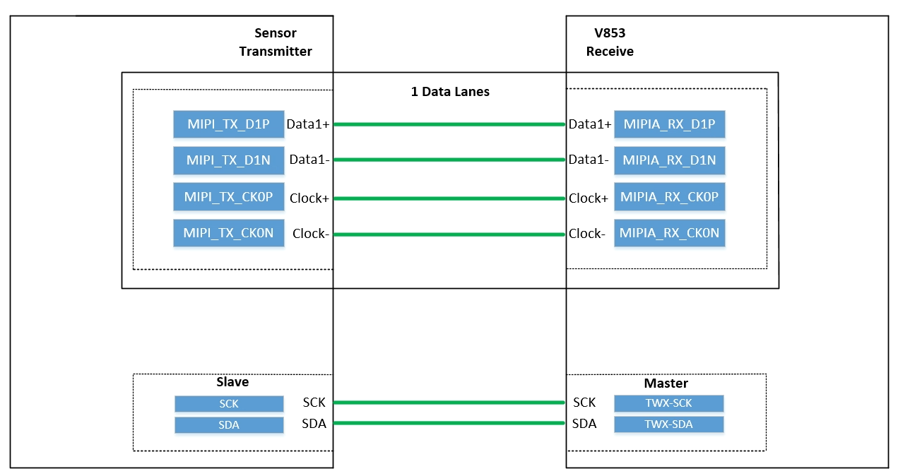

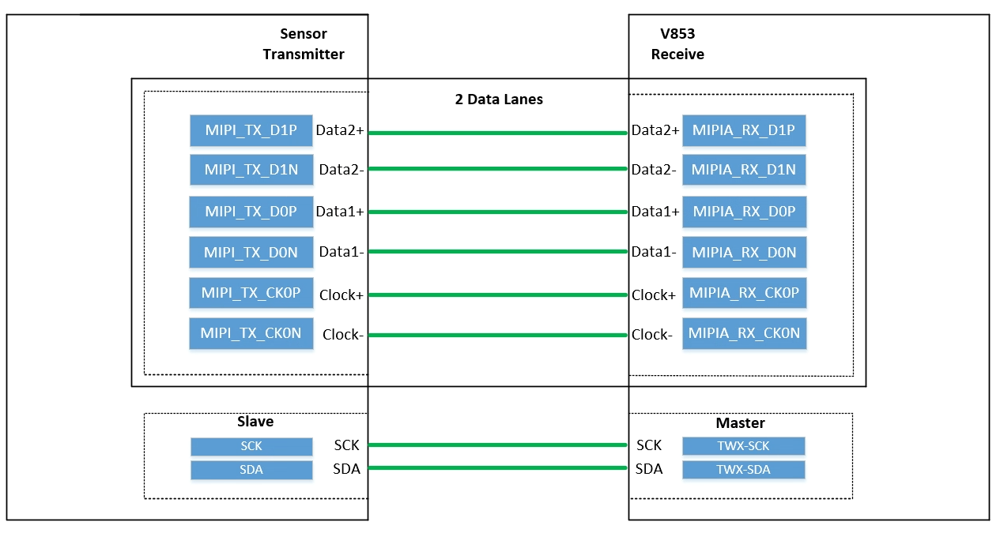

Mbps：Mbit per second，表示 MIPI 数据传输速度的单位，比如 OV4689 的 MIPI 速率是 672Mbps，一般指的是单条 lane 上每秒钟传输的数据量是672Mbit

DVP：Digital Video Port 是并口传输，数据位宽有 8bit、10bit、12bit 等，是非差分信号，最高速率要比串行传输的MIPI接口低

PCLK：pixel clock 像素时钟，每个时钟对应一个像素数据，一般为几十MHz

HSYNC：Horizonal Synchronization，是行同步信号。就是在告诉接收端，HSYNC有效时段内接收端接收到的所有的信号输出属同一行

VSYNC：Vertical Synchronization，是场同步信号。以高电平有效为例，VSYNC置高直到被拉低，这个区段所输出的所有影像数据组成一个frame

MCLK：Master Clock，外部晶振或主控输出给Sensor的驱动时钟，典型值是24MHz、27MHz

SCL：Serial Clock Line，串行时钟线，负责产生同步时钟脉冲

SDA：Serial Data Line，串行数据线，负责在设备间传输串行数据

## Camera 驱动概览

### VIN 驱动目录

:::note

:::note

适用产品列表

:::

:::

| 模块版本 | 驱动文件 |
| --- | --- |
| Linux-4.9 | drivers/media/platform/sunxi\_vin/ |
| Linux-5.4/Linux-6.6 | bsp/drivers/vin/ |

V系列平台 sunxi-vin 驱动的目录概览：

```c
sunxi-vin/
├── Kconfig
├── Makefile
├── modules
│   ├── sensor  //sensor驱动文件目录
├── utility
├── vin.c       //vin.c是驱动的主要功能实现，包括注册/注销、参数读取、与 v4l2 上层接口、与各 device 的下层接口、中断处理、buffer 申请切换等；
├── vin-cci
├── vin-csi     //csi接口驱动文件
├── vin-isp
├── vin-mipi    //mipi接口驱动文件
├── vin-stat
├── vin-tdm     //TDM模块驱动文件
├── vin-video   //video设备驱动文件
└── vin-vipp    //VIPP模块驱动文件
```

### Sensor 驱动目录

:::note

:::note

适用产品列表

:::

:::

| 模块版本 | 驱动文件 |
| --- | --- |
| Linux-4.9 | drivers/media/platform/sunxi\_vin/modules/sensor/ |
| Linux-5.4/Linux-6.6 | bsp/drivers/vin/modules/sensor/ |

V系列平台 Sensor 驱动的目录概览：

```c
sensor/
├── ar0238.c
├── ar0238_hispi.c
├── bf2253l_mipi.c
├── bf2257cs_mipi.c
├── built-in.o
├── c2390a_mipi.c
├── C2398_mipi.c
├── c2399_mipi.c
├── camera_cfg.h
├── camera.h
├── f355p_dvp.c
├── f355p_mipi.c
├── f37h_mipi.c
├── f37p_mipi.c
├── f37p_mipi_vc.c
├── f53_mipi.c
├── gc02m1_mipi.c
├── gc0308_mipi.c
├── gc030a_mipi.c
├── gc0310_mipi.c
├── gc0339_mipi.c
├── gc0403_mipi.c
├── gc0406_mipi.c
....
```

### Sensor 驱动数据结构

以 gc2053\_mipi.c、gc1084\_mipi.c 驱动文件为例，下面给出 Sensor 驱动关键数据结构的说明

```c
// 【参考驱动文件目录】
// Linux-4.9
drivers/media/platform/sunxi_vin/modules/sensor/gc2053_mipi.c
// Linux-5.4或Linux-6.6
bsp/drivers/vin/modules/sensor/gc1084_mipi.c
```

#### Sensor 寄存器配置定义

 struct regval\_list 结构体用于填写 Sensor 初始化配置列表下需要写入的地址和值，配置由 Sensor 厂提供，struct regval\_list 结构体定义如下，每一组分辨率和帧率下对应一个 regval\_list 数组，regval\_list 结构体变量的命名规则一般是 sensor\_xxx(分辨率帧率)\_regs。

```c
struct regval_list {
	addr_type addr;
	data_type data;
};
```

```c

/* 此结构体用于填写 Sensor 寄存器列表，由 Sensor原厂提供 */
static struct regval_list sensor_1080p12_regs[] = {
    /*  1928*1088@12fps */
	/****system****/
	{0xfe, 0x80},
	{0xfe, 0x80},
	{0xfe, 0x80},
	{0xfe, 0x00},
	{0xf2, 0x00},
	{0xf3, 0x00},
...
	{0x02, 0x56},
	{0x03, 0x8e},
	{0x12, 0x80},
	{0x13, 0x07},
	{0x15, 0x12},
	{0xfe, 0x00},
	{0x17, 0x83},
};
```

#### Sensor 寄存器配置注册

```c
/* Sensor 驱动由不同的分辨率/帧率的寄存器配置，它们填写在  sensor_win_sizes 结构体数组中 */
static struct sensor_win_size sensor_win_sizes[] = {
	{
		.width		= 1928,
		.height 	= 1088,
		.hoffset	= 4,//0,
		.voffset	= 4,//0,
		.hts		= 2200,
		.vts		= 2700,
		.pclk		= 74250000,
		.mipi_bps	= 297 * 1000 * 1000,
		.fps_fixed	= 12,//12.5
		.bin_factor = 1,
		.intg_min	= 1 << 4,
		.intg_max	= (2700 - 16) << 4,
		.gain_min	= 1 << 4,
		.gain_max	= 110 << 4,
		.regs		= sensor_1080p12_regs,
		.regs_size	= ARRAY_SIZE(sensor_1080p12_regs),
		.set_size	= NULL,
	},
...
};
```

| 成员变量 | 含义说明 |
| --- | --- |
| width | 图像输出宽度，定义 parser 接收进来的宽度 |
| height | 图像输出高度，定义 parser 接收进来的高度 |
| hoffset | 定义输入 ISP 的宽度偏移量，用于裁剪不需要的像素列 |
| voffset | 定义输入 ISP 的宽度偏移量，用于裁剪不需要的像素行 |
| hts | 行长(以pclk为单位) |
| vts | 帧长(以hts为单位) |
| pclk | 像素时钟：pclk = hts × vts × fps |
| mipi\_bps | MIPI 速率：mipi bps = hts \* vts \* fps \* raw bit（数据位宽） / lane num（mipi lane 数） |
| fps\_fixed | 当前Sensor 寄存器配置对应的帧率 |
| bin\_factor | ISP binning配置，默认配置为1 |
| intg\_min | ISP可以设置的最小曝光时间（单位：曝光行），平台以16为一行，默认配置16 |
| intg\_max | 最大曝光时间（默认为当前帧率的VTS，或者 VTS - offset（部分Sensor无法跑满理论VTS时需扣除一定offset，与FAE确认即可） |
| gain\_min | ISP可以设置的Sensor最小增益，平台以16为一倍，默认配置16 |
| gain\_max | ISP可以设置的Sensor最大增益 |
| regs | 当前帧率/分辨率对应的 Sensor 寄存器数组 |
| regs\_size | 前帧率/分辨率对应的 Sensor 寄存器数组的长度 |
| set\_size | 默认为NULL |

上述成员变量中，.hts 和.vts 值的设置必须与当前所使用的初始化寄存器配置互相对应，一般在 sensor 的 datasheet 中可以找到，如下，sensor 原厂提供的配置里面也会进行标注，如果没有找到可以询问一下 sensor 原厂。

下图是格科微 gc2053 datasheet 中找到配置 vts 寄存器值，对应格科微 gc2053 MIPI接口 2lane 1080p 12帧 的寄存器配置中\{0x41, 0x0a\},\{0x42, 0x8c\}，所以对应的 vts 值为 0xa8c=2700，hts 值在 gc2053 datasheet 中没有找到，可以通过 pclk = hts × vts × fps 得出当前的 hts 值填写进去，或者询问 Sensor 原厂。

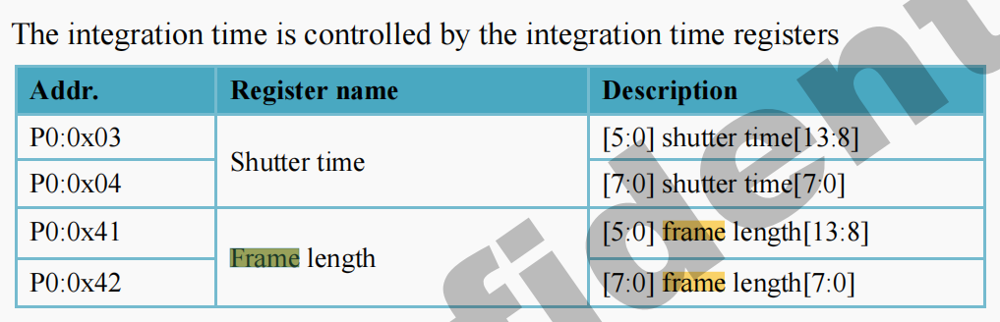

.intg\_max 是最大曝光时间，示例中 gc2053 的最大曝光限制为 vts-16，因为主控端曝光是以 16 为一行，所以将 gc2053 最大曝光限制值左移 4 位填入.intg\_max。每个 sensor 的最大曝光限制都是不一样的，这个可以询问一下 sensor 原厂或者翻阅 sensor datasheet 进行查找。

.gain\_max 是最大增益，每个 sensor 的最大增益都是不一样的，这个可以询问一下 sensor 原厂或者翻阅 sensor datasheet 进行查找，本例中 sensor 的最大增益为 110 倍，而主控端 ISP 是以 16 为一倍，所以该值需要左移 4 位后填入。

.hoffset和.voffset 用于裁剪不需要的像素列和行，默认是居中裁剪，示例中hoffset为4，表示裁剪图像最左边4列和最右边4列，共裁剪8列，因此裁剪分辨率时，这个值填写为需要裁剪的列除以2，voffset同理。

如果 sensor 输出图像格式是 YUV 的话，则 .bin\_factor/.intg\_min/.intg\_max/.gain\_min/.gain\_max 这几个成员变量无须填写。

#### Parser 裁剪宽高

sensor\_win\_sizes中的width和height用于配置soc parser接收的图像宽度和高度，所以通常也可以用于裁剪sensor图像的宽高（在不修改sensor寄存器配置的前提下）。

如图所示，假设sensor输出图像分辨率：1928x1088，但是应用需要的分辨率（居中裁剪）：1920x1080, 按照如下配置，配置.hoffset为4，parser会裁剪掉左边4列，右边4列，即接收宽度为1920，同理，配置.voffset为的4，parser会裁剪掉上边4行，下边4列，接收高度为1080。

```c
static struct sensor_win_size sensor_win_sizes[] = {
	{
		.width		= 1928,
		.height 	= 1088,
		.hoffset	= 4,//0,
		.voffset	= 4,//0,
		...
		.regs		= sensor_1080p12_regs,
		.regs_size	= ARRAY_SIZE(sensor_1080p12_regs),
		.set_size	= NULL,
	},
...
```

#### Sensor 图像数据格式注册

```c
/*
 * Here we'll try to encapsulate the changes for just the output
 * video format.
 *
 */

static struct regval_list sensor_fmt_raw[] = {
// 一般为空
};
/*
 * Store information about the video data format.
 */
static struct sensor_format_struct sensor_formats[] = {
/* 定义 Sensor 输出的图像数据格式，根据Sensor输出格式填写，下述为 RAW 数据格式示例 */
	{
		.desc      = "Raw RGB Bayer",
		.mbus_code = MEDIA_BUS_FMT_SRGGB10_1X10,
		.regs      = sensor_fmt_raw,
		.regs_size = ARRAY_SIZE(sensor_fmt_raw),
		.bpp       = 1
	},
};
#define N_FMTS ARRAY_SIZE(sensor_formats)

// 如果Sensor 输出图像格式是 YUV，则需要根据 Sensor 图像数据输出顺序选择 YUYV/VYUY/UYVY/YVYU  其中一种，如下：
static struct sensor_format_struct sensor_formats[] = {
	{
		.desc = "YUYV 4:2:2",
		.mbus_code = MEDIA_BUS_FMT_YUYV8_2X8,
		.regs = sensor_fmt_raw,
		.regs_size = ARRAY_SIZE(sensor_fmt_raw),
		.bpp = 2,
	},
};
#define N_FMTS ARRAY_SIZE(sensor_formats)
```

| 成员变量 | 含义说明 |
| --- | --- |
| desc | 描述 sensor 输出的图像格式 |
| mbus\_code | 图像数据RGB分量排列顺序（常见 Bayer 格式：RGGB、BGGR、GRBG、GBRG） |
| regs | 默认填写sensor\_fmt\_raw |
| regs\_size | 默认填写sensor\_fmt\_raw的大小 |
| bpp | 默认为1 |

#### Sensor I2C 注册

Sensor I2C 设备地址用于告知主控端丛机所对应的设备地址，以便主控端在通过 I2C 通讯时，能够根据从机（sensor）的设备地址对其进行读写寄存器操作，Sensor I2C 设备地址一般在 Sensor 的 datasheet 中可以找到，在 I2C 读写示例中有标明，如图所示，格科微 gc2053 datasheet 中描述了 Sensor I2C 设备地址。

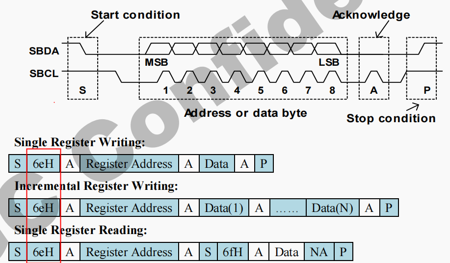

需要注意的是，有些 sensor 支持通过修改外围电路设计从而更改设备 TWI 地址，在配置 TWI 设备地址时需要查看原理图或者询问硬件设计人员，如下是 gc2053 两组 TWI 地址：

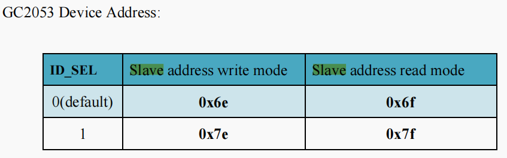

驱动文件里面的 I2C\_ADDR 宏定义一般用于填写具体的I2C地址

```c
#define I2C_ADDR 0x6e  /* sensor的TWI地址,I2C_ADDR要和board.dts中的sensor0_twi_addr一致*/
```

Sensor I2C 数据位宽和地址位宽是在 cci\_driver 结构体中定义的，数据位宽和地址位宽必须按照手册说明进行配置，否则 I2C 通讯时没有将 sensor 寄存器值成功写入 sensor 中，导致 sensor 不出图。如下是 gc2053 datasheet I2C 通讯时序图。

```c
/* 定义两组 Sensor CCi driver，CCi全称是camera control interface，由i2c和gpio组成 */
static struct cci_driver cci_drv[] = {
	{
		.name = SENSOR_NAME,
		.addr_width = CCI_BITS_8,
		.data_width = CCI_BITS_8,
	}, {
		.name = SENSOR_NAME_2,
		.addr_width = CCI_BITS_8,
		.data_width = CCI_BITS_8,
	}
};

/* 用于下面Sensor_driver结构体来匹配设备树 */
static const struct i2c_device_id sensor_id[]

/* Sensor driver的定义，其中会通过id_table来匹配设备树 */
static struct i2c_driver sensor_driver[]
```

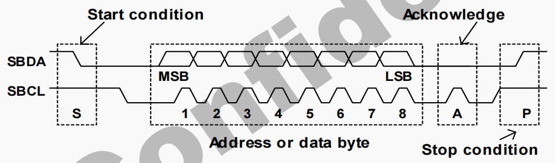

#### Sensor 电气接口注册

Sensor 数据传输接口以及 Lane 数定义在 sensor\_g\_mbus\_config 函数中进行填写。

```c
#if LINUX_VERSION_CODE >= KERNEL_VERSION(6, 1, 0)
__maybe_unused static int sensor_g_mbus_config(struct v4l2_subdev *sd,
				struct v4l2_mbus_config *cfg)
{
#if IS_ENABLED(CONFIG_SENSOR_GC2053_ONE_LANE_MIPI)
	cfg->type  = V4L2_MBUS_CSI2_DPHY;
	cfg->bus.mipi_csi2.num_data_lanes = 0 | V4L2_MBUS_CSI2_1_LANE | V4L2_MBUS_CSI2_CHANNEL_0;
#else	/* two lane */
	cfg->type  = V4L2_MBUS_CSI2_DPHY;
	cfg->bus.mipi_csi2.num_data_lanes = 0 | V4L2_MBUS_CSI2_2_LANE | V4L2_MBUS_CSI2_CHANNEL_0;
#endif
	return 0;
}
#else
__maybe_unused static int sensor_g_mbus_config(struct v4l2_subdev *sd,
				struct v4l2_mbus_config *cfg)
{
#if IS_ENABLED(CONFIG_SENSOR_GC2053_ONE_LANE_MIPI)
	cfg->type  = V4L2_MBUS_CSI2_DPHY;
	cfg->flags = 0 | V4L2_MBUS_CSI2_1_LANE | V4L2_MBUS_CSI2_CHANNEL_0;
#else	/* two lane */
	cfg->type  = V4L2_MBUS_CSI2_DPHY;
	cfg->flags = 0 | V4L2_MBUS_CSI2_2_LANE | V4L2_MBUS_CSI2_CHANNEL_0;
#endif
	return 0;
}
#endif
```

### Sensor 驱动接口概览

| 接口定义 | 接口说明 |
| --- | --- |
| sensor\_g\_fps | 获取 Sensor 实时帧率 |
| sensor\_s\_fps | 动态设置 Sensor 帧率 |
| sensor\_g\_exp | 获取 Sensor 曝光时间（单位：曝光行） |
| sensor\_s\_exp | 设置 Sensor 曝光时间（单位：曝光行） |
| sensor\_g\_gain | 获取 Sensor 当前增益 |
| sensor\_s\_gain | 设置 Sensor 增益 |
| sensor\_s\_exp\_gain | 设置 Sensor 曝光时间和增益 |
| sensor\_s\_vflip | 动态设置 Sensor 垂直翻转 |
| sensor\_s\_hflip | 动态设置 Sensor 水平翻转 |
| sensor\_g\_flip | 获取 Sensor 当前翻转状态 |
| sensor\_get\_temp | 获取 Sensor 当前温度 |
| sensor\_power | Sensor 上下电函数 |
| sensor\_reset | 设置 Sensor 复位 |
| sensor\_detect | Sensor 探测函数（测试IIC通信） |
| sensor\_init | Sensor 驱动初始化入口 |
| sensor\_ioctl | Sensor 功能函数系统调用入口 |
| sensor\_g\_mbus\_config | Sensor 工作接口类型定义 |
| sensor\_g\_ctrl | Sensor v4l2\_ctrl 功能函数 |
| sensor\_s\_ctrl | Sensor v4l2\_ctrl 功能函数 |
| sensor\_reg\_init | Sensor 寄存器初始化函数 |
| sensor\_s\_stream | Sensor 开流函数 |
| sensor\_init\_controls | Sensor v4l2\_ctrl 系统调用初始化函数 |
| sensor\_probe | Sensor 驱动资源初始化函数 |
| sensor\_remove | Sensor 驱动卸载函数 |
| init\_sensor | Sensor 驱动注册函数 |
| exit\_sensor | Sensor 驱动注销函数 |

## Sensor 驱动点亮流程

### 线性模式

线性模式 Sensor 驱动移植根据 MIPI 接口和 DVP 接口来进行说明。

#### MIPI接口

##### 获取 Sensor 初始化寄存器配置

MIPI接口线性模式Senso驱动r移植以格科微 gc2053 为例，在调试Sensor驱动之前，需要确认以下几点：

| 图像规格 |
| --- |
| Sensor使用哪类接口进行图像传输（MIPI、DVP） |
| 需要用到的分辨率和帧率 |
| MCLK频率（常见：24/27M） |
| 连接模组的外围功能电路是否按照sensor原厂提供硬件参考设计来实现的 |

根据当前方案所需要的分辨率和帧率，对应的MCLK（一般建议是24M）以及sensor硬件设计上所使用到接口（mipi/dvp）和lane数，联系sensor原厂提供一份对应的初始化寄存器配置，提供的配置需要和当前使用的模组匹配。如图所示是格科微 gc2053 MIPI接口 2lane 1080p 12帧 的寄存器配置：

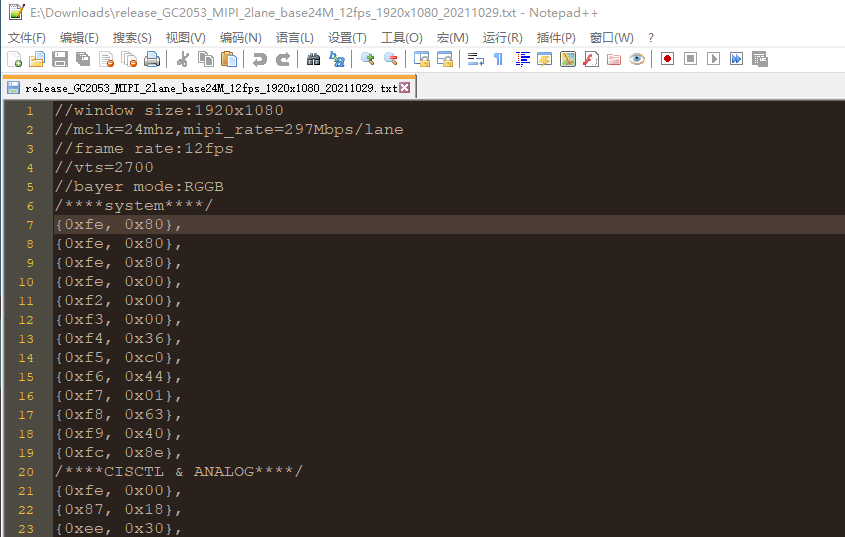

##### 添加驱动文件

```c
1.添加Makefile文件
2.添加Sensor驱动文件
3.添加Kconfig
4.配置kernel_menuconfig
```

**添加 MakeFile**

进入 sensor 目录，打开 MakeFile 文件，添加指定语句，这一步的作用是将.c 源文件编译为.o 文件，如下图所示：

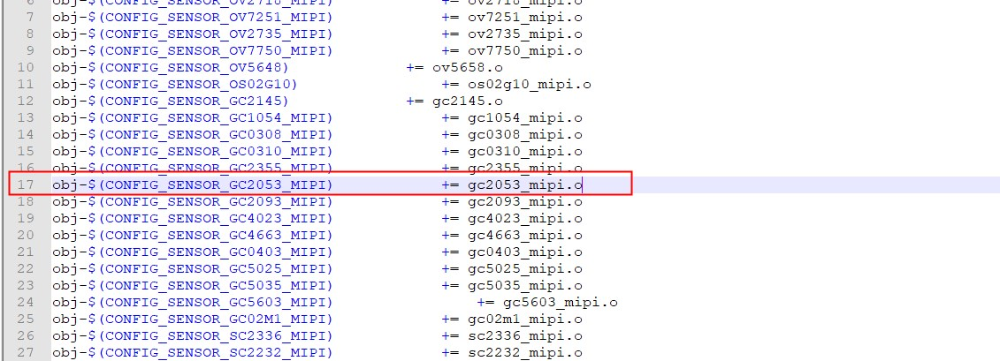

**添加 Sensor 驱动文件**

进入 sensor 目录，如果需要调试的模组对应的其他型号之前有在全志平台上点过的话，建议以 SDK 中的某个现成的驱动为基础修改，如格科微的 Sensor 驱动命名都是以 gc 开头的，思特威的 Sensor 驱动命名都是以 sc 开头的，索尼的 Sensor 驱动命名都是以 imx 开头的。 如果没有，可以找一份硬件配置（如 mipi lane 数，图像输出格式等）相近的驱动，在此基础上进行修改。本例中复用格科微其中一个 Sensor 的源文件，重命名成 gc2053\_mipi.c。

**添加 Kconfig**

在同级目录下的 Kconfig 文件中，将本文件按照格式添加进去，用于 kernel\_menuconfig 来选择配置

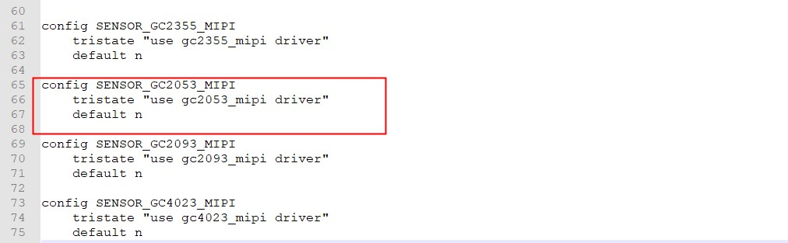

**配置 kernel\_menuconfig**

使用 make kernel\_menuconfig， 进入内核 menuconfig，选中本Senor驱动为 M，M 代表编译成模块（.ko文件），Y 代表编译进内核

```c
// Linux-5.10以前版本
→ Device Drivers → Multimedia support → V4L platform devices → sensor driver select
// Linux-5.10以后版本
→ Allwinner BSP → Device Drivers → VIN (camera) Drivers → sensor driver select
```


##### 修改引脚配置

由于模组硬件外围电路因为实际需求差异与公版开发板使用的 Sensor 模组的外围电路存在差异，所以需要根据当前的硬件设计原理图，修改板级配置 board.dts。

| 引脚配置与注意事项 |
| --- |
| MCLK引脚配置 |
| TWI引脚配置 |
| PWDN(sensor使能引脚)和RSTN(sensor复位引脚)配置 |
| 需要检查当前板级配置，是否有其他模块复用同组TWI或者GPIO的 |

```c
// 执行 source build/envsetup.sh 脚本且选择板级之后，可以直接执行 cconfigs 命令进入对应的板级目录。
// V85X平台
device/config/chips/xxx（芯片型号）/configs/xxx（板型）/board.dts
// V821平台
board.dts：device/config/chips/v821/configs/xxx（具体板型）/linux-5.4-ansc/board.dts
// V861平台
board.dts：device/config/chips/v861/configs/xxx（具体板型）/linux-6.6-xuantie/board.dts
```

这里以公版 V851s perf1 为例进行引脚配置说明，引脚复用功能可以查阅一号通文档《V851S&V851SE\_Datasheet\_V1.1》10.6.5 V851S GPIO Register Description 章节获取。

MCLK 引脚硬件连接图和对应引脚配置如下：

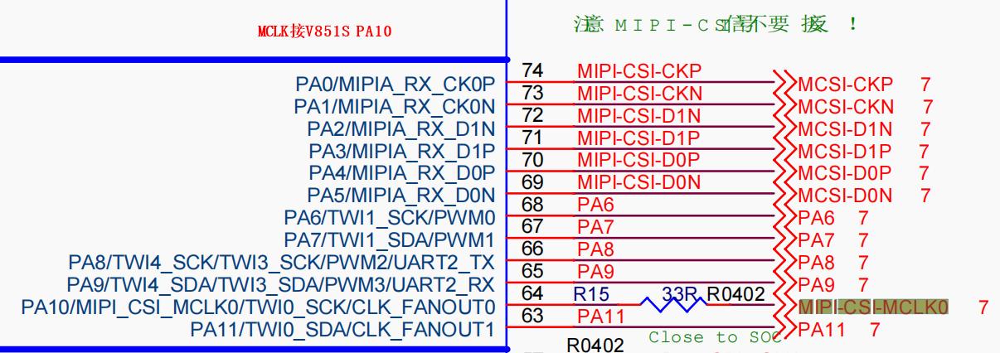

```c
csi_mclk0_pins_a: csi_mclk0@0 {
    allwinner,pins = "PA10";   /* 填写方案硬件设计对应的GPIO引脚，本例填写为PA10 */
    allwinner,pname = "mipi_csi_mclk0";
    allwinner,function = "mipi_csi_mclk0";
    allwinner,muxsel = <0x4>;  /* 引脚复用功能，需要查阅对应平台的数据手册获取 */
    allwinner,drive = <2>;     /* 驱动能力配置，按照默认配置即可 */
    allwinner,pull = <0>;      /* 是否配置为上拉 */
};
```

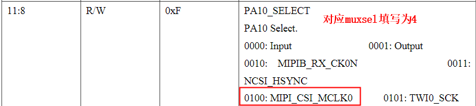

TWI 引脚硬件连接图和对应引脚配置如下：

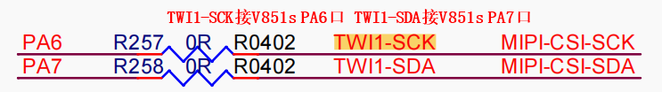

```c
twi1_pins_a: twi1@0 {
    allwinner,pins = "PA6", "PA7";      /* 填写方案硬件设计对应的GPIO引脚，本例填写为PA6、PA7 */
    allwinner,pname = "twi1_scl", "twi1_sda";
    allwinner,function = "twi1";
    allwinner,muxsel = <4>;             /* 引脚复用功能，需要查阅对应平台的数据手册获取 */
    allwinner,drive = <0>;              /* 驱动能力配置，按照默认配置即可 */
    allwinner,pull = <1>;
};

&twi1 {
	clock-frequency = <400000>;
	pinctrl-0 = <&twi1_pins_a>;
	pinctrl-1 = <&twi1_pins_b>;
	pinctrl-names = "default", "sleep";
	/* For stability and backwards compatibility, we recommend setting twi_drv_used to 0 */
	twi_drv_used = <0>;
	twi_pkt_interval = <0>;
	status = "okay";       /* 需要检查此处有没有设置为okay */
};
```

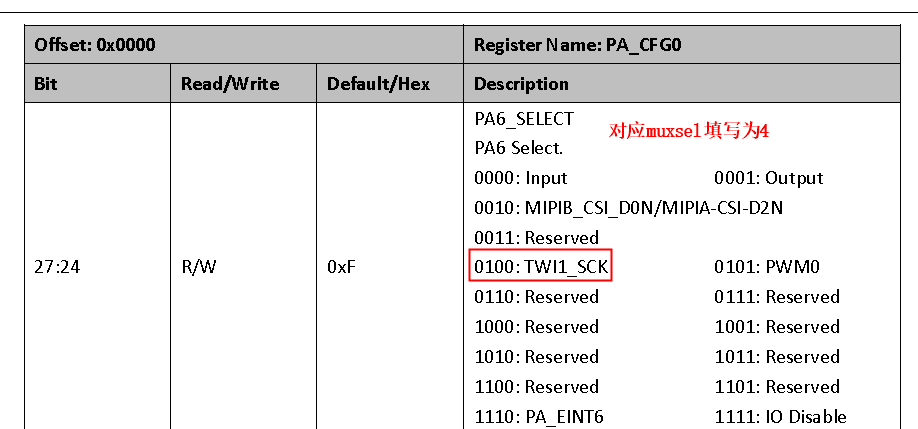

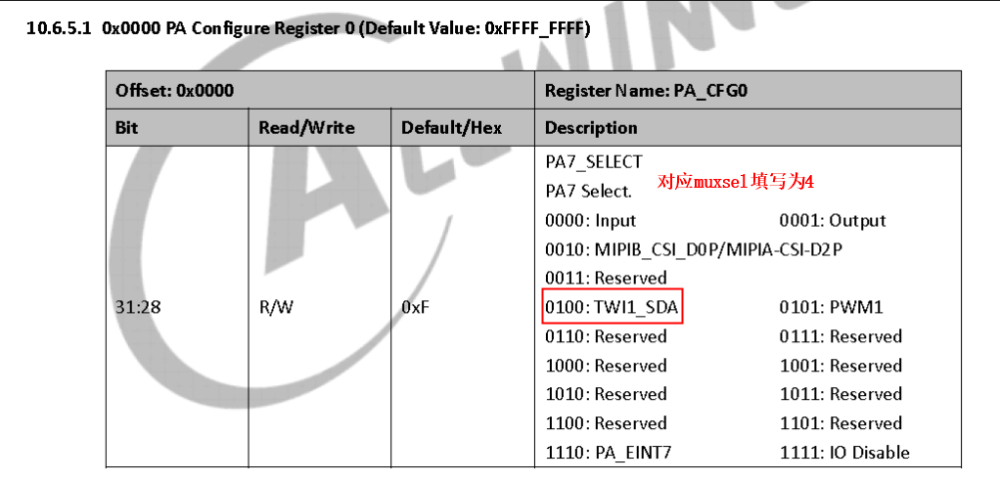

PWDN 引脚硬件连接图和 RSTN 引脚硬件连接图：

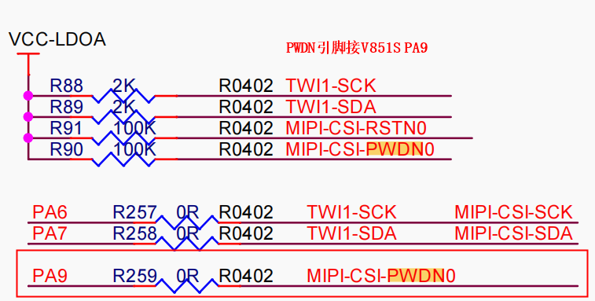

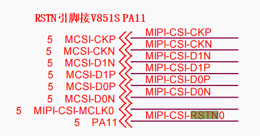

PWDN 引脚和 RSTN 引脚配置是在 board.dts sensor 属性中配置，公版 gc2053 是在 board.dts sensor0 属性中进行相关引脚配置：

```c
sensor0:sensor@0 {
      device_type = "sensor0";
      sensor0_mname = "gc2053_mipi";      /* 必须要和驱动的 SENSOR_NAME 一致 */
      sensor0_twi_cci_id = <1>;           /* 所使用的twi id号，本例中使用的是twi1，故填写为1 */
      sensor0_twi_addr = <0x6e>;          /* sensor 设备ID地址，必须与驱动中的I2C_ADDR一致 */
      sensor0_mclk_id = <0>;              /* 所使用的mclk id号，本例中使用的是MCLK0，故填写为0 */
      sensor0_pos = "rear";
      sensor0_isp_used = <1>;             /* 所使用的sensor为raw sensor，需要过ISP处理，故填写为1 */
      sensor0_fmt = <1>;                  /* sensor输出的图像格式，YUV：0，RAW：1 */
      sensor0_stby_mode = <0>;
      sensor0_vflip = <0>;                /* VIPP 图像垂直翻转 */
      sensor0_hflip = <0>;                /* VIPP 图像水平翻转 */
      sensor0_iovdd-supply = <&reg_aldo2>;/* sensor iovdd 连接的 ldo，根据硬件原理图的连接来决定（在硬件原理图中搜索aldo，然后找到CSI-iovdd对应的是哪一个aldo即可） */
      sensor0_iovdd_vol = <1800000>;	  /* iovdd的电压 */
      sensor0_avdd-supply = <&reg_bldo2>; /* sensor avdd连接的 ldo，根据硬件原理图的连接来决定 */
      sensor0_avdd_vol = <2800000>;		  /* 同上 */
      sensor0_dvdd-supply = <&reg_dldo2>;  /* 同上 */
      sensor0_dvdd_vol = <1200000>;        /* 同上 */
      sensor0_power_en = <>;
      sensor0_reset = <&pio PA 11 1 0 1 0>; /* GPIO 信息配置：pio 端口 组内序号 功能分配 内部电阻状态 驱动能力 输出电平状态,本例中使用的是PA11*/
      sensor0_pwdn = <&pio PA 9 1 0 1 0>;   /* GPIO 信息配置：pio 端口 组内序号 功能分配 内部电阻状态 驱动能力 输出电平状态,本例中使用的是PA9*/
      flash_handle = <&flash0>;
      act_handle = <&actuator0>;
      status  = "okay";
};
```

##### 移植 Sensor 驱动

修改驱动文件 gc2053\_mipi.c 以适配当前使用的模组，如下修改的内容是调试 sensor 驱动所必须填写的，如下：

###### 修改 Sensor Name

修改驱动文件中宏定义 SENSOR\_NAME 为"gc2053\_mipi"，SENSOR\_NAME 要与 board.dts 中的 sensor0\_mname 一致，SENSOR\_NUM 定义为1表示当前这份驱动只适配一个 gc2053 摄像头。

```c
#define SENSOR_NUM 0x1
#define SENSOR_NAME "gc2053_mipi"
```

###### 配置 MCLK 时钟

下面的设置代表 sensor 输入时钟频率，可通过 sensor 的 datasheet 查看类似 input clock frequency 对应的数据，其中 MCLK 和使用的寄存器配置强相关，在模组厂提供寄存器配置时，可直接询问当前配置使用的 MCLK 频率是多少，一般原厂提供的初始化寄存器配置里面就包含当前配置所使用的 MCLK 频率，如下是格科微 gc2053 初始化寄存器配置所填写的 MCLK。MCLK 是主控端发出来给到 sensor，MCLK 的配置会影响 sensor 出图的帧率以及上电时序的表现，部分Sensor没有接收到预期的MCLK时，可能存在I2C不通的情况。

![sensor的MCLK配置值]()

```c
// Linux-4.9
 lichee/linux-4.9/drivers/media/platform/sunxi-vin/modules/sensor/gc2053_mipi.c
// Linux-5.4和Linux-6.6
 bsp/drivers/vin/modules/sensor/gc2053_mipi.c
```

驱动面的 MCLK 宏定义修改为：

```c
#define MCLK              (24*1000*1000)
```

###### 配置 Sensor ID/CHIP ID

每个 sensor 的 Sensor ID/CHIP ID 都是独一无二，根据这个 ID 号可以探测当前使用的 sensor 是否与驱动相匹配，也可以用于初步校验主控端与 sensor 的 TWI 通讯是否正常， sensor list 适配也是通过探测 ID 号来实现的，Sensor ID/CHIP ID 一般在 sensor 的 datasheet 中找到，可以搜索关键字 Sensor ID 或 CHIP ID 进行查找。

如下是格科微 gc2053 datasheet 中找到 CHIP ID


对应驱动文件里面的 V4L2\_IDENT\_SENSOR 宏定义修改为：

```c
#define V4L2_IDENT_SENSOR  0x2053
```

若 sensor 驱动中有宏定义是与 Sensor ID/CHIP ID 的寄存器地址以及 ID 值偏移有关，则对应需要进行填写：

```c
#define ID_REG_HIGH		0xf0     //gc2053 CHIP ID高8位寄存器地址
#define ID_REG_LOW		0xf1     //gc2053 CHIP ID低8位寄存器地址
#define ID_VAL_HIGH		((V4L2_IDENT_SENSOR) >> 8)    //gc2053 CHIP ID高8位寄存器读出来的值
#define ID_VAL_LOW		((V4L2_IDENT_SENSOR) & 0xff)  //gc2053 CHIP ID低8位寄存器读出来的值
```

上述与 Sensor ID/CHIP ID 有关的宏定义在 sensor\_detect 函数中会被使用，这个函数在 sensor 驱动被挂载的时候会被调用执行，同时也可以用来检测主控与 sensor TWI 通讯是否正常。

```c
static int sensor_detect(struct v4l2_subdev *sd)
{
	data_type rdval;
	int eRet;
	int times_out = 3;
	do {
		eRet = sensor_read(sd, ID_REG_HIGH, &rdval);
		sensor_dbg("eRet:%d, ID_VAL_HIGH:0x%x, times_out:%d\n", eRet, rdval, times_out);
		usleep_range(200, 220);
		times_out--;
	} while (eRet < 0  &&  times_out > 0);
    sensor_read(sd, ID_REG_HIGH, &rdval);
    sensor_dbg("ID_VAL_HIGH = %2x, Done!\n", rdval);
    if (rdval != ID_VAL_HIGH)
        return -ENODEV;

    sensor_read(sd, ID_REG_LOW, &rdval);
    sensor_dbg("ID_VAL_LOW = %2x, Done!\n", rdval);
    if (rdval != ID_VAL_LOW)
        return -ENODEV;

    sensor_dbg("Done!\n");
    return 0;
}
```

###### 配置 Sensor I2C 设备地址、数据/地址位宽

```c
#define I2C_ADDR 0x6e  /* sensor的TWI地址,I2C_ADDR要和board.dts中的sensor0_twi_addr一致*/
...
static struct cci_driver cci_drv[] = {
	{
		.name = SENSOR_NAME,
		.addr_width = CCI_BITS_8,
		.data_width = CCI_BITS_8,
	},
};
```

###### 添加和注册 Sensor 初始化寄存器配置

```c
static struct regval_list sensor_1080p12_regs[] = {
    /*  1928*1088@12fps */
	/****system****/
	{0xfe, 0x80},
	{0xfe, 0x80},
	{0xfe, 0x80},
	{0xfe, 0x00},
	{0xf2, 0x00},
	{0xf3, 0x00},
...
	{0x02, 0x56},
	{0x03, 0x8e},
	{0x12, 0x80},
	{0x13, 0x07},
	{0x15, 0x12},
	{0xfe, 0x00},
	{0x17, 0x83},
};
...
static struct sensor_win_size sensor_win_sizes[] = {
	{
		.width		= 1920,
		.height 	= 1088,
		.hoffset	= 4,//0,
		.voffset	= 4,//0,
		.hts		= 2200,
		.vts		= 2700,
		.pclk		= 74250000,
		.mipi_bps	= 297 * 1000 * 1000,
		.fps_fixed	= 12,//12.5
		.bin_factor = 1,
		.intg_min	= 1 << 4,
		.intg_max	= (2700 - 16) << 4,
		.gain_min	= 1 << 4,
		.gain_max	= 110 << 4,
		.regs		= sensor_1080p12_regs,
		.regs_size	= ARRAY_SIZE(sensor_1080p12_regs),
		.set_size	= NULL,
	},
...
};
```

###### 配置图像数据格式

```c
static struct sensor_format_struct sensor_formats[] = {
/* 定义 Sensor 输出的图像数据格式，根据Sensor输出格式填写，下述为 RAW 数据格式示例 */
	{
		.desc      = "Raw RGB Bayer",
		.mbus_code = MEDIA_BUS_FMT_SRGGB10_1X10,
		.regs      = sensor_fmt_raw,
		.regs_size = ARRAY_SIZE(sensor_fmt_raw),
		.bpp       = 1
	},
};
#define N_FMTS ARRAY_SIZE(sensor_formats)
```

###### 配置MIPI接口

```c
static int sensor_g_mbus_config(struct v4l2_subdev *sd,	struct v4l2_mbus_config *cfg)
{
	cfg->type  = V4L2_MBUS_CSI2;
	cfg->flags = 0 | V4L2_MBUS_CSI2_2_LANE | V4L2_MBUS_CSI2_CHANNEL_0;
	return 0;
}
```

##### 上电时序配置

sensor 的上电时序控制在 sensor\_power 函数中实现，上电时序必须严格按照 sensor datasheet 中的说明来进行，上电时序不对会导致 TWI 异常，主控端与 sensor 通讯失败。

如下图所示是 gc2053 的上电时序图，就是 IOVDD->DVDD->AVDD 的上电顺序，此外 PWDN 和 RESET 引脚的使用也需要结合时序图配置。

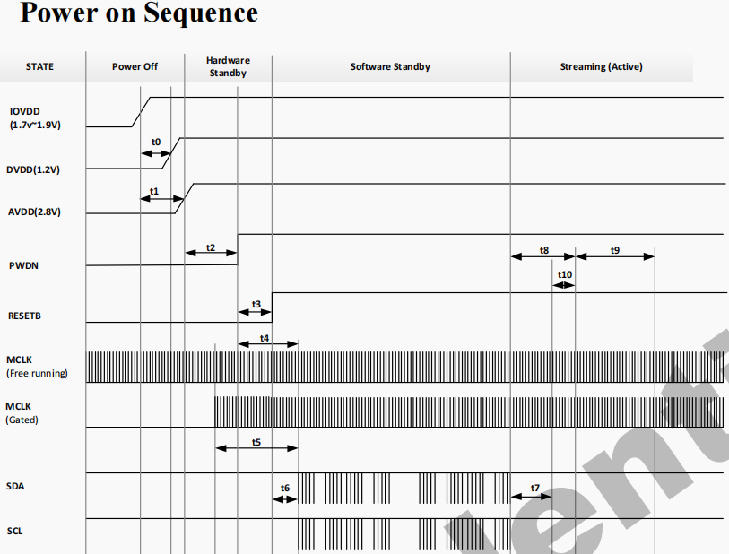

```c
static int sensor_power(struct v4l2_subdev *sd, int on)
{
	switch (on) {
	/* STBY_ON 和 STBY_OFF 基本不使用，可忽略这两个选项的配置 */
	case STBY_ON:
		...

	case STBY_OFF:
		...
	/* 进行上电操作 */
	case PWR_ON:
		sensor_dbg("PWR_ON!\n");
		cci_lock(sd);
		vin_set_mclk(sd, ON);        /* 开启mclk时钟 */
		usleep_range(1000, 1200);
		vin_set_mclk_freq(sd, MCLK); /* 设置MCLK */
		usleep_range(1000, 1200);
		vin_gpio_set_status(sd, PWDN, 1);        /* 将PWDN引脚置为输出 */
		vin_gpio_set_status(sd, RESET, 1);       /* 将RESET引脚置为输出 */
		vin_gpio_write(sd, PWDN, CSI_GPIO_LOW);  /* 将PWDN引脚电频置为低电平 */
		vin_gpio_write(sd, RESET, CSI_GPIO_LOW); /* 将RESET引脚电频置为低电平 */
		usleep_range(1000, 1200);
		vin_set_pmu_channel(sd, IOVDD, ON);      /* 按照时序来分别给IOVDD、DVDD、AVDD供电 */
		usleep_range(1000, 1200);
		vin_set_pmu_channel(sd, DVDD, ON);
		usleep_range(1000, 1200);
		vin_set_pmu_channel(sd, AVDD, ON);
		usleep_range(1000, 1200);
		vin_gpio_write(sd, PWDN, CSI_GPIO_HIGH);  /* 将PWDN、RESET置为高电平 */
		usleep_range(10000, 12000);
		vin_gpio_write(sd, RESET, CSI_GPIO_HIGH);
		usleep_range(10000, 12000);
		cci_unlock(sd);
		break;
}
```

##### 曝光接口实现

sensor 曝光接口是在 sensor\_s\_exp 函数中实现的（YUV 格式的 sensor 不需要实现返回0即可），需要翻阅 sensor datasheet 查找控制曝光的相关寄存器，一般使用的是手动曝光模式。如下是 gc2053 控制曝光所需要操作的寄存器。

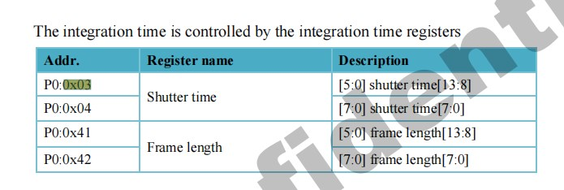

由于主控端的 ISP 曝光是以 16 为一行的，而本例中 gc2053 也是以一行为单位的，所以只需要将传入的曝光值exp\_val 除以 16 按照 sensor datasheet 将值写入对应的寄存器。

```c
static int sensor_s_exp(struct v4l2_subdev *sd, unsigned int exp_val)
{
    struct sensor_info *info = to_state(sd);
    int tmp_exp_val = exp_val / 16;                     /* exp_val / 16 得到一行的曝光值 */
    sensor_dbg("exp_val:%d\n", exp_val);
    sensor_write(sd, 0x03, (tmp_exp_val >> 8) & 0xFF);  /* 将曝光值的高8位填入gc2053的控制曝光高位寄存器 */
    sensor_write(sd, 0x04, (tmp_exp_val & 0xFF));       /* 将曝光值的低8位填入gc2053的控制曝光低位寄存器 */
    info->exp = exp_val;
    return 0;
}
```

注：若所调试的 sensor 是以 1/16 行为单位的，则传入的曝光值 exp\_val 可以直接写入 sensor 曝光寄存器 若所调试的 sensor 是以半行为单位的，则传入的曝光值 exp\_val 需要除以 16 得到一行的曝光值然后乘以 2 后写入 sensor 曝光寄存器

##### 增益接口实现

sensor 增益接口是在 sensor\_s\_gain 函数中实现的（YUV 格式的 sensor 不需要实现返回0即可），每个 sensor 的 Gain Table 都是不一样的，这个可以询问一下 sensor 原厂 Gain Table 填写方式或者翻阅 sensor datasheet 进行查找。

本次以思特威 sc1346 为例对 sensor 增益接口实现进行一个简单的说明，如下是 sc1346 的模拟增益表，一般会使用模拟增益，思特威的 sensor 会使用数字增益对模拟增益进行一个平滑过渡。主控端的 ISP 增益精度是 1/16（也就是 16 为一倍增益）。

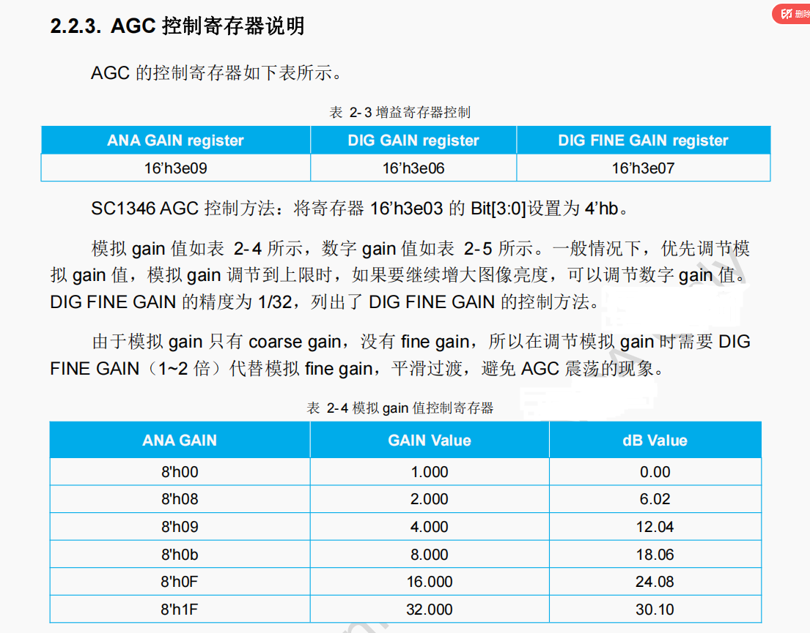

```c
static int sensor_s_gain(struct v4l2_subdev *sd, int gain_val)
{
  	struct sensor_info *info = to_state(sd);
	data_type anagain = 0x00;
	data_type gaindiglow = 0x80;
	data_type gaindighigh = 0x00;
	int gain_tmp;

	gain_tmp = gain_val << 3;
	if (gain_val < 32) {     /* 对应数据手册一倍模拟增益，一倍模拟增益到两倍模拟增益（不含两倍模拟增益）以内对应的寄存器值为0x00 */
		anagain = 0x00;
		gaindighigh = 0x00;
		gaindiglow = gain_tmp;  /* 数字增益的计算方式需要询问sensor原厂，这里以思特威提供的计算方式进行一个示例 */
	} else if (gain_val < 64) {
		anagain = 0x08;     /* 对应数据手册两倍模拟增益，两倍模拟增益到三倍模拟增益（不含三倍模拟增益）以内对应的寄存器值为0x08 */
		gaindighigh = 0x00;
		gaindiglow = gain_tmp * 100 / 200/ 1;
	} else if (gain_val < 128) {
		anagain = 0x09;
		gaindighigh = 0x00;
		gaindiglow = gain_tmp * 100 / 200 / 2;
	} else if (gain_val < 256) {
		anagain = 0x0b;
		gaindighigh = 0x00;
		gaindiglow = gain_tmp * 100 / 200 / 4;
	} else if (gain_val < 512) {
		anagain = 0x0f;
		gaindighigh = 0x00;
		gaindiglow = gain_tmp * 100 / 200 / 8;
	} else if (gain_val < 1024) {
		anagain = 0x1f;
		gaindighigh = 0x00;
		gaindiglow = gain_tmp * 100 / 200 / 16;
	} else if (gain_val < 2048) {   /* 数据手册标明最大增益只能到32倍，所以后面的增益模拟增益寄存器值都填写为0x1f */
		anagain = 0x1f;
		gaindighigh = 0x01;
		gaindiglow = gain_tmp * 100 / 200 / 32;
	} else if (gain_val < 4096) {
		anagain = 0x1f;
		gaindighigh = 0x03;
		gaindiglow = gain_tmp * 100 / 200 / 64;
	} else if (gain_val < 8192) {
		anagain = 0x1f;
		gaindighigh = 0x07;
		gaindiglow = gain_tmp * 100 / 200 / 128;
	} else {
		anagain = 0x1f;
		gaindighigh = 0x07;
		gaindiglow = 0xfc;
	}

	sensor_write(sd, 0x3e09, (unsigned char)anagain);      /* 将增益值写入sensor模拟增益寄存器 */
	sensor_write(sd, 0x3e07, (unsigned char)gaindiglow);   /* 将增益值写入sensor数字增益低位寄存器 */
	sensor_write(sd, 0x3e06, (unsigned char)gaindighigh);  /* 将增益值写入sensor数字增益高位寄存器 */

	sensor_dbg("sensor_set_anagain = %d, 0x%x, 0x%x, 0x%x Done!\n", gain_val, anagain, gaindighigh, gaindiglow);
	//sensor_dbg("digital_gain = 0x%x, 0x%x Done!\n", gaindighigh, gaindiglow);
	info->gain = gain_val;

	return 0;
}
```

上述 sensor 驱动的曝光接口和增益接口实现之后，还需要将接口注册到 vin v4l2 框架中，以便上层应用可以调用到相关的接口控制 sensor 的曝光和增益。

sensor\_init\_controls 函数添加增益和曝光控件选项，如下：

```c
static int sensor_init_controls(struct v4l2_subdev *sd, const struct v4l2_ctrl_ops *ops)
{
	v4l2_ctrl_handler_init(handler, 2);
	ctrl = v4l2_ctrl_new_std(handler, ops, V4L2_CID_GAIN, 1 * 1600, 256 * 1600, 1, 1 * 1600);
	ctrl = v4l2_ctrl_new_std(handler, ops, V4L2_CID_EXPOSURE, 1, 65536 * 16, 1, 1);

    if (ctrl != NULL)
		ctrl->flags |= V4L2_CTRL_FLAG_VOLATILE;
	return ret;
}
```

sensor\_s\_ctrl 函数添加 V4L2\_CID\_GAIN 和 V4L2\_CID\_EXPOSURE，对应之前实现的 sensor\_s\_gain 和 sensor\_s\_exp 函数。sensor\_s\_ctrl 下曝光和增益的实现，在于当处于手动曝光模式下，上层可以通过 API 调用到 sensor 驱动实现的 sensor\_s\_exp 和 sensor\_s\_gain 函数。

```c
static int sensor_s_ctrl(struct v4l2_ctrl *ctrl)
{
	struct sensor_info *info =
			container_of(ctrl->handler, struct sensor_info, handler);
	struct v4l2_subdev *sd = &info->sd;

	switch (ctrl->id) {
	case V4L2_CID_GAIN:
		return sensor_s_gain(sd, ctrl->val);
	case V4L2_CID_EXPOSURE:
		return sensor_s_exp(sd, ctrl->val);
	}
	return -EINVAL;
}
```

sensor\_s\_exp\_gain 接口主要用于上层 ISP 算法库做完 3A 算法之后通过 VIDIOC\_VIN\_SENSOR\_EXP\_GAIN 给 sensor 驱动更新曝光和增益。

```c
static int sensor_s_exp_gain(struct v4l2_subdev *sd, struct sensor_exp_gain *exp_gain)
{
	int exp_val, gain_val;
	int shutter = 0, frame_length = 0;
	struct sensor_info *info = to_state(sd);

	exp_val = exp_gain->exp_val;
	gain_val = exp_gain->gain_val;

	if (gain_val < (1 * 16)) {  /* 限制最小增益为1倍 */
		gain_val = 16;
	}

	if (exp_val > 0xfffff)      /* 限制最大曝光值 */
		exp_val = 0xfffff;
	sensor_s_exp(sd, exp_val);
	sensor_s_gain(sd, gain_val);

	info->exp = exp_val;
	info->gain = gain_val;
	return 0;
}

static long sensor_ioctl(struct v4l2_subdev *sd, unsigned int cmd, void *arg)
{
	int ret = 0;
	struct sensor_info *info = to_state(sd);

	switch (cmd) {
        case VIDIOC_VIN_SENSOR_EXP_GAIN:
            sensor_s_exp_gain(sd, (struct sensor_exp_gain *)arg);
            break;
	    ...
        default:
		return -EINVAL;
	}
	return ret;
}
```

##### 翻转接口的实现

Sensor 设置翻转场景：

-   由于物理结构设计错误，导致镜头或者 sensor 反装，需要在软件上电时就默认翻转回来正确的方向。
    
-   软件规格上需要支持在线设置翻转的功能（SDV、IPC、CDR），供设备倒装放置。
    

翻转功能有两种实现方式：VIPP 翻转，sensor 驱动翻转， 应用层 API 如下：

```c
// V85X平台
文件目录：external/eyesee-mpp/middleware/sun8iw21/media/mpi_vi.c
// V821平台
platform/allwinner/eyesee-mpp/middleware/sun300iw1/media/mpi_vi.c
// V861平台
platform/allwinner/eyesee-mpp/middleware/sun252iw1/media/mpi_vi.c

// 设置 VIPP 翻转，如果输出的图像格式为 LBC 压缩格式的话，不可以使用 VIPP 翻转
AW_S32 AW_MPI_VI_SetVippFlip(VI_DEV ViDev, int Value);
AW_S32 AW_MPI_VI_SetVippMirror(VI_DEV ViDev, int Value);

// 设置 Sensor 驱动翻转，需要按照下文实现驱动的翻转函数
AW_S32 AW_MPI_ISP_SetMirror(VI_DEV ViDev, int Value);
AW_S32 AW_MPI_ISP_SetFlip(VI_DEV ViDev, int Value);
```

**VIPP 实现翻转**

主控端 VIPP 硬件已集成翻转功能，可以完成图像水平、垂直两个方向翻转，但使用时需要留意，当 VIPP 输出格式为 LBC 压缩格式时，VIPP 翻转功能不能使用，这个时候可以选择使用 sensor 驱动完成翻转功能。

**Sensor 驱动实现翻转**

执行 make kernel\_menuconfig，将 CONFIG\_ENABLE\_SENSOR\_FLIP\_OPTION 打开，意味着使用 sensor 驱动完成翻转，不使用 VIPP 翻转：

```c
// Linux-4.9
 → Device Drivers → Multimedia support → V4L platform devices → select sensor flip to replace vipp flip
// Linux-5.4和Linux-6.6
 → Allwinner BSP → Device Drivers → VIN (camera) Drivers → select sensor flip to replace vipp flip
```

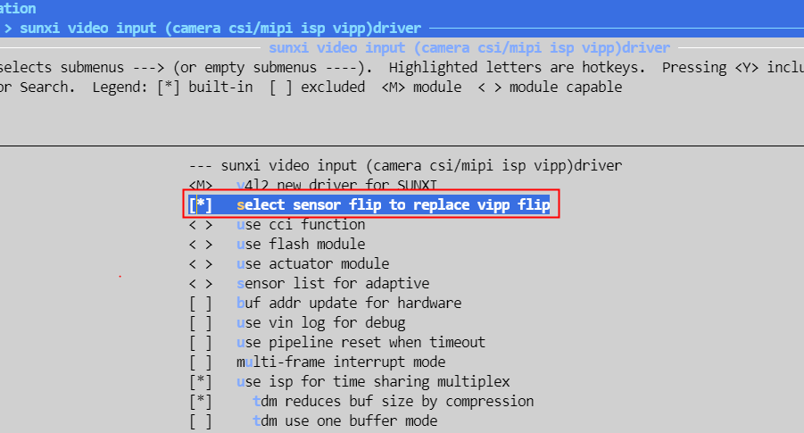

第一步，实现 sensor\_s\_vflip 和 sensor\_s\_hflip 函数。sensor\_s\_vflip 用于设置垂直翻转，sensor\_s\_hflip 用于设置水平翻转。 以思特威 sc3336 为例，规格书中会有翻转寄存器及翻转方向的说明，使用细节及注意事项可以咨询 sensor 原厂。 下图是 sc3336 规格书中对翻转功能的描述：

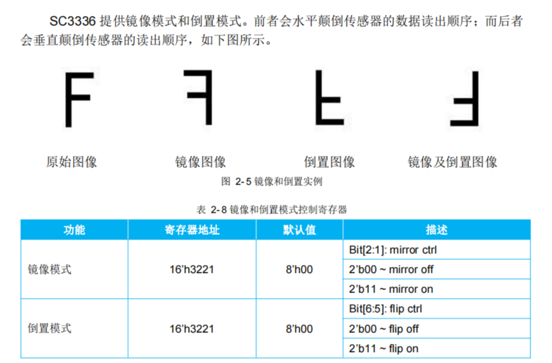

Sensor 驱动翻转接口实现如下：

```c
/* 设置水平翻转 */
static int sensor_s_hflip(struct v4l2_subdev *sd, int enable)
{
	data_type get_value;
	data_type set_value;

	if (!(enable == 0 || enable == 1))
		return -1;

	sensor_read(sd, 0x3221, &get_value);    /* 读取sc3336翻转寄存器值，获取当前的翻转状态 */
	sensor_dbg("ready to flip, regs_data = 0x%x\n", get_value);
	if (enable)
		set_value = get_value | 0x06;	   /* 水平翻转被使能，设置sc3336翻转寄存器的[2:1]为11 */
	else
		set_value = get_value & 0xf9;      /* 水平翻转被禁用，为了不影响垂直翻转效果以及其他寄存器位，此处 & 0xF9保留水平翻转效果 */

	sensor_write(sd, 0x3221, set_value);   /* 将翻转值写入翻转寄存器 */
	sensor_flip_status = set_value;        /* 全局变量记录当前翻转的状态 */
	return 0;
}

/* 设置垂直翻转 */
static int sensor_s_vflip(struct v4l2_subdev *sd, int enable)
{
	data_type get_value;
	data_type set_value;
	if (!(enable == 0 || enable == 1))
		return -1;

	sensor_read(sd, 0x3221, &get_value);   /* 读取sc3336翻转寄存器值，获取当前的翻转状态 */
	sensor_dbg("ready to vflip, regs_data = 0x%x\n", get_value);

	if (enable) {
		set_value = get_value | 0x60;    /* 垂直翻转被使能，设置sc3336翻转寄存器的[6:5]为11 */
	} else {
		set_value = get_value & 0x9f;    /* 垂直翻转被禁用，为了不影响水平翻转效果以及其他寄存器位，此处 & 0x9f保留水平翻转效果 */
	}
	sensor_write(sd, 0x3221, set_value);   /* 将翻转值写入翻转寄存器 */
	sensor_flip_status = set_value;        /* 全局变量记录当前翻转的状态 */
	return 0;
}
```

第二步，修改 sensor\_get\_fmt\_mbus\_core 接口

RAW sensor 图像是以 Bayer 格式传输的（每个像素只表示 RGB 其中一个分量），常见的 Bayer 格式：RGGB、BGGR、GRBG、GBRG，如图所示，Sensor 规格书中会有说明，也可以直接咨询 Sensor 原厂获取。

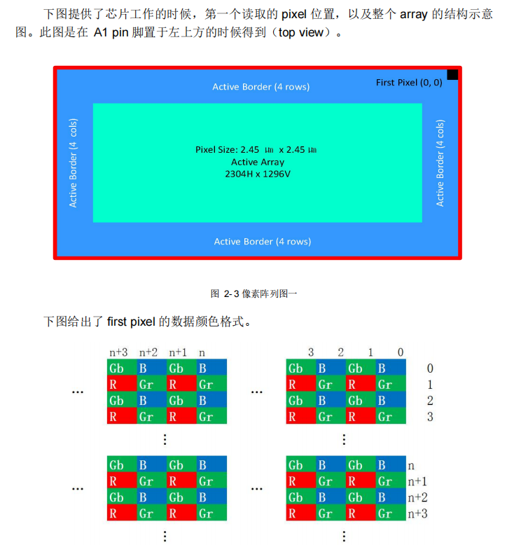

因为 sc3336 在翻转后自身的 Bayer 格式也会随之发生变化，需要修改 sensor\_get\_fmt\_mbus\_core 函数调整 Bayer 格式，如下：

```c
/* 以sc3336为例 */
默认格式：BGGR      		执行水平翻转：GBRG        再执行垂直翻转：RGGB
排列位置：          		排列位置：          		排列位置：
BG             ==>  	GB             ==>      RG
GR                 		RG                      GB

默认格式：BGGR      		执行垂直翻转：GRBG        再执行水平翻转：RGGB
排列位置：          		排列位置：          		排列位置：
BG             ==>  	GR             ==>      RG
GR                 		BG                      GB
```

```c
/* 将四种情况一一列举，并更新给 *code */
static int sensor_get_fmt_mbus_core(struct v4l2_subdev *sd, int *code)
{
	struct sensor_info *info = to_state(sd);
	data_type get_value;

	sensor_read(sd, 0x3221, &get_value);
	sensor_dbg("read value:0x%x\n", get_value);  //读取翻转寄存器获取当前sensor的翻转状态
	switch (get_value & 0x66) {
	case 0x00:   /* sensor当前没有做翻转操作，Bayer格式为sensor初始化时默认的Bayer格式 */
		*code = MEDIA_BUS_FMT_SBGGR10_1X10;
		break;
	case 0x06:   /* sensor当前处于水平翻转，Bayer格式为GBRG */
		*code = MEDIA_BUS_FMT_SGBRG10_1X10;
		break;
	case 0x60:   /* sensor当前处于垂直翻转，Bayer格式为GRBG */
		*code = MEDIA_BUS_FMT_SGRBG10_1X10;
		break;
	case 0x66:   /* sensor当前水平和垂直同时翻转，Bayer格式为RGGB */
		*code = MEDIA_BUS_FMT_SRGGB10_1X10;
		break;
	default:
		*code = info->fmt->mbus_code;
	}
	return 0;
}
```

第三步，上述 Sensor 驱动的翻转接口实现之后，还需要将接口注册到 vin v4l2 框架中，以便上层应用可以调用到相关的接口控制 sensor 的翻转。

sensor\_init\_controls 函数添加水平和垂直翻转控件选项，如下：

```c
static int sensor_init_controls(struct v4l2_subdev *sd, const struct v4l2_ctrl_ops *ops)
{
	v4l2_ctrl_handler_init(handler, 2);
	v4l2_ctrl_new_std(handler, ops, V4L2_CID_HFLIP, 0, 1, 1, 0);
	v4l2_ctrl_new_std(handler, ops, V4L2_CID_VFLIP, 0, 1, 1, 0);

    if (ctrl != NULL)
		ctrl->flags |= V4L2_CTRL_FLAG_VOLATILE;
	return ret;
}
```

sensor\_s\_ctrl 函数添加 V4L2\_CID\_HFLIP 和 V4L2\_CID\_VFLIP，对应上述的 sensor\_s\_hflip 和 sensor\_s\_vflip 函数。

```c
static int sensor_s_ctrl(struct v4l2_ctrl *ctrl)
{
	struct sensor_info *info =
			container_of(ctrl->handler, struct sensor_info, handler);
	struct v4l2_subdev *sd = &info->sd;

	switch (ctrl->id) {
	case V4L2_CID_HFLIP:
		return sensor_s_hflip(sd, ctrl->val);
	case V4L2_CID_VFLIP:
		return sensor_s_vflip(sd, ctrl->val);
	}
	return -EINVAL;
}
```

第四步，sensor\_ctrl\_ops 添加 .try\_ctrl = sensor\_try\_ctrl，防止重复调用会失效：

```c
// 仅添加对应代码即可
static const struct v4l2_ctrl_ops sensor_ctrl_ops = {
	.g_volatile_ctrl = sensor_g_ctrl,
	.s_ctrl = sensor_s_ctrl,
	.try_ctrl = sensor_try_ctrl,	// 防止重复调用会失效
};
```

注：如果需要在上电初始化时就完成翻转动作，那么可以在 sensor 初始化寄存器列表中添加翻转寄存器设置，是否支持需要咨询 sensor 原厂。

##### 自动降帧的实现

sensor 帧率调节场景：

-   环境照度变化（如照度降低），sensor 在 ISP 的引导下被动降低帧率，以延长曝光时间来提升画面亮度和信噪比。
-   高温环境、缩时录影、高负载下降帧率等应用场景，通过 API 给 sensor 设置帧率，以达到主动调节帧率应对不同场景。

实现自动降帧功能需要对以下几个参数有一个了解：

```
帧：描述一个图像帧（一副图像）

最大曝光时间：当前稳定帧率下，sensor 支持的最大曝光时间，比如帧率是20fps，则最大曝光时间：1 / 20fps = 50ms，如果要加长曝光时间，那么意味着帧率需要下调，以此来满足 sensor 更长的曝光时间

PCLK：像素时钟，是指控制图像传感器中每个像素采样和传输的时钟信号。

HTS：行长，一行的长度，可以理解为包含了 hblank 一行的像素数。

VTS：帧长，一帧的长度，可以理解为包含的行数。

FPS：sensor单位时间内曝光并输出图像的频率，比如帧率是20fps，则代表1秒内输出20帧图像。

PCLK、HTS、VTS、FPS满足以下公式（主流 sensor 通用）： PCLK = HTS * VTS * FPS

由此可以推导出 sensor 帧率由 HTS、VTS、PCLK 决定：FPS = PCLK / (HTS * VTS)
```

注：sensor 动态调整帧率的实现方式（大部分 sensor 都是支持，有些 sensor 可能操作上存在一点差异，需要咨询 sensor 原厂），正是通过动态调整 VTS（HTS 也是可以的，只不过不太常用，也有部分 sensor 可能只能通过调整 HTS 来实现）来实时调整帧率的。

**动态调整帧率**

第一步，确认 sensor 的 VTS、HTS 寄存器，sensor 规格书中，一般会标明 VTS 寄存器的详情和使用方式。如下图所示为思特威 SC3336 VTS 寄存器说明：

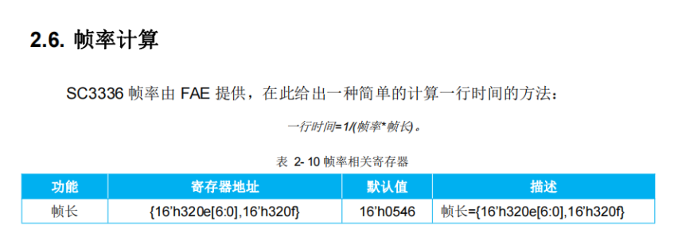

第二步，实现 sensor\_s\_fps 函数

sensor 驱动中提供 sensor\_s\_fps 函数来动态设置 sensor 帧率：

```c
static int sensor_s_fps(struct v4l2_subdev *sd, struct sensor_fps *fps)
```

以 sc3336 为例（提前与 sensor 原厂确认 sensor 是否支持自动降帧且满足公式），通过公式：FPS = PCLK / (HTS \* VTS)来实时计算目标帧率需要的 VTS 并动态设置寄存器，其中要注意做好最大/低帧率限制，防止出现异常情况导致不出图，提供参考代码如下：

```c
static int sc3336_sensor_vts;		// 用于自动降帧策略
static int sc3336_fps_change_flag;	// 帧率变化标志位
static int sensor_s_fps(struct v4l2_subdev *sd, struct sensor_fps *fps)
{
	struct sensor_info *info = to_state(sd);
	struct sensor_win_size *wsize = info->current_wins;
	int sc3336_sensor_target_vts = 0;

	if (fps->fps <= 0 || wsize->hts <= 0) {
		sensor_err("fps->fps = %d, wsize->hts = %d\n!!!!", fps->fps, wsize->hts);
		return -1;
	}

	sc3336_fps_change_flag = 1;
	sc3336_sensor_target_vts = wsize->pclk / fps->fps / wsize->hts;		// 计算目标帧率需要的 VTS 大小

	if (sc3336_sensor_target_vts <= wsize->vts) { // the max fps		// 最大帧率保持，最大帧率限定在原始 setting 输出的帧率，可根据需求自行调整
		sc3336_sensor_target_vts = wsize->vts;
	} else if (sc3336_sensor_target_vts >= (wsize->pclk / wsize->hts)) { // the min fps 最小帧率限制在 1fps，需要与 FAE 沟通此帧率下是否有注意事项，如 VTS 偏移量的控制
		sc3336_sensor_target_vts = (wsize->pclk / wsize->hts) - 8;
	}

	sc3336_sensor_vts = sc3336_sensor_target_vts;
	sensor_dbg("target_fps = %d, sc3336_sensor_target_vts = %d, 0x320e = 0x%x, 0x320f = 0x%x\n", fps->fps,
		sc3336_sensor_target_vts, sc3336_sensor_target_vts >> 8, sc3336_sensor_target_vts & 0xff);
	sensor_write(sd, 0x320f, (sc3336_sensor_target_vts & 0xff));	// 更新 VTS 寄存器，具体寄存器地址以具体 Sensor 为准
	sensor_write(sd, 0x320e, (sc3336_sensor_target_vts >> 8));
	sc3336_fps_change_flag = 0;

	return 0;
}
```

第三步，实现 sensor\_g\_fps 函数用于获取帧率

```c
static int sensor_g_fps(struct v4l2_subdev *sd, struct sensor_fps *fps)
{
	struct sensor_info *info = to_state(sd);
	struct sensor_win_size *wsize = info->current_wins;
	data_type frame_length = 0, act_vts = 0;
	sensor_read(sd, 0x320f, &frame_length);
	act_vts = frame_length << 8;
	sensor_read(sd, 0x320e, &frame_length);
	act_vts |= frame_length;
	fps->fps = wsize->pclk / (wsize->hts * act_vts);
	sensor_dbg("fps = %d\n", fps->fps);
	return 0;
}
```

第四步， 修改 sensor\_ioctl 函数，添加 VIDIOC\_VIN\_SENSOR\_SET\_FPS 和 VIDIOC\_VIN\_SENSOR\_GET\_FPS

```c
static long sensor_ioctl(struct v4l2_subdev *sd, unsigned int cmd, void *arg)
{
    int ret = 0;
    struct sensor_info *info = to_state(sd);
    switch (cmd) {
        case VIDIOC_VIN_SENSOR_GET_FPS:
            ret = sensor_g_fps(sd, (struct sensor_fps *)arg);
            break;
        case VIDIOC_VIN_SENSOR_SET_FPS:
            ret = sensor_s_fps(sd, (struct sensor_fps *)arg);
            break;
        default:
            return -EINVAL;
    }
	return ret;
}
```

第五步，定义一个全局变量（双目场景共用驱动时需要做区分），用于记录当前的 vts 值，并在 sensor\_reg\_init 中初始化，如下：

```c
static int sensor_reg_init(struct sensor_info *info)
{
	int ret;
	struct v4l2_subdev *sd = &info->sd;
	struct sensor_format_struct *sensor_fmt = info->fmt;
	struct sensor_win_size *wsize = info->current_wins;

	ret = sensor_write_array(sd, sensor_default_regs,ARRAY_SIZE(sensor_default_regs));
	if (ret < 0) {
		sensor_err("write sensor_default_regs error\n");
		return ret;
	}

	sensor_dbg("sensor_reg_init\n");

	sensor_write_array(sd, sensor_fmt->regs, sensor_fmt->regs_size);

	if (wsize->regs)
		sensor_write_array(sd, wsize->regs, wsize->regs_size);

	if (wsize->set_size)
		wsize->set_size(sd);

	info->width = wsize->width;
	info->height = wsize->height;
	sc3336_sensor_vts = wsize->vts;  //初始化sc3336_sensor_vts

	sensor_dbg("s_fmt set width = %d, height = %d\n", wsize->width, wsize->height);

	return 0;
}
```

第六步，应用层调用 API 设置帧率

```c
// V85X平台
文件目录：external/eyesee-mpp/middleware/sun8iw21/media/mpi_vi.c
// V821平台
platform/allwinner/eyesee-mpp/middleware/sun300iw1/media/mpi_vi.c
// V861平台
platform/allwinner/eyesee-mpp/middleware/sun252iw1/media/mpi_vi.c

AW_S32 AW_MPI_ISP_SetSensorFps(ISP_DEV IspDev, int fps);
```

**自动降帧**

自动降帧场景一般比较常见：当拍摄场景进入低照度后，ISP 通过延长曝光时间使得 sensor 自动降帧，从而提高信噪比。

第一步，自动降帧的实现方式大同小异，一般是在 sensor\_s\_exp\_gain 函数中检查当前设置的曝光时间是否超过当前帧率对应的 vts，如果超过则动态调整 vts 来延长曝光时间，如果没有则不需要调整 vts，以 sc3336 为例：

```c
static int sensor_s_exp_gain(struct v4l2_subdev *sd, struct sensor_exp_gain *exp_gain)
{
	struct sensor_info *info = to_state(sd);
	int shutter, frame_length;
	int exp_val, gain_val;

	exp_val = exp_gain->exp_val;
	gain_val = exp_gain->gain_val;
	if (gain_val < 1 * 16)
		gain_val = 16;
	if (exp_val > 0xfffff)
		exp_val = 0xfffff;

	if (!sc3336_fps_change_flag) {				 // 检查是否在主动调节帧率，通过标志位或者锁互斥即可
		shutter = exp_val >> 4;					// 主控 曝光行（时间）是以16为1行，所以将上层传下来的曝光行除以16，换算当前实际曝光行
		if (shutter > sc3336_sensor_vts - 8) {	  // 判断当前曝光时间是否大于当前帧率下的 VTS（“-8”只是偏移量，每个sensor都是不一样的）
			frame_length = shutter + 8;			 // 如果大于当前帧率下的 VTS，那么意味着需要增加 VTS 来达到降帧的目的，以此实现自动降帧
		} else
			frame_length = sc3336_sensor_vts;	  // 如果曝光时间未达到需要调整 VTS 来降帧的情况下，那么还是保持当前帧率需要 VTS 值即可
		sensor_write(sd, 0x320f, (frame_length & 0xff));
		sensor_write(sd, 0x320e, (frame_length >> 8));
	}
	sensor_s_exp(sd, exp_val);
	sensor_s_gain(sd, gain_val);
	sensor_dbg("sensor_set_gain exp = %d, %d Done!\n", gain_val, exp_val);
	info->exp = exp_val;
	info->gain = gain_val;

	return 0;
}
```

第二步，调整 ISP 效果文件的最大曝光时间

以下是对 AE Table 进行一个简要的说明， AE Table 用于设定当前效果的曝光表，如图所示，Min Exp 代表最小曝光时间（倒数）—— 1/22000s，Max Exp 代表最大曝光时间（倒数）—— 1/20 s，Min Gain 代表最小增益、Max Gain 代表最大增益（均以 256 为一倍），光圈调节暂不支持，故需要设置为默认值266。

AE 调整亮度的逻辑：第 0 档为起始档位，\`AE 会保持一倍增益的前提下，优先提高曝光时间来达到提升亮度的目的，曝光时间的可调范围为 1/22000s，1/20s，如果曝光时间提高到 1/20s 的状态还没有达到期望亮度，那么会开始向下顺延执行第1档的设定：维持曝光时间为 1/20s 的前提，开始提高增益的倍数，增益的可调范围\[256，32768\]（也就是 1x ~ 128x），以此类推，直到达到最大曝光时间和最大增益。

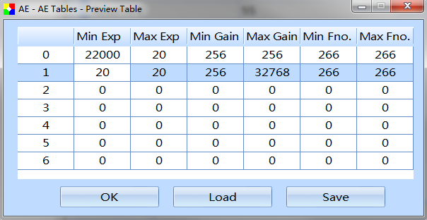

如果当前帧率为 20fps，则需要限制最大曝光时间为 1/20s，那么意味着 ISP 给驱动设置的最大曝光时间则不会大于 1/20s（50ms），如果有自动降帧需求，那么可以将最大曝光时间设置大于 1/20s，例如设置为 1/10s，意味着最大曝光时间从 50ms 调整到 100ms，驱动发现当前曝光时间大于当前 vts 时，便会重新调整 vts 来降帧延长曝光时间。

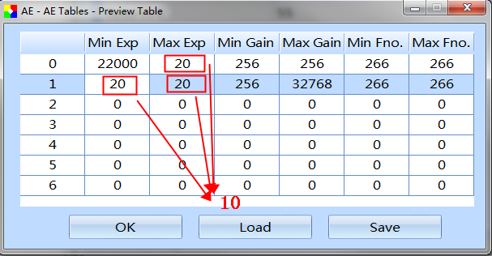

同样，也可以通过修改当前 sensor 的 ISP 效果头文件来验证自动降帧功能是否生效。

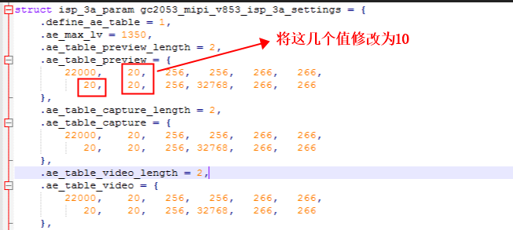

可以通过指令 cat /sys/kernel/debug/mpp/vi 查看 vi 结点的帧间隔来检查降帧是否有生效，如下，internal 指的是当前 sensor 输入图像的帧间隔时长，50ms 对应 20fps：

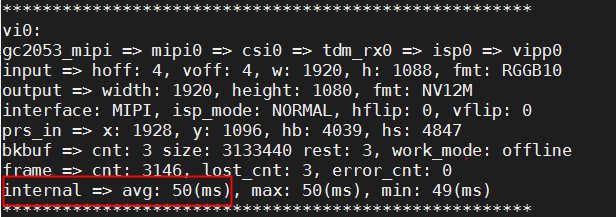

当降帧策略生效时（API 设置帧率或自动降帧），可以看到 50ms 更新为 100ms，意味着帧率从 20fps 下降到 10fps：

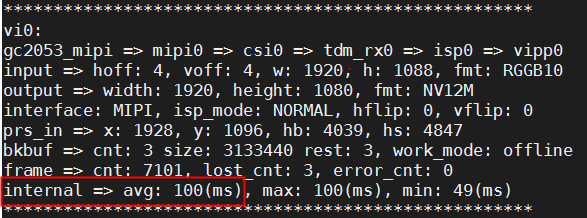

##### 两个 Sensor 共用一份 Sensor 驱动

全志平台支持两个 sensor 共用一份 sensor 驱动，需要修改的内容如下，也可以参考 SDK 中已经支持两个 sensor 共用一份 sensor 驱动的驱动。

```c
/*  下面的设置代表有两个sensor，同名sensor可以共用同一个驱动，SENSOR_NAME要与board.dts中的sensor0_mname一致  */
#define SENSOR_NUM    0x2
#define SENSOR_NAME   "gc2053_mipi"
#define SENSOR_NAME_2 "gc2053_mipi_2"

static int sensor_probe(struct i2c_client *client,
			const struct i2c_device_id *id)
{
    ...
	if (client) {
		for (i = 0; i < SENSOR_NUM; i++) {
			if (!strcmp(cci_drv[i].name, client->name))
				break;
		}
		cci_dev_probe_helper(sd, client, &sensor_ops, &cci_drv[i]);
	} else {
		cci_dev_probe_helper(sd, client, &sensor_ops, &cci_drv[sensor_dev_id++]);
	}
    ...
	return 0;
}

static int sensor_remove(struct i2c_client *client)
{
    ...
	if (client) {
		for (i = 0; i < SENSOR_NUM; i++) {
			if (!strcmp(cci_drv[i].name, client->name))
				break;
		}
		sd = cci_dev_remove_helper(client, &cci_drv[i]);
	} else {
		sd = cci_dev_remove_helper(client, &cci_drv[sensor_dev_id++]);
	}
    ...
	return 0;
}

static const struct i2c_device_id sensor_id[] = {
	{SENSOR_NAME, 0},
	{}
};

static const struct i2c_device_id sensor_id_2[] = {
	{SENSOR_NAME_2, 0},
	{}
};

MODULE_DEVICE_TABLE(i2c, sensor_id);
MODULE_DEVICE_TABLE(i2c, sensor_id_2);

static struct i2c_driver sensor_driver[] = {
	{
		.driver = {
			   .owner = THIS_MODULE,
			   .name = SENSOR_NAME,
			   },
		.probe = sensor_probe,
		.remove = sensor_remove,
		.id_table = sensor_id,
	}, {
		.driver = {
			   .owner = THIS_MODULE,
			   .name = SENSOR_NAME_2,
			   },
		.probe = sensor_probe,
		.remove = sensor_remove,
		.id_table = sensor_id_2,
	},
};
static __init int init_sensor(void)
{
	int i, ret = 0;

	sensor_dev_id = 0;

	for (i = 0; i < SENSOR_NUM; i++)
		ret = cci_dev_init_helper(&sensor_driver[i]);

	return ret;
}

static __exit void exit_sensor(void)
{
	int i;

	sensor_dev_id = 0;

	for (i = 0; i < SENSOR_NUM; i++)
		cci_dev_exit_helper(&sensor_driver[i]);
}
```

#### DVP接口

dvp 接口 sensor 配置方式大部分内容与 MIPI 接口一样，有以下几处地方需要进行修改：

##### 定义分辨率相关配置

分辨率相关配置填写在 sensor\_win\_sizes 数组内成员变量，各成员变量定义和填写规则如下：

```c
//dvp接口的YUV sensor
static struct sensor_win_size sensor_win_sizes[] = {
    {
        .width = HD1080_WIDTH,
        .height = HD1080_HEIGHT,
        .hoffset = 0,
        .voffset = 0,
        .fps_fixed = 25,
        .regs = reg_1080p25_2ch,
        .regs_size = ARRAY_SIZE(reg_1080p25_2ch),
        .set_size = NULL,
    },
}

//dvp接口的raw sensor
static struct sensor_win_size sensor_win_sizes[] = {
	{
        .width = VGA_WIDTH,
        .height = VGA_HEIGHT,
        .hoffset = 0,
        .voffset = 0,
        .hts = 640,
        .vts = 480,
        .pclk = 9216 * 1000,
        .fps_fixed = 1,
        .bin_factor = 1,
        .intg_min = 1,
        .intg_max = 480 << 4,
        .gain_min = 1 << 4,
        .gain_max = 10 << 4,
        .regs = sensor_vga_regs,
        .regs_size = ARRAY_SIZE(sensor_vga_regs),
        .set_size = NULL,
	},
}
```

##### 配置DVP接口

sensor\_g\_mbus\_config 函数赋值也需要进行一个修改，如下：

```c
//dvp接口 BT601 协议的 raw/YUV sensor
static int sensor_g_mbus_config(struct v4l2_subdev *sd, struct v4l2_mbus_config *cfg)
{
	cfg->type = V4L2_MBUS_PARALLEL;
	cfg->flags = V4L2_MBUS_MASTER | VREF_POL | HREF_POL | CLK_POL;
	return 0;
}

//dvp接口 BT656/BT1120 协议的 YUV sensor
static int sensor_g_mbus_config(struct v4l2_subdev *sd, struct v4l2_mbus_config *cfg)
{
	cfg->type = V4L2_MBUS_BT656;
	cfg->flags = CLK_POL | CLK_POH | CSI_CH_0 | CSI_CH_1;  //与当前AHD RX使用的初始化寄存器配置有关，当前使用的是2chn
	return 0;
}
```

对于 interlace 隔行输入 dvp 接口的 sensor，需要在 sensor\_probe 函数将成员变量 sensor\_field 修改为 V4L2\_FIELD\_INTERLACED，如下：

```c
static int sensor_probe(struct i2c_client *client, const struct i2c_device_id *id)
{
	struct v4l2_subdev *sd;
	struct sensor_info *info;
	int ret;

	info = kzalloc(sizeof(struct sensor_info), GFP_KERNEL);
	if (info == NULL)
		return -ENOMEM;
	sd = &info->sd;
	cci_dev_probe_helper(sd, client, &sensor_ops, &cci_drv);
	sensor_init_controls(sd, &sensor_ctrl_ops);
	mutex_init(&info->lock);

	info->fmt = &sensor_formats[0];
	info->fmt_pt = &sensor_formats[0];
	info->win_pt = &sensor_win_sizes[0];
	info->fmt_num = N_FMTS;
	info->win_size_num = N_WIN_SIZES;
	info->sensor_field = V4L2_FIELD_INTERLACED;  /* sensor_field 修改为 V4L2_FIELD_INTERLACED */
}
```

### WDR 模式

mipi 接口 sensor WDR 配置方式大部分内容与 mipi 接口线性模式配置一样，有以下几处地方需要进行修改，如下

#### Sensor 初始化寄存器配置

sensor WDR 初始化寄存器配置与线性模式是不同的，需要翻阅 sensor datasheet 或者询问 sensor 原厂，查看当前 sensor 是否支持 WDR 模式，如支持，需要根据实际应用场景让 sensor 原厂提供对应分辨率和帧率下的初始化寄存器配置。

#### 定义分辨率相关配置

 sensor\_win\_sizes 需要添加两个成员变量，此处以 gc4663 为例，如下：

```c
static struct sensor_win_size sensor_win_sizes[] = {
    {
            .width      = 2560,
            .height     = 1440,
            .hoffset    = 0,
            .voffset    = 0,
            .hts        = 1375,
            .vts        = 2400,
            .pclk       = 132 * 1000 * 1000,
            .mipi_bps   = 648 * 1000 * 1000,
            .fps_fixed  = 15,
            .bin_factor = 1,
            .if_mode    = MIPI_VC_WDR_MODE, /* if_mode成员需要填写为 MIPI_VC_WDR_MODE */
            .wdr_mode   = ISP_DOL_WDR_MODE, /* wdr_mode成员需要填写为 ISP_DOL_WDR_MODE */
            .intg_min   = 1 << 4,
            .intg_max   = 1600 << 4,
            .gain_min   = 1 << 4,
            .gain_max   = 110 << 4,
            .regs       = sensor_2560x1440p15_wdr_regs,
            .regs_size  = ARRAY_SIZE(sensor_2560x1440p15_wdr_regs),
            .set_size   = NULL,
            .top_clk    = 300*1000*1000,
            .isp_clk    = 297*1000*1000,
    },
}
```

注：if\_mode 成员根据当前 sensor WDR 模式下数据传输方式进行填写，一般分为 LI Output 和 VC mode 这两种模式，可以翻阅数据手册或者询问 sensor 原厂。

LI Output：line information output，这种方式是长短帧都在同一个通道交替输出，CSI 拿到后根据 delay line 进行拆分，if\_mode 成员需要填写为 MIPI\_DOL\_WDR\_MODE。

VC Mode：virtual channel mode，这种方式是 MIPI 虚拟出两个通道分别输出长短帧，if\_mode 成员需要填写为 MIPI\_VC\_WDR\_MODE。

如下，是索尼 imx335 DOL WDR 模式下两种数据传输方式 LI Output 和 VC mode 的描述：

LI Output 模式长短帧只有一个 frame start 和 frame end，因为是在一个通道交替输出的，输出的间隔可以受 VBP1 控制。

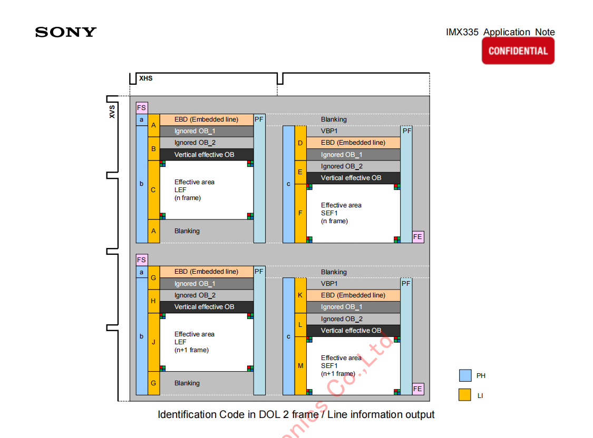

VC 模式长短帧分别都有一个 frame start 和 frame end，是因为分开了两个虚拟通道。

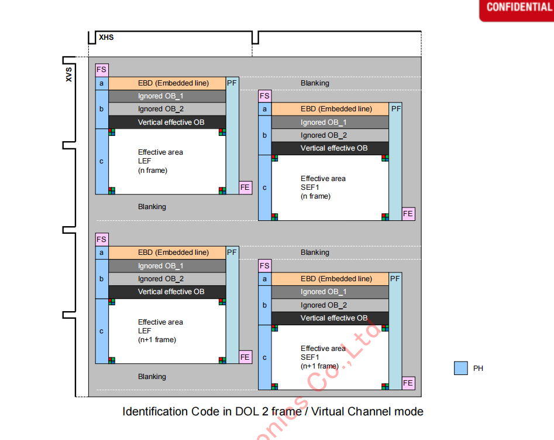

#### 配置 MIPI 接口及 Channel 通道

sensor\_g\_mbus\_config 需要根据当前是否是 WDR 模式，对应传输接口定义需要进行修改，如下：

```c
static int sensor_g_mbus_config(struct v4l2_subdev *sd, struct v4l2_mbus_config *cfg)
{
	struct sensor_info *info = to_state(sd);
	cfg->type  = V4L2_MBUS_CSI2;

    /* 两lane senor WDR模式需要再添加一个标志 V4L2_MBUS_CSI2_CHANNEL_1*/
	if (info->isp_wdr_mode == ISP_DOL_WDR_MODE)
		cfg->flags = 0 | V4L2_MBUS_CSI2_2_LANE | V4L2_MBUS_CSI2_CHANNEL_0 | V4L2_MBUS_CSI2_CHANNEL_1;
	else
		cfg->flags = 0 | V4L2_MBUS_CSI2_2_LANE | V4L2_MBUS_CSI2_CHANNEL_0;

	return 0;
}
```

#### 增益和曝光函数修改

曝光函数的实现 WDR 模式与线性模式差异点在于需要将 ISP 传下来的短曝光值通过换算写入到 sensor 驱动的短曝光寄存器里面，WDR sensor 在 WDR 模式下会有长帧和短帧，所以需要填写 sensor 的短曝光和长曝光寄存器，短曝光与长曝光的换算关系如下：`短曝光（曝光行） = 长曝光（曝光行） / 曝光比`。如下是 gc4663 短曝光寄存器和长曝光寄存器描述：

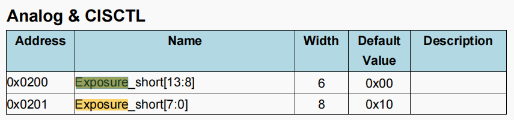

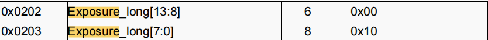

对应的驱动曝光函数修改如下：

```c
static int sensor_s_shutter(struct v4l2_subdev *sd, unsigned int intt_long, unsigned int intt_short)
{
	unsigned int intt_long_h, intt_long_l, intt_short_h, intt_short_l;
	unsigned int short_exp_max = 900, long_exp_max = 0;

	if (intt_long <= 1)
		intt_long = 1;
	if (intt_short < 1)
		intt_short = 1;

	if (intt_short >= short_exp_max)
		intt_short = short_exp_max;
	long_exp_max = 2400 - intt_short - 16;
	if (intt_long >= long_exp_max) {
		intt_long = long_exp_max;
		intt_short = intt_long / HDR_RATIO;
	}

    /* 将换算后的长曝光和短曝光值分别写入sensor短曝光和长曝光寄存器 */
	intt_long_l = intt_long & 0xff;
	intt_long_h = (intt_long >> 8) & 0x3f;
	intt_short_l = intt_short & 0xff;
	intt_short_h = (intt_short >> 8) & 0x3f;

	sensor_write(sd, 0x0202, intt_long_h);
	sensor_write(sd, 0x0203, intt_long_l);
	sensor_dbg("sensor_set_long_exp = %d line Done!\n", intt_long);
	sensor_write(sd, 0x0200, intt_short_h);
	sensor_write(sd, 0x0201, intt_short_l);
	sensor_dbg("sensor_set_short_exp = %d line Done!\n", intt_short);

	return 0;
}

static int sensor_s_exp(struct v4l2_subdev *sd, unsigned int exp_val)
{
	struct sensor_info *info = to_state(sd);
	int tmp_exp_val = exp_val / 16;  //sensor以一行为单位，将ISP设置下来的长曝光值除以16得到长曝光值
	int exp_short = 0;

    /* 需要根据当前模式是WDR还是线性模式，填写对应的曝光寄存器 */
	if (info->isp_wdr_mode == ISP_DOL_WDR_MODE) {
		sensor_dbg("Sensor in WDR mode, HDR_RATIO = %d\n", HDR_RATIO);
		exp_short = tmp_exp_val / HDR_RATIO;   //短曝光（曝光行）= 长曝光（曝光行）/ 曝光比，曝光比与sensor相关，本例中gc4663曝光比为32
		sensor_s_shutter(sd, tmp_exp_val, exp_short);
	} else {
		sensor_dbg("exp_val:%d\n", exp_val);
		sensor_write(sd, 0x202, (tmp_exp_val >> 8) & 0xFF);
		sensor_write(sd, 0x203, (tmp_exp_val & 0xFF));
	}

	info->exp = exp_val;
	return 0;
}
```

WDR 模式下增益函数也需要进行修改，同线性模式一样，每个 sensor 的 Gain Table 都是不一样的，这个可以询问一下 sensor 原厂 Gain Table 填写方式或者翻阅 sensor datasheet 进行查找。如下是 gc4663 增益函数实现：

```c
static int setSensorGain(struct v4l2_subdev *sd, unsigned int gain)
{
	struct sensor_info *info = to_state(sd);
	int i, total;
	unsigned int tol_dig_gain = 0;

	total = sizeof(analog_gain_table) / sizeof(unsigned int);
	for (i = 0; i < total; i++) {
		if (i ==  0) {
			if (analog_gain_table[i] > gain)
				break;
		}
		if (i < total - 1) {
			if ((analog_gain_table[i] <= gain) && (gain < analog_gain_table[i + 1]))
				break;
		}
		if (i == total - 1) {
			if (gain >= analog_gain_table[i])
				break;
		}
	}
	if (i >= total)
		i = total - 1;

	tol_dig_gain = gain * 64 / analog_gain_table[i];

      /* 需要根据当前模式是WDR还是线性模式，填写对应的Gain Table */
	if (info->isp_wdr_mode == ISP_DOL_WDR_MODE) {
		sensor_write(sd, 0x02b3, reg4663ValTable_wdr[i][0]);
		sensor_write(sd, 0x02b4, reg4663ValTable_wdr[i][1]);
		sensor_write(sd, 0x02b8, reg4663ValTable_wdr[i][2]);
		sensor_write(sd, 0x02b9, reg4663ValTable_wdr[i][3]);
		sensor_write(sd, 0x0515, reg4663ValTable_wdr[i][4]);
		sensor_write(sd, 0x0519, reg4663ValTable_wdr[i][5]);
		sensor_write(sd, 0x02d9, reg4663ValTable_wdr[i][6]);
	} else {
		sensor_write(sd, 0x02b3, reg4663ValTable[i][0]);
		sensor_write(sd, 0x02b4, reg4663ValTable[i][1]);
		sensor_write(sd, 0x02b8, reg4663ValTable[i][2]);
		sensor_write(sd, 0x02b9, reg4663ValTable[i][3]);
		sensor_write(sd, 0x0515, reg4663ValTable[i][4]);
		sensor_write(sd, 0x0519, reg4663ValTable[i][5]);
		sensor_write(sd, 0x02d9, reg4663ValTable[i][6]);

		sensor_write(sd, 0x20e, (tol_dig_gain>>6));
		sensor_write(sd, 0x20f, ((tol_dig_gain&0x3f)<<2));
	}

	return 0;
}

static int sensor_s_gain(struct v4l2_subdev *sd, int gain_val)
{
	struct sensor_info *info = to_state(sd);

	if (gain_val == info->gain) {
		return 0;
	}

	sensor_dbg("gain_val:%d\n", gain_val);
	setSensorGain(sd, gain_val * 4);
	info->gain = gain_val;
	return 0;
}
```

### 运行 MPP sample

在完成 sensor 驱动的移植，驱动模块正常加载，I2C 正常通信后，将会在/dev 目录下创建相应的 video 节点，此时可以运行 mpp sample sample\_virvi 打开对应的 video 节点进行图像采集。（mpp sample sample\_virvi 使用方法可以参考一号通文档《Tina\_Linux\_MPP\_Sample\_使用说明》）

运行 sample\_virvi 时会根据配置文件打开对应的 video 节点进行图像采集，如下是 sample\_virvi 正常运行的情况：

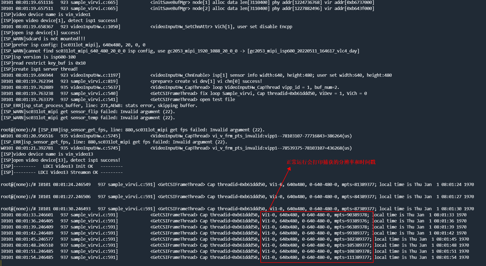

 如果主控端没有收到 sensor 端发过来的数据，则会出现 select timeout 打印，如下：

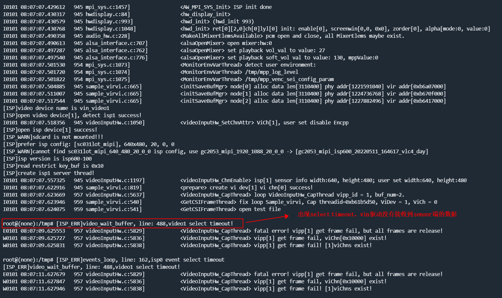

 同时，可以执行指令 cat /sys/kernel/debug/mpp/vi 查看当前打开的 video 节点 cnt 值是否一直在增长。

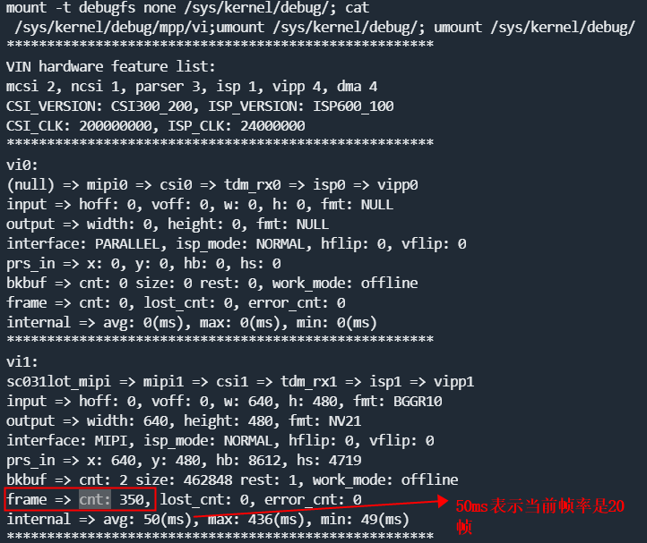

### Sensor 驱动接口调用流程

 如下是 sensor 驱动挂载驱动接口的调用流程：

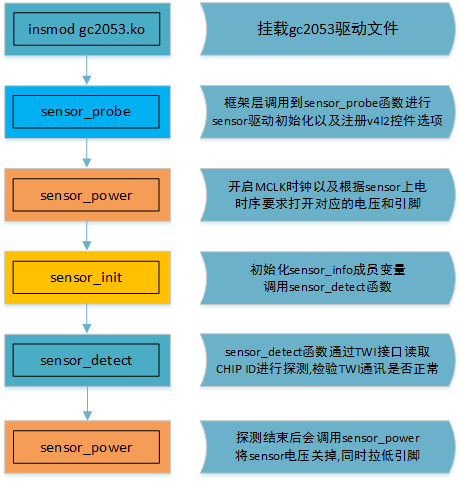

 如下是运行 sample\_virvi 驱动接口的调用流程：

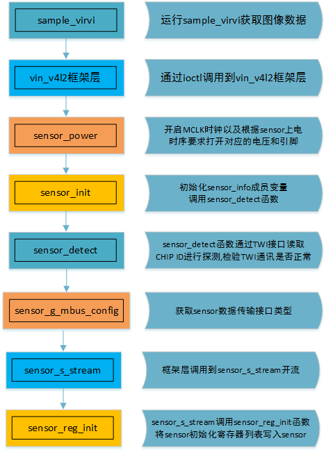

### 异构快启系统 Sensor 移植指导

这个章节是对异构快启系统 Sensor 驱动 移植的简要说明。移植前需要确保该 Sensor 驱动在 Linux 系统已经正常运行并且出图，再进行小核 Sensor 驱动移植，Linux 系统 Sesnor 驱动调试请参考前面章节。

异构快启系统 Linux 系统下 sensor 驱动需要修改以下两点：

1.函数 sensor\_probe()添加一下两个语句：

```c
info->preview_first_flag = 1;
info->first_power_flag = 1;
```

2.修改加载驱动方式

```c
// V85X 平台
#ifdef CONFIG_SUNXI_FASTBOOT
subsys_initcall_sync(init_sensor);
#else
module_init(init_sensor);
#endif

// V821和V861 平台，可以参考 bsp/drivers/vin/modules/sensor/gc1084_mipi.c
VIN_INIT_DRIVERS(init_sensor);
```

| 平台 | 小核驱动路径 |
| --- | --- |
| V85X | lichee/rtos-hal/hal/source/vin/modules/sensor/ |
| V821/V861 | rtos/lichee/rtos/drivers/rtos-hal/hal/source/vin/modules/sensor/ |

将 Linux 系统已经点亮的驱动移植到 melis 这边，melis 系统提供的系统接口与 Linux 差异较大，需要修改 sensor 驱动解决编译错误，具体可以参考同级目录下已经点亮的 sensor 驱动文件。

此处以 V851s 快启开发板所使用的 gc2053 为例进行说明：

#### 添加驱动文件

将 Linux 系统已经点亮的 sensor 驱动添加到 melis 系统 sensor 驱动文件下(lichee/rtos-hal/hal/source/vin/modules/sensor)，melis 系统提供的系统接口与Linux差异较大，需要修改 sensor 驱动解决编译错误，具体可以参考同级目录下已经点亮的 sensor 驱动文件。

#### 添加 MakeFile

进入 lichee/rtos-hal/hal/source/vin/modules/sensor 目录，打开 MakeFile 文件，添加指定语句，这一步的作用是将.c 源文件编译为.o 文件，如下图所示：

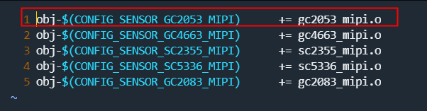

#### 添加 Kconfig

在同级目录下的 Kconfig 文件中，将本文件按照格式添加进去，V85X使用 melis menuconfig 来选择配置, V821和V861使用mrtos menuconfig 来选择配置

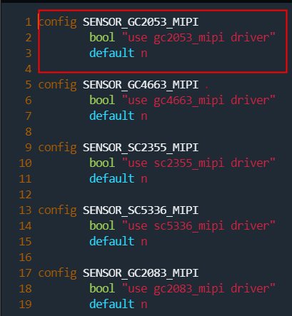

#### 配置 menuconfig

V85X平台使用 mmelis menuconfig， V821、V861平台使用 mrtos menuconfig，进入配置选择对应驱动。

```c
// V85X
 Kernel Setup -> Drivers Setup -> SoC HAL Drivers  -> VIN Devices  -> enable vin driver (DRIVERS_VIN [=y])  -> sensor driver select
// V821和V861
 Kernel Setup -> Drivers Setup -> SoC HAL Drivers  -> VIN Devices  -> enable vin driver (DRIVERS_VIN [=y])  -> sensor driver select
```

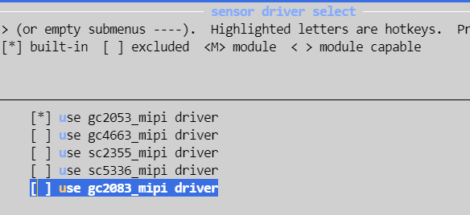

#### 添加 sensor\_fuc\_core 结构体

camera.h (lichee/rtos-hal/hal/source/vin/modules/sensor)\`添加 sensor\_fuc\_core 结构体，如下：

```c
extern struct sensor_fuc_core gc2053_core;
```

#### 注册 func\_core 结构体

sensor\_register.c (lichee/rtos-hal/hal/source/vin/modules/sensor)\`注册 sensor 驱动的 func\_core 结构体，如下：

```c
struct sensor_cfg_array sensor_array[] = {
#ifdef CONFIG_SENSOR_GC2053_MIPI
    {"gc2053_mipi", &gc2053_core},
#endif
};
```

#### 修改 vin 板级配置文件

V85X平台，板级配置文件如下：

```c
// 目录：lichee/rtos-hal/hal/source/vin/platform/vin_config_sun8iw21p1.c
struct sensor_list global_sensors[VIN_MAX_CSI] = {
	/*mipi0 parser0*/
	[0] = {
		.used = 1,
		.sensor_name = "gc2053_mipi",
		.sensor_twi_addr = 0x6e,  //sensor twi地址
		.sensor_twi_id = 1,       //使用的twi组号
		.mclk_id = 0,             //使用的mclk id号
		.use_isp = 1,
		.id = 0,
		.addr_width = 8,          //twi地址位宽
		.data_width = 8,          //twi数据位宽
		.reset_gpio = GPIOE(6),   //reset引脚配置
		.pwdn_gpio = GPIOE(7),    //pwdn引脚配置
		.ir_cut_gpio[0] = 0xffff,
		.ir_cut_gpio[1] = 0xffff,
		.ir_led_gpio = 0xffff,
	},
}
```

 V821、V861 平台，板级配置文件如下：

```c
// V821目录：rtos/board/v821_e907/板级/configs/sys_config.fex
// V861目录：rtos/board/v861_e907/板级/configs/sys_config.fex
// 以V821 pef2-fastboot 为例：rtos/board/v821_e907/perf2_fastboot/configs/sys_config.fex
[vind]

vind_user	= 1
csi_top	= 200000000
csi_top_parent = 1200000000

[vind/sensor0]
sensor0_used          = 1
sensor0_mname         = "gc1084_mipi"
sensor0_twi_cci_id    = 0
sensor0_twi_addr      = 0x6e
sensor0_mclk_id       = 0
sensor0_isp_used      = 1
sensor0_power_en      = port:PD12<default><default><default><default>
sensor0_pwdn          = port:PD12<default><default><default><default>
sensor0_reset         = port:PD12<1><0><1><0>
sensor0_sm_hs         = port:PD12<default><default><default><default>
sensor0_sm_vs         = port:PD12<default><default><default><default>
sensor0_ir_cut0       = port:PD12<default><default><default><default>
sensor0_ir_cut1       = port:PD12<default><default><default><default>
sensor0_ir_led        = port:PD12<default><default><default><default>
```

#### 修改引脚配置

TWI 引脚配置需要修改对应板级方案下的 sys\_config.fex，以 V851s 快启开发板板级配置为例，修改 lichee/melis-v3.0/source/projects/v851-e907-perf2-board/configs/目录下的 sys\_config.fex 文件。

![快起开发板twi引脚硬件连接图]()

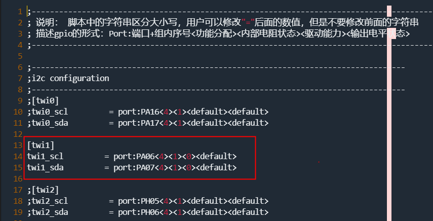

如果所使用的 TWI 组号不是公版默认的 TW0 或 TW1，需要在对应板级方案 main.c 中添加 TWI 信号注册。以 V851s 快启开发板板级配置为例，修改 lichee/melis-v3.0/source/projects/v851-e907-perf2-board/src/ 目录下的 main.c。如下：

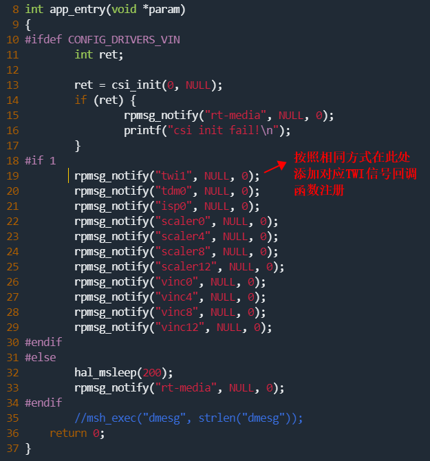

sensor 所使用的 MCLK`、`PWDN(sensor使能引脚)`和 RSTN(sensor复位引脚)`也是在 sys\_config.fex 下进行修改的，如下：


![melis系统中sysconfig文件sensor修改图]()

V821、V861平台，引脚配置也是在板级配置文件中修改：

```c
// V821目录：rtos/board/v821_e907/板级/configs/sys_config.fex
// V861目录：rtos/board/v861_e907/板级/configs/sys_config.fex
// 以V821 pef2-fastboot 为例：rtos/board/v821_e907/perf2_fastboot/configs/sys_config.fex
;----------------------------------------------------------------------------------
;twi configuration
;[twix]
;twi_sck    scl的GPIO配置
;twi_sda    sda的GPIO配置
;----------------------------------------------------------------------------------
[twi0]
twi_sck  = port:PA03<4><1><default><default>
twi_sda  = port:PA04<4><1><default><default>
```

### 运行 demo\_video\_in

在完成 sensor 驱动的移植，驱动模块正常加载，TWI 正常通信后，将会在/dev 目录下创建相应的 video 节点，此时可以运行 rt-meida demo demo\_video\_in 打开对应的 video 节点进行图像采集。

（rt-meida demo demo\_video\_in 使用可以参考快启 SDK 文档：external/fast-user-adapter/rt\_media/rt\_media-demo使用说明.md）

运行 demo\_video\_in 时会根据配置文件打开对应的 video 节点进行图像采集，如下是 demo\_video\_in 正常运行的情况：

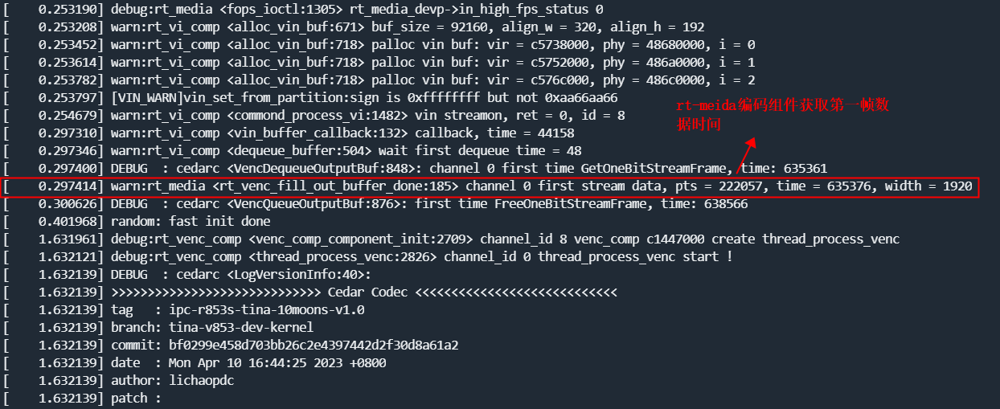

## 常见问题汇总

### 串口读写 Sensor 寄存器

【读 sensor 寄存器命令示例】

```
1）cd /sys/devices/gc2053_mipi（进入目标 sensor 节点目录）
2）echo 16 > addr_width; echo 8 > data_width（输入目标 sensor 寄存器地址/数据位宽，请查阅 datasheet 获取）
3）echo 1 > read_flag（read_flag：读写控制节点，使能为1表示后续操作为读动作，使能为0表示后续操作为写动作）
4）echo 30350021 > cci_client（“30350021”：表示读取0x3035【目标寄存器地址】，在 read_flag = 1 情况下，写入值0021为无效状态）
5）cat read_value（打印上一步操作的结果：寄存器值）
```

【写 sensor 寄存器命令示例】

```
1）cd /sys/devices/gc2053_mipi（进入目标 sensor 节点目录）
2）echo 16 > addr_width; echo 8 > data_width（输入目标 sensor 寄存器地址/数据位宽，请查阅 datasheet 获取）
3）echo 0 > read_flag（read_flag：读写控制节点，使能为1表示后续操作为读动作，使能为0表示后续操作为写动作）
4）echo 36510021 > cci_client （“36510021”：0x3651【目标寄存器地址】，0x0021【将要写入的寄存器值】，在 read_flag = 0 情况下，写入值为0x0021）
5）cat read_value
```

### TWI 通讯异常

主控读写 sensor 寄存器都是通过 TWI 来完成的，所以在调试 sensor 时经常会遇到 TWI 通讯异常，如下：

#### TWI 被占用

TWI 被占用一般是 TWI 配置有冲突导致的，需要检查当前方案 sensor 所使用的 TWI 在 uboot.dts 和 sysconfig.fex 是否也配置上了，需要将其注释掉，如下是 TWI4 被占用的打印：

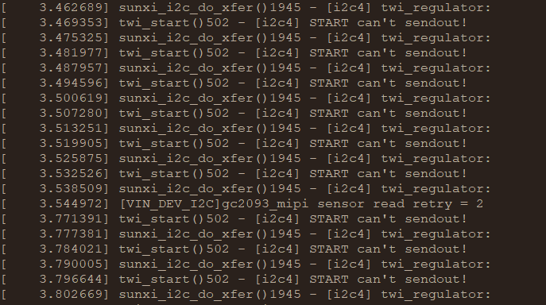

sysconfig.fex 和 uboot.dts 修改如下，将 TWI4 配置注释掉：

![sysconfig修改图]()

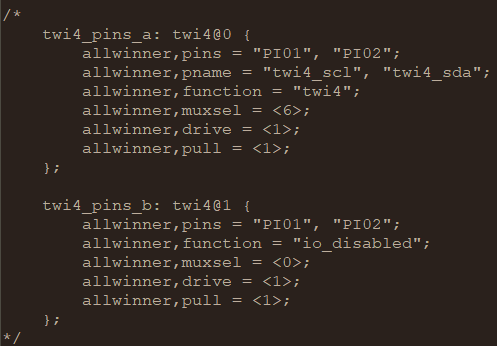

#### TWI 通讯异常

如图 TWI 通讯异常的打印，如果出现 TWI 通讯异常，建议先从几个方面进行排查：

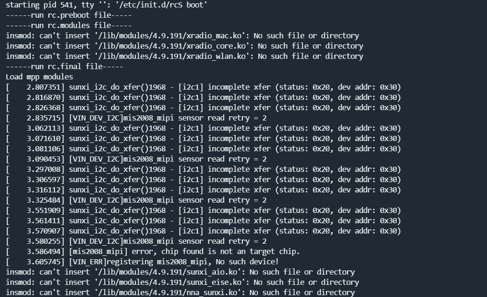

-   检查 board.dts 当前方案 sensor 所使用的 TWI 引脚配置是否正确，是否被其他模块使用。
    
-   检查 board.dts 当前方案 sensor 的 TWI 地址是否正确。
    
-   TWI SCK SDA 引脚硬件上是否有接上拉电阻。
    
-   检查 sensor 驱动的上电时序（sensor\_power 函数）是否有问题，如果上电时序没有问题，需要用万用表量一下 sensor 三路供电 IOVDD、DVDD 和 AVDD 是否符合 sensor 硬件设计指南上的需求，IOVDD 一般是 1.8V, DVDD 一般是 1.2V，AVDD 一般是 2.8V。
    
-   检查 board.dts 当前方案 sensor 的 MCLK 引脚配置是否有冲突，如果配置没有问题，需要使用示波器量一下 sensor 端 MCLK 是否有输出以及频率是否正确，是否与 sensor 驱动配置的一样。
    
-   检查 board.dts 当前方案 sensor 的 PWDN 和 RESET 引脚配置是否有冲突，如下，当前方案 sensor 使用的 PE11 引脚与音频模块有冲突，需要将其注释掉。
    
    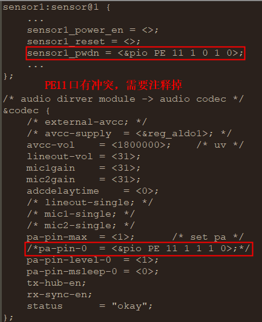
    

#### TWI 读出来的寄存器值异常

如果 TWI 通讯没有出现异常，但是主控端读取到 sensor 寄存器值都为0，则需要检查一下 sensor 驱动配置的 TWI 数据位宽和地址位宽是否与 sensor datasheet 说明一样，见 Sensor TWI 数据位宽和地址位宽章节说明。同时，检查一下 sensor 三路供电 IOVDD`、`DVDD 和 AVDD 是否正常。

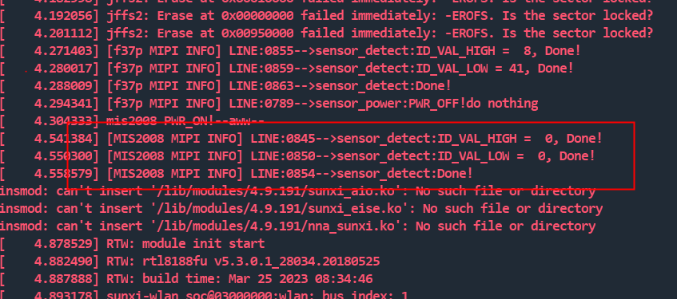

### select timeout 不出图

主控将 sensor 初始化配置写进 sensor 之后，一般 sensor 就会有数据输出，如果出现`[ISP_ERR]video_wait_buffer, line: 488,video8 select timeout!`，则表示当前 video 节点所在的 sensor 是没有数据给到主控端，或者是给过来的数据是有问题的。

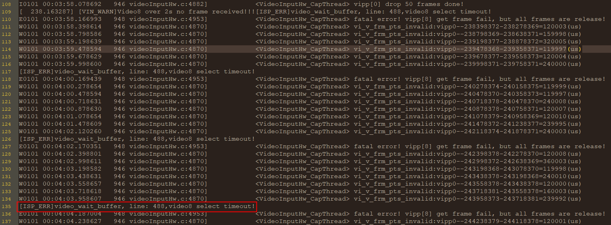

出现 select timeout 的打印可以从以下几点定位问题：

#### 检查 SOC MIPI 寄存器状态

##### MIPI-Parser 寄存器

在 sample\_virvi 运行起来之后，连续抓取 parser 寄存器，这个寄存器值表示 SOC 收到图像的宽高信息，可以快速判断 SOC 是否收到图像数据，抓取寄存器指令如下：

【V85X平台】

以 V85X 平台为例，MIPIA检查 0x05820034 寄存器，MIPIB检查 0x05821034 寄存器。

-   MIPIA/MIPI0：cd /sys/class/sunxi\_dump && echo 0x05820000, 0x05820100 > dump; cat dump
-   MIPIB/MIPI1：cd /sys/class/sunxi\_dump && echo 0x05821000, 0x05821248 > dump; cat dump

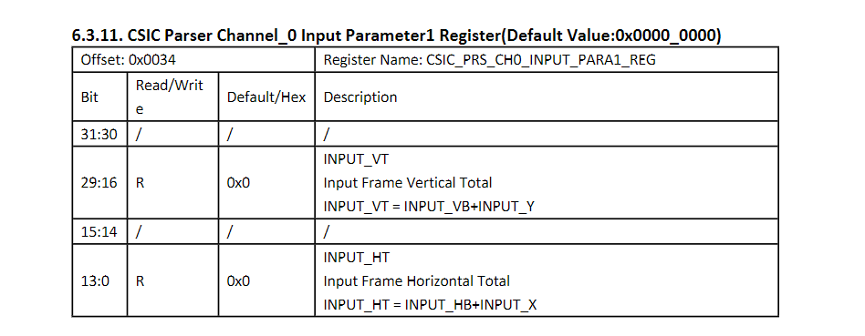

【V821平台】

以 V821 平台为例，MIPIA检查 0x45820034 寄存器，MIPIB检查 0x45821034 寄存器。

-   MIPIA/MIPI0：cd /sys/class/sunxi\_dump && echo 0x45820000, 0x45820200 > dump; cat dump
-   MIPIB/MIPI1：cd /sys/class/sunxi\_dump && echo 0x45821000, 0x45821200 > dump; cat dump

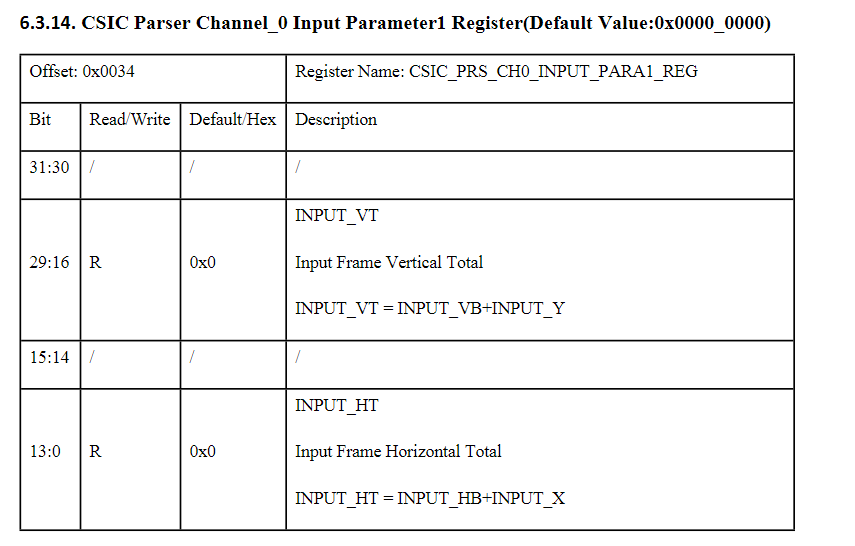

【V861平台】

以 V861 平台为例，MIPIA检查 0x05820034 寄存器，MIPIB检查 0x05821034 寄存器。

-   MIPIA/MIPI0：cd /sys/class/sunxi\_dump && echo 0x05820000, 0x05820100 > dump; cat dump
-   MIPIB/MIPI1：cd /sys/class/sunxi\_dump && echo 0x05821000, 0x05821248 > dump; cat dump

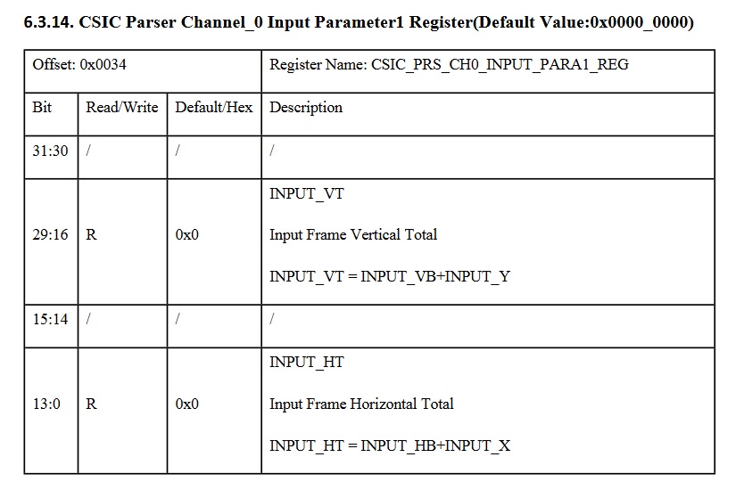

##### MIPI-PHY 寄存器

在通路运行起来之后，连续抓取 MIPI-PHY 寄存器，以 V85X 平台 MIPI0 lane0 为例，检查 0x058101f0 寄存器\`(MIPI1：0x058102f0 寄存器值)的\[19:16\]和\[0:3\]的值，如果 LP 状态处于 3(0011)，则表示 sensor 没有发数据，如果 LP 状态处于 3-5 之间切换，则代表有数据，抓取寄存器指令如下：

【V85X平台】

-   MIPIA/MIPI0：cd /sys/class/sunxi\_dump && echo 0x05810100, 0x058101fc > dump; cat dump
    
-   MIPIB/MIPI1：cd /sys/class/sunxi\_dump && echo 0x05810200, 0x058102fc > dump; cat dump
    

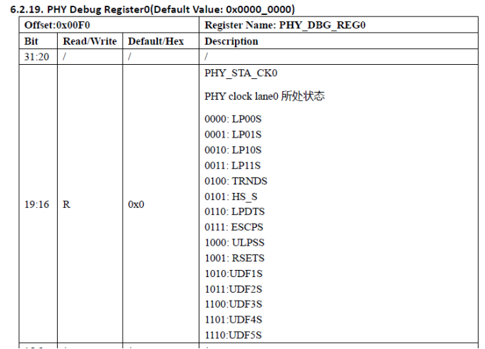

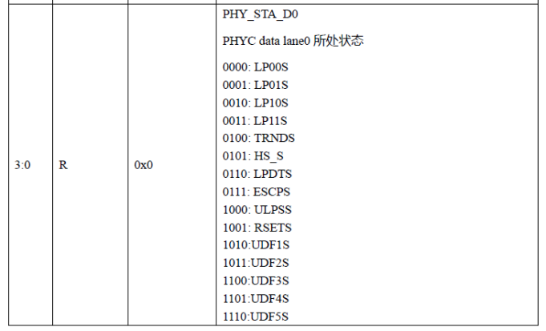

【V821平台】

-   MIPIA/MIPI0：cd /sys/class/sunxi\_dump && echo 0x45810100, 0x458101ff > dump; cat dump
    
-   MIPIB/MIPI1：cd /sys/class/sunxi\_dump && echo 0x45810200, 0x458102fc > dump; cat dump
    

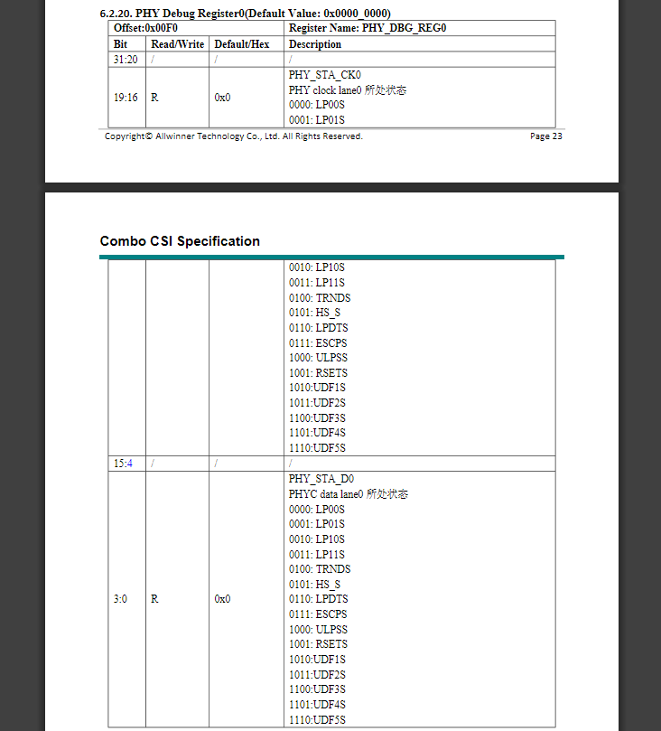

【V861平台】

-   MIPIA/MIPI0：cd /sys/class/sunxi\_dump && echo 0x05810100, 0x058101fc > dump; cat dump
    
-   MIPIB/MIPI1：cd /sys/class/sunxi\_dump && echo 0x05810200, 0x058102fc > dump; cat dump
    

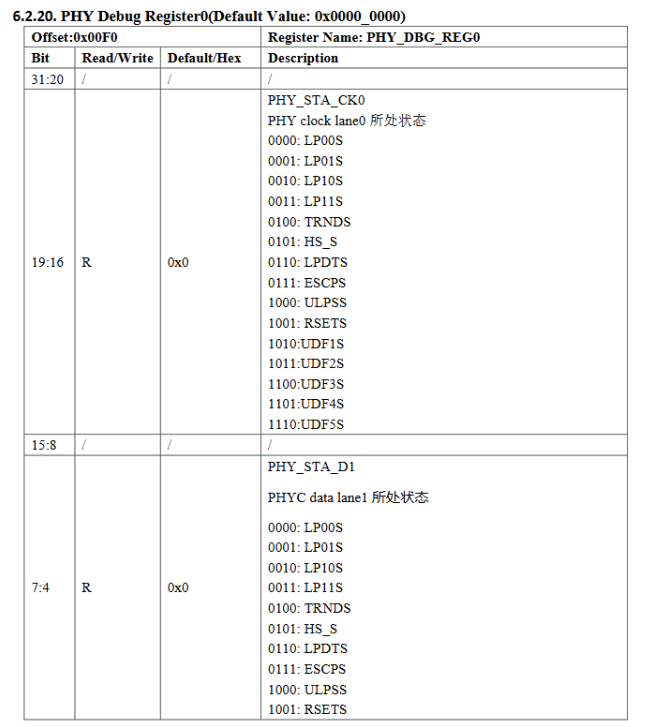 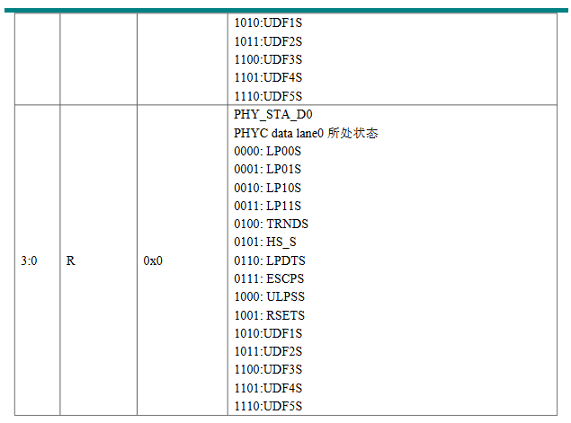

##### MIPI-PAYLOAD 寄存器

在通路运行起来之后，连续抓取 MIPI-PAYLOAD 寄存器，检查\[31：07\]的 ERR PD 标志位是否被置位，如果 ERR PD 被置位，需要检查 MIPI 波形是否正常，抓取寄存器指令如下：

【V85X平台】

以 V85X 平台为例，MIPIA检查 0x05811118 寄存器，MIPIB检查 0x05811518 寄存器。

-   MIPIA/MIPI0：cd /sys/class/sunxi\_dump && echo 0x05811000, 0x058111ff > dump; cat dump
-   MIPIA/MIPI1：cd /sys/class/sunxi\_dump && echo 0x05811400, 0x058115ff > dump; cat dump

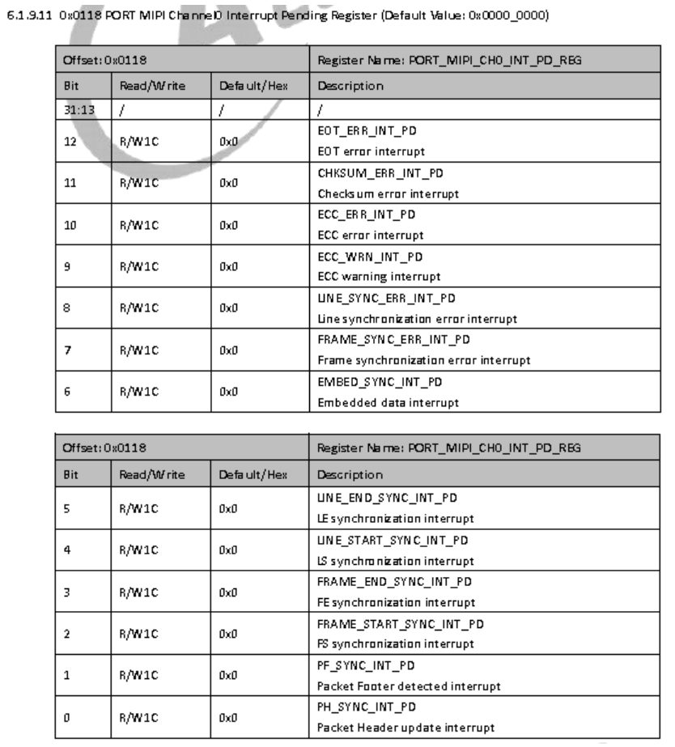

【V821平台】

以 V821 平台为例，MIPIA检查 0x45811118 寄存器，MIPIB检查 0x45811518 寄存器。

-   MIPIA/MIPI0：cd /sys/class/sunxi\_dump && echo 0x45811000, 0x458111ff > dump; cat dump
-   MIPIA/MIPI1：cd /sys/class/sunxi\_dump && echo 0x45811400, 0x458115ff > dump; cat dump

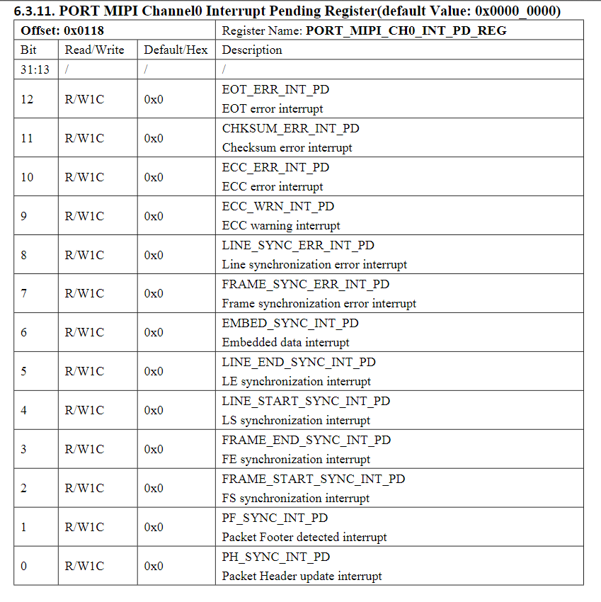

【V861平台】

以 V861 平台为例，MIPIA检查 0x05811118 寄存器，MIPIB检查 0x05811518 寄存器。

-   MIPIA/MIPI0：cd /sys/class/sunxi\_dump && echo 0x05811000, 0x058111ff > dump; cat dump
-   MIPIA/MIPI1：cd /sys/class/sunxi\_dump && echo 0x05811400, 0x058115ff > dump; cat dump

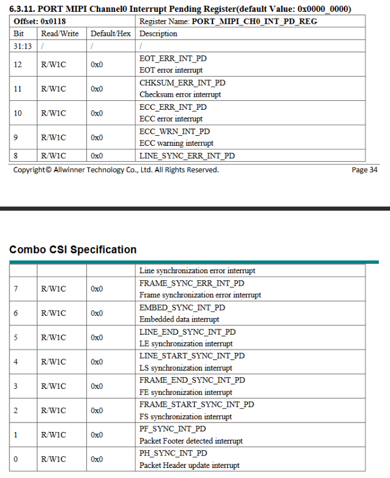

通过上述查看寄存器的方式，可以先初步判断一下是否是 sensor 端没有发送数据过来，与此同时，可以使用示波器量一下 sensor 端的 mipi data 和 mipi clk 引脚是否有波形，如果没有量到波形，则需要检查一下 sensor 驱动的初始化配置是否与 sensor 原厂提供初始化配置一致，同时需要将问题反馈给 sensor 原厂。如果初步检查Sensor有发送数据，且 SOC MIPI 状态有在轮转，那么可以尝试调节 MIPI Clk Delay 寄存器。

#### 调节 MIPI Clk Delay 寄存器

##### 确定 clk delay 范围

PS：需要在边跑应用出图的同时来调试，尽可能在边预览图像边调试，方便判断调整后图像是否还存在花屏、异常横/竖线等异常现象。 第一步，连续多次抓取 MIPI PAYLOAD 寄存器，检查bit【7-12】等异常中断标志位是否被置起，以此来判断 MIPI 状态是否异常。

| 平台 | MIPIA | MIPIB |
| --- | --- | --- |
| V85X/V861 | 0x05811118 | 0x05811518 |
| V821 | 0x45811118 | 0x45811518 |

````c
// V85X、V861
// MIPIA
cd /sys/class/sunxi_dump && echo 0x05811118 0xffffffff > write			// 清除中断标志位
cd /sys/class/sunxi_dump && echo 0x05811000, 0x058111ff > dump; cat dump
// MIPIB
cd /sys/class/sunxi_dump && echo 0x05811518 0xffffffff > write			// 清除中断标志位
cd /sys/class/sunxi_dump && echo 0x05811400, 0x058115ff > dump; cat dump

// V821
// MIPIA
cd /sys/class/sunxi_dump && echo 0x45811118 0xffffffff > write			// 清除中断标志位
cd /sys/class/sunxi_dump && echo 0x45811000, 0x458111ff > dump; cat dump
// MIPIB
cd /sys/class/sunxi_dump && echo 0x45811518 0xffffffff > write			// 清除中断标志位
cd /sys/class/sunxi_dump && echo 0x45811400, 0x458115ff > dump; cat dump
```第二步，如图所示，bit【24:20】是 clk lane0 的软件设定延时值，起到延时采样的作用，适当调整这个参数可以使得 SOC 与 Sensor 的时序更加匹配。

| 平台       | MIPIA       | MIPIB          |
| ----------- | ----------- | -------------- |
| V85X/V861   | 0x05810118  | 0x05810218     |
| V821        | 0x45810118  | 0x45810218     |

```c
// V85X、V861
// MIPIA PHYA 读指令
cd /sys/class/sunxi_dump && echo 0x05810100, 0x058101fc > dump; cat dump
// PHYA 0x05810118 寄存器写指令
cd /sys/class/sunxi_dump && echo 0x05810118 0x00000000 > write
// MIPIB PHYB 读指令
cd /sys/class/sunxi_dump && echo 0x05810200, 0x058102fc > dump; cat dump
// PHYB 0x05810218 寄存器写指令
cd /sys/class/sunxi_dump && echo 0x05810218 0x00000000 > write

// V821
// MIPIA PHYA 读指令
cd /sys/class/sunxi_dump && echo 0x45810100, 0x458101ff > dump; cat dump
// PHYA 0x45810118 寄存器写指令
cd /sys/class/sunxi_dump && echo 0x45810118 0x00000000 > write
// MIPIB PHYB 读指令
cd /sys/class/sunxi_dump && echo 0x45810200, 0x458102fc > dump; cat dump
// PHYB 0x45810218 寄存器写指令
cd /sys/class/sunxi_dump && echo 0x45810218 0x00000000 > write

// 示例：V85X 0x05810118 clk delay 配置为 2
cd /sys/class/sunxi_dump && echo 0x05810118 0x00200000 > write
````

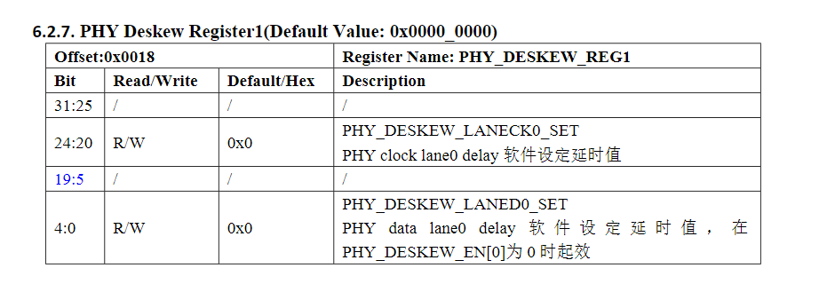

第三步，保持 clk dly 为 0x0，步进递增延时值，同时检查步骤一是否出现异常状态。例如设置 clk dly 等于 0x0，步进递增至0x9 时，MIPI状态满足步骤一（即 MIPI 状态寄存器值异常），那么 clk dly 适用的的范围为【0x0，0x8】，最佳值是取这个范围的中间也就是 0x4。

##### Sensor 驱动配置 clk delay

将调试出来的 clk delay 值配置到 Sensor 驱动。

```c
// 请配置在 sensor_init 函数中
static int sensor_init(struct v4l2_subdev *sd, u32 val)
{
	int ret;
	struct sensor_info *info = to_state(sd);

	sensor_dbg("sensor_init\n");

	/*Make sure it is a target sensor */
	ret = sensor_detect(sd);
	if (ret) {
		sensor_err("chip found is not an target chip.\n");
		return ret;
	}

	info->focus_status = 0;
	info->low_speed = 0;
	info->width = 1280;
	info->height = 720;
	info->hflip = 0;
	info->vflip = 0;
	info->gain = 0;
	info->exp = 0;
	info->deskew = 0x4;		// 配置 clk delay 参数

	info->tpf.numerator      = 1;
	info->tpf.denominator    = 20;	/* 30fps */
	return 0;
}
```

### 翻转失效或图像异常

#### 翻转失效

在调用水平或垂直方向进行翻转，API 已返回成功后，画面延迟生效或者概率性失效，大部分 sensor 在设置翻转寄存器到生效需要一小段时间，可以在设置寄存器后加一点点小延时来规避，也可以通过回读寄存器来大致估摸需要的延时时长，或者在代码中添加回读机制，保证翻转寄存器被更新到后才执行其它操作，如下：

```c
// gc2083垂直翻转示例
data_type sensor_flip_status;	//定义私有全局变量，用于记录当前翻转状态
static int sensor_s_vflip(struct v4l2_subdev *sd, int enable)
{
	unsigned int iic_addr;
	data_type get_value;
	data_type set_value;
	data_type value_0015;
	data_type value_0d15;
	int times_out = 3;
	int eRet;

	if (!(enable == 0 || enable == 1)) {
		sensor_err("Invalid parameter!!!\n");
		return -1;
	}

	sensor_i2c_addr_get(sd, &iic_addr);
	get_value = sensor_flip_status & 0x03;
	if (enable)
		set_value = get_value | 0x02;
	else
		set_value = get_value & 0xFD;

	sensor_write(sd, 0x0015, set_value);
	sensor_write(sd, 0x0d15, set_value);
	do {
		/* write repeatly */
		sensor_write(sd, 0x0015, set_value);	//覆写寄存器
		sensor_write(sd, 0x0d15, set_value);
		eRet = sensor_read(sd, 0x0015, &value_0015);	//回读寄存器
		eRet = sensor_read(sd, 0x0d15, &value_0d15);
		sensor_print("[V] eRet:%d, value_0015 = 0x%x, value_0d15 = 0x%x, times_out:%d\n", eRet, value_0015, value_0d15, times_out);
		usleep_range(10000, 30000);
		times_out--;
	} while ((value_0015 != set_value) && (value_0d15 != set_value) && (times_out >= 0));	//通过覆写和回读，确认寄存器已被更新

	if ((times_out < 0) && ((value_0d15 != set_value) || (value_0015 != set_value))) {
		sensor_err("set vflip failed, please set more times!!!\n");	//寄存器未能被更新到，上报异常
		return -1;
	} else {
		sensor_flip_status = set_value;
	}
	sensor_print("vflip current_switch_choice : 0x%x, set_value : 0x%x, sensor_flip_status = 0x%x, , value_0015 = 0x%x, value_0d15 = 0x%x\n",iic_addr, set_value, sensor_flip_status, value_0015, value_0d15);

	return 0;
}
```

如果寄存器未被正常更新，则上报异常，具体问题也可以咨询 sensor 原厂翻转寄存器设置时，是否有其它相关联寄存器需要同步设置（如切页、组写等），同时，检查驱动中是否有其它操作翻转寄存器的代码，是否存在同时使用的冲突。

### 自动降帧常见问题

#### 调整的帧率与预期不符

有以下几种可能性：

1.sensor\_win\_sizes 中的 VTS、HTS、PCLK 信息填写不正确，VTS、HTS 需要按照 sensor 初始化寄存器列表里的值来进行填写，PCLK 可以通过 sensor 原厂获取（或自行计算）后填写，注意三者要满足公式，这三个关键信息是会交由 ISP 计算实际的曝光时间的，如果填写不准确会间接导致曝光时间有误差，进而导致降帧时帧率产生误差。

```c
 PCLK = HTS * VTS * FPS
```

2.更新 VTS、HTS 寄存器的方法有误，寄存器的读写方式需要严格按照规格书描述来操作（也可以直接询问 sensor 原厂），注意大部分寄存器会区分高低位信息分别更新两个寄存器，需要留意写入的值是否符合预期，可以在更新寄存器后，使用 sensor\_read 函数回读打印确认，并实时查看 VI 结点信息来检查。

3.检查 ISP 效果的最大曝光时间设置是否与预期不符，如目标是自动降帧至 10fps，但最大曝光时间又限制在 1/20s，那么不会触发自动降帧策略，当然也存在当前照度可能还未到要降帧延长曝光时间的时候；

#### 设置帧率之后，Sensor 不出图

有以下几种可能性：

1.回退驱动中帧率调整的相关代码，检查出图稳定性，是否真的是帧率改动导致的不出图。

2.检查VTS、HTS 寄存器，确保 VTS、HTS 寄存器更新成功，设置的值也符合预期；如果确定寄存器值符合预期，那么可以咨询 sensor 原厂该 sensor 在调整帧率时是否有其它注意事项，如 VTS 偏移量限制等。

### Sensor 调试案例汇总

#### 思特威 sc031lot 摄像头 select timeout

在 V851s 平台调试思特威 sc031lot 摄像头时，运行 sample\_virvi 出现 select timeout 获取不到图像数据，通过以下方式进行排查：

```c
1. 用万用表测量sensor的三路供电(DOVDD/DVDD/AVDD)是否正常，电压均正常
2. 查看sensor驱动的上电时序部分并对比sensor datasheet，上电时序符合要求
3. 用示波器测量sensor端的MCLK引脚，MCLK引脚有波形输出，频率符合设定值
4. 用示波器测量sensor端的mipi data和mipi clk引脚有波形输出
5. 通过执行指令 `cd /sys/class/sunxi_dump && echo 0x05810200,0x058102fc > dump; cat dump` 查看主控端MIPI-PHY寄存器的状态，如下：
```

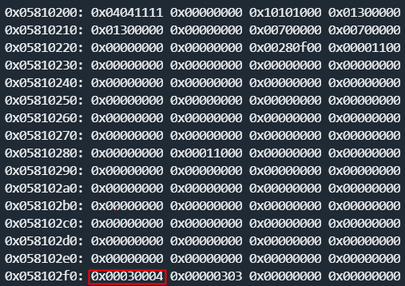

从上面截图信息可以看出，0x058102f0 寄存器\[0:3\]的值是4，表示当前LP 状态处于 4(0100)，则表示当前主控端处于异常状态 TRNDS，主控端会进入异常状态 TRNDS 是由于 MIPI DATA 引脚接收到了 sensor 端发过来的一段异常数据(LP11-10-00-10-00)导致的，如下：

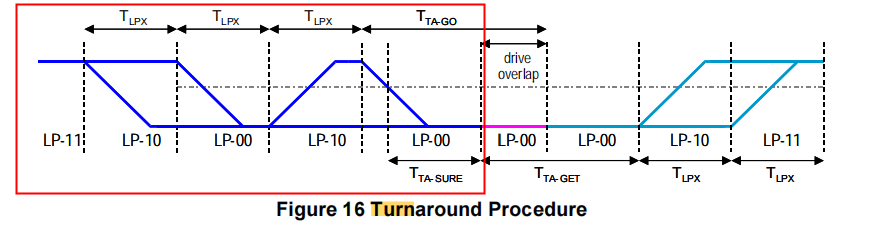

在运行 sample\_virvi 时 sensor 发送给第一段数据时，用示波器和逻辑分析仪抓取波形分析，能够看到 sensor 发送的第一段数据包含了异常数据(LP11-10-00-10-00)，如下：

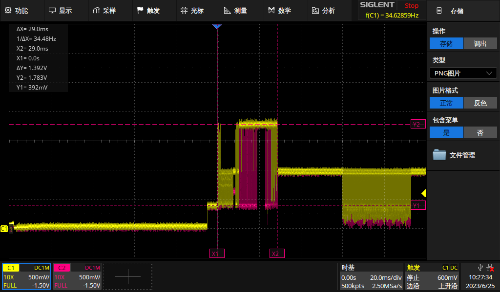

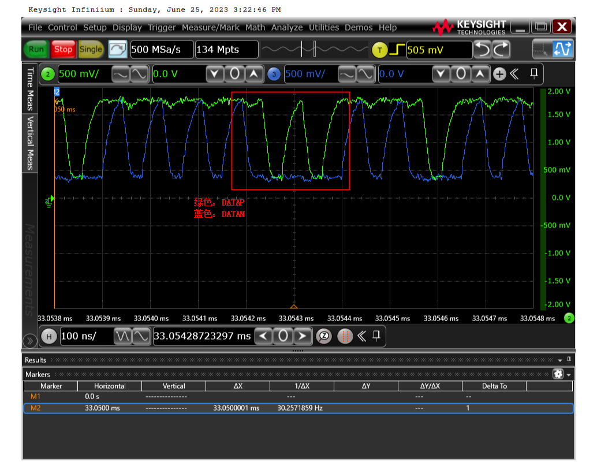

由于这段异常数据 sensor 原厂无法规避，而主控端处于异常状态 TRNDS 时，会由原先的 RX 状态切换为 TX 状态，此时只能对主控端的 MIPI-PHY 进行复位才能恢复正常，在应用层获取 sensor 图像之前执行指令复位主控端的 MIPI-PHY，如下：

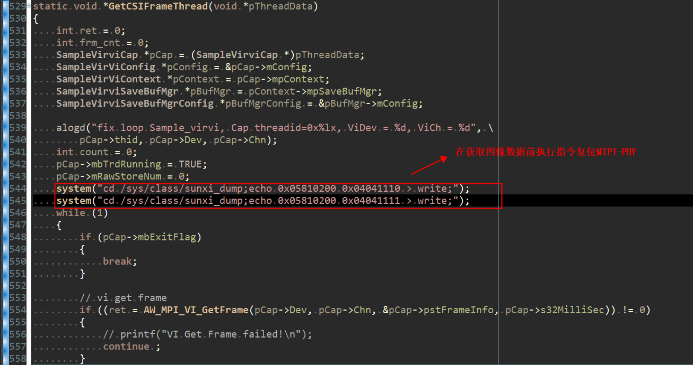

#### 后拉图像黑白问题

有客户在 V851 平台上使用 tp9951 yuv sensor，出现图像黑白问题，通过以下方式进行排查：

```
1. 用万用表测量sensor的三路供电(DOVDD/DVDD/AVDD)是否正常，电压均正常
2. 查看sensor驱动的上电时序部分并对比sensor datasheet，上电时序符合要求
3. 用示波器测量sensor端的MCLK引脚，MCLK引脚有波形输出，但频率有一定偏差
```

将问题反馈给 AHD RX 芯片原厂，原厂定位分析是 V851 主控端输出的 27M MCLK 偏大，MCLK 频偏不能超过 50ppm，颜色是调制信号，频偏比较大会 lock 不住色彩同步。用示波器量 MCLK 波形，量出来的频率是 27.1372MHz，不符合 AHD RX 芯片原厂的要求，如下：

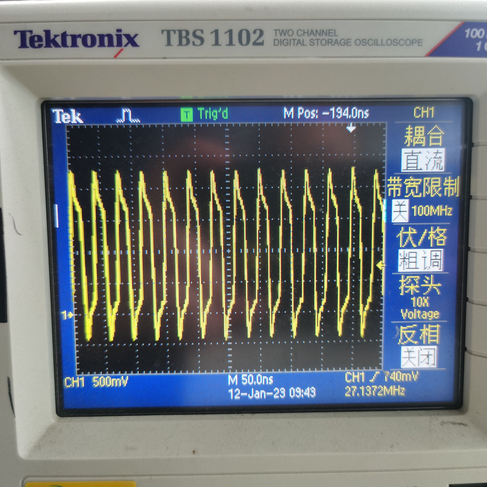

在 AHD 芯片上外挂一个 27M 晶振后，出来的图像颜色就正常了，所以可以得出是主控端的 27M MCLK 有频偏导致的，通过指令 cat /sys/kernel/debug/clk/clk\_summary 查看到当前使用的 MCLK 时钟源是 CSIPLL4X\`，如下：

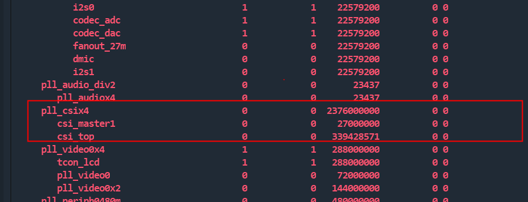

通过指令 cd /sys/class/sunxi\_dump && echo 0x02001048 > dump; cat dump 查看 0x02001048 寄存器 bit24 是否被置1， 判断 27M MCLK 时钟源 CSIPLL4X 是否有打开展频功能，如下，相应 PLL 寄存器展频是打开的。（确认展频功能是否有打开可以参考 一号通文档 《Tina\_Linux\_V85X\_方案FAQ》1.12.4 确认展频功能是否打开章节）

![PLLCSI寄存器值]()

![PLLCSI寄存器信息]()

通过修改 lichee/linux-4.9/arch/arm/boot/dts/sun8iw19p1-clk.dtsi，将 PLL\_CSIX4 时钟源的展频功能关掉后，重新测量 MCLK 波形，MCLK 频率为 27.002504 MHz，出来的图像颜色就正常了。

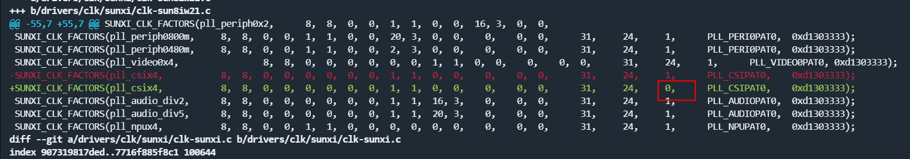

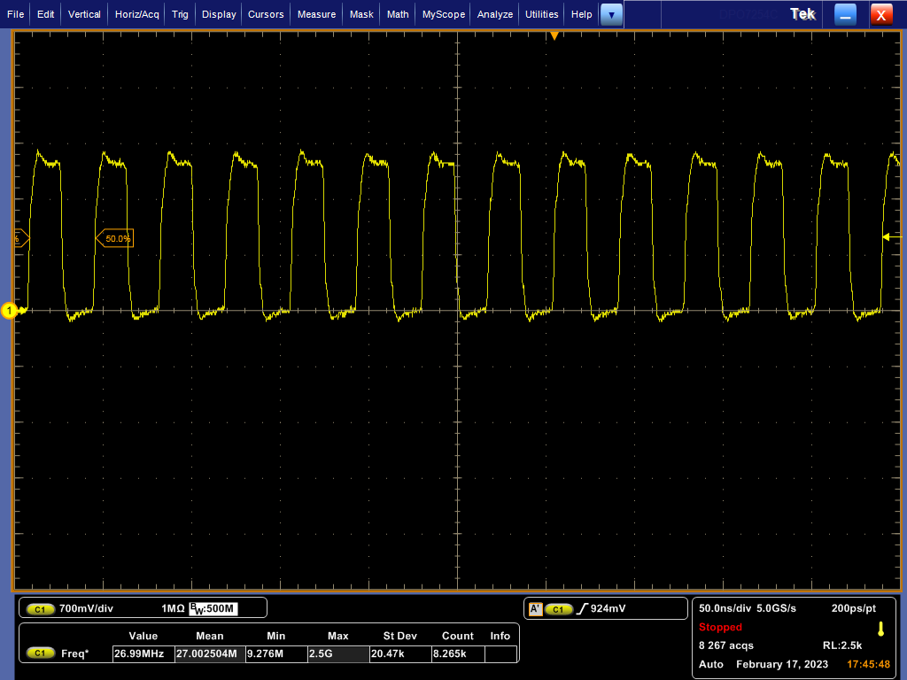
