# U-Boot 显示与开机 LOGO

由于内核启动需要一定时间，所以会选择在 U-Boot 中开启显示驱动，提前初始化屏幕显示启动 LOGO，这样可以增强户体验。

下文将以 V821-PERF2B 板级和配套的显示屏模组 T27P06 作为示例，演示如何配置 U-Boot 显示驱动与开机 LOGO。

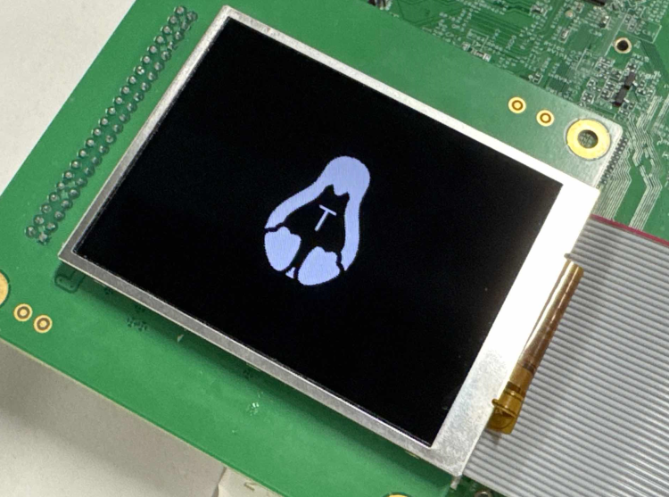

## 转换内核驱动到 U-Boot

内核显示驱动与 U-Boot 显示驱动大部分函数都是相同的，仅有部分差异。

修改驱动文件 `t27p06.c` 将

```c
static void LCD_cfg_panel_info(struct panel_extend_para *info)
```

修改为

```
static void LCD_cfg_panel_info(panel_extend_para *info)
```

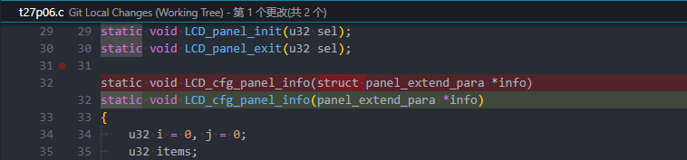

修改驱动文件 `t27p06.c` 将

```c
struct __lcd_panel t27p06_panel
```

修改为

```c
__lcd_panel_t t27p06_panel
```

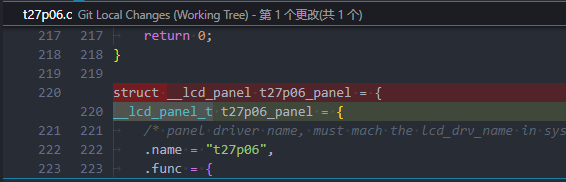

修改驱动头文件 `t27p06.h` 将

```c
extern struct __lcd_panel t27p06_panel;
```

修改为

```c
extern __lcd_panel_t t27p06_panel;
```

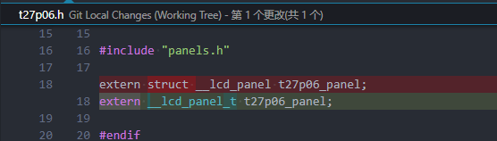

## U-Boot 驱动配置

### 驱动功能配置

首先需要确认 U-boot 使用的配置文件，查看板级目录中的 `device/config/chips/v821/configs/perf2b/BoardConfig_nor.mk` 配置文件的 `LICHEE_BRANDY_DEFCONF` 配置项，这里是 `sun300iw1p1_v821_defconfig`

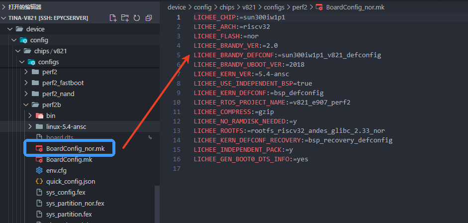

前往 U-Boot 的配置目标文件夹 `brandy/brandy-2.0/u-boot-2018/configs` 找到配置 `sun300iw1p1_v821_defconfig` 文件

增加下列配置开启启动 LOGO，DISP 驱动，并且开启 `CONFIG_LCD_SUPPORT_T27P06=y` 对应的显示驱动。

```shell
CONFIG_BOOT_GUI=y
CONFIG_CMD_SUNXI_BMP=y
CONFIG_SUNXI_ADVERT_PICTURE=y
CONFIG_LZMA=y
CONFIG_DISP2_SUNXI=y
CONFIG_LCD_SUPPORT_T27P06=y
```

另外由于引脚复用，需要取消勾选 GMAC 模块，删除如下配置

```shell
CONFIG_NETDEVICES=y
CONFIG_SUNXI_GMAC=y
CONFIG_NET=y
CONFIG_NET_RANDOM_ETHADDR=y
CONFIG_CMD_MII=y
CONFIG_CMD_NET=y
CONFIG_CMD_TFTPBOOT=y
CONFIG_NET_TFTP_VARS=y
CONFIG_CMD_NFS=y
CONFIG_CMD_PING=y
```

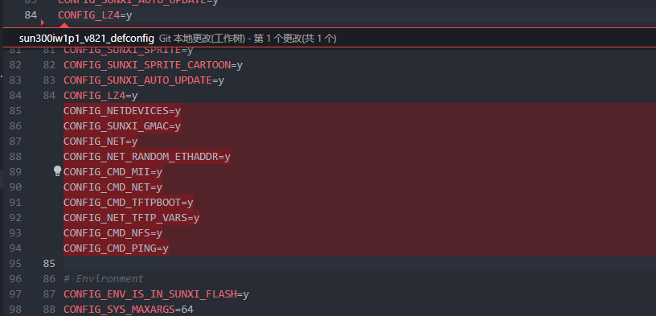

如果打包时候出现以下错误，请裁剪下 U-Boot 功能或者增加 U-Boot 起始地址，这是由于 U-Boot 太大了，已经覆盖了后面的分区布局

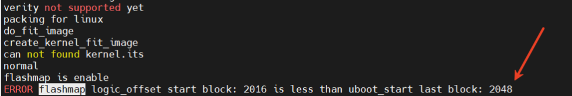

-   裁剪 U-Boot 功能：
    
    -   对照 `sun300iw1p1_min_defconfig` 配置，将不使用的功能关闭即可
-   修改起始地址：
    
    -   修改板级配置下的 `uboot-board.dts` 增大 `logic_offset`
        
        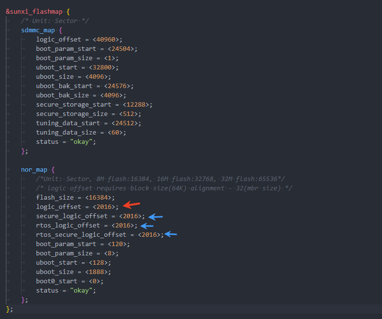
        

### 设备树配置

**配置背光**

首先设备树配置背光使用的 PWM 引脚，参考电路图，使用的是 PD13 引脚

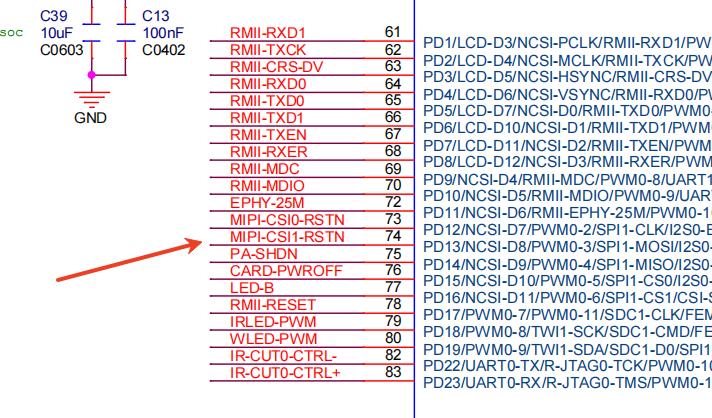

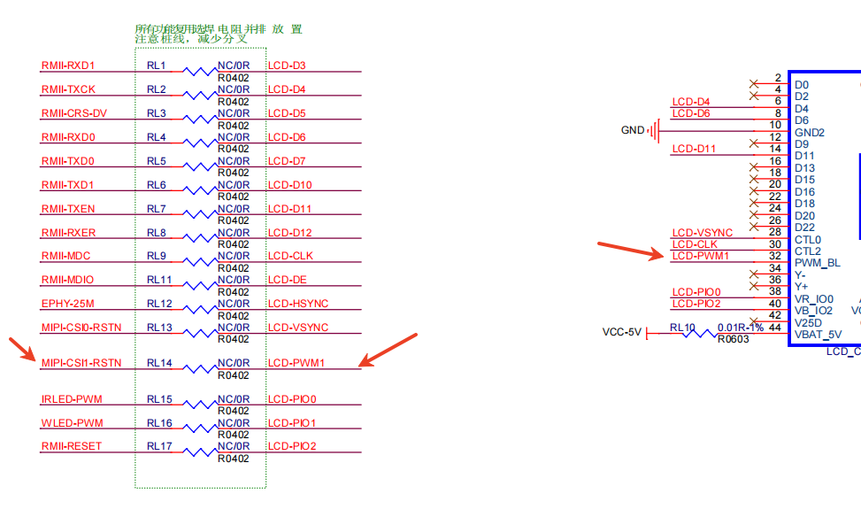

PD13 引脚是 PWM3，则配置 PWM3 作为背光功能

```c
&pwm3_pin_a {
        allwinner,pins = "PD13";
        allwinner,function = "pwm_3";
        allwinner,muxsel = <0x4>;
        allwinner,drive = <10>;
        allwinner,pull = <2>;
};

&pwm3_pin_b {
        allwinner,pins = "PD13";
        allwinner,function = "io_disabled";
        allwinner,muxsel = <0xf>;
        allwinner,drive = <3>;
        allwinner,pull = <2>;
};

&pwm3 {
        pinctrl-names = "active", "sleep";
        pinctrl-0 = <&pwm3_pin_a>;
        pinctrl-1 = <&pwm3_pin_b>;
        status = "okay";
};
```

**配置 DISP 驱动和 LCD**

首先配置 DISP 驱动

```c
&disp {
	disp_init_enable         = <1>;
	disp_mode                = <0>;

	dev0_output_type         = <1>;
	screen0_to_lcd_index     = <0>;
	dev0_output_mode         = <4>;
	dev0_screen_id           = <0>;
	dev0_do_hpd              = <0>;

	fb0_format               = <0>;
	fb0_width                = <0>;
	fb0_height               = <0>;

	chn_cfg_mode             = <1>;
	disp_para_zone           = <1>;
};
```

配置含义

```
disp init configuration

disp_mode             		(0:screen0<screen0,fb0>)
screenx_output_type   		(0:none; 1:lcd; 2:tv; 3:hdmi;5:vdpo)
screenx_output_mode   		(used for hdmi output, 0:480i 1:576i 2:480p 3:576p 4:720p50 5:720p60 6:1080i50 7:1080i60 8:1080p24 9:1080p50 10:1080p60)
screenx_output_format 		(for hdmi, 0:RGB 1:yuv444 2:yuv422 3:yuv420)
screenx_output_bits   		(for hdmi, 0:8bit 1:10bit 2:12bit 2:16bit)
screenx_output_eotf   		(for hdmi, 0:reserve 4:SDR 16:HDR10 18:HLG)
screenx_output_cs     		(for hdmi, 0:undefined  257:BT709 260:BT601  263:BT2020)
screenx_output_dvi_hdmi 	(for hdmi, 0:undefined 1:dvi mode 2:hdmi mode)
screen0_output_range   		(for hdmi, 0:default 1:full 2:limited)
screen0_output_scan    		(for hdmi, 0:no data 1:overscan 2:underscan)
screen0_output_aspect_ratio (for hdmi, 8-same as original picture 9-4:3 10-16:9 11-14:9)
fbx format            		(4:RGB655 5:RGB565 6:RGB556 7:ARGB1555 8:RGBA5551 9:RGB888 10:ARGB8888 12:ARGB4444)
fbx pixel sequence    		(0:ARGB 1:BGRA 2:ABGR 3:RGBA)
fb0_scaler_mode_enable		(scaler mode enable, used FE)
fbx_width,fbx_height  		(framebuffer horizontal/vertical pixels, fix to output resolution while equal 0)
lcdx_backlight        		(lcd init backlight,the range:[0,256],default:197
lcdx_yy               		(lcd init screen bright/contrast/saturation/hue, value:0~100, default:50/50/57/50)
lcd0_contrast         		(LCD contrast, 0~100)
lcd0_saturation       		(LCD saturation, 0~100)
lcd0_hue              		(LCD hue, 0~100)
                       
framebuffer software rotation setting:
disp_rotation_used:   		(0:disable; 1:enable,you must set fbX_width to lcd_y, set fbX_height to lcd_x)
degreeX:              		(X:screen index; 0:0 degree; 1:90 degree; 3:270 degree)
degreeX_Y:            		(X:screen index; Y:layer index 0~15; 0:0 degree; 1:90 degree; 3:270 degree)

devX_output_type 			: config output type in bootGUI framework in UBOOT-2018.
									(0:none; 1:lcd; 2:tv; 4:hdmi;)
devX_output_mode 			: config output resolution(see include/video/sunxi_display2.h) of bootGUI framework in UBOOT-2018
devX_screen_id   			: config display index of bootGUI framework in UBOOT-2018
devX_do_hpd      			: whether do hpd detectation or not in UBOOT-2018
chn_cfg_mode     			: Hardware DE channel allocation config. 
                       				0:single display with 6 channel, 
                       				1:dual display with 4 channel in main display and 2 channel in second display, 
                       				2:dual display with 3 channel in main display and 3 channel in second in display.
```

然后需要配置 LCD 驱动

```c
&lcd0 {
	lcd_used            = <1>;
	lcd_driver_name     = "t27p06";

	lcd_if              = <0>;
	lcd_hv_if           = <8>;

	lcd_x               = <320>;
	lcd_y               = <240>;
	lcd_width           = <108>;
	lcd_height          = <64>;

	lcd_dclk_freq       = <27>;
	lcd_hbp             = <70>;
	lcd_ht              = <1716>;
	lcd_hspw            = <1>;
	lcd_vbp             = <21>;
	lcd_vt              = <263>;
	lcd_vspw            = <1>;

	lcd_backlight       = <50>;
	lcd_pwm_used        = <1>;
	lcd_pwm_ch          = <3>;
	lcd_pwm_freq        = <50000>;
	lcd_pwm_pol         = <0>;
	lcd_pwm_max_limit   = <255>;
	lcd_bright_curve_en = <1>;

	lcd_frm             = <0>;
	lcd_hv_clk_phase    = <1>;
	lcd_hv_sync_polarity= <0>;
	lcd_hv_srgb_seq     = <2>;
	lcd_io_phase        = <0x0000>;
	lcd_gamma_en        = <0>;
	lcd_cmap_en         = <0>;
	lcd_rb_swap         = <0>;

	/* cs */
	lcd_gpio_0          = <&pio PD 18 1 1 2 0>;//ID0 : direct(0:in 1:out)/pull(0:disable 1:up 2:down)/driver(0123)/level
	/* sda */
	lcd_gpio_1          = <&pio PD 19 1 1 2 0>;//ID0 : direct(0:in 1:out)/pull(0:disable 1:up 2:down)/driver(0123)/level
	/* sck */
	lcd_gpio_2          = <&pio PD 17 1 1 2 0>;//ID0 : direct(0:in 1:out)/pull(0:disable 1:up 2:down)/driver(0123)/level

	pinctrl-0 = <&rgb8_pins_a>, <&rgb8_pins_ctl_a>;
	pinctrl-1 = <&rgb8_pins_b>, <&rgb8_pins_ctl_b>;
};
```

## 内核驱动配置

在内核中，需要开启同样的显示驱动，背光驱动等。

### 驱动配置

```ini
CONFIG_AW_DISP2=y
CONFIG_AW_DISP2_DEBUG=y
CONFIG_LCD_SUPPORT_T27P06=y
CONFIG_BACKLIGHT_CLASS_DEVICE=y
```

### 设备树配置

PWM 设备配置

```c
&pio {
	pwm3_pins_active: pwm3@0 {
		pins = "PD13"; /* lcd-pwm */
		function = "pwm0_3";
	};

	pwm3_pins_sleep: pwm3@1 {
		pins = "PD13";
		function = "gpio_in";
		bias-pull-down;
	};
};

&pwm0_3 {
	pinctrl-names = "active", "sleep";
	pinctrl-0 = <&pwm3_pins_active>;
	pinctrl-1 = <&pwm3_pins_sleep>;
	status = "okay";
};
```

DISP 节点配置

```c
&disp {
	disp_init_enable         = <1>;
	disp_mode                = <0>;

	screen0_output_type      = <1>;
	screen0_output_mode      = <4>;
	screen0_to_lcd_index     = <0>;

	screen1_output_type      = <3>;
	screen1_output_mode      = <10>;
	screen1_to_lcd_index     = <2>;

	screen1_output_format    = <0>;
	screen1_output_bits      = <0>;
	screen1_output_eotf      = <4>;
	screen1_output_cs        = <257>;
	screen1_output_dvi_hdmi  = <2>;
	screen1_output_range     = <2>;
	screen1_output_scan      = <0>;
	screen1_output_aspect_ratio = <8>;

	fb_format                = <0>;
	fb_num                   = <1>;
	fb_debug                 = <0>;
	/*<disp channel layer zorder>*/
	fb0_map                  = <0 0 0 16>;
	fb0_width                = <320>;
	fb0_height               = <240>;
	/*<disp channel layer zorder>*/
	fb1_map                  = <0 2 0 16>;
	fb1_width                = <300>;
	fb1_height               = <300>;
	/*<disp channel layer zorder>*/
	fb2_map                  = <1 0 0 16>;
	fb2_width                = <1280>;
	fb2_height               = <720>;
	/*<disp channel layer zorder>*/
	fb3_map                  = <1 1 0 16>;
	fb3_width                = <300>;
	fb3_height               = <300>;

	chn_cfg_mode             = <1>;
	disp_para_zone           = <1>;
};
```

LCD 节点配置

```c
&lcd0 {
	lcd_used            = <1>;
	lcd_driver_name     = "t27p06";

	lcd_if              = <0>;
	lcd_hv_if           = <8>;

	lcd_x               = <320>;
	lcd_y               = <240>;
	lcd_width           = <108>;
	lcd_height          = <64>;

	lcd_dclk_freq       = <27>;
	lcd_hbp             = <70>;
	lcd_ht              = <1716>;
	lcd_hspw            = <1>;
	lcd_vbp             = <21>;
	lcd_vt              = <263>;
	lcd_vspw            = <1>;

	lcd_backlight       = <50>;
	lcd_pwm_used        = <1>;
	lcd_pwm_ch          = <3>;
	lcd_pwm_freq        = <50000>;
	lcd_pwm_pol         = <0>;
	lcd_pwm_max_limit   = <255>;
	/* lcd_bl_en           = <&pio PB 1 1 0 3 1>; */
	lcd_bright_curve_en = <1>;

	lcd_frm             = <0>;
	lcd_hv_clk_phase    = <1>;
	lcd_hv_sync_polarity= <0>;
	lcd_hv_srgb_seq     = <2>;
	lcd_io_phase        = <0x0000>;
	lcd_gamma_en        = <0>;
	lcd_cmap_en         = <0>;
	lcd_rb_swap         = <0>;

	/* cs */
	lcd_gpio_0          = <&pio PD 18 GPIO_ACTIVE_LOW>;
	/* sda */
	lcd_gpio_1          = <&pio PD 19 GPIO_ACTIVE_LOW>;
	/* sck */
	lcd_gpio_2          = <&pio PD 17 GPIO_ACTIVE_LOW>;

	pinctrl-0 = <&rgb8_pins_a>, <&rgb8_pins_ctl_a>;
	pinctrl-1 = <&rgb8_pins_b>, <&rgb8_pins_ctl_b>;
};
```

## LOGO 配置

为了显示 LOGO，需要准备一个开机 LOGO 图片，放到路径 `openwrt/target/v821/v821-common/boot-resource/boot-resource/bootlogo.bmp`

:::tip

:::note

提示

:::
:::note

LOGO 图片需要 BMP 格式，24位深

:::

:::

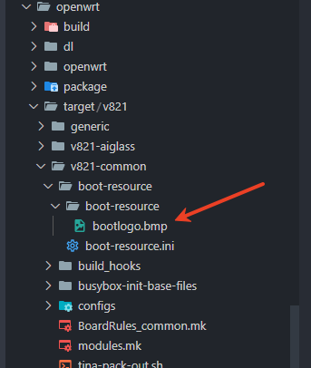

编辑分区表，加入资源文件

```
[partition]
    name         = boot-resource
    size         = 1024
    downloadfile = "boot-resource.fex"
    user_type    = 0x8000
```

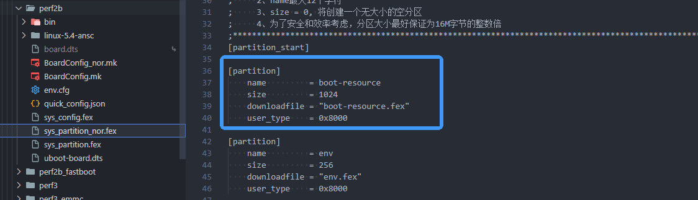

## U-Boot 下调试屏幕方法

U-Boot 下可以通过命令 `disp` 调试屏幕，可以查看当前屏显参数，图层参数

```
screen 0:
de_rate 150000000 hz, ref_fps:59
mgr0: 320x240 fmt[rgb] cs[0x204] range[full] eotf[0x4] bits[8bits] err[1] force_sync[0] unblank direct_show[false] iommu[0]
        lcd output      backlight( 50)  fps:55.9         320x 240
        err:0   skip:1  irq:968 vsync:0 vsync_skip:0
   BUF    enable ch[1] lyr[0] z[1] prem[N] a[globl 255] fmt[  0] fb[ 320, 240;   0,   0;   0,   0] crop[   0,   0, 320, 240] frame[   0,   0, 320, 240] addr[8390c000,       0,       0] flags[0x       0] trd[0,0]
```

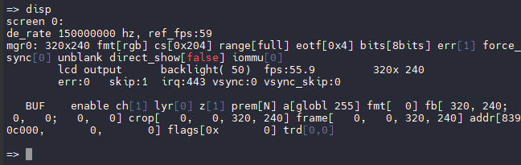

可以用 `colorbar` 命令显示彩条

```
colorbar 
```

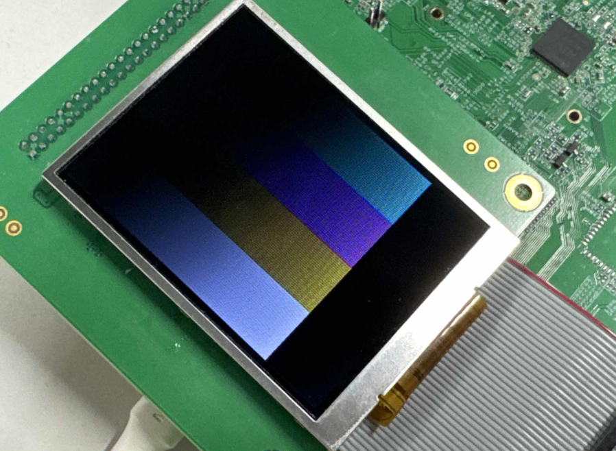
