# 内核 DISP LCD 驱动

本文将通过介绍 Tina Linux 的显示驱动、配置方法、移植适配 LCD 屏幕与测试和使用，介绍 Tina Linux 的显示系统。

## LCD 的驱动


显示驱动可划分为三个层面：驱动层，框架层及底层。底层与图形硬件相接，主要负责将上层配置的功能参数转换成硬件所需要的参数，并配置到相应寄存器中。

显示框架层对底层进行抽象封装成一个个的功能模块。驱动层对外封装功能接口，通过内核向用户空间提供相应的设备结点及统一的接口。

在驱动层，分为三个驱动，分别是`framebuffer`驱动，`display`驱动，`LCD&HDMI`驱动。`framebuffer` 驱动与 `framebuffer core` 对接，实现 `linux` 标准的`framebuffer` 接口。`display`驱动是是整个显示驱动中的核心驱动模块，所有的接口都由 `display` 驱动来提供，包括 `lcd` 的接口。

## LCD 接口复用关系

RGB Serial RGB/CPU屏各种类型接口 mapping 关系如图所示。

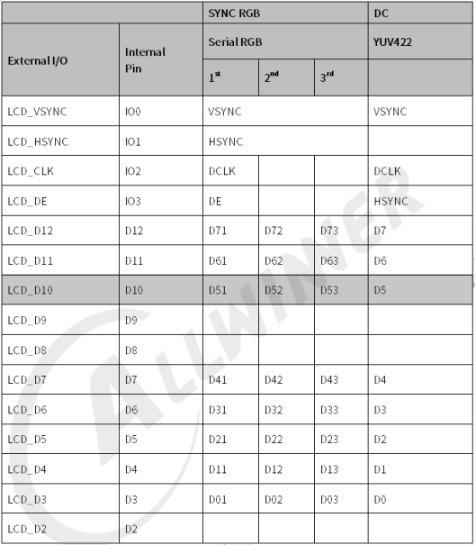

8/9/16 bit CPU屏接法说明如表所示。

| SoC PIN | SRGB | 16bit-CPU（不带TE） | 9bit-CPU（不带TE） | 8bit-CPU（不带TE） | 16bit-CPU（带TE） | 9bit-CPU（带TE） | 8bit-CPU（带TE） |
| --- | --- | --- | --- | --- | --- | --- | --- |
| LCD-VSYNC | LCD-VSYNC | LCD-CS | LCD-CS | LCD-CS | TE | TE | TE |
| LCD-HSYNC | LCD-HSYNC | LCD-RD | LCD-RD | LCD-RD | LCD-RD | LCD-RD | LCD-RD |
| LCD-CLK | LCD-DCLK | LCD-WR | LCD-WR | LCD-WR | LCD-WR | LCD-WR | LCD-WR |
| LCD-DE | LCD-DE | LCD-RS | LCD-RS | LCD-RS | LCD-RS | LCD-RS | LCD-RS |
| GPIO | / | / | / | / | CS | CS | CS |
| LCD-PWM | LCD-PWM | LCD-PWM | LCD-PWM | LCD-PWM | LCD-PWM | LCD-PWM | LCD-PWM |
| LCD-RST | LCD-RST | LCD-RST | LCD-RST | LCD-RST | LCD-RST | LCD-RST | LCD-RST |

8bit 带 TE 信号CPU 屏参考设计如图所示。

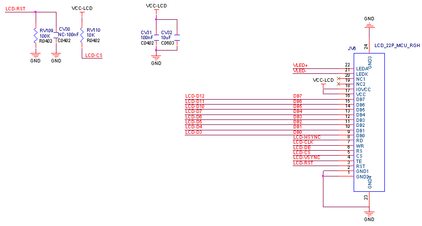

## LCD 配置

### 内核配置

运行 `make kernel_menuconfig` 进入内核配置

```
Allwinner BSP  --->
	Device Drivers  --->
		Video Drivers  --->
			<*> DISP Driver Support(sunxi-disp2)
```

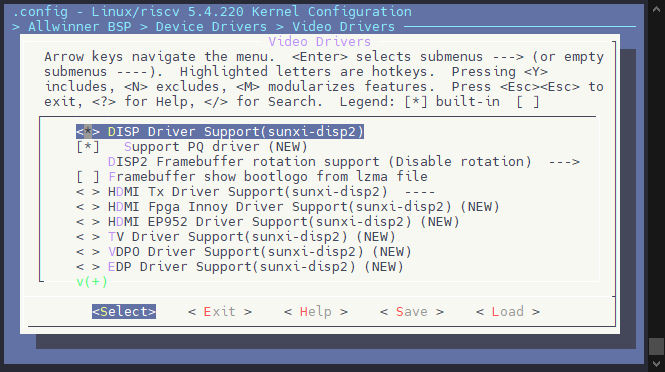

在显示驱动中最主要的是 `<*> DISP Driver Support(sunxi-disp2)` ，勾选后可以看到其他的选项。包括驱动支持，调试接口和 LCD 面板的选择。（`LCD panels select`）

进入 LCD 面板选择可以看到许多已经适配了的显示屏可供选择使用。

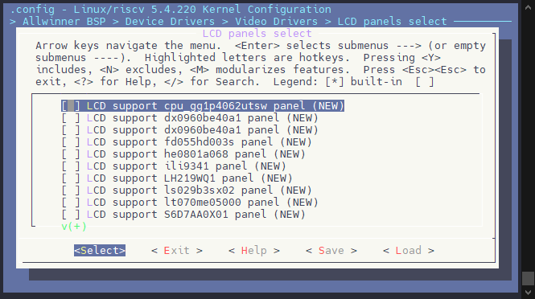

### 设备树配置示例

设备树配置位于板级目录下的 `board.dts` 文件包括了两个配置节点。第一个是 `display` 所使用的节点，配置了DE的特性与功能，另外一个是 `lcd` 所使用的节点，配置了 LCD 面板的驱动与参数。这里我们主要配置 LCD 面板相关。这里以 Serial RGB 屏为例，一份配置包括以下几个部分：

-   屏幕驱动名称，背光亮度，屏接口
-   屏幕物理分辨率，物理宽高
-   屏幕时序参数
-   背光 PWM 参数
-   其他显示配置
-   自定义引脚（可选）
-   屏幕控制 IO

```c
&lcd0 {
	lcd_used            = <1>;

	/* 屏幕驱动名称，背光亮度，屏接口 */
	lcd_driver_name     = "nv3049f";
	lcd_backlight       = <50>;
	lcd_if              = <0>;

	/* 屏幕物理分辨率，物理宽高 */
	lcd_x                = <480>;
	lcd_y                = <854>;
	lcd_width            = <60>;
	lcd_height           = <100>;
	
	/* 屏幕时序参数 */
	lcd_dclk_freq        = <71>;
	lcd_hbp              = <23>;
	lcd_ht               = <1479>;
	lcd_hspw             = <2>;
	lcd_vbp              = <8>;
	lcd_vt               = <870>;
	lcd_vspw             = <2>;
	
	/* 背光 PWM 参数 */
	lcd_pwm_used         = <0>;
	lcd_pwm_ch           = <7>;
	lcd_pwm_freq         = <50000>;
	lcd_pwm_pol          = <0>;

	/* 其他显示配置 */
	lcd_frm              = <0>;
	lcd_io_phase         = <0x0000>;
	lcd_gamma_en         = <0>;
	lcd_bright_curve_en  = <0>;
	lcd_cmap_en          = <0>;
	deu_mode             = <0>;
	lcdgamma4iep         = <22>;
	smart_color          = <90>;
	lcd_hv_if            = <8>;
	lcd_hv_clk_phase     = <1>;
	lcd_hv_sync_polarity = <0>;
	lcd_hv_srgb_seq      = <10>;
	
	/* 自定义引脚 */
	lcd_gpio_0 = <&pio PD 17 GPIO_ACTIVE_LOW>;
	lcd_gpio_1 = <&pio PD 15 GPIO_ACTIVE_LOW>;
	lcd_gpio_2 = <&pio PD 16 GPIO_ACTIVE_LOW>;
	
	/* 屏幕控制 IO */
	pinctrl-0 = <&rgb8_pins_a>, <&rgb8_pins_ctl_a>;
	pinctrl-1 = <&rgb8_pins_b>, <&rgb8_pins_ctl_b>;
};
```

### 通用配置参数

#### lcd\_driver\_name

LCD 屏驱动的名字（字符串），必须与屏驱动的名字对应。

#### lcd\_model\_name

LCD 屏模型名字，非必须，可以用于同个屏驱动中进一步区分不同屏。

### LCD 接口

#### lcd\_if

:::tip

:::note

提示

:::
:::note

这里的接口为驱动所定义的接口，具体硬件支持需要依据硬件规格而定。

:::

:::

```
0：HV RGB  接口
1：CPU/I80 接口
2：Reserved
3：LVDS    接口
4：DSI     接口
```

:::warning

:::note

注意

:::
:::note

V821 平台仅支持

```
0：HV RGB  接口
1：CPU/I80 接口
```

:::

:::

#### lcd\_x

显示屏的水平像素数量，也就是屏分辨率中的宽。

#### lcd\_y

显示屏的垂直行数，也就是屏分辨率中的高。

#### lcd\_ht

Horizontal Total time

指一行总的 `dclk` 的 `cycle` 个数。见下图：

![lcdht](data:image/png;base64,iVBORw0KGgoAAAANSUhEUgAAAwMAAAC4CAYAAAC/xzAIAAAABHNCSVQICAgIfAhkiAAAAAlwSFlzAAAOxAAADsQBlSsOGwAAEehJREFUeJzt3W+IHOd9B/CvgltMayVWwJz1JlHinhSDaFwU2qs4KdcXKfUb27oWV4EruXDKn1oQKWAHYyhVG+TQOiRu0eEmuIggQ9RgnMoEVNcvpFpB8Yu9OgWn9V0JdkOrP6T4T3zU6t/pi9k9rVYn+e60u3O78/nAsDvPzM787iT29rvP88wkAAAAAAAAAADAkNtQdQHrxM1JxqouYki8kuRCl4850eXjAXB9F1K+n3fTXUlu7fIxgdV7Mcml1oowUDqf5Paqixgid6Z7f0TeTnJLl44FwMr9fpK/6NKxHk7ylS4dC7gxF5Jsbq3cVGEh68kfRRjoho+n/Bb/9nQvDLyT5H+S/FmXjgfA9X0wyXS6+3dxW/Px8SRvdfG4wOp1ewQHLDmUpEh3h/W82lwA6I+JlO/lh7p4zKPNY27p4jGBLnhP1QUAAADVEAYAAKCmhAEAAKgpYQAAAGrK1YToppt7cMxfSPJ/PTguAEDtCQN0Uy/CwM/34JgAAMQwIQAAqC1hAAAAakoYAACAmjJnYB0qiuJUH0/3yQ0bNrgtNQBADa0lDGxN8pdJZpIsdLccmib6eK5eTPoFAGAArGWY0MYk481HemBubi6Tk5NVlwEAwJAzZ2Cd+ulPf1p1CQAADLluhIEdzeXdtm/tw7lWus9AePTRRzM5OZnJycksLJQjslq9Bp3tk5OTmZ2dzeTkZHbt2pW5ubksLi5e0cMwOzubffv2La3v27cvDzzwwIf6+CPdmmQ6yZa2toMd6wAArGM7khRJHks5Z2Chub6QKz+Eb01ypmOfM7kcCh5ptm/uOP7mZvtUc30hyf62YxUd21um2s7VWh5Z809ZoUajUSQpjhw5UhRFURw5cqTYs2dPURRFMT4+XjQajavaR0dHi5mZmaIoiuLUqVPF6OjoUvv8/PzSa1vtrW1FUWzpYumPp/z3mWhrawWA7za3dW5vtb2U5YPBG80FgP6YSPm+fKiLxzzaPOaWLh4TqEgrDLR/IJ9orp9p2++Z5vrmjn2eaa63PvTv7zh+K2S0dH6wbw8ZLfc0a3qyre3JXP3BcyA0Go0rPrQ3Go1ifHx86QP9zMxMcerUqaLd6Ohoce7cuaX18fHx4tixY8WDDz5YHD58eKltfHy8mJ+fL44dO1bMzMwUU1NTe1P+jrqxPJ3yd/6bSfYm+XaSd3L5A39rOdj2ms5tncFAGADor4kIA1AbN3Jp0T9O8lTz+ekkJ5Lc27Z9e5IXkpxv2+fBJO9trp9PcjHlh8bZttfd23xduxeSPNp8vpDkD5KcShlM5pI8lOSfk+xre82+JO9PsrN57oEyMjKybPt3vvOdfO1rX8tnP/vZJMm9996bxx57LEmyefOVnSw/+clP8pnPfCYzMzPZuXNnxsbGsmnTpjz//PN56aWXMjU1lQceeOBAkktdKvuXmo9fTvKr19nvU7ny/0qnu5rLgSQ/n+S/ulIdAAA3rNUz0DkuvzXsp+WZXB4atD/LzxmYau7T2rY1V3+bv9xwn84aFlL2KAyF9p6Azp6B1rf8rfb24UCdPQOt3oPWEKJTp04VjUaj2LNnT3vPw5Yult4+TOj2JJ9P8oNc/c3/RNtrOre9muTrKcNAomcAoN8momcAaqOXVxOaTHk/gpEkR5LMpwwG97Tt81TKb/Q/01z/UnP99BrOV4sPjCdPnsxDDz2Uubm5PPfcc1f0INx///2Zm5vLo4+WnSgTExNJkt27d+eFF17IxMREduzYkZdffjnbt2/vdakXkvxFkl9P8qEkX0zyw2vs+1rKIPErK9gXAIAu6fWlRfel/Lb/Y0m+mjIYfDVXThp+IZeHjOxOOdyoWzonJw+Ebdu2Ze/evcuunzlzJps2bcrhw4fzvve9L2fOXJ6m8eUvfzlPPPHEVe1f+tKXcuDAgaX1AwcO5Atf+EIffpIlr+XKD/vtH/QFAACAAbKSYUK3pBwmdE/HPq2Jvu2vnWi27c+VQ4ZaVjJM6EyunLyctvZnlmlf14o1aJ9wvEpbulj6clcTulGGCQH010QME4La6FXPwGKS21JO7L2lrf2elMOAzrW1nW62HUjy/Vw572ClvpHyrsjtVyaaarYNXBgAAIB+6OUwocdSDgv6+1y+FOjulFchOt+x74kko0mOr/FcT6Wcn3Akly9FeqzZ9tR1Xjc0WjcfAwCAlVrLpUXnUs4BmOto//Mkz7WtP9tcppJ8IMlbKb+l7wwCSfIPKXsHlvsW/5MpJx+/Ww37kvxpkt9prj+dtfUyrAe/0cdzXejjuQAAWEfWep+BziCQlEODlmtfyTfzk0lezvJBYbljXqt9IZfvRzCwNmzYcLrqGgAAGH43ctOxbngkyYeT7El/vw0HAIDaqzoMTDcfv5oBvEswAAAMsqrDwHJ3JQYAAPqg1zcdAwAA1ilhAAAAakoYAACAmhIGAACgpoQBAACoKWEAAABqShgAAICaEgYAAKCmhAEAAKgpYQAAAGrqpqoLYCh9PcmbXTrWLyZ5o0vHAmDlPpXk41061ke6dBwA1rHfTlL0YDnazx8CoOZuT3I+3X8vP5/k1j7+HAAAAAAAAAAAAAAAAAAAAAAAAAAAAAADpyiKV4sbM9HD2iZusLZOW3pVKwDAsHpP1QXQOz/72c/eMzs7e83t+/bty65du7KwsNDHqi47ffp0Tp8+fVX74uJirlc3AADdIQwMsR/96Ec3HT9+fNlts7Ozef311/P4449n69atfa6sdPbs2Zw9e/aq9vn5+VyrbgAAukcYqIm5ubmlHoDFxcW89tprueOOO7Jx48YsLi5mcXExCwsLmZuby/nz5/ta2/nz55c9b6u9veei9Xxubi5zc3N9rRMAYNjcVHUBrMqtSd5czQsuXryYXbt2ZWxsLC+++GLuvvvu7Ny5Mz/+8Y+TJM8//3zeeuutnDx5Mtu2bcumTZty4sSJfO9731trj8EHk/zLSnc+efJkGo1G7rjjjpw4cSLf/OY3s3Hjxly8eDH79+/Pxz72sZw8eTKf+9znMjU1lZmZmSTJ2NhY3njjjczPz+fMmTOrrXHVv0cAAKjS3iRPrOYFZ8+e/bfR0dHi7bffLoqiKBqNRjE+Pl4URVEcPny4OHz48NLzVntRFMWxY8eKPXv2rGUC8S8n+c+V7FgUxUTneVs1NRqNor3uc+fOFaOjo0VRFMX4+Hjx4IMPLr1mZmamOHLkyGonEP9TkttX+bMBAAwdw4QGx83NZVVGRkZyyy23vOt+d99999LzO++8My+//PJqT5Uk780q/0+1n7dde92bN29OkqVhQXv37l3a78Mf/vBa5hes6XcJADBshAEGxsaNG5dtv+222/pcCQDAcBAGSFKO3W957rnnsnv37gqrKec6tHoCTp8+nZGRkaU5DE88cXm0VKPRyOTkZCU1AgAMOhOIh1znt+bX+xZ9165dS/s888wzPa3r3YyMjOTgwYNL648//vjS89dff32p1rGxsUxNTfW9PgAA6KfpJEdX84JihXcgbp9MfO7cufZNE6uscTzJf6+wthXdgbijnmJ8fLxoNBrL7bplFXW+mmQ1+wMADCXDhLhCa7LuerHe6gEAGCaGCZGdO3dWXcKK7d27N9u2bau6DACAoSAMkImJiapLWLH9+/dXXQIAAPTddK49Z+CuJF9PORa+l44m+W6zlluX2X69OQNbkhxM8lKSie6XtmS6eY6Dufa8AHMGAAAYKNO5Mgy0B4Cibemlox3n6gwGnWFgSy4HgPbXTfSwxumOcy0XDIQBAIAYJjRo3p8yANyXa3+YPdTD89/VsX5fczma5K+T/GOz/WCSTy2zf8t0ehcIOs95Vy4Hpx8m+Vb8vwcASOJqQoPmnSTzSV6ruI5OF9qW1vorSS5VVtHVLqWs6UKS/624FgAAWJXpXDlM6PYkn09yKtUMEzqf5Ilc+Q1/5zChm5PsTfLtlEGm38OE3mmee2+zlhbDhAAAGCjTufYE4vZg0EtfydUBoN31JhC3B4Oxrld2WescnQGgnTAAAMBAmc4q70BcgRXfgbhiwgAAQMwZAACA2hIGAACgpoQBAACoKWEAAABqShgAAICaEgYAAKCmhAEAAKgpYQAAAGpKGAAAgJoSBgAAoKaEAQAAqKmbqi5gnRhL8ltVF/Eu7op/r275xSQHk7xZdSFALb2S5HjVRQyBQfjbDevR3yR5sbWyocJC1pM3ktxadREr8L9Z34FgPMmpJD9XdSHXMZbkB1UXAdTer6ftjzFrcj7J7VUXAQPozSSbWivr+YNlP/1G1n8Y+FaSD1RdxBC4ufn4dJLZKgsBaulTSaZz+b2Itbs9yQ+TfLHqQmDAXDEyQhgo/bDqAlbgP6ouYMj8W5LTVRcB1M5E1QUMmTfjvRxuiAnEAABQU8IAAADUlDBAN/1rkn+vuogVciUhAKD2hAG67VLVBQAAsDLCwOAYhG+yLyT5/aqLAABgZYSBwTEI37hfSnkjCwAABoAwAAAANSUMAABATQkDAABQU8IAAADUVNVh4JEkCxXXAAAAtVR1GAAAACoiDAAAQE3d1OfzTSTZ2Xx+dIX7nU1yumcVAQBATfUzDDyZZCbJPye5mGQ6ycvX2e/7zfXp5v67el4hAADQdfckKZLsb2ubara1TyB+pNk21da2o7nPkz2ucb07lfJ3w42ZSPl7PFRtGUBNHUr5HjRRbRlDoUj5txG4Af2aMzCdskdgtq3tqSTfXWa/7ze3tcwlOZFkd+/KAwCA+unXMKHtKYf6dGo0t7X7acoegnZ3JBlN2Usw1/XqAACghvo9gXgltie5bZn27yd5u8+1AADA0OpXGFiuV+BaTiR5qFeFAAAApX7NGXgxyUiSzR3td3esX0xy7zKvfzLJmSS3dL80AACop36Fga81H7+TZGvKUPBkyoDQ7rGUcwOebO6XlFcgmkkZKBZ7XikAANREv8LA+SSfbD6fT/J3SbalHBLU7tkkv5fyykHzKS8peiDJV2PoEAAAdFU/JxDPpbxxWOsb/9b9BTo/5D/VXLYm2RhXDwIAgJ6o4mpCC+++y6r2AwAA1qBfw4QAAIB1RhgAAICaEgYAAKCmhAEAAKgpYQAAAGpKGAAAgJoSBgAAoKaEAQAAqClhAAAAakoYAACAmhIGAACgpoQBAACoKWEAAABq6qaqC2DViqoLAGDNLjUfT1VaBUCTMDA4/qTqAobIm0mOV10EUEt/neTXktxadSFD4htVFwAAAAAAAACDY0PVBQD1VBTFfUnuerf9NmzYcKj31QAAAH1TFMXRYgWqrhMAhplLiwKVmZycvOa2Z599to+VAAAAfVMUxdHR0dFlewMajUYxPj6uZwAAesylRYFKLSws5Omnn06SfPrTn87mzZtz/PjxXLx4MbOzsxVXBwDDzTChwfGRJL9VdRHQbQ8//HB27tyZJLn//vuTJB/96EczMjKST3ziE1WWBr1wc5LPV10EAINnOsnRqouAbmkNE5qfn18aHtQaNmSYEENsS5JXqy4CoEXPAFCprVu3Vl0CANSWMAAAADUlDADr1sLCQtUlAMBQEwaAymzfvn3Z9R07duS2227Lww8/XEVZAADrznRMIGaIuAMxNbUlJhAD64ieAQAAqClhAAAAasodiIfHzUnuS3K86kJghU4k+Zeqi4AuG0vyZpJXqi4EgOEynavnDNycZG+Sbyd5J4nx1QDVOpTyvfifms8/0rF9S8wZANYRPQOD6b4k9zYfb624FgCu9pEkf9hcXknyVyl7bi9VWRRApw1VF8CKTSf53ZR/YLZUWgkAa/W3Kd/HP1h1IQAMlulcHiZ0X/P5Gym7o9sXAKpzKFe/L7cPGdoSw4QAWIPpmDMAsN4dijkDAPTAdK5/07FWMACgOmO5OgC02xJhAFhHTCAeHpfisqIAVXux6gIAVsNNxwAAoKaEAQAAqClhAAAAakoYAACAmhIGAACgpoQBAACoKWEAAABqShgAAICaEgYAAKCmhAEAAKgpYQAAAGpKGAAAgJoSBgAAoKaEAQAAqClhAAAAakoYAACAmhIGAACgpoQBAACoKWFgcLzZXAAYXJeSXKi6CAAAAAAAAAAAAAAAAAAAAAAAAAAAAAAAAAAAAAAAAAAAAGDd+X/my/aakuVK1QAAAABJRU5ErkJggg==)

#### lcd\_hbp

Horizontal Back Porch

指有效行间，行同步信号（hsync）开始，到有效数据开始之间的dclk的cycle个数， 包括同步信号区。见上图，注意的是包含了hspw段。

:::note

:::note

备注

:::
:::note

lcd\_hbp 是包含了 hspw 段

$$\texttt{lcd\_hbp} = \text{实际的 hbp} + \text{实际的 hspw}$$

:::

:::

#### lcd\_hspw

Horizontal Sync Pulse Width

指行同步信号的宽度。单位为1个dclk的时间（即是1个data cycle的时间）。见上图。

#### lcd\_vt

Vertical Total time

指一场的总行数。见下图：

![lcdvt](data:image/png;base64,iVBORw0KGgoAAAANSUhEUgAAAwMAAADJCAYAAAB/ue5sAAAABHNCSVQICAgIfAhkiAAAAAlwSFlzAAAOxAAADsQBlSsOGwAAFsdJREFUeJzt3W9sG+d9wPGvinQzBmeJUxiKiq7TklkOVqFzZr/QBslhEASJ0CK2iaCjB3XRYDdbKsBNAScNXHjLUjhra2BZghjtXAN2UQ5xh0KJsxeKBxRm7MwzEKlLAG+J1KX1hs2yoGV2YKPT+me3F3ekKEqyjjLJI3nfD3Ag7+HD5/mROtP3u3ueO5AkSZIkSZIkSZIkSZIkSZIkSZIkSZIkSZIkSZIkSZIkSZIkSZIkSZLU1DqSDqBJjAEPJh1Em7gA/C5wqUbt/TPwWzVqS5IUzxywE3ilRu3lgKPAmhq1J2n1zhHuqwFwU4KBNJMLQCHhGNpBd7TcRe2SgY8S/qd0rkbtSZKu71ZgU7TUKhl4gDAROEf4my4pOReSDkDt66tAAGRq2OYMMF3D9iRJ15ch/C1/uoZtHo3a7K5hm5JqwDMDqqV6nP79pTq0KUmSJOBDSQcgSZIkKRkmA5IkSVJKmQxIkiRJKeWcgSYUBMGDwJca1N3Ojo6OWl35R5IkSS3EZKA53U5tr8hzPV7zWZIkKaUcJiRJkiSllMmAJEmSlFImA03o5Zdfvn1gYGBBWU9PDwD5fJ6BgQGy2SwDAwNMTU2VXs9ms2SzWXp6esjn8wveB5DNZtm9e/eiNhvoVmCYhTedeYrwjsWSJEmSgiAY7u/vD06dOhUEQRB85zvfCXbt2hUEQRBs2LAhuHr1aqn8wIEDpfIXX3wxCIIgGB8fDzZs2BAEQRD09/cH4+PjpTrF8rI2u2sY+l+x+A7ExQTg5ei1yteLZe8Q3u2yMjG4HC2SpMbI4B2IpdRwAnGTyuVy5PN5MpkMo6Oj7NmzB4De3l4GBwcZHBzk4YcfZmhoqPSekZERADZv3kxnZycTExPkcjlOnjzJzTffTG9vL7Ozs0xPT1MoFBgaGuKzn/1sH7X7cf5Y9LiWMAHYBmxfot6mJcruAv4sWt4Fvgscr1FckiRJWoLJQJMaGRmhp6eH6elpZmdnyWQyAIyOjlIoFMjn83z6059m27ZtHDx4cNl27r//fnbt2gWEw4Tefvttvv/973P69GmOHDnC5z//+S8AczUK+zejxy8Cv8fyVyp6hDBRWE4xMdgGfBj4WY3ikyRJkppbEATDQRAEO3bsCHbs2BHs3bs3KNqxY0fp+alTp4L+/v7SEKCLFy8GQRAEV69eLQ0HKg4V6u/vDy5evFh6T1k73TUMvXyY0BogB7wE/A/zw4GWGyZUXP4JeJz5sxUOE5KkxsrgMCEpNTwz0MT27NnDvffey+TkZKnstttuI5vNsmXLFsbGxhgcHCy99pnPfIbBwUHGxsYYHh4ulff19XHixAm6urro6upiZmaGXC5X7/DnCIf5HCdMDLaz/LCht4BvA68AF+odmCRJklbvIWBkifIeYB/heHGALuAIcCZayt+zNqqbWaKdEWCo7PlI1HaxrSPR+lJxjZbVWartllA8M1CcDFxpfHw8ePHFF4PJyclSWXFicWV58UxBeVlFm901DH2pCcSV1hBOKi5aqX/PDEhSY2XwzICk6xgi/AdduUN+BJiKnndFz0cJd/oPRutnyuqfqVgvmmI+cTgTrU9F7R8sW+8qe8/BKKYjUX+j0fpD1X64ZlCeDMRVPiyoSt01DD1OMlAtkwFJaqwMJgOSVjBFuAO+XNk+5hODoocId+6LScQIi3fqhyred4bFO5fFRGPfMutFxbMELWc1yUD5XAKTAUnSDchgMiClxmpvOnaahVeDKQ7r+cvo8d+BDYRH6jdHZa8CA8zv7B+KHrNl7fwxcL6irx8ChbL16YrXi+9/tqL8D6P+UmF0dDTpECRJktRiVjuBOA/sIjx6UCDcIT/P/I56HvhtwoRhF+EO/XngBRbu2J8nvOLMIcIj/J3AX1f0NbNCLLcsU35tpQ/RxF4D7m1QX5ca1I8kSZKazGqTgQLwBuEZgQLQCzxTUeeJaBkiTBq2AqcIE4RXozovRGU9wMNRWX6VMbWNjo6OS7iTLkmSpDpb7TAhCC8ZuZX5sfrlO/FDzE8CzgO7gd8hPEPQW1avEJV9jvCOtadXEUdxSFLlhOZ9tOicAUmSJKkRbiQZKA5SH2bxTvwtwBeYny8AsDF6/KCi7gnm5x98fRVx5AkTiifLyrqAQWB2Fe1JkiRJqXAjycA04Zj/DSwe2nOIcKz/S8xfQvSlqP6hirrFScczLL4CUVyPEp6lKF6+9PWoPLvsOyRJkqSUu9E7EP8h4RH/iSVeGyA8M/BAtP49lt7ZL046Pr7Ea7uW6XcnMFm2XiAcJjQEfBw4y8KJypIkSZIq3GgycI2lE4GiiRVeh/nLklaeMYDlzxQs12bqJx9LkiRJcd1oMnAjRggvK9pJOG9AkiRJUgPdyJyBWjlNeAlSSZIkSQ2U5JmBQyw9NEiSJElSAzTDmQFJkiRJCTAZkCRJklLKZECSJElKKZMBSZIkKaVMBiRJkqSUSvJqQlIcPwX+L+kgJEmS2pHJgGpprg5t/qQObUqSJAmHCam26pEMSJIkqU5MBiRJkqSUMhmQJEmSUso5A6qH54ArNWrrduBSjdqSJMX3CHBPjdq6q0btSJKa2INAUIflaCM/hCSl3O3ANLX/LZ8Gbm3g55AkSZIkSZIkSZIkSZIkSZIkSZIkSZIkSZIkSZIkSZIkSWo5QRAcDVbvxw2Ir1ZO1TtWSZKkdvShpANQMqampshms2Sz2aRDWaRQKFAoFJIOQ5Ikqe3dlHQASsZTTz3Ffffdx/333590KIucPXsWgEwmk2wgkiRJbc4zA23s/fff//C1a9cWlE1MTDA1NcXs7Cy33HILH/3oR5mamiq9NjEx0bD4iv0WXbt2bUHZ1NTUoniK68XPIUmSpNXzzEBruRW4Erfy4cOHP/7mm28yOjoKQD6fZ3R0lPvuu4+ZmRnefvttPvaxj7F//35mZmbYtm0bly9fZnJykjNnzqw2xl8H/i1Oxa9//evcfffdjIyMAPD4449z9913A3Ds2DF+9KMfsW7dOnbu3Mnrr79OV1cXO3fupLOzk8HBQcbGxujr6+PgwYPVxljV95hC1Xw/fpeSJEkNkAO+Uc0bgiA4umHDhuDixYtBEATBjh07glOnTgVBEAT9/f3B+Ph46fmBAwdKs3H7+/uD1157bXoVMX4S+N+4lScnJ4P+/v5Svxs2bAiCIAgOHDgQ7Nixo1S+d+/eYO/evaU6xc9w9erV4nuqnUD8DnB7le9JkzGgL0a9qrdJSZLUXBwm1DrWREtVtm7dWjozcP78+WXH4T/wwAOl54ODg7zxxhu/vIoYf5Uqtqmenh4gHA5UKBTo7e0tvbZly5bS81wux7lz50rrxc+wdu1aOjs7KRQKN1cZ56q+yxSJ+/34PUqS1OIcJtTmnnzySXbt2gXAtm3bYr3n8uXLrFnTmH28XC7Ht771Ld577z327NmzZJ2rV682JBZJkqS08cxAmysefX/++ef53Oc+t2y9kydPlp6fOHGCXC73k7oHB2SzWU6cOLHorMX4+HjpeT6fJ5fLldaLlx2dmJhgZmaGTCZjtiBJkrQKnhlIgVwux/Hjx0uJAcD69esX1BkfH2dgYACA4eFhPvGJT/ysEbF1dXXR29vLbbfdtqB8dna2FM/GjRtLk4wBXnjhBfbv3w/A4cOHGxFmIoIgWEO8sfuXOjo63q13PJIkSUrOMHC0mjcEMe9AXJxMXJxoHFnNHYj7gdhJRJzYKmIqTTKenJwsL652AvGPge4q39NwQRB0x/mOgiCoaruI4RSQiVFvmCq3SUmS1FwcJqSSrq6upENYZLmYys9ytDPvxixJkurJZEDkcjk2btyYdBixDA8PJx1CQ509e7Z0R+ZK2Wy2oTeJkyRJ7cdkQIyMjLB27dqkw4hl3759SYeQiOLdmKenw9s/XLt2jdnZWd55552EI5MkSa3MZKA9ZAhv/rTgRmEdHR1/1LF6v7FEP0eBlwnHit9aZYx3AU8T3vArE8VXK/eW9TMM/BPwOC0wLyCOsbExnnrqKY4fP84999zD9PQ04+PjpbtIv//++x+uorluwjkTzwGb6hJwaFPUx2rmnkiSpAbxakKtKwP8PrCdxt5Nd3u0HAVeAU5Gj5eWqHsX4V1qfz963iibmN8ZfQv4LmGMLXnFnfXr15duHHf58mVGR0cZGRmhs7OTXC7HRz7ykWqv/NRNmCw9Dlwg/G6+Tfhd3YgMsI1w++i+wbYkSVIDmAy0ltsJzwBcLwGo9so61ajcoS8mBt8ACsAE0EF4BuB6CcBzwJW6RLj4eykmBn9BmAx8F6jmSHriyu/GfMcdd/DBBx8seP2VV155kPDv/iGgh+vfFbjybGA384nBHPBfwC1VhFeLbfIt4ItV9ClJkmrEZKC1zAKvEw7R2c7SO31/Xsf+vwQ8uET5u1FcPwQCwsSgkzDOpXYQa3EUejkPsnQScimKqwA8Uqe+E/HJT37yLeBr0epvAb90neq3AfuXKP8pcBb4B8Kj+3HVYpusV2IoSZJWYDLQWn4BHI+WNYRDcIrDMooKdey/fCe6eJT9OPPDb/rLYigAjxHunBeHMxXnGbxVxzi7y55fIhwC89069pe4O+64o5jowMqfs5v5ZGCO8Ps5ET3OReUDVXRfuU1uZ36bLCYGK8UkSZISYjLQuuaAY9FSPCpbzRHd1ZgkPMpbngCs5LVo+SPmY6znkeBLwDdp8wQAoK+vj507d/L0009XM2dkjvDvV5kA1EKx7crEQJIkSTdomOa/22tVdyBOkHcgvj7vQCxJUkp4aVFJkiQppUwGJEmSpJRyzoDUvOaIN+9hss5xSJKkNmUyIDWpjo6OS8C9K1aUJElaJYcJSZIkSSllMiBJkiSllMmApNW6Avxb0kFIkqTVc86ApNV6JVokSVKL8syAJEmSlFImA5IkSVJKmQxIkiRJKeWcgdB2YFPSQaxgE/ArSQfRJn4VeJxwAqwW6waGgUyiUUjt6wrwV0kH0QYeBPqSDkJqQe8Cx4srHQkG0kw+INxBbHa/oLkTuH7gFPDhpAO5jj7gH5MOQlLq/S5wLukgWtz/AGuSDkJqQT+nbF+tmXcsG+nvgfeA11ao9yDw28DXYrR5inh3j30O+Dbw1gr1vg18PEZ7ur7ifxzfAw6tUPdLwNusvF1sAh4Bvhij/7jbRdy+67FN/h3h9va9GvV9O+F2vjNG33H/PQxHj8dq2PdLhH/DSzXqu5rtIm7fad0m424XSW6Tcft+hHAbcif2xq0h/LustJ377+H62u03up3+htW0Wc3nubO8wGQgdI3wlElhhXrdQGeMekVx6l0h3BhWqvuTmH0qnv9k5e/8EeJtFwDbYtYjZr24fXdT+23y58C/1rDvbmAuZt9x/z1kosda9j1HeKT2Qo36hvjbRdy+07pNxt0u4vbdTe23ybh9Z2L0qfiu4L+HG+27m/b6jY7TL7TG37CaNqv9PCVOIJYkSZJSymRAkiRJSimTAdXSf7DyWL5m4ZWEJElS6pkMqNZ+nnQAkiRJisdkoHX8V9IBxHAB2JF0ELphU8C/JB2EJEmqP5OB1tEqR9zjXCZLze0nwE+TDkKSJNWfyYAkSZKUUiYDkiRJUkqZDEiSJEkpZTIgSZIkpVTSycBItEiSJElqsKSTgVy0SJIkSWqwpJMBSZIkSQlJIhnYDPTErLe5zrFIkiRJqXVTA/saAv60bP38MvX2AcMVZc8A+TrEJEmSJKVWo84MZIDvAKcJzwr0AP8N9FfUGwIOAM+X1TsWvfehxoQqSZIkpUOjkoE9wA+B3WVlu6Oycn8MvAwcKit7FngDeKKeAUqSJElp06hhQr0sPSxopmK9E5glHCpUbjZqQ5IkSVKNNHLOwHsx6/UC65coX26OgSRJkqRVaFQyMAP0xax7jHBokCRJkqQ6atScgTHCIUBdZWVro7Jy54HBJd5/JlokSZIk1UijkoHikf6/JbxiUIYwQdhQUe8pwgThTFQnA4wSXnXoYP3DlCRJktKjkXMG7gG+wvy9Bo4BkxV1poBPA18FDkdl54F7gULdI5QkSZJSpJHJwDQLLy26nCkgW+dYJEmSpNRr1DAhSZIkSU3GZECSJElKKZMBSZIkKaVMBiRJkqSUMhmQJEmSUspkQJIkSUopkwFJkiQppUwGJEmSpJQyGZAkSZJSymRAkiRJSimTAUmSJCmlTAYkSZKklDIZkCRJklLqpqQDUNUySQfQ4jYlHYAk4W+RpCZhMhC6Ei21qgdwocZ9z0WPp2K2q+ubW7lKS2wXrdD3HHCpDn3HUU3fl4i/XcRRzd+mmr7bZbtIsu96bZPV/JY/F7N/3bhW2CaT7LvdfqMvxGyvFf6G9WhzUb2OmB0oeZuA7UkH0SbmgG8S/x+iJNXKrcCfAGuSDqRNvAacSzoISZIkSZIkSZIkSZIkSZIkSZIkSZIkSZIkSZIkSZIkSZIkSZIkSZIkSZIkSZIkSZIkSZIkSZIkSZIkSZIkSZIkaWUdSQcgqf0FQXArsKlGzV3o6Oi4UKO2JEmSJNVTEASZoHaeTvrzSJLULj6UdACSVCgUFqwPDAwA8Oqrr5LNZslms+zevTuByCRJam8mA5IS9eyzz3L27NnS+sTEBH19fUxPT7N3716+/OUvMzo6CmBCIElSjZkMSGqIZ599dsH6oUOHmJqaYnx8nPHx8dLZgZMnT/KpT32KN998k+HhYTZv3gzAY489xuTkZKPDliSprZkMtI5uajcBU2q48h1+gOeff56bb76ZO++8kzvvvJMtW7YAMDY2RiaT4aGHHmLfvn2l+idPnmTjxo2NDluqh+1JByBJRSYDrSMDfCHpIKTVymazvPDCC0A4R6C3t5euri7WrVvHunXrWLt2LQDr169f9N58Ps+xY8f4yle+0tCYpTroBp5LOghJKjIZkNQQQ0NDnD9/Hgh37rPZ7KI6hUKhdIagKJ/P88wzz/DSSy/R1dXVkFglSUqLm5IOQFJ6bN26lUOHDnH69GmOHDmy6PV8Ps+TTz5ZWn/iiSc4d+4cP/jBD0pnDiRJUu2YDEhqmKGhIR599FG2bt26oPzy5ctcu3aNyclJenp6gPAswYkTJzh8+PCCicPFCcWSJOnGmQxIaphMJkNvby9DQ0Olsocffphdu3Zx4MCBBfMFzp49S2dnJ/v37y+VrV+/vnSZUUmSpDQZBo4mHYS0Gt6BWCrpBn6cdBCSVOQEYkmSJCmlTAYkSZKklHLOQHvZBLyVdBDSEq4AhRq1daFG7Uj10E24vV9JOA5JUpsZZuk5A5sIb2DzYyBoZECSpEWeJvwtfpnwd/vWite7cc6ApCbimYHWdBeQAx4h/I9FktRctkfLUeAV4ET0KElNpSPpABTbMPAHwK8RJgOSpNbzN8BW4ONJByJJai3DhEeYbgf+BDhFeCq6cpEkJedpFv8uTwPfADI4TEhSk/FqQq3nEvBN4F6gC3iM2k3MlCTVhr/VkqSaGub6Nx0rnjGQJCUnEy3L6cYzA5KaiBOI20fxKJQkKTmFpAOQpGo4TEiSJElKKZMBSZIkKaVMBiRJkqSUMhmQJEmSUspkQJIkSUopkwFJkiQppUwGJEmSpJQyGZAkSZJSymRAkiRJSimTAUmSJCmlTAYkSZKklDIZkCRJklLKZECSJElKKZMBSZIkKaVMBiRJkqSUMhmQJEmSUspkQJIkSUopkwFJkiQppUwGWseVaJEkta454FLSQUiSJEmSJEmSJEmSJEmSJEmSJEmSJEmSJEmSJEmSJEmSJEmSJEmSJEmSJEmSJEmSJEmSpKbz/+/Kdtf4LvCbAAAAAElFTkSuQmCC)

:::note

:::note

备注

:::
:::note

lcd\_vt 为偶数则传输是逐行扫描，为奇数则传输是隔行扫描；扫描模式配置错误会导致花屏。

:::

:::

#### lcd\_vbp

Vertical Back Porch

指场同步信号（vsync）开始，到有效数据行开始之间的行数，包括场同步信号区。

:::note

:::note

备注

:::
:::note

lcd\_vbp 是包含了vspw段

$$\texttt{lcd\_vbp} = \text{实际的 vbp} + \text{实际的 vspw}$$

:::

:::

#### lcd\_vspw

Vertical Sync Pulse Width

指场同步信号的宽度。单位为行。见上图。

#### lcd\_dclk\_freq

Dot Clock Frequency

传输像素传送频率（单位为MHz）

$$\texttt{fps} = \frac{\texttt{lcd\_dclk\_freq} \times 1000 \times 1000}{\texttt{lcd\_ht} \times \texttt{lcd\_vt}}$$

这个值根据以下公式计算：

$$\texttt{lcd\_dclk\_freq} = \texttt{lcd\_ht} \times \texttt{lcd\_vt} \times \texttt{fps}$$

注意：

1.  后面的三个参数都是从屏手册中获得，fps一般是60。
2.  如果是串行接口，发完一个像素需要2到3个周期的，那么需要乘上周期数

$$\texttt{lcd\_dclk\_freq} \times \texttt{cycles} = \texttt{lcd\_ht} \times \texttt{lcd\_vt} \times \texttt{fps}$$

或者

$$\texttt{lcd\_dclk\_freq} = \texttt{lcd\_ht} \times \texttt{cycles} \times \texttt{lcd\_vt} \times \texttt{fps}$$

#### lcd\_width

此参数描述lcd屏幕的物理宽度，单位是mm。用于计算dpi。

#### lcd\_height

此参数描述lcd屏幕的物理高度，单位是mm。用于计算dpi。

#### lcd\_fsync\_en

LCD使能 fsync 功能，用于触发 Sensor 出图，目的是同步，部分IC支持。

```
0：disable
1：enable
```

#### lcd\_fsync\_act\_time

LCD的fsync功能，其中的有效电平时间长度，单位：像素时钟的个数。

```
0~lcd_ht-1
```

#### lcd\_fsync\_dis\_time

LCD的fsync功能，其中的无效电平时间长度，单位：像素时钟的个数。

```
0~lcd_ht-1
```

#### lcd\_fsync\_pol

LCD的fsync功能的有效电平的极性。

```
0：有效电平为低
1：有效电平为高
```

#### lcd\_start\_delay

此参数用于每一帧 DE 向 TCON 送数据前的延时，该值配置不合理会导致前几行出现闪屏。

:::tip

:::note

提示

:::
:::note

出现 LCD 显示前几行有闪条，或者 colorbar 1 ~ 7 可以显示，colorbar 8 显示不了的问题，可以调试一下这个参数试试。

:::

:::

```
整数：调试范围可以先从0 ~ 10调试，不可以再往上增加
```

### LCD HV RGB 接口相关配置

RGB接口在全志平台又称HV接口（Horizontal同步和Vertical同步）。有些LCD屏支持高级的功能比如 gamma，像素格式的设置等，但是 RGB 协议本身不支持图像数据之外的传输，所以无法通过 RGB 管脚进行对 LCD 屏进行配置，所以拿到一款 RGB 接口屏，要么不需要初始化命令，要么这个屏会提供额外的管脚给 SoC 来进行配置，比如 SPI 和 I2C 等。RGB 屏幕有许多格式，不同的位宽，不同的时钟周期。下表是位宽与时钟周期的区别。

| 位宽 | 时钟周期数 | 颜色数量和格式 | 并行\\串行 RGB |
| --- | --- | --- | --- |
| 24 bits | 1 cycle | 16.7M colors, RGB888 | 并行 |
| 18 bits | 1 cycle | 262K colors, RGB666 | 并行 |
| 16 bits | 1 cycle | 65K colors, RGB565 | 并行 |
| 6 bits | 3 cycles | 262K colors, RGB666 | 串行 |
| 6 bits | 3 cycles | 65K colors, RGB565 | 串行 |

:::note

:::note

备注

:::
:::note

时钟周期数：一个像素发送完毕需要的时钟周期数。

当时钟周期为1时，我们称这种RGB接口为并行接口，其它的情况则是串行接口,更为普遍的原则就是只要需要多个时钟周期才能发送完一个像素的接口都是串行接口。

如何判断是否支持24bit的位宽，最简单的方式就是在pinmux表格中数一数数据脚的数量，如果有24根则支持24bit，如果只有18根则支持18bit。

:::

:::
:::tip

:::note

提示

:::
:::note

以下配置只有配置 LCD 为 HV RGB 时才可使用。也就是配置 `lcd_if=0` 时：

:::

:::

#### lcd\_hv\_if

定义RGB同步屏下的几种接口类型。设置相应值的对应含义为：

```
0：Parallel RGB
8：Serial RGB
10：Dummy RGB
11：RGB Dummy
12：Serial YUV (CCIR656)
```

#### lcd\_hv\_clk\_phase

定义RGB同步屏的clock与data之间的相位关系。总共有4个相位可供调节。

设置相应值的对应含义为：

```
0: 0 degree
1: 90 degree
2: 180 degree
3: 270 degree
```

#### lcd\_hv\_sync\_polarity

定义RGB同步屏的hsync和vsync的极性。设置相应值的对应含义为：

```
0：vsync active low，hsync active low
1：vsync active high，hsync active low 
2：vsync active low，hsync active high
3：vsync active high，hsync active high
```

#### lcd\_hv\_srgb\_seq

这个参数只有在 `lcd_hv_if=8`（Serial RGB）时才有效。

定义奇数行RGB输出的顺序：

```
0:  Odd lines R-G-B; Even line R-G-B
1:  Odd lines B-R-G; Even line R-G-B
2:  Odd lines G-B-R; Even line R-G-B
4:  Odd lines R-G-B; Even line B-R-G
5:  Odd lines B-R-G; Even line B-R-G
6:  Odd lines G-B-R; Even line B-R-G
8:  Odd lines R-G-B; Even line B-R-G
9:  Odd lines B-R-G; Even line G-B-R
10: Odd lines G-B-R; Even line G-B-R
```

#### lcd\_hv\_syuv\_seq

这个参数只有在 `lcd_hv_if=12`（Serial YUV）时才有效。

定义YUV输出格式：

```
0：YUYV
1：YVYU
2：UYVY
3：VYUY
```

#### lcd\_hv\_syuv\_fdly

这个参数只有在 `lcd_hv_if=12`（Serial YUV）时才有效。

定义CCIR656编码时F相对有效行延迟的行数：

```
0：F toggle right after active video line
1：Delay 2 lines (CCIR PAL)
2：Delay 3 lines (CCIR NTSC)
```

#### 硬件连接

对于并行RGB的接口，当位宽小于24时，硬件连接应该选择连接每个分量中的高位而放弃低位，这样做的原因是损失较少的颜色数量。

RGB接口有两种同步方式，根据经验来说尽量使用第二种方式，硬件上请保证连接好DE脚。

1.  Hsync+Vsync
2.  DE（Data Enable）

#### 并行RGB0接口配置示例

当我们配置并行RGB接口时，在配置里面并不需要区分是24位，18位和16位，最大位宽是哪种是参考pin mux表格，如果 LCD 屏本身支持的位宽比SoC支持的位宽少，当然只能选择少的一方。

因为不需要初始化，RGB 接口极少出现问题，重点关注 LCD 的Timing 的合理性，也就是[lcd\_ht](#lcd_ht)，[lcd\_hspw](#lcd_hspw)，[lcd\_hbp](#lcd_hbp)，[lcd\_vt](#lcd_vt)，[lcd\_vspw](#lcd_vspw)和[lcd\_vbp](#lcd_vbp)这个属性的合理性。

**下面是典型并行RGB接口board.dts配置示例，其中用空行把配置分成几个部分**

1.  第一部分，决定该配置是否使用，以及使用哪个屏驱动，lcd\_driver\_name决定了用哪个屏驱动来初始化，这里是default\_lcd，是针对不需要初始化设置的RGB屏。
2.  第二部分决定下面的配置是一个并行RGB的配置。
3.  第三部分决定SoC中的LCD模块发送时序。
4.  第四部分决定背光（pwm和lcd\_bl\_en）。
5.  第五部分是显示效果部分的配置，如果非24位的RGB，那么一般情况下需要设置[lcd\_frm](#lcd_frm)。
6.  第六部分就是电源和管脚配置。是用RGB666还是RGB888，需要根据实际pinmux表来决定，如果该芯片只有18根rgb数据则只能rgb18。

```
&lcd0 {
	/* part 1 */
	lcd_used            = <1>;
	status              = "okay";
	lcd_driver_name     = "default_lcd";

	/* part 2 */
	lcd_if              = <0>;
	lcd_hv_if           = <0>;

	/* part 3 */
	lcd_x               = <800>;
	lcd_y               = <480>;
	lcd_dclk_freq       = <33>;
	lcd_hbp             = <46>;
	lcd_ht              = <1055>;
	lcd_hspw            = <0>;
	lcd_vbp             = <23>;
	lcd_vt              = <525>;
	lcd_vspw            = <0>;

	/* part 4 */
	lcd_backlight       = <50>;
	lcd_pwm_used        = <1>;
	lcd_pwm_ch          = <8>;
	lcd_pwm_freq        = <50000>;
	lcd_pwm_pol         = <0>;
	lcd_bl_en        = <&pio PD 27 GPIO_ACTIVE_HIGH>;

	/* part 5 */
	lcd_frm             = <0>;
	lcd_hv_clk_phase    = <0>;
	lcd_hv_sync_polarity= <0>;

	/* part 6 */
	lcd_power           = "vcc-lcd";
	lcd_pin_power       = "vcc-pd";
	pinctrl-0 = <&rgb24_pins_a>;
	pinctrl-1 = <&rgb24_pins_b>;
};
```

#### 串行RGB0接口的典型配置

串行RGB是相对于并行RGB来说，而并不是说它只用一根线来发数据，只要通过多个时钟周期才能把一个像素的数据发完，那么这样的RGB接口就是串行RGB。

同样与并行RGB接口一样，配置中并不需要也无法体现具体是哪种串行RGB接口，你要做的就是把硬件连接对就行。

**下面是典型串行RGB接口board.dts配置示例，它只有8根数据脚，其中用空行把配置分成几个部分**

1.  第一部分决定该配置是否使用，以及使用哪个屏驱动，lcd\_driver\_name决定了用哪个屏驱动来初始化。
2.  第二分部决定下面的配置是一个串行RGB的配置。
3.  第三部分决定SoC中的LCD模块发送时序

:::tip

:::note

提示

:::
:::note

这里需要注意的是，对于该接口，SoC总共需要三个周期才能发完一个pixel，所以我们配置时序的时候，需要满足

$\text{lcd\_dclk\_freq} \times 3 = \text{lcd\_ht} \times \text{lcd\_vt} \times 60$

或者

$\text{lcd\_dclk\_freq} = \text{lcd\_ht} \times 3 \times \text{lcd\_vt} \times 60$

要么配置 3 倍 `lcd_ht` 要么 3 倍 `lcd_dclk_freq`。

:::

:::

4.  第四部分决定背光。就是pwm和lcd\_bl\_en。
5.  第五部分是显示效果方面的设置。
6.  第六部分管脚和电源的定义。

:::note

:::note

备注

:::
:::note

下面实例的lcd driver IC是stv7789v，是需要初始化，初始化的接口协议是SPI，所以这多了几根spi管脚配置，驱动里面用gpio模拟spi协议，所以这里都是配置gpio功能。

:::

:::

```
&lcd0 {
	/* part 1 */
	lcd_used            = <1>;
	status              = "okay";
	lcd_driver_name     = "st7789v";

	/* part 2 */
	lcd_if              = <0>;
	lcd_hv_if            = <8>;

	/* part 3 */
	lcd_x               = <240>;
	lcd_y               = <320>;
	lcd_dclk_freq       = <19>;
	lcd_hbp             = <120>;
	;10 + 20 + 10 + 240*3 = 760  real set 1000
	lcd_ht              = <850>;
	lcd_hspw            = <2>;
	lcd_vbp             = <13>;
	lcd_vt              = <373>;
	lcd_vspw            = <2>;

	/* part 4 */
	lcd_backlight       = <50>;
	lcd_pwm_used        = <1>;
	lcd_pwm_ch          = <8>;
	lcd_pwm_freq        = <50000>;
	lcd_pwm_pol         = <0>;
	lcd_bl_en           = <&pio PB 1 GPIO_ACTIVE_HIGH>;

	/* part 5 */
	lcd_frm             = <1>;
	lcd_hv_clk_phase    = <0>;
	lcd_hv_sync_polarity= <0>;

	/* part 6 */
	lcd_power           = "vcc-lcd";
	lcd_pin_power           = "vcc-pd";
	/*reset */
	lcd_gpio_0          = <&pio PD 9 GPIO_ACTIVE_HIGH>;
	/* cs */
	lcd_gpio_1          = <&pio PD 10 GPIO_ACTIVE_HIGH>;
	/*sda */
	lcd_gpio_2          = <&pio PD 13 GPIO_ACTIVE_HIGH>; 
	/*sck */
	lcd_gpio_3          = <&pio PD 12 GPIO_ACTIVE_HIGH>;
	pinctrl-0 = <&rgb18_pins_a>;
	pinctrl-1 = <&rgb18_pins_b>;
};
```

### LCD i80 CPU 接口相关配置

Intel 8080接口屏(又称MCU接口)很老的协议，一般用在分辨率很小的屏上。

管脚的控制脚有6种：

-   CS 片选信号，决定该芯片是否工作.
-   RS 寄存器选择信号，低表示选择index或者status寄存器，高表示选择控制寄存器。实际场景中一般接SoC的LCD\_DE脚（数据使能脚）
-   WR （低表示写数据) 数据命令区分信号，也就是写时钟信号，一般接SoC的LCD\_CLK脚
-   RD （低表示读数据）数据读信号，也就是读时钟信号，一般接SoC的LCD\_HSYNC脚
-   RESET 复位LCD（ 用固定命令系列 0 1 0来复位)
-   Data是双向的

I8080根据的数据位宽接口有8/9/16/18，连哪些脚参考，即使位宽一样，连的管脚也不一样，还要考虑的因素是rgb格式。

1.  RGB565，总共有65K这么多种颜色
2.  RGB666，总共有262K那么多种颜色
3.  9bit固定为262K

从屏手册得知：数据位宽，颜色数量之和，参考\[RGB和I8080管脚配置示意图\]，进行硬件连接。

#### lcd\_cpu\_if

设置相应值的对应含义为：

```
0：18bit/1cycle (RGB666)
2: 16bit/3cycle (RGB666)
4：16bit/2cycle (RGB666)
6：16bit/2cycle (RGB666)
8：16bit/1cycle (RGB565)
10：9bit/1cycle (RGB666)
12：8bit/3cycle (RGB666)
14：8bit/2cycle (RGB565)
```

#### lcd\_cpu\_te

设置相应值的对应含义为，设置为 0 时，刷屏间隔时间为 `lcd_ht × lcd_vt`，由配置的时序参数产生；设置为 1 或 2 时，刷屏间隔时间为两个 TE 脉冲，由屏幕控制：

```
0：frame trigged automatically
1：frame trigged by te rising edge
2：frame trigged by te falling edge
```

#### lcd\_cpu\_mode

设置相应值的对应含义为，设置为 0 时，中断自动根据时序，由场消隐信号内部触发，中断根据数据Block的counter触发或者由外部 TE 触发。

```
0：中断自动根据时序，由场消隐信号内部触发
1：中断根据数据Block的counter触发或者由外部te触发。
```

#### I8080 接口屏典型配置示例

**下面是典型是一个RGB565的，位宽为8位的I8080接口的屏的board.dts配置示例。**

第一部分：决定该配置是否使用，以及使用哪个屏驱动，lcd\_driver\_name 决定了用哪个屏驱动来初始化。

第二部分：决定该配置是I8080接口，而且是8bit/2cycle 格式RGB565。

:::tip

:::note

提示

:::
:::note

为什么叫做8bit/2cycle RGB565呢，首先它的格式是RGB565，也就是一个像素是16bit，然后它是8bit的位宽，就需要两个时钟周期才能发完一个像素，所以才叫2 cycle。

:::

:::

第三部分：决定SoC中的LCD模块发送时序。这里比较特殊的是设置像素时钟要满足以下公式：

1.  $\text{lcd\_dclk\_freq} \times 2 \geq \text{lcd\_ht} \times \text{lcd\_vt} \times \text{fps}$
    
2.  $\text{lcd\_dclk\_freq} = \text{lcd\_ht} \times 2 \times \text{lcd\_vt} \times 60$
    

第四部分：背光相关的设置。

第五部分：cpu接口的详细设置。这里使能了[lcd\_cpu\_te](#lcd_cpu_te)和[lcd\_cpu\_mode](#lcd_cpu_mode)，意思是使用 TE 触发和规定了触发间隔。这是非常关键的设置。

第六部分：显示效果相关的设置。这里使能了[lcd\_frm](#lcd_frm)也是比较关键的设置，详细意思点击查看。

第七部分：管脚和电源设置。这里为了用 TE 触发，同样需要设置 `lcd_vsync`，该脚功能定义已经包括在 `pinctrl-0` 中。

```c
&lcd0 {
	/* part 1 */
	lcd_used            = <1>;
	lcd_driver_name     = "st7789v_cpu";
	lcd_if              = <1>;
	/* part 2 */
	lcd_x               = <240>;
	lcd_y               = <320>;
	lcd_width           = <43>;
	lcd_height          = <63>;
	/* part 3 */
	lcd_dclk_freq       = <20>;
	lcd_hbp             = <20>;
	lcd_ht              = <298>;
	lcd_hspw            = <10>;
	lcd_vbp             = <8>;
	lcd_vt              = <336>;
	lcd_vspw            = <2>;
	/* part 4 */
	lcd_backlight       = <50>;
	lcd_pwm_used        = <1>;
	lcd_pwm_ch          = <4>;
	lcd_pwm_freq        = <50000>;
	lcd_pwm_pol         = <1>;
	lcd_pwm_max_limit   = <255>;
	lcd_bright_curve_en = <1>;
	/* part 5 */
	lcdgamma4iep        = <22>;
	lcd_cpu_mode        = <1>;
	lcd_cpu_te          = <2>;
	lcd_cpu_if          = <14>;
	/* part 6 */
	lcd_frm             = <2>;
	lcd_gamma_en        = <0>;
	lcd_bright_curve_en = <0>;
	lcd_cmap_en         = <0>;

	/* part 7 */
	/* rst */
	lcd_gpio_0          = <&pio PD 19 GPIO_ACTIVE_LOW>;
	/* cs */
	lcd_gpio_1          = <&pio PD 14 GPIO_ACTIVE_LOW>;

	pinctrl-0 = <&rgb8_pins_a>, <&rgb8_pins_ctl_a>;
	pinctrl-1 = <&rgb8_pins_b>, <&rgb8_pins_ctl_b>;
};
```

#### I8080 横竖屏旋转

一般来说带有 GRAM 的屏幕都可以配置屏端旋转，这样就不需要在送显前旋转，增加送显流程。

1.  平台没有硬件旋转功能，软件旋转太慢而且耗费CPU。
2.  不少 i8080 屏支持内部旋转，需要在屏驱动初始化的时候进行设置，一般是**36h**寄存器。

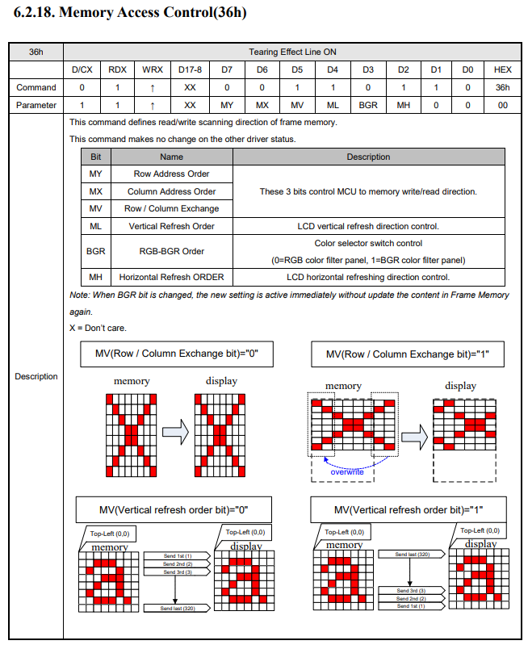

```c
/* 转成横屏 */
sunxi_lcd_cmd_write(sel, 0x36);
sunxi_lcd_para_write(sel, 0xa0);
```

1.  lcd 的配置中需要将 lcd\_x 和 lcd\_y 的值对调，此时软件将屏视为横屏。
2.  屏内部旋转出图效果可能会变差，建议选屏的时候直接选好方向。

### 背光相关参数

目前用得比较广泛的就是pwm背光调节，原理是利用pwm脉冲开关产生的高频率闪烁效应，通过调节占空比，达到欺骗人眼，调节亮暗的目的。

#### lcd\_pwm\_used

是否使用pwm。此参数标识用以背光亮度的控制。

#### lcd\_pwm\_ch

PWM Channel

此参数标识使用的Pwm通道，这里是指使用SoC哪个pwm通道，通过查看原理图连接可知。

#### lcd\_pwm\_freq

Lcd backlight PWM Frequency

这个参数配置PWM信号的频率，单位为Hz。

:::note

:::note

备注

:::
:::note

频率不宜过低否则很容易就会看到闪烁，频率不宜过快否则背光调节效果差。部分屏手册会标明所允许的pwm频率范围，请遵循屏手册固定范围进行设置。

在低亮度的时候容易看到闪烁，是正常现象，目前已知用上pwm的背光都是如此。

:::

:::

#### lcd\_pwm\_pol

Lcd backlight PWM Polarity

这个参数配置PWM信号的占空比的极性。设置相应值对应含义为：

```
0：active high
1：active low
```

#### lcd\_pwm\_max\_limit

Lcd backlight PWM 最高限制，以亮度值表示。

比如150，则表示背光最高只能调到150， 0-255范围内的亮度值将会被线性映射到0-150范围内。用于控制最高背光亮度，节省功耗。

#### lcd\_bl\_en

背光使能脚，非必须，看原理图是否有，用于使能或者禁止背光电路的电压。

```
示例：lcd_bl_en = <&pio PD 17 GPIO_ACTIVE_HIGH>;
```

需要在屏驱动调用相应的接口进行开、关的控制。

:::note

:::note

备注

:::
:::note

一般来说，高电平是使能，在这个前提下，建议将内阻电阻设置成下拉，防止硬件原因造成的上拉，导致背光提前亮。默认电平请填写高电平，这是uboot显示过度到内核显示、平滑无闪烁的需要。

:::

:::

#### lcd\_bl\_n\_percent

背光映射值，n为(0-100)。

此功能是针对亮度非线性的LCD屏的，按照配置的亮度曲线方式来调整亮度变化，以使亮度变化更线性。

比如lcd\_bl\_50\_percent = 60，表明将50%的亮度值调整成60%，即亮度比原来提高10%。

:::note

:::note

备注

:::
:::note

修改此属性不当可能导致背光调节效果差。

:::

:::

#### lcd\_backlight

背光默认值，0-255。

此属性决定在uboot显示logo阶段的亮度，进入都内核时则是读取保存的配置来决定亮度。

:::note

:::note

备注

:::
:::note

显示logo阶段，一般来说需要比较亮的亮度，业内做法都是如此。

:::

:::

### 显示效果相关参数

#### lcd\_frm

FRM是解决由于PIN减少导致的色深问题。

这个参数设置相应值对应含义为：

```
0：RGB888 -- RGB888 direct
1：RGB888 -- RGB666 dither
2：RGB888 -- RGB565 dither
```

有些LCD屏的像素格式是18bit色深（RGB666）或16bit色深（RGB565），建议打开FRM功能，通过dither的方式弥补色深，使显示达到24bit色深（RGB888）的效果。如下图所示，上图是色深为RGB66的LCD屏显示，下图是打开dither后的显示，打开dither后色彩渐变的地方过度平滑。

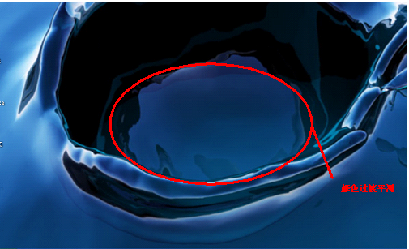

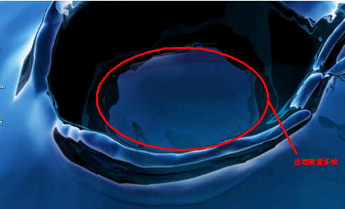

#### lcd\_gamma\_en

Lcd Gamma Correction Enable

设置相应值的对应含义为：

```
0：Lcd的Gamma校正功能关闭
1：Lcd的Gamma校正功能开启
```

设置为1时，需要在屏驱动中对 `lcd_gamma_tbl[256]` 进行赋值。

#### lcd\_cmap\_en

Lcd Color Map Enable

设置相应值的对应含义为：

```
0：Lcd的色彩映射功能关闭
1：Lcd的色彩映射功能开启
```

设置为1时，需要对 `lcd_cmap_tbl [2][3][4]` 进行赋值 `Lcd Color Map Table`。

每个像素有R、G、B三个单元，每四个像素组成一个选择项，总共有12个可选。数组第一维表示奇偶行，第二维表示像素的RGB，第三维表示第几个像素，数组的内容即表示该位置映射到的内容。

LCD CMAP是对像素的映射输出功能，只有像素有特殊排布的LCD屏才需要配置。

LCD CMAP定义每行的4个像素为一个总单元，每个像素分R、G、B 3个小单元，总共有12个小单元。通过lcd\_cmap\_tbl定义映射关系，输出的每个小单元可随意映射到12个小单元之一。

```c
__u32 lcd_cmap_tbl[2][3][4] = {
	{
		{LCD_CMAP_G0,LCD_CMAP_B1,LCD_CMAP_G2,LCD_CMAP_B3},
		{LCD_CMAP_B0,LCD_CMAP_R1,LCD_CMAP_B2,LCD_CMAP_R3},
		{LCD_CMAP_R0,LCD_CMAP_G1,LCD_CMAP_R2,LCD_CMAP_G3},
	},
	{
		{LCD_CMAP_B3,LCD_CMAP_G2,LCD_CMAP_B1,LCD_CMAP_G0},
		{LCD_CMAP_R3,LCD_CMAP_B2,LCD_CMAP_R1,LCD_CMAP_B0},
		{LCD_CMAP_G3,LCD_CMAP_R2,LCD_CMAP_G1,LCD_CMAP_R0},
	},
};
```

如上，上三行代表奇数行的像素排布，下三行代表偶数行的像素排布；

每四个像素为一个单元，第一列代表每四个像素的第一个像素映射，第二列代表每四个像素的第二个像素映射，以此类推。

如上的定义，像素的输出格式如下图所示。

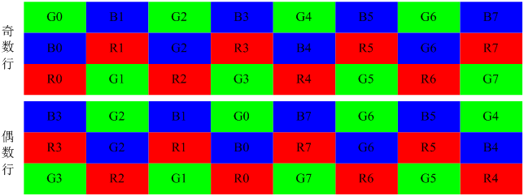

#### lcd\_rb\_swap

调换 TCON 模块 RGB 中的 R 分量和 B 分量。

```
0：不变
1：调换R分量和B分量
```

### 电源和管脚参数

如果需要使用某路电源必须现在`[disp]`节点中定义，然后`[lcd]`部分使用的字符串则要和disp中定义的一致。比如下面的例子：

```c
disp: disp@01000000 {
	disp_init_enable         = <1>;
	disp_mode                = <0>;

	/* VCC-LCD */
	dc1sw-supply = <&reg_sw>;
	/* VCC-LVDS and VCC-HDMI */
	bldo1-supply = <&reg_bldo1>;
	/* VCC-TV */
	cldo4-supply = <&reg_cldo4>;
}；
```

其中-supply是固定的，在-supply之前的字符串则是随意的，不过建议取有意义的名字。在`=`后面的像`<&reg_sw>`则必须在board.dtsi的regulator0节点中找到。

然后lcd0节点中，如果要使用reg\_sw，则像下面这样写就行，dc1sw对应dc1sw-supply。

```
lcd_power= ”dc1sw”;
```

由于u-boot中也有axp驱动和display驱动，和内核，它们都是读取同份配置，为了能互相兼容，取名的时候，有以下限制：

在u-boot 2018中，axp驱动只认类似bldo1这样从axp芯片中定义的名字，所以命名xxx-supply的时候最好按照这个axp芯片的定义来命名。

#### lcd\_power

见上面概述的注意事项。该属性用来配置屏端所需要的电

```c
示例：lcd_power = “vcc-lcd”;
```

配置regulator的名字。配置好之后，需要在屏驱动调用相应的接口进行开、关的控制。

注意：如果有多个电源需要打开，则定义lcd\_power1，lcd\_power2等。

#### lcd\_pin\_power

用法 `lcd_power`一致，区别是用户设置之后，不需要在屏驱动中去操作，而是驱动框架自行在屏驱动之前使能，在屏驱动之后禁止。该属性用来配置IO、phy 的电，屏端供电建议不要用该属性，可能会造成上电时序异常导致屏无法点亮的情况。

```
示例：lcd_pin_power = “vcc-pd”;
```

注意：如果需要多组，则添加lcd\_pin\_power1，lcd\_pin\_power2等。除了lcddx之外，这里的电源还有可能是pwm所对应管脚的电源。

#### lcd\_gpio\_0

```c
# uboot-board.dts 写法如下写：
lcd_gpio_0 = <&pio PD 25 1 0 3 1>;

# board.dts 写法如下：
lcd_gpio_0 = <&pio PD 25 GPIO_ACTIVE_HIGH>;
```

含义：lcd\_gpio\_0引脚为PD25。

-   第一数字：pin序号；
-   第二数字：功能分配；0为输入，1为输出；
-   第三个数字：内置电阻；使用0的话，标示内部电阻高阻态，如果是1则是内部电阻上拉，2就代表内部电阻下拉。使用default的话代表默认状态，即电阻上拉。其它数据无效。
-   第四个尖括号：驱动能力；3表驱动能力是等级3
-   第五个尖括号：表示默认值；即是当设置为输出时，该引脚输出的电平，0为低电平，1为高电平。
-   GPIO\_ACTIVE\_HIGH：代表配置成默认输出高电平，
-   GPIO\_ACTIVE\_LOW：代表配置成默认输出低电平

需要在屏驱动调用相应的接口进行拉高，拉低的控制。请看[管脚控制函数说明](#%E7%AE%A1%E8%84%9A%E6%8E%A7%E5%88%B6%E5%87%BD%E6%95%B0%E8%AF%B4%E6%98%8E)

注意：如果有多个gpio脚需要控制，则定义lcd\_gpio\_0，lcd\_gpio\_1等。

#### pinctrl-0和pinctrl-1

在配置`lcd0`节点时，当碰到需要配置管脚复用时，你只要把`pinctrl-0`和`pinctrl-1`赋值好就行，可以用提前定义好的，也可以用自己定义的.

例子:

```c
pinctrl-0 = <&rgb24_pins_a>; 
pinctrl-1 = <&rgb24_pins_b>; //休眠时候的定义，io_disable
```

**自定义一组脚**

写在board.dts中，只要名字不要和现有名字重复就行，首先判断自己需要用的管脚，属于大cpu域还是小cpu域，以此判断需要将管脚定义放在pio（大cpu域）下面还是r\_pio（小cpu域）下面。

例子：

```c
&pio {
	rgb8_pins_a: serial_rgb@0 {
		pins = "PD1", "PD2", "PD3", "PD4",
			"PD5", "PD6", "PD7", "PD8";
		function = "lcd";
		allwinner,drive = <1>;
	};

	rgb8_pins_b: serial_rgb@1 {
		pins = "PD1", "PD2", "PD3", "PD4",
			"PD5", "PD6", "PD7", "PD8";
		function = "io_disabled";
	};

	rgb8_pins_ctl_a: serial_rgb_ctl@0 {
		pins = "PD9", "PD10", "PD11", "PD12";
		function = "lcds_ctl";
		allwinner,drive = <1>;
	};

	rgb8_pins_ctl_b: serial_rgb_ctl@1 {
		pins = "PD9", "PD10", "PD11", "PD12";
		function = "io_disabled";
	};
};
```

为了规范，我们将在所有平台保持一致的名字，其中后缀为a为管脚使能，b的为io\_disable用于设备关闭时。 有时候，你需要用两组不同功能的管脚，可以像下面这样定义即可。

```c
pinctrl-0 = <&rgb24_pins_a>, <&xxx_pins_a>; 
pinctrl-1 = <&rgb24_pins_b>, <&xxx_pins_b>;// 休眠时候的定义，io_disable
```

## 驱动接口

### 屏驱动添加步骤

-   **Linux源码仓库**
    
-   **Uboot源码仓库**：Uboot中也有显示和屏驱动，主要用于显示logo。
    
-   **板级dts配置仓库**：通过board.dts配置一些通用的LCD参数。
    
-   **Uboot专用板级dts配置仓库**
    

#### 前期准备资料和信息

-   **屏手册**：描述屏幕基本信息和电气特性，向屏厂索要。
-   **Driver IC手册**：描述屏IC的详细信息，主要包括初始化命令等内容，向屏厂索要。
-   **屏时序信息**：详细的屏时序，向屏厂索要。
-   **屏初始化代码**：通常DSI和I8080屏需要初始化命令。向屏厂索要。
-   **万用表**：用于测量电压，帮助调试屏幕。

#### 了解屏驱动

在动手添加屏驱动之前，先了解屏驱动的结构和内容。请参考[屏驱动分解](#%E5%B1%8F%E9%A9%B1%E5%8A%A8%E5%88%86%E8%A7%A3)。

#### 选择合适的模板

通过第3步提供的资料，确定屏幕的类型。选择一个已有相同类型的屏驱动作为模板进行添加，或在现有模板上修改。

#### 修改屏驱动文件

-   **panel.c**和**panel.h**：在`panel.c`中，新增对应的`struct __lcd_panel`变量指针到全局结构体变量`panel_array`。在`panel.h`中，新增`struct __lcd_panel`的声明。

#### 修改Makefile

-   在屏驱动目录的上一级Makefile文件中的`disp-objs`中，新增刚才添加的屏驱动`.o`文件。

#### 修改dts配置

-   修改**board.dts**与**uboot-board.dts**中的`disp`和`lcd`节点。

#### 编译和烧写

-   编译**Uboot**和**Kernel**，并打包烧写。请注意，针对不同的SDK，编译方式可能有所不同，部分SDK默认不编译Uboot。

### 屏驱动分解

在屏驱动源码中，主要分为四类文件

1.  `panel.c` 和 `panel.h`，当用户添加新屏驱动时，是需要修改这两个文件的，需要将屏结构体变量添加到全局结构体变量 `panel_array` 中。
2.  屏驱动。除了上面提到的源文件外，其它的一般一个`c`文件和一个`h`文件就代表一个屏驱动。
3.  在屏驱动源码位置的上一级，有用户需要修改的 `Makefile` 文件。

我们可以打开 `drivers/video/fbdev/sunxi/disp2/disp/lcd/default_panel.c` 作为屏驱动的例子，在该文件的最后

```c
struct __lcd_panel default_panel = {
	/* panel driver name, must mach the lcd_drv_name in board.dts */
	.name = "default_lcd",
	.func = {
		.cfg_panel_info = LCD_cfg_panel_info,
		.cfg_open_flow = LCD_open_flow,
		.cfg_close_flow = LCD_close_flow,
		}
	,
};
```

该全局变量`default_panel`的成员`name`与 lcd\_driver\_name 必须一致，这个关系到驱动能否找到指定的文件。

接下来是 `func` 成员的初始化，这里最主要实现三个回调函数。`LCD_cfg_panel_info`，`LCD_open_flow` 和 `LCD_close_flow`。

开关屏流程即屏上下电流程，屏手册或者 Driver IC手册中里面的 Power on Sequence 和 Power off Sequence。用于开关屏的操作流程如下图所示。


其中，`LCD_open_flow` 和 `LCD_close_flow` 称为开关屏流程函数。方框中的函数，如 `LCD_power_on`，称为开关屏步骤函数。不需要进行初始化操作的LCD屏，比如lvds屏、RGB屏等，`LCD_panel_init` 及 `LCD_panel_exit` 这些函数可以为空。

-   函数：`LCD_open_flow`

功能：`LCD_open_flow`函数只会在系统初始化的时候调用一次，执行每个`LCD_OPEN_FUNC`即是把对应的开屏步骤函数进行注册，先注册先执行，但并没有立刻执行该开屏步骤函数。

原型：

```c
static __s32 LCD_open_flow(__u32 sel)
```

函数常用内容为：

```c
static __s32 LCD_open_flow(__u32 sel)
{
	LCD_OPEN_FUNC(sel, LCD_power_on, 10);
	LCD_OPEN_FUNC(sel, LCD_panel_init, 50);
	LCD_OPEN_FUNC(sel, sunxi_lcd_tcon_enable, 100);
	LCD_OPEN_FUNC(sel, LCD_bl_open, 0);
	return 0;
}
```

如上，调用四次`LCD_OPEN_FUNC`注册了四个回调函数，对应了四个开屏流程，先注册先执行。实际上注册多少个函数是用户自己的自由，只要合理即可。

1.  `LCD_power_on` 即打开LCD电源，再延迟10ms；这个步骤一般用于打开LCD相关电源和相关管脚比如复位脚。
2.  `LCD_panel_init` 即初始化屏，再延迟50ms；不需要初始化的屏，可省掉此步骤，这个函数一般用于发送初始化命令给屏进行屏初始化。如果是I8080屏用\[I8080接口函数说明\]I8080\_if，如果是其它情况比如I2C或者SPI可以看\[使用IIC/SPI串行接口初始化\]iic\_or\_spi\_if，也可以用GPIO来进行模拟。
3.  `sunxi_lcd_tcon_enable` 打开TCON，再延迟100ms；这一步是固定的，表示开始发送图像信号。
4.  `LCD_bl_open` 打开背光，再延迟0ms。前面三步搞定之后才开背光，这样不会看到闪烁。

如下图，这是屏手册中典型的上电时序图，我们编写屏驱动的时候，也要注意，该延时就得延时。

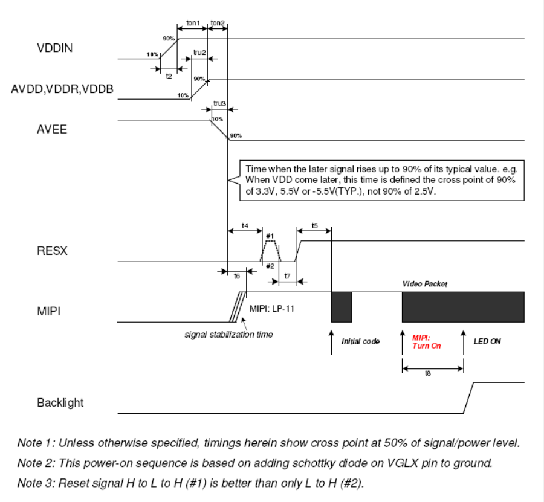

-   函数：`LCD_OPEN_FUNC`

功能：注册开屏步骤函数到开屏流程中，记住这里是注册不是执行！

原型：

```c
void LCD_OPEN_FUNC(__u32 sel, LCD_FUNC func, __u32 delay)
```

参数说明：

`func` 是一个函数指针，其类型是：`void (*LCD_FUNC) (__u32 sel)`，用户自己定义的函数必须也要用统一的形式。比如：

```c
void user_defined_func(__u32 sel)
{
	//do something
}
```

`delay` 是执行该步骤后，再延迟的时间，时间单位是毫秒。

`LCD_OPEN_FUNC` 的第二个参数是前后两个步骤的延时长度，单位ms，注意这里的数值请按照屏手册规定去填，乱填可能导致屏初始化异常或者开关屏时间过长，影响用户体验。

与 `LCD_open_flow` 对应的是 `LCD_close_flow`，它用于注册关屏函数。使用 `LCD_CLOSE_FUNC` 进行函数注册，先注册先执行。这里只是注册回调函数，不是立刻执行。

```c
static s32 LCD_close_flow(u32 sel)
{
	/* close lcd backlight, and delay 0ms */
	LCD_CLOSE_FUNC(sel, LCD_bl_close, 0);
	/* close lcd controller, and delay 0ms */
	LCD_CLOSE_FUNC(sel, sunxi_lcd_tcon_disable, 50);
	/* open lcd power, than delay 200ms */
	LCD_CLOSE_FUNC(sel, LCD_panel_exit, 100);
	/* close lcd power, and delay 500ms */
	LCD_CLOSE_FUNC(sel, LCD_power_off, 0);

	return 0;
}
```

1.  先关闭背光，这样整个关屏过程，用户不会看到闪烁的过程；
2.  关闭TCON（即停止发送数据）再延迟50ms；
3.  执行关屏代码，再延迟200ms；（不需要初始化的屏，可省掉此步骤）
4.  最后关闭电源，再延迟0ms。

如下图是典型关屏时序图。

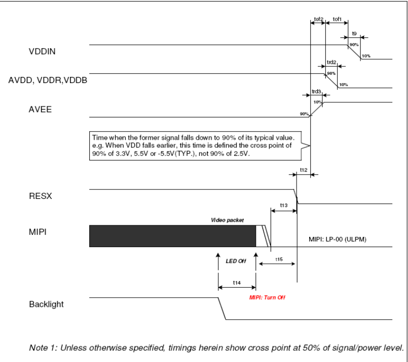

-   函数：`LCD_cfg_panel_info`

功能：配置的TCON扩展参数，比如gamma功能和颜色映射功能。

原型：

```
static void LCD_cfg_panel_info(__panel_extend_para_t * info)
```

TCON的扩展参数只能在屏文件中配置。

需要 gamma 校正，或色彩映射，在`board.dts`中将相应模块的`enable`参数置1，`lcd_gamma_en`, `lcd_cmap_en`，并且填充3个系数表，`lcd_gamma_tbl`, `lcd_cmap_tbl`，如下所示红色代码部分。注意的是：gamma，模板提供了18段拐点值，然后再插值出所有的值（255个）。可以往相应表格内添加子项以补充细节部分。`cmap_tbl`的大小是固定的，不能减小或增加表的大小。

最终生成的gamma表项是由rgb三个gamma值组成的，各占8bit。目前提供的模板中，三个gamma值是相同的。

### 延时函数说明

函数：**sunxi\_lcd\_delay\_ms** / **sunxi\_lcd\_delay\_us**

功能：延时函数，分别是毫秒级别/微秒级别的延时。

原型：

```c
/**
* @brief 延时指定的毫秒数
* 
* @param ms 延时的毫秒数
* @return s32 返回值为 0 表示成功，其他值表示发生错误
*/
s32 sunxi_lcd_delay_ms(u32 ms);

/**
* @brief 延时指定的微秒数
* 
* @param us 延时的微秒数
* @return s32 返回值为 0 表示成功，其他值表示发生错误
*/
s32 sunxi_lcd_delay_us(u32 us);
```

参数说明：

-   `ms`：延时的毫秒数。
-   `us`：延时的微秒数。

返回值：

-   返回值为 `0` 表示成功，其他值表示发生错误。

### 图像数据使能函数说明

函数：**sunxi\_lcd\_tcon\_enable** / **sunxi\_lcd\_tcon\_disable**

功能：打开LCD控制器，开始刷新LCD显示。关闭LCD控制器，停止刷新数据。

原型：

```c
/**
* @brief 打开LCD控制器，开始刷新LCD显示
* 
* @param screen_id 屏幕的标识符
*/
void sunxi_lcd_tcon_enable(u32 screen_id);

/**
* @brief 关闭LCD控制器，停止刷新LCD显示
* 
* @param screen_id 屏幕的标识符
*/
void sunxi_lcd_tcon_disable(u32 screen_id);
```

参数说明：

-   `screen_id`：LCD屏幕的标识符，通常是一个整数值，表示具体的屏幕（如主屏、副屏等）。

返回值：

-   这两个函数没有返回值。

### 背光控制函数说明

函数：**sunxi\_lcd\_backlight\_enable** / **sunxi\_lcd\_backlight\_disable**

功能：打开/关闭背光，操作的是`board.dts`中`lcd_bl`配置的GPIO。（见5.4.2 lcd\_bl\_en）

原型：

```c
/**
* @brief 打开背光
* 
* @param screen_id 屏幕的标识符
*/
void sunxi_lcd_backlight_enable(u32 screen_id);

/**
* @brief 关闭背光
* 
* @param screen_id 屏幕的标识符
*/
void sunxi_lcd_backlight_disable(u32 screen_id);
```

函数：**sunxi\_lcd\_pwm\_enable** / **sunxi\_lcd\_pwm\_disable**

功能：打开/关闭PWM控制器，打开时PWM将往外输出PWM波形。对应的是`lcd_pwm_ch`所对应的那一路PWM。

原型：

```c
/**
* @brief 打开PWM控制器，输出PWM波形
* 
* @param screen_id 屏幕的标识符
* @return s32 返回值为 0 表示成功，其他值表示发生错误
*/
s32 sunxi_lcd_pwm_enable(u32 screen_id);

/**
* @brief 关闭PWM控制器，停止输出PWM波形
* 
* @param screen_id 屏幕的标识符
* @return s32 返回值为 0 表示成功，其他值表示发生错误
*/
s32 sunxi_lcd_pwm_disable(u32 screen_id);
```

参数说明：

-   `screen_id`：LCD屏幕的标识符，通常是一个整数值，表示具体的屏幕（如主屏、副屏等）。

返回值：

-   `sunxi_lcd_pwm_enable` 和 `sunxi_lcd_pwm_disable` 返回值为 `0` 表示成功，其他值表示发生错误。
-   `sunxi_lcd_backlight_enable` 和 `sunxi_lcd_backlight_disable` 没有返回值。

### 电源控制函数说明

函数：**sunxi\_lcd\_power\_enable** / **sunxi\_lcd\_power\_disable**

功能：打开/关闭LCD电源，操作的是`board.dts`中的`lcd_power`、`lcd_power1`、`lcd_power2`。（`pwr_id`标识电源索引）

原型：

```c
/**
* @brief 打开LCD电源
* 
* @param screen_id 屏幕的标识符
* @param pwr_id 电源索引
* @note pwr_id的取值：
*       - 0: 对应于dts中的lcd_power
*       - 1: 对应于dts中的lcd_power1
*       - 2: 对应于dts中的lcd_power2
*       - 3: 对应于dts中的lcd_power3
*/
void sunxi_lcd_power_enable(u32 screen_id, u32 pwr_id);

/**
* @brief 关闭LCD电源
* 
* @param screen_id 屏幕的标识符
* @param pwr_id 电源索引
* @note pwr_id的取值：
*       - 0: 对应于dts中的lcd_power
*       - 1: 对应于dts中的lcd_power1
*       - 2: 对应于dts中的lcd_power2
*       - 3: 对应于dts中的lcd_power3
*/
void sunxi_lcd_power_disable(u32 screen_id, u32 pwr_id);
```

函数：**sunxi\_lcd\_pin\_cfg**

功能：配置LCD的IO，涉及LCD的`data`、`clk`等pin，对应`board.dts`中的`lcdd0-lcdd23`、`lcddclk`、`lcdde`、`lcdhsync`、`lcdvsync`。

原型：

```c
/**
* @brief 配置LCD的IO
* 
* @param screen_id 屏幕的标识符
* @param bon 为1时表示启用对应的pin，为0时表示禁用对应的pin
* @return s32 返回值为 0 表示成功，其他值表示发生错误
* @note DSI接口屏不需要在board.dts中配置这组pin，但同样会在此函数接口中打开与关闭对应的pin
*/
s32 sunxi_lcd_pin_cfg(u32 screen_id, u32 bon);
```

参数说明：

-   `screen_id`：LCD屏幕的标识符，通常是一个整数值，表示具体的屏幕（如主屏、副屏等）。
-   `pwr_id`：电源索引，取值范围为0到3，分别对应`lcd_power`、`lcd_power1`、`lcd_power2`、`lcd_power3`。
-   `bon`：为1表示启用对应的pin，为0表示禁用对应的pin。

返回值：

-   `sunxi_lcd_power_enable` 和 `sunxi_lcd_power_disable` 没有返回值。
-   `sunxi_lcd_pin_cfg` 返回值为 `0` 表示成功，其他值表示发生错误。

### I8080接口函数说明

显示驱动提供5个接口函数可供使用。如下：

函数：**sunxi\_lcd\_cpu\_write**

功能：设定CPU屏的指定寄存器为指定的值。

原型：

```c
/**
* @brief 设定CPU屏的指定寄存器为指定的值
* 
* @param sel 显示ID，表示操作哪个显示屏
* @param index 需要写入的寄存器索引
* @param data 要写入的寄存器数据
*/
void sunxi_lcd_cpu_write(__u32 sel, __u32 index, __u32 data);
```

函数内容为：

```c
void sunxi_lcd_cpu_write(__u32 sel, __u32 index, __u32 data)
{
	sunxi_lcd_cpu_write_index(sel, index);
	sunxi_lcd_cpu_write_data(sel, data);
}
```

此函数实现了8080总线上的两个写操作：

1.  `sunxi_lcd_cpu_write_index` 实现第一个写操作，PIN脚 `RS`（A1）为低电平，总线数据上的数据内容为参数 `index` 的值。
2.  `sunxi_lcd_cpu_write_data` 实现第二个写操作，PIN脚 `RS`（A1）为高电平，总线数据上的数据内容为参数 `data` 的值。

函数：**sunxi\_lcd\_cpu\_write\_index**

功能：设定CPU屏为指定寄存器。

原型：

```c
/**
* @brief 设定CPU屏为指定寄存器
* 
* @param sel 显示ID，表示操作哪个显示屏
* @param index 需要写入的寄存器索引
*/
void sunxi_lcd_cpu_write_index(__u32 sel, __u32 index);
```

具体说明见 `sunxi_lcd_cpu_write`。

函数：**sunxi\_lcd\_cpu\_write\_data**

功能：设定CPU屏寄存器的值为指定的值。

原型：

```c
/**
* @brief 设定CPU屏寄存器的值为指定的值
* 
* @param sel 显示ID，表示操作哪个显示屏
* @param data 要写入寄存器的数据
*/
void sunxi_lcd_cpu_write_data(__u32 sel, __u32 data);
```

函数：**tcon0\_cpu\_rd\_24b\_data**

功能：执行读取操作。

原型：

```c
/**
* @brief 读取指定寄存器的数据
* 
* @param sel 显示ID，表示操作哪个显示屏
* @param index 要读取的寄存器索引
* @param data 用于存放读取数据的数组指针，用户必须保证有足够空间存放数据
* @param size 要读取的字节数
* @return s32 返回读取操作的状态，0表示成功，其他值表示发生错误
*/
s32 tcon0_cpu_rd_24b_data(u32 sel, u32 index, u32 *data, u32 size);
```

参数说明：

-   `sel`：显示ID，表示操作哪个显示屏。
-   `index`：要读取或写入的寄存器索引。
-   `data`：用于存放读取接口返回数据的数组指针，用户必须确保该数组有足够空间来存放数据。
-   `size`：要读取的数据字节数，通常是以字节为单位。

返回值：

-   `tcon0_cpu_rd_24b_data` 返回值 `0` 表示成功，其他值表示发生错误。

### 管脚控制函数说明

函数：**sunxi\_lcd\_gpio\_set\_value**

功能：在LCD\_GPIO PIN脚上输出高电平或低电平。

原型：

```c
/**
* @brief 在LCD_GPIO PIN脚上输出高电平或低电平
* 
* @param screen_id 屏幕标识符
* @param io_index 对应于 `board.dts` 中的 `lcd_gpio_x`，指定GPIO引脚
* @param value 输出值
* 
* @return s32 返回值，0 表示成功，其他值表示失败
* @note `value` 为 0 时输出低电平，`value` 为 1 时输出高电平
*/
s32 sunxi_lcd_gpio_set_value(u32 screen_id, u32 io_index, u32 value);
```

**参数说明**：

-   `io_index`：
    
-   `0`：对应于 `board.dts` 中的 `lcd_gpio_0`
    
-   `1`：对应于 `board.dts` 中的 `lcd_gpio_1`
    
-   `2`：对应于 `board.dts` 中的 `lcd_gpio_2`
    
-   `3`：对应于 `board.dts` 中的 `lcd_gpio_3`
    
-   `value`：
    
-   `0`：输出低电平
    
-   `1`：输出高电平
    

该函数只用于GPIO引脚定义为输出的情况下。

函数：**sunxi\_lcd\_gpio\_set\_direction**

功能：设置LCD\_GPIO PIN脚为输入或输出模式。

原型：

```c
/**
* @brief 设置LCD_GPIO PIN脚为输入或输出模式
* 
* @param screen_id 屏幕标识符
* @param io_index 对应于 `board.dts` 中的 `lcd_gpio_x`，指定GPIO引脚
* @param direction 设置GPIO引脚的方向
* 
* @return s32 返回值，0 表示成功，其他值表示失败
* @note `direction` 为 0 时设置为输入，`direction` 为 1 时设置为输出
*/
s32 sunxi_lcd_gpio_set_direction(u32 screen_id, u32 io_index, u32 direction);
```

**参数说明**：

-   `io_index`：
    
-   `0`：对应于 `board.dts` 中的 `lcd_gpio_0`
    
-   `1`：对应于 `board.dts` 中的 `lcd_gpio_1`
    
-   `2`：对应于 `board.dts` 中的 `lcd_gpio_2`
    
-   `3`：对应于 `board.dts` 中的 `lcd_gpio_3`
    
-   `direction`：
    
-   `0`：设置为输入模式
    
-   `1`：设置为输出模式
    

该函数用于控制GPIO引脚的工作模式（输入或输出）。

**屏幕初始化**

在一些屏幕的初始化过程中，LCD显示面板可能需要根据不同的接口进行初始化。

-   **CPU屏幕**：通过 8080 总线进行初始化，使用的是 LCDIO（PD）引脚。
-   **RGB屏幕**：提供其他接口（SPI/IIC）初始化

这种初始化方式确保了不同屏幕类型在硬件配置上的一致性。

**相关文件**

这些接口函数的实现和定义通常在 `lcd_source.c` 和 `lcd_source.h` 文件中可以找到，这些文件包含了与LCD面板的控制相关的代码。

### 使用IIC/SPI串行接口初始化

需要在屏驱动中注册`IIC`/`SPI`设备对串行接口的访问。

#### 使用软件控制 GPIO 模拟 SPI 初始化

部分 RGB 屏幕初始化会使用 3 线 SPI 9bit 协议初始化，一般此时采用软件控制 GPIO 模拟 SPI 初始化方式。

```c
#define LCD_MOSI_PIN (2)  // lcd_gpio_2
#define LCD_CLK_PIN  (1)  // lcd_gpio_1
#define LCD_RST_PIN  (0)  // lcd_gpio_0
#define LCD_CS_PIN   (3)  // lcd_gpio_3

static void spi_send_data(u32 sel, u8 i)
{
	u8 n;
	for (n = 0; n < 8; n++) {
		if (i & 0x80)
			sunxi_lcd_gpio_set_value(sel, LCD_MOSI_PIN, 1);
		else
			sunxi_lcd_gpio_set_value(sel, LCD_MOSI_PIN, 0);

		i <<= 1;
		sunxi_lcd_gpio_set_value(sel, LCD_CLK_PIN, 0);
		sunxi_lcd_gpio_set_value(sel, LCD_CLK_PIN, 1);
	}
}

static void spi_write_cmd(u32 sel, u8 i)
{
	sunxi_lcd_gpio_set_value(sel, LCD_CS_PIN, 0);
	sunxi_lcd_gpio_set_value(sel, LCD_MOSI_PIN, 0);
	sunxi_lcd_gpio_set_value(sel, LCD_CLK_PIN, 0);
	sunxi_lcd_gpio_set_value(sel, LCD_CLK_PIN, 1);
	spi_send_data(sel, i);
	sunxi_lcd_gpio_set_value(sel, LCD_CS_PIN, 1);
}

static void spi_write_data(u32 sel, u8 i)
{
	sunxi_lcd_gpio_set_value(sel, LCD_CS_PIN, 0);
	sunxi_lcd_gpio_set_value(sel, LCD_MOSI_PIN, 1);
	sunxi_lcd_gpio_set_value(sel, LCD_CLK_PIN, 0);
	sunxi_lcd_gpio_set_value(sel, LCD_CLK_PIN, 1);
	spi_send_data(sel, i);
	sunxi_lcd_gpio_set_value(sel, LCD_CS_PIN, 1);
}
```

调用 `spi_write_cmd` 和 `spi_write_data` 即可完成初始化。

#### 使用硬件 SPI 对屏或者转接IC进行初始化

首先调用`spi_init`函数对`SPI`硬件进行初始化，`spi_init`函数可以分为几个步骤：

-   第一获取`MASTER`；根据实际的硬件连接，选择`SPI`（代码中选择了`SPI1`）。
-   第二步设置`SPI DEVICE`，这里包括最大速度，`SPI`传输模式，以及每个字包含的比特数。最后调用`spi_setup`完成`MASTER`和`DEVICE`的关联。

`comm_out`是一个`SPI`传输的例子，核心就是`spi_sync_transfer`函数。

```c
static int spi_init(void)
{
	int ret = -1;
	struct spi_master *master;

	master = spi_busnum_to_master(1);
	if (!master) {
		lcd_fb_wrn("fail to get master\n");
		goto OUT
	}

spi_device = spi_alloc_device(master);
	if (!spi_device) {
		lcd_fb_wrn("fail to get spi device\n");
		goto OUT;
	}

spi_device->bits_per_word = 8;
	spi_device->max_speed_hz = 60000000; /*50MHz*/
	spi_device->mode = SPI_MODE_0;

	ret = spi_setup(spi_device);
	if (ret) {
		lcd_fb_wrn("Faile to setup spi\n");
		goto FREE;
	}

	lcd_fb_inf("Init spi1:bits_per_word:%d max_speed_hz:%d mode:%d\n",
		spi_device->bits_per_word, spi_device->max_speed_hz,
		spi_device->mode);

	ret = 0;
	goto OUT;

FREE:
	spi_master_put(master);
	kfree(spi_device);
	spi_device = NULL;
OUT:
	return ret;
}

static int comm_out(unsigned int sel, unsigned char cmd)
{
	struct spi_transfer    t;
	if (!spi_device)
		return -1;
	DC(sel, 0);
	memset(&t, 0, sizeof(struct spi_transfer));
	t.tx_buf     = &cmd;
	t.len        = 1;
	t.bits_per_word    = 8;
	t.speed_hz = 24000000;
	return spi_sync_transfer(spi_device, &t, 1);
}
```

#### 使用硬件 TWI 对 LCD & 转接 IC 进行初始化

初始化`I2C`硬件的核心函数是`i2c_add_driver`，而你要做的是初始化好其参数`struct i2c_driver`。

`it66121_id`包含设备名字以及`I2C`总线索引（`i2c0`，`i2c1`...）。

`it66121_i2c_probe`能进到这个函数，你就可以开始使用`I2C`了。代码段里面仅仅将后面需要的参数`client`赋值给一个全局指针变量。

`it66121_match`，这是`dts`的match table，由于你是给`disp2`加驱动，所以这里的match table就是`disp2`的match table，这个table关系到能否使用`I2C`，可别填错了。

`tv_i2c_detect`函数，这里是非常关键的，这个函数早于`probe`函数被调用，只有成功被调用后才能开始使用`I2C`，其中`strlcpy`的调用意味着成功。

`normal_i2c`是从设备地址列表，填写的`LCD`或者转接IC的从设备地址以及`I2C`索引。

以`probe`函数是否被调用来决定你是否可以开始使用`I2C`。

用`i2c_smbus_write_byte_data`或者`i2c_smbus_read_byte_data`来读写可以满足大部分场景。

```c
#define IT66121_SLAVE_ADDR 0x4c
#define IT66121_I2C_ID 0

static const struct i2c_device_id it66121_id[] = {
	{ "IT66121", IT66121_I2C_ID },
	{ /* END OF LIST */ }
};
MODULE_DEVICE_TABLE(i2c, it66121_id);
static int it66121_i2c_probe(struct i2c_client *client, const struct i2c_device_id *id)
{
	this_client = client;
	return 0;
}

static const struct of_device_id it66121_match[] = {
	{.compatible = "allwinner,sun8iw10p1-disp",},
	{.compatible = "allwinner,sun50i-disp",},
	{.compatible = "allwinner,sunxi-disp",},
	{},
};

static int tv_i2c_detect(struct i2c_client *client, struct i2c_board_info *info)
{
	const char *type_name = "IT66121";

	if (IT66121_I2C_ID == client->adapter->nr) {
		strlcpy(info->type, type_name, 20);
	} else
		pr_warn("%s:%d wrong i2c id:%d, expect id is :%d\n", __func__, __LINE__,
			client->adapter->nr, IT66121_I2C_ID);
	return 0;
}

static  unsigned short normal_i2c[] = {IT66121_SLAVE_ADDR, I2C_CLIENT_END};

static struct i2c_driver it66121_i2c_driver = {
	.class = I2C_CLASS_HWMON,
	.id_table = it66121_id,
	.probe = it66121_i2c_probe,
	.remove = it66121_i2c_remove,
	.driver = {
		.owner = THIS_MODULE,
		.name = "IT66121",
		.of_match_table = it66121_match,
	},
	.detect        = tv_i2c_detect,
	.address_list    = normal_i2c,
};

static void LCD_panel_init(u32 sel)
{
	int ret = -1;

	ret = i2c_add_driver(&it66121_i2c_driver);
	if (ret) {
		pr_warn("Add it66121_i2c_driver fail!\n");
		return;
	}
//start init chip with i2c

}

void it6612_twi_write_byte(it6612_reg_set* reg)
{
	u8 rdata = 0;
	u8 tmp = 0;

	rdata = i2c_smbus_read_byte_data(this_client, reg->offset);
	tmp = (rdata & (~reg->mask))|(reg->mask&reg->value);
	i2c_smbus_write_byte_data(this_client, reg->offset, tmp);
}
```

## 屏时序计算

时序参数对于调屏非常关键，决定了发送端（SoC）发送数据时序。由于涉及到发送端和接收端的调试，除了分辨率和尺寸之外，其它几个数值都不是绝对不变的，两款一样分辨率，同种接口的屏，它们的数值也有可能不一样。

### 屏时序计算器

## LCD Timing 计算器

Width:
Height:

HBP (Horizontal Back Porch):
VBP (Vertical Back Porch):

HSYNC (Horizontal Sync Width or lcd\_hspw):
VSYNC (Vertical Sync Width or lcd\_vspw):

HFP (Horizontal Front Porch):
VFP (Vertical Front Porch):

FPS (Frames per second):

### 设备树配置参数

**lcd\_x:** 200

**lcd\_y:** 400

**lcd\_hspw:** 60

**lcd\_ht:** 0

**lcd\_hbp:** 0

**lcd\_vt:** 0

**lcd\_vbp:** 0

**lcd\_vspw:** 40

**lcd\_dclk\_freq:** 0 MHz

### 硬件配置参数，请检查是否存在异常数值或负数，若存在请修改时序使其不产生负数

**timmings.x\_res:** 200

**timmings.y\_res:** 400

**timmings.hor\_total\_time:** 0

**timmings.hor\_sync\_time:** 60

**timmings.hor\_back\_porch:** \-60

**timmings.hor\_front\_porch:** \-200

**timmings.ver\_total\_time:** 0

**timmings.ver\_sync\_time:** 40

**timmings.ver\_back\_porch:** \-40

**timmings.ver\_front\_porch:** \-400

### MIPI DSI 扩展时序，请检查是否存在异常数值或负数，若存在请修改时序使其不产生负数

**dsi\_hsa RGB888:** lcd\_hspw \* 24 / 8 - (4 + 4 + 2) = 170

**dsi\_hsa RGB666:** lcd\_hspw \* 18 / 8 - (4 + 4 + 2) = 125

**dsi\_hsa RGB565:** lcd\_hspw \* 16 / 8 - (4 + 4 + 2) = 110

**dsi\_hbp RGB888:** (lcd\_hbp - lcd\_hspw) \* 24 / 8 - (4 + 2) = \-186

**dsi\_hbp RGB666:** (lcd\_hbp - lcd\_hspw) \* 18 / 8 - (4 + 2) = \-141

**dsi\_hbp RGB565:** (lcd\_hbp - lcd\_hspw) \* 16 / 8 - (4 + 2) = \-126

**dsi\_hact RGB888:** lcd\_x \* 24 / 8 = 600

**dsi\_hact RGB666:** lcd\_x \* 18 / 8 = 450

**dsi\_hact RGB565:** lcd\_x \* 16 / 8 = 400

**dsi\_hblk RGB888:** (lcd\_ht - lcd\_hspw) \* 24 / 8 - (4 + 4 + 2) = \-190

**dsi\_hblk RGB666:** (lcd\_ht - lcd\_hspw) \* 18 / 8 - (4 + 4 + 2) = \-145

**dsi\_hblk RGB565:** (lcd\_ht - lcd\_hspw) \* 16 / 8 - (4 + 4 + 2) = \-130

**dsi\_hfp RGB888:** dsi\_hblk - (4 + dsi\_hact + 2) - (4 + dsi\_hbp + 2) = \-616

**dsi\_hfp RGB666:** dsi\_hblk - (4 + dsi\_hact + 2) - (4 + dsi\_hbp + 2) = \-466

**dsi\_hfp RGB565:** dsi\_hblk - (4 + dsi\_hact + 2) - (4 + dsi\_hbp + 2) = \-416

**dsi\_vblk && DSI\_LANE == 4 RGB888:** lane - ((lcd\_ht \* 24 / 8) \* lcd\_vt - (4 + dsi\_hfp + 2)) % lane = 2

**dsi\_vblk && DSI\_LANE == 4 RGB666:** lane - ((lcd\_ht \* 18 / 8) \* lcd\_vt - (4 + dsi\_hfp + 2)) % lane = 4

**dsi\_vblk && DSI\_LANE == 4 RGB565:** lane - ((lcd\_ht \* 16 / 8) \* lcd\_vt - (4 + dsi\_hfp + 2)) % lane = 2

### 屏时序获取方式

最好的获取方式是**通过询问LCD屏厂获得确切的时序参考值**。其次或是从屏手册或者 Driver IC 手册中查找（向屏厂索要这些文档）。至少需要从屏厂获得**Width（屏宽），Height（屏高），HBP，HFP，HSW，VBP，VFP，VSW**的数值。

### 时序参数说明

下面是将您提供的公式转换为Markdown格式的LaTeX公式：

**lcd\_x**: 显示屏的水平像素数量，也就是屏分辨率中的宽。 数值：对应屏厂 Width。

**lcd\_y**: 显示屏的垂直行数，也就是屏分辨率中的高。  
数值：对应屏厂 Height。

**lcd\_hspw**: Horizontal Sync Pulse Width。指行同步信号的宽度。单位为1个dclk的时间（即是1个data cycle的时间）。  
数值：对应屏厂 HSW。

**lcd\_hbp**: Horizontal Back Porch。指有效行间，行同步信号（hsync）开始，到有效数据开始之间的 dclk 的 cycle 个数，包括同步信号区。  
数值：是包含了hspw段，也就是

$$lcd\_hbp = \text{实际的hbp} + \text{实际的hspw}$$

对应屏厂HBP+HSW。

**lcd\_ht**: Horizontal Total time。指一行总的 dclk 的 cycle 个数。  
数值：

$$lcd\_ht = lcd\_x + lcd\_hspw + lcd\_hbp + lcd\_hfp$$

对应屏厂 Width + HSW + HBP + HFP。

由上面公式可知，我们不需要设置lcd\_hfp参数，因为驱动会自动根据其它几个已知参数中算出lcd\_hfp。

**lcd\_vspw**: Vertical Sync Pulse Width。指场同步信号的宽度。单位为行。  
数值：对应屏厂 VSW。

**lcd\_vbp**: Vertical Back Porch。指场同步信号（vsync）开始，到有效数据行开始之间的行数，包括场同步信号区。  
数值：是包含了 Vspw 段，也就是

$$lcd\_vbp = \text{实际的vbp} + \text{实际的vspw}$$

对应屏厂VBP+VSW。

**lcd\_vt**: Vertical Total time。指一场的总行数。  
数值：

$$lcd\_vt = lcd\_y + lcd\_vspw + lcd\_vbp + lcd\_vfp$$

对应屏厂 Height+VSW+VBP+VFP。  
由上面公式可知，我们不需要设置 lcd\_vfp 参数，因为驱动会自动根据其它几个已知参数中算出 lcd\_vfp。

**lcd\_dclk\_freq**: Dot Clock Frequency。传输像素传送频率。单位为MHz。  
数值：

$$lcd\_dclk\_freq = lcd\_ht \times lcd\_vt \times fps$$

fps一般是60。注意 lcd\_dclk\_freq 数值取整数，单位是MHz。  
如果是串行接口，发完一个像素需要2到3个周期的，那么，

$$lcd\_dclk\_freq \times cycles = lcd\_ht \times lcd\_vt \times fps$$

或者

$$lcd\_dclk\_freq = lcd\_ht \times cycles \times lcd\_vt \times fps$$

### 屏参实战

假如调试一款 RGB 屏，通过询问屏厂获得了屏的时序参数如下： Width-200，Height-400，HBP-120，HFP-130，HSW-60，VBP-20，VFP-40，VSW-40。

根据您提供的时序参数，我们可以通过以下的公式来计算各个值：

1.  **已知参数**：

| **Width** | **Height** | **HBP** | **HFP** | **HSW** | **VBP** | **VFP** | **VSW** |
| --- | --- | --- | --- | --- | --- | --- | --- |
| 200 | 400 | 120 | 130 | 60 | 20 | 40 | 40 |

2.  **目标参数计算过程**：

**计算lcd\_hbp**：

公式：

$$lcd\_hbp = \text{实际的hbp} + \text{实际的hspw}$$

屏厂给出的 **HBP = 120** 和 **HSW = 60**，所以：

$$lcd\_hbp = 120 + 60 = 180$$

**计算lcd\_ht**：

公式：

$$lcd\_ht = lcd\_x + lcd\_hspw + lcd\_hbp + lcd\_hfp$$

通过代入数值：

$$lcd\_ht = 200 + 60 + 120 + 130 = 510$$

**计算lcd\_vbp**：

公式：

$$lcd\_vbp = \text{实际的vbp} + \text{实际的vspw}$$

屏厂给出的 **VBP = 20** 和 **VSW = 40**，所以

$$lcd\_vbp = 20 + 40 = 60$$

**计算lcd\_vt**：

公式：

$$lcd\_vt = lcd\_y + lcd\_vspw + lcd\_vbp + lcd\_vfp$$

通过代入数值：

$$lcd\_vt = 400 + 40 + 20 + 40 = 500$$

**计算lcd\_dclk\_freq**：

公式：

$$lcd\_dclk\_freq = lcd\_ht \times lcd\_vt \times fps$$

假设 **fps = 60**。通过代入数值：

$$lcd\_dclk\_freq = 510 \times 500 \times 60$$ $$lcd\_dclk\_freq = 15,300,000 \, \text{dclk/s} = 15.3 \, \text{MHz}$$

四舍五入后得到 **lcd\_dclk\_freq = 15 MHz**。

**总结**：

根据上面的计算过程，我们得到了以下参数配置：

```dts
lcd_x               = <200>;
lcd_y               = <400>;
lcd_dclk_freq       = <15>;

lcd_hbp             = <180>;
lcd_ht              = <510>;
lcd_hspw            = <60>;
lcd_vbp             = <60>;
lcd_vt              = <500>;
lcd_vspw            = <40>;
```

### 屏时序检查器

## LCD Timing 配置检查

lcd\_x:
lcd\_y:

lcd\_ht:
lcd\_vt:

lcd\_hspw:
lcd\_vspw:

lcd\_hbp:
lcd\_vbp:

lcd\_dclk\_freq:

### 硬件配置参数，请检查是否存在异常数值或负数，若存在请修改时序使其不产生负数

**timmings.x\_res:** 200

**timmings.y\_res:** 400

**timmings.hor\_total\_time:** 510

**timmings.hor\_sync\_time:** 60

**timmings.hor\_back\_porch:** 120

**timmings.hor\_front\_porch:** 130

**timmings.ver\_total\_time:** 500

**timmings.ver\_sync\_time:** 40

**timmings.ver\_back\_porch:** 20

**timmings.ver\_front\_porch:** 40

**fps:** 58.8235294117647

### MIPI DSI 扩展时序，请检查是否存在异常数值或负数，若存在请修改时序使其不产生负数

**dsi\_hsa RGB888:** lcd\_hspw \* 24 / 8 - (4 + 4 + 2) = 170

**dsi\_hsa RGB666:** lcd\_hspw \* 18 / 8 - (4 + 4 + 2) = 125

**dsi\_hsa RGB565:** lcd\_hspw \* 16 / 8 - (4 + 4 + 2) = 110

**dsi\_hbp RGB888:** (lcd\_hbp - lcd\_hspw) \* 24 / 8 - (4 + 2) = 354

**dsi\_hbp RGB666:** (lcd\_hbp - lcd\_hspw) \* 18 / 8 - (4 + 2) = 264

**dsi\_hbp RGB565:** (lcd\_hbp - lcd\_hspw) \* 16 / 8 - (4 + 2) = 234

**dsi\_hact RGB888:** lcd\_x \* 24 / 8 = 600

**dsi\_hact RGB666:** lcd\_x \* 18 / 8 = 450

**dsi\_hact RGB565:** lcd\_x \* 16 / 8 = 400

**dsi\_hblk RGB888:** (lcd\_ht - lcd\_hspw) \* 24 / 8 - (4 + 4 + 2) = 1340

**dsi\_hblk RGB666:** (lcd\_ht - lcd\_hspw) \* 18 / 8 - (4 + 4 + 2) = 1002.5

**dsi\_hblk RGB565:** (lcd\_ht - lcd\_hspw) \* 16 / 8 - (4 + 4 + 2) = 890

**dsi\_hfp RGB888:** dsi\_hblk - (4 + dsi\_hact + 2) - (4 + dsi\_hbp + 2) = 374

**dsi\_hfp RGB666:** dsi\_hblk - (4 + dsi\_hact + 2) - (4 + dsi\_hbp + 2) = 276.5

**dsi\_hfp RGB565:** dsi\_hblk - (4 + dsi\_hact + 2) - (4 + dsi\_hbp + 2) = 244

**dsi\_vblk && DSI\_LANE == 4 RGB888:** lane - ((lcd\_ht \* 24 / 8) \* lcd\_vt - (4 + dsi\_hfp + 2)) % lane = 4

**dsi\_vblk && DSI\_LANE == 4 RGB666:** lane - ((lcd\_ht \* 18 / 8) \* lcd\_vt - (4 + dsi\_hfp + 2)) % lane = 2.5

**dsi\_vblk && DSI\_LANE == 4 RGB565:** lane - ((lcd\_ht \* 16 / 8) \* lcd\_vt - (4 + dsi\_hfp + 2)) % lane = 2

## 调试方法

系统起来之后可以读取sysfs一些信息，来协助调试。

### 查看显示信息

以下信息是所有信息中最重要的。

```
cat /sys/class/disp/disp/attr/sys

screen 0:
de_rate 297000000 hz, ref_fps:60
mgr0: 1280x800 fmt[rgb] cs[0x204] range[full] eotf[0x4] bits[8bits] err[0] force_sync[0] unblank direct_show[false]
	lcd output    backlight( 50)    fps:60.9    1280x 800
	err:0    skip:31    irq:1942    vsync:0    vsync_skip:0    
BUF    enable ch[1] lyr[0] z[0] prem[N] a[globl 255] fmt[  8] fb[1280, 800;1280, 800;1280, 800] crop[   0,   0,1280, 800] frame[   0,   0,1280, 800] addr[       0,       0,       0] flags[0x       0] trd[0,0]
```

**lcd output**

表示当前显示接口是LCD输出。

**1280x800**

表示当前LCD的分辨率，与board.dts中lcd0的设置一样。

**ref\_fps:60**

是根据你在board.dts的lcd0填的时序算出来的理论值。

**fps:60.9**

后面的数值是实时统计的，正常来说应该是在60(期望的fps)附近，如果差太多则不正常，重新检查屏时序，和在屏驱动的初始化序列是否有被调用到。

**irq:1942**

这是vsync中断的次数，每加1都代表刷新了一帧，正常来说是一秒60（期望的fps）次，重复cat sys，如果无变化，则异常。

**BUF**

开头的表示图层信息，一行BUF表示一个图层，如果一个BUF都没有出现，那么将是黑屏，不过和屏驱动本身关系就不大了，应该查看应用层&框架层。

**err:0**

这个表示缺数，如果数字很大且一直变化，屏幕会花甚至全黑，全红等。

**skip:31**

这个表示跳帧的数量，如果这个数值很大且一直变化，有可能卡顿，如果数字与irq后面的数字一样，说明每一帧都跳，会黑屏（有背光）。

### 查看pwm信息

Pwm的用处这里是提供背光电源。

```
cat /sys/kernel/debug/pwm

platform/7020c00.s_pwm, 1 PWM device
pwm-0   ((null)              ): period: 0 ns duty: 0 ns polarity: normal

platform/300a000.pwm, 2 PWM devices
pwm-0   (lcd                 ): requested enabled period: 20000 ns duty: 3984 ns polarity: normal
pwm-1   ((null)              ): period: 0 ns duty: 0 ns polarity: normal
```

上面的“requested enabled ”表示请求并且使能了，括号里面的lcd表示是由lcd申请的。

### 查看管脚信息

```
cat /sys/kernel/debug/pinctrl/42000000.pinctrl/pinmux-pins

pin 97 (PD1): device soc@2002000:lcd0@5461000 function lcd group PD1
pin 98 (PD2): device soc@2002000:lcd0@5461000 function lcd group PD2
pin 99 (PD3): device soc@2002000:lcd0@5461000 function lcd group PD3
pin 100 (PD4): device soc@2002000:lcd0@5461000 function lcd group PD4
pin 101 (PD5): device soc@2002000:lcd0@5461000 function lcd group PD5
pin 102 (PD6): device soc@2002000:lcd0@5461000 function lcd group PD6
pin 103 (PD7): device soc@2002000:lcd0@5461000 function lcd group PD7
pin 104 (PD8): device soc@2002000:lcd0@5461000 function lcd group PD8
pin 105 (PD9): device soc@2002000:lcd0@5461000 function lcds_ctl group PD9
pin 106 (PD10): device soc@2002000:lcd0@5461000 function lcds_ctl group PD10
pin 107 (PD11): device soc@2002000:lcd0@5461000 function lcds_ctl group PD11
pin 108 (PD12): device soc@2002000:lcd0@5461000 function lcds_ctl group PD12
```

### 查看时钟信息

`cat /sys/kernel/debug/clk/clk_summary`

这个命令可以看哪个时钟是否使能，然后频率是多少。

```
cat /sys/kernel/debug/clk/clk_summary | grep tcon
```

### 查看接口自带Colorbar

显示是一整条链路，中间任何一个环节出错，最终的表现都是显示异常，图像显示异常几个可能原因：

1.  图像本身异常。
2.  图像经过DE（Display Engine）后异常。
3.  图像经过接口模块后异常。这是我们关注的点。

有一个简单的方法可以初步判断，接口模块（tcon和dsi等）可以自己输出内置的一些patten，比如说彩条，灰阶图，棋盘图等。当接口输出这些内置patten的时候，如果这时候显示就异常，这说明了：

1.  LCD的驱动或者配置有问题
    
2.  LCD屏由于外部环境导致显示异常
    

显示自带patten的方式：

disp的sysfs中有一个attr可以直接操作显示:

```
echo X >  /sys/class/disp/disp/attr/colorbar
```

上面的操作是显示colorbar，其中的X可以是0到8，对应的含义如下图所示：

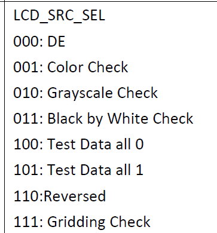

如果有多个显示设备，想让第二个显示设备显示colorbar的话，那么先

```
echo 1 > /sys/class/disp/disp/attr/colorbar
```

然后再执行上面操作。

### 重启 lcd 显示通路

在uboot显示开启的情况下，kernel不再重新开启显示通路。如果发现设备启动后显示异常，可以在内核通过以下脚本重启lcd 显示通路，来定位内核部分的显示逻辑是否正常。

```
cd /sys/kernel/
mount -t debugfs none debug/
cd debug/dispdbg
echo lcd0 > name; echo disable > command; echo 1 > start

echo lcd0 > name; echo enable > command; echo 1 > start

#lcd0 代表该屏dts使用的是lcd0节点，请以实际配置为准
```

如果重启lcd 显示通路后，内核显示正常，则初步定位是uboot的显示有问题，需要排查uboot有没有正确加载屏驱动，以及执行情况。

## 常见问题

### RGB 屏幕配置 27M 时钟实测 48M

在设备树中配置屏幕时钟 `lcd_dclk_freq = <27>;` 但是实际测量时钟是 48M

驱动获取时钟的方法如下：

1.  pll\_video0x4 是 tcon\_lcd 的父时钟，它始终是 video0 时钟的四倍频（默认情况下）。
2.  一般主时钟公式为 $\text{pllclk} = \frac{24M \cdot (N+1)}{M+1}$，24M 是晶振，N/M 是分频因子，有对应的寄存器。
3.  除了主时钟 pll 有分频因子 M、N 外, 各个模块也有一个分频因子，对于 LCD 来说，这个分频因子 DCLKDIV 必须大于等于 6，这是硬件限制。
4.  首先配置父时钟，再配置 DCLKDIV，就能得到 dclk。驱动配置父时钟的逻辑是：每个 pll都有一个既定的 tbl，存放着离散的一些时钟值，从小到大排。给定一个目标时钟后，会用二分法寻找目标时钟，完全相等后返回成功配置，如果查完了都没有找到完全匹配的，则会直接返回最后一个和目标相差最近的那个时钟，配上去。
5.  $\text{dclk} = \frac{\text{父时钟}}{\text{DCLKDIV}} \quad \Rightarrow \quad \text{pll\_video0x4} = \text{dclk} \cdot \text{DCLKDIV}$, dclk 是我们想要的时钟，比如 27M, 而 DCLKDIV 的限制条件是大于等于 6，于是就可以计算出父时钟应该是多少了。
6.  根据计算出的父时钟，再设置 `pll_video0x4` 的时钟，之后输出时钟给到 LCD

在开机时，如果使用的是 RGB 屏幕，我们可以看到这样的输出：

```
disp 0, clk: pll(162000000),clk(162000000),dclk(27000000) dsi_rate(162000000)
	clk real:pll(288000000),clk(288000000),dclk(48000000) dsi_rate(0)
```

实际芯片的 LCD 是通过 PLL 时钟分频得到的。所以在这里会计算分频的分频值。使用 $\text{dclk} = 27 \, \text{MHz}$ 乘上 $\text{DCLKDIV} = 6$，得到 $\text{pll} = 162 \, \text{MHz}$，即

$$\text{pll} = 27 \, \text{MHz} \times 6 = 162 \, \text{MHz}.$$

使用 $\text{pll} = 162 \, \text{MHz}$ 去申请最近的时钟，这里申请到的是 $\text{real:pll} = 288 \, \text{MHz} $，即

$$\text{real:pll} = 288 \, \text{MHz}.$$

此时使用

$$\text{分频系数} = \left\lfloor \frac{\text{real:pll}}{\text{pll}} \right\rfloor = \left\lfloor \frac{288 \, \text{MHz}}{162 \, \text{MHz}} \right\rfloor = 1.$$

由于不执行浮点运算，输出的结果会向下取整。因此分频系数是 1。使用分频系数乘上 $\text{DCLKDIV} =6$ 系数即可得到 $288 \, \text{MHz} $ 的实际分频结果，计算如下：

$$\text{实际分频结果} = \frac{\text{real:pll}}{1 \times 6} = \frac{288 \, \text{MHz}}{6} = 48 \, \text{MHz}.$$

所以 SDK 默认配置的 $\text{DCLKDIV} = 6$ 默认不满足 27M 时钟分频输出，这里可以将其改为 16。

使用 $\text{dclk} = 27 \, \text{MHz}$ 乘上 $\text{DCLKDIV} = 16$，得到 $\text{pll} = 432 \, \text{MHz} $，即

$$\text{pll} = 27 \, \text{MHz} \times 16 = 432 \, \text{MHz}.$$

使用$\text{pll} = 432 \, \text{MHz} $去申请最近的时钟，这里申请到的是 $\text{real:pll} = 432 \, \text{MHz}$，即

$$\text{real:pll} = 432 \, \text{MHz}.$$

此时使用

$$\text{分频系数} = \left\lfloor \frac{\text{real:pll}}{\text{pll}} \right\rfloor = \left\lfloor \frac{432 \, \text{MHz}}{432 \, \text{MHz}} \right\rfloor = 1.$$

由于不执行浮点运算，输出的结果会向下取整。因此分频系数是 1。使用分频系数乘上 $\text{DCLKDIV}$ 系数即可得到 $432 \, \text{MHz}$ 的实际分频结果，计算如下：

$$\text{实际分频结果} = \frac{\text{real:pll}}{1 \times 16} = \frac{432 \, \text{MHz}}{16} = 27 \, \text{MHz}.$$

#### 修改分频系数

分频系数会存放在这样的一个表中，选择需要修改的分频类型修改，例如这里我们修改 RGB 屏幕的系数为16

:::tip

:::note

提示

:::
:::note

-   全志 DISP2 驱动框架中，RGB 屏被称作 HV 屏，这里修改 `LCD_IF_HV`
-   由于 U-Boot 与 Linux 均有驱动，修改时需要同步修改两份

:::

:::

-   U-boot 驱动：

brandy/brandy-2.0/u-boot-2018/drivers/video/sunxi/disp2/disp/de/lowlevel\_v2x/disp\_al.c

```patch
 static struct lcd_clk_info clk_tbl[] = {
-	{LCD_IF_HV, 6, 1, 1, 0},
+	{LCD_IF_HV, 16, 1, 1, 0},
 	{LCD_IF_CPU, 12, 1, 1, 0},
 	{LCD_IF_LVDS, 7, 1, 1, 0},
 #if defined(DSI_VERSION_40)
 	{LCD_IF_DSI, 4, 1, 4, 150000000},
 #else
 	{LCD_IF_DSI, 4, 1, 4, 0},
 #endif /*endif DSI_VERSION_40 */
};
```

-   Linux 驱动：

bsp/drivers/video/sunxi/disp2/disp/de/lowlevel\_v2x/disp\_al.c

```patch
 static struct lcd_clk_info clk_tbl[] = {
-	{LCD_IF_HV, 6, 1, 1, 0},
+	{LCD_IF_HV, 16, 1, 1, 0},
 	{LCD_IF_CPU, 12, 1, 1, 0},
 	{LCD_IF_LVDS, 7, 1, 1, 0},
 #if defined(DSI_VERSION_40)
 	{LCD_IF_DSI, 4, 1, 4, 150000000},
 #else
 	{LCD_IF_DSI, 4, 1, 4, 0},
 #endif /*endif DSI_VERSION_40 */
};
```

### U-Boot 正常显示 LOGO ，然后屏幕就没反应，内核开关屏也不行

I80 屏幕出现问题，屏幕正常显示，但是进入内核就不受控制了，执行了开关屏幕也不能恢复显示。

查看 PINMUX，可以看到 GPIO MUX 切换到 RMII 了

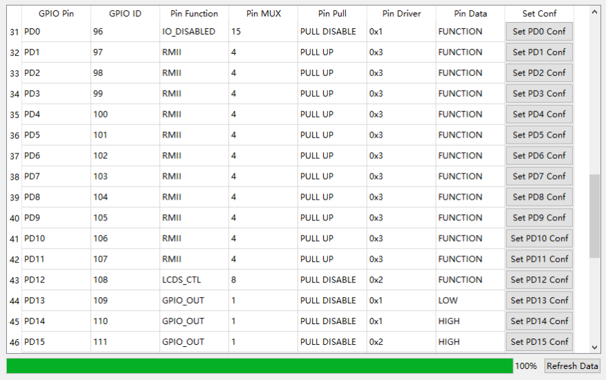

检查日志，发现是 U-Boot 切的

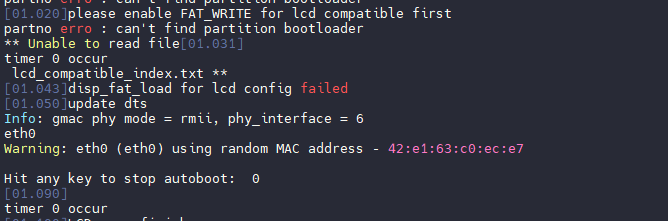

把 U-Boot 中的GMAC驱动取消勾选即可

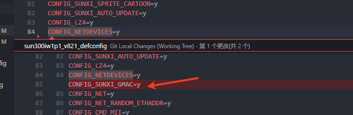

### 运行程序打印大量 disp\[ERR\] 消息

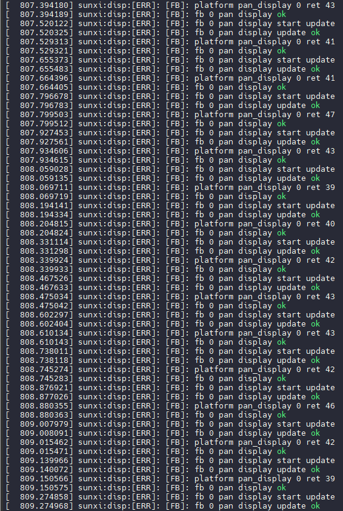

内核中的“pan display”打印信息并非错误，仅为调试信息。如果需要关闭这些信息，可以在 `board.dts` 文件中设置 `fb_debug=<0>` 来禁用调试输出。

![image-20250625163851026](data:image/png;base64,iVBORw0KGgoAAAANSUhEUgAAAVIAAAB7CAYAAAAmAQilAAAgAElEQVR4nO2dbUxbSbqgHwgGO+Dt2E3TfIwvWci4CSQgUFqdTdB1p0FLVmqt1DMKXLFCIooULRLd2j9sEiTQKkhkIrR/elqKFKnVkZAi0dHM/TG5usld2MRz6d7JdhYE6ZDEEzIgTwjN5NpJG2K+gvfHObbPsY8/wBhMUo+EhF2nqt46p85bb71Vrjet7MAhH0mnjtO9x7H4P3pG6b9wFUcgvYwT505RafR/nmaw8yvsALZ2eo646P8dfNZaTQ6A8wZdl4a086rS5PwNxf6KGb9ynmtyxdambj7jW/5kPkW9LJzzZgeX7bLM597n9oWr0NRNS8njEJljY2vrC5SrrluS2fS9vy5Jlhbzd3RdGgrJF2R+7GsuDjyU2lT+gH7XUVqqjOq0kLKkL5o502rmT51fQayy48Da1B2oN/SeRn2W1HG6dz+Prrg47H+WIX1BXbYyr4zqeQbljnnPYhGzn4X04UBayPcBFPfF2swZf5labYr5fmwB8n0N9n+oPXaAz00zNP3eJV9k5uIXhbi//ZHfzELgWRNFXrntrKN/7UQy0tLT8a2tJbUSW9txTGNf06V5I+WH8eIGXReGNNIBYzUtrdMMdnZgtzZzpvUoJ6xDXHOArU2ZVyrrTNNT6aFZmznTYGb8SofUoW3t9LS2M6foyDlVpzg89jVdlx5KL/GRZqz2qzgY4vIF6RrrBtpsbeqmfs8o/Z1SB7M2ddMSUnck7Jc6sGsoWxWW47Rwg67OIbmzNnJiVKnQEig7asOa+Zhv6epUKO1fNzN2wd/OxujPkmLqW5GepSzHZ00jgQGipcrFYOd57P6yzzXzzP+S2trpUT7PzWwXxOhn+3nU2cFlwK/4TtuGuGwf4nLgGUiDVVjVjqtc7LwauEZNGSfOKd8PqQ0tbT+pDIIMnY6srCwAFubn19207Jwc8PlYWFgIS5MGL8Lu6/ADF6ca9/LNsVecvLVIy6/2stczyx9m/Vc85NqFDuba+mjpNWsMEG8P6dnZ2VtSUU5JjbZCstVTaZxm8FKkFw+k0V1+SI4RnniMmAoA6vjAosz7kGvfTwfqslbvg7Fvg53DPsi4p5gPbIqinTcCI6Vj9DHzRjMFiTQUSa6Pq4w4vw+O0o6Bb8PrTgTPKP3+dqvuSZJxXOWyYkDUvGeW/URupuJZ8pCxJx5yzEUA2MqLcd4MvoyOge9wGvdRZQUo48SRYuaVz3PTidTPwH5JqSSGeOQEU35Z4lXK/f9PgXv6kGu/G2U+5B6mAXq9niy9Xp29rY+e3tC/bk4oXjadTiflNRjCq2/rCwxeYfd1doaTX07waG85A1/U8ClTNH0zw3DIZfZLHfSPmakPqReQB5GON9oaBcjQGqE2G/ulr8k7d4qW3moA1fTBmm8Gz2OeRSvA85ixwEOWRkEp8/uYKKa+t4961fXSVKTAbCTHcoqeKnVxzsSaEyce3FEbtflIL3ayO2zo1B1gOvCfY+A8g+a+wDOJa2q9532slJG3BywNffQ0KBM9uAEowmQE92wS2xepn0GYSwFg3sXm4HFF7/9Aeno6i4uL+HxqT5xkiUfHB5p5JUMkSsb8Qr5pzGfu1ghN9/ScPVnOwBcmrn85Sb9mBiOVdXVcc0Qzit5MMpI9rZeQOuU1kKc3fZxGUqaOWReUJFK2ls9JooD1+f42F9maCbyYkiJIJklVMjK2NtknJrsstKarwZe7jtO9pzhDjGfw4iccQBXqQVbNU9weMG1OM9aHtZkzIf5DW1sfhzerfNmiD3SVArPsTw2ytLTE0tJSWFZt37Dab726ssLqyopGxZJbwtrUTUtvN3lX1FZpy5F8dv91ijP3ABb5zTcTnD1ZzifH9PTfWgyRYTrgknkbSd/yGh0/yRaGjP0BTmM1nzVtYJrkGOGJp5j6tjrNZPvENDlVjeHTjaQjTf0sR5oD7gxr01EsnlFuK3paYGpoa1cssPh5yNwLsJRrt02JtamRSuM0j5S9eM/7ct11nA4sdKy/bE1kxQdlnPh1aNlKJOUXWfBmPqsy4pwYwj/NtzS0R3ALxEqXrkmoXVFRzDBs7eHKy/ETbjbgurE/wEkxhwP93+/CGIxLKdkvddDVGfoX21euEn3gPF03XVS29nE6VP539NT6/88384ER5p6HKNE9o/RH8o9amznT20dPhHf0TSEt+av24aua4VZi6DUaq/YRVzHDp5qq8sOmZMGyo61u2zWnsKxrRVVtLYRYzsqVXM8og0/2Ua+UReO+qFbtI7Qp/J54GL/5mJKG0IWQCGXHQrUCDc6xUUxVUe5ZtJVvwi1Q9ao9MVb1Y/elda/aR3i2qmfpGWX8RTUlrpCyI+wQCWsTEL6bQWtHwBYTtmAmTeerFaJP3RqRLVQCu0eiy+pvW+SZ45vAFihSwaYTc3BJVeo43XsU95X1WUyCnYxiV852DA5bRMZ2CyAQCN5MApb4dlnYW4hQpBshZHobyvYtcCWG9hTUT+jG+53Dm9quVMcxcJ6uge2WYmsQU3uBQCBIkK1ftRcIBII3DKFIBQKBIEGEIhUIBIIEEYpUIBAIEkQoUoFAIEgQoUgFAoEgQYQiFQgEggQRilQgEAgSRChSgUAgSBChSAUCgSBBhCIVCASCBBGKVCAQCBJEKFKBQCBIEKFIBQKBIEGEIhUIBIIEEYpUIBAIEkQoUoFAIEgQoUgFAoEgQYQiFQgEggQRilQgEAgSRChSgUAgSBChSAUCgSBBhCIVCASCBBGKVCAQCBIkYysrszZ101JllD9NM9j5FXZbOz1HXPRfuIojkcJt7fQ0FMsfPIxfOc+1hAoUCASC+Ng6RWpt5rMqGL/SkQQFV8fphmKcNzu4bN/sshNgswYJgSAKtccO8PnBTPnTS65/OUn/tkr09rF1U/sCMzmex4wlQ6NY38fENI9SSYkKBEnA2tRNT1td8IuDpXx+0Mv1L0do+nKE6399h09PFlLrT7e1q68XJIUts0it+WbAFTG9QDHtnx/7mosDD+MvvMBMTqR6Ve4E1Far32L8HXzWWi2V4bxB16UhKa3cxfieaiqNHsZvPqakoZocz6jCwqzjdO9xLIHC5bzWZs74y6OYlt5q+QLZnRF/ywSCALa2Puot0wx2Dsnf6Dl76B1e3ZsIWKD938/ySaOZ2vwZhmcB+yDjR07Rc+79yDMjub+y3vdOECAjLT0d39pa0iqQHr7/U3VAqaiUpbGaevMNujr9SqiRE6OxfZyhSrK+t496UCnDlioXg53nJeVla6enoZsTzxRlG6tpaZ1msLMDu7WZM61HOWEd4hqApRrTzQ4Gy/uobzAz2HmDD3qPUmUFhwNsbft51NnBZcCvVE/bhrhsv8rFzqtxTe2zc3LA52NhYWFd6Rk6HVlZWQAszM+H5Ut2+kbl3u52JUvueNMjEV3uMk6cO0Ulo/R3KvvSbkzGZR49WJQ/m7nYmM9uwPQeMAvwkGsXOphr66Ol1ywG8iSRkZ2dzbzHk7QK7Jc6sCMrvZLH2krFM0r/JXmUdYzwxFNNSXUZOKKPjo6B83QNICtIQjpJGSeOFDM/9nXwO/tXDJb3cVhVtofxK3I+uW5TQVCu23YoKIf5sUHsFPGBqm1fKT4N8ch5nMP5ZUB8o7pOp0Ov1+MDzRcvWnoaBNM0FEYy0xORezvblUy5o6WrjQk/6gXRyHLLsx6/caCJnrMny6k2wtStEa7/soZPcvXAYuAK+6UOnjV109LbTV7oQqxDHvgFGyZjvSNn8nnI3Aso2aTS3LMxlJrKbyuN3gDY4ihctVNAYj6y9yIMH7C4uIjP51t3enp6etS8yUxPRO7tbFcy5Y6W7jcmohFRbtt+wnSwikyqG8uZujVC0z2Qpvsw9+fFCNcbqayr45ojklIWbISMZE7rN0YZeXvAPbE5vhqTykKUyo7iqo0fazNnQnYK2Nr6OLyOIlZXVlhdWdlQ+tLSEktLSxHzJjM9Ebljpe9UuaOlx2ORRpTb/hVddmlqH+7nfIXbA3lTE5y55/9Omu67/6Ylw3TQzSXYVLZ0H2lc2OqpNE4zmPDTfsjYEw+VVfXYBh7KPlK57E1zqHtwP5P/tbVTbwmxSJ+5mDfuC/hUBW8n8Vik0Ynk51xkeGqZ6oP7OPvgR34zC7XHCtnrcfGH2WBuW1sf9XtC/asK/IujUd0HgmikhiI1VidlZdsxcJ5+umnxL0LJVsCmjMiOq/zJ2Ud9ax+VAJ5Rxp3FapeE4yr/ONZNi/8asWovSICAn7OtDrus8IZv/Qgc4PPGGgYAPLP89psZhv2ZbO3Uc4OuC1EUpOMn3ECOZT82hkT/3ABpZQcOaTt8BALBW4K8K+CFsEg3SmpYpAKBYFsIbCEU0/qESGmLVNtJ70dMkwUCQWqQ0opUIBAIdgLiGD2BQCBIEKFIBQKBIEGEIhUIBIIEEYpUIBAIEkQoUoFAIEiQNyfUiEAgEGwTb0ioEYHg7ablVzV8+otlRr+VfnMv2FrejFAjAsFbQlioEcxc/KKGA+5ZXmllEKFGtoQdHmqkjBPnGuF332Fq9Yf8UPziKcxtUMfp3qO4r5znmqOO0737cY+ZqawyMj92gyclx6WwIiICqSAFCQ81Ai2/KsT97Qi/oZBvDmpkEqFG0KXBh7pVPs5c5kjmKr406PXs5v8sb57629GhRuTMVLYeZfxKB5cd0uELh5vKsMfVIYqpNN+g6+Z+ehqOB8KKKE/Qz8rKIkOnw+fz8UrjEOxo6TqdjsysrIh5E0lPRK63tV3JlDue9GhEb1ekUCPQ//sfpX/yI5X8doYayUrzcThzFVvmCkczV9mdpv4B57kcL//ZZYyQe/3s6FAjfpw3/UpXPoPUXER84T48jA8NQcF+VVgRJWtra4EQEFovR6z0aGmJpCcq19varmTJHS09noOdI8sdT6iR2LwNoUYMafAfMlf4OGuFI7pVstIi//o9LUraRnjjQ40kij98xEbSV1ZWpLQIoSkSSU9ErkTTd2q7kil3tPR4DnaOKHfMUCPr5c0KNZKT5uNo5gq2rFU+0q2SGYeCfOFLo9eze1PleONDjSRKouEntAK0bUb6doXNiCVXouk7Ve5o6fFYpBHljhpqJH5SIdTIFdM8//3lbubWElvjfifdR23mCh9nrnAoczWuhZ4XvjT+uKTDvqxjZDmD1YQkCCf1ziPdtFAjMkYzBYCDMk6cO44FD+5NKlogiIfkhRqJj1QINfJP5p/JSmPDStSUvsbfZ65iy1qhRveaXcS2PP9tLY3byzrsSzrGV3bxmrQN1R0PqaFIkxRqxB9+2R/v3nnzBs6Go5tRskCw5WiFGqk9doDPD2YGrqlurGEAxX7SFAg18k/v/sy/S/Px3bJuXfnek5Xnx1krVGaskh6HHvzpdTr2ZR23ljOYWM1gbYsOCRXnkQoEbz3JCzXyz+afyU73sehL43/O67m5lBn1+vxda9gyV/k4c4UDuvgm4E9fpwcsz4er8diqm09qWKQCgWBbSGaokRvv/ky2vPizKw3uRLBIi3at8bG82l6W8Tqusqdky/P2ko7JbVKeSlLaIhWhRgSCncm/vPszBsUK+sxaOk2KfZt7d61hy5IWjPbFqTwfr+7i9pIO+0oGU6u7Nl3mREhpRSoQCHYe/+vdl+gV/kwf8O1iFv+8mMmxrGVsulX2xqk8H6zuwr6k4/ayjqevU/ewOqFIBQLBpjH47s9hG+FXfGm89EFuenyq5seVDG4tZ/DHZR2zKaw8lQgfqUAg2BT+97sv0WmsrOvSfORGWXFf88HYaga3l3X8cVnH89fJ26aULIQiFQgECXM792fW47V8Dfy/5Qzsyzr+dVmHe23nKU8lQpEKBIKEsL/7Mq7zOFd88MNKBreXdHy3ouPnHa48lQhFKhAINow9Nz4l6gNIg0sLBqZ2iN9zPezKzSv8H1tVmbWpm//2Xz7lk7r/yCd1H7A29H+ZtrXT07yPp8P3+LdNqMPW1sc/lDr57v7z+OT5+wxu3f3LJtQsELxd/Gvuy7h/dJkG7AIa9Ct4fOk8SrHtS4kiQo0IBDsc9c9EX3L9y0n6t6De64uZlOx6TVHGGsY0H16fpFb1aUT8LXx2mo//uttLlW6V8x7DFki5NWydIhWhRgSChLE2ddNi/i74K6SDpXx+0Mv1L3+kHzl208lC/vLNDMMgRYkof5CUw0guzgcVYQZgyXjN3+1a4+92rfHLjNf8+/TX5O/ykZ4Gyz4prpEBHznpPj7OXKbctMo/uDfvcOXtZIeHGoHA74QVz2NeWY2tnZ6GYvmDdhgR5S+onDc7uGwPlmv63v9ZoxP7T81RlSZ+cSVIDuGhRvScPfQOr+5NBCzQ/u9n+aTRTG3+DMOzbFmokVXgL6u7+IvGlN2Y5sOSsYYl/TV7M9awZrzm79LXyN/l4x/NHj7bxJPqt4sdH2rE1iYftiCfbmNr6+OwP9HazJkGc9CdYGunp7WdOaWisxzn8NjXdF16KCvddmz2eBRhGSd+LXW+rgF/XjPjV9R5s3NywOcj0gHaG03P0OnIysoCtM/ATHb6Tm1XsuSONz0S0eWOFGpkNybjMo8e+A+ENnOxMZ/dgOk9YBZSIdSIx5fGxMouJtgFS+q0d+LcpJ/q7OxQI9ZmDocEA1MlV++DsW+DClkenT+wgd3fm5w3ggrd/gBnw3F1esS6aygxengyqs5rkg4/BaQYPv7wEVovViLpaQTDWmgpjGSm79R2JVPuaOnxHOwcWe54Qo3oOXuynGojTN0a4fova/gkVw8ET9xP1VAjL9+QLVBvdKiRArORHMspeqrU3zsj5niK2wOmeAp3/IQbhcK37ceC+kBqf/gIX4TQFImkp6enR82bzPSd2q5kyh0tPZ6DnSPKHTPUSCbVjeVM3Rqh6R5I032Y+3OkcCxvVqiRVOGNDzWyPn9rESajB/ezeK6VlK6lKqionTfVL0wyw2YsLS2xtLSkmZbs9J3aru0KzxKPRRpR7qihRl7h9kDe1ARn7vm/k6b77r9pybC9oUbeZFJvQ/56Qo3IVqF/Km5t6qbeElxssk9MU98Qv7/V2nQUi+cxtxXXmvLLAMkHKp3bqJBTIzyuQBBK8kKNLDI8tUz1wX2cfSCdiF97rJC9Hhd/mA3mToVQI286qaFINxxqZIjLN/fT09BHTwPgvEH/2FE+8yfbv6KLdnpa+6gM5Akp33Kcnt7j0v+eUcWI/5BrvxvlTKtscXpGGRwzU2/2ly35W4NySwRX/QWCzUUr1MjwrR+BA3zeWMMAgGeW3/q3PkFKhBp5GxDH6G0UWzs9R1zqqZatnZ4GxPYnwQ4jeaFG3hZSwyLdgWjti7WVF4NnlLhcrAJBCpDMUCNvEyltkaZ2qJHwHwKoXQMCgeBtIaUVqUAgEOwE3rzzrAQCgWCLEYpUIBAIEkQoUoFAIEgQoUgFAoEgQYQiFQgEggTZJkW6m4KqWiosu1XfGiwfUpKbeOkGy4ccsuapvjNZazn0UXl8B5JsCdI92Iz2JoXccg5VFbOxM8xTvG2pgKGYii3tj3mUxPU8td9NQXS2RZEaLBUU4eSJ8xUQVHJ67wKb8SD1hiy83vAj1lKLHAz6JbypdviWjMGQDV4v3g3lTu22pQTZ2RgWF4h0RtOmYSim4qNaKizg9SINkFEUeOi7KYiPbVCkeRQUwlPHdOAldTuGuXvnOaZSM+bSGsyuEe5HfJB5lHz0IQURh9bd6A3g9arzS3VM4N6kViSMwYCBBRY3pqmSzG72mBMYjHJzMads21KDxAaqEKLNHrzT3L8zzBOKKTJZqCiFyYjvQfi7KYiPLf+JqMlqxTAzwhOv8rtaSk0uJiddwARucy0VFg1lmlvOoVIzrslhnnnDvw+yxNMFkKzbGor0AC7tDmQopqLSouiEwesMlg+pMExz31tMRaF0erl3JpqS1yBEtkB+2SLB8iGHIpRtsHwYqFctWx4lHxXjHZ/GUGnFHCK31KZsZsYXKPS3bdHJ/THFC6KSa4mn4z8o7mkOBn34YBQvBkM2LM5FtLYitWvR8iEV5jmFnNLzUw2sIc/LNTnME3/A2NxyDpmfc9dpCF7jdnDXMReH1Mq+opBMUb5abvU9M1lrMbmGeWYIXqOSjTxKPvI/KwnvjGKgitKumGU/n+JpUQ0VVm94W+VymXHw1G3ghRNKPioHjXdB690UxEfSQ42oyC2n1ODkvkPDWkTqqHilz+EPWVa2d9RpUudeCH4vK5FFL5D7HjiGueuVOrEpF9yqKM15lFRa8E4OoxW9WW/IwmsopoJp7t6Zk5XPXkzOYCfMysoiQ6fD5/PxKuSQ7DDZlGmGbNCbKTU4gmUXvYfBKSkRk7VWuld3ZKWSW86hInkqaDBgIAtzZTFPx4e565WUQKB92dkYMFNaiVy3pHj3GKbxesPlMlg+pMJazAu/AjMYMOBiJkJEa51OR2ZWlmabA/fN9TdNqyZau7zeBdBnowc5r+QicD2X+0tuOYdKs3k6Lg+kueUcKi3H/Vwe+AzZYMimonKBmTvDuA3FVFQWU2CY45k3ltyveDY2HDgnwWStpdA7olJmSrnV90yaBRmKPqTCK/UVg+VDKoqKefZ8WupDcj+7+xz8StvgjaddMcoOyD4CVTUcsqJWpt5p7t+ZRvKRwgvvNPfvaDyYCO+mID7Ss7Ozt6iqPEpKzbieRp82GAwhC1CGYko+qqUUh8bUPI+Cwixck8HvDbl5Qd/T82mFlbUxn52BOe77O+bCQpjsa2tr6PV69IaQiZWhmJJCeDquNY2Sps4sOoNlh+QtNC2pplgmszlsKuia/EFtmatY0q5bQy69IUtddhz+O802y23Tcq3E1a7nz3GRjd5fbG4u5sU5Xngh0H8UbZYs36CcekMW6BeYieLCiSy3QkzLh5TiUFnBhSYXkwqL3vt8Dq+s9P0WvME7rWn9miwWDG5H0II0vIc54EOO1a7oZQd5xbMxBy6TNfI0PyBvKPG9m4LIbFmoEYOlGLPbIY/I2nidP3A/9LvsbMyAy6XRiXJzMeNiUlGmpjUk++wmw3rJHE/GDVRU1nKolJBpoKQQYnUuf3iJUCSF7lcCoUgvh2syWLbkM3suWTthef2yyLJlZ2NYdIa8mEEL0mDIBrdiEJEV0n0vkJuNgSyKKmsp8he/6OT+WPD+KmXRYmVlRWqzZsiNyAtNMdvFPN7FLAzZgHc3BUVmXE8nFFYyGEprMZf687uYvKN+Pt6ZqaASDVhj8cgtyyi7c5RKy5Cbh8E9rVbOYYPNEk+dwTxe5w/cdQLkUWAC1+RcSF75PsTVrkhlhwovleX1aj25OZ7c0VbE8bybguhsTagRQzElhQtMRniQUXk+wd2FYioqaylB6XOSUXZmQzGFJvC61NaQX7FoWimBl02ablVY5mVLJFwhaL1QUcNPRFpMCJs6SxZqUKGE5M3dS5He7/f1W3HPI1iQ8kKRK+h/UylpQ3ZMv2E8ux60As8F27aAO5IWjtIueMWiF8mayt1LkVfxcsuDh8rPqyIPk8azj1tugNxy2Uervjd6Q1bYpSazGa9rSnZPRBqo/Sj7kTRABJ5frHbFLFtCctcQdA/ESyLvpiDAFqza76bAasE7mcCKuXea++NODKUaexMD0xXJ36k1pVG+CAZLcdS9e4EpqWpaifSSFaKyDKKK7F0AU652XWHWjIYVJ1sXGIqpUC2kyVacK9SC9Gr7FVErxqhyKcoPFl5MxXr2k2Znq641WUOeWcR2SSx6lyR3TilMKpX9wgJefR57IgkiD07ujVpVueUcKkU1fVfKFJAbeepvcjEjT/2lwel5lP4tW9mAyRqyoBWjXbHLlrcLmue4fyeaqydC3kTfTQGwBav2BkuF2rLYKN5p7o9DRWU5Jnlxwb9aWfpRLZJP0IGrsjhsWul2uaDUyqGPrNLKOKC9ijoSWHTyLwZVfOQ/ENXF5J0f4u9wzyeYNNfKsinKd74KnzqHWHFe5zSuQqtct4vJcSeF/gU0DaWrsiDDLELZZ+m31DTkUq/ov+KFa4miwhoOFfrbPRG/7+z5c1yl1kD5ynsavV3yNd4FDKXSwozqXnuneTKTR4XSJaHcqZDIvkyFUtd6Xl7nfZ6aa4J9YVGxWEYsC36OZzPFVMhTd+/MCJPUUOi/Pka7Ys0OTFZpV8PdDez73LR3U5Dk80gDq5HrHSm3H/+q7bq2OgkSRstHKUgCO/jdTEWSa5E+n9iho12IFSfYGnLL5W1ZQokmnR37bqYmImaTJuInjltJcKN7hB9NCAQpjgg1IhAIBAkijtETCASCBBGKVCAQCBJEKFKBQCBIEKFIBQKBIEGEIhUIBIIE2dLtT9amblqqjPKnaQY7v8Jua6fniIv+C1dxbKUwAoFAsElsnSK1NvNZFYxf6eDaOjWmpgLedAEFgp1J7bEDfH4wU/70kutfTtK/ngLyC/mmMZ/df52i6feuLa3bn3/q1ghn7oWnt/yqhk9/IX/YgHxbxdZN7QvM5HgeM7Zes9PWTkuVi8HODro6Oxh0FlN/rhlrUoQUCFIba1M3PW11wS8OlvL5QS/Xvxyh6csRrv/1HT49WUht5CJU1B47wMB/gkd/3YAwCdWt5+zJGk7hYipK+qdM0SSXr1Kitnb1fdhmtswiteabgcijSYHC6pwf+5qLAw+BMk4cKWZ+7OuABWofGuVw6z6qrOCIqpTLOHGuEZ64qKwqBucNBjlOvQWcNzu4LBeotnY9jF85L1vMcv7ffYep9TjScRXCGhZsH7a2Puot0wx2Dsnf6Dl76B1e3ZsIWIH938/ySaOZ2vwZhmdjFJhfyCnTDE3fuGj5VT7V65Imsbprj+3DdHeEk/fMXDyoccHBIqpfRrFA7YOMHzlFz7n3I7sFrc2caa2GgD5JHkkPNSI9fP+nalp6pcc1r2ycsZp68w26OofkxjdyYvQ81xxFmIwenoz6b0Idp1uryQFMBXfl0qgAAAQCSURBVBDbqWqksuQx/VdcfNZ6nMNjX9PvaqSlvA7sUl0f8y1dnVL51qZuWn7dzFjgwRipbD3K+JUOLjvktrTVYb80FKghQ6cjK0s6pk/rrMvsnBzw+Yh0gPZG02PVm+z0ndquZMkdb3okostdxolzp6hklP5OpdLYjcm4zKMH/jOvzFxszGc3YHoPUCgzTblmZzj5+43KFV/dkfIP3/qR4Sj1tvzyHV65vVz8ooa98nfq6f9Drl3oYK6tj5Ze87YbOBnZ2dnMezxJq8B+qQM7spIqeaw9enhG6fcrJ8cITzzVlFSXKRSl3JGMkjU5WN7H4fwyIPYo4/z+Kg6agWn+NPAQmhSJjqtcVgjjGH3MfJUZpY523jwf8OnaJ6apP/I+VkV6GlL4Ch/hL4BOpwumabxYiaRHqzfZ6Tu1XcmUO1q62pjwo5z9RJO7jtO9x7E4b9ClGMDV6Dl7spxqo6Rsrv+yhk9y9SAfKhhL7mjEut+x6o6dX7s9Re/A7l8Y+PHLEc4AHCxl4NgBzv7tR36jGCDslzp41tRNS283eYr7CYDjKhc7r66rvRtly0KNxM9D5l5ASeCzkcrWUzhvdtBlB2m6D+6JzTDVgwo6yHSki2Vx1Io2PT2dxcVFfBrhK/xhSLTSEk2PVm+y03dqu5Ipd7R0vzERjYhy2/YTpoNVZFLdWM7UrRGa7oE05Ya5PwdPZo0l94bkirPuWM8rGlO3FAtX954yeqg8zNIOYqSyro5rjkiDTXLZmlAj66KMvD1BRen2gOnJ1wGfJkjTffeziAXEja0tZLpkbeZMa/ip7So8LpRVLy0tsbS0pHlp1DAkCaZHqzfZ6Tu1XcmUO1p6PBZpRLntX9Fllwb8cH/gK9weyJuaUEx5pSm3+2/xyx2NyPczvrpjPS9tFnn6Ej5QWLaRCPqNz2/v1H4b69bGVk+lcZpBO8BDxp54qKzy+0zB2nQUi+cxtzdr0+mLn+SOWcaJX1eTE9EireN0QzHzY4Niv6tgXcRjkUYnkj9wkeGpZaoP7uPsA2nKW3uskL0eF3+ItdCUMMmtu//PL/n0WBEtfqv0YBHVxpdcV2yRsrX1Ub8n1G+sQF5syonqFtkcUkORGoOLUKEr446B8/TTTUtrH5Ug+VM3afO+tAPgOD29xwFwjo0yX6W2SC0NffQ0SP/Pb8Hqn0AQiYA/ULHgOXzrR+AAnzfWMADgmeW338xEXcgJYubiF3sDizmwl4Ev9sa9XzOhug+WMnDsneDnYzUMHFMsKN2b5Le5B/j8ixo+BcL2qNraqecGXReiKEjHT7iBHMt+bAwl1WIV55FGRJpOmb7vULgVBALBzkFeA3nxtlikAoFAsIkE9odvwbQe4P8DA+PEmZUN+AkAAAAASUVORK5CYII=)
