# I8080 8BIT 点亮 240x320 屏

:::danger

:::note

注意芯片型号！

:::
:::note

首先确认芯片型号是否为支持型号。

:::

:::

此次适配的 I8080 屏为 `D240C2422V0`，使用的是 I8080 进行驱动。

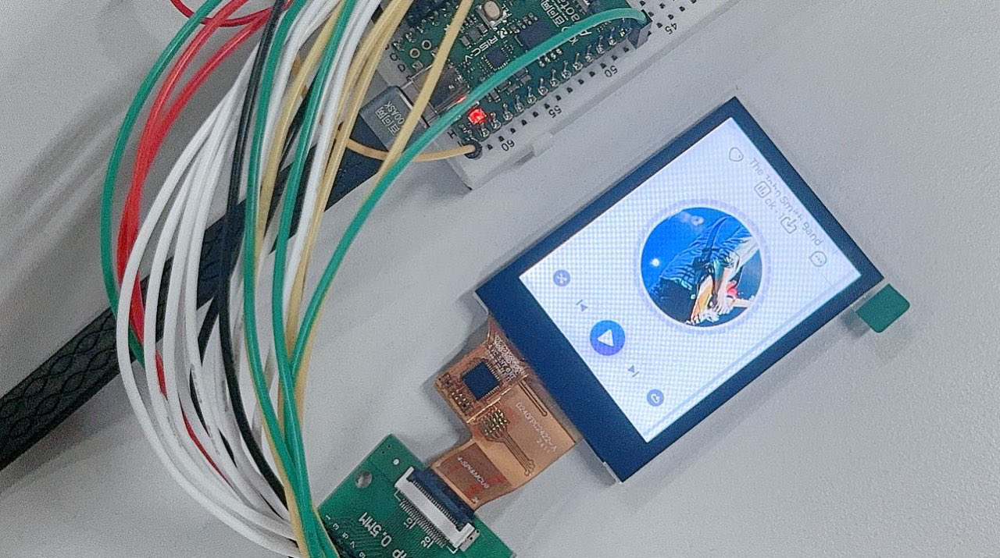

引脚配置如下：

| V821 | 引脚复用功能 | TFT 模块 |
| --- | --- | --- |
| PD1—PD8 | LCD-D3—LCD-D12 | D0—D7 |
| PD12 | LCD-VSYNC | TE |
| PD11 | LCD-HSYNC | RD |
| PD9 | LCD-CLK | WR |
| PD10 | LCD-DE | DC |
| PD14 | GPIO OUTPUT | CS |
| PD19 | GPIO OUTPUT | RESET |

## 编写 LCD 显示屏驱动

### 获取屏幕初始化序列

首先询问屏厂提供初始化序列，和屏幕手册。

![image-20250324124555630](data:image/png;base64,iVBORw0KGgoAAAANSUhEUgAAASsAAABqCAYAAADk13fJAAAQGklEQVR4nO3db2zj5n0H8C+TIImXtWmGy4u9F+u4iLq77ZKc5CTt1mAJdTpHaFAD2RAfhhVk+6KzBNTAhp7f1Bna4oaKRi8opAEbYnTZ5r2YkvORuKEt0KGW2lcd5iDOlQT6omjQomjSrDvcZbH47AUlipT4T7bkmNX3AyiG9JAP+ejCn5/nIf38pC9/RRfrf70KIqKT7I4P+gSIiNJgsCKiTGCwIqJMYLAiokwYM1iZ0KRFbNopNrU3sShJkCQNJgBTk6CZhzlFIqKxgpUJTSqhiTaqsgRJCr4WexHM3lx0P5PfwCUhIEQDir2JF5sqKsqUWkFEv/VSBSs3AJUAQ0CIoZelo1jU8fJqDgCQW92FEBb0orc3Ni9W0UYTpYgAR0SUJDFY2ZuLkLeXYQmBSmtoCGhqkC4CL++uwg1VNjYXJUiSjGq7H5xkVNsqjKEgZ6jAwx/NTatdRPRbJjFY5VZ3IXrBSGlcwhuyO/dkahKkVsUr622N1V0BIQyo6AcoA7q+BgVu4FvctAF7Ey++rmONw0IiSumu8TZXsKYXIZckd0gYFWzMFppooim9Dt3axerwA/K5VezuHuZ0iWhWpZ5gNzV3nkmutgEAzVLU/JONzRagFlUY4hLeuLgJ29QgebcCLWwu8s4gEY0nMVj1g9SLrxdR1K3RCXYhIAzV297evIjtj1XwMQCAgsbuR3G5BBiNfjdMxuquAZRSPgJBRIQUwUppuAHp5eV0FVpvPIxLq3LvnY3NxRJgNBAcMSpoGA+jenETjFdElMZYc1btqgypGl5W1NcAAEqjAcDGjwH0J9xDKY3oOS8ioiFjPcGeZhgYytS8+S4+rkBEhyFxPSsiygL+ITMRZQKDFRFlAoMVEWUCgxURZQKDFRFlAoMVEWXCVIOVJEkz+ZOIJm9qwUqSJAjhPr0+Sz8ZsIimI/HPbV555RU4QkA4DoQQcBwBIRzvM0cI/M7cHJ555hmcOnXK269/Ac+aWW030bQlBitHCPzZ889774X3H9f29r/i9OnTuGYYOF8qeQHL37OaJbPabqJpSxwGCscBAHQdB92ug263i263i4PeCwBOnTqFR86exdWrO4P9ZvSCndV2E01bYs+qf/Fdfe21kbLz5TIAYGtry63s7ru9sqn2MGwdRXkby1Yb1bi/i0673QSxZ0U0HcnDQMe98MoXLrgfCP8oUODTn34OAsBdd96JKy+9NCjxX7CmBqnU7L0poJ4YPNy0X3t1C+3jijITwkBFNB0pelYOBICdq1djt1taehaOcLz3gx6GCW1jAZYQbmIJU4Mka5gXwwvyDdj6BpoAClEHy1XRFhELa0VuZ0MvythfF2iMHDiubLzt2LMimo5UE+wQQLl8AcFLUGBwTfZu3Tu+PpdXqKDR9l3ZSgUqNnDDBpSwTpOtY2V7GXW1g+0xGnJSMFARTUfqCfadnau4FnjtwLjWf11zt/VdqJHPG5ktNJHHfOjozoa+UkN+vYr5uJOydRR7aendIWMRuq55ySuKuj20nQlNklHr9BJdFHXfcsqjZaZe9NLeA7116DUtpo4BPmdFNB3pelYYTKYH56wACOG9dxzH93FID8PWUSw1oRoidAhoajK2ly20FcBspWuAq4Pa/jqEaPQm1Vegl9sYDBQVNISFhdAhXFhZFca+hA19Dcr8ZZT26rDaVeQaaxF1+L8O9qyIpiF5zsoRAASu7ezEbre0tDTSs/K/t/Ui5BpQt0T45LqpuUGhcZgJ9QLq/YypuTKWC0cfQCoNAy1JhoQC6lYDac+Kc1ZE05GiZ+VOsJfOl32f+uer4PWu/BPs/gvW1CSUYEBEZoiwoW80gQ4gSzXf5zKk7V6vJk1rTgAGKqLpSP2clXEtvmd1YWkpMMHu9TBsHRtNFUZYoPI/B9UW8N/fMzUJGwtTfHQh4RksU3MfnbCwAnlFRzllwGTPimg60j1nJQCldH6oZKh3hcH8FuDrYVj76KCJktQMbKsaAg0ZxyiH8nIBtZKEZqEOayu6rJ6vodYbkuawhfq2DFmbh2gowTpCAhgDFdF0JGa3+caVK/j85z6P1157NbaiC0tL+OrXvob1L33JrXhGexiz2m6iaUt1N1BA4MLSUmJlTuhzVrNlVttNNG2p7gZ+48oVCEf0lojpLRUjHAhHuMFMOL2lY6LvBs6KWW030bQlBqvq6l8dquJZvWBntd1E0zbVlUJn0ay2m2japhas/Ev8ztJP9qyIpmOqCSNOwproH8RPIpo8puIiokxInGD/r/9+Ez/aezN2m7l778Wf/kkBv/fA/RM7MSIiv8Rg9aO9N/GZytOYm7s3cptfvvMuvvO9H+JTn3iMAYuIpiLVMDAuUAHAgw/cjyeeeBTf+d4P8fY7707kxIiI/CKDlfjmV3HwmSfxQuvrOHjuSRw89yTee/ZxvPfs47hZKuJmqYj3vv633vb9gPUf3+0cy4lTxpja0IKFNvSiu1iiZsbsR9QTGay63zXcnwfuHa67v2Xinle/j3te/T7ue2kLePD38d714EoMDz5wP27dvj1U0+B/ysFrsAqnx9R85UXoYctwwoTmXwnU91n0fv5yCZL/yjjsMeP2iyhzVxsdvSptvei7iJPaEt2uQdWj33dc2ei/Rcz3NUG2voJa3oAQSeveE7lih4H9QNU9cODM3ef1qP6v/Z+Y++IlON30t+pVw/1zHCEEhAGUAhfRIKmEW55HTR4NaP1EEr5PoBfdpVxC9zM1SFIJ8B+70uoFnsMeM26/6DKlogLN1lD9Nna2O1DXq8gltWX4HALtsrCw4d+2gLrVK7Pq2CsFA1/g38KfuCP2+5osa7+DwsKxLrtBWfflr+gizO3K4+J25XFxs1wUN8tFcdB1xLtPnxNvP/WYePupx8RB1xG/eOKsOOg6gdc/fOvfh2qyRL0AoRrDH9dFAaoY/thlCBUFUbeGti/URV2FKPQLRurwH8sQKkKOGynlMdPsF1oWcj7+849ty5DeeYWfkSXqheD5GN75x9Q59vc1JkMV8J2zEfudEo1K6Fm5K38evO/gZqmIblfA6Qrc+8JngZ8c8bdtrozlQhOtsK7DSFKJiEQS1j46asW3nnsO83lg74bt1lGoYy3tECPtMRP3iypT4HauBg22d7YH5x/XlmG5eeQ7NVye5AhtrO/LHU5qZtRQFBgZTpYG/VNTk1BqAp2aHD4lQBQies7qwAE+oWDuX67jPqON+4w2Pny9g498+we46w/+EO/8zRfRyx4/WV5SicHwpJ9IYnhuw76xd+zHTNovrkxZq6PgDQV7Q8CKcoi2KGgYqptlJ+lit3VsNAtYLg+iqbvf0eekmqUWKt6QV0Wz5M84FBxOGqrv7Bvu+0LdCg5DiWLEPmc198Jf4jefW0H3529581P93la3G8wTeDgF+KctQpNKxCSSyM3ngf2jncG4x4zdL6ksV8ZyoYaW2YAi72C7o2K9n+di3LYoDQjRcI8lSYBqQHiRtYOaLMFdzX40A7ZqTGZSOxCklTXUC7LbNri9NCuQLlIFJvS7hWZTZM/q4H0H+N0Pee8/8u0fjAQqp+tE7Z7MvIwaltH/hW9qEuT9dQjhv7D6iSRqkHs9AW/40L+DtncjcDv8xh6Qn8+5yVQ729iJGa0e9pjh+8XV2ecun9xsmcEhYF9UW2Lkqm0IYUBtlnzDMN8Ee+h5hEjxfRF9oKIm2N99+py4eXlDOD9/Sxx0HeH872/EL544K94qnhU/O/dH4qePnBE/feTM4SbYDVXAPykdO9keFJyYHap7aBLXqheCx+ltU6hbhz9m3H5p6rTqooCCKBSGJ+Xj2zJSR/AL9U3kj06wRx5jpNqk78t/DAj4KnL37bd9eLK+tz0n2OkIIntWd37qPG4ZV/H28xX86pOP4pfKH4/0qO5RylG7jwjMk2wswPL/xveSSkQ9HxQlh+pWHXv9ukuA4UvikKu2e48A+OptVdyMOYc9Ztx+aerMlbFc6KDj61WmaUuw2VVsLWz4jlECjJQ9KAz9W/ie54r9vkKoaHnbybU8DG/+yT+nJkGSVoBlNbQOorQSE0b84z+1sPL8s6kr3PrnV/EXf16ZxLnRiWVDT8hMTTRpqf428Nat4afSj7YdEdG4ElddOJN/CP/Wup66wjP5h450QkREYRKD1emPP4TTH2cAIr8cqm2uikrHiyuFElEmMFgRUSYwWBFRJjBYEVEmMGEEEWUCE0YQUSYwYQQRZQITRtAHj8kkKIVjSBgBRCU3MLXh5AWDBeFsvRhappmILQPgLnwX9YfEgbIxEzqkSjCR3O7jTOqQLlHFoM5ibKPGSWhxeEwmQWGOIWFEdHIDpdH/zIAKFUZ/1cmG0lunyZe4wKqjABUVBbFlgAlNriFvRKxgGSjLo7biXrDJCR3SJZhI027X8SR1SJeoQoIktYDYhRHGSWhxNEwmQWFiljUOrgzqfd4VuL3197gjf2akLJR9A3uBtb1zqLbHX8rWvFxDPmz54NCyfuCCu6gc9nDDxug648oa6ugtOKdUoGJoTXjbXc3TrUtBw79ki7/eo7Y7V8W62sF24sp3JrRSc3SlT6URuYxLcrvcP50RooHYtTJ6+6z3j6OsoR61hj7RFEw/YcQkkhv0lhkOTWYwUqZgrb6HDW9810JTXY9Z66mDfcvdLzahw8hxYxJFACcgqUPfmO2KkjqhBZNJ0HQcQ8KIMZIbhHKXGXaHLOnL3P/Z3QvBG1LICyj4A4h5GTXf/YC4hA7Bw8YkihjUdiKSOgBjtCvuFMdMzsFkEjRpsT2rfsKI/3m6gF8/dQ6/fuocfvXJR/HOFzS8/7O30ieMUBoQQsCq77mraI5z8QWGLCnKbB0rvWQN/fmwfE12f7Pnqmj7V7DcWEBd9SWt8KcHiziurRchydtYtlJM/sa2uzNYkVPexnJIUgfhm8M7khTtSqxiPj/W9qPJJHrHD+kdKhWuIkrJjjVhRHhyg3jm5RpQX4ucqxouc4c4/mGfOwzyhiu9ACKEgGjPY7/pH8rFJ3SITwYxbruPM6lDQqKKtA6R0IJoUmJ7Vre+qeNDf/cSPny9gztu3QRwiEBl6yiORKZgCq5oJlpDw6Okslx5GYXmhu/OmolWM/yiMrUS9oaCXX//lW2g7v/1b+vYaKow0vZyjtTuKArW6kBNHnpswNQSU7xHtiuOraPYf0RBWUMdQ0No9HpI/u16AnNk+gpq/d6cUoEamMvrZRMiSjD9hBFHSW5g38Be1CR2VFmuinYg6YE7P+LGmOAzTBsL1uhdtKiEDuMmmDghSR0S25XaGAktwGQSNHlMGEETxmQSNB1MGEFEmcCEEUfm3oofnnWZVIr27J0H0XQkDgOJiE4CrhRKRJnAYEVEmcBgRUSZwGBFRJnAYEVEmcBgRUSZwGBFRJnAYEVEmcBgRUSZwGBFRJnAYEVEmcBgRUSZwGBFRJnAYEVEmcBgRUSZwGBFRJnAYEVEmcBgRUSZwGBFRJnAYEVEmcBgRUSZwGBFRJnw/8FNA4eO+T2JAAAAAElFTkSuQmCC)

屏厂会提供一个初始化代码

```c
RES=1;
Delayms(5);
RES=0;
Delayms(10);
RES=1;
Delayms(120);
//************* Start Initial Sequence **********//
Writecom(0x11);     
Delayms(120);                //ms            
Writecom(0x36);     
Writedat(0x00);   
Writecom(0x3A);     
Writedat(0x55);   
Writecom(0xB2);     
Writedat(0x0C);   
Writedat(0x0C);   
Writedat(0x00);   
Writedat(0x33);   
Writedat(0x33);   
Writecom(0xB7);     
Writedat(0x56);   
Writecom(0xBB);     
Writedat(0x20);   
Writecom(0xC0);     
Writedat(0x2C);   
Writecom(0xC2);     
Writedat(0x01);   
Writecom(0xC3);     
Writedat(0x0F);   
Writecom(0xC4);     
Writedat(0x20);   
Writecom(0xC6);     
Writedat(0x0F);   
Writecom(0xD0);     
Writedat(0xA4);   
Writedat(0xA1);   
Writecom(0xD6);     
Writedat(0xA1);   
Writecom(0xE0);
Writedat(0xF0);
Writedat(0x00);
Writedat(0x06);
Writedat(0x06);
Writedat(0x07);
Writedat(0x05);
Writedat(0x30);
Writedat(0x44);
Writedat(0x48);
Writedat(0x38);
Writedat(0x11);
Writedat(0x10);
Writedat(0x2E);
Writedat(0x34);
Writecom(0xE1);
Writedat(0xF0);
Writedat(0x0A);
Writedat(0x0E);
Writedat(0x0D);
Writedat(0x0B);
Writedat(0x27);
Writedat(0x2F);
Writedat(0x44);
Writedat(0x47);
Writedat(0x35);
Writedat(0x12);
Writedat(0x12);
Writedat(0x2C);
Writedat(0x32);
Writecom(0x21);
Writecom(0x29);
```

### 编写屏幕驱动

选择一个现成的 LCD 驱动改写即可，这里选择 `st7789v_cpu.c` 驱动来修改。

找到初始化序列的部分 `static void lcd_panel_st7789v_init(u32 sel, struct disp_panel_para *info)`

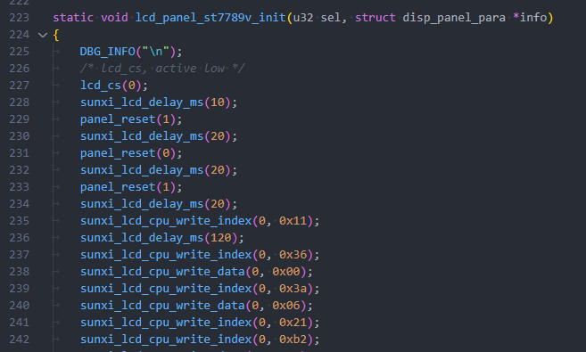

把原来的初始化序列删除，然后将屏厂提供的初始化序列复制进来。

| 屏厂函数 | LCD框架接口 |
| --- | --- |
| `Writecom` | `sunxi_lcd_cpu_write_index` |
| `Writedat` | `sunxi_lcd_cpu_write_data` |
| `Delayms` | `sunxi_lcd_delay_ms` |

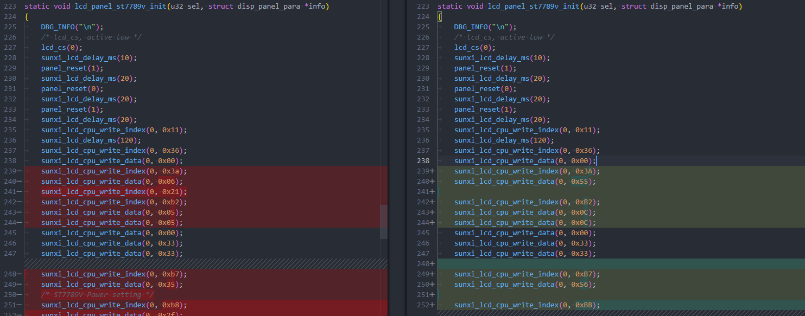

### 配置屏幕使用 TE 模式

由于屏幕支持 TE，这里可以配置使用 TE 模式，参考屏幕驱动 IC 手册，查看 TE 启用的寄存器，或者询问屏厂。针对 ST7789V2 IC 驱动，其开启 TE 的寄存器是 35H

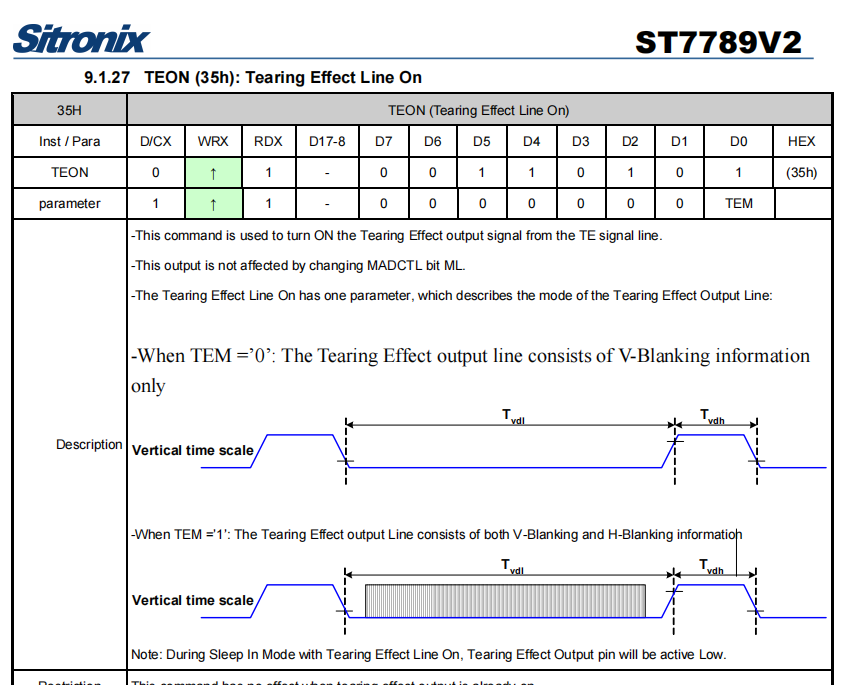

配置 TE 时钟的寄存器是 44H

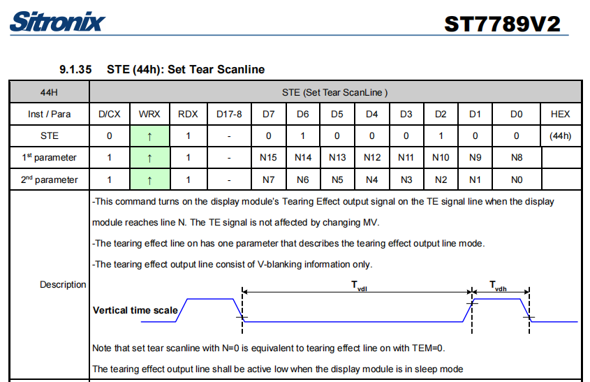

这里配置启用 TE，并且设置 TE 时钟为60Hz。在初始化中写入启用 TE 功能的如下代码

```c
#if defined(CPU_TRI_MODE)
	/* enable te, mode 0 */
	sunxi_lcd_cpu_write_index(0, 0x35);
	sunxi_lcd_cpu_write_data(0, 0x00);

	sunxi_lcd_cpu_write_index(0, 0x44);
	sunxi_lcd_cpu_write_data(0, 0x00);
	sunxi_lcd_cpu_write_data(0, 0x80);
#endif
```

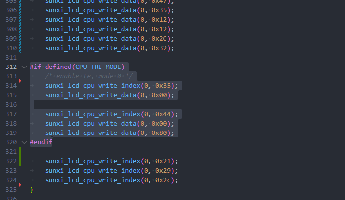

### 配置屏幕开启

针对 i8080 屏幕，还需要写入 21H，29H开显示之后，还需要开启 GRAM 写入，对应寄存器是 2CH，一般屏厂会在初始化中提供，但是也有屏厂初始化中不提供这个指令。

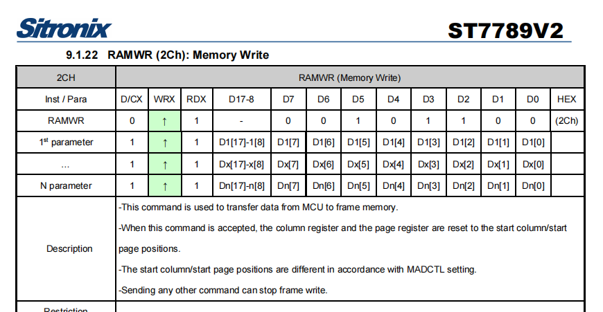

如果出现这样屏幕可以亮但是花屏，且送显示没有反应的情况（如下图）

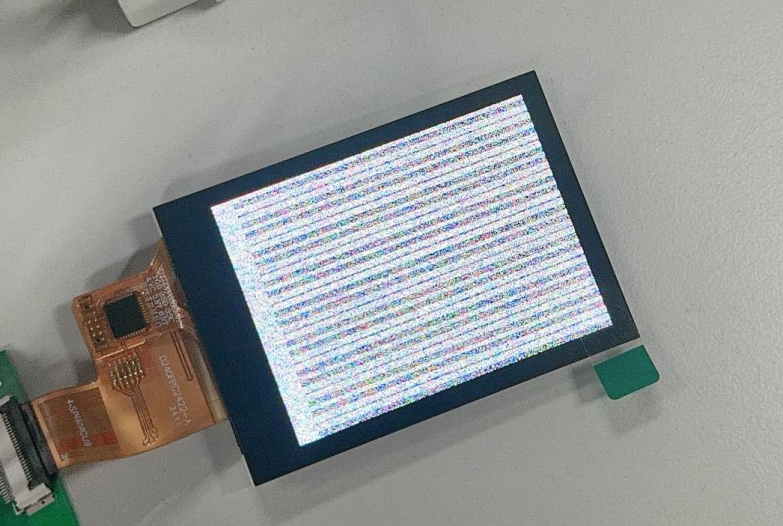

可以尝试增加开启 GRAM 写入的指令到初始化序列最后一行：

```c
sunxi_lcd_cpu_write_index(0, 0x2c);
```


### 完整屏幕驱动

完整的屏幕驱动如下：

```c
#include "st7789v_cpu.h"

#define CPU_TRI_MODE

#define DBG_INFO(format, args...)                                              \
	(printk("[ST7789V LCD INFO] LINE:%04d-->%s:" format, __LINE__,         \
		__func__, ##args))
#define DBG_ERR(format, args...)                                               \
	(printk("[ST7789V LCD ERR] LINE:%04d-->%s:" format, __LINE__,          \
		__func__, ##args))
#define panel_reset(val) sunxi_lcd_gpio_set_value(sel, 0, val)
#define lcd_cs(val) sunxi_lcd_gpio_set_value(sel, 1, val)

static void lcd_panel_st7789v_init(u32 sel, struct disp_panel_para *info);
static void LCD_power_on(u32 sel);
static void LCD_power_off(u32 sel);
static void LCD_bl_open(u32 sel);
static void LCD_bl_close(u32 sel);

static void LCD_panel_init(u32 sel);
static void LCD_panel_exit(u32 sel);

static void LCD_cfg_panel_info(struct panel_extend_para *info)
{
#if defined(__DISP_TEMP_CODE__)
	u32 i = 0, j = 0;
	u32 items;
	u8 lcd_gamma_tbl[][2] = {
		/* {input value, corrected value} */
		{ 0, 0 },     { 15, 15 },   { 30, 30 },	  { 45, 45 },
		{ 60, 60 },   { 75, 75 },   { 90, 90 },	  { 105, 105 },
		{ 120, 120 }, { 135, 135 }, { 150, 150 }, { 165, 165 },
		{ 180, 180 }, { 195, 195 }, { 210, 210 }, { 225, 225 },
		{ 240, 240 }, { 255, 255 },
	};

	u32 lcd_cmap_tbl[2][3][4] = {
		{
			{ LCD_CMAP_G0, LCD_CMAP_B1, LCD_CMAP_G2, LCD_CMAP_B3 },
			{ LCD_CMAP_B0, LCD_CMAP_R1, LCD_CMAP_B2, LCD_CMAP_R3 },
			{ LCD_CMAP_R0, LCD_CMAP_G1, LCD_CMAP_R2, LCD_CMAP_G3 },
		},
		{
			{ LCD_CMAP_B3, LCD_CMAP_G2, LCD_CMAP_B1, LCD_CMAP_G0 },
			{ LCD_CMAP_R3, LCD_CMAP_B2, LCD_CMAP_R1, LCD_CMAP_B0 },
			{ LCD_CMAP_G3, LCD_CMAP_R2, LCD_CMAP_G1, LCD_CMAP_R0 },
		},
	};

	items = sizeof(lcd_gamma_tbl) / 2;
	for (i = 0; i < items - 1; i++) {
		u32 num = lcd_gamma_tbl[i + 1][0] - lcd_gamma_tbl[i][0];

		for (j = 0; j < num; j++) {
			u32 value = 0;

			value = lcd_gamma_tbl[i][1] +
				((lcd_gamma_tbl[i + 1][1] -
				lcd_gamma_tbl[i][1]) *
				j) / num;
			info->lcd_gamma_tbl[lcd_gamma_tbl[i][0] + j] =
				(value << 16) + (value << 8) + value;
		}
	}
	info->lcd_gamma_tbl[255] = (lcd_gamma_tbl[items - 1][1] << 16) +
				(lcd_gamma_tbl[items - 1][1] << 8) +
				lcd_gamma_tbl[items - 1][1];

	memcpy(info->lcd_cmap_tbl, lcd_cmap_tbl, sizeof(lcd_cmap_tbl));
#endif
}

static s32 LCD_open_flow(u32 sel)
{
	LCD_OPEN_FUNC(sel, LCD_power_on, 120);
#ifdef CPU_TRI_MODE
	LCD_OPEN_FUNC(sel, LCD_panel_init, 100);
	LCD_OPEN_FUNC(sel, sunxi_lcd_tcon_enable, 50);
#else
	LCD_OPEN_FUNC(sel, sunxi_lcd_tcon_enable, 100);
	LCD_OPEN_FUNC(sel, LCD_panel_init, 50);
#endif
	LCD_OPEN_FUNC(sel, LCD_bl_open, 0);

	return 0;
}

static s32 LCD_close_flow(u32 sel)
{
	LCD_CLOSE_FUNC(sel, LCD_bl_close, 20);
#ifdef CPU_TRI_MODE
	LCD_CLOSE_FUNC(sel, sunxi_lcd_tcon_disable, 10);
	LCD_CLOSE_FUNC(sel, LCD_panel_exit, 50);
#else
	LCD_CLOSE_FUNC(sel, LCD_panel_exit, 10);
	LCD_CLOSE_FUNC(sel, sunxi_lcd_tcon_disable, 10);
#endif
	LCD_CLOSE_FUNC(sel, LCD_power_off, 0);

	return 0;
}

static void LCD_power_on(u32 sel)
{
	/* config lcd_power pin to open lcd power0 */
	sunxi_lcd_power_enable(sel, 0);
	sunxi_lcd_pin_cfg(sel, 1);
}

static void LCD_power_off(u32 sel)
{
	/* lcd_cs, active low */
	lcd_cs(1);
	sunxi_lcd_delay_ms(10);
	/* lcd_rst, active hight */
	panel_reset(1);
	sunxi_lcd_delay_ms(10);

	sunxi_lcd_pin_cfg(sel, 0);
	/* config lcd_power pin to close lcd power0 */
	sunxi_lcd_power_disable(sel, 0);
}

static void LCD_bl_open(u32 sel)
{
	sunxi_lcd_pwm_enable(sel);
	/* config lcd_bl_en pin to open lcd backlight */
	sunxi_lcd_backlight_enable(sel);
}

static void LCD_bl_close(u32 sel)
{
	/* config lcd_bl_en pin to close lcd backlight */
	sunxi_lcd_backlight_disable(sel);
	sunxi_lcd_pwm_disable(sel);
}

/* static int bootup_flag = 0; */
static void LCD_panel_init(u32 sel)
{
	struct disp_panel_para *info =
		kmalloc(sizeof(struct disp_panel_para), GFP_KERNEL);

	DBG_INFO("\n");
	bsp_disp_get_panel_info(sel, info);
	lcd_panel_st7789v_init(sel, info);

	kfree(info);
	return;
}

static void LCD_panel_exit(u32 sel)
{
	sunxi_lcd_cpu_write_index(0, 0x28);
	sunxi_lcd_cpu_write_index(0, 0x10);
}

static void lcd_panel_st7789v_init(u32 sel, struct disp_panel_para *info)
{
	DBG_INFO("\n");
	/* lcd_cs, active low */
	lcd_cs(0);
	sunxi_lcd_delay_ms(10);
	panel_reset(1);
	sunxi_lcd_delay_ms(20);
	panel_reset(0);
	sunxi_lcd_delay_ms(20);
	panel_reset(1);
	sunxi_lcd_delay_ms(120);
	sunxi_lcd_cpu_write_index(0, 0x11);
	sunxi_lcd_delay_ms(120);
	sunxi_lcd_cpu_write_index(0, 0x36);
	sunxi_lcd_cpu_write_data(0, 0x00);

	sunxi_lcd_cpu_write_index(0, 0x3A);
	sunxi_lcd_cpu_write_data(0, 0x55);

	sunxi_lcd_cpu_write_index(0, 0xB2);
	sunxi_lcd_cpu_write_data(0, 0x0C);
	sunxi_lcd_cpu_write_data(0, 0x0C);
	sunxi_lcd_cpu_write_data(0, 0x00);
	sunxi_lcd_cpu_write_data(0, 0x33);
	sunxi_lcd_cpu_write_data(0, 0x33);

	sunxi_lcd_cpu_write_index(0, 0xB7);
	sunxi_lcd_cpu_write_data(0, 0x56);

	sunxi_lcd_cpu_write_index(0, 0xBB);
	sunxi_lcd_cpu_write_data(0, 0x20);

	sunxi_lcd_cpu_write_index(0, 0xC0);
	sunxi_lcd_cpu_write_data(0, 0x2C);

	sunxi_lcd_cpu_write_index(0, 0xC2);
	sunxi_lcd_cpu_write_data(0, 0x01);

	sunxi_lcd_cpu_write_index(0, 0xC3);
	sunxi_lcd_cpu_write_data(0, 0x0F);

	sunxi_lcd_cpu_write_index(0, 0xC4);
	sunxi_lcd_cpu_write_data(0, 0x20);

	sunxi_lcd_cpu_write_index(0, 0xC6);
	sunxi_lcd_cpu_write_data(0, 0x0F);

	sunxi_lcd_cpu_write_index(0, 0xD0);
	sunxi_lcd_cpu_write_data(0, 0xA4);
	sunxi_lcd_cpu_write_data(0, 0xA1);

	sunxi_lcd_cpu_write_index(0, 0xD6);
	sunxi_lcd_cpu_write_data(0, 0xA1);

	sunxi_lcd_cpu_write_index(0, 0xE0);
	sunxi_lcd_cpu_write_data(0, 0xF0);
	sunxi_lcd_cpu_write_data(0, 0x00);
	sunxi_lcd_cpu_write_data(0, 0x06);
	sunxi_lcd_cpu_write_data(0, 0x06);
	sunxi_lcd_cpu_write_data(0, 0x07);
	sunxi_lcd_cpu_write_data(0, 0x05);
	sunxi_lcd_cpu_write_data(0, 0x30);
	sunxi_lcd_cpu_write_data(0, 0x44);
	sunxi_lcd_cpu_write_data(0, 0x48);
	sunxi_lcd_cpu_write_data(0, 0x38);
	sunxi_lcd_cpu_write_data(0, 0x11);
	sunxi_lcd_cpu_write_data(0, 0x10);
	sunxi_lcd_cpu_write_data(0, 0x2E);
	sunxi_lcd_cpu_write_data(0, 0x34);

	sunxi_lcd_cpu_write_index(0, 0xE1);
	sunxi_lcd_cpu_write_data(0, 0xF0);
	sunxi_lcd_cpu_write_data(0, 0x0A);
	sunxi_lcd_cpu_write_data(0, 0x0E);
	sunxi_lcd_cpu_write_data(0, 0x0D);
	sunxi_lcd_cpu_write_data(0, 0x0B);
	sunxi_lcd_cpu_write_data(0, 0x27);
	sunxi_lcd_cpu_write_data(0, 0x2F);
	sunxi_lcd_cpu_write_data(0, 0x44);
	sunxi_lcd_cpu_write_data(0, 0x47);
	sunxi_lcd_cpu_write_data(0, 0x35);
	sunxi_lcd_cpu_write_data(0, 0x12);
	sunxi_lcd_cpu_write_data(0, 0x12);
	sunxi_lcd_cpu_write_data(0, 0x2C);
	sunxi_lcd_cpu_write_data(0, 0x32);

#if defined(CPU_TRI_MODE)
	/* enable te, mode 0 */
	sunxi_lcd_cpu_write_index(0, 0x35);
	sunxi_lcd_cpu_write_data(0, 0x00);

	sunxi_lcd_cpu_write_index(0, 0x44);
	sunxi_lcd_cpu_write_data(0, 0x00);
	sunxi_lcd_cpu_write_data(0, 0x80);
#endif

	sunxi_lcd_cpu_write_index(0, 0x21);
	sunxi_lcd_cpu_write_index(0, 0x29);
	sunxi_lcd_cpu_write_index(0, 0x2c);
}

/* panel driver name, must mach the name of lcd_drv_name in sys_config.fex */
struct __lcd_panel st7789v_cpu_panel = {
	.name = "st7789v_cpu",
	.func = {
		.cfg_panel_info = LCD_cfg_panel_info,
		.cfg_open_flow = LCD_open_flow,
		.cfg_close_flow = LCD_close_flow,
	},
};
```

## 配置屏幕驱动

进入内核，勾选 ST7789V\_CPU 驱动。

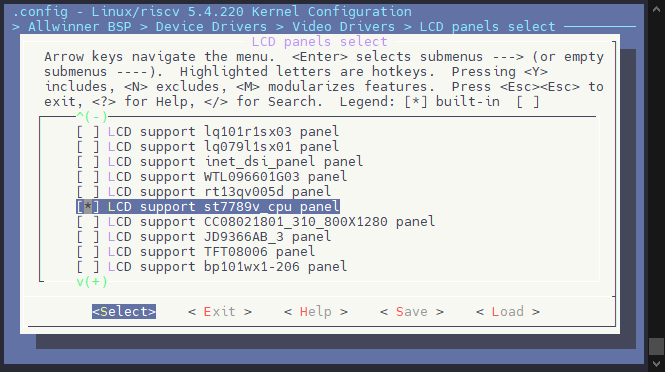

编辑设备树，配置屏幕时序与引脚

```c
&disp {
	disp_init_enable         = <1>;
	disp_mode                = <0>;

	screen0_output_type      = <1>;
	screen0_output_mode      = <4>;
	screen0_to_lcd_index     = <0>;

	screen1_output_type      = <3>;
	screen1_output_mode      = <10>;
	screen1_to_lcd_index     = <2>;

	screen1_output_format    = <0>;
	screen1_output_bits      = <0>;
	screen1_output_eotf      = <4>;
	screen1_output_cs        = <257>;
	screen1_output_dvi_hdmi  = <2>;
	screen1_output_range     = <2>;
	screen1_output_scan      = <0>;
	screen1_output_aspect_ratio = <8>;

	fb_format                = <0>;
	fb_num                   = <1>;
	fb_debug                 = <0>;
	/*<disp channel layer zorder>*/
	fb0_map                  = <0 0 0 16>;
	fb0_width                = <240>;
	fb0_height               = <320>;
	/*<disp channel layer zorder>*/
	fb1_map                  = <0 2 0 16>;
	fb1_width                = <300>;
	fb1_height               = <300>;
	/*<disp channel layer zorder>*/
	fb2_map                  = <1 0 0 16>;
	fb2_width                = <1280>;
	fb2_height               = <720>;
	/*<disp channel layer zorder>*/
	fb3_map                  = <1 1 0 16>;
	fb3_width                = <300>;
	fb3_height               = <300>;

	chn_cfg_mode             = <1>;
	disp_para_zone           = <1>;
};

&lcd0 {
	lcd_used            = <1>;

	lcd_driver_name     = "st7789v_cpu";
	lcd_if              = <1>;

	lcd_x               = <240>;
	lcd_y               = <320>;
	lcd_width           = <43>;
	lcd_height          = <63>;

	lcd_dclk_freq       = <20>;

	lcd_hbp             = <20>;
	lcd_ht              = <298>;
	lcd_hspw            = <10>;
	lcd_vbp             = <8>;
	lcd_vt              = <336>;
	lcd_vspw            = <2>;

	lcd_backlight       = <50>;
	lcd_pwm_used        = <1>;
	lcd_pwm_ch          = <4>;
	lcd_pwm_freq        = <50000>;
	lcd_pwm_pol         = <1>;
	lcd_pwm_max_limit   = <255>;
	lcd_bright_curve_en = <1>;

	lcd_frm             = <2>;
	lcd_gamma_en        = <0>;
	lcd_bright_curve_en = <0>;
	lcd_cmap_en         = <0>;

	lcdgamma4iep        = <22>;
	lcd_cpu_mode        = <1>;
	lcd_cpu_te          = <2>;
	lcd_cpu_if          = <14>;

	/* rst */
	lcd_gpio_0          = <&pio PD 19 GPIO_ACTIVE_LOW>;
	/* cs */
	lcd_gpio_1          = <&pio PD 14 GPIO_ACTIVE_LOW>;

	pinctrl-0 = <&rgb8_pins_a>, <&rgb8_pins_ctl_a>;
	pinctrl-1 = <&rgb8_pins_b>, <&rgb8_pins_ctl_b>;
};
```

## 测试屏幕

使用命令查看 TCON 彩条，这个彩条是由 TCON 发出的，操作更加底层。

```
echo 1 > /sys/class/disp/disp/attr/colorbar
```

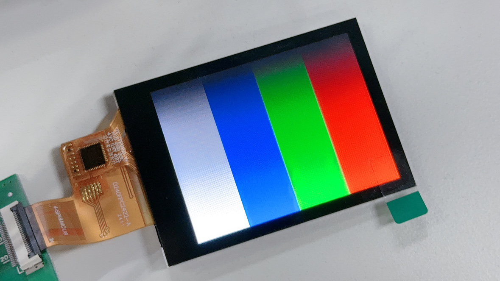

使用命令查看 DE 彩条，这个彩条是由 DE 合成发出的，如果 DE 出问题则可以看到 TCON 彩条看不到 DE 彩条。

:::tip

:::note

提示

:::
:::note

如果刚才开了 TCON 彩条，记得先关一下，TCON 彩条优先级更高

```
echo 0 > /sys/class/disp/disp/attr/colorbar
```

:::

:::

```
echo 8 > /sys/class/disp/disp/attr/colorbar
```

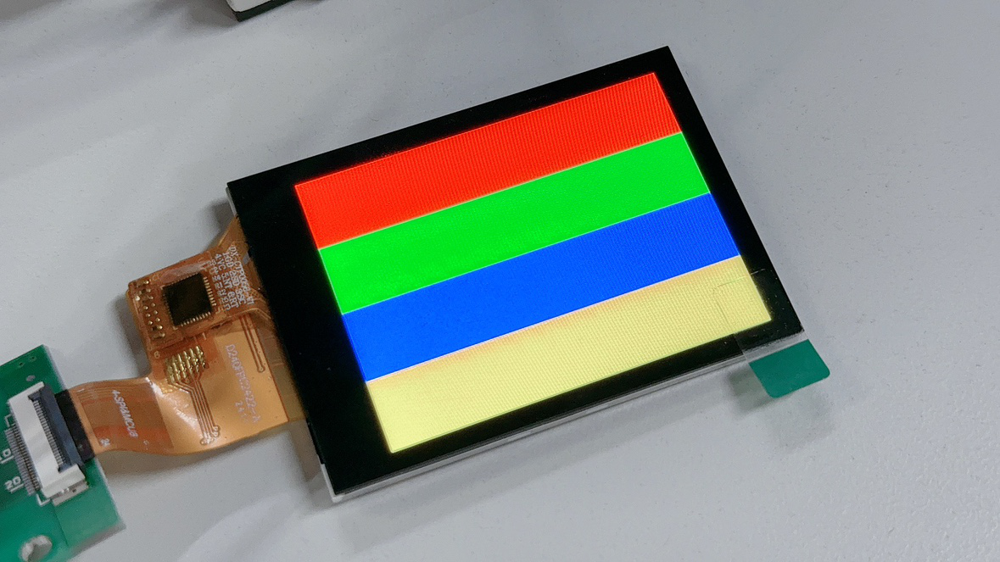

## FAQ

### I8080接口显示抖动有花纹

1.  改大时钟管脚的管脚驱动能力，改大。

### 黑屏无显示

#### 黑屏，没有屏幕信号输出

:::danger

:::note

注意芯片型号！

:::
:::note

首先确认芯片型号是否为支持型号。

:::

:::

#### 完全黑屏，背光也没有

1.  屏驱动添加失败。驱动没有加载屏驱动，导致背光电源相关函数没有运行到。
2.  屏驱动加载成功，但是没有执行到开背光函数（可以在uboot的屏驱动中加打印确认开屏流程的执行情况）。这时候大概率是屏驱动的开屏函数没有执行完，uboot就执行完毕进入内核了。需要在满足屏手册上电时序要求的情况下，尽量减少延迟。
3.  PWM 配置和背光电路的问题，另外就是直接测量下硬件测量下相关管脚和电压，再检查屏是否初始化成功。

#### 黑屏但是有背光

1.  没送图层。如果应用没有送任何图层那么表现的现象就是黑屏。
2.  SoC端的显示接口模块没有供电。SoC端模块没有供电自然无法传输视频信号到屏上。
3.  复位脚没有复位。如果有复位脚，请确保硬件连接正确，确保复位脚的复位操作有放到屏驱动中。
4.  `board.dts` 中 `lcd0`有严重错误。第一个是 `lcd`的`timing`搞错了，请严格按照屏手册中的提示来写。第二个就是，接口类型搞错。
5.  屏的初始化命令不对。包括各个步骤先后顺序，延时等，这个时候请找屏厂确认初始化命令。
