# I8080 8BIT 点亮 480x800 屏

:::danger

:::note

注意芯片型号！

:::
:::note

首先确认芯片型号是否为支持型号。

:::

:::

此次适配的 I8080 屏为 `FPC39703MS-B200-40C-10`，使用的是 I8080 8Bit 进行驱动。屏幕IC是 NT35510

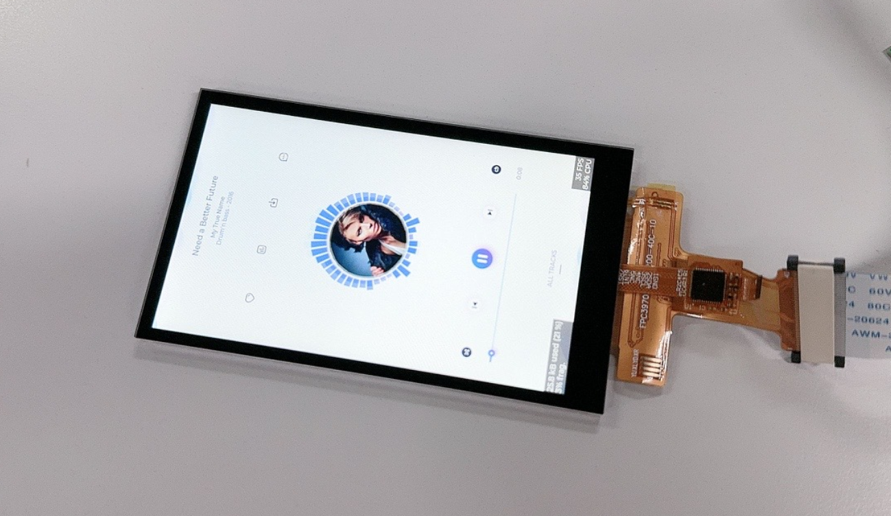

引脚配置如下：

| V821 | 引脚复用功能 | TFT 模块 |
| --- | --- | --- |
| PD1—PD8 | LCD-D3—LCD-D12 | D0—D7 |
| PD12 | LCD-VSYNC | TE |
| PD11 | LCD-HSYNC | RD |
| PD9 | LCD-CLK | WR |
| PD10 | LCD-DE | DC |
| PD14 | GPIO OUTPUT | CS |
| PD19 | GPIO OUTPUT | RESET |

## 编写 LCD 显示屏驱动

### 获取屏幕初始化序列

首先询问屏厂提供初始化序列，和屏幕手册。

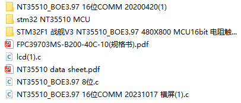

这里我们使用 8Bit I8080 点屏，使用 8 位的初始化代码：

```c
void LCD_Init(void)
{
    RST=1;  
    Delay(5);

    RST=0;
    Delay(10);

    RST=1;
    Delay(120);

    //NT35510SH_BOE3.97IPS_24BIT_20141224
    WriteComm(0xFF00);WriteData(0x00AA); 
    WriteComm(0xFF01);WriteData(0x0055); 
    WriteComm(0xFF02);WriteData(0x00A5); 
    WriteComm(0xFF03);WriteData(0x0080); 

    WriteComm(0xF200);WriteData(0x0000); 
    WriteComm(0xF201);WriteData(0x0084); 
    WriteComm(0xF202);WriteData(0x0008);

    WriteComm(0x6F00);WriteData(0x000A); 
    WriteComm(0xF400);WriteData(0x0013);

    WriteComm(0xFF00);WriteData(0x00AA); 
    WriteComm(0xFF01);WriteData(0x0055); 
    WriteComm(0xFF02);WriteData(0x00A5); 
    WriteComm(0xFF03);WriteData(0x0000);

    //Enable Page 1
    WriteComm(0xF000);WriteData(0x0055); 
    WriteComm(0xF001);WriteData(0x00AA); 
    WriteComm(0xF002);WriteData(0x0052); 
    WriteComm(0xF003);WriteData(0x0008);
    WriteComm(0xF004);WriteData(0x0001);

    //AVDD Set AVDD 5.2V
    WriteComm(0xB000);WriteData(0x000C); 
    WriteComm(0xB001);WriteData(0x000C);
    WriteComm(0xB002);WriteData(0x000C);

    //AVDD ratio
    WriteComm(0xB600);WriteData(0x0046); 
    WriteComm(0xB601);WriteData(0x0046);
    WriteComm(0xB602);WriteData(0x0046); 

    //AVEE  -5.2V
    WriteComm(0xB100);WriteData(0x000C); 
    WriteComm(0xB101);WriteData(0x000C);
    WriteComm(0xB102);WriteData(0x000C);

    //AVEE ratio
    WriteComm(0xB700);WriteData(0x0026); 
    WriteComm(0xB701);WriteData(0x0026); 
    WriteComm(0xB702);WriteData(0x0026); 

    //VCL  -2.5V   
    WriteComm(0xB200);WriteData(0x0000); 
    WriteComm(0xB201);WriteData(0x0000);
    WriteComm(0xB202);WriteData(0x0000);

    //VCL ratio
    WriteComm(0xB800);WriteData(0x0034); 
    WriteComm(0xB801);WriteData(0x0034);
    WriteComm(0xB802);WriteData(0x0034);

    //VGH 15V  (Free pump) 
    WriteComm(0xBF00);WriteData(0x0001);
    WriteComm(0xB300);WriteData(0x0008);
    WriteComm(0xB301);WriteData(0x0008); 
    WriteComm(0xB302);WriteData(0x0008);  

    //VGH ratio
    WriteComm(0xB900);WriteData(0x0026); 
    WriteComm(0xB901);WriteData(0x0026);
    WriteComm(0xB902);WriteData(0x0026); 

    //VGL_REG -10V 
    WriteComm(0xB500);WriteData(0x0008);
    WriteComm(0xB501);WriteData(0x0008);
    WriteComm(0xB502);WriteData(0x0008);

    //WriteComm(0xC200);WriteData(0x0003);

    //VGLX ratio
    WriteComm(0xBA00);WriteData(0x0036); 
    WriteComm(0xBA01);WriteData(0x0036); 
    WriteComm(0xBA02);WriteData(0x0036); 

    //VGMP/VGSP 4.5V/0V
    WriteComm(0xBC00);WriteData(0x0000); 
    WriteComm(0xBC01);WriteData(0x0080); 
    WriteComm(0xBC02);WriteData(0x0000);

    //VGMN/VGSN -4.5V/0V
    WriteComm(0xBD00);WriteData(0x0000); 
    WriteComm(0xBD01);WriteData(0x0080); 
    WriteComm(0xBD02);WriteData(0x0000);

    //VCOM 
    WriteComm(0xBE00);WriteData(0x0000); 
    WriteComm(0xBE01);WriteData(0x0055); // 6A

    //Gamma Setting
    WriteComm(0xD100);WriteData(0x0000); 
    WriteComm(0xD101);WriteData(0x0001); 
    WriteComm(0xD102);WriteData(0x0000); 
    WriteComm(0xD103);WriteData(0x001C); 
    WriteComm(0xD104);WriteData(0x0000); 
    WriteComm(0xD105);WriteData(0x004E); 
    WriteComm(0xD106);WriteData(0x0000); 
    WriteComm(0xD107);WriteData(0x006A); 
    WriteComm(0xD108);WriteData(0x0000); 
    WriteComm(0xD109);WriteData(0x0085); 
    WriteComm(0xD10A);WriteData(0x0000); 
    WriteComm(0xD10B);WriteData(0x00AB); 
    WriteComm(0xD10C);WriteData(0x0000); 
    WriteComm(0xD10D);WriteData(0x00C4); 
    WriteComm(0xD10E);WriteData(0x0000); 
    WriteComm(0xD10F);WriteData(0x00FC); 
    WriteComm(0xD110);WriteData(0x0001); 
    WriteComm(0xD111);WriteData(0x0023); 
    WriteComm(0xD112);WriteData(0x0001); 
    WriteComm(0xD113);WriteData(0x0061); 
    WriteComm(0xD114);WriteData(0x0001); 
    WriteComm(0xD115);WriteData(0x0094); 
    WriteComm(0xD116);WriteData(0x0001); 
    WriteComm(0xD117);WriteData(0x00E4); 
    WriteComm(0xD118);WriteData(0x0002); 
    WriteComm(0xD119);WriteData(0x0027); 
    WriteComm(0xD11A);WriteData(0x0002); 
    WriteComm(0xD11B);WriteData(0x0029); 
    WriteComm(0xD11C);WriteData(0x0002); 
    WriteComm(0xD11D);WriteData(0x0065); 
    WriteComm(0xD11E);WriteData(0x0002);
    WriteComm(0xD11F);WriteData(0x00A6);  
    WriteComm(0xD120);WriteData(0x0002); 
    WriteComm(0xD121);WriteData(0x00CA); 
    WriteComm(0xD122);WriteData(0x0002); 
    WriteComm(0xD123);WriteData(0x00FD); 
    WriteComm(0xD124);WriteData(0x0003); 
    WriteComm(0xD125);WriteData(0x001D); 
    WriteComm(0xD126);WriteData(0x0003); 
    WriteComm(0xD127);WriteData(0x004D); 
    WriteComm(0xD128);WriteData(0x0003); 
    WriteComm(0xD129);WriteData(0x006A); 
    WriteComm(0xD12A);WriteData(0x0003); 
    WriteComm(0xD12B);WriteData(0x0095); 
    WriteComm(0xD12C);WriteData(0x0003); 
    WriteComm(0xD12D);WriteData(0x00AC); 
    WriteComm(0xD12E);WriteData(0x0003); 
    WriteComm(0xD12F);WriteData(0x00CB); 
    WriteComm(0xD130);WriteData(0x0003); 
    WriteComm(0xD131);WriteData(0x00EA); 
    WriteComm(0xD132);WriteData(0x0003); 
    WriteComm(0xD133);WriteData(0x00EF); 

    WriteComm(0xD200);WriteData(0x0000); 
    WriteComm(0xD201);WriteData(0x0001); 
    WriteComm(0xD202);WriteData(0x0000); 
    WriteComm(0xD203);WriteData(0x001C); 
    WriteComm(0xD204);WriteData(0x0000); 
    WriteComm(0xD205);WriteData(0x004E); 
    WriteComm(0xD206);WriteData(0x0000); 
    WriteComm(0xD207);WriteData(0x006A); 
    WriteComm(0xD208);WriteData(0x0000); 
    WriteComm(0xD209);WriteData(0x0085); 
    WriteComm(0xD20A);WriteData(0x0000); 
    WriteComm(0xD20B);WriteData(0x00AB); 
    WriteComm(0xD20C);WriteData(0x0000); 
    WriteComm(0xD20D);WriteData(0x00C4); 
    WriteComm(0xD20E);WriteData(0x0000); 
    WriteComm(0xD20F);WriteData(0x00FC); 
    WriteComm(0xD210);WriteData(0x0001); 
    WriteComm(0xD211);WriteData(0x0023); 
    WriteComm(0xD212);WriteData(0x0001); 
    WriteComm(0xD213);WriteData(0x0061); 
    WriteComm(0xD214);WriteData(0x0001); 
    WriteComm(0xD215);WriteData(0x0094); 
    WriteComm(0xD216);WriteData(0x0001); 
    WriteComm(0xD217);WriteData(0x00E4); 
    WriteComm(0xD218);WriteData(0x0002); 
    WriteComm(0xD219);WriteData(0x0027); 
    WriteComm(0xD21A);WriteData(0x0002); 
    WriteComm(0xD21B);WriteData(0x0029); 
    WriteComm(0xD21C);WriteData(0x0002); 
    WriteComm(0xD21D);WriteData(0x0065); 
    WriteComm(0xD21E);WriteData(0x0002);
    WriteComm(0xD21F);WriteData(0x00A6);  
    WriteComm(0xD220);WriteData(0x0002); 
    WriteComm(0xD221);WriteData(0x00CA); 
    WriteComm(0xD222);WriteData(0x0002); 
    WriteComm(0xD223);WriteData(0x00FD); 
    WriteComm(0xD224);WriteData(0x0003); 
    WriteComm(0xD225);WriteData(0x001D); 
    WriteComm(0xD226);WriteData(0x0003); 
    WriteComm(0xD227);WriteData(0x004D); 
    WriteComm(0xD228);WriteData(0x0003); 
    WriteComm(0xD229);WriteData(0x006A); 
    WriteComm(0xD22A);WriteData(0x0003); 
    WriteComm(0xD22B);WriteData(0x0095); 
    WriteComm(0xD22C);WriteData(0x0003); 
    WriteComm(0xD22D);WriteData(0x00AC); 
    WriteComm(0xD22E);WriteData(0x0003); 
    WriteComm(0xD22F);WriteData(0x00CB); 
    WriteComm(0xD230);WriteData(0x0003); 
    WriteComm(0xD231);WriteData(0x00EA); 
    WriteComm(0xD232);WriteData(0x0003); 
    WriteComm(0xD233);WriteData(0x00EF); 

    WriteComm(0xD300);WriteData(0x0000); 
    WriteComm(0xD301);WriteData(0x0001); 
    WriteComm(0xD302);WriteData(0x0000); 
    WriteComm(0xD303);WriteData(0x001C); 
    WriteComm(0xD304);WriteData(0x0000); 
    WriteComm(0xD305);WriteData(0x004E); 
    WriteComm(0xD306);WriteData(0x0000); 
    WriteComm(0xD307);WriteData(0x006A); 
    WriteComm(0xD308);WriteData(0x0000); 
    WriteComm(0xD309);WriteData(0x0085); 
    WriteComm(0xD30A);WriteData(0x0000); 
    WriteComm(0xD30B);WriteData(0x00AB); 
    WriteComm(0xD30C);WriteData(0x0000); 
    WriteComm(0xD30D);WriteData(0x00C4); 
    WriteComm(0xD30E);WriteData(0x0000); 
    WriteComm(0xD30F);WriteData(0x00FC); 
    WriteComm(0xD310);WriteData(0x0001); 
    WriteComm(0xD311);WriteData(0x0023); 
    WriteComm(0xD312);WriteData(0x0001); 
    WriteComm(0xD313);WriteData(0x0061); 
    WriteComm(0xD314);WriteData(0x0001); 
    WriteComm(0xD315);WriteData(0x0094); 
    WriteComm(0xD316);WriteData(0x0001); 
    WriteComm(0xD317);WriteData(0x00E4); 
    WriteComm(0xD318);WriteData(0x0002); 
    WriteComm(0xD319);WriteData(0x0027); 
    WriteComm(0xD31A);WriteData(0x0002); 
    WriteComm(0xD31B);WriteData(0x0029); 
    WriteComm(0xD31C);WriteData(0x0002); 
    WriteComm(0xD31D);WriteData(0x0065); 
    WriteComm(0xD31E);WriteData(0x0002);
    WriteComm(0xD31F);WriteData(0x00A6);  
    WriteComm(0xD320);WriteData(0x0002); 
    WriteComm(0xD321);WriteData(0x00CA); 
    WriteComm(0xD322);WriteData(0x0002); 
    WriteComm(0xD323);WriteData(0x00FD); 
    WriteComm(0xD324);WriteData(0x0003); 
    WriteComm(0xD325);WriteData(0x001D); 
    WriteComm(0xD326);WriteData(0x0003); 
    WriteComm(0xD327);WriteData(0x004D); 
    WriteComm(0xD328);WriteData(0x0003); 
    WriteComm(0xD329);WriteData(0x006A); 
    WriteComm(0xD32A);WriteData(0x0003); 
    WriteComm(0xD32B);WriteData(0x0095); 
    WriteComm(0xD32C);WriteData(0x0003); 
    WriteComm(0xD32D);WriteData(0x00AC); 
    WriteComm(0xD32E);WriteData(0x0003); 
    WriteComm(0xD32F);WriteData(0x00CB); 
    WriteComm(0xD330);WriteData(0x0003); 
    WriteComm(0xD331);WriteData(0x00EA); 
    WriteComm(0xD332);WriteData(0x0003); 
    WriteComm(0xD333);WriteData(0x00EF); 

    WriteComm(0xD400);WriteData(0x0000); 
    WriteComm(0xD401);WriteData(0x0001); 
    WriteComm(0xD402);WriteData(0x0000); 
    WriteComm(0xD403);WriteData(0x001C); 
    WriteComm(0xD404);WriteData(0x0000); 
    WriteComm(0xD405);WriteData(0x004E); 
    WriteComm(0xD406);WriteData(0x0000); 
    WriteComm(0xD407);WriteData(0x006A); 
    WriteComm(0xD408);WriteData(0x0000); 
    WriteComm(0xD409);WriteData(0x0085); 
    WriteComm(0xD40A);WriteData(0x0000); 
    WriteComm(0xD40B);WriteData(0x00AB); 
    WriteComm(0xD40C);WriteData(0x0000); 
    WriteComm(0xD40D);WriteData(0x00C4); 
    WriteComm(0xD40E);WriteData(0x0000); 
    WriteComm(0xD40F);WriteData(0x00FC); 
    WriteComm(0xD410);WriteData(0x0001); 
    WriteComm(0xD411);WriteData(0x0023); 
    WriteComm(0xD412);WriteData(0x0001); 
    WriteComm(0xD413);WriteData(0x0061); 
    WriteComm(0xD414);WriteData(0x0001); 
    WriteComm(0xD415);WriteData(0x0094); 
    WriteComm(0xD416);WriteData(0x0001); 
    WriteComm(0xD417);WriteData(0x00E4); 
    WriteComm(0xD418);WriteData(0x0002); 
    WriteComm(0xD419);WriteData(0x0027); 
    WriteComm(0xD41A);WriteData(0x0002); 
    WriteComm(0xD41B);WriteData(0x0029); 
    WriteComm(0xD41C);WriteData(0x0002); 
    WriteComm(0xD41D);WriteData(0x0065); 
    WriteComm(0xD41E);WriteData(0x0002);
    WriteComm(0xD41F);WriteData(0x00A6);  
    WriteComm(0xD420);WriteData(0x0002); 
    WriteComm(0xD421);WriteData(0x00CA); 
    WriteComm(0xD422);WriteData(0x0002); 
    WriteComm(0xD423);WriteData(0x00FD); 
    WriteComm(0xD424);WriteData(0x0003); 
    WriteComm(0xD425);WriteData(0x001D); 
    WriteComm(0xD426);WriteData(0x0003); 
    WriteComm(0xD427);WriteData(0x004D); 
    WriteComm(0xD428);WriteData(0x0003); 
    WriteComm(0xD429);WriteData(0x006A); 
    WriteComm(0xD42A);WriteData(0x0003); 
    WriteComm(0xD42B);WriteData(0x0095); 
    WriteComm(0xD42C);WriteData(0x0003); 
    WriteComm(0xD42D);WriteData(0x00AC); 
    WriteComm(0xD42E);WriteData(0x0003); 
    WriteComm(0xD42F);WriteData(0x00CB); 
    WriteComm(0xD430);WriteData(0x0003); 
    WriteComm(0xD431);WriteData(0x00EA); 
    WriteComm(0xD432);WriteData(0x0003); 
    WriteComm(0xD433);WriteData(0x00EF); 

    WriteComm(0xD500);WriteData(0x0000); 
    WriteComm(0xD501);WriteData(0x0001); 
    WriteComm(0xD502);WriteData(0x0000); 
    WriteComm(0xD503);WriteData(0x001C); 
    WriteComm(0xD504);WriteData(0x0000); 
    WriteComm(0xD505);WriteData(0x004E); 
    WriteComm(0xD506);WriteData(0x0000); 
    WriteComm(0xD507);WriteData(0x006A); 
    WriteComm(0xD508);WriteData(0x0000); 
    WriteComm(0xD509);WriteData(0x0085); 
    WriteComm(0xD50A);WriteData(0x0000); 
    WriteComm(0xD50B);WriteData(0x00AB); 
    WriteComm(0xD50C);WriteData(0x0000); 
    WriteComm(0xD50D);WriteData(0x00C4); 
    WriteComm(0xD50E);WriteData(0x0000); 
    WriteComm(0xD50F);WriteData(0x00FC); 
    WriteComm(0xD510);WriteData(0x0001); 
    WriteComm(0xD511);WriteData(0x0023); 
    WriteComm(0xD512);WriteData(0x0001); 
    WriteComm(0xD513);WriteData(0x0061); 
    WriteComm(0xD514);WriteData(0x0001); 
    WriteComm(0xD515);WriteData(0x0094); 
    WriteComm(0xD516);WriteData(0x0001); 
    WriteComm(0xD517);WriteData(0x00E4); 
    WriteComm(0xD518);WriteData(0x0002); 
    WriteComm(0xD519);WriteData(0x0027); 
    WriteComm(0xD51A);WriteData(0x0002); 
    WriteComm(0xD51B);WriteData(0x0029); 
    WriteComm(0xD51C);WriteData(0x0002); 
    WriteComm(0xD51D);WriteData(0x0065); 
    WriteComm(0xD51E);WriteData(0x0002);
    WriteComm(0xD51F);WriteData(0x00A6);  
    WriteComm(0xD520);WriteData(0x0002); 
    WriteComm(0xD521);WriteData(0x00CA); 
    WriteComm(0xD522);WriteData(0x0002); 
    WriteComm(0xD523);WriteData(0x00FD); 
    WriteComm(0xD524);WriteData(0x0003); 
    WriteComm(0xD525);WriteData(0x001D); 
    WriteComm(0xD526);WriteData(0x0003); 
    WriteComm(0xD527);WriteData(0x004D); 
    WriteComm(0xD528);WriteData(0x0003); 
    WriteComm(0xD529);WriteData(0x006A); 
    WriteComm(0xD52A);WriteData(0x0003); 
    WriteComm(0xD52B);WriteData(0x0095); 
    WriteComm(0xD52C);WriteData(0x0003); 
    WriteComm(0xD52D);WriteData(0x00AC); 
    WriteComm(0xD52E);WriteData(0x0003); 
    WriteComm(0xD52F);WriteData(0x00CB); 
    WriteComm(0xD530);WriteData(0x0003); 
    WriteComm(0xD531);WriteData(0x00EA); 
    WriteComm(0xD532);WriteData(0x0003); 
    WriteComm(0xD533);WriteData(0x00EF); 

    WriteComm(0xD600);WriteData(0x0000); 
    WriteComm(0xD601);WriteData(0x0001); 
    WriteComm(0xD602);WriteData(0x0000); 
    WriteComm(0xD603);WriteData(0x001C); 
    WriteComm(0xD604);WriteData(0x0000); 
    WriteComm(0xD605);WriteData(0x004E); 
    WriteComm(0xD606);WriteData(0x0000); 
    WriteComm(0xD607);WriteData(0x006A); 
    WriteComm(0xD608);WriteData(0x0000); 
    WriteComm(0xD609);WriteData(0x0085); 
    WriteComm(0xD60A);WriteData(0x0000); 
    WriteComm(0xD60B);WriteData(0x00AB); 
    WriteComm(0xD60C);WriteData(0x0000); 
    WriteComm(0xD60D);WriteData(0x00C4); 
    WriteComm(0xD60E);WriteData(0x0000); 
    WriteComm(0xD60F);WriteData(0x00FC); 
    WriteComm(0xD610);WriteData(0x0001); 
    WriteComm(0xD611);WriteData(0x0023); 
    WriteComm(0xD612);WriteData(0x0001); 
    WriteComm(0xD613);WriteData(0x0061); 
    WriteComm(0xD614);WriteData(0x0001); 
    WriteComm(0xD615);WriteData(0x0094); 
    WriteComm(0xD616);WriteData(0x0001); 
    WriteComm(0xD617);WriteData(0x00E4); 
    WriteComm(0xD618);WriteData(0x0002); 
    WriteComm(0xD619);WriteData(0x0027); 
    WriteComm(0xD61A);WriteData(0x0002); 
    WriteComm(0xD61B);WriteData(0x0029); 
    WriteComm(0xD61C);WriteData(0x0002); 
    WriteComm(0xD61D);WriteData(0x0065); 
    WriteComm(0xD61E);WriteData(0x0002);
    WriteComm(0xD61F);WriteData(0x00A6);  
    WriteComm(0xD620);WriteData(0x0002); 
    WriteComm(0xD621);WriteData(0x00CA); 
    WriteComm(0xD622);WriteData(0x0002); 
    WriteComm(0xD623);WriteData(0x00FD); 
    WriteComm(0xD624);WriteData(0x0003); 
    WriteComm(0xD625);WriteData(0x001D); 
    WriteComm(0xD626);WriteData(0x0003); 
    WriteComm(0xD627);WriteData(0x004D); 
    WriteComm(0xD628);WriteData(0x0003); 
    WriteComm(0xD629);WriteData(0x006A); 
    WriteComm(0xD62A);WriteData(0x0003); 
    WriteComm(0xD62B);WriteData(0x0095); 
    WriteComm(0xD62C);WriteData(0x0003); 
    WriteComm(0xD62D);WriteData(0x00AC); 
    WriteComm(0xD62E);WriteData(0x0003); 
    WriteComm(0xD62F);WriteData(0x00CB); 
    WriteComm(0xD630);WriteData(0x0003); 
    WriteComm(0xD631);WriteData(0x00EA); 
    WriteComm(0xD632);WriteData(0x0003); 
    WriteComm(0xD633);WriteData(0x00EF); 

    //Enable Page 0
    WriteComm(0xF000);WriteData(0x0055); 
    WriteComm(0xF001);WriteData(0x00AA); 
    WriteComm(0xF002);WriteData(0x0052); 
    WriteComm(0xF003);WriteData(0x0008);
    WriteComm(0xF004);WriteData(0x0000);

    //Display control
    WriteComm(0xB100);WriteData(0x00CC);// MCU I/F & mipi cmd mode?CC, RGB I/F  & mipi video mode ?FC
    WriteComm(0xB101);WriteData(0x0000); 

    WriteComm(0xB400);WriteData(0x0010); 

    //Source hold time
    WriteComm(0xB600);WriteData(0x0005);

    //Gate EQ control
    WriteComm(0xB700);WriteData(0x0070); 
    WriteComm(0xB701);WriteData(0x0070);

    //Source EQ control (Mode 2)
    WriteComm(0xB800);WriteData(0x0001); 
    WriteComm(0xB801);WriteData(0x0005); 
    WriteComm(0xB802);WriteData(0x0005); 
    WriteComm(0xB803);WriteData(0x0005);

    //Inversion mode  (C)
    WriteComm(0xBC00);WriteData(0x0002); //02:2DOT
    WriteComm(0xBC01);WriteData(0x0000); 
    WriteComm(0xBC02);WriteData(0x0000); 

    //BOE's Setting (default) 
    WriteComm(0xCC00);WriteData(0x0003); 
    WriteComm(0xCC01);WriteData(0x0050); 
    WriteComm(0xCC02);WriteData(0x0050); 

    //Porch Adjust
    WriteComm(0xBD00);WriteData(0x0001); 
    WriteComm(0xBD01);WriteData(0x0084); 
    WriteComm(0xBD02);WriteData(0x0007); 
    WriteComm(0xBD03);WriteData(0x0031); 
    WriteComm(0xBD04);WriteData(0x0000); 

    WriteComm(0xBE00);WriteData(0x0001); 
    WriteComm(0xBE01);WriteData(0x0084); 
    WriteComm(0xBE02);WriteData(0x0007); 
    WriteComm(0xBE03);WriteData(0x0031); 
    WriteComm(0xBE04);WriteData(0x0000);

    WriteComm(0xBF00);WriteData(0x0001); 
    WriteComm(0xBF01);WriteData(0x0084); 
    WriteComm(0xBF02);WriteData(0x0007); 
    WriteComm(0xBF03);WriteData(0x0031); 
    WriteComm(0xBF04);WriteData(0x0000);

    WriteComm(0x3500);WriteData(0x0000); 
    WriteComm(0x3600);WriteData(0x0000); 
    WriteComm(0x3A00);WriteData(0x0055);	 //0x77:24BIT

    WriteComm(0x1100);
    Delay(120); 
    WriteComm(0x2900);
    Delay(120); 
}
```

### 编写屏幕驱动

选择一个现成的 LCD 驱动，复制一份出来改写即可，这里选择 `st7789v_cpu.c` 驱动来修改。

先复制一份，把驱动全部重命名新屏幕 `nt35510_cpu`，包括内置的变量与命名

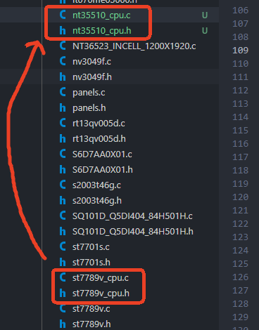

代码内 `st7789v` 相关字段也重命名新屏幕 `nt35510`

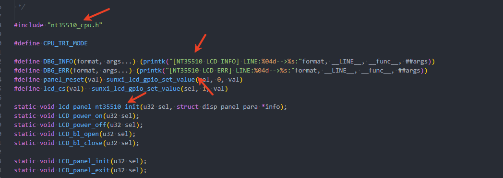

找到初始化序列的部分 `static void lcd_panel_nt35510_init(u32 sel, struct disp_panel_para *info)`

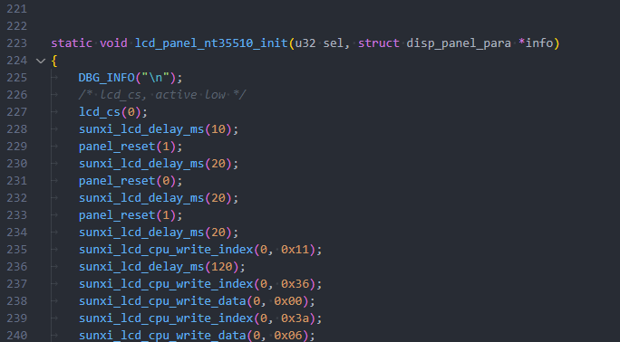

查阅屏幕手册可知，这个屏幕的命令写是16位，数据写是8位或16位。

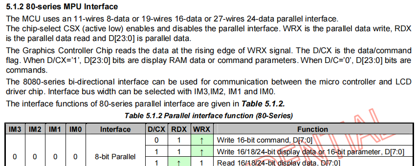

由于使用的是 8bit MCU 接口，一次无法传 16 位的数据，所以需要实现函数拆分成两部分发送。在这里封装两个函数供使用：

```c
static void sunxi_lcd_cpu_write_index_16b_8b(u32 sel, u32 i)
{
	sunxi_lcd_cpu_write_index(sel, (i >> 8) & 0xFF);
	sunxi_lcd_cpu_write_index(sel, i & 0xFF);
}

static void sunxi_lcd_cpu_write_data_8b(u32 sel, u32 i)
{
	sunxi_lcd_cpu_write_data(sel, i & 0xFF);
}
```

把原来的初始化序列删除，然后将屏厂提供的初始化序列复制进来。

| 屏厂函数 | LCD框架接口 |
| --- | --- |
| `WriteComm` | `sunxi_lcd_cpu_write_index_16b_8b` |
| `WriteData` | `sunxi_lcd_cpu_write_data_8b` |
| `Delayms` | `sunxi_lcd_delay_ms` |

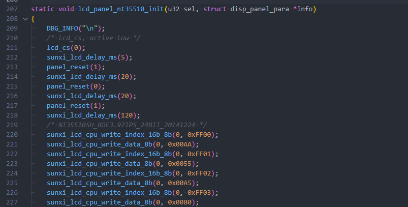

### 配置屏幕驱动

编辑文件 `bsp/drivers/video/sunxi/disp2/disp/lcd/Kconfig` 新增新驱动的索引

```c
config LCD_SUPPORT_NT35510
	bool "LCD support NT35510 panel"
	default n
	help
		if you want to support NT35510 panel for display driver, select it.
```


编辑文件 `bsp/drivers/video/sunxi/disp2/disp/Makefile` 增加驱动引用

```c
disp-$(CONFIG_LCD_SUPPORT_NT35510) += lcd/nt35510_cpu.o
```

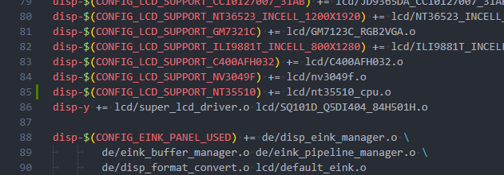

编辑 `bsp/drivers/video/sunxi/disp2/disp/lcd/panels.c` 把屏幕驱动加入数组中

```c
#if IS_ENABLED(CONFIG_LCD_SUPPORT_NT35510)
	&nt35510_cpu_panel,
#endif
```

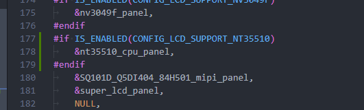

编辑 `bsp/drivers/video/sunxi/disp2/disp/lcd/panels.h` 把屏幕加入引用

```
#if IS_ENABLED(CONFIG_LCD_SUPPORT_NT35510)
extern struct __lcd_panel nt35510_cpu_panel;
#endif
```

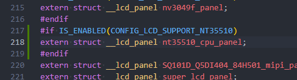

### 配置屏幕开启

针对 i8080 屏幕，还需要写入 21H，29H开显示之后，还需要开启 GRAM 写入，对应寄存器是 2CH，一般屏厂会在初始化中提供，但是也有屏厂初始化中不提供这个指令。

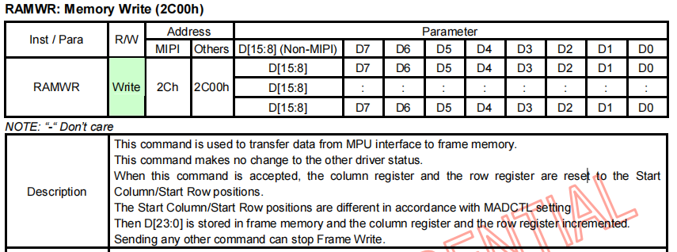

如果出现这样屏幕可以亮但是花屏，且送显示没有反应的情况（如下图）

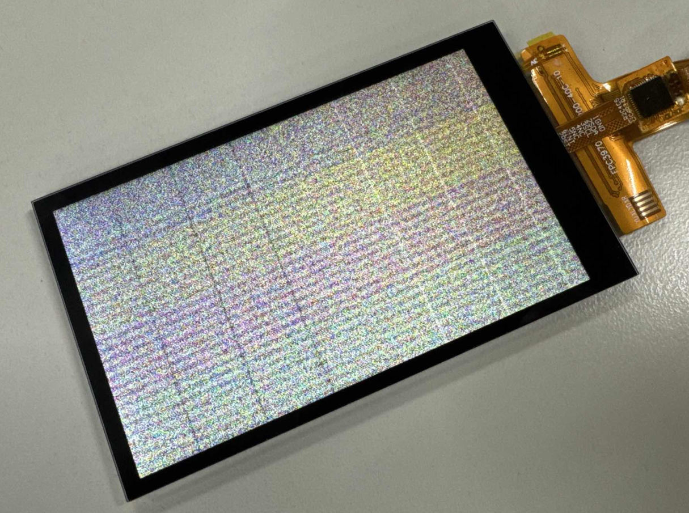

可以尝试增加开启 GRAM 写入的指令到初始化序列最后一行：

```c
sunxi_lcd_cpu_write_index_16b_8b(0, 0x2c00);
```

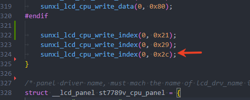

### 完整屏幕驱动

完整的屏幕驱动如下：

```c
#include "nt35510_cpu.h"

#define CPU_TRI_MODE

#define DBG_INFO(format, args...)                                              \
	(printk("[NT35510 LCD INFO] LINE:%04d-->%s:" format, __LINE__,         \
		__func__, ##args))
#define DBG_ERR(format, args...)                                               \
	(printk("[NT35510 LCD ERR] LINE:%04d-->%s:" format, __LINE__,          \
		__func__, ##args))
#define panel_reset(val) sunxi_lcd_gpio_set_value(sel, 0, val)
#define lcd_cs(val) sunxi_lcd_gpio_set_value(sel, 1, val)

static void lcd_panel_nt35510_init(u32 sel, struct disp_panel_para *info);
static void LCD_power_on(u32 sel);
static void LCD_power_off(u32 sel);
static void LCD_bl_open(u32 sel);
static void LCD_bl_close(u32 sel);

static void LCD_panel_init(u32 sel);
static void LCD_panel_exit(u32 sel);

static void LCD_cfg_panel_info(struct panel_extend_para *info)
{
#if defined(__DISP_TEMP_CODE__)
	u32 i = 0, j = 0;
	u32 items;
	u8 lcd_gamma_tbl[][2] = {
		/* {input value, corrected value} */
		{ 0, 0 },     { 15, 15 },   { 30, 30 },	  { 45, 45 },
		{ 60, 60 },   { 75, 75 },   { 90, 90 },	  { 105, 105 },
		{ 120, 120 }, { 135, 135 }, { 150, 150 }, { 165, 165 },
		{ 180, 180 }, { 195, 195 }, { 210, 210 }, { 225, 225 },
		{ 240, 240 }, { 255, 255 },
	};

	u32 lcd_cmap_tbl[2][3][4] = {
		{
			{ LCD_CMAP_G0, LCD_CMAP_B1, LCD_CMAP_G2, LCD_CMAP_B3 },
			{ LCD_CMAP_B0, LCD_CMAP_R1, LCD_CMAP_B2, LCD_CMAP_R3 },
			{ LCD_CMAP_R0, LCD_CMAP_G1, LCD_CMAP_R2, LCD_CMAP_G3 },
		},
		{
			{ LCD_CMAP_B3, LCD_CMAP_G2, LCD_CMAP_B1, LCD_CMAP_G0 },
			{ LCD_CMAP_R3, LCD_CMAP_B2, LCD_CMAP_R1, LCD_CMAP_B0 },
			{ LCD_CMAP_G3, LCD_CMAP_R2, LCD_CMAP_G1, LCD_CMAP_R0 },
		},
	};

	items = sizeof(lcd_gamma_tbl) / 2;
	for (i = 0; i < items - 1; i++) {
		u32 num = lcd_gamma_tbl[i + 1][0] - lcd_gamma_tbl[i][0];

		for (j = 0; j < num; j++) {
			u32 value = 0;
			value = lcd_gamma_tbl[i][1] +
				((lcd_gamma_tbl[i + 1][1] -
				lcd_gamma_tbl[i][1]) *
				j) / num;
			info->lcd_gamma_tbl[lcd_gamma_tbl[i][0] + j] =
				(value << 16) + (value << 8) + value;
		}
	}
	info->lcd_gamma_tbl[255] = (lcd_gamma_tbl[items - 1][1] << 16) +
				(lcd_gamma_tbl[items - 1][1] << 8) +
				lcd_gamma_tbl[items - 1][1];
	memcpy(info->lcd_cmap_tbl, lcd_cmap_tbl, sizeof(lcd_cmap_tbl));
#endif
}

static s32 LCD_open_flow(u32 sel)
{
	LCD_OPEN_FUNC(sel, LCD_power_on, 120);
#ifdef CPU_TRI_MODE
	LCD_OPEN_FUNC(sel, LCD_panel_init, 100);
	LCD_OPEN_FUNC(sel, sunxi_lcd_tcon_enable, 50);
#else
	LCD_OPEN_FUNC(sel, sunxi_lcd_tcon_enable, 100);
	LCD_OPEN_FUNC(sel, LCD_panel_init, 50);
#endif
	LCD_OPEN_FUNC(sel, LCD_bl_open, 0);

	return 0;
}

static s32 LCD_close_flow(u32 sel)
{
	LCD_CLOSE_FUNC(sel, LCD_bl_close, 20);
#ifdef CPU_TRI_MODE
	LCD_CLOSE_FUNC(sel, sunxi_lcd_tcon_disable, 10);
	LCD_CLOSE_FUNC(sel, LCD_panel_exit, 50);
#else
	LCD_CLOSE_FUNC(sel, LCD_panel_exit, 10);
	LCD_CLOSE_FUNC(sel, sunxi_lcd_tcon_disable, 10);
#endif
	LCD_CLOSE_FUNC(sel, LCD_power_off, 0);

	return 0;
}

static void LCD_power_on(u32 sel)
{
	/* config lcd_power pin to open lcd power0 */
	sunxi_lcd_power_enable(sel, 0);
	sunxi_lcd_pin_cfg(sel, 1);
}

static void LCD_power_off(u32 sel)
{
	/* lcd_cs, active low */
	lcd_cs(1);
	sunxi_lcd_delay_ms(10);
	/* lcd_rst, active hight */
	panel_reset(1);
	sunxi_lcd_delay_ms(10);

	sunxi_lcd_pin_cfg(sel, 0);
	/* config lcd_power pin to close lcd power0 */
	sunxi_lcd_power_disable(sel, 0);
}

static void LCD_bl_open(u32 sel)
{
	sunxi_lcd_pwm_enable(sel);
	/* config lcd_bl_en pin to open lcd backlight */
	sunxi_lcd_backlight_enable(sel);
}

static void LCD_bl_close(u32 sel)
{
	/* config lcd_bl_en pin to close lcd backlight */
	sunxi_lcd_backlight_disable(sel);
	sunxi_lcd_pwm_disable(sel);
}

/* static int bootup_flag = 0; */
static void LCD_panel_init(u32 sel)
{
	struct disp_panel_para *info =
		kmalloc(sizeof(struct disp_panel_para), GFP_KERNEL);

	DBG_INFO("\n");
	bsp_disp_get_panel_info(sel, info);
	lcd_panel_nt35510_init(sel, info);

	kfree(info);
	return;
}

static void LCD_panel_exit(u32 sel)
{
}

static void sunxi_lcd_cpu_write_index_16b_8b(u32 sel, u32 i)
{
	sunxi_lcd_cpu_write_index(sel, (i >> 8) & 0xFF);
	sunxi_lcd_cpu_write_index(sel, i & 0xFF);
}

static void sunxi_lcd_cpu_write_data_8b(u32 sel, u32 i)
{
	sunxi_lcd_cpu_write_data(sel, i & 0xFF);
}

static void lcd_panel_nt35510_init(u32 sel, struct disp_panel_para *info)
{
	DBG_INFO("\n");
	/* lcd_cs, active low */
	lcd_cs(0);
	sunxi_lcd_delay_ms(5);
	panel_reset(1);
	sunxi_lcd_delay_ms(20);
	panel_reset(0);
	sunxi_lcd_delay_ms(20);
	panel_reset(1);
	sunxi_lcd_delay_ms(120);
	/* NT35510SH_BOE3.97IPS_24BIT_20141224 */
	sunxi_lcd_cpu_write_index_16b_8b(0, 0xFF00);
	sunxi_lcd_cpu_write_data_8b(0, 0x00AA);
	sunxi_lcd_cpu_write_index_16b_8b(0, 0xFF01);
	sunxi_lcd_cpu_write_data_8b(0, 0x0055);
	sunxi_lcd_cpu_write_index_16b_8b(0, 0xFF02);
	sunxi_lcd_cpu_write_data_8b(0, 0x00A5);
	sunxi_lcd_cpu_write_index_16b_8b(0, 0xFF03);
	sunxi_lcd_cpu_write_data_8b(0, 0x0080);

	sunxi_lcd_cpu_write_index_16b_8b(0, 0xF200);
	sunxi_lcd_cpu_write_data_8b(0, 0x0000);
	sunxi_lcd_cpu_write_index_16b_8b(0, 0xF201);
	sunxi_lcd_cpu_write_data_8b(0, 0x0084);
	sunxi_lcd_cpu_write_index_16b_8b(0, 0xF202);
	sunxi_lcd_cpu_write_data_8b(0, 0x0008);

	sunxi_lcd_cpu_write_index_16b_8b(0, 0x6F00);
	sunxi_lcd_cpu_write_data_8b(0, 0x000A);
	sunxi_lcd_cpu_write_index_16b_8b(0, 0xF400);
	sunxi_lcd_cpu_write_data_8b(0, 0x0013);

	sunxi_lcd_cpu_write_index_16b_8b(0, 0xFF00);
	sunxi_lcd_cpu_write_data_8b(0, 0x00AA);
	sunxi_lcd_cpu_write_index_16b_8b(0, 0xFF01);
	sunxi_lcd_cpu_write_data_8b(0, 0x0055);
	sunxi_lcd_cpu_write_index_16b_8b(0, 0xFF02);
	sunxi_lcd_cpu_write_data_8b(0, 0x00A5);
	sunxi_lcd_cpu_write_index_16b_8b(0, 0xFF03);
	sunxi_lcd_cpu_write_data_8b(0, 0x0000);

	/* Enable Page 1 */
	sunxi_lcd_cpu_write_index_16b_8b(0, 0xF000);
	sunxi_lcd_cpu_write_data_8b(0, 0x0055);
	sunxi_lcd_cpu_write_index_16b_8b(0, 0xF001);
	sunxi_lcd_cpu_write_data_8b(0, 0x00AA);
	sunxi_lcd_cpu_write_index_16b_8b(0, 0xF002);
	sunxi_lcd_cpu_write_data_8b(0, 0x0052);
	sunxi_lcd_cpu_write_index_16b_8b(0, 0xF003);
	sunxi_lcd_cpu_write_data_8b(0, 0x0008);
	sunxi_lcd_cpu_write_index_16b_8b(0, 0xF004);
	sunxi_lcd_cpu_write_data_8b(0, 0x0001);

	/* AVDD Set AVDD 5.2V */
	sunxi_lcd_cpu_write_index_16b_8b(0, 0xB000);
	sunxi_lcd_cpu_write_data_8b(0, 0x000C);
	sunxi_lcd_cpu_write_index_16b_8b(0, 0xB001);
	sunxi_lcd_cpu_write_data_8b(0, 0x000C);
	sunxi_lcd_cpu_write_index_16b_8b(0, 0xB002);
	sunxi_lcd_cpu_write_data_8b(0, 0x000C);

	/* AVDD ratio */
	sunxi_lcd_cpu_write_index_16b_8b(0, 0xB600);
	sunxi_lcd_cpu_write_data_8b(0, 0x0046);
	sunxi_lcd_cpu_write_index_16b_8b(0, 0xB601);
	sunxi_lcd_cpu_write_data_8b(0, 0x0046);
	sunxi_lcd_cpu_write_index_16b_8b(0, 0xB602);
	sunxi_lcd_cpu_write_data_8b(0, 0x0046);

	/* AVEE  -5.2V */
	sunxi_lcd_cpu_write_index_16b_8b(0, 0xB100);
	sunxi_lcd_cpu_write_data_8b(0, 0x000C);
	sunxi_lcd_cpu_write_index_16b_8b(0, 0xB101);
	sunxi_lcd_cpu_write_data_8b(0, 0x000C);
	sunxi_lcd_cpu_write_index_16b_8b(0, 0xB102);
	sunxi_lcd_cpu_write_data_8b(0, 0x000C);

	/* AVEE ratio */
	sunxi_lcd_cpu_write_index_16b_8b(0, 0xB700);
	sunxi_lcd_cpu_write_data_8b(0, 0x0026);
	sunxi_lcd_cpu_write_index_16b_8b(0, 0xB701);
	sunxi_lcd_cpu_write_data_8b(0, 0x0026);
	sunxi_lcd_cpu_write_index_16b_8b(0, 0xB702);
	sunxi_lcd_cpu_write_data_8b(0, 0x0026);

	/* VCL  -2.5V */
	sunxi_lcd_cpu_write_index_16b_8b(0, 0xB200);
	sunxi_lcd_cpu_write_data_8b(0, 0x0000);
	sunxi_lcd_cpu_write_index_16b_8b(0, 0xB201);
	sunxi_lcd_cpu_write_data_8b(0, 0x0000);
	sunxi_lcd_cpu_write_index_16b_8b(0, 0xB202);
	sunxi_lcd_cpu_write_data_8b(0, 0x0000);

	/* VCL ratio */
	sunxi_lcd_cpu_write_index_16b_8b(0, 0xB800);
	sunxi_lcd_cpu_write_data_8b(0, 0x0034);
	sunxi_lcd_cpu_write_index_16b_8b(0, 0xB801);
	sunxi_lcd_cpu_write_data_8b(0, 0x0034);
	sunxi_lcd_cpu_write_index_16b_8b(0, 0xB802);
	sunxi_lcd_cpu_write_data_8b(0, 0x0034);

	/* VGH 15V  (Free pump) */
	sunxi_lcd_cpu_write_index_16b_8b(0, 0xBF00);
	sunxi_lcd_cpu_write_data_8b(0, 0x0001);
	sunxi_lcd_cpu_write_index_16b_8b(0, 0xB300);
	sunxi_lcd_cpu_write_data_8b(0, 0x0008);
	sunxi_lcd_cpu_write_index_16b_8b(0, 0xB301);
	sunxi_lcd_cpu_write_data_8b(0, 0x0008);
	sunxi_lcd_cpu_write_index_16b_8b(0, 0xB302);
	sunxi_lcd_cpu_write_data_8b(0, 0x0008);

	/* VGH ratio */
	sunxi_lcd_cpu_write_index_16b_8b(0, 0xB900);
	sunxi_lcd_cpu_write_data_8b(0, 0x0026);
	sunxi_lcd_cpu_write_index_16b_8b(0, 0xB901);
	sunxi_lcd_cpu_write_data_8b(0, 0x0026);
	sunxi_lcd_cpu_write_index_16b_8b(0, 0xB902);
	sunxi_lcd_cpu_write_data_8b(0, 0x0026);

	/* VGL_REG -10V */
	sunxi_lcd_cpu_write_index_16b_8b(0, 0xB500);
	sunxi_lcd_cpu_write_data_8b(0, 0x0008);
	sunxi_lcd_cpu_write_index_16b_8b(0, 0xB501);
	sunxi_lcd_cpu_write_data_8b(0, 0x0008);
	sunxi_lcd_cpu_write_index_16b_8b(0, 0xB502);
	sunxi_lcd_cpu_write_data_8b(0, 0x0008);

	/* sunxi_lcd_cpu_write_index_16b_8b(0, 0xC200);sunxi_lcd_cpu_write_data_8b(0, 0x0003); */

	/* VGLX ratio */
	sunxi_lcd_cpu_write_index_16b_8b(0, 0xBA00);
	sunxi_lcd_cpu_write_data_8b(0, 0x0036);
	sunxi_lcd_cpu_write_index_16b_8b(0, 0xBA01);
	sunxi_lcd_cpu_write_data_8b(0, 0x0036);
	sunxi_lcd_cpu_write_index_16b_8b(0, 0xBA02);
	sunxi_lcd_cpu_write_data_8b(0, 0x0036);

	/* VGMP/VGSP 4.5V/0V */
	sunxi_lcd_cpu_write_index_16b_8b(0, 0xBC00);
	sunxi_lcd_cpu_write_data_8b(0, 0x0000);
	sunxi_lcd_cpu_write_index_16b_8b(0, 0xBC01);
	sunxi_lcd_cpu_write_data_8b(0, 0x0080);
	sunxi_lcd_cpu_write_index_16b_8b(0, 0xBC02);
	sunxi_lcd_cpu_write_data_8b(0, 0x0000);

	/* VGMN/VGSN -4.5V/0V */
	sunxi_lcd_cpu_write_index_16b_8b(0, 0xBD00);
	sunxi_lcd_cpu_write_data_8b(0, 0x0000);
	sunxi_lcd_cpu_write_index_16b_8b(0, 0xBD01);
	sunxi_lcd_cpu_write_data_8b(0, 0x0080);
	sunxi_lcd_cpu_write_index_16b_8b(0, 0xBD02);
	sunxi_lcd_cpu_write_data_8b(0, 0x0000);

	/* VCOM */
	sunxi_lcd_cpu_write_index_16b_8b(0, 0xBE00);
	sunxi_lcd_cpu_write_data_8b(0, 0x0000);
	sunxi_lcd_cpu_write_index_16b_8b(0, 0xBE01);
	sunxi_lcd_cpu_write_data_8b(0, 0x0055); /*  6A */

	/* Gamma Setting */
	sunxi_lcd_cpu_write_index_16b_8b(0, 0xD100);
	sunxi_lcd_cpu_write_data_8b(0, 0x0000);
	sunxi_lcd_cpu_write_index_16b_8b(0, 0xD101);
	sunxi_lcd_cpu_write_data_8b(0, 0x0001);
	sunxi_lcd_cpu_write_index_16b_8b(0, 0xD102);
	sunxi_lcd_cpu_write_data_8b(0, 0x0000);
	sunxi_lcd_cpu_write_index_16b_8b(0, 0xD103);
	sunxi_lcd_cpu_write_data_8b(0, 0x001C);
	sunxi_lcd_cpu_write_index_16b_8b(0, 0xD104);
	sunxi_lcd_cpu_write_data_8b(0, 0x0000);
	sunxi_lcd_cpu_write_index_16b_8b(0, 0xD105);
	sunxi_lcd_cpu_write_data_8b(0, 0x004E);
	sunxi_lcd_cpu_write_index_16b_8b(0, 0xD106);
	sunxi_lcd_cpu_write_data_8b(0, 0x0000);
	sunxi_lcd_cpu_write_index_16b_8b(0, 0xD107);
	sunxi_lcd_cpu_write_data_8b(0, 0x006A);
	sunxi_lcd_cpu_write_index_16b_8b(0, 0xD108);
	sunxi_lcd_cpu_write_data_8b(0, 0x0000);
	sunxi_lcd_cpu_write_index_16b_8b(0, 0xD109);
	sunxi_lcd_cpu_write_data_8b(0, 0x0085);
	sunxi_lcd_cpu_write_index_16b_8b(0, 0xD10A);
	sunxi_lcd_cpu_write_data_8b(0, 0x0000);
	sunxi_lcd_cpu_write_index_16b_8b(0, 0xD10B);
	sunxi_lcd_cpu_write_data_8b(0, 0x00AB);
	sunxi_lcd_cpu_write_index_16b_8b(0, 0xD10C);
	sunxi_lcd_cpu_write_data_8b(0, 0x0000);
	sunxi_lcd_cpu_write_index_16b_8b(0, 0xD10D);
	sunxi_lcd_cpu_write_data_8b(0, 0x00C4);
	sunxi_lcd_cpu_write_index_16b_8b(0, 0xD10E);
	sunxi_lcd_cpu_write_data_8b(0, 0x0000);
	sunxi_lcd_cpu_write_index_16b_8b(0, 0xD10F);
	sunxi_lcd_cpu_write_data_8b(0, 0x00FC);
	sunxi_lcd_cpu_write_index_16b_8b(0, 0xD110);
	sunxi_lcd_cpu_write_data_8b(0, 0x0001);
	sunxi_lcd_cpu_write_index_16b_8b(0, 0xD111);
	sunxi_lcd_cpu_write_data_8b(0, 0x0023);
	sunxi_lcd_cpu_write_index_16b_8b(0, 0xD112);
	sunxi_lcd_cpu_write_data_8b(0, 0x0001);
	sunxi_lcd_cpu_write_index_16b_8b(0, 0xD113);
	sunxi_lcd_cpu_write_data_8b(0, 0x0061);
	sunxi_lcd_cpu_write_index_16b_8b(0, 0xD114);
	sunxi_lcd_cpu_write_data_8b(0, 0x0001);
	sunxi_lcd_cpu_write_index_16b_8b(0, 0xD115);
	sunxi_lcd_cpu_write_data_8b(0, 0x0094);
	sunxi_lcd_cpu_write_index_16b_8b(0, 0xD116);
	sunxi_lcd_cpu_write_data_8b(0, 0x0001);
	sunxi_lcd_cpu_write_index_16b_8b(0, 0xD117);
	sunxi_lcd_cpu_write_data_8b(0, 0x00E4);
	sunxi_lcd_cpu_write_index_16b_8b(0, 0xD118);
	sunxi_lcd_cpu_write_data_8b(0, 0x0002);
	sunxi_lcd_cpu_write_index_16b_8b(0, 0xD119);
	sunxi_lcd_cpu_write_data_8b(0, 0x0027);
	sunxi_lcd_cpu_write_index_16b_8b(0, 0xD11A);
	sunxi_lcd_cpu_write_data_8b(0, 0x0002);
	sunxi_lcd_cpu_write_index_16b_8b(0, 0xD11B);
	sunxi_lcd_cpu_write_data_8b(0, 0x0029);
	sunxi_lcd_cpu_write_index_16b_8b(0, 0xD11C);
	sunxi_lcd_cpu_write_data_8b(0, 0x0002);
	sunxi_lcd_cpu_write_index_16b_8b(0, 0xD11D);
	sunxi_lcd_cpu_write_data_8b(0, 0x0065);
	sunxi_lcd_cpu_write_index_16b_8b(0, 0xD11E);
	sunxi_lcd_cpu_write_data_8b(0, 0x0002);
	sunxi_lcd_cpu_write_index_16b_8b(0, 0xD11F);
	sunxi_lcd_cpu_write_data_8b(0, 0x00A6);
	sunxi_lcd_cpu_write_index_16b_8b(0, 0xD120);
	sunxi_lcd_cpu_write_data_8b(0, 0x0002);
	sunxi_lcd_cpu_write_index_16b_8b(0, 0xD121);
	sunxi_lcd_cpu_write_data_8b(0, 0x00CA);
	sunxi_lcd_cpu_write_index_16b_8b(0, 0xD122);
	sunxi_lcd_cpu_write_data_8b(0, 0x0002);
	sunxi_lcd_cpu_write_index_16b_8b(0, 0xD123);
	sunxi_lcd_cpu_write_data_8b(0, 0x00FD);
	sunxi_lcd_cpu_write_index_16b_8b(0, 0xD124);
	sunxi_lcd_cpu_write_data_8b(0, 0x0003);
	sunxi_lcd_cpu_write_index_16b_8b(0, 0xD125);
	sunxi_lcd_cpu_write_data_8b(0, 0x001D);
	sunxi_lcd_cpu_write_index_16b_8b(0, 0xD126);
	sunxi_lcd_cpu_write_data_8b(0, 0x0003);
	sunxi_lcd_cpu_write_index_16b_8b(0, 0xD127);
	sunxi_lcd_cpu_write_data_8b(0, 0x004D);
	sunxi_lcd_cpu_write_index_16b_8b(0, 0xD128);
	sunxi_lcd_cpu_write_data_8b(0, 0x0003);
	sunxi_lcd_cpu_write_index_16b_8b(0, 0xD129);
	sunxi_lcd_cpu_write_data_8b(0, 0x006A);
	sunxi_lcd_cpu_write_index_16b_8b(0, 0xD12A);
	sunxi_lcd_cpu_write_data_8b(0, 0x0003);
	sunxi_lcd_cpu_write_index_16b_8b(0, 0xD12B);
	sunxi_lcd_cpu_write_data_8b(0, 0x0095);
	sunxi_lcd_cpu_write_index_16b_8b(0, 0xD12C);
	sunxi_lcd_cpu_write_data_8b(0, 0x0003);
	sunxi_lcd_cpu_write_index_16b_8b(0, 0xD12D);
	sunxi_lcd_cpu_write_data_8b(0, 0x00AC);
	sunxi_lcd_cpu_write_index_16b_8b(0, 0xD12E);
	sunxi_lcd_cpu_write_data_8b(0, 0x0003);
	sunxi_lcd_cpu_write_index_16b_8b(0, 0xD12F);
	sunxi_lcd_cpu_write_data_8b(0, 0x00CB);
	sunxi_lcd_cpu_write_index_16b_8b(0, 0xD130);
	sunxi_lcd_cpu_write_data_8b(0, 0x0003);
	sunxi_lcd_cpu_write_index_16b_8b(0, 0xD131);
	sunxi_lcd_cpu_write_data_8b(0, 0x00EA);
	sunxi_lcd_cpu_write_index_16b_8b(0, 0xD132);
	sunxi_lcd_cpu_write_data_8b(0, 0x0003);
	sunxi_lcd_cpu_write_index_16b_8b(0, 0xD133);
	sunxi_lcd_cpu_write_data_8b(0, 0x00EF);

	sunxi_lcd_cpu_write_index_16b_8b(0, 0xD200);
	sunxi_lcd_cpu_write_data_8b(0, 0x0000);
	sunxi_lcd_cpu_write_index_16b_8b(0, 0xD201);
	sunxi_lcd_cpu_write_data_8b(0, 0x0001);
	sunxi_lcd_cpu_write_index_16b_8b(0, 0xD202);
	sunxi_lcd_cpu_write_data_8b(0, 0x0000);
	sunxi_lcd_cpu_write_index_16b_8b(0, 0xD203);
	sunxi_lcd_cpu_write_data_8b(0, 0x001C);
	sunxi_lcd_cpu_write_index_16b_8b(0, 0xD204);
	sunxi_lcd_cpu_write_data_8b(0, 0x0000);
	sunxi_lcd_cpu_write_index_16b_8b(0, 0xD205);
	sunxi_lcd_cpu_write_data_8b(0, 0x004E);
	sunxi_lcd_cpu_write_index_16b_8b(0, 0xD206);
	sunxi_lcd_cpu_write_data_8b(0, 0x0000);
	sunxi_lcd_cpu_write_index_16b_8b(0, 0xD207);
	sunxi_lcd_cpu_write_data_8b(0, 0x006A);
	sunxi_lcd_cpu_write_index_16b_8b(0, 0xD208);
	sunxi_lcd_cpu_write_data_8b(0, 0x0000);
	sunxi_lcd_cpu_write_index_16b_8b(0, 0xD209);
	sunxi_lcd_cpu_write_data_8b(0, 0x0085);
	sunxi_lcd_cpu_write_index_16b_8b(0, 0xD20A);
	sunxi_lcd_cpu_write_data_8b(0, 0x0000);
	sunxi_lcd_cpu_write_index_16b_8b(0, 0xD20B);
	sunxi_lcd_cpu_write_data_8b(0, 0x00AB);
	sunxi_lcd_cpu_write_index_16b_8b(0, 0xD20C);
	sunxi_lcd_cpu_write_data_8b(0, 0x0000);
	sunxi_lcd_cpu_write_index_16b_8b(0, 0xD20D);
	sunxi_lcd_cpu_write_data_8b(0, 0x00C4);
	sunxi_lcd_cpu_write_index_16b_8b(0, 0xD20E);
	sunxi_lcd_cpu_write_data_8b(0, 0x0000);
	sunxi_lcd_cpu_write_index_16b_8b(0, 0xD20F);
	sunxi_lcd_cpu_write_data_8b(0, 0x00FC);
	sunxi_lcd_cpu_write_index_16b_8b(0, 0xD210);
	sunxi_lcd_cpu_write_data_8b(0, 0x0001);
	sunxi_lcd_cpu_write_index_16b_8b(0, 0xD211);
	sunxi_lcd_cpu_write_data_8b(0, 0x0023);
	sunxi_lcd_cpu_write_index_16b_8b(0, 0xD212);
	sunxi_lcd_cpu_write_data_8b(0, 0x0001);
	sunxi_lcd_cpu_write_index_16b_8b(0, 0xD213);
	sunxi_lcd_cpu_write_data_8b(0, 0x0061);
	sunxi_lcd_cpu_write_index_16b_8b(0, 0xD214);
	sunxi_lcd_cpu_write_data_8b(0, 0x0001);
	sunxi_lcd_cpu_write_index_16b_8b(0, 0xD215);
	sunxi_lcd_cpu_write_data_8b(0, 0x0094);
	sunxi_lcd_cpu_write_index_16b_8b(0, 0xD216);
	sunxi_lcd_cpu_write_data_8b(0, 0x0001);
	sunxi_lcd_cpu_write_index_16b_8b(0, 0xD217);
	sunxi_lcd_cpu_write_data_8b(0, 0x00E4);
	sunxi_lcd_cpu_write_index_16b_8b(0, 0xD218);
	sunxi_lcd_cpu_write_data_8b(0, 0x0002);
	sunxi_lcd_cpu_write_index_16b_8b(0, 0xD219);
	sunxi_lcd_cpu_write_data_8b(0, 0x0027);
	sunxi_lcd_cpu_write_index_16b_8b(0, 0xD21A);
	sunxi_lcd_cpu_write_data_8b(0, 0x0002);
	sunxi_lcd_cpu_write_index_16b_8b(0, 0xD21B);
	sunxi_lcd_cpu_write_data_8b(0, 0x0029);
	sunxi_lcd_cpu_write_index_16b_8b(0, 0xD21C);
	sunxi_lcd_cpu_write_data_8b(0, 0x0002);
	sunxi_lcd_cpu_write_index_16b_8b(0, 0xD21D);
	sunxi_lcd_cpu_write_data_8b(0, 0x0065);
	sunxi_lcd_cpu_write_index_16b_8b(0, 0xD21E);
	sunxi_lcd_cpu_write_data_8b(0, 0x0002);
	sunxi_lcd_cpu_write_index_16b_8b(0, 0xD21F);
	sunxi_lcd_cpu_write_data_8b(0, 0x00A6);
	sunxi_lcd_cpu_write_index_16b_8b(0, 0xD220);
	sunxi_lcd_cpu_write_data_8b(0, 0x0002);
	sunxi_lcd_cpu_write_index_16b_8b(0, 0xD221);
	sunxi_lcd_cpu_write_data_8b(0, 0x00CA);
	sunxi_lcd_cpu_write_index_16b_8b(0, 0xD222);
	sunxi_lcd_cpu_write_data_8b(0, 0x0002);
	sunxi_lcd_cpu_write_index_16b_8b(0, 0xD223);
	sunxi_lcd_cpu_write_data_8b(0, 0x00FD);
	sunxi_lcd_cpu_write_index_16b_8b(0, 0xD224);
	sunxi_lcd_cpu_write_data_8b(0, 0x0003);
	sunxi_lcd_cpu_write_index_16b_8b(0, 0xD225);
	sunxi_lcd_cpu_write_data_8b(0, 0x001D);
	sunxi_lcd_cpu_write_index_16b_8b(0, 0xD226);
	sunxi_lcd_cpu_write_data_8b(0, 0x0003);
	sunxi_lcd_cpu_write_index_16b_8b(0, 0xD227);
	sunxi_lcd_cpu_write_data_8b(0, 0x004D);
	sunxi_lcd_cpu_write_index_16b_8b(0, 0xD228);
	sunxi_lcd_cpu_write_data_8b(0, 0x0003);
	sunxi_lcd_cpu_write_index_16b_8b(0, 0xD229);
	sunxi_lcd_cpu_write_data_8b(0, 0x006A);
	sunxi_lcd_cpu_write_index_16b_8b(0, 0xD22A);
	sunxi_lcd_cpu_write_data_8b(0, 0x0003);
	sunxi_lcd_cpu_write_index_16b_8b(0, 0xD22B);
	sunxi_lcd_cpu_write_data_8b(0, 0x0095);
	sunxi_lcd_cpu_write_index_16b_8b(0, 0xD22C);
	sunxi_lcd_cpu_write_data_8b(0, 0x0003);
	sunxi_lcd_cpu_write_index_16b_8b(0, 0xD22D);
	sunxi_lcd_cpu_write_data_8b(0, 0x00AC);
	sunxi_lcd_cpu_write_index_16b_8b(0, 0xD22E);
	sunxi_lcd_cpu_write_data_8b(0, 0x0003);
	sunxi_lcd_cpu_write_index_16b_8b(0, 0xD22F);
	sunxi_lcd_cpu_write_data_8b(0, 0x00CB);
	sunxi_lcd_cpu_write_index_16b_8b(0, 0xD230);
	sunxi_lcd_cpu_write_data_8b(0, 0x0003);
	sunxi_lcd_cpu_write_index_16b_8b(0, 0xD231);
	sunxi_lcd_cpu_write_data_8b(0, 0x00EA);
	sunxi_lcd_cpu_write_index_16b_8b(0, 0xD232);
	sunxi_lcd_cpu_write_data_8b(0, 0x0003);
	sunxi_lcd_cpu_write_index_16b_8b(0, 0xD233);
	sunxi_lcd_cpu_write_data_8b(0, 0x00EF);

	sunxi_lcd_cpu_write_index_16b_8b(0, 0xD300);
	sunxi_lcd_cpu_write_data_8b(0, 0x0000);
	sunxi_lcd_cpu_write_index_16b_8b(0, 0xD301);
	sunxi_lcd_cpu_write_data_8b(0, 0x0001);
	sunxi_lcd_cpu_write_index_16b_8b(0, 0xD302);
	sunxi_lcd_cpu_write_data_8b(0, 0x0000);
	sunxi_lcd_cpu_write_index_16b_8b(0, 0xD303);
	sunxi_lcd_cpu_write_data_8b(0, 0x001C);
	sunxi_lcd_cpu_write_index_16b_8b(0, 0xD304);
	sunxi_lcd_cpu_write_data_8b(0, 0x0000);
	sunxi_lcd_cpu_write_index_16b_8b(0, 0xD305);
	sunxi_lcd_cpu_write_data_8b(0, 0x004E);
	sunxi_lcd_cpu_write_index_16b_8b(0, 0xD306);
	sunxi_lcd_cpu_write_data_8b(0, 0x0000);
	sunxi_lcd_cpu_write_index_16b_8b(0, 0xD307);
	sunxi_lcd_cpu_write_data_8b(0, 0x006A);
	sunxi_lcd_cpu_write_index_16b_8b(0, 0xD308);
	sunxi_lcd_cpu_write_data_8b(0, 0x0000);
	sunxi_lcd_cpu_write_index_16b_8b(0, 0xD309);
	sunxi_lcd_cpu_write_data_8b(0, 0x0085);
	sunxi_lcd_cpu_write_index_16b_8b(0, 0xD30A);
	sunxi_lcd_cpu_write_data_8b(0, 0x0000);
	sunxi_lcd_cpu_write_index_16b_8b(0, 0xD30B);
	sunxi_lcd_cpu_write_data_8b(0, 0x00AB);
	sunxi_lcd_cpu_write_index_16b_8b(0, 0xD30C);
	sunxi_lcd_cpu_write_data_8b(0, 0x0000);
	sunxi_lcd_cpu_write_index_16b_8b(0, 0xD30D);
	sunxi_lcd_cpu_write_data_8b(0, 0x00C4);
	sunxi_lcd_cpu_write_index_16b_8b(0, 0xD30E);
	sunxi_lcd_cpu_write_data_8b(0, 0x0000);
	sunxi_lcd_cpu_write_index_16b_8b(0, 0xD30F);
	sunxi_lcd_cpu_write_data_8b(0, 0x00FC);
	sunxi_lcd_cpu_write_index_16b_8b(0, 0xD310);
	sunxi_lcd_cpu_write_data_8b(0, 0x0001);
	sunxi_lcd_cpu_write_index_16b_8b(0, 0xD311);
	sunxi_lcd_cpu_write_data_8b(0, 0x0023);
	sunxi_lcd_cpu_write_index_16b_8b(0, 0xD312);
	sunxi_lcd_cpu_write_data_8b(0, 0x0001);
	sunxi_lcd_cpu_write_index_16b_8b(0, 0xD313);
	sunxi_lcd_cpu_write_data_8b(0, 0x0061);
	sunxi_lcd_cpu_write_index_16b_8b(0, 0xD314);
	sunxi_lcd_cpu_write_data_8b(0, 0x0001);
	sunxi_lcd_cpu_write_index_16b_8b(0, 0xD315);
	sunxi_lcd_cpu_write_data_8b(0, 0x0094);
	sunxi_lcd_cpu_write_index_16b_8b(0, 0xD316);
	sunxi_lcd_cpu_write_data_8b(0, 0x0001);
	sunxi_lcd_cpu_write_index_16b_8b(0, 0xD317);
	sunxi_lcd_cpu_write_data_8b(0, 0x00E4);
	sunxi_lcd_cpu_write_index_16b_8b(0, 0xD318);
	sunxi_lcd_cpu_write_data_8b(0, 0x0002);
	sunxi_lcd_cpu_write_index_16b_8b(0, 0xD319);
	sunxi_lcd_cpu_write_data_8b(0, 0x0027);
	sunxi_lcd_cpu_write_index_16b_8b(0, 0xD31A);
	sunxi_lcd_cpu_write_data_8b(0, 0x0002);
	sunxi_lcd_cpu_write_index_16b_8b(0, 0xD31B);
	sunxi_lcd_cpu_write_data_8b(0, 0x0029);
	sunxi_lcd_cpu_write_index_16b_8b(0, 0xD31C);
	sunxi_lcd_cpu_write_data_8b(0, 0x0002);
	sunxi_lcd_cpu_write_index_16b_8b(0, 0xD31D);
	sunxi_lcd_cpu_write_data_8b(0, 0x0065);
	sunxi_lcd_cpu_write_index_16b_8b(0, 0xD31E);
	sunxi_lcd_cpu_write_data_8b(0, 0x0002);
	sunxi_lcd_cpu_write_index_16b_8b(0, 0xD31F);
	sunxi_lcd_cpu_write_data_8b(0, 0x00A6);
	sunxi_lcd_cpu_write_index_16b_8b(0, 0xD320);
	sunxi_lcd_cpu_write_data_8b(0, 0x0002);
	sunxi_lcd_cpu_write_index_16b_8b(0, 0xD321);
	sunxi_lcd_cpu_write_data_8b(0, 0x00CA);
	sunxi_lcd_cpu_write_index_16b_8b(0, 0xD322);
	sunxi_lcd_cpu_write_data_8b(0, 0x0002);
	sunxi_lcd_cpu_write_index_16b_8b(0, 0xD323);
	sunxi_lcd_cpu_write_data_8b(0, 0x00FD);
	sunxi_lcd_cpu_write_index_16b_8b(0, 0xD324);
	sunxi_lcd_cpu_write_data_8b(0, 0x0003);
	sunxi_lcd_cpu_write_index_16b_8b(0, 0xD325);
	sunxi_lcd_cpu_write_data_8b(0, 0x001D);
	sunxi_lcd_cpu_write_index_16b_8b(0, 0xD326);
	sunxi_lcd_cpu_write_data_8b(0, 0x0003);
	sunxi_lcd_cpu_write_index_16b_8b(0, 0xD327);
	sunxi_lcd_cpu_write_data_8b(0, 0x004D);
	sunxi_lcd_cpu_write_index_16b_8b(0, 0xD328);
	sunxi_lcd_cpu_write_data_8b(0, 0x0003);
	sunxi_lcd_cpu_write_index_16b_8b(0, 0xD329);
	sunxi_lcd_cpu_write_data_8b(0, 0x006A);
	sunxi_lcd_cpu_write_index_16b_8b(0, 0xD32A);
	sunxi_lcd_cpu_write_data_8b(0, 0x0003);
	sunxi_lcd_cpu_write_index_16b_8b(0, 0xD32B);
	sunxi_lcd_cpu_write_data_8b(0, 0x0095);
	sunxi_lcd_cpu_write_index_16b_8b(0, 0xD32C);
	sunxi_lcd_cpu_write_data_8b(0, 0x0003);
	sunxi_lcd_cpu_write_index_16b_8b(0, 0xD32D);
	sunxi_lcd_cpu_write_data_8b(0, 0x00AC);
	sunxi_lcd_cpu_write_index_16b_8b(0, 0xD32E);
	sunxi_lcd_cpu_write_data_8b(0, 0x0003);
	sunxi_lcd_cpu_write_index_16b_8b(0, 0xD32F);
	sunxi_lcd_cpu_write_data_8b(0, 0x00CB);
	sunxi_lcd_cpu_write_index_16b_8b(0, 0xD330);
	sunxi_lcd_cpu_write_data_8b(0, 0x0003);
	sunxi_lcd_cpu_write_index_16b_8b(0, 0xD331);
	sunxi_lcd_cpu_write_data_8b(0, 0x00EA);
	sunxi_lcd_cpu_write_index_16b_8b(0, 0xD332);
	sunxi_lcd_cpu_write_data_8b(0, 0x0003);
	sunxi_lcd_cpu_write_index_16b_8b(0, 0xD333);
	sunxi_lcd_cpu_write_data_8b(0, 0x00EF);

	sunxi_lcd_cpu_write_index_16b_8b(0, 0xD400);
	sunxi_lcd_cpu_write_data_8b(0, 0x0000);
	sunxi_lcd_cpu_write_index_16b_8b(0, 0xD401);
	sunxi_lcd_cpu_write_data_8b(0, 0x0001);
	sunxi_lcd_cpu_write_index_16b_8b(0, 0xD402);
	sunxi_lcd_cpu_write_data_8b(0, 0x0000);
	sunxi_lcd_cpu_write_index_16b_8b(0, 0xD403);
	sunxi_lcd_cpu_write_data_8b(0, 0x001C);
	sunxi_lcd_cpu_write_index_16b_8b(0, 0xD404);
	sunxi_lcd_cpu_write_data_8b(0, 0x0000);
	sunxi_lcd_cpu_write_index_16b_8b(0, 0xD405);
	sunxi_lcd_cpu_write_data_8b(0, 0x004E);
	sunxi_lcd_cpu_write_index_16b_8b(0, 0xD406);
	sunxi_lcd_cpu_write_data_8b(0, 0x0000);
	sunxi_lcd_cpu_write_index_16b_8b(0, 0xD407);
	sunxi_lcd_cpu_write_data_8b(0, 0x006A);
	sunxi_lcd_cpu_write_index_16b_8b(0, 0xD408);
	sunxi_lcd_cpu_write_data_8b(0, 0x0000);
	sunxi_lcd_cpu_write_index_16b_8b(0, 0xD409);
	sunxi_lcd_cpu_write_data_8b(0, 0x0085);
	sunxi_lcd_cpu_write_index_16b_8b(0, 0xD40A);
	sunxi_lcd_cpu_write_data_8b(0, 0x0000);
	sunxi_lcd_cpu_write_index_16b_8b(0, 0xD40B);
	sunxi_lcd_cpu_write_data_8b(0, 0x00AB);
	sunxi_lcd_cpu_write_index_16b_8b(0, 0xD40C);
	sunxi_lcd_cpu_write_data_8b(0, 0x0000);
	sunxi_lcd_cpu_write_index_16b_8b(0, 0xD40D);
	sunxi_lcd_cpu_write_data_8b(0, 0x00C4);
	sunxi_lcd_cpu_write_index_16b_8b(0, 0xD40E);
	sunxi_lcd_cpu_write_data_8b(0, 0x0000);
	sunxi_lcd_cpu_write_index_16b_8b(0, 0xD40F);
	sunxi_lcd_cpu_write_data_8b(0, 0x00FC);
	sunxi_lcd_cpu_write_index_16b_8b(0, 0xD410);
	sunxi_lcd_cpu_write_data_8b(0, 0x0001);
	sunxi_lcd_cpu_write_index_16b_8b(0, 0xD411);
	sunxi_lcd_cpu_write_data_8b(0, 0x0023);
	sunxi_lcd_cpu_write_index_16b_8b(0, 0xD412);
	sunxi_lcd_cpu_write_data_8b(0, 0x0001);
	sunxi_lcd_cpu_write_index_16b_8b(0, 0xD413);
	sunxi_lcd_cpu_write_data_8b(0, 0x0061);
	sunxi_lcd_cpu_write_index_16b_8b(0, 0xD414);
	sunxi_lcd_cpu_write_data_8b(0, 0x0001);
	sunxi_lcd_cpu_write_index_16b_8b(0, 0xD415);
	sunxi_lcd_cpu_write_data_8b(0, 0x0094);
	sunxi_lcd_cpu_write_index_16b_8b(0, 0xD416);
	sunxi_lcd_cpu_write_data_8b(0, 0x0001);
	sunxi_lcd_cpu_write_index_16b_8b(0, 0xD417);
	sunxi_lcd_cpu_write_data_8b(0, 0x00E4);
	sunxi_lcd_cpu_write_index_16b_8b(0, 0xD418);
	sunxi_lcd_cpu_write_data_8b(0, 0x0002);
	sunxi_lcd_cpu_write_index_16b_8b(0, 0xD419);
	sunxi_lcd_cpu_write_data_8b(0, 0x0027);
	sunxi_lcd_cpu_write_index_16b_8b(0, 0xD41A);
	sunxi_lcd_cpu_write_data_8b(0, 0x0002);
	sunxi_lcd_cpu_write_index_16b_8b(0, 0xD41B);
	sunxi_lcd_cpu_write_data_8b(0, 0x0029);
	sunxi_lcd_cpu_write_index_16b_8b(0, 0xD41C);
	sunxi_lcd_cpu_write_data_8b(0, 0x0002);
	sunxi_lcd_cpu_write_index_16b_8b(0, 0xD41D);
	sunxi_lcd_cpu_write_data_8b(0, 0x0065);
	sunxi_lcd_cpu_write_index_16b_8b(0, 0xD41E);
	sunxi_lcd_cpu_write_data_8b(0, 0x0002);
	sunxi_lcd_cpu_write_index_16b_8b(0, 0xD41F);
	sunxi_lcd_cpu_write_data_8b(0, 0x00A6);
	sunxi_lcd_cpu_write_index_16b_8b(0, 0xD420);
	sunxi_lcd_cpu_write_data_8b(0, 0x0002);
	sunxi_lcd_cpu_write_index_16b_8b(0, 0xD421);
	sunxi_lcd_cpu_write_data_8b(0, 0x00CA);
	sunxi_lcd_cpu_write_index_16b_8b(0, 0xD422);
	sunxi_lcd_cpu_write_data_8b(0, 0x0002);
	sunxi_lcd_cpu_write_index_16b_8b(0, 0xD423);
	sunxi_lcd_cpu_write_data_8b(0, 0x00FD);
	sunxi_lcd_cpu_write_index_16b_8b(0, 0xD424);
	sunxi_lcd_cpu_write_data_8b(0, 0x0003);
	sunxi_lcd_cpu_write_index_16b_8b(0, 0xD425);
	sunxi_lcd_cpu_write_data_8b(0, 0x001D);
	sunxi_lcd_cpu_write_index_16b_8b(0, 0xD426);
	sunxi_lcd_cpu_write_data_8b(0, 0x0003);
	sunxi_lcd_cpu_write_index_16b_8b(0, 0xD427);
	sunxi_lcd_cpu_write_data_8b(0, 0x004D);
	sunxi_lcd_cpu_write_index_16b_8b(0, 0xD428);
	sunxi_lcd_cpu_write_data_8b(0, 0x0003);
	sunxi_lcd_cpu_write_index_16b_8b(0, 0xD429);
	sunxi_lcd_cpu_write_data_8b(0, 0x006A);
	sunxi_lcd_cpu_write_index_16b_8b(0, 0xD42A);
	sunxi_lcd_cpu_write_data_8b(0, 0x0003);
	sunxi_lcd_cpu_write_index_16b_8b(0, 0xD42B);
	sunxi_lcd_cpu_write_data_8b(0, 0x0095);
	sunxi_lcd_cpu_write_index_16b_8b(0, 0xD42C);
	sunxi_lcd_cpu_write_data_8b(0, 0x0003);
	sunxi_lcd_cpu_write_index_16b_8b(0, 0xD42D);
	sunxi_lcd_cpu_write_data_8b(0, 0x00AC);
	sunxi_lcd_cpu_write_index_16b_8b(0, 0xD42E);
	sunxi_lcd_cpu_write_data_8b(0, 0x0003);
	sunxi_lcd_cpu_write_index_16b_8b(0, 0xD42F);
	sunxi_lcd_cpu_write_data_8b(0, 0x00CB);
	sunxi_lcd_cpu_write_index_16b_8b(0, 0xD430);
	sunxi_lcd_cpu_write_data_8b(0, 0x0003);
	sunxi_lcd_cpu_write_index_16b_8b(0, 0xD431);
	sunxi_lcd_cpu_write_data_8b(0, 0x00EA);
	sunxi_lcd_cpu_write_index_16b_8b(0, 0xD432);
	sunxi_lcd_cpu_write_data_8b(0, 0x0003);
	sunxi_lcd_cpu_write_index_16b_8b(0, 0xD433);
	sunxi_lcd_cpu_write_data_8b(0, 0x00EF);

	sunxi_lcd_cpu_write_index_16b_8b(0, 0xD500);
	sunxi_lcd_cpu_write_data_8b(0, 0x0000);
	sunxi_lcd_cpu_write_index_16b_8b(0, 0xD501);
	sunxi_lcd_cpu_write_data_8b(0, 0x0001);
	sunxi_lcd_cpu_write_index_16b_8b(0, 0xD502);
	sunxi_lcd_cpu_write_data_8b(0, 0x0000);
	sunxi_lcd_cpu_write_index_16b_8b(0, 0xD503);
	sunxi_lcd_cpu_write_data_8b(0, 0x001C);
	sunxi_lcd_cpu_write_index_16b_8b(0, 0xD504);
	sunxi_lcd_cpu_write_data_8b(0, 0x0000);
	sunxi_lcd_cpu_write_index_16b_8b(0, 0xD505);
	sunxi_lcd_cpu_write_data_8b(0, 0x004E);
	sunxi_lcd_cpu_write_index_16b_8b(0, 0xD506);
	sunxi_lcd_cpu_write_data_8b(0, 0x0000);
	sunxi_lcd_cpu_write_index_16b_8b(0, 0xD507);
	sunxi_lcd_cpu_write_data_8b(0, 0x006A);
	sunxi_lcd_cpu_write_index_16b_8b(0, 0xD508);
	sunxi_lcd_cpu_write_data_8b(0, 0x0000);
	sunxi_lcd_cpu_write_index_16b_8b(0, 0xD509);
	sunxi_lcd_cpu_write_data_8b(0, 0x0085);
	sunxi_lcd_cpu_write_index_16b_8b(0, 0xD50A);
	sunxi_lcd_cpu_write_data_8b(0, 0x0000);
	sunxi_lcd_cpu_write_index_16b_8b(0, 0xD50B);
	sunxi_lcd_cpu_write_data_8b(0, 0x00AB);
	sunxi_lcd_cpu_write_index_16b_8b(0, 0xD50C);
	sunxi_lcd_cpu_write_data_8b(0, 0x0000);
	sunxi_lcd_cpu_write_index_16b_8b(0, 0xD50D);
	sunxi_lcd_cpu_write_data_8b(0, 0x00C4);
	sunxi_lcd_cpu_write_index_16b_8b(0, 0xD50E);
	sunxi_lcd_cpu_write_data_8b(0, 0x0000);
	sunxi_lcd_cpu_write_index_16b_8b(0, 0xD50F);
	sunxi_lcd_cpu_write_data_8b(0, 0x00FC);
	sunxi_lcd_cpu_write_index_16b_8b(0, 0xD510);
	sunxi_lcd_cpu_write_data_8b(0, 0x0001);
	sunxi_lcd_cpu_write_index_16b_8b(0, 0xD511);
	sunxi_lcd_cpu_write_data_8b(0, 0x0023);
	sunxi_lcd_cpu_write_index_16b_8b(0, 0xD512);
	sunxi_lcd_cpu_write_data_8b(0, 0x0001);
	sunxi_lcd_cpu_write_index_16b_8b(0, 0xD513);
	sunxi_lcd_cpu_write_data_8b(0, 0x0061);
	sunxi_lcd_cpu_write_index_16b_8b(0, 0xD514);
	sunxi_lcd_cpu_write_data_8b(0, 0x0001);
	sunxi_lcd_cpu_write_index_16b_8b(0, 0xD515);
	sunxi_lcd_cpu_write_data_8b(0, 0x0094);
	sunxi_lcd_cpu_write_index_16b_8b(0, 0xD516);
	sunxi_lcd_cpu_write_data_8b(0, 0x0001);
	sunxi_lcd_cpu_write_index_16b_8b(0, 0xD517);
	sunxi_lcd_cpu_write_data_8b(0, 0x00E4);
	sunxi_lcd_cpu_write_index_16b_8b(0, 0xD518);
	sunxi_lcd_cpu_write_data_8b(0, 0x0002);
	sunxi_lcd_cpu_write_index_16b_8b(0, 0xD519);
	sunxi_lcd_cpu_write_data_8b(0, 0x0027);
	sunxi_lcd_cpu_write_index_16b_8b(0, 0xD51A);
	sunxi_lcd_cpu_write_data_8b(0, 0x0002);
	sunxi_lcd_cpu_write_index_16b_8b(0, 0xD51B);
	sunxi_lcd_cpu_write_data_8b(0, 0x0029);
	sunxi_lcd_cpu_write_index_16b_8b(0, 0xD51C);
	sunxi_lcd_cpu_write_data_8b(0, 0x0002);
	sunxi_lcd_cpu_write_index_16b_8b(0, 0xD51D);
	sunxi_lcd_cpu_write_data_8b(0, 0x0065);
	sunxi_lcd_cpu_write_index_16b_8b(0, 0xD51E);
	sunxi_lcd_cpu_write_data_8b(0, 0x0002);
	sunxi_lcd_cpu_write_index_16b_8b(0, 0xD51F);
	sunxi_lcd_cpu_write_data_8b(0, 0x00A6);
	sunxi_lcd_cpu_write_index_16b_8b(0, 0xD520);
	sunxi_lcd_cpu_write_data_8b(0, 0x0002);
	sunxi_lcd_cpu_write_index_16b_8b(0, 0xD521);
	sunxi_lcd_cpu_write_data_8b(0, 0x00CA);
	sunxi_lcd_cpu_write_index_16b_8b(0, 0xD522);
	sunxi_lcd_cpu_write_data_8b(0, 0x0002);
	sunxi_lcd_cpu_write_index_16b_8b(0, 0xD523);
	sunxi_lcd_cpu_write_data_8b(0, 0x00FD);
	sunxi_lcd_cpu_write_index_16b_8b(0, 0xD524);
	sunxi_lcd_cpu_write_data_8b(0, 0x0003);
	sunxi_lcd_cpu_write_index_16b_8b(0, 0xD525);
	sunxi_lcd_cpu_write_data_8b(0, 0x001D);
	sunxi_lcd_cpu_write_index_16b_8b(0, 0xD526);
	sunxi_lcd_cpu_write_data_8b(0, 0x0003);
	sunxi_lcd_cpu_write_index_16b_8b(0, 0xD527);
	sunxi_lcd_cpu_write_data_8b(0, 0x004D);
	sunxi_lcd_cpu_write_index_16b_8b(0, 0xD528);
	sunxi_lcd_cpu_write_data_8b(0, 0x0003);
	sunxi_lcd_cpu_write_index_16b_8b(0, 0xD529);
	sunxi_lcd_cpu_write_data_8b(0, 0x006A);
	sunxi_lcd_cpu_write_index_16b_8b(0, 0xD52A);
	sunxi_lcd_cpu_write_data_8b(0, 0x0003);
	sunxi_lcd_cpu_write_index_16b_8b(0, 0xD52B);
	sunxi_lcd_cpu_write_data_8b(0, 0x0095);
	sunxi_lcd_cpu_write_index_16b_8b(0, 0xD52C);
	sunxi_lcd_cpu_write_data_8b(0, 0x0003);
	sunxi_lcd_cpu_write_index_16b_8b(0, 0xD52D);
	sunxi_lcd_cpu_write_data_8b(0, 0x00AC);
	sunxi_lcd_cpu_write_index_16b_8b(0, 0xD52E);
	sunxi_lcd_cpu_write_data_8b(0, 0x0003);
	sunxi_lcd_cpu_write_index_16b_8b(0, 0xD52F);
	sunxi_lcd_cpu_write_data_8b(0, 0x00CB);
	sunxi_lcd_cpu_write_index_16b_8b(0, 0xD530);
	sunxi_lcd_cpu_write_data_8b(0, 0x0003);
	sunxi_lcd_cpu_write_index_16b_8b(0, 0xD531);
	sunxi_lcd_cpu_write_data_8b(0, 0x00EA);
	sunxi_lcd_cpu_write_index_16b_8b(0, 0xD532);
	sunxi_lcd_cpu_write_data_8b(0, 0x0003);
	sunxi_lcd_cpu_write_index_16b_8b(0, 0xD533);
	sunxi_lcd_cpu_write_data_8b(0, 0x00EF);

	sunxi_lcd_cpu_write_index_16b_8b(0, 0xD600);
	sunxi_lcd_cpu_write_data_8b(0, 0x0000);
	sunxi_lcd_cpu_write_index_16b_8b(0, 0xD601);
	sunxi_lcd_cpu_write_data_8b(0, 0x0001);
	sunxi_lcd_cpu_write_index_16b_8b(0, 0xD602);
	sunxi_lcd_cpu_write_data_8b(0, 0x0000);
	sunxi_lcd_cpu_write_index_16b_8b(0, 0xD603);
	sunxi_lcd_cpu_write_data_8b(0, 0x001C);
	sunxi_lcd_cpu_write_index_16b_8b(0, 0xD604);
	sunxi_lcd_cpu_write_data_8b(0, 0x0000);
	sunxi_lcd_cpu_write_index_16b_8b(0, 0xD605);
	sunxi_lcd_cpu_write_data_8b(0, 0x004E);
	sunxi_lcd_cpu_write_index_16b_8b(0, 0xD606);
	sunxi_lcd_cpu_write_data_8b(0, 0x0000);
	sunxi_lcd_cpu_write_index_16b_8b(0, 0xD607);
	sunxi_lcd_cpu_write_data_8b(0, 0x006A);
	sunxi_lcd_cpu_write_index_16b_8b(0, 0xD608);
	sunxi_lcd_cpu_write_data_8b(0, 0x0000);
	sunxi_lcd_cpu_write_index_16b_8b(0, 0xD609);
	sunxi_lcd_cpu_write_data_8b(0, 0x0085);
	sunxi_lcd_cpu_write_index_16b_8b(0, 0xD60A);
	sunxi_lcd_cpu_write_data_8b(0, 0x0000);
	sunxi_lcd_cpu_write_index_16b_8b(0, 0xD60B);
	sunxi_lcd_cpu_write_data_8b(0, 0x00AB);
	sunxi_lcd_cpu_write_index_16b_8b(0, 0xD60C);
	sunxi_lcd_cpu_write_data_8b(0, 0x0000);
	sunxi_lcd_cpu_write_index_16b_8b(0, 0xD60D);
	sunxi_lcd_cpu_write_data_8b(0, 0x00C4);
	sunxi_lcd_cpu_write_index_16b_8b(0, 0xD60E);
	sunxi_lcd_cpu_write_data_8b(0, 0x0000);
	sunxi_lcd_cpu_write_index_16b_8b(0, 0xD60F);
	sunxi_lcd_cpu_write_data_8b(0, 0x00FC);
	sunxi_lcd_cpu_write_index_16b_8b(0, 0xD610);
	sunxi_lcd_cpu_write_data_8b(0, 0x0001);
	sunxi_lcd_cpu_write_index_16b_8b(0, 0xD611);
	sunxi_lcd_cpu_write_data_8b(0, 0x0023);
	sunxi_lcd_cpu_write_index_16b_8b(0, 0xD612);
	sunxi_lcd_cpu_write_data_8b(0, 0x0001);
	sunxi_lcd_cpu_write_index_16b_8b(0, 0xD613);
	sunxi_lcd_cpu_write_data_8b(0, 0x0061);
	sunxi_lcd_cpu_write_index_16b_8b(0, 0xD614);
	sunxi_lcd_cpu_write_data_8b(0, 0x0001);
	sunxi_lcd_cpu_write_index_16b_8b(0, 0xD615);
	sunxi_lcd_cpu_write_data_8b(0, 0x0094);
	sunxi_lcd_cpu_write_index_16b_8b(0, 0xD616);
	sunxi_lcd_cpu_write_data_8b(0, 0x0001);
	sunxi_lcd_cpu_write_index_16b_8b(0, 0xD617);
	sunxi_lcd_cpu_write_data_8b(0, 0x00E4);
	sunxi_lcd_cpu_write_index_16b_8b(0, 0xD618);
	sunxi_lcd_cpu_write_data_8b(0, 0x0002);
	sunxi_lcd_cpu_write_index_16b_8b(0, 0xD619);
	sunxi_lcd_cpu_write_data_8b(0, 0x0027);
	sunxi_lcd_cpu_write_index_16b_8b(0, 0xD61A);
	sunxi_lcd_cpu_write_data_8b(0, 0x0002);
	sunxi_lcd_cpu_write_index_16b_8b(0, 0xD61B);
	sunxi_lcd_cpu_write_data_8b(0, 0x0029);
	sunxi_lcd_cpu_write_index_16b_8b(0, 0xD61C);
	sunxi_lcd_cpu_write_data_8b(0, 0x0002);
	sunxi_lcd_cpu_write_index_16b_8b(0, 0xD61D);
	sunxi_lcd_cpu_write_data_8b(0, 0x0065);
	sunxi_lcd_cpu_write_index_16b_8b(0, 0xD61E);
	sunxi_lcd_cpu_write_data_8b(0, 0x0002);
	sunxi_lcd_cpu_write_index_16b_8b(0, 0xD61F);
	sunxi_lcd_cpu_write_data_8b(0, 0x00A6);
	sunxi_lcd_cpu_write_index_16b_8b(0, 0xD620);
	sunxi_lcd_cpu_write_data_8b(0, 0x0002);
	sunxi_lcd_cpu_write_index_16b_8b(0, 0xD621);
	sunxi_lcd_cpu_write_data_8b(0, 0x00CA);
	sunxi_lcd_cpu_write_index_16b_8b(0, 0xD622);
	sunxi_lcd_cpu_write_data_8b(0, 0x0002);
	sunxi_lcd_cpu_write_index_16b_8b(0, 0xD623);
	sunxi_lcd_cpu_write_data_8b(0, 0x00FD);
	sunxi_lcd_cpu_write_index_16b_8b(0, 0xD624);
	sunxi_lcd_cpu_write_data_8b(0, 0x0003);
	sunxi_lcd_cpu_write_index_16b_8b(0, 0xD625);
	sunxi_lcd_cpu_write_data_8b(0, 0x001D);
	sunxi_lcd_cpu_write_index_16b_8b(0, 0xD626);
	sunxi_lcd_cpu_write_data_8b(0, 0x0003);
	sunxi_lcd_cpu_write_index_16b_8b(0, 0xD627);
	sunxi_lcd_cpu_write_data_8b(0, 0x004D);
	sunxi_lcd_cpu_write_index_16b_8b(0, 0xD628);
	sunxi_lcd_cpu_write_data_8b(0, 0x0003);
	sunxi_lcd_cpu_write_index_16b_8b(0, 0xD629);
	sunxi_lcd_cpu_write_data_8b(0, 0x006A);
	sunxi_lcd_cpu_write_index_16b_8b(0, 0xD62A);
	sunxi_lcd_cpu_write_data_8b(0, 0x0003);
	sunxi_lcd_cpu_write_index_16b_8b(0, 0xD62B);
	sunxi_lcd_cpu_write_data_8b(0, 0x0095);
	sunxi_lcd_cpu_write_index_16b_8b(0, 0xD62C);
	sunxi_lcd_cpu_write_data_8b(0, 0x0003);
	sunxi_lcd_cpu_write_index_16b_8b(0, 0xD62D);
	sunxi_lcd_cpu_write_data_8b(0, 0x00AC);
	sunxi_lcd_cpu_write_index_16b_8b(0, 0xD62E);
	sunxi_lcd_cpu_write_data_8b(0, 0x0003);
	sunxi_lcd_cpu_write_index_16b_8b(0, 0xD62F);
	sunxi_lcd_cpu_write_data_8b(0, 0x00CB);
	sunxi_lcd_cpu_write_index_16b_8b(0, 0xD630);
	sunxi_lcd_cpu_write_data_8b(0, 0x0003);
	sunxi_lcd_cpu_write_index_16b_8b(0, 0xD631);
	sunxi_lcd_cpu_write_data_8b(0, 0x00EA);
	sunxi_lcd_cpu_write_index_16b_8b(0, 0xD632);
	sunxi_lcd_cpu_write_data_8b(0, 0x0003);
	sunxi_lcd_cpu_write_index_16b_8b(0, 0xD633);
	sunxi_lcd_cpu_write_data_8b(0, 0x00EF);

	/* Enable Page 0 */
	sunxi_lcd_cpu_write_index_16b_8b(0, 0xF000);
	sunxi_lcd_cpu_write_data_8b(0, 0x0055);
	sunxi_lcd_cpu_write_index_16b_8b(0, 0xF001);
	sunxi_lcd_cpu_write_data_8b(0, 0x00AA);
	sunxi_lcd_cpu_write_index_16b_8b(0, 0xF002);
	sunxi_lcd_cpu_write_data_8b(0, 0x0052);
	sunxi_lcd_cpu_write_index_16b_8b(0, 0xF003);
	sunxi_lcd_cpu_write_data_8b(0, 0x0008);
	sunxi_lcd_cpu_write_index_16b_8b(0, 0xF004);
	sunxi_lcd_cpu_write_data_8b(0, 0x0000);

	/* Display control */
	sunxi_lcd_cpu_write_index_16b_8b(0, 0xB100);
	/*  MCU I/F & mipi cmd mode?CC, RGB I/F  & mipi video mode ?FC */
	sunxi_lcd_cpu_write_data_8b(0, 0x00CC);
	sunxi_lcd_cpu_write_index_16b_8b(0, 0xB101);
	sunxi_lcd_cpu_write_data_8b(0, 0x0000);

	sunxi_lcd_cpu_write_index_16b_8b(0, 0xB400);
	sunxi_lcd_cpu_write_data_8b(0, 0x0010);

	/* Source hold time */
	sunxi_lcd_cpu_write_index_16b_8b(0, 0xB600);
	sunxi_lcd_cpu_write_data_8b(0, 0x0005);

	/* Gate EQ control */
	sunxi_lcd_cpu_write_index_16b_8b(0, 0xB700);
	sunxi_lcd_cpu_write_data_8b(0, 0x0070);
	sunxi_lcd_cpu_write_index_16b_8b(0, 0xB701);
	sunxi_lcd_cpu_write_data_8b(0, 0x0070);

	/* Source EQ control (Mode 2) */
	sunxi_lcd_cpu_write_index_16b_8b(0, 0xB800);
	sunxi_lcd_cpu_write_data_8b(0, 0x0001);
	sunxi_lcd_cpu_write_index_16b_8b(0, 0xB801);
	sunxi_lcd_cpu_write_data_8b(0, 0x0005);
	sunxi_lcd_cpu_write_index_16b_8b(0, 0xB802);
	sunxi_lcd_cpu_write_data_8b(0, 0x0005);
	sunxi_lcd_cpu_write_index_16b_8b(0, 0xB803);
	sunxi_lcd_cpu_write_data_8b(0, 0x0005);

	/* Inversion mode  (C) */
	sunxi_lcd_cpu_write_index_16b_8b(0, 0xBC00);
	sunxi_lcd_cpu_write_data_8b(0, 0x0002); /* 02:2DOT */
	sunxi_lcd_cpu_write_index_16b_8b(0, 0xBC01);
	sunxi_lcd_cpu_write_data_8b(0, 0x0000);
	sunxi_lcd_cpu_write_index_16b_8b(0, 0xBC02);
	sunxi_lcd_cpu_write_data_8b(0, 0x0000);

	/* BOE's Setting (default) */
	sunxi_lcd_cpu_write_index_16b_8b(0, 0xCC00);
	sunxi_lcd_cpu_write_data_8b(0, 0x0003);
	sunxi_lcd_cpu_write_index_16b_8b(0, 0xCC01);
	sunxi_lcd_cpu_write_data_8b(0, 0x0050);
	sunxi_lcd_cpu_write_index_16b_8b(0, 0xCC02);
	sunxi_lcd_cpu_write_data_8b(0, 0x0050);

	/* Porch Adjust */
	sunxi_lcd_cpu_write_index_16b_8b(0, 0xBD00);
	sunxi_lcd_cpu_write_data_8b(0, 0x0001);
	sunxi_lcd_cpu_write_index_16b_8b(0, 0xBD01);
	sunxi_lcd_cpu_write_data_8b(0, 0x0084);
	sunxi_lcd_cpu_write_index_16b_8b(0, 0xBD02);
	sunxi_lcd_cpu_write_data_8b(0, 0x0007);
	sunxi_lcd_cpu_write_index_16b_8b(0, 0xBD03);
	sunxi_lcd_cpu_write_data_8b(0, 0x0031);
	sunxi_lcd_cpu_write_index_16b_8b(0, 0xBD04);
	sunxi_lcd_cpu_write_data_8b(0, 0x0000);

	sunxi_lcd_cpu_write_index_16b_8b(0, 0xBE00);
	sunxi_lcd_cpu_write_data_8b(0, 0x0001);
	sunxi_lcd_cpu_write_index_16b_8b(0, 0xBE01);
	sunxi_lcd_cpu_write_data_8b(0, 0x0084);
	sunxi_lcd_cpu_write_index_16b_8b(0, 0xBE02);
	sunxi_lcd_cpu_write_data_8b(0, 0x0007);
	sunxi_lcd_cpu_write_index_16b_8b(0, 0xBE03);
	sunxi_lcd_cpu_write_data_8b(0, 0x0031);
	sunxi_lcd_cpu_write_index_16b_8b(0, 0xBE04);
	sunxi_lcd_cpu_write_data_8b(0, 0x0000);

	sunxi_lcd_cpu_write_index_16b_8b(0, 0xBF00);
	sunxi_lcd_cpu_write_data_8b(0, 0x0001);
	sunxi_lcd_cpu_write_index_16b_8b(0, 0xBF01);
	sunxi_lcd_cpu_write_data_8b(0, 0x0084);
	sunxi_lcd_cpu_write_index_16b_8b(0, 0xBF02);
	sunxi_lcd_cpu_write_data_8b(0, 0x0007);
	sunxi_lcd_cpu_write_index_16b_8b(0, 0xBF03);
	sunxi_lcd_cpu_write_data_8b(0, 0x0031);
	sunxi_lcd_cpu_write_index_16b_8b(0, 0xBF04);
	sunxi_lcd_cpu_write_data_8b(0, 0x0000);

#if defined(CPU_TRI_MODE)
	sunxi_lcd_cpu_write_index_16b_8b(0, 0x3500);
	sunxi_lcd_cpu_write_data_8b(0, 0x0000);
#endif
	sunxi_lcd_cpu_write_index_16b_8b(0, 0x3600);
	sunxi_lcd_cpu_write_data_8b(0, 0x0000);
	sunxi_lcd_cpu_write_index_16b_8b(0, 0x3A00);
	sunxi_lcd_cpu_write_data_8b(0, 0x0066); /* 0x77:24BIT */

	sunxi_lcd_cpu_write_index_16b_8b(0, 0x1100);
	sunxi_lcd_delay_ms(120);
	sunxi_lcd_cpu_write_index_16b_8b(0, 0x2900);
	sunxi_lcd_delay_ms(120);
	sunxi_lcd_cpu_write_index_16b_8b(0, 0x2c00);
}

/* panel driver name, must mach the name of lcd_drv_name in sys_config.fex */
struct __lcd_panel nt35510_cpu_panel = {
	.name = "nt35510_cpu",
	.func = {
		.cfg_panel_info = LCD_cfg_panel_info,
		.cfg_open_flow = LCD_open_flow,
		.cfg_close_flow = LCD_close_flow,
	},
};
```

## 配置屏幕驱动

进入内核，勾选对应驱动。

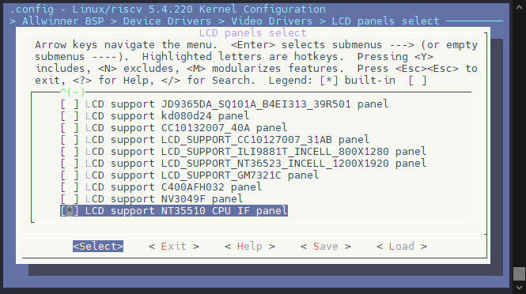

编辑设备树，配置屏幕时序与引脚

```c
&disp {
	disp_init_enable         = <1>;
	disp_mode                = <0>;

	screen0_output_type      = <1>;
	screen0_output_mode      = <4>;
	screen0_to_lcd_index     = <0>;

	screen1_output_type      = <3>;
	screen1_output_mode      = <10>;
	screen1_to_lcd_index     = <2>;

	screen1_output_format    = <0>;
	screen1_output_bits      = <0>;
	screen1_output_eotf      = <4>;
	screen1_output_cs        = <257>;
	screen1_output_dvi_hdmi  = <2>;
	screen1_output_range     = <2>;
	screen1_output_scan      = <0>;
	screen1_output_aspect_ratio = <8>;

	fb_format                = <0>;
	fb_num                   = <1>;
	fb_debug                 = <0>;
	/*<disp channel layer zorder>*/
	fb0_map                  = <0 0 0 16>;
	fb0_width                = <480>;
	fb0_height               = <800>;
	/*<disp channel layer zorder>*/
	fb1_map                  = <0 2 0 16>;
	fb1_width                = <300>;
	fb1_height               = <300>;
	/*<disp channel layer zorder>*/
	fb2_map                  = <1 0 0 16>;
	fb2_width                = <1280>;
	fb2_height               = <720>;
	/*<disp channel layer zorder>*/
	fb3_map                  = <1 1 0 16>;
	fb3_width                = <300>;
	fb3_height               = <300>;

	chn_cfg_mode             = <1>;
	disp_para_zone           = <1>;
};

&lcd0 {
	lcd_used            = <1>;

	lcd_driver_name     = "nt35510_cpu";
	lcd_if              = <1>;

	lcd_x               = <480>;
	lcd_y               = <800>;
	lcd_width           = <43>;
	lcd_height          = <63>;

	lcd_dclk_freq       = <58>;

	lcd_hbp             = <35>;
	lcd_ht              = <650>;
	lcd_hspw            = <10>;
	lcd_vbp             = <55>;
	lcd_vt              = <1240>;
	lcd_vspw            = <20>;

	lcd_backlight       = <50>;

	lcd_pwm_used        = <0>;
	lcd_pwm_ch          = <4>;
	lcd_pwm_freq        = <50000>;
	lcd_pwm_pol         = <1>;
	lcd_pwm_max_limit   = <255>;
	lcd_bright_curve_en = <1>;

	lcd_frm             = <2>;
	lcd_gamma_en        = <0>;
	lcd_bright_curve_en = <0>;
	lcd_cmap_en         = <0>;

	lcdgamma4iep        = <22>;
	lcd_cpu_mode        = <1>;
	lcd_cpu_te          = <2>;
	lcd_cpu_if          = <12>;

	/* rst */
	lcd_gpio_0          = <&pio PD 19 GPIO_ACTIVE_LOW>;
	/* cs */
	lcd_gpio_1          = <&pio PD 14 GPIO_ACTIVE_LOW>;

	pinctrl-0 = <&rgb8_pins_a>, <&rgb8_pins_ctl_a>;
	pinctrl-1 = <&rgb8_pins_b>, <&rgb8_pins_ctl_b>;
};
```

## 测试屏幕

使用命令查看 TCON 彩条，这个彩条是由 TCON 发出的，操作更加底层。

```
echo 1 > /sys/class/disp/disp/attr/colorbar
```

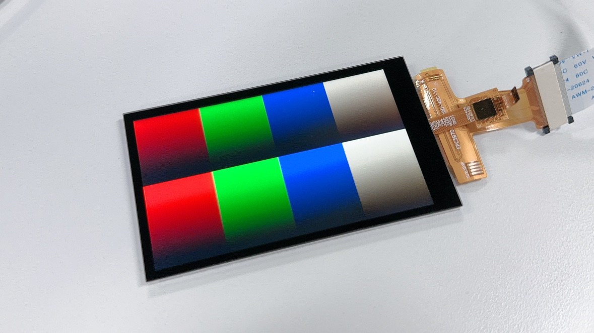

使用命令查看 DE 彩条，这个彩条是由 DE 合成发出的，如果 DE 出问题则可以看到 TCON 彩条看不到 DE 彩条。

:::tip

:::note

提示

:::
:::note

如果刚才开了 TCON 彩条，记得先关一下，TCON 彩条优先级更高

```
echo 0 > /sys/class/disp/disp/attr/colorbar
```

:::

:::

```
echo 8 > /sys/class/disp/disp/attr/colorbar
```

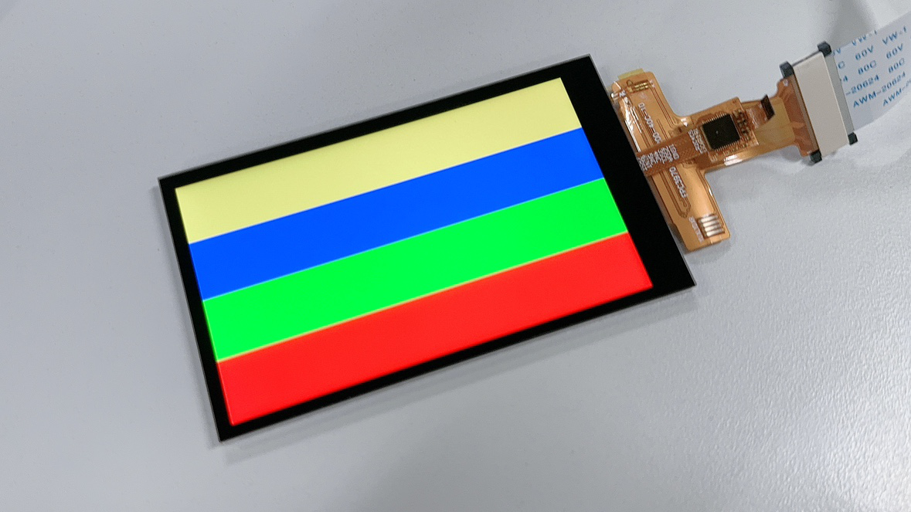

## FAQ

### I8080接口显示抖动有花纹

1.  改大时钟管脚的管脚驱动能力，改大。

### 黑屏无显示

#### 黑屏，没有屏幕信号输出

:::danger

:::note

注意芯片型号！

:::
:::note

首先确认芯片型号是否为支持型号。

:::

:::

#### 完全黑屏，背光也没有

1.  屏驱动添加失败。驱动没有加载屏驱动，导致背光电源相关函数没有运行到。
2.  屏驱动加载成功，但是没有执行到开背光函数（可以在uboot的屏驱动中加打印确认开屏流程的执行情况）。这时候大概率是屏驱动的开屏函数没有执行完，uboot就执行完毕进入内核了。需要在满足屏手册上电时序要求的情况下，尽量减少延迟。
3.  PWM 配置和背光电路的问题，另外就是直接测量下硬件测量下相关管脚和电压，再检查屏是否初始化成功。

#### 黑屏但是有背光

1.  没送图层。如果应用没有送任何图层那么表现的现象就是黑屏。
2.  SoC端的显示接口模块没有供电。SoC端模块没有供电自然无法传输视频信号到屏上。
3.  复位脚没有复位。如果有复位脚，请确保硬件连接正确，确保复位脚的复位操作有放到屏驱动中。
4.  `board.dts` 中 `lcd0`有严重错误。第一个是 `lcd`的`timing`搞错了，请严格按照屏手册中的提示来写。第二个就是，接口类型搞错。
5.  屏的初始化命令不对。包括各个步骤先后顺序，延时等，这个时候请找屏厂确认初始化命令。
