# Serial RGB 点亮 854x480 屏

:::danger

:::note

注意芯片型号！

:::
:::note

首先确认芯片型号是否为支持型号。

:::

:::

V821 视频输出规格如下：

-   Serial RGB interface,up to 800x480@60fps
-   Serial 8-bit i8080 interface, up to 800x480@60fps
-   Dither function for RGB888, RGB666 and RGB565
-   Support BT.656 interface for NTSC and PAL
-   Supports Fsync(Frame Synchronization) for camera sensor

这次点的屏幕是基于 NV3049F 驱动 IC 的 854x480 Serial RGB 屏。屏幕型号为 F450003，该屏为定制屏，暂无公开型号或购买渠道。

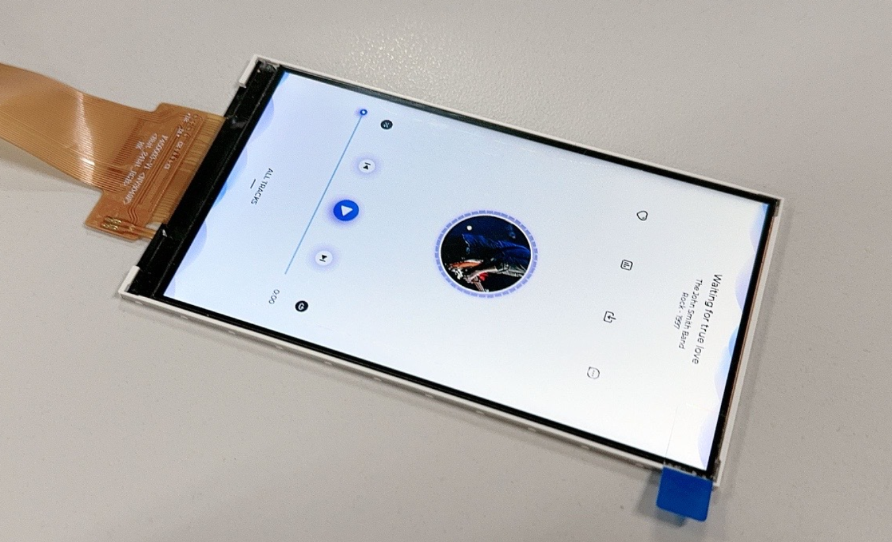

:::tip

:::note

提示

:::
:::note

串行RGB是相对于并行RGB来说，而并不是说它只用一根线来发数据，只要通过多个时钟周期才能把一个像素的数据发完，那么这样的RGB接口就是串行RGB。也叫做 8 位 RGB 屏。

Serial RGB 时序如下：

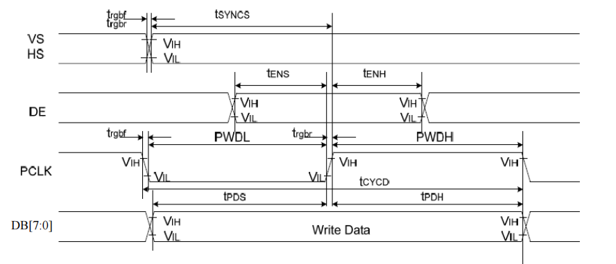

:::

:::

引脚配置如下：

| V821 | 引脚复用功能 | TFT 模块 |
| --- | --- | --- |
| PD1—PD8 | LCD-D3—LCD-D12 | D0—D7 |
| PD12 | LCD-VSYNC | VSYNC |
| PD11 | LCD-HSYNC | HSYNC |
| PD9 | LCD-CLK | CLK |
| PD10 | LCD-DE | DE |
| PD14 | GPIO OUTPUT（3 线 SPI 初始化使用） | CS |
| PD15 | GPIO OUTPUT（3 线 SPI 初始化使用） | SCK |
| PD16 | GPIO OUTPUT（3 线 SPI 初始化使用） | SDA |
| PD17 | GPIO OUTPUT（3 线 SPI 初始化使用） | RESET |

## 编写 LCD 显示屏驱动

### 准备驱动框架

前往屏幕驱动路径：`bsp/drivers/video/sunxi/disp2/disp/lcd/` 下，将

-   `bsp/drivers/video/sunxi/disp2/disp/lcd/default_panel.c`
-   `bsp/drivers/video/sunxi/disp2/disp/lcd/default_panel.h`

复制一份作为模板

![image-20250325115847538](data:image/png;base64,iVBORw0KGgoAAAANSUhEUgAAAXsAAABiCAYAAACxkHPsAAAWPklEQVR4nO3dbUxbV5rA8T9pGxKot4RA6CSZGqIJGYVUKULblhmbsun0AyDQzq4QL5VNVu2yCVktO4h6IiLlQ6REGYKyw4e8iKVSbKZA5B2NFARRpWmnAWZpKiESNbATmI3xNGQ3CVBmPXHbJE32w/XLtbGNARcb/PwkJN97rs859ofH5z73cE5C3uv7nhLE7MzdYEVLsiUtlXvTs6u2/LW8l7k6/HnQ8kj5wvg+T57bCMBL5hoSHj9aWkWGY1j1c7TWnmZQfS5njPLD3egaz1GfdoXyw92uwkqau3Zzo+ooFp/X/vJpajNCx0FODIDxpJk9ozWYOhZqI5+mtgOkDKiuDVi33zWq+ownzeybPs/+lqH5/dc3cKEuhY+rjmJxvR4fTic3e8L3O3DTN3DBAO2BykTcS0zcGO0uRNSz0e6AmG/9jJ2vX/whAN9s3sGGuzeXXtnsndCBTFuEtatIdcLJnB4Y8L9QCcK5Gu91I0vv1YKyis1Yi1UnHHPoFnrTwB3u1aWoTmjJzXMycjZIMM9MIXl2TAK9iAsS7GPQ8+Mfe4L9TGEdqZ/+isQ7N1j36KvFV5a6FR14ApouI92n+MGwMkoOzTvaLu9wHxsX35ewORk5q9w1+NuxqHrs9PRBad0xjAOB7lCY9/0IsVati3YHxHzJE4MkTt8C4PHz6dz7yc/4wvg+9nc6sb/TGX5FHWPYNHspM7hPVFKWl+QpHrw6AXlGmvQLVaQlReNkbtJ1qM8nW+MtvTXtJCun0tNGc7E2/D7OM0T/OOQaGhYeyYej4yitw+mUdh1D+XnKp6nNTLMBz/fzbmO+6+JKmjyvhVhbJNjHqLSPf0ni/T8us5ZuTGevs6XYjLXLjLVrNzf67N7igdPs77tPbp273Iz1ZGXgetTXGVK45/CWDrZcwaYtCtyGjyFODNiVFE1b8GA+2HKQntm91Hd5+9VsCHJxGAZbDtJj11Ladc7vh60bU9Vl7uUdcLVTRMrdhe5yhFidEuQBbfjlK/WA1iNhHY7db+Hc/goP03fyJFEZlWvfr165PggRp+QBrVg5T5+gGf0QzeiH0e7Jd6CS5q4isvzO2vpCzdQRQiyVBHsRJd2YqroXvkwIERGSsxdCiDggwV4IIeKABHshhIgDEuyFECIOSLAXQog4IMFeCCHigAR7IYSIAxLshRAiDsg/VcUg9WJnsjSCECISZGQfbwzHgix2Np+u8ZyyQFiIRcvCqiPM9sJhPBlssTY/+gYueFa6DKaS5nmLowmxNsnIXgRRSVkejJytCbiu/NKEs1NVaJbDNYHXpRdChCTBPsY9fXY9zsxX+XbDX7Hhzg3Wz/5pBVu/z+2IBXohRDRJsI9x995q5OutezzHm65+wF/d6F1EDerVJZWdm3zoG7hQt5dkd7ln/1blXFaXmX3D59nfovVZpVK9w1WoPWgD9qPYjFV/PfC+sC66xnPUuzdasV/21BVoD9oeiijVQvAdrlxbKhKkzUzVd+AI3S8hVivJ2ce4hCeP2Hjbu9vr/71cHOJqf/k0tRVBXw3lVTWUV42xx2cXqUqa63YyftZV3gelbQ3oBk6zv+oyNuz0VNUoQd2w21vP2eth7nCl1o2p6jwjDmUZ4/JQAdVwjPrsCVqrlPZ6KOJCsB2ktEXsGVWuax0OvMOV8eQBcmcvB2kziVw9tFfVUF512W9nLyHWDgn2MS79t62kf9TqOf52Y0qIq/0YisjlOpc8+fFuTKpdpHSNb5Blv+IdCXeMYdOkBN7nteOod+Q+MMS4I9BFkZBPk16LbcAbmC2jdpLTgmx1aL/s6dfg1Qke+PV/e+M5SlOv03o42HLKTkY63G11c8MOWzJka0Kx9kgaJ8YlfPvQ70TC4iqYvRM6JaEtwtpVpDrhZE4PBEuFaLzXjfhfEkFZxWas6psYx9zCM4IG7nCvTv1jqCU3z8nI2fDTMremnexbVE+FWB0k2K91qVvRgSfY6TLSfYrVuffgvLNoyjvcx6EnNS5PsNw7ge86glKeUZTWHcM4cFRm8Yi4JmmctaxjzC8HXUmZ+6EnStojvNy7lhSNk7lJ16E+n2yNt/TWtJOsHPfc90qai4OkXMIyRP944Nz7knQcpXU4nVLPnPt8mtqWt4G5EKuRjOzXtG5MZ7dyoc6dErHT02cnK8dVPHCa/ZnHsNaZsda5zqlmvvjU07fbe53Djk2Vsx9suUJZlzsd5NeGjyFODBRhXWA2zmDLQXacNFPfZabedW45e9O66yvtOsf2szK+F/EpIe/1fU+DFc7O3I1oY1vSUrk3Pbtqy1/Le5mrw58HLY+UQMslyBIKQqysxMSN0e5CRMnIPgYFCuZrL8BX+szbd1vOCF4IEZwEexEl3Ziqgk2HFEJEmjygFUKIOCDBXggh4oAEeyGEiAMhc/bJz78Q0cbWJ24MWWesl0PkvxMhRGx6/OjhwhetIjKyF0KIOCDBXggh4oAEeyGEiAMyzz6WJaxjducbOL6Xw9epO/h2vfIffbsvHoxyx4QQq40E+xj1KDmV2z+q5avU5SwqJoQQCknjxKCn657jT/p//m4CvfEU1l/UhnWpztSO9WIn1vYjS16BUmdqD7u9qCk4gvniKb7LRZuFiDYZ2ceg+zlFfPPC9wBY/2CGjGu/Jvl//4t1j79ewV7UUpYHI2eqOdEfqTpLaGp/m5T+akyy+KQQK0qCfQxyZuzyvP7e1Qsk3/9jlHryJbcjFuiFENEkwT4GfbXp+57XSTP2EFeGo5bmi4Wu1SWn6On1Ky44gvlQDknu8or3sKjOZV3s5M3hD6hp3qaqB5zDH1DTrFRm/EUne0ZVo3XjKaw5E5T/vC1wP0o6sRaM0vru8YDr2etM7dRv/oweCinNVM7Zer3160zt1Hs2YXH12fNZUvioF0pLts3rp+934WTkzLth3LXU+nxudT+EWE0kZx+Dnq57zvM64cmjZdRUQlN7IfRWU15RTXnFBHtcQVBRS/OhLG6ecZX3Qmn7EXT9x6mp+AQbU/RUVCvB0rjTW8+ZUcj7KU0Fi+lLG6aKDxhxKAGzPEig98gsZM+ot72MknZXeyUUbLbRWqGU9Uxuo9TnmcA2SnMmAvTT77s4Y2PXoYXy9EqgV3/uucV8ZCFiiAT7GKTOzT955rkQVy7AWEguo1zyjETbMPVOeYp1plfJmvzMO7q1TGDTpATe59XynndE23+Nm45AF0XQ5Ceq9o7z0WQSu14vAXo58XPvD4VldMrvjVP0uO8o+q9x05FESibzv4v+a9x0bGJ7qB8s406y/PpxQkb1YpWSNE4M2vjlbR6k/wCArze9RNL0fy+9spn7C46grRcLVSeczBUA89IbysPVXI33upGl92rRbs04edN9YDyFVX2HMjkR5F293J55mxT3oSaH+oudnq0OAWyZwOT8dwLoXtyEc8b/x0SI1UmCfQxKuTXoCfZ3Xv8HMq79B8l3/8C6R0uYjbM5HR14Ar7uxU0+xb457WC8s2jKLe7jny6+L8uwY3MSd0d7lUBfMEdrxXvKZzKewhpwv9sAJj/xe47gEmJ0n7R5W/BCIVYRSePEoBcmr7JxVnkw+zB5M1/8+J/4w9/9G2MV5xirOBd+RZYJbJocyjyJ6VrKPA82YfBTW5i5922kaJzMuUfABa+wS+MtvTXjJCvHnTevpbkkAgEy81Vvv4ynKM2c4obF9WOlulsx5oTZlmUCW2YhzQtNplfNuR/81IZT/Z6CIzTJZHyxSsnIPkZt/882bv/oH/kqNXMZtbRhOpOO+VAn1hJQZuNMkeUeCfcfpybzFNZDnVgPuc4FHP22Yerd6b3OMYVNlbMfbP6MsovudJBfGz56OdFfiHWB2ThKP2xgdPdLmTljAWj+DQXtb3tST7bJcNMs/t8F4FigD/3HqeGI6j1ORs6E2ZwQMSYh7/V9T4MVfvNNZP+JZ9MLz/Pln/+yasv37HqJGzf/FLQ84uJ0bRz31MuAKRchVshaW89eRvax7OkTUsd/R+r476Ldk++A7/x1N1tvNZei0h8h1jYJ9iJK2jBVBB6560wr3BUh4oAEexFzBpvfDT1dVAixaDIbRwgh4oAEeyGEiAMh0zjZ1b+PaGPr7n9Eevqbq7ac4aqIfydCiNg0Zv7raHchokJOvdT+/UeMd/44Yo1Fe+rkqpt6KYSIiuzq36+5YC9pHCGEiAMS7IUQIg5IsBdCiDgg8+xjkHqxs7W+NIIQYmXIyD7eGE9h9dnZKTidqR3rxU6s7UfQLbE5nak97PaiRrXSZVjnhViFZGQvgqilLA9GzlSHsU9ruLzr4ss+rkKsLAn2Me7JM+txfP8VHidqSL57kw1zt1ew9S+5HbFAL4SIJgn2Me4L/UEeZPzQc5xx7ddsvvnbRdSgXl1yih7/TakKjmA+lEOSu7ziPSyqc1kXO3lz+ANqmrf5rFKp3uHK+ItO9oyqRuvGU1hzJvyWKFb1Y4H17N1LHPdQSKlrOX9br7d+namdes8mLK4+ez5LCh/1QqlrAxXfnbjU34WyRn5Ydy3qbRCD7XYlRIyTnH2MS3jymOf/54bneHZXiP/wnaeEpvZC6K2mvKKa8ooJ9vjsIlVL86Esbp5xlfdCafsRdP3Hqan4BBtT9FRUK8HSuNNbz5nRMHe4UmvDVPEBIw4lcJeH2jQEILOQPaPe9jJK2l3tlVCw2UZrhVLWM7mNUp9nAtsozZkI0E+/7+KMjV2HwsnH+9bnVO+gJcQqIsE+xn1/sI3tv/93z/GjDS+E/2ZjIbmMcsmTH2/D1Ovd2UlnepWsyc+8o1vLBDZNCjsC1WV5zzty77/GTUegiyJo8hNVe8f5aDKJXa+XAL2c+Ln3h8Iy6r9T1RQ97pF3/zVuOpJIyWT+d9F/jZuOTWxfMHAHqU+IVUbSODEu4ckjEnxOJAS7NDDVfq0BZRZ6tvhTOJkrAOalN5SHq7ka73Uji+vJstyaceK5p1GnVQAmJ4K8q5fbM2+T4j7U5FB/sZN61RW2TGBy/jvDqk+IVUSC/Vq3OR0deAK+7sVNPsW+Oe1gvLNoyi3u459Gvq8h7NicxN3RXiXQF8zRWvGe8pmMp7AG3O82gGD5dknLiDggaZy1zDKBTZNDmScxXUuZ58EmDH5qCzP3vo0UjZM59wi44BV2abylt2acZOW48+a1NPs8F1gidW7ceIrSzCluWFw/Vqq7FWNOmG1ZJrBlFtK8UJJe5taLNUpG9mtaG6Yz6ZgPdWItAWU2zhRZ7pFw/3FqMk9hPdSJ9ZDrXMDRbxum3p3e6xxT2FQ5+8Hmzyi76E4H+bXho5cT/YVYF5iNo/TDBkZ3v5SZMxaA5t9Q0P62J/Vkm/TP2Yf7XQCOBfogxBoiSxwvonylljgOtFxCPC2h4J56KVMcRbSsxSWOZWQfgwIF87UX4Gt95u272XqruRSV/gixtkmwF1HShqki8MhdZ1rhrggRByTYi5gz2Pyu5NGFiDCZjSOEEHFgwZF9JDfYjvaG4bLhuBAiXoWcjTM7czeijW1JS+Xe9OyqLX8t72WuDn8etFwIsXYkJm6MdhciStI4QggRByTYCyFEHJBgL4QQcUCmXsayhHU4dr+Fc/srPEzfyZNEZV0b7fvVUe6YEGK1kWAfox5r0pje9698kxZwdXkhhFgUSePEoKfPrOf+W6bvJtAbjmE9WRn5epdD38CFrmOy0qQQ3yEZ2cegP7/ytzzctB2AZ/9yn01XP2DD1Oese/TVivVB13jOu8+r/TLlh7u9hYZjWIu1rgM7PVVHsQR7r+M6rbWnlf+I1TdwoW4vyUHetzyVNHcVsWX4PPtbhnzOefacPXuQEwNhVufqKz71CbF6ycg+Bn291bs+8OYr50ia/GxFAz2GY9RnT9BaVUN51XlGUou40JivlOkbuFCczsjZGsqramgdTqdUdaegazxHfdoVyquU8nJ3oKeS5rqdjKvf19aALkJd1jW+4beoWj5NbUXQ5+pH331y68K7ezCeNGM1wLg9Qp0TIgbIyD4GPdys9bxOvH9rmbWpR7d2evq8JcaTZkpxj9rzaWo7QPb4eT5O02IbOOoK0kOcGCjCqs9HxxC8thOGLZ4R8mDLFcq6dmMELFRSlj1Ba2038xh2k2W/QrnP+96gQO/dRcvnjsHvbsJ40kypq+iB/2hb38C72ROM2PeS7TmXTzbXae9wHXdcZkR/gD0GoMPv7sPvLsNyuAaLq81sQljgDkeIWCIj+xj09Jn1ntcJ3z5cRk1+o9uqMfYUe39ILIcvY9O+QZMeMBSRy3XaW2B7qmpXKoDJOR4E24gcO3OOdLbrUQL6LBS0mbF2KX/NBuUqXUY6D6btfu9Tb96tpTRnzNVP37sJXeM55UfJVTaefcBTL+TTZNjJeMdpbqu7lZlC8uwd1YJqQ9yehS0Z+UA+BWnuO5caeuxan7uTsBiOYS2Gnir3ncrc4t4vxAqTYB+D1Cmbp88+t/SKXAH8knt0SzemPnXA7cbUd5/ckgaa9OmMdJxmEC0pGr96Bu5wz/Vy8O59kvOKvOkQQ5FnE3JdRjpod0KH68fl7HW2FCupkx1pSX6VKsHXy06PZyQ/xIkBO8nZ+eiopCwPRnq9Zf3jTlfQBuPJA2SPW+bl4nUZ6fO+jlvTTm/9h097fggso4vP1xhztNj6vCP5wZbTMqoXMU3SODFo/Yydr1/8IQDfbN7Bhrs3l16Zz+g2gI7LjLjSN/sHQBlx+12j38oWz/VHac04R32XmVIA+3VGHKrAar/iDbwDQ4wblNTJpWkn+3wqzWd7aoh+Tc7xQO8+SCK3zoy1TlVu14KhSBnxB3iAOnj3PvVpvud2pCXBtOvAJwUD2MdCdMZf/vy7HyFinAT7GPT8+MeeYD9TWEfqp78i8c6NpT2kTd2KDm9efN6I11BE7qwdW56RJv2QK1C70ivuoJ2ZQrJjDvfTg8GWg94fEH0DFwwTtA/AYOb8AKuWnKYF3IFZ67uJub/MFJJnxxgEygLmw10pKo0Wa1eR97T2ANaTWspH/T+78uNyb3RICfT6OVqrXM8lDMewBtwzNxS/70iIGCdpnBiUPDFI4rQSWh8/n869n/yML4zvY3+nE/s7neFX1DGGTbOXMk9+u5KyPHU6pZLm4nRGeo9yaRhySypxp1Cy9O6ZMvk06bXYBk4HuEPIp8mwl3vuso4xbNoibz7dUESuxs6NDuWBrOf5AK7ZM+q7ALTsc8/4oZLmYi220W6gmxsBc+pDnKit8c76qaqhx648vC0/3K3csaD67KqUli4j3eeOx5ijJSyGY1jbGtC5UklZxd7ZPbrGBvk/ARHTZGQfo9I+/iXTf/MvfJP+g2XU0o3p7FYu1JmxFoMyG8dOVg64R8Zbhs9jGgAGLBS0HeBCo539LUfpyTFT32WmHtfsF0/eXz27B2x9NZg6QrTnGZF3Y+rbjdWdjnFc95u1Y2ccI9auA+DXpuXweba3HVCN4MOZMz/EiY58v764fpRalM/qrs9mX3zOfrDlIDSq0lmO67QuuhYRy7QvbYt2FyJK1rNfRPmKr2cva+MIETVrbT17GdnHsqdP0Ix+iGb0w2j3RAixyknOXggh4oAEeyGEiAMS7IUQIg78P3YvT/m4gBWfAAAAAElFTkSuQmCC)

然后改名为此款屏幕的驱动：

![image-20250325120029397](data:image/png;base64,iVBORw0KGgoAAAANSUhEUgAAAVEAAABuCAYAAACeLSCOAAAUdUlEQVR4nO3dfUxUZ77A8S/4rkxFGLQgcdQVcNHW165MHWT1rnXR0Oy1MVe2AjZ1vcq9t+wSYgxNbGpSY4wxS7MRw21TXrRDQtY/llSvda8tBUX31nrdiqvgiuMqXGXAlxFUULh/nHk5MwwDzPAyA79PYjIzvzPPec5J++P3nOfMeYKWJazpog9amu/1ZbM+m64N4765JWDjK5a9xoWLP/YYF0KMHBMmTOoxNnYI+yF8ERSMJX4tbdGLaY+IoXPCZAB0n/96mDsmxOgmSTQAvNBoMa/5Lc+1c4e7K0IIF8HD3QHhWdeY8TSt3TUKEuhmDhjzyU0c7n4I0T9Sifq5R4t/Rfu0aADGPmli2oVjTLz7I8EdT4euE4nZFGaGciZ1D8XWj9L3F5Gis76xXCZv+yGqAENOPlnLJndrov5EBrtK1O0tgotH2HqwepD7vYgpAJgoV/XfYyxtL2XrbQfnEhPChVSifu5Z1AL76/CKfCbf+svQJlC3NhNtPsKm1Aw2pR7hEovYlqMHoOrgTuvn1n8nTGC5zJ+sCTR9fxFlaVBrGvw+HsiMofaw0o+8ixGkFGRj6C2WmE3h+gguqWP7Nw92Z0UAk0rUz7WH6+yvJzTd9LG1zRwwJjMHgDYuHd7JvkprSF2ZWS5TXhvDGorZei/ZXpWlGItYc/EIWw+Wsu+grc1qvqtNJ9bt/vTkJkZwqWQPVdZPindnUIySTN1+Z7ZzP/K2H6LKTSVsyMknS1tBOcmOitiq/kQGu4hnjqmCTdbjqzpYwdvGJFYlQtXsnmOsiIGLxfbzosTiSQdl3z2dJzcVtVNVrqrWxcgilaif6xoz3v466GW7Dy3pyS1IhhPWCvFwHbGZe0kHXCuzTSWwxvY/f8keNh2+TCsmylMz3CQLPatiofaCm2F5WjJLWiocibpXk1mSCJ9Zq9jylkVk7d8MldXUWnQsTHPe56WvSine7ah68y62gekku0rAMCOCVrO63DXx0DKZ0NmeY92ZeGiJIDqxl/PkwpCTT1ZsHXm2Y6nt6zkQgUaSqJ9TD927xo7zvqG0ZJbgGFYriUlJDoacJOaYVMmu8hCfXWzz2JwhJ58yYxFlxnQo2ekmUerJTdRRX1Paj062canEUa0Vf3WZVl086VTzXW0b02colwxI1BNLHd+p95mYzbZlTZTvVvY3V+ua3Kq5Y73t11Os6l4TU5YlW/+4oJw3je2Y+3qerElefSwHpQodqWQ47+fGN5t49up8AJ6Hz2XiveveN6ZZRJaxiCzVR/XW6su5Mutd1cGd1qSgJ7egiLINJ9m0W5UwE/XEcpnPSnpooC8qG7ifGars70Id29L0GKhWhty1xaqkpCc3LYbawzvtw/2b5jbWODWmJzqs9xgle8ibkU+WsYgUANNlLlki7Fv27TzpCNU0caXPFbgIZJJE/VxI7Rl7Em3+eSZh548yoeGKd5NLJpdEZ2XIgSlaHeAYks/VTgZzXxqtZl+JnsK0KAxgT2yGbonOC4lRTLc85CZA5SHObMhnVaIeYqG2xNFXQ046sbXFbHVJWs7HpCNU08bDW8AMDzHUfyBQroGm1fFZJbCiP+fJeglAEumIJ8N5PzelrooJZmVC6UVIBPd/8Tv+kf45pve/xPT+l31vqOQq9bpkDqR1D1VdqKNVl+S4RzMxmzW67tvZpWU73c+ZvmERU1oanCrDHq+TejSZJRtsM+F6ctMWQW21Y0hc00TshmRi1ddZE7PZFlvHZy7XaqsOVlCvOib1UNxTzJnSh/uVylDc83lSKnLl/JZyxTSZJWm2uwEgPcfxWowsUokGAO2Z32Ne/QHPI+b50Eopuw5HUZhZRNl660e2GePKQ2ydvZeyzCLKMpXPyy+qhryVhzizocgxO38BYm3bQvcKN1FPrKaJM/2uwtq4ZI6nzFjkaFedHEuuct+YDCf2WD9QktwUDU6XKZR7UkvZdSLe6Zjyttv66CmmvoPB5f7W3s6TSvHuDNhf5OiX6SSb+ns6REAIkgeQeBcf8geQDPFv5w05+Wzr4dad4bOZA8Z4rvjRze/p+4tYWKNKtGJEkgeQjARdnWhqTqGpOTXcPRk2hpwkpl8s9psEStpeUnQmyncPd0fEcJIkKvyf7QZ3y2Xytg9jZez0U1Gw/WDBb5K6GBaSRIVbTjPUw63yULeZ92HhL/0QfkVm54UQwgeSRIUQwgeSRIUQwgeSRIUQwgeSRIUQwgeSRIUQwgeSRIUQwgdyn6ifUz9kRJZHFsL/SCUq/MTIWu0zfX8RhdZ1p8TIJpWo6J2s9ik/7RQ9kko0gHSNHU/rPAOPF66nPWzWMPZEVvsUwkYq0QByf20Oz6IW2t9Pu3CMV6581Y8WZLXPoVztE3TkFuywrtHkcr7FiCGVaAAJ6uxg0p1L9vePX1vvYWtXstrnUK72CTBlWRKUWI/FpH5qvxhJJIkGkIg/5xHx33n29y8nhfb9y7La5xCu9qloVVW0xTUmCIuSJUJGIBnOB5Bu684HBfWvAVnts9fYwKz26cath7SOkDsPhDNJoqOJrPY5hKt9itFChvOjhaz2OYSrfYrRRCrRUUNW+xzK1T7F6CGrfXoZH6rVPt397HMofgoqq332jaz2OTrIap8BzF2SHK2/oZfVPoU/kiQq/J+s9in8mCRR4Zas9umGv/RD+BWZnRdCCB9IEhVCCB/0eTg/btz4Ad3xmDFjPLbp73EY+HMihAg8UokKIYQPJIkKIYQPJIkKIYQP5BanQBEUzKP5/0TrzNd5pv0JneOVx7nNK946zB0TYnSTJBoAOkLCuZf07zwLn9P7xkKIISVJ1M91jRlH45ps2kNnDkBrMSz/YiWRQOPXhXxvHIAmhRjlJIn6uZbX3rYn0HFPzGi/L2VS4xWCO571u62QrNeJvH2W8o/qXCJKctX8bznf5DVbt32H1Ys1jk0s1/jmg/M8UW0fqQS49p9/pO6cc1v9jTnvr5Hv3ztFY7+PUIxW2p9GMueteOq/vor5b8p/OZNnvMKCf1lOw19ucff8zUHbtyRRP/c08qf219PPFjDpXq1P7T1p6f5kqpCs14kEa4JUbatKqg7hxHy6Er4upNwIpK4j5TfreHLuFI0+xCL5K+XvKck98uOtLP84xk2yF8L/yOy8n3se5ng68kRzvdftRH68ldWLNYQsTiHli3XWahB4M4E3fnKXa7edt9eEabDcd02gwJsxRHONa7ZLAcbvuWaJZGaqDzGaqctzJMzGa55q0HBiPt1KyhfKv9VZ4f06D0IMNKlE/VzXmHH210EvO7xup/GjQr7Jeoc3+FZVXYYTs3kmd0r/yJN187t9J/KtraS8BU7Da91UQh7cVFWtzTx5ANHTwwFvY87JOnJ+JI3XTrk5inBiPk0h+u/llOc1AzHEZLnZTIghJEnUzwV3PKNz3EQAusaOI+iF94nUVeTHSkL65hxErnOONX5USLn1dUjWO6z+NIFvPjgP00O6tWNpsSjbeRkDlOH9W0p93OOkl7Wa/R/7H4E66vLcbCfEEJLhvJ+b0OIYZz8Lc7swundS17Gcs26ueXb3JO9brjGTyDfhyX3XK6fK0B+8jwFgPEX5e4WUv1fI3flbSfk0gW5pVzeVkAfN3a7dCjGcJIn6uVdufGt/fd/wr7TOWkbnuJ6XKuibcGL0kTBrpf3a4vJZKNdLP45xs30YU1X5jmnhqgQXTsg0HNdPvY2pNH50lkbNVDTdIq5tCKHo6uwieEwwE0In2z/TvPoKwWPH8OJpu4dv+k6SqJ/T/P0cE5uVCaWOEC2NP/8PbqbmcyO9kBvphV622kzdB4X2yq/8vUK+v63Mxisz4jEsVyXTkKzXibTcpfEcyoQQ85mfag2mLme+bcLI29ibCcSk4rK/R1hQYqttE2HGmzRq5vOGfTIphhiZWBLA49vNPH/0lKjlOmYsmUV43KvMTJhLR9tzHtwa3DWt5ZpoAJhR8Qfurfo3nmnnDt1OZ60k5YuVymune0SbqSu9xurfqCedfIyda2aq/XPX/anV8f17sPyLFFK+UD5p/NrbPyRiJOl42sHNUzX85JcLmbs2HoDnj9q4eeoq7Y/6f091f/R5tU/L4wcDumNt2FTMLY8CNr709Th++Ov1HuMDTn47L8SwCQ4e02NMKtFA0dXJ1L+dZurfTg93T4QQKnJNVAghfCBJVAghfCBJVAghfCBJVAghfNDniaWOjoG9YfXly5ce2/T3OAz8ORFC+KcJE3r+gYtUokII4QNJokII4QNJokII4QNJokII4QP5xZKfM73/pf217vNfD2NPhBDuSCU6qsSRcHQ7G49uJ+Hd4e6LN+JIOJpKnGG4+yGEg1Sio4gmeylRpgqOf+j64JQ4Eo4mofnhOKcPma3bprJ2qXq1zxpO7zyrPJ7Oun2UEqDmiJHrVc5t9TfmvL+7nN/yFQ0DduRipIuIn8m8Xy7kxn9doenqXQCmvDqV11JXcOfCTe6cuzFo+5YkGkC6xo6nbfbPeDnxFSY2XGF8y+3ev+TC0tz9Icia7KVEARbXbVVJ1UFLXH4SnCzg+DHg3Q1s3LEBS9VXNPgQi+IHjm9RknvUJ9tJ+CTOTbIXwv/IcD6A3F+bgzkpkwcrttD4z/t5vHBDn78b9cl21i7VoFm6kY1HN1irQcCwkoSY29SYnLfXhGuw3HPzMFtDHLOooeaY9f2xC9RYZjLrXR9imLl+yJEwG6yVRI90K1lrvSyxMX+l+yfgCzFEJIkGkKDODibduWR///i19X3+bsOHBZz+wYLlh+Mctw+VtcS9O4vbx852q0IBopKtiUqddHWhaFrMqu3NWFpAM0Prfcx1v/EzabjaUxWqYYEBzm8p4PiWCho0C1gQkNd3xUghw/kAEvHnPAiC2xnK09xfTgr1qb2oTzYyq+44p6sgKtk51vBhAcetrzXZqazNX8npnWdhxivd2rE0K6lR42UMUIb3yTOVfZ8s4PyxbpvbvkWNPelf57YpiQUztMDgLgEhRE+kEg0gQS/bCXqh+r1+UJD3jb27gQQq3Fzz7M5y6DQ1zCLKAJZ7j7vFNeHKgNrbGADHvuL4lgKObyngdnzfh+lOiViIYSBJdFTSEmeYCbok63B9Owk6lOuln8S52T6caeqMFqZVJTgtmjAc10+9jak0fFhBgyZUrnWKPuvq7CRoTDATp6lW+4ycKqt9isFi5vrOAnvld3xLAedNymy8MiMeR4IqmWqylxJluU1DFcqEEKrrkO+uYIFtwsjbmGElcarrmsr+HipDdsNK1qqvyQrhxiOTstrnzJ/NIXLZbLTzI5mln8eLtuc8qG8a1H3LNVHhni6JjUeTlNdO94iauX6shrU7trMxGZR7On2MVZmZZv/cdX9C9K7jaTs3Tv6VmPWLmLduIQDPHrZx4+SPPH/4dFD33efVPlua7w3ojqdrw7hvbgnY+Iplr3Hh4o89xgeKu599yk9BhRhanp4nKpWon3OXJCVxCuE/5JqoEEL4QJKoEEL4QJKoEEL4QJKoEEL4QJKoEEL4QJKoEEL4QJKoEEL4QJKoEEL4QG62DxRBwVji19IWvZj2iBg6JygPWpAb74UYXpJEA8ALjRbzmt/yXDt3uLsihHAhw3k/1zVmPE1rdw1QAt3MAWMRZcYiDqS5CaftpWz/5gHYTw8Ssyk07iW9r9sPdn+EGABSifq5R4t/Rfu0aADGPmli2oVjTLz7I8Ed/X8yjSEniTmmk2zaXdq3LyRmU5i5iCkAmChP3UOxNZS+v4gUnWpbVbueYj7x0J8+99Vymbzth6hCiIEhSdTPPYtaYH8dXpHPxP+75lN7rWZT7xsBsJkDmTHUHs5gXyUYcvLJKsjmpioB1Z/IYFeJ+297innHU388x6LNR9i0uxrQk1uwg205eqoOVg9k58QoJknUz7WHO0q6CU03vW7HUY3toMyYbK3UNnPAmMwcAEyUn1B9IS2eOaYKNlUqb6sOVvC2MYlViVBVqSc6rI2Ht9ztyVPM1vZeytZbj8upSvWyP7M99bWUfQdtjVTzXW06sW7PC7RePMLWbslVSbxLNJ62EaOZXBP1c11jxttfB730fpmD4t0Z5F1so/XiETal7qEYPbkFyXAig02pGWxKvcrC9Y6EbZgR4VK1mnhomUzobNv7ySzJVK6vlhVkY3Dam6eYjpQFV5V9Hr5Mqy6J3ETAh/703lcbPatiofaCkgQNOfmkcNK6v4weE2hs7RHrNiep9XiWxWgkSdTPqa99do0dN3ANpyWzhMv8yT7kLmXXCUcimqud7PKFau60OF7v255hTz7lLYvIsk8AeYoBmCi3VZ6V1dTakp0P/fHcVyVZlhmLKDOmQ8lO9tkq1ntNEBblkuRVEvXEcpnP7Mm1lH1ShQoXkkT93PhmRyJ5Hj7Atzi1NPQ4wXLT3ObyiZ7oMPfbFu8+Sb0u3u2su6eYa7Lztj+99bXq4E5rUi+GtCLHjH/JHvJqY8hyWzEDs0OZ4qFPQoAkUb8XUnvG/rr555k81b1B57ielyroF5cqzDAjwik8RaueYtcRqunhWmdiFNN72oen2AD2p299rWZfyWVaVfuxJdi82hiXitl9n4RwJUnUz02pq2KCWZlQehESwf1f/I5/pH+O6f0vndZa6reSq9RrFvG2/X7Rzby9zDEsrjpYQb39eqXt9qgKZSicmM2BHL192/QNi5hiuqrcUuQpNkj98djXtGz75/b+uKkuHUN7PbkF1vtorX3aZj+ezeSqjk0IkNn5gKA983vMqz/gecS8AWy1lF2HoyjMLKJsPSiz4SbmLFDFT8RTlllEWSbW+ysd93pOX7aDMuMO5Y3LfaCeYoPTHw+xWxBr+9ylP4acfLLsidpEeeohqtCzSt2nVDhgdBxP/YmMPhyLGE1ktU8v40O12qed/HZeiGEjq32OBF2daGpOoak5Ndw9EUKoyDVRIYTwgSRRIYTwgSRRIYTwgSRRIYTwgSRRIYTwgSRRIYTwgSRRIYTwwf8D6JxmcDcs134AAAAASUVORK5CYII=)

打开 `bsp/drivers/video/sunxi/disp2/disp/lcd/f450003.c` 文件，将 `default_panel` 改为 `f450003`

![image-20250325120101625](data:image/png;base64,iVBORw0KGgoAAAANSUhEUgAAAbkAAABWCAYAAABSMejLAAAaEUlEQVR4nO3deVxU9f7H8dcZNgVUkM1lSC2XUlY3DC2vqFzFBTQtV9T0ev15vZWaWlrWrbS01BZvectyy7yaqbiWpua11CwDES2X0gJRWVxSUUBmfn8Mc5yBGRkGRhY/zx49YOYcvt/vmWLefLc5yoNBbfUIIYQQ1ZCmohsghBBCOIqEnBBCiGpLQk4IIUS1JSEnhBCi2pKQE0IIUW1JyAkhhKi2JOSEEEJUW86XsjNKOEWPXl/0qx70oEdPi5atATiXfsaxLRVCCCGs+PPyRRQUUEBRFEBBUcDZxdX1Dj9mDDYMwVYYcMZ/1YNCCCFEBXJ2dgZFQTH5FxScnZ2th5xeDTFD2BnCTWcSdLq70nghhBDiTjROziiKxiTkDN87Ozk7W/0hY8iZ9eJ0GpOgUxzS2Fu3bpGfdxOkoyiEdQq4uNYw/AUrxD3OycnJJOQ0KBpD2DlrNE5WfqTIUKVejx49eo0OnV4BneN6cfl5N9EoTigax4SoENWBXq8nP+8mzs6eFd0UISqcIeA0KBoNGtOenMZakOjB2FFTp9/0hic1Oj16Deh0DgohPRJwQpRAURSQGQMhAMPvg0YDikJhL87wnLOiWNtFoDf5qtx+rNeBokGvB0WR3zAhhBAVz7DQpLA3h6L27GSfnBBCiGpLQk4IIUS1JSEnhBCi2pKQE8JOgYFa/P38HFJ2eFgIH324kPCwEIeUL+4OjUbDqPihLF38PmNHj0CjccxbbnBQS95+63WCg1o6pPyqrFpssBk1cjghIUFMnDStxHNnTJ9K+3ZtyMjM5JVX3yA1Na3U9c2YPhVfXx+b6qsofXrHMGBAHG+/vZDEpOSKbk61FD98COnp51iydEW5ldkxsgM/JSaZPVezZg1ah4fx3b4DpSqrV89o+sX24b33/8Ph5BQAtNqGPDvxn+z4ehdbtm0vt3YDxA8bRJ9ePS0eO33md6Y+P9Ouci21OX7YIIJatbS7TGvK8xo0Gg0jhg2mU8eHAYho3w6AxUtWoHPgFqyqQqPR0KzpAxw/cdLi8RbNm3Hy1K9lfq2qRcjZKjwshObNm7L442Vs2ry1XMoMDNQy88Xn2Lfv+3J9sxP2GzigH7F9e/PBoo9KHQwVqUGD+gwc0I/RT45g1+49ALRq1ZJ/Tvg//vzzT06f+Z309HM2l9f50U7UqVObF56foj53JOUo/n6+jIwfysj4ocCd37znvv4KgMXjc19/hSaNG6mPN23ZxsDBI9BqG/LUP/7OylVr1HCtCKaBlZNzg/nvLCzWHkddgzHgItq3YdtXO+gU2YFv9x2gW1RnRuTfYtmnqypl0IWGBDHp6Qm4u9cs8Vxrr6mtuvzlEQb0j2Xnrj2sXZdgdmxA/1i6RnVm7boEdu7aY1f5RvdUyAHk5eWRllb63puoGpycNISHh3L16lUefjiiXEKuZs0a9O8XS3BwK27k3GDtFxs4euxn9djUKROpW9ebffu+Z+OmLXbXk55+jslTnmfggP706d0TT09PevbozqbN2/h87ToKCmx/U4wfNghPDw+OpBwlNzePOW+9DcCsf73I9wd/JDiolVkPz9LP9+nVk9Nnfrdax9TnZ9KrZzTdu0Xx1oL3CA1uxWfLF+Pi4gKghqu9b4ZFe1WmwWz0+aplgCGcln/6X7Nj3l5eTJwynbS0s8QPG8Tfx4xi9tz5pKWddeg1mAbcZ6u/4NKlS3SK7MDxEye5cuVP+vfrA1Apg+5wcgojRo+7K3Xt3LUHby8vukZ1Jjc3l01bvgSgT68edI3qzM5de8occFBFQy48LISpUybi7u5OTk4OP/74k9nxPr1jGBE/BBcXF3Jycpj75gK0Wq363MsvzeDgD4fYuvVLtRyAgz8cYtbsuQAsmD+H5OQUtXdmaUjUtB1xsb2JjIywOgRqHOIEuL9JYwA2JGxWyzcOowJqmxOTktVhx+TDR3j00U7F2mnahvz8fJYt/6zceqlVUVhYKB7u7mzZ+hXdu3UhMFBLamoagYFannn6H/j7+XHr1i3WfrGeLVu/sqnMRvfdh7e3N2vXbuDhh9szZsxIZr70KgBt27RWgy0utjcFBbdsLtcSV1dX6tb1xrXwg9NNH9+4cdPmclo0a8aWbV+xZdt2Zv3rRXr1jCbtbDo3c3N5Z+EievWMZtSIYby14D2zN32j5Z/+l+Wf/lcdFrRVRmaWWZnGHpE9jG2wd7jynYWL1O+zsy+Sl5/v8GsoGnD/2/ud2TzZjp27ASp10N1Nxh5cTM9o9bmYntEWe3f2qnILTwIDtYwfP5btO3YR2+8J5r65gLZtW6vHw8NCGDAgjmXLPyO23xNs37GL8ePHknQ4mVmz55KRmcnL/5rFrNlzCQsLVctZ/PEyglo9RJ/eMTa3JTEpmanPvUhGZiYbEjbzt7ET7jjHd3+TxiQnp6j1RXePok/vGAIDtbi5uTLhqcnE9nuC8xcyiDf5i9XD3R1toLZYO4u+FsuWf8aAAXH39GKF9u3acPHiJfb8by+3bt2iXeH/G1f/vMoHixYzfMQYtu/YSVSXzjg52fa//y/HT7BmzRc0bFgfZydnnJ2d8fLyAuDQoUQ2JGxmQ8JmTpw4SXBQK7vb3qBBfd6Y/Qrt2rYhYeMWMjIzSdi4hXZt2zDvzddp0KC+zWXNeOlVOj/aic9XLaN586aMjB/KC89PISS4FZ+vWsbI+KE0bFCfoYMG2t3eO5n27DPEDxvkkLLt4eNTt3AUp3igW2PvNVzPyVEDzpIdO3ezbv0mrufk3NMBZ7R2XQJbt20nrm8v4vr2Yuu27eUWcFAFe3LdunYB4OvCv4gSk5LZvmMXISFBAMTE9ODixUtqbyYp6TCRkRH4+tQtVpbpHFrS4WR69Ojm0Lb/dvqMWuemzVuJiupMSEgQmzZvZeZLr6nnJSenqNcDhl+a5ctXqu3s2zcGX1+fYq+F8Rq0Wq1Dr6Oy8vfzo0XzZhz84RBNH7ifCxmZRLRvR8LGzeTm5dIxsgPjxj5JvXr1yLmRQ4MGDWxaeNQr5q/ExfXh6NGfuXzlCgW3bqnHcm7cUL/Py8ujZuGogD3S08+x5vN1/JSYxIMtmtO5cyeOHj3GF+s20Do8rFTzcVB8Hm3as89w7vx5dVgvftgg6terZ3d7q4rQkCAe7dSR9QmbHF6XTqdjzdr1JZ5n7NHZQ6PRMKB/LOcvZFgNUoBHH+lIvQB/1q5LsDlMSzMnZ6qs83OOVOVCDuDatesl9pgS1q9WH+fn56PVaovNxRkXjRiXgefbOJxRXrKystXvR40cTlxsb/Xxb6ct34Q2NTWNa9euq4/9/fxY+O48s3N8fX3Myr5XhIWHULt2bdq0DqNN6zAUjQZvLy86RLSnQ0Q76njV4ZMlK3jggftL9QdNWFgoyckpvLdwEf379cXNzU09ZuxdedWpw333BfJDkaHz0rI0h3jjxk275hanPfsMbduEF3vedJ7rx0OJpS73btBqGzJ96iT8/HzV5+40J5eZmVVsvg0MQd61y18q7RuwvTzc3RnyxGMAFoPu0Uc6MuSJx/j+4KFSlXs35+SMjItMNmw0DPvH9IzGzc2t3HpzVTLkPD091LkWoNgwjumclSnTYbyiqyIDA7U8N22SYxtehK+vD8nJKYwaOZzIyAgmPDWZ1NQ0df7PFr+dPmNxK0Nphl2ri8gOEaSkHGX+2wvV516f/S9CQoLw8/fj7Nl0jp84QVxcH3VhgS2Skg7z+OOP8fb8OYDhVlBGjRrdx3vvzqNGDTcuZl9iS+HkeUlM51LBfB4WDCMUfxs7weY2FqXVNqR+/XosXb5Snccq2pMrL/5+vix4czZnTXqatWvVIuXoMbvLTEs7y/inJpepXcZ5O1vetB1xDY6i0+lY9ukqADXoLl26pB43DbjKPudnDLit27arC0/g9hxdeQRdlQu5pKTDRHePolvXLixZuoLwsBCCWj3E+QsZgGGob8jggfTpHXPHBRi+PnVxdXVVezxhoSHU9fZWj2dlZatBEx4WQnT3KLUOewVqG6rtGjVyOPUC/FmedJiYmB5mvVNbA874WowaOfye375Qv349rl2/zu5v/mf2/M6d3xAS3IqEjVsYNWIYn3y8iOTkFE6cOEXuzVyr5YWHhTB+/Fjef/9Dtmz9iu++O4CPT11+/e20eo7xDyl/Pz/carip//1Mf7ai9ij61PXG28vLYu/HtCdXlmEm4/L7oisb44cNonnzpjRp0ghYU2zYdO7rr5CdfVFd8WlrXWAYgjX28n7/I9VqGVptQ4JatWTlqjUOuYaKptPpWLJ8JQW6AoY88RhfF65CbNG8Gd2iOleJgOsa1VldRWkacJu2fImbmxtdozpz6fLle28LQWJSMp+t+pwR8UOIi+2trq7UBhrmoTZt3oqvrw9jRo9gzOgRgOXeTmJSMt98s1c97/KVK1y7fnsY0LjyMmH96mJ1mEpNTWPfvu9LXF0JcCEjg759YxgzeoS6EjIxKZms7IvMfPE5dYjV2lBlSa8FoG5yv9ecO3eet+a9U+z5r3fuVucs9+//3u7yL1+5wuUrVywey8jMtLtcRzEddoofNoge0d3IyMzip8Qk9c28LCsfwfreuQB/f157/U0AJj09gc6PdlLP1Wob4urqanMPybiN4MdDiWqgGXt50559hs9XLbO4fcCnrjcB/v5mewTz8/NZuWqN2SZ4e66hMjFed8+/dsfJSUPPv3Znz95v7e6t2zInV17zb7u/2UtaWrrFzeBr1yVwJOUYJ0/9WqY6AJQHg9pavv+2Xl94cx194f3k9IY7gusMdwXX6XTo9ToaBj4AwLl0296YbXHj+jWcnKpc/t5RVfiUFHFb0eHE0io6/FhS+SWdb01BwS1qepjfNLXofJZxs7dxuBJu9+aszWWVVq+e0Qwd/DiHk1OK9a6mPfsMPj51mfr8TEJDghg6+HHe/fd/SqzzThvRjYxvyjt3f1PmYVhbr6G0goNaMnrkcD5euoIjKY4Z/hw+dBBdOj/CN//bW+7D0VWFrqDAcGsdTeHdwTWFt92RkCs/1t4YNyRspkGD+hJyotxZCjkh7kXWQq7qJUkllpiUzOChoywemzF96l1ujRBCCAm5u8TSak8hhBCOVeU+8UQIIYSwVeUMOcUwByiEsE6v14NS0a0QonKrlMOVLq41yM+7CZV3i4cQFU8x/K4IIaxzaMh51anDn1evWt2QqNFoqF2rVrH9R87Ozjg7y4oxIYQQZeOw4cp6AQFMf24y48eNsXjLd41Gwz//8XeenzaJgAB/RzVDCCHEPcxhIXf+wgU++M/HNL4vsFjQGQOuXoA/iz78hAtl/LgsIYQQwhKHbwZv0rgR/xg3hjN/pPL+osUAjB83hgb16/HRx8ss3nnYu2lfGj48GZeaPuVxjUJUS/k3sjm7fx6XTm2s6KYIUeEq9BNPmjRuxP/9fTSpqYaP8alfP8BqwAEEDd/D8YQxXM84UpZrFqJa8/APpkXsYlJWdK7opghR4ayF3F3ZQnD6zO+GoctGgWgb1r9jwAG41PSRgBOiBNczjshohxAluGtbCE6f+Z3J0164W9UJIYQQlXQzuBBCCFEOJOSEEEJUW5XyE0+EEOWvlqcnE8b/jYcebMHNm7l8sT6BRzpF8sGHn3D2bLpD6w4OakmP6G68Of9dh9YjRFHSkxPiHtG48X3UCwhg/jv/Zuz4p0k/dx5nJyeiu0XRvWuXcq8vIMCfKZOeYvarM/H29iYwUMvMGVPx85XFMuLuqZI9OdObk25I2MySpSsquklC2O3JUfHUqV2bdxe+T0GB4SPwesX8laguhq0BN2/m8uVXO9j77T67yndzc2Pc2CdxcTb8uveI7kpoSBA/JR7G3cMDXx9vwkOD+SM1jeMnTtp9HWGhwYwZFU+NGm7odHr2frcf95o1cXN1pWYNN06ePIWHhwf16gWQmZVtdz1ClEaVDLmYmB6cv5BR7C7bxvBLOfqzev+2GdOn0r5dG/WcjMxMXnn1DVJT08zCMj8/n2XLP2PT5q1mZZX2mGl9OTk5zH1zAYlJyQ5/TUTVFODvR+vwUDw9PegQ0Z7v9h0AwN/fn2vXr7NhwybatWvL8GGDSU8/x6+/nS51Hbm5uRz84RDxwwZRy9MTVzdXvt61B4Br166x99v9DOgfi6urS5mupeVDLbh85QovPPMaAM2aPUBQywfVO4o0a/oAl69c4fz5C2WqR4jSqJIhB5Bl4S/BmJgeuLu7F3v+4A+Hit20NDBQy/jxY9m+YxdLlq5g1MjhDBk8kLS0NLKyL9p97OaNG8T2ewKABfPnEB8/VEJOWNWx48NcufInWVnZhIQEqSEHkJeXT2JSMk5OzrQOD6VGDfvvOLD/wEEA+sf1YfXn6/jxUCLBQS2pXasWT44cTtrZs5w584ddZQcE+PP0hHEUFBRQu3Zt5sx6mU9XreFIyjGmzXhZPe+rHbvsbr8Q9qpyIbdg/hzub9IYgFUrl6g9pT69Y2jQoB5pZ8+ane/r60NyckqxcsJCQ8jLy+PrnbsB+HrnbiIjIwgLCyUrK9uuY0uWrmDegvfUOpKTUwgJCXLI6yCqPicnDW3btuaXX45z6dIVortHEeDvx4WMTAD8fH34v3FjaNG8GfsPHOTosZ/LVN/+AwfVsAM4knKMCc9MKVOZABcuZLBpy5fEDxuEe82a/HjoJ7pF/YWpk59GUYrf8E6v1/NT4mHeWbjI6h1KhCgvVS7kJk6axozpUwHU3llgoJYePbrx5ZdfExVV/COO4mJ7Exfb22z40NfXh7y8fFJT0wBITU3j2rXrNGhQH8DuY6ZCQoIsBqwQAEGtWlG7Vi0OHUoiKyuL6OiudOz4MOvW3/4syoICHTdzc2nbtjXffrvPruFKjUbD0xPG0To81GGhs//AQZycNHh7ebNl21e4uLiQm5tr8dzgoJaMHjmcVi0f5EjKMbvqE8JWVS7kLJk08Z+kp59n0+atxULOdN5uxvSpjB8/lldefcNiKBmHQO09BjBq5HDiYnsDyKIYcUeRkRH4+fnxwgzDH21OTk6EBAepIZeZlc2HH32Ck5OGeW++QadOkXaFXKuWD9LovkDmznvHYqiUNXSKhugTA/tZPM8Ypru+2VvqOoSwV5UPuVEjhwMUm3OzZPmKz3hu2iTCQkNITz+Hb5GlzL6+PmRlZdt9DGDJ0hVqsC2YP4ePPlyoLnQRwijA34+WLR9i9Zq1aqh1jOzA8GGDCQ0JNju3caNGuLm5cvXq1XKpe9DjjxHdLYr8/Hze/fd/ylxeSSFqZAzTegF+Za5TCFtV6X1ygYFaIiMjuL9JYxLWryZh/Wrub9KY9u3asGD+nGLn+/rUxdPz9h3HPT09CAzUqmV5enqQnn6uTMdMLV++Uq1XCFOhYSEA/PDjT+pzB74/yPWcHCIjIwDDKt5VK5fw2qszOfXrbyRs3Fzmels0b0bHyAg2b/2SpyZN4+dfjpe5TFMBAf48N2Uib7z2Es2bNWXmjKm88dpLtGjerFzrEcJWVbonl5qaxt/GTjB7bsH8OWRlZTNr9lzCw0KIi+vDSy/PAgyrL/Py8kg6bFjtGBkZQbeuXViydAXdCjfDGheU2HOsT+8YPDzc+e/qtWp9AFnZFx35MogqaPv2nWzfvtPsuYICHZOffV59XBWHunUFBTg5OeHi4kKTxvfh6urKex98xNmz6QQHtazo5ol7UJUOOVs0b9aUhPWrAfM9cgAbN25lRPwQs0UpZTnm61OXqVMmMnjQQIv1CVHRjp84yc8/H6dv7550i/oLCz/4sFzL9/L2oq63F87OzmRfvERBQQFPTxjH0sJRDQCdTk9yylGOHvulXOsWwpK7ctPU0gofm8L37zYtt/KEqK4injpF4od33qZinAv7eOmKOy48sXa8JLb+fFnrEeJOrN00tdr35IS41x099gu//5Fqdd+aTqfjUOJhu3tWJZVvZFxdKT04cTdJyAlRzel0Oha8+36VLV+IsqjSqyuFEEKIO7Eh5KwPPwghhBCVWel7csYxdwdmX/6NbDz8g0s+UYh7mId/MPk35JY1QqiMuWQyN1wp5+TO7p9Hi9jFuNSUmysKYU3+jWzO7p9X0c0QolKzHnKKAnrz3QUKCsaNBQqgd1B37tKpjVw6tbHkE4UQQgjAkFDFH9k8XKmYflUUQxEyXSeEEKISMOSRAopillc2hZzxZ1GKP9br5X5QQgghKpAeDAFn0hErzKg7hpxS7BvjDysY/8nNvemIJgshhBA20aMvzDWFokOMpVhdWThEWTjSqRSG3bWrl9HrLX8ymBBCCOFQ+tvhphQOVSrq0KNSQsgppiOb6lScWW8uPz+P7Kxzhd1FCTshhBB3h16vNyyGVG53vIxDlcYRyxK3EBhWURoXWyrqc2rY6SE/Pw/QY5ie0xUuypTAE0IIUd4UdZGJUphDinEKTVHMenEopdonZ9hAgGLYOqDoAY0G9HoUNU31oFdQFP3t7QWSdUIIIcrK7HNIjItMFLUHpwacoqi9OFBsCDlFKQwx1J6bMcQU/e2K1fMUDMFXpGFCCCFEuTBuEzD7ejvg1PFKbO3JmWwMNw5bqkFHYYGG9CsMOpNkk0UpQgghysokVxSTx8rtfQPmw5iFbB6uNM7NqQWY9OJMO3TGdS3GT0aRHeNCCCHKi7rV22S4UA03KBaGts/JmQ5bGh+jL+zVmZ+qN22IEEIIUY7UxY+3H90epjQ7x5Y5ObOSDUEHRXp1xr6cYd2JxJsQQgiHshR05k+VZk7OrOTC1CwSdsYvxQNO5uSEEEKU1Z27T0XDzcj+W+0UCTuwFmfSrxNCCFH+zNLFyvqPst9PruiKF5AVlUIIIRynFAsaHXPTVFlRKYQQohIoxQc0CyGEEFWLhJwQQohqS0JOCCFEtSUhJ4QQotqSkBNCCFFt/T/7T5BLn3USNAAAAABJRU5ErkJggg==)

同时修改 `name`，为屏幕实际名称

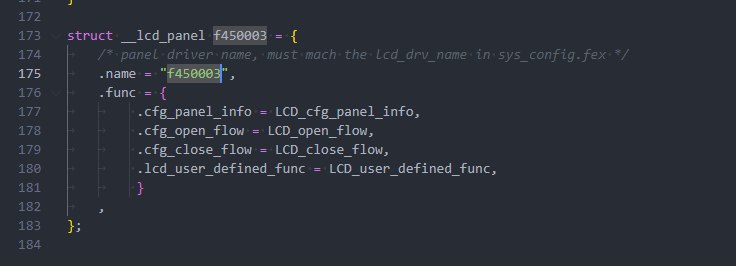

头文件也一并修改

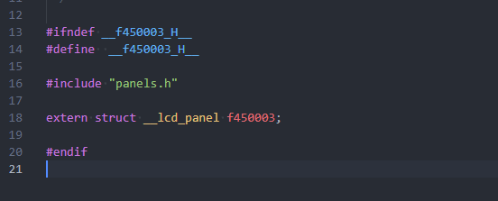

### 获取屏幕初始化序列

首先询问屏厂提供初始化序列，和屏幕手册。

![image-20250325113536368](data:image/png;base64,iVBORw0KGgoAAAANSUhEUgAAAQgAAAAtCAYAAABS4PXOAAAMsklEQVR4nO2dS2wbxxnH/9umtRU3rwIyUCA5FCCFQGAfTuzYWcVwEhtxl0pRAnGFBEEiFC2WvTQkiuhQVLfqUECX5aFoxUMLBWkTCA1KI9ESARLXbi3W8iWpQxCBlkEgBDYau36mih8S+fWwu9zZ5e7sQxSVyPMDBNqc+Wa+efDbmeHunxIREQQCgcCHr2y2AwKB4IuLCBACgSAQESAEAkEgIkAIBIJARIAQCASB3JHE6P0zH+K9Dz7k5hnYvh1PPfkovnnfPYkcEwgEm0+iAPHeBx/ix7nDGBjYHpjnwuWrePfEIg4e2CuChEDwJSXxFoMXHABg8L57sH//I3j3xCIuXb6atBqBQLCJSHFulKLf/xatYzoAoLVG1msbALC2ar7ecWgU2375647NhctXcfz4KTz7zA965bMgFlXkpSkMGwsopDbbF8GXjVgrCG9w+PqrVWw7ehLbjp7Ejt+9Agx+CzfffstlM3jfPbh+40ZAiU2URiRI0ghKTU9SNQ9ppIQmgGpegpSvdluXRjp5zA+CBEmSIEl5uHOzaT51MXlG2MRmCSO+drbfzF/HD7/2sX9e37Ye0cYL8O1zPxu2/3zK9VTO5PeONWcecO14/nLKDJw/67Gz+sTuh0h+Jyf2FoNdObQHdmAlK2MlK+NW7R8YeHkS7Vb8O7dVNYPiuN8HzETJqUC54vlgNTE/V4M6WUAKTZRGKsgRgYigq2VkOxOpidJIFnXNABGB9AyK6e4PabM0hbLrnSry6SIyOjl2Hh9VO40ItFBA0AXalU8HspKEsHnu+B41bz/h+xVtvCRIUgVQ+TUZjRpke+yIQDMKJ3cV+alhGEQ+Y82bBzw7pgVdcySkzMD5k9QOQLOE8bkxGDNKZL/XBcXgRu4xupF7jFaelmnlaZnWWm26engfXTq0ly4d2ktrrTZ9un83rbXarr8/vvq3gBIN0mSQqpuvsmY4SbpKkDUy39FJBUjVWVONZKikkw+sbVc+u05PWbJGmsr44KrftpPJTPYpg9s+79sc36PYx0InFbbfvSLMr+jjpauecfdJT95+pu1R5oGfHeu/d47wyuTNn6R2of3R+7FOsIJwzhxWsjJaLUK7Rdj+ws+Aj5Oub1IozGpAMR1wVVJgXpScxOb8HGpqDn7Xk2qlDHls1LyiGw1PvhSGMkB9yfa1idJ4EZnJAoZC/ayhYcRoVhCpUYzJZXSa41pS2lfmKvJSGsUaUM4yWxjfvHYxI8Fbmfl8wDKdXeryls92WoBfLuKNVzBNLNWtepJsz6oVlJHBUAoR5kGAneWH7xyJUyaAzvxJaocmluoyhtMR2tsj4p1BrLWBAwoGXn8bO/Qadug13P32v3DvO6dwx/cewuVfvYxWK6EnqQJmNRnlrP8kUCY0yJ1lq7VczTHTjfngVHKEBetErrlU51ZbzacxN2aga+WaHoZcK2LadqY6jWLNncWZuPx9NJ8mStPAbGeZqFp9oGCGDGiytUVZsJbmvnnN9o8XM9DtNJphJmANxUbOfN/QIJenrL2qfYBp2xgYm0szAcovzc+vbkLHKxIpFBac7Zmh1ZH1DUh+3VrCSLYMVTf7IWweBNkBwXOEWyZn/iS1Aww0agEBwMfvXhB7BTHwwk/x2c9fxLXDj+LKoX24cmgfLj7+CC7/Io/Vs+dA7eRPj6cKs9Bk9vyATWSuus15zNVUuOZbqoAFayLlKs6VLTWUCa6wmke2rmHW73g/VcCCrjpBYGoYmuqO3uzZwkLsrwjsslIozBQA++qfLXNsOHlTQ8igjKzvQZUMbcLqrNQoxmS7/RWUUUMxbQc6c2VQX2ry06IQNl4JSBUmodbmMB/iQrM0Aik9hzGDOh9q7jzg2PHmCLdMzvxJaofmEuryMLwLCF+/e0SsALG22ga+cVfn//e+c6qz5Wi1AGoT2q32OtwxtxpyOYt8pTttdExGuVINXa4qM7p7ItWXmKuOuWzNDAGlqTJQKyJtrQKyZaBWTDvLZmWGOYQcQqPco+VbdRpFjGE0hc7KZxyzzhU+yI6bV8EMEYhmgfEYJ9qy5hxyeYMdLy2U6OPVS6p5CenGJIh8vtb1nQcpjl0zfI5wyuTOnyR2qSFkag2wu1xue3tBnAOLq4f30cr0b6j9n3O01mpT+3+f0af7d9M5eTed3fcwfbJnF32yZ1eCQ0rPu5pMADyHNWQd7sgkyz4HSEwhhiYztp46ug6BHHgHZu60dRxS6iqBPUjy+GO23T7A4vvuymtopHXqYe28B1fsoVf3YaKu2nXz0iK2P2i8XN3h6XPLxj4MNgx33qCxc2yDDn85fRn50DhkHkSeW0ntPGPJ85vtx6B/RyDWCuKrB0dxXX8Tl57L4eLjj+CC8kTXymGb8vS6g5a51fBLGMWYXEPNvvo6BpgdnuqcB6SLGeidvbG5KqnbS7YsmDQe7nsYpoaNBNsIE/asQpoahsFGe2UCGpwr1Hgjw6wKrKuwfRjIy5sqYKjCbAcyeoTlpoIZg+kbSUIlZ+9heWkev4KKDxqvGMyPO/Vn6xoM3tgZDdRQRtZ134l9kMuZB1w7Hry5xZs/Se0U5FTmoDyx39GJdSelzZ/+XMGLz/0ocv5XXjuKnzyfi1uNQCDw0ixhZByYjXSRWz+Jn8W4fj3o7shk+QQCQQRSBcyOzSHdp7vnEq0gojzuzbLrOw/i+999MG41AkEAVeSlLLzf96h670/xb3cSBQiBQHB7IBSlBAJBICJACASCQESAEAgEgYgAIRAIAhEBQiAQBJJItPbMmTMgAoja1qt5ZzRZ94+fP38Be/bsxuDgYI/dFQgE/SRRgCAiZDIZtNsE5ztSAgiAJOHMv9/HxYsXQUTYuXNnr3wVCAR9JvEWg3fzxNmzZ7G8vIxjfz+RtHiBQPAFIFGAICLP6gEAJECSAABKdhRPPHkQDzxwf0hJW1201m5KhLwepahuP6MK4PKFYGOLwHIUrMLaVc07fnTlDa0/qTCwu08i9b2Xvgvfct7nlbnBgrXAOgKEzflrK5h84wSe/8NR5Ep/xeQbJ7Byc7UrH4+tLloLwCW8qmeK7nvpq/mO4EenPGMMc+nuJ/NcdVK3elB3O9zEFoF19YHapfjFbReDMmP7rEOF6ihfhdwbzba3q/xmCSNSGo1Jtk9yqHiCQFQfO23uu/CtFCDgyyuzD4K16EGAmHzjBD6+cAXP7h3G1DMHsPOuO7Fy81ZXPi458zHm8aAQqOSggtFwBDwqRSkUFpwPi5JTHUEOK9+k/cisMgFN9pZlKgVr7ABVKyjLGiY6hU5AQ7iaURTSw+yz7FXks2Woukfwo6MsFGPQ/drhQyaW6g2jBKXkoKKOIFEpd7t6j5JjG2bpRHY9f6FghhOsw3302LNt5s4ljl3HZb/xsWX1ZtD9vDOvzAj19YCEAcJ8XfzoHM5f+xzP7h3GD3elkbl/EC89tQc7794Rs8TbSbTWo8/oDUQssQY9SjviisAqmNDqmLIDd7WCsjoZoFyUVHcyKqa6k2xr/jXnMYeAfuOUEdvHjRa+jQNPlHYDBGuBpAHCOn2wVwpBAaEd5zmwLS5aWyumHTGXyBM7jWHZHZRc4jNMNA1sh4tkIrAd37PMB3Rd7YqO095xYJaRvDMacA2H66zEPYcS+9gH4dvI8ERpN0iwFkj6LYb1wbcDw8cXrnDzRWUri9a69v2TDaQjS7gH19nZv/PawSFUBLZZwngR0Azn/CDjWeUlb1c07Pbqag3FaU7JnfHXu7bySXzsl/BtFHiitBspWAusc4vx7cF7sfPuO/Hm+waONZax+NE5vL7YwPlrK1a+uE+S3yaitezWQclBZVcqLNVpFINkzpn2hLYjIWY/s1sKc6sXqGy9QftgwBrTctYJTkouksJ1d0HhPvZd+JYDz5cNF6wF4onW2iwunqabt1bp5q1V+uS/V2j6rRop06+RMv0aTfzlHbr02ed089YqHTt+PKSkrS5aG1CurjLCtHZ7fdrkEo2NXqfe9etP6xGBZf1yC9mGtcu/P3VSE/6qmHtcA/rNU36Yj/5t7qfwLef9UFHajRWsJUrwy1qAcwYBmNuMl57ag0rhCCqFI5g6cgA7tn3NDj6JgtZWE60F2H2w5QPzFWWqsND5WrOTJ2DZ6DqDSPDddywR2FQBC3qG+W2MLOD51oDXrl6TKsyaor3WMsK336Qs6tqEy4dYPvZd+JYDr8w+CNYCCRWlTi0u4qGHHg7N98+TJ3HwiccTOSYQCDafRM9igAinT5829+bWMxjE/sAKzP8vLy/31luBQNBfou9GBHzM/Tk8f+v7Ze5+sZm+b1bdX+bx6h9CtFYgEAQiBGMEAkEg/welnkpwCj5UaQAAAABJRU5ErkJggg==)

屏厂会提供一个初始化代码：

```c
////////////////NV3049F+BOE4.5////////////////////

Write_LCD_REG_CMD(0xFF);
Write_LCD_REG_DATA(0x30);
Write_LCD_REG_CMD(0xFF);
Write_LCD_REG_DATA(0x49);
Write_LCD_REG_CMD(0xFF);
Write_LCD_REG_DATA(0x01);
Write_LCD_REG_CMD(0xe2);
Write_LCD_REG_DATA(0x00);

Write_LCD_REG_CMD(0xe2);
Write_LCD_REG_DATA(0x00);
//Write_LCD_REG_CMD(0xF1);
//Write_LCD_REG_DATA(0x0e);//bist

Write_LCD_REG_CMD(0x14);
Write_LCD_REG_DATA(0x08);//vbp_para[7:0]
Write_LCD_REG_CMD(0x11);
Write_LCD_REG_DATA(0x08);//vfp_para[7:0]
Write_LCD_REG_CMD(0x16);
Write_LCD_REG_DATA(0x14);//hfp
Write_LCD_REG_CMD(0x19);
Write_LCD_REG_DATA(0x19);//hbp

Write_LCD_REG_CMD(0x15);//vbp_seri[7:0]
Write_LCD_REG_DATA(0x08);
Write_LCD_REG_CMD(0x12);//vfp_seri[7:0]
Write_LCD_REG_DATA(0x08);
Write_LCD_REG_CMD(0x17);//hfp_seri
Write_LCD_REG_DATA(0x14);
Write_LCD_REG_CMD(0x1A);//hbp_seri
Write_LCD_REG_DATA(0x19);

Write_LCD_REG_CMD(0x20);
Write_LCD_REG_DATA(0x5c);
Write_LCD_REG_CMD(0x21);
Write_LCD_REG_DATA(0x02);//20241227
Write_LCD_REG_CMD(0x3b);
Write_LCD_REG_DATA(0x04);//LVD
Write_LCD_REG_CMD(0x41);
Write_LCD_REG_DATA(0x32);
Write_LCD_REG_CMD(0x45);
Write_LCD_REG_DATA(0x03);
Write_LCD_REG_CMD(0x46);
Write_LCD_REG_DATA(0x55);

//////////////SOURCE/////////////////
Write_LCD_REG_CMD(0x51);
Write_LCD_REG_DATA(0x36);
Write_LCD_REG_CMD(0x52);
Write_LCD_REG_DATA(0x01);

Write_LCD_REG_CMD(0x53);
Write_LCD_REG_DATA(0x20);
Write_LCD_REG_CMD(0x54);
Write_LCD_REG_DATA(0x12);
Write_LCD_REG_CMD(0x55);
Write_LCD_REG_DATA(0x01);

Write_LCD_REG_CMD(0x56);
Write_LCD_REG_DATA(0x03);

Write_LCD_REG_CMD(0x57);
Write_LCD_REG_DATA(0x37);

//Write_LCD_REG_CMD(0x59);
//Write_LCD_REG_DATA(0x00);
//Write_LCD_REG_CMD(0x5A);
//Write_LCD_REG_DATA(0x00);

Write_LCD_REG_CMD(0x5B);
Write_LCD_REG_DATA(0x82);
Write_LCD_REG_CMD(0x5C);
Write_LCD_REG_DATA(0x10);
Write_LCD_REG_CMD(0x5D);
Write_LCD_REG_DATA(0x80);//

Write_LCD_REG_CMD(0x79);
Write_LCD_REG_DATA(0xFE);
Write_LCD_REG_CMD(0x7D);
Write_LCD_REG_DATA(0x08);

//////////////SOURCE/////////////////

Write_LCD_REG_CMD(0x90);
Write_LCD_REG_DATA(0x00);//VSP
Write_LCD_REG_CMD(0x91);
Write_LCD_REG_DATA(0x00);//VSN

Write_LCD_REG_CMD(0x95);
Write_LCD_REG_DATA(0x0c);

Write_LCD_REG_CMD(0x94);
Write_LCD_REG_DATA(0x08);
Write_LCD_REG_CMD(0x96);
Write_LCD_REG_DATA(0x16);

Write_LCD_REG_CMD(0x98);
Write_LCD_REG_DATA(0x33);

Write_LCD_REG_CMD(0xca);
Write_LCD_REG_DATA(0x14);  
Write_LCD_REG_CMD(0xc8);
Write_LCD_REG_DATA(0x6e); 
Write_LCD_REG_CMD(0xcc);
Write_LCD_REG_DATA(0x12); 
Write_LCD_REG_CMD(0xe7);
Write_LCD_REG_DATA(0x30);
Write_LCD_REG_CMD(0xA0);
Write_LCD_REG_DATA(0x30);
Write_LCD_REG_CMD(0xB4);
Write_LCD_REG_DATA(0x30);
Write_LCD_REG_CMD(0xA1);
Write_LCD_REG_DATA(0x22);
Write_LCD_REG_CMD(0xB5);
Write_LCD_REG_DATA(0x21);
Write_LCD_REG_CMD(0xA2);
Write_LCD_REG_DATA(0x20);
Write_LCD_REG_CMD(0xB6);
Write_LCD_REG_DATA(0x1E);
Write_LCD_REG_CMD(0xA5);
Write_LCD_REG_DATA(0x0F);
Write_LCD_REG_CMD(0xB9);
Write_LCD_REG_DATA(0x11);
Write_LCD_REG_CMD(0xA6);
Write_LCD_REG_DATA(0x08);
Write_LCD_REG_CMD(0xBA);
Write_LCD_REG_DATA(0x07);
Write_LCD_REG_CMD(0xA7);
Write_LCD_REG_DATA(0x08);
Write_LCD_REG_CMD(0xBB);
Write_LCD_REG_DATA(0x08);
Write_LCD_REG_CMD(0xA3);
Write_LCD_REG_DATA(0x40);
Write_LCD_REG_CMD(0xB7);
Write_LCD_REG_DATA(0x42);
Write_LCD_REG_CMD(0xA4);
Write_LCD_REG_DATA(0x40);
Write_LCD_REG_CMD(0xB8);
Write_LCD_REG_DATA(0x42);
Write_LCD_REG_CMD(0xA8);
Write_LCD_REG_DATA(0x0F);
Write_LCD_REG_CMD(0xBC);
Write_LCD_REG_DATA(0x0E);
Write_LCD_REG_CMD(0xA9);
Write_LCD_REG_DATA(0x15);
Write_LCD_REG_CMD(0xBD);
Write_LCD_REG_DATA(0x14);
Write_LCD_REG_CMD(0xAA);
Write_LCD_REG_DATA(0x15);
Write_LCD_REG_CMD(0xBE);
Write_LCD_REG_DATA(0x15);
Write_LCD_REG_CMD(0xAB);
Write_LCD_REG_DATA(0x15);
Write_LCD_REG_CMD(0xBF);
Write_LCD_REG_DATA(0x14);
Write_LCD_REG_CMD(0xAC);
Write_LCD_REG_DATA(0x10);
Write_LCD_REG_CMD(0xC0);
Write_LCD_REG_DATA(0x10);
Write_LCD_REG_CMD(0xAD);
Write_LCD_REG_DATA(0x11);
Write_LCD_REG_CMD(0xC1);
Write_LCD_REG_DATA(0x12);
Write_LCD_REG_CMD(0xAE);
Write_LCD_REG_DATA(0x10);
Write_LCD_REG_CMD(0xC2);
Write_LCD_REG_DATA(0x13);
Write_LCD_REG_CMD(0xAF);
Write_LCD_REG_DATA(0x0f);
Write_LCD_REG_CMD(0xC3);
Write_LCD_REG_DATA(0x12);
Write_LCD_REG_CMD(0xB0);
Write_LCD_REG_DATA(0x10);
Write_LCD_REG_CMD(0xC4);
Write_LCD_REG_DATA(0x10);
Write_LCD_REG_CMD(0xB1);
Write_LCD_REG_DATA(0x08);
Write_LCD_REG_CMD(0xC5);
Write_LCD_REG_DATA(0x0A);

Write_LCD_REG_CMD(0xFF);
Write_LCD_REG_DATA(0x30);
Write_LCD_REG_CMD(0xFF);
Write_LCD_REG_DATA(0x49);
Write_LCD_REG_CMD(0xFF);
Write_LCD_REG_DATA(0x03);

///////////////////////////GOA//////////////////////////////
Write_LCD_REG_CMD(0x27);
Write_LCD_REG_DATA(0x88);
Write_LCD_REG_CMD(0x28);
Write_LCD_REG_DATA(0x06);
Write_LCD_REG_CMD(0x29);
Write_LCD_REG_DATA(0x04);

Write_LCD_REG_CMD(0x36);
Write_LCD_REG_DATA(0x88);
Write_LCD_REG_CMD(0x37);
Write_LCD_REG_DATA(0x05);
Write_LCD_REG_CMD(0x38);
Write_LCD_REG_DATA(0x03);

Write_LCD_REG_CMD(0x2a);
Write_LCD_REG_DATA(0x11);
Write_LCD_REG_CMD(0x2b);
Write_LCD_REG_DATA(0x60);
Write_LCD_REG_CMD(0x2c);
Write_LCD_REG_DATA(0x80);

Write_LCD_REG_CMD(0x79);
Write_LCD_REG_DATA(0x3f);
Write_LCD_REG_CMD(0x7a);
Write_LCD_REG_DATA(0x3f);

Write_LCD_REG_CMD(0x7B);
Write_LCD_REG_DATA(0x30);

Write_LCD_REG_CMD(0x80);
Write_LCD_REG_DATA(0x85);
Write_LCD_REG_CMD(0x81);
Write_LCD_REG_DATA(0x13);
Write_LCD_REG_CMD(0x82);
Write_LCD_REG_DATA(0x5a);
Write_LCD_REG_CMD(0x83);
Write_LCD_REG_DATA(0x05);
Write_LCD_REG_CMD(0x84);
Write_LCD_REG_DATA(0x60);
Write_LCD_REG_CMD(0x85);
Write_LCD_REG_DATA(0x80);

Write_LCD_REG_CMD(0x88);
Write_LCD_REG_DATA(0x84);
Write_LCD_REG_CMD(0x89);
Write_LCD_REG_DATA(0x13);
Write_LCD_REG_CMD(0x8A);
Write_LCD_REG_DATA(0x5b);
Write_LCD_REG_CMD(0x8B);
Write_LCD_REG_DATA(0x11);
Write_LCD_REG_CMD(0x8C);
Write_LCD_REG_DATA(0x60);
Write_LCD_REG_CMD(0x8D);
Write_LCD_REG_DATA(0x80);

Write_LCD_REG_CMD(0x8E);
Write_LCD_REG_DATA(0x83);
Write_LCD_REG_CMD(0x8F);
Write_LCD_REG_DATA(0x13);
Write_LCD_REG_CMD(0x90);
Write_LCD_REG_DATA(0x5c);
Write_LCD_REG_CMD(0x91);
Write_LCD_REG_DATA(0x11);
Write_LCD_REG_CMD(0x92);
Write_LCD_REG_DATA(0x60);
Write_LCD_REG_CMD(0x93);
Write_LCD_REG_DATA(0x80);

Write_LCD_REG_CMD(0x94);
Write_LCD_REG_DATA(0x82);
Write_LCD_REG_CMD(0x95);
Write_LCD_REG_DATA(0x13);
Write_LCD_REG_CMD(0x96);
Write_LCD_REG_DATA(0x5d);
Write_LCD_REG_CMD(0x97);
Write_LCD_REG_DATA(0x11);
Write_LCD_REG_CMD(0x98);
Write_LCD_REG_DATA(0x60);
Write_LCD_REG_CMD(0x99);
Write_LCD_REG_DATA(0x80);
///////////////////////////GOA//////////////////////////////

/////////////////////////GOA MAP//////////////////////

Write_LCD_REG_CMD(0xD0);
Write_LCD_REG_DATA(0x1F);
Write_LCD_REG_CMD(0xD1);
Write_LCD_REG_DATA(0x1A);
Write_LCD_REG_CMD(0xD2);
Write_LCD_REG_DATA(0x0A);
Write_LCD_REG_CMD(0xD3);
Write_LCD_REG_DATA(0x0C);
Write_LCD_REG_CMD(0xD4);
Write_LCD_REG_DATA(0x04);
Write_LCD_REG_CMD(0xD5);
Write_LCD_REG_DATA(0x1B);
Write_LCD_REG_CMD(0xD6);
Write_LCD_REG_DATA(0x1F);
Write_LCD_REG_CMD(0xD7);
Write_LCD_REG_DATA(0x1F);
Write_LCD_REG_CMD(0xD8);
Write_LCD_REG_DATA(0x1F);
Write_LCD_REG_CMD(0xD9);
Write_LCD_REG_DATA(0x1F);
Write_LCD_REG_CMD(0xDA);
Write_LCD_REG_DATA(0x1f);
Write_LCD_REG_CMD(0xDB);
Write_LCD_REG_DATA(0x1f);
Write_LCD_REG_CMD(0xDC);
Write_LCD_REG_DATA(0x1F);
Write_LCD_REG_CMD(0xDD);
Write_LCD_REG_DATA(0x1F);
Write_LCD_REG_CMD(0xDE);
Write_LCD_REG_DATA(0x1F);
Write_LCD_REG_CMD(0xDF);
Write_LCD_REG_DATA(0x1F);

Write_LCD_REG_CMD(0xE0);
Write_LCD_REG_DATA(0x1F);
Write_LCD_REG_CMD(0xE1);
Write_LCD_REG_DATA(0x1F);
Write_LCD_REG_CMD(0xE2);
Write_LCD_REG_DATA(0x1f);
Write_LCD_REG_CMD(0xE3);
Write_LCD_REG_DATA(0x1f);
Write_LCD_REG_CMD(0xE4);
Write_LCD_REG_DATA(0x1f);
Write_LCD_REG_CMD(0xE5);
Write_LCD_REG_DATA(0x1f);
Write_LCD_REG_CMD(0xE6);
Write_LCD_REG_DATA(0x1F);
Write_LCD_REG_CMD(0xE7);
Write_LCD_REG_DATA(0x1F);
Write_LCD_REG_CMD(0xE8);
Write_LCD_REG_DATA(0x1F);
Write_LCD_REG_CMD(0xE9);
Write_LCD_REG_DATA(0x1F);
Write_LCD_REG_CMD(0xEA);
Write_LCD_REG_DATA(0x1B);
Write_LCD_REG_CMD(0xEB);
Write_LCD_REG_DATA(0x05);
Write_LCD_REG_CMD(0xEC);
Write_LCD_REG_DATA(0x0D);
Write_LCD_REG_CMD(0xED);
Write_LCD_REG_DATA(0x0B);
Write_LCD_REG_CMD(0xEE);
Write_LCD_REG_DATA(0x1A);
Write_LCD_REG_CMD(0xEF);
Write_LCD_REG_DATA(0x1F);

/////////////////////////GOA MAP//////////////////////
//Write_LCD_REG_CMD(0xf7);
//Write_LCD_REG_DATA(0x20);
//Write_LCD_REG_CMD(0xf8);
//Write_LCD_REG_DATA(0x20);

//HL Temp test
Write_LCD_REG_CMD(0xf7);
Write_LCD_REG_DATA(0x50);
Write_LCD_REG_CMD(0xf8);
Write_LCD_REG_DATA(0x50);

Write_LCD_REG_CMD(0xFF);
Write_LCD_REG_DATA(0x30);
Write_LCD_REG_CMD(0xFF);
Write_LCD_REG_DATA(0x49);
Write_LCD_REG_CMD(0xFF);
Write_LCD_REG_DATA(0x00);
Write_LCD_REG_CMD(0xF1);
Write_LCD_REG_DATA(0xC4);//
//Write_LCD_REG_CMD(0x35);
//Write_LCD_REG_DATA(0x00);
//Write_LCD_REG_CMD(0x3A);
//Write_LCD_REG_DATA(0x50);
Write_LCD_REG_CMD(0x11);
Write_LCD_REG_DATA(0x00);	
Delay(600);
Write_LCD_REG_CMD(0x29);
Write_LCD_REG_DATA(0x00);
Delay(500);
```

由于是 RGB 屏幕，RGB 屏幕需要使用独立的接口去写初始化代码，查询屏幕驱动 IC 手册可知是使用的是 3 线 9 BIT SPI 协议：

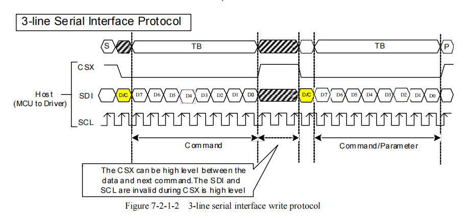

其通过第一个 BIT 高低区分是 Command 还是 Data。

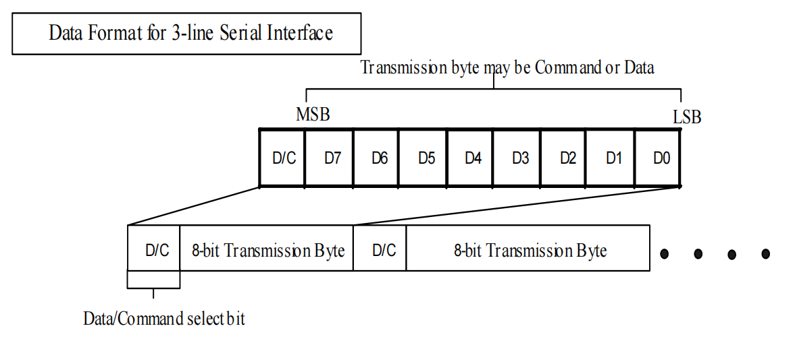

正常情况下 SPI 发送为 8 Bit 模式，不支持 9 Bit 发送。这里一般采用 GPIO 模拟生成 SPI 时序方式。

先配置设备树，设置对应的引脚

```c
lcd_gpio_0 = <&pio PD 17 GPIO_ACTIVE_LOW>; // RESET
lcd_gpio_1 = <&pio PD 15 GPIO_ACTIVE_LOW>; // SCK
lcd_gpio_2 = <&pio PD 16 GPIO_ACTIVE_LOW>; // SDA
lcd_gpio_3 = <&pio PD 14 GPIO_ACTIVE_LOW>; // CS
```

然后编写驱动代码，模拟该时序

```c
#define LCD_MOSI_PIN (2)  // lcd_gpio_2
#define LCD_CLK_PIN  (1)  // lcd_gpio_1
#define LCD_RST_PIN  (0)  // lcd_gpio_0
#define LCD_CS_PIN   (3)  // lcd_gpio_3

static void spi_send_data(u32 sel, u8 i)
{
	u8 n;
	for (n = 0; n < 8; n++) {
		if (i & 0x80)
			sunxi_lcd_gpio_set_value(sel, LCD_MOSI_PIN, 1);
		else
			sunxi_lcd_gpio_set_value(sel, LCD_MOSI_PIN, 0);

		i <<= 1;
		sunxi_lcd_gpio_set_value(sel, LCD_CLK_PIN, 0);
		sunxi_lcd_gpio_set_value(sel, LCD_CLK_PIN, 1);
	}
}

static void spi_write_cmd(u32 sel, u8 i)
{
	sunxi_lcd_gpio_set_value(sel, LCD_CS_PIN, 0);
	sunxi_lcd_gpio_set_value(sel, LCD_MOSI_PIN, 0);
	sunxi_lcd_gpio_set_value(sel, LCD_CLK_PIN, 0);
	sunxi_lcd_gpio_set_value(sel, LCD_CLK_PIN, 1);
	spi_send_data(sel, i);
	sunxi_lcd_gpio_set_value(sel, LCD_CS_PIN, 1);
}

static void spi_write_data(u32 sel, u8 i)
{
	sunxi_lcd_gpio_set_value(sel, LCD_CS_PIN, 0);
	sunxi_lcd_gpio_set_value(sel, LCD_MOSI_PIN, 1);
	sunxi_lcd_gpio_set_value(sel, LCD_CLK_PIN, 0);
	sunxi_lcd_gpio_set_value(sel, LCD_CLK_PIN, 1);
	spi_send_data(sel, i);
	sunxi_lcd_gpio_set_value(sel, LCD_CS_PIN, 1);
}
```

### 实现屏幕初始化

把上面实现的 GPIO 模拟 3SPI 函数写入驱动程序。

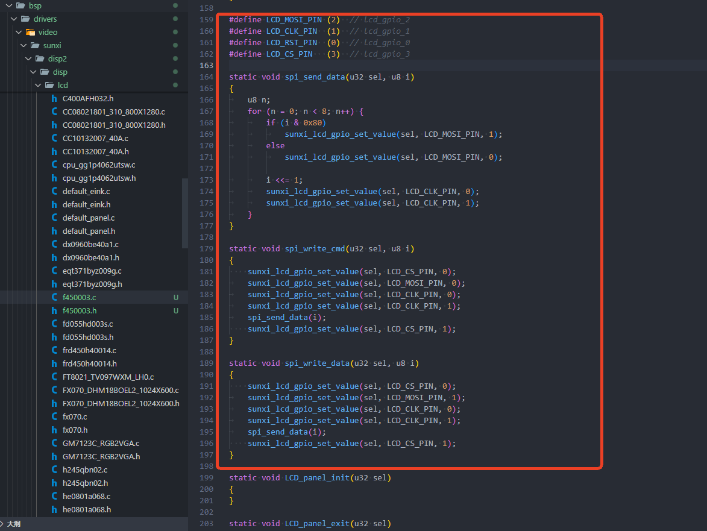

然后实现 `LCD_panel_init` 函数内容，写入初始化时序。

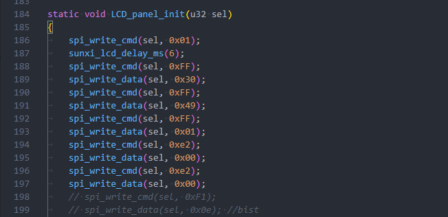

实现开关屏函数，主要是操作 RST 引脚

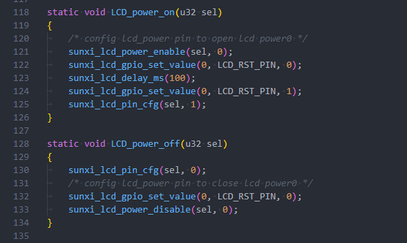

### 实现完整驱动

完整驱动如下：

头文件：

```
#ifndef __f450003_H__
#define  __f450003_H__

#include "panels.h"

extern struct __lcd_panel f450003;

#endif
```

驱动：

```c
#include "f450003.h"

#define LCD_MOSI_PIN (2)  // lcd_gpio_2
#define LCD_CLK_PIN  (1)  // lcd_gpio_1
#define LCD_RST_PIN  (0)  // lcd_gpio_0
#define LCD_CS_PIN   (3)  // lcd_gpio_3

static void LCD_power_on(u32 sel);
static void LCD_power_off(u32 sel);
static void LCD_bl_open(u32 sel);
static void LCD_bl_close(u32 sel);

static void LCD_panel_init(u32 sel);
static void LCD_panel_exit(u32 sel);

static void LCD_cfg_panel_info(struct panel_extend_para *info)
{
	u32 i = 0, j = 0;
	u32 items;
	u8 lcd_gamma_tbl[][2] = {
		/* {input value, corrected value} */
		{0, 0},
		{15, 15},
		{30, 30},
		{45, 45},
		{60, 60},
		{75, 75},
		{90, 90},
		{105, 105},
		{120, 120},
		{135, 135},
		{150, 150},
		{165, 165},
		{180, 180},
		{195, 195},
		{210, 210},
		{225, 225},
		{240, 240},
		{255, 255},
	};

	u32 lcd_cmap_tbl[2][3][4] = {
		{
		{LCD_CMAP_G0, LCD_CMAP_B1, LCD_CMAP_G2, LCD_CMAP_B3},
		{LCD_CMAP_B0, LCD_CMAP_R1, LCD_CMAP_B2, LCD_CMAP_R3},
		{LCD_CMAP_R0, LCD_CMAP_G1, LCD_CMAP_R2, LCD_CMAP_G3},
		},
		{
		{LCD_CMAP_B3, LCD_CMAP_G2, LCD_CMAP_B1, LCD_CMAP_G0},
		{LCD_CMAP_R3, LCD_CMAP_B2, LCD_CMAP_R1, LCD_CMAP_B0},
		{LCD_CMAP_G3, LCD_CMAP_R2, LCD_CMAP_G1, LCD_CMAP_R0},
		},
	};

	items = sizeof(lcd_gamma_tbl) / 2;
	for (i = 0; i < items - 1; i++) {
		u32 num = lcd_gamma_tbl[i + 1][0] - lcd_gamma_tbl[i][0];

		for (j = 0; j < num; j++) {
			u32 value = 0;

			value =
				lcd_gamma_tbl[i][1] +
				((lcd_gamma_tbl[i + 1][1] -
				lcd_gamma_tbl[i][1]) * j) / num;
			info->lcd_gamma_tbl[lcd_gamma_tbl[i][0] + j] =
				(value << 16) + (value << 8) + value;
		}
	}
	info->lcd_gamma_tbl[255] =
		(lcd_gamma_tbl[items - 1][1] << 16) +
		(lcd_gamma_tbl[items - 1][1] << 8) + lcd_gamma_tbl[items - 1][1];

	memcpy(info->lcd_cmap_tbl, lcd_cmap_tbl, sizeof(lcd_cmap_tbl));

}

static s32 LCD_open_flow(u32 sel)
{
	/* open lcd power, and delay 50ms */
	LCD_OPEN_FUNC(sel, LCD_power_on, 30);
	/* open lcd power, than delay 200ms */
	LCD_OPEN_FUNC(sel, LCD_panel_init, 50);
	/* open lcd controller, and delay 100ms */
	LCD_OPEN_FUNC(sel, sunxi_lcd_tcon_enable, 100);
	/* open lcd backlight, and delay 0ms */
	LCD_OPEN_FUNC(sel, LCD_bl_open, 0);

	return 0;
}

static s32 LCD_close_flow(u32 sel)
{
	/* close lcd backlight, and delay 0ms */
	LCD_CLOSE_FUNC(sel, LCD_bl_close, 0);
	/* close lcd controller, and delay 0ms */
	LCD_CLOSE_FUNC(sel, sunxi_lcd_tcon_disable, 0);
	/* open lcd power, than delay 200ms */
	LCD_CLOSE_FUNC(sel, LCD_panel_exit, 200);
	/* close lcd power, and delay 500ms */
	LCD_CLOSE_FUNC(sel, LCD_power_off, 500);

	return 0;
}

static void LCD_power_on(u32 sel)
{
	/* config lcd_power pin to open lcd power0 */
	sunxi_lcd_power_enable(sel, 0);
	sunxi_lcd_gpio_set_value(0, LCD_RST_PIN, 0);
	sunxi_lcd_delay_ms(100);
	sunxi_lcd_gpio_set_value(0, LCD_RST_PIN, 1);
	sunxi_lcd_pin_cfg(sel, 1);
}

static void LCD_power_off(u32 sel)
{
	sunxi_lcd_pin_cfg(sel, 0);
	/* config lcd_power pin to close lcd power0 */
	sunxi_lcd_gpio_set_value(0, LCD_RST_PIN, 0);
	sunxi_lcd_power_disable(sel, 0);
}

static void LCD_bl_open(u32 sel)
{
	sunxi_lcd_pwm_enable(sel);
	sunxi_lcd_backlight_enable(sel);
}

static void LCD_bl_close(u32 sel)
{
	/* config lcd_bl_en pin to close lcd backlight */
	sunxi_lcd_backlight_disable(sel);
	sunxi_lcd_pwm_disable(sel);
}

static void spi_send_data(u32 sel, u8 i)
{
	u8 n;
	for (n = 0; n < 8; n++) {
		if (i & 0x80)
			sunxi_lcd_gpio_set_value(sel, LCD_MOSI_PIN, 1);
		else
			sunxi_lcd_gpio_set_value(sel, LCD_MOSI_PIN, 0);

		i <<= 1;
		sunxi_lcd_gpio_set_value(sel, LCD_CLK_PIN, 0);
		sunxi_lcd_gpio_set_value(sel, LCD_CLK_PIN, 1);
	}
}

static void spi_write_cmd(u32 sel, u8 i)
{
	sunxi_lcd_gpio_set_value(sel, LCD_CS_PIN, 0);
	sunxi_lcd_gpio_set_value(sel, LCD_MOSI_PIN, 0);
	sunxi_lcd_gpio_set_value(sel, LCD_CLK_PIN, 0);
	sunxi_lcd_gpio_set_value(sel, LCD_CLK_PIN, 1);
	spi_send_data(sel, i);
	sunxi_lcd_gpio_set_value(sel, LCD_CS_PIN, 1);
}

static void spi_write_data(u32 sel, u8 i)
{
	sunxi_lcd_gpio_set_value(sel, LCD_CS_PIN, 0);
	sunxi_lcd_gpio_set_value(sel, LCD_MOSI_PIN, 1);
	sunxi_lcd_gpio_set_value(sel, LCD_CLK_PIN, 0);
	sunxi_lcd_gpio_set_value(sel, LCD_CLK_PIN, 1);
	spi_send_data(sel, i);
	sunxi_lcd_gpio_set_value(sel, LCD_CS_PIN, 1);
}

static void LCD_panel_init(u32 sel)
{
	spi_write_cmd(sel, 0x01);
	sunxi_lcd_delay_ms(6);
	spi_write_cmd(sel, 0xFF);
	spi_write_data(sel, 0x30);
	spi_write_cmd(sel, 0xFF);
	spi_write_data(sel, 0x49);
	spi_write_cmd(sel, 0xFF);
	spi_write_data(sel, 0x01);
	spi_write_cmd(sel, 0xe2);
	spi_write_data(sel, 0x00);
	spi_write_cmd(sel, 0xe2);
	spi_write_data(sel, 0x00);
	// spi_write_cmd(sel, 0xF1);
	// spi_write_data(sel, 0x0e); //bist
	spi_write_cmd(sel, 0x14);
	spi_write_data(sel, 0x08); //vbp_para[7:0]
	spi_write_cmd(sel, 0x11);
	spi_write_data(sel, 0x08); //vfp_para[7:0]
	spi_write_cmd(sel, 0x16);
	spi_write_data(sel, 0x14); //hfp
	spi_write_cmd(sel, 0x19);
	spi_write_data(sel, 0x19); //hbp
	spi_write_cmd(sel, 0x15); //vbp_seri[7:0]
	spi_write_data(sel, 0x08);
	spi_write_cmd(sel, 0x12); //vfp_seri[7:0]
	spi_write_data(sel, 0x08);
	spi_write_cmd(sel, 0x17); //hfp_seri
	spi_write_data(sel, 0x14);
	spi_write_cmd(sel, 0x1A); //hbp_seri
	spi_write_data(sel, 0x19);
	spi_write_cmd(sel, 0x20);
	spi_write_data(sel, 0x5c);
	spi_write_cmd(sel, 0x21);
	spi_write_data(sel, 0x02);
	spi_write_cmd(sel, 0x3b);
	spi_write_data(sel, 0x04); //LVD
	spi_write_cmd(sel, 0x41);
	spi_write_data(sel, 0x32);
	spi_write_cmd(sel, 0x45);
	spi_write_data(sel, 0x03);
	spi_write_cmd(sel, 0x46);
	spi_write_data(sel, 0x55);
	//////////////SOURCE/////////////////
	spi_write_cmd(sel, 0x51);
	spi_write_data(sel, 0x36);
	spi_write_cmd(sel, 0x52);
	spi_write_data(sel, 0x01);
	spi_write_cmd(sel, 0x53);
	spi_write_data(sel, 0x20);
	spi_write_cmd(sel, 0x54);
	spi_write_data(sel, 0x12);
	spi_write_cmd(sel, 0x55);
	spi_write_data(sel, 0x01);
	spi_write_cmd(sel, 0x56);
	spi_write_data(sel, 0x03);
	spi_write_cmd(sel, 0x57);
	spi_write_data(sel, 0x37);
	//Write_LCD_REG(0x0000,0x0059);
	//Write_LCD_REG(0x0000,0x0100);
	//Write_LCD_REG(0x0000,0x005A);
	//Write_LCD_REG(0x0000,0x0100);
	spi_write_cmd(sel, 0x5B);
	spi_write_data(sel, 0x82);
	spi_write_cmd(sel, 0x5C);
	spi_write_data(sel, 0x10);
	spi_write_cmd(sel, 0x5D);
	spi_write_data(sel, 0x80); //
	spi_write_cmd(sel, 0x79);
	spi_write_data(sel, 0xFE);
	spi_write_cmd(sel, 0x7D);
	spi_write_data(sel, 0x08);
	//////////////SOURCE/////////////////
	spi_write_cmd(sel, 0x90);
	spi_write_data(sel, 0x00); //VSP
	spi_write_cmd(sel, 0x91);
	spi_write_data(sel, 0x00); //VSN
	spi_write_cmd(sel, 0x95);
	spi_write_data(sel, 0x0c);
	spi_write_cmd(sel, 0x94);
	spi_write_data(sel, 0x08);
	spi_write_cmd(sel, 0x96);
	spi_write_data(sel, 0x16);
	spi_write_cmd(sel, 0x98);
	spi_write_data(sel, 0x33);
	spi_write_cmd(sel, 0xca);
	spi_write_data(sel, 0x14);
	spi_write_cmd(sel, 0xc8);
	spi_write_data(sel, 0x6e);
	spi_write_cmd(sel, 0xcc);
	spi_write_data(sel, 0x12);
	spi_write_cmd(sel, 0xe7);
	spi_write_data(sel, 0x30);
	spi_write_cmd(sel, 0xA0);
	spi_write_data(sel, 0x30);
	spi_write_cmd(sel, 0xB4);
	spi_write_data(sel, 0x30);
	spi_write_cmd(sel, 0xA1);
	spi_write_data(sel, 0x22);
	spi_write_cmd(sel, 0xB5);
	spi_write_data(sel, 0x21);
	spi_write_cmd(sel, 0xA2);
	spi_write_data(sel, 0x20);
	spi_write_cmd(sel, 0xB6);
	spi_write_data(sel, 0x1E);
	spi_write_cmd(sel, 0xA5);
	spi_write_data(sel, 0x0F);
	spi_write_cmd(sel, 0xB9);
	spi_write_data(sel, 0x11);
	spi_write_cmd(sel, 0xA6);
	spi_write_data(sel, 0x08);
	spi_write_cmd(sel, 0xBA);
	spi_write_data(sel, 0x07);
	spi_write_cmd(sel, 0xA7);
	spi_write_data(sel, 0x08);
	spi_write_cmd(sel, 0xBB);
	spi_write_data(sel, 0x08);
	spi_write_cmd(sel, 0xA3);
	spi_write_data(sel, 0x40);
	spi_write_cmd(sel, 0xB7);
	spi_write_data(sel, 0x42);
	spi_write_cmd(sel, 0xA4);
	spi_write_data(sel, 0x40);
	spi_write_cmd(sel, 0xB8);
	spi_write_data(sel, 0x42);
	spi_write_cmd(sel, 0xA8);
	spi_write_data(sel, 0x0F);
	spi_write_cmd(sel, 0xBC);
	spi_write_data(sel, 0x0E);
	spi_write_cmd(sel, 0xA9);
	spi_write_data(sel, 0x15);
	spi_write_cmd(sel, 0xBD);
	spi_write_data(sel, 0x14);
	spi_write_cmd(sel, 0xAA);
	spi_write_data(sel, 0x15);
	spi_write_cmd(sel, 0xBE);
	spi_write_data(sel, 0x15);
	spi_write_cmd(sel, 0xAB);
	spi_write_data(sel, 0x15);
	spi_write_cmd(sel, 0xBF);
	spi_write_data(sel, 0x14);
	spi_write_cmd(sel, 0xAC);
	spi_write_data(sel, 0x10);
	spi_write_cmd(sel, 0xC0);
	spi_write_data(sel, 0x10);
	spi_write_cmd(sel, 0xAD);
	spi_write_data(sel, 0x11);
	spi_write_cmd(sel, 0xC1);
	spi_write_data(sel, 0x12);
	spi_write_cmd(sel, 0xAE);
	spi_write_data(sel, 0x10);
	spi_write_cmd(sel, 0xC2);
	spi_write_data(sel, 0x13);
	spi_write_cmd(sel, 0xAF);
	spi_write_data(sel, 0x0f);
	spi_write_cmd(sel, 0xC3);
	spi_write_data(sel, 0x12);
	spi_write_cmd(sel, 0xB0);
	spi_write_data(sel, 0x10);
	spi_write_cmd(sel, 0xC4);
	spi_write_data(sel, 0x10);
	spi_write_cmd(sel, 0xB1);
	spi_write_data(sel, 0x08);
	spi_write_cmd(sel, 0xC5);
	spi_write_data(sel, 0x0A);
	spi_write_cmd(sel, 0xFF);
	spi_write_data(sel, 0x30);
	spi_write_cmd(sel, 0xFF);
	spi_write_data(sel, 0x49);
	spi_write_cmd(sel, 0xFF);
	spi_write_data(sel, 0x03);
	///////////////////////////GOA//////////////////////////////
	spi_write_cmd(sel, 0x27);
	spi_write_data(sel, 0x88);
	spi_write_cmd(sel, 0x28);
	spi_write_data(sel, 0x06);
	spi_write_cmd(sel, 0x29);
	spi_write_data(sel, 0x04);
	spi_write_cmd(sel, 0x36);
	spi_write_data(sel, 0x88);
	spi_write_cmd(sel, 0x37);
	spi_write_data(sel, 0x05);
	spi_write_cmd(sel, 0x38);
	spi_write_data(sel, 0x03);
	spi_write_cmd(sel, 0x2a);
	spi_write_data(sel, 0x11);
	spi_write_cmd(sel, 0x2b);
	spi_write_data(sel, 0x60);
	spi_write_cmd(sel, 0x2c);
	spi_write_data(sel, 0x80);
	spi_write_cmd(sel, 0x79);
	spi_write_data(sel, 0x3f);
	spi_write_cmd(sel, 0x7a);
	spi_write_data(sel, 0x3f);
	spi_write_cmd(sel, 0x7B);
	spi_write_data(sel, 0x30);
	spi_write_cmd(sel, 0x80);
	spi_write_data(sel, 0x85);
	spi_write_cmd(sel, 0x81);
	spi_write_data(sel, 0x13);
	spi_write_cmd(sel, 0x82);
	spi_write_data(sel, 0x5a);
	spi_write_cmd(sel, 0x83);
	spi_write_data(sel, 0x05);
	spi_write_cmd(sel, 0x84);
	spi_write_data(sel, 0x60);
	spi_write_cmd(sel, 0x85);
	spi_write_data(sel, 0x80);
	spi_write_cmd(sel, 0x88);
	spi_write_data(sel, 0x84);
	spi_write_cmd(sel, 0x89);
	spi_write_data(sel, 0x13);
	spi_write_cmd(sel, 0x8A);
	spi_write_data(sel, 0x5b);
	spi_write_cmd(sel, 0x8B);
	spi_write_data(sel, 0x11);
	spi_write_cmd(sel, 0x8C);
	spi_write_data(sel, 0x60);
	spi_write_cmd(sel, 0x8D);
	spi_write_data(sel, 0x80);
	spi_write_cmd(sel, 0x8E);
	spi_write_data(sel, 0x83);
	spi_write_cmd(sel, 0x8F);
	spi_write_data(sel, 0x13);
	spi_write_cmd(sel, 0x90);
	spi_write_data(sel, 0x5c);
	spi_write_cmd(sel, 0x91);
	spi_write_data(sel, 0x11);
	spi_write_cmd(sel, 0x92);
	spi_write_data(sel, 0x60);
	spi_write_cmd(sel, 0x93);
	spi_write_data(sel, 0x80);
	spi_write_cmd(sel, 0x94);
	spi_write_data(sel, 0x82);
	spi_write_cmd(sel, 0x95);
	spi_write_data(sel, 0x13);
	spi_write_cmd(sel, 0x96);
	spi_write_data(sel, 0x5d);
	spi_write_cmd(sel, 0x97);
	spi_write_data(sel, 0x11);
	spi_write_cmd(sel, 0x98);
	spi_write_data(sel, 0x60);
	spi_write_cmd(sel, 0x99);
	spi_write_data(sel, 0x80);
	///////////////////////////GOA//////////////////////////////
	/////////////////////////GOA MAP//////////////////////
	spi_write_cmd(sel, 0xD0);
	spi_write_data(sel, 0x1F);
	spi_write_cmd(sel, 0xD1);
	spi_write_data(sel, 0x1A);
	spi_write_cmd(sel, 0xD2);
	spi_write_data(sel, 0x0A);
	spi_write_cmd(sel, 0xD3);
	spi_write_data(sel, 0x0C);
	spi_write_cmd(sel, 0xD4);
	spi_write_data(sel, 0x04);
	spi_write_cmd(sel, 0xD5);
	spi_write_data(sel, 0x1B);
	spi_write_cmd(sel, 0xD6);
	spi_write_data(sel, 0x1F);
	spi_write_cmd(sel, 0xD7);
	spi_write_data(sel, 0x1F);
	spi_write_cmd(sel, 0xD8);
	spi_write_data(sel, 0x1F);
	spi_write_cmd(sel, 0xD9);
	spi_write_data(sel, 0x1F);
	spi_write_cmd(sel, 0xDA);
	spi_write_data(sel, 0x1f);
	spi_write_cmd(sel, 0xDB);
	spi_write_data(sel, 0x1f);
	spi_write_cmd(sel, 0xDC);
	spi_write_data(sel, 0x1F);
	spi_write_cmd(sel, 0xDD);
	spi_write_data(sel, 0x1F);
	spi_write_cmd(sel, 0xDE);
	spi_write_data(sel, 0x1F);
	spi_write_cmd(sel, 0xDF);
	spi_write_data(sel, 0x1F);
	spi_write_cmd(sel, 0xE0);
	spi_write_data(sel, 0x1F);
	spi_write_cmd(sel, 0xE1);
	spi_write_data(sel, 0x1F);
	spi_write_cmd(sel, 0xE2);
	spi_write_data(sel, 0x1f);
	spi_write_cmd(sel, 0xE3);
	spi_write_data(sel, 0x1f);
	spi_write_cmd(sel, 0xE4);
	spi_write_data(sel, 0x1f);
	spi_write_cmd(sel, 0xE5);
	spi_write_data(sel, 0x1f);
	spi_write_cmd(sel, 0xE6);
	spi_write_data(sel, 0x1F);
	spi_write_cmd(sel, 0xE7);
	spi_write_data(sel, 0x1F);
	spi_write_cmd(sel, 0xE8);
	spi_write_data(sel, 0x1F);
	spi_write_cmd(sel, 0xE9);
	spi_write_data(sel, 0x1F);
	spi_write_cmd(sel, 0xEA);
	spi_write_data(sel, 0x1B);
	spi_write_cmd(sel, 0xEB);
	spi_write_data(sel, 0x05);
	spi_write_cmd(sel, 0xEC);
	spi_write_data(sel, 0x0D);
	spi_write_cmd(sel, 0xED);
	spi_write_data(sel, 0x0B);
	spi_write_cmd(sel, 0xEE);
	spi_write_data(sel, 0x1A);
	spi_write_cmd(sel, 0xEF);
	spi_write_data(sel, 0x1F);
	/////////////////////////GOA MAP//////////////////////
	//Write_LCD_REG(0x0000,0x00f7);
	//Write_LCD_REG(0x0000,0x0120);
	//Write_LCD_REG(0x0000,0x00f8);
	//Write_LCD_REG(0x0000,0x0120);
	//HL Temp test
	spi_write_cmd(sel, 0xf7);
	spi_write_data(sel, 0x50);
	spi_write_cmd(sel, 0xf8);
	spi_write_data(sel, 0x50);
	spi_write_cmd(sel, 0xFF);
	spi_write_data(sel, 0x30);
	spi_write_cmd(sel, 0xFF);
	spi_write_data(sel, 0x49);
	spi_write_cmd(sel, 0xFF);
	spi_write_data(sel, 0x00);
	spi_write_cmd(sel, 0xF1);
	spi_write_data(sel, 0xC4); //
	//Write_LCD_REG(0x0000,0x0035);
	//Write_LCD_REG(0x0000,0x0100);
	//Write_LCD_REG(0x0000,0x003A);
	//Write_LCD_REG(0x0000,0x0150);
	//spi_write_cmd(sel, 0x21);
	//spi_write_data(sel, 0x00);
	spi_write_cmd(sel, 0x11);
	spi_write_data(sel, 0x00);
	sunxi_lcd_delay_ms(200);
	spi_write_cmd(sel, 0x29);
	spi_write_data(sel, 0x00);
}

static void LCD_panel_exit(u32 sel)
{
	spi_write_cmd(sel, 0x10);
	spi_write_cmd(sel, 0x28);
}

/* sel: 0:lcd0; 1:lcd1 */
static s32 LCD_user_defined_func(u32 sel, u32 para1, u32 para2, u32 para3)
{
	return 0;
}

struct __lcd_panel f450003 = {
	/* panel driver name, must mach the lcd_drv_name in sys_config.fex */
	.name = "f450003",
	.func = {
		.cfg_panel_info = LCD_cfg_panel_info,
		.cfg_open_flow = LCD_open_flow,
		.cfg_close_flow = LCD_close_flow,
		.lcd_user_defined_func = LCD_user_defined_func,
		}
	,
};
```

## 配置编译驱动

编辑 `bsp/drivers/video/sunxi/disp2/disp/lcd/Kconfig` 文件，增加新驱动配置

```c
config LCD_SUPPORT_F450003
	bool "LCD support F450003 panel"
	default n
	help
		if you want to support F450003 panel for display driver, select it.
```

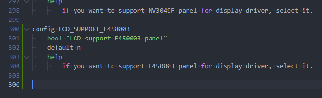

编辑 `bsp/drivers/video/sunxi/disp2/disp/Makefile` 增加配置

```c
disp-$(CONFIG_LCD_SUPPORT_F450003) += lcd/f450003.o
```

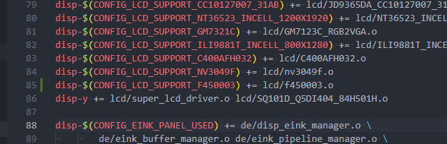

编辑 `bsp/drivers/video/sunxi/disp2/disp/lcd/panels.c` 新增屏幕引用

```c
#if IS_ENABLED(CONFIG_LCD_SUPPORT_F450003)
	&f450003_panel,
#endif
```

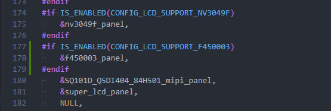

编辑 `bsp/drivers/video/sunxi/disp2/disp/lcd/panels.h` 新增屏幕引用

```c
#if IS_ENABLED(CONFIG_LCD_SUPPORT_F450003)
extern struct __lcd_panel f450003_panel;
#endif
```

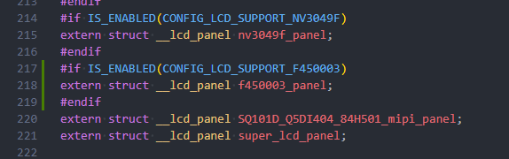

## 获取屏幕时序

由于使用的是 Serial RGB，其 RGB 时序参考入下图所示。

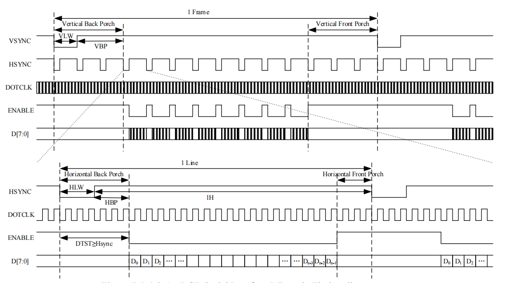

屏幕时序参数与屏幕时间显示数据如下图所示：

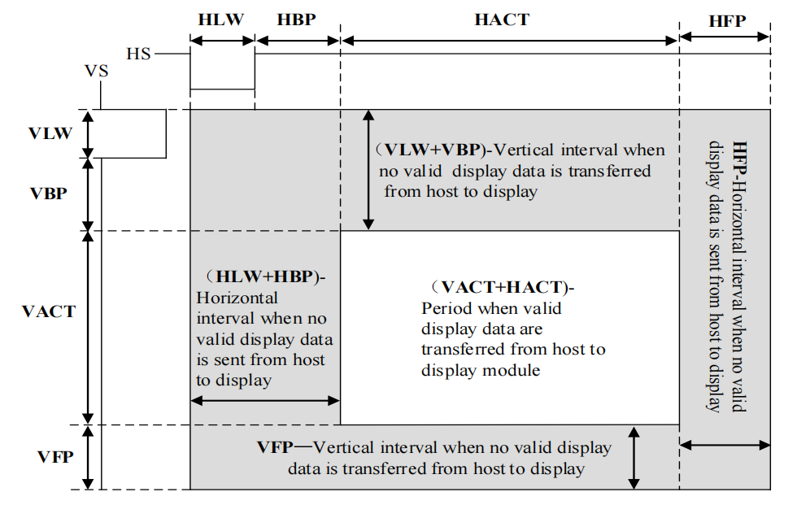

这里需要注意的是，对于该接口，SoC总共需要三个周期才能发完一个pixel，所以我们配置时序的时候，需要满足

$\text{lcd\_dclk\_freq} \times 3 = \text{lcd\_ht} \times \text{lcd\_vt} \times 60$

或者

$\text{lcd\_dclk\_freq} = \text{lcd\_ht} \times 3 \times \text{lcd\_vt} \times 60$

要么配置 3 倍 `lcd_ht` 要么 3 倍 `lcd_dclk_freq`。

此时一般询问屏厂，让其提供 RGB 时序配置，将时序参数配置为：

```c
lcd_dclk_freq       = <77>;
lcd_hbp             = <23>;
lcd_ht              = <1479>;
lcd_hspw            = <2>;
lcd_vbp             = <8>;
lcd_vt              = <870>;
lcd_vspw            = <2>;
```

## 配置设备树

设备树配置如下：

```c
&disp {
	disp_init_enable         = <1>;
	disp_mode                = <0>;

	screen0_output_type      = <1>;
	screen0_output_mode      = <4>;
	screen0_to_lcd_index     = <0>;

	screen1_output_type      = <3>;
	screen1_output_mode      = <10>;
	screen1_to_lcd_index     = <2>;

	screen1_output_format    = <0>;
	screen1_output_bits      = <0>;
	screen1_output_eotf      = <4>;
	screen1_output_cs        = <257>;
	screen1_output_dvi_hdmi  = <2>;
	screen1_output_range     = <2>;
	screen1_output_scan      = <0>;
	screen1_output_aspect_ratio = <8>;

	fb_format                = <0>;
	fb_num                   = <1>;
	fb_debug                 = <1>;
	/*<disp channel layer zorder>*/
	fb0_map                  = <0 0 0 16>;
	fb0_width                = <480>;
	fb0_height               = <854>;
	/*<disp channel layer zorder>*/
	fb1_map                  = <0 2 0 16>;
	fb1_width                = <300>;
	fb1_height               = <300>;
	/*<disp channel layer zorder>*/
	fb2_map                  = <1 0 0 16>;
	fb2_width                = <1280>;
	fb2_height               = <720>;
	/*<disp channel layer zorder>*/
	fb3_map                  = <1 1 0 16>;
	fb3_width                = <300>;
	fb3_height               = <300>;

	chn_cfg_mode             = <1>;
	disp_para_zone           = <1>;
};

&lcd0 {
	lcd_used            = <1>;

	lcd_driver_name     = "f450003";
	lcd_backlight       = <50>;
	lcd_if              = <0>;

	lcd_x               = <480>;
	lcd_y               = <854>;
	lcd_width           = <60>;
	lcd_height          = <100>;
	lcd_dclk_freq       = <71>;

	lcd_pwm_used        = <0>;
	lcd_pwm_ch          = <7>;
	lcd_pwm_freq        = <50000>;
	lcd_pwm_pol         = <0>;

	lcd_hbp             = <23>;
	lcd_ht              = <1479>;
	lcd_hspw            = <2>;
	lcd_vbp             = <8>;
	lcd_vt              = <870>;
	lcd_vspw            = <2>;

	lcd_frm             = <0>;
	lcd_io_phase        = <0x0000>;
	lcd_gamma_en        = <0>;
	lcd_bright_curve_en = <0>;
	lcd_cmap_en         = <0>;

	deu_mode            = <0>;
	lcdgamma4iep        = <22>;
	smart_color         = <90>;
	lcd_hv_if           = <8>;
	lcd_hv_clk_phase    = <1>;

	lcd_hv_srgb_seq      = <10>;
	lcd_hv_sync_polarity = <0>;

	lcd_gpio_0 = <&pio PD 17 GPIO_ACTIVE_LOW>; // RST
	lcd_gpio_1 = <&pio PD 15 GPIO_ACTIVE_LOW>; // SCK
	lcd_gpio_2 = <&pio PD 16 GPIO_ACTIVE_LOW>; // SDA
	lcd_gpio_3 = <&pio PD 14 GPIO_ACTIVE_LOW>; // CS

	pinctrl-0 = <&rgb8_pins_a>, <&rgb8_pins_ctl_a>;
	pinctrl-1 = <&rgb8_pins_b>, <&rgb8_pins_ctl_b>;
};
```

## 测试屏幕

使用命令查看 TCON 彩条，这个彩条是由 TCON 发出的，操作更加底层。

```
echo 1 > /sys/class/disp/disp/attr/colorbar
```

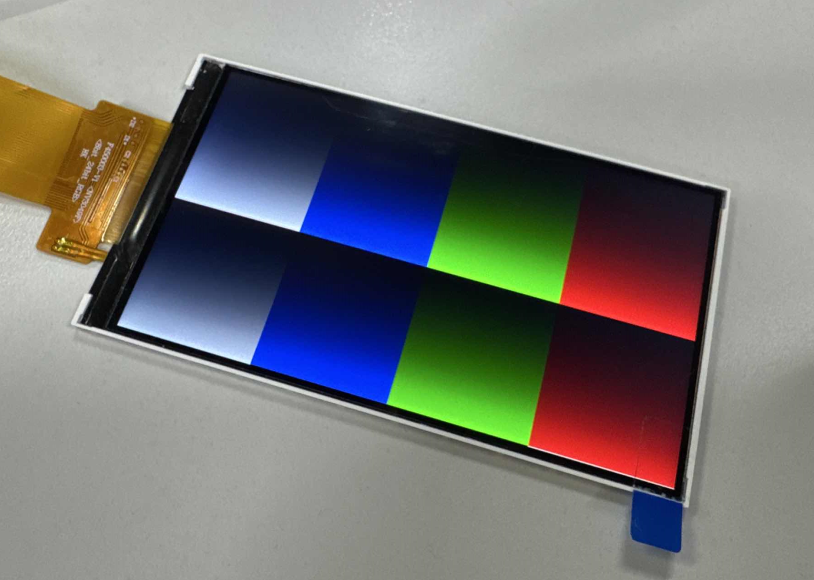

使用命令查看 DE 彩条，这个彩条是由 DE 合成发出的，如果 DE 出问题则可以看到 TCON 彩条看不到 DE 彩条。

:::tip

:::note

提示

:::
:::note

如果刚才开了 TCON 彩条，记得先关一下，TCON 彩条优先级更高

```
echo 0 > /sys/class/disp/disp/attr/colorbar
```

:::

:::

```
echo 8 > /sys/class/disp/disp/attr/colorbar
```

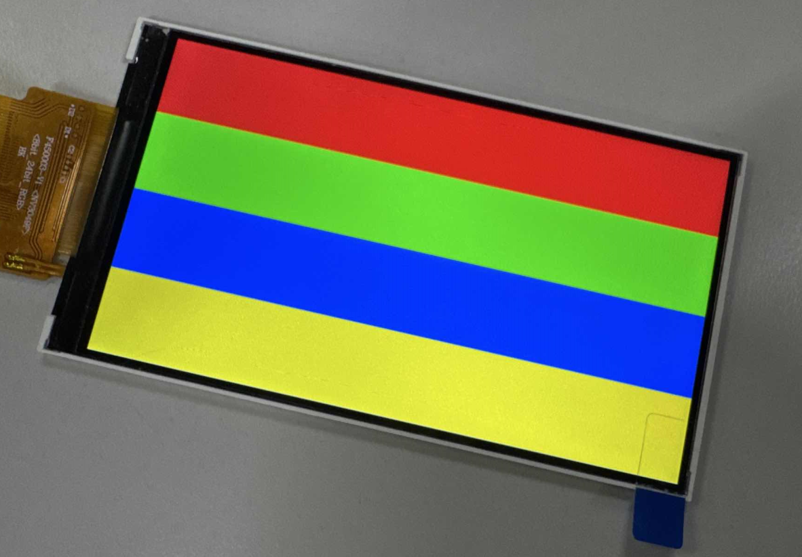

## FAQ

### RGB接口显示抖动有花纹

1.  改大时钟管脚的管脚驱动能力，改大。
2.  修改时钟相位，也就是修改 `lcd_hv_clk_phase`。由于发送端和接收端时钟相位的不同导致接收端解错若干位。

### 黑屏无显示

#### 黑屏，没有屏幕信号输出

:::danger

:::note

注意芯片型号！

:::
:::note

首先确认芯片型号是否为支持型号。

:::

:::

#### 完全黑屏，背光也没有

1.  屏驱动添加失败。驱动没有加载屏驱动，导致背光电源相关函数没有运行到。
2.  屏驱动加载成功，但是没有执行到开背光函数（可以在uboot的屏驱动中加打印确认开屏流程的执行情况）。这时候大概率是屏驱动的开屏函数没有执行完，uboot就执行完毕进入内核了。需要在满足屏手册上电时序要求的情况下，尽量减少延迟。
3.  PWM 配置和背光电路的问题，另外就是直接测量下硬件测量下相关管脚和电压，再检查屏是否初始化成功。

#### 黑屏但是有背光

1.  没送图层。如果应用没有送任何图层那么表现的现象就是黑屏。
2.  SoC端的显示接口模块没有供电。SoC端模块没有供电自然无法传输视频信号到屏上。
3.  复位脚没有复位。如果有复位脚，请确保硬件连接正确，确保复位脚的复位操作有放到屏驱动中。
4.  `board.dts` 中 `lcd0`有严重错误。第一个是 `lcd`的`timing`搞错了，请严格按照屏手册中的提示来写。第二个就是，接口类型搞错。
5.  屏的初始化命令不对。包括各个步骤先后顺序，延时等，这个时候请找屏厂确认初始化命令。
