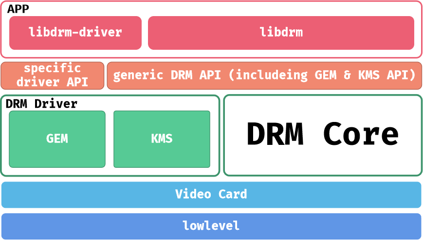
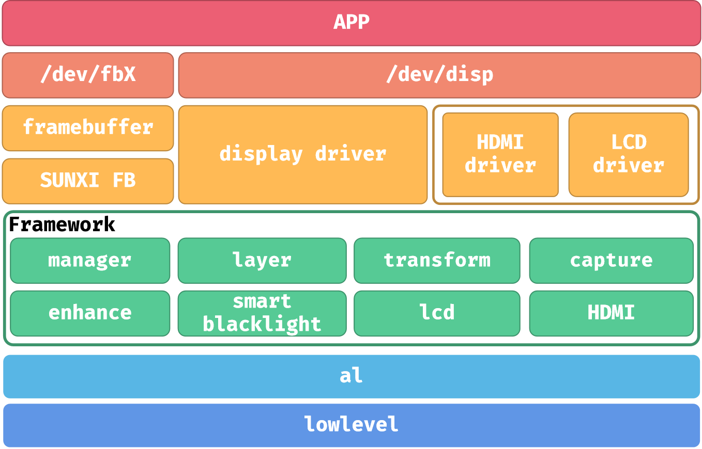
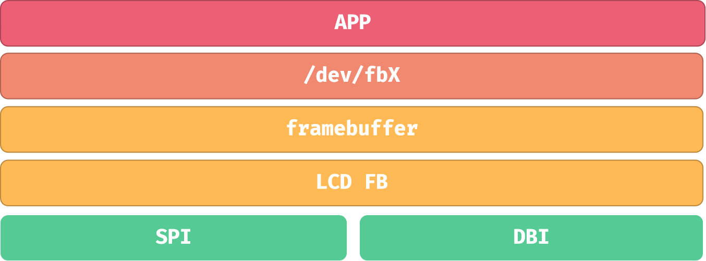

# LCD 显示驱动

SDK 提供支持 RGB/Serial RGB/I8080、SPI屏（MIPI DBI Type-C）等多种显示接口。不同平台的显示支持情况可能有所差异，具体请参考对应平台的文档。

针对 RGB/I8080 屏幕，SDK 提供 DRM/DISP + DE 驱动方案；针对 SPI 屏接口，SDK 支持 LCD\_FB 驱动（支持 DBI 模式）和内核原生 FBTFT 驱动（仅支持 SPI 模式）。

:::warning

:::note

注意

:::
:::note

不同的芯片使用不同的驱动框架，请具体按照芯片的型号和其对应的驱动进行区分

:::

:::

## Sunxi DRM 驱动

Sunxi DRM 驱动基于 Linux 内核标准DRM（Direct Rendering Manager）框架构建，由两部分组成：内核源码树中的通用 DRM 框架（`kernel/drivers/gpu/drm/`）和BSP仓库中 `drivers/drm/` 目录下的全志平台专用适配驱动。该驱动架构通过标准化的DRM子系统，实现了对全志显示硬件的精细化管理与控制。

用户空间应用可通过libdrm库提供的标准API与DRM驱动进行交互，实现对显示通路的全功能配置与管理，包括显示模式设置、缓冲区管理、图层控制等核心显示功能。

DRM 驱动的主要功能包括：

-   管理显示设备的硬件资源，包括显存、显示控制器、显示端口等。
-   提供统一的接口，用于应用层的显示请求，包括创建显示缓冲区、配置显示参数、提交显示请求等。
-   支持多种显示协议，包括 DRM、KMS、CRTC、Plane 等。

全志平台基于 DRM 框架实现了硬件驱动，其提供了轻量化的显示驱动能力，以及丰富的应用层接口。

## DISP 驱动

DISP 驱动是全志私有实现的芯片驱动，独立于内核的 DRM 框架，许多量产芯片在使用这套驱动。其提供了轻量化的显示驱动能力，以及丰富的应用层接口。

显示 DISP 驱动可划分为三个层面：驱动层、框架层及底层。底层与图形硬件相接，主要负责将上层配置的功能参数转换成硬件所需要的参数，并配置到相应寄存器中。

显示框架层对底层进行抽象封装成一个个的功能模块，提供统一的软件接口，屏蔽不同硬件平台的差异。驱动层对外封装功能接口，通过内核向用户空间提供相应的设备结点及统一的接口。

在驱动层，分为三个驱动模块：`framebuffer`驱动、`display`驱动和`LCD&HDMI`驱动。`framebuffer` 驱动与 `framebuffer core` 对接，实现 Linux 标准的`framebuffer` 接口，为应用层提供统一的显示缓冲区操作方式。`display`驱动是整个显示驱动中的核心模块，负责提供所有显示相关的接口，包括 LCD 接口的管理和配置。

## LCD\_FB 驱动

LCD\_FB 驱动是 SDK 中基于 SPI（MIPI DBI Type-C）接口的显示驱动方案，其上层对接到 Linux framebuffer 驱动，开辟一块内存区域用于存储显示内容的数据，屏幕的每个像素对应于内存中的一个值。下端对接到 SPI 驱动，通过 SPI 与显示屏通讯。

LCD\_FB 所驱动的屏幕由于没有硬件格式转换，需要输入的图像数据格式符合 SPI 传输要求，即 RGB 数据格式。不支持直接显示 YUV 数据，需要应用层或中间层进行 YUV 到 RGB 的转换。

## FBTFT 驱动

FBTFT 是 Linux 内核原生的 SPI 屏显示驱动，SDK 提供对该驱动的集成支持。

仓库地址：[https://github.com/notro/fbtft](https://github.com/notro/fbtft)
