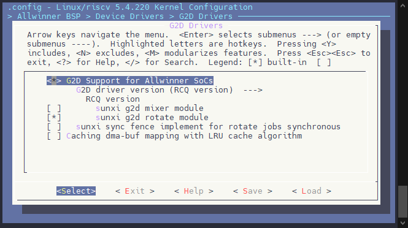
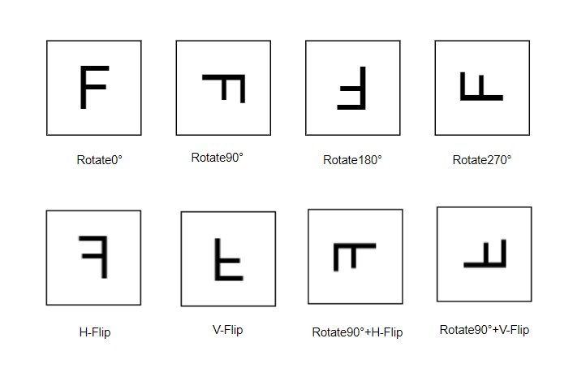

# G2D 图像处理

**Graphic2D (G2D)** 引擎是一个硬件加速的 2D 图形引擎。

-   支持最大层大小 **1280x800 像素**。
-   支持旋转功能的输入格式如下：
    -   **YUV422**（packed、semi-planar 和 planar 格式）
    -   **YUV420**（semi-planar 和 planar 格式）
    -   **P010、P210、P410 和 Y8**
    -   **A2R10G10B10、A2B10G10R10、R10G10B10A2 和 B10G10R10A2**
    -   **ARGB8888、RGBA8888、XRGB8888、RGBX8888、RGB888、RGB565、ARGB4444、RGBA4444、ARGB1555 和 RGBA5551**
    -   **ABGR8888、BGRA8888、XBGR8888、BGRX8888、BGR888、BGR565、ABGR4444、BGRA4444、ABGR1555 和 BGRA5551**
-   输出格式：
    -   **RGB/ARGB 色彩格式：** 输入和输出格式相同。
    -   **YUV 格式：** 如果执行旋转 90° 或 270°，输出格式为 **YUV420**，否则输入和输出格式相同。
-   支持的旋转类型：
    -   **水平翻转** 和 **垂直翻转**
    -   **0°、90°、180°、270°** 顺时针旋转

:::danger

:::note

危险

:::
:::note

V821 的 G2D 仅支持旋转功能，不支持图像裁剪和拼接、图像数据下采样和无极缩放、数据格式转换、颜色空间转换、图层合成、ColorKey、矩形区域颜色填充、点/线绘制、二元光栅操作、三元光栅操作等加速功能

:::

:::

## 模块功能配置

### 模块内核配置

```
Allwinner BSP  --->
	Device Drivers  --->
		G2D Drivers  --->
			<*> G2D Support for Allwinner SoCs
				G2D driver version (RCQ version)  --->
				  RCQ version
			[ ]       sunxi g2d mixer module  <-- V821 不支持，不需要开
			[*]       sunxi g2d rotate module
			[ ]   sunxi sync fence implement for rotate jobs synchronous
			[ ] Caching dma-buf mapping with LRU cache algorithm
```



### 设备树功能配置

设备树主要配置了 G2D 的相关时钟，中断等配置，这部分默认已经配置完成且默认启用，不需要再配置。

```c
g2d: g2d@45410000 {
	compatible = "allwinner,sunxi-g2d";
	reg = <0x0 0x45410000 0x0 0xbffff>;
	interrupts-extended = <&plic0 90 IRQ_TYPE_LEVEL_HIGH>;
	clocks = <&ccu CLK_G2D>, <&ccu CLK_BUS_G2D>, <&ccu CLK_MBUS_G2D>, <&ccu CLK_G2D_HB>,
				<&ccu CLK_VID_OUT>, <&ccu CLK_MBUS_VID_OUT>;
	clock-names = "g2d", "bus", "mbus_g2d", "g2d_hb",
					"vo", "mbus_vo";
	resets = <&ccu RST_BUS_G2D>, <&ccu RST_BUS_TCON>;
	reset-names = "rst_bus_g2d", "rst_bus_vo";
	assigned-clocks = <&ccu CLK_G2D>;
	assigned-clock-rates = <154000000>;
	status = "okay";
};
```

## 旋转和镜像(Rotate/Mirror)

旋转镜像主要是实现如下Horizontal-Flip、Vertical-Flip、Rotate0°、Rotate90°、Rotate180°、Rotate270°、Rotate90°+Horizontal-Flip、Rotate90°+Vertical-Flip共8种操作。

关键结构体参数：



```c
typedef struct {
    g2d_blt_flags_h flag_h;
    g2d_image_enh src_image_h;
    g2d_image_enh dst_image_h;
} g2d_blt_h;

typedef enum {
    G2D_BLT_NONE_H = 0x0,    /* single source operation */
    /* rop2 */
    /* Fill the target rectangular area with the color associated with index 0 of the physical color palette.
     * For the default physical color palette, this color is black. */
    G2D_BLT_BLACKNESS,    /* blackness */
    G2D_BLT_NOTMERGEPEN,    /* dst = ~(dst + src) */
    G2D_BLT_MASKNOTPEN,    /* dst = ~src & dst */
    G2D_BLT_NOTCOPYPEN,    /* dst = ~src */
    G2D_BLT_MASKPENNOT,    /* dst = src & ~dst */
    G2D_BLT_NOT,    /* dst = ~dst */
    G2D_BLT_XORPEN,    /* dst = src ^ dst */
    G2D_BLT_NOTMASKPEN,    /* dst = ~(src & dst) */
    G2D_BLT_MASKPEN,    /* dst = src & dst */
    G2D_BLT_NOTXORPEN,    /* dst = ~(src ^ dst) */
    G2D_BLT_NOP,    /* dst = dst */
    G2D_BLT_MERGENOTPEN,    /* dst = ~src + dst */
    G2D_BLT_COPYPEN,    /* dst = src */
    G2D_BLT_MERGEPENNOT,    /* dst = src + ~dst */
    G2D_BLT_MERGEPEN,    /* dst = src + dst */
    G2D_BLT_WHITENESS,    /* whiteness */

    /* Fill the target rectangular area with the color associated with index 0 of the physical color palette.
     * For the default physical color palette, this color is white. */
    G2D_BLT_EXTRACT = 0x000000ff,

    G2D_ROT_90  = 0x00000100,
    G2D_ROT_180 = 0x00000200,
    G2D_ROT_270 = 0x00000300,
    G2D_ROT_0   = 0x00000400,
    G2D_ROT_H = 0x00001000,
    G2D_ROT_V = 0x00002000,
    G2D_ROT_90_H  = 0x00001100,
    G2D_ROT_90_V  = 0x00002100,

/*    G2D_SM_TDLR_1  =    0x10000000, */
    G2D_SM_DTLR_1 = 0x10000000,
/*    G2D_SM_TDRL_1  =    0x20000000, */
/*    G2D_SM_DTRL_1  =    0x30000000, */
} g2d_blt_flags_h;

/* image struct */
typedef struct {
    int         bbuff;    /* determine color_filling or image buffer */
    __u32         color;    /* color_filling */
    g2d_fmt_enh     format;    /* pixel format */
    __u32         laddr[3];    /* low address for three planes */
    __u32         haddr[3];    /* high address for three planes */
    __u32         width;    /* image window width */
    __u32         height;    /* image window height */
    __u32         align[3];    /* image windows alignment, y/u/v planes*/

    g2d_rect     clip_rect;    /* roi */
    g2d_size     resize;    /* image size after down_sampling */
    g2d_coor     coor;    /* top-left corner coordinates placed in the dst_image window
                         * after src_image has been processed */

    g2d_color_gmt     gamut;    /* color space */
/*    __u32         gamut; */
    int         bpremul;    /* alpha premutiled or not */
    __u8         alpha;
    g2d_alpha_mode_enh mode;    /* alpha mode */
    int         fd;
    __u32 use_phy_addr;    /* use phy_addr or not */
    enum color_range color_range;
} g2d_image_enh;
```

-   将格式为 ARGB8888 格式，分辨率为1280x720 分辨率图像旋转90度

```c
int ret;
int g2d_fd;
g2d_blt_h blit;

g2d_fd = open("dev/g2d", O_RDWR);
if (g2d_fd < 0) {
    printf("failed to open g2d device\n");
    return;
}
memset(&blit, 0, sizeof(g2d_blt_h));

blit.flag_h = G2D_ROT_90;

#ifdef USE_PHY_ADDR
blit.src_image_h.use_phy_addr = 1;
blit.src_image_h.laddr[0] = src_image_addr[0];
#elif USE_DMA_BUFFERR_HEAP
blit.src_image_h.use_phy_addr = 0;
blit.src_image_h.fd = src_image_fd;
#else
...
#endif
blit.src_image_h.bbuff = 1;
blit.src_image_h.mode = G2D_PIXEL_ALPHA;
blit.src_image_h.alpha = 0xff;
blit.src_image_h.format = G2D_FORMAT_ARGB8888;
blit.src_image_h.width = 1280;
blit.src_image_h.height = 720;
blit.src_image_h.clip_rect.x = 0;
blit.src_image_h.clip_rect.y = 0;
blit.src_image_h.clip_rect.w = 1280;
blit.src_image_h.clip_rect.h = 720;

#ifdef USE_PHY_ADDR
blit.dst_image_h.use_phy_addr = 1;
blit.dst_image_h.laddr[0] = dst_image_addr[0];
#elif USE_DMA_BUFFERR_HEAP
blit.dst_image_h.use_phy_addr = 0;
blit.dst_image_h.fd = dst_image_fd;
#else
...
#endif
blit.dst_image_h.bbuff = 1;
blit.dst_image_h.mode = G2D_PIXEL_ALPHA;
blit.dst_image_h.alpha = 0xff;
blit.dst_image_h.format = G2D_FORMAT_ARGB8888;
blit.dst_image_h.width = 720;
blit.dst_image_h.height = 1280;
blit.dst_image_h.clip_rect.x = 0;
blit.dst_image_h.clip_rect.y = 0;
blit.dst_image_h.clip_rect.w = 720;
blit.dst_image_h.clip_rect.h = 1280;

ret = ioctl(g2d_fd, G2D_CMD_BITBLT_H ,(unsigned long)(&blit))
```

## 模块限制条件

### 地址对齐要求

-   **Rotate/Mirror功能**：
    -   输入输出地址必须保证4字节对齐。
-   其他功能没有此限制。

### 宽度对齐要求

-   **Crop/Stitching**、**Scaler/Down\_Sampling**、**PixelFormat\_Conversion**、**ColorSpace\_Conversion**、**Point/Line Drawing**、**Rect\_ColorFilling**
    -   对 RGB 格式输入输出没有限制
    -   **YUV420**格式：宽高需要2字节对齐。
    -   **YUV422**格式：宽需要2字节对齐。
    -   **YUV411**格式：宽需要4字节对齐。
-   **Rotate/Mirror功能**：
    -   输入输出的宽度需要8字节对齐。
    -   **A40i** 平台需要满足64字节对齐。
-   **YUV格式对齐要求**：
    -   如果是YUV采样格式，UV平面的宽度也需要满足对齐规则：
        -   YUV420需要宽高都16字节对齐。
        -   YUV422宽度需要16字节对齐。

### 最小宽高限制

-   **最小宽高要求**：
    -   **ARGB8888格式**：宽度必须大于2，其他维度不低于2。
    -   **RGB888格式**：宽度必须大于3，其他维度不低于2。
    -   **RGB565格式**：宽度必须大于4，其他维度不低于2。
    -   **YUV420格式**：高度必须大于2。

### 输出格式转换

-   **YUV格式的旋转输出要求**：
    -   旋转功能对YUV格式输出有强制转换要求。
    -   输出格式一律为YUV420，比如：
        -   I422格式会被强制转换为I420。
        -   NV16格式会被强制转换为NV12。
