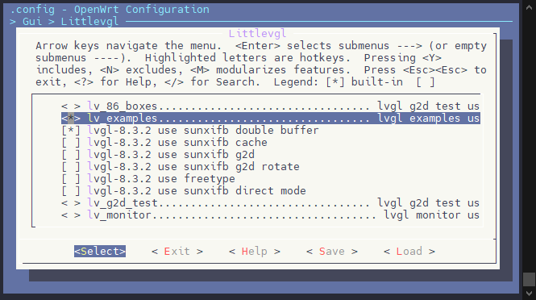
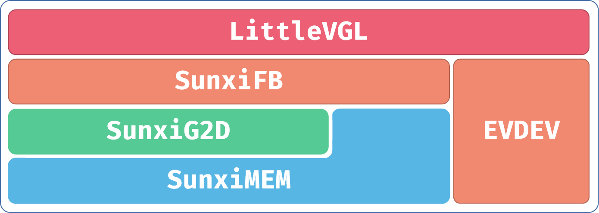

# Tina Linux 与 LVGL

## 关于 LVGL

LVGL 是一个免费的开源图形库，提供了创建嵌入式 GUI 所需的一切，具有易于使用的图形元素，美观的视觉效果和低内存占用，采用 MIT 许可协议，可以访问[LittlevGL](https://littlevgl.com/)获取更多资料。

-   强大的构建块：按钮、图表、列表、滑块、图像等。
-   高级图形引擎：动画、抗锯齿、不透明度、平滑滚动、混合模式等。
-   支持各种输入设备：触摸屏、鼠标、键盘、编码器、按钮等。
-   支持多显示器。
-   独立于硬件，可与任何微控制器和显示器一起使用。
-   可扩展以使用少量内存（64 kB 闪存、16 kB RAM）运行。
-   多语言支持，支持 UTF-8 处理、CJK、双向和阿拉伯语。
-   通过类 CSS 样式完全可定制的图形元素。
-   受 CSS 启发的强大布局：Flexbox 和 Grid。
-   支持操作系统、外部内存和 GPU，但不是必需的。
-   使用单个帧缓冲区也能平滑渲染。
-   用 C 编写并与 C++ 兼容。
-   Micropython Binding 在 Micropython 中公开 LVGL API。
-   可以在 PC 上使用模拟器开发。
-   100 多个简单的例子。
-   在线和 PDF 格式的文档和API参考。

目前 Tina Linux 中移植了 LVGL 8.3.2 核心组件与 Demo，下表列出 LVGL 相关库说明：

| 包名 | 说明 |
| --- | --- |
| lv\_demos | lvgl的官方demo |
| lv\_drivers | lvgl的官方设备驱动程序，集成了sunxifb和sunximem |
| lv\_examples | lvgl测试用例，最终调用的是lv\_demos中的函数 |
| lvgl | lvgl核心库 |
| sunxifb.mk | 公共配置文件，写应用Makefile时需要包含进去 |

## LVGL 配置

```c
make menuconfig
```

然后做如下配置

```c
Gui --->
    Littlevgl --->
        <*> lv_examples                              (lvgl官方demo)
        -*- lvgl-8.3.2 use sunxifb double buffer     (使能双缓冲，解决撕裂问题)
        [ ] lvgl-8.3.2 use sunxifb cache             (V821 不支持此选项)
        [ ] lvgl-8.3.2 use sunxifb g2d               (V821 不支持此选项)
        [ ] lvgl-8.3.2 use sunxifb g2d rotate        (使能g2d旋转功能，需要开启g2d)
        [ ] lvgl-8.3.2 use freetype                  (自动链接freetype)
        [ ] lvgl-8.3.2 use sunxifb direct mode       (V821 不支持此选项)
```



## LVGL 源码框架

LVGL 源码位于 `platform/thirdparty/gui/lvgl-8`， 其框架如图：



### sunxifb

在 `sunxifb` 中，我们提供了一组显示接口，如下：

| 接口 | 说明 |
| --- | --- |
| `sunxifb_init` | 该函数主要功能是初始化显示引擎。带一个旋转参数，使能g2d旋转的话，就用这个参数指定旋转方向 |
| `sunxifb_exit` | 该函数比较简单，实现关闭`cache`，关闭`g2d`，释放旋转`buffer`，关闭`fb0` |
| `sunxifb_flush` | 该函数比较重要，负责把`draw buffer`拷贝到`back buffer`中，并且绘制最后一帧后，交换`front`与`back buffer`。应用不要调用该函数 |
| `sunxifb_get_sizes` | 该函数获取屏幕分辨率，这样应用程序就可以不用写死初始化时的分辨率了 |
| `sunxifb_alloc` | 该函数主要用来申请系统绘图内存，使能部分`g2d`功能后，会申请连续物理内存 |
| `sunxifb_free` | 该函数用来释放`sunxifb_alloc`申请的内存 |

代码位置如下：

```c
platform/thirdparty/gui/lvgl-8/lv_drivers/display/sunxifb.c
```

在`sunxifb_init(rotated)`，中`rotated`的旋转值可以为：

`LV_DISP_ROT_NONE`，`LV_DISP_ROT_90`，`LV_DISP_ROT_180`，`LV_DISP_ROT_270`。

最后还有赋值 `disp_drv.rotated = rotated` 。如果没有g2d旋转，也可以指定`disp_drv.sw_rotate = 1` 使用软件旋转。

### sunximem

在`sunximem`中，实现了管理物理内存的封装，这些函数都**不需要应用调用**，但能加深对整个框架的理解，如下：

| 接口 | 说明 |
| --- | --- |
| `sunxifb_mem_init` | 该函数会在`sunxifb_init`中调用，初始化物理内存申请接口，使用的是 `libuapi` 中间件 |
| `sunxifb_mem_deinit` | 该函数通过调用 `SunxiMemClose`，释放申请的接口资源 |
| `sunxifb_mem_alloc` | 该函数比较重要，许多地方都会用到，需要传入申请的字节数和使用说明 |
| `sunxifb_mem_free` | 该函数用来释放调用 `sunxifb_mem_alloc` 申请的内存 |
| `sunxifb_mem_get_phyaddr` | 该函数把 `sunxifb_mem_alloc` 申请内存的虚拟地址转换为物理地址，`g2d` 驱动只接受 `buffer` 的物理地址或者fd |
| `sunxifb_mem_flush_cache` | 该函数用来刷 `sunxifb_mem_alloc` 申请`buffer` 的 `cache` |

代码位置如下：

```c
platform/thirdparty/gui/lvgl-8/lv_drivers/display/sunxigmem.c
```

因为`g2d`驱动只能使用物理连续内存，因此解码图片时，必须要通过 `sunxifb_mem_alloc` 来申请内存。

> 当前只实现了bmp、png和gif图片的内存申请，jpeg图片暂未实现

当使用 `lv_canvas_set_buffer` 时，传入的 `buffer` 需要是 `sunxifb_alloc` 申请的 `buffer`，`sunxifb_alloc` 中会判断是否需要申请物理连续内存。

> 自定义画布lv\_canvas暂未对接g2d缩放功能

### evdev

触摸我们用的是`lvgl`官方的`evdev`

代码位置如下：

```c
platform/thirdparty/gui/lvgl-8/lv_drivers/indev/evdev.c
```

在应用`lv_drv_conf.h`中修改`EVDEV_NAME`为触摸屏对应生成的`event`节点，例如`lv_examples`的配置文件：

```c
platform/thirdparty/gui/lvgl-8/lv_examples/src/lv_drv_conf.h
```

另外也可以用命令生成软连接`touchscreen`，就会直接以 `touchscreen` 为触摸节点，方便调试:

```c
ln -s /dev/input/eventX /dev/input/touchscreen
```

## LVGL运行

我们提供了几个测试用例，直接执行：

```c
lv_examples 0
```

```c
lv_examples 0, is lv_demo_widgets
lv_examples 1, is lv_demo_music
lv_examples 2, is lv_demo_benchmark
lv_examples 3, is lv_demo_keypad_encoder
lv_examples 4, is lv_demo_stress
```

在初始化时，会有如下打印，根据配置的不同会有差异，表示打开了某项配置：

```c
wh=1280x800, vwh=1280x1600, bpp=32, rotated=0
Turn on double buffering.
```
