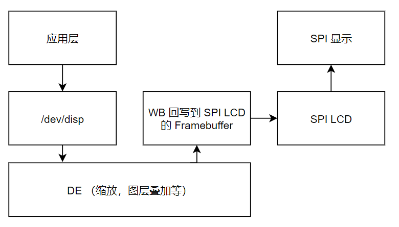
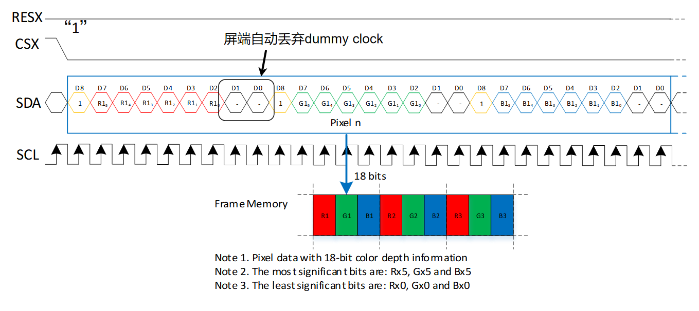
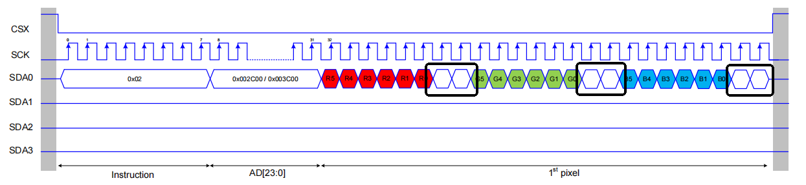
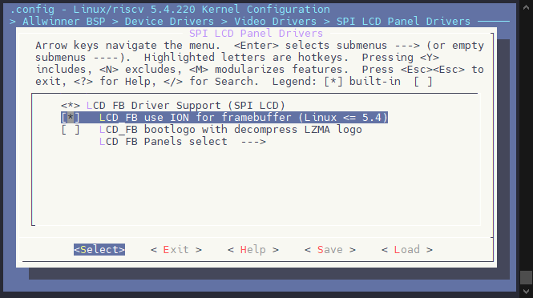
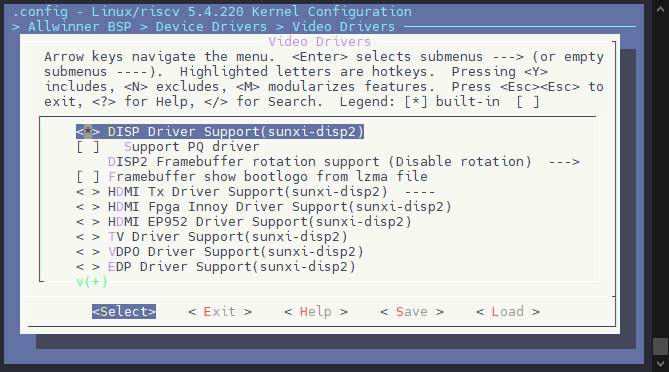
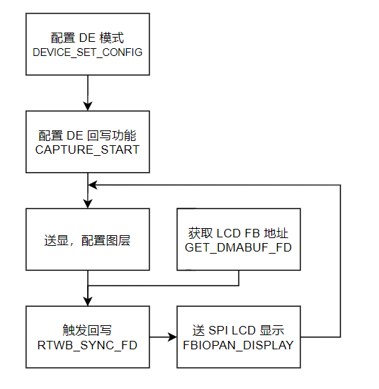
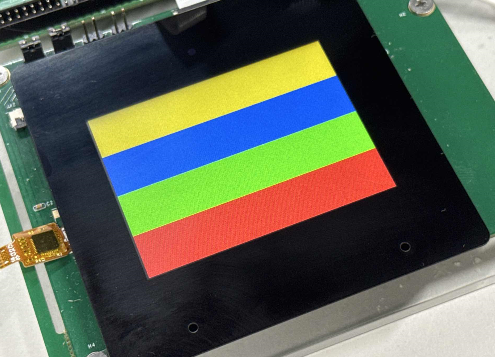

# SPI LCD 使用 DE 加速合成

在 1.0.7 版本驱动中，新增了 SPI LCD 通过 DE RTWB 回写实现 DE 加速合成的功能。

由于 SPI 屏是纯 CPU 软件屏，没有类似于 I8080，RGB 屏幕的 DE+TCON 硬件合成执行的功能，所以当执行一些 YUV 转 RGB 显示，多通道合成的时候会比较吃力，需要用 CPU 纯软件的合成转换，此时可以使用 DE 硬件的回写功能，使用 DE 的硬件合成加速，将输出的数据显示在 SPI 屏上。其流程如下：



整个框架包括四个流程：

-   应用层通过操作 `/dev/disp` 节点，设置送显，送图层，绑定显示通道
-   应用层获取 SPI LCD 的显存 FD，将其传入 DISP 驱动
-   触发 DE 硬件执行合成和回写，将图像数据写道 SPI LCD 的显存中
-   执行 PANDISPLAY 操作，通知 SPI LCD 进行刷屏操作

:::danger

:::note

加速方案的限制

:::
:::note

这套加速方案有一定的限制性，需要符合这些要求才可以使用

1.  DE 模块需要完全交给显示使用，不可以作为双屏显示，或者独立执行其他缩放操作
2.  DE 模块仅能回写 RGB888，ARGB888 的数据，所以要求 SPI 屏幕需要支持 RGB888 或者支持 RGB666，若是 RGB666，其时序需要支持丢弃 BIT，使得送显数据 RGB888 但是实际屏幕显示 RGB666
3.  SPI 屏幕显示需要支持 TE
4.  方案会占用较多内存，需要较多 buffer
5.  目前仅支持 Video 通道送 YUV 显示，RGB + YUV 合成还不支持

:::note

:::note

为什么屏幕配置RGB666，可以送RGB888的数据？

:::
:::note

这里以 DBI RGB666 时序为例，可以看到 RGB666 的送图格式中，每个颜色都需要发送两个 dummy clock，这两个数据会被屏幕自动丢弃，所以我们可以直接送显 RGB888 的数据，屏幕配置为 RGB666，屏幕自行丢弃低位两个不需要的 data，达到屏幕配置 RGB666，送显 RGB888 的功能。



参考 QSPI，也有类似的丢弃



:::

:::

:::

:::

另外由于DE回写与屏幕送显是完全异步的操作，所以需要多块 buffer 轮转送显，一般 VI 送帧 20fps，需要配置 3 块 buffer。

## 配置功能

### 内核模块配置

需要配置这些模块

```
CONFIG_AW_DISP2=y
# CONFIG_AW_DISP2_PQ is not set
# CONFIG_AW_HDMI_TX_DISP2 is not set
CONFIG_LCD_FB=y
CONFIG_AW_LCD_FB_USE_ION=y
```

首先配置 LCD FB 显示驱动模块，配置路径如下所示：

```
Allwinner BSP  ---> 
    Device Drivers  --->
        Video Drivers  --->
            SPI LCD Panel Drivers  --->
                <*> LCD FB Driver Support (SPI LCD)
```


LCD 显示面板驱动位于

```
Allwinner BSP  ---> 
    Device Drivers  --->
        Video Drivers  --->
            SPI LCD Panel Drivers  --->
                LCD FB Panels select  --->
                    [*] LCD support kld2844B panel
                    ...
```


然后需要配置 LCD\_FB 使用 ION 内存申请

```
Allwinner BSP  ---> 
    Device Drivers  --->
        Video Drivers  --->
            SPI LCD Panel Drivers  --->
                [*]   LCD_FB use ION for framebuffer (Linux <= 5.4)
```



然后需要配置 DISP2 驱动，启用 DE 功能

```
Allwinner BSP  ---> 
    Device Drivers  --->
        Video Drivers  --->
            <*> DISP Driver Support(sunxi-disp2)
```



### 设备树配置

LCD FB 相关配置，配置 SPI 屏的一些细节

```c
&pio {
    dbi1_pins_default: dbi1@0 {
        pins = "PD1", "PD2", "PD3"; /* dbi-cs, dbi-clk, dbi-sdo */
        function = "spi1";
        allwinner,drive = <3>;
    };

    dbi1_pins_dcx: dbi1@1 {
        pins = "PD5"; /* dbi-dcx */
        function = "spi1_hold";
        allwinner,drive = <3>;
        bias-pull-up;
    };

    dbi1_pins_te: dbi1@2 {
        pins = "PD6"; /* dbi-te */
        function = "spi1_wp";
        allwinner,drive = <3>;
        bias-pull-up;
    };

    dbi1_pins_sleep: dbi1@3 {
        pins = "PD1", "PD2", "PD3", "PD5", "PD6";
        function = "io_disabled";
    };
};

&spi1 {
    pinctrl-0 = <&dbi1_pins_default &dbi1_pins_dcx &dbi1_pins_te>;
    pinctrl-1 = <&dbi1_pins_sleep>;
    pinctrl-names = "default", "sleep";
    /*Set SUNXI_SPI_BUS_DBI when using SPI LCD*/
    sunxi,spi-bus-mode = <SUNXI_SPI_BUS_DBI>;
    /*sunxi,spi-bus-mode = <SUNXI_SPI_BUS_MASTER>;*/
    sunxi,spi-cs-mode = <SUNXI_SPI_CS_AUTO>;
    status = "okay";

    spi_panel_spi1: slave@0 {
        device_type = "spi-panel";
        compatible = "allwinner,spi-panel";
        reg = <0x0>;
        spi-max-frequency = <100000000>;
        lcd_used = <1>;
        lcd_driver_name = "kld2844b";
        lcd_if = <1>;
        lcd_dbi_if = <4>;
        lcd_data_speed = <48>;
        lcd_spi_bus_num = <1>;
        lcd_x = <240>;
        lcd_y = <320>;
        lcd_pixel_fmt = <0>;  /* 配置 fb 为 ARGB888 */
        lcd_dbi_fmt = <3>;    /* 屏幕为 RGB666 */
        lcd_rgb_order = <0>;
        lcd_width = <60>;
        lcd_height = <95>;
        lcd_pwm_used = <1>;
        lcd_pwm_ch = <6>;
        lcd_pwm_freq = <5000>;
        lcd_pwm_pol = <1>;
        lcd_frm = <1>;
        lcd_gamma_en = <1>;
        fb_buffer_num = <2>;
        lcd_backlight = <100>;
        lcd_fps = <60>;
        lcd_dbi_te = <0>;
        lcd_dbi_clk_mode = <0>;
        lcd_gpio_0 = <&pio PD 4 GPIO_ACTIVE_LOW>; /* reset */
        /*lcd_spi_dc_pin = <&pio PD 5 GPIO_ACTIVE_HIGH>;*/
        status = "okay";
    };
};

&lcd_fb {
    status = "okay";
    port {
        #address-cells = <1>;
        #size-cells = <0>;
        spi_panel0: endpoint@0 {
            reg = <0>;
            remote-endpoint = <&spi_panel_spi1>;
        };
    };
};
```

DISP DE 硬件设备树配置

```c
&disp {
    disp_init_enable         = <1>;
    disp_mode                = <0>;

    screen0_output_type      = <7>; /* 配置为 RTWB 回写模式 */
    screen0_output_mode      = <4>;
    screen0_to_lcd_index     = <0>;

    screen1_output_type      = <3>;
    screen1_output_mode      = <10>;
    screen1_to_lcd_index     = <2>;

    screen1_output_format    = <0>;
    screen1_output_bits      = <0>;
    screen1_output_eotf      = <4>;
    screen1_output_cs        = <257>;
    screen1_output_dvi_hdmi  = <2>;
    screen1_output_range     = <2>;
    screen1_output_scan      = <0>;
    screen1_output_aspect_ratio = <8>;

    fb_format                = <0>;
    fb_num                   = <1>;
    fb_debug                 = <0>;
    /*<disp channel layer zorder>*/
    fb0_map                  = <0 0 0 16>;
    fb0_width                = <240>;  /* fb分辨率，需要与 SPI 屏幕一致 */
    fb0_height               = <320>;  /* fb分辨率，需要与 SPI 屏幕一致 */
    /*<disp channel layer zorder>*/
    fb1_map                  = <0 2 0 16>;
    fb1_width                = <240>;  /* fb分辨率，需要与 SPI 屏幕一致 */
    fb1_height               = <320>;  /* fb分辨率，需要与 SPI 屏幕一致 */
    /*<disp channel layer zorder>*/
    fb2_map                  = <1 0 0 16>;
    fb2_width                = <240>;  /* fb分辨率，需要与 SPI 屏幕一致 */
    fb2_height               = <320>;  /* fb分辨率，需要与 SPI 屏幕一致 */
    /*<disp channel layer zorder>*/
    fb3_map                  = <1 1 0 16>;
    fb3_width                = <240>;  /* fb分辨率，需要与 SPI 屏幕一致 */
    fb3_height               = <320>;  /* fb分辨率，需要与 SPI 屏幕一致 */

    chn_cfg_mode             = <1>;
    disp_para_zone           = <1>;
};

&lcd0 {
    lcd_used            = <1>;
    lcd_driver_name     = "default_lcd";

    lcd_if              = <0>;
    lcd_hv_if           = <8>;

    lcd_x               = <240>;  /* fb分辨率，需要与 SPI 屏幕一致 */
    lcd_y               = <320>;  /* fb分辨率，需要与 SPI 屏幕一致 */
    lcd_width           = <108>;
    lcd_height          = <64>;

    lcd_dclk_freq       = <27>;  /* 任意即可 */
    lcd_hbp             = <70>;
    lcd_ht              = <1716>;
    lcd_hspw            = <1>;
    lcd_vbp             = <21>;
    lcd_vt              = <263>;
    lcd_vspw            = <1>;
};
```

## 应用编写流程

应用流程如下所示：



1.  先配置 DISP 模式，配置分辨率到回写模式

```c
struct disp_device_config conf;
memset(&conf, 0, sizeof(conf));
conf.type = DISP_OUTPUT_TYPE_RTWB;
conf.mode = DISP_TV_MOD_480P;
conf.timing.x_res = WIDTH;
conf.timing.y_res = HEIGHT;
conf.timing.frame_period = 16666667; //60hz
conf.format = DISP_CSC_TYPE_RGB;
conf.cs = DISP_BT709;
conf.bits = DISP_DATA_8BITS;
conf.eotf = DISP_EOTF_GAMMA22;
conf.range = DISP_COLOR_RANGE_16_235;
conf.dvi_hdmi = DISP_HDMI;
conf.scan = DISP_SCANINFO_NO_DATA;

unsigned long arg[4] = { 0 };
arg[0] = 0;
arg[1] = (unsigned long)&conf;
ioctl(disp_fd, DISP_DEVICE_SET_CONFIG, (void *)arg);
```

2.  配置 DE 开启回写功能

```c
struct disp_capture_init_info capture_info;
capture_info.port = DISP_CAPTURE_AFTER_DEP;

unsigned long arg[4] = { 0 };
arg[0] = 0;
arg[1] = (unsigned long)&capture_info;
ioctl(disp_fd, DISP_CAPTURE_START, (void *)arg);
```

3.  获取 LCD FB 的 DMABUF FD 操作符

```
struct lcd_fb_dmabuf_export dmabuf_info;

ret = ioctl(fb_fd, LCDFB_IO_GET_DMABUF_FD, &dmabuf_info);
if (ret == -1) {
    perror("ioctl failed");
    goto err;
}
```

4.  配置 DE 启用回写功能

```c
struct disp_capture_init_info capture_info;
capture_info.port = DISP_CAPTURE_AFTER_DEP;

unsigned long arg[4] = { 0 };
arg[0] = 0;
arg[1] = (unsigned long)&capture_info;
ioctl(disp_fd, DISP_CAPTURE_START, (void *)arg);
```

5.  触发一次回写操作

配置回写操作主要是传入屏幕分辨率和回写的地址 FD，这里请做全屏回写，不要做 crop 操作

```c
struct disp_capture_info2 info2 = { 0 };
info2.window.x = 0;
info2.window.y = 0;
info2.window.width = WIDTH;
info2.window.height = HEIGHT;
info2.out_frame.format = DISP_FORMAT_ARGB_8888;
info2.out_frame.size[0].width = WIDTH;
info2.out_frame.size[0].height = HEIGHT;
info2.out_frame.crop.x = 0;
info2.out_frame.crop.y = 0;
info2.out_frame.crop.width = WIDTH;
info2.out_frame.crop.height = HEIGHT;
info2.out_frame.fd = dmabuf_info.fd;      /* <- 上面获取到的 FD */

unsigned long arg[4] = { 0 };
arg[0] = 0;
arg[1] = (unsigned long)&info2;
ret = ioctl(disp_fd, DISP_RTWB_SYNC_FD, (void *)(arg));
if (ret != 0) {
    printf("capture commit err %d\n", ret);
}
```

6.  刷新 SPI LCD 触发送显

```c
struct fb_var_screeninfo vinfo;
ioctl(fb_fd, FBIOGET_VSCREENINFO, &vinfo)

vinfo.xoffset = 0;
vinfo.yoffset = 0;
if (ioctl(fb_fd, FBIOPAN_DISPLAY, &vinfo) < 0) {
    perror("Error: FBIOPAN_DISPLAY fail");
}
```

如果需要再次更新屏幕，请执行 5，6 步，操作其触发回写，刷新屏幕的操作

## 应用编写示例

下面的程序配置 DE 显示 Colorbar，然后使用回写功能将 Colorbar 回写到 SPI LCD 显示

```c
#include <stdio.h>
#include <stdlib.h>
#include <unistd.h>
#include <sys/mman.h>
#include <sys/ioctl.h>
#include <linux/fb.h>
#include <string.h>
#include <endian.h>
#include <errno.h>
#include <fcntl.h>
#include <getopt.h>
#include <pthread.h>
#include <signal.h>
#include <stdint.h>
#include <stdio.h>
#include <stdbool.h>
#include <math.h>
#include <time.h>
#include <strings.h>
#include <sys/ioctl.h>
#include <sys/stat.h>
#include <sys/types.h>
#include <unistd.h>
#include <linux/kernel.h>

#include <video/uapi_lcd_fb.h>

typedef signed char s8;
typedef unsigned char u8;

typedef signed short s16;
typedef unsigned short u16;

typedef signed int s32;
typedef unsigned int u32;

typedef signed long long s64;
typedef unsigned long long u64;

#include <video/sunxi_display2.h>

#define WIDTH 240
#define HEIGHT 320

int main()
{
    int fb_fd, disp_fd;
    int ret;
    struct fb_var_screeninfo vinfo;
    struct fb_fix_screeninfo finfo;
    struct lcd_fb_dmabuf_export dmabuf_info;
    struct disp_device_config conf;

    memset(&conf, 0, sizeof(conf));
    conf.type = DISP_OUTPUT_TYPE_RTWB;
    conf.mode = DISP_TV_MOD_480P;
    conf.timing.x_res = WIDTH;
    conf.timing.y_res = HEIGHT;
    conf.timing.frame_period = 16666667; //60hz
    conf.format = DISP_CSC_TYPE_RGB;
    conf.cs = DISP_BT709;
    conf.bits = DISP_DATA_8BITS;
    conf.eotf = DISP_EOTF_GAMMA22;
    conf.range = DISP_COLOR_RANGE_16_235;
    conf.dvi_hdmi = DISP_HDMI;
    conf.scan = DISP_SCANINFO_NO_DATA;

    // Open the framebuffer device (assuming it's located at /dev/fb0)
    fb_fd = open("/dev/fb0", O_RDWR);
    if (fb_fd == -1) {
        perror("Failed to open framebuffer device");
        return -1;
    }

    system("echo 8 > /sys/class/disp/disp/attr/colorbar");

    disp_fd = open("/dev/disp", O_RDWR);
    if (disp_fd == -1) {
        perror("Failed to open disp device");
        return -1;
    }

    unsigned long arg[4] = { 0 };
    arg[0] = 0;
    arg[1] = (unsigned long)&conf;
    ioctl(disp_fd, DISP_DEVICE_SET_CONFIG, (void *)arg);

    // Call the ioctl to get the DMA buffer file descriptor
    ret = ioctl(fb_fd, LCDFB_IO_GET_DMABUF_FD, &dmabuf_info);
    if (ret == -1) {
        perror("ioctl failed");
        goto err;
    }

    // get v screen info
    if (ioctl(fb_fd, FBIOGET_VSCREENINFO, &vinfo)) {
        perror("Error reading variable information");
        goto err;
    }

    // Output the DMA buffer FD
    printf("fb_fd: %d, DMA buffer FD: %d, disp_fd: %d\n", fb_fd, dmabuf_info.fd, disp_fd);

    struct disp_capture_init_info capture_info;
    capture_info.port = DISP_CAPTURE_AFTER_DEP;

    memset(arg, 0x0, sizeof(arg));
    arg[0] = 0;
    arg[1] = (unsigned long)&capture_info;
    ioctl(disp_fd, DISP_CAPTURE_START, (void *)arg);

    struct disp_capture_info2 info2 = { 0 };
    info2.window.x = 0;
    info2.window.y = 0;
    info2.window.width = WIDTH;
    info2.window.height = HEIGHT;
    info2.out_frame.format = DISP_FORMAT_ARGB_8888;
    info2.out_frame.size[0].width = WIDTH;
    info2.out_frame.size[0].height = HEIGHT;
    info2.out_frame.crop.x = 0;
    info2.out_frame.crop.y = 0;
    info2.out_frame.crop.width = WIDTH;
    info2.out_frame.crop.height = HEIGHT;
    info2.out_frame.fd = dmabuf_info.fd;

    memset(arg, 0x0, sizeof(arg));
    arg[0] = 0;
    arg[1] = (unsigned long)&info2;
    ret = ioctl(disp_fd, DISP_RTWB_SYNC_FD, (void *)(arg));
    if (ret != 0) {
        printf("capture commit err %d\n", ret);
    }
    vinfo.xoffset = 0;
    vinfo.yoffset = 0;
    if (ioctl(fb_fd, FBIOPAN_DISPLAY, &vinfo) < 0) {
        perror("Error: FBIOPAN_DISPLAY fail");
    }
    
err:
    // Close the framebuffer device
    close(fb_fd);
    close(disp_fd);

    return 0;
}
```

### 头文件和类型定义

```c
#include <stdio.h>
#include <stdlib.h>
#include <unistd.h>
#include <sys/mman.h>
#include <sys/ioctl.h>
#include <linux/fb.h>
#include <string.h>
#include <endian.h>
#include <errno.h>
#include <fcntl.h>
#include <getopt.h>
#include <pthread.h>
#include <signal.h>
#include <stdint.h>
#include <stdio.h>
#include <stdbool.h>
#include <math.h>
#include <time.h>
#include <strings.h>
#include <sys/ioctl.h>
#include <sys/stat.h>
#include <sys/types.h>
#include <unistd.h>
#include <linux/kernel.h>
#include <video/uapi_lcd_fb.h>
```

这些头文件包含了操作系统相关的库、显示设备控制库、文件操作库等。主要包括`fb.h`（用于Framebuffer设备控制），`ioctl.h`（用于ioctl调用），`fcntl.h`（文件控制）等。

接着，定义了一些常见的类型，如`u8`、`s8`等，它们是对常见数据类型（如`char`、`short`、`int`等）的封装。主要是为了给头文件 `sunxi_display2.h` 提供类型定义。

```c
typedef signed char s8;
typedef unsigned char u8;

typedef signed short s16;
typedef unsigned short u16;

typedef signed int s32;
typedef unsigned int u32;

typedef signed long long s64;
typedef unsigned long long u64;

#include <video/sunxi_display2.h>
```

### 宏定义

```c
#define WIDTH 240
#define HEIGHT 320
```

这里定义了显示的宽度和高度。`WIDTH`设置为240，`HEIGHT`设置为320。

### 主程序开始

```c
int fb_fd, disp_fd;
int ret;
struct fb_var_screeninfo vinfo;
struct fb_fix_screeninfo finfo;
struct lcd_fb_dmabuf_export dmabuf_info;
struct disp_device_config conf;

memset(&conf, 0, sizeof(conf));
conf.type = DISP_OUTPUT_TYPE_RTWB;
conf.mode = DISP_TV_MOD_480P;
conf.timing.x_res = WIDTH;
conf.timing.y_res = HEIGHT;
conf.timing.frame_period = 16666667; //60hz
conf.format = DISP_CSC_TYPE_RGB;
conf.cs = DISP_BT709;
conf.bits = DISP_DATA_8BITS;
conf.eotf = DISP_EOTF_GAMMA22;
conf.range = DISP_COLOR_RANGE_16_235;
conf.dvi_hdmi = DISP_HDMI;
conf.scan = DISP_SCANINFO_NO_DATA;
```

首先，定义了若干变量来保存 Framebuffer 和显示设备相关的文件描述符（`fb_fd`, `disp_fd`），并创建了配置结构 `disp_device_config` 来配置显示设备。结构体中的字段主要涉及显示模式、分辨率、帧周期、色彩空间等设置。

### 打开Framebuffer设备

```c
fb_fd = open("/dev/fb0", O_RDWR);
if (fb_fd == -1) {
    perror("Failed to open framebuffer device");
    return -1;
}
```

打开 Framebuffer 设备 `/dev/fb0`，用于与显示设备进行交互。如果打开失败，输出错误信息并退出程序。

### 设置显示设备

```c
disp_fd = open("/dev/disp", O_RDWR);
if (disp_fd == -1) {
    perror("Failed to open disp device");
    return -1;
}
```

打开显示设备`/dev/disp`，它是与显示输出相关的设备文件。

### 配置显示设备

```c
unsigned long arg[4] = { 0 };
arg[0] = 0;
arg[1] = (unsigned long)&conf;
ioctl(disp_fd, DISP_DEVICE_SET_CONFIG, (void *)arg);
```

使用`ioctl`命令设置显示设备的配置，包括分辨率、显示模式等。这里传递了一个结构体`disp_device_config`来配置显示设备。

### 开启 Colorbar

```c
system("echo 8 > /sys/class/disp/disp/attr/colorbar");
```

使用`system`函数执行命令`echo 8 > /sys/class/disp/disp/attr/colorbar`，设置 DE 显示 Colorbar，作为基础图层输入数据

### 获取DMA缓冲区文件描述符

```c
ret = ioctl(fb_fd, LCDFB_IO_GET_DMABUF_FD, &dmabuf_info);
if (ret == -1) {
    perror("ioctl failed");
    goto err;
}
```

通过 `ioctl` 命令获取DMA缓冲区的文件描述符 `dmabuf_info.fd`，用于后续的图像数据操作。

### 获取 SPI LCD 屏幕的变量信息

```c
if (ioctl(fb_fd, FBIOGET_VSCREENINFO, &vinfo)) {
    perror("Error reading variable information");
    goto err;
}
```

使用`ioctl`命令获取 Framebuffer 的变量信息（如分辨率、颜色深度等），并保存到 `vinfo` 结构体中。

### 输出DMA缓冲区文件描述符

```c
printf("fb_fd: %d, DMA buffer FD: %d, disp_fd: %d\n", fb_fd, dmabuf_info.fd, disp_fd);
```

打印 Framebuffer 设备文件描述符、DMA 缓冲区文件描述符和显示设备文件描述符，方便调试和查看设备的状态。

### 配置 DE 回写功能

```c
struct disp_capture_init_info capture_info;
capture_info.port = DISP_CAPTURE_AFTER_DEP;

memset(arg, 0x0, sizeof(arg));
arg[0] = 0;
arg[1] = (unsigned long)&capture_info;
ioctl(disp_fd, DISP_CAPTURE_START, (void *)arg);
```

设置并初始化显示回写功能，并使用 `ioctl` 配置。

### 配置回写信息和同步

```c
struct disp_capture_info2 info2 = { 0 };
info2.window.x = 0;
info2.window.y = 0;
info2.window.width = WIDTH;
info2.window.height = HEIGHT;
info2.out_frame.format = DISP_FORMAT_ARGB_8888;
info2.out_frame.size[0].width = WIDTH;
info2.out_frame.size[0].height = HEIGHT;
info2.out_frame.crop.x = 0;
info2.out_frame.crop.y = 0;
info2.out_frame.crop.width = WIDTH;
info2.out_frame.crop.height = HEIGHT;
info2.out_frame.fd = dmabuf_info.fd;

memset(arg, 0x0, sizeof(arg));
arg[0] = 0;
arg[1] = (unsigned long)&info2;
ret = ioctl(disp_fd, DISP_RTWB_SYNC_FD, (void *)(arg));
if (ret != 0) {
    printf("capture commit err %d\n", ret);
}
```

配置回写操作主要是传入屏幕分辨率和回写的地址 FD，这里做全屏回写，不做 crop 操作

### 刷新 Framebuffer 显示

```c
vinfo.xoffset = 0;
vinfo.yoffset = 0;
if (ioctl(fb_fd, FBIOPAN_DISPLAY, &vinfo) < 0) {
    perror("Error: FBIOPAN_DISPLAY fail");
}
```

更新 Framebuffer 显示的偏移量，并使用`FBIOPAN_DISPLAY`命令刷新显示设备。

### 错误处理与清理

```c
err:
    close(fb_fd);
    close(disp_fd);
```

在发生错误时，程序跳转到`err`标签，关闭 Framebuffer 和显示设备的文件描述符。

### 结束

```c
return 0;
```

返回 0 表示程序正常结束。

正常情况，SPI 屏将显示 DE 渲染的 Colorbar


