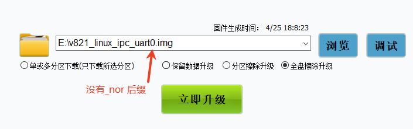

# 烧录相关常见问题

## 烧录出现烧写 mbr 失败

问题：

![image-20250428104637425](data:image/png;base64,iVBORw0KGgoAAAANSUhEUgAAAdEAAABXCAYAAABbXX/qAAAOvklEQVR4nO3dvW/bZh4H8G8Pt1vZBVcqatTxoIP+AAcVBFwNF4jtLh41eIiFNssJGgJ0NJBB0C1tYXfooNFLbAeo4RYweEj+AOM0JAochDrDe+2taIfeQFIiqYfk8zwkRdL+foACscS3Po+e58fnjfzo9z/+/AtERESk7G9ZXwAREVFRMYgSERFpYhAlIiLSxCBKRESkiUGUiIhIE4MoERGRJgZRIiIiTQyiREREmhhEiYiINDGIEhERaWIQJSIi0sQgSkREpIlBlIiISBODKBERkSYGUSqUwXI5k33vK6YZUbi/Z30BRPMUFBRao2ut/VSOcdcNlsuTNJANvvc9zaj4GESpMJyKWScQuiv4oONGiTr+jPEBTtb2cAMAK99i88UuFmBi+NUqLt5MNyt1X2Njp+rd1+hg0D60/6ihfnaKWgWAZ3/359lrja496exPr8A8EKTT7bMyjCPxear713jU8H529awM452Txn75TTMqPgZRKoSwIOh8r7Nv1HGTMK30ncp8WpHf/rSO494qBu8HaD1vWjsYHQzab1E/u7Yqe6ODwdo6cHaKWqWK2otr1OxtkhKVfiIq6SaTzu7geAu4bjxcxgc4WStjsOVKr0jppBkRwCBKBSATQKOCpGyQSDWgjn+B+Qao7k9bQgs7p9jEOo57p7h63sQiTAy/O0Sp+3raWmr00dgqw/jxHDXpwKEmzk1GVOtT9O+wc4aq7GJj/xKDdh/DJ022KClzDKKUazJB0NnO4a6cgyr3qGPofB+psouN0e7MxwufPATwFjdjYBFWoH3w1Nu9u/BpDZgE2vTo3LD4u3H9RJ/HSsvGN6ivrOIixZsKIlkMopRrooCY9XUk7erXQwDbKFUAjAGghpJviNQKtOmLCog6kp/hW0XpMwDvLnGLpmAMlGh+GESpcHQnFiV1HhnSQcjowDgCSt1vrBameWlNsBGyW6sZdWHKtDaDWqqiY8Wx8GkNOLrELcAgSpliEKVCCht7k9leJGrMLvFJSM4M3K3B7OzcORKlXdBYps64Jtea0l3GIEokIa0AOrO8pbqEEoJmkD60unwTJrP0RzZYirYTtVLjBtbb90Ng5TFboZQ5BlEqNNnZo0mdK4xskLWWtQzF60MBAEPcmABcAfP2w1sA8xkXBbwTuqLGScPSRWWykTwTN+8AfLbEIEqZYxClQpOZCJNEt2xSgdoJoKIHBgAAKl+gurIH84MJNKYB9vb9ENjqhM7Mda4hbotZdQZuVOvSv1/sVr3xvbXW9t+cmUvZ47NzKfdUgqS/Ihc95ShsyUyq43fjA/zHboEKAygAoIra023c9L7GcGx/ZHRgHNVQf5Ju0BgslyMnDznbRB0naqKRdjqPD3DSPkSp+wPXiFIusCVKhGlln8YSD8ft+Utr5m1vFYOe/1vX4+gafWx213G8VsaF/7sQusFJpQXrb3XqPgRDKp3f7OF4eW/m48BWfMD2wd3mRPExiFKuxWnJqD4AQPfaZIPuws4pWjtyx1bZ1n89qpLcR/T0oqhuYJHF59doPZe/HtXtiZLCIEq5FTcI+h/UkPSbRdJsterI+jpitTqJCopBlHIr6Uo3jUpc5phmuwxT9DB1Ld43kqQtqTSbfzp5jjzXNKP75aPf//jzr6wvgoiIqIjuzezcTGZjUuKCZt+KvpvH+UmM5U2dbpqlmaZxy9d9yO/cd+fGGccKGofh+MzdpDr2Fvc9mToPGaBouhVv3tNc9NtMo45K6qEgov3ivJYwaHud64hzzqTlPoiqvMtQtK/2Qu/xAU7W9qwlCfY4DeyF8sCcp80bHbxC357Wf45Xyy0gaJp/FiYvkf4B+Nd07ElmWUbawgKl6oPR/b8d3d/RgmeMziL6Pd26fm+AeGmHzDaTZ/QC8OaLd6xwnvkV9Qxe1UoxVovHzqMHKZapsBnKiT+MAnKPckzyuGHbqz4MReeasgykuQ+iYWQSTueNEu5tppXSOV6FPqotLed41T4E9vtzPKeuKmovrlGzg2rS4uZ33Lv7OIV0+jtyAtc0aFmBcBWD9wO07PdjWp8B9bNrK7AZHQzaZc/Nk8w20xsc1zZr68DZKWqVdPPLzd8tKLNERjbNs26JRFENIqp1VJzr0t1u3j18MmmY1e8g10E0aB2ef6G3aLuoN1Po3gE++ISLtvNItqCL9lPp7YhdUMfWS7er+9NW38LOKTaxjuPJS7dN/O/nIbA1mLYMG300tg5h/HqOR40mILnN8DvrIffebcowUnqhdVCZEpXfoDXAqvIcQMPEraNE45Vh9Z9fkjcosR+soXi+PMl1EHWIMkF2Ibc/wGplkrtLrl2GiW00Rn0sYrY7baal6t7XFvjElajzrnyLzRdL1ncfDnDSnh7X02Je7qPUfYiLnvWyZ+lrBXD1rAzjKPxavcepod5N/8HoYRMcVAOhqkQLdWUXG6PdmY+tl24n/L5QO2A/eOrN44VPa8AkYKdHtgszqmUaxbPvpGt2ALRbMO2PS93X2Gj+4imLM79tX5nylo/gchVGZq2zbh0Vln5Jdw+Hke0h0t1OJT2yCMKFCKKAXuKGPe1GKaEru9gYLc2MRc50p40PcLK2ihPYhc811rLh6V4ry41pCs97DgAwey8n5739aR3H7XWUJmNaQ1z8/Bibo+vJervIa4UdQDFAa+TqUvQc1wmy22iMTq0KZDLeNr/1d7oVhP8uX1VUT4efyjmufrUqZutVZ1V8/GUNF70+hk+ak25Y4wio7jutR5ltAKCGkq/zxArY6QvrllSpVHWY7T7qZ9doubvLe9tojK6nN5TtDiquQOguU6LyISpXcSVWR8W8Bj+Z7nbR32F0AmkRWqaFCaKA2uQD2e4F/Uw6x3/tMdJJV1llFxv7lxi0v8fVTh+L5iVusI26O1g2+miN4o9vuh/AvdB8jFJvz/P6rNKXX7gKusS14hzjoxrqZ9MKeOa44wNcHAHVfdcduNOF6Gq9Js2dV34yeRjV1RX0t6gL0n1e0TVqsYNfqfvNJF0Xdk7R+qSDgef5udeeiT+R25iXnh4Qr4RbvRFEaRqUp872cSrP2fIxBNzpa/+2x0Yfi9XZfVDZxefdlzjuOeXD3sZTruJJuo4Ku8lTmcilMlYqe1PpbBenRZpXhQqiKndBUdvFrgSNU5iood703eZXl1CCXTgb66iiBWMZUl0/Kjxjs5UlPAj7Xupam3g0crVgXDM6J8cW3RQAWPznNnCUzsSUtAuSTDdiWBCPzUnnrYGna33a4rdaTlbLqAyz6+s5iNhm3mTKo8znQLzlbaK5C1HzGfzfi7rYk5wTkWQdFTTcFbVfHLLDazqTotgSTYFqt0fYnVhymTLExaQV4GUFniYejV6j9NUqjOXDyXfSY6KJirpW/1jnNhpn3+JibfpWjHm/GBpI7t2YugEw1UJsB1DROPpMi9/fMpLZprqEEoJubh7aXcfp0wmGOl308cx2eyM0/eKLW0elU6d5ZdG16j5PEQJpIYKozsyvoDsj0V2RfibJrK2zlxHYf109K8PwjTPOR8S12u+69AT48YEn6M5rLE1VWB7GLXxpFV7nhkW4ZMq8xA1qqArHMu2Wkcw2AIChp5sfmP/NUFCrKF+V42w6hXeHxxe3jorqSg2ajCfT6MhKHsaIVRUiiEYVOtkujkQ11lHF4WzBi7D4fIDqUUt5v1hkrlXUVWtXIpPuXE/373Qzq1IOJxoTS5PsjF2RtK/RCaCBPRLVJZQC88tpQcps8wWqK3swP5hAYxptb98Pga1O6PDCvPPLf94oaVzXb/50+vAWWHmMj2OU06gAMO/hCpVJRO7vZW5+4v6/ZL2/rkI9O1fnjkQ0tuX/Xq+7r4l/dGsw2+sYjqefXj0rY7Bsf2Z0pv922OOTM11HEX77YEZvFOda7Yp7bDjf2g95cJ+7sovP/ccxOp5lM1mRycPBcnnmjlz0X6rsFn+p+zq4S7+yi/oWYLY7uHLtd9I+nE4+ktkGVdSebuOm97Unv4yjGupPkl8j6ggqU1HBBAjOk3nkkT+djntDVJ8m/UaZWenVUXrX4i8n82qlhuVrXluhQEFaom4qienv7kg6IyaL5D1jja71Y5U+Wvvu2ZOA+uPVmqhsAWZvFYOfXetEk75W2ONp7bK9ts6a6dn4sQyj9zWGTeuaZ49TQ727jYteeGt0HpVA1E2W7EzCNN2ev7S6CHurGPT8305/G4vPr9FA2TOW7u/6ldkGjT42u778kvj9JZFfee+G86t2H8N0lY+k5i7IDDckVUfFaWSIzi/b/Z51Pmd5/ly/Ck2nEAd1X4h+yKF/z+F5mnfW5FFz08o6iR+5ylR/QH2GYtQEiqhWgvD4RfgdJZxfYekk2tahMpmoaAEaiE4D1TpKlA7+f4uo5E1YfRq1nUwe6d6oqZbtNOW6JaqaMKIuCPcx3JlaxAHsIptnmopaUTLn18n/u/qbmUcA1T1PUdNcJiCp1FEyY5U6Y6JhrWJ/2QprYcvkURJ5mPXvINct0UwJ376R0vED5eNNKPKyeytIbqX9O4qF+UUUF4MoERGRpkLNziW6r5KaDJWX9YBEd0Wux0SJ7ivdMT+ddYBEpI9BlOiO8c9cJKL0sDuX6A4SBc8izmglyju2RIlyxgmAoif++MVZBhbnOERkYRAlyiGVtZYyVNdvEpEcducS5UgagW2ez14lum8YRIlyJI2WIVubROlhdy5RTsi8hSYIAyVRNhhEiXIi6g0Zcbt6o57LSkTq2J1LlGPuYMdxTaL8YRAlukOi3uLBVihRshhEiXIq7FVYMvuFPXCBLVqiZDCIEuVQ1Ds4ZYJg2LsfGUiJksEgSpQzsi8zVnm0n26rlojC8X2iRDnhBDSV8Ur3PioBVOV7IgrGIEpERKSJ3blERESaGESJiIg0MYgSERFpYhAlIiLSxCBKRESkiUGUiIhIE4MoERGRJgZRIiIiTQyiREREmhhEiYiINDGIEhERaWIQJSIi0sQgSkREpIlBlIiISBODKBERkSYGUSIiIk0MokRERJoYRImIiDQxiBIREWn6P9jwxd8o6CkhAAAAAElFTkSuQmCC)

这个问题一般是由于目标板使用的是 SPI NOR 存储，而烧录的固件非 NOR 使用的固件，或者目标板使用的是非 SPI NOR 存储，但是烧录了 NOR 的固件



请选择带有 `_nor` 尾缀的固件烧录 NOR 开发板

![image-20250428105019956](data:image/png;base64,iVBORw0KGgoAAAANSUhEUgAAAdMAAAB7CAYAAAAvxmqaAAAgAElEQVR4nO2de3Qc1Z3nP7f6qYdfAgyEEMJYIsE4wBLysoOHJLOA5EAgKCRnzmHIWUAecMBahwRCPI/NeAhZEq81hGSsgd0knLM7C4I4TJAEyZnkAHayYCc8bEMsOYRMEoyN35bU6nrc/aO6pe5SVXe1+qG29fucU0fqqlu3flW36n7r97uPUqm0qREEQRAEYdoYM22AIAiCIBzviJgKgiAIQpmImAqCIAhCmYiYCoIgCEKZiJgKgiAIQpmImAqCIAhCmYiYCoIgCEKZiJgKgiAIQpmImAqCIAhCmYiYCoIgCEKZiJgKgiAIQpmImAqCIAhCmYiYCoIgCEKZiJgKgiAIQpmImAqCIAhCmYiYCkIVGX/4AUa6/xI9OjJlW2rdGsYffmAGrBIEodJEZ9oAofaMP/wA6YcfQJ10Kk0P/F9Uy8K87c5rLzN6103Err2BxPWr8rbpA3sZWfVZ9P63JtapxmYa730Q473n+x4nl6C0QaTWrQEguXb9lLz1G7unrC9kZzGMxRfSeM+/ADB69804O18MvW/u/qqxybVhdARr22ai71+GamyasClxy53Ell9RUt6CINQ3IqazGL3/LdJPPjpFMIPIimP8+lV5+4w//AAjt39uynpgimCn1q1h9K6bQgmqPrAXa8evUc1zOHrZYt805mWDeb9zBRFcEc4VLvOZQdKP/yBP9LLnYG3bnJeXd99CZPPNs//3u+HoYeIrPgOAtf1XqFNPJ3rxJaHyFATh+EHEdJaiGpuhaS7mY98n9oFLigqb+cygr5ACJK5fhXHWIlLr1mCctaigACVuvQtr1WcxX3iWRJFjpp98FHXq6VOED0J4pqmpYdVKUOy4uaT7vkfk7PdMvEjYzzyNs/NFjl39gfx0Od57KQIuCEL9IGI6i0neeiepb9/D2D/f6ytYWfToCOnHf4Cx+ELi137eN0304kswFl9I+vEfEL34ksC8JvJ8Y3fh7Qf2Yvb3kbjlTgBGuv/SN+ya65l6w6yVILVuDeYzg1PWe48bb+/M2+689jLW1ueIXvzRid/267+h+V9/nuelq7MWhY4MWL/8Oan1fwNA4ra1xC65fFrnJAhC5RExncUYJ51K4pY7Sa1bQ/qx7wVX6qkR9FtvEuvoDBQq1dhE9P3LMPv7IDUCQcK8dw+MjaDOWlTQtvHv3DulvTPXK/Z6iH5hVnAFK8WaKeu93iG4ougluXY9SSa90CDPNFdw9egIY/98L3r02MQ6r5c6HVLr/wZ9aL/7/7ovwp1pYh+/ctr5CYJQOURMZzmx5VdgL3+6YLg3K4BGEQEEYGwEvXePr2hkRUa9uzXQwwVXmOw3hjHOag1Mo9/YXVSQobw20+mSfux7AMQ7P4/euwc9OoIzcpTkDbdVJH8AtEPqG18BEEEVhDpAxFSYaMdM930vVFtgKej9b3Hsc5dO/A7TJmhv3Uzyr+8i9fC389anfXoH5/728ywrgfnM4ESv4ol1mTCv3/nofXto+Ou7MF94FnC99sav/wvlkrhtreuRaidzIBFUQagXREwFVMvCiXBv5JnLiCx8R/72hadBQxNOkXZOABqa3PTZfXN686bWrWF8/d8SWfiOgh2ekmv+IW9cpmpsomnD/85LEybMqxobp5zLdPEb9jJ6982B9gOQEdPsUKPcsG8u3heCoHbf2CWXo748zth/v1sEVRDqDBFTAZgM945/9xskv3B3/sZkE+rU07G2bSZ+7ed9K/qJMZXn/afAdsHEmn/Avvvmoh2e/HBee5mx+75C433/C9WycEqYN7b8ijwPUe/dg96/j5HbP+ebX9g200pgvPd8mjc9P2V9qR2QAKKfuIoG8BdUpYh97JMVsloQhFKQGZCECRK33gVA6jvfyFuvGpuIf/qvcHa+iLX1Wd99ra3Pon83TLwzuC00N59su2JYjPeeT/TSDo597lLSP3wY+/XfEPtA8HhNe++foKGJ5n/9OXOe3jmxJNeux1h8Ic2bXshbHy8iaNkhLUcvW8zRyxZz7OoPlDypQ6WIfuIqGr58D6icx1c7pO69C/NnP54RmwRhtiNiKkygWhYS6+hE7/vTlJBkbPkVxK9f5TsF3vjDD5Bat4bYtTcUHa+a9SDN/j70gb0l2Ze4fhXJtesZ/+7XYc481LuCOyDZzzyNOvV0SFZmmIxXgJs3vVA1TzYMIqiCUF9ImFfII37t57G2bfb1uhLXryK+4jOMrPpsXjufOunUvPGTRY/R+Xmsrc8x+rXuksK92TGf0Q9cgjNydCJU6+0ElB3jmVjztZJCyZGTT3On/fPMo+sNIYN/O26tiX7iKpJKuSHe3JDvvW6EQUK+glA7RExnIQmfWYyyFBMJ1bKQ5v/zs7KOE9SG6MvY6MSEDfHrVzHn6Z15m7Pz3WZ728aWX4E6axHRiz9atNewd+5gb0/moDGqQcyEp5rtdCSCKggzi0qlTT3TRghCPZHtqRv/9F+VPDdvpWdgCov57/+WL6gAyiB5170iqIJQA0RMBeEEIVhQv0HsYytmzjBBmAVIByRBOEGIffxKknd+3adT0p2YP3ty5gwThFmAiKkgnEDEPn4lybvuLVlQ7V//kqOXnVcDC4VCJOOx0It3P7+8wh5zOnaWu6/f77DnW32GuX/5Jdw/HH4PEVNBOMGIfeyTJQuqvesViMexNv+kRlYKQaTSZt4StM6PagpokK2FxLDUPLznWex8y2bwFpLxW3jKu374SR6lk45WgEFW5Z1Xbvph7l/urhcxFYQTkFIF1X55K6THMfsfraGVQiVIxmNVFZwgL9H7f5bpCGBVBTOI4R6WX/VgwLbXeH7Je1gEMPwb+OarE+e145vb+dTyHnInV73xCVOGxgjCiUq2F2/q3rs8w2budKcevLRjIq09tAMA64XKfDlHKI9CodBiwuP1FIP2C0rnl9Zv37ACGBSCzu6f/T/Ik62O0A6yanEfn9n5b7xv8Y+mbH3qiQe58arvuj9aV/PA7ZPbFnV08sE7XmMYyJ02RjxTQTiBCfRQv/5lzJ/3uz+PHUGPuDNeqcZGzOeenglThRwKhXlz8QpimP2Kpau0eAWFrcOm9aO8dtRh7l9+JTzxLLf5fuVxkCcevImrAkbF7e7v4/kPv5fcXR+6KiaeqSCc6AR6qF//MgDG/JNQ8QTaTLsfLBjoI/bRy2bKXCGDn+fo5zEGbQvKczpiWczD9Yp1PfPUrefyaOerPBM0hHzwRzx006d4wH8j6+/4JTc+8WzGK23ltmdMbkNmQBKEWYErqMoN8XoENfaxdvR4aiKttVVCvfVCpUVqul5nbkh2OmnDingpnZamy67t8PyD55K8Y3LdQ/Ht3LfT9VR379rOB9/7RZ89B1kVv5JXvukvxCKmgjBLyE7c4BVU89/zOySpBjfUK97p8UWx4TGFhLmUNlnvfmHSZz3oYmkLhbErRdaTdBlkVfxHXJX+LpcDMEx/H3zmf3rjv66Q8oQZ6NFKm6kgzCJiH1tB8q5v5LehetCjI1j9j9XQKiGIUoaZFBtSE5S2ULpCx/J2IqolVRt7mjckJsukkD7gFdLBW0jeOgiImArCrEIfO4Kx4GRilxaec9ja9lyNLBKCqOl4yxD4hW2DvGG/9WHDvDM3UQMw/Bp0rsjrpcvgj3gIt5NRrm2rBoHW9/LBB68kGY/J3LyCcCJjv/hL7N+8gv3yVuyhHeiRY25no/EUWMGVm2psJvHFfyB2yeU1tFYoRUC8Q0v88qpEpyS/DkZ+IWM/bzWMXWHsrPZY2ixP3Rrjiat8PNAQSJupIJzAjN55I8TikB6fWKfNdNH99OgxrIHHRUxngEp21Am7X5AnGUb4gnoUV6L9s7beaWZIzHemt7d4poJwgmNt/glm/6NYL2xGNTZO+fh5IbzfjxUEwR8RU0GYRZjPPY010Ie1dTOqobCwSqhXEMIjYioIsxTzuaex+h/D2vYcqqEJPXpsSproxR+l4Z7eGbBOEI4vqi6mWin+sH8PsSM7aEz9B6ZtovU4hpNGAygFaNCTZigFKAOlItjxk0gn3okVfxdnnf7u3GSCIFQI89mnsAYex9r6LKqxOU9YJdQrCMWpupjuGz3K28NPcMqBJzhpZAjLGWPMsNE4gEIrA4UBOChslI6AbYCOYkQSqGicZOw0/jSvjeZz72R+U0s1zRWEWY8rrI9hbX0OlUiS+NI9xJZPo3ujIMwiqi6mu/e9ifnKPZx6+KdE03ux7HEiWmFoBVqjFCjA1GAZYGgHZYAigjIiOAmDuNmCNUdx7J03Y5zyGRLzzyKejBFVENGaqAFKu/KsYcLL1SjX6cVxV2mNVoq4jK4VhFCYzwyKkApCCKo+NCZtpdHpA2AdQJnHQGtSRgxtRNwZI7SNgSaiY8TTcVAWtrKxtYm2xzH2L+T3iTQNRw9x8pvfYGjBT3ij+XLivIOEUjixOJFYgki8gUhiPpHkApLJJmKxOMlkA/FYHBUxMJRFxBoHy8S0TMzxo9gjh0kfehPbfIN5Laey4B0fZ8+hUZwDrzDnlDOJN89jwZzTiBiivsLsRIRUEMJRdTG1HRvHGcPBIhKNomyDmHZwrDS2BtvRmLZDSlvYegzHBtsGy3E91qgxynjcIRW5ACM+l9Maksxr2I8xp5F483x0fB6R+MlEjbkY1hij4/s5MHaY0T0p3j64n8NHD3H4wBFShw7A2D7sowdxUkc5NnYMi0O0ndPIxZf8Oaef9H6a5jShD7zMnuF70EdbMJvO5EjsIuzTPsLJp5xT0nl/7e//rjoXVBAEQag7qj9pgwZbKXSkgZGU5ujhYzimxnFgHLCiMYjORydOwUicSaJxDomGOTQnWjDiTdjz5nJG3ECpJVjJJHHzbRrHLAxsoqMpogd3EU//mvH9h/j11mEeff51XnUceNskNTLCgfEUeixFUo+RiDhEFcQNaGmB5VeczYcvu5Uzz/0kKnYKaTWOER9BH3yFBruBRHKI5oZd7Lb/SLzxJuY2LSzp1P/xH/+xOtdUEARBqCuqL6aOQZwkh47Y/McfU4xyOsl5bSSbTyfSMA873oJKzCcRbyEWmUtKwVGtMB1NasSGw7DQGGNBdB8py+Hw2H6skcNER8eImCki1hgxexz72DHefO0PvPWb13k7Ao3pKFEMGqKK5PxGmpPNxOKKeNwgEdect2QhH/yL60iefBm/fdPGSu2kkQbiRgMp0qSPpomPKtLzNLrxFY4efLNkMRUEQRBmBzUI86aYY42yb+8xrHmXkDytnUjLe1ANc1GRGIaKgxHBwsHR46TT46TGU6SsFGlTE0+Nsz/iMBYZQVsGKd2A05ggmlAoomBEUUYMgwgnnzdOZ/tRRoEICiPTqUkZYCgDjdvhKaI0809uwZp/JkN/eJO0eQyFSQMLmBNJ4DS8n/Ejm2lOHMTEIX7sjxw5NsIZ1b5YgiAIwnFJ1cXUtFI45hFM22H+mctpOuvTmHFFanw/dtpCKRPsFDZgaVDRGI3RGE1Nc1FKETNstDZwlIEBNCuFUjG3py6abFdkDUSjBmclosRQaDRaaQztdh7SWqO1+1ehGDcdUqlRYIxEPIomhkWakXSShvl3kLJMDusXOMVK0zSSYk9q3Pf8BEEQBKH6nmnaIE0MGhOkLAs1ehR7NEUiadI0txlwhVBhgI6BoUGDQgGgcNwhLSiUO84FlNsOC/mjepR2v3ns7qsmcs5sRevJ3/EozJnTADRMblc2dhQaFl5C7MwY1tvr0ftfIWqlMcfHqnmZBEEQhOOY6o/50DYYCUbHNAf3v8nrv32JN36/G9O2iCVjOEqD0jiZRQMOGhsHGwcTjanAUu5f0wBTgW3YWIbOXyIaRznY2O7wGuVk/rqLo5yJRRuu50rOolyfldHEbmhZTvLkLvZoTSpyAO3YZV+KgZUKpQosy3oY9tlvuGcZy3r8tgQz3LMsL++VA1NS0LMs//gFjzHcwzK1kinZFGWAlRPHz/2/Hqg3eyrAwMqp5zOwMqecl1HirVQjTsCyEGYVVfdMtUpjpQ2wGtDjR3D06yTnLsA6BgfM/ZiWmfEkDdBGxpdUE/s7hoN3Vgl3q1OWXUrrnKNk1xnErRhObIwD0QPMtSyOjL0LM3mo7ONNsHQDQ5tX01o85QStK66D+4Yg5F7DPcto64YNQ5rVrbiVaYeCfs3GdnCFtI3uLUvZMLSZ1a3ZfdpQO/vRbqIcBljZ1s0Wukqw2o92NtbVfJD1Zk+5DLCyoxf6N+asWonq2J5/L7Qtg0y51w8nWlkIs42qi6ljNZKyF/Keiy6l4YzFRJtOIakdYhwEQ+E4uQ+QV97cVb5i6vfcqRIeRj0ZCJ5cpcGwcIwYTnQ3ERPmJ9rZt3cHlu8Ba0TrOSzp3cTAxna8MjeVYZ58ZAt09U9Wlu0b6e/qpWPTABvb22H4SdwkkxVq6+rNDLGMtm7PcQZWojpkovPjk2F61vWydMOQ515QdNw3wOopL02CIEyXqod5Hcdm/tnnsmjppZx59hmctsBkwckHaThpDw3z3qKpZW/O8tbUZcFbNHuWpgV7aVrwNk0L9nuWfZltIZaWvTTmHXsvzS1v0zR3hHnNR5mfNGiaE+XUC97FwiUXQTxR7UuVQyYEOxHzaufqru3sGiYTbvUJhw2sDB/Ca13NZp31UnNWn7MEyBwnm2eHWxnr/nK9Upgaysv+dv9ODUn7hf4m17mh7NzQs7stfEjck/9wD8vUMnoG3GtcKPztDaOrkuKThc9rYo2nWWBq+mX09OSGcDvoBXo7Mk0GmZemJefku6Bti5dC76YSQvbFymnC4ALNBl57vU0GfmUx9ZjLeoYntgXZkX/dsses1/C2cKJQdTGNxhqY22hj7t/G2L6fMn7gGcx9O3D2vY6zfxjn7eksQ5lll2eZbn6T+eoDL2Ef2IZz6EX0/l+h//A089TbJOJzq32pcmhl9WadF25tWwyPPDkMrSu4bin0bvJURZt6Yel1rGhtZcV1S6F33WTlMbCSjl7ourqwJzKwqRdYwjk5XozWms1Vjgf2dqxj8ZBGa83QhqX0doSr+FpXf58NS3tZl0k83LOO3qUb+H5Z9m6hu6ObJf2uPbq/iy3dbXkVdm4Y3e0l3k9Xb0fJ7dqFGFip6KA/k3/QddlC9yOLGdI5dgBd/Ro90ZSwlMVt+Xm7L02lU7CcMi9eXf2TtizpbvO8ZOTauzFElGXqMbd0t6HadrI277pMCvPASkVHbxf92WvSv4TubomsCNWn6mKqooA1StQeJ2FB3I4StRNEnTIXHZu6OPEy800SceYTcVqI2AuI0oKyT8Iei7tjWivBlm7aAjogFaqMW89ZwpadbrupK5ab8jwyV0tX0IobstX9S+huy+SdaTMrGNXLCO7SDV8KVclVkqUbvj8Zbl5xHUvZws6hMHu2snptF1u672OAAe7rhg3fL6092t+eoclr1b7RrbDXZTuHDXBf95Y8m7PtfZV76RhgU+9SNnxpsiSCrku2zH0Z2smWwGPkRCBCElxOk+HkyXusnY39XfkvdcXsDXXM/HvUXdfLpgFguId1vdDVnyPU7RupSFBFEIpQgxncbTSm+yUXpxFlNeBgYasxbJWa5jKGbfgs084vN98jWJHDWMZhTOMQduQgtnEUMCtzOZZuyPEk8peClXH71XRlBLR19Vq6shUIwMAmelnKdSvc/QdWKlQHk2/nQ9fxSFsBsc62i3b1V90L9SMvDNl6DiX5Tdn2YNVBb9fainSq8YZFW89ZAlse4clhYHgX233SVJZ2NuqcDkIDK1Ft3b7CWF07Chwrt5wCwsm0LZ7yAlCqvX7pA/MY2skWuvAGYNqvFjUVqk/VxVRrhePYWIxiGYdx1BEMZ5SIXeZijUxd7JGy8zXsVGYZx7DGMaw0OCm0nulxpm0sXpr1Jtq5umsy1DsZ4sX/7bx1Nd/fsDTjwXnIbRc9TjukZCvLYmHscEwNi04vTXnktcl2QP/QBpaWmknb4gL75ITzq0WpL0ZlMrxrew2PJgj5VN8zVRqlx4hYpvsJNGcU7YygnbEylhTaGfdZUmXmOwbOOMpOo+w0hmOiHIuYZRKp1NCYadPKiusy7aZkBKR3EwOZEG/X2kx4c2gnWwLbyfJDe8M9yyaEdCY80srghhi7urry2s6qS9gw9DQZ7uGG7i057Y/h2hf9mWprzUQn48XXium2BQtCJah+m6kGnDTattC2g9ZptDZxtF2Xi2un6S6OCdoCu0Ih3jKZbDfFDfvSy6aVm+jNDW35hNYmmfRG3E40boVd70K6Pe8NIL+CHu65gW428KWNX8rrjDR9tky8sGTJ8/wz3tb2UhscfQg8L79wZcH2zwAyndW8tg7t3AJdV1eubTzgOEEvdlWjbfFk+2kO4rEKtaAGMyA5aMfOWXRmcepzsb2L7Y4/rYfx5DntphOh3t7e/IqxdTVru8j30oZ7WNbRO9lxI+P55HcYqUfaWLwUtjzyZKbzzzA9N+S2HbqdgVyvPLczUnls6b5hak/orOdPO1/asDQ/zZShTGWe1xRRyEzGQDgRn0yTvSbe88nv3FQ+2eO05Q9rci9c7SaH8Lv3B1bS1l3ya4gglEwNxFSjcFCOjdLuXxwb5Vj1uWC79k4sgM7O61sBCvTmnRwLF1Q557abBrcVtm/UmU45mXzdcRwTHujwk4+wBdxhBoE21AOtrN7cT9fENWtj59r+iXmYBlZ20Lt0AxO60O56px1lzknXtcHtsOW2V7rDPXJfOlpXb2ZoA5O9pVUb3Uv8Zo6a3nll27h7O7L5u8ND+rs8Qj8F9wVrS3fb5NSU7Rvzbe3YPjHrVUVp34ju78qxuYPtBdvhS30BCWuG597vgP7+LmrSRizMalQqbVbV53ph5yuccbiHMxK/w0ChdBp3rqEadCSeFgZkJ8pXimhEMWYtYGv0v/DBCy4PncvX/v7v5OPgxxvDPSxrc8eY1rfHLpTEwMpM7/Zy2p4FoTDV782rFNg645lmO1Q47udd6nKx8hcnnWnnrYc4ryAIgfjODuaGm2di/LQwu6i+mIIb6tU2aLf90cHBwarjxcxZLBw1jnZETPPwTOlWOGw9S2yr52vix/FmbzFaV7M5L9Tshps5DjrZCcc/VQ/z/r9Xt3Pm29/knclhlDawlYX7BRafSe3rikyY19CMOXPYZnTz4YvCv9tKmFcQBGH2UPWvxgBoHDe0C24oFQf08SGmoF2T67WJVxAEQZhxqi+mykFrG60ttIqgsTC0Pg7EFNCZL6tqp+79aEEQBGHmqI1nql1BBTXppR4PYorKdJiyZ9oQQRAEoY6pupi6DbIOOCZKaTSW2zNWHw9xU4VGo7GnNWfDV7/61YpbJAiCINQf1RdTpTPi6Q6NAZvjJ2iqcJTGsTWljoz527//b9UxSRAEQag7qi+mWuNoB8fRaMh4eg71MT9fMdywNNnOU4IgCILgQ9XF1FBuONed9EBP/GXGv8ISEgXatinZNRUEQRBmDTVpM3VsByfioLQBjkbhdkY6HlA47kkcH+YKgiAIM0DVxTSqQWmFsmJgKGxDY2hdt9pkaFCoTBBao5TGwHKnRRQEQRAEH2oQ5oWxhmPERyPY0VG0YWI4MXQdDo3RSmMaTuaD5gpwwNDE0mPoWHymzRMEQRDqlOqLqU4wkjY4kjqMFRvFQRO1E5kmyDprh1TZ78W4X7VRaOxoBNuJEzNiM22dIAiCUKdUXUwblebAyDz2HrIYdxSOY2Coo2hlouoy2Ot6pNrQoKLEYg3QcBIN0eRMGyYIgiDUKVUX06aTFrAr/S5i9jwanYPETRvLiGArVV9iqhRoiGqF1haO4aCNBmKRk3hr9J2cPefkmbZQEARBqFOqLqann3Iab777U+zfFeOPo39AO0dw0iY27iTy9YJSCqUVESfqfsc0Bio5l2bOoOmMj3DGqWfOtImCIAhCnVL1T7ABmONp9u75PcfGjmCZKbRtTn5Fpm5wvWSlDZQCFYFIvIFkYg6nnHomjY1NM2yfIAiCUK/UREwFQRAE4UTmeJhtXhAEQRDqGhFTQRAEQSgTEVNBEARBKBMRU0EQBEEoExFTQRAEQSgTEVNBEARBKJOqT9rgx8svvcRjfX289NJLHDp0kPnzF3DBBRdwbWcn519wwUyYJAhCidz/Tz1s+uEPGR8fR2uNUopEIsHV11zDbbevnmnzZjVSx9aemo4ztW2bDf9jPb/dvZvOzk4uuugiFixYwMGDB/nVr35FX18ff7ZoEau7/yvR6IzovCAIRRgbG+PT11zNn519duBz/NvXX+fRvsdobm6eaXNnFVLHzhw1FdN7v34PjQ0N3HHHHSif74NqrfnWt77FyOgod33lbt88kvEYqbQZen1QumLpw+bnl7aUfatBkD1+du2+fznnffE8fpT+LpfXqY1B+2TXARPrp3t/VKcMB1kVv5Id33qVn9/WWmZe9cPl//kvWLFiRdHn+Mc//jFP/eSngfmUeo29ZR0mfdgynW55V+r+qxSVqGOhenVapa5PmPS1LpuaiekrL7/Md7/zAA899FDRtDfeeCO33LqK951/vu/2cgo6N22xh8tL2AexUKGFISsqYck9n6C8fM95+J+4dPGrfCVHSMMct9DxKm1jbvpC63Lxy6tSYlpKGboMsip+D+fufIYvnAB6+sC3v82O7a+Efo7PW/I+Vn3hC77bc8vGS7GyLrZPbpmX+qIWVMZh7r9iFXaxvMthJurYUp+HMNc5m75Q2QeV50yWTc06ID3W10dnZ2eotJ2dnfQ9+uiU9cl4bOKEs/97f3vTehe/fPyOk0qbEwuEF9Js2kIFU2zxS1doX2/e3v+9x8/y1Povwre+OMUjLWZbULpq2BiULmhfv/2D7pHc7dUoQ5crWPMtuGP9oG9exxuPP1bac/z4Y32+27zXPOgey24LWhd0bxTbvxhh7vuw5J6r33NSKSpRx0K1n4fi+3q3BzCHtmUAAAWHSURBVNnmZ9NMlk3NxHTrtq186EMfCpX24osv5sUXX/TdVqjyDkoXRqiy1CJkG3RTluLp+e0b5mVj8hiDPPHgR+hsr527VLqN5R8vjHhPN++w6xfddjc3PvgjnqrIkWeWVCpV0nOcSqUqc9wClXkupbxke7cXehmfLmE9sUpQqTp2OoR5HrzXOVumxV52c/cvReTD2FzJsqlZC/TBAwdoaWkJlXb+/PkcPnzId5v3pItd/FwKCae3gHP/etP67e/Fu3+xbWFFu1CeJdk5vIsdH+lkTRW0tGI25mzzy8ObtzddOdczN8/yy7CVcz+yg6FhuPwECPWW8hz7ERQdCCLMs5nF73nO/vb7P+ieLHSvlorXFu+2Sr3gVaKOrebzEFSnesvPK8CFPNHs+ulSybKpmZguaGnhQMjCPnToEPPm+T+IhQqr0IUu9uYRptBz8bsR/PIMc/OVUmhB6f3eAL3nlbff8Kv88rxPsSjUUUujYjZ6tgdVmn4Voze93/61K8NW2s77BU8MAyeAmJbyHHsJqkBzt+US9NtP+PyOkRudKOU587tX/e6VQi8GuS90YV8WyqHcOraWdZpfujD7FauTC/3OXVeNsqlZmPf9F72f559/PlTabdu2ceGFF/pu84ZephuKCSq03Acw+9vvOLk3gPf/Qg96LqU+4N79vOuC7CqV3HP1LvViY1gbCh1zJsvweCWZTJb0HCeTybx1fhVgsee50P3ol9bvxTjUuQVENgrdH7m/g+7rYt5epe6dcuvYWj0PXiHNLUe/F62ge8OvTp7JsqmZmF7b2UlfXx+OU/ij4I7j0NfXx7U+DemFLk7QiYcVAe9bbHad3/EqRZg3wSCC9vPeaIG0nsuHd+xit0++xZaa2ZiTfjrXqBaEK8NhhnZ8hHNPAK/06muuKek5vvqaawqmK/Q8Tzcd+Ecs/PB7QfauL+f+C8qjGvdzJerYcin0PPg5Itm/YerYsPdAKbZm/1aibGompudfcAGLWltZv349WvuPxtFas379eha1tk6ZpSPobbTQW2qQ+Pp5nl4R9d4Uhd5gpuOZ+IU3yqXQ2/QUG1vP4bxf9DEwXPZhq2ejzz6lEiYcFJSulLwLl+Ewr/7iPNpOADG97fbVvP6734V6jl//3e9Cz4SU+5wFbQ8TkSpVBAvdW+VW1t48vN5dmLqlFMqtY3OpxvPg9xyWGgHzK+/pUumyqencvLev7iZtmtx8880MDg6yb98+TNNk3759DA4OcvPNN5M2TW5f3T1l3yAPKYzn5H3AiolXKaGA6eCX33QENewbt3e9yxVcddMv6PNR00IVWqmUZ2P4vILyD3pIyqWUMtx9/z08dNOnajopRjV55NE++gcGCj7H/QMDPPKo/7AYL2FeSkr1TIO2hQ1BlmJzGLyhzLD2lEo5dWw5TKdOC1OmXscnzDFmqmxqOgNSluy8kS+++CKHD7sN4RdeeGHJ80YW8xazBBWGX3gnzLYwNgR5RJX0sLzbc/G7IaecU8CkDdOtbKpho1+ZhfldyrWubhmeWJM25JKdmzd3+EsymQw1N69fORX6vxhB0Yew94Z3W5Cge9MHnVeQHX7nWGlBhfLq2Go+D8We1zD3Qynbih0bKlc2MyKmlaKSFWaxkESYPP0E3Js+DGFv5DB2FbvRcqcT/FSZb+WVtjHMQ1IsnyDC7FN+GZ6Y0wlWglIq5lJe8IIqyGKVcZbpVN5hbZ2OANSaaj4PhcomaH2pjs5Mls1xLaaCIAiCUA/I90wFQRAEoUxETAVBEAShTERMBUEQBKFMREwFQRAEoUxETAVBEAShTERMBUEQBKFMREwFQRAEoUxETAVBEAShTERMBUEQBKFMREwFQRAEoUxETAVBEAShTERMBUEQBKFM/j+7ClvpM9yfqwAAAABJRU5ErkJggg==)

## SPI NOR 烧录出现 GUID Partition Table Header signature is wrong

**日志：**

```
[1130]fes begin commit:25ecf28f19-dirty
[1134]set pll start
[1136]set pll end
[1138]board init ok: use hosc 40M
[1141]beign to init dram
[1146]DRAM use internal ZQ!!
[1148]ZQ value = 0x2f
[1151][AUTO DEBUG] single rank and full DQ!
[1156][AUTO DEBUG] rank 0 row = 13
[1159][AUTO DEBUG] rank 0 bank = 4
[1162][AUTO DEBUG] rank 0 page size = 2 KB
[1166]DRAM BOOT DRIVE INFO: V1.00
[1169]DRAM CLK = 520 MHz
[1171]DRAM Type = 2 (2:DDR2,3:DDR3)
[1175]DRAMC read ODT off.
[1177]DRAM ODT off.
[1179]trefi: 7.8us
[1181]DRAM Size = 64 MB
[1194]DRAM simple test OK.
[1196]init dram ok

U-Boot 2018.07-g0021c54eea (Feb 14 2025 - 06:12:39 +0000) Allwinner Technology

[02.924]DRAM:  64 MiB
[02.962]Relocation Offset is: 01f29000, reloc addr is: 83f29000
[03.191]secure enable bit: 0
[03.204]CPU=614 MHz,PERI=3072 Mhz,AHB=192 Mhz, APB=96Mhz
[03.212]sunxi flash map init
SPI ALL:   ready
[03.364]init_clocks:finish
[03.366]flash init start
[03.369]workmode = 16,storage type = 0
sunxi_get_spif_mode()227 - get dtr_mode_enable fail -13
sunxi_get_spif_mode()236 - get io_mode_enable fail -13
[03.827]spif sunxi_slave->max_hz:100000000
[04.350]spif update delay param error
[04.354]Sample mode:0 start:0 end:0 right_sample_delay:0xaaaaffff
SF: Detected XM25QH128C( ) with page size 256 Bytes, erase size 64 KiB, total 16 MiB
[04.565]Loading Environment from SUNXI_FLASH... OK
[04.591]try to burn key
[04.598]out of usb burn from boot: not boot mode
Hit any key to stop autoboot:  0
sunxi work mode=0x10
run usb efex
delay time 2500
usb init ok
set address 0x14
set address 0x14 ok
SUNXI_EFEX_ERASE_TAG
erase_flag = 0x0
origin_erase_flag = 0x1
FEX_CMD_fes_verify_status
FEX_CMD_fes_verify last err=0
the 0 mbr table is ok
*************MBR DUMP***************
total mbr part 6

part[0] name      :env
part[0] classname :DISK
part[0] addrlo    :0x20
part[0] lenlo     :0x80
part[0] user_type :32768
part[0] keydata   :0
part[0] ro        :0

part[1] name      :boot
part[1] classname :DISK
part[1] addrlo    :0xa0
part[1] lenlo     :0x1280
part[1] user_type :32768
part[1] keydata   :0
part[1] ro        :0

part[2] name      :riscv0
part[2] classname :DISK
part[2] addrlo    :0x1320
part[2] lenlo     :0x480
part[2] user_type :32768
part[2] keydata   :0
part[2] ro        :0

part[3] name      :rootfs
part[3] classname :DISK
part[3] addrlo    :0x17a0
part[3] lenlo     :0x1900
part[3] user_type :32768
part[3] keydata   :0
part[3] ro        :0

part[4] name      :rootfs_data
part[4] classname :DISK
part[4] addrlo    :0x30a0
part[4] lenlo     :0x280
part[4] user_type :32768
part[4] keydata   :0
part[4] ro        :0

part[5] name      :UDISK
part[5] classname :DISK
part[5] addrlo    :0x3320
part[5] lenlo     :0x0
part[5] user_type :0
part[5] keydata   :0
part[5] ro        :0

common1(partition3) need it, here is a weak func
total part: 7
mbr 0, 20, 8000
env 1, 80, 8000
boot 2, 1280, 8000
riscv0 3, 480, 8000
rootfs 4, 1900, 8000
rootfs_data 5, 280, 8000
UDISK 6, 0, 0
need erase flash: 0
[07.864]get secure storage map err
secure storage init err
no part need to protect user data
SUNXI_EFEX_MBR_TAG
mbr size = 0x4000
SF: write offset not multiple of erase size
write primary GPT success
spinor: skip backup GPT
[08.022]update partition map
GUID Partition Table Header signature is wrong: 0xCCEDDDCCCDDEECDC != 0x5452415020494645
part_get_info_efi: *** ERROR: Invalid GPT ***
ERROR: attempting read past flash size
*** ERROR: Can't read GPT header ***
part_get_info_efi: *** ERROR: Invalid Backup GPT ***
FEX_CMD_fes_verify_status
FEX_CMD_fes_verify last err=0
FEX_CMD_fes_verify_value, start 0x20, size high 0x0:low 0x10000
FEX_CMD_fes_verify_value 0x66662a00
```

**问题原因：**

根据以下两条打印可以看出是 SPIF 采样点获取失败

```
[04.350]spif update delay param error
[04.354]Sample mode:0 start:0 end:0 right_sample_delay:0xaaaaffff
```

一般 SPIF 采样失败可能的问题有：

-   主控或 SPI NOR 芯片虚焊
-   SPI NOR 省引脚需要用单线或者双线模式，目前SDK默认四线
-   SPI NOR 物料损坏
-   走线导致信号质量差

**解决方法：**

1.  检查芯片焊接情况，包括主控和 SPI NOR 存储器，测量供电与纹波是否正常且符合要求。
2.  尝试 **依次** 配置 \[①关闭 DTR 模式\]、\[②降频\]、\[③配置双线 或 单线模式\]。方法如下：

编译平台对应的 `uboot-board.dts` ，默认配置如下：

```c
&spif {
	clock-frequency = <100000000>;
	pinctrl-0 = <&spif_pins_a &spif_pins_b>;
	pinctrl-1 = <&spif_pins_c>;
	pinctrl-names = "default", "sleep";
	/*spi-supply = <&reg_dcdc1>;*/
	status = "disabled";

	spif-nor {
		device_type = "spi_board0";
		compatible = "spi-nor";
		spif-max-frequency = <100000000>;
		m25p,fast-read = <1>;
		/*individual_lock;*/
		reg = <0x0>;
		spif-rx-bus-width=<0x04>;
		spif-tx-bus-width=<0x04>;
		dtr_mode_enabled=<1>;	/* choose double edge trigger mode */
		io_mode_enabled=<1>;	/* 1_x_x && x_x_x mode */
		status="disabled";
	};
};
```

关闭 DTR 模式，注释配置即可

```c
/* dtr_mode_enabled=<1>; */
/* io_mode_enabled=<1>; */
```

如下

```c
&spif {
	clock-frequency = <100000000>;
	pinctrl-0 = <&spif_pins_a &spif_pins_b>;
	pinctrl-1 = <&spif_pins_c>;
	pinctrl-names = "default", "sleep";
	/*spi-supply = <&reg_dcdc1>;*/
	status = "disabled";

	spif-nor {
		device_type = "spi_board0";
		compatible = "spi-nor";
		spif-max-frequency = <100000000>;
		m25p,fast-read = <1>;
		/*individual_lock;*/
		reg = <0x0>;
		spif-rx-bus-width=<0x04>;
		spif-tx-bus-width=<0x04>;
		/* dtr_mode_enabled=<1>; */
		/* io_mode_enabled=<1>; */
		status="disabled";
	};
};
```

降低 SPI 通讯频率，将 `clock-frequency` 减半

```c
&spif {
	clock-frequency = <50000000>;
	pinctrl-0 = <&spif_pins_a &spif_pins_b>;
	pinctrl-1 = <&spif_pins_c>;
	pinctrl-names = "default", "sleep";
	/*spi-supply = <&reg_dcdc1>;*/
	status = "disabled";

	spif-nor {
		device_type = "spi_board0";
		compatible = "spi-nor";
		spif-max-frequency = <50000000>;
		m25p,fast-read = <1>;
		/*individual_lock;*/
		reg = <0x0>;
		spif-rx-bus-width=<0x04>;
		spif-tx-bus-width=<0x04>;
		dtr_mode_enabled=<1>;
		io_mode_enabled=<1>;
		status="disabled";
	};
};
```

将 4 线模式改为 2 线或 1 线模式，修改 `spif-rx-bus-width` 和 `spif-tx-bus-width`，这里修改 1 线模式：

```c
&spif {
	clock-frequency = <100000000>;
	pinctrl-0 = <&spif_pins_a &spif_pins_b>;
	pinctrl-1 = <&spif_pins_c>;
	pinctrl-names = "default", "sleep";
	/*spi-supply = <&reg_dcdc1>;*/
	status = "disabled";

	spif-nor {
		device_type = "spi_board0";
		compatible = "spi-nor";
		spif-max-frequency = <100000000>;
		m25p,fast-read = <1>;
		/*individual_lock;*/
		reg = <0x0>;
		spif-rx-bus-width=<0x01>;
		spif-tx-bus-width=<0x01>;
		dtr_mode_enabled=<1>;
		io_mode_enabled=<1>;
		status="disabled";
	};
};
```

内核设备树 `board.dts` 配置如下，默认配置为：

```c
&spif0 {
	clock-frequency = <100000000>;
	pinctrl-0 = <&spif_pins_default &spif_pins_cs>;
	pinctrl-1 = <&spif_pins_sleep>;
	pinctrl-names = "default", "sleep";
	spif-rx-bus-width = <0x4>;
	spif-tx-bus-width = <0x4>;
	//prefetch_read_mode_enabled;	/* choose prefect read mode */
	//dqs_mode_enabled;				/* choose dqs mode(nand provide clk mode) */
	dtr_mode_enabled;				/* choose double edge trigger mode */
	io_mode_enabled;				/* 1_x_x && x_x_x mode */
	status = "okay";

	spif-nor  {
		device_type = "spi_board0";
		compatible = "spif-nor";
		spi-max-frequency = <0x5f5e100>;
		reg = <0x0>;
		status = "disabled";
	};
};
```

关闭 DTR 模式，注释 `dtr_mode_enabled` 和 `io_mode_enabled`

```c
&spif0 {
	clock-frequency = <100000000>;
	pinctrl-0 = <&spif_pins_default &spif_pins_cs>;
	pinctrl-1 = <&spif_pins_sleep>;
	pinctrl-names = "default", "sleep";
	spif-rx-bus-width = <0x4>;
	spif-tx-bus-width = <0x4>;
	//prefetch_read_mode_enabled;	/* choose prefect read mode */
	//dqs_mode_enabled;				/* choose dqs mode(nand provide clk mode) */
	//dtr_mode_enabled;				/* choose double edge trigger mode */
	//io_mode_enabled;				/* 1_x_x && x_x_x mode */
	status = "okay";

	spif-nor  {
		device_type = "spi_board0";
		compatible = "spif-nor";
		spi-max-frequency = <0x5f5e100>;
		reg = <0x0>;
		status = "disabled";
	};
};
```

降低 SPI 通讯频率，将 `clock-frequency` 减半

```c
&spif0 {
	clock-frequency = <50000000>;
	pinctrl-0 = <&spif_pins_default &spif_pins_cs>;
	pinctrl-1 = <&spif_pins_sleep>;
	pinctrl-names = "default", "sleep";
	spif-rx-bus-width = <0x4>;
	spif-tx-bus-width = <0x4>;
	//prefetch_read_mode_enabled;	/* choose prefect read mode */
	//dqs_mode_enabled;				/* choose dqs mode(nand provide clk mode) */
	dtr_mode_enabled;				/* choose double edge trigger mode */
	io_mode_enabled;				/* 1_x_x && x_x_x mode */
	status = "okay";

	spif-nor  {
		device_type = "spi_board0";
		compatible = "spif-nor";
		spi-max-frequency = <50000000>;
		reg = <0x0>;
		status = "disabled";
	};
};
```

将 4 线模式改为 2 线或 1 线模式，修改 `spif-rx-bus-width` 和 `spif-tx-bus-width`，这里修改 1 线模式：

```c
&spif0 {
	clock-frequency = <100000000>;
	pinctrl-0 = <&spif_pins_default &spif_pins_cs>;
	pinctrl-1 = <&spif_pins_sleep>;
	pinctrl-names = "default", "sleep";
	spif-rx-bus-width = <0x1>;
	spif-tx-bus-width = <0x1>;
	//prefetch_read_mode_enabled;	/* choose prefect read mode */
	//dqs_mode_enabled;				/* choose dqs mode(nand provide clk mode) */
	dtr_mode_enabled;				/* choose double edge trigger mode */
	io_mode_enabled;				/* 1_x_x && x_x_x mode */
	status = "okay";

	spif-nor  {
		device_type = "spi_board0";
		compatible = "spif-nor";
		spi-max-frequency = <100000000>;
		reg = <0x0>;
		status = "disabled";
	};
};
```

如果还是无法烧录，可以组合上面的方法，配置 \[关闭 DTR 模式\] + \[降频 10M\] + \[单线模式\] 的最小模式测试。如果还是无法烧录请检查硬件。
