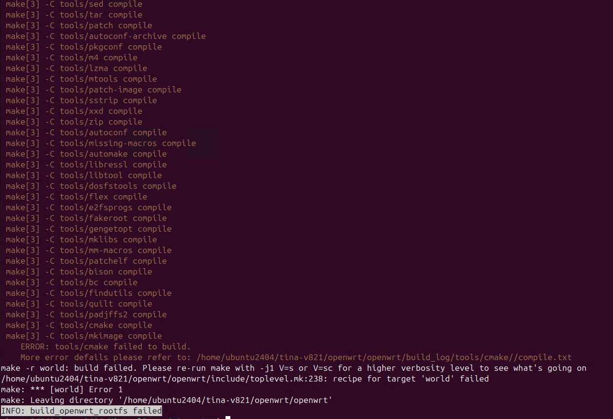
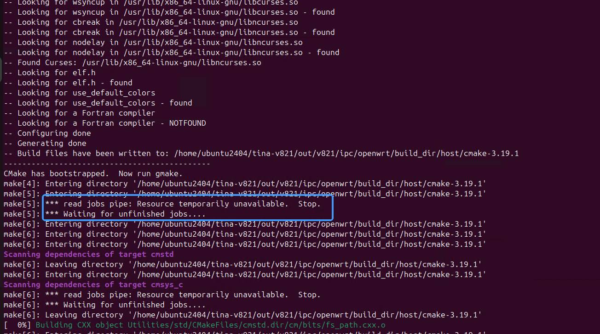
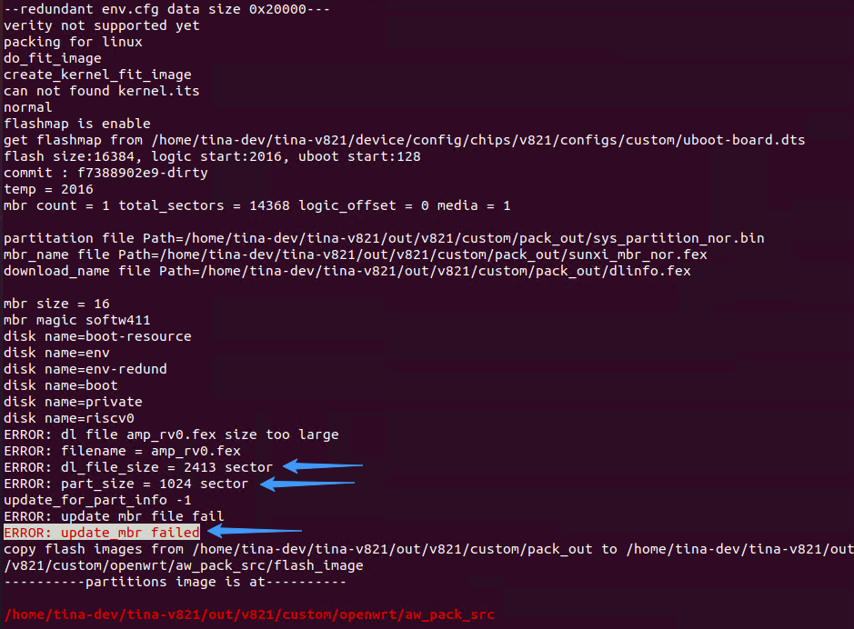
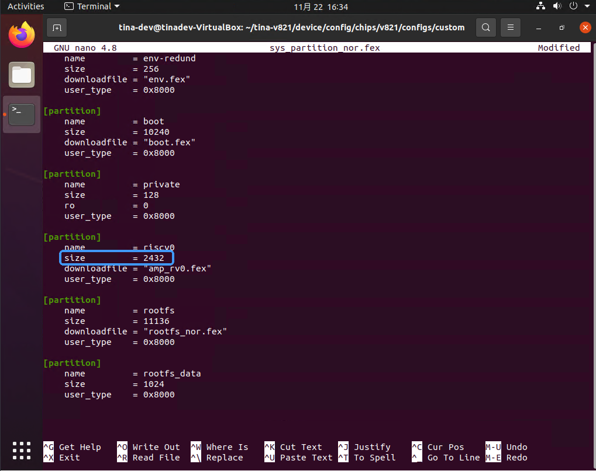
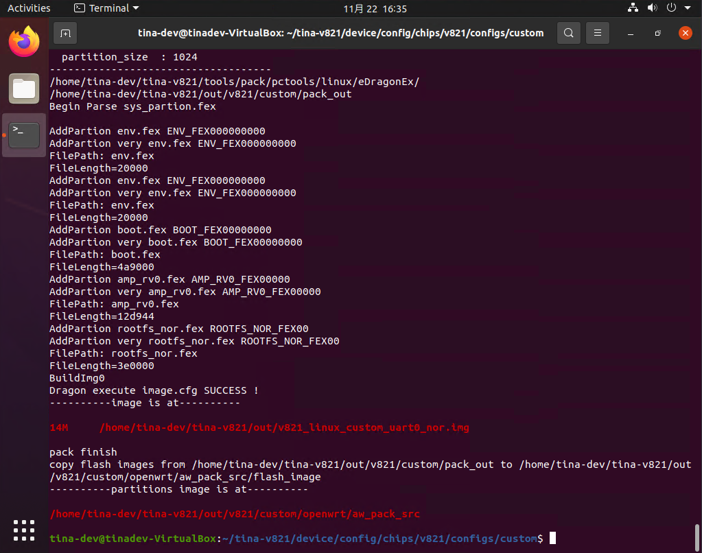
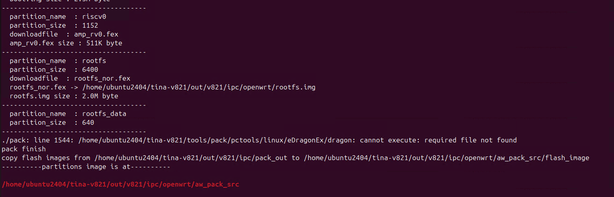
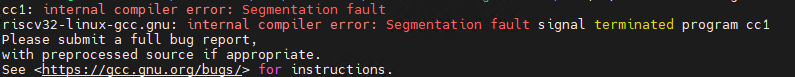

# SDK 编译问题定位

在编译 SDK 的时候会遇到许多问题，本篇文档将几处常见的错误列出来以供排除定位参考。

## 编译软件包失败



部分软件包会编译失败，此时会输出 `More error defails please refer to:` 此时可以打开查看这个文件，看一下是因为什么导致的问题，在这里命令如下：

```
cat /home/ubuntu2404/tina-v821/openwrt/openwrt/build_log/tools/cmake//compile.txt
```

可以看到问题原因`read jobs pipe: Resource temporarily unavailable. Stop`，是因为 Ubuntu 24.04 有一个 bug，高并行、多层递归 make 时，子 make 从 FIFO jobserver 读取令牌，内核返回 `EAGAIN`，make 4.4.x 未正确处理，直接报错 `Stop`。可以打入规避补丁修复这个社区的 bug：

文件路径：

```
openwrt/openwrt/tools/cmake
```

```patch
diff --git a/tools/cmake/Makefile b/tools/cmake/Makefile
index ae653a0..f827040 100644
--- a/tools/cmake/Makefile
+++ b/tools/cmake/Makefile
@@ -27,11 +27,14 @@
 HOST_CONFIGURE_VARS += \
 	CC="$(HOSTCC_NOCACHE)" \
 	CXX="$(HOSTCXX_NOCACHE)" \
-	MAKEFLAGS="$(HOST_JOBS)" \
 	CXXFLAGS="$(HOST_CFLAGS)"
 
+# fix ubuntu 24.04 parallel build failure due to bug of make 4.4 jobserver pipe
+# use fixed parallel jobs instead of jobserver
+HOST_MAKE_FLAGS += -j$(shell nproc)
+
 HOST_CONFIGURE_ARGS := \
-	$(if $(MAKE_JOBSERVER),--parallel="$(MAKE_JOBSERVER)") \
+	--parallel=$(shell nproc) \
 	--prefix=$(STAGING_DIR_HOST)
 
 ifneq ($(findstring c,$(OPENWRT_VERBOSE)),)
```



## 打包报错 ERROR: update\_mbr failed



查看日志可以看到 `ERROR: dl file amp_rv0.fex size too large` 说明分区表分配的大小不足以塞下固件，需要修改固件大小，还可以看出是 riscv0 这个分区的大小不够。又因为是NOR方案，所以修改对应板级的 `sys_partition_nor.fex`，将分区大小修改到固件的对应大小，注意要对齐128扇区。这里需要2413扇区，对齐后是2432扇区



再次打包便正常打包完成了



## 打包出现报错 cannot execute: required file not found



系统需要安装 i386 架构支持，WSL1 需要切换到WSL2上开发，WSL1不支持 `multilib`

```
sudo dpkg --add-architecture i386
sudo apt-get update
sudo apt install gcc-multilib 
sudo apt install libc6:i386 libstdc++6:i386 lib32z1
```

## WSL 编译出现编译器错误



工具链的 glibc 实现时会用到 vsyscall，而WSL2默认禁用 vsyscall

> 在Linux环境中，`vsyscall`（虚拟系统调用）是一种用于提高系统调用性能的机制，尤其是在调用频繁的小型系统调用时。它通过直接从用户空间访问内核代码来减少上下文切换的开销。`vsyscall`提供了一个快速的方式来执行一些系统调用，例如 `gettimeofday()`、`time()`、`mmap()` 等。
> 
> 然而，在一些现代的Linux系统中，尤其是在WSL2（Windows Subsystem for Linux 2）中，默认禁用了 `vsyscall`。WSL2的虚拟化技术使得它与常规的Linux内核有所不同，WSL2采用了Hyper-V虚拟机来运行Linux内核，因此可能会采取不同的策略来优化性能。

WSL2 还需要进一步配置：

-   打开 `vsyscall` 支持

打开 `%userprofile%` 目录。

![image-20250113143954401](data:image/png;base64,iVBORw0KGgoAAAANSUhEUgAAAUUAAABHCAYAAACQy1XiAAAOu0lEQVR4nO3df1DTd57H8ec3oLXVaTu32PqDWkWgaJ07ZbeeQuvVvbZXKNu1euOMtF3o2iVupyPMzd3ebcfFmuXqXLuzB3Rnp8Ff/NjFq3Ne0bKJY7dXpSNydi9ct2opUBa3qFidPe0VlF/53B/5wTeQhIQEksD7MeNAPsn3+/0kkpfvzw+Dpr1oVcQw+54nI90FIcQUYoh0B4QQIppIKAohhI6EohBC6EgoCiGETtChqNTdlJY8wZFHBvw/bu0qzm+eNaptYHtCsJeMHoNNFH+zmNODnm0/SX+Omk57xLolhAif+GAP0LTrFBb/nmNvPUrpH05S1OX9FMZVczh+9GsgnoKXHmH50Q8oDLW34dR5gFc+/Cteez5p1F2NO9I59pgN06PDbYN0UfnCD6lXGvWr693taWlptNDCbzZ+i391ttkffIn6mheYx2WqnzWzrOqnrI2Hzv3PsfEX593HxmeXcabkkYl6huPTUExux1Zq8+/3difF6UXUe7nHUw6lNhPrwt87ISac31BU6m7K/nk12+/1XlD+zc4ctutuD11t55EdrZyev5wf3XuF5y4ZUIZ5bJrbzc5LBrgvnF0P0eIXyNmbTvEJz/Dz5cyOpzmxvg7bgcsU/6WFrP8ysZYmduSd53VbDYkndrFy3yLqa14gkTgABr2cJ+fnzut1HmBLdX9Yn1LQGopJL/IWcfWkl3u2pG1/h9r8dZhsNkwep8ilY2stXjNUiBikBbpPMWNTBv/45Um+++EMj3a1dhWf3vcpyw/d8njsyYWtzCi/hlq7CvX9e72es+W9Ex7HjUdI+xQHHaG27dd57iAD75UiAJ0HyP3bclrsms9TukKvcUc6L1uG2+OzyziUZGZ/0q90obiIg8V/Pf7+h1lDcS4dSckcJ4nkjiRMppG13gUqc5+hvGWsM0mlKGJXwMPnU01/InljInx4xaNdP0wGUIZ57HjiTjjnqDTLn7yT8l31FHXFo9auYvChL5hRfi2sT2Lc4tdQ8us1QR2inv4ZNh9B1rn/OfY7v88osWF78QDPbuzg5TOu4bM5xA5PjIbidIrqIafUholijnesx/TYPtLTiyCnFJs7HO8nv9ZGPuAKyI5tNkZlpxAxLPA5xa5ufpvwF5QmXnTPI6qFae5hskvmM0mkfnKZVi0OEhN47FoLD/qYd4yUQbqofP47/PKchv3Blzi69Qs2/N27ng+ypLvnzlxzhImAdvTvSa/zVykOf9/5n+/zKed5aY3il00lzA/7MwmNKwxd6otcz7me9OFG0uuBnFJKKWLUaLso3fscY9p23qnNR0bVItYEnFaadp3tFVf4vGA5/7arhdMs4NjOb1BvOkmTffg0fz54jdwjcGADaBdbePDNCel3SOJJ5MWaZl7sPMCzrygMjxZjs+1y3+9z+EzgleIgXZzoXMpTy5bw+O5kyl97n92JE/BkQrDOZMNmaqA4t4OtXgPsApW5+0iqdQ2FbdhMzvbKC+Tnjy4RL1Tmsi+pVqpHEbOCKuG0iy0sPbYKZc6GwVuUm347avX5rSOtqIVpAD7mE+/FvsfxnWthpskeO9slA60Uu/b/Ex3ffo0ln+9hxoI8DhbDSZOZlG/bibrtoS3lPDNyZcUth9IRLRcqf0x5eQvlPg7JGXmAEDFk/OPa+FksWaKgy/dDtNPNGE4P3/Y+pxhlATGGQCvFPxoep+BhA8ed/wAM0sXnnz3AssQRz3ewaXg1O1KzDD6Huo5K0bOpkn3HGTHXqL87l32jWoWIHQG/DX+w7UnM34ShT36H4QfNzrbvYP9eeFaRI2rwMvvzhvcTeqNfTU6v83eydI7q9im6xHe+x/tqCU/ED4FupRvAnraY+7y0T5pAK8ULleT+GHZvS6a+yDnX6O0IqRRFDAt4n+K71e9ieMtzO86et46xB8cWHPueO4f3KU5kj8NMtb7J06t/Qc7PbXzfz6uRUWLDVjK8SPPHrc3uOcdBujw2abvo9yk27n2TpQU2Rk0rdn3K5w/c77ElaHKN3nvoS8O+DrbVmri/oVgqRTFl+Q1FTbtO0Y7jFAEww+fjGg83YjjsumXwucCinW5mRjQlZucfaH+yHFuA/6ukcUc6248lU/jv/41pceCXGbhUhbnjZf7lUV01mLiMpKM/JL1OY/nL7wTf9zAYufrsV04pNpMuOuulUhRTU8Cbt6OVfMisECKcYmuVQwghJpiEohBC6EgoCiGEjoSiEELoaEqpmF5oEUKIcJJKUQghdKLr42umgYeaciPdBREhH62pjXQXRAC0trZ2GT5Pgi3XfhLpLogoUZvw00h3Qfghc4qTQKpDMZJUjdFL5hSFEEJHQnGCSZUovJGfi+glCy0RIEOn6UdCMHZIpSiEEDpSKUaJ1tZWlu2NdC/ExHmV9I2verQ81JSL7T9e9fF4ESkSilFm6PXUSHdBTJCHmka3yd939JHhsxBC6EgoChECTfP9mx1FbJLhc5R6/JXKkI5/77X8MPVEiOlFQjHMenp6MBgM3H777SGfK3NDPjM0GFCgFAzEKfrtGna742u/Hex26LND3xDcHHA87v8aasLwTISYngIaPiuluHjx4kT3xae+vr6IXTsYPT09VFVVUV1dTW9vb8jnm2kAg8Hx1d8orW8Ievuh3+74I/9zs52yTA1N0zCWlZGpZVLWDmDFqBmxRrp7IqqNGYpKKd5++2327t1LV5ef33w/Qfr6+rh8+TJffvnlpF87GL29vVRVVXH16lW6u7upqanh5s2bIZ1zMN7u936l4KsBuNGHu2ociFN+Q9FqdISF5g4K9x1omWW0+zwydrSX5VG0woJSCvNT4zvHdHidhHd+Q9EViJ999hlpaWksXLhwsvrldttttzF79mx6e3ujNhh7e3uprKzk6tWr7rbu7m6qq6tDOq+934DdXf052pSCAaWhFPzvLUcguobWN+Og3675DkWrkWwcYaHaNnMoz/XmtmLMBsupQpJD6nF0aDvfSMbyFMeN5EJOqVMUBvPEpsnrJLzzGYojA3Hz5s0RW2mbO3duWINxYGCAM2fOeLR99NFHDAwMBH0ufSDOnTvX3Z6QkEB3d3do/YyDXoPjq2s+0VURXumFr/od39vtYO93BKUjNOO8nq+99SwFG7IcN5JTWeFstxqzwWImK6TeTh3yOk1vXkMxmgLRJZzB2NzcjNVq5YMPPgDgxIkTWCwWmpubgzrPyEDMzx9e8c3LyyMhISGkfrrmCPuGoG9Ic36FL752VIh2O9yMc/wZiMNdVfqSnLqCijrnjJq1jooVqSQ7qyLzyHd6exmZ+vm3EbfbyzKdw0sNzWOezorR3a6R6R57Oub5jFbn/ZlltI9sc/4xDl/UyzGjr6G/vtWokV0BjUUpjvaRz8OD974G9TqJKWfU6rM+EAFaWlowmUx+T7Jz586wdKazszOgx7mC8Z577hnXdVavXk1PTw8NDQ18/PHH3Lhxg3Xr1rF69eqgztPc3OwRiHfccYf7vjlz5pCXl0fl2VPj6iPA0JBjGOwaLvcNweWvoUdTDMQ5K0O7qzrUD7F9DJ+zzFjqNOeiTQEWBUYN51eNCoCMUtrGGh62l5FXtAKLOjWiarJi1EpY3qZQyeAItRSMqcodJhXZdViUwuw40eg2qxEt28gGNVyReR5jxahlc7a0DeUaE1uNaJoRizKTZVZY0ChZ3sapwmRoL6PE65Pw19fAXycx9XjdkhMfH/07dUKtXNevXw9AQ0MD69atc98ORmamo1pauXKlRyC6zJkzJ6Q+OuYHHYF3awiu9ECPBsquHyqPnG8Ef5uBsswK5UgXrMPvdLAoVJaj7Q1rIeYUPydJTmUFRWRrZylt083XWeuooBFSNIp0D89obceVcAVehp8ebVn/QGlGCnVWM1nejrHWUZFRSpt+ktDLMWPy29fkgF8nMfWMSj9N09i0aRMA586dIyUlhS1btkzK8Hnx4sV+779y5Qo3b95k9uzZHvN347V+/XqWLl3KokWLxn2OjIyMkPvhTb+K45N3a9xVn9IlnwYMOucN4/CsDOOUIqANOa7FhKx2ykoK2OAMgKwNBZS0toO/UCQLs1KYXVtfGjMc4Qh+Ks2JXq/NYLnfPns7JICqeKzXSUw5XkvCkcF48ODBSQtGX8IdiC6hBOJEOrn7eZ/3Nf2PY2pjzcoHxnl25yqqysIRVhXuKstaV8EK1zufszgLJ9p/c4hG15JDexllbYUUZiVTeKoNMlM43wZkbaAgO9tRaTorNqvRCGb/ixMVdVbMzhKvvSyPosYCLL4OcF4jr+wpx/AYwPoGRWymLZgl4YD6Ovbr1BjEJUVs8DlOjqZgnKhAjCXl1fWj2s78vs39/fbv5QR4pnbKMrPBopxv/mQKq0rJTNFwTKFZUFkAhVSVHiLFObzMKCjAXRMnF5L6hoaW7bztPiYLc5vuXECBxTUX6FsBdWjDJ3PMDfp8dBZmZcGopaC5x70FWFSw22TG6mtgr1NFUNcUsWDMX1yllOLw4cOcO3eOgoIC5s+fP1l9A6C/v59Lly7FTCDu2rULGF588vaJy94+edv1eYrT66OkHIsb53eomF3V1TQ/+0JHCPRnQUTWmCsqrorx4YcfZt68eZPRJw8zZ85kwYIFzJw5c9KvHUnXr9/gT1/1cuPGDfqGAqvOb4tT3HXXXfzZnXdw9913TXAPhZiaAlpm1jQtIoHoEkuBGK7tSdVHPwzp+MCH00IIvejfezNNTY9QS6bw1HT/8AoRbeRDZoUIgXwi0dQjoSiEEDoyfI4ycT9qDfs57XH+P4JMTLxvfXf0f5X93ZFitCMtEeiN8EdCMUqkpqYy9HqkeyEmirff5Kd2p01+R8SYJBQjwLVfTfaoTX3e9iaK6Dbm5m0ROnljiJHkH8ToJQstQgihI6E4CaQqEHry8xDdZPg8yWQoPX1JGMYGCcUIkoCc+iQIY4+EopgQt27dYtasWZHuhhBBkzlFIYTQkVAUQggdCUUhhNCRUBRCCB0JRSGE0JFQFEIIHQlFIYTQkVAUQggdCUUhhND5f+xQa9BbDetkAAAAAElFTkSuQmCC)

新增文件 `.wslconfig`

![image-20250113144034272](data:image/png;base64,iVBORw0KGgoAAAANSUhEUgAAAUQAAABNCAYAAADekh26AAAgAElEQVR4nO2de3xV1Zn3v2vtc8mdOyQogpJ4RRShSgPV1lZqAnXQtr7VaV+qH0za2gbUYq049B2v9HXUEHU6RNsOvdkyU2U6QBjawdoatB0BiShCYkFuSbgESCDJOWfvteaPvc/JOScnIUAOF11fP5ucvddlrwTy81nPetazhNZad3Z2kpGRQX+z/QhMWAGHwkkFB3ah554LwNv7Ilw5zH/szmrKEaXVvVQoprK+ljmFUFMuePTSemrnFCa2XzYTvbik92cGg+EYaNDe1/hnAMJKeBQihO/dF7hvyfvQDu2O5KgjyR+SwbhZ/8gdowUc/SNPPrGCxkOdRAqu46uP3s64UCPZ7/+ee371DnYojGNrbAeGZvq46MsPcVNxDnkhH1ZQArBlyTxeLpjD3dPOJbv5TzxRdYDyx25mgIJAGAhC+PAKHr2/ga9Uf4tLQgInKAAL354/88Sze5n1xBcR6RTE/7cR/rEu6aFSsO9v6O8WpmzTIzXlTNk6L1HkEoqnsHWeK4jxNCyaQtHctQCUrdQY7TMYThZPEAXdhVEINAKtlXtJHz5ls72lkzFDc7p6aNmFGOwaRQeUTTYOGTJIpE3hzw0BmXQqh51tUDSgS2SdQzuxBo5ybxQglfuh8W3aCyaRRSt//OnTfJD7OW7/0lSCCmQECMIh3c7AtiwiWeB3gKCiRW/l/ZeqeT9jOl+++bOnQRAPNfHpYTavfuXcfn+fwWA4xWidcKtwUNqJfc3QOUSVMySOEFR4+pkJ2ocOgBZuN44DAR9AGLBwsPDkDj8gaSVCHiEgA/ABcBTsIyCzQGTS0vEhK+atZuxD36S4IAROABwBFmC5Kt4GZAMSOMjbLJ//Gy6492GmDPCnVxAPheHm/7b54852cCLQ3srXL8nkmc8OZ6Bn6hoMho8Ani4qNNr7U6PxY+FKj8bWCh/aVT/tPtcWrl4CjgKfBHC8NgKNZwgCQodwRBAHVwwlgI6ADrtPhB+EhEaHSIGFH9t9jxJeB25PITyB1RqEgJYWwoMH43dIryAaDIaPJrqnByK5wMG1+DLcQh3fQLnVhQAESoNAuLfJ/ca/MNqNSHquNUJ2NdZJHQg8LdbuY61BWtJ9nwatFcZMMxgMx0033ROpHkaR3erFqsepX+yZJ1gpXyji6ibV6SbScU8Eie+JjUMkPvT19C0YDAZDb0S1pEdrETzFkQn1U9+IJD3Vcf2ILoswqWnUSNSxxZ3uqhwvhQLXZ4km0RIFhDCCaDAYTpJUM9xEVXT9gd31qieTMjrZ7W7z9WKGHnNsrkmoe9JNEBhBNBgM/YerN3FzXg2im2cuySFId42KLsokdi66TZPje9FolFYxy6/L5ky0KWM+Q+8N8aXGh2gwGPoPoePciRohpDs39Zx+WmtsFZVEgQN0OqA02Mrx6gmEkEgh0CgcFUF59UW0c+G2cRyNikRQWoG0kEIikDER1lqjbDthiCpio7XyYibdfqIYQTQYDP2L0J4wJptzCq01EUd7jjyBUoJOB7QC27FTdOYKYirD0NEa5YRx7E607j7B1oB2FCqSJIi2g1bRVWfXqoy2TcuUWTzw6km11ws/c8w6q+6yeGWmw+LpJ/Uqg8GQLrr56SRIhaUdhBspjV9CliWQEmTSfFih0cJC+kXcphgHtI0SFo704fdbWD4/CI2tNUoIL+oRlFZIKfEFggn9Wj4fSM+CBJR2/YpWOn2II6/oXdS0hkabmPPAF3Eta6fhtT6/o3qGIHl3c9lyzc3LLEpeVH3qQ8yuQb1wY5/faTAYekMnXg7u5cedCqORwvGWeN0teQFvZ54QyhU8x0L7wEEjsJD4AIVWYRw7DHYI25+F7feRIaKR3Qpth7GFH6R0fY1aY1ld2/5sR2NJgfBbcSPVKKVi0/TTtqiyvxPwuXsK/cLdEy4EaKfvq0hly3VqC3G6g34h7n7r80y9I8zPXr+HC45vkcpgMBwXMmHNRDnuzrn69ffzixc1mTlj6BRH+MSMrzNlygiGWdDBX1g69xe813kOMquN6d96jImFkHnYx473HuCFfwV/7liOWh1ce8udfO6aIQQ7D9O65lkeXh/kwAfvkDXiCjJHjOeRiuuwIhF344oE9tfz/SfX8p17bmZkfh4HeYWf3b+Ogdd8la/dfDE+KfH7JRoFKnx6BLE17FqIWQ5ITwj9XpBkWPbg1lxRjpiRZA++mGghxgRSreIuq5QXk7wKY+W9SZ3OpsZ5gRuNJ9Vg6B+SHHm2BRHrDdb9qZS7f/Rpzmk7ClueZ/avf8l5k+9lmHWIPy78EdtvXMAPP30BoYb/4PvPP0v2I3/HJQMO8pfXZjLv2cnkHQW9fTF3Lf01Y66ZzWVyAPt2bWfAlMd59PsDvQ2CITTtaMdB+C0EPlo3/4FAaRmB3Gb+a8H91LReSeGnPmRrbjbKVvgC0RhJAarz1C+qhBzotCEgwbLcrwEJQcu9ArLnqW7xU9td52mKa/tTUxLqWp+s5AOl0Vueo7h8ZaxezWxJ2XKNdmq4Kzky02A449Fn2BU/Lrr5Df1AJqP42j2fJgcgN5u2SZdR2jSIbU4H+zavZ/u+aXz5xgtoywB7zLlcfU4dH+yykJ1X8OUHJiMCwCBonVBIyU4/mzvbaBMdWMFhFGUcIQC0HQBBEGlnIf1+JFkItYNFv2mgeIzD0OyRfHr+Aiorv8EnDmYzQPlBJoX/ODtPrSBq7VqHQatLDKXsug9KkD1ZiMDa+8YghEh5jbmvtsd26oXSWL2++hYNBkNfSLHPLi40RgAydC4oyEZBu43/nf38dZDgskAmmZGN1I27nEsV5GjIzpnINQNz+NsuC0u2E8JxRSqkyanbyV/zjlKkg/jaD7Kr8Qi1v36eiu+U8w/P/pT/ccDpVAjLRzgC+r0/QcEXmDJa4WhF0D+So+2dZARzCGW5gugQQROiQ4Hd8PqpFcTWsDs1ljLRMszwxNCywC+cHtsfj4UYj7wr0UI0GM5aTrdBmEL/ekUSzd2FrxMa9zzDP/+4lcHf/woXhyCnTeKzXLNSeb/7YSTtjkIEsghikR1xaN71Q/75xy0MfvCrXKZ9ZA4YydR7nmLBwieoenYxz15Zy+LHX+JgjiSMwAr9jdc2fMi4aeeSQwYWEgQEAn50OILQYEkfAgulLQJHGvjT26fQQmyLQFi5YugXcdZhnJUYtNJjIRoMhn6mrwLpbWXWwJ5XH+eJqjCX/OA73F+QAVkhHC3xuTm/cIgAEBYW7bZG4q407/n9D1j4zBEuXXAv3zs3D50laWk/SNBnM0QqaIeW0ge5IdRC7c52QkisI7t5rfYcxn2iK2O0QuP3WeiIjdBeALmW6LDEOtjIa7WjTo0gKgVtdC2cRK+oGAbiLcaefIjTF3ezCJMtxp5iEs2U2WBIM91jsMEB2/u4+env8NCHl1FVNZ+p1kHQDgpB2/AJ6H0NNMsIITIgtIHdB/xce+k5hID3K+9mwc4reOa5R7nG3wy2gx8YnJUJ+MAncYKKwQFBc5NNkbCwaKfh/Qbar72SjOhY6Erm4LOChDq9YG/diZSH2fbBVtqvnZh+QdTaDbGJxhnGW4dCdAlh1EoUKRY6Vt1lpbQIU1mM8q5V3dqbKbPBcIqICqPWblJoQG7/HS81fZJ537gZ7APk5g1CSYswgoFjCpnOn1m1ycLf7sAHm/mvzuu4fCQEdv87v27+JN8r/zI4+8jOG+GGpYQBOtm5O0zL0QiOpdj420U0jDmX884JYkXaObyunrEXT2CU1igVRmPHds74fEFCnWGU0oAriIc3bqXwoonpC7vZ9RXNmLIX2ddxBDuiEUJgS4WSEhxQAYXjCDqlZNfP5jL2jmf44Kf3cOHb3QXxxhe64gpX3WVRsuVJVn7xZR5lPrf+tpT3vpdkHapVOG/MZaycE3skFseVx8J1ZnNLGr53g+Hjh0i0EoUAy8LXtgva9qMP1/H4/ZvI79wPKoMPj2Zzx3efYMrYwXzmthksfGQe9zt7yPd9nTuqJjCSVuymQ7Q1bmL+nC2MpAVfIJv6wwH+/p7HmDlW8/7P57Au5LAupBjWXML3fjyDA6EQo8N7WHFkEH9/oR8ESJ8Pd9+04OCBBvb62hg/uAnNaIQcCEe38J9tg7n9QpGejNmptu5JKcl0BFJKAtLdUuMXDlJKglLFLLyAVGx68LqEtqvu6tp5Eo01/PDpqdzOL6m9d3RCuZhdg1oM35i6lftrK3oOxFarKPO9zC12tYlD/JhzqFOzrSV6KbYd1Gw7qMjwCe77lJ/i0WfQPxB9PCsap4rkxIJd2ijCrdB5GHKGgswENHS2QdAPwgfajxMCyw904B2W0g4EAQtHQZsNuYHovpYI2B1g5RAWEuGEkZHDSDIRIhOCFu/+2wP8ruC7PHB1NiIQINoyDASUDcoG6SciLNo7YMfKe/nPgu/z4NUDzBECho8P7WHYdtATvBblCuBBzaGOnkVmSJbg378a7LH8lHNGCGJ0Z3GSEGrcjDYiequROgIqAlYmYLnjj4Tcw1OkBHxd6hnBOywl+kGAAtsByxf1Abr9aelD4QftIBwH7xQppO8tKr+1lmmPzOHigRGElAghULiXT3vHVmkLhUDK1/mn77zFjf84l3EDlBFEw0ePkA07DkWFz7X2trVo9h45fjEZnCX47RkliKd7AEkkj0dotIhmM9RYcV455bgN3MUMt9zn69prrLCBaPqu2EPvzClN2NJIT9okDgIFZKK1jDudzwbhCqTCwnEcHEdhWRaWZSUeU6DwjEfb/aBNxmzDWYyjYFdrorW3rUWxu1X3iyE1JEtw76f8J99Rf3K6N1d1E8DkCvFJWbsHbOvYOQCpvhErltQ1NuWOBXm7Mtl12ICX0MGLL4wdVKCEd+you2orpIXQbuKGbsm6LfdFGm8x12TMNpwNaA1NRxKtvW0tih2H3GSjJ0vAgtGDJOcPFpw/SHD+YMn5gwTDcpLP+Tj9nHYDsceDVLrKdZwodptYi8SP8eXJYhir7p1A4JbKWImOC5KJSaQWaNsTQC9qRUorLot2IkqDbQuiGcGMIBrOGDTQ0p4kfAc121sUnalyhx4nUsCogYLzo+I32P08Mk8gzzTl64EzZpi9DKSnol72XCS0SymgIro0EustdR+WdMu8YgvXWOwJKSHgt2Lv6RcfYnXdCTc1pJmwrQn4zphfoxhhW3O4Q3O4XXOoQ3Go3f0ctvvHBsrOEAzMFAzIkrGveRnimL+UZzoicnrfn/y30+1vS/QgiMlmX5LF5iXZjrn2oj5IEfsvrt/kFyRF/KC71p5EdEwi5SS+2xD7zUKcOKK/ejL0FzWbw+w6DHdNDpy2MYQdaG5TNLVpmlo1Ta3u58O9rOweD3kZgvw8QX6eJD9XUJAnGJ4jCX5E5z7hYPvpHgKQWlhcX1zSM+VuiBCeM1BKEFKjtQAtUMoVLyEUUrhOPe3mygY0QsQliNUOSmkc5YbtCSG9s1ckWjtonNgh9NEy7zXudjmvnRQSpZSbGDaKN/C0/rPZ8t+/QmmNVu5ZCkpptFaxZ0prghmZXHD1jWQNHJrOoXzseO7PIfYc1pRedmoWBRwN+9o0TW2Kxlb3a1OrpuVo6sMkj5csvyd8uZ745bnil+k/86zfdJLTmXW6h5ASDSlNMKXcxS/pJXWRXmYr7XjJYxU4jpsgOjq1jbcEpXdp7fr7IhGHiO0gLR+WT2IJN/W/0ri70ZS7oGZZEsty11ccCToMOqLw+SQ+H9gRsD0HtIiZkWkWRKU1t992W+IPLe4HtnTpb7jyyit5482VFE0uNaLYD2w7oPhRbTh2P/V8q5fax4/WcKDds/RaNU1tmsZWxb6jGtVPCxwj4qy9/FxX/HIzzrwFjtNBP7hS0068JipcCy26WqxQaG2jtUBriZaWm9kavJPzZJewanfJRXj9OFKjLI3SIKV2M+x71TSghUJJ1yqNOhEjQFiD3wIf0hVl3GzawvLWrOPm42kVRO39hjhKecvbOrbMHWXo0KFM/sQk1tYuZ8L0r6dzOB95lr8b4S8fKu8fDEwdc+J/vRpo7dQ0Hu6y9ppaNc1HFJGeM7T1GUvC8JyuqW5+nqQgTzAoU6SOyDAA7klzp5We/m48Kyu2lTn61ZuyRqNcFDaaEGgLrSXCshBuAU4kBPgRwudphYPQPqQGJUFJByU12nLFzxVOy512S9DStRCV0LFYxDCakNbuDjkLpMLNdCOEK4giNvT0W4g6+pcXFcPEUgB+9rOfAeALnAo/Vw2P5y/juqbF9Jw98WRp4KUZRTz1FtzycCUNC5Zyw5u13DYmbS/EUVD5xzAHOroWJaQQfPaivlmHR8Oa5jZNY6tr7bn+PkVnPzjwBTA0p8vSy/esvqHZotfVP0MPnKn/s4hN/9wBRofpcxPSkOlrZUdbHoGwJBiCwLlZ2O0OKuxqgxUQhLMycfZqAsPBcgQ+fAQCh9jePpCssE223UnmyBz0EbDzQHZCYwsEBkPw4EHwDWLwYGhrw1tIUZyb10HrzmzsYXB47xEGjM2hbaemQwrypHbn2xYIBTg6zVNm7wTomBgmWYe33PJFd2XHsnju+efTOZRTxs7qWTx1yUreWl4C2xdx54L0vu+9JsW//jWccNg2wEXDJNmBxN+ekO0tcMRNdZvaNG2d/WN1DMwU3lTXs/oGuAsc/v6dtRvOYJL1OmBBZgDa3v4lq/+jno6OgXR0DORTd1dwyWgLJ2zjyNd49bHfsltJBmdeTNGsbzIixyI/Gw7U/YJXVm5G2IOQkUF87hv3cdW5sO+Apu3NRSz/wwfsz9hFvhhA9rhyPv/5TxIMRHVGsW/bWtY8f5jLvzWdc4bk0NryBmv+6SfkTn2M4qlDXQdlAAiDsO10W4hdB0Ani2HyvdIfjTyFO+rXMr6oyL0ZM4efNM3pvcFJ8O8bbTbutruJYYZfMOEcyfpdTsLKbkt7P4W0BDz/nmftFeQJRuRKMs6wTR0fRU63O0F3+9AD3lS0LbydA+EPeHvzbXxuXojspjayWzaz5JV/JusH3yK/cR11L6/g0PWPcO+kIby96x94bcmvuWXB39PSuob1W77GLfNC5DYfJK/lHX75k0oy75nLgM5Omhr/xsjr5/ClzxcSOHgIfAPJzoFwxN0OLcV+1m/cSutnPss5w0Ose/Ye3mj8AmPH7WNvRgeWJbG1xg5HCEYCBGRr+hdVohl1E39+8RNoz4pM/q029Eh7WPPMayGOhEjpz+u0Nb9Yd/Lz3aCPLmvPW9nNzxXkBM/UedvHgdP7s4/uJYkmcOiukCJhV4jFGPzqPCbPEFhKIAeNgBGHGbNqGy3vd1AUCbN773gmXTOYw7Rx/gWP0JL7Xd5Y/wWmXfQZPvt3AkuBkzscZ+B+hvl28f6RCNfnZJIR1JAzlqFHQWcOREk4uP8weQMHYDkg5X4aa7cy+u672d0OEyv+hasi7ex/ZQ1/aB+MtNx1DjvSToYdIBhsTW+C2OiiSrIYxv8QY27GPjqLa+cJ7qxu8O5qeDxf8Pga73ZNOZNmLGInsLN6CpPyhXeVk/qAAbd9tF5yv6nb1/B4/hReqi7v1q52nmDOz6FuQZHbZvsi7uzWNtqn14c33r6yfpfDw6vDHGxPLYbAce/v8kk4Z6Bk4iiLGZf5mD05wEPTgjw6PYNvfyrAl670M/UCi8Kh0oihAYiLre4WJO1lYxAOWtj4NGQ6Ej8CISErYz+tu/ayuc3PeTlBjqr9tH9iPEX+MEJJlAM5g8J0Ho1gaUFEObQ5EQLBfYR2t7MjMoQrC/yED+3kyOEIB15/nKX/9DWevncpH+i9+IdmocI2wg97N60nePlNjMrVZAfcI0wiSGxL4Fg2WkJAWOTqgQSCsPudP50CCxGgBx9i/I3qY8zGeUXF1NXXA4WwZhkNk4qhoQGuL6S2pprxN9Uzavsi7lwwjkVNtb0sntTweH4pDQ/X81ZZYe/P15QzKb+cRbHFmLU8Vf8QbzUtdv2Ek2fx0rRabntSswjBj4vq+UlZIWxfxI+T+uVXmreuh+jiC1T26fsG+Pn/RNi6T2E7J2ZNCwHDsxOtvYI8yeCss38Hh+FUkfhvT+AFPutorIxCCwfhCaNf5xBQbuhLRMDe5r+w/Be/5ZovVTM6V7JvQwNSjUNFgkgvhjBnUIiOdhsLaNch2lQ77c1v8KdfvcrEv3uGgWFg+Cgu/tqzXGH7yIgIdm55llU/3kXJF4bjzz2CyMlm77sbCF7zfzkvN0xnJEDIBoTEtkBZNtrqIOhkkqHBCcDud/6c7rCbrvlyKisxftrcVwtx1LRbGb9gGbVPlkDNJm547iG2fXsFO8ums2NzMTfcXQhjLqSQuczJ38R9Pa3wrlnGy5MqeSVBDHt4fv087ptUxGtrFjPleoBi7ru7xC0bM50bJi099sCj/V4ffVDIbfeW8dTTffq2mb+iE9sLcu0LuUHBeYPiV3clw3IEPiN8hn7GtRSjC6giFlKDsNy4SQmXR+C/1z7Kj1a9yf+595cMGuLDVpqsIQUMaLXJtOCItslScPhIBjrXYf+hg1zrG8Tv3l7IkpXruGPuUrKGeNsXvbyLttR0BAS+gjHkvrqFNv9V5GXk0PLuH3ivaSqXZkBHO2ihsYRwd6soDVqi8ROx3BjHg++9xub9n0/vlFl5iyrd/IcJs2bXn9jnRZUx07lh0iZ2bK/htc23MnVMEeezlNfXrOD33MrUMQAlPNikeatpCXzbm55uP9nvppjzLzjZPk6cUYPc9EWZfvrkRrIVfPZCHyWX+phwrkVBnhFDQ38gerjcpAoCC4EPgR+hAygLwgF4ZVUF/3HgJr7/2HIuGDKAQUBYCQQO+3fuZLcGrBza/c107teMGDSS7MGDeGVNBX9o+RIPLlxBQX42A/xezKEQgB9HSMISsoaPJvvoh+yPgFbg7H2LQ+cXUTQSFAG0Frihixm0OxEypQ0hH47tWq920xu0jboozT7ELgehK3w6MU+d1l2LK70uqmxfxJ0xUStk6k3w+28/ysuXXMio6P3TS+Gm6Yzy6r+0xq172/J67pu0lm1/S+rz+pnc8tZcfh71P1LDS9UNsec/iPkTgTVP8lRMbE+Qbu9r4KWnq/vc/BvFARZ+IYOvXx2geLSP3KAg6MV4paIjolm8Nsy+E0iKajD0KwdW8/a7E/nMzPHdyy66kQksZ+MW737LKjYwgysuOkY7mjl8oOtux7IX2Tb8KkYPccs+fG8P51+Sql0quuqnPw6x23QZ4hdTYnWPIwJ/1LRbYcFcbrm3JO5+KTc8501zx8zhvOcFk273Gnxtpee3i6eEB9+s5M7JgkkAlLGoaTFQyINNK3k8v4hJsRjCMhY1zXHF9oRJfl8x9z1cBr87vl7GDpWMHSq55Qofe49oNjU6bNip2HtU4ZNurGGUkA1P/zHMgzcEyDWLIYbTxf5GDrKOVx9bl/D4/C9Vce1FIxh/ywx+9y8VLAFgIp+ZP40Bx2wHH75cwYa93sPhM5h5l9fuwEa2M4PrLurj+OLq91v6r1TZbtb+23N88xvfJGJ7v6U69UZ/v9/Hwh/+kNLZ8094DGcla8qZ9PSlvLL8ZMUWOiPwbpPD+l2K+n0OAcsVRI27Te6R0gwCJkDa8DFgx7IK3h42n5um9C0FV3z9NPsQu85N8PksfH4f/hQXdO1q+ejSwEszkkJwbq9mfHSaf5Jk+GHiKIu7Punn/9+UwayrA1w92iI74PoO5y/v5AQXpw2Gs4g6tr87kjEX9zUfYWL9tFqIf/51lbuw4uVEU9E0YN4zpb10YF75F8r/4YTHcFawfRF3Tp5LNJ/u+Ie98Jw009ymqdvjcOEwyejBZmXFYOiJtAqiwWAwnE0Yc8FgMBg8jCAaDAaDR7+F3axr7q+eDAaD4fTQLz5Eg8Fg+CiQ1sDsd955x9ud4u1zjO5WcW/QWuP3+yksLCQr68w8PMdgMHx8SPsRApdffnnXfewPl3ff3UR+fj5b6+u5sKjIiKLBYDitnJK9zCp6BKlS3jGkKpbMISsri3NGjmTLlq3pHIrBYDAck1NznHeyaRjHxo0bAZCW2VdmMBhOL6cm2023AwNcLrnkUq6++homT558jCzPDSyaIhBiCosakopqyhFTFtEA1JQL93jB5Ku8BqihPFX7hkVM8dp7HVIe17a8JnkM8Vc5NT2VJfSZ6ntJ1U8PdcsTS3v/Pg2GM5C6JVRUVHjXQlYnRKXUsaSnsl7aNa9eGFdWQcWSOrrRvJqFFUvoKnHftXB16rCYtAtivM71lC3bvT32RtuysnHMndWT0EDJ4miKsZWUUcbK6CLO4pI+jriGclEKK6P91HPpo4liVRYr02i9mJIeylaOm0tRLwKV0M9KKE0QX4+GFSylmOLqZQljOPnv02A4ldSxZGUB86uqqKqqomp2Acsfi4pUM6sXvkjjjPkpynprB82NexgZbVdVRdWs7um+mjeuhxk3Mp5mVi+soKJiA0zseaTpFcTYH70ZgF0r0Mdk5jwqmcusbmZeP9GwlU3FlcyL6Uohc2oTRa+vlMwsO47Ki9H1lWwqTRTfhhVL4dYlPFRWzTJj/BnOWsYz64FpxHb3jp/ARBppagaaN7J+z0RKp3ml429kxsh1bKg7RjuPgvze9gzXsWo5XHXFCGAE0x6ooqpqFhN6qZ/enSrRcJtuz7s+9PlYQwAKmbOkEuYWdbem+oPCCxm3di5PnnTfDSx6tJriS4uO493TubU4XvgaWLEUbp1eSMnMMqof7dkyNhjOKuo2sI4C8kcAzY3smTiBLttuBPkF0NiUYkob345mmhph3YvRKXP8tDiu/siruKLPiW82nCofYvQBPQpfX89UoXAOSyqLqS7tye92MpSweGUZ1aU9+/XcstQ+u66yWbBEUzvnJDLZ1DzJXG5leiFQMpOytUtZYRTRcLbTvJqFL65j4uxZjAeamxpPqF2XxTpLzBgAAAMASURBVOde82c08uLC1SS4HzesY2JpnIV5DOo2rEu3IEIsZXY3B2Kyf7HvyfoK5yyhsria0nSYiSWL0VpTX7mJ0hSil+D7S/LZRctWlq1l7gmZmcVEjcqaZdUU3zodV1JLmFm2lqVGEQ1nMc2rF1Lx2Hquml9F1N03Ir/ghNolM2JaKRP3rGdjc6wRK9dNZEKfTxFw66fZh5hK5HSiPkb18jiOEIhOnYurSylf1tc2RVxavJb36pMe17/H2lRvmFPrLlpUlx739Lxk8Qm0i7cIqWFZNaydWxSzRkurYe3cJ9NgFRsM6aduSQWPNZZSVfUA05JNtsamOMvOnQpHfYO9tuuF5o3rk6bifat/SnyIXRah7m4opvrcF6JT5+q+HtRUyPRbk6faNZSXxlliDYuY0k3Fuqy2vlPCvMriLr9fwyKmpAr5iQ2jHFG6icolc9xx1CyjOn71OLaibBZXDGchnvU1O5V5N/5GZrCcVVEHYN0qljODG8cfox3NNMfNj+uWvBjnL2xm4/o9TOy7eRirn+ate97XlIXJt8ef375wzhIqlxYxt8/1a1n5nqBUdIlocWV9l6+vcA5LLp2CEKWx8rKVmnhXYHWpIK41lfW1pHIVRsdWVH4hel738oR+iiup14uJdlOzrBrKViatbpcwswxKl9WwuMSE1xjOIpob2cM6XqxIPCxq4uwqZo0fwbQ7ZrDwsQoq3KfMrvL8fr22g40/rWD5Hu/hyBnMj65IN29kPTO4o+/mYax+WrPd/OWvf+UTkybhKO/M5R40T1qS119/neuuvbbfx2AwGD5e1C2pYGXBfB7o4xw7vv4pCcyWUrqXlfpy66ZzJAaD4eNBHRvWjfRiD4+/flotxDff/IvrN9Te+czeKXyxe+IPr9d8+rrr+n0MBoPB0FdMgliDwWDwMGeqGAwGg4cRRIPBYPAwgmgwGAweQh/fFhGDwWD4yGIsRIPBYPAwgmgwGAweRhANBoPBwwiiwWAweJyhgthI9dcfpHrH6R6HwWD4OPG/C/R2qR/sIxAAAAAASUVORK5CYII=)

打开 `.wslconfig` 并添加以下內容

```
[wsl2]
kernelCommandLine = vsyscall=emulate # Additional kernel command line arguments
```

> `.wslconfig` 相关参考：[wsl-config](https://docs.microsoft.com/en-us/windows/wsl/wsl-config#wslconfig)

修改完成后请重启 WSL 环境

```
wsl --shutdown
```

然后在新打开的 WSL2 中查看

```
cat /proc/cmdline
```

如果输出包含了 `vsyscall=emulate` ，则说明配置正确，如果没有显示这两个选项，则可能配置错误，请参考：[wsl-config](https://docs.microsoft.com/en-us/windows/wsl/wsl-config#wslconfig) 进行排查

-   `vsyscall=emulate`：启用模拟 `vsyscall`。

:::note

:::note

备注

:::
:::note

WSL2 6.6.87.1 内核无法启用 `vsyscall=emulate` 问题

WSL2 6.6.87.1 内核无法启用 `vsyscall=emulate`，这是由于 WSL2 的一个 BUG 提交，错误关闭了内核的 `CONFIG_X86_VSYSCALL_EMULATION` 配置，目前微软已计划修复该问题。

-   问题链接：[https://github.com/microsoft/WSL/issues/13031](https://github.com/microsoft/WSL/issues/13031)

WSL2 在使用该内核时，可以尝试更新 WSL2 内核，也可以自行编译 WSL2 内核替换使用，请参考 WSL2 官方文档：[https://github.com/microsoft/WSL2-Linux-Kernel?tab=readme-ov-file#build-instructions](https://github.com/microsoft/WSL2-Linux-Kernel?tab=readme-ov-file#build-instructions)

:::

:::

## WSL2 编译出现错误

由于 WSL2 会默认继承 Windows 的环境变量，而 Windows 的环境变量是包含空格的，这会引起编译失败，需要在使用前清除空格。

```
export PATH=/usr/local/sbin:/usr/local/bin:/usr/sbin:/usr/bin:/sbin:/bin:/usr/games:/usr/local/games:/usr/lib/wsl/lib
```
