# 系统相关常见问题

## V821是否已支持RTOS系统

V821芯片包含两个CPU。一个是主核心RISC-V CPU，运行Tina Linux系统，为芯片主系统；一个是RISC-V MCU，运行FreeRTOS系统，主要功能是提供通用算力补充、辅助 Linux 实现休眠唤醒、低功耗管理以及WIFI相关功能。

## V821 是合封的 WIFI 吗？合封的什么型号？是什么接口？

V821 **不是**合封的 WIFI，是集成在一体的低功耗 WIFI，其 WIFI 数字硬件与 CPU 集成在一块晶圆上，**其通过内部总线访问**，不像传统合封 WIFI 通过内部金线合封 CPU 和 WIFI 晶圆，相较于合封低功耗 WIFI 既保证了 WIFI 吞吐性能，又相较于合封高性能 WIFI 模块实现了较低的功耗。

## V821 启动引导

### V821 启动核心

V821与之前的芯片有所不同，其启动核心是RISC-V MCU，通过RISC-V MCU来引导RISC-V CPU主核心启动。

### V821 启动架构

V821双核异构系统BOOT代码结构与之前的平台大部分相同（BROM、BOOT0、UBOOT、FES），不过增加了E907\_BOOT、PMBOOT、UBOOT-EFEX三部分。

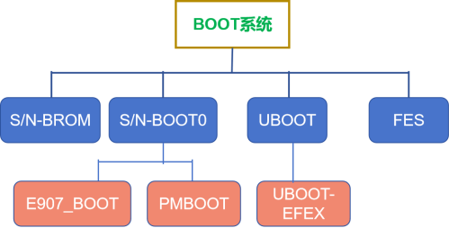

-   E907\_BOOT:

系统启动时该代码运行在RISC-V MCU，用于启动RISC-V CPU并使其跳转到BOOT0。

-   PMBOOT:

系统休眠唤醒时该代码运行在RISC-V CPU，是裁剪过的BOOT0代码。

-   UBOOT-EFEX:

系统烧写时使用的UBOOT代码，运行在RISC-V MCU。

### V821 启动流程

V821 启动分为常电与快起两个方案，这里以常电的启动流程作为演示说明，其流程如下图所示：

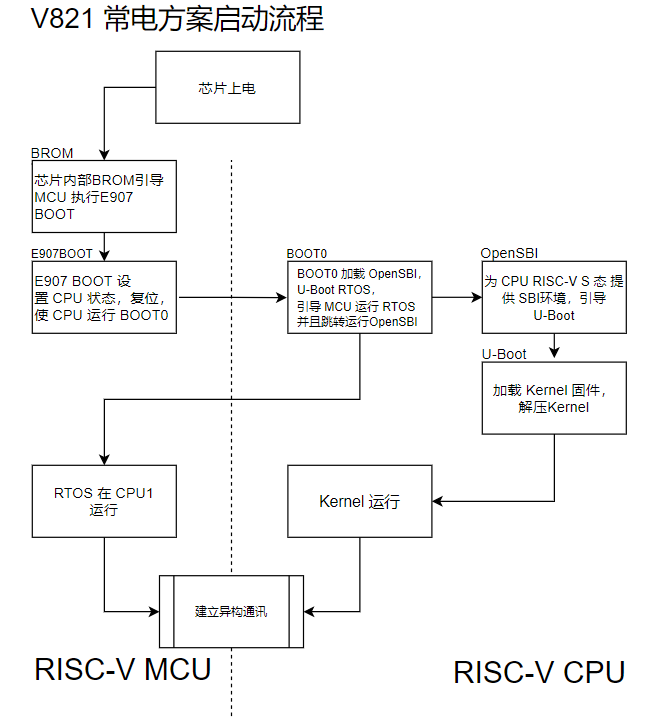

1.  首先，由芯片内部的BROM在RISC-V MCU上运行，并寻找启动介质（SDCARD/EMMC/SPI-NOR/SPI-NAND），并加载“BOOT0”（包含E907\_BOOT和BOOT0）到 SRAM，然后跳转到E907\_BOOT执行。
2.  E907\_BOOT启动RISC-V CPU并使其跳转到BOOT0执行。
3.  BOOT0初始化DRAM，从FLASH加载OpenSBI、UBOOT、RTOS到DRAM。其中RTOS引导在 RISC-V MCU 上运行，此外引导 OpenSBI 在 RISC-V CPU 上运行。
4.  UBOOT最终加载引导Linux内核。
5.  待 Linux 启动后建立异构通讯。

### V821 烧写流程

V821双核异构系统烧写流程与启动有所区别，简化为全流程在RISC-V MCU执行，因此需要注意此时UBOOT-EFEX由RISC-V MCU编译工具链生成，使用独立配置sun300iw1p1\_efex\_defconfig

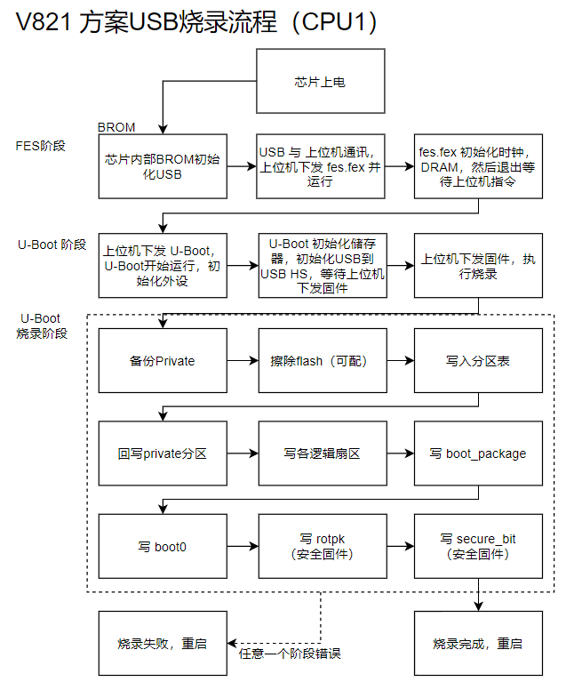

## 修改 PL 口默认电压

V821 PL 口中，PL0 PL1 固定为 1.8V 电平，无法修改，PL2~PL7 可以配置 1.8V 或者 3.3V，可以在 BOOT0 修改

首先确认当前方案使用的配置文件，这里以 perf2b 板级为例，查看 `BoardConfig_nor.mk` 和 `BoardConfig.mk` 中配置的 `LICHEE_BOOT0_BIN_NAME`，分布对应 SPI NOR 方案与 eMMC 方案下使用的 BOOT0 配置。

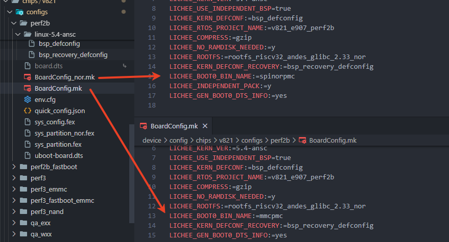

如果 `BoardConfig_nor.mk` 和 `BoardConfig.mk`中没有配置 `LICHEE_BOOT0_BIN_NAME` ，则标识方案使用默认配置，根据具体存储器件选择 `mmc.mk`，`spinor.mk`，`nand.mk` 即可

| 软件方案 | 存储器件 | 配置文件 |
| --- | --- | --- |
| 普通 | SPI NOR | `brandy/brandy-2.0/spl/board/sun300iw1p1/spinor.mk` |
| 普通 | SPI NAND | `brandy/brandy-2.0/spl/board/sun300iw1p1/nand.mk` |
| 普通 | eMMC/SD NAND | `brandy/brandy-2.0/spl/board/sun300iw1p1/mmc.mk` |
| 快起 | SPI NOR | `brandy/brandy-2.0/spl/board/sun300iw1p1/spinorfastboot.mk` |
| 快起 | eMMC/SD NAND | `brandy/brandy-2.0/spl/board/sun300iw1p1/mmcfastboot.mk` |

前往 `brandy/brandy-2.0/spl/board/sun300iw1p1` 找到配置文件

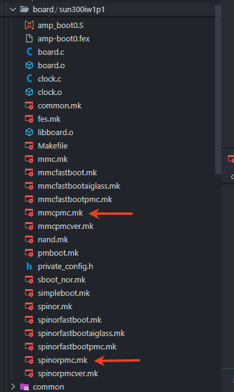

这里以 `spinorpmc.mk` 为例，配置 `CFG_SUNXI_PL_1V8=y` 则 PL 口为 1.8V 如果注释或者删除则 PL 口为 3.3V

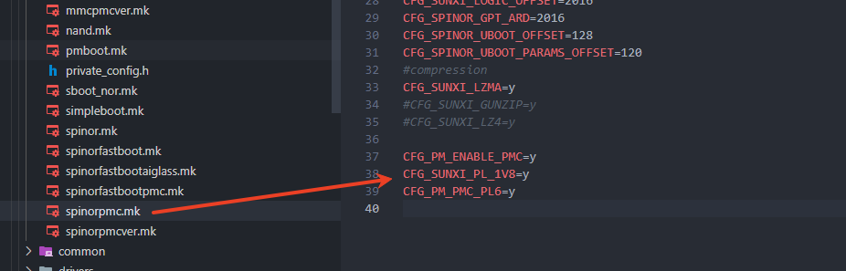

另外 fes 文件夹中的配置是执行 fes 时使用的，也需要配置


## 如何查看各模块时钟频率

```
mount -t debugfs none /sys/kernel/debug
cat /sys/kernel/debug/clk/clk_summary
```

如示例：

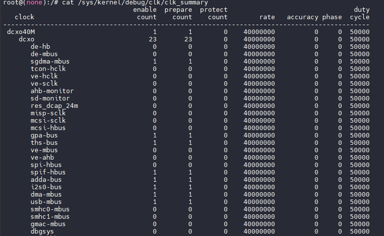

如果没有节点，需要手动开启 `DebugFS representation of clock tree`

```
CONFIG_COMMON_CLK_DEBUG=y
```

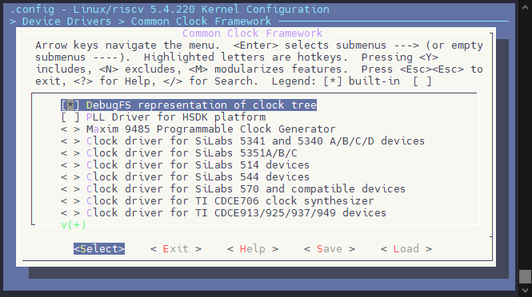

## 如何查看CPU当前频率

查看cpu当前频率：

```
cat /sys/devices/system/cpu/cpu0/cpufreq/cpuinfo_cur_freq
```

查看cpu调频策略：

```
cat /sys/devices/system/cpu/cpu0/cpufreq/scaling_governor
performance
```

表示当前调频策略为 performance, 它会以当前最大频率运行。其他常用的调频策略，如interactive,会根据实际负载调节频率。一般常用的就是这两种，如果想了解其他调频策略，可以查看内核源码中 Documentation/cpu-freq/governors.txt 该文档，或者网上资料。

:::tip

:::note

提示

:::
:::note

若找不到这个文件，说明该方案未支持调频，可以通过查看时钟树获取

```
cat /sys/kernel/debug/clk/clk_summary | grep pll-cpu
```

如果还是没有这个文件，需要内核开启配置

```
CONFIG_DEBUG_FS=y
CONFIG_COMMON_CLK_DEBUG=y
```

或者使用工具 `cpu_monitor`

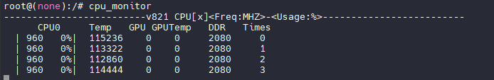

或者查看 U-boot 的打印确认

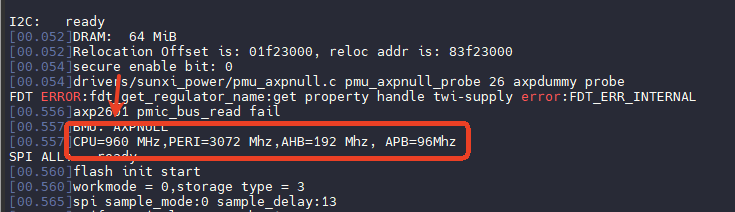

:::

:::

## 如何修改CPU主频

### SYS 节点 CPU调频设置

```
# 设置用户调频模式
echo userspace > /sys/devices/system/cpu/cpu0/cpufreq/scaling_governor

# 查看可调频率
cd /sys/devices/system/cpu/cpu0/cpufreq/
cat scaling_available_frequencies

eg: 360000 480000 600000 720000 840000 960000 1080000

#设置CPU频率:
echo 720000 > scaling_setspeed     #设置CPU主频为720M
echo 960000 > scaling_setspeed     #设置CPU主频为960M
```

### 配置 0.92V 启用 1000MHz 频点

:::tip

:::note

提示

:::
:::note

由于 V821 支持 40M 或 24M 晶振，0.92V 的频点对应 40M 晶振是 1000MHz，对应 24M 晶振是 1008MHz，为了兼容两个晶振，默认 SDK 配置为两个晶振的最大公倍数 960MHz，若产品已知晶振型号，需要提升 0.92V 频率，可以手动修改支持最高频率。

:::

:::

1.  加载 SDK 环境变量 `source build/envsetup.sh && lunch` 选择需要开发的板级
2.  执行 `quick_config`，打开 `quick_config` 配置界面
3.  执行 `make distclean` 清除编译数据
4.  选择 `set_cpu_vf_0` 条目
5.  修改文件 `bsp/configs/linux-5.4-ansc/sun300iw1p1-vf.dtsi` 取消频点 `disable`

bsp/configs/linux-5.4-ansc/sun300iw1p1-vf.dtsi

```c
opp@960000000 {
	opp-hz = /bits/ 64 <960000000>;
	opp-microvolt-vf0000 = <920000>;
	opp-microvolt-40m-vf0000 = <920000>;
	clock-latency-ns = <244144>; /* 8 32k periods */
};

opp@1000000000 {
	opp-hz = /bits/ 64 <1000000000>;
	opp-microvolt-vf0000 = <0>;
	opp-microvolt-40m-vf0000 = <920000>;
	clock-latency-ns = <244144>; /* 8 32k periods */
	status = "okay";
};

opp@1008000000 {
	opp-hz = /bits/ 64 <1008000000>;
	opp-microvolt-vf0000 = <920000>;
	opp-microvolt-40m-vf0000 = <0>;
	clock-latency-ns = <244144>; /* 8 32k periods */
	status = "okay";
};
```

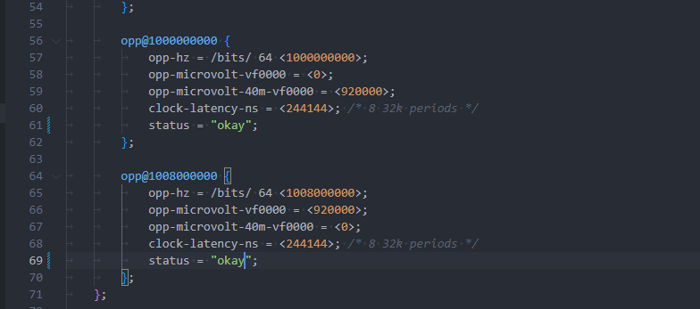

6.  修改 `brandy/brandy-2.0/spl/board/sun300iw1p1/clock.c` 配置启动频率 1000MHz

brandy/brandy-2.0/spl/board/sun300iw1p1/clock.c

```c
void sunxi_board_pll_init(void)
{
#ifndef CFG_SUNXI_SIMPLEBOOT
#ifndef CFG_SUNXI_PMBOOT
	printf("set pll start\n");
#ifdef CFG_SUNXI_VF_2_1
// 1200MHz
#define PLL_CPU_CLK_40M_N CCMU_AON_PLL_CPU_N_60
#define PLL_CPU_CLK_24M_N CCMU_AON_PLL_CPU_N_50
#else
// 1000MHz/1008MHz
#define PLL_CPU_CLK_40M_N 49
#define PLL_CPU_CLK_24M_N 41
#endif
	// set PLL_CPU=hosc*N/D
	// set PLL_VEDIO hosc*N/D
	if (aw_get_hosc_freq() == HOSC_FREQ_40M) {
		set_pll_general(CCMU_PLL_CPUX_CTRL_REG,
				PLL_CPU_CTRL_REG_PLL_EN_ENABLE,
				PLL_CPU_CTRL_REG_PLL_OUTPUT_GATE_ENABLE,
				CCMU_AON_PLL_CPU_D_2,
				PLL_CPU_CTRL_REG_PLL_INPUT_DIV_CLEAR_MASK,
				PLL_CPU_CTRL_REG_PLL_INPUT_DIV_OFFSET,
				PLL_CPU_CLK_40M_N);
		// When efuse is burned, brom will initialize the vedio clock in advance.
```


7.  修改 `rtos/lichee/rtos-components/aw/pm/plat_sun300iw1p1/firmware/standby_main.c`

rtos/lichee/rtos-components/aw/pm/plat\_sun300iw1p1/firmware/standby\_main.c

```c
//1000MHz/1008MHz
#define PLL_CPU_CLK_40M_N 49
#define PLL_CPU_CLK_24M_N 41
```


### 修改使用 1.0V VF 表

1.  加载 SDK 环境变量 `source build/envsetup.sh && lunch` 选择需要开发的板级
2.  执行 `quick_config`，打开 `quick_config` 配置界面
3.  执行 `make distclean` 清除编译数据
4.  选择 `set_cpu_vf_2` 条目

### 修改特殊频点

有些测试场景下，希望使用一些特殊的频点进行测试，这些频点不属于 VF 表测定的稳定频点，**仅用于测试不可量产**，这里以搭配 40M 晶振的 V821 为例，在其上面新增一个 640MHz 频点，其修改方法如下：

:::info

:::note

信息

:::
:::note

搭配 40M 晶振的 V821 才可以倍频出 640MHz 频点，24MHz 晶振的无法倍频出整数 640MHz，最接近的是 648MHz

:::

:::

1.  修改文件 `bsp/configs/linux-5.4-ansc/sun300iw1p1-vf.dtsi` 新增需要的特殊频点

bsp/configs/linux-5.4-ansc/sun300iw1p1-vf.dtsi

```c
opp@640000000 {
	opp-hz = /bits/ 64 <640000000>;
	opp-microvolt-vf0000 = <0>;            /* 24M 晶振不使用这个频点，配置成 0 */
	opp-microvolt-40m-vf0000 = <920000>;
	clock-latency-ns = <244144>; /* 8 32k periods */
};

opp@648000000 {
	opp-hz = /bits/ 64 <648000000>;
	opp-microvolt-vf0000 = <920000>;
	opp-microvolt-40m-vf0000 = <0>;        /* 40M 晶振不使用这个频点，配置成 0 */
	clock-latency-ns = <244144>; /* 8 32k periods */
};
```

2.  修改 `brandy/brandy-2.0/spl/board/sun300iw1p1/clock.c` 配置启动倍频值

brandy/brandy-2.0/spl/board/sun300iw1p1/clock.c

```c
void sunxi_board_pll_init(void)
{
#ifndef CFG_SUNXI_SIMPLEBOOT
#ifndef CFG_SUNXI_PMBOOT
	printf("set pll start\n");
#ifdef CFG_SUNXI_VF_2_1
// 1200MHz
#define PLL_CPU_CLK_40M_N CCMU_AON_PLL_CPU_N_60
#define PLL_CPU_CLK_24M_N CCMU_AON_PLL_CPU_N_50
#else
// 1000MHz/1008MHz
#define PLL_CPU_CLK_40M_N 31  <-- 修改 40M 晶振时倍频为 31 
#define PLL_CPU_CLK_24M_N 26  <-- 修改 24M 晶振时倍频为 26
#endif
	// set PLL_CPU=hosc*N/D
	// set PLL_VEDIO hosc*N/D
	if (aw_get_hosc_freq() == HOSC_FREQ_40M) {
		set_pll_general(CCMU_PLL_CPUX_CTRL_REG,
				PLL_CPU_CTRL_REG_PLL_EN_ENABLE,
				PLL_CPU_CTRL_REG_PLL_OUTPUT_GATE_ENABLE,
				CCMU_AON_PLL_CPU_D_2,
				PLL_CPU_CTRL_REG_PLL_INPUT_DIV_CLEAR_MASK,
				PLL_CPU_CTRL_REG_PLL_INPUT_DIV_OFFSET,
				PLL_CPU_CLK_40M_N);
		// When efuse is burned, brom will initialize the vedio clock in advance.
```

:::info

:::note

倍频参数计算方式

:::
:::note

CPU 主频使用的 PLL 为 PLL CPU，其是通过晶振频率倍频所得，在下面公式中，$HOSC$ 是晶振主频，$N$ 是倍频值，$D$ 是前除频值。

$$\text{PLL\_CPU} = \frac{\text{HOSC} \cdot (N + 1)}{D}$$

-   针对 40M 晶振，SDK 默认使用 2 前除频，配置 `CCMU_AON_PLL_CPU_D_2`
-   针对 24M 晶振，SDK 默认使用 1 前除频，配置 `CCMU_AON_PLL_CPU_D_1`

所以已知晶振频率 $HOSC$，前除频 $D$，和目标 CPU 主频的时候，$N$ 的值求解如下：

$$N = \frac{\text{PLL\_CPU} \cdot D}{\text{HOSC}} - 1$$

根据已知条件，晶振频率 $\text{HOSC} = 40\text{M}$ ，$D = 2$，要求输出频率 $\text{PLL\_CPU} = 640 \text{M} $，可以使用上面推导的公式：

$$N_{40M} = \frac{\text{PLL\_CPU} \cdot D}{\text{HOSC}} - 1$$

将已知值代入公式：

$$N_{40M} = \frac{640 \times 2}{40} - 1$$

我们可以计算出 $N_{40M}$ 的值：

$$N_{40M} = \frac{1280}{40} - 1 = 32 - 1 = 31$$

所以，$N_{40M} = 31$。

针对 24M 晶振，根据已知条件，晶振频率 $\text{HOSC} = 24\text{M}$ ，$D = 1$，要求输出频率 $\text{PLL\_CPU} = 648 \text{M} $，可以使用上面推导的公式：

$$N_{24M} = \frac{\text{PLL\_CPU} \cdot D}{\text{HOSC}} - 1$$

将已知值代入公式：

$$N_{24M} = \frac{648 \times 1}{40} - 1$$

我们可以计算出 $N_{24M}$ 的值：

$$N_{24M} = \frac{648}{24} - 1 = 27 - 1 = 26$$

所以，$N_{24M} = 26$。

:::

:::

3.  同时需要修改 `rtos/lichee/rtos-components/aw/pm/plat_sun300iw1p1/firmware/standby_main.c`

rtos/lichee/rtos-components/aw/pm/plat\_sun300iw1p1/firmware/standby\_main.c

```c
// set PLL_CPU=hosc*N/D
#ifdef CONFIG_SUNXI_VF_2_1
//1200MHz
#define PLL_CPU_CLK_40M_N PLL_N_60
#define PLL_CPU_CLK_24M_N PLL_N_50
#else
//960MHz
#define PLL_CPU_CLK_40M_N 31  <-- 修改 40M 晶振时倍频为 31
#define PLL_CPU_CLK_24M_N 26  <-- 修改 24M 晶振时倍频为 26
#endif
```

## 为何 SPI NAND 存储可用空间比标称要小

如 NAND Flash 总大小是 128M Bytes, NAND 驱动本身会保留 1/8 到 1/10 左右的空间，包括用于 NAND 管理、预留给 Boot0/U-Boot 的空间，如果 NAND 存在坏块，空间也将相应的减小。

## 支持最大多大的 SD 卡

理论支持 2TB SD 卡，测试过最大的 1TB TF 卡正常挂载读写（exfat 格式）

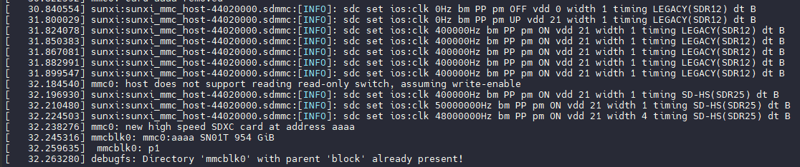

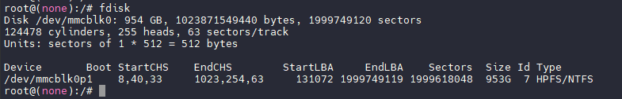

## 存储切换方法

快启SDK上切换存储需要修改的地方较多，不建议去切换。默认已提供NOR和EMMC的板级，建议直接使用对应存储类型的板级，或者复制板级进行修改。

快启SDK不支持SPI NAND。

## SPI NOR 卡启动

**快启SDK卡启动只能在EMMC板级才支持，nor板级不支持卡启动。**

SPI NOR 固件用于卡启动时，需要注意两个点：

-   卡启动的启动存储介质是SD卡，是mmcblk设备，Tina默认挂载ext4文件系统。
-   ext4文件系统需要更大的分区容量。

（1）内核配置

```
File systems  --->
   <*> The Extended 4 (ext4) filesystem   ----->确认ext4默认已选上
```

（2）Tina环境配置

```
make menuconfig 层层选中

Global build settings  --->
   [ ] Strip unnecessary functions from libraries  //取消勾选

Utilities  --->
   Filesystem  --->
      <*> e2fsprogs //选中ext4工具
```

（3）sys\_partition.fex分区表配置

```
[partition]
    name         = rootfs_data
    size         = 1024     ---->nor默认给的rootfs_data比较小，ext4建议配置3M以上，即6144以上
    user_type    = 0x8000
```

## 如何替换开机LOGO

将准备好的 bmp 文件替换下面的路径即可

```
openwrt/target/v821/v821-common/boot-resource/boot-resource/bootlogo.bmp
```

## 如何确认LCD屏本身工作是否正常

可打开LCD屏自测模式，测试colorbar输出是否正常，测试命令：

```c
echo 1 > /sys/class/disp/disp/attr/colorbar
```

## 芯片内部的GPIO是否带上下拉电阻

芯片设计时，GPIO是有带上下拉电阻，约为100K，精度为20%.

## PINCTRL 调试

1.调试节点

```
mount -t debugfs none /sys/kernel/debugfs

对于非 GPIOL 的 GPIO，在这个节点
cd /sys/kernel/debug/pinctrl/42000000.pinctrl/

对于 GPIOL 的 GPIO，在这个节点
cd /sys/kernel/debug/pinctrl/42000540.pinctrl/
```

2.查看引脚复用状态

```
cd /sys/kernel/debug/pinctrl/42000000.pinctrl/
cat pinmux-pins
```

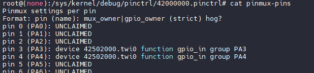

3.查看配置

```
cd /sys/kernel/debug/pinctrl/42000000.pinctrl/
cat pinconf-pins
```

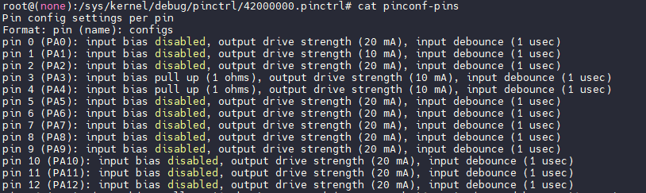

4.查看功能复用

```
cd /sys/kernel/debug/pinctrl/42000000.pinctrl/
cat pinmux-functions
```

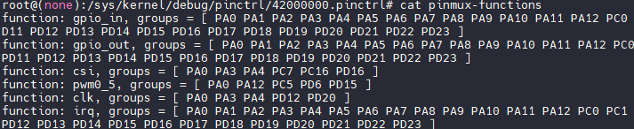

### Linux 标准GPIO调试

确认系统中有“/sys/class/gpio”这级目录，如果没有，在编译内核时加入。

```
Device Drivers  
	—>  GPIO Support  
		—> /sys/class/gpio/… (sysfs interface)
```

/sys/class/gpio使用说明：

```
1.通过/sys/文件接口操作IO端口，即GPIO到文件系统的映射；
2.控制GPIO的目录位于/sys/class/gpio；
3./sys/class/gpio/export文件，用于通知系统需要导出控制的GPIO引脚编号；
4./sys/class/gpio/unexport文件， 用于通知系统取消导出；
5./sys/class/gpio/gpiochipX目录保存系统中GPIO寄存器的信息，包括每个寄存器控制引脚的起始编号base，寄存器名称，引脚总数。
```

导出一个引脚的操作步骤：

-   首先计算此引脚编号： 引脚编号 = 控制引脚的寄存器基数 + 控制引脚寄存器位数 举例（具体GPIO参考数据手册），如想控制PB2引脚，那么引脚编号就等于1 x 32 + 2 = 34。
-   export引脚： 向 /sys/class/gpio/export 写入此编号，比如34号引脚，在 shell 中可以通过以下命令实现：

```c
echo 34 > /sys/class/gpio/export
```

命令成功后生成 /sys/class/gpio/gpio34目录，如果没有出现相应目录，说明此引脚不可导出。

-   定义输入输出： direction 文件，定义输入输入方向，可以通过下面命令定义为输出。

```c
echo out > /sys/class/gpio/gpio34/direction
```

 direction 接受的参数可以是：in、out、high、low。其中参数 high / low 在设置方向为输出的同时，将 value 设置为相应的 1 / 0。

-   设置value值： value 文件是端口的数值，为1或0，通过下面命令将gpio34设置为高电平。

```c
echo 1 > /sys/class/gpio/gpio34/value
```

## 如何进行USB眼图测试

### USB0 OTG Device眼图测试

```
手动切换Device模式:
cat /sys/devices/platform/soc@2002000/soc@2002000:usbc0@0/usb_device

每个芯片平台的节点路径会有些差异，请通过find命令确认：
find /sys -name otg_ed_test

眼图测试命令：
echo test_pack > /sys/devices/platform/soc@2002000/44100000.udc-controller/otg_ed_test
```

### USB0 OTG Host眼图测试

```
手动切换Host模式:
cat /sys/devices/platform/soc@2002000/soc@2002000:usbc0@0/usb_host

每个芯片平台的节点路径会有些差异，请通过find命令确认(注意选择带有ehci0的路径)：
find /sys -name ed_test

眼图测试命令：
echo test_pack > /sys/devices/platform/soc@2002000/44101000.ehci0-controller/ed_test
```

## 在 U-Boot 中设置内核打印等级

启动时进入 U-Boot 控制台，使用 `print` 目录查看环境变量中的 `loglevel=` 字段，可以看到这里字段是 `8`

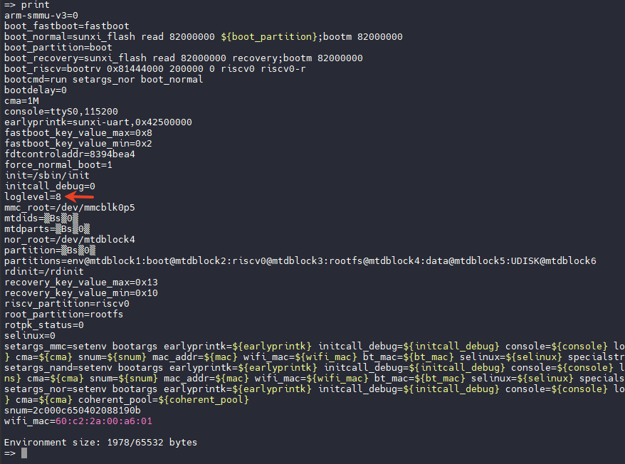

使用命令 `setenv loglevel 1` 即可修改打印等级为1，修改后可以打印出来看看

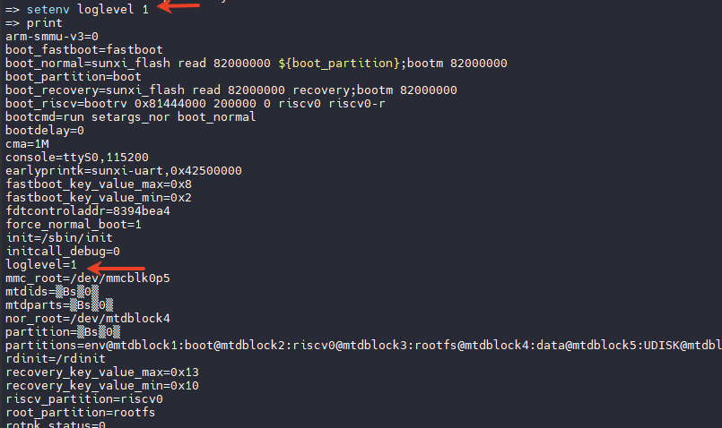

如果需要保存永久，使用 `saveenv` 命令

![image-20250211093452115]()

使用 `boot` 命令启动系统

## 打印 awbase abnormal

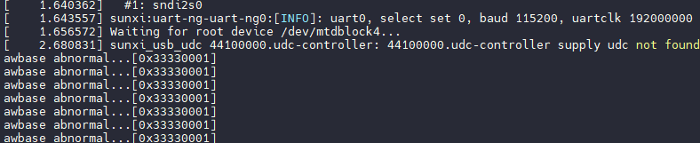

如果出现打印 `awbase abnormal...[0x33330001]` 标识目前检测到内核不正常，请检查内核内守护进程 `awbase.ko` 是否正常挂载。使用命令查看

```
lsmod
```

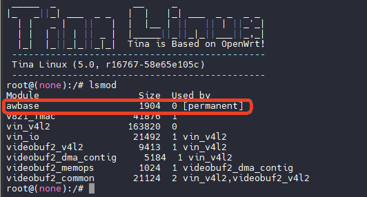

如果检测到长时间内核守护进程未启动，则会报错 `awbase abnormal...[0x33330001]`

## 禁用小核

V821 若不使用休眠唤醒功能与 SIP WIFI 功能，可选择关闭小核，将小核内存释放出来供大核使用。

（1）删除设备树小核相关节点

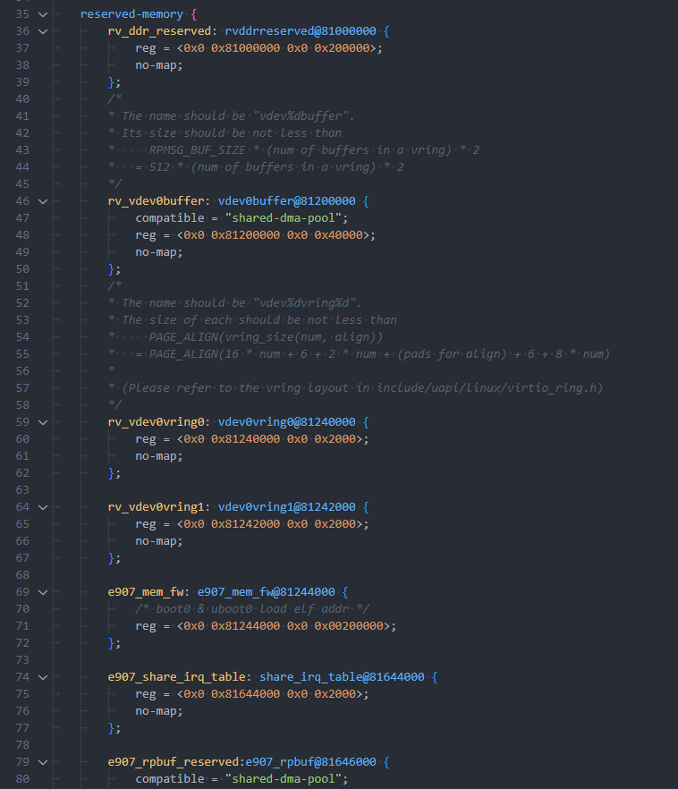

删除以下预留内存节点

```c
rv_ddr_reserved: rvddrreserved@81000000 {
	reg = <0x0 0x81000000 0x0 0x200000>;
	no-map;
};
/*
* The name should be "vdev%dbuffer".
* Its size should be not less than
*     RPMSG_BUF_SIZE * (num of buffers in a vring) * 2
*   = 512 * (num of buffers in a vring) * 2
*/
rv_vdev0buffer: vdev0buffer@81200000 {
	compatible = "shared-dma-pool";
	reg = <0x0 0x81200000 0x0 0x40000>;
	no-map;
};
/*
* The name should be "vdev%dvring%d".
* The size of each should be not less than
*     PAGE_ALIGN(vring_size(num, align))
*   = PAGE_ALIGN(16 * num + 6 + 2 * num + (pads for align) + 6 + 8 * num)
*
* (Please refer to the vring layout in include/uapi/linux/virtio_ring.h)
*/
rv_vdev0vring0: vdev0vring0@81240000 {
	reg = <0x0 0x81240000 0x0 0x2000>;
	no-map;
};

rv_vdev0vring1: vdev0vring1@81242000 {
	reg = <0x0 0x81242000 0x0 0x2000>;
	no-map;
};

e907_mem_fw: e907_mem_fw@81244000 {
	/* boot0 & uboot0 load elf addr */
	reg = <0x0 0x81244000 0x0 0x00200000>;
};

e907_share_irq_table: share_irq_table@81644000 {
	reg = <0x0 0x81644000 0x0 0x2000>;
	no-map;
};

e907_rpbuf_reserved:e907_rpbuf@81646000 {
	compatible = "shared-dma-pool";
	reg = <0x0 0x81646000 0x0 0x8000>;
	no-map;
};
```

删除以下通讯使用节点

```c
reserved-irq {
	share-e907 {
		arch-name = "e907";
		memory-region = <&e907_share_irq_table>;
		/* defined by sun300iw1-share-irq-dt.h */
		share-irq =
				<1    0x1    E907_PA_IRQ_NUM    A27_PA_IRQ_NUM    0x00000000>,
				<3    0x3    E907_PC_IRQ_NUM    A27_PC_IRQ_NUM    0x00000000>,
				<4    0x4    E907_PD_IRQ_NUM    A27_PD_IRQ_NUM    0x00000000>,
				<12   0xc    E907_PL_IRQ_NUM    A27_PL_IRQ_NUM    0x00000000>;
	};
};

hifbypass: hifbypass {
	compatible = "allwinner,sun300wi-sip-wifi";
	interrupts-extended = <&plic0 160 IRQ_TYPE_LEVEL_HIGH>;
	clocks = <&aon_ccu CLK_DCXO>;
	clock-names = "hosc";
	status = "disabled";
};

rpbuf_controller0: rpbuf_controller0@0 {
	compatible = "allwinner,rpbuf-controller";
	remoteproc = <&e907_rproc>;
	ctrl_id = <0>;
	memory-region = <&e907_rpbuf_reserved>;
	status = "okay";
};

rpbuf_xradio: rpbuf_xradio@0 {
	compatible = "allwinner,rpbuf-xradio";
	rpbuf = <&rpbuf_controller0>;
	status = "okay";
};
```

删除 `rproc` 节点

```c
&e907_rproc {
	firmware-name = "amp_rv0.bin";
	mboxes = <&msgbox 0>;
	mbox-names = "arm-kick";
	auto-boot;
	skip-shutdown;
	fw-region = <&e907_mem_fw>;
	memory-region = <&rv_ddr_reserved>, <&rv_vdev0buffer>, <&rv_vdev0vring0>, <&rv_vdev0vring1>, <&e907_share_irq_table>;
	fw-partitions = "riscv0", "riscv0-r";
	fw-partition-sectors = <2432>;
	memory-mappings =
	/* < DA         len             PA >    */
	/* SRAM ISP */
	< 0x2000000        0xa800        0x2000000 >,
	/* SRAM VE */
	< 0x200a800        0x17400       0x200a800 >,
	/* SRAM WIFI */
	< 0x68000000       0x1000000     0x68000000 >,
	/* DRAM */
	< 0x80000000       0x0fffffff    0x80000000 >;
	stop-record-reg = <0x4a00020c>;

	share-irq = "e907";
	status = "okay";

	rproc_wdt: rproc_wdt@0 {
		timeout_ms = <6000>;
		try_times = <1>;
		reset_type = <0x2>;
		panic_on_timeout = <1>;
		status = "okay";
	};
};
```

（2）删除小核分区

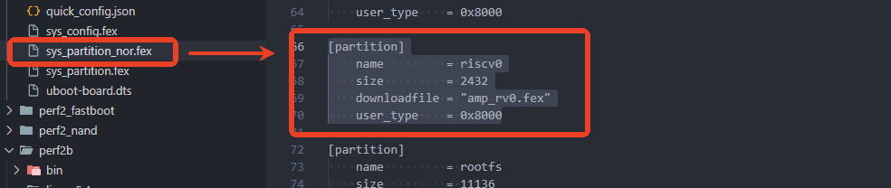

```
[partition]
    name         = riscv0
    size         = 2432
    downloadfile = "amp_rv0.fex"
    user_type    = 0x8000
```

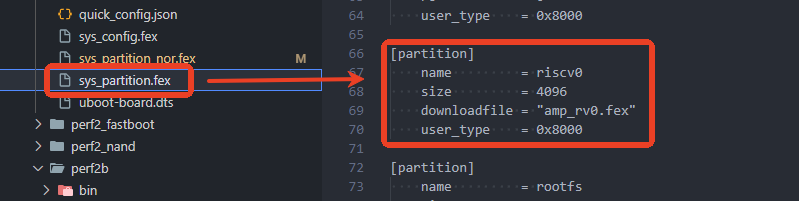

```
[partition]
    name         = riscv0
    size         = 4096
    downloadfile = "amp_rv0.fex"
    user_type    = 0x8000
```

（3）编辑内核配置，关闭小核通讯控制相关功能：

```
CONFIG_AW_REMOTEPROC
CONFIG_AW_RPROC_FAST_BOOT
CONFIG_AW_RPROC_SUBDEV
CONFIG_AW_RPROC_SUBDEV_WDT
CONFIG_SUNXI_RPROC_SHARE_IRQ
CONFIG_AW_REMOTEPROC_E907_BOOT
CONFIG_AW_REMOTEPROC_E907_STOP_NOTIFY
CONFIG_AW_RPMSG_CTRL
CONFIG_AW_RPMSG_NOTIFY
CONFIG_AW_RPBUF_SERVICE_RPMSG
CONFIG_AW_RPBUF_CONTROLLER_SUNXI
CONFIG_AW_MSGBOX
```

（4）编辑 boot0 配置

首先确认当前方案使用的配置文件，这里以 perf2b 板级为例，查看 `BoardConfig_nor.mk` 和 `BoardConfig.mk` 中配置的 `LICHEE_BOOT0_BIN_NAME`，分布对应 SPI NOR 方案与 eMMC 方案下使用的 BOOT0 配置。


如果 `BoardConfig_nor.mk` 和 `BoardConfig.mk`中没有配置 `LICHEE_BOOT0_BIN_NAME` ，则标识方案使用默认配置，根据具体存储器件选择 `mmc.mk`，`spinor.mk`，`nand.mk` 即可

| 软件方案 | 存储器件 | 配置文件 |
| --- | --- | --- |
| 普通 | SPI NOR | `brandy/brandy-2.0/spl/board/sun300iw1p1/spinor.mk` |
| 普通 | SPI NAND | `brandy/brandy-2.0/spl/board/sun300iw1p1/nand.mk` |
| 普通 | eMMC/SD NAND | `brandy/brandy-2.0/spl/board/sun300iw1p1/mmc.mk` |
| 快起 | SPI NOR | `brandy/brandy-2.0/spl/board/sun300iw1p1/spinorfastboot.mk` |
| 快起 | eMMC/SD NAND | `brandy/brandy-2.0/spl/board/sun300iw1p1/mmcfastboot.mk` |

前往 `brandy/brandy-2.0/spl/board/sun300iw1p1` 找到配置文件


这里以 `spinorpmc.mk` 为例

关闭下面两个配置，可以注释可以删除

```
CFG_DEFAULT_BOOT_RTOS
CFG_EARLY_BOOT_RISCV
```

:::tip

:::note

提示

:::
:::note

-   `CFG_DEFAULT_BOOT_RTOS` 配置一般配置在 `brandy/brandy-2.0/spl/board/sun300iw1p1/common.mk`


-   `CFG_EARLY_BOOT_RISCV`配置一般配置在板级配置

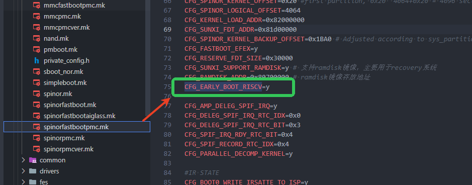

:::

:::

## 裁剪 U-Boot 增加启动速度

在部分场景下，如果不需要使用 U-Boot 的相关功能，可以裁剪掉 U-Boot 使用 SPL 去拉起内核。

:::warning

:::note

注意

:::
:::note

去除 U-Boot 之后将无法使用 U-Boot 提供的部分功能，包括

-   卡升级
-   卡量产
-   DragonSN 烧号

:::

:::

### SPI NOR 方案

这里以 PERF2B 板级搭配 NOR 存储器件作为示例。

（1）增加 BOOT0 配置

在目录 `brandy/brandy-2.0/spl/board/sun300iw1p1` 新增 BOOT0 配置项 `spinorskipboot.mk`

```makefile
FILE_EXIST=$(shell if [ -f $(TOPDIR)/board/$(PLATFORM)/common.mk ]; then echo yes; else echo no; fi;)
EXT_FILE_EXIST=$(shell if [ -f $(TOPDIR)/board/$(PLATFORM)/common$(LICHEE_BOARD).mk ]; then echo yes; else echo no; fi;)
ifeq (x$(EXT_FILE_EXIST),xyes)
include $(TOPDIR)/board/$(PLATFORM)/common$(LICHEE_BOARD).mk
else ifeq (x$(FILE_EXIST),xyes)
include $(TOPDIR)/board/$(PLATFORM)/common.mk
else
include $(TOPDIR)/board/$(CP_BOARD)/common.mk
endif

MODULE=spinorskipboot
CFG_SUNXI_SPINOR=y
CFG_SUNXI_SPI =y
CFG_SUNXI_SPIF =y
#CFG_SUNXI_DMA =y
#CFG_SPI_USE_DMA =y
CFG_SUNXI_ELF =y
CFG_SUNXI_FDT =y
CFG_SUNXI_GPT =y
CFG_SUNXI_ENV =y
CFG_SUNXI_ENV_SIZE =0x1000
CFG_SUNXI_HAVE_REDUNDENV=y
#CFG_SUNXI_NO_UPDATE_FDT_CHOSEN=y
CFG_SUNXI_LOGIC_OFFSET=2016
CFG_SPINOR_GPT_ARD=2016
CFG_SPINOR_UBOOT_OFFSET=128
CFG_SPINOR_UBOOT_PARAMS_OFFSET=120

CFG_BOOT0_LOAD_KERNEL=y
CFG_KERNEL_BOOTIMAGE=y
CFG_LOAD_DTB_FROM_KERNEL=y
CFG_KERNEL_CHECKSUM=n #y will check kernel checksum in bimage, but slower
CFG_SPINOR_KERNEL_OFFSET=0x20 #first partition, 0x20  4064+0x20 = 4096 sector = 2.0M
CFG_SPINOR_LOGICAL_OFFSET=4064
CFG_KERNEL_LOAD_ADDR=0x82000000
CFG_SUNXI_FDT_ADDR=0x81d00000
CFG_SPINOR_KERNEL_BACKUP_OFFSET=0x1BA0 # Adjusted according to sys_partition file
CFG_FASTBOOT_EFEX=y
CFG_RESERVE_FDT_SIZE=0x30000
CFG_SUNXI_SUPPORT_RAMDISK=y # 支持ramdisk镜像，主要用于recovery系统
CFG_RAMDISK_ADDR=0x80700000 # ramdisk镜像存放地址

#IR STATE
CFG_SUNXI_PHY_KEY=y
CFG_GPADC_KEY=y
CFG_BOOT0_LOAD_FLASH=y
CFG_SET_GPIO_NEW=y

#compression
CFG_SUNXI_LZ4=y

#gpadc
CFG_SUNXI_PHY_KEY=y
CFG_GPADC_KEY=y
```

把这个配置增加到编译列表中

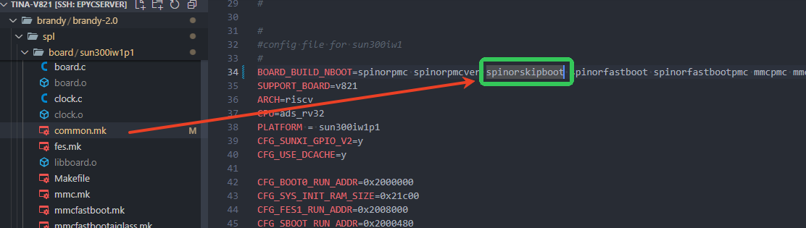

（2）修改使用该配置的 BOOT0

进入修改 `device/config/chips/v821/configs/perf2b/BoardConfig_nor.mk` 文件，改为刚才新增的 BOOT0 配置

```
LICHEE_BOOT0_BIN_NAME:=spinorskipboot
```

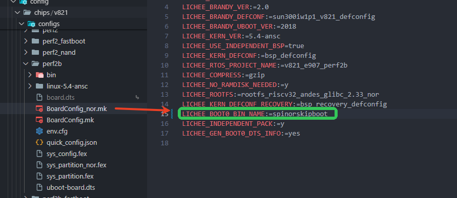

增加配置 ENV

```
LICHEE_REDUNDANT_ENV_SIZE:=0x1000
```

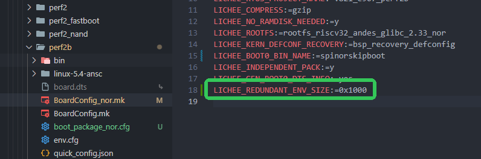

修改压缩方式为 lz4

```
LICHEE_COMPRESS:=lz4
```

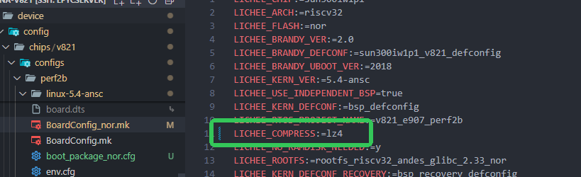

（3）修改 `boot_package` 配置

新增文件 `boot_package_nor.cfg` ，写入以下内容（注意最后需要添加一行空行！）

```ini
[package]
;item=Item_TOC_name,         Item_filename,
item=opensbi,                 opensbi.fex
item=pmboot,                 pmboot_spinor.fex
```

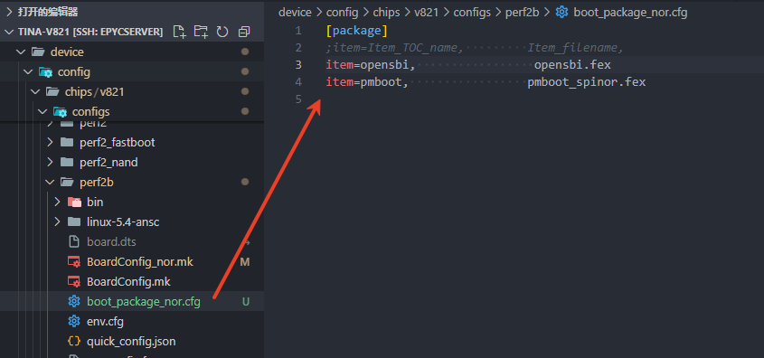

（4）修改设备树

由于裁剪了 U-Boot，需要将启动参数写在设备树中，修改设备树文件 `device/config/chips/v821/configs/perf2b/linux-5.4-ansc/board.dts`

```
chosen {
	bootargs = "earlyprintk=sunxi-uart,0x42500000 initcall_debug=0 console=ttyS0,1500000 loglevel=8 root=/dev/mtdblock7 rootwait init=/init rdinit=/rdinit partitions=boot-resource@mtdblock1:env@mtdblock2:env-redund@mtdblock3:boot@mtdblock4:private@mtdblock5:riscv0@mtdblock6:rootfs@mtdblock7:rootfs_data@mtdblock8:UDISK@mtdblock9 coherent_pool= androidboot.hardware=sun300iw1p1 boot_type=3 androidboot.boot_type=3 gpt=1 mbr_offset=311296 rootfstype=squashfs";
};
```

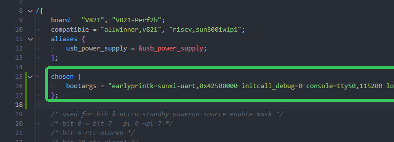

注意 `partitions` 后面的分区表需要与分区表一一对应

```
partitions=boot-resource@mtdblock1:env@mtdblock2:env-redund@mtdblock3:boot@mtdblock4:private@mtdblock5:riscv0@mtdblock6:rootfs@mtdblock7:rootfs_data@mtdblock8:UDISK@mtdblock9
```

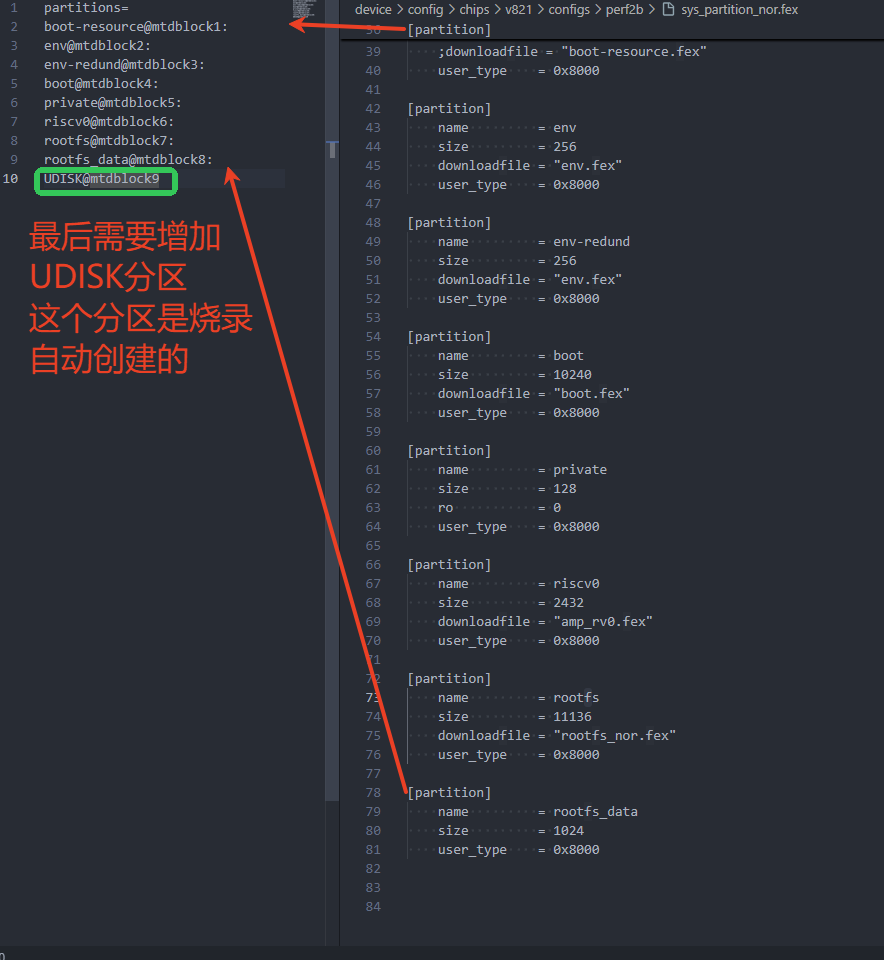

另外存储设备也默认开启，由于没有 U-Boot，不会自动识别存储设备，需要默认配置好，找到 `spif` 节点配置 `okay`

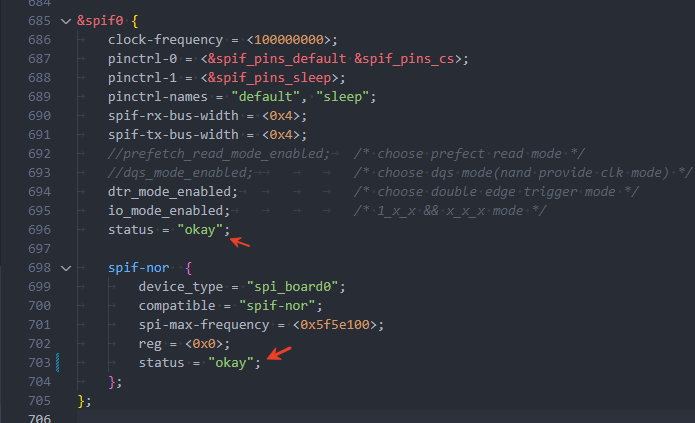

修改 U-Boot 的分区表，删除 U-Boot 分区，缩小空间

```
nor_map {
	/*Unit: Sector, 8M flash:16384, 16M flash:32768, 32M flash:65536*/
	/* logic offset requires block size(64K) alignment - 32(mbr size) */
	flash_size = <16384>;
	logic_offset = <608>;
	secure_logic_offset = <2016>;
	rtos_logic_offset = <2016>;
	rtos_secure_logic_offset = <2016>;
	boot_param_start = <272>;
	boot_param_size = <8>;
	uboot_start = <280>;
	uboot_size = <328>;
	boot0_start = <0>;
	status = "okay";
};
```

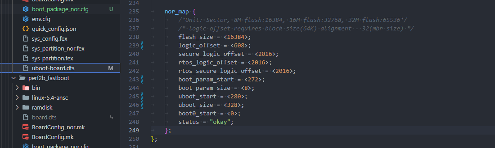

（5）修改用户空间 env 配置

修改配置 `env` 大小为 `0x1000`

```
# Allwinner Tina
/dev/by-name/env	       0x0000          0x1000
/dev/by-name/env-redund       0x0000          0x1000
```

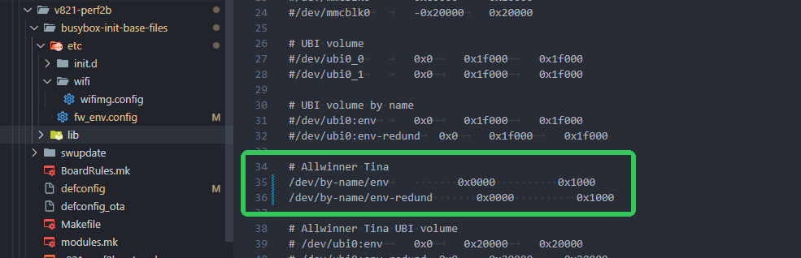

（6）完成修改，验证

修改后需要重新加载 SDK，以使用新的环境变量

```
source build/envsetup.sh
lunch
```

然后编译 SDK 测试，启动日志如下，可以对比存在什么问题

```
[0]HELLO! BOOT0 is starting!
[2]BOOT0 commit : 93baf00a8b-dirty
[6]set pll start
[9]set pll end
[10]board init ok: use hosc 40M
[15]DRAM use internal ZQ!!
[17]ZQ value = 0x30
[19]DRAM BOOT DRIVE INFO: V1.00
[22]DRAM CLK = 520 MHz
[24]DRAM Type = 2 (2:DDR2,3:DDR3)
[27]DRAMC read ODT off.
[29]DRAM ODT off.
[32]trefi: 7.8us
[33]DRAM Size = 64 MB
[37]DRAM simple test OK.
[39]dram size =64
[41]set spif freq:100000000
[44]spi sample_mode:0 sample_delay:14
[48]spinor id is: 20 40 18, read cmd: ed
[52]Succeed in reading toc file head.
[55]The size of toc is 18000.
[59]Entry_name        = opensbi
[62]Entry_name        = pmboot
[65]GPT load from sector:0x0, sectors: 0x8
[85]kernel_addr:80000000
[139]block size: 2867788
[202]block size: 2044903
[253]kernel:80000000 4af64e
[256]update dts
[258]Jump to OpenSBI: opensbi_base = 0x80fc0000, dtb_base = 0x81d00000, kernel_addr = 0x80000000

OpenSBI c19b4e8ed2bdc4057ebb0077a35f3ff672c1d68d
   ____                    _____ ____ _____
  / __ \                  / ____|  _ \_   _|
 | |  | |_ __   ___ _ __ | (___ | |_) || |
 | |  | | '_ \ / _ \ '_ \ \___ \|  _ < | |
 | |__| | |_) |  __/ | | |____) | |_) || |_
  \____/| .__/ \___|_| |_|_____/|____/_____|
        | |
        |_|

init msb region pma attribute
Platform Name             : sun300iw1
Platform Features         : medeleg
Platform HART Count       : 1
Platform IPI Device       : sunxi_plicsw
Platform Timer Device     : sunxi_plmt @ 40000000Hz
Platform Console Device   : sunxi_uart
Platform HSM Device       : ---
Platform PMU Device       : ---
Platform Reboot Device    : sunxi_wdt
Platform Shutdown Device  : sunxi_wdt
Firmware Base             : 0x80fc0400
Firmware Size             : 75 KB
Runtime SBI Version       : 0.3

Domain0 Name              : root
Domain0 Boot HART         : 0
Domain0 HARTs             : 0*
Domain0 Region00          : 0x80fc0000-0x80fdffff ()
Domain0 Region01          : 0x00000000-0xffffffff (R,W,X)
Domain0 Next Address      : 0x80000000
Domain0 Next Arg1         : 0x81d00000
Domain0 Next Mode         : S-mode
Domain0 SysReset          : yes

Boot HART ID              : 0
Boot HART Domain          : root
Boot HART ISA             : rv32imafdcnsux
Boot HART Features        : scounteren,mcounteren,mcountinhibit,sscofpmf
Boot HART PMP Count       : 64
Boot HART PMP Granularity : 8
Boot HART PMP Address Bits: 31
Boot HART MHPM Count      : 4
Boot HART MIDELEG         : 0x00000222
Boot HART MEDELEG         : 0x0000b109
[    0.000000] Linux version 5.4.220 (tina-dev@tina-dev-163) (gcc version 10.4.0 (2024-02-02_nds32le-linux-glibc-v5d-bbc31ec98)) #12 PREEMPT Wed Apr 16 13:38:18 HKT 2025
[    0.000000] printk: bootconsole [earlycon0] enabled
[    0.000000] Reserved memory: created CMA memory pool at 0x0000000083c00000, size 4 MiB
[    0.000000] OF: reserved mem: initialized node linux,cma, compatible id shared-dma-pool
[    0.000000] Reserved memory: created DMA memory pool at 0x0000000081200000, size 0 MiB
[    0.000000] OF: reserved mem: initialized node vdev0buffer@81200000, compatible id shared-dma-pool
[    0.000000] Reserved memory: created DMA memory pool at 0x0000000081646000, size 0 MiB
[    0.000000] OF: reserved mem: initialized node e907_rpbuf@81646000, compatible id shared-dma-pool
[    0.000000] Zone ranges:
[    0.000000]   Normal   [mem 0x0000000080000000-0x0000000083ffffff]
[    0.000000] Movable zone start for each node
[    0.000000] Early memory node ranges
[    0.000000]   node   0: [mem 0x0000000080000000-0x0000000080ffefff]
[    0.000000]   node   0: [mem 0x0000000081244000-0x0000000081643fff]
[    0.000000]   node   0: [mem 0x000000008164e000-0x0000000083ffffff]
[    0.000000] Initmem setup node 0 [mem 0x0000000080000000-0x0000000083ffffff]
[    0.000000] On node 0 totalpages: 15793
[    0.000000]   Normal zone: 128 pages used for memmap
[    0.000000]   Normal zone: 0 pages reserved
[    0.000000]   Normal zone: 15793 pages, LIFO batch:3
[    0.000000] SBI specification v0.3 detected
[    0.000000] SBI implementation ID=0x1 Version=0x10000
[    0.000000] SBI v0.2 TIME extension detected
[    0.000000] SBI v0.2 IPI extension detected
[    0.000000] SBI v0.2 RFENCE extension detected
[    0.000000] SBI SRST extension detected
[    0.000000] riscv: base ISA extensions acdfim
```

## 配置默认启用 LDO1 2.8V

（1）修改 BOOT0 开启 LDO1

修改文件 `brandy/brandy-2.0/spl/board/sun300iw1p1/common.mk`，增加一行

```
CFG_ENABLE_LDO28=y
```

（2）设备树修改

增加节点开启 LDO1

```c
&pmu_soc_ldo1 {
	regulator-name = "ldo1";
	regulator-min-microvolt = <2250000>;
	regulator-max-microvolt = <3000000>;
	regulator-enable-ramp-delay = <1000>;
	regulator-boot-on;
	regulator-always-on;
};
```

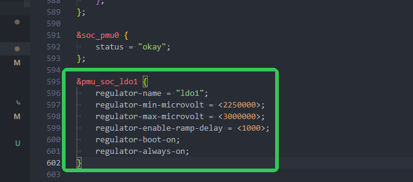

## ADB中输入 WIFI 指令，ADB没有输出

由于 WIFI 进程与操作 WIFI 配置的进程 `wifi daemon` 是两个进程，所以默认情况下，在 ADB 输入的 WIFI 指令操作会打印到串口。

如果需要输出指令，请打开此配置 `m menuconfig`

```
Allwinner  --->
	Wireless  --->
		<*> wifimanager-v2.0  --->
			[*]   wifi daemon log socket to wifi
```

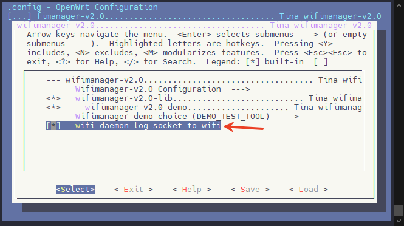

## RTC 时钟源配置

1.  外部32K晶振：精准度最高，功耗低，但是需要外挂晶振
2.  RCCAL：精准度次高，需要定时校准（通过高频晶振对RCOSC进行校准），功耗高
3.  RCOSC：精准度不高，随温度变化，功耗低

配置方法分别如下：

1.  外部晶振

board.dts

```c
&prcm_ccu {
	extern_32k = "enabled";
	extern_fre = <32768>;
};
```

2.  RCCAL

board.dts

```c
&prcm_ccu {
	extern_32k = "disabled";
	extern_fre = <32768>;
};
```

3.  RCOSC

board.dts

```c
&prcm_ccu {
	/delete-property/ extern_32k;
	extern_fre = <32768>;
};
```

## 启动加载 WIFI 模块直接崩溃，无法使用

日志如下：

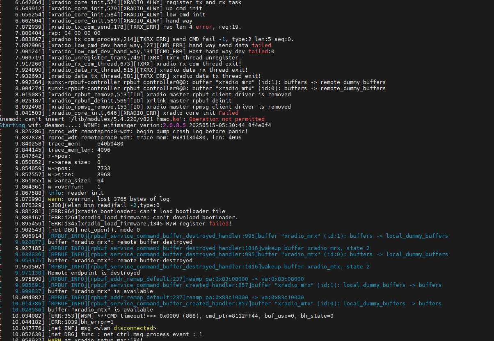

-   这是因为 V821 使用了 V821B 的固件，或者 V821 使用了 V821B 的固件，造成 WIFI 驱动不同导致的系统崩溃。
-   请确认 `lunch` 时的芯片型号

![image-20250515140754615]()

## 快起系统启动打印大量乱码，无法启动

日志如下：

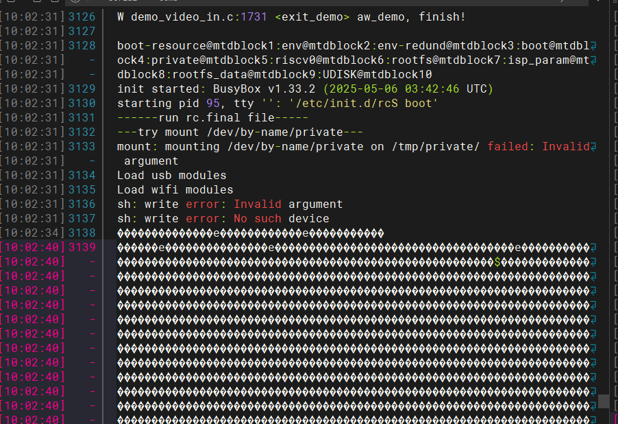

-   这是因为 V821 使用了 V821B 的固件，或者 V821 使用了 V821B 的固件，造成 WIFI 驱动不同导致的系统崩溃。
-   请确认 `lunch` 时的芯片型号

![image-20250515140754615]()

## REBOOT 卡死

![image-20250515160546340]()

-   这是因为 V821 使用了 V821B 的固件，或者 V821 使用了 V821B 的固件，造成 WIFI 驱动不同导致的系统崩溃卡死。
-   请确认 `lunch` 时的芯片型号

![image-20250515140754615]()
