# V821 多媒体内存优化指南

## 前言

### 编写目的

本文档旨在介绍多媒体内存优化的常规优化措施和特定场景下优化措施，用于指导编码产品多媒体内存优化。

**常规优化措施**包括：

-   使用在线编码
-   调整分辨率
-   增大 LBC 压缩倍数
-   调整 VBV buffer 缓存时长

**特定场景优化措施**包括：

-   离线编码时 VIPP 配置 2 个 buffer
-   TDM 配置单 buffer 模式
-   VE 编码参考帧 buffer 和重建帧 buffer 复用

### 读者对象

本文档（本指南）主要适用于以下人员：

-   技术支持工程师
    
-   软件开发工程师
    

### 适用范围

:::note

:::note

适用产品列表

:::

:::

| **产品名称** | **内核版本** |
| --- | --- |
| V821 | Linux-5.4 |

### 文档约定

#### 标志说明

:::warning

:::note

注意

:::
:::note

-   提醒操作中应注意的事项。不当的操作可能会损坏器件，影响可靠性、降低性能等。

:::

:::
:::note

:::note

备注

:::
:::note

为准确理解文中指令、正确实施操作而提供的补充或强调信息。

:::

:::
:::tip

:::note

提示

:::
:::note

一些容易忽视的小功能、技巧。了解这些功能或技巧能帮助解决特定问题或者节省操作时间。

:::

:::

### 相关术语介绍

-   CSI（Camera Serial Interface）：相机串行接口，DVP（Digital Video Port）数字视频端口
-   MIPI（Mobile Industry Processor Interface）：MIPI 联盟（TI、ST、ARM、Nokia）定义的移动行业处理器接口，如 MIPI CSI-2（Camera）、MIPI DSI（Display）
-   TDM（Time Division Multiplexing）：帧级分时复用控制器
-   TDM RX（receive）：帧级分时复用控制器的接收端
-   TDM TX（transmit）：帧级分时复用控制器的发送端
-   ISP（Image Signal Processing）：图像信号处理器
-   VIPP（Video Input Processor）：视频输入处理器
-   VE/VENC（Video Encoder）：视频编码器
-   MPP（Media Process Platform）：媒体处理平台
-   ORL（Object Rectangle Label）：物体矩形框标注
-   LBC（Lossy Block Compression）：有损块压缩
-   LBD（Lossy Block Decompression）：有损块解压缩
-   ISP D3D：ISP 3D降噪
-   hblank：行消隐，当扫描点到达图像右侧边缘时，扫描点快速返回左侧，重新开始在第1行的起点下面进行第2行扫描，行与行之间的返回过程称为行消隐
-   vblank：场消隐，扫描点扫描完一帧后，要从图像的右下角返回到图像的左上角，开始新一帧的扫描，会有一段间隔时间，这个时间间隔是场消隐
-   VBV buffer（Video Buffering Verifier）：视频缓冲验证器，用于控制编码码流的缓冲大小
-   WDR（Wide Dynamic Range）：宽动态范围，一种提高图像亮暗区域细节的技术
-   在线编码（Online Encoding）：VIPP 与 VE 硬件通过共享 buffer 直接传输数据的编码模式，无需经过应用层传递
-   离线编码（Offline Encoding）：VIPP 与 VE 之间的数据传递需经过应用层 MPP 的编码模式，需配置更多 buffer
-   buffer：缓冲区，用于临时存储视频帧数据的内存空间

了解了上述术语后，下面介绍多媒体内存优化的整体情况。

## 多媒体内存优化概述

对于小内存（比如：64MB、128MB）方案，内存资源少，为保证能同时开启更多功能，需要进行内存优化。

内存优化主要包含以下几个方面：

-   系统内存优化
-   多媒体内存优化
-   应用内存优化

本文主要介绍多媒体内存优化，涉及 TDM（帧级分时复用控制器）、ISP（图像信号处理器）、VIPP（视频输入处理器）、VENC（视频编码器）等模块。

本文档主要分场景介绍编码产品多媒体内存优化的几种措施和预期结果。在介绍多媒体内存优化措施前，先分别介绍单 MIPI sensor 和双 MIPI sensor 两个典型场景下的编码通路情况。

-   单 MIPI sensor 场景下，编码通路框图如下图所示。
    
    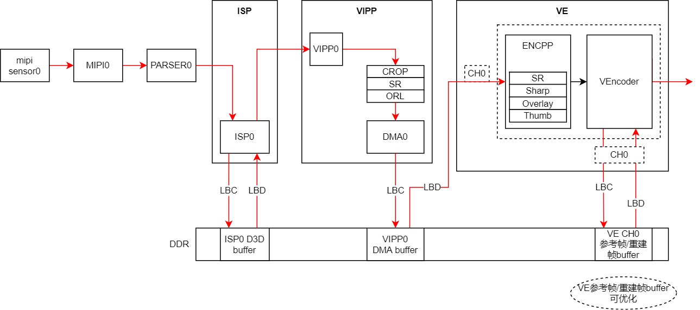
    
    该场景下，只有一路 sensor，无需使用 TDM 帧级分时复用控制器。
    
    **数据流程**：MIPI sensor 采集的图像经过 ISP 处理（ISP 处理需用 ISP D3D buffer），处理后通过硬件传输给 VIPP。根据用户配置，VIPP 对输入的图像进行 CROP（裁剪）、SR（缩放）、ORL（物体矩形框标注）等处理，处理后写入 DMA buffer。VE 的 ENCPP（编码前处理）读取图像视频帧数据，根据用户配置进行 SR（缩放）、Sharp（锐化）、Overlay（叠加 OSD）、Thumb（缩略图）等处理，处理后送给 VEncoder 编码器进行编码。编码器在编码过程中需用到 VE 参考帧/重建帧 buffer。
    
    **LBC（有损块压缩）压缩**：由于图像数据量大，为节省带宽，需用到 LBC 压缩和解压缩处理。
    
    -   ISP D3D（3D 降噪）处理时往 DDR 写读数据前后分别进行 LBC 压缩和 LBD（有损块解压缩）解压缩
    -   VIPP 往 DMA buffer 写读数据前后分别进行 LBC 压缩和 LBD 解压缩
    -   VE 编码往参考帧 buffer 写读数据前后分别进行 LBC 压缩和 LBD 解压缩
    
    其中，ISP D3D 默认配置 LBC1.5X，暂不支持用户配置；VIPP 的 LBC 压缩支持用户配置，可配置不同的压缩比（LBC1.0X、LBC1.5X、LBC2.0X 和 LBC2.5X）；VE 编码参考帧的 LBC 压缩支持用户配置，可配置不同的压缩比（NO\_LOSSY、LBC1.5X、LBC2.0X 和 LBC2.5X）。
    
    该场景下编码通路中可优化的 buffer：**VE 参考帧/重建帧 buffer**。
    
-   双 MIPI sensor 场景下，编码通路框图如下图所示。
    
    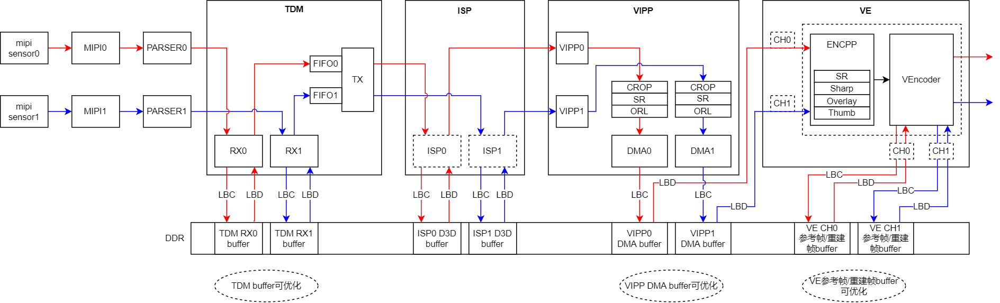
    
    该场景下，有 2 路 sensor，需使用 TDM 帧级分时复用控制器。
    
    **数据流程**：与单 MIPI sensor 场景不同的是，由于只有一个 ISP 硬件，2 路 MIPI sensor 采集的图像在送给 ISP 处理前，需要经过 TDM 帧级分时复用控制器进行处理。
    
    **TDM**：帧级分时复用控制器，用来辅助 ISP 做分时处理。其中，RX 用来接收对应 sensor 的数据，有多个 RX；TX 用来判断把哪个 RX 的数据发给 ISP 处理。
    
    该场景下编码通路中可优化的 buffer：**TDM buffer、VIPP DMA buffer 和 VE 参考帧/重建帧 buffer**。
    

V821平台上关于多媒体硬件模块使用到的内存都通过内存池来申请，所以在V821平台上查看系统使用的多媒体内存通过内存池相关节点获取。获取内存情况信息命令如下：

```
cat /sys/kernel/debug/size_pool/layout
```

打印出的信息如下：

```
size_pool memory layout(+: free, -*/#: busy, unit: 4KB):
...
pool area start:0x82000000 end:0x83400000
pool area Total:20MB Free:20480KB ~= 20MB
```

| **节点信息** | **说明** |
| --- | --- |
| pool area start | 内存池起始地址 |
| pool area end | 内存池截至位置 |
| pool area Total | 内存池总大小 |
| pool Free | 内存池空闲大小 |

了解了多媒体内存优化的背景和基本通路后，下面详细介绍具体的优化措施。

## 多媒体内存优化措施

### 常规优化措施

多媒体内存大小与编码通路上在线/离线编码、分辨率、码率、帧率、LBC压缩倍数、VBV buffer等配置有关，当多媒体内存占用大时，可 先评估这些参数是否可调节。

另外这里也描述一下系统的一些内存优化措施。

#### 系统裁剪

系统裁剪可以参考《Tina Linux 系统裁剪开发指南》操作，v821 quick\_config也提供了一份内存优化配置“memory\_optimization”，这个主要是对内核进行裁剪。

配置详情可以查看该文件：device/config/chips/v821/configs/default/quick\_config.json

**配置方法**：

sdk 执行 quick\_config，勾选上“memory\_optimization”，然后重新sourc 和lunch操作，编译sdk即可。

**确认功能生效方法**：

可以对比裁剪前后的系统 free内存。

```
root@(none):/# echo 3 > /proc/sys/vm/drop_caches
root@(none):/# cat /proc/meminfo
```

#### 内核内存压缩zram

**配置方法**：

```
内核配置make kernel_menuconfig 打开：
CONFIG_ZSMALLOC
CONFIG_ZRAM
CONFIG_ZRAM_WRITEBACK

openwrt配置 make menuconfig 打开：
CONFIG_PACKAGE_zram-swap

编译sdk并烧录固件，板子启动后，需要手动配置zram的磁盘大小，以及打开swap,
比如设置12M大小为交换空间，并打开zram：

root@(none):/# echo 12M > /sys/block/zram0/disksize
root@(none):/# mkswap /dev/zram0
root@(none):/# swapon /dev/zram0
```

如果当前使用的sdk 版本是 v821 TINA 1.3sdk，以及打上了 GeneralPatch1补丁，那么有quick\_config直接配置zram以及打开zram，无需执行上面的操作，只需执行quick\_config， 并勾选 “enable\_zram”，重新编译sdk并烧录固件即可。

**注意事项**

内存压缩技术 zram 会对不常用的内存进行压缩处理，需要使用时再解压，可以增加当前系统可用内存，减缓系统内存压力。但是这过程会增加cpu开销，另外打开zram 本身也有一定的 内存开销，所以cpu负载很高，但是内存充裕的场景，不建议打开这个功能。

**确认功能生效方法**：

板端执行 free 指令，如下，可以看到Swap total为前面设置的12M 大小，used即已经使用的空间，free就是剩余的空间。

```
root@(none):/# free
              total        used        free      shared  buff/cache   available
Mem:          33584       16528        4980           0       12076       14224
Swap:         12284         256       12028
```

#### 视频编码

##### 使用在线编码

对于小内存方案，建议优先选择在线编码。在线编码支持配置单buffer和双buffer两种模式。单buffer模式下，其他路离线编码至少配置 4个buffer，否则会因调度问题出现丢帧。双buffer模式下，其他路离线编码可最低配置3个buffer。

离线编码，则可参考特殊场景下优化措施三，优化编码内存。

##### 调整分辨率

VIPP采集的分辨率和编码输出分辨率的大小直接影响到多媒体内存的分配。在其他条件不变的情况下，分辨率越大，消耗的内存越多。

YUV（一种颜色编码方法，非压缩格式）格式图像占用的 buffer 大小计算公式为：**宽 × 高 × 1.5**。

##### 增大LBC压缩倍数

1.  ISP D3D默认配置LBC1.5X，暂不支持用户配置。
    
2.  VIPP 的 LBC 压缩支持用户配置，可配置 LBC1.0X、LBC1.5X、LBC2.0X 和 LBC2.5X。为节省内存，推荐配置 LBC2.5X。
    
    ```
    // MPP 配置接口
    VI_ATTR_S mViAttr;
    // 设置像素格式为 LBC 2.5X 压缩
    mViAttr.format.pixelformat = map_PIXEL_FORMAT_E_to_V4L2_PIX_FMT(MM_PIXEL_FORMAT_YUV_AW_LBC_2_5X);
    AW_MPI_VI_SetVippAttr(mVipp, &mViAttr);
    
    VENC_CHN_ATTR_S mVEncChnAttr;
    // 设置编码通道像素格式为 LBC 2.5X
    mVEncChnAttr.VeAttr.PixelFormat = MM_PIXEL_FORMAT_YUV_AW_LBC_2_5X;
    AW_MPI_VENC_CreateChn(mVEncChn, &mVEncChnAttr);
    
    // RT-MEDIA 配置接口
    VideoInputConfig config;
    config.pixelformat = RT_PIXEL_LBC_25X;  // 设置为 LBC 2.5X
    AWVideoInput_Configure(channelId, &config);
    ```
    
3.  VE 编码参考帧的 LBC 压缩支持用户配置，可配置 NO\_LOSSY、LBC1.5X、LBC2.0X 和 LBC2.5X。VE 编码参考帧 LBC 压缩倍数增大时，可能对编码效果有影响，需考虑取舍。推荐配置 LBC1.5X（若不配置，默认是 LBC1.5X）。
    
    ```
    // MPP 配置接口
    VENC_CHN_ATTR_S mVEncChnAttr;
    // 设置编码参考帧 LBC 模式为 1.5X
    mVEncChnAttr.VeAttr.mVeRefFrameLbcMode = VENC_REF_FRAME_LBC_MODE_1_5X;
    AW_MPI_VENC_CreateChn(mVEncChn, &mVEncChnAttr);
    
    // RT-MEDIA 配置接口
    RTeVeLbcMode rec_lbc_mode = RT_LBC_MODE_1_5X;  // 设置为 LBC 1.5X
    AWVideoInput_SetRecRefLbcMode(channelId, rec_lbc_mode);
    ```
    

##### 调整 VBV buffer 缓存时长

编码目标帧率、编码码率和 VBV buffer 缓存时长会影响 VBV buffer 大小，具体可参考以下公式。

VBV buffer 缓存时长可根据应用实际情况调整，推荐配置 4 秒，如果应用对编码输出码流有缓存，可适当缩短这个缓存时间。

```
VBV buffer阈值计算公式：vbvBufferThresh = BitRate/8/FrameRate*15

其中，
- FrameRate为编码目标帧率，单位：fps
- 8为bit与byte的转换
- 15为经验值

VBV buffer计算公式：vbvBufferSize = BitRate/8*4 + vbvBufferThresh

其中，
- BitRate为编码码率，单位：bps
- 8为bit与byte的转换
- 4为VBV buffer缓存时长，单位：s
```

设置接口（以 H264 为例）：

```c
ERRORTYPE AW_MPI_VENC_CreateChn(VENC_CHN VeChn, const VENC_CHN_ATTR_S *pAttr);

// 参数 pAttr 的 vbvBuffer 相关设置：
pAttr->VeAttr.AttrH264e.BufSize = vbvBufferSize;      // 设置 VBV buffer 大小
pAttr->VeAttr.AttrH264e.mThreshSize = vbvBufferThresh; // 设置 VBV buffer 阈值
```

#### 视频解码

配置接口：`ERRORTYPE AW_MPI_VDEC_CreateChn(VDEC_CHN VdChn, const VDEC_CHN_ATTR_S *pAttr)`

-   vbvSize: 在视频解码过程中，vbvSize是存储编码码流的buffer。视频解码驱动的默认的vbvSize会很大，所以低内存方案需自己配置 一个较小的合适的数值。配置视频解码驱动的vbvBufferSize的数值需1024对齐。
    
    ```
    pAttr->mBufSize = vbvSize;
    ```
    
-   frame number: 视频解码驱动根据视频文件的编码参考帧数量决定初始解码帧数量，用户不可配。考虑解码兼容性以及视频显示需要占 用额外的1帧，允许用户在初始解码帧数量的基础上增加更多的解码帧。有2种方式：
    
    1.  配置cedarx.conf中的配置项，mpi\_vdec组件运行时读取配置文件的解码帧数量的配置，设置给视频解码库。
        
        ```
        # picture num for modules
        pic_4list_num = 3
        ```
        
        V821平台中JPEG视频解码驱动中解码默认会申请一个解码帧，设置pic\_4list\_num可以让视频解码驱动再额外申请解码帧数。默认 pic\_4list\_num参数为3，也就是会申请4个解码帧。如只使用JPEG解码驱动解码单帧JPEG图片，那么可以设置pic\_4list\_num参数为0，这 时候就只会申请一个解码帧，减少了内存的使用。但是这个配置是对所有解码格式和解码场景都生效，所以不建议修改这里。用户可以用 方式2单独对某个解码通道设置。
        
    2.  在`ERRORTYPE AW_MPI_VDEC_CreateChn(VDEC_CHN VdChn, const VDEC_CHN_ATTR_S *pAttr);`的参数pAttr中配置。
        
        ```
        pAttr->bEnableExtraFrameNum：为TRUE表示使用用户自定义的额外帧数量，忽略cedarx.conf的配置。
        pAttr->mExtraFrameNum：额外增加的解码帧数量，最小为0。
        ```
        
        jpeg解码场景下，考虑到jpeg图片的解码只需一帧，为使用尽可能少的内存解码大分辨率的jpeg图片，用户可以使用方式2，设置额外帧 数量为0。
        

#### 音频编码

配置接口：`ERRORTYPE AW_MPI_AENC_CreateChn(AENC_CHN AeChn, const AENC_CHN_ATTR_S *pAttr)`

-   输入pcmBufferSize: 存储待编码的PCM数据，默认64KB。低内存方案可以配置更小的数值。
    
    ```
    pAttr->AeAttr.mInBufSize = pcmBufferSize;
    ```
    
-   输出的编码帧的数量OutBufCnt: 存储编码的音频帧的数量，数值越大，缓冲越多。默认16。
    
    ```
    pAttr->AeAttr.mOutBufCnt = nOutBufCnt;
    ```
    

#### 音频解码

配置接口：`ERRORTYPE AW_MPI_ADEC_CreateChn(ADEC_CHN ADecChn, const ADEC_CHN_ATTR_S *pAttr)`

-   输入absBufferSize: 存储待解码音频数据，默认896KB。低内存方案可以配置更小的数值。
    
    ```
    pAttr->mInBufSize = absBufferSize;
    ```
    
-   输出PCMBufferSize: 存储解码后的PCM音频数据，默认128KB。低内存方案可以配置更小的数值。
    
    ```
    pAttr->mOutBufSize = PCMBufferSize;
    ```
    

### 特定场景下优化措施

对于离线编码或者双mipi sensor使用场景，多媒体内存优化措施主要有以下几个：

-   措施一：离线编码时VIPP 配置2个buffer
    
    在线编码和离线编码：在线编码模式下，VIPP0 与VE 硬件通过共享buffer 传输数据，这些在linux内核驱动层已完成，无需经过MPP（多媒体中间件）传递。离线编码模式下，VIPP 与VE 之间的数据传递需经过应用层MPP。在线编码支持单buffer 和双buffer 两种模式。离线编码一般至少需配置3个buffer，否则会因还帧不及时出现丢帧。
    
    VIPP 的online mode 和offline mode：VIPP online mode 是在线模式，该模式下VIPP 无需将数据写到DDR 再回读；VIPP offline mode 是离线模式，该模式下VIPP 需将数据写到DDR 再回读，同时TDM 会消耗两个buffer，而且增大带宽。
    
    离线编码，VIPP offline mode 下，VIPP 可配置2个buffer。
    
-   措施二：TDM 配置单buffer模式
    
    利用vblank（场消隐） 错开TDM 写入buffer 的时机，可以将TDM 配置成单buffer。当vblank 大于20% 时，硬件时序上可以把控，保证buffer 不会发生覆盖。因此，TDM 配置单buffer模式，要求vblank 大于20%。由于不是所有sensor 的vblank 都能满足大于20% 的要求，所以TDM 默认是配置2个buffer。
    
    大部分sensor 可通过调整寄存器配置，保证vblank 满足大于20% 要求。这样，TDM 可配置单buffer模式，双目场景TDM每路单独使用1个BUFF。
    
-   措施三：VE 编码参考帧buffer 和重建帧buffer 复用
    
    内存优化前，参考帧与重建帧的转换所需要用到的是至少两个以上的 buffer，前一帧的参考帧在使用完之后，转换为下一帧的重建帧使用的 buffer；而前一帧的重建帧，则作为下一帧的参考帧进行使用。缺点是会占用较多的内存。
    
    内存优化后，VE 编码参考帧buffer 和重建帧buffer 可复用一个。当参考帧读取完的空间，则由重建帧进行写入，这样就可以节约到每一路编码只需要使用一个buffer。
    
    重编码：编码器编码一帧后，若不满足用户要求（I帧大小和P帧大小），根据设置调整编码参数后，需要重新将这一帧送入编码再编码一次，直到满足要求或者达到预设重编次数后停止编码这一帧，继续编码下一帧。
    
    重编码与编码内存优化冲突：开启编码内存优化后，编码过程中参考帧buffer 会被重建帧写入，参考帧数据被破坏。若开启重编码，则无法再次读取当前帧的参考帧数据。
    
    在开启重编码的情况下，VE 编码参考帧buffer 和重建帧buffer 可复用一个。
    
-   措施四：TDM 配置单buffer交替模式 此模式基于措施二方案进一步优化,达到双目场景TDM共用1个BUFF，具体原理和注意点，参考 [措施四-TDM-onebuf交替模式内存优化说明](#TDM%E2%80%94onebuf%E4%BA%A4%E6%9B%BF%E6%A8%A1%E5%BC%8F%E5%86%85%E5%AD%98%E4%BC%98%E5%8C%96%E8%AF%B4%E6%98%8E)
    

**使用前的配置**

为方便检查多媒体内存优化策略的约束条件，以及验证修改是否有效，需先打开以下配置项：

-   Tina SDK 配置

```
make menuconfig，搜索以下配置并打开
KERNEL_DEBUG_FS
KERNEL_PROC_PAGE_MONITOR
```

-   内核配置

```
make kernel_menuconfig，搜索以下配置并打开
DEBUG_FS
SUNXI_MPP
CONFIG_VIN_LOG
```

#### 措施一：离线编码时VIPP 配置2个buffer

**约束条件**：

```
只支持在VIPP offline mode 下使用；VIPP online mode 下时序不满足，不能使用。
```

**检查是否满足约束条件方法**：

```
打开配置，通过vi调试节点确认。
make menuconfig，打开 KERNEL_DEBUG_FS
make kernel_menuconfig，打开 DEBUG_FS、SUNXI_MPP 和 CONFIG_VIN_LOG

在串口输入 cat /sys/kernel/debug/mpp/vi 获取vi的调试信息。

确认对应vi设备的调试信息，比如：vipp0 对应vi0。

vi0:

bkuf => cnt: 3 size: 1384448 rest: 3, work_mode: online

其中，work_mode 为 offline，可确认当前VIPP是 offline 模式。
这里bkbuf实际上是指VIPP DMA buffer。
```

**配置方法**：

```
默认关闭，通过 make kernel_menuconfig 修改内核配置打开 CONFIG_FRAMEDONE_TWO_BUFFER 。
```

需要注意的是，这样修改后，所有的VIPP 都会配置成2个buffer。

**确认功能生效方法**：

```
打开配置，通过vi调试节点确认。
make menuconfig，打开 KERNEL_DEBUG_FS
make kernel_menuconfig，打开 DEBUG_FS、SUNXI_MPP 和 CONFIG_VIN_LOG

在串口输入 cat /sys/kernel/debug/mpp/vi 获取vi的调试信息。

确认对应vi设备的调试信息，比如：vipp0 对应vi0。

vi0:

bkuf => cnt: 2 size: 1384448 rest: 1, work_mode: offline

其中，cnt: 2 是指bkbuf个数为2，表示该功能已打开。
这里bkbuf实际上是指VIPP DMA buffer。
```

#### 措施二：TDM 配置单buffer模式

**约束条件**：

```
单mipi sensor 场景不开TDM，对其无效；仅用于双mipi sensor 场景，且需要vblank大于20%
```

**检查是否满足约束条件方法**：

```
通过以下计算公式判断是否满足vblank大于20%的条件。
计算公式：vts - height <= height * 20%
其中，vts是指帧长，height是指sensor的原图高度。
如果不满足，需要修改sensor的寄存器配置。
```

注意事项：

```
开启tdm one buffer debug时，如果vblank不满足大于20%的话，vin会有打印提示：[VIN_WARN]use tdm one buffer must ensure sensor vblank >= 20%
```

**配置方法**：

```
默认关闭，通过 make kernel_menuconfig 修改内核配置打开 CONFIG_TDM_ONE_BUFFER 。
```

**确认功能生效方法**：

```
打开配置，通过vi调试节点确认。
make menuconfig，打开 KERNEL_DEBUG_FS
make kernel_menuconfig，打开 DEBUG_FS、SUNXI_MPP 和 CONFIG_VIN_LOG

在串口输入 cat /sys/kernel/debug/mpp/vi 获取vi的调试信息。

确认对应vi设备的调试信息，比如：vipp0 对应vi0。

vi0:

tdmbuf => cnt: 1 size: 1155072, cmp_ratio: 0

其中，cnt: 1 是指tdmbuf个数为1，表示该功能已打开。
```

#### 措施三：VE 编码参考帧buffer 和重建帧buffer 复用

**约束条件**：

```
不能与超大帧重编码同时打开。
```

**检查是否满足约束条件方法**：

-   配置超大帧重编码的MPP 接口

```
VENC_SUPERFRAME_CFG_S mSuperFrmParam;
memset(&mSuperFrmParam, 0, sizeof(VENC_SUPERFRAME_CFG_S));
mSuperFrmParam.enSuperFrmMode = SUPERFRM_REENCODE;
mSuperFrmParam.MaxRencodeTimes = 1;
mSuperFrmParam.MaxP2IFrameBitsRatio = 0.33;
mSuperFrmParam.SuperIFrmBitsThr = 200*1024*8; // 200 KB
mSuperFrmParam.SuperPFrmBitsThr = mSuperFrmParam.SuperIFrmBitsThr / 3;
AW_MPI_VENC_SetSuperFrameCfg(mVEncChn, &mSuperFrmParam);

若配置冲突，MPP有提示错误打印：
fatal error! Exception Case: VeRecRefBufReduce enable and SUPERFRM_REENCODE can not be used at the same time.
```

-   配置重编码的RT-MEDIA 接口：

```
RTVencSuperFrameConfig mSuperConfig;
memset(&mSuperConfig, 0, sizeof(RTVencSuperFrameConfig));
mSuperConfig.eSuperFrameMode = RT_VENC_SUPERFRAME_REENCODE;
mSuperConfig.nMaxRencodeTimes = 1;
mSuperConfig.nMaxP2IFrameBitsRatio = 0.33;
mSuperConfig.nMaxIFrameBits  = 200*1024*8; // 200 KB
mSuperConfig.nMaxPFrameBits  = mSuperConfig.nMaxIFrameBits / 3;
AWVideoInput_SetSuperFrameParam(channel_id, &mSuperConfig);
```

`mSuperFrmParam.enSuperFrmMode = SUPERFRM_NONE 或 SUPERFRM_DISCARD;`表示不开启超大帧重编码。

**配置方法**：

-   配置编码内存优化的 MPP 接口
    
    默认关闭。当关闭超大帧重编码功能时，可通过接口 AW\_MPI\_VENC\_CreateChn 配置打开”VE 编码参考帧 buffer 和重建帧 buffer 复用”功能：
    

```c
  VENC_CHN_ATTR_S mVEncChnAttr;
  // 开启参考帧和重建帧 buffer 复用功能
  mVencChnAttr.VeAttr.mVeRecRefBufReduceEnable = 1;
  AW_MPI_VENC_CreateChn(VeChn, &mVencChnAttr);
```

-   配置编码内存优化的 RT-MEDIA 接口

```c
  VideoInputConfig config;
  // 开启参考帧和重建帧内存复用
  config.breduce_refrecmem = MAIN_CHANNEL_REDUCE_REFREC_MEM;
  AWVideoInput_Configure(channelId, &config);
```

**确认功能生效方法**：

```
打开配置，通过ve_base调试节点确认。
make menuconfig，打开 KERNEL_DEBUG_FS
make kernel_menuconfig，打开 DEBUG_FS、SUNXI_MPP

在串口输入 cat /sys/kernel/debug/mpp/ve_base 获取ve的调试信息。

确认对应ve通道的调试信息，比如：vechn0 对应Ch[0]。

**********Ch[0] H264 F0 BaseInfo Start**********

Ref(Byte): LBC1.5X, Reduce:1, Lbc:61440+1314816, Qsub:6144+118784

**********Ch[0] H264 F0 BaseInfo End**********

其中，Reduce节点信息代表是否开启参考帧buffer与重建帧buffer复用功能，0代表未开启，1代表开启。
```

**注意事项说明**

开启参考帧和重建帧buffer复用之后，如果编码过程出现overwrite，参考帧已经损坏，则不能再编P帧，编码会强制出I帧。

原因为重建帧写了buffer一部分，被异常中断丢帧，相当于一个buffer里面夹杂两帧的内容，如果继续使用它做参考，编码P帧，会出现画面断层。

#### 措施四：TDM 配置单buffer交替模式

**约束条件**：

```
单mipi sensor 场景不开TDM，对其无效；仅用于双mipi sensor 场景，且需要vblank大于50%
```

**检查是否满足约束条件方法**：

```
通过以下计算公式判断是否满足vblank大于50%的条件。
计算公式：vts - height <= height * 50%
其中，vts是指帧长，height是指sensor的原图高度。
如果不满足，需要修改sensor的寄存器配置。
```

注意事项：

```
开启tdm one buffer debug时，如果vblank不满足大于50%的话，vin会有打印提示：[VIN_WARN]use tdm one buffer must ensure sensor vblank >= 50%
```

**确认功能生效方法**：

具体原理和注意点，参考 [措施四-TDM-onebuf交替模式内存优化说明](#TDM%E2%80%94onebuf%E4%BA%A4%E6%9B%BF%E6%A8%A1%E5%BC%8F%E5%86%85%E5%AD%98%E4%BC%98%E5%8C%96%E8%AF%B4%E6%98%8E)

以下提供典型场景的实测优化数据供参考。

## 典型场景多媒体内存优化数据

### 单mipi sensor 场景

#### 场景描述

```
规格：
分辨率：1280x720
像素格式：lbc2.5x
帧率：20fps
码率：1Mbps
编码参考帧压缩：lbc1.5x
编码格式：h.265
编码方式：离线编码
VI buffer个数：3
VBV缓存时间：4s
```

#### 可采用的优化措施

```
措施三：VE 编码参考帧buffer 和重建帧buffer 复用

措施一、二不适用说明：
单mipi sensor 场景下，VIPP 的work mode 配置的是online mode，故措施一不适用。
单mipi sensor 场景下，不使用TDM 模块，故措施二。
```

#### 优化前后多媒体内存对比

| **优化措施** | **内存优化收益** |
| --- | --- |
| VE编码参考帧buffer和重建帧buffer复用 | 0.54MB |

测试前：

系统内存池空闲大小：20.480MB

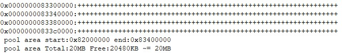

测试时：

##### 不开多媒体内存优化措施

系统内存占用：8.288MB = 20.480MB - 12.192MB

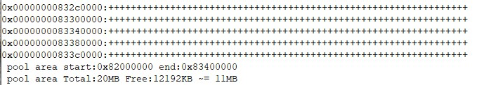

##### 采用多媒体内存优化措施三

-   措施三：VE 编码参考帧buffer 和重建帧buffer 复用

多媒体内存占用：7.748MB = 20.480MB - 12.732MB

措施三内存收益：0.54MB = 12.732MB - 12.192MB

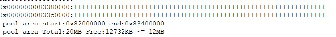

### 双mipi sensor 场景

#### 场景描述

```
Sensor0 这路规格：
分辨率：1280x720
像素格式：lbc2.5x
帧率：20fps
码率：1Mbps
编码参考帧压缩：lbc1.5x
TDM压缩倍数：3.5x
D3D压缩倍数：1.5x
编码格式：h.264
编码方式：离线编码
VI buffer个数：3（内存优化措施一会有调整）
VBV缓存时间：4s

Sensor1 这路规格：
分辨率：1280x720
像素格式：lbc2.5x
帧率：20fps
码率：1Mbps
编码参考帧压缩：lbc1.5x
TDM压缩倍数：1x
D3D压缩倍数：1.5x
编码格式：h.264
编码方式：离线编码
VI buffer个数：3（内存优化措施一会有调整）
VBV缓存时间：4s
```

#### 可采用的优化措施

```
措施一：离线编码时VIPP 配置2个buffer
措施二：TDM 配置单buffer模式
措施三：VE 编码参考帧buffer 和重建帧buffer 复用
措施四：TDM 配置单buffer交替模式
```

#### 优化前后多媒体内存对比

| **优化措施** | **内存优化收益** |
| --- | --- |
| 离线编码时VIPP 配置2个buffer | 0.564MB |
| TDM 配置单buffer模式 | 2.184MB |
| VE 编码参考帧buffer 和重建帧buffer复用 | 1.152MB |
| TDM 配置单buffer交替模式 | (TDM 配置单buffer模式/2)MB |

**ramparser 内存工具获取的内存信息**

测试前：

系统内存池空闲大小：25.208MB

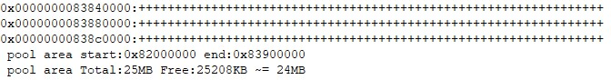

测试时：

##### 不开多媒体内存优化措施

多媒体内存占用：16.348MB = 25.208MB - 8.860MB

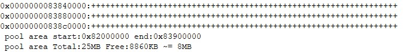

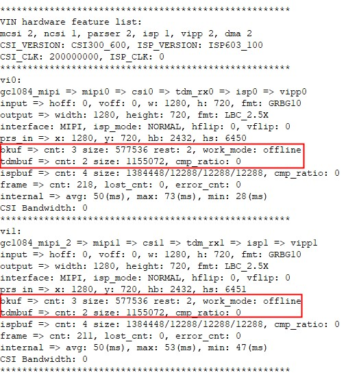

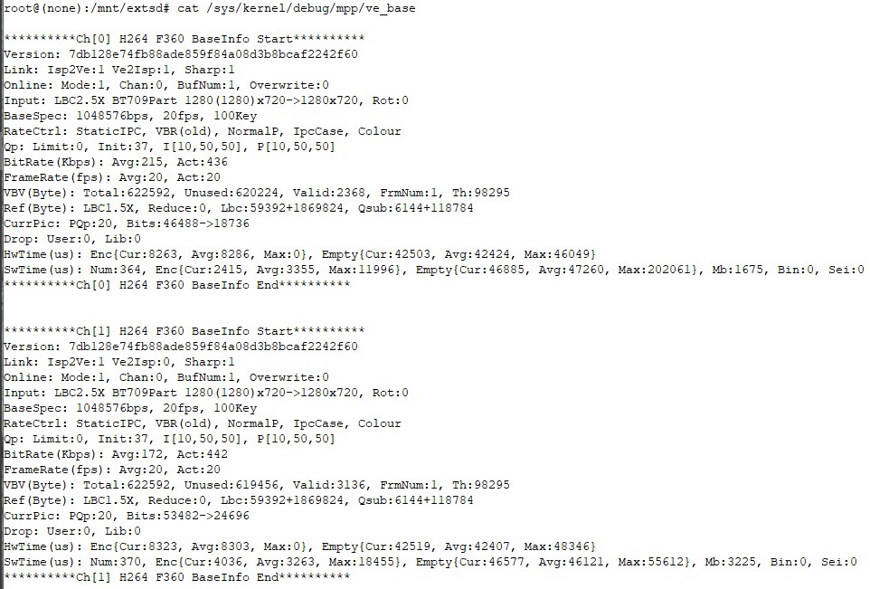

##### 采用多媒体内存优化措施一

-   措施一：离线编码时VIPP 配置2个buffer

多媒体内存占用：15.784MB = 25.208MB - 9.424MB

措施一内存收益：0.564MB = 16.348MB - 15.784MB

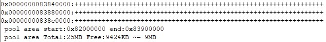

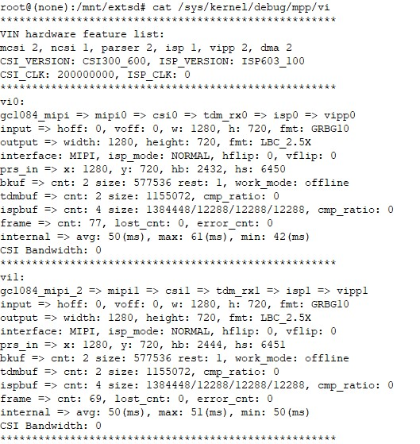

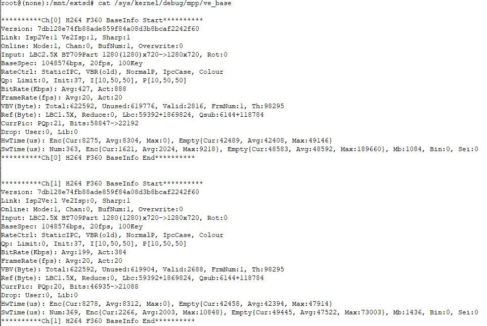

##### 采用多媒体内存优化措施一和措施二

-   措施一：离线编码时VIPP 配置2个buffer
-   措施二：TDM 配置单buffer模式

多媒体内存占用：13.6MB = 25.208MB - 11.608MB

措施二内存收益：2.184MB = 15.784MB - 13.6M

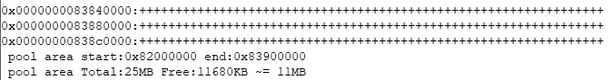

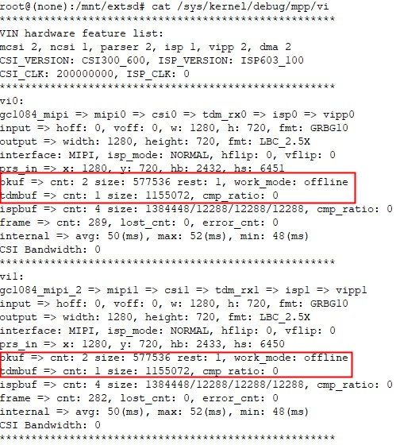

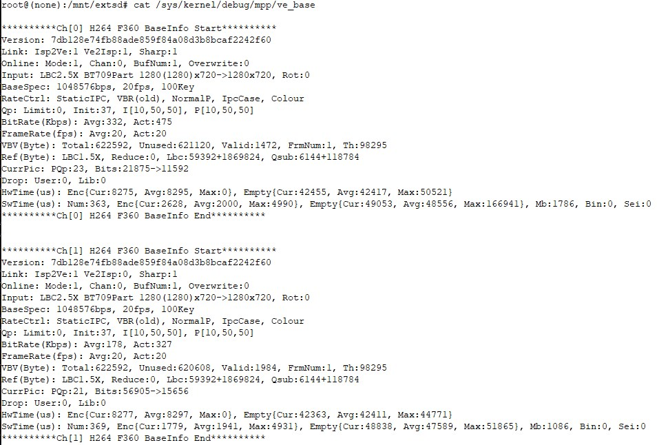

##### 采用多媒体内存优化措施一、措施二和措施三

-   措施一：离线编码时VIPP 配置2个buffer
-   措施二：TDM 配置单buffer模式
-   措施三：VE 编码参考帧buffer 和重建帧buffer 复用

多媒体内存占用：12.448MB = 25.208MB - 12.760MB

措施三内存收益：1.152MB = 13.6MB - 12.448MB

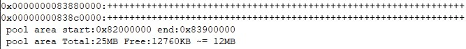

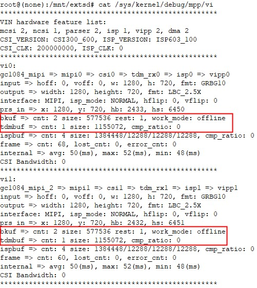

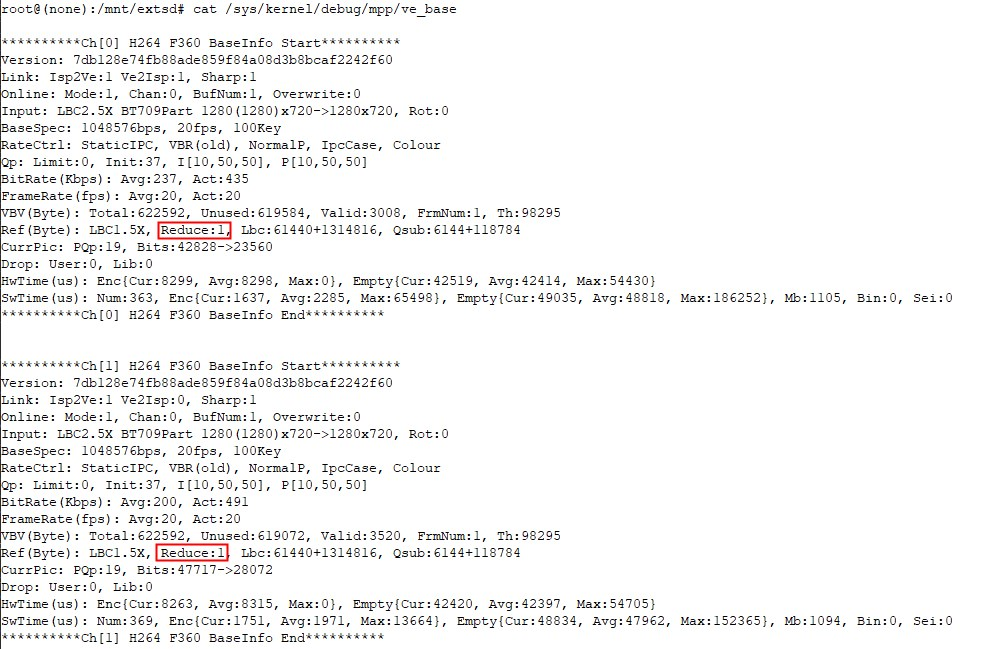

## 附录

### 单mipi sensor 场景测试demo和配置

测试demo：sample\_OnlineVenc

路径：

```
tina\external\eyesee-mpp\middleware\sun8iw21\sample\sample_OnlineVenc\
```

配置和编译方法：

```
配置
make menuconfig

Location: 
-> Allwinner
	-> eyesee-mpp
		-> eyesee-mpp-middleware
			-> select mpp sample (mpp_sample [=y])
			[*]     mpp sample OnlineVenc

编译
cleanmpp && mkmpp
```

#### 单mipi测试配置一

配置文件：sample\_OnlineVenc.conf，需参考单mipi sensor 测试场景的规格参数修改，且只保留1路编码。

```
########### paramter (ref to tulip_cedarx.conf)############
[parameter]

main_isp = 0
main_vipp = 0
main_src_width = 1280
main_src_height = 720
main_pixel_format = "aw_lbc_2_5x"      #nv21,nv12,yu12,yv12;aw_lbc_2_5x,aw_lbc_2_0x,aw_lbc_1_5x,aw_lbc_1_0x
main_wdr_enable = 0
main_vi_buf_num = 3
main_src_frame_rate = 20               #fps
main_viChn = 0                         #-1:disale main stream
main_venc_chn = 0                      #-1:disale main stream
main_encode_type = "H.264"
main_encode_width = 1280               #1280x720->720p, 1920x1080->1080p, 2304x1296->3M, 2560×1440->2k, 3840x2160->4k, 7680x4320->8k
main_encode_height = 720
main_encode_frame_rate = 20            #fps
main_encode_bitrate = 1048576          #5M:5242880, 2M:2097152, 1.5M:1572864, 1M:1048576
main_file_path = "/mnt/extsd/mainStream.raw"    #if no path is specified, it will not be saved.
main_online_en = 0
main_online_share_buf_num = 2
main_encpp_enable = 1
main_vi_sync_ctrl_enable = 0

sub_isp = 0
sub_vipp = 4
sub_src_width = 640
sub_src_height = 360
sub_pixel_format = "aw_lbc_2_0x"       #nv21,nv12,yu12,yv12;aw_lbc_2_5x,aw_lbc_2_0x,aw_lbc_1_5x,aw_lbc_1_0x
sub_wdr_enable = 0
sub_vi_buf_num = 3
sub_src_frame_rate = 20                #fps

sub_vipp_crop_en = 0
sub_vipp_crop_rect_x = 0
sub_vipp_crop_rect_y = 0
sub_vipp_crop_rect_w = 1888
sub_vipp_crop_rect_h = 1072

sub_viChn = -1                          #-1:disale sub stream
sub_venc_chn = -1                       #-1:disale sub stream
sub_encode_type = "H.264"
sub_encode_width = 640                 #1280x720->720p, 1920x1080->1080p, 2560×1440->2k, 3840x2160->4k, 7680x4320->8k
sub_encode_height = 360
sub_encode_frame_rate = 20             #fps
sub_encode_bitrate = 256000            #5M:5242880, 2M:2097152, 1M:1048576, 0.5M:512000
sub_file_path = "/mnt/extsd/subStream.raw"      #if no path is specified, it will not be saved.
sub_encpp_enable = 1

sub_lapse_viChn = -1                    #-1:disale sub lapse stream
sub_lapse_venc_chn = -1                 #-1:disale sub lapse stream
sub_lapse_encode_type = "H.264"
sub_lapse_encode_width = 640           #1280x720->720p, 1920x1080->1080p, 2560×1440->2k, 3840x2160->4k, 7680x4320->8k
sub_lapse_encode_height = 360
sub_lapse_encode_frame_rate = 20       #fps
sub_lapse_encode_bitrate = 256000      #5M:5242880, 2M:2097152, 1M:1048576, 0.5M:512000
sub_lapse_file_path = "/mnt/extsd/subLapseStream.raw"  #if no path is specified, it will not be saved.
sub_lapse_time = 1000000               #unit:us
sub_lapse_encpp_enable = 1

isp_ve_linkage_enable = 1
isp_ve_linkage_stream_channel = 0      #0:main stream, 1:sub stream, 2:sub lapse stream

wb_yuv_enable = 0
wb_yuv_buf_num = 1
wb_yuv_start_index = 0
wb_yuv_total_cnt = 10
wb_yuv_stream_channel = 0              #0:main stream, 1:sub stream, 2:sub lapse stream
wb_yuv_file_path = "/mnt/extsd/wb_yuv.yuv"

test_duration = 60                     #unit:s
```

#### 单mipi测试配置二

```
########### paramter (ref to tulip_cedarx.conf)############
[parameter]

main_isp = 0
main_vipp = 0
main_src_width = 1280
main_src_height = 720
main_pixel_format = "aw_lbc_2_5x"      #nv21,nv12,yu12,yv12;aw_lbc_2_5x,aw_lbc_2_0x,aw_lbc_1_5x,aw_lbc_1_0x
main_wdr_enable = 1
main_vi_buf_num = 3
main_src_frame_rate = 20               #fps
main_viChn = 0                         #-1:disale main stream
main_venc_chn = 0                      #-1:disale main stream
main_encode_type = "H.264"
main_encode_width = 1280               #1280x720->720p, 1920x1080->1080p, 2304x1296->3M, 2560×1440->2k, 3840x2160->4k, 7680x4320->8k
main_encode_height = 720
main_encode_frame_rate = 20            #fps
main_encode_bitrate = 1048576          #5M:5242880, 2M:2097152, 1.5M:1572864, 1M:1048576
main_file_path = "/mnt/extsd/mainStream.raw"    #if no path is specified, it will not be saved.
main_online_en = 0
main_online_share_buf_num = 2
main_encpp_enable = 1
main_vi_sync_ctrl_enable = 0

sub_isp = 0
sub_vipp = 4
sub_src_width = 640
sub_src_height = 360
sub_pixel_format = "aw_lbc_2_0x"       #nv21,nv12,yu12,yv12;aw_lbc_2_5x,aw_lbc_2_0x,aw_lbc_1_5x,aw_lbc_1_0x
sub_wdr_enable = 0
sub_vi_buf_num = 3
sub_src_frame_rate = 20                #fps

sub_vipp_crop_en = 0
sub_vipp_crop_rect_x = 0
sub_vipp_crop_rect_y = 0
sub_vipp_crop_rect_w = 1888
sub_vipp_crop_rect_h = 1072

sub_viChn = -1                          #-1:disale sub stream
sub_venc_chn = -1                       #-1:disale sub stream
sub_encode_type = "H.264"
sub_encode_width = 640                 #1280x720->720p, 1920x1080->1080p, 2560×1440->2k, 3840x2160->4k, 7680x4320->8k
sub_encode_height = 360
sub_encode_frame_rate = 20             #fps
sub_encode_bitrate = 256000            #5M:5242880, 2M:2097152, 1M:1048576, 0.5M:512000
sub_file_path = "/mnt/extsd/subStream.raw"      #if no path is specified, it will not be saved.
sub_encpp_enable = 1

sub_lapse_viChn = -1                    #-1:disale sub lapse stream
sub_lapse_venc_chn = -1                 #-1:disale sub lapse stream
sub_lapse_encode_type = "H.264"
sub_lapse_encode_width = 640           #1280x720->720p, 1920x1080->1080p, 2560×1440->2k, 3840x2160->4k, 7680x4320->8k
sub_lapse_encode_height = 360
sub_lapse_encode_frame_rate = 20       #fps
sub_lapse_encode_bitrate = 256000      #5M:5242880, 2M:2097152, 1M:1048576, 0.5M:512000
sub_lapse_file_path = "/mnt/extsd/subLapseStream.raw"  #if no path is specified, it will not be saved.
sub_lapse_time = 1000000               #unit:us
sub_lapse_encpp_enable = 1

isp_ve_linkage_enable = 1
isp_ve_linkage_stream_channel = 0      #0:main stream, 1:sub stream, 2:sub lapse stream

wb_yuv_enable = 0
wb_yuv_buf_num = 1
wb_yuv_start_index = 0
wb_yuv_total_cnt = 10
wb_yuv_stream_channel = 0              #0:main stream, 1:sub stream, 2:sub lapse stream
wb_yuv_file_path = "/mnt/extsd/wb_yuv.yuv"

test_duration = 60                     #unit:s
```

### 双mipi sensor 场景测试demo和配置

测试demo：sample\_OnlineVenc

路径、配置和编译方法，请参考单mipi sensor 场景中的描述。

#### 双mipi测试配置一

配置文件：sample\_OnlineVenc.conf，需参考双mipi sensor 测试场景的规格参数修改，且只保留2路编码。

```
########### paramter (ref to tulip_cedarx.conf)############
[parameter]

main_isp = 0
main_vipp = 0
main_src_width = 1280
main_src_height = 720
main_pixel_format = "aw_lbc_2_5x"      #nv21,nv12,yu12,yv12;aw_lbc_2_5x,aw_lbc_2_0x,aw_lbc_1_5x,aw_lbc_1_0x
main_wdr_enable = 0
main_vi_buf_num = 3
main_src_frame_rate = 20               #fps
main_viChn = 0                         #-1:disale main stream
main_venc_chn = 0                      #-1:disale main stream
main_encode_type = "H.264"
main_encode_width = 1280               #1280x720->720p, 1920x1080->1080p, 2304x1296->3M, 2560×1440->2k, 3840x2160->4k, 7680x4320->8k
main_encode_height = 720
main_encode_frame_rate = 20            #fps
main_encode_bitrate = 1048576          #5M:5242880, 2M:2097152, 1.5M:1572864, 1M:1048576
main_file_path = "/mnt/extsd/mainStream.raw"    #if no path is specified, it will not be saved.
main_online_en = 0
main_online_share_buf_num = 2
main_encpp_enable = 1
main_vi_sync_ctrl_enable = 0

sub_isp = 1
sub_vipp = 1
sub_src_width = 1280
sub_src_height = 720
sub_pixel_format = "aw_lbc_2_5x"       #nv21,nv12,yu12,yv12;aw_lbc_2_5x,aw_lbc_2_0x,aw_lbc_1_5x,aw_lbc_1_0x
sub_wdr_enable = 0
sub_vi_buf_num = 3
sub_src_frame_rate = 20                #fps

sub_vipp_crop_en = 0
sub_vipp_crop_rect_x = 0
sub_vipp_crop_rect_y = 0
sub_vipp_crop_rect_w = 1888
sub_vipp_crop_rect_h = 1072

sub_viChn = 0                          #-1:disale sub stream
sub_venc_chn = 1                       #-1:disale sub stream
sub_encode_type = "H.264"
sub_encode_width = 1280                 #1280x720->720p, 1920x1080->1080p, 2560×1440->2k, 3840x2160->4k, 7680x4320->8k
sub_encode_height = 720
sub_encode_frame_rate = 20             #fps
sub_encode_bitrate = 1048576           #5M:5242880, 2M:2097152, 1M:1048576, 0.5M:512000
sub_file_path = "/mnt/extsd/subStream.raw"      #if no path is specified, it will not be saved.
sub_encpp_enable = 1

sub_lapse_viChn = -1                    #-1:disale sub lapse stream
sub_lapse_venc_chn = -1                 #-1:disale sub lapse stream
sub_lapse_encode_type = "H.264"
sub_lapse_encode_width = 640           #1280x720->720p, 1920x1080->1080p, 2560×1440->2k, 3840x2160->4k, 7680x4320->8k
sub_lapse_encode_height = 360
sub_lapse_encode_frame_rate = 20       #fps
sub_lapse_encode_bitrate = 256000      #5M:5242880, 2M:2097152, 1M:1048576, 0.5M:512000
sub_lapse_file_path = "/mnt/extsd/subLapseStream.raw"  #if no path is specified, it will not be saved.
sub_lapse_time = 1000000               #unit:us
sub_lapse_encpp_enable = 1

isp_ve_linkage_enable = 1
isp_ve_linkage_stream_channel = 0      #0:main stream, 1:sub stream, 2:sub lapse stream

wb_yuv_enable = 0
wb_yuv_buf_num = 1
wb_yuv_start_index = 0
wb_yuv_total_cnt = 10
wb_yuv_stream_channel = 0              #0:main stream, 1:sub stream, 2:sub lapse stream
wb_yuv_file_path = "/mnt/extsd/wb_yuv.yuv"

test_duration = 60                     #unit:s
```

### 
措施四-TDM—onebuf交替模式内存优化说明

##### TDM onebuf交替模式内存优化方案原理：

TDM onebuf交替模式使用主控的CSI\_SM\_VS 这个管脚的硬件功能，在接收完sensor0数据 后，马上csi硬件发送脉冲信号给sensor1 ，让sensor1出图，即双目间隔输出数据帧，最终达到节省一个TdmBuf内存， 原理图如下图所示：

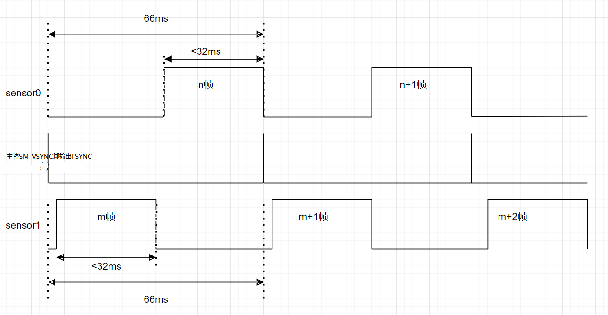

##### 硬件连接方式

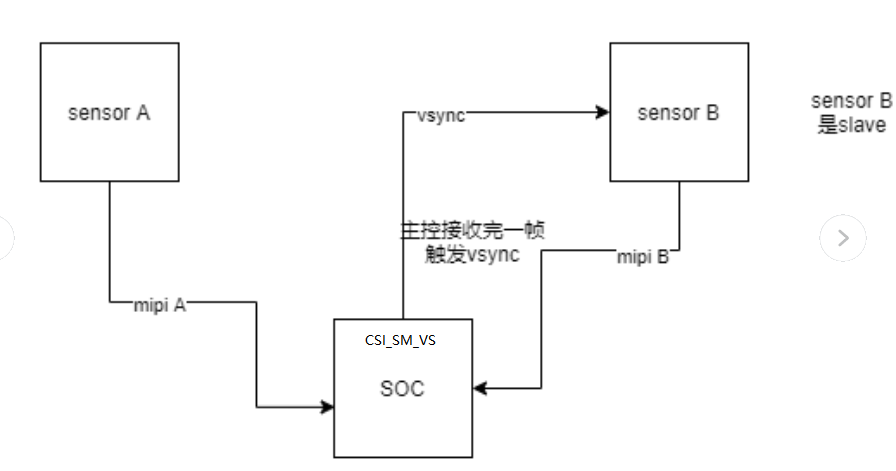

##### 方案介绍

这里介绍（SENSOR0 为主模式，SENSOR1 为从模式）

1.  确认 SENSOR 是否满足 VBLANK 配置

```
通过以下计算公式判断是否满足vblank大于50%的条件。
计算公式：vts - height <= height * 50%
其中，vts是指帧长，height是指sensor的原图高度。
如果不满足，需要修改sensor的寄存器配置。
```

2.  确认主控的CSI\_SM\_VS 这个管脚的硬件功能（V821在PA0），CSI\_SM\_VS引脚连接到sensor1的vs引脚上，soc通过CSI\_SM\_VS口输出给到sensor1(从模式)的vsync口。
3.  主控通过输出fsync信号后，一般需要delay一百us后，从模式sensor才会输出帧数据。
4.  假设两个sensor输出为15pfs配置（GC2083只能到12.5FPS，SC2336能到15FPS），一帧时间长为66ms，那么需要sensor输出有效数据小于32ms，vblank大于34ms，即需要预留2ms裕量（理论上，极限的话1ms也行，但是需要老化实验），原因是fysnc输出到sensor1被触发输出需要一定时间（如下图所示：紫色为master模式sensor的data信号，蓝色为slave模式sensor输出的data信号，蓝色为fsync输出脉冲信号，经过测试gc2083的时间为0.58ms，），在sensor1输出结束到sensor0再输出也需要留有一点裕量，所以总体看有效数据与vblank时间差为2ms会比较稳定。

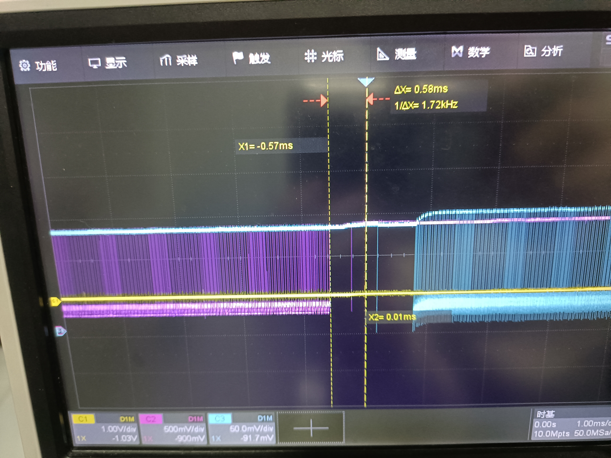

注意：

-   由于是共用的tdm buffer，谁先开启谁先申请buffer，master需要先开启，所以共用的tdm buffer是master通路的tdm\_rx申请的buffer。
-   双目分辨率不一样时：需要以大分辨率来申请buffer，这就意味着大分辨sensor的通路需要先开启，也就是说sensor分辨率大的需要配置为master模式。
-   这里的“大分辨率”或“小分辨率”实际是指内存占用情况，大分辨应工作在主模式下
-   rx0是指V821/V85X上的mipiA，方案本身对于mipiA/mipiB没有强制要求哪个一定要是主模式/从模式。

**硬件可以采取方案：**

-   两个sensor vsync信号都可做预留引出，都接到(CSI\_SM\_VS)上，软件可以绑定CSI\_SM\_VS工作在主模式哪个MIPI上进行触发。这样可以更灵活地进行后续主从模式选择

##### 新增模组交替模式配置方法

**注：开启交替模式配置前请确保 SENSOR 已经正常点亮和接收**

**支持交替模式模组型号：**

• GC2083 1lane 1920\*1080@12.5,blank60%

• SC2336 1lane 1920\*1080@15,blank52%

**快速开启交替模式配置（GC2083,SC2336模组已经支持）：**

```
快速开启交替模式配置（GC2083,SC2336已经支持）：
1.SDK目录执行：quick_config
2.选择10：双目GC2083或选择11：SC2336
```

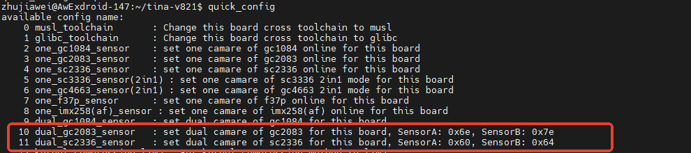

**常规开启交替模式配置（新 SENSOR 接入）：**

常规开启交替模式配置：

1.  开启主控的 CSI\_SM\_VS 复用功能，将板级 board.dts 做以下修改：

```
  CSI时钟调整：csi_top = <240000000>;

  pio节点加入
  csi_sm_vs_pin_default: csi_sm_vs@0 {
		pins = "PA0";
		function = "csi"; 
		allwinner,drive = <0>;
		bias-pull-up;
	};

  csi_sm_vs_pin_sleep: csi_sm_vs@1 {
		pins = "PA0";
		function = "io_disabled"; 
		allwinner,drive = <0>;
		bias-pull-up;
	};

  vind0节点加入（mipi0做主模式的时候）
  csi0: csi@45820000 {
		  pinctrl-names = "csi_sm-default","csi_sm-sleep";
		  pinctrl-0 = <&csi_sm_vs_pin_default>;
		  pinctrl-1 = <&csi_sm_vs_pin_sleep>;
	  };

  vind0节点加入（mipi1做主模式的时候）
  csi1: csi@45821000 {
		  pinctrl-names = "default","sleep","csi_sm-default","csi_sm-sleep";
		  pinctrl-0 = <>;
		  pinctrl-1 = <>;
      pinctrl-2 = <&csi_sm_vs_pin_default>;
		  pinctrl-3 = <&csi_sm_vs_pin_sleep>;
		  status = "okay";
	  };
```

2.  修改内核配置开启 TDM 交替选项

```
make kernel_menuconfig 
打开[tdm use one buffer mode]和[tdm use one buffer mode with two tdm_rx run]。
```

3.  移植 SENSOR 支持交替模式驱动（GC2083、SC2336 驱动已经支持交替模式，可以参考模板移植）
    
    3.1 在 SENSOR 驱动追加主从初始化数组（可以询问 SENSOR 厂获取），如下图 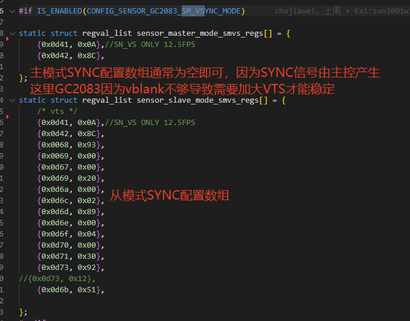
    
    3.2 在 SENSOR 驱动添加 sensor\_win\_size 配置，如下图
    
    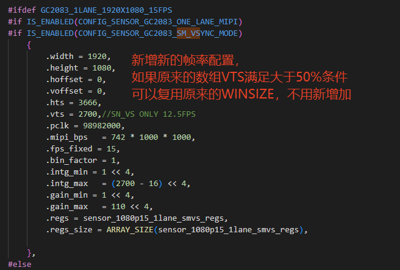
    
    3.3 在 SENSOR 驱动 sensor\_reg\_init 函数追加主从配置如下图 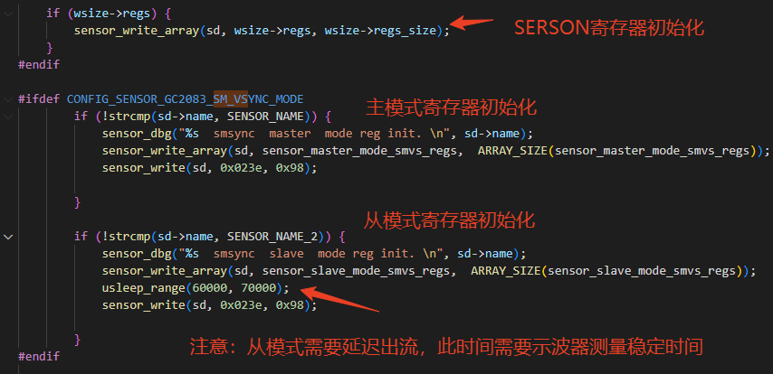
    
4.  应用设置 AW\_MPI\_VI\_SetSyncCtrl 接口进行绑定 （可以参考 sample\_smartIPC\_demo，开启 main\_vi\_sync\_ctrl\_enable，默认绑定 mipi 进行 0 触发 SYNC 信号）：
    

```
注意：应用设 AW_MPI_VI_EnableVipp 设置后再调 AW_MPI_VI_SetSyncCtrl 接口进行 sm_vs 引脚绑定输出 fsync 脉冲信号，如下所示：
        AW_MPI_VI_EnableVipp(pContext->mMainStream.mVipp);
        struct csi_sync_ctrl csi_sync_cfg;
        CLEAR(csi_sync_cfg);
        csi_sync_cfg.type = 0;
        csi_sync_cfg.prs_sync_en = 1;
        csi_sync_cfg.prs_sync_scr_sel = 0;
        csi_sync_cfg.prs_sync_bench_sel = 1;
        csi_sync_cfg.prs_sync_input_vsync_en = 1;
        csi_sync_cfg.prs_sync_singal_via_by = 0;
        csi_sync_cfg.prs_sync_singal_scr_sel = 1;
        csi_sync_cfg.prs_sync_pulse_cfg = 25;
        csi_sync_cfg.prs_sync_dist = 1;
        csi_sync_cfg.prs_sync_wait_n = 0x3600; // 0x22C4:SC2336 0.30ms 0x3600:gc2083 0.5ms
        csi_sync_cfg.prs_sync_wait_m = 0x3600; // 0x22C4:SC2336 0.30ms 0x3600:gc2083 0.5ms
        AW_MPI_VI_SetSyncCtrl(pContext->mMainStream.mVipp, &csi_sync_cfg);//绑定在主 sensor

参数说明(只关注下面配置)：
- type：模式选择，fsync模式配置为0。
- prs_sync_en：fsync开关，开配置为1，关闭配置为0。
- prs_sync_dist：两次信号之间的间隔，固定配置为1。
- prs_sync_wait_n（重点配置项，需要用户留意）：配置一帧结束后过来多久输出 fsync 信号，单位为 T（27M），即 1000000/(27x1000x1000)=0.3，我们取 0x100 为 10us，即假如需要延迟 0.3ms 输出 fsync，即 0.4ms=300us，10us=0x100，也就是 40*0x100=0x22C4。
- prs_sync_wait_m（重点配置项，需要用户留意）：该模式这两个参数配置一致即可。
```

##### 参考应用sample\_smartIPC\_demo(支持交替模式) 配置参考:

```
运行测试
./sample_smartIPC_demo -path sample_smartIPC_demo-dual-rtsp.conf 

sample_smartIPC_demo相关配置修改:
main_enable = 1                       #0:disable main stream, 1:enable main stream
main_rtsp_id = -1                  #-1:disable main rtsp
main_vipp = 0
main_src_width = 1920
main_src_height = 1080
main_pixel_format = "aw_lbc_2_5x"      #nv21,nv12,yu12,yv12;aw_lbc_2_5x,aw_lbc_2_0x,aw_lbc_1_5x,aw_lbc_1_0x
main_vi_buf_num = 3
main_src_frame_rate = 15               #fps
main_viChn = 0
main_venc_chn = 0
main_encode_type = "H.264"
main_encode_width = 1920               #1280x720->720p, 1920x1080->1080p, 2304x1296->3M, 2560..1440->2k, 3840x2160->4k, 7680x4320->8k
main_encode_height = 1080
main_encode_frame_rate = 15            #fps
main_online_en = 1
main_online_share_buf_num = 1
main_vi_sync_ctrl_enable = 1           #0:disable bind sm_sync(default), 1:enable bind sm_sync

sub_enable = 1                         #0:disable sub stream, 1:enable sub stream
sub_vipp = 1
sub_src_width = 1920
sub_src_height = 1080
sub_pixel_format = "aw_lbc_2_5x"       #nv21,nv12,yu12,yv12;aw_lbc_2_5x,aw_lbc_2_0x,aw_lbc_1_5x,aw_lbc_1_0x
sub_vi_buf_num = 3
sub_src_frame_rate = 15                #fps
sub_viChn = 0
sub_venc_chn = 1
sub_encode_type = "H.264"
sub_encode_width = 1920                #1280x720->720p, 1920x1080->1080p, 2304x1296->3M, 2560..1440->2k, 3840x2160->4k, 7680x4320->8k
sub_encode_height = 1080
sub_encode_frame_rate = 15             #fps
sub_online_en = 1
sub_online_share_buf_num = 1

sub_2nd_enable = 0
sub_2nd_take_picture = 0
sub_2nd_pdet_enable = 0
main_2nd_pdet_enable = 0
main_2nd_take_picture = 0
main_2nd_enable = 0
```

##### 调试讲解

1.  不开启交替模式。先确认双目工作在主模式下能正常接收图像
2.  开启交替模式，确认 SENSOR 时序能满足交替输出
3.  测试交替模式帧间隔  
    使用示波器测出一帧有效数据段和vblank数据段，，如下入图所示，紫色为master模式sensor的data信号，蓝色为slave模式sensor输出的data信号：

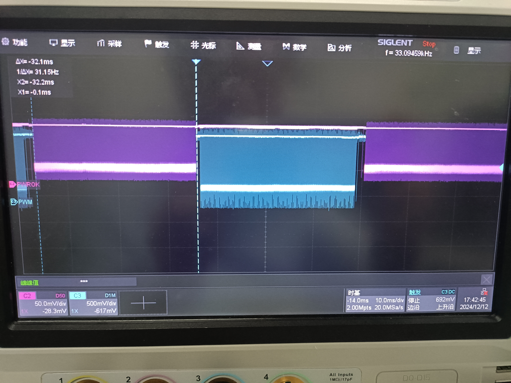

可以看出帧间隔大概是32.1ms

4.  测试fsync输出时机  
    可以从示波器上看prs\_sync\_wait\_n和prs\_sync\_wait\_m需要配置多少，如下图所示，紫色为master模式sensor的黄色为fsync输出脉冲信号：

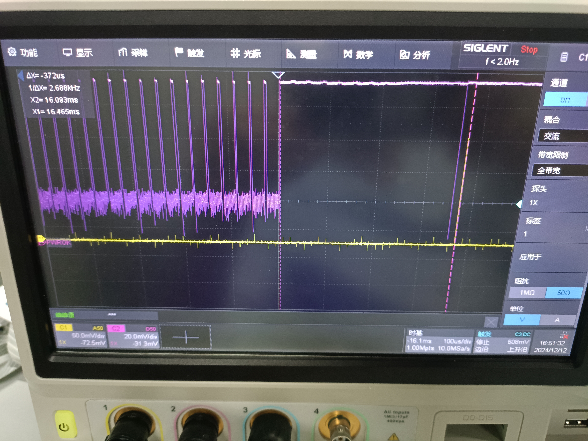

说明：

-   由于 vblank 相对有效数据比较短，所以我们设置 sensor1 的有效数据控制在 sensor0 的 vblank 前面一点，取 0.4ms，故我们配置 prs\_sync\_wait\_n 和 prs\_sync\_wait\_m 为 0.3ms，即 0x22c0。但是实际上 fsync 输出脉冲信号到 slave 输出帧有延时，所以示波器测出来是 0.3ms。

5.  测试 slave 模式 sensor 稳定时间 由于 master 模式先开，输出 fsync 脉冲控制 slave 模式 sensor 输出数据，但是往往 slave 首帧不受 fsync 控制，所以在 sensor 初始化寄存器后往往需要 delay 一段时间，这段时间可以从示波器上抓出来，如下图所示，需要 delay 150ms 以上，可以适当取大一点，例如 delay 160ms：
    
6.  查看 tdm 单 buffer 生效方式 (1) 执行 make kernel\_menuconfig 后打开 CONFIG\_VIN\_LOG 即打开 vin debug 开关。 (2) 接着再执行 cat /sys/kernel/debug/mpp/vi，打开 vi 节点信息，从 “tdmbuf” 可以看出该 tdm\_rx 有无申请 buffer，如下所示：
    

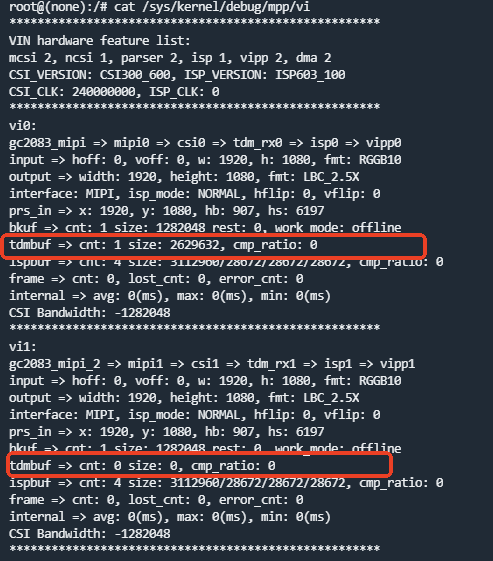

**其中，gc2083\_mipi 为 master 模式 sensor，gc2083\_mipi\_2 为 salve 模式 sensor**

**内存收益：节省2.5MB**

• gc2083\_mipi：master 模式，10bit，1lane tdm\_rx0 申请了一个buffer； • gc2083\_mipi\_2: salve 模式，10bit，1lane tdm\_rx1 没申请buffer；

### 
措施五-TDM RX buffer 与 BK buffer 复用说明

**约束条件**：

```
1. 适用双目 MIPI 上下拼接和单目 2IN1 拼接场景

2. 不同的场景 VB 约束条件不一样
(根据场景)
双目2M-上下拼接 ：VB大于>=30%,VE 384MHZ，且在上半幅帧时序启动在线编码， BK 写YUV速度比VE编码快（ISP200MHZ） 
双目插值3M-上下拼接：VB大于>=40%,VE 512MHZ ，且在上半幅帧时序启动在线编码， BK 写YUV速度比VE编码快（ISP200MHZ）
单目4M-拆分左右拼接： VB大于>=50%,VE 512MHZ ，且在上半幅帧时序启动在线编码， (ISP300MHZ)

3. 开启 “TDM 配置单 buffer 模式” 功能

4. VIPP 必须配置在线编码单 buffer 模式

5.内存收益：例如双目200W 上下拼接，内存能节省3.96MB
  非拼接只能适用单目4M，双目不支持
```

**检查是否满足约束条件方法**：

```
通过以下计算公式判断是否满足vblank大于对应VB的条件。
计算公式：vts - height >= height * VB
其中，vts是指帧长，height是指sensor的原图高度。
如果不满足，需要修改sensor的寄存器配置。
```

双目上下拼接场景时序要求（双目2M-上下拼接 ：VB大于>=30%）

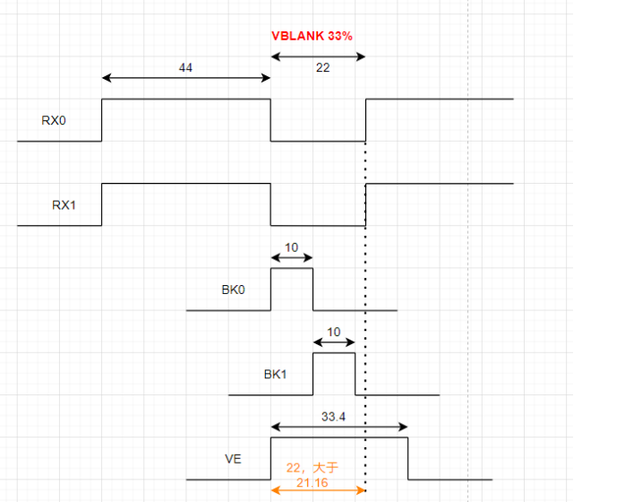

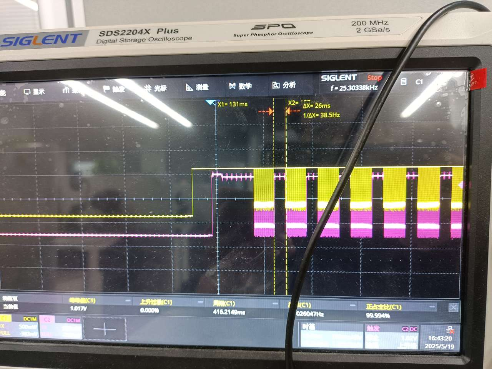

**双目上下拼接配置方法**

```
内核配置：

默认关闭，通过 make kernel_menuconfig 修改内核配置打开 CONFIG_TDM_USE_BK_BUFFER 。

同时，sensor驱动需适配 VSYNC 模式。以 GC2083 为例，适配后，需开启内核配置 
CONFIG_SENSOR_GC2083_VSYNC_MODE 
CONFIG_SENSOR_GC2083_VSYNC_VBLANK_MODE
CONFIG_SENSOR_GC2083_VSYNC_VBLANK35

当前已适配时序SENSOR：
SC2337P
gc2083
SC2331
SC1346
C2337P
```

2.  应用层配置

```
MPP配置接口：
VI_ATTR_S mViAttr;
mViAttr.mOnlineEnable = 1;
mViAttr.mOnlineShareBufNum = BK_ONE_BUFFER;
AW_MPI_VI_SetVippAttr(mVipp, &mViAttr);

VENC_CHN_ATTR_S mVEncChnAttr;
mVEncChnAttr.VeAttr.mOnlineEnable = 1;
mVEncChnAttr.VeAttr.mOnlineShareBufNum = 1;
AW_MPI_VENC_CreateChn(mVEncChn, &mVEncChnAttr);

参考SAMPLE sample_smartIPC_demo

位置：platform\allwinner\eyesee-mpp\middleware\sun300iw1\sample\sample_smartIPC_demo

配置文件：
sample_smartIPC_demo-dual-2M-stitch-rtsp.conf

main_online_en = 1
main_online_share_buf_num = 1
main_vi_stitch_mode = 3 
```

3.  打开配置，通过 vi 调试节点确认。 make menuconfig，打开 KERNEL\_DEBUG\_FS make kernel\_menuconfig，打开 DEBUG\_FS、SUNXI\_MPP 和 CONFIG\_VIN\_LOG

在串口输入 cat /sys/kernel/debug/mpp/vi 获取vi的调试信息。

确认对应vi设备的调试信息，比如：vipp0 对应vi0。

```
## cat /sys/kernel/debug/mpp/vi
*****************************************************
VIN hardware feature list:
mcsi 2, ncsi 1, parser 2, isp 1, vipp 2, dma 2
CSI_VERSION: CSI300_600, ISP_VERSION: ISP603_100
CSI_CLK: 240000000, ISP_CLK: 0
*****************************************************
vi0:
gc2083_mipi => mipi0 => csi0 => tdm_rx0 => isp0 => vipp0
input => hoff: 0, voff: 0, w: 1920, h: 1080, fmt: RGGB10
output => width: 1920, height: 2160, fmt: NV21
interface: MIPI, i sp_mode: NORMAL, hflip: 0, vflip: 0
tdmbuf => cnt: 0 size: 0, cmp_ratio: 410
prs_in => x: 1920, y: 1080, hb: 4165, hs: 6197
bkuf => cnt: 0 size: 0 rest: 0, work_mode: offline
frame => cnt: 0, lost_cnt: 0, error_cnt: 0
internal => avg: 0(ms), max: 0(ms), min: 0(ms)
CSI Bandwidth: 0
*****************************************************
vi1:
gc2083_mipi_2 => mipi1 => csi1 => tdm_rx1 => isp1 => vipp1
input => hoff: 0, voff: 0, w: 1920, h: 1080, fmt: RGGB10
output => width: 1920, height: 2160, fmt: NV21
interface: MIPI, isp_mode: NORMAL, hflip: 0, vflip: 0
tdmbuf => cnt: 0 size: 0, cmp_ratio: 410
prs_in => x: 1920, y: 1080, hb: 4175, hs: 6197
bkuf => cnt: 1 size: 7331840 rest: 0, work_mode: offline
frame => cnt: 497, lost_cnt: 0, error_cnt: 0
internal => avg: 66(ms), max: 71(ms), min: 62(ms)
CSI Bandwidth: 0
*****************************************************

其中，vi0 tdmbuf cnt 为 0、size 为 0，vi1 bkuf cnt 为 1、size 为 4096 ，表示 两路 tdm rx 与 bk 共用一个 buffer 。
```

**单目2IN1拼接方式**

单目4M时序要求（VB大于>=50%,VE 512MHZ ，且在上半幅帧时序启动在线编码， (ISP300MHZ)）

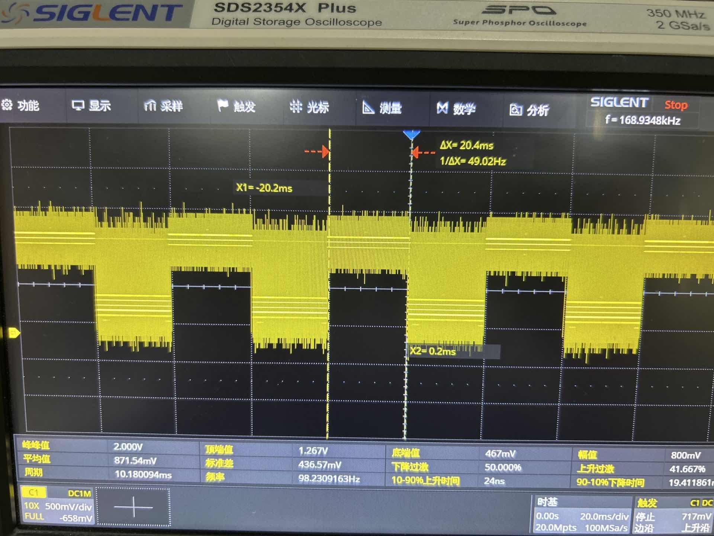

内核配置

```
通过 make kernel_menuconfig 修改内核配置

打开 CONFIG_TDM_USE_BK_BUFFER

以 GC4663 为例，适配驱动后
需开启内核配置 CONFIG_SENSOR_GC4663_MIPI

当前已适配时序SENSOR：
GC4663
```

应用层配置

```
MPP配置接口：
VI_ATTR_S mViAttr;
mViAttr.mOnlineEnable = 1;
mViAttr.mOnlineShareBufNum = BK_ONE_BUFFER;
AW_MPI_VI_SetVippAttr(mVipp, &mViAttr);

VENC_CHN_ATTR_S mVEncChnAttr;
mVEncChnAttr.VeAttr.mOnlineEnable = 1;
mVEncChnAttr.VeAttr.mOnlineShareBufNum = 1;
AW_MPI_VENC_CreateChn(mVEncChn, &mVEncChnAttr);

参考SAMPLE sample_smartIPC_demo

位置：platform\allwinner\eyesee-mpp\middleware\sun300iw1\sample\sample_smartIPC_demo

配置文件：
sample_smartIPC_demo-4M-rtsp.conf

main_online_en = 1
main_online_share_buf_num = 1
main_vi_stitch_mode = 1 

打开配置，通过vi调试节点确认。
make menuconfig，打开 KERNEL_DEBUG_FS
make kernel_menuconfig，打开 DEBUG_FS、SUNXI_MPP 和 CONFIG_VIN_LOG
```

在串口输入 cat /sys/kernel/debug/mpp/vi 获取vi的调试信息。

```
确认对应vi设备的调试信息，比如：vipp0 对应vi0。

*****************************************************
VIN hardware feature list:
mcsi 2, ncsi 1, parser 2, isp 1, vipp 2, dma 2
CSI_VERSION: CSI300_600, ISP_VERSION: ISP603_100
CSI_CLK: 300000000, ISP_CLK: 0
*****************************************************
vi0:
gc4663_mipi => mipi0 => csi0 => tdm_rx0 => isp0 => vipp0
input => hoff: 0, voff: 0, w: 2560, h: 1440, fmt: GRBG10
output => width: 2560, height: 1440, fmt: NV21
tdmbuf => cnt: 0 size: 0, cmp_ratio: 410
interface: MIPI, isp_mode: NORMAL, hflip: 0, vflip: 0
prs_in => x: 0, y: 0, hb: 0, hs: 0
bkuf => cnt: 0 size: 0 rest: 0, work_mode: offline
frame => cnt: 0, lost_cnt: 0, error_cnt: 0
internal => avg: 0(ms), max: 0(ms), min: 0(ms)
CSI Bandwidth: 0
*****************************************************
vi1:
gc4663_mipi => mipi0 => csi0 => tdm_rx1 => isp1 => vipp1
input => hoff: 0, voff: 0, w: 2560, h: 1440, fmt: GRBG10
output => width: 2560, height: 1440, fmt: NV21
tdmbuf => cnt: 0 size: 0, cmp_ratio: 410
interface: MIPI, isp_mode: NORMAL, hflip: 0, vflip: 0
prs_in => x: 2560, y: 1440, hb: 1835, hs: 2128
bkuf => cnt: 1 size: 8204288 rest: 0, work_mode: offline
frame => cnt: 47, lost_cnt: 0, error_cnt: 0
internal => avg: 40(ms), max: 40(ms), min: 40(ms)
CSI Bandwidth: -8204288
*****************************************************

其中，vi0 tdmbuf cnt 为 0、size 为 0，vi1 bkuf cnt 为 1、size 为 4096 ，表示 两路 tdm rx 与 bk 共用一个 buffer 。
```

## FAQ

### 1\. 内存优化后编码出现画面断层怎么办？

**问题现象**：开启参考帧和重建帧buffer复用后，编码过程中出现overwrite，继续编码P帧时画面出现断层。

**根本原因**：重建帧写入了buffer一部分后被异常中断丢帧，导致一个buffer里面夹杂两帧的内容，如果继续使用该buffer做参考帧编码P帧，会出现画面断层。

**解决办法**：开启参考帧和重建帧buffer复用后，如果编码过程出现overwrite，参考帧数据已被损坏，编码器会强制出I帧，这是正常的安全机制。

### 2\. TDM单buffer模式下出现丢帧怎么办？

**问题现象**：配置TDM单buffer模式后，系统日志出现 `[VIN_WARN]use tdm one buffer must ensure sensor vblank >= 20%` 警告，并出现丢帧现象。

**根本原因**：sensor的vblank（场消隐）时间不足20%，导致TDM写入buffer的时机无法错开，buffer发生覆盖。

**解决办法**：

1.  检查sensor的vblank是否满足要求，计算公式：`vts - height >= height * 20%`，其中vts是帧长，height是sensor原图高度
2.  如不满足，修改sensor寄存器配置增大vblank
3.  对于交替模式（措施四），要求vblank >= 50%

### 3\. 双目场景分辨率不同时如何配置交替模式？

**问题现象**：双目sensor分辨率不同时，配置交替模式后系统不稳定。

**根本原因**：交替模式共用TDM buffer，分辨率不同时需要按大分辨率申请buffer。如果小分辨率的sensor先开启，会导致buffer大小不足。

**解决办法**：

1.  大分辨率的sensor必须配置为master模式并先开启
2.  共用的TDM buffer由master通路（即大分辨率sensor）的tdm\_rx申请
3.  硬件设计时可预留两个sensor的vsync信号引出，灵活配置主从模式

### 4\. 内存优化措施之间是否有冲突？

**问题现象**：同时配置多个内存优化措施后出现异常。

**根本原因**：部分优化措施之间存在约束关系。

**解决办法**：

-   措施三（VE参考帧和重建帧buffer复用）与超大帧重编码功能冲突，不可同时开启
-   措施二（TDM单buffer）和措施四（TDM交替模式）要求sensor vblank满足不同阈值（20% vs 50%）
-   措施五（TDM RX与BK buffer复用）需要同时开启措施二，且VIPP必须配置在线编码单buffer模式

### 5\. 如何确认各项内存优化措施是否生效？

**问题现象**：配置了内存优化措施，但不确定是否真正生效。

**根本原因**：需要通过调试节点查看运行状态。

**解决办法**： 通过以下调试节点确认：

| 优化措施 | 调试节点 | 确认方法 |
| --- | --- | --- |
| 措施一：VIPP配置2个buffer | `cat /sys/kernel/debug/mpp/vi` | vi节点中 `bkuf => cnt: 2` 表示生效 |
| 措施二：TDM单buffer | `cat /sys/kernel/debug/mpp/vi` | vi节点中 `tdmbuf => cnt: 1` 表示生效 |
| 措施三：VE参考帧重建帧复用 | `cat /sys/kernel/debug/mpp/ve_base` | ve节点中 `Reduce:1` 表示生效 |
| 措施四：TDM交替模式 | `cat /sys/kernel/debug/mpp/vi` | master的tdmbuf cnt为1，slave的tdmbuf cnt为0 |
| 措施五：TDM RX与BK复用 | `cat /sys/kernel/debug/mpp/vi` | tdmbuf cnt为0，bkuf cnt为1 |

注意：查看调试节点前需开启相关内核配置：`DEBUG_FS`、`SUNXI_MPP`、`CONFIG_VIN_LOG`
