# MPP 介绍与入门

MPP（Media Process Platform）媒体处理软件平台，分为 mpp-middleware 和 mpp-framework 两部分。mpp-middleware 是底层组件层，提供视频和音频的采集、处理、编码、解码等功能，支持硬件加速，适用于各种应用场景。mpp-framework 是面向应用层的多媒体框架，针对特定产品（如CDR、SDV）进行了API封装，简化了开发过程，但灵活性较差，适用性较为有限。MPP平台的核心功能包括视频音频的录制和播放，支持多通道、硬件加速、流媒体等，广泛应用于智能设备、车载系统、安防监控等领域。

MPP 平台在 menuconfig 中提供了丰富的配置选项，用户可以根据项目需求选择所需的组件、音频3A算法库、音视频编解码库等。`select mpp sample` 选项包含多个示例程序，覆盖不同功能，供用户编译和试用。示例源码展示了如何调用 MPP 平台的各类组件，帮助用户参考和开发自己的应用。

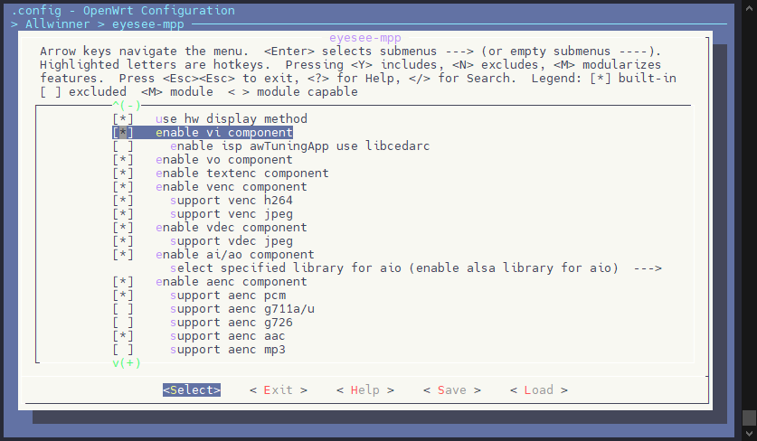

MPP 设计了一套功能多样的接口，涵盖视频和音视频的采集、处理、编码、解码等功能。下表是MPP提供的组件与功能：

| 功能 | 组件 |
| --- | --- |
| 组件管理和系统相关 | mpi\_sys |
| 视频采集(v4l2) | mpi\_vi |
| 视频采集(usbCamera) | mpi\_uvc |
| ISP效果 | mpi\_isp |
| 视频编码 | mpi\_venc |
| osd叠加区域管理 | mpi\_region |
| 音频采集 | mpi\_ai |
| 音频编码 | mpi\_aenc |
| 字幕编码(目前为gps信息) | mpi\_tenc |
| 文件封装 | mpi\_mux |
| 文件解封装 | mpi\_demux |
| 视频解码 | mpi\_vdec |
| 视频输出 | mpi\_vo |
| 音频解码 | mpi\_adec |
| 音频输出 | mpi\_ao |
| 时钟管理 | mpi\_clock |

## MPP 配置

### MPP 配置页

使用 `make menuconfig` 进入 SDK 应用配置界面，选择 Allwinner 选项

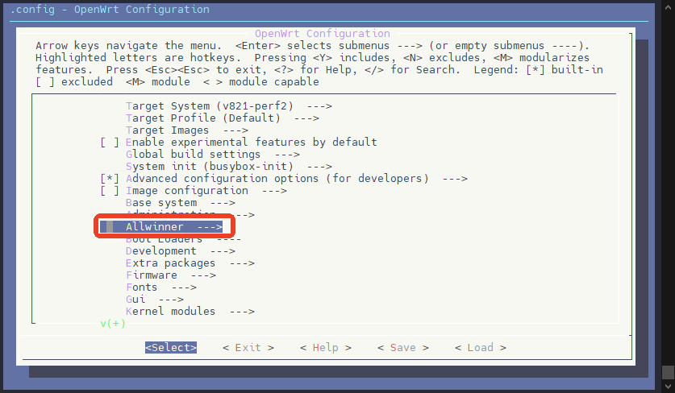

选择 `eyesee-mpp`

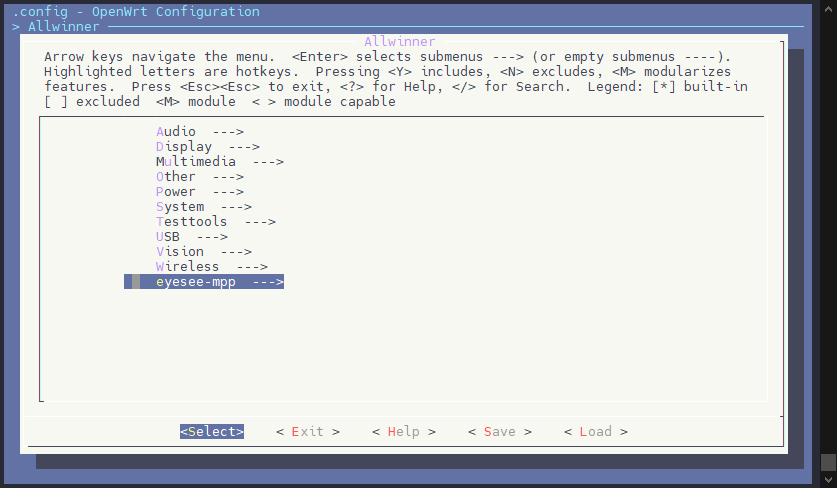

即可进入 MPP 的配置界面

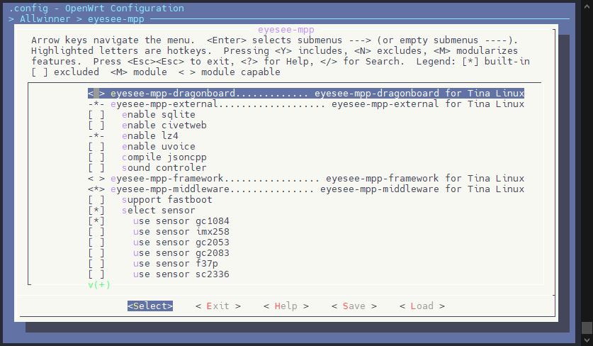

### MPP 配置项说明

**eyesee-mpp-dragonboard**

MPP 产测工具，用于生产测试阶段，可以勾选 `run automatically at startup in tina` 选项自动运行方便产测，仅产测时需要使用。

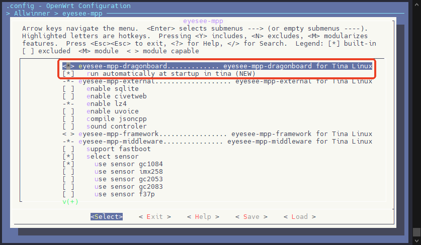

**eyesee-mpp-external**

MPP 模块的第三方库，用于给MPP提供基础支持，例如lz4，json支持。客户一般无需配置。


**eyesee-mpp-framework**

mpp-framework是全志自研产品CDR、SDV的app使用的多媒体框架，内部调用mpp-middleware层的各种组件完成相关功能。mpp-framework的API根据CDR,SDV等产品的使用场景定制

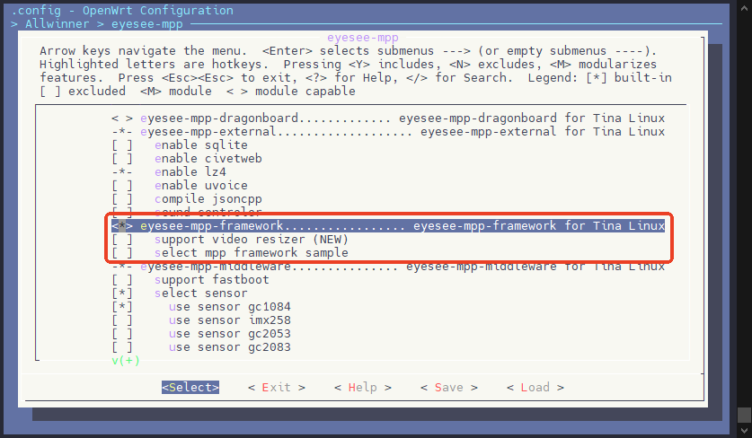

**eyesee-mpp-middleware**

mpp-middleware组件层。提供各类音视频的采集、处理、编码、解码等组件，ISP支持，客户需重点关注此部分内容

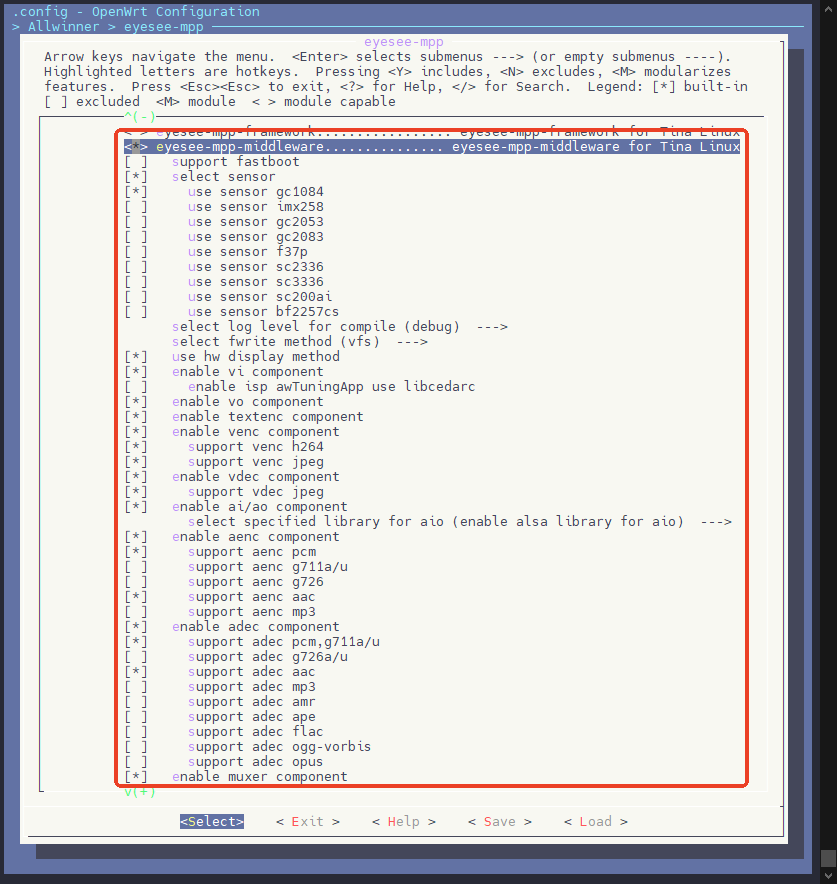

在eyesee-mpp-middleware中，提供了大量的示例Sample以供参考

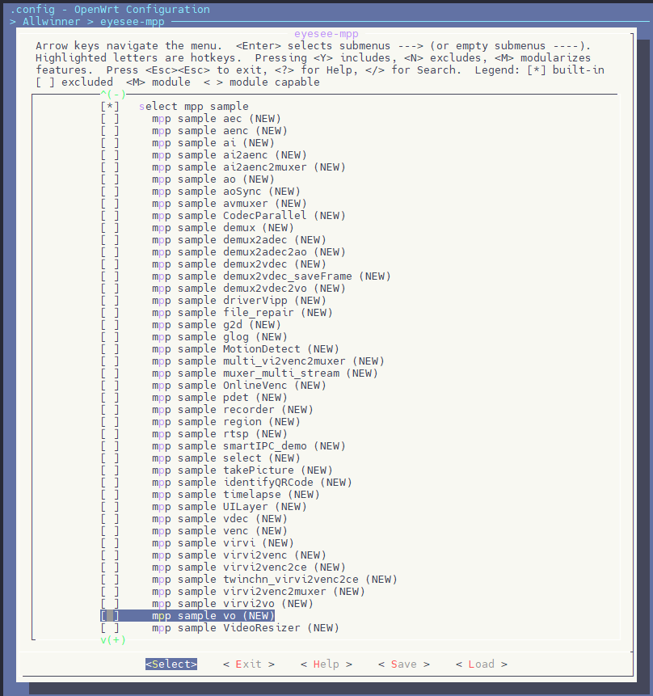

**eyesee-mpp-private**

提供了 onvif，rtsp协议的支持库

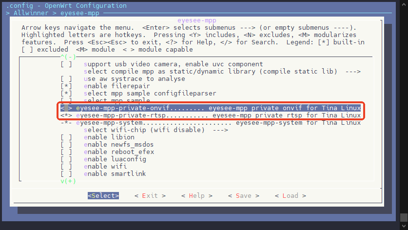

**eyesee-mpp-system**

提供系统控制相关功能

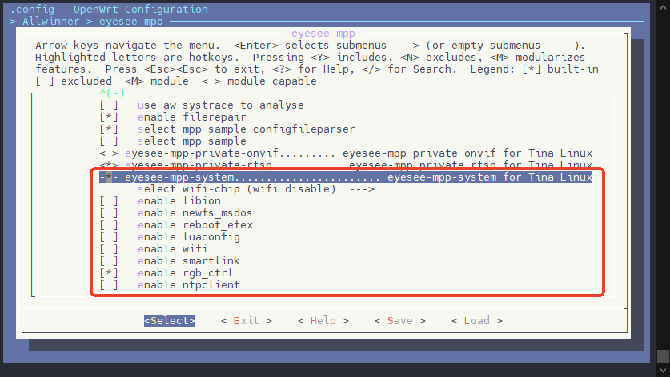

## MPP 编译

这里以编译 MPP Sample sample\_smartIPC\_demo 为例，演示如何编译 MPP

首先运行 MPP 配置页，找到 `select mpp sample`，按空格选中

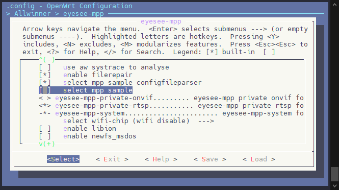

找到 `mpp sample smartIPC_demo`，按空格选中

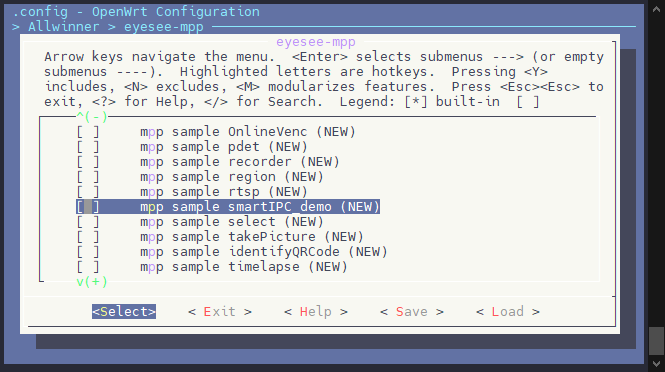

退出配置页面，使用make命令编译 SDK，编译后的 sample 会在 `platform/allwinner/eyesee-mpp/middleware/sun300iw1/sample/bin` 目录下，由于一般 MPP Sample 比较大，所以默认不会编译进入 rootfs

![image-20241119111800259](data:image/png;base64,iVBORw0KGgoAAAANSUhEUgAAAZ0AAABPCAYAAAAwXhgyAAAXOElEQVR4nO2dXUxU59aAn/PlSzUR5MKUoiLO1Gk7jFonQEzxwvGHqacnDtTkJI3EiBU4Es8FkGhoNWqUiBpJhrloo0ep0jQ0Jk2Un8T0DALTCzFGCT1amHOkMoBVDsYLiiTVm++72HuGmWGYvQFlBllPYtLO2u9e6/2Zefdae/GuP5kt6/8PQRAEQZgF/kfXVY5Kuq4VY3nNxgCsthyiJ69G/VfEjlnQOSX9Sdu5HgO7BEEQ3gT0bTqzyC/dVaQ3lJHe3oJvHuqfEuZiXNcqyY21HYIgCDqJ2aZjcRTjutZCV2cLXZ2XcJWaYmVKfJJapOnpWd5Lw5CWyiqzjJ0gCHOD17LpWMwRPgz+YXRUUn98A77aEqwZOVjzb2IoOEx5pHZCBOy4Ols4tQUYAMO+wzQ47bE2ShAEQZP/jfyxHde1CmxpAIPU1T0Kk5vIdR7mhG0FAP2eM3xZ7qYbwFzMqfo0ajOO0Oi/3FxMQ+AzO67j2XiO5eBsUuXeC9R6PqNwmwmnt1eH2akcXL+bvUuTAfA9+Y4Dt+/wS5B8x/rdVAXkLRy43TwuT8ri4AcfB7UPk+shtYjrmWswAIze59Ddi1wd0Wff6tQiqv1tGabt7rfsf6SOcdJ2rm/KUWVQlVdDFcCT70i/fQcAS2k+Ns8ZrOXgckJpuXsqljNx/q7wZfmFwPw11G/A5wGbDTx1NzEUfMZKOqjLP4ITZS7b62BTQTYrmTj/UeU6sDgqOXVcaQuDeI6dpLRJz7oQBCHeiejp5DorsPWdIT8jB2t+PWzODpOf4wT1ijyjhHZjBaf84TFvG+0D2Wx1jF9v2baBlZ6flE3IsREbHdxoAsx2NcR2ia0MstJg1GX0jvUH2Ms/+WtDGent39GasItqS2qIvCrhXxxqLyO9oYwDj+EvqUHtl1vh8bfKu5uGalrJ4Yf1Wbp0K6zhb8u6OKC2P/R8DVUfjLePbl8Wf89MpvVumar/W9zLrONhtJFmPmkoI/3ufeA+hxrU69QNJ4DRMO3EjlznOU4Yb3I0PwdrRg5ftsI2R+g1vvOfk18HtoI0ajNyOOrJZtM2v7eaTYHhJ77MyMGafyZ0/nXJo2Fn3/FU2o8ptlkzTnJjy2Z5byUIbwgRNh07W22D1J1Xn0y9bpy1HZPL6cVZ28HKzZvVH8FefmwbxLbFHrh+X8EKPK3K07jl3VRQN6DcfcrmZs04yQ1W6DQ5C/vSYb75t+o5jNzh7H/uY0ixsjpYfrc54Hn88qiZs0HO2tXui5z1exY84uzj+5CQorbXwzCtfv084mpIey37AJLZsjiL1Ulq+9vNXNWtG7pdJ6nr20B9ZwU2Wz6uUnvkkGZE1Pn74gKNXvV+TRfGvU61T796ofvhIxgYYKKPMXF9jM+/HrkWK9j0rr9PvTSWXxj3mgVBmNNMDK+ZDRh4xA3vJC3MBgyswFbfQkHw5wMDgf/sdtXj6cyn3OzG+d5GbANXyG8Kv5GJVUbw1CqbUa9vkEBMKRpJKRgZxj0yTTlA6nauv5+DITHos9EhHcr9DNM7bf132N+ewteZH1P93i4MDNP24Fv2d4eHMKPRi7P8c5zYcV0z4DPkU1+/kaPBIc3J0JpfXSib0vTl0XBTmm/AdTqfUwUVrGQQT91JSl0SXhOEN4GJm47Xh48NrDIDkX44vD58dIS+s5mAmxueCgq3mfjVkE1/W11oPN9owIKbX/ugYIsdmvowGXR6OiND9PEhpiQg0g+7lpwsvs7Moe9uNZ/4vZ3UInre16d+xvYBjDSzv7UZUN7v/JD5Z3Z0X5yStxOgz4ezvA2unWOrAxonbO5haM2vLlI12mvJNfBeoPTTC4Dyfqf+eAG5Lh0bqiAIcU+E8JqbG54VFOyzK+EQs53ywuwweTYnnPZAuMTiKMZVGpo91djawcrNBWy1DdL+4/hTavfDR5CWhgloPH8Gj7GCrs7DbGUw1IyRIfpYgz2VMO7gfpLM3g+ylHBVUhYH31+Db6hLDXep8szt7EhSWqxO3c7BkPsM04f/xb3SfgKT6tdCw76k7XxtydIO5Y0O4SNZ2bzCsDjs5AaH08xGDGmD+B7osU+d39PFgXtYHMWUO6K3CmXi+uhvawt6sNCSR8GsrKXZ+ENkQRBmn4jZa43lJay6do76zgqU7LUO2Bwqx3lYlSvZT7XnwzKomn7Cc7wC28AVzgc/8TbVUVd4jsJSE40uN6WfTpZ5dYf9d61cz6yhJxN8D6r5RA1BXb1djWn9bn7I2wWo2WFB4amrt6th/W6qNuVQhT87bfy+Xz2wUp1Zw95MlMyzofuQol+/FlHtG2nmq+VFVOftCmS+fdMewcsZaeYfTz6kalMNeyEke60bA/tOX+JEmuIddtmUDC+nTs/CP38n6j/jBP7sNX1tFTqo823kVGfFeHZaSPhLSx4F7wXOb6sMtGVAyZoTL0cQ3gz+FJOz1/xpuZIKOzNCUtHjRGcsbBIEYc4QmxMJvBfIy6+HwsPqiQQtNMiJBIIgCG88k/xx6CzgjRZaE3ThvUBeRqyNmAp2XJ0V2CYTD1wh/9MLuv+IVBCEuUdswmuCIAjCvERKG0xV/3wsbTCL8z9TLKWXAiHbrs7XcAK3uZgG3fc1keswzYlxE4TZQkobxJn+KSGlDSbQ7fpcPUT2Cv2xNsa8mcLjBcjbSkEYR0obxCtS2iBusJReoms6p3h7L5D3CrL4pq1fEOIQKW0wJ5HSBrNH6NmB80+/ILxapLRBJLke3tTSBoD2/EdHszSB2U75vnwKXkdphWn1P0p7R+SzA1eVVtIwqf7gLL2O0DPx/N+FY1DoH6OBDo5+cSRwAKse/YIwV5HSBlLaYEJpA635j452aYLcbRuh9aQqL6Gdz6gP89RmVlpBR/8nW78hmCgvzMZTG57GraXfTWlGDtaMM3giWpBN4Ra1fUYJR/uyObEvkqc6mX5BmLtIaQMpbRBW2kBr/vUQvTRBo+sIzoDn04uztSNsE51paYVoaK3fIBwFFHCF8xO8jJmWbhikPUh/44T+a+kXhLmLlDbwI6UN9Mk10VGawFFMQ+FnrEwLaha0frSZQekEHetXwe9lHIngZcykdIPe9tH0C8LcRUobgJQ2mIpcD1FLE9hxHf8M37ES8vzejqOSrsKpKJhB6QRd6xfFy0jr4GjE8Zxh6QY9RNUvCHMXKW0gpQ3CShtozb8GukoTDOLzB82men9AV+kErw8foe8WFfSt39wt2fTX1U2yMU2ldIO6QU2R6PoFYe4ipQ2ktMGE0gZa8x8VzdIEbs7XbeTU8RYKjivyo21TuD+gr3SCm9JjG2k43kLXceivKyFPvUZz/ZqLKbR1UFs+WSblRP15EUs3qDaoobz+uhLyftTRPU39gjB3kdIGc5n5WEZgFvqc62yh0FcyyUby+om1fkF4nUhpA0EIxu9lxOoHP9b6BeE1I6dMC3OL+ejdCcIbhGw6giAIwqwhpQ2mqn+OlzZ47Uf/C4IgREFKG8SZ/ikxjdIGcXX0vyAI8w4pbRCvSGkDQRDeQKS0wZxEShsIgjA3kdIGkeR6mNOlDaKjWZpAEARhmkhpg3lY2iA62qUJBEEQpouUNph3pQ30EL00gSAIwnSR0gZ+5ktpA010lCYQBEGYJlLaAOZXaQM9RC1NIAiCMH2ktMG8K22gMtnR/7pKEwiCIEyPSY7BMVF+7RwFQdlrBZsHyP/UX6s9PHvtCrXnx8sfK9hxdSqlDcbbjd97U5uOU3SDMsRCSwvMLHtttaWI6veCMs+GoCpliL+2hmWwRdKftJ3rm1L4R0OQZ5JaRM/7we01stfC9H9z9yJnI3hFO9YfCvQhOHsNRzGuwg3Y0vze4TQzzByVNKhZasFH/1tKKzlVkD1emuCLI7rLJgiCIERDShvMZeTwS0EQ5hhS2kAQBEGYNeSUaUEQBGHWiLsDPwVBEIQ3l0mOwYkdC8s2YNizSP2/YR5bf+b3mFok4FiHuWgMX14vf8TaljhH1m8cMl/Xb7qJ5aeNJK4E+vvipv9xt+n8UXMTbw2QbsL4/SLN6wUhnpD1K8QLi0uMvNV2C2/NaKxNCSHuNp15g2Md5koiPAkn8nbDRyxZGXr5i8u36KsZVdslB0nGeHH5IX01oScqLCxbx9I9ySwA6B/m2Rc/87TntfREmI/I+o1zEllggJct8bXhgGw6s0AiC9OBnlGdru0oT/PcPFW/vAlt6pc1hKCwTXoKy79fi5GxwHULyzZg2DzG451ufu9Rr9mWAj1TOepHEEDWr/CqibjpLHSsY2ml+pTBGKNH7vFbU9DCSU/h7ZJ3WWJTwgcvPH08KVXjhekmjN8n89IDiTYYvTzMW3uMLGCYZzt/5ilK2OH5ZUhQn2ReeO7xpHRoCvHGRBa71rIsoH9q7aP2T8v+Ho3+A5DC8q53eHl5EQl7gH5YsHJM+aKlmzB+b1R1w7IuO8sAPPfwlk7jS9UzxLPL72IwLgJGgRSW7IFnO39WvrDqNb9N6SkxheUNa5VYMGM8uzwWJo8y/nrGj0Tedq0NGr+pzn90ZP3K+o3v9RuuP3z8o9xfDds+OwJLKsc9wcdf+McrzNOstGOuJK7e6UTIXkthSeUinh9x47W68VrvMZrzDouDrli87R1ouafKb/EcIwZXSshdXp67ie8yJO5ZxDOrm8eeZBK2+U/YTGaJ8b88sbrx7rzHc8NalpYlopfFro9YxkN8fv1Taq/dPy379fQfkkkwPuSJ9SZ9eTfx7nyoPNn19NJndeM9MozyxKfaMZ0vbCTSE3iLMV7MIBSx2LWWRN89ZXx3PoTNyWFy7fGPOn6uj1jibz+N+Y+OrF8t+2X9xnb9LnZ9xDLDMI93KmP3pAUSHaHy6PdPZkmOuv6st3jsS2ZZiX/+FE/Ta73Fs34Y9a+TONlwYNKU6UUkrEpR3GpG+b20NyRu+3vNzzwNPDmO8rRlGAwJLAxcoSyaP34dg/4xXk64/xjPzqk7d88QTy8Os2DzO0Hto5FCoi2oPaNTbK/dPy37tfuv3OP5uaCnn57XFFtNT2HJnkW86At/mpsuYeOrzs+k8ojjH238It9/avOnhaxfWb/xun7V9l/0Bjy5P5p6edoUJo96/+C5GeX3iPMXv0QIrw3x284Elp9+l6V71rKAMUYv3+O34Lisw4SxyMiC4JeF/X1TUDuDJ5n0BN5iEYnf21kS/Llu/Tr6p8WM+z9TksfDGozx4vK9CHHzaaI+aY5ONj8zHX+t+88YWb+ayPqN3frVZZ/W/WfmCcaayIkEPb38lqecibbQsQ5D5bssrvFnqaSwvNLIyyO36PM/LTnWYS6aitpFLEgHpjNwPc95yTDPZvL3D1H7p8Wr6P9MifL3Hz3PeUnyDMc3SvuZjv9M7dOlQ9bv5Mj6jen61WXfa/5+xJiJ4bV0E8vLUjRctTFe4n9xmcLbRclRr57IIpaUqDrU9i/a/hsac1QHPzH86H2GGPUks8w1buNCh2KzLnT1T4uZ9h/oHeOF/8frlTLEs8uw5PQ6FvvvnZ6if3wYYtQzcX5C5TMY/0nuP2H+p4usXx3I+n396zeF5Q12zK7wuVLbnzYF+rfQYeJtR5j8dX0/4oCJnk5PL8+2rWNp19rxHPmdwU8FQzy7/A5LK+0sqVTkj9uGYfNU1A7zrO+dgI4Xnns8meBeD/HbkXcwqtkXgTx/4PfSW+Bai6FrLaBkfzw7p/NFpmb/tHgV/Vft8CSzzO/mB7J/wrJP9nyEeU9o/7X4o+YmPtax9Hs1hKH+nYNefi+9xYKGj9TxHePZ5dD+zWj8/fcPaR9p/qeJrF8NZP3O2vpdCZAQsT2utSz73sgy/Nlr07j/HGX2D/z0p/zJ8SDCXETWr6CbRODN2SxeFXLgpyAIwmtBNpxIvGEnEqSwvGstk2bMx9EfSMUGGZ/4RuYnOjI+bwJST2eeUV5aGFXudNXOkiWCIMxH9IXXHJV0XSvG8pqNAVhtOURPXo36r4gds6BzSvqTtnM9BnYJgiC8CcTdO51fuqtIbygjvb0F3zzUPyXMxbiuVZIbazsEQRB0ErNNx+IoxnWtha7OFro6L+EqNcXKlPgktUjT07O8l4YhLZVVZhk7QRDmBq9l07GYI3wY/MPoqKT++AZ8tSVYM3Kw5t/EUHCY8kjthAjYcXW2cGoLMACGfYdpcNpjbZQgCIImk2Sv2XFdq8CWBjBIXd2jMLmJXOdhTthWANDvOcOX5W66AczFnKpPozbjCI3+y83FNAQ+s+M6no3nWA5O/yF33gvUej6jcJsJp7dXh9mpHFy/m71Llb809j35jgO37/BLkHzH+t1UBeQtHLjdPC5PyuLgBx8HtQ+T6yG1iOuZazAAjN7n0N2LXB3RZ9/q1CKq/W0Zpu3ut+x/pI5x0naub8pRZVCVV0MVwJPvSL99BwBLaT42zxms5eByQmm5eyqWC4IgxIyInk6uswJb3xnyM3Kw5tfD5uww+TlOUK/IM0poN1Zwyh8e87bRPpDN1qDjPyzbNrDS85OyCTk2YqODG02A2a6G2C6xlUFWGoy6jN6x/gB7+Sd/bSgjvf07WhN2UW1JDZFXJfyLQ+1lpDeUceAx/CU1qP1yKzz+Vnl301BNKzn8sD5Ll26FNfxtWRcH1PaHnq+h6oPx9tHty+Lvmcm03i1T9X+Le5l1PIw20swnDWWk370P3OdQg3qduuEEMBpmJbFDEAThVRJh07Gz1TZI3XnVc/G6cdZ2TC6nF2dtBys3b1Z/BHv5sW0Q2xZ74Pp9BSvwtCpP45Z3U0HdgHL3KZubNeMkN1ih0+Qs7EuH+ebfqucwcoez/7mPIcXK6mD53eaA5/HLo2bOBjlrV7svctbvWfCIs4/vQ0KK2l4Pw7T69fOIqyHttewDSGbL4ixWJ6ntbzdzVbdu6HadpK5vA/WdFdhs+bhK7ZFDmoIgCHHGxPCa2YCBR9zwTtLCbMDACmz1LRQEfz4wEPjPblc9ns58ys1unO9txDZwhfym8BuZWGUET62yGfX6BgnElKKRlIKRYdwj05QDpG7n+vs5GIL/ymx0KkWohumdtv477G9P4evMj6l+bxcGhml78C37u8NDmNHoxVn+OU7suK4Z8Bnyqa/fyNHgkKYgCEIcMnHT8frwsYFVZiDSxuP14aMj9J3NBNzc8FRQuM3Er4Zs+tvqVK9IxWjAgptf+6Bgix2a+jAZdHo6I0P08SGmJCDSD7uWnCy+zsyh7241n/i9ndQiet7Xp37G9gGMNLO/tRlQ3u/8kPlndnRfnJK3E6DPh7O8Da6dY6sDGids7oIgCPFDhPCamxueFRTssyvhMrOd8sLsMHk2J5z2wDsFi6MYV2lo9lRjawcrNxew1TZI+4/jyQHdDx9BWhomoPH8GTzGCro6D7OVwVAzRoboYw32VMK4g/tJMns/yFLCVUlZHHx/Db6hLjXcpcozt7MjSWmxOnU7B0PuM0wf/hf3SvsJTKpfCw37krbztSVLO5Q3OoSPZGXzCsPisJMbHE4zGzGkDeJ7MFVbBUEQZpeI2WuN5SWsunaO+s4KlOy1jpCjwRvLS8B5WJVDv+cKtefDMqiafsJzvALbwBXOB3tMTXXUFZ6jsNREo8tN6aeTZV7dYf9dK9cza+jJBN+Daj5RQ1BXb1djWr+bH/J2AWp2WFB46urtali/m6pNOVThz04bv+9XD6xUZ9awNxMl82zoPkwopzG5fi2i2jfSzFfLi6jO2xXIfPumPYKXM9LMP558SNWmGvZCSPZaNwb2nb7EiTTFO+yyDeI5dhLnZCFRQRCEOCE2Z6+Zi2mo34Dv2ElKm/SkSAsRCUlF14ecvSYIQiyJzYkE3gvk5ddD4WH1RIIWGuREAkEQhDee2JU28EYLrQm68F4gLyPWRgiCIOhHShsIgiAIs0bcnTItCIIgvLnIpiMIgiDMGrLpCIIgCLPG/wNaU7MWJzXWfwAAAABJRU5ErkJggg==)

### MPP 相关快捷命令

为方便客户快速跳转到源码位置，SDK编写了若干shell文件提供了快捷跳转函数，在工程目录下也编写了shell文件提供MPP源码的跳转函数：

| 命令 | 跳转位置 |
| --- | --- |
| cmpp\_p | openwrt/package/allwinner/eyesee-mpp/middleware |
| cmpp\_s | platform/allwinner/eyesee-mpp/middleware/sun300iw1 |
| cisp | platform/allwinner/eyesee-mpp/middleware/sun300iw1/media/LIBRARY/libisp |
| clibcedarc\_p | openwrt/package/allwinner/multimedia/tina\_multimedia/libcedarc\_mpp |
| clibcedarc\_s | platform/allwinner/multimedia/libcedarc\_mpp/sun300iw1 |
| cfw\_p | openwrt/package/allwinner/eyesee-mpp/framework |
| cfw\_s | platform/allwinner/eyesee-mpp/framework/sun300iw1 |
| crtsp\_p | openwrt/package/allwinner/eyesee-mpp/private/rtsp |
| crtsp\_s | platform/allwinner/eyesee-mpp/system/private/rtsp |
| cpdet\_p | openwrt/package/allwinner/vision/person\_detection |
| cpdet\_s | openwrt/package/allwinner/vision/person\_detection |
| cmpplibs | out/v821/ipc/openwrt/staging\_dir/target/usr/lib/eyesee-mpp |
| cmppheaders | out/v821/ipc/openwrt/staging\_dir/target/usr/include/eyesee-mpp |
| clibcedarcheaders | out/v821/ipc/openwrt/staging\_dir/target/usr/include/libcedarc |
| mkmpp | 编译libcedarc, mpp-middleware |
| cleanmpp | 清理mpp-middleware和libcedarc |
| mkall | 编译整个工程 |
| cleanall | 清理整个工程 |

## MPP 库整合使用

如果客户想把mpp的头文件和库导入到自己的SDK中去使用，以v821举例，方法如下：

1.  编译 `Tina-v821 sdk`，编译指令参考tina-sdk的说明文档。编译完之后，无需反复编译了。
    
2.  执行 `mkmpp`，编译 `mpp` 平台代码。编译完后，在 `out` 目录下就生成了`mpp`的头文件和库，`libcedarc`的头文件和库。
    
3.  执行 `cmppheaders` 跳转到mpp头文件目录，执行 `cmpplibs` 跳转到`mpp`库目录，执行`clibcedarcheaders` 跳转到 `libcedarc` 头文件目录，把头 文件目录和库目录复制到自己的SDK里面就可以了。
    

mpp头文件目录为：`out/v821/ipc/openwrt/staging_dir/target/usr/include/eyesee-mpp`

mpp库目录为：`out/v821/ipc/openwrt/staging_dir/target/usr/lib/eyesee-mpp`

libcedarc头文件目录为：`out/v821/ipc/openwrt/staging_dir/target/usr/include/libcedarc`

libcedarc库目录为：`out/v821/ipc/openwrt/staging_dir/target/usr/lib`

libcedarc是全志的视频编解码库。libcedarc库没有单独建目录，而是放在通用目录下，所以拷贝时最好指定库的名称，v821一般编译出 的视频编解码库有以下这些:

```c
libawmjpegplus.a
libvdecoder.a
libvideoengine.a
libvencoder.a
libvenc_jpeg.a
libvenc_h264.a
libvenc_common.a
libvenc_base.a
libMemAdapter.a
libVE.a
libcdc_base.a
```

## 软件框架

MPP平台的设计思想是根据功能划分组件。每个组件负责一个单一功能。通过把各种组件组合起来完成复杂功能。

组件内部核心代码设计借鉴了OpenMaxIL协议规范，在此协议基础上进一步精简接口。OpenMaxIL协议的tunnel和non-tunnel模式，对应组 件对外的绑定和非绑定模式。组件间的绑定，实质是组件内部核心模块之间建立了隧道链接互传数据。为和OpenMaxIL协议代码区分，该 协议定义的OMX前缀的宏定义、函数声明在MPP平台内的头文件中均改为COMP前缀。

> OpenMaxIL协议网站是: [https://www.khronos.org/openmaxil](https://www.khronos.org/openmaxil)

组件的代码实现分为两层：

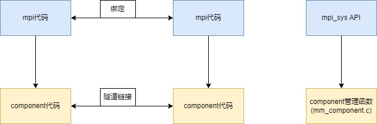

外层提供mpi风格的API，实现通道的概念，建立通道的链表对组件实例进行管理。通过调用内层组件的接口来实现API功能。

内层为Component核心代码。Component的模板代码为"mm\_component.h"，Component注册、创建、操作机制的代码放在mm\_component.c 中。Component调用更底层的库（如视频编解码库、音频编解码库，libisp库，音频3A算法库，音频变速库，文件解封装库，文件封装 库，alsa-lib，v4l2驱动）实现具体功能。

以mpi\_venc组件为例:

-   外层API: mpi\_venc.h,mpi\_venc.c

```c
MPP_API:
    AW_MPI_VENC_CreateChn()
    AW_MPI_VENC_DestroyChn()
    AW_MPI_VENC_StartRecvPic()
    AW_MPI_VENC_StopRecvPic()
    AW_MPI_VENC_GetStream()
    AW_MPI_VENC_ReleaseStream()
    AW_MPI_VENC_RegisterCallback()
    AW_MPI_VENC_SendFrame()
```

-   内层Component: VideoEnc\_Component.c

```c
Component API:

typedef struct MM_COMPONENTTYPE
{
    void* pComponentPrivate;
    void* pApplicationPrivate;
    ERRORTYPE (*SendCommand)();
    ERRORTYPE (*GetConfig)();
    ERRORTYPE (*SetConfig)();
    ERRORTYPE (*GetState)();
    ERRORTYPE (*ComponentTunnelRequest)();
    ERRORTYPE (*EmptyThisBuffer)();
    ERRORTYPE (*FillThisBuffer)();
    ERRORTYPE (*SetCallbacks)();
    ERRORTYPE (*ComponentDeInit)();
} MM_COMPONENTTYPE;
```

-   视频编码库: vencoder.h

```c
VideoEncoder *VencCreate(VENC_CODEC_TYPE eCodecType);
void VencDestroy(VideoEncoder *pEncoder);
int VencInit(VideoEncoder *pEncoder, VencBaseConfig *pConfig);
int VencStart(VideoEncoder *pEncoder);
int VencPause(VideoEncoder *pEncoder);
int VencReset(VideoEncoder *pEncoder);
int VencFlush(VideoEncoder *pEncoder, VencFlushType eFlushType);
int VencGetParameter(VideoEncoder *pEncoder, VENC_INDEXTYPE indexType, void *paramData);
int VencSetParameter(VideoEncoder *pEncoder, VENC_INDEXTYPE indexType, void *paramData);
int VencDequeueOutputBuf(VideoEncoder *pEncoder, VencOutputBuffer *pBuffer);
int VencQueueOutputBuf(VideoEncoder *pEncoder, VencOutputBuffer *pBuffer);
int VencQueueInputBuf(VideoEncoder *pEncoder, VencInputBuffer *inputbuffer);
int VencSetCallbacks(VideoEncoder *pEncoder, VencCbType *pCallbacks, void *pAppData);
```

mpi\_venc组件的代码类图如下：

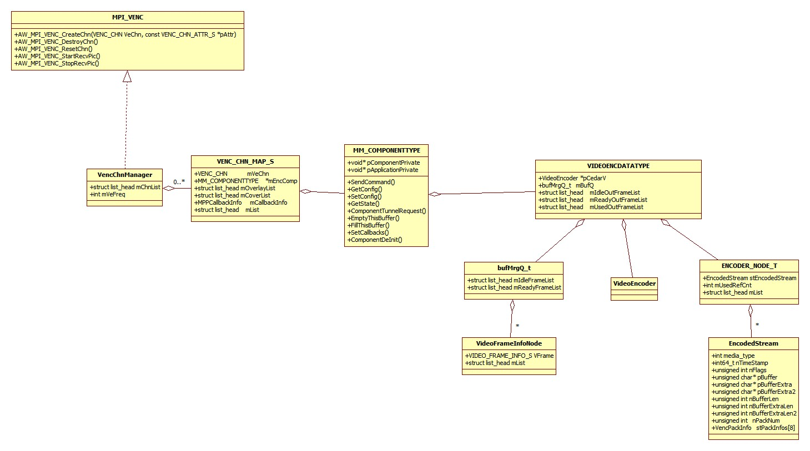

组件的状态统一设计为下图:

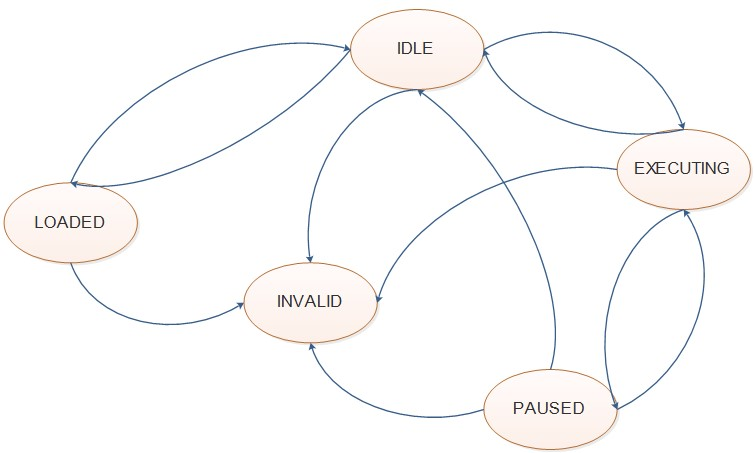

在创建通道过程中，Component刚创建时处于LOADED状态，配置完Component后，转换为IDLE状态。所以app一般在创建完通道后，组件状 态就已经是IDLE状态。随后app可以调用mpi接口，将组件转换为EXECUTING、PAUSE、IDLE状态，最后销毁组件。

## MPP 常用调试节点

mpp可以为若干硬件驱动生成proc节点，挂载在debugfs文件系统下，供使用者在系统运行过程中实时查看驱动的运行信息。

配置内核 `make kernel_menuconfig`，打开配置 CONFIG\_SUNXI\_MPP 即可生成proc节点。

系统启动后，在终端执行命令：`mount -t debugfs none /sys/kernel/debug`，挂载debugfs文件系统（默认自动挂载）。然后通过cat指令查看mpp节点信息：

```
cat /sys/kernel/debug/mpp/vi
cat /sys/kernel/debug/mpp/ve*
cat /sys/kernel/debug/mpp/vo
```

> 静态属性：指只能在系统未初始化、未启用设备或通道时，才能设置的属性。 动态属性：指在任何时刻都可以设置的属性。

### VI 节点

```
cat /sys/kernel/debug/mpp/vi
```

输出示例：

```
*****************************************************
VIN hardware feature list:
mcsi 2, ncsi 1, parser 2, isp 1, vipp 2, dma 2
CSI_VERSION: CSI300_600, ISP_VERSION: ISP603_100
CSI_CLK: 200000000, ISP_CLK: 0
*****************************************************
vi0:
gc1084_mipi => mipi0 => csi0 => isp0 => vipp0
input => hoff: 0, voff: 0, w: 1280, h: 720, fmt: GRBG10
output => width: 1280, height: 720, fmt: LBC_1X
interface: MIPI, isp_mode: NORMAL, hflip: 0, vflip: 0
prs_in => x: 1280, y: 720, hb: 2432, hs: 6451
bkuf => cnt: 4 size: 1429504 rest: 4, work_mode: online
frame => cnt: 306, lost_cnt: 7, error_cnt: 0
internal => avg: 34(ms), max: 34(ms), min: 33(ms)
CSI Bandwidth: 0
*****************************************************
vi4:
(efault) => mipi0 => csi0 => isp0 => vipp4
input => hoff: 0, voff: 0, w: 0, h: 0, fmt: NULL
output => width: 0, height: 0, fmt: NULL
interface: NULL, isp_mode: NORMAL, hflip: 0, vflip: 0
prs_in => x: 0, y: 0, hb: 0, hs: 0
bkuf => cnt: 0 size: 0 rest: 0, work_mode: online
frame => cnt: 0, lost_cnt: 0, error_cnt: 0
internal => avg: 0(ms), max: 0(ms), min: 0(ms)
CSI Bandwidth: 0
*****************************************************
```

参数说明：

| 参数 | 描述 |
| --- | --- |
| mcsi | MIPI通道号，0/1 |
| ncsi | DVP通道号，0 |
| parser | 图像数据解析通道号，0/1/2/3 |
| isp | ISP通道号，0/1 |
| vipp | VI通道号，0~12 |
| input => hoff | 输入图像水平偏移 |
| input => voff | 输入图像垂直偏移 |
| input => w | 输入图像宽度 |
| input => h | 输入图像高度 |
| input => fmt | 输入图像格式，RAW：RGGB/BGGR/GRBG/GBRG，YUV： |
| output => width | 输出图像宽度 |
| output => height | 输出图像高度 |
| output => fmt | 输出图像格式：RAW8/10/12，YUV420等，LBC\_1/1.5/2/2.5X |
| interface | 接口类型：PARALLEL/MIPI/BT656/SUBLVDS/HISPI |
| isp\_mode | ISP模式：NORMAL/DOL\_WDR/CMD\_WDR/SEHDR |
| hflip | 输出图像水平（镜像）翻转：0/1 |
| vflip | 输出图像垂直翻转：0/1 |
| prs\_in => x | parser输入数据宽度 |
| prs\_in => y | parser输入数据高度 |
| prs\_in => hb | 行消隐时间 |
| prs\_in => hs | 行同步时间 |
| bkbuf => cnt | 图像buffer个数 |
| bkbuf => size | 图像buffer大小 |
| bkbuf => rest | 空闲图像buffer个数 |
| bkbuf => work\_mode | 图像编码模式：offline/online |
| tdmbuf => cnt | TDM buffer个数 |
| tdmbuf => size | TDM buffer大小 |
| tdmbuf => cmp\_ratio | TDM LBC 压缩系数 |
| ispbuf => cnt | ISP 3DNR buffer个数 |
| ispbuf => size | ISP 3DNR buffer大小 |
| ispbuf => cmp\_ratio | ISP 3DNR 压缩系数 |
| frame => cnt | 图像帧计数 |
| frame => lost\_cnt | 图像丢帧计数 |
| frame => error\_cnt | 图像异常帧计数 |
| internal => avg | 图像帧间隔平均值（ms） |
| internal => max | 图像帧间隔最大值（ms） |
| internal => min | 图像帧间隔最小值（ms） |

### VE\_BASE 节点

```
cat /sys/kernel/debug/mpp/ve_base
```

输出示例：

```
**********Ch[0] H264 F240 BaseInfo Start**********
Version: 4a182bd42c931bea2f77b0ff9a531d233df8541e
Link: Isp2Ve:1 Ve2Isp:0, Sharp:1
Online: Mode:1, Chan:0, BufNum:1, Overwrite:0
Input: LBC1.0X BT709Full 1280(1280)x720->1280x720, Rot:0
BaseSpec: 1048576bps, 30fps, 100Key
RateCtrl: StaticIPC, VBR(new,BalanceQuality), NormalP, IpcCase, Colour
Qp: Limit:1, Init:37, I[25,45,45], P[25,45,45]
BitRate(Kbps): Avg:863, Act:136
FrameRate(fps): Avg:29, Act:30
VBV(Byte): Total:1445888, Unused:1445568, Valid:320, FrmNum:1, Th:921600
Ref(Byte): LBC1.5X, Reduce:1, Lbc:61440+1314816, Qsub:6144+118784
CurrPic: PQp:27, Bits:23631->2304
Drop: User:0, Lib:0
HwTime(us): Enc{Cur:4914, Avg:4945, Max:0}, Empty{Cur:29115, Avg:29098, Max:29404}
SwTime(us): Num:241, Enc{Cur:1730, Avg:2684, Max:6105}, Empty{Cur:32304, Avg:31212, Max:44385}, Mb:1069, Bin:0, Sei:0,Pskip:0
**********Ch[0] H264 F240 BaseInfo End**********
```

参数说明：

-   JpegBase

| 行分类 | 参数 | 取值范围 | 解释 |
| --- | --- | --- | --- |
| 标签 | Ch | \[0:15\] | Encoder通道号 |
| 标签 | F | \[0:+∞) | 软件计算帧序号 + 硬件编码帧序号 |
| Version |  |  | 编码库提交版本号 |
| 像素格式 | InputFormat | VENC\_PIXEL\_FMT | VI输出格式 / ENCPP输入格式 |
| 像素格式 | OutputFormat | VENC\_OUTPUT\_FMT | ENCPP输出格式 / Encoder输入格式 |
| 像素格式 | ColourSpace | VENC\_COLOR\_SPACE | 颜色空间 |
| Link | Isp2Ve | \[0:1\] | ISP输出参数给VE使能 |
| Link | Ve2Isp | \[0:1\] | VE输出参数给ISP使能 |
| Link | Sharp | \[0:1\] | ENCPP锐化使能 |
| 码控 | Mode | \[0:1\] | JPEG工作模式，0为单帧拍照，1为MJPEG码流 |
| 码控 | RcMode | \[0:1\] | MJPEG码控模式，0为CBR，1为固定画质 |
| 码控 | Quality | \[10:100\] | 当前帧质量系数，值越大画质越好 |
| Rotation |  | \{0,90,180,270\} | ENCPP旋转角度 |
| BitRate(bps) |  | \[0:+∞) | MJPEG目标平均码率 |
| BitRange(bps) | Rate | \[0:+∞) | MJPEG码率上下限范围 |
| BitRange(bps) | Ratio | \[0:100\] | MJPEG实际偏离目标码率百分比阈值，超出这个值码控开始工作 |
| BitRange(bps) | Th | \[0:100\] | MJPEG码控阈值，大于这个阈值使用小步长微调，小于这个阈值使用大步长快调 |
| BitRange(bps) | Step | \[0:100\] | MJPEG码控调节步长 |
| BitRange(bps) | Delay | \[0:+∞) | MJPEG码控调节滞后性，值越小调节越快 |
| BitRange(bps) | Quality | \[0:100\] | MJPEG码控质量系数取值范围 |
| PicSize | Crop使能 | \[192:4096\] | 输入宽度（输入跨度）x输入高度 -> （裁剪起始坐标）裁剪宽高 -> 输出宽高 |
| PicSize | Crop不使能 | \[192:4096\] | 输入宽度（输入跨度）x输入高度 -> 输出宽高 |
| ThumbSize |  | \[192:4096\] | 缩略图宽高 |
| wb | en | \[0:1\] | 回写使能 |
| wb | num | \[1:+∞) | 回写buffer数量 |
| wb | size | \[192:4096\] | 回写buffer宽高 |
| VBV(Byte) | Main | \[0:+∞) | 主图码流输出buffer大小 |
| VBV(Byte) | Th | \[8192:+∞) | 主图输出buffer剩余空间阈值，小于这个阈值则不启动编码返回异常 |
| VBV(Byte) | Thumb | \[8192:+∞) | 缩略图输出buffer大小 |
| HwTime(us) | Enc\{Cur\} | \[0:+∞) | 硬件编码当前帧耗时 |
| HwTime(us) | Enc\{Avg\} | \[0:+∞) | 硬件编码历史平均耗时 |
| HwTime(us) | Enc\{Max\} | \[0:+∞) | 硬件编码历史最大耗时 |
| HwTime(us) | Empty\{Curr\} | \[0:+∞) | 硬件编码当前帧间隔 |
| HwTime(us) | Empty\{Avg\} | \[0:+∞) | 硬件编码历史平均间隔 |
| HwTime(us) | Empty\{Max\} | \[0:+∞) | 硬件编码历史最大间隔 |
| SwTime(us) | Enc\{Cur\} | \[0:+∞) | 软件计算当前帧耗时 |
| SwTime(us) | Enc\{Avg\} | \[0:+∞) | 软件计算历史平均耗时 |
| SwTime(us) | Enc\{Max\} | \[0:+∞) | 软件计算历史最大耗时 |
| SwTime(us) | Empty\{Curr\} | \[0:+∞) | 软件计算当前帧间隔 |
| SwTime(us) | Empty\{Avg\} | \[0:+∞) | 软件计算历史平均间隔 |
| SwTime(us) | Empty\{Max\} | \[0:+∞) | 软件计算历史最大间隔 |
| MemCost(byte) | CPU | \[0:+∞) | CPU内存消耗量 |
| MemCost(byte) | ION | \[0:+∞) | ION内存消耗量 |
| Texture |  | \[0:1\] | 纹理分析使能 |
| Texture |  | \[0:1\] | 纹理分析选择模式 |
| Texture |  | \[0:100\] | 纹理分析比例阈值 |
| Texture |  | \[0:255\] | 纹理分析MAD等级判断阈值 |
| Texture |  | \[0:4095\] | 纹理分析曲线最大值 |
| Texture |  | \[0:+∞) | 纹理分析当前帧耗时 |
| Texture | step | \[1:4\] | 纹理分析块级统计水平垂直方向步长，值越大精准度越低，耗时越短 |
| Tcurve |  | \[0:4095\] | 纹理分析曲线，供ISP调整区域滤波强度 |

-   H264Base

| 行分类 | 参数 | 取值范围 | 解释 |
| --- | --- | --- | --- |
| 标签 | Ch | \[0:15\] | Encoder通道号 |
| 标签 | F | \[0:+∞) | 软件计算帧序号 + 硬件编码帧序号 |
| Version |  |  | 编码库提交版本号 |
| Link | Isp2Ve | \[0:1\] | ISP输出参数给VE使能 |
| Link | Ve2Isp | \[0:1\] | VE输出参数给ISP使能 |
| Link | Sharp | \[0:1\] | ENCPP锐化使能 |
| Online | Mode | \[0:1\] | 在线模式 |
| Online | Chan | \[0:1\] | 在线使能 |
| Online | BufNum | \[1:2\] | 在线编码输入buffer数量 |
| Online | Overwrite | \[0:+∞) | CSI overwrite帧数 |
| Input |  | VENC\_PIXEL\_FMT | VIPP输出格式 / ENCPP输入格式 |
| Input |  | VENC\_COLOR\_SPACE | 颜色空间 |
| Input |  | \[192:4096\] | 输入宽度（输入跨度）x 输入高度 -> （裁剪起始水平垂直坐标）裁剪宽高 -> 输出宽高 |
| BaseSpec |  | \[0:+∞) | 目标平均码率 |
| BaseSpec |  | \[0:+∞) | 目标帧率 |
| BaseSpec | Key | \[1:256\] | I帧周期 |
| BaseSpec | PInsert | \[0:+∞) | 当前I帧周期内插入PSkip帧数量 |
| RateCtrl |  | eVencProductMode | 产品类型 |
| RateCtrl |  | VENC\_RC\_MODE | 码控模式 |
| RateCtrl |  | VENC\_VIDEO\_GOP\_MODE | 参考帧参考关系模式 |
| RateCtrl |  | \[0:1\] | IPC场景使能 |
| RateCtrl |  |  | 彩色 / 黑白 |
| Qp | Limit | \[0:1\] | MB级Qp限制使能 |
| Qp | Init | \[0:51\] | 初始Qp |
| Qp | I | \[0:51\] | I帧Qp范围 |
| Qp | P | \[0:51\] | P帧Qp范围 |
| Roi |  | \[0:+∞) | 区域左上角水平垂直坐标 |
| Roi |  | \[0:+∞) | 区域右下角水平垂直坐标 |
| Roi |  | \[0:1\] | 区域使用绝对Qp使能 |
| Roi |  | \[0:51\] | 区域Qp |
| BitRate(Kbps) | Avg | \[0:+∞) | 总体平均码率，按当前帧与首帧的Pts之差算 |
| BitRate(Kbps) | Act | \[0:+∞) | 瞬时平均码率，按当前Ve节点周期内算 |
| FrameRate(fps) | Avg | \[0:+∞) | 总体平均帧率，按当前帧与首帧的Pts之差算 |
| FrameRate(fps) | Act | \[0:+∞) | 瞬时平均帧率，按当前Ve节点周期内算 |
| VBV(Byte) | Total | \[8192:+∞) | Encoder码流输出buffer总大小 |
| VBV(Byte) | Unused | \[0:+∞) | Encoder码流输出buffer剩余空间大小 |
| VBV(Byte) | Valid | \[0:+∞) | Encoder码流输出buffer已占用空间大小 |
| VBV(Byte) | FrmNum | \[0:+∞) | Encoder码流输出buffer已占用未被取走的帧数量 |
| VBV(Byte) | Th | \[8192:+∞) | Encoder码流输出buffer剩余空间阈值，小于这个阈值则不启动编码返回异常 |
| Ref(Byte) | LBC | eVeLbcMode | 参考帧buffer数据压缩倍率 |
| Ref(Byte) | Reduce | \[0:1\] | 参考帧与重建帧共用buffer使能 |
| Ref(Byte) | Total | \[0:+∞) | 参考帧buffer总大小 |
| Ref(Byte) | Lbc | \[0:+∞) | 参考帧压缩索引信息+压缩数据大小 |
| Ref(Byte) | Qsub | \[0:+∞) | 参考帧下采样索引信息+压缩数据大小 |
| HwTime(us) | Enc\{Cur\} | \[0:+∞) | 硬件编码当前帧耗时 |
| HwTime(us) | Enc\{Avg\} | \[0:+∞) | 硬件编码历史平均耗时 |
| HwTime(us) | Enc\{Max\} | \[0:+∞) | 硬件编码历史最大耗时 |
| HwTime(us) | Empty\{Curr\} | \[0:+∞) | 硬件编码当前帧间隔 |
| HwTime(us) | Empty\{Avg\} | \[0:+∞) | 硬件编码历史平均间隔 |
| HwTime(us) | Empty\{Max\} | \[0:+∞) | 硬件编码历史最大间隔 |
| SwTime(us) | Enc\{Cur\} | \[0:+∞) | 软件计算当前帧耗时 |
| SwTime(us) | Enc\{Avg\} | \[0:+∞) | 软件计算历史平均耗时 |
| SwTime(us) | Enc\{Max\} | \[0:+∞) | 软件计算历史最大耗时 |
| SwTime(us) | Empty\{Curr\} | \[0:+∞) | 软件计算当前帧间隔 |
| SwTime(us) | Empty\{Avg\} | \[0:+∞) | 软件计算历史平均间隔 |
| SwTime(us) | Empty\{Max\} | \[0:+∞) | 软件计算历史最大间隔 |
| SwTime(us) | Mb | \[0:+∞) | 软件计算当前帧Mb统计信息耗时 |
| SwTime(us) | Bin | \[0:+∞) | 软件计算当前帧移动侦测耗时 |
| SwTime(us) | Sei | \[0:+∞) | 软件计算当前帧处理Sei耗时 |
| SwTime(us) | Pskip | \[0:+∞) | 软件计算当前帧处理PSkip帧耗时 |
| MbTime(us) | Max | \[0:+∞) | 软件计算Mb统计信息历史最大耗时 |
| MbTime(us) | Avg | \[0:+∞) | 软件计算Mb统计信息历史平均耗时 |
| MbTime(us) | Large | \[0:+∞) | 软件计算Mb统计信息历史超过10ms的数量 |
| BinTime(us) | Max | \[0:+∞) | 软件计算移动侦测历史最大耗时 |
| BinTime(us) | Avg | \[0:+∞) | 软件计算移动侦测历史平均耗时 |
| BinTime(us) | Large | \[0:+∞) | 软件计算移动侦测历史超过20ms的数量 |
| MemCost(byte) | CPU | \[0:+∞) | CPU内存消耗量 |
| MemCost(byte) | ION | \[0:+∞) | ION内存消耗量 |

-   H264 Advance

| 行分类 | 参数 | 取值范围 | 解释 |
| --- | --- | --- | --- |
| 标签 | Ch | \[0:15\] | Encoder通道号 |
| 标签 | F | \[0:+∞) | 软件计算帧序号 + 硬件编码帧序号 |
|  | I4x4 | \[0:1\] | Intra4x4预测使能 |
|  | IinP | \[0:1\] | 在P帧使用Intra预测使能 |
| SuperFrame | Mode | VENC\_SUPERFRAME\_MODE | 超大帧处理模式 |
| SuperFrame | MaxBytes | \[0:+∞) | 超大I/P帧判断阈值（byte） |
| SuperFrame | P2IRatio | \[0:100\] | P帧相对于I的大小比例上限，若为0，则表示不设定该功能 |
| SuperFrame | Times\{Max\} | \[0:+∞) | 超大帧在重编模式下，允许最大重编次数 |
| SuperFrame | Times\{Total\} | \[0:+∞) | 超大帧出现累计次数 |
| 2DNR | YStr | \[0:15\] | 2D滤波亮度强度系数，值越大亮度越糊 |
| 2DNR | YTh | \[0:254\] | 2D滤波亮度差值阈值，若相邻像素亮度值差值大于这个阈值，则跳过这个相邻像素 |
| 2DNR | CStr | \[0:15\] | 2D滤波色度强度系数，值越大亮度越糊 |
| 2DNR | CTh | \[0:254\] | 2D滤波色度差值阈值，若相邻像素色度值差值大于这个阈值，则跳过这个相邻像素 |
| 3DNR | y | \[0:1\] | 亮度3D滤波使能 |
| 3DNR | c | \[0:1\] | 色度3D滤波使能 |
| 3DNR | I | \[0:1\] | I帧3D滤波使能 |
| 3DNR | MvStatusEn | \[0:1\] | 3D滤波使用运动状态判断使能 |
| 3DNR | PixDiffEn | \[0:1\] | 3D滤波使用像素差值判断使能 |
| 3DNR | CoefAutoMode | \[0:1\] | 3D滤波自适应计算强度系数使能 |
| 3DNR | CoefClip | \[0:16\] | 3D滤波强度系数上下限 |
| 3DNRParam | StatusTh | \[0:3\] | 3D滤波MvStatusEn为1时生效，运动状态判断阈值 |
| 3DNRParam | MvTh | \[0:255\] | 3D滤波用于判断运动状态的MV阈值 |
| AvgTh-RefCoef |  | \[0:255\] | 3D滤波CoefAutoMode为1时生效，对应等级的阈值与强度 |
| RegionHis | r | \[0:1\] | 区域MV等级写出使能 |
| RegionHis | w | \[0:1\] | 区域MV等级读入使能 |
| RegionHis | Size\{w\} | \[1:256\] | 区域MV统计单个区域的宽度，以16个像素为单位 |
| RegionHis | Size\{h\} | \[1:+∞) | 区域MV统计单个区域的高度，以16个像素为单位 |
| RegionHis | AutoMode | \[0:1\] | 区域MV统计自动模式使能 |
| RegionD3D | lr | \[0:1\] | 区域3D滤波水平方向扩展使能 |
| RegionD3D | ud | \[0:1\] | 区域3D滤波垂直方向扩展使能 |
| RegionD3D | hor | \[0:3\] | 区域3D滤波区域最小水平MV最大数量 |
| RegionD3D | ver | \[0:3) | 区域3D滤波区域最小垂直MV最大数量 |
| RegionD3D |  | \[1:16\] | 区域3D滤波水平区域个数 |
| RegionD3D |  | \[1:+∞) | 区域3D滤波垂直区域个数 |
| RegionD3D |  | \[0:256\] | 区域3D滤波运动强度判断阈值 |
| MV | TuSplt | \[0:1\] | TuSplit使能 |
| MV | AMP | \[0:1\] | AMP使能 |
| MV | LambdaOffset | \[-8:7\] | Lambda偏移量 |
| MV | DenoiseVal | \[0:127\] | MV滤波预测值 |
| MV | PMV | \[0:1\] | PMV使能 |
| CPMV\[\] |  | \[0:127\] | CPMV场景1判断使能，若大于0，表示阈值 |
| CPMV\[\] |  | \[0:127\] | CPMV场景2判断使能，若大于0，表示阈值 |
| CPMV\[\] |  | \[0:127\] | CPMV场景3判断使能，若大于0，表示阈值 |
| CPMV\[\] |  | \[0:1\] | CPMV场景4判断使能 |
| CPMV\[\] |  | \[0:1\] | CPMV场景5判断使能 |
| SelectMode |  | \{double,fast\} | CPMV选择模式 |
| SelectMode |  | \{fast,best\} | SME左边MV更新模式 |
| IPBitsRatio | Scene | \[0:+∞) | VBR码控IP帧bit数预分配按纹理复杂度分级的比例，值越大I帧获得的bit数越多 |
| IPBitsRatio | Move | \[0:+∞) | VBR码控IP帧bit数预分配按运动复杂度分级的比例，值越大I帧获得的bit数越多 |
| BitsClipCoef | Mode | \[0:1\] | VBR码控剩余bit数利用限制模式 |
| BitsClipCoef | GopClip | \[0:1\] | VBR码控剩余bit数利用限制精确到GOP级使能及比例 |
| BitsClipCoef | CoefTh | \[0:+∞) | VBR码控剩余bit数利用限制在不同运动状态下的缩放系数 |
| VbrPara | MaxBitRate | \[0:+∞) | VBR码控IP帧bit数预分配比例，在运动状态下的额外系数，值越大，运动状态允许的实际码率越高 |
| VbrPara | Quality | \[1:20\] | VBR码控IP帧bit数预分配比例，在静止状态下的P帧额外系数，值越大，静止状态P帧获得的bit数越多 |
| VbrPara | BitsCoef\{I\} | \[1:20\] | VBR码控IP帧bit数预分配比例，I帧的额外系数，值越大，I帧获得的bit数越多 |
| VbrPara | BitsCoef\{P\} | \[1:50\] | VBR码控IP帧bit数预分配比例，在运动状态下的P帧额外系数，值越大，运动状态P帧获得的bit数越多 |
| MbRc |  | \[0:1\] | 行级码控使能 |
| MbRc | MoveStatus\{min\} | MoveStatus | 当帧级运动复杂度低于该值时，I帧关闭行级码控，I帧画质更好 |
| MbRc | MoveStatus\{Scene\} | SceneStatus | 当前帧级纹理复杂度 |
| MbRc | MoveStatus\{Move\} | MoveStatus | 当前帧级运动复杂度 |
| MbRc | MoveLevel | AW\_MOVINT\_LEVEL | 当前帧级运动等级 |
| Mad\[0\]\[\] |  | \[0:100\] | 当前帧级纹理MAD小于10的直方图 |
| ClassifyTh\[\] |  | \[0:100\] | 当前块级码控根据MAD值分级阈值 |
| EnvLv |  | (-∞:+∞) | ISP反馈过来的帧级光照强度 |
| CameraMove |  | eCameraStatus | 当前镜头移动状态判断模式 |
| CameraMove | LensMove | \[0:1\] | 当前镜头移动状态 |
| CameraMove | MoveNum | \[0:+∞) | 当前镜头移动的持续帧数 |
| CameraMove | MoveMaxQp | \[0:51\] | 镜头移动场景下允许的最大Qp |
| IspD2DLevel |  | 0:4095\] | 当前Ve2Isp的实际2D滤波强度，值越大，ISP的2D滤波强度越强，画面越糊 |
| IspD2DLevel | Limit | \[0:1\] | Ve2Isp的2D滤波强度按运动复杂度分级开关 |
| IspD2DLevel |  | \[0:4095\] | Ve2Isp的2D滤波强度按运动复杂度各个分级的值 |
| IspD2DLevel | OverflowScale | \[0:+∞) | 当前帧实际bit数超过目标bit数比例 |
| RegionLinkEn |  | \[0:1\] | Ve2Isp区域分析总使能 |
| RegionLinkEn |  | \[0:1\] | Ve2Isp区域纹理分析使能 |
| RegionLinkEn |  | \[0:1\] | Ve2Isp区域运动分析使能 |
| RegionLinkEn | InterVal | \[0:10\] | Ve2Isp区域分析帧间隔，值越大，精准度越低，耗时越小 |
| RegionLinkEn | AdaptEn | \[0:1\] | Ve2Isp区域分析自适应使能 |
| RegionLinkEn | Step | \[1:16\] | Ve2Isp区域分析水平垂直方向步长，值越大，精准度越低，耗时越小 |
| RegionLinkEn | DenoiseEn | \[0:1\] | Ve2Isp区域分析修改块级Qp开关 |
| RegionLinkEn | Tex | \{Default,Define\} | Ve2Isp区域纹理分析模式 |
| RegionLinkEn |  | \[0:100\] | Ve2Isp区域纹理分析,平坦块所占比例，小于该阈值，该区域纹理曲线阈值为0 |
| RegionLinkEn |  | \[0:255\] | Ve2Isp区域纹理分析,平坦块所占比例，小于该阈值，该区域纹理曲线阈值自适应分配，否则为最大值 |
| RegionLinkEn |  | \[0:255\] | Ve2Isp区域纹理分析，MAD小于该阈值，判断为平坦块 |
| RegionLinkEn |  | \[0:255\] | Ve2Isp区域纹理分析，MAD小于该阈值，判断为正常块，否则判断为复杂块 |
| RegionLinkEn |  | \[0:4095\] | Ve2Isp区域纹理分析，纹理曲线最大值 |
| Motion |  | \[0:1\] | Ve2Isp区域运动分析使能 |
| Motion |  | \{Default,Define\} | Ve2Isp区域运动分析选择模式 |
| Motion |  | \[0,1\] | Ve2Isp区域运动分析水平方向扩展使能 |
| Motion |  | \[0,1\] | Ve2Isp区域运动分析垂直方向扩展使能 |
| Motion |  | \[0,1\] | Ve2Isp区域运动分析方向扩展自适应使能 |
| Motion | l | \[0,7\] | Ve2Isp区域运动分析左边扩展区域个数 |
| Motion | r | \[0,7\] | Ve2Isp区域运动分析右边扩展区域个数 |
| Motion | u | \[0,7\] | Ve2Isp区域运动分析上边扩展区域个数 |
| Motion | d | \[0,7\] | Ve2Isp区域运动分析下边扩展区域个数 |
| Motion |  | \[0,1\] | Ve2Isp区域运动分析使用软件阈值使能 |
| Motion |  | \[0:100\] | Ve2Isp区域运动分析，当前区域运动块比例小于该阈值，该区域运动曲线阈值为0 |
| Motion |  | \[0:100\] | Ve2Isp区域运动分析，当前区域运动块比例小于该阈值，该区域运动曲线阈值为自适应分配，否则为最大值 |
| Recover |  | \[0:1\] | Ve2Isp区域运动分析，I帧的邻近P帧参数覆盖使能 |
| Recover |  | \[0:1\] | Ve2Isp区域运动分析，I帧的邻近P帧参数按比例覆盖使能 |
| Recover |  | \[0:50\] | Ve2Isp区域运动分析，I帧的邻近P帧参数覆盖，运动曲线阈值衰减比例 |
| Recover |  | \[0:100\] | Ve2Isp区域运动分析，I帧的邻近P帧参数覆盖比例 |
| Recover | num | \[0,255\] | Ve2Isp区域运动分析，I帧前/后帧参数覆盖的帧数 |
| Recover | mtb | \[0,4095\] | Ve2Isp区域运动分析，运动曲线最大值 |
| Recover |  | \[0,4095\] | Ve2Isp区域运动分析，I帧前，运动曲线最大值 |
| Recover |  | \[0,4095\] | Ve2Isp区域运动分析，I帧后，运动曲线最大值 |
| WeightEn |  | \[0:1\] | Ve2Isp区域分析，I帧的区域滤波曲线阈值添加邻近帧权重使能 |
| WeightEn |  | \[0,1\] | Ve2Isp区域分析，P帧的区域滤波曲线阈值添加邻近帧权重使能 |
| WeightEn |  | \[0,256\] | Ve2Isp区域纹理分析，区域纹理曲线添加邻近帧权重，3种纹理类型的权重值 |
| WeightEn |  | \[0,256\] | Ve2Isp区域分析，添加邻近帧权重时，当前帧的权重值 |
| Mcurve1 |  | \[0,4095\] | Ve2Isp区域运动分析曲线 |
| Mcurve2 |  | \[0,4095\] | Ve2Isp区域纹理分析曲线 |
| VbrOptEn |  | \[10,100\] | 新Vbr策略，IP帧比例 |
| VbrOptEn |  | \[1,10\] | 新Vbr策略，使用I帧周期个数 |
| VbrOptEn |  | \[0,51\] | 新Vbr策略，节省bit数的Qp阈值，平均Qp大于该值，则不再节省bit数 |
| VbrOptEn |  | \[0,51\] | 新Vbr策略，爆发bit数的Qp阈值，平均Qp小于该值，则不再爆发bit数 |
| VbrOptEn |  | \[1,8\] | 新Vbr策略，Bpp等级数量 |
| VbrOptEn |  | \[0,51\] | 新Vbr策略，前后帧Qp差值下限 |
| VbrOptEn |  | \[0,51\] | 新Vbr策略，前后帧Qp差值上限 |
| VbrOptEn |  | \[0,300\] | 新Vbr策略，I帧目标bit数最小缩放比例 |
| VbrOptEn |  | \[0,300\] | 新Vbr策略，P帧目标bit数最小缩放比例 |
| VbrOptEn |  | \[0,300\] | 新Vbr策略，I帧目标bit数最大缩放比例 |
| VbrOptEn |  | \[0,300\] | 新Vbr策略，P帧目标bit数最大缩放比例 |
| VbrOptEn |  | \[0,300\] | 新Vbr策略，I帧目标bit数最小缩放比例阈值 |
| VbrOptEn |  | \[0,300\] | 新Vbr策略，P帧目标bit数最小缩放比例阈值 |
| VbrOptEn |  | \[0,300\] | 新Vbr策略，I帧目标bit数最大缩放比例阈值 |
| VbrOptEn |  | \[0,300\] | 新Vbr策略，P帧目标bit数最大缩放比例阈值 |
| InstaneousBR |  | \[0,1\] | 新Vbr策略，瞬时码率控制使能 |
| InstaneousBR |  | \[0,1\] | 新Vbr策略，瞬时码率控制，修改I帧Qp使能 |
| InstaneousBR |  | \[0:+∞) | 新Vbr策略，瞬时码率控制，最大瞬时码率 |
| InstaneousBR |  | \[20,120\] | 新Vbr策略，瞬时码率控制，瞬时码率统计周期 |
| InstaneousBR | ClasMadThEn | \[0,1\] | 新Vbr策略，瞬时码率控制，修改块级码控纹理MAD判断阈值使能 |
| IMadTh |  | \[0,255\] | 新Vbr策略，瞬时码率控制，ClasMadThEn为1时生效，I帧的纹理MAD阈值 |
| PMadTh |  | \[0,255\] | 新Vbr策略，瞬时码率控制，ClasMadThEn为1时生效，P帧的纹理MAD阈值 |
| ClipQpFunc |  | \[0,1\] | 新Vbr策略，关闭行级码控使能 |
| ClipQpFunc |  | MoveStatus | 新Vbr策略，运动复杂度阈值 |
| ClipQpFunc |  | \[0,1\] | 新Vbr策略，块级Qp限制使能 |
| ClipQpFunc |  | \[0,10\] | 新Vbr策略，纹理MAD分级Qp阈值放大 |
| ClipQpFunc |  | \[0,51\] | 新Vbr策略，Qp最大值 |
| ClipQpFunc |  | \[0,51\] | 新Vbr策略，初始QP |
| ClipQpFunc |  | \[0,51\] | 新Vbr策略，外部传入I帧Qp下限 |
| ClipQpFunc |  | \[0,51\] | 新Vbr策略，外部传入I帧Qp上限 |
| ClipQpFunc |  | \[0,51\] | 新Vbr策略，外部传入P帧Qp下限 |
| ClipQpFunc |  | \[0,51\] | 新Vbr策略，外部传入P帧Qp上限 |
| ClipQpFunc |  | \[0,51\] | 新Vbr策略，实际使用I帧Qp下限 |
| ClipQpFunc |  | \[0,51\] | 新Vbr策略，实际使用入I帧Qp上限 |
| ClipQpFunc |  | \[0,51\] | 新Vbr策略，实际使用P帧Qp下限 |
| ClipQpFunc |  | \[0,51\] | 新Vbr策略，实际使用P帧Qp上限 |
| Breath |  | \[0,1\] | 新Vbr策略，呼吸效应处理使能 |
| Breath |  | \[0,1\] | 新Vbr策略，呼吸效应处理，Qp更新模式 |
| Breath |  | \[0,200\] | 新Vbr策略，呼吸效应处理，码率倍率 |
| Breath |  | \[0,5\] | 新Vbr策略，呼吸效应处理，I帧相邻帧Qp差值阈值，大于该值启动特殊处理 |
| Breath |  | \[0,10\] | 新Vbr策略，呼吸效应处理，P帧相邻帧Qp差值阈值，大于该值启动特殊处理 |
| Breath |  | \[0,1\] | 新Vbr策略，呼吸效应处理，比较I帧Qp使能 |
| Breath |  | \[0:+∞) | 新Vbr策略，呼吸效应处理，I帧bit数最大阈值 |
| MotionSearch |  | \[1:+∞) | 移动侦测处理帧间隔 |
| MotionSearch |  | \[0,1\] | 移动侦测不使用默认参数使能，该值为1时，外部修改参数才会有效 |
| MotionSearch |  | \[1,256\] | 移动侦测水平方向区域个数 |
| MotionSearch |  | \[1:+∞) | 移动侦测垂直方向区域个数 |
| MotionSearch |  | \[0,1\] | 移动侦测检查帧间MAD使能 |
| MotionSearch |  | \[0,255\] | 移动侦测，帧间MAD大于该阈值，判断为运动块 |
| MotionSearch |  | \[0,100\] | 移动侦测，根据帧间MAD判断为运动块，占当前区域的比例，大于该阈值，该区域判断为运动区 |
| MotionSearch |  | \[0,1\] | 移动侦测，检查帧间MAD时，使用形态学滤波使能，精准度提升，但耗时严重加大 |
| MotionSearch |  | \[0,1\] | 移动侦测，检查帧间MAD时，使用加权背景更新使能，精准度提升，但耗时严重加大 |
| MotionSearch |  | \[0,1\] | 移动侦测，检查MV使能 |
| MotionSearch |  | \[0,511\] | 移动侦测，检查MV时，MV大于该阈值，判断为大MV块 |
| MotionSearch |  | \[0,100\] | 移动侦测，检查MV时，判断为大MV块占当前区域的比例阈值 |
| MotionSearch |  | \[0,100\] | 移动侦测，检查MV时，判断为非零MV块占当前区域的比例阈值 |
| DirMvInfo |  | \[0,1\] | 帧级MV方向判断使能 |
| DirMvInfo |  | \[0,20\] | 帧级MV方向判断帧间隔 |

### ISP 节点

```
cat /sys/kernel/debug/mpp/isp
```

示例输出：

```
*****************************************************
VIN hardware feature list:                           
CSI_VERSION: CSI300_600, ISP_VERSION: ISP603_100     
CSI_CLK: 200000000, ISP_CLK: 0                       
vipp0, isp_dode: NORMAL                              
*****************************************************
ISP0 debug param list:                                
===> exp: 12000, gain: 24, lum_idx: 185, coms_temp: 45
===> color_temp: 6577, rgain: 504, bgain: 435         
===> contrast: 256, sharp: 256, bright: 256           
===> satur: 256, tdnf: 256, bdnf: 256, pltm: 0        
*****************************************************    
[ISP Colorspace]                                         
====> REC709_FULL                                        
[ISP Cfg Version Name]                                   
====> gc1084_mipi_isp603_20240828_190004_clean_rgb_30fps 
[ISP Libs Commit Version]                                
====> commit: 2ea5bec2fbfd8d5018938eb9ddf0f950986bb43f
*****************************************************
```

参数说明：

| 类别 | 参数 | 描述 |
| --- | --- | --- |
| VIN硬件功能 | CSI\_VERSION | CSI的版本 |
|  | ISP\_VERSION | ISP的版本 |
|  | CSI\_CLK | CSI的时钟频率，单位：Hz |
|  | ISP\_CLK | ISP的时钟频率，单位：Hz |
|  | vipp | VIPP设备号 |
|  | isp\_mode | 当前ISP功能模式，NORMAL为线性模式， |
|  |  | DOL\_WDR为WDR模式 |
| ISP调试参数 | exp | 曝光行 |
|  | gain | 增益（16为一倍） |
|  | lum\_idx | AE亮度索引 |
|  | coms\_temp | sensor 温度（需要 sensor 驱动实现回调） |
|  | color\_temp | 色温 |
|  | rgain | 白平衡R分量增益 |
|  | bgain | 白平衡B分量增益 |
|  | contrast | ISP特效接口结点--对比度 |
|  | sharp | ISP特效接口结点--锐度 |
|  | bright | ISP特效接口结点--亮度 |
|  | satur | ISP特效接口结点--饱和度 |
|  | tdnf | ISP特效接口结点--3D降噪强度 |
|  | bdnf | ISP特效接口结点--2D降噪强度 |
|  | pltm | ISP特效接口结点--数字宽动态强度 |
| ISP版本参数 | ISP Colorspace | 颜色空间类型 |
|  | ISP Cfg Version Name | ISP效果文件版本信息 |
|  | ISP Libs Commit Version | ISP库的版本commit信息 |

### MIPI 节点

```
cat /sys/kernel/debug/mpp/mipi
```

示例输出

```
*************** MIPI Register Status List **************
------------------ PHY COMMON Register -----------------
phy_link_mode:	 0x0 (unrecognized link mode)

-------------- PHY Digital Layer Register --------------
[mipi0]
phy_en:		 enabled
data_lane_en:	 0x1 (lane0 enabled)
clk_lane_en:	 enabled
deskew:		 0x2
settle_time:	 0x28
mipi_bps:	 396 Mbps
data_lane0:	 0x5 (HS_S, ok)
data_lane1:	 0x0 (error)
clk_lane:	 0x5 (HS_S, ok)

[mipi1]
phy_en:		 disabled

-------------- PORT Payload Layer Register -------------
[mipi0]
port_en:	 enabled
lane_num:	 1 lane
channel_num:	 1 channel
out_data_num:	 1 data
wdr_mode:	 normal
unpack_en:	 enabled
yuv_seq:	 YUYV
ch_field:	 progressive
int_pending:	 0xf (ok)
cur_data_type:	 0x2b (RAW10)
vir_ch:		 0

[mipi1]
port_en:	 disabled
********************************************************
```

参数说明：

| **类别** | **参数** | **描述** |
| --- | --- | --- |
| **PHY Common** | `phy_link_mode` | 当前mipi所配置的连接模式（2x2-lane 或 1x4-lane） |
| **PHY Digital** | `phy_en` | MIPI DPHY使能位 |
|  | `data_lane_en` | 数据lane使能位 |
|  | `clk_lane_en` | 时钟lane使能位 |
|  | `deskew` | PHY时钟lane0延迟，软件设定的延时值 |
|  | `settle_time` | PHY时钟lane和数据lane从接收到高速RX（LP11-LP01-LP00）请求到开启高速比较器的延时，单位为cmb\_clk\_cycle |
|  | `mipi_bps` | MIPI当前数据传输速率（bps），单位为Mbps |
|  | `data_lane0` | MIPI数据lane0的状态（正常状态：在0x03（LP11S低功耗模式）和0x05（HS\_S高速模式）两个状态之间来回翻转） |
|  | `data_lane1` | MIPI数据lane1的状态（正常状态：在0x03（LP11S低功耗模式）和0x05（HS\_S高速模式）两个状态之间来回翻转） |
|  | `clk_lane` | MIPI时钟lane0的状态（正常状态：在0x03（LP11S低功耗模式）和0x05（HS\_S高速模式）两个状态之间来回翻转） |
| **PORT Payload** | `port_en` | PORT通道使能位 |
|  | `lane_num` | 当前MIPI配置的lane数（取值范围：1~4 lane，其中PORT0最高支持4 lane，PORT1最高支持2 lane） |
|  | `channel_num` | 当前MIPI配置的通道个数（取值范围：1~4 channels） |
|  | `out_data_num` | 每次输出的数据个数（取值范围：1 data 或 2 data） |
|  | `wdr_mode` | 0x0：Normal模式（无WDR/MIPI VC/MIPI DT）；0x2：Pixel Data模式，通过每行的第1个Pixel data区分多路WDR图像 |
|  | `unpack_en` | MIPI CSI2协议解包使能开关 |
|  | `yuv_seq` | MIPI YUV格式传输顺序 |
|  | `ch_field` | MIPI输入源类型配置状态（0：progressive，输入源配置为逐行扫描数据；1：interlaced，输入源配置为隔行扫描数据） |
|  | `int_pending` | 中断pending寄存器状态（正常状态为：0x0f 或 0x4f 或 0x3f） |
|  | `cur_data_type` | MIPI根据收到的包头信息获取到的数据格式类型 |
|  | `vir_ch` | MIPI当前的虚拟通道编号 |

mipi\_bps 计算公式为：

```
mipi_bps = 1000 * dphy_clk * 8 / phy_freq_cnt
```

phy\_freq\_cnt 为PHY\_FREQ\_CNT寄存器值（0x0034\[31:16\]），表示1000个 PHY byte clk cycle 时间内的 cmb\_clk\_cycle 个数，用于换算 PHY0 或 PHY1 的 byte clk 频率，其中 dphy\_clk 为 VIN\_TOP\_CLK，即CSI频率，单位为M；

## MPP 打印开启方法

### 编码库打印等级调整

-   开始编码前，通过以下命令调整编码库打印等级。

```
echo 3 > /tmp/libcedarc_dynamic_log_level

其中，3为logd等级。
设置logd等级后，logd、logi、logw、loge都可打印。
```

等级定义：

```
loge：6
logw：5
logi：4
logd：3
logv：2
```

-   也可以修改`/etc/cedarc.conf`中的`cdc_log_level`配置项改变打印等级，打印等级的定义如下：

```
# #VERBOSE = 2,
# #DEBUG = 3,
# #INFO = 4,
# #WARNING = 5,
# #ERROR = 6,
```

默认为`cdc_log_level = 5`。

### MPP 平台打印等级调整

先`make menuconfig`中配置，编译时就生效。MPP打印等级的数值越低表示等级越高。高于等于打印等级的打印编译进固件。低于打印等级的打印不编译。

```c
#define OPTION_LOG_LEVEL_CLOSE      0
#define OPTION_LOG_LEVEL_ERROR      1
#define OPTION_LOG_LEVEL_WARN       2
#define OPTION_LOG_LEVEL_DEBUG      3
#define OPTION_LOG_LEVEL_VERBOSE    4
```

```
Allwinner
  -> eyesee-mpp
    -> select log level for compile (debug)  --->

        ( ) close
        ( ) error
        ( ) warn
        (X) debug
        ( ) verbose
```

再动态配置打印等级。MPP平台默认的打印等级为`OPTION_LOG_LEVEL_DEBUG`。允许用户在运行时动态改变打印等级，在串口终端输入指令:

```shell
echo 3 > /tmp/mpp_log_level
```

就表示动态设置打印等级为 `3(debug等级)`，mpp 内部的环境变量监控线程会检测并读取 `/tmp/mpp_log_level` 的值，并设置给内部全局变量`MPP_GLOBAL_LOG_LEVEL`。当打印语句执行时，打印等级高于 `debug` 等级的打印语句会调用打印函数输出。`MPP_GLOBAL_LOG_LEVEL`默认为`OPTION_LOG_LEVEL_DEBUG`。但打印语句必须被编译进固件才能真正打印出来。所以`make menuconfig`菜单中的打印等级选项是允许的最低打印等级。

## MPP 版本查询方法

### 编码库版本

-   日志打印

编码库的打印等级降为LOG\_LEVEL\_DEBUG时，在启动时会打印版本信息。编码库初始化时从`/etc/cedarc.conf`读取配置，配置中包含`cdc_log_level`指定打印等级。默认的打印等级为`cdc_log_level = 5`，就是`LOG_LEVEL_WARNING`。修改为`cdc_log_level = 3`后，启动编码库查看编码库版本的打印信息如下：

```
>>>>>>>>>>>>>>>>>>>>>>>>>>>>> Cedar Codec <<<<<<<<<<<<<<<<<<<<<<<<<<<<
tag   : 
branch: master
commit: 4a182bd42c931bea2f77b0ff9a531d233df8541e
date  : Thu May 25 15:34:03 2017 +0800
author: none
change-id : none
release_author : jenkins8080
patch : 
----------------------------------------------------------------------
```

-   VE调试节点

测试过程中，通过查看VE节点的调试信息可以查询编码版本信息。

```
cat /sys/kernel/debug/mpp/ve_base

**********Ch[0] H265 F239 BaseInfo Start**********
CommitVersion:   6d05da88d956f3b7b9327f240303e7067f8eabf2
```

### ISP 库版本

-   日志打印

测试时，ISP初始化时会打印版本信息。

```
[ISP]>>>>>>>>>>>>>>>>>>>> ISP VERSION INFO <<<<<<<<<<<<<<<<<<<
IPCORE: ISP603
branch: libisp-dev
commit: 2ea5bec2fbfd8d5018938eb9ddf0f950986bb43f
date  : Thu Oct 17 11:18:04 2024 +0800
author: <mayifei@allwinnertech.com>
--------------------------------------------------------
```

-   ISP调试节点

测试过程中，通过查看ISP节点的调试信息可以查询ISP版本信息。

```
cat /sys/kernel/debug/mpp/isp 
====> commit: 14df8348718d093707641fea73eba7db962885f5
```
