# MPP 常见问题

## MPP Sample 自动拷贝到打包的固件中

由于 MPP Sample 编译出来较大，所以默认没有拷贝到固件里，但是在出测试固件的时候需要将可执行的 Sample 也打包到固件里，方便测试烧写

这里以 `sample_smartIPC_demo` 为例，演示如何将 Sample 和对应配置文件配置自动打包到固件里

修改文件：

openwrt/package/allwinner/eyesee-mpp/middleware/Makefile

```c
define Package/$(PKG_NAME)/install
    $(INSTALL_DIR) $(1)/mnt/app
	if [ -d $(SRC_COMPILE_DIR)/install ]; then \
		$(CP) -r $(SRC_COMPILE_DIR)/install/* $(1); \
	else \
		echo "fatal error! why $(SRC_COMPILE_DIR)/install not exist?"; \
	fi
	$(CP) $(SRC_COMPILE_DIR)/sample/sample_smartIPC_demo/sample_smartIPC_demo $(1)/mnt/app
	$(CP) $(SRC_COMPILE_DIR)/sample/sample_smartIPC_demo/sample_smartIPC_demo.conf $(1)/mnt/app
endef

define Package/$(PKG_NAME)-demo/install
	@echo "package $(PKG_NAME)-demo has no libs or exeFiles to install.";
endef
```

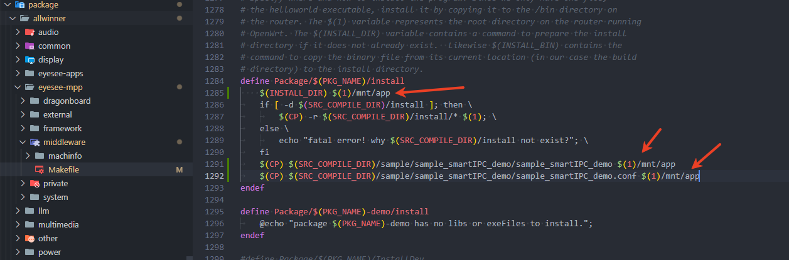

## MPP Sample 测试时SD卡识别异常

情况一：

在测试一些录流的 MPP Sample 之前，由于系统存储空间不足，需要准备 SD 卡。但是有时会碰到识别到的 SD 卡空间太小，格式化 SD 卡也没用。此时需要在Linux 环境下用 dd 命令删除前面的分区。

情况二：

某些客户方案上，SD卡默认没有mount。mount 的方法：

```
# mkdir /mnt/extsd/
# mount -t vfat /dev/mmcblk0 /mnt/extsd/
或
# mount -t vfat /dev/mmcblk0p1 /mnt/extsd/
```

## 视频编解码常用功能检查方法

### 常用检测工具介绍

#### 码流播放软件

测试时，检查编码后的文件是否正常，一般需要使用 VLC 等播放软件看下是否有花屏、马赛克、卡顿等问题。

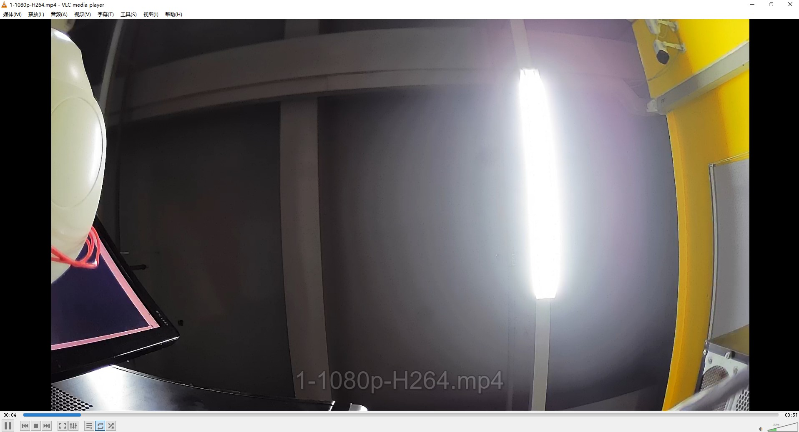

#### 码流分析软件

测试时，检查编码参数是否符合预期，一般需要使用 MediaInfo 软件。

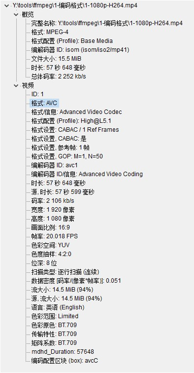

#### YUV文件分析软件

分析YUV文件一般使用 YUView 软件。

为使工具分析能力更强，需要配置 ffmpeg 动态库。

YUView 工具配置 ffmpeg 动态库的方式：

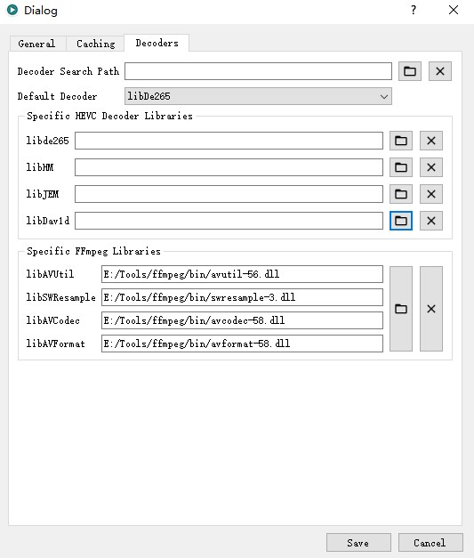

#### H264 码流分析工具

常用的 H264 码流分析工具：Elescard StreamEye。

该工具可解析帧类型信息、流的信息等，支持逐帧播放和分析编码层内容等。

### 典型的视频编解码功能检测示例

#### 编码格式

使用 MediaInfo 软件检查编码格式。

-   格式: HEVC。

#### 彩转灰

使用 PC 软件 VLC 播放彩转灰测试生成的视频文件，效果如下：

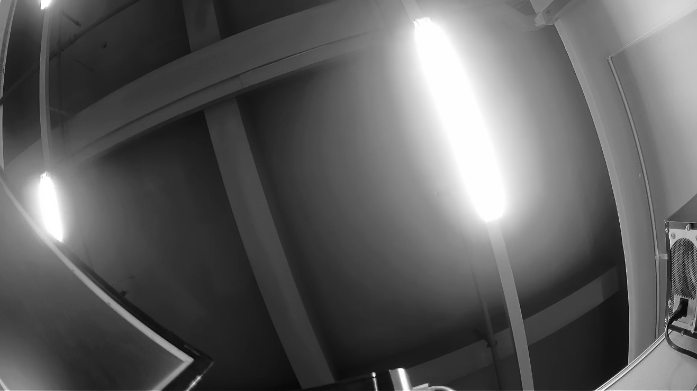

#### 旋转编码

使用PC软件VLC播放测试生成的视频文件，效果如下：

1.  第一组

-   不旋转、不翻转的效果。
    
-   不旋转、翻转的效果。
    
-   旋转90度、不翻转的效果。
    
-   旋转90度、翻转的效果。
    

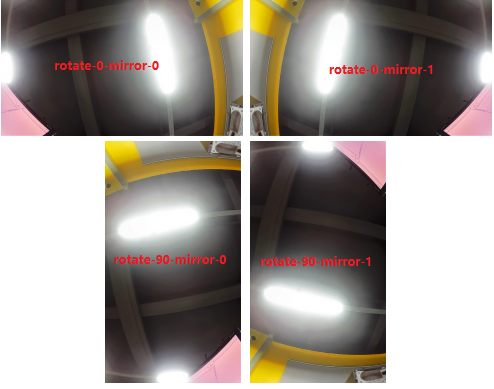

2.  第二组

-   旋转180度、不翻转的效果。
    
-   旋转180度、翻转的效果。
    
-   旋转270度、不翻转的效果。
    
-   旋转270度、翻转的效果。
    

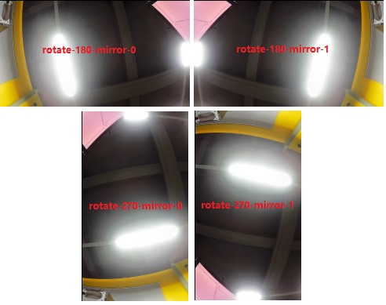

#### P帧帧内刷新

H264：

使用 Elescard StreamEye 4.6 工具（只支持H264），按如下截图配置后，开启P帧帧内刷新后，图像看到一个橙色的竖状矩形条，同时逐帧往后查看时矩形条会从左往右移动；关闭P帧帧内刷新后，则无此矩形条。

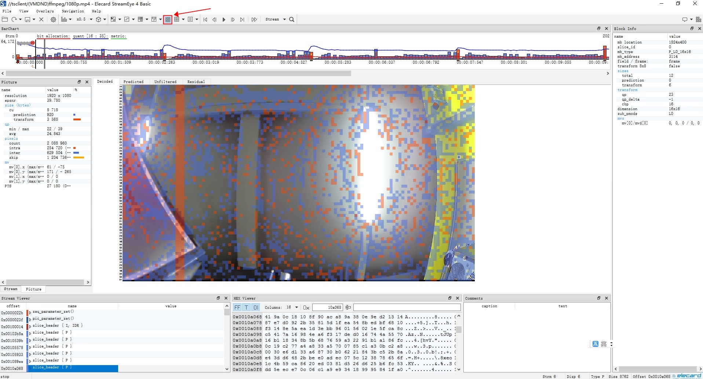

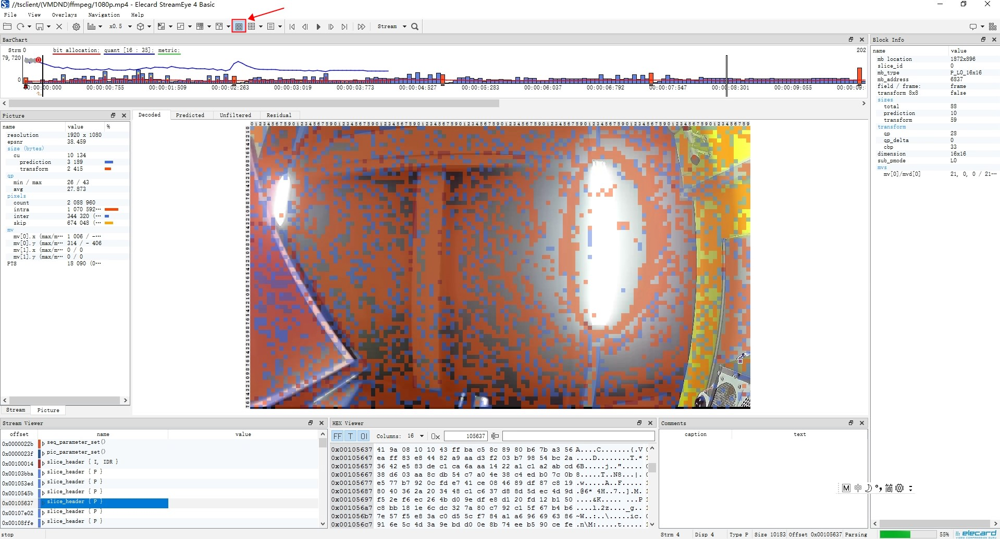

H265：

使用 YUView 工具（需要配置 ffmpeg 动态库）可分析 H265 文件，勾选 Pred Mode 后，可显示一个蓝色的竖状矩形条，同时逐帧往后查看时矩形条会从左往右移动；关闭P帧帧内刷新后，则无此矩形条。

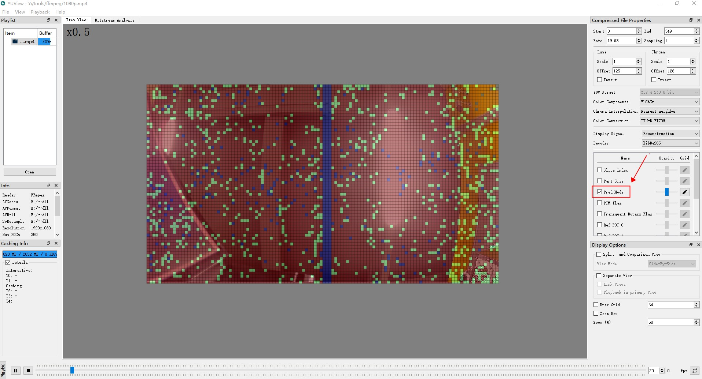

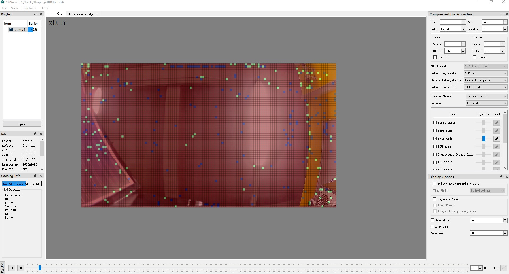

#### 视频编码 OSD

使用PC软件VLC播放测试生成的视频文件，效果如下：

-   显示OSD的效果：

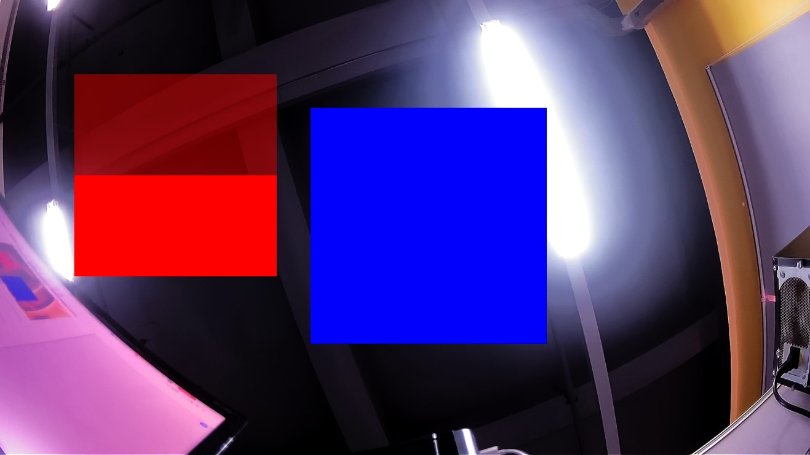

-   改变 Region 位置后，显示OSD的效果：

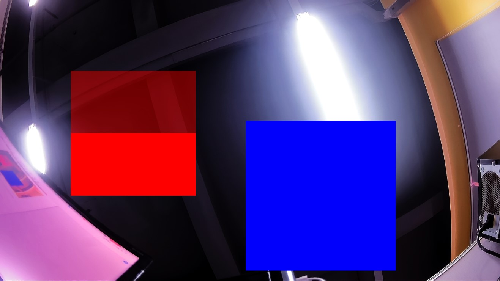

-   OSD坐标和大小示意图

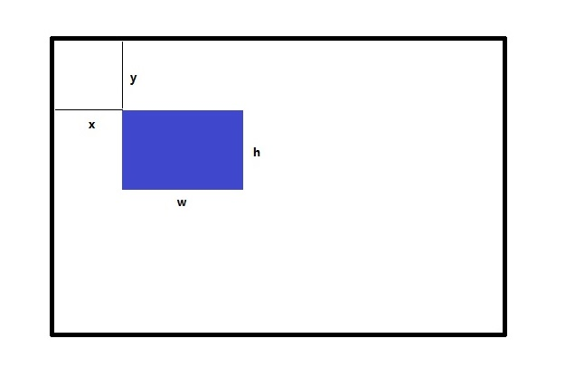

## 音频编解码常用功能检查方法

### 常用检测工具介绍

-   普通效果测试

将测试生成的 WAV 文件拷贝到 PC 端使用 Windows Media Player 播放。

-   专业波形测试

专业的音频波形分析软件：Audacity。

比如测试回声消除效果时，可借助该工具分析。

**使用说明**

检测采集通道的数据和回采通道的数据的延迟关系是否正确。

需要特殊的正弦波文件tone\_16k\_accurate.wav，tone\_8k\_accurate.wav。

一般采集通道的数据应该稍微延迟一些。

**操作步骤**

1.  为进行专业波形测试，需修改代码，`audio_hw.c` 中打开宏 `#define AI_HW_AEC_DEBUG_EN`。
    
2.  然后编译 `sample_aec`，这样底层模块在运行过程中会保存采集通道的数据和回采通道的数据。
    
3.  再用软件 `Audacity` 进行分析，从波形上看延迟时间是否正常。
    

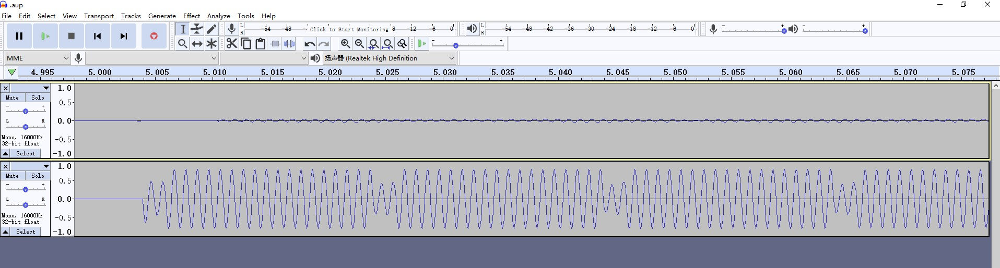
