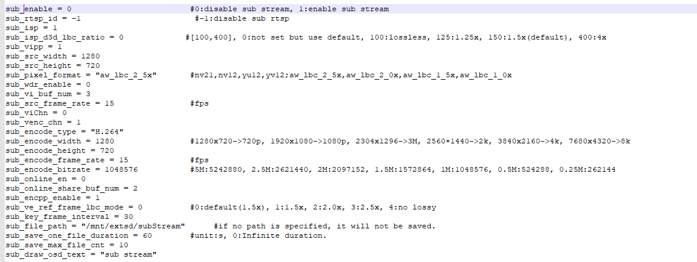
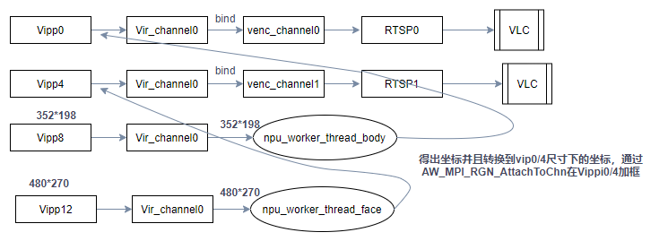

# MPP 智能 IPC 场景功能

| Sample 名称 | sample\_smartIPC\_demo |
| --- | --- |
| 功能概述 | 演示智能IPC的场景，通过RTSP方式查看编码码流的场景。同时支持多路编码，单双目，拼接，识别类型上支持人形和移动侦测 |
| 组件依赖 | 无 |
| Sample 路径 | platform/allwinner/eyesee-mpp/middleware/sun300iw1/sample/sample\_driverVipp |
| 输入文件 | 无 |
| 输出文件 | 编码码流，视频文件，拍照 |

## 前置条件

1.  板子上要有网口或功能。
2.  PC上装VLC软件。开发板连接上SD卡，且SD卡工作正常。
3.  开发板连接上SD卡，且SD卡工作正常。

## 配置场景

编辑 `sample_smartIPC_demo.conf`， 配置主码流为 `1280x720@30fps`，子码流为 `640x480@30fps` ，方式为在线编码，开启音频，开启录音，开启抓拍，开启码流保存的功能。配置使用 Wi-Fi 进行 RTSP 推流。

### 配置文件参数功能

在 `sample_smartIPC_demo.conf` 中有许多配置项，用于配置场景的功能。

**全局配置项**

| 配置项 | 含义 | 示例 | 关注程度 |
| --- | --- | --- | --- |
| `rtsp_net_type` | RTSP网络类型，0: "lo", 1: "eth0", 2: "br0", 3: "wlan0" | 3 | 需要关注，根据网络类型修改 |
| `ve_rec_ref_buf_reduce_enable` | 是否启用缓冲区减少，0:禁用，1:启用 | 1 | 默认配置即可 |
| `stream_buf_size` | 流缓冲区大小，0:默认1/10 yuv420大小，-1: vbv缓冲区大小，>0:用户设置的缓冲区大小，单位：字节 | 0 | 默认配置即可 |
| `product_mode` | 产品模式，0:静态IPC，1:动态IPC，2:门铃，3:CNR，4:SDV，5:投影，6:无人机 | 0 | 默认配置即可 |
| `vbr_opt_en` | 启用新的VBR比特率控制，0:旧的VBR比特率控制，1:新的VBR比特率控制 | 1 | 默认配置即可 |
| `vbr_opt_rc_priority` | VBR优先级设置，0:质量优先，1:比特率优先，2:平均比特率优先，3:瞬时比特率优先 | 0 | 默认配置即可 |
| `rc_mode` | H264编码模式，0:CBR，1:VBR，2:FIXQP（仅调试使用） | 1 | 默认配置即可 |
| `init_qp` | 初始QP值，影响视频的质量和压缩程度 | 37 | 默认配置即可 |
| `min_i_qp` | I帧最小QP值 | 25 | 默认配置即可 |
| `max_i_qp` | I帧最大QP值 | 45 | 默认配置即可 |
| `min_p_qp` | P帧最小QP值 | 25 | 默认配置即可 |
| `max_p_qp` | P帧最大QP值 | 45 | 默认配置即可 |
| `moving_th` | 运动检测阈值，范围\[1,31\] | 20 | 默认配置即可 |
| `mb_qp_limit_en` | 是否启用MB级QP限制，1:启用 | 1 | 默认配置即可 |
| `quality` | 静态场景P帧bit数权重系数，值越大，P帧比特数占比越大 | 1 | 默认配置即可 |
| `p_bits_coef` | I帧额外bit数权重系数，影响I帧和P帧的比特数分配 | 10 | 默认配置即可 |
| `i_bits_coef` | P帧额外bit数权重系数，影响I帧和P帧的比特数分配 | 10 | 默认配置即可 |
| `isp_ve_linkage_enable` | ISP与VE联动策略开关，1:启用，0:禁用 | 1 | 默认配置即可 |
| `region_link_enable` | 局部联动开关，1:启用，0:禁用 | 1 | 默认配置即可 |
| `region_link_tex_detect_enable` | 局部联动纹理检测开关，1:启用，0:禁用 | 1 | 默认配置即可 |
| `region_link_motion_detect_enable` | 局部联动运动检测开关，1:启用，0:禁用 | 1 | 默认配置即可 |
| `camera_adaptive_moving_and_static_enable` | 编码自适应判断运动和静止，1:启用，0:禁用 | 1 | 默认配置即可 |
| `ve_lens_moving_max_qp` | 摄像头旋转时最大QP值，仅在摄像机状态为CAMERA\_ADAPTIVE\_MOVING = 3时有效 | 40 | 默认配置即可 |
| `wb_yuv_enable` | 是否启用回写YUV，0:禁用，1:启用 | 0 | 默认配置即可 |
| `wb_yuv_buf_num` | 编码回写YUV的缓冲区数量 | 3 | 默认配置即可 |
| `wb_yuv_scaler_ratio` | 回写YUV缩放比例，0:无缩放，1:1/8，2:1/2，3:1/4 | 0 | 默认配置即可 |
| `wb_yuv_start_index` | 回写YUV的起始帧序号 | 0 | 默认配置即可 |
| `wb_yuv_total_cnt` | 回写的总帧数 | 100 | 默认配置即可 |
| `wb_yuv_stream_channel` | 回写YUV的编码通道ID | 0 | 默认配置即可 |
| `wb_yuv_file_path` | 回写YUV文件的路径 | "/mnt/extsd/wb\_yuv.yuv" | 默认配置即可 |
| `vi_timeout_reset_disable` | 是否禁用VI超时复位，0:启用，>0:禁用 | 0 | 默认配置即可 |
| `test_trigger_vi_timeout` | 启用VI超时测试，单位：毫秒，0:禁用，>0:启用 | 0 | 默认配置即可 |
| `encpp_sharp_debug_disable` | 启用/禁用ENCPP锐化调试，0:启用，>0:禁用 | 0 | 默认配置即可 |
| `tdm_speed_down_enable` | 是否启用TDM速度下降功能，0:禁用，1:启用 | 0 | 默认配置即可 |
| `ve_2dnr_disable` | VE 2D降噪功能开关，0:启用，>0:禁用 | 0 | 默认配置即可 |
| `ve_3dnr_disable` | VE 3D降噪功能开关，0:启用，>0:禁用 | 0 | 默认配置即可 |
| `test_duration` | 测试持续时间，单位：秒，0:无限持续时间 | 0 | 默认配置即可 |

**音频相关测试**

| 配置项 | 含义 | 示例 | 关注程度 |
| --- | --- | --- | --- |
| `audio_test_enable` | 音频使能开关，0: 禁用，1: 启用 | 0 | 需要便可打开 |
| `capture_en` | 录音开关，1: 启用，0: 禁用 | 1 | 需要便可打开 |
| `capture_sample_rate` | 录音采样率，单位：Hz，常见值为8000, 16000, 44100等 | 16000 | 默认配置即可 |
| `capture_bit_witdh` | 录音位宽，通常为16位或更高（8位，16位，24位等） | 16 | 默认配置即可 |
| `capture_channel_cnt` | 录音通道个数，通常为1（单声道）或2（立体声） | 1 | 默认配置即可 |
| `capture_ans_en` | 是否启用ANS（噪声抑制算法），1: 启用，0: 禁用 | 1 | 默认配置即可 |
| `capture_agc_en` | 是否启用AGC（自动增益控制算法），1: 启用，0: 禁用 | 1 | 默认配置即可 |
| `capture_aec_en` | 是否启用AEC（回声消除算法），1: 启用，0: 禁用 | 1 | 默认配置即可 |
| `capture_save_file` | 录音文件保存路径和文件名前缀 | "/mnt/extsd/capture\_" | 默认配置即可 |
| `capture_save_file_max_cnt` | 最大录音文件数量，达到此数目时会覆盖最早的录音文件 | 10 | 默认配置即可 |
| `capture_save_file_duration` | 每个录音文件的最大持续时间，单位：秒，超过此时间会保存为新文件 | 600 | 默认配置即可 |
| `playback_en` | 音频回放开关，1: 启用，0: 禁用 | 1 | 需要便可打开 |
| `playback_volume` | 音频回放音量，范围通常为0（静音）到100（最大音量） | 80 | 默认配置即可 |
| `playback_file` | 回放音频文件路径和文件名 | "/mnt/extsd/test.wav" | 默认配置即可 |

**移动侦测相关**

这是您提供的与移动侦测（Motion Alarm）相关的配置项的详细说明：

| 配置项 | 含义 | 示例 | 关注程度 |
| --- | --- | --- | --- |
| `motionAlarm_on` | 移动侦测开关，0: 禁用，1: 启用 | 0 | 总开关 |
| `motionAlarm_result_print_interval` | 结果打印的间隔，单位为fps（每秒帧数），表示侦测结果输出的频率 | 50 | 按需修改 |
| `motionAlarm_sensitivity` | 移动侦测灵敏度，值越大侦测越灵敏。支持的取值：20, 40, 60, 80, 100 | 60 | 按需修改 |
| `motionAlarm_support_zone` | 是否启用支持区域，1: 启用，0: 禁用 | 1 | 按需修改 |
| `motionAlarm_left_up_x` | 支持区域左上角x坐标 | 0 | 按需修改 |
| `motionAlarm_left_up_y` | 支持区域左上角y坐标 | 0 | 按需修改 |
| `motionAlarm_left_bottom_x` | 支持区域左下角x坐标 | 0 | 按需修改 |
| `motionAlarm_left_bottom_y` | 支持区域左下角y坐标 | 10000 | 按需修改 |
| `motionAlarm_right_bottom_x` | 支持区域右下角x坐标 | 10000 | 按需修改 |
| `motionAlarm_right_bottom_y` | 支持区域右下角y坐标 | 10000 | 按需修改 |
| `motionAlarm_right_up_x` | 支持区域右上角x坐标 | 10000 | 按需修改 |
| `motionAlarm_right_up_y` | 支持区域右上角y坐标 | 0 | 按需修改 |
| `motionAlarm_useDefaultCfgEnable` | 是否启用默认配置，1: 启用，0: 禁用 | 1 | 按需修改 |
| `motionAlarm_HorizontalRegionNum` | 水平区域划分数，表示将监控区域分为多少水平区域（用于灵敏度分级） | 15 | 按需修改 |
| `motionAlarm_VerticalRegionNum` | 垂直区域划分数，表示将监控区域分为多少垂直区域（用于灵敏度分级） | 8 | 按需修改 |
| `motionAlarm_Threshold_High` | 高灵敏度触发的阈值，值较小意味着容易触发移动侦测 | 2 | 按需修改 |
| `motionAlarm_Threshold_MediumHigh` | 中高灵敏度触发的阈值 | 3 | 按需修改 |
| `motionAlarm_Threshold_Default` | 默认灵敏度触发的阈值 | 5 | 按需修改 |
| `motionAlarm_Threshold_MediumLow` | 中低灵敏度触发的阈值 | 10 | 按需修改 |
| `motionAlarm_Threshold_Low` | 低灵敏度触发的阈值 | 36 | 按需修改 |

**主码流配置**

| 配置项 | 含义 | 示例 | 关注程度 |
| --- | --- | --- | --- |
| `main_enable` | 是否启用主码流，0: 禁用，1: 启用 | 1 | 总开关 |
| `main_rtsp_id` | 主流的RTSP流ID，-1表示禁用RTSP流 | \-1 | 启用RTSP需要配置 |
| `main_isp` | ISP（图像信号处理）设备序号 | 0 | 默认配置即可 |
| `main_isp_d3d_lbc_ratio` | D3D失真压缩比例，\[100, 400\]，0表示使用默认设置，100为无损，150为默认的1.5x | 0 | 默认配置即可 |
| `main_vipp` | VIPP（视频输入预处理）设备序号 | 0 | 输入设备，针对拼接模式需要设置为 1 |
| `main_src_width` | 输入视频流的宽度，单位：像素 | 1280 | 按需修改 |
| `main_src_height` | 输入视频流的高度，单位：像素 | 720 | 按需修改 |
| `main_pixel_format` | 输入视频流的像素格式，支持 `nv21`,`nv12`,`yu12`,`yv12`;`aw_lbc_2_5x`,`aw_lbc_2_0x`,`aw_lbc_1_5x`,`aw_lbc_1_0x` 格式 | `aw_lbc_2_5x` | 按需修改 |
| `main_wdr_enable` | 是否启用宽动态范围（WDR）功能，0: 禁用，1: 启用 | 0 | 按需修改 |
| `main_vi_buf_num` | 输入视频流的缓冲区数量，离线编码使用这个值 | 3 | 默认配置即可 |
| `main_src_frame_rate` | 输入视频流的帧率，单位：帧/秒 (fps) | 15 | 按需修改 |
| `main_vi_stitch_mode` | 输入视频流拼接模式：0: 无拼接，1: 2合1纵向拼接，2: 水平拼接，3: 垂直拼接 | 0 | 按需修改 |
| `main_viChn` | 虚拟输入通道号 | 0 | 按需修改 |
| `main_venc_chn` | 视频编码通道号 | 0 | 按需修改 |
| `main_encode_type` | 编码类型，常见编码格式为 `H.264` 或 `H.265` | `H.264` | 按需修改 |
| `main_encode_width` | 编码后视频流的宽度，单位：像素 | 1280 | 按需修改 |
| `main_encode_height` | 编码后视频流的高度，单位：像素 | 720 | 按需修改 |
| `main_encode_frame_rate` | 编码后视频流的帧率，单位：帧/秒 (fps) | 15 | 按需修改 |
| `main_encode_bitrate` | 编码后视频流的比特率，单位：比特/秒（bps） | 1048576 | 按需修改 |
| `main_online_en` | 是否启用在线编码，0: 禁用，1: 启用 | 0 | 按需修改 |
| `main_online_share_buf_num` | 在线编码的缓冲区数量，启用在线编码会忽略`main_vi_buf_num` | 2 | 按需修改 |
| `main_encpp_enable` | 是否启用增强型视频处理（ENC++），用于提升图像锐度 | 1 | 按需修改 |
| `main_ve_ref_frame_lbc_mode` | 参考帧失真压缩模式，0: 默认1.5倍压缩，1: 1.5倍，2: 2倍，3: 2.5倍，4: 无损压缩 | 0 | 按需修改 |
| `main_key_frame_interval` | I帧（关键帧）间隔，单位：帧 | 30 | 按需修改 |
| `main_file_path` | 编码后视频文件的保存路径 | `/mnt/extsd/mainStream` | 按需修改 |
| `main_save_one_file_duration` | 单个视频文件的保存时长，单位：秒，0表示无限时长 | 60 | 按需修改 |
| `main_save_max_file_cnt` | 最大保存的视频文件数量 | 10 | 按需修改 |
| `main_draw_osd_text` | OSD（屏幕显示）文本，显示在视频流上的文字 | `"main stream"` | 按需修改 |

**主码流其他配置（一般不需要修改）**

| 配置项 | 含义 | 示例 |
| --- | --- | --- |
| `main_isp_test_enable` | 启用或禁用ISP测试功能，0: 禁用，1: 启用 | 0 |
| `main_isp_test_interval_ms` | ISP测试的间隔时间，单位：毫秒 | 2000 |
| `main_detect_mipi_desk_en` | 启用或禁用MIPI接口抖动检测功能，0: 禁用，1: 启用 | 0 |
| `main_detect_mipi_interv_ms` | MIPI抖动检测的时间间隔，单位：毫秒 | 1000 |
| `main_detect_mipi_channel` | MIPI通道选择，0: MIPI0/MIPIA，1: MIPI1/MIPIB | 0 |
| `main_venc_recreate_enable` | 启用或禁用动态切换编码设置（如编码格式、帧率、码率等），0: 禁用，1: 启用 | 0 |
| `main_venc_recreate_loop_cnt` | 动态切换的循环次数，`-1`表示无限循环 | \-1 |
| `main_venc_recreate_interval` | 切换编码配置的时间间隔，单位：秒 | 10 |
| `main_venc_recreate_encoder` | 切换后的编码格式（如 H.264, H.265 等） | `"H.264"` |
| `main_venc_recreate_framerate` | 切换后的帧率，单位：帧/秒（fps） | 15 |
| `main_venc_recreate_bitrate` | 切换后的码率，单位：比特/秒（bps） | 1048576 |
| `main_venc_recreate_dst_width` | 切换后的分辨率宽度，单位：像素 | 1280 |
| `main_venc_recreate_dst_height` | 切换后的分辨率高度，单位：像素 | 720 |
| `main_venc_recreate_key_frame_interval` | 切换后的I帧间隔，单位：帧 | 30 |
| `main_isp_tdm_raw_process_type` | 控制TDM原始数据处理的类型，`-1`禁用，其他值表示不同的处理方式 | \-1 |
| `main_isp_tdm_raw_width` | TDM原始数据的宽度，单位：像素 | 1280 |
| `main_isp_tdm_raw_height` | TDM原始数据的高度，单位：像素 | 720 |
| `main_isp_tdm_raw_rxbuf_num` | 接收缓冲区的数量 | 5 |
| `main_isp_tdm_raw_process_frame_cnt_min` | 最小处理帧数 | 0 |
| `main_isp_tdm_raw_process_frame_cnt_max` | 最大处理帧数 | 5 |
| `main_isp_tdm_raw_file_path` | TDM原始数据的保存路径（如果保存） | `/mnt/extsd/tdm_raw.bin` |
| `main_offline_raw_simulate_type` | 离线原始数据模拟类型，`-1`禁用，其他值控制模拟行为 | \-1 |
| `main_offline_raw_type` | 离线原始数据的格式，定义了不同的原始数据类型 | 43 |
| `main_offline_raw_simulate_cnt_start` | 离线原始数据模拟的起始帧数 | 0 |
| `main_offline_raw_simulate_cnt_end` | 离线原始数据模拟的结束帧数 | 19 |
| `main_offline_raw_file_path` | 离线原始数据文件的路径（读取原始数据） | `/mnt/extsd/test.bin` |

**子码流配置**

| 配置项 | 含义 | 示例 |
| --- | --- | --- |
| `main_2nd_enable` | 启用或禁用子码流功能，0: 禁用，1: 启用 | 0 |
| `main_2nd_vipp` | 子码流的输入虚拟接口端口（VIP）编号，通常与视频输入通道对应 | 4 |
| `main_2nd_src_width` | 子码流的输入宽度，单位：像素 | 640 |
| `main_2nd_src_height` | 子码流的输入高度，单位：像素 | 480 |
| `main_2nd_pixel_format` | 子码流的输入像素格式，通常为YUV格式，`nv21` 是一种常见格式 | "nv21" |
| `main_2nd_vi_buf_num` | 输入缓存区的数量，指定从视频输入接口读取图像时的缓存大小 | 3 |
| `main_2nd_src_frame_rate` | 子码流输入的帧率，单位：帧/秒 | 15 |
| `main_2nd_vi_stitch_mode` | 输入视频拼接模式，定义多路视频信号如何拼接，常见模式如横向或纵向拼接 | 0 |
| `main_2nd_viChn` | 子码流使用的虚拟通道号，与其他视频流分开配置 | 0 |

**子码流视频编码设置**

| 配置项 | 含义 | 示例 |
| --- | --- | --- |
| `main_2nd_venc_chn` | 子码流的编码通道，指定子码流所使用的视频编码通道 | 2 |
| `main_2nd_encode_type` | 子码流使用的编码类型，如 `H.264`、`H.265` 等 | "H.264" |
| `main_2nd_encode_width` | 子码流编码后的输出宽度，单位：像素 | 640 |
| `main_2nd_encode_height` | 子码流编码后的输出高度，单位：像素 | 480 |
| `main_2nd_encode_frame_rate` | 子码流编码后的帧率，单位：帧/秒 | 15 |
| `main_2nd_encode_bitrate` | 子码流编码后的码率，单位：比特/秒（bps） | 262144 |
| `main_2nd_key_frame_interval` | 子码流编码中的I帧间隔，单位：帧 | 30 |
| `main_2nd_file_path` | 子码流保存的文件路径（如果启用保存功能） | "/mnt/extsd/main2ndStream" |
| `main_2nd_save_one_file_duration` | 每个保存文件的最大持续时间，单位：秒 | 60 |
| `main_2nd_save_max_file_cnt` | 最大保存文件数量 | 10 |

**子码流拍照功能**

| 配置项 | 含义 | 示例 |
| --- | --- | --- |
| `main_2nd_take_picture` | 启用或禁用抓拍功能，0: 禁用，1: 启用 | 0 |
| `main_2nd_take_picture_viChn` | 用于抓拍的虚拟视频输入通道，确保与编码通道不同 | 1 |
| `main_2nd_take_picture_venc_chn` | 用于抓拍的编码通道，通常使用JPEG编码 | 8 |
| `main_2nd_take_picture_interval` | 拍照的时间间隔，单位：秒 | 10 |
| `main_2nd_take_picture_file` | 抓拍图片保存的路径 | "/mnt/extsd/main\_2nd\_pic" |
| `main_2nd_take_picture_file_cnt` | 最大保存的抓拍图片数量 | 10 |
| `main_2nd_take_picture_only_capture_yuv` | 是否仅捕获YUV图像，0: 启用JPEG保存，1: 只捕获YUV数据 | 0 |

**子码流人形检测设置**

| 配置项 | 含义 | 示例 |
| --- | --- | --- |
| `main_2nd_pdet_enable` | 启用或禁用人形检测功能，0: 禁用，1: 启用 | 0 |
| `main_2nd_pdet_viChn` | 人形检测使用的虚拟输入通道，确保与子码流或其他功能的通道不同 | 2 |
| `main_2nd_pdet_input_width` | 人形检测输入的图像宽度，单位：像素 | 320 |
| `main_2nd_pdet_input_height` | 人形检测输入的图像高度，单位：像素 | 192 |
| `main_2nd_pdet_input_channel` | 人形检测的输入通道，指定使用的YUV格式输入通道 | 3 |
| `main_2nd_pdet_conf_thres` | 人形检测的置信度阈值，低于此阈值的人形检测结果会被忽略 | 0.3 |
| `main_2nd_pdet_run_interval` | 人形检测的运行频率，单位：fps，默认是帧率的2倍 | 30 |

配置文件后面的 `sub_` 开头的配置对应的是副摄，其配置内容与主摄一样，在此不做过多说明。



## 测试通路



## 运行 Sample

执行命令

```
sample_smartIPC_demo -path sample_smartIPC_demo.conf
```
