# 快速开始使用

## 串口调试

核心板支持接出两路调试串口，分别为 RISC-V CPU Linux 核心串口 UART0，RISC-V MCU RTOS 核心串口 UART3，波特率均为 115200

核心板调试串口有两种接入方式：

- 使用 USB 拆分器接入串口：仅接出常用的 CPU 核心串口 UART0
- 使用 GPIO 接入串口：支持接出 CPU 核心串口 UART0 和 MCU 核心串口 UART3

**使用 USB 拆分器接入串口**

核心板设计之时复用了 TypeC 中的 SBU 信号线用于传输串口信号，这个串口是 UART0，与 PL4，PL5 并联。接入方法如下：

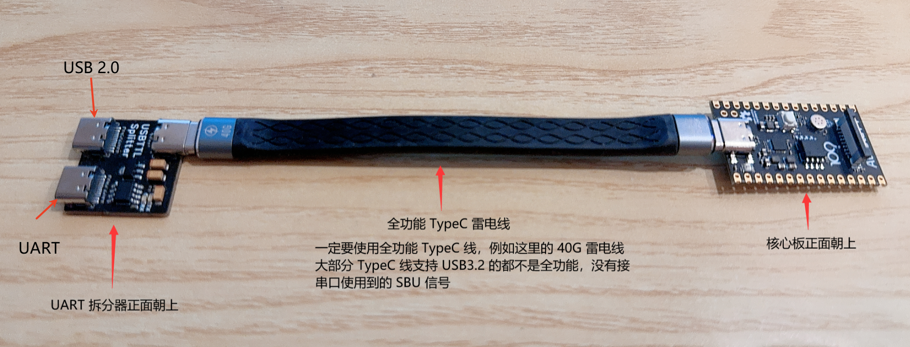

**使用 GPIO 接入串口**

核心板串口位于 PL 口，如下图所示，需要焊接或者排针接出。其中绿色的是 RISC-V MCU 核心串口，蓝色的是 RISC-V CPU 串口。

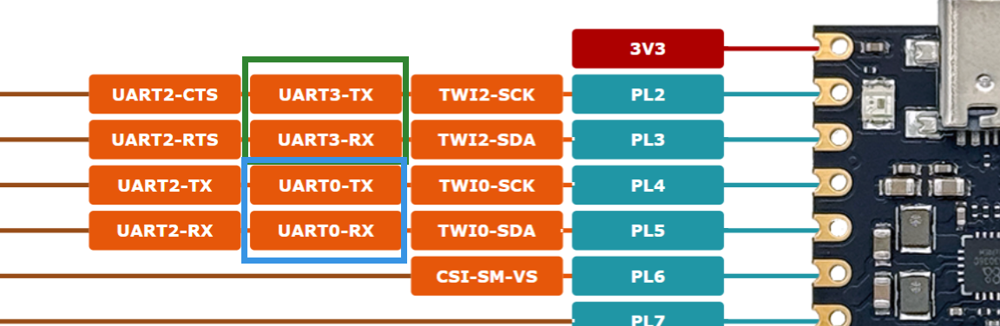

串口线打开电脑的设备管理器，确认串口号，例如这里是 COM5

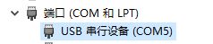

硬件连接完成后，使用串口终端访问，波特率 `115200` 。例如这里使用的 `PuTTY`

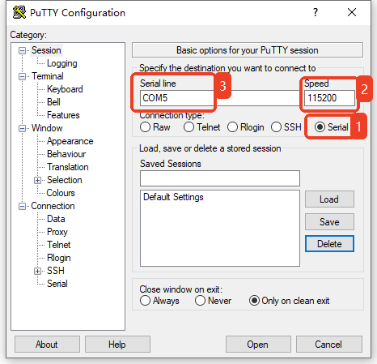

如果是刷入固件的核心板，上电后即可看到启动日志与控制台

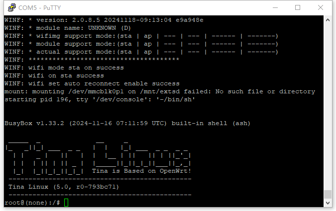

## ADB 调试

> 备注：
>
> 如果烧录的是 UVC 固件，UVC 会自动切换 USB 枚举为 UVC 设备，此时无法使用 ADB 调试。

在电脑上安装 ADB，打开 CMD 使用 `adb shell` 进入终端。

（1） 在 [全志开发者社区-资料下载 专区 ](https://www.aw-ol.com/downloads?cat=5)下载 ADB 工具 `ADB(tab自动补全版)` （2）下载后解压放到本地磁盘下（例如D盘的adb文件夹里）

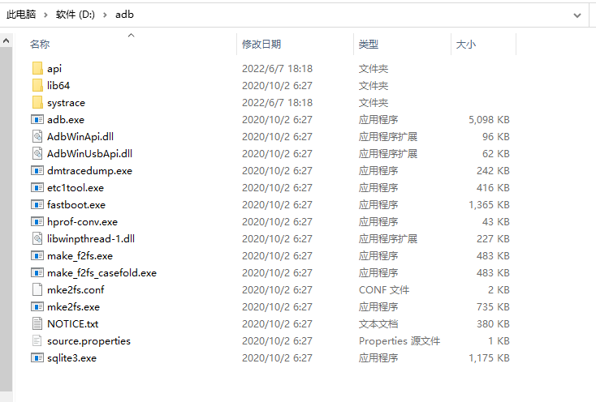

（3） 右键 ”此电脑“，属性，找到高级系统设置，点击环境变量，xxx用户的环境变量，Path，新增一个环境变量。

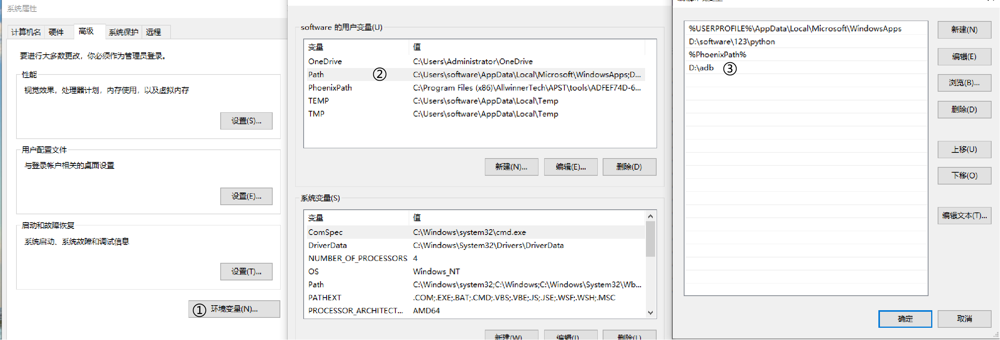

（4） 打开命令提示符，输入 `adb shell`

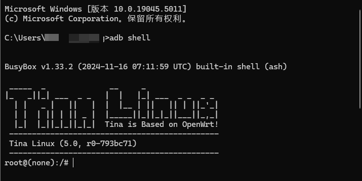

ADB 也可以作为文件传输使用，例如：

- 将 sample.mp4 上传到核心板 /mnt/UDISK 目录内

```text
C:\System> adb push sample.mp4 /mnt/UDISK
```

- 将 /mnt/UDISK/sample.mp4 下拉到当前目录内

```text
C:\System> adb pull /mnt/UDISK/sample.mp4
```

## 重启

在核心板终端 Linux 命令行中输入 `reboot` 即可重启。

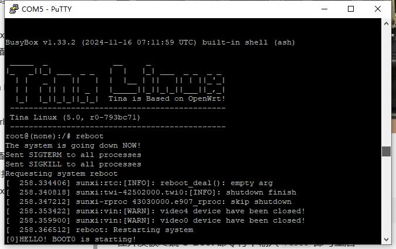

在核心板终端 U-Boot 命令行中输入 `reset` 即可重启。

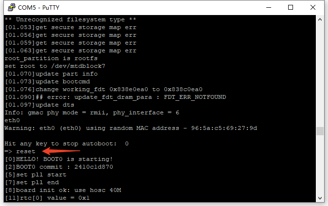

## 进入烧录模式

有多种方式可以让核心板进入烧录模式。

**按键进入烧录模式**

在核心板找到按键 `FEL`，断开USB，电源，

（1）按住 `FEL` 按键

（2）插入 USB 线

（3）等待电脑连接成功，松开 `FEL` 按键即可进入烧录模式

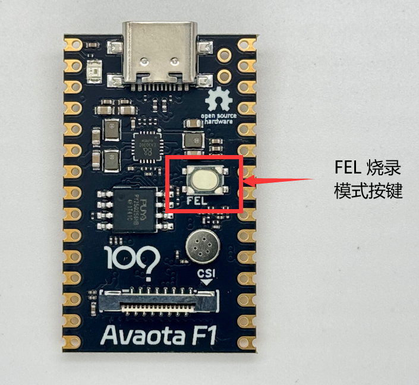

**命令行进入烧录模式**

在 Linux 命令行中输入 `reboot efex` 即可重启进入烧录模式

```text
reboot efex
```

在 U-Boot 命令行中输入 `efex` 即可重启进入烧录模式

```text
=> efex
```

**破坏启动介质进入烧录模式（SPI NOR）**

在 Linux 命令行中输入 `echo 000000 > /dev/mtd0`，破坏启动引导介质，重启后即可进入烧录模式

## WI-FI

**Wi-Fi 连接网络**

这里首先介绍如何使用 `wifi` 扫描网络：

（1）设置 `Wi-Fi` 为 `STATION` 模式

```text
wifi -o sta 
```

（2）扫描当前网络环境的 Wi-Fi 站点

```text
wifi -s
```

（3）连接Wi-Fi（SSID：awol，密码 1234567890）

```text
wifi -c awol 1234567890
```

（4）连接网络后输入 `ifconfig` 即可查看当前 ip 地址

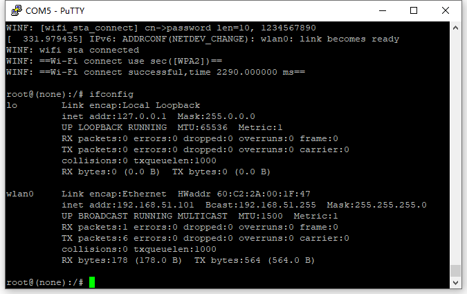

可以使用 `ping` 命令测试 网络连接

```text
ping www.baidu.com
```

它会输出以下内容

```text
PING 202.108.22.5 (202.108.22.5): 56 data bytes
64 bytes from 202.108.22.5: seq=0 ttl=49 time=48.734 ms
64 bytes from 202.108.22.5: seq=1 ttl=49 time=48.624 ms
64 bytes from 202.108.22.5: seq=2 ttl=49 time=58.370 ms
64 bytes from 202.108.22.5: seq=3 ttl=49 time=69.119 ms
64 bytes from 202.108.22.5: seq=4 ttl=49 time=49.635 ms
```

（5）断开Wi-Fi

```text
wifi -d
```

**Wi-Fi 建立 AP**

（1）创建热点 （SSID：v821，密码 12345678）

```text
wifi -o ap v821 12345678
```


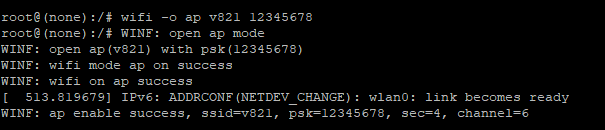

（2）然后就可以扫描到 Wi-Fi 了，输入密码 12345678 进行连接

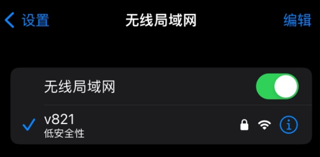

## 音频 MIC

**查看音频设备**

使用命令 `amixer` 可以列出全部音频设备

```text
amixer
Simple mixer control 'ADC',0
  Capabilities: volume volume-joined
  Playback channels: Mono
  Capture channels: Mono
  Limits: 0 - 255
  Mono: 160 [63%] [0.75dB]
Simple mixer control 'ADC DRC0 Mode',0
  Capabilities: enum
  Items: 'Off' 'On'
  Item0: 'Off'
Simple mixer control 'ADC DRC1 Mode',0
  Capabilities: enum
  Items: 'Off' 'On'
  Item0: 'Off'
Simple mixer control 'ADC HPF0 Mode',0
  Capabilities: enum
  Items: 'Off' 'On'
  Item0: 'Off'
Simple mixer control 'ADC HPF1 Mode',0
  Capabilities: enum
  Items: 'Off' 'On'
  Item0: 'Off'
Simple mixer control 'ADDA Loop Mode',0
  Capabilities: enum
  Items: 'Off' 'DAC-to-ADC'
  Item0: 'Off'
Simple mixer control 'DAC',0
  Capabilities: volume volume-joined
  Playback channels: Mono
  Capture channels: Mono
  Limits: 0 - 63
  Mono: 63 [100%] [-1.16dB]
Simple mixer control 'DAC DRC Mode',0
  Capabilities: enum
  Items: 'Off' 'On'
  Item0: 'Off'
Simple mixer control 'DAC HPF Mode',0
  Capabilities: enum
  Items: 'Off' 'On'
  Item0: 'Off'
Simple mixer control 'DACL',0
  Capabilities: volume volume-joined
  Playback channels: Mono
  Capture channels: Mono
  Limits: 0 - 255
  Mono: 160 [63%] [0.75dB]
Simple mixer control 'LINEOUT',0
  Capabilities: pswitch pswitch-joined
  Playback channels: Mono
  Mono: Playback [off]
Simple mixer control 'LINEOUT Gain',0
  Capabilities: volume volume-joined
  Playback channels: Mono
  Capture channels: Mono
  Limits: 0 - 31
  Mono: 31 [100%]
Simple mixer control 'LINEOUT Output Select',0
  Capabilities: enum
  Items: 'DIFFER' 'SINGLE'
  Item0: 'SINGLE'
Simple mixer control 'MIC',0
  Capabilities: pswitch pswitch-joined
  Playback channels: Mono
  Mono: Playback [off]
Simple mixer control 'MIC Gain',0
  Capabilities: volume volume-joined
  Playback channels: Mono
  Capture channels: Mono
  Limits: 0 - 31
  Mono: 31 [100%]
Simple mixer control 'SPK',0
  Capabilities: pswitch pswitch-joined
  Playback channels: Mono
  Mono: Playback [off]
Simple mixer control 'rx sync mode',0
  Capabilities: enum
  Items: 'Off' 'On'
  Item0: 'Off'
Simple mixer control 'tx hub mode',0
  Capabilities: enum
  Items: 'Off' 'On'
  Item0: 'Off'
```

**查看录音设备**

可以使用 `arecord -l` 命令查看核心板提供的录音设备。

```text
arecord -l
```

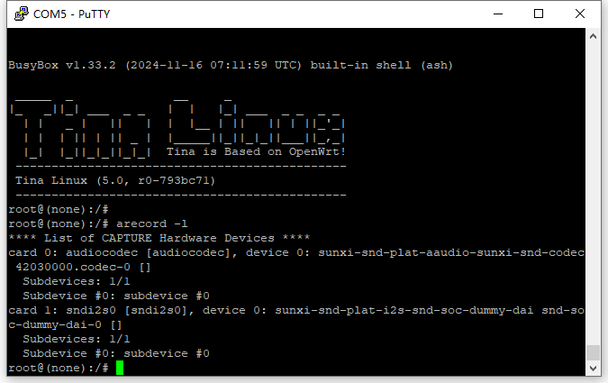

**麦克风录音**

V821 核心板板载一个麦克风，在录音之前，首先需要打开音频通路，配置内部 MIC0录制音频（需要 SDK 配置 `alsa-utils` 软件包才能直线 `amixer` 等命令）。

配置软件包方法：`make menuconfig`，勾选以下软件包

```text
Allwinner  --->
	Audio  --->
		<*> AudioSystem.......................................... AudioSystem library
		<*> aactd............................ Allwinner Audio Calibration Tool Daemon
		-*- aactd-lib....................... Allwinner Audio Calibration Tool Library
		<*> alsa-plugins-aw.............................. ALSA plugins from Allwinner
Sound  --->
	<*> alsa-utils............ ALSA (Advanced Linux Sound Architecture) utilities
```

（1）打开 MIC 通路

```text
amixer -Dhw:audiocodec cset name="MIC Switch" 1
```

输出如下，表示音频通路已开启

```text
numid=16,iface=MIXER,name='MIC Switch'
  ; type=BOOLEAN,access=rw------,values=1
  : values=on
```

（2）设置 MIC 音量

```text
amixer -Dhw:audiocodec cset name="MIC Gain" 10
```

输出如下，表示设置成功

```text
numid=15,iface=MIXER,name='MIC Gain'
  ; type=INTEGER,access=rw---R--,values=1,min=0,max=31,step=0
  : values=30
  | dBscale-min=0.00dB,step=1.00dB,mute=0
```

使用 `arecord -D hw:audiocodec -f S16_LE -t wav -r 16000 -d 3 t.wav` 命令，使用板载的麦克风进行录音。

```text
arecord -D hw:audiocodec -f S16_LE -t wav -r 16000 -d 3 t.wav
```

可以看到输出的 `t.wav` 文件

## 配套模块

### 摄像头模块

核心板套件配备了摄像头模块与配套的排线，请注意排线需要同向排线。

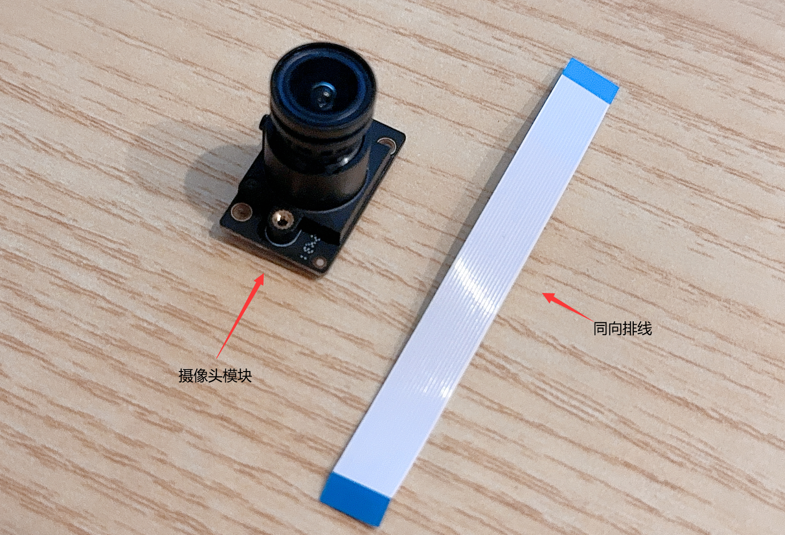

摄像头模组排线的 1 脚如图所示，蓝色塑料面朝上插入排线

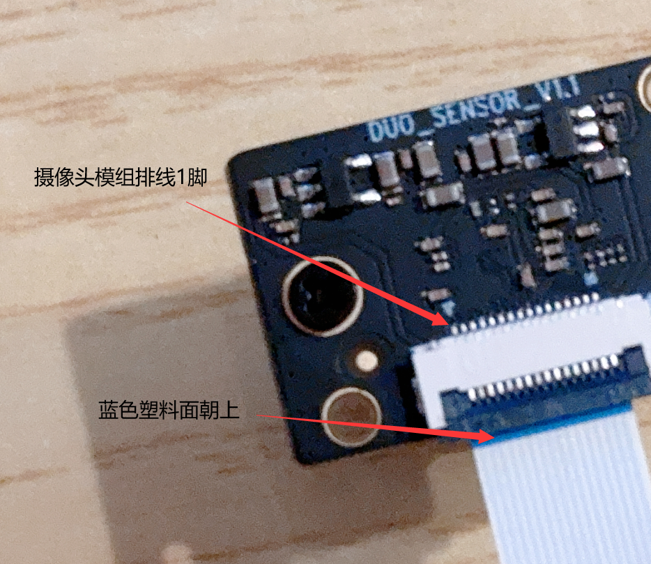

核心板摄像头接口的 1 脚

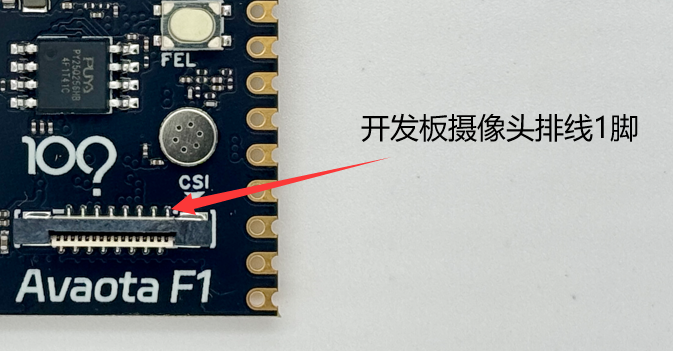

在接入时请确保 1 脚与 1 脚对应，否则会出现摄像头烧毁的风险。

- 金属触点这一面面向 Avaota F1 文字

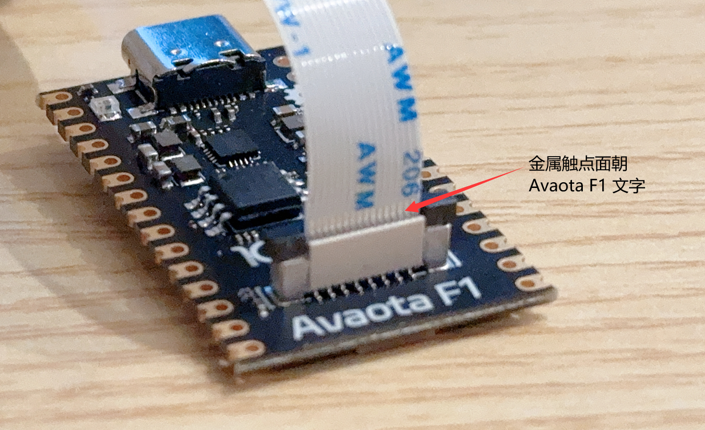

- 蓝色塑料这一面面向核心板内部

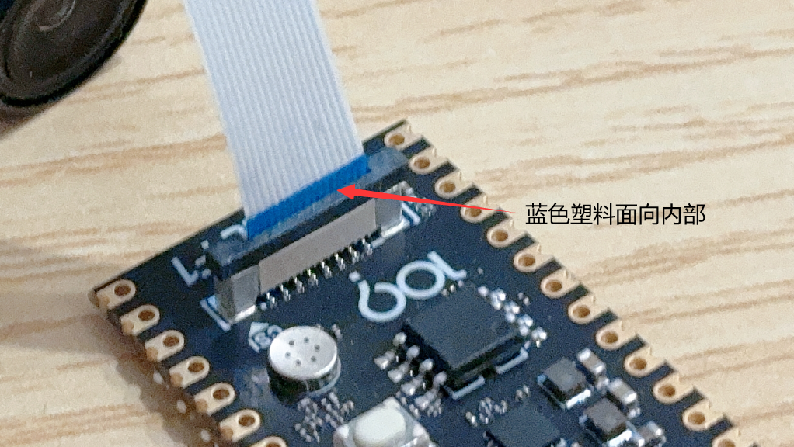

摄像头具体使用可以参考 【[SDK 功能演示体验](https://docs.aw-ol.com/docs/soc/v821/software/demo)】，具体演示如何编译运行一个 RTSP 测试 DEMO

### SPI 屏模块

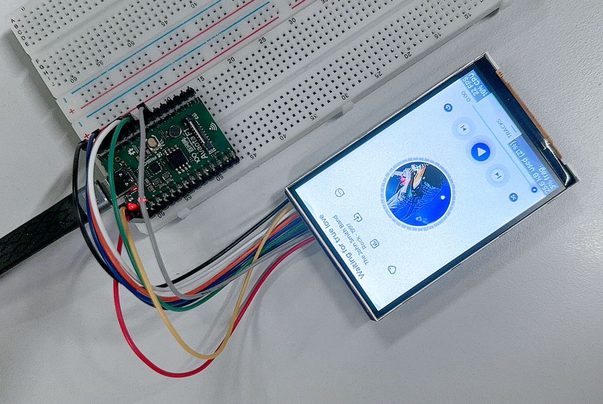

引脚接线方法如下：

| V821 | TFT 模块 |
| :--- | :------- |
| PD1  | CS       |
| PD2  | SCK      |
| PD3  | MOSI     |
| 3V3  | BLK      |
| PD4  | RESET    |
| PD5  | RS       |
| 3V3  | VCC      |
| GND  | GND      |

具体开发驱动说明请参考 【[DBI 驱动 ST7789V 3.5 寸 LCD](https://docs.aw-ol.com/docs/soc/v821/disp/spi_lcd/disp_driver_dbi_spi_3.5inch)】