# CKLINK调试器使用

## Avaota CKlink 

- 连接方式：CKLINK + 配套超级卡转接板 连接示意图，注意排线是异面排线，两边均下压连接。

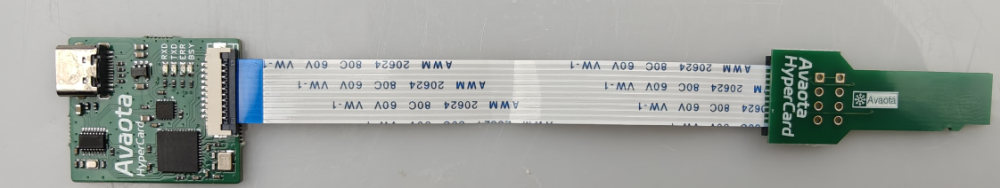

## 连接V821 AvaotaF1板

**注意插入CKLink需要板子先上电再插 否则会倒灌电导致无法启动**

**注意插入CKLink需要板子先上电再插 否则会倒灌电导致无法启动**

**注意插入CKLink需要板子先上电再插 否则会倒灌电导致无法启动**

连接方式参考下图所示，将CKLINK 连接好以后插到 v821芯片面的 TF卡卡座即可。

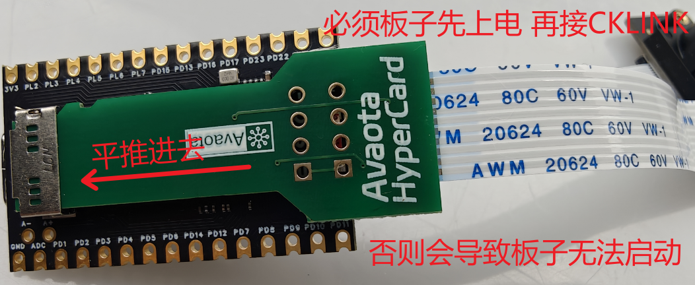

## 安装XuanTieDebugServer

进入到资料光盘：`04_硬件资料\00_CKLINK-E907资料\XuanTie Debug Server` 目录内,windows系统解压如下红框XuanTie-DebugServer-windows-V5.18.3-20241119-1930.zip ，之后点击 setup.exe 内程序开始安装。

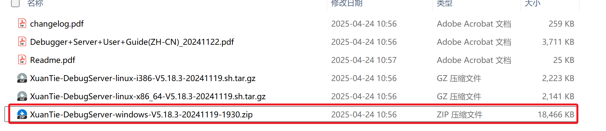

安装完成后，电脑桌面会多出来两个软件：

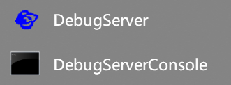

我们此时先讲开发进入到 烧录模式，进入烧录模式有两种。但都需要先关闭 全志线刷工具 **PhoenixSuit** ，避免被抢占烧写固件。

方式二：

AvaotaF1按住FEL键，接通TypeC上电，此时插入背面CKLINK 调试器（推荐）。 之后打开 DebugServer 参考 下下图 DebugServer设置即可。

方式一：

系统可以正常运行，在系统终端内，输入 `reboot efex `命令，系统自动进入烧录模式。接下来 运行 刚安装好的 DebugServer 程序。

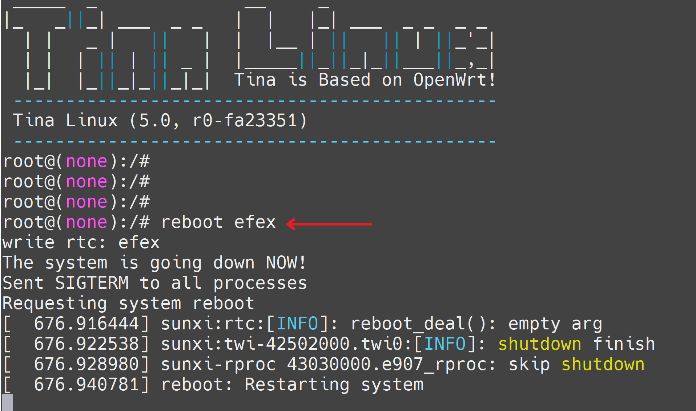

点击开始红色箭头指示的 开始 按钮，在弹出的新的对话框 提示是否升级，这里选择 否。

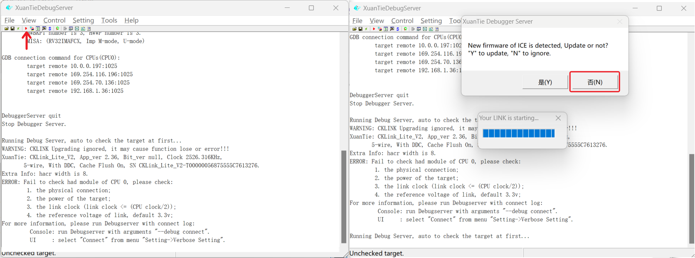

之后即可看到，CKLINK 已经连接成功。 通过红框内可以看出，已经识别出来了CPU是E907F ，因为这个调试器只能调试MCU 的E907所以识别出来是一个。

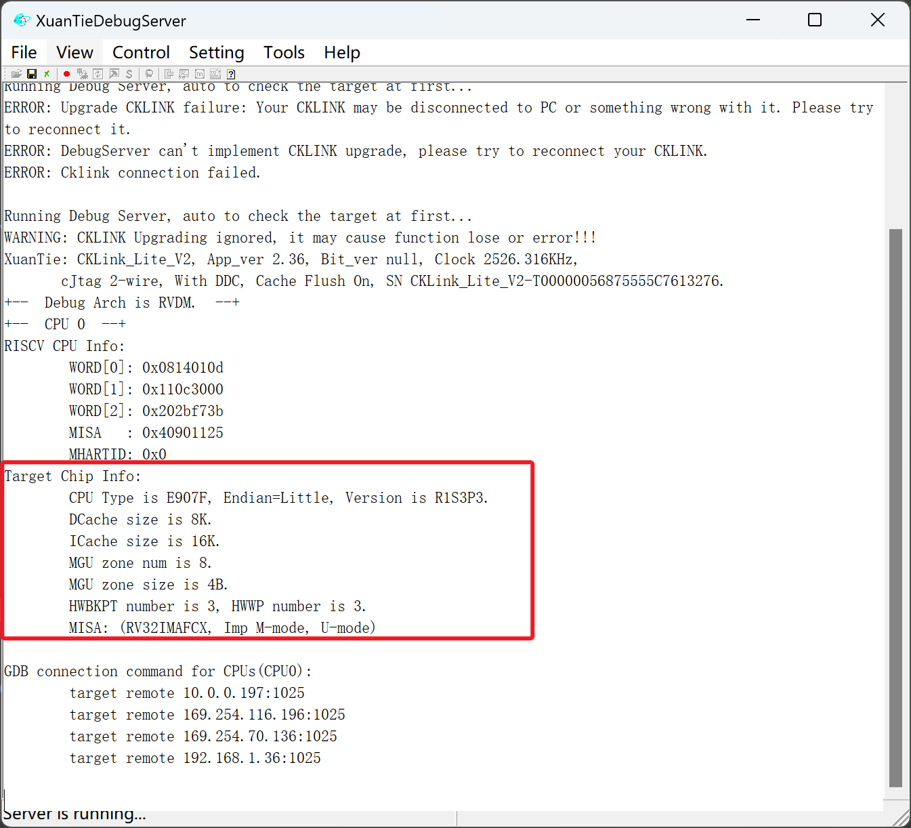

### 更多资料

可以查看资料光盘内`04_硬件资料\00_CKLINK-E907资料` 如下红框所示，更好去玩转E907 CPU.

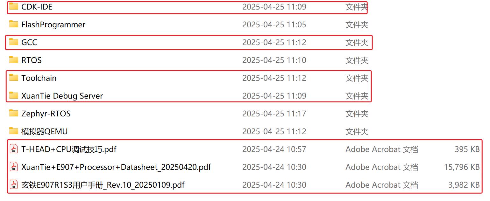

## 串口连接示意图

如下串口连接示意图是，目前套餐包含的 TypeC SBU模块，通过 TypeC分出两个接口，一个是标准的16Pin TypeC用来供电传输数据。 另一个 mx1.25 x3Pin连接器，配套杜邦线 + CH340 USB转TTL串口模块，来实现串口输出。

注意连接方式，一定要TypeC线在上，串口白色接线在下，如下图所示，其中串口连接模块 T 对应串口模块 RX，G 对应串口模块GND，R对应串口模块TX 这样去连接。

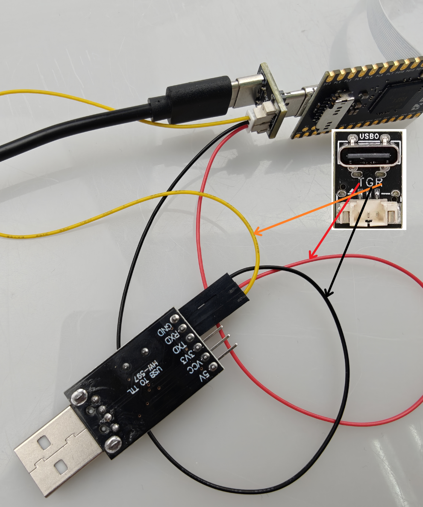

连接完成后整体示意图如下。串口模块和 TypeC都同时连接至电脑即可。

## 所有模块连接完成

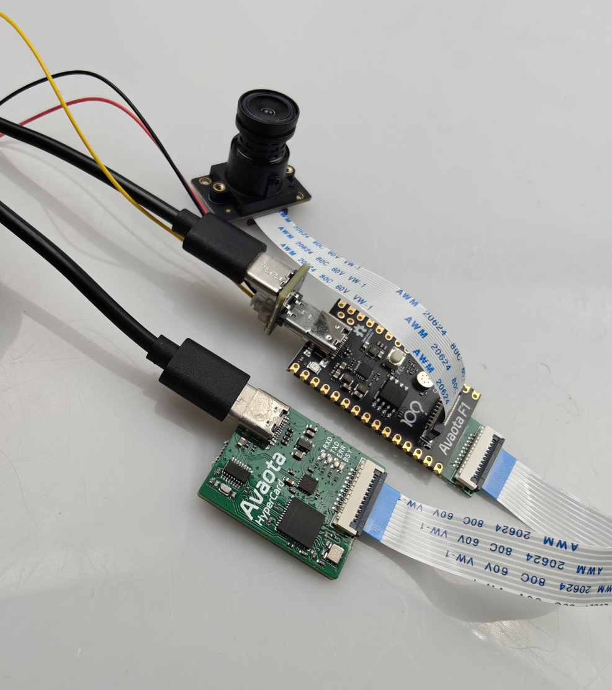

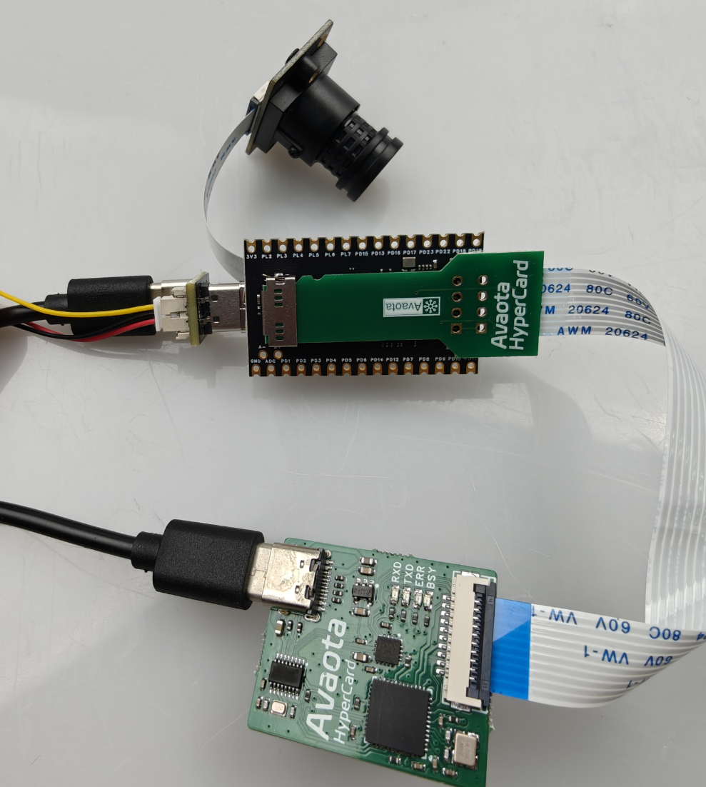

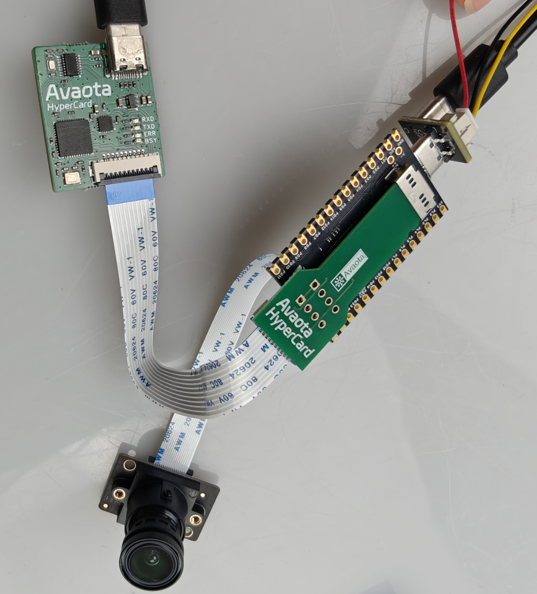