# SDK 固件编译

本章节主要介绍获取V821 SDK后，如何编译SDK，以及编译SDK中的单个组件。如果您已拿到V821的开发板，想快速进入Demo演示和体验，可先跳过本章节，进入到 [SDK固件烧录](https://docs.aw-ol.com/docs/soc/v821/software/flash_img)章节。

## SDK 整体编译

### 检查SDK文件

下载完成后的 SDK 应有如下文件，可以使用 `ls` 或者 `tree -L 1` 命令检查

```text
.
├── brandy
├── bsp
├── build
├── build.sh -> build/top_build.sh
├── device
├── kernel
├── openwrt
├── platform
├── prebuilt
├── rtos
└── tools

10 directories, 1 file
```

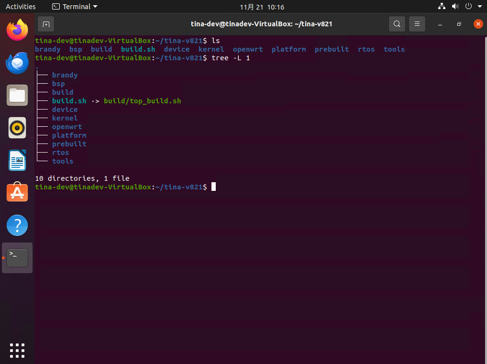

### 初始化环境

使用命令 `source build/envsetup.sh` 初始化SDK编译环境，初始化后便可以使用快捷指令与SDK相关指令。

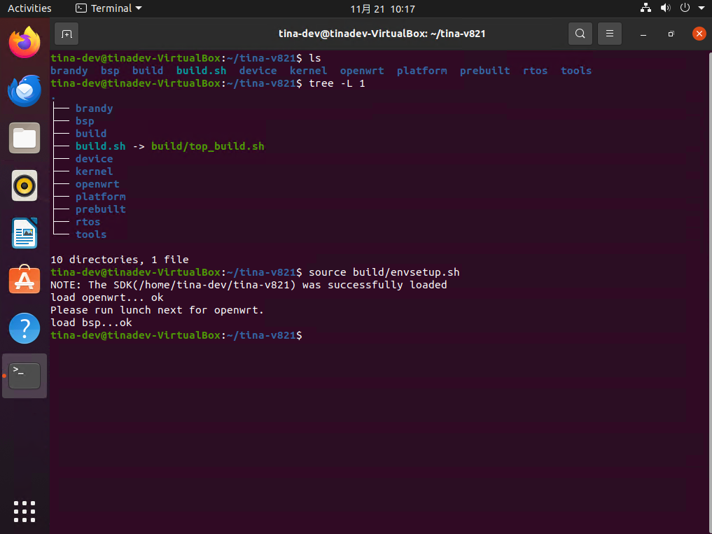

### 选择方案

使用命令 `lunch` 选择编译的方案，这里以选择 `v821-perf2-tina` 为例，选择 4

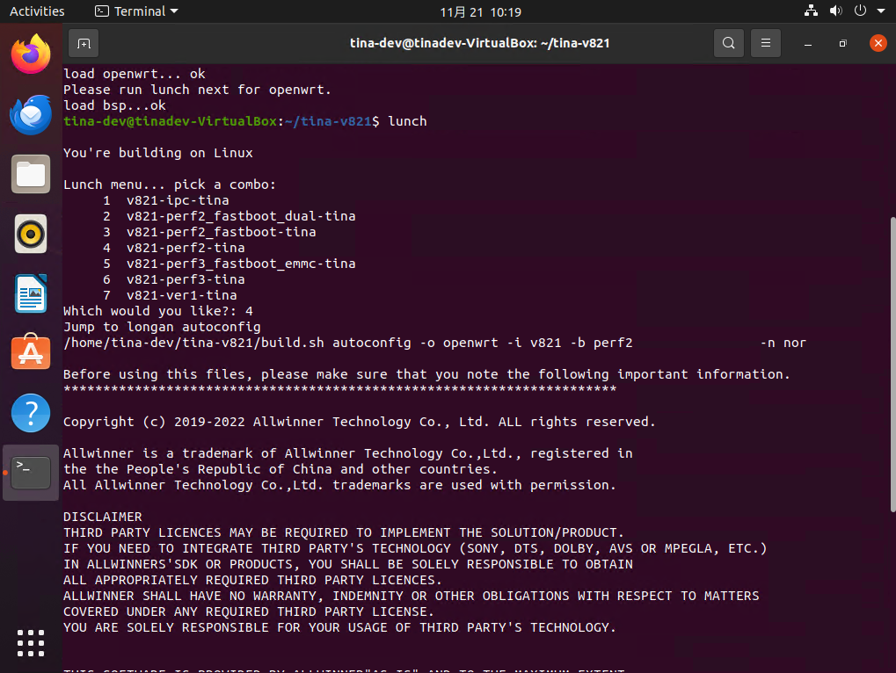

### 阅读免责声明

如果是一次下载使用SDK，`lunch` 选择方案后，需要等待8s来阅读免责声明，并按提示输入Y并回车确认接受免责声明。输入之后这份SDK，再做其他操作不会再有这个等待和提示。

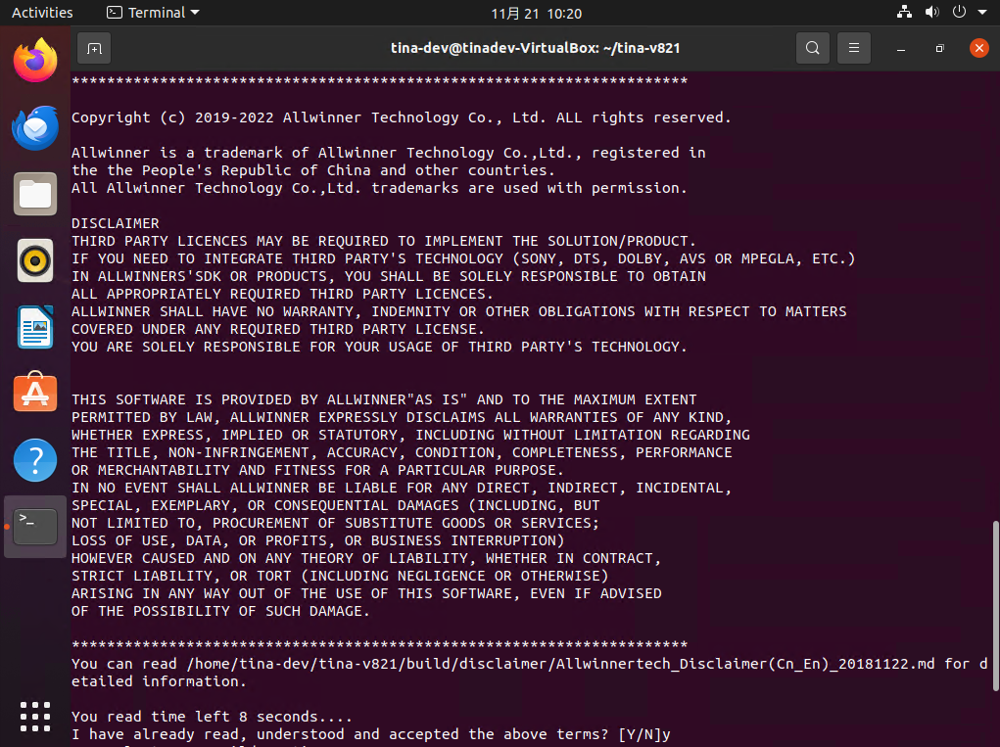

### 等待初始化环境

确认后需要等待 SDK 解压工具链，初始化开发环境

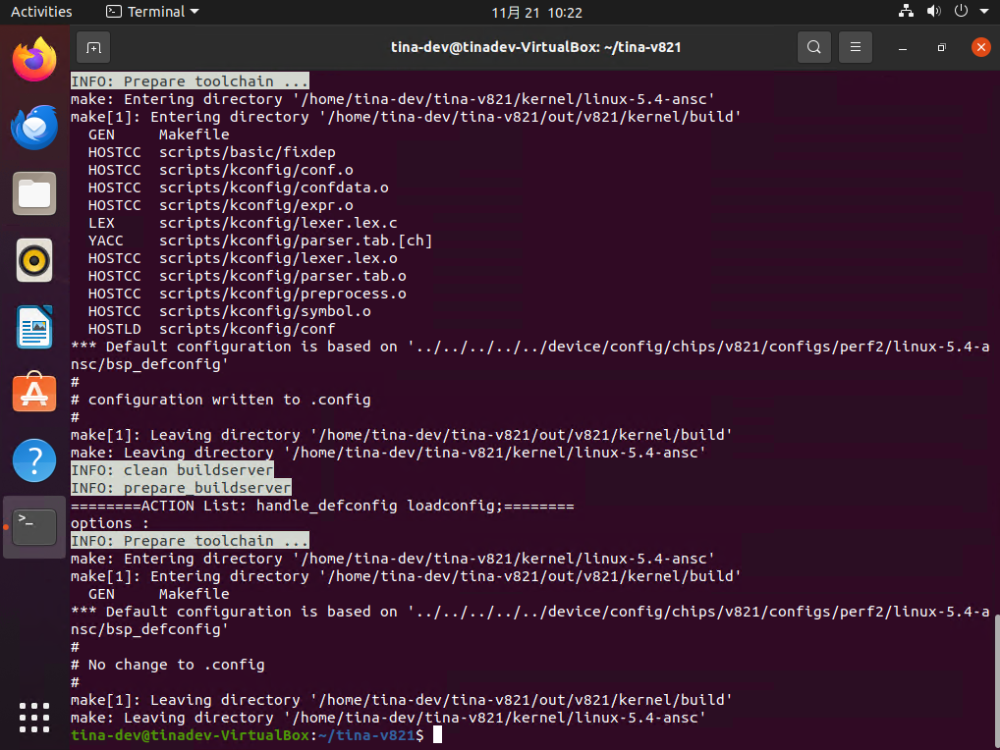

### 完整编译SDK

使用命令 `m` 或 `make` 完整编译 SDK，也可以使用快捷命令 `mp` 执行编译和打包的动作。可以使用 `m -jN` 参数N为并行编译进程数量，依赖编译服务器CPU核心数，如 4 核PC，可 `m -j4`

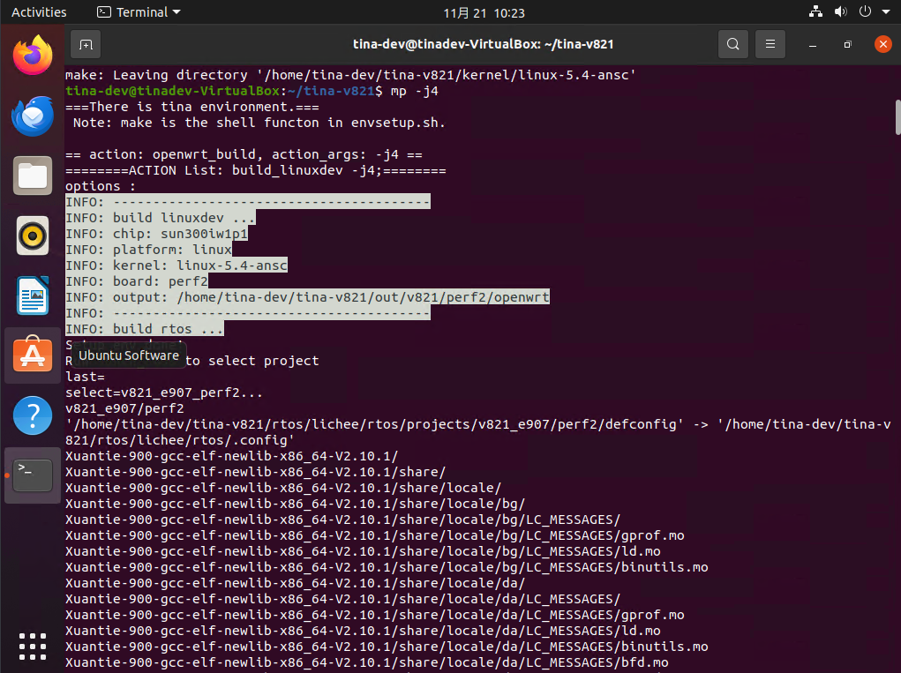

### 打包固件

SDK 编译完成，需要使用`pack`命令打包固件，其会在`out`目录下输出固件

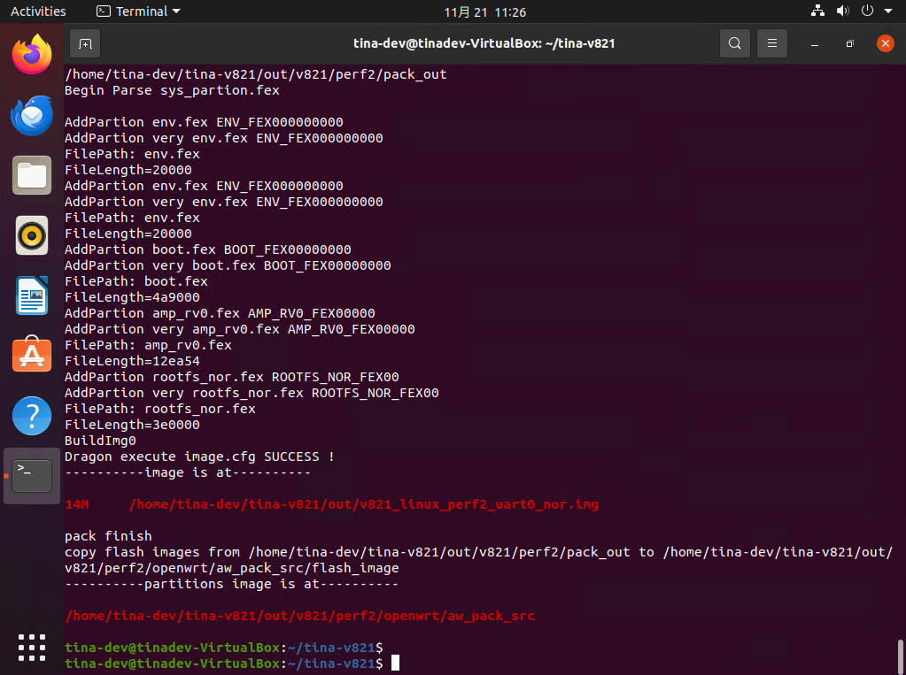

可以在 SDK 目录中的 `out` 文件夹找到

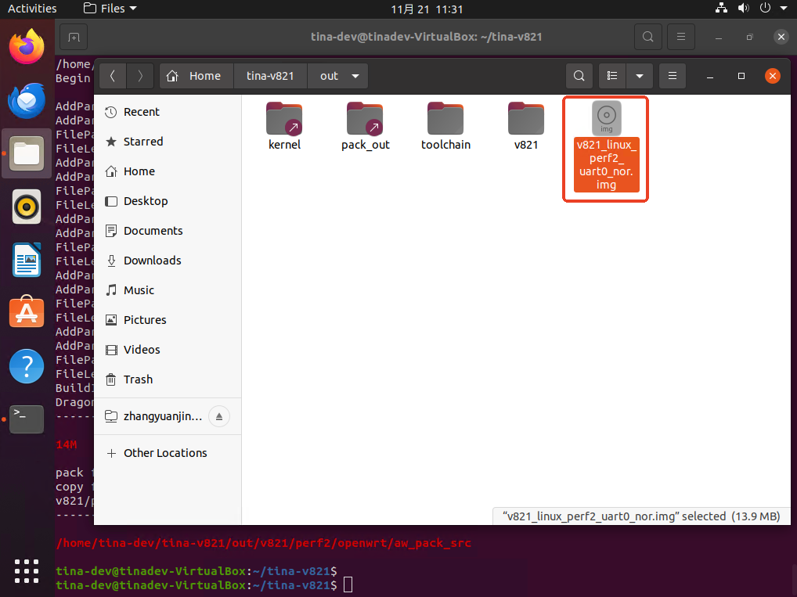

## SDK 组件单独编译

在开发过程中，会需要单独编译某一模块，但是完整编译太慢效率较低，这时可以使用单编命令。

| 命令     | 作用                            | 作用范围              |
| -------- | ------------------------------- | --------------------- |
| mboot    | 编译boot0和uboot                | boot0和uboot          |
| mboot0   | 编译boot0                       | boot0                 |
| muboot   | 编译uboot                       | uboot，uboot设备树    |
| mkernel  | 编译内核                        | 内核，设备树          |
| mrtos    | 编译rtos镜像                    | rtos镜像              |
| mkmpp    | 编译eyesee-mpp-middleware       | eyesee-mpp-middleware |
| cleanmpp | 清除eyesee-mpp-middleware的编译 | eyesee-mpp-middleware |

### 编译内核与内核设备树

使用命令 `mkernel` 可以单独编译内核与设备树，之后可以用 `p` 命令打包固件，编译后的 Kernel 固件会自动拷贝到 `out` 目录下 `out/kernel/build` 中

```text
mkernel
```

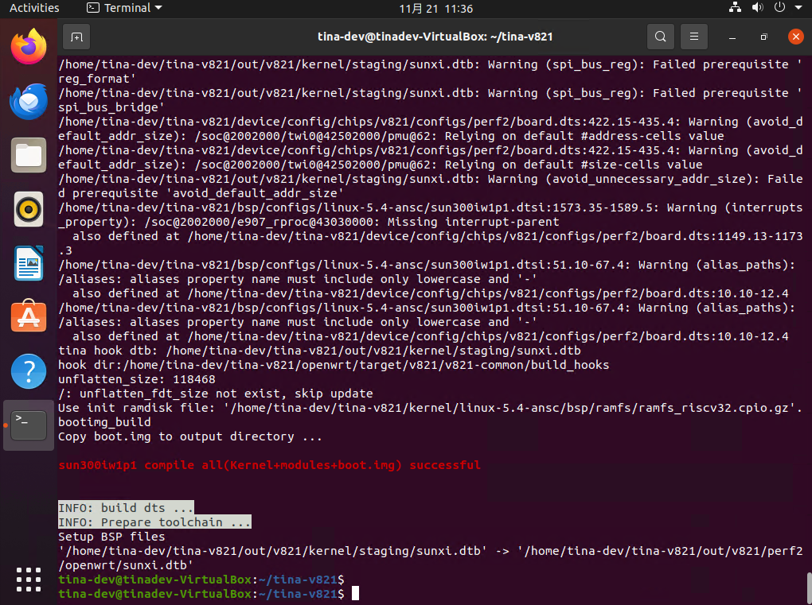

### 编译 RTOS

RTOS 可以使用 `mrtos` 编译，编译完成后使用 `pack` 打包，编译后的 RTOS 固件会自动拷贝到 `device` 目录下对应板级配置中。例如这里使用的 `v821-perf2` 板，会拷贝到 `device/config/chips/v821/configs/perf2/bin/amp_rv0.bin`

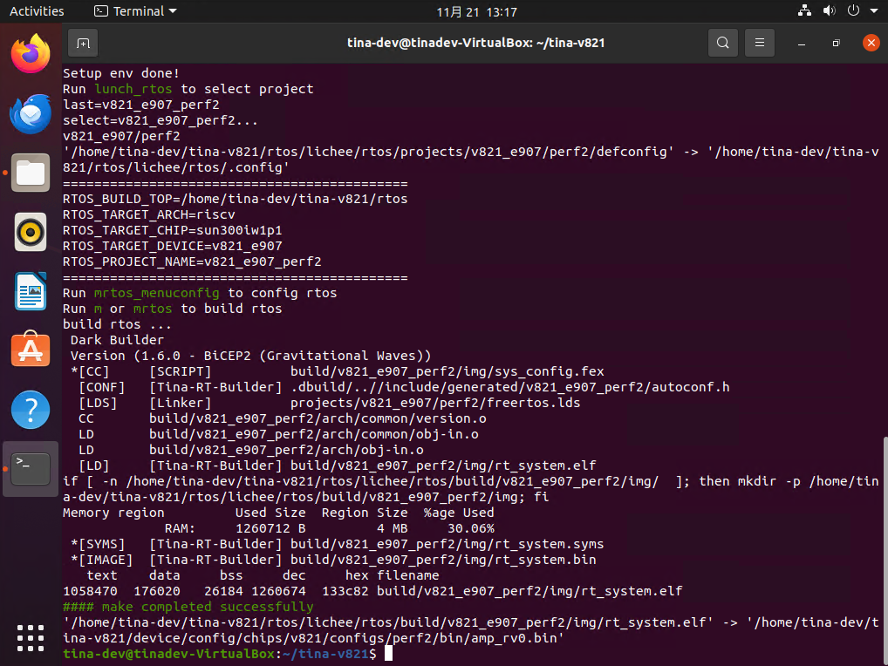

### 清理 RTOS 编译

可以使用 `mrtos clean` 命令清除上一次的 RTOS 编译产物。

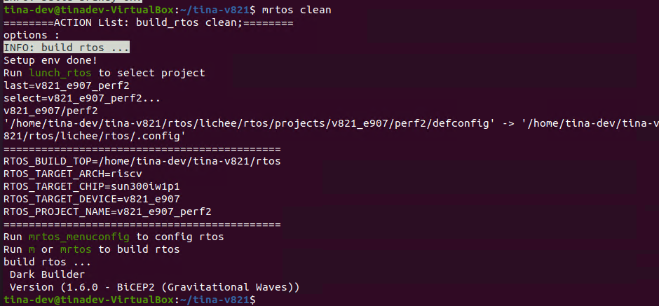

### 编译 U-Boot 与 U-Boot 设备树

U-Boot 可以使用`muboot`目录编译，编译前会自动执行 `clean` 清除之前的编译产物。编译完成后使用 `pack` 打包，输出的 U-Boot 文件会自动拷贝到 `device` 目录下对应板级配置中。例如这里使用的 `v821-perf2` 板，会拷贝到 `device/config/chips/v821/configs/perf2/bin`

```text
muboot
```

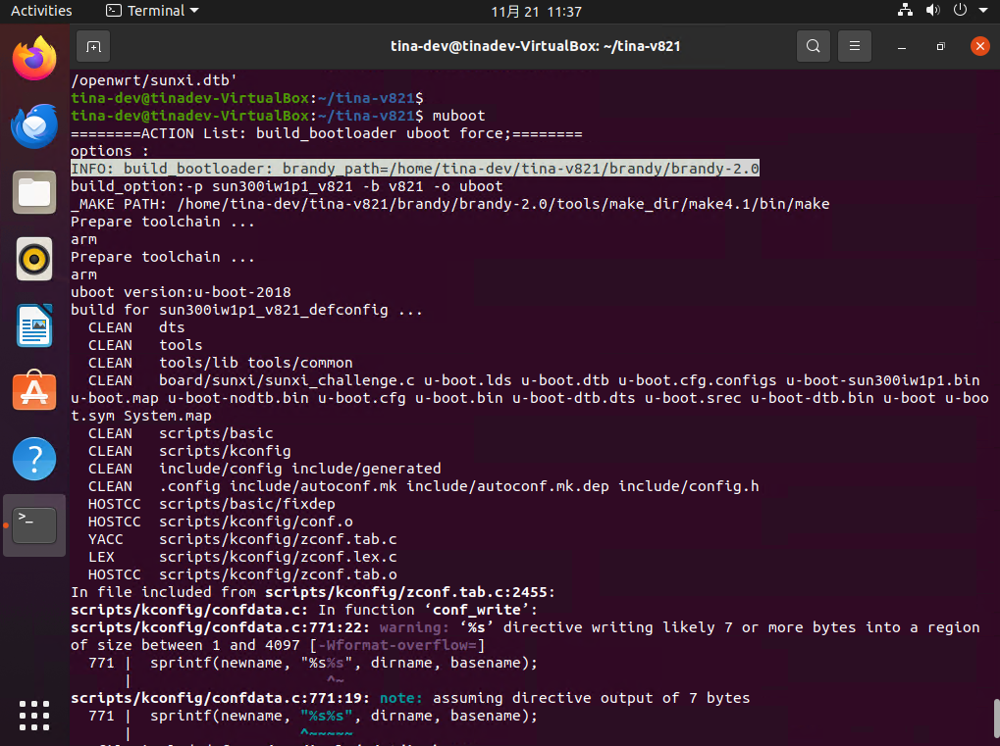

### 编译 SPL

SPL 可以用 `mboot0` 来编译，编译前会自动执行 `clean` 清除之前的编译产物。编译完成后使用 `pack` 打包，输出的 boot0 文件会自动拷贝到 `device` 目录下对应板级配置中。例如这里使用的 `v821-perf2` 板，会拷贝到 `device/config/chips/v821/configs/perf2/bin`

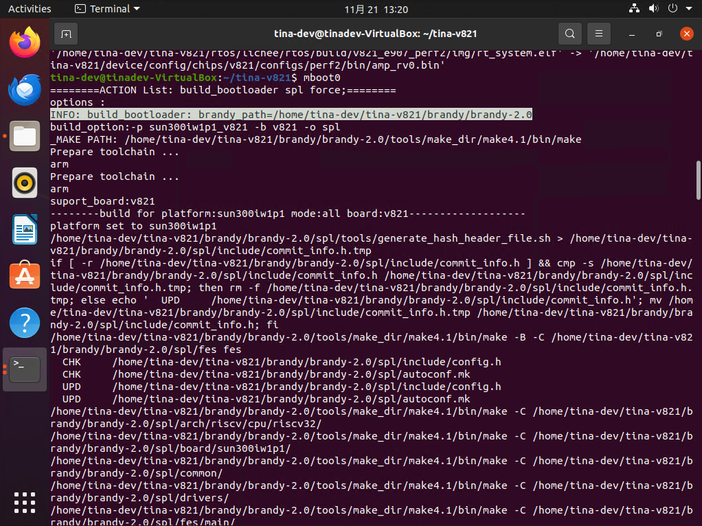

### 编译 U-Boot和SPL

可以使用命令 `mboot` 同时编译 `U-boot` 和 SPL，编译前会自动执行 `clean` 清除之前的编译产物。该命令会先编译 U-Boot 然后再编译 SPL

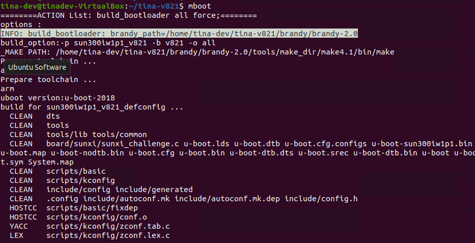

### 编译 MPP

可以使用 `mkmpp` 命令单独编译 mpp，请注意编译前需要在 `menuconfig` 中配置需要编译的软件包

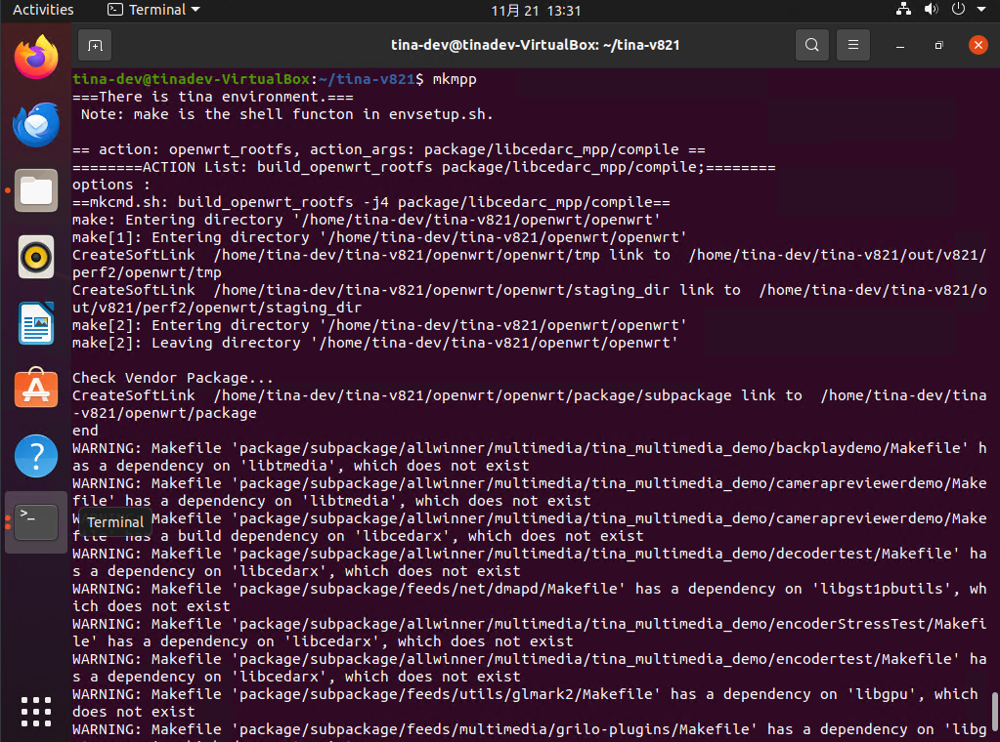

### 清除 MPP 编译

使用 `cleanmpp` 命令清除 MPP 编译产物

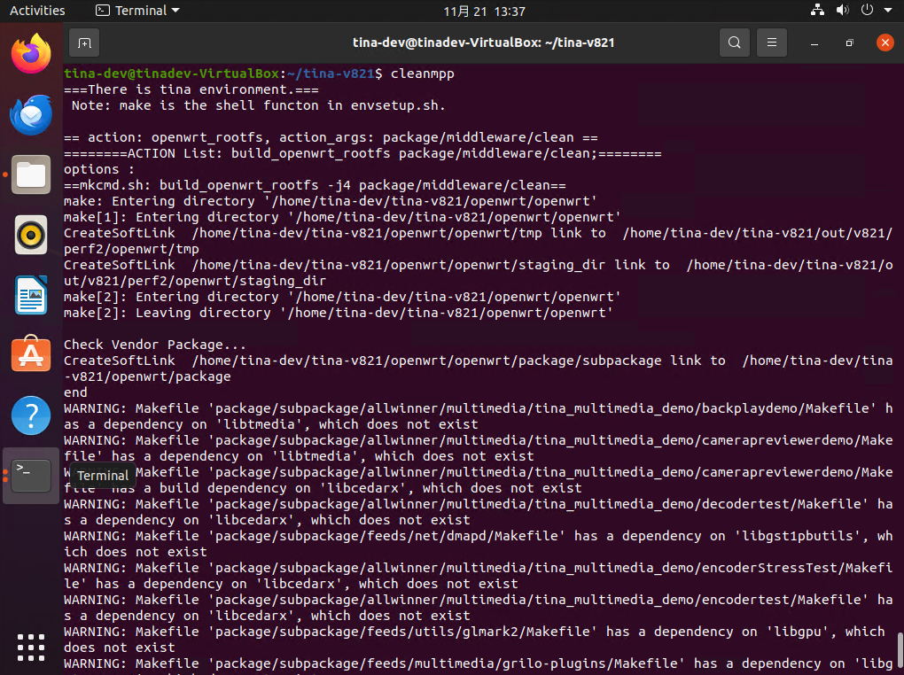

### 单独编译某一软件包

SDK 支持单独编译某一软件包，方便加速开发，这里以 `mtd-utils` 为例，介绍单独编译某一软件包的方法

**以 Package 方式编译**

```text
make openwrt_rootfs package/mtd-utils/compile
make openwrt_rootfs package/mtd-utils/clean
```

- `package` 是指在 `openwrt/openwrt/package`, 和 `openwrt/package` 目录下搜索该软件包。 `tools` 是指在 `openwrt/openwrt/tools` 下搜索
- `mtd-utils` 是定义软件包的 Makefile 所在目录的目录名，编译其他软件包时，替换该字段即可
- `compile` 换成 `clean` 是清理软件包编译文件

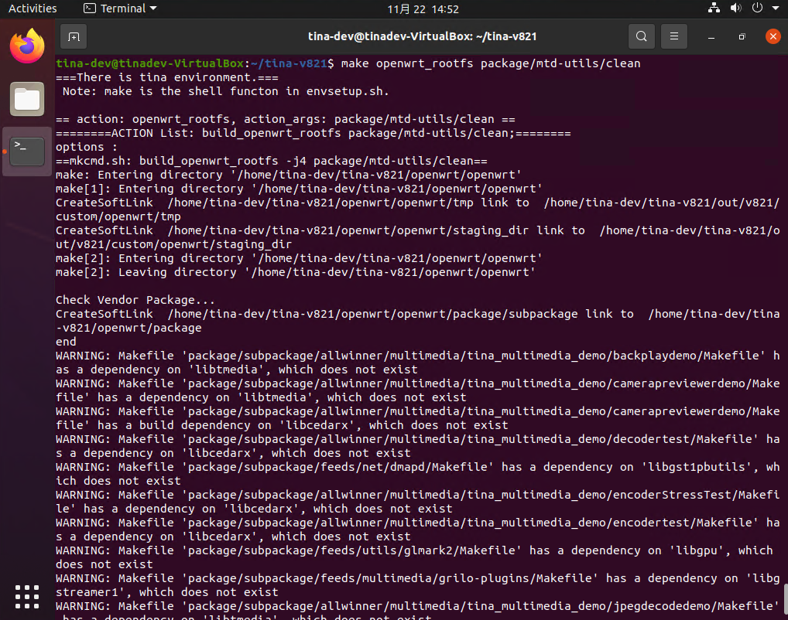

**以路径方式编译**

也可以使用软件包 `Makefile` 所在目录相对于`openwrt`原生代码根目录的相对路径来直接指定编译软件包

- `mtd-utils` 软件包位置：`openwrt/openwrt/package/utils/mtd-utils`

编译指令：

```text
make openwrt_rootfs package/utils/mtd-utils/compile
make openwrt_rootfs package/utils/mtd-utils/clean
```

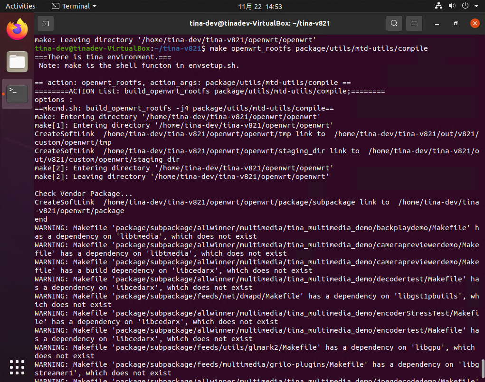

SDK为了区分openwrt原生代码与新增代码，软件包的 `Makefile` 放在 `openwrt/package/` 目录下，但编译时需嵌入到 `openwrt` 原生代码的标准路径，SDK 使用了软链接方式，将其软链接到 `openwrt/openwrt/package/subpackage`。这里以 `eyesee-mpp-middleware`包为例：

- 实际位置：`openwrt/package/allwinner/eyesee-mpp/middleware`
- 软链接之后的位置：`openwrt/openwrt/package/subpackage/allwinner/eyesee-mpp/middleware`

编译指令：

```text
make openwrt_rootfs package/subpackage/allwinner/eyesee-mpp/middleware/compile
make openwrt_rootfs package/subpackage/allwinner/eyesee-mpp/middleware/clean
```

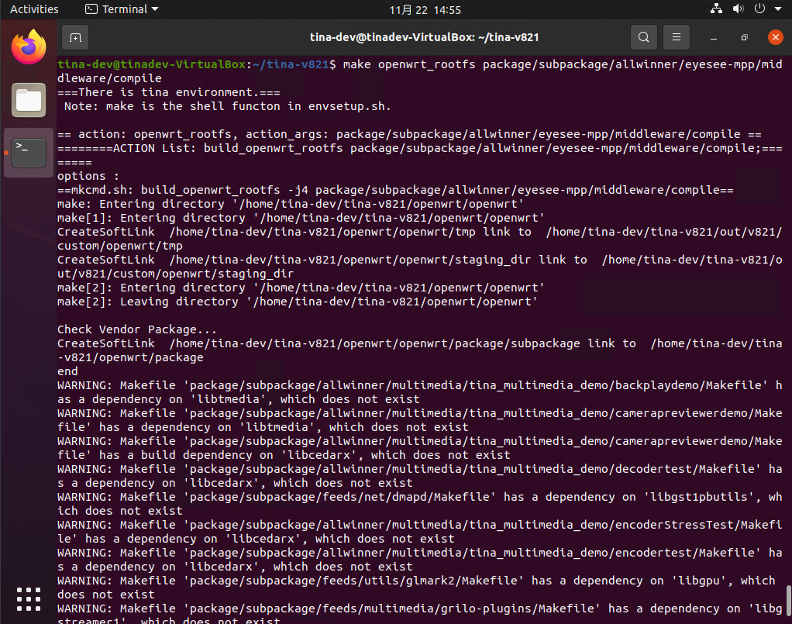

**以快捷指令方式编译**

SDK 提供一个快捷指令：`mmo` 只需要在 `mmo` 指令后面跟上需要编译的软件包名即可编译

```text
mmo mtd-utils
```

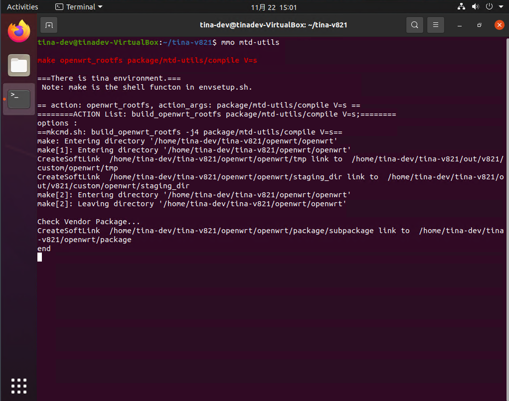

如果需要清理上一次编译产物，重新编译，则使用 `mmo -B` 命令

```text
mmo mtd-utils -B
```

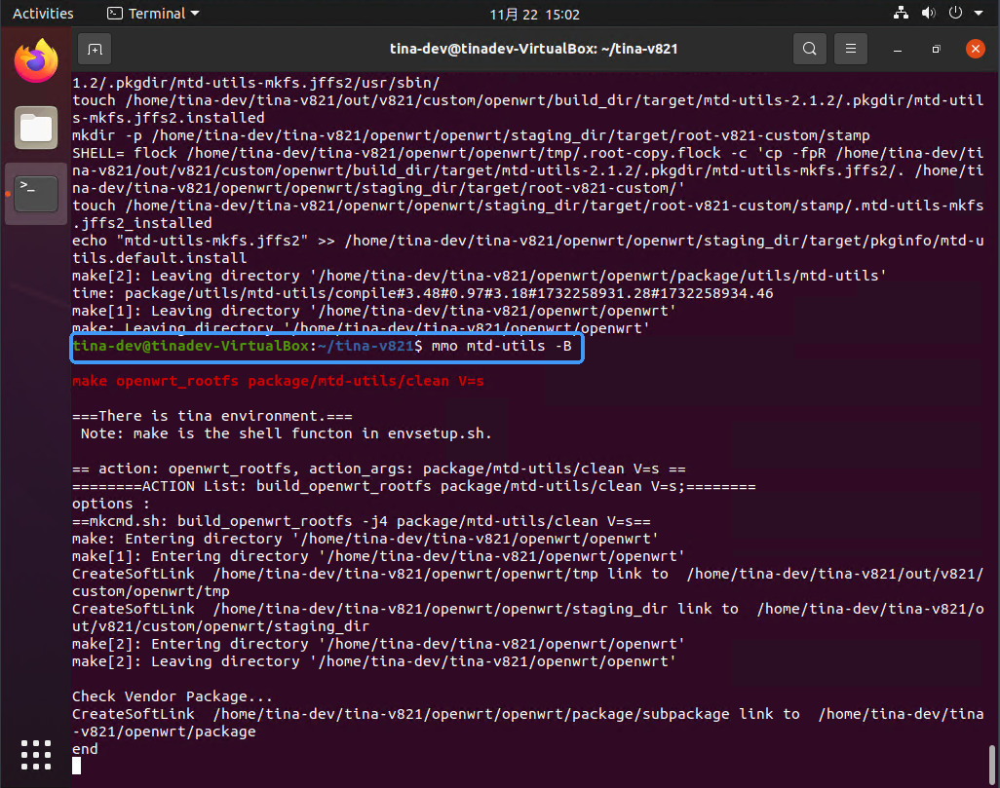

**前往文件夹下编译**

SDK 也支持在文件夹下编译软件包，例如 `mtd-utils` 位于 `package/utils/mtd-utils`，可以前往文件夹单独编译这个软件包

编译指令：

```text
cd openwrt/openwrt/package/utils/mtd-utils
mm # 编译软件包、
mm -B # 先 clean 后重新编译软件包
```

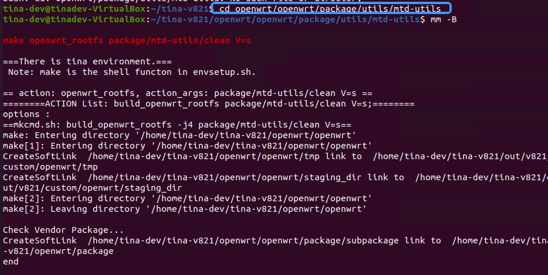

## SDK 快捷命令

SDK 提供了一系列方便开发的快速跳转指令，在开发过程中可以使用这些指令快速跳转目录，执行操作。

| **命令**            | **命令有效目录** | **作用**                         |
| ------------------- | ---------------- | -------------------------------- |
| make                | tina根目录       | 编译整个sdk                      |
| pack                | tina根目录       | 打包固件                         |
| m                   | tina下任意目录   | make的快捷命令，编译整个sdk      |
| p                   | tina下任意目录   | pack的快捷命令，打包固件         |
| m menuconfig        | tina下任意目录   | 任意目录启动软件包配置界面       |
| m kernel_menuconfig | tina下任意目录   | 任意目录启动内核配置界面         |
| mrtos menuconfig    | tina下任意目录   | 任意目录启动内核配置界面         |
| croot               | tina下任意目录   | 快速切换到tina根目录             |
| cconfigs            | tina下任意目录   | 快速切换到方案的bsp配置目录      |
| cplat               | tina下任意目录   | 快速切换到tina方案配置目录       |
| cout                | tina下任意目录   | 快速切换到方案的输出目录         |
| cboot0              | tina下任意目录   | 快速切换到boot0源码目录          |
| cboot               | tina下任意目录   | 快速切换到uboot源码目录          |
| ckernel             | tina下任意目录   | 快速切换到linux源码目录          |
| cbsp                | tina下任意目录   | 快速切换到bsp驱动源码目录        |
| crtos               | tina下任意目录   | 快速切换到rtos源码目录           |
| cgrep               | tina下任意目录   | 在c/c++/h文件中查找字符串        |
| mm [-B]             | 软件包目录       | 编译软件包，-B指编译前先clean    |
| cmpp_s              | tina下任意目录   | 快速切换到mpp middleware源码目录 |
| cmpp_p              | tina下任意目录   | 快速切换到mpp middleware配置目录 |
| clibcedarc_s        | tina下任意目录   | 快速切换到libcedarc软件包目录    |
| clibcedarc_p        | tina下任意目录   | 快速切换到libcedarc配置目录      |
| crtmedia_s          | tina下任意目录   | 快速切换到rt-media源码目录       |
| crtmedia_p          | tina下任意目录   | 快速切换到rt-media配置目录       |