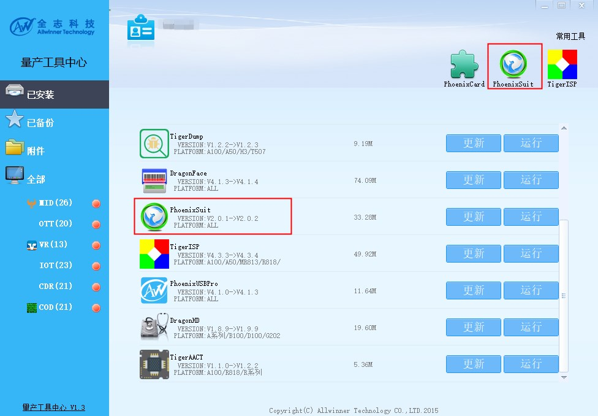

# SDK 固件烧录

本章节主要介绍固件烧录工具以及如何烧录固件。

全志平台为开发者提供了多种多样的烧写方式和烧写工具：

（1）PhoenixSuit：基于Windows的系统的烧写工具，是最常用的烧写工具，通过数据线将PC和开发板连接，把固件烧到开发板上。PhoenixSuit 支持分区烧写，适用于开发和小规模生产使用。建议开发者开发时使用该工具进行固件升级。

（2）LiveSuit：基于Ubuntu的系统的烧写工具，通过数据线将PC和开发板连接，把固件烧到开发板上，即Ubuntu版的PhoenixSuit，适用于Ubuntu系统开发者进行开发烧写。

（3）PhoenixUSBpro：基于Windows的系统的烧写工具，通过数据线将PC和开发板连接，把固件烧到开发板上，一台PC可同时连接8台设备，分别控制其进行烧写，适用于产线批量生产。（如下图）

（4）PhoenixCard：可以将firmware烧写到SD卡里的工具。开发板插入这张卡就能够启动。基于Windows系统。

（5）存储器件批量烧写生产：用专有设备将提前将固件烧写到未贴片的存储器件（如emmc、nand、nor等）上，再上机贴片。这样可以提高设备生产效率。但需要拉通存储器件厂商和全志原厂定制设备联调。适用于超大规模产品的量产。

## SDK 固件烧录步骤

### Windows 烧录

以PhoenixSuit为例，介绍固件烧录步骤：



打开 PhoenixSuit，选择一键刷机，点击浏览，打开刚才生成的固件


选择全盘擦除升级


按住 PERF2 开发板上的FEL按键，插入USB线


烧录工具出现提示，选择是


烧录中，请耐心等待


烧写结束，系统自动启动


### Linux 下烧录

Linux 版本 PhoenixSuit 支持的发行版本包括 Ubuntu、Fedora、Redhat 及 CentOS 等几个常见的发行版本。目前驱动已经可以支持 4.11.0 版本以上内核，建议安装内核版本号大于4.11.0 的 Linux 发行版本。

#### 安装 PhoenixSuit-Linux

- 下载 PhoenixSuit 到 Linux 中，解压


- 安装依赖 dkms，对于 Ubuntu 可以用 `sudo apt install dkms dctrl_tools` 来安装


- 打开终端，输入 `sudo ./PhoenixSuit.run` 来运行安装程序。


安装完成后默认目录在 `~/Bin/phoenixsuit` 目录下


#### 烧录固件

使开发板进入烧录模式，使用命令开始烧录

```text
./phoenixsuit <path/to/img>
```

例如

```text
./phoenixsuit ../../tina-v821/out/v821_linux_ipc_uart0_nor.img
```


等待一会便烧录完成


## 开发板如何进烧录模式

设备需进入烧录模式，以下几种情况会进入烧录模式：

1. BROM无法读取到正确boot0镜像。例如裸片flash不包含数据会自动进烧录；上电时短路flash阻断通信（可以短接CS和GND）；用户态人为破坏boot0镜像（echo xxx > /dev/mtdblock0）。
2. 在串口中长按2进入烧录。即，在串口工具输出框中，长按键盘的'2'，不停输出字符'2'，上电启动。boot0检测到此字符，会跳到烧录模式。
3. 当板子有FEL按键时，按住FEL按键上电。
4. PhoenixCard制作的量产卡，插入量产卡上电会进入烧录模式。

**提供的开发板可以长按UBOOT键后上电，PhoenixSuit开始烧录松开UBOOT。**