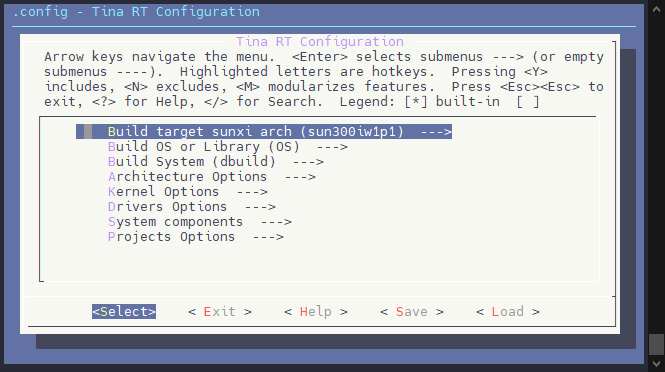

# SDK功能配置

本章节将介绍 Tina Linux 系统中配置文件及其配置方法。这里以 V821 PERF2 为例，演示基础的方案配置方法，对于其他方案请对应其文件路径。

## Kconfig 管理配置

SDK 采用 Kconfig 机制对 SDK 和内核进行配置。

Kconfig 是一种固定格式的配置文件。Linux 编译环境中的 menuconfig 程序可以识别这种格式的配置文件，并提取出有效信息生成可视化的配置菜单。

SDK 包含多个 menuconfig，包括对内核进行管理和配置的 `kernel_menuconfig`，对软件包进行管理和配置的 `Tina menuconfig`，对 RTOS 进行配置的 `Tina-RT menuconfig`。

### kernel menuconfig

在 `Tina Linux` 的配置环境中配置好环境变量进入可编译状态后，输入

```text
make kernel_menuconfig
```

即可进入 `kernel menuconfig` 配置菜单。


配置菜单源文件为：

```text
device/config/chips/v821/configs/perf2/linux-5.4-ansc/bsp_defconfig
```

输出 `cconfig` 可快速转跳到该目录。

### Tina menuconfig

在 `Tina Linux` 的配置环境中配置好环境变量进入可编译状态后，输入

```text
make menuconfig
```

即可进入Tina menuconfig配置菜单。


配置菜单源文件为：

```text
openwrt/target/v821/v821-perf2/defconfig
```

输出 `cplat` 可快速转跳到该目录。

### RTOS menuconfig

在 `Tina Linux` 的配置环境中配置好环境变量进入可编译状态后，输入

```text
mrtos menuconfig
```

即可进入 `rtos menuconfig` 配置菜单。



配置菜单源文件为：

```text
rtos/lichee/rtos/projects/v821_e907/perf2/defconfig
```

输出 `cplat` 可快速转跳到该目录。

### Kconfig 配置方法

这里以 `kernel menuconfig` 作为例子，讲解如何使用、配置各选项，并以配置 Wi-Fi，蓝牙驱动为例说明 Kconfig 基础配置方法。

首先我们进入 `kernel menuconfig`

```text
make kernel_menuconfig
```

这里就是 `kernel menuconfig` 的主目录。其具体的操作方法如下图所示。


我们再进入较为常用的 `Device Driver` ，看一下各个符号的含义。


其中，可以使用 `空格键` 选中各个选项，这里以 `Multimedia support` 选项为例：


也可以使用 `Y` `M` `N` 键来修改选项：


遇到被其他依赖选择的选项，可以查看 Help 页面检查被什么选项所依赖。


进入 Help 页面后，便可以查看这个选项的依赖情况。需要注意的是，有些选项是作为底层依赖无法随意取消，例如这里示例的 `Hardware Monitoring support` 选项。


Kconfig 所创建的界面还有一个功能，就是搜索功能，方便快速的找到目标选项。这里以搜索 LCD 屏幕 `icn6202` 驱动为例。

在 Kconfig 的界面中按 `/` 键，进入搜索页面。


## Device Tree

Device Tree（设备树）是标准Linux下定义的一种硬件板级描述机制，通过.dts文件，对硬件进行配置。

### .dts文件

Tina Linux 下有三份.dts文件，分别位于BSP仓库和方案目录下。包括如下三份设备树

- 内核设备树：用于描述SoC的系统资源，外设，寄存器配置。
- 方案设备树：用于描述具体的引脚配置，外设功能，Sensor配置等。
- U-Boot 设备树：用于描述方案 Uboot 的相关参数，flash map 等功能。

内核dts文件路径：

```text
bsp/configs/linux-5.4-ansc/sun300iw1p1.dtsi
```

方案dts文件路径：

```text
device/config/chips/v821/configs/perf2/linux-5.4-ansc/board.dts
```

U-Boot 设备树路径：

```text
device/config/chips/v821/configs/perf2/uboot-board.dts
```

方案dts优先级高于内核dts方案，遇到冲突时方案dts的内容会覆盖内核dts中的配置。

方案开发时一般建议只修改方案目录下的dts文件 `board.dts` ，以免影响其它方案。

## 分区表

在全志平台中，通过 `sys_partition.fex` 文件配置分区。分区表包括两份，针对 SPI NOR 设备使用 `sys_partition_nor.fex` 针对非 SPI NOR 设备（例如SPI NAND，eMMC）使用 `sys_partition.fex`

分区配置文件路径：

```text
device/config/chips/v821/configs/perf2/sys_partition_nor.fex
device/config/chips/v821/configs/perf2/sys_partition.fex
```

### 配置格式示例

以rootfs分区为例：

```text
[partition]
    name            = rootfs
    size            = 20480
    downloadfile    = "rootfs.fex"
    user_type        = 0x8000
```

每个分区以 **[partition]** 标识，分区属性及其意义如下表。

| 属性         | 含义                 | 必选 | 备注                   |
| :----------- | :------------------- | :--: | :--------------------- |
| name         | 分区名               |  Y   |                        |
| size         | 分区大小             |  Y   | 单位:扇区(512B),       |
| downloadfile | 分区烧入的镜像文件   |  N   | 注2                    |
| verify       | 量产后校验标识       |  N   | (默认)1:使能; 0:禁用   |
| user_type    | 分区属性             |  N   | 注4                    |
| keydata      | 量产时是否擦除本分区 |  N   | 0x8000：使能; 其他无效 |

1. 最后一个分区(UDISK)，不设置 size，表示分配所有剩余空间。
2. downloadfile 支持绝对路径和相对路径，相对于`tina/out/<方案名>/image`。
3. verify决定是否校验 downloadfile 中指定的镜像，若为ext4稀疏镜像，务必禁用。
4. 历史遗留，目前只对UBI方案有效。`bit0`为1时，表示创建**静态卷**，反之为**动态卷**。

**[partition] \**标识用户空间的逻辑分区，在 UBI 方案中，表现为 UBI卷。此外，在`sys_partiton.fex`中存在特殊的配置\**MBR**，用于配置MBR空间大小，此配置在UBI方案中无效。例如：

```text
[mbr]
size = 2048
```

MBR 分区以 **Kbyte** 为单位，对用户不可见，属于隐藏空间，其大小也必须满足对齐原则。

### 分区大小与对齐

分区大小的对齐要求与不同介质(nor/nand/mmc)、不同存储方案相关。不按对齐要求配置，可能出现文件系统异常，分区边界数据丢失等现象。对齐规则如下表。

| 介质           | 对齐大小            | 备注                          |
| :------------- | :------------------ | :---------------------------- |
| nor            | 64K                 | 对齐物理擦除块大小，注1       |
| (nftl) spinand | 驱动超级块大小      | 注2                           |
| (ubi) spinand  | 2 × 物理块 - 2 × 页 | 注3                           |
| rawnand        | 驱动超级块大小      | 与物料相关，16M对齐可基本兼容 |
| emmc           | 16M                 | 与物料相关，16M对齐可基本兼容 |

- SPI NOR 的擦除块常见为 **64K**，即在 `sys_partition_nor.fex` 中分区size进行 **128** 对齐。在 id 表配置为4K擦除且使能内核`CONFIG_MTD_SPI_NOR_USE_4K_SECTORS` 时，也可使用4K对齐。推荐使用默认64K对齐。
- 在常见的128M SPI Nand中，为 **256K** 对齐，即在sys_partition.fex中分区size进行512对齐。需要和逻辑擦除块（super block）对齐，1个super block包含两个物理擦除块，常见的物理擦除块128K，1个逻辑的超级块为256K，但是需要使用每个物理块的第一个page（2K）来作为ubi所需的信息头部，所以实际的为（256k-2*2k），为 **252K** 对齐，即在sys_partition.fex中分区size进行504对齐。

更多配置信息请参考《Tina_Linux_存储_开发指南》

## env.cfg

env用于配置一些系统级参数，如启动等待时间、内核会用到的环境变量、系统加载状态、串口及打印等级、安全校验参数等。请注意快起系统不使用这部分参数。

芯片默认env配置文件路径，如果板级文件夹内没有 `env.cfg` 则用的是这一份：

```text
device/config/chips/v821/configs/default/env.cfg
```

具体方案env配置文件路径：

```text
device/config/chips/v821/configs/perf2/env.cfg
```

具体方案的配置文件优先级大于芯片默认配置文件。

## sys_config.fex

sys_config 是全志平台定义的一种GPIO配置的方法。适用于 BOOT0 环境，包括配置 DRAM 参数，BOOT0 使用的 PIN，储存介质等信息。一般不需要修改

配置文件路径为：

```text
device/config/chips/v821/configs/perf2/sys_config.fex
```

GPIO配置格式：

```text
 Port:端口+组内序号<功能分配><内部电阻状态><驱动能力><输出电平状态>
```

sys_config.fex 的配置优先级高于 u-boot 设备树的优先级，当配置冲突时会以 sys_config.fex 配置为准。

### 配置 BOOT0 串口

这里以BOOT0 串口使用PD22，PD23的UART0作为示例。配置如下

```text
[uart_para]
uart_debug_port = 0
uart_debug_tx   = port:PD22<3><1><default><default>
uart_debug_rx   = port:PD23<3><1><default><default>
```


### 关闭/开启BOOT0日志打印

配置 sys_config.fex 中的 `debug_mode` 项，0为关闭打印，8为打开全部打印。

```text
[platform]
debug_mode = 0
```


## 文件系统

**只读根文件系统**

SDK提供squashfs和erofs两种只读的fs作为根文件系统，默认使用squashfs。切换erofs方法如下：

```text
m menuconfig
CONFIG_TARGET_ROOTFS_EROFS=y
TARGET_ROOTFS_SQUASHFS is not set    ---------取消勾选

m kernel_menuconfig
CONFIG_EROFS_FS=y
```

**可读写文件系统**

Tina默认会在根文件系统上再挂载一个可读写的文件系统作为overlay。sys_partition_(nor).fex分区表中默认提供rootfs_data分区，rootfs_data会在启动后挂载可读写文件系统，emmc方案会挂载ext4、spinor方案会挂载jffs2。以spinor为例，overlayfs的lowerdir是squashfs（rootfs分区），upperdir是jffs2(rootfs_data)。用户可以在/overlay/upper/路径下看到写入的文件，可读写的空间跟rootfs_data挂钩，可以增大rootfs_data的分区size来增大根文件系统的可读写空间。

**注：快启SDK默认开机会运行demo将码流存到/mnt/extsd目录，这个目录是SD卡的挂载目录，在SD卡没有挂载情况下，此时的/mnt/extsd是overlay，会直接将码流写到SPI NOR上，在rootfs_data过小情况下，会直接将overlay写满**。

**文件系统静态制作**

很多用户不需要整个根文件系统可写，需要自定义某个文件路径可写。那么可以在PC静态制作好文件系统，再通过设备端mount到指定路径即可。

```text
[1]
out/host/bin/mkfs.jffs2 -p 0x80000 -e 0x10000  -X rtime -x zlib -x lzma -d  ./filesystem  -o  ./filesystem.fex
-p: 指定目标分区大小
-e: 指定block大小，当前是0x10000 64KB
-X: 指定压缩方式
-x: 指定不使用的压缩方式
-d: 想要制作成文件系统镜像的文件夹
-o: 输出的文件系统镜像
将制作好的filesystem.fex拷贝至device/config/chips/vxxx/configs/fastboot/linux路径下

[2]
sys_partition_nor.fex和board.dts中新增分区，存放目标镜像
[partition]
    name         = filesystem
    size         = 1024
    downloadfile = "filesystem.fex"
    user_type    = 0x8000

[3]
设备端完成烧录启动后，会增加一个/dev/by-name/filesystem分区，使用mount命令挂载"mount -t jffs2 /dev/by-name/filesystem /目标路径"即可。也可将mount操作加到启动脚本中使其自动挂载。
```