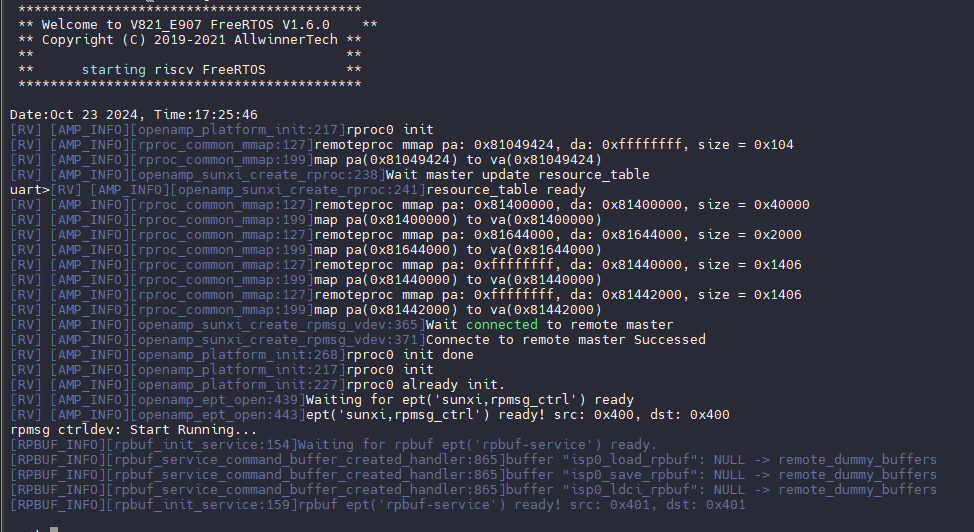
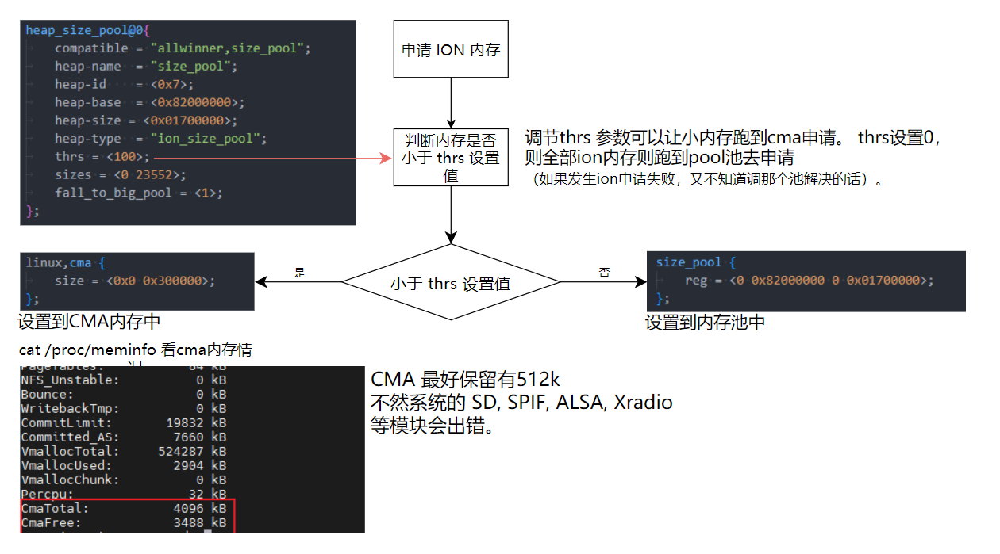
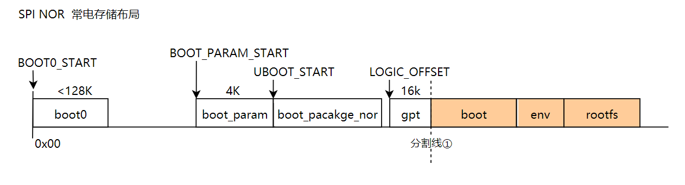

# SDK 系统资源配置

## 内存划分与调整

本章节将讨论在启动过程中的各个阶段，物理内存的占用及其生命周期，重点分析在应用运行阶段，系统为用户开发留出的内存余量，以及典型多媒体场景下的内存占用情况。同时，还将介绍AW内存统计工具ramparser的使用方法。

下文会介绍常电方案与快起方案的区别，常电代表普通启动通路，系统完整启动后运行应用程序。快起代表快速启动通路，通过深度优化定制达到快速启动出图的速度。

### ramparser 介绍

SDK提供了ramparser工具用于内存统计。ramparser会按模块对内核、媒体（包括ion内存占用）以及用户进程的内存使用情况进行详细统计。我们可以使用ramparser -a命令对整体内存进行统计分析，而使用ramparser -p pid命令则可以跟踪特定进程的内存使用情况，帮助定位内存相关问题。

```text
Usage : ramparser [option]
Options:
      -k all                       : 显示内核空间内存使用情况；
      -k vma                       : 显示内核空间的vmalloc内存使用情况；
      -k pagesort [input] [output] : 根据堆栈追踪排序页面所有者；
      -u                           : 显示用户空间内存使用情况；
      -a                           : 显示内核空间和用户空间的内存使用情况；
      -p pid                       : 显示指定进程的详细内存信息并输出到屏幕；
      -p all                       : 显示所有进程的内存使用情况，等同于 '-u'；
      -r                           : 显示所有预留内存；
      -s                           : 打印size_pool信息；
      -S unslab                    : 打印slab内存信息；
      -v                           : 打印版本信息；
      -V                           : 打印更多的详细信息；
```

示例输出 `ramparser -a`

```text
-----*****Mem Used Info For Kernel Space*****-----

Kernel stack      =    424 Kb
Kernel pagetables =     60 Kb
Kernel vmalloc    =   2960 Kb
Kernel modules    =      0 Kb
Kernel cma        =     64 Kb
Kernel dma_alloc  =      0 Kb (dma + dma pool + iommu)

Slab               =   8292 Kb (recalim + unrecalim + alloc_pages)
   slab_recalim    =   1876 Kb
   slab_unrecalim  =   6416 Kb
   slab buddy(>8K) =      0 Kb

Buddy Pages  =   3884 Kb
  lru_anon   =    248 Kb (≈ anon + shmem(anon) + mlock)
    anon     =    256 Kb
    shmem    =      4 Kb
    mlock    =      0 Kb
  lru_file   =   3636 Kb (≈ buffer + cached - shmem(file))
    buffer   =   1332 Kb
    cached   =   2308 Kb

dmabuf          =    280 Kb
   heap uncache =      0 Kb
   heap         =      0 Kb
   cma          =      0 Kb
   ion          =    280 Kb
   other        =      0 Kb


-----*****Mem Used Info For User Space*****-----

ther number on the left is the actual allocated memory.
ther number on the right is the logic allocated memory.
e.g.
        4/16      : logic malloc 16K, but phys alloc 4K

Pid    Code+Rodata(Kb)    Data(Kb)      heap(Kb)      Stack(Kb)     mmap(Kb)       lib(Kb)    share(Kb)   pss(Kb) Process
1          220/288          4/4           4/4           4/132         0/0         412/604            0       220 /sbin/init
122         64/68           4/4           4/4           8/132        32/416       540/604            0       245 /bin/adbd
177         36/44           4/4           4/4           8/132        16/272       560/744            0       308 wifi_daemon
198        284/288          4/4           4/4           4/132         8/8         540/604            0       331 -/bin/sh
Rss total: 2.70 Mb , Pss total: 1.08 Mb

size pool info:
pool[0]: 264 KB of 23 MB uesed

Mem Used Summary(For kernel space only):
Mem    Total           64 Mb   (Free 10.44 Mb, Available 13.35 Mb)
Kernel Reserved         35.69 Mb   (Not Include Nomap Reserved mem)
Kernel Nomap Reserved    4.30 Mb

Watermark:
    normal: min 636K, low 792K, high 948K
```

**内核空间内存使用情况**

- 内核栈 (Kernel stack): 424 Kb
- 内核页表 (Kernel pagetables): 60 Kb
- 内核vmalloc (Kernel vmalloc): 2960 Kb
- 内核模块 (Kernel modules): 0 Kb
- 内核CMA (Kernel cma): 64 Kb
- 内核DMA分配 (Kernel dma_alloc): 0 Kb（包括 DMA、DMA池和IOMMU）

**Slab分配**

- 总Slab内存: 8292 Kb
  - slab_recalim: 1876 Kb
  - slab_unrecalim: 6416 Kb
  - slab buddy (>8K): 0 Kb

**Buddy页面**

- 总Buddy页面内存: 3884 Kb
  - lru_anon (匿名页面): 248 Kb
    - anon: 256 Kb
    - shmem (共享内存): 4 Kb
    - mlock (锁页): 0 Kb
  - lru_file (文件页面): 3636 Kb
    - buffer (缓冲区): 1332 Kb
    - cached (缓存): 2308 Kb

**DMABUF内存使用**

- 总内存: 280 Kb
  - ion: 280 Kb
  - 其他: 0 Kb

**用户空间内存使用情况**

以下为每个进程的内存分配情况，列出了实际分配内存和逻辑分配内存。

| **Metric**           | **Pid 1 (/sbin/init)** | **Pid 122 (/bin/adbd)** | **Pid 177 (wifi_daemon)** | **Pid 198 (-/bin/sh)** |
| -------------------- | ---------------------- | ----------------------- | ------------------------- | ---------------------- |
| **Code+Rodata (Kb)** | 220/288                | 64/68                   | 36/44                     | 284/288                |
| **Data (Kb)**        | 4/4                    | 4/4                     | 4/4                       | 4/4                    |
| **Heap (Kb)**        | 4/4                    | 4/4                     | 4/4                       | 4/4                    |
| **Stack (Kb)**       | 4/132                  | 8/132                   | 8/132                     | 4/132                  |
| **Mmap (Kb)**        | 0/0                    | 32/416                  | 16/272                    | 8/8                    |
| **Lib (Kb)**         | 412/604                | 540/604                 | 560/744                   | 540/604                |
| **Share (Kb)**       | 0                      | 0                       | 0                         | 0                      |
| **PSS (Kb)**         | 220                    | 245                     | 308                       | 331                    |

- Rss total: 2.70 Mb
- Pss total: 1.08 Mb

**内存池信息**

- size pool:
  - pool[0]: 23 MB 中使用了 264 KB 的内存

**内核空间内存总结**

- 总内存: 64 Mb
  - 空闲内存 (Free): 10.44 Mb
  - 可用内存 (Available): 13.35 Mb
- 内核保留内存: 35.69 Mb
- 内核不映射保留内存: 4.30 Mb

**水位信息 (Watermark)**

- normal (常规):
  - min: 636 Kb
  - low: 792 Kb
  - high: 948 Kb

### 预留内存

**预留内存配置文件**

预留内存是在 `dts` 设备树上设置，以下是 PERF2 板级 `board.dts` 的路径：

```text
device/config/chips/v821/configs/perf2/linux-5.4-ansc/board.dts
```

设置方法是

```text
reg(保留内存) = < 物理起始地址高32bit，物理起始地址低32bit 长度大小高32bit 长度大小低32bit> 
```

**预留内存 e907_mem_fw**

`e907_mem_fw`：rtos镜像存放空间，**在rtos与kernel建立通信后会被 kernel 释放.**

`v821-perf2` 单目配置

```c
e907_mem_fw: e907_mem_fw@81444000 {
        /* boot0 & uboot0 load elf addr */
        reg = <0x0 0x81444000 0x0 0x00200000>;
};
```

`perf2_fastboot_dual `双目配置

```c
e907_mem_fw: e907_mem_fw@81484000 {
        /* boot0 & uboot0 load elf addr */
        reg = <0x0 0x81484000 0x0 0x0025B000>;
};
```

> 这一块配置地址如果修改，会在编译的时候，自动修改boot0的配置宏，让boot0加载rtos_fw的地址跟着bord.dts变化：
>
> ```
> autogen_dts_info.h:16:#define DTS_RESERVED_e907_mem_fw_ADDR 0x81484000
> ```

**预留内存 rv_ddr_reserved**

`rv_ddr_reserved`：rtos系统的运行空间

v821-perf2 单目配置

```c
rv_ddr_reserved: rvddrreserved@81000000 {
        reg = <0x0 0x81000000 0x0 0x400000>;
        no-map;/*不会被映射到linux系统，linux系统完全看不到该内存*/
};
```

perf2_fastboot_dual 双目配置

```c
rv_ddr_reserved: rvddrreserved@81000000 {
        reg = <0x0 0x81000000 0x0 0x440000>;
        no-map;
};
```

rtos的运行地址需要再rtos编译的时候指定。这个保留地址应该和rtos代码仓库中的defconfig配置文件一致：

```text
lichee/rtos/projects/v821_e907/{LICHEE_BOARD}/defconfig
```

配置如下

```text
CONFIG_ARCH_START_ADDRESS=0x81000000
CONFIG_ARCH_MEM_LENGTH=0x400000
```

大核起来后会把下面小节介绍的保留地址传递给小核，让小核使用正确的保留地址。小核接收到地址后初始化会有如下打印：



**预留内存rv_vdev0buffer**

`rv_vdev0buffer`：用于和E907通信的共享内存，一般256K。

v821-perf2 单目配置

```c
/*
* The name should be "vdev%dbuffer".
* Its size should be not less than
*     RPMSG_BUF_SIZE * (num of buffers in a vring) * 2
*   = 512 * (num of buffers in a vring) * 2
*/
rv_vdev0buffer: vdev0buffer@81400000 {
        compatible = "shared-dma-pool";
        reg = <0x0 0x81400000 0x0 0x40000>;
        no-map;/*不会被映射到linux系统，linux系统完全看不到该内存*/
};
```

perf2_fastboot_dual 双目配置

```c
rv_vdev0buffer: vdev0buffer@81440000 {
        compatible = "shared-dma-pool";
        reg = <0x0 0x81440000 0x0 0x40000>;
        no-map;
};
```

**预留内存rv_vdev0buffer/rv_vdev0vring1**

`rv_vdev0buffer/rv_vdev0vring1`：存放和E907通信相关的控制信息，一般每个8K。

v821-perf2 单目配置

```c
/*
* The name should be "vdev%dvring%d".
* The size of each should be not less than
*     PAGE_ALIGN(vring_size(num, align))
*   = PAGE_ALIGN(16 * num + 6 + 2 * num + (pads for align) + 6 + 8 * num)
*
* (Please refer to the vring layout in include/uapi/linux/virtio_ring.h)
*/

rv_vdev0vring0: vdev0vring0@81440000 {
        reg = <0x0 0x81440000 0x0 0x2000>;
        no-map;/*不会被映射到linux系统，linux系统完全看不到该内存*/
};

rv_vdev0vring1: vdev0vring1@81442000 {
        reg = <0x0 0x81442000 0x0 0x2000>;
        no-map;/*不会被映射到linux系统，linux系统完全看不到该内存*/
};
```

perf2_fastboot_dual 双目配置

```c
rv_vdev0vring0: vdev0vring0@81480000 {
        reg = <0x0 0x81480000 0x0 0x2000>;
        no-map;
};

rv_vdev0vring1: vdev0vring1@81482000 {
        reg = <0x0 0x81482000 0x0 0x2000>;
        no-map;
};
```

**预留内存e907_share_irq_table**

`e907_share_irq_table`：存放GPIO中断信息，rtos据此判断GPIO是否属于自己，8K。

v821-perf2 单目配置

```c
e907_share_irq_table: share_irq_table@81644000 {
        reg = <0x0 0x81644000 0x0 0x2000>;
        no-map;/*不会被映射到linux系统，linux系统完全看不到该内存*/
};
```

perf2_fastboot_dual 双目配置

```c
e907_share_irq_table: share_irq_table@816EE000 {
        reg = <0x0 0x816EE000 0x0 0x2000>;
        no-map;
};
```

**预留内存e907_rpbuf_reserved**

`e907_rpbuf_reserved`:该内存预留是为两核之间消息通讯。

v821-perf2 单目配置

```c
e907_rpbuf_reserved:e907_rpbuf@81646000 {
        compatible = "shared-dma-pool";
        reg = <0x0 0x81646000 0x0 0x20000>;
        no-map; /*不会被映射到linux系统，linux系统完全看不到该内存*/
};
```


perf2_fastboot_dual 双目配置

```c
e907_rpbuf_reserved:e907_rpbuf@816F0000 {
        compatible = "shared-dma-pool";
        reg = <0x0 0x816F0000 0x0 0x40000>;
        no-map;
};
```

**预留内存isp_dram_reserved**

`isp_dram_reserved`： 用于rtos小核vin模块使用的内存池。

这一块会涉及rtos小核那边出图buf，如果分辨率有变化或者使用双目，需要调节这里的预留空间大小。

释放：在kernel 初始化vin/isp 驱动后会释放这块区域。

v821-perf2 单目配置

```c
isp_dram_reserved:isp_dram@81666000 {
        reg = <0x0 0x81666000 0x0 0x0069A000>;
};
```

perf2_fastboot_dual 双目配置

```c
isp_dram_reserved:isp_dram@81730000 {
        reg = <0x0 0x81730000 0x0 0x005d0000>;
};
```

**预留内存size_pool/cma（可根据方案需要修改）**

这两个都是设置 ION 内存的， 这里 ION 内存池是给 Linux 音视频等多媒体使用的。

- CMA内存：CMA（Contiguous Memory Allocator）内存是一种用于分配连续物理内存的机制。CMA通常用于设备驱动程序或其他需要大块连续内存的场景，例如图形处理或视频处理。除了多媒体申请使用，在系统内存不足情况下，Linux系统也可能申请该内存给自己使用；
- size_pool：全志自己定义的 ION 内存池，它只给特定申请它的人使用，Linux系统无法使用。

v821-perf2 单目配置

```c
size_pool {
        reg = <0 0x82000000 0 0x01400000>;
};

linux,cma {
        size = <0x0 0x400000>;
};
```

perf2_fastboot_dual 双目配置

```c
size_pool {
        reg = <0 0x82000000 0 0x01400000>;
};

linux,cma {
        size = <0x0 0x400000>;
};
```

size_pool 除了在内存上先留出一段空间预留。其空间使用也被heap_size_pool描述的模块管理着：

```c
heap_size_pool@0{
        compatible = "allwinner,size_pool";
        heap-name  = "size_pool";
        heap-id    = <0x7>;
        heap-base  = <0x82000000>;  //size_pool起始地址
        heap-size  = <0x01400000>;  //size_pool的大小
        heap-type  = "ion_size_pool";
        thrs = <512>; //走cma分配阈值
        sizes = <0 20480>;  //size_pool的大小，单位M
        fall_to_big_pool = <1>;
};
```

如果要改size_pool 内存池大小，需要改三个地方：

（1）size_pool中reg的大小； （2）heap_size_pool中heap-size （3）sizes的大小数值；

ION 内存分配规格如下图所示：



### 注意事项

- 小内存分配到CMA上，可以有效的防止 size_pool 产生内存碎片。
- 以上介绍的保留内存配置，除了 size_pool 和 cma 的内存池大小可以随方案更改，其他保留内存已规划好，请勿随意更改。否则很容易引起踩内存而导致数据异常或者CPU死机等情况。

## SPI NOR 介质布局

### SPI NOR 常电存储介质布局

SPI NOR 介质快启系统的存储布局，从**分割线①**分开来看，可以分两个区域

1. 分割线①左边（白色方格）：是 `boot0/uboot` 启动分区； 它的区域划分由 `uboot-board.dts` 和 `boot0`源码管理； 从用户层看它是 `/dev/mtd0`分区。是裸分区。
2. 分割线①右边（橙色方格）：是用户定义的分区；它的区域划分由 `sys_partition_nor.fex` 管理；如 `boot` 分区放内核镜像，`env` 分区放`env`镜像；从用户层看，他们是`/dev/mtd1`、`/dev/mtd2`



| **分区名称**         | **描述**                                                     |
| -------------------- | ------------------------------------------------------------ |
| **boot0**            | 存储 `boot0` 镜像文件，由 SDK 编译生成，用于设备启动的初始阶段。 |
| **boot_param**       | 存储 `spinor` 和 `DDR` 优化参数。                            |
| **boot_package_nor** | 存储 `opensbi` 镜像的分区，通常用于存放常电下的 `opensbi` 和 `uboot`。 |
| **gpt**              | 存储分区表，NOR Flash 恒定大小为 16KB，包含分区信息用于设备管理。 |
| boot                 | 逻辑 boot 分区                                               |
| env                  | 逻辑 env 分区                                                |
| rootfs               | 逻辑 rootfs 分区                                             |

### SPI NOR 存储介质布局配置

SPI NOR 存储介质布局由 `uboot-board.dts` 管理，这里以常电 PERF2 方案为例，讲解配置相关细节。

配置文件路径：

```text
device/config/chips/v821/configs/perf2/uboot-board.dts
```

配置内容：

```c
nor_map {
    flash_size = <16384>;
    logic_offset = <608>; 
    secure_logic_offset = <2016>;
    rtos_logic_offset = <2016>;
    rtos_secure_logic_offset = <2016>;
    boot_param_start = <272>; 
    boot_param_size = <8>;
    uboot_start = <280>;
    uboot_size = <328>;
    boot0_start = <0>; 
    status = "okay";
};
```

这个配置片段定义了一个 **NOR Flash** 存储映射 (`nor_map`)，用于指定不同分区在Flash存储中的起始位置和大小。以下是每个参数的总结：

**配置项解释**：

| **配置项**                   | **描述**                                           | **单位**        | **值** |
| ---------------------------- | -------------------------------------------------- | --------------- | ------ |
| **flash_size**               | Flash 存储的总大小                                 | 扇区（512字节） | 16384  |
| **logic_offset**             | 逻辑分区表的起始地址                               | 扇区（512字节） | 608    |
| **secure_logic_offset**      | 安全启动方案的逻辑分区表起始地址                   | 扇区（512字节） | 2016   |
| **rtos_logic_offset**        | RTOS 方案的逻辑分区表起始地址（不适合v821方案）    | 扇区（512字节） | 2016   |
| **rtos_secure_logic_offset** | 安全启动的 RTOS 逻辑分区起始地址（不适合v821方案） | 扇区（512字节） | 2016   |
| **boot_param_start**         | boot_param 分区的起始偏移                          | 扇区（512字节） | 272    |
| **boot_param_size**          | boot_param 分区的大小                              | 扇区（512字节） | 8      |
| **uboot_start**              | uboot 分区的起始偏移                               | 扇区（512字节） | 280    |
| **uboot_size**               | uboot 分区的大小                                   | 扇区（512字节） | 328    |
| **boot0_start**              | boot0 分区的起始偏移（固定从0开始）                | 扇区（512字节） | 0      |
| **status**                   | 配置状态                                           | -               | "okay" |

- 所有偏移和大小的单位是 **扇区**，每个扇区为 **512 字节**。
- 各分区的起始地址和大小都需要按照设备的启动要求进行配置，确保各分区对齐并满足功能需求。
- `status = "okay"` 表示该配置项有效，设备可以正常工作。