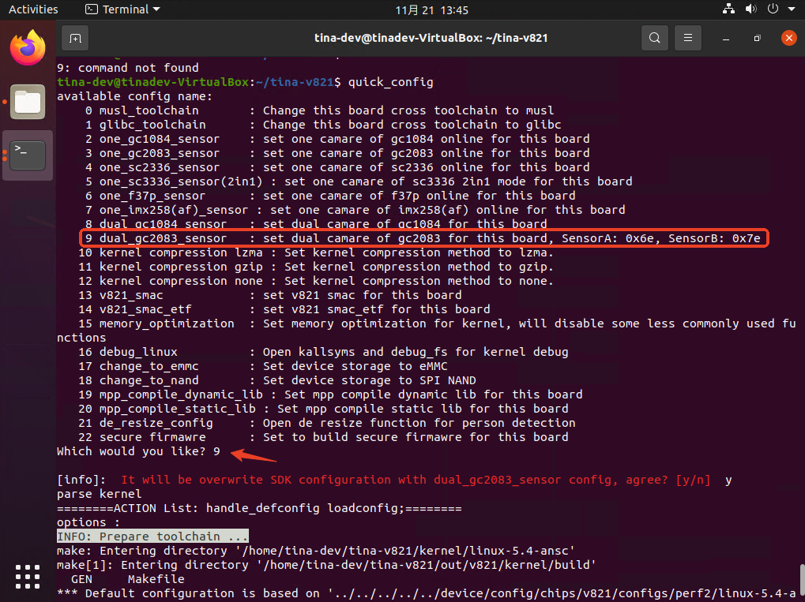
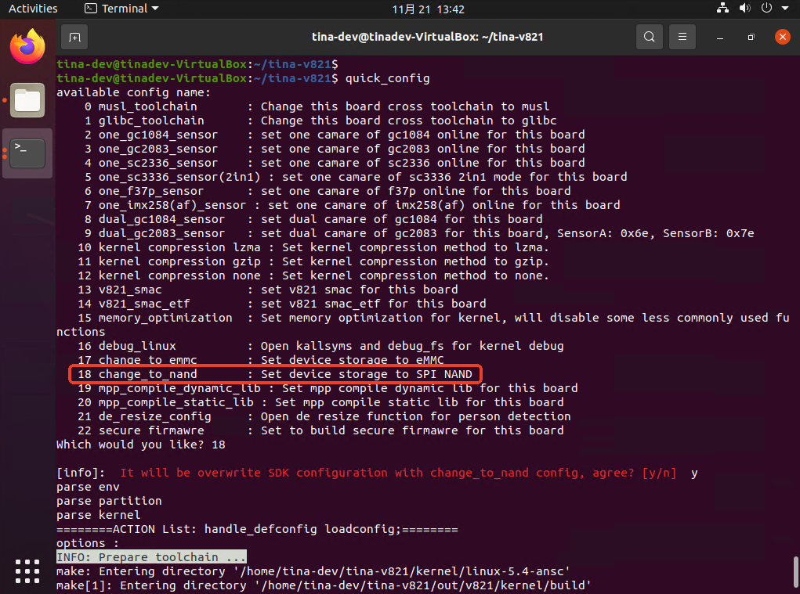
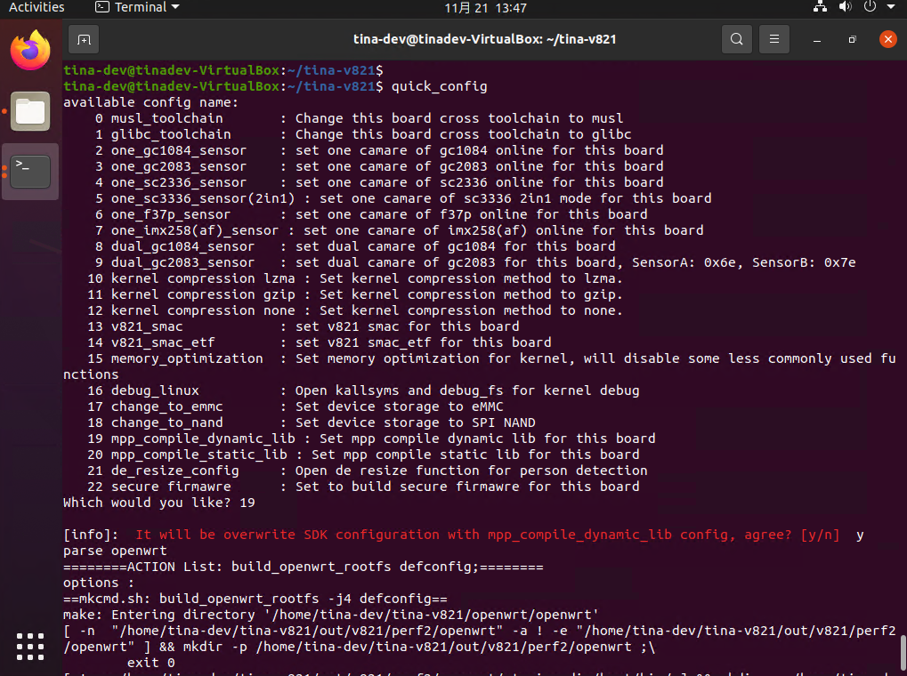
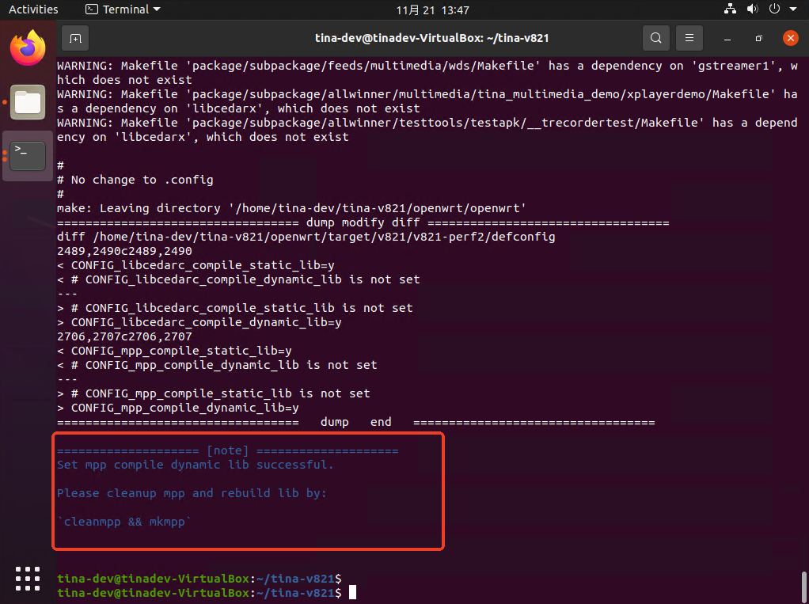
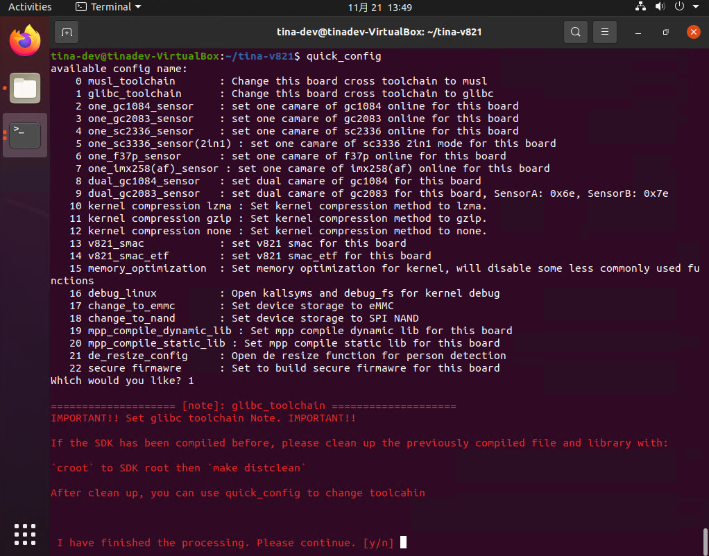
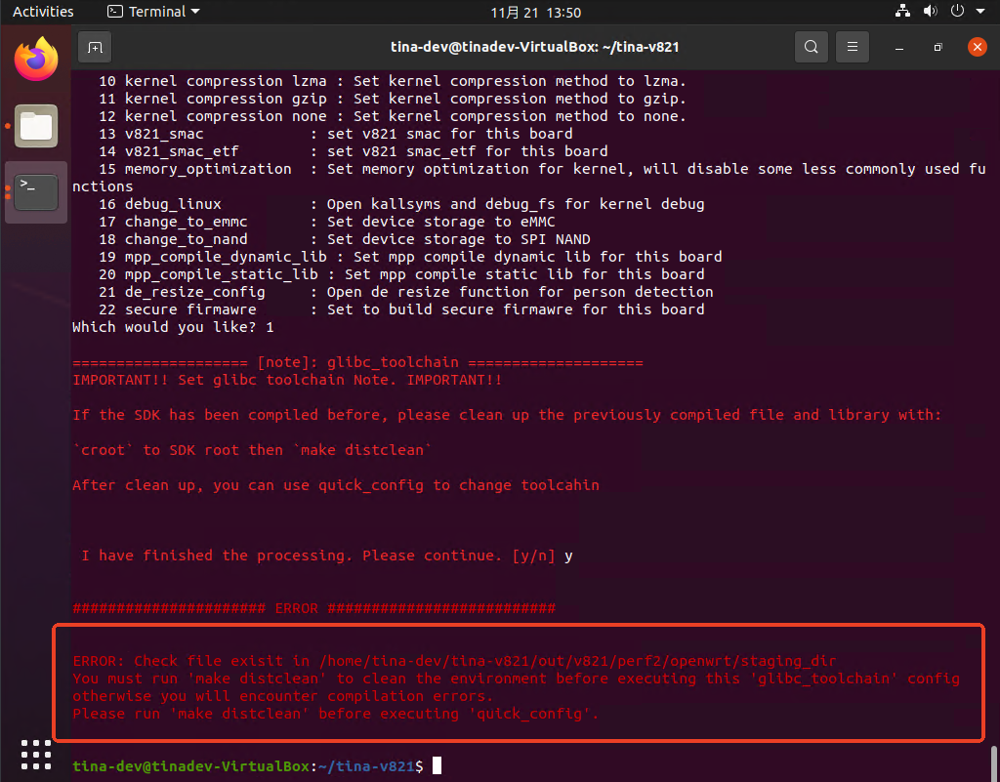
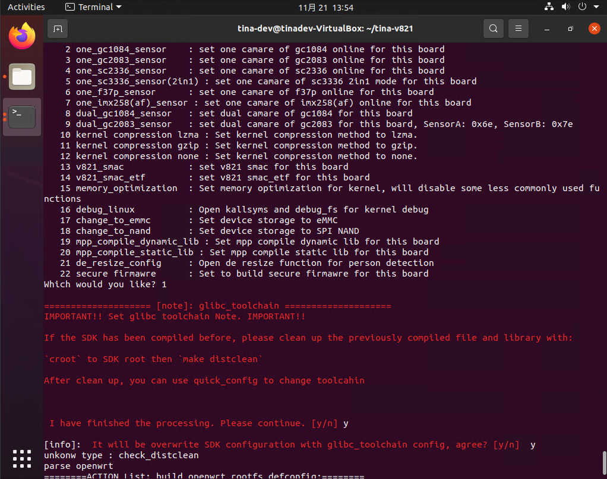

# SDK一键配置命令

V821 SDK提供 `quick_config` 功能，执行对应命令，可快速一键修改该功能相关的所有配置项。

## 使用 quick_config

在 `lunch` 后， 输入 `quick_config` 命令回车：

```text
$ quick_config
Available Quick Config Name:
    0 musl_toolchain                    : Change this board cross toolchain to musl
    1 glibc_toolchain                   : Change this board cross toolchain to glibc
    2 set_cpu_vf_0                      : Set cpu 960mhz (0.92v)
    3 set_cpu_vf_2                      : Set cpu 1200mhz (1.00v)
    4 kernel compression lzma           : Set kernel compression method to lzma.
    5 kernel compression gzip           : Set kernel compression method to gzip.
    6 kernel compression none           : Set kernel compression method to none.
    7 v821_smac                         : Set v821 smac for this board
    8 v821_smac_etf                     : Set v821 smac_etf for this board
    9 v821_fmac_etf                     : Set v821 fmac_etf for this board
   10 memory_optimization               : Set memory optimization for kernel, will disable some less commonly used functions
   11 product_close_debug_config        : Close debug configs for mass production
   12 mpp_compile_dynamic_lib           : Set mpp compile dynamic lib for this board
   13 mpp_compile_static_lib            : Set mpp compile static lib for this board
   14 de_resize_config                  : Open de resize function for person detection
   15 debug_linux                       : Open kallsyms and debug_fs for kernel debug
   16 debug_rtos                        : Open rtos uart for rtos debug, will disable sdc0
   17 secure_firmawre                   : Set to build secure firmawre for this board
   18 default_sensor_config             : Set to default camera config (gc1084)
   19 one_gc1084_sensor                 : Set one camera of gc1084 online for this board
   20 one_gc2083_sensor                 : Set one camera of gc2083 online for this board
   21 one_sc2336_sensor                 : Set one camera of sc2336 online for this board
   22 one_nvp6158c_sensor               : Set nvp6158c 2h for this board
   23 one_sc3336_sensor(2in1)           : Set one camera of sc3336 2in1 mode for this board
   24 one_gc4663_sensor(2in1)           : Set one camera of gc4663 2in1 mode for this board
   25 one_f37p_sensor                   : Set one camera of f37p online for this board
   26 one_imx258(af)_sensor             : Set one camera of imx258(af) online for this board
   27 dual_gc1084_sensor                : Set dual camera of gc1084 for this board
   28 one_gc2083_and_one_os02g10_sensor : Set dual camera of gc2083 and os02g10 for this board, mipi and dvp
   29 dual_gc2083_sensor                : Set dual camera of gc2083 for this board, sensora: 0x6e, sensorb: 0x7e
   30 dual_gc2083_sensor(stitch_mode)   : Set dual camera of gc2083 for this board, sensora: 0x6e, sensorb: 0x7e
   31 dual_sc2336_sensor                : Set dual camera of sc2336 for this board, sensora: 0x60, sensorb: 0x64
   32 change_to_emmc                    : Set device storage to emmc
   33 change_to_nand                    : Set device storage to spi nand
   34 e907_isp                          : Set e907 to run isp server
   35 e907_dual_isp                     : Set e907 to run isp server (dual sensor)
   36 lcd_nv3049f_480_854               : Set to support lcd nv3049f
   37 pl2_pl3_uart3                     : Set debug uart to pl2 pl3 with uart3
Which would you like?
```


- 输入 `quick_config` 命令后，根据需要，选择上面序列号并回车，回车输入y（注意输入y后会修改本地环境的一些配置），就会自动修改相关配置文件，具体修改了哪些文件，执行y命令后会全部打印显示出来。请注意留意有些配置项输入y之后会提示一些额外操作，确保配置生效。
- 输入 `quick_config` 命令后，若不需选择，直接回车即可，不会修改任何文件。
- 使用 `quick_config` 命令配置后，这些改动是**直接修改SDK中相关的文件**，目前**不支持清理命令**。如果需要清理这些修改，需要手动使用 `git` 命令清理，或者根据 `quick_config` 命令执行后的提示，恢复相关的配置项。

## quick_config 使用示例

**切换板级摄像头到双目GC2083**

更换摄像头模组为双目模组，可以使用 `quick_config` 修改配置到双目 GC2083 模组，输入 `qucik_config` 后可以看到选项 `dual_gc2083_sensor` 编号为9，输入后即可切换配置。



**切换储存介质为 SPI NAND**

切换储存器为NAND，输入 `quick_config`，可以看到用于切换的`quick_config` 是18，输入 18，之后会出现一个确认项，确认后将会自动执行其配置操作。



**切换 MPP 为动态库编译**

默认配置下，MPP 是静态库编译的，这里可以用 `quick_config` 切换到动态库编译。输入 `quick_config` 选择选项 19，然后确认



在切换后有提示，需要手动清除 mpp 的编译产物重新编译 mpp



**切换工具链为glibc库**

SDK 默认配置使用的库是 MUSL 库，可以通过 `quick_config` 切换到使用 glibc 库。输入 `quick_config` 然后选择选项。

> 注意部分 quick_config 在执行前需要有其他的操作，请按照提示进行操作，例如切换工具链，会有如下提示。如果没按照要求执行可能会导致SDK无法编译通过，quick_config 也对部分文件做了检查，如果无视提示直接跳过，会直接报错。

例如这里，SDK 提示需要删除编译产物，需要手动执行 `make distclean` 然后再执行切换工具链的操作。



如果无视，没有执行清理编译产物的操作，则报错退出



执行了 `make distclean` 后，正常操作。

