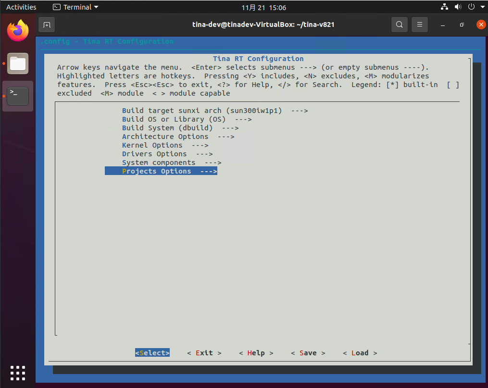

# SDK 新建板级方案

在开发时，通常会建立一个新的板级方案来开发，下面将介绍如何建立板级方案

在建立方案之前，需要了解当前板级的配置，以选择当前某一板级作为基础在上面二次修改

| **方案名**                | **对应开发板** | **方案说明**                         |
| ------------------------- | -------------- | ------------------------------------ |
| v821-ipc-tina             | V821 IPC板     | 单目gc1084常电方案（内置WIFI）       |
| v821-perf2-tina           | V821 PERF2板   | 单目gc1084常电方案（内置WIFI）       |
| v821-perf2_fastboot-tina  | V821 PERF2板   | 单目gc1084快启方案（内置WIFI）       |
| v821-perf2b-tina          | V821 PERF2B板  | 单目gc1084常电方案（内置WIFI）       |
| v821-perf2b_fastboot-tina | V821 PERF2B板  | 单目gc1084低功耗快启方案（内置WIFI） |

这里将以 perf2 开发板，详解如何新建一个自己的板级方案 `v821-custom`

## 使用脚本新建板级方案

V821 Tina Linux 提供了新建板级脚本 `create_new_board`

1. 首先 `lunch` 作为基础的板级，这里执行 `lunch v821-perf2-tina` 导入作为原型的板级
2. 然后执行命令 `create_new_board` 输入新建板子的名称，这里只需要输入名称即可，不需要带芯片型号，另外名称不支持 `-` 符号，支持下划线。这里输入 `custom` 即可创建 `v821-custom` 板级
3. 按照提示，执行 `source build/envsetup.sh && lunch` 即可选择新板级开发

- 注：使用 `create_new_board` 命令配置后，这些改动是**直接修改SDK中相关的文件**，目前**不支持清理命令**。如果需要清理这些修改，需要手动使用 `git` 命令清理，或者根据 `create_new_board` 命令执行后的提示，恢复相关的配置项。

## 手动创建新板级

### 新建 device

前往目录 `device/config/chips/v821/configs` 将 `perf2` 板级复制一份，命名为 `custom`。


修改两份 `BoardConfig` 包括 `BoardConfig.mk` 和 `BoardConfig_nor.mk` 将 `LICHEE_RTOS_PROJECT_NAME` 改为新方案对应的名字， `v821_e907_custom`，稍后将创建该名字的 RTOS 方案。


### 新建 target

前往 `openwrt/target/v821/` 目录，将 `perf2` 拷贝一份，重命名为 `v821-custom`。


进入 `v821-custom` 文件夹，将 `v821_perf2-setup.sh` 改名 `v821_custom-setup.sh`。


编辑 `Makefile` 将文件中的 `perf2` 改为 `custom`


编辑 `vendorsetup.sh` 将 `perf2` 改为 `custom`


### 新建 rtos

前往`rtos/board/v821_e907`，将 `perf2` 复制一份改名为 `custom`，这个文件夹内配置了方案RTOS的引脚文件，可以按需修改。


前往 `rtos/lichee/rtos/projects/v821_e907` 目录，复制 `perf2` 改名为 `custom`


编辑该目录下的 `Makefile` 增加一行，注意 `CONFIG_PROJECT_V821_E907_CUSTOM` 名字也需要改

```text
obj-$(CONFIG_PROJECT_V821_E907_CUSTOM) += custom/
```


回到上一级目录 `rtos/lichee/rtos/projects` 修改 `Kconfig` 增加新板级配置，这里的 `config` 名字需要与上面的 `CONFIG_PROJECT_V821_E907_CUSTOM` 同步

```text
config PROJECT_V821_E907_CUSTOM
	bool "v821 e907 custom system"
	select PROJECT_V821_E907
	---help---
		v821 e907 custom system
```


### 同步配置

在上面的操作完成后，还需要同步配置使得编译的产物正确。

（1）刷新板级列表

使用命令 `source build/envsetup.sh` 和 `lunch` 载入新板级配置。


（2）同步 Kernel 配置

输入 `m kernel_menuconfig` 什么都不修改，直接退出即可。


（3）同步应用配置

使用命令 `m menuconfig` 进入配置页面，选择第一项 `Target System`，将其改到新板级。


（3.5）同步 OTA 应用配置（可选）

部分板级支持 OTA，需要同步 OTA 板级配置，使用命令 `m ota_menuconfig` 进入配置页面，选择第一项 `Target System`，将其改到新板级，其配置方法与同步应用配置类似。

（4）RTOS 板级同步

运行 `mrtos menuconfig` 进入配置页面，找到 `Projects Options --->` 进入。



找到 `Configure Application` 改为新加的 `v821 e907 custom system`，保存退出。


此时便完成了板级的新建，使用 `mp` 命令编译吧。

