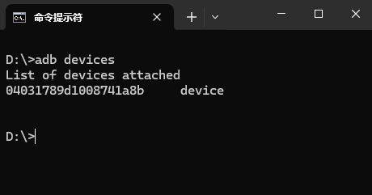
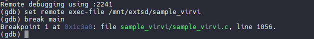

# SDK 调试指南

SDK 烧录到开发板之后需要进行开发调试，本文将介绍在开发调试中常用的工具，方便开发流程。一般开发环境如下图所示，PC与开发板通过 串口线 与 USB 线连接。通过串口线访问开发板控制终端，通过 USB 执行下载烧录，ADB等功能。


## ADB 辅助调试

V821 SDK 默认配置了 ADB 以供调试开发，ADB（Android Debug Bridge）是一个用于与Android设备进行通信的命令行工具，通常用于开发、调试和管理Android设备。V821 SDK将其功能移植到了 Linux 上，使得 Linux 也可以提供 ADB 开发的功能。ADB提供了多种功能，可以帮助开发人员在设备上执行命令、调试应用程序、传输文件等。

### ADB 环境搭建

在使用 ADB 之前，需要在 PC 上搭建 ADB 环境。安装ADB请参考文章 【[Android 调试桥](https://developer.android.google.cn/tools/adb?hl=zh-cn)】，ADB 下载地址请查看【[SDK 平台工具版本说明](https://developer.android.google.cn/tools/releases/platform-tools?hl=zh-cn)】。

### ADB 连接

ADB 支持使用有线 USB 进行连接，或者使用无线连接 ADB。下面将以 USB 连接和无线连接作示例，演示如何连接 ADB。

### 使用 USB 连接

开发板烧录固件后，插入 USB 线，在命令行内使用命令检查 ADB 连接情况

```text
adb devices
```



可以看到这里有设备连接成功。使用命令即可进入ADB控制台

```text
adb shell
```


### 使用网络连接

默认模式下，ADB 仅配置了有线连接，在部分开发场景下可能需要无线连接 ADB。这里以V821 SIP Wi-Fi无线网络连接为例，演示如何通过无线连接ADB

（1）开发板连接网络

开发板连接上串口，输入命令搜索网络

```text
wifi -s
```


搜索到网络之后，使用命令连接网络

```text
wifi -c <SSID> <密码>
```

连接完成后使用 `ifconfig` 命令查看 IP 地址


（2）配置开发板无线 ADB 功能

无线 ADB 需要配置无线 ADB 的端口号，这里配置为 `5555`

```text
export ADB_TRANSPORT_PORT=5555
```

然后重启当前的 ADB 服务端

```text
kill $(pgrep adbd) && adbd -D &
```

便可以使用 IP 地址和端口连接网络 ADB

```text
adb connect <IP>:5555
```


（3）默认开启网络 ADB

如果想在启动时默认启动 ADB，则可以修改 SDK 文件`openwrt/openwrt/package/subpackage/allwinner/usb/adbd/adbd.init`，将`ADB_TRANSPORT_PORT` 取消注释


### ADB的主要功能

**设备管理**：ADB可以列出和管理连接到电脑的Android设备。

- `adb devices`：列出当前连接的设备。
- `adb connect <ip>`：通过IP地址连接到设备，适用于无线调试。

**文件传输**：通过ADB可以在设备和电脑之间传输文件。

- `adb push <local> <remote>`：将本地文件推送到设备上。
- `adb pull <remote> <local>`：将设备上的文件拉取到本地。

**远程执行命令**：ADB允许直接在设备上执行Shell命令。

- `adb shell <command>`：在设备的Shell环境中执行命令。

**进入控制台**

- `adb shell`：进入设备的控制台。

**重启和恢复设备**：可以重启设备或进入恢复模式。

- `adb reboot`：重启设备。
- `adb reboot efex`：进入固件烧写模式。

## 使用远程 GDB 辅助调试

在开发过程中，经常需要使用 GDB 进行调试，但是由于嵌入式平台可用内存与核心较少，无法把整个 GDB 都在板端搭建起来。这里就需要使用 GDB Server 在板端建立调试服务，之后使用远程连接方法连接调试。这里将演示如何使用 GDB 调试 `sample_virvi`

### 切换使用 GLIBC（可选）

（1）清除之前的编译产物

```text
make distclean
```

（2）使用 `quick_config` 切换 glibc

```text
quick_config
```

选择 `1`


### Sample 配置调试信息

前往 `openwrt/package/allwinner/eyesee-mpp/middleware/Makefile` ，在FLASG中增加调试信息。如果之前编译过SDK，需要 `cleanmpp && mkmpp` 重新编译MPP才会带有调试信息。

```text
CFLAGS="-I -fstack-protector $(TARGET_CFLAGS) -g" \
CXXFLAGS="-I -fstack-protector $(TARGET_CXXFLAGS) -g" \
CPPFLAGS="-I -fstack-protector $(TARGET_CPPFLAGS) -g" \
```


配置完成之后请使用命令重新编译 mpp

```text
cleanmpp && mkmpp
```

### 配置 GDB Server

进入 `menuconfig` 勾选 `gdbserver`

```text
Development  --->
<*> gdbserver................................. Remote server for GNU Debugger
```


### 配置 ADB 转发

本地端口转发将本地计算机的端口映射到开发板上的端口。这意味着，当你访问本地计算机上的某个端口时，实际上是在访问设备上相应的端口。其拓扑如下图所示：


**命令格式：**

```text
adb forward tcp:<local_port> tcp:<device_port>
```

- `local_port` 是你本地计算机上希望使用的端口。
- `device_port` 是你希望访问的设备上的端口。

在这里，以端口 `2241` 为例，配置如下

```text
adb forward tcp:2241 tcp:2241
```


这时 ADB 转发就完成了，可以在 PC 端使用端口 `2241` 连接开发板。

### 转发编译服务器（可选）

在许多开发流程中，会搭建基于 Linux 的编译服务器以加速开发，此时需要再建立一个端口转发，将 PC 上的 ADB 转发再次转发到编译服务器。其拓扑如下图所示：


这里使用 PuTTY 进行转发，打开 PuTTY，配置编译服务器地址，点击 Tunnels


按照图中顺序配置转发


点击 `Open` 建立连接。此时便可在服务器上通过 `2241` 访问开发板的 GDB Server

### 开发板端配置 GDB Server

在板端使用命令 `gdbserver` 启用 GDB Server，配置端口为 2241，之后通过 ADB 转发，SSH Tunnel 将 2241 端口转发到 GDB 实际调试程序端口。


```text
gdbserver --multi 0:2241 &
```

> 之所以 `gdbserver` 选择 `–-multi` 方式启动，是因为使用 gdb 的 `extended‑remote` 方式连接 gdbserver，该方式允许在 gdb 端执行所有操作，包括控制 gdbserver 在开发板端进行可执行文件加载，运行等。启动后，目标开发板的 adbserver 就处于监听本地端口 2241 的状态中。


### 使用 GDB 连接

前往编译使用的工具链文件夹，针对不同libc的编译工具链，其路径如下：

- glibc： `prebuilt/rootfsbuilt/riscv/nds32le-linux-glibc-v5d/bin`
- musl：`prebuilt/rootfsbuilt/riscv/nds32le-linux-musl-v5d/bin`

调试使用的是 musl 工具链，所以这里以 musl 进行演示，前往编译工具链文件夹

```text
cd prebuilt/rootfsbuilt/riscv/nds32le-linux-musl-v5d/bin
```

（1）启动 GDB

使用命令运行 GDB 程序

```text
./riscv32-linux-musl-gdb
```


（2）加载需要调试的程序

在 `gdb` 命令行中配置需要调试的程序，这里演示使用的是`sample_virvi` ，其相对gdb的路径位于：

- `../../../../../platform/allwinner/eyesee-mpp/middleware/sun300iw1/sample/bin/sample_virvi`

```text
(gdb) file ../../../../../platform/allwinner/eyesee-mpp/middleware/sun300iw1/sample/bin/sample_virvi
```


之后 GDB 便会加载应用程序的符号表，加载程序。

（3）指定动态库的搜索地址

gdb 通过两个内部变量确定动态库的搜索位置：`sysroot` 和 `solib-search-path`。

`sysroot` 设置库的绝对路径前缀，只对绝对路径有效；而 `solib-search-path` 设置库的搜索路径，对绝对路径和相对路径均起作用。先看默认值：

使用`show sysroot` 查看默认值


使用`show solib-search-path` 查看默认值


可以看到目前的 `sysroot` 默认值为：`target:`。含义是动态库在开发板上，程序运行后，如果 `gdb` 需要加载动态库，就从开发板上拷贝回来，开发板上的动态库一般都去除了符号表等调试信息，这样导致 `gdb` 上调试动态库的代码，看不到源码，极不方便。所以可以使用命令修改 `sysroot` 到本地，使用本地带符号表的动态库执行。针对此次调试使用的 `perf2` 开发板，其本地动态库路径位于 `out/v821/perf2/openwrt/staging_dir/target` 中。

```text
(gdb) set sysroot ../../../../../out/v821/perf2/openwrt/staging_dir/target/root-v821-perf2/
(gdb) set solib-search-path ../../../../../out/v821/perf2/openwrt/staging_dir/target/root-v821-perf2/usr/lib
(gdb) info sharedlibrary
```


（4）连接开发板的 GDB Server

```text
(gdb) target extended-remote :2241
```

如果出现 `Remote connection closed `请检查目标开发板上的 `gdbserver` 是否工作正常，各级端口转发是否正确。

（5）将需要调试的可执行文件推送到开发板

此时需要将调试使用的可执行文件推送到开发板，这里使用 adb 推送到 `/mnt/extsd` 文件夹，同时配置文件也可以推送进去

```text
adb push sample_virvi /mnt/extsd
adb push sample_virvi.conf /mnt/extsd
```

然后在 GDB 内设置远端执行文件

```text
(gdb) set remote exec-file /mnt/extsd/sample_virvi
```


### 开始调试

**按函数设置断点**

可以在某个函数的入口设置断点。例如，如果想在 `main` 函数的入口设置断点，命令如下：

```text
(gdb) break main
```

这将会在 `main` 函数的开始位置设置一个断点。



**按行设置断点**

可以在源代码的特定行上设置断点。假设你正在调试 `main.cpp` 文件，并且想在第 1113 行设置断点，命令如下：

```text
(gdb) break sample_virvi/sample_virvi.c:1113
```

这将在 `sample_virvi/sample_virvi.c` 文件的第 1113 行处设置一个断点。


**按条件设置断点**

有时只想在特定条件满足时才暂停程序。可以通过指定条件来设置条件断点。例如，当某变量的值大于等于 0 时才中断，可以这样设置：

```text
(gdb) break sample_virvi/sample_virvi.c:1113 if pContext->mSaveBufMgrConfig.mSavePicDev >= 0
```

这样，只有当程序执行到 `sample_virvi/sample_virvi.c` 的第 1113 行并且变量 `pContext->mSaveBufMgrConfig.mSavePicDev` 的值大于等于 0 时，GDB 才会中断。


**按地址设置断点**

你也可以根据地址设置断点。如果你知道程序的内存地址，可以在该地址处设置断点：

```text
(gdb) break *0x0001e136
```

这将在内存地址 `0x0001e136` 处设置断点。


**查看已设置的断点**

在 GDB 中，你可以通过 `info breakpoints` 命令来查看当前所有的断点：

```text
(gdb) info breakpoints
```

这将显示所有已设置的断点信息，包括断点的位置、类型、是否启用等。


**启用和禁用断点**

- **启用断点**：

如果你禁用了某个断点，可以通过 `enable` 命令重新启用它。例如，启用断点 1：

```text
(gdb) enable 1
```


- **禁用断点**：

如果你暂时不想让某个断点生效，可以通过 `disable` 命令禁用它。例如，禁用断点 1：

```text
(gdb) disable 1
```


**删除断点**

如果你不再需要某个断点，可以通过 `delete` 命令删除它。例如，删除断点 1：

```text
(gdb) delete 1
```


**启动调试**

在设置断点后，你可以使用 `run` 命令启动程序的执行，这里需要添加参数 `-path` 指定配置文件，命令如下：

```text
(gdb) run -path /mnt/extsd/sample_virvi.conf
```

这将启动程序，并在设置的断点处暂停。


**查看代码**

使用命令 `list` 查看断点附近的代码

```text
(gdb) list
```


**继续执行**

如果程序在断点处暂停，你可以使用 `continue` 命令继续执行，直到下一个断点或程序结束：

```text
(gdb) continue
```


**单步执行**

- **单步执行一行代码**：通过 `next` 命令逐行执行代码，不会进入函数内部。

```text
(gdb) next
```

- **单步执行一条指令**：通过 `step` 命令逐行执行代码，并且进入函数内部执行。

```text
(gdb) step
```

**查看变量的值**

你可以通过 `print` 命令查看变量的当前值。例如，查看变量 `pContext->mSaveBufMgrConfig.mSavePicDev` 的值：

```text
(gdb) print pContext->mSaveBufMgrConfig.mSavePicDev
```


或者使用 `info locals` 查看断点的变量的值

```text
(gdb) info locals
```


查看此时 `pContext` 指针的值

```text
(gdb) p *pContext
```


## 使用 VSCode 开发调试

Visual Studio Code (VSCode) 是一款轻量级、功能强大的开源代码编辑器，支持多种编程语言、插件扩展，并提供智能代码补全、调试、版本控制等开发功能，VSCode 提供强大的 C++ 调试功能，支持断点、变量监视、调用栈查看和步进调试。

VSCode 相关入门资料

- VSCode 下载地址：https://code.visualstudio.com/
- VSCode 文档：https://code.visualstudio.com/docs
- VSCode 搭建远程 SSH 开发环境：https://code.visualstudio.com/docs/remote/ssh
- VSCode 搭建 WSL2 开发环境：https://code.visualstudio.com/docs/remote/wsl
- VSCode 搭建 C/C++ 开发环境：https://code.visualstudio.com/docs/cpp/introvideos-cpp

### 配置开发环境

安装完成 VSCode 后，打开 SDK 目录创建开发环境，这里演示的是使用远程 SSH 的环境。其通过 PC 运行 VSCode，VS Code通过 SSH 连接编译服务器，远程编译服务器上的开发环境，编译服务器控制GDB，GDB 通过 SSH Tunnel 和 ADB Forward 与开发板上的 GDB Server 通讯


先打开工作区，可以看到 SDK 界面


点击扩展，在 Server 安装 `C/C++` 扩展：https://marketplace.visualstudio.com/items?itemName=ms-vscode.cpptools


### 编写调试使用的 `launch.json`

点击调试，选择创建 `launch.json` 文件


调试器随便选择一个即可


写入以下内容，这里以调试 PERF2 开发板，sample_virvi 为例

```c
{
    "version": "1.0.0",
    "configurations": [
        {
            "name": "(gdb) Launch sample_virvi",
            "type": "cppdbg",
            "request": "launch",
            "program": "${workspaceFolder}/platform/allwinner/eyesee-mpp/middleware/sun300iw1/sample/sample_virvi/sample_virvi",
            "args": [
                "-path",
                "/mnt/extsd/sample_virvi.conf"
            ],
            "symbolLoadInfo": {
                "loadAll": true,
                "exceptionList": ""
            },
            "additionalSOLibSearchPath": "${workspaceFolder}/out/v821/perf2/openwrt/staging_dir/target/root-v821-perf2;${workspaceFolder}/out/v821/perf2/openwrt/staging_dir/target/root-v821-perf2/usr/lib",
            "stopAtEntry": true,
            "cwd": "${fileDirname}",
            "environment": [],
            "externalConsole": false,
            "MIMode": "gdb",
            "miDebuggerPath": "${workspaceFolder}/prebuilt/rootfsbuilt/riscv/nds32le-linux-musl-v5d/bin/riscv32-linux-musl-gdb",
            "miDebuggerServerAddress": "localhost:2241",
            "useExtendedRemote": true,
            "postRemoteConnectCommands": [
                {
                    "description": "Set remotetimeout for gdb",
                    "text": "set remotetimeout 20",
                    "ignoreFailures": true
                },
                {
                    "description": "Set remote exec-file for gdb",
                    "text": "set remote exec-file /mnt/extsd/sample_virvi",
                    "ignoreFailures": false
                },
                {
                    "description": "Set sysroot for gdb",
                    "text": "set sysroot ${workspaceFolder}/out/v821/perf2/openwrt/staging_dir/target/root-v821-perf2",
                    "ignoreFailures": false
                },
                {
                    "description": "Set solib-search-path for gdb",
                    "text": "set solib-search-path ${workspaceFolder}/out/v821/perf2/openwrt/staging_dir/target/root-v821-perf2/usr/lib",
                    "ignoreFailures": false
                }
            ],
            "setupCommands": [
                {
                    "description": "Enable pretty-printing for GDB",
                    "text": "-enable-pretty-printing",
                    "ignoreFailures": true
                },
                {
                    "description": "Set disassembly-flavor to Intel",
                    "text": "-gdb-set disassembly-flavor intel",
                    "ignoreFailures": true
                }
            ]
        }
    ]
}
```


### Sample 配置调试信息

前往 `openwrt/package/allwinner/eyesee-mpp/middleware/Makefile` ，在FLASG中增加调试信息。如果之前编译过SDK，需要 `cleanmpp && mkmpp` 重新编译MPP才会带有调试信息。

```text
CFLAGS="-I -fstack-protector $(TARGET_CFLAGS) -g" \
CXXFLAGS="-I -fstack-protector $(TARGET_CXXFLAGS) -g" \
CPPFLAGS="-I -fstack-protector $(TARGET_CPPFLAGS) -g" \
```


配置完成之后请使用命令重新编译 mpp

```text
cleanmpp && mkmpp
```

### 准备调试环境

（1）配置GDB

GDB的配置请参考上一章节 【使用远程 GDB 辅助调试】 部分的内容。

（2）将需要调试的可执行文件推送到开发板

这里同样推送到 `/mnt/extsd` 文件夹内，

```text
adb push sample_virvi /mnt/extsd
adb push sample_virvi.conf /mnt/extsd
```

（3）修改 launch.json 的配置

针对调试不同的程序，需要不同的配置，需要修改的点如下图高亮部分所示，请修改为对应的板级，对应的可执行文件。


### 开始调试

找到需要调试的程序源码，点击添加断点


切换到调试窗口，点击开始调试


便可开始调试，在断点处停下


可以看到调用堆栈，线程，监视，变量，寄存器等多种参数


## 使用 Coredump 文件调试

在一些开发场景下，使用远程 GDB 可能不是很方便，此时可以启用 Coredump，当出现错误的时候转储内存，之后导入分析

### 配置 Coredump 环境

（1）内核配置

内核需要勾选上 `CONFIG_COREDUMP `配置，默认SDK已经配置


（2）配置 Coredump 文件大小

系统启动后，执行程序之前，输入如下命令

```text
ulimit -c unlimited
```

（3）配置 Coredump 文件生成的路径与格式

修改 Coredump 文件的生成路径以及文件名格式

```text
echo '/mnt/extsd/core.%e.%p' > /proc/sys/kernel/core_pattern
```

含义如下

```text
/mnt/extsd 表示文件保存在tmp路径下
%e 表示异常程序的文件名
%p 表示进程ID
```

### Sample 配置调试信息

前往 `openwrt/package/allwinner/eyesee-mpp/middleware/Makefile` ，在FLASG中增加调试信息。如果之前编译过SDK，需要 `cleanmpp && mkmpp` 重新编译MPP才会带有调试信息。

```text
CFLAGS="-I -fstack-protector $(TARGET_CFLAGS) -g" \
CXXFLAGS="-I -fstack-protector $(TARGET_CXXFLAGS) -g" \
CPPFLAGS="-I -fstack-protector $(TARGET_CPPFLAGS) -g" \
```

人为添加一个错误，使其触发生成 Coredump，编辑文件 `platform/allwinner/eyesee-mpp/middleware/sun300iw1/sample/sample_virvi/sample_virvi.c` 在 `SaveCsiFrameThrad` 线程内添加一个空指针访问。

```c
int *ptr = NULL;
printf("Value at ptr: %d\n", *ptr);
```


### 运行 Sample，产生 Coredump

配置 Coredump 大小，配置 Coredump 输出文件，运行 Sample

```text
ulimit -c unlimited
echo '/mnt/extsd/core.%e.%p' > /proc/sys/kernel/core_pattern
./sample_virvi -path sample_virvi.conf
```


可以看到程序按照预期崩溃，并且产生 Coredump 文件


### 使用 Coredump 进行调试

在程序保留了调试信息，并且复现段错误生成 Coredump文件的情况下，就可以使用 GDB 定位是哪个地方出问题了。把上面生成的 Coredump 文件保存下来，放到与 sample 同级文件夹内。


前往编译使用的工具链文件夹，针对不同libc的编译工具链，其路径如下：

- glibc： `prebuilt/rootfsbuilt/riscv/nds32le-linux-glibc-v5d/bin`
- musl：`prebuilt/rootfsbuilt/riscv/nds32le-linux-musl-v5d/bin`

调试使用的是 musl 工具链，所以这里以 musl 进行演示，前往编译工具链文件夹

```text
cd prebuilt/rootfsbuilt/riscv/nds32le-linux-musl-v5d/bin
```

启用 GDB

```text
./riscv32-linux-musl-gdb <异常程序文件> <coredump文件>
```

例如这里

```text
./riscv32-linux-musl-gdb ../../../../../platform/allwinner/eyesee-mpp/middleware/sun300iw1/sample/bin/sample_virvi ../../../../../platform/allwinner/eyesee-mpp/middleware/sun300iw1/sample/bin/core.sample_virvi.212
```


可以看到有报错，缺少库符号表，需要配置库搜索路径，载入符号表

```text
(gdb) set sysroot ../../../../../out/v821/perf2/openwrt/staging_dir/target/root-v821-perf2/
(gdb) set solib-search-path ../../../../../out/v821/perf2/openwrt/staging_dir/target/root-v821-perf2/usr/lib
(gdb) info sharedlibrary
```


输入 `bt` 即可看到出错行，位于`sample_virvi/sample_virvi.c`的565行

```text
(gdb) bt
```


查看附近代码

```text
(gdb) list
```


可以使用 `info locals` 查看现场的变量

```text
(gdb) info locals
```


查看此时 `pContext` 指针的值

```text
(gdb) p *pContext
```


查看出错指针的值

```text
(gdb) p *ptr
```

