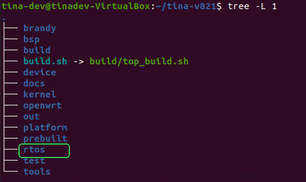
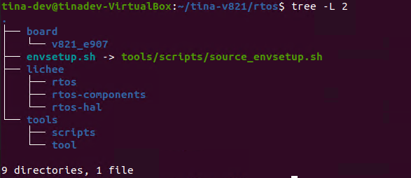
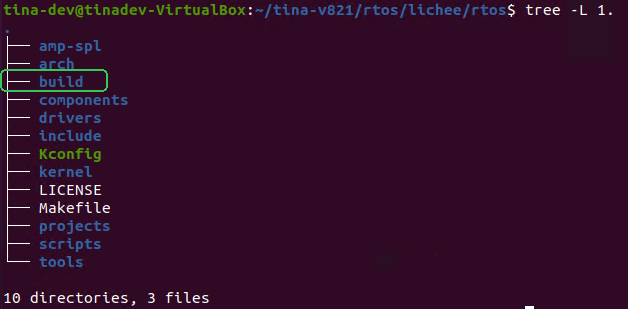
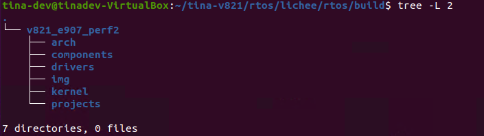

# RTOS 开发指南

系列芯片通常包含多个CPU核心。主核心运行Tina Linux系统，作为芯片主系统。MCU 运行FreeRTOS系统，主要功能包括提供通用算力补充、辅助Linux实现休眠唤醒、低功耗管理以及WIFI相关功能。本文将重点介绍RTOS相关内容，演示RTOS系统的操作方法。

## RTOS 目录结构

RTOS 目录位于 SDK 根目录下的 `rtos` 文件夹内



目录结构如下：



```
.
├── board
│   └── v821_e907
├── envsetup.sh -> tools/scripts/source_envsetup.sh
├── lichee
│   ├── rtos
│   ├── rtos-components
│   └── rtos-hal
└── tools
    ├── scripts
    └── tool
```

包括三个文件夹，一个文件

### board 文件夹

-   板级配置目录，用于存放芯片方案的配置文件，`sys_config.fex` 引脚复用配置等。

### lichee 目录

-   `lichee/rtos‑components`：公共组件目录。
-   `lichee/rtos‑hal`：HAL BSP 驱动目录。用于存放各种驱动代码。

### lichee/rtos 目录

```
lichee/rtos
    ├── arch        # 处理器架构相关
    ├── build       # 编译临时文件输出目录
    ├── components  # 组件
    ├── drivers     # 驱动
    ├── include
    ├── kernel      # FreeRTOS内核
    ├── projects    # 方案工程
    ├── scripts
    └── tools       # 工具链
```

lichee/rtos 目录主要包括arch（架构相关）、components（组件）、drivers（驱动）、include（头文件）、kernel（内核）、projects（工程）、toos(工具链) 几个目录。

#### arch 目录

arch 目录主要放置跟 SoC 架构相关的内容，每个SoC 单独目录管理，主要包括跟处理器相关的 ARCH 初始化、中断处理、异常处理、内存映射相关功能的实现。

#### drivers 目录

drivers 目录包含 SoC 所需的外设驱动，主要包括各外设控制器驱动的具体实现（rtos‑hal 软连接）以及OSAL 层接口实现（osal）。

#### kernel 目录

kernel 目录主要包含 FreeRTOS 的 kernel 源码以及全志实现的系统功能相关代码。

```
.
├── FreeRTOS
│   ├── Makefile
│   └── Source
├── FreeRTOS-orig
│   ├── License
│   ├── Makefile
│   └── Source
├── Kconfig
├── Makefile
├── objects.mk
└── Posix
    ├── CMakeLists.txt
    ├── include
    ├── Makefile
    └── source
```

#### projects 目录

projects 目录下的每一个子目录代表一个SoC 类别，每个 SoC 类别下面存放对应的方案，在这些目录下面实现各处理器上第一个任务，选择不同的 project 编译出来的 bin 具有不同功能。每个 `project` 有独立的 `FreeRTOSConfig` 配置。

```
├── config.h                       # 公共配置头文件
├── Kconfig                        # Kconfig 引索文件
├── Makefile                       # Makefile
├── objects.mk                     # Makefile 构建脚本
└── v821_e907                      # V821 平台方案
    ├── ipc                        # V821 IPC 板级
    ├── Makefile                   # Makefile 构建脚本
    ├── perf2                      # V821 PERF2 板级
    ├── perf2b                     # V821 PERF2B 板级
```

#### Tools 目录

这个目录主要包含一些预编译好的交叉编译工具链。

### tools 目录

-   工具目录，用于存放打包相关的脚本、工具等。

## SDK 开发入门

V821 小核 RTOS 开发与大核是整合编译的，在编译大核时会加载小核的开发环境。

### 初始化 SDK 环境

在 SDK 根目录下执行命令初始化 SDK 环境。

```
source build/envsetup.sh
```

Loading asciinema cast...

### 单独编译 RTOS

在 SDK 任意位置执行命令即可编译 RTOS

```
mrtos
```

Loading asciinema cast...

RTOS 的编译会在 `rtos/lichee/rtos/build` 目录下进行



目录结构如下



其中 `img` 文件夹为编译出的 `elf` 文件，`map` 文件等，调试时使用。

```
├── rt_system.bin
├── rt_system.elf
├── rt_system.map
├── rt_system.syms
├── sys_config.bin
└── sys_config.fex
```

编译完成的固件会自动拷贝到对应板级的板级目录下，以供打包使用，例如这里的 perf2 板级的 RTOS 被拷贝到 `evice/config/chips/v821/configs/perf2/bin` 目录下，并且重命名为 `amp_rv0.bin`

### 清理 RTOS 编译产物

在 SDK 任意位置执行命令即可清理 RTOS 的编译产物

```
mrtos clean
```

Loading asciinema cast...

### 配置 RTOS 组件

在 SDK 任意位置执行命令即可配置 RTOS 的模块，类似于 Linux 的 `menuconfig`

```
mrtos menuconfig
```

Loading asciinema cast...
