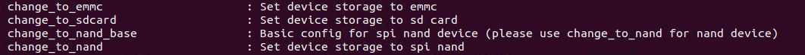

# SDK 更换存储介质

quick\_config 中内置了存储介质更换的功能，该配置支持常电和快起系统。包括：

-   切换 SPI NAND 作为启动存储介质
-   切换 SD NAND 作为启动存储介质
-   切换 eMMC 作为启动存储介质

:::tip

:::note

提示

:::
:::note

更换存储介质 quick\_config 仅支持 SDK 单向修改配置，修改后无法恢复到原来的配置，若需要恢复请使用 git 管理版本

:::

:::

| quick\_config 条目 | 功能 | 备注 |
| --- | --- | --- |
| change\_to\_emmc | 切换 eMMC 作为启动存储介质 |  |
| change\_to\_sdcard | 切换 SD Card 或 SD NAND 作为启动存储介质 |  |
| change\_to\_nand\_base | 内部配置用于切换 SPI NAND 作为启动存储介质 | 内部使用，不可直接调用 |
| change\_to\_nand | 切换 SPI NAND 作为启动存储介质 |  |

## 使用示例

### 切换到 eMMC

1.  加载 SDK 环境变量 `source build/envsetup.sh && lunch` 选择需要开发的板级
2.  执行 `quick_config`，打开 `quick_config` 配置界面
3.  选择 `change_to_emmc` 条目

Loading asciinema cast...

### 切换到 SD Card 或 SD NAND

1.  加载 SDK 环境变量 `source build/envsetup.sh && lunch` 选择需要开发的板级
2.  执行 `quick_config`，打开 `quick_config` 配置界面
3.  选择 `change_to_sdcard` 条目

Loading asciinema cast...

### 切换 SPI NAND

1.  加载 SDK 环境变量 `source build/envsetup.sh && lunch` 选择需要开发的板级
2.  执行 `quick_config`，打开 `quick_config` 配置界面
3.  选择 `change_to_nand` 条目

Loading asciinema cast...

## 常见问题

### 不可选择 `change_to_nand_base` 条目

-   该条目为内部使用，不要用这个选项配置切换 SPI NAND，请使用 change\_to\_nand
