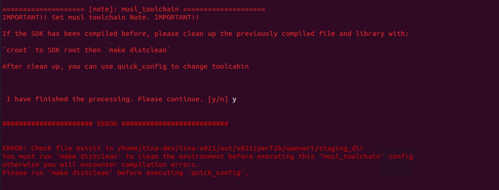

# SDK 更换工具链

quick\_config 中内置了更换工具链的功能，该配置支持常电和快起系统。包括：

-   切换 rootfs 使用 musl 工具链
-   切换 rootfs 使用 glibc 工具链

默认 SDK 配置使用 musl 工具链。另外内核使用 glibc 工具链，不可更换。

![image-20250613141048022](data:image/png;base64,iVBORw0KGgoAAAANSUhEUgAAAp0AAAAyCAYAAAAeAGAsAAATiklEQVR4nO2dzU/ibPfHv88vz58xKs5wJ4SVYccsRByJK3B2Jt00hhDZNV2pmYxGzURdNd1hiCFsmsxuxNUE33Ax7IgrQ3I7t4j+DU+e3fNb0EIppVdL26Hg+SRsWnq9HK5zejjXy/lXLBb733/++28QBEEQBEEQhF/837gbQBAEQRAEQUw/5HQSBEEQBEEQvhMApzOMTDqMqO5KVCjhvnGpfg6RcVpkJIdzi+dcl/9HGZQPk0gO540SxIhfbfKQSA7yD/W3+JEz6ecI/ScIgiAIInCM3+mMJJHd5xHWXXqQN7AQW8EC9x3PPlTpd/meYiKfaSKzuY7QTb7ze3wu4sH4hSnvP0EQBEG8FRhOZxjij2ERKI9oFrEW+4qKX+WPjTBEqRdRPZdSo8lwjPKJCoc41yLCPw59iJyG8WEeaP3zOPwrfvQ/fdj5TYRw/zU/xzlBEARBvHGsnc5IEkuzL3ie/YhVg8MRNXNAIhSP0shIBfBQwMVWsBDL43Z+C0fC5MgnKpSgJIEzbqUThdy+Q2g1Ne5mecoczwd8aQVBEARBTA+WTmd09SPmagrOajNYWtU5TJEcjhTDWshIDueK7iUeSRkifcYoUgqyq3WbrPKBD7pInfNIYxiZkSOVKXxKvKB8WlWnix8hndUxl0x2yjBbczoQaWPJx9i+4VG6zhrWQ2RsRypT2OSB8vZXVJrqpWYVglztq39oJFfrX7o/UtqrX42gNwrgZ4HEvtmaTnb/RW0taKMEUXAaqayjVosjO+yPgNX4UtfMylIJ940SZCGn9lMfDbYzftQ+UoSVIAiCeANYOJ1hrCZnULuuonKtc5gAoHmD23Ycn9K9b3cc1LvuNGhmdRG4/taJksXyuMU6FEkfKatCiK1gIXaC2ggNZ5cfBx+6w05sBQvcieNIY0Yq4GDUSGUkhBBe8bupu/Z3G8+zsw7WJlrLJyMVcDD/C7tqJHLnGlhND34vKpRwlHzFbkznQI7SfpP6u5FcU/nGkV1W5R/LY/cpjoNN7fd5hPS5c73cBmp7KyZrOtn9559O1PoVIBm32bkeV6ffAf241pfPHF9A63QDXBlI8LM4i61gtxbv/jlzNX4IgiAIYgoZ7nRGkliarePqAsDFHWp9U+yP+HnzgsSy9hJOYZPvOKgaFfkrpIvH7vel6zowH/IsosMuXxdpbFb7I41MGJHKsaO2b7vYdSQfLoqQLvq/FdosQeFfcfbZ6zWhBvmYyvcFtzr5VTz9/c3rd0zzBrdYx6aJs84eXx2n/OGfV6DdRv+qVLvjR3WszTZQEQRBEMSUMTQVUXT1I+bav9SX6RNa7c4Uu9TsXHmQFdQaHMRIFdJfi0i0v4PTOz3pHM6z65ib1V1rt71rObN860idJZEQQphBQrkEr7/uZfvdoEYiryz7N4PEfB3P6ESkKxdW3/Wjfhfy96R+O3ScwftsDtEzwy034zfo44cgCIIgxsBQpzMcmgFm16E01nsXQ/NAN6ZTxVVtC9nVMH6H4ni+KeuiNSnI++to7eWxpkWL0oe4z3rVbDvlv8OHCIBRHJNmCy3UcTbqrulmCy187K//r1nMDUTERsSs/AFeUN7+CumvQ9zvlyD+vQHJrixY5duq30e8rP+ijHK2gM1lfaTU5fh1NH7CiOKRIp0EQRDE1DNkel2dHtR2LsdWsLBXBxKLfRs6Oms9eXxKvOD2p9GdekFLc7EiKYhZqzV3qoNopNlCC/1rR+2XPwN+U928od5/vrnpf7kPLb+Kq1ocB7rNH9F0DrJgd/d2FVc1Xf0I99ev1tvdxOJYPmr5x7nu5pxoOgfRTE4XX7Grftf+1HYVp2WAP9Zt/omkdP039G+YfD1jSP8N9Y+GulQkYXzeyfg1Ynf8pCA3ClACn6CAIAiCINxj7nSmF5EwTo9e3KFmdNAu7lCbjSPR/oWffRGnKk7Lr1jSdiUfL+L3zbA1d1UIe69YUi4Hz05EFcJeHaF94z075ddRbi3iqHGJe2ULS08nWJONjvGw8oGKmMcuOCjq7uOjZeDqZxV2qYh5lLvPF8DjO3bkXpRY2KsDfGFk+VTEPHafPuJA6bXv55Ap9E5b1h1tZHmQN8DdAFmlJ+OWrv99/VPluzMgXy8Y3v/y/Fan/uNFYKj82DzIimGzkpPxa4698fOEVvsFz7oNeARBEAQxrfwrFov97z//HTrLTnhAVChB4YEy52CKm3BG+hD32TY42pRDEARBEIFk/Gkw3wAP8gZ2a0Dor3G3ZIpI5yCntcht2OfpfYIgCIIg3EKRTmJCCSMjfcFBYgYA8Fw7wY5YJaeTIAiCIAIKOZ0EQRAEQRCE79D0+gh00kq6SOHpM67bZ5amc2TCyKTDATlUn5gIPB1/AcRR/3zQnyDKdyANMDEqZP+DTdD9B78hp3MEHuSNzjFS3Hc8j7sxJgSqfZEksvu8g/SfBEF0If0hHEL2P9gE6vcZAwF2OsMQJe0fQQnyNOatTh9O/z+dZhFrox6yT0w1UeEQ59o//h+HEM3O6p1kvNBv0p/phey/O96C/KaQwDqdGakAHr/AxVawwCkAX4Bsekg8QRCTRlQoQUkCZ1oCiu07hFbtJl8gJoswopFxTrGOu36CIDQC6nSqGZFO1TMXm1Wcll+QWLb5UorkcN4oQZZKapQ0p0ZU1GiK2ZoVw5qiaFoXhWmUdMfzeEBEbc9+HEAcB1o9kr5/+kjvJc512W3s3WcRRqbveZP1VOn+SFRGH4mKpAz1G59PQR62bkWTv1X5xASg/saO1+KlsMkD5e2vqGjn1jarEGTD4fmjjj9b4ysM8UdPv0XBuKbQqB8O9MuWfjP6Z6U/8MY+fdBFmh3bF1v6fwhRKOG88QVHx18MmbdSkPXyf++09Sz7xarfun8s+bqSP9l/d/bfE/mxyg+w/zDhBNPpjIQQMmREevjnFZgPOVKs1ukGuDKQ4GdxFlvBbi2OpVU7P34Km/vvcLunpQH9hqvlpHdh/GYRa1pqUdSxq6UaFXsv3U6kV1EjvSe4nd/qyyjEus8iIxVwMP8Lu2qkaecaWO2LJMeRXb7DTmwFC7E8dp/iONjsKXVmdRG4/qbKJ49brEPpU/oqhNgKFmInhmw/9sonphgT/R7E7fhjPC8VwD+d9GZSkv1pTjNSAQeafsXyzvTLhn6zx7+V/nhhn+LgQ2r9I9gXtvw7dSyFFOzENrD2eQMLXLk7zZqRtpCwkD8Ltv1i1W/VP5Z8Xcqf7D+zfEs8kJ8dAus/TDjBdDq7dKIR3fSUs7MOFiR3XmoP/7wC7TacJ2icwdL7FKIRAHhERSz+wXVVWqS32o30Smd1zCWTqtPNum+z/O1iN9L0cFGE1JdG8wW3Wvl4ROW63uf0V+SvkC40qT5CMtxnY10+MQmoLxZfskC5HX9Wz5vrTw/DfTw61C/3/WPj1j65sy/29F/fRwBN7fss+bOwY7+c19//+7Lk6+f7gey/O9zKB5hs/yHYBPyAzkdIn1cgAUAaI/74o1CFwIUgH3M44rcwhxfUyt8g+JJb3AQ1EnQ1LBLEuu+2fABgRaLSOZxn1zE3q7vWbjtoBCvSRbxt3I4/i+dt6dcMEsoleP11R+ObhZvx74V9ciEfwJ3+/xH75eZ5lnx9fj+Q/XeHW/m4Zsz+Q8AJZqSz2UIL7/BBt8Yj+v4d8NT6cxlnmkUInzewFlsBt/eKBM//ufC4Sf8d3XdbPpMU5P11tM7y6vSBNtVBvD1G2KAx7vFnS79003bax5eI7oi4tk9u7IvP8g/C8yz5+vl+IPvvDtf986INY/QfAk4wnU5UcVWbAb+pLsyNpLDJz6B2XWU9aI9mCy3EkdWm7SMpiFndmqJIDrJgY+GxWs6nUXfV/93Gs6lyaP1Pdfvfn1ucdZ/VPvX541x38XY0nYPoqB8vaGlxZ6P8BhizASB8IgW5UTBs0LBDFadlgD/WbR6IpCALTtb0Ohl/g/Wb6U///TgOdJsPoumcw/bBQr+dYijDrn2yxK198VP+Np8f2X4x+seSryfyB9l/t4wsP5cExX+YUALqdAIVMY8yPkJpXOJe4YByHsLAmp1RqULYqwN8obO77HgRv290/9SaRZxiEUfq7jMlC5Q5s7PGOuWE9tUdck7PEm0WcVYDeGVw912n/5za/y0sPZ1gRxeeZ91nta8i5rH79BEHat1Hy8BP2/Kt4rT8iiW13AH5DbThFUvKiDIiAswTWu0XPNfuHK9XepA3wN0AWaU3hlo/7f6pdDL+zKmIeZTntzr6c7wIGJ6viHnsavql6seV7fapWOi3fUz0x7Z9sqKOckstQ7Ufa7bti8fyV7gB+dt5fnT7xegfS76eyB9k/93iQn7uCIj/MKFQ7nWCIIj0Ie6zbXBBmkInCIKYMgIb6SQIgvCNdE53dl7Y2+k3giAIwhQKcfqA3LhEYtjN9neKphDEuLm4wZX0Bff7MwCA55qX028EQRCEGTS9ThAEQRAEQfjOm5xejwq99FhmKeb6CSOTNhwLY5YGa4Jw1n8TPO2/iXyJt82E6xcTR/3zQT+CKN+0MQ0pMSpk3/3lrfsPbgm+0xlJeT5oH+SNztli3Hc8M+tPIrvPO8iEFHwc9d9vplC+BOEZpB+EQ8i++8tb9x/cEnCnMwVZ2cLBOH+0ZhFrsRGOw/CC9OFo/1QniXHKlxgrUeEQ51rE4MchxGk7y9UL/SX9mF7IvrtjEuRH+jtAgJ3OMMQfWwjV6qiNuykEQXhKVChBSQJnnJrRZPsOodVRzrEkgk8Y0cg4p1jHXT9BEBoBdjoB3JxgTbwb8eEwxB/auosSRMHpmqEUZMa6jQ+6SM25ZMxAEEZG6q39OJcc1B3JdcrdjwOI46AxePgtEIbYV/5g/db3Wdhof7o/UpXpy5qSMtRvfN5CvtqaF6vyiQCg/oaO1+KlsMkD5e2vqGj5kZtVCLLh8PVRx5et8cOyD8bx70B/bOkvo38M+xPVP9so6Y5/sg/LflnaD1v6fQhRKOG88QVHx18MmatSkPXyf++09Sz7xKrfun8s+bqSP9l3d/bdE/mxmGD/IeAE2Ol8hGR8CTkgIxXAP52Ai61ggVOApJM0awBQhRBbwULsZEikNQ4+dIed2AoWuBPczm/hSJdRICMVcDD/C7tqJGfnGli1m+6qWcRaN5+tLge02JNHRiqAh6L2z7x+q/ss2O2PI7us9j+Wx+5THAebPaXPrC4C19/U3Lx53GIdSp9RYMvXqnxigomEEMIrfjetvuR2fDGeZ9iHjFTAgaY/sbwz/bGhv+zxbaUfKWzuv8PtnpYX/huulpMOpxnZ9svSvjDl36ljKaRgJ7aBtc8bWODK3WnGjLSFhAv7bM++WtVv1T+WfF3Kn+w7s3xLPJCfHflMrP8QcALsdLohhU+JF5RPq53zMJtVSGfO0qyxGSx/LplU/42o9W8Xu5Gch4siJM/SeJr3b6D+ofdtlm/Z/hfcauXjEZXrOjAf6pZfkb9CutDOPXyEZLjPxrp8IgiohtWXc2fdji+r51n2wXAfjw71x33/2Mxg6X0K0Yj6vFh0uG7Mnf2wp9/6PgJoat93a5/t2ldn9ff/viz5upW/jf6RfR8Rj+Qztf7DeJnOAzrVSMqVZSTFLRaRGr/rZ5Xvtn5bzzMiVekczrPrmJvVXWu3HTSCFQkjphu348uFfkZCCGEGCeUSvP66o/HLws34rkLgQpCPORzxW5jDC2rlbxAcHW7v0n650e8/Yp/cPM+Srxfyd9E+su/WjHt82WKM/sOYmc5IZ7OFFt7hg69rAC3K97t+Vvlu63fd/hTk/XW0zvLq9Is2FUJMHyNs0Bj3+LKlP7ppO+0TpExizSKEzxtYi62A23tFgucdTq+7sR8+yz8Iz7Pk61r+Lto3bvkF3b6PXT52GKP/MGam0+lEFVe1GfCb6uLcSApi1mRNRrOFFuL4xFwrYTYABsvv5W5W6z/OdRdHR9M5iE7XZPzdxrNp3eb9G6h/6H2Vof33ov0vaEH95z9M/l2mV8GmmxTkRsGwQcMOVZyWAf5Yt3kgkoIsOFmz62R8DdZvbR+quKrFcaBb3B9N5xy2Dxb66xRDGZFOW9xNRbq1H37K3+bzI9snRv9Y8vVE/iD77paR5cdiSvyHgBJgp1Pb/bWFRHeHmv2XW0XMozy/BaVxifvjReDG7J9YFcJeHaF9dYeY6ULjKoS9Vywpxu/UUW4t4qhxiXtlC0tPJ1jTTa9UxDx2nz7iQH3uaBn46XRNRrOIsxrAK4O78ypiHmVwnf6p9e8Y6re6z+q/u/ZXcVp+xZJa7v3xIn6byl9rg5l8ieDzhFb7Bc+1O8fr2R7kDXA3QFbpjZHWT7sbB52ML3NY9qEi5rGr6Y86/q9st0/FQn/tY6IfzSJOodqexiWULFDmnJ4FyLZfw+2Hx/JXuCH22fp5N/bVsn8s+Xoif5B9d4sL+bGYCv8hoLyd3OvpQ9xn2+CCNEVGEEQwIPtAEMQwyD54RoAjnS5J53Rnp4UdhtcJgphqyD4QBDEMsg++Mb0hzosbXElfcL8/AwB4rjkLr/tHCnJjC4lht9vf6d8UQfhNYO0DQRBjh+yDb7yd6XWCIAiCIAhibEzv9Dphj0iul47OcTpDgiAmDi0N4bjbQRDEm4OczjdOZnMdoZt88M4hJAhi4okKhxN8IkUn//W0HFVDEEHg/wGxRt5ed/+v+wAAAABJRU5ErkJggg==)

:::tip

:::note

提示

:::
:::note

更换工具链 quick\_config 支持 SDK 双向修改配置，可以任意切换，使用前需要执行 `make distclean`

:::

:::

| quick\_config 条目 | 功能 | 备注 |
| --- | --- | --- |
| musl\_toolchain | 切换 rootfs 使用 musl 工具链 | 使用前需要执行 `make distclean` |
| glibc\_toolchain | 切换 rootfs 使用 glibc 工具链 | 使用前需要执行 `make distclean` |

## 使用示例

### 切换 musl 工具链

1.  加载 SDK 环境变量 `source build/envsetup.sh && lunch` 选择需要开发的板级
2.  执行 `make distclean` 清理上次编译产物
3.  执行 `quick_config`，打开 `quick_config` 配置界面
4.  选择 `musl_toolchain` 条目
5.  阅读提示，确认无误按 Y

Loading asciinema cast...

### 切换 glibc 工具链

1.  加载 SDK 环境变量 `source build/envsetup.sh && lunch` 选择需要开发的板级
2.  执行 `make distclean` 清理上次编译产物
3.  执行 `quick_config`，打开 `quick_config` 配置界面
4.  选择 `glibc_toolchain` 条目
5.  阅读提示，确认无误按 Y

Loading asciinema cast...

## 常见问题

### ERROR 报错



这段错误提示表明，在你执行 `quick_config` 之前，环境需要进行清理。错误提示建议你运行 `make distclean` 来清理当前的构建环境，否则会在编译时遇到错误。

错误分析：

-   **原因**：在进行构建时，存在环境或配置冲突。这通常是因为之前的构建没有完全清理，导致当前配置和之前的状态不兼容。
-   **解决方案**：按照错误提示，执行 `make distclean` 清理环境，然后再执行 `quick_config`。这样可以避免环境中残留的旧配置或编译文件影响当前的构建。

解决步骤：

1.  在项目根目录下运行以下命令：
    
    ```bash
    make distclean
    ```
    
    这将清除之前的编译和配置文件，确保环境干净。
    
2.  运行完 `distclean` 后，重新执行 `quick_config`，确保配置生效：
    
    ```bash
    quick_config
    ```
