# SDK 一键配置命令

Tina Linux SDK 提供 `quick_config` 功能，执行对应命令，可快速一键修改该功能相关的所有配置项。

:::note

:::note

备注

:::
:::note

本文以 V821 作为示例，其余芯片平台使用方式与 V821 一致

:::

:::

## 使用 quick\_config

在 `lunch` 后， 输入 `quick_config` 命令回车：

```
$ quick_config
 _____     _     _   _____         ___ _
|     |_ _|_|___| |_|     |___ ___|  _|_|___
|  |  | | | |  _| '_|   --| . |   |  _| | . |
|__  _|___|_|___|_,_|_____|___|_|_|_| |_|_  |
   |__|                                 |___|

=============================================
 Quick Config ToolKit: Version 2.0.4
=============================================
Available Quick Config Name:

[CPUCFG]
    0 set_cpu_vf_0                              : Set cpu 960mhz (0.92v)
    1 set_cpu_vf_2                              : Set cpu 1200mhz (1.00v)
    2 config_v821                               : Set driver config for v821
    3 config_v821b                              : Set driver config for v821b
    4 config_v821_integrated_wifi               : Set wi-fi driver for v821
    5 config_v821b_integrated_wifi              : Set wi-fi driver for v821b

[DEBUG]
    6 disable_sdc0                              : Disable sdc0 for rtos uart pinmux
    7 debug_linux_function                      : Open kallsyms and debug_fs for kernel debug
    8 close_debug_linux_function                : Close kallsyms and debug_fs for kernel debug
    9 open_boot0_uart_print                     : Open boot0 uart print for debug
   10 open_linux_uart_print                     : Open linux uart print for debug
   11 open_rtos_uart_console                    : Open rtos uart for rtos debug
   12 open_all_uart_print                       : Open rtos boot0 linux uart for debug
   13 close_boot0_uart_print                    : Close boot0 uart print
   14 close_linux_uart_print                    : Close linux uart print
   15 close_rtos_uart_console                   : Close rtos uart console
   16 close_all_uart_print                      : Close rtos boot0 linux uart print

[KERNEL]
   17 kernel compression lzma                   : Set kernel compression method to lzma.
   18 kernel compression gzip                   : Set kernel compression method to gzip.
   19 kernel compression none                   : Set kernel compression method to none.

[MPP]
   20 mpp_compile_dynamic_lib                   : Set mpp compile dynamic lib for this board
   21 mpp_compile_static_lib                    : Set mpp compile static lib for this board
   22 de_resize_config                          : Open de resize function for person detection
   23 ve_freq_512M                              : Set ve freq to 512m for this board
   24 ipc_demo                                  : Enable ipc demo for this board
   25 cdr_demo                                  : Enable cdr demo for this board
   26 tuya_demo                                 : Enable tuya ipc demo
   27 keyword_spotting_demo                     : Enable keyword_spotting demo
   28 enable_uvc_and_demo                       : Enable uvc and demo

[SYSTEM]
   29 config_debug_baud_115200                  : Set debug serial baud to 115200
   30 config_debug_baud_1500000                 : Set debug serial baud to 1500000
   31 memory_optimization                       : Set memory optimization for kernel, will disable some less commonly used functions
   32 product_close_debug_config                : Close debug configs for mass production
   33 secure_firmware                           : Set to build secure firmware for this board

[TOOLCAHIN]
   34 musl_toolchain                            : Change this board cross toolchain to musl
   35 glibc_toolchain                           : Change this board cross toolchain to glibc

[WLAN]
   36 config_v821b_integrated_bluetooth         : Set integrated bluetooth configure, only enable ble-server role
   37 config_v821b_integrated_bluetooth_general : Set integrated bluetooth configure, enable ble-server and ble-client role
   38 config_v821b_integrated_bluetooth_full    : Set integrated bluetooth configure, enable ble all functions
   39 v821_smac                                 : Set v821 smac for this board
   40 disable_v821_integrated_wifi              : Set to disable v821 integrated wifi (for v821l2-xxx)
   41 v821_smac_etf                             : Set v821 smac_etf for this board
   42 v821_fmac_etf                             : Set v821 fmac_etf for this board
   43 v821_fmac_etf_on_ext                      : Set v821 fmac_etf for this board, compile as ko to external storage device
Which would you like? 
```

-   输入 `quick_config` 命令后，根据需要，选择上面序列号并回车，回车输入y（注意输入y后会修改本地环境的一些配置），就会自动修改相关配置文件，具体修改了哪些文件，执行y命令后会全部打印显示出来。请注意留意有些配置项输入y之后会提示一些额外操作，确保配置生效。
-   输入 `quick_config` 命令后，若不需选择，直接回车即可，不会修改任何文件。
-   使用 `quick_config` 命令配置后，这些改动是**直接修改SDK中相关的文件**，目前**不支持清理命令**。如果需要清理这些修改，需要手动使用 `git` 命令清理，或者根据 `quick_config` 命令执行后的提示，恢复相关的配置项。

## quick\_config 使用示例

**切换板级摄像头到双目GC2083**

更换摄像头模组为双目模组，可以使用 `quick_config` 修改配置到双目 GC2083 模组，输入 `qucik_config` 后可以看到选项 `one_gc2083_sensor` 编号为22，输入后即可切换配置。

Loading asciinema cast...
  

**切换板级摄像头到双目GC2083**

更换摄像头模组为双目模组，可以使用 `quick_config` 修改配置到双目 GC2083 模组，输入 `qucik_config` 后可以看到选项 `dual_gc2083_sensor` 编号为9，输入后即可切换配置。

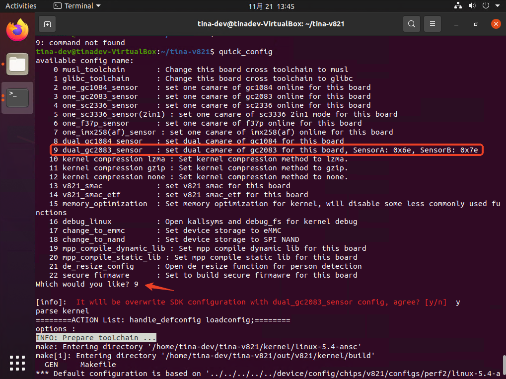

**切换储存介质为 SPI NAND**

切换储存器为NAND，输入 `quick_config`，可以看到用于切换的`quick_config` 是18，输入 18，之后会出现一个确认项，确认后将会自动执行其配置操作。

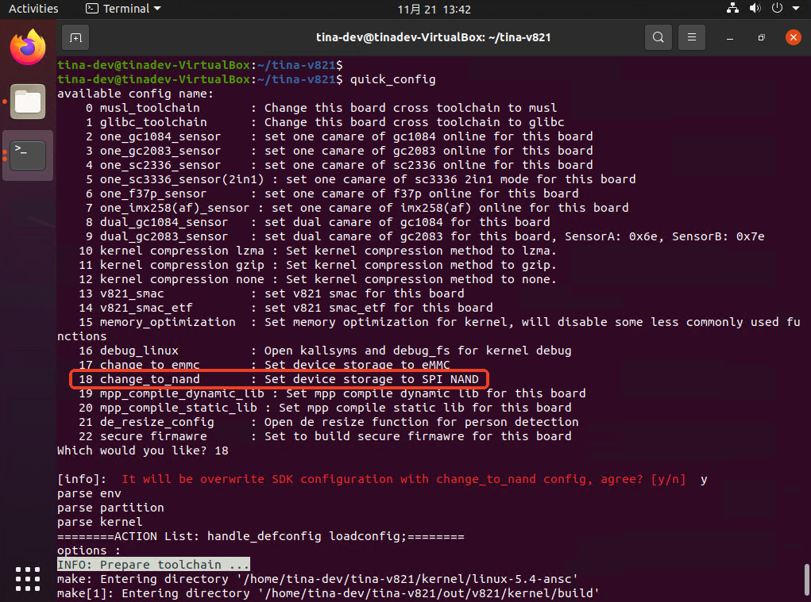

**切换 MPP 为动态库编译**

默认配置下，MPP 是静态库编译的，这里可以用 `quick_config` 切换到动态库编译。输入 `quick_config` 选择选项 19，然后确认

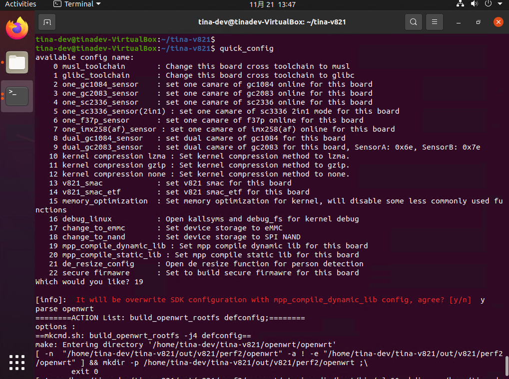

在切换后有提示，需要手动清除 mpp 的编译产物重新编译 mpp

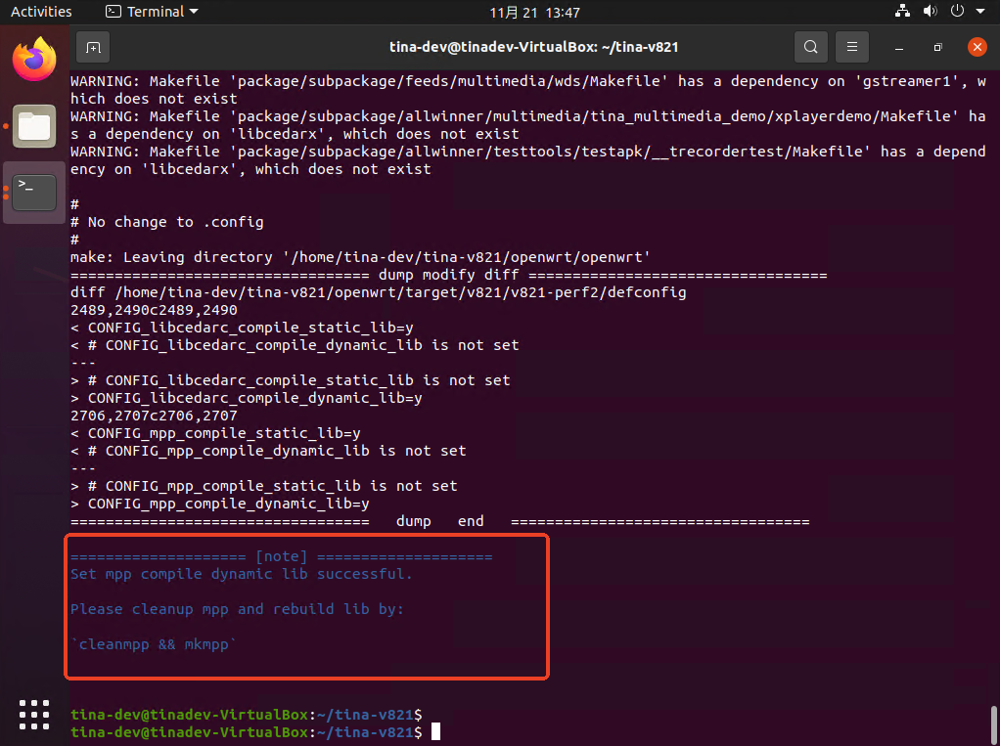

**切换工具链为glibc库**

SDK 默认配置使用的库是 MUSL 库，可以通过 `quick_config` 切换到使用 glibc 库。输入 `quick_config` 然后选择选项。

> 注意部分 quick\_config 在执行前需要有其他的操作，请按照提示进行操作，例如切换工具链，会有如下提示。如果没按照要求执行可能会导致SDK无法编译通过，quick\_config 也对部分文件做了检查，如果无视提示直接跳过，会直接报错。

例如这里，SDK 提示需要删除编译产物，需要手动执行 `make distclean` 然后再执行切换工具链的操作。

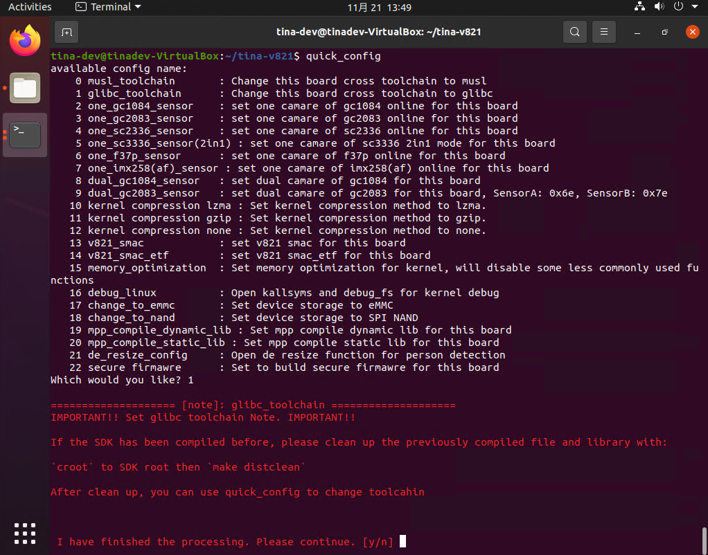

如果无视，没有执行清理编译产物的操作，则报错退出

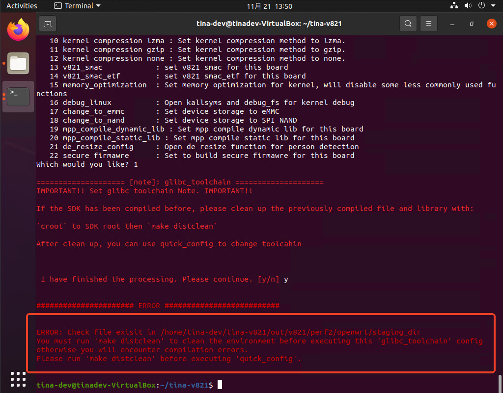

执行了 `make distclean` 后，正常操作

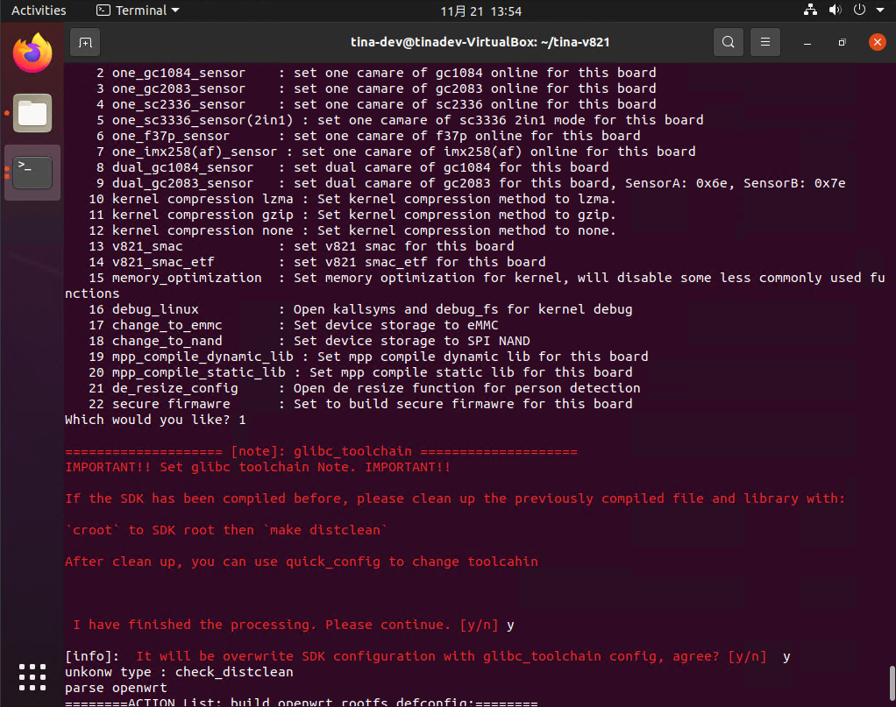

## Quick Config 使用说明

### 整体框架

```
quick_conf  test
|--- 找到 quick_config.json,并解析
    |--- 修改内核           ---> 引入fragment
        |--- ${TINA_TOPDIR}/build.sh loadconfig lock_defconfig.fragment
        |--- ${TINA_TOPDIR}/build.sh saveconfig 
    |--- 修改uboot的配置
        |--- 修改 board.dts         ---> 脚本处理
    |--- 修改 boot_package_nor.fex  ---> 脚本处理
    |--- 修改 sys_config.cfg        ---> 脚本处理
    |--- 修改 uboot-board.dts       ---> 脚本处理
    |--- 修改 env.dts       		  ---> 脚本处理
    |--- 修改 tina defconfig		  ---> 脚本处理
```

### 脚本框架

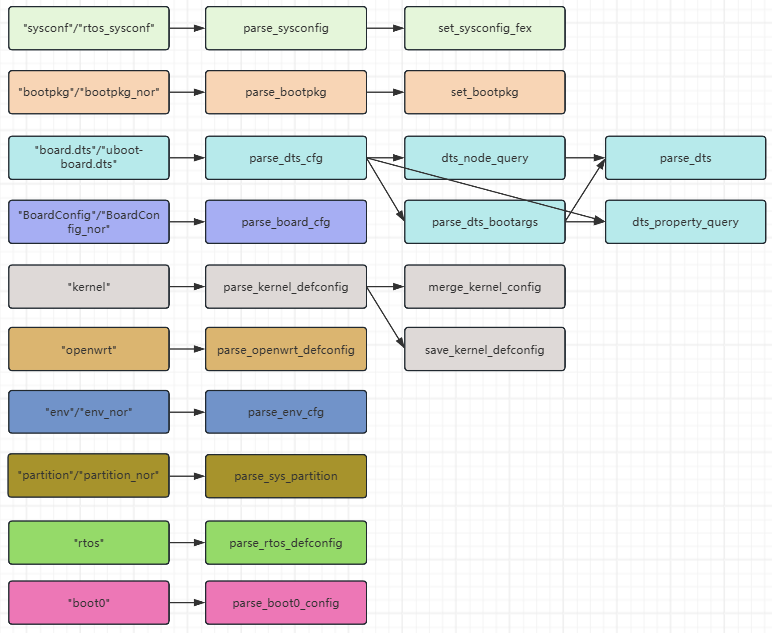

### 使用方法

```
usage: quick_config [-h] [-c [CONFIG]] [-f] [-i [INCLUDE]] [-gd] buildconfig

positional arguments:
  buildconfig           the buildconfig file

optional arguments:
  -h, --help            show this help message and exit
  -c [CONFIG], --config [CONFIG]
                        configuration items that need to be loaded (optional)
  -f, --force           force exec quick config item, no check, use at your own risk
  -i [INCLUDE], --include [INCLUDE]
                        include quick_config config file in default/quick_config
  -gd, --gen_dts_base   generate quick_config base with given dts node
```

### 注意事项

在 JSON 对象 中，元素是以键值对的形式表示的，每个键值对之间使用逗号分隔。最后一个键值对后不加逗号， JSON 规范规定不能在对象的结尾处使用多余的逗号。

在 JSON 数组 中，数组的元素之间用逗号分隔，最后一个元素后也不加逗号。

如果在最后一项后加逗号，可能导致解析错误，特别是在不同语言或工具中处理时。因此，为了确保 JSON 数据的有效性和跨平台的兼容性，最后一项后不加逗号是必须遵守的规范。

在VSCode中，错误使用逗号会显示警告 Trailing comma

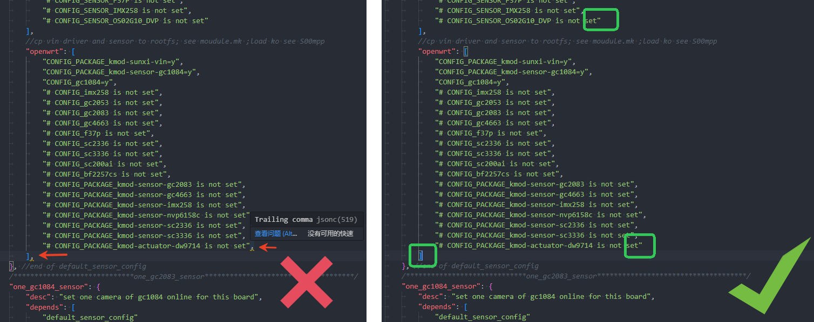

### 同名配置项覆盖逻辑

以 V821-PERF2 板级为例，其配置参数如下：

```json
{
    "use_common_config": true,
    "quick_config_include": [
        "perf2_sensor.json",
        "storage_change.json"
    ],
}
```

则覆盖逻辑如下所示：

```
device/config/chips/v821/configs/default/quick_config.json                         // common_conifg 平台共用配置文件
    ↑ 同 key 覆盖
    device/config/chips/v821/configs/default/quick_config/perf2_sensor.json        // perf2 板级 sensor 通用配置文件
        ↑ 同 key 覆盖
        device/config/chips/v821/configs/default/quick_config/storage_change.json // 介质切换配置文件
            ↑ 同 key 覆盖
            device/config/chips/v821/configs/perf2/quick_config.json             // v821-perf2 板级配置文件
```

:::tip

:::note

提示

:::
:::note

这里的覆盖是完整的整个配置的覆盖，例如在 `device/config/chips/v821/configs/default/quick_config.json` 中有如下配置

```json
"config_debug_baud_115200": {
	"desc": "Set debug serial baud to 115200",
	"boot0": {
		"common.mk": {
			"CFG_UART_BAUD_1500000": null
		}
	},
	"env": [
		{
			"name": "console",
			"val": "ttyS0,115200",
			"method": "add"
		}
	],
	"board.dts": {
		"bootargs": {
			"console": "ttyS0,115200"
		}
	}
}
```

在 `device/config/chips/v821/configs/default/quick_config/perf2_sensor.json` 中有如下配置：

```json
"config_debug_baud_115200": {
	"desc": "Set debug serial baud to 115200",
	"boot0": {
		"common.mk": {
			"CFG_UART_BAUD_1500000": "115200"
		}
	},
}
```

在 `device/config/chips/v821/configs/perf2/quick_config.json` 中有如下配置

```json
"config_debug_baud_115200": {
	"desc": "Set debug serial baud to 115200",
	"board.dts": {
		"bootargs": {
			"console": "ttyS3,115200"
		}
	}
}
```

那么最终执行的配置文件将会是 `device/config/chips/v821/configs/perf2/quick_config.json` 中的配置

```json
"config_debug_baud_115200": {
	"desc": "Set debug serial baud to 115200",
	"board.dts": {
		"bootargs": {
			"console": "ttyS3,115200"
		}
	}
}
```

之前的配置将被完整的覆盖，不会因为只配置了一部分差异点而差异化覆盖。

**不会**有如下执行逻辑：

1.  先去执行 `device/config/chips/v821/configs/default/quick_config.json`
2.  再去执行 `device/config/chips/v821/configs/perf2/quick_config.json`
3.  最后去执行 `device/config/chips/v821/configs/perf2/quick_config.json`

而是**直接**执行：

-   `device/config/chips/v821/configs/perf2/quick_config.json` 中的配置。

这样设计主要为了降低 quick\_config 框架的维护难度。

所以当使用覆盖逻辑的时候，请使用完整的配置实现，包括板级差异化的和板级非差异化的部分。

:::info

:::note

信息

:::
:::note

如果希望使用先执行 xxx 再执行 xxx 的方式，请创建两个不同名称的 quick\_config，使用 `depends` 方式引用，此时将会先执行 `depends` 中的配置，例如：

```json
{
    "config_debug_baud_115200": {
        "desc": "Set debug serial baud to 115200",
        "boot0": {
            "common.mk": {
                "CFG_UART_BAUD_1500000": null
            }
        },
        "env": [
            {
                "name": "console",
                "val": "ttyS0,115200",
                "method": "add"
            }
        ],
        "board.dts": {
            "bootargs": {
                "console": "ttyS0,115200"
            }
        }
    }
    "config_debug_baud_115200_for_myboard": {
        "desc": "Set debug serial baud to 115200",
    	"depends" : [
            "config_debug_baud_115200"
        ]
        "board.dts": {
            "bootargs": {
                "console": "ttyS3,115200"
            }
        }
    }
}
```

此时执行 `quick_config config_debug_baud_115200_for_myboard` 的时候，将会先去执行 `config_debug_baud_115200` 中的配置，再去执行 `config_debug_baud_115200_for_myboard` 中的配置。以达到差异化修改的目的。

:::

:::

:::

:::

### Quick Config 文件格式

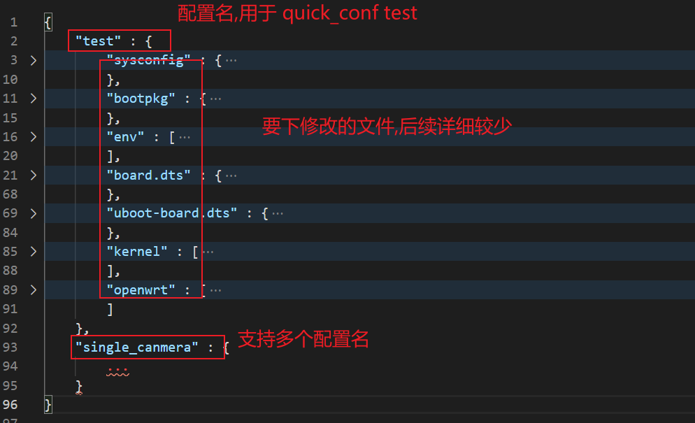

例子：

```json
{
    "use_common_config": true,
    "quick_config_include": [
        "fastboot_common.json",
        "fastboot_storage_change.json"
    ],
    "test" : {
        "sysconfig" : {
            "target" : {
                "storage_type" : 1
            },
            "product" : {
                "version" : "\"101\""
            }
        },
        "bootpkg" : {
            "logo" : "test.bmp.lzma",
            "logo-enable" : 1,
            "logo-addsuffix" : ".lz4"
        },
        "env" : [
            { "name" : "wifi_mac", "val": "1.2.3.4", "method" : "add" },
            { "name" : "setargs_mmc", "val": " test=true", "method" : "append" },
            { "name" : "bt_mac", "method" : "del" }
        ],
        "board.dts" : {
            "add_node" : [
                { "name": "node0" },
                { "path" : "/", "name": "node1", "add_tail" : 1 },
                { "path" : "node0/", "name": "test0" },
                { "path" : "node1", "name": "test0" },
                { "path" : "node0/test0", "name": "test1" },
                { "path" : "node0//test0", "name": "test2" },
                { "path" : "node0/test0", "name": "test3" },
                { "path" : "node0/test0", "name": "test4" },
                { "path" : "node1/test0", "name": "test1" },
                { "path" : "node1/test0", "name": "test_label: test2" },
                { "path" : "node1/test0", "name": "test3" }
            ],
            "del_node" : [
                { "path" : "node0/test0", "name": "test2" },
                { "path" : "node1/test0", "name": "test3" }
            ],
            "set_property" : {
                "node0" : {
                    "compatible" : "\"node0\",\"Tina\"",
                    "status" : "\"okay\""
                },
                "node1" : {
                    "compatible" : "\"node1\",\"Tina\"",
                    "status" : "\"okay\""
                },
                "node0/test0" : {
                    "reg" : "<xxxxxxx>"
                },
                "test1" : {
                    "status" : "\"okay\""
                },
                "test4" : {
                    "tast-bool" : null,
                    "will_del" : null,
                    "status" : "\"okay\""
                },
                "test_label" : {
                    "status" : "\"okay\""
                }
            },
            "del_property" : {
                "test4" : {
                    "will_del" : null
                }
            }
        },
        "uboot-board.dts" : {
            "add_node" : [
                { "name": "&sunxi_flashmap" },
                { "path" : "sunxi_flashmap", "name": "nor_map" }
            ],
            "set_property" : {
                "nor_map" : {
                    "logic_offset" : "<4352>",
                    "boot_param_start" : "<248>",
                    "boot_param_size" : "<8>",
                    "uboot_start" : "<256>",
                    "uboot_size" : "<4096>",
                    "status" : "\"okay\""
                }
            }
        },
        "kernel" : [
            "lock_defconfig.fragment", "ftrace_defconfig.fragment",
            "# CONFIG_AW_GPADC is not set", "CONFIG_LOG_BUF_SHIFT=15"
        ],
        "openwrt" : [
            "CONFIG_TARGET_PREINIT_IP=\"192.168.1.2\"", "# CONFIG_HAS_FPU is not set"
        ]
    }
}
```

#### 内置参数

##### use\_common\_config

使用平台共有 `quick_config` 配置，路径： `default/quick_config.json` 这份配置为最基础配置，会被每一级的相同 `Key` 的配置**完整覆盖**（不是差异化覆盖）

例子：

```json
{
    "use_common_config": true,  // 启用平台共有 quick_config 配置
}
```

```json
{
    "use_common_config": false,  // 禁用平台共有 quick_config 配置
}
```

:::note

:::note

备注

:::
:::note

在早期版本 QuickConfig 2.0.3 之前，这个配置被错误拼写为 `use_common_conifg`，工具做了兼容处理，优先解析 `use_common_config` 如果解析失败再去解析 `use_common_conifg`，后续请使用 `use_common_config`

:::

:::

##### quick\_config\_include

`quick_config` 引用配置，共用配置减少代码维护量。其会去平台路径下 `default/quick_config` 文件夹中寻找对应配置文件名

其内容层级比 `default/quick_config.json` 高，会覆盖 `default/quick_config.json` 中的相同 `key` 的配置

```json
{
    "quick_config_include": [
        "fastboot_common.json",         // 引用 fastboot_common.json
        "fastboot_storage_change.json"  // 引用 fastboot_storage_change.json
    ],
}
```

##### desc

用于用户不带参数调用 `quick_config` 时，简要说明配置项的功能。

```json
{
    "config1" : {
        "desc" : "config1"
        ....
    },
    "config2" : {
        "desc" : "config2"
        ....
    },
}
```

##### depends

用于加载其余所依赖的配置项，可以多层引用。

```json
{
    "env_init_for_all" : {
        ...
    }
    "all" : {
        "depends" : [
            "env_init_for_all", xxxx		# 加载all时会先加载env配置项
        ]
    }
}
```

:::warning

:::note

注意

:::
:::note

quick\_config 未限制循环引用，所以当出现如下引用逻辑时，quick\_config 将无限运行下去

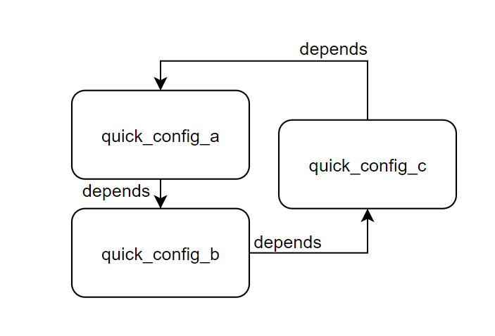

:::

:::

##### cmd

用于执行一些 `sh` 命令（可以使用根目录下的 `.buildconfig` 里的环境变量）

:::tip

:::note

提示

:::
:::note

注意破坏性命令执行！

:::

:::

```json
{
    "cmd" : [
        "mkdir -p ${LICHEE_PLAT_OUT}/ota_sdnand",
        ...
    ]
}
```

##### internal

内置命令，用于给其他配置 `depends` 依赖使用，直接调用的时候会提示 `[error]: This is internal use quick_config, please do not use it directly!`

![image-20250613113505149]()

```json
{
    "internal": true,
}
```

##### tag

内置命令，用于给配置分类

```json
{
    "tag": "system",
}
```

##### sync\_env

内置命令，用于帮助用户同步当前板级配置，方便完成后不需要再次执行 `source build/envsetup.sh && lunch` 所带来的麻烦。

:::tip

:::note

提示

:::
:::note

这个命令请在 quick\_config 的末尾执行

:::

:::

```json
{
    "sync_env": true,
}
```

#### sysconfig

作用于 BOOT0 配置文件：`sys_config.fex`

在 `sys_config.fex` 配置文件中，配置主要是通过键值对的方式来设置系统的相关参数。每个配置项通常由一个 `mainkey` 作为主键，以及一个或多个 `subkey` 子项和相应的值 `val`。

配置规则：

1.  **mainkey**：主键，用来定义某个大的配置项。
2.  **subkey**：子键，表示 `mainkey` 下的具体配置项。
3.  **val**：具体的值，对于字符串类型的值需要加上 `\"` 来表示。

**target** — 存储类型配置

-   **storage\_type**：指定存储类型。例如，`storage_type: 1` 可能代表某种特定的存储介质或格式。

**product** — 产品信息配置

-   **version**：表示产品的版本号，版本号通常是字符串类型，因此需要加上 `\"`。

示例配置解释：

```json
"sysconfig" : {
    "target" : {
        "storage_type" : 1  // 设置存储类型为1
    },
    "product" : {
        "version" : "\"101\""  // 设置产品版本为"101"
    }
},
```

-   `target.storage_type` 被设置为 `1`，这可能是指定存储介质的类型。
-   `product.version` 被设置为字符串 `"101"`，表示产品的版本信息。

#### rtos\_sysconfig

作用于 RTOS 配置文件：`sys_config.fex`

1.  **mainkey**：主键，用来定义某个大的配置项。
2.  **subkey**：子键，表示 `mainkey` 下的具体配置项。
3.  **val**：具体的值，对于字符串类型的值需要加上 `\"` 来表示。

```json
"rtos_sysconfig" : {
    /*
    * 规则:
    *   "mainkey" : {
    *       "subkey" : val   重新设置val,字符串需要添加\"str\"
    *    }
    */
}
```

示例：

```
"rtos_sysconfig": {
	"vind/sensor0": {
		"sensor0_mname": "\"gc1084_mipi\""
	},
	"vind/vinc0": {
		"vinc0_mipi_num": "1"
	},
	"vind/vinc4": {
		"vinc4_mipi_num": "1"
	}
},
```

#### partition

作用于非 NOR 存储介质分区表文件：`sys_partition.fex`，在 `sys_partition.fex` 文件中，分区配置用于定义非 NOR 存储介质的分区表。每个分区通常包含分区名、大小、属性等信息，可以通过配置文件来增加、修改或删除分区。

**配置规则**：

1.  **name**：分区的名称，必须唯一。
2.  **属性**：不同的分区可能有不同的属性（例如 `size`、`user_type`、`downloadfile` 等），具体属性视分区类型和系统需求而定。
3.  **del**：如果配置项包含 `del: true`，则表示删除该分区。

**示例配置解释**：

```json
"partition" : [
    { "name" : "inster_last", "size" : "1234" },  // 新增分区 "inster_last"，大小为 1234
    { "name" : "inster_last2", "size" : "1234" }, // 新增分区 "inster_last2"，大小为 1234
    { "name" : "mbr", "size" : "32768" }, // 新增分区 "mbr"，大小为 32768
    { "name" : "env-redund", "size" : "12345", "user_type" : "0x123" }, // 新增分区 "env-redund"，大小为 12345，用户类型为 0x123
    { "name" : "mbr" }, // 用于定位分区 "mbr" 在表中的位置
    { "name" : "inster_after_mbr", "size" : "45678", "user_type" : "0x456", "downloadfile" : "\"test\"" }, // 新增分区 "inster_after_mbr"，大小为 45678，用户类型为 0x456，指定下载文件为 "test"
    { "name" : "rootfs", "size" : "45678", "user_type" : "0x456", "test" : "12" }, // 新增分区 "rootfs"，大小为 45678，用户类型为 0x456，附加属性 "test" 为 12
    { "name" : "inster_last1", "del" : true } // 删除分区 "inster_last1"
]
```

**新增分区**

每个分区都有名称 `name` 和不同的属性，常见的属性包括：

-   `size`：分区的大小，单位通常为字节或其他存储单位。
-   `user_type`：用户自定义的类型标识，用于标识特定类型的分区。
-   `downloadfile`：如果分区用于存储某些文件，可以指定下载的文件名称。
-   `test`：其他可自定义的属性。

**修改分区属性**

-   `size`：分区的大小，单位通常为字节或其他存储单位。
-   `user_type`：用户自定义的类型标识，用于标识特定类型的分区。
-   `downloadfile`：如果分区用于存储某些文件，可以指定下载的文件名称。
-   `test`：其他可自定义的属性。

**删除分区**

-   使用 `"del": true` 标识要删除的分区。删除时，系统将不再使用该分区。

**分区定位**

-   `name` 为 `mbr` 的分区表示分区表中的位置标识符，通常用于定位其他分区的位置，确定其他分区在该分区表中的相对位置。

**增量添加分区**

-   配置项支持在已有分区后面添加新的分区，例如 `inster_after_mbr`，表示此分区将添加到 `mbr` 之后。

#### partition\_nor

作用于 NOR 存储介质分区表文件：`sys_partition_nor.fex`，在 `sys_partition_nor.fex` 文件中，分区配置用于定义 NOR 存储介质的分区表。每个分区通常包含分区名、大小、属性等信息，可以通过配置文件来增加、修改或删除分区。

**配置规则**：

1.  **name**：分区的名称，必须唯一。
2.  **属性**：不同的分区可能有不同的属性（例如 `size`、`user_type`、`downloadfile` 等），具体属性视分区类型和系统需求而定。
3.  **del**：如果配置项包含 `del: true`，则表示删除该分区。

**示例配置解释**：

```json
"partition" : [
    { "name" : "inster_last", "size" : "1234" },  // 新增分区 "inster_last"，大小为 1234
    { "name" : "inster_last2", "size" : "1234" }, // 新增分区 "inster_last2"，大小为 1234
    { "name" : "mbr", "size" : "32768" }, // 新增分区 "mbr"，大小为 32768
    { "name" : "env-redund", "size" : "12345", "user_type" : "0x123" }, // 新增分区 "env-redund"，大小为 12345，用户类型为 0x123
    { "name" : "mbr" }, // 用于定位分区 "mbr" 在表中的位置
    { "name" : "inster_after_mbr", "size" : "45678", "user_type" : "0x456", "downloadfile" : "\"test\"" }, // 新增分区 "inster_after_mbr"，大小为 45678，用户类型为 0x456，指定下载文件为 "test"
    { "name" : "rootfs", "size" : "45678", "user_type" : "0x456", "test" : "12" }, // 新增分区 "rootfs"，大小为 45678，用户类型为 0x456，附加属性 "test" 为 12
    { "name" : "inster_last1", "del" : true } // 删除分区 "inster_last1"
]
```

**新增分区**

每个分区都有名称 `name` 和不同的属性，常见的属性包括：

-   `size`：分区的大小，单位通常为字节或其他存储单位。
-   `user_type`：用户自定义的类型标识，用于标识特定类型的分区。
-   `downloadfile`：如果分区用于存储某些文件，可以指定下载的文件名称。
-   `test`：其他可自定义的属性。

**修改分区属性**

-   `size`：分区的大小，单位通常为字节或其他存储单位。
-   `user_type`：用户自定义的类型标识，用于标识特定类型的分区。
-   `downloadfile`：如果分区用于存储某些文件，可以指定下载的文件名称。
-   `test`：其他可自定义的属性。

**删除分区**

-   使用 `"del": true` 标识要删除的分区。删除时，系统将不再使用该分区。

**分区定位**

-   `name` 为 `mbr` 的分区表示分区表中的位置标识符，通常用于定位其他分区的位置，确定其他分区在该分区表中的相对位置。

**增量添加分区**

-   配置项支持在已有分区后面添加新的分区，例如 `inster_after_mbr`，表示此分区将添加到 `mbr` 之后。

#### bootpkg

作用于 `boot_package.cfg` 的 boot\_package 打包配置文件。

在 `boot_package.cfg` 中，`bootpkg` 配置文件用于管理和打包不同的启动项和资源（如 U-Boot、logo 等）。每个配置项的设置会控制是否包含某个项目，并且可以使用特定的后缀（如 `.ga` 或 `.lzma`）对项进行压缩。

**配置规则**：

1.  **`item_name-enable`**: 用来启用或禁用某个项。通常设置为 `0` 或 `1`，其中：
    
    -   `1` 表示启用该项。
    -   `0` 表示禁用该项，即相当于注释掉该项。
2.  **后缀**：如果配置的值是特定的后缀（如 `.gz` 或 `.lzma`），则会自动在该项后面添加压缩类型的后缀。
    
    -   `.gz` 会给项添加 `-gzip` 后缀。
    -   `.lzma` 会给项添加 `-lzma` 后缀。
    -   `.lz4` 会给项添加 `-lz4` 后缀。

**配置示例解释**：

示例 1：

```json
"bootpkg" : {
    "logo" : "test.bmp.lzma",  // 设置 logo 项，使用 LZMA 压缩
    "logo-enable" : 1,         // 启用 logo 项
},
```

-   **"logo"** 设置为 `"test.bmp.lzma"`，表示 logo 文件名为 `test.bmp`，并且使用 LZMA 压缩（后缀 `.lzma`）。
-   **"logo-enable"** 设置为 `1`，表示启用该项，即在打包时包含 logo。

示例 2：

```json
"bootpkg" : {
    "u-boot" : 1,  // 启用 U-Boot 项
    "logo" : 0,    // 禁用 logo 项
}
```

-   **"u-boot"** 设置为 `1`，表示启用 U-Boot 项。
-   **"logo"** 设置为 `0`，表示禁用 logo 项，即在打包时不包含 logo。

示例 3：

```json
"bootpkg" : {
    "kernel" : "kernel.img.gz",  // 设置 kernel 文件，使用 Gzip 压缩
    "kernel-enable" : 1,         // 启用 kernel 项
}
```

-   **"kernel"** 设置为 `"kernel.img.gz"`，表示内核文件使用 Gzip 压缩。
-   **"kernel-enable"** 设置为 `1`，表示启用该项。

#### bootpkg\_nor

作用于 `boot_package_nor.cfg` 的 boot\_package 打包配置文件。

在 `boot_package_nor.cfg` 中，`bootpkg` 配置文件用于管理和打包不同的启动项和资源（如 U-Boot、logo 等）。每个配置项的设置会控制是否包含某个项目，并且可以使用特定的后缀（如 `.ga` 或 `.lzma`）对项进行压缩。

**配置规则**：

1.  **`item_name-enable`**: 用来启用或禁用某个项。通常设置为 `0` 或 `1`，其中：
    
    -   `1` 表示启用该项。
    -   `0` 表示禁用该项，即相当于注释掉该项。
2.  **后缀**：如果配置的值是特定的后缀（如 `.gz` 或 `.lzma`），则会自动在该项后面添加压缩类型的后缀。
    
    -   `.gz` 会给项添加 `-gzip` 后缀。
    -   `.lzma` 会给项添加 `-lzma` 后缀。
    -   `.lz4` 会给项添加 `-lz4` 后缀。

**配置示例解释**：

示例 1：

```json
"bootpkg" : {
    "logo" : "test.bmp.lzma",  // 设置 logo 项，使用 LZMA 压缩
    "logo-enable" : 1,         // 启用 logo 项
},
```

-   **"logo"** 设置为 `"test.bmp.lzma"`，表示 logo 文件名为 `test.bmp`，并且使用 LZMA 压缩（后缀 `.lzma`）。
-   **"logo-enable"** 设置为 `1`，表示启用该项，即在打包时包含 logo。

示例 2：

```json
"bootpkg" : {
    "u-boot" : 1,  // 启用 U-Boot 项
    "logo" : 0,    // 禁用 logo 项
}
```

-   **"u-boot"** 设置为 `1`，表示启用 U-Boot 项。
-   **"logo"** 设置为 `0`，表示禁用 logo 项，即在打包时不包含 logo。

示例 3：

```json
"bootpkg" : {
    "kernel" : "kernel.img.gz",  // 设置 kernel 文件，使用 Gzip 压缩
    "kernel-enable" : 1,         // 启用 kernel 项
}
```

-   **"kernel"** 设置为 `"kernel.img.gz"`，表示内核文件使用 Gzip 压缩。
-   **"kernel-enable"** 设置为 `1`，表示启用该项。

#### env

作用于 `env.cfg` ，env 配置文件

```json
"env" : [
    /*
    * 规则:
    *   { "name" : "wifi_mac", "val": "1.2.3.4", "method" : "add" },
    *   { "name" : "setargs_mmc", "val": " test=true", "method" : "append" },
    *   { "name" : "bt_mac", "method" : "del" }
    *	PS: method目前只支持 add,append,del
    */
    { "name" : "wifi_mac", "val": "1.2.3.4", "method" : "add" },
    { "name" : "setargs_mmc", "val": " test=true", "method" : "append" },
]
```

示例：

```json
"env" : [
    { "name" : "wifi_mac", "val": "1.2.3.4", "method" : "add" },
    { "name" : "setargs_mmc", "val": " test=true", "method" : "append" },
    { "name" : "bt_mac", "method" : "del" }
],
```

#### board.dts

作用于 `board.dts` 内核设备树配置文件，其配置方式如下所示

**add\_node** — 添加节点

此部分用于向设备树中添加新节点。每个节点都可以定义路径、节点名，以及是否需要添加到指定路径的尾部。

-   **name**：新节点的名称
-   **path**：节点的父路径，支持可选。如果没有指定路径，则会添加到根节点。
-   **add\_tail**：是否在指定路径的尾部插入新节点，布尔值（`true` 为在尾部插入，`false` 为默认插入）。

示例：

```json
"add_node": [
    { "name": "node0" },
    { "path": "/", "name": "node1", "add_tail": true },
    { "path": "spi0", "name": "node1", "add_tail": true }
]
```

-   执行：

```json
"add_node": [
    { "name": "node0" }
]
```

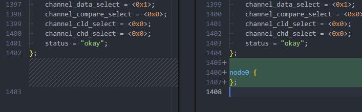

-   执行：

```json
"add_node": [
    { "path": "/", "name": "node1", "add_tail": true }
]
```

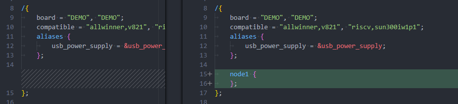

-   执行：

```json
"add_node": [
    { "path": "spi0", "name": "node1", "add_tail": true }
]
```

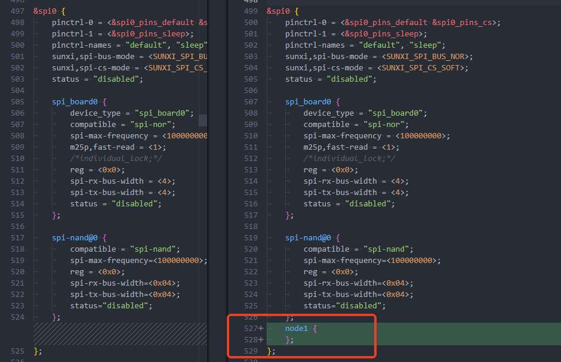

:::tip

:::note

提示

:::
:::note

`add_node` 只能增加节点，如果需要增加属性请配合 `set_property` 方式使用，例如：

```json
{
    "add_node": [
        { "name": "node0" }
    ],
    "set_property": {
        "node0": {
            "compatible": "\"node0\",\"Tina\"",
            "status": "\"okay\""
        }
    }
}
```

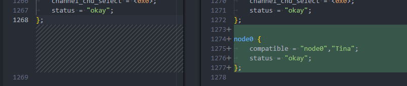

:::

:::

**del\_node** — 删除节点

此部分用于从设备树中删除指定的节点。需要指定要删除节点的路径和名称。

-   **path**：要删除节点的父路径，可选。
-   **name**：要删除的节点名。

示例：

```json
"del_node": [
    { "name": "node0" },
    { "path": "/", "name": "node1" },
    { "path": "spi0", "name": "node1" }
]
```

-   执行：

```json
"del_node": [
    { "name": "node0" }
]
```

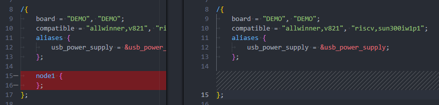

-   执行：

```json
"del_node": [
    { "path": "/", "name": "node1" }
]
```

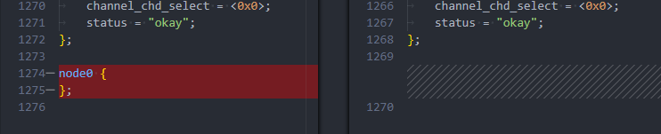

-   执行：

```json
"del_node": [
    { "path": "spi0", "name": "node1" }
]
```

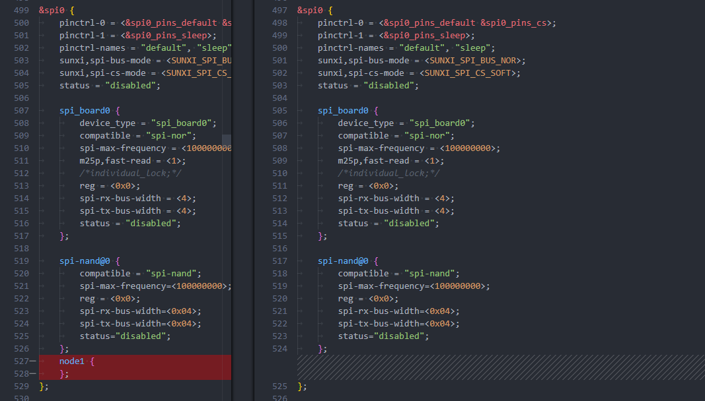

:::info

:::note

信息

:::
:::note

可以用于直接删除整个节点和属性

```json
"del_node": [
    {
        "path": "spi0",
        "name": "spi-nand@0"
    }
]
```

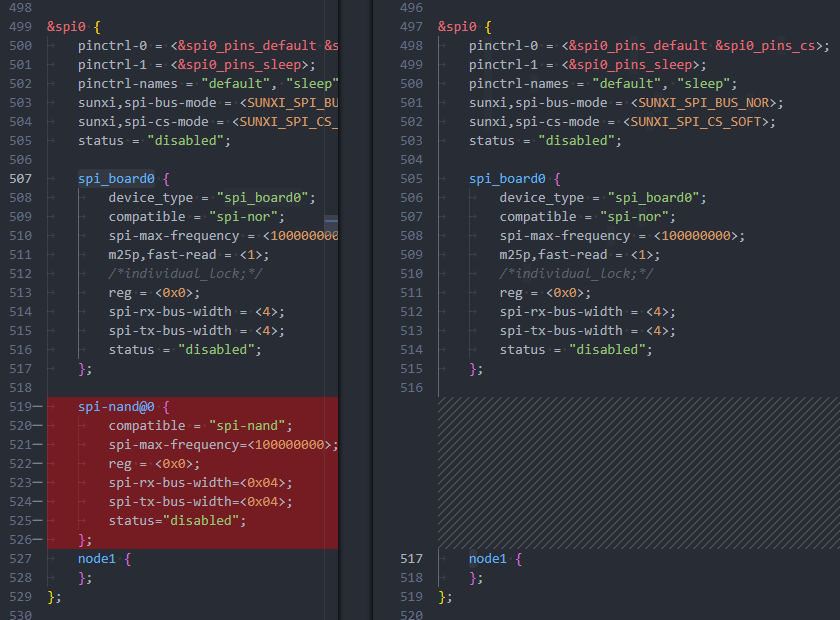

:::

:::

**set\_property** — 设置节点属性

此部分用于设置节点的属性。每个节点可以有多个属性，设置时需要指定节点名称和要添加的属性。如果不存在属性则会在末尾添加属性。

-   **节点名**：需要设置属性的节点名。
-   **属性名称**：要设置的属性。
-   **属性值**：对应的属性值。

示例：

```json
"set_property": {
    "node0": {
        "compatible": "\"node0\",\"Tina\"",
        "data": "<0x1>",
        "reg": "<0x2000000 0x2000000>",
        "pinctrl-1": "<&pins_work>",
        "pinctrl-0": "<>",
        "status": "\"okay\""
    },
    "node1": {
        "compatible": "\"node1\",\"Tina\"",
        "status": "\"okay\""
    }
}
```

设备树变化如下

-   `node0` 变化如下

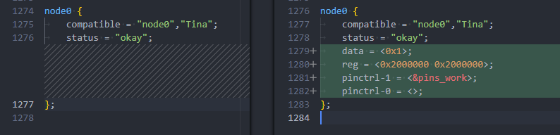

-   `node1` 变化如下

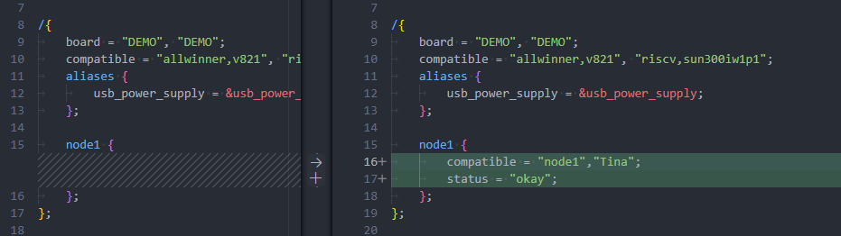

:::tip

:::note

提示

:::
:::note

这里是直接字符串替换内容，请注意保留设备树相关符号，否则设备树会替换出非法内容

```json
"set_property": {
    "node0": {
        "data": "0x1",                    # 不加 < >
        "pinctrl-1": "<pins_work>",       # 没有引用
        "status": "okay                   # 没有转义 ""
    },
}
```

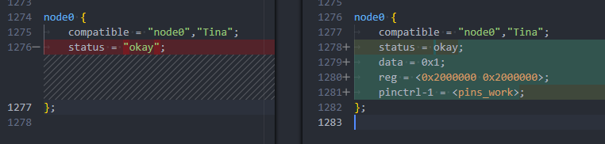

:::

:::

**set\_property\_with\_address** — 设置节点属性并根据 `reg` 配置节点地址

此部分用于设置节点的属性。每个节点可以有多个属性，设置时需要指定节点名称和要添加的属性。如果不存在属性则会在末尾添加属性。一般用于配置预留内存范围。

-   **节点名**：需要设置属性的节点名。
-   **属性名称**：要设置的属性。
-   **属性值**：对应的属性值。

示例：

```json
"set_property_with_address": {
	"reserved_ram": {
		"reg": "<0x0 0x41000000 0x0 0x400000>"
	}
}
```

设备树变化如下

-   `reserved_ram` 变化如下

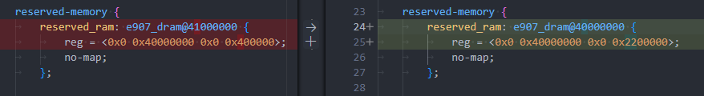

**del\_property** — 删除节点属性

此部分用于删除节点的属性。删除时指定节点名和要删除的属性名称。

-   **节点名**：要删除属性的节点名。
-   **属性名称**：要删除的属性名称。

示例：

```json
"del_property": {
    "node0": {
        "compatible": null,
        "reg": null
    },
}
```

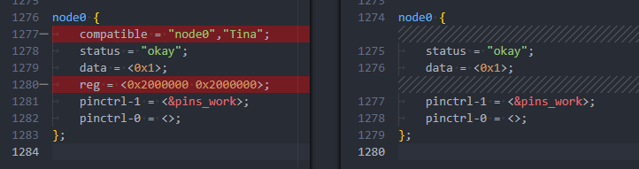

**bootargs** — 修改启动参数

此部分用于修改启动时传递的内核参数。可以新增、修改或删除参数。如果设备树不存在 `bootargs` 节点则会跳过。

-   **key**：参数的名称（如 `loglevel`、`rootwait`）。
-   **value**：参数的值。如果值为 `null`，则表示删除该参数。

示例：

```json
"bootargs": {
    "loglevel": 8,  // 修改 loglevel 参数
    "rootwait": null // 删除 rootwait 参数
}
```

**add\_prefix** — 添加属性前缀

此部分用于给某些节点的属性添加前缀。可以对已有的节点属性进行修改，通常用于`/delete-property/` 和 `/delete-node/`。

-   **节点名**：需要修改的节点。
-   **属性名称**：需要添加前缀的属性。
-   **值**：指定添加的前缀。

示例：

```json
"add_prefix": {
    "gmac0_phy0": {
        "reset-gpios": "/delete-property/"  // 为属性添加前缀
    }
}
```

**del\_prefix** — 删除属性前缀

此部分用于删除已添加的属性前缀。指定节点和属性后，可以删除前缀。

-   **节点名**：需要修改的节点。
-   **属性名称**：需要删除前缀的属性。
-   **值**：指定删除的前缀。

示例：

```json
"del_prefix": {
    "gmac0_phy0": {
        "reset-gpios": "/delete-property/"  // 删除属性的前缀
    }
}
```

**完整配置示例**：

```json
{
    "board.dts": {
        "add_node": [
            { "name": "node0" },
            { "path": "/", "name": "node1", "add_tail": 1 },
            { "path": "node0/", "name": "test0" },
            { "path": "node1", "name": "test0" },
            { "path": "node0/test0", "name": "test1" }
        ],
        "del_node": [
            { "path": "node0/test0", "name": "test2" },
            { "path": "node1/test0", "name": "test3" }
        ],
        "set_property": {
            "node0": {
                "compatible": "\"node0\",\"Tina\"",
                "status": "\"okay\""
            },
            "node1": {
                "compatible": "\"node1\",\"Tina\"",
                "status": "\"okay\""
            },
            "node0/test0": {
                "reg": "<xxxxxxx>"
            },
            "test1": {
                "status": "\"okay\""
            }
        },
        "del_property": {
            "test4": {
                "will_del": null
            }
        },
        "bootargs": {
            "loglevel": 8,
            "rootwait": null
        },
        "add_prefix": {
            "gmac0_phy0": {
                "reset-gpios": "/delete-property/"
            }
        },
        "del_prefix": {
            "gmac0_phy0": {
                "reset-gpios": "/delete-property/"
            }
        }
    }
}
```

#### uboot-board.dts

作用于 `uboot-board.dts` U-Boot 设备树配置文件

**add\_node** — 添加节点

此部分用于向设备树中添加新节点。每个节点都可以定义路径、节点名，以及是否需要添加到指定路径的尾部。

-   **name**：新节点的名称
-   **path**：节点的父路径，支持可选。如果没有指定路径，则会添加到根节点。
-   **add\_tail**：是否在指定路径的尾部插入新节点，布尔值（`true` 为在尾部插入，`false` 为默认插入）。

示例：

```json
"add_node": [
    { "name": "node0" },
    { "path": "/", "name": "node1", "add_tail": true },
    { "path": "spi0", "name": "node1", "add_tail": true }
]
```

-   执行：

```json
"add_node": [
    { "name": "node0" }
]
```


-   执行：

```json
"add_node": [
    { "path": "/", "name": "node1", "add_tail": true }
]
```


-   执行：

```json
"add_node": [
    { "path": "spi0", "name": "node1", "add_tail": true }
]
```


:::tip

:::note

提示

:::
:::note

`add_node` 只能增加节点，如果需要增加属性请配合 `set_property` 方式使用，例如：

```json
{
    "add_node": [
        { "name": "node0" }
    ],
    "set_property": {
        "node0": {
            "compatible": "\"node0\",\"Tina\"",
            "status": "\"okay\""
        }
    }
}
```


:::

:::

**del\_node** — 删除节点

此部分用于从设备树中删除指定的节点。需要指定要删除节点的路径和名称。

-   **path**：要删除节点的父路径，可选。
-   **name**：要删除的节点名。

示例：

```json
"del_node": [
    { "name": "node0" },
    { "path": "/", "name": "node1" },
    { "path": "spi0", "name": "node1" }
]
```

-   执行：

```json
"del_node": [
    { "name": "node0" }
]
```


-   执行：

```json
"del_node": [
    { "path": "/", "name": "node1" }
]
```


-   执行：

```json
"del_node": [
    { "path": "spi0", "name": "node1" }
]
```


:::info

:::note

信息

:::
:::note

可以用于直接删除整个节点和属性

```json
"del_node": [
    {
        "path": "spi0",
        "name": "spi-nand@0"
    }
]
```


:::

:::

**set\_property** — 设置节点属性

此部分用于设置节点的属性。每个节点可以有多个属性，设置时需要指定节点名称和要添加的属性。如果不存在属性则会在末尾添加属性。

-   **节点名**：需要设置属性的节点名。
-   **属性名称**：要设置的属性。
-   **属性值**：对应的属性值。

示例：

```json
"set_property": {
    "node0": {
        "compatible": "\"node0\",\"Tina\"",
        "data": "<0x1>",
        "reg": "<0x2000000 0x2000000>",
        "pinctrl-1": "<&pins_work>",
        "pinctrl-0": "<>",
        "status": "\"okay\""
    },
    "node1": {
        "compatible": "\"node1\",\"Tina\"",
        "status": "\"okay\""
    }
}
```

设备树变化如下

-   `node0` 变化如下


-   `node1` 变化如下


:::tip

:::note

提示

:::
:::note

这里是直接字符串替换内容，请注意保留设备树相关符号，否则设备树会替换出非法内容

```json
"set_property": {
    "node0": {
        "data": "0x1",                    # 不加 < >
        "pinctrl-1": "<pins_work>",       # 没有引用
        "status": "okay                   # 没有转义 ""
    },
}
```


:::

:::

**del\_property** — 删除节点属性

此部分用于删除节点的属性。删除时指定节点名和要删除的属性名称。

-   **节点名**：要删除属性的节点名。
-   **属性名称**：要删除的属性名称。

示例：

```json
"del_property": {
    "node0": {
        "compatible": null,
        "reg": null
    },
}
```


**bootargs** — 修改启动参数

此部分用于修改启动时传递的内核参数。可以新增、修改或删除参数。如果设备树不存在 `bootargs` 节点则会跳过。

-   **key**：参数的名称（如 `loglevel`、`rootwait`）。
-   **value**：参数的值。如果值为 `null`，则表示删除该参数。

示例：

```json
"bootargs": {
    "loglevel": 8,  // 修改 loglevel 参数
    "rootwait": null // 删除 rootwait 参数
}
```

**add\_prefix** — 添加属性前缀

此部分用于给某些节点的属性添加前缀。可以对已有的节点属性进行修改，通常用于`/delete-property/` 和 `/delete-node/`。

-   **节点名**：需要修改的节点。
-   **属性名称**：需要添加前缀的属性。
-   **值**：指定添加的前缀。

示例：

```json
"add_prefix": {
    "gmac0_phy0": {
        "reset-gpios": "/delete-property/"  // 为属性添加前缀
    }
}
```

**del\_prefix** — 删除属性前缀

此部分用于删除已添加的属性前缀。指定节点和属性后，可以删除前缀。

-   **节点名**：需要修改的节点。
-   **属性名称**：需要删除前缀的属性。
-   **值**：指定删除的前缀。

示例：

```json
"del_prefix": {
    "gmac0_phy0": {
        "reset-gpios": "/delete-property/"  // 删除属性的前缀
    }
}
```

**完整配置示例**：

```json
"uboot-board.dts" : {
    "add_node" : [
        { "name": "&sunxi_flashmap" },
        { "path" : "sunxi_flashmap", "name": "nor_map" }
    ],
    "set_property" : {
        "nor_map" : {
            "logic_offset" : "<4352>",
            "boot_param_start" : "<248>",
            "boot_param_size" : "<8>",
            "uboot_start" : "<256>",
            "uboot_size" : "<4096>",
            "status" : "\"okay\""
        }
    }
},
```

#### BoardConfig

作用于 `BoardConfig.mk` 配置 SDK 开发环境变量

```json
"BoardConfig" : {
    "LICHEE_FLASH" : "default",			# 修改值
    "LICHEE_RTOS_PROJECT_NAME" : null,	# 删除item
    "LICHEE_XXXXXX" : "add",			# 新增item
},
```

#### BoardConfig\_nor

作用于 `BoardConfig_nor.mk` 配置 SDK NOR 方案开发环境变量

```json
"BoardConfig_nor" : {
    "LICHEE_FLASH" : "default",			# 修改值
    "LICHEE_RTOS_PROJECT_NAME" : null,	# 删除item
    "LICHEE_XXXXXX" : "add",			# 新增item
},
```

#### BoardConfigItem

作用于 `BoardConfig.mk` 配置 SDK 开发环境变量的单独配置项，子项目的值

```json
"BoardConfigItem": {
	"LICHEE_SPL_BOARD_MK": {
		"mmc-cfg_board_custom": true,   # 新增值
		"spinor-cfg_board_custom": null # 删除值
	}
},
```

#### BoardConfigItem\_nor

作用于 `BoardConfig_nor.mk` 配置 SDK NOR 方案开发环境变量的单独配置项，子项目的值

```json
"BoardConfigItem_nor": {
	"LICHEE_SPL_BOARD_MK": {
		"mmc-cfg_board_custom": true,   # 新增值
		"spinor-cfg_board_custom": null # 删除值
	}
},
```

#### kernel

作用于内核配置文件 `bsp_defconfig`，用于开关内核编译选项

```json
"kernel" : [
    "lock_defconfig.fragment",      <- 使用这段 fragment
    "ftrace_defconfig.fragment",    <- 使用第二段 fragment
    "# CONFIG_AW_GPADC is not set", <- 取消配置
    "CONFIG_LOG_BUF_SHIFT=15",      <- 修改配置数目
    "CONFIG_TOOLCHAIN_WARNING=\"-Wall -Werror\"",  <- 修改配置字符串
    "CONFIG_ARCH_RISCV=y"           <- 启用配置
],
```

#### kernel\_recovery

作用于内核配置文件 `bsp_recovery_defconfig`，用于开关 `recovery` 内核配置的编译选项

```json
"kernel_recovery" : [
    "lock_defconfig.fragment",      <- 使用这段 fragment
    "ftrace_defconfig.fragment",    <- 使用第二段 fragment
    "# CONFIG_AW_GPADC is not set", <- 取消配置
    "CONFIG_LOG_BUF_SHIFT=15",      <- 修改配置数目
    "CONFIG_TOOLCHAIN_WARNING=\"-Wall -Werror\"",  <- 修改配置字符串
    "CONFIG_ARCH_RISCV=y"           <- 启用配置
],
```

#### rtos

作用于 RTOS 配置文件 `defconfig`，用于开关 RTOS 编译选项

```json
"rtos" : [
    "lock_defconfig.fragment",      <- 使用这段 fragment
    "ftrace_defconfig.fragment",    <- 使用第二段 fragment
    "# CONFIG_AW_GPADC is not set", <- 取消配置
    "CONFIG_LOG_BUF_SHIFT=15",      <- 修改配置数目
    "CONFIG_TOOLCHAIN_WARNING=\"-Wall -Werror\"",  <- 修改配置字符串
    "CONFIG_ARCH_RISCV=y"           <- 启用配置
],
```

#### uboot

作用于 U-Boot 配置文件 `defconfig`，用于开关 U-Boot 编译选项，配置的 U-Boot defconfig 是 `BoardConfig.mk` 或 `BoardConfig_nor.mk` 中指定的 `LICHEE_BRANDY_DEFCONF`

```json
"uboot" : [
    "lock_defconfig.fragment",      <- 使用这段 fragment
    "ftrace_defconfig.fragment",    <- 使用第二段 fragment
    "# CONFIG_AW_GPADC is not set", <- 取消配置
    "CONFIG_LOG_BUF_SHIFT=15",      <- 修改配置数目
    "CONFIG_TOOLCHAIN_WARNING=\"-Wall -Werror\"",  <- 修改配置字符串
    "CONFIG_ARCH_RISCV=y"           <- 启用配置
],
```

#### uboot\_nor

作用于 U-Boot NOR 方案的配置文件 `defconfig`，用于开关 U-Boot 编译选项，配置的 U-Boot defconfig 是 `BoardConfig.mk` 或 `BoardConfig_nor.mk` 中指定的 `LICHEE_BRANDY_DEFCONF` 字符串将 `_defconfig` 后缀换成 `_nor_defconfig` 之后得到的

```json
"uboot_nor" : [
    "lock_defconfig.fragment",      <- 使用这段 fragment
    "ftrace_defconfig.fragment",    <- 使用第二段 fragment
    "# CONFIG_AW_GPADC is not set", <- 取消配置
    "CONFIG_LOG_BUF_SHIFT=15",      <- 修改配置数目
    "CONFIG_TOOLCHAIN_WARNING=\"-Wall -Werror\"",  <- 修改配置字符串
    "CONFIG_ARCH_RISCV=y"           <- 启用配置
],
```

#### uboot\_efex

作用于 U-Boot EFEX 烧录用 U-Boot 的配置文件 `defconfig`，用于开关 U-Boot EFEX 编译选项，配置的 U-Boot defconfig 是 `BoardConfig.mk` 或 `BoardConfig_nor.mk` 中指定的 `LICHEE_EFEX_BIN_NAME` 对应的 defconfig

```json
"uboot_efex" : [
    "lock_defconfig.fragment",      <- 使用这段 fragment
    "ftrace_defconfig.fragment",    <- 使用第二段 fragment
    "# CONFIG_AW_GPADC is not set", <- 取消配置
    "CONFIG_LOG_BUF_SHIFT=15",      <- 修改配置数目
    "CONFIG_TOOLCHAIN_WARNING=\"-Wall -Werror\"",  <- 修改配置字符串
    "CONFIG_ARCH_RISCV=y"           <- 启用配置
],
```

#### openwrt

作用于 OpwnWRT 文件系统配置文件 `defconfig`，用于开关 OpwnWRT 软件包编译选项

```json
"openwrt" : [
    "lock_defconfig.fragment",            <- 使用这段 fragment
    "ftrace_defconfig.fragment",          <- 使用第二段 fragment
    "# CONFIG_PACKAGE_bridge is not set", <- 取消配置
    "CONFIG_LOG_BUF_SHIFT=15",            <- 修改配置数目
    "CONFIG_BUSYBOX_DEFAULT_PID_FILE_PATH=\"/var/run\"",  <- 修改配置字符串
    "CONFIG_PACKAGE_kmod-sunxi-ve=y"      <- 启用配置
]
```

#### boot0

作用于 Boot0 编译 `.mk` 文件，需要指定修改的 `mk` 文件名

```json
"boot0": {
    "common.mk": {                             // boot0需要修改的mk文件名
        "CFG_SUNXI_VF_2_1": true,              // 新增=y的配置,如果是注释则取消注释然后配置=y，如果没有配置则新增配置=y
        "CFG_X509_CERT_DISABLE": false,        // 新增=n的配置,如果是注释则取消注释然后配置=n，如果没有配置则新增配置=n
        "CFG_FLASHFLAG_RTC_INDEX": "0x11110",  // 修改数值,    如果是注释则取消注释并修改数值，如果不是注释则直接修改数值，如果没有配置则新增配置
        "CFG_X509_CERT_DISABLE": null,         // 修改为注释,  如果是注释则不做修改，如果有配置则修改为注释
    }
}
```

#### sync\_nand\_map

用于 NAND 快起方案切换时动态生成分区表，仅需要配置固定的只读分区，按顺序排列，其余分区将在 `uboot-board.dts` 中配置的 `nand_map` 中配置，`quick_config` 会读取 `nand_map` 生成其余 `rw` 分区，仅在该条 quick\_config 中配置 `"configs": { "LICHEE_FLASH": "nand" }` 时生效

```json
"sync_nand_map": {
	"ro_parts": [
		{
			"name": "boot0",
			"size": "1024k"
		},
		{
			"name": "uboot",
			"size": "3072k"
		},
		{
			"name": "secure_storage",
			"size": "1024k"
		}
	]
}
```

`uboot-board.dts` 中的 `nand_map`

```c
&sunxi_flashmap {
	nand_map {
		/* By default, the first three physical partitions are fixed as follows
		 * Boot0 0~7 block
		 * Uboot 8~31 block
		 * Secure Storage 32~39 block
		 */
		partition0 {
			part_name = "boot";
			phy_block_num = <80>;
		};
		partition1 {
			part_name = "boot_backup";
			phy_block_num = <80>;
		};
		partition2 {
			part_name = "boot_param";
			phy_block_num = <2>;
		};
		partition3 {
			part_name = "riscv0";
			phy_block_num = <32>;
		};
		partition4 {
			part_name = "riscv0_bak";
			phy_block_num = <32>;
		};
		partition5 {
			part_name = "isp_param";
			phy_block_num = <2>;
		};
		partition6 {
			part_name = "isp_param_bak";
			phy_block_num = <2>;
		};
	};
};
```

#### amp\_reserved\_memory

用于调整 AMP 使用的内存布局，和需要配置设备树的节点名称，包括三个部分：

-   memory\_regions：需要修改的内存区域，支持给定多个区域
-   kernel\_config\_link：由于修改了预留内存地址，需要同步修改的内核配置项
-   rtos\_config\_link：由于修改了预留内存地址，需要同步修改的 RTOS 配置项

**memory\_regions**

`memory_regions` 有四个参数，分别代表下列含义：

-   name：需要修改的内存节点
-   addr：内存的起始地址，需要给定 HEX 字符串，如果不需要修改则可以不写
-   size：内存的大小，需要给定 HEX 字符串，如果不需要修改则可以不写
-   type：内存的类型，分为两种类型
    -   independent：独立一块区域的内存，不跟随任何内存，共享内存的第一块内存也可以看作是独立内存
    -   follow\_prev：跟随在上一块内存之后的内存，不需要给定 `addr`，quickconfig 框架会自动计算其起始地址

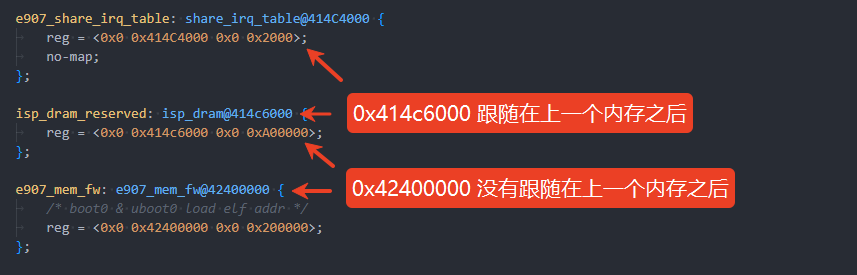

示例：RTOS 基地址调整到 `0x44000000`，大小调整为 `0x500000` 其他地址**跟随修改**

```json
"amp_reserved_memory": {
	"memory_regions": [
		{
			"name": "e907_dram_reserved",
			"addr": "0x44000000",
			"size": "0x500000",
			"type": "independent"
		}
	]
}
```

修改效果如下图所示，可以看到原先连续的内存也跟随修改了，但是原先的独立内存 `e907_mem_fw` 没有跟随着一起修改

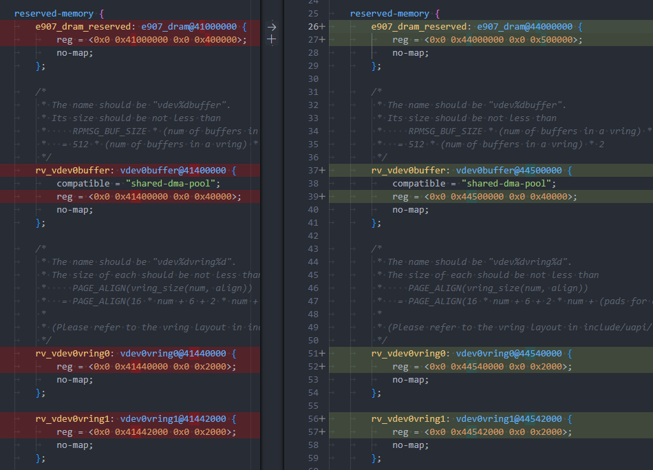

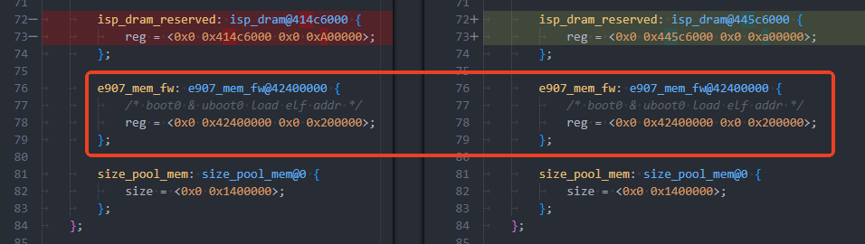

示例：RTOS 基地址调整到 `0x44000000`，大小调整为 `0x500000` 其他地址**维持原样，不跟随修改**

```json
"amp_reserved_memory": {
	"memory_regions": [
		{
			"name": "e907_dram_reserved",
			"addr": "0x44000000",
			"size": "0x500000",
			"type": "independent"
		},
		{
			"name": "rv_vdev0buffer",
			"type": "independent"
		}
	]
}
```

修改效果如下图所示，可以看到只有 `e907_dram_reserved` 的地址有修改，其他原先跟随在后面的内存因为 `rv_vdev0buffer` 成为了新的 `independent`，所以并没有一并修改。

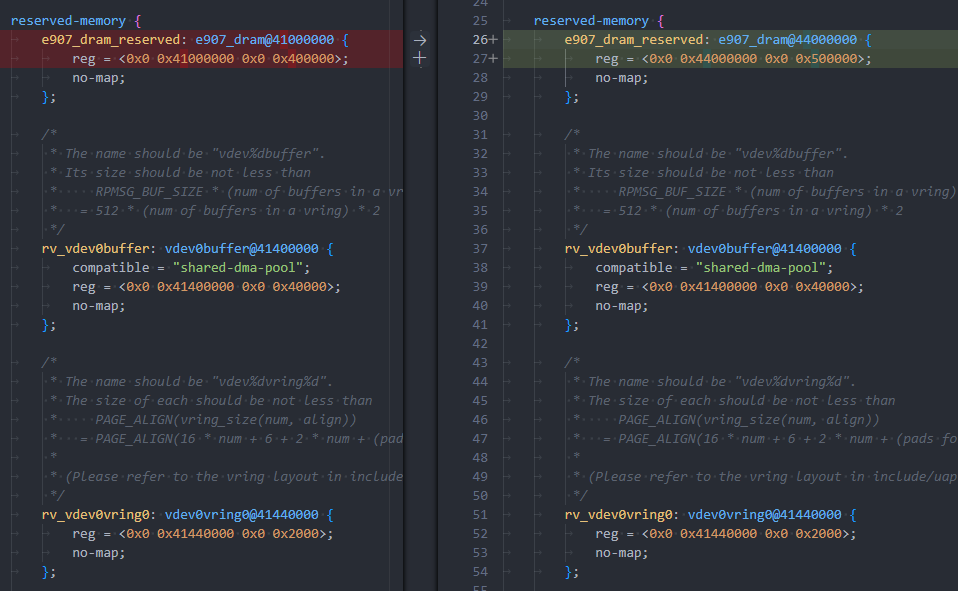

示例：RTOS 通讯 `e907_rpbuf_reserved` 的大小调整为 `0x100000` ，其他地址有冲突的自动修改，没冲突则不修改

```json
"amp_reserved_memory": {
	"memory_regions": [
		{
			"name": "e907_rpbuf_reserved",
			"size": "0x100000",
			"type": "follow_prev"
		}
	]
}
```

修改效果如下图所示，可以看到只有 `e907_rpbuf_reserved` 的大小有修改，并且后面有冲突的地址也自动往后挪了，没受影响的地址则不动

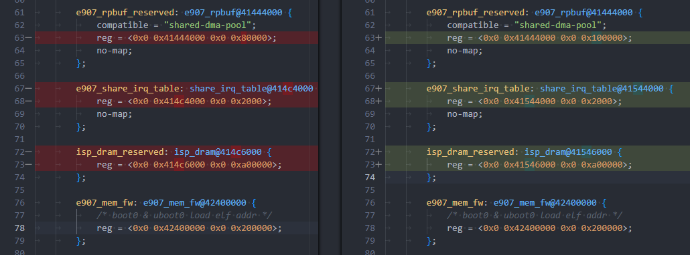

**kernel\_config\_link 和 rtos\_config\_link**

kernel\_config\_link 和 rtos\_config\_link 是用于同步修改的内核配置项的功能，有一些参数是需要内核或者 RTOS 配置的，这些参数则通过 `xxx_config_link` 方式同步配置。其参数含义如下：

-   name：当出现修改，需要同步的内存的名字
-   link：在 defconfig 中的配置项的字符串
-   type：同步方式
    -   address\_start：将此块内存的起始地址同步到给定的配置项
    -   size\_hex：将此块内存的大小同步到给定的配置项
    -   start\_address\_offset：将此块内存的起始地址加上给定的 offset 大小后同步到给定的配置项
    -   end\_address\_offset：将此块内存的结束地址减去给定的 offset 大小后同步到给定的配置项
-   offset：配置内存自动计算偏移，当同步方式为 `start_address_offset` 或 `end_address_offset` 时才有用

:::tip

:::note

提示

:::
:::note

`xxx_config_link` 并不需要 `memory_regions` 给定修改才会同步，只要 `memory_regions` 的内存影响到 `xxx_config_link` 中的预留内存，则也会一并同步修改

:::

:::

```json
"amp_reserved_memory": {
	"memory_regions": [
		{
			"name": "e907_dram_reserved",
			"addr": "0x41000000",
			"size": "0x500000",
			"type": "independent"
		},
		{
			"name": "e907_rpbuf_reserved",
			"size": "0x100000",
			"type": "follow_prev"
		}
	],
	"kernel_config_link": [
		{
			"name": "isp_dram_reserved",
			"type": "end_address_offset",
			"link": "CONFIG_VIN_SENSOR_RESERVE_ADDR",
			"offset": "0x2000"
		}
	],
	"rtos_config_link": [
		{
			"name": "e907_dram_reserved",
			"type": "address_start",
			"link": "CONFIG_ARCH_START_ADDRESS"
		},
		{
			"name": "e907_dram_reserved",
			"type": "size_hex",
			"link": "CONFIG_ARCH_MEM_LENGTH"
		},
		{
			"name": "isp_dram_reserved",
			"type": "address_start",
			"link": "CONFIG_ISP_MEMRESERVE_ADDR"
		},
		{
			"name": "isp_dram_reserved",
			"type": "size_hex",
			"link": "CONFIG_ISP_MEMRESERVE_LEN"
		},
		{
			"name": "e907_rpbuf_reserved",
			"type": "address_start",
			"link": "CONFIG_COMPONENTS_RPBUF_RESERVED_MEM_ADDR"
		},
		{
			"name": "e907_rpbuf_reserved",
			"type": "size_hex",
			"link": "CONFIG_COMPONENTS_RPBUF_RESERVED_MEM_SIZE"
		}
	]
},
```
