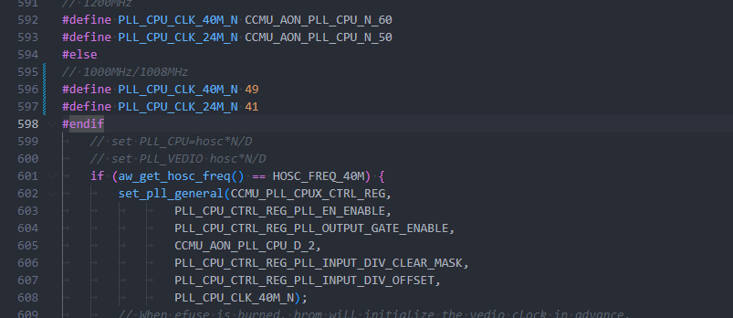
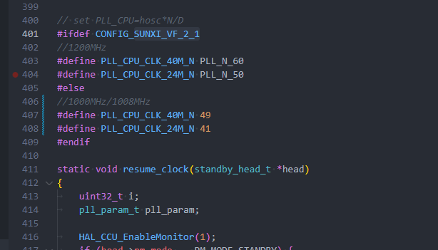

# SDK 配置 CPU 主频

quick\_config 中内置了配置 CPU 主频的功能，可以配置 CPU 主频和使用的 VF 表。该配置支持常电和快起系统。

-   set\_cpu\_vf\_0：配置 CPU 使用 VF0，默认 0.92v 960MHz，支持不提压主频提升到 1000MHz（需要手动配置）
-   set\_cpu\_vf\_2：配置 CPU 使用 VF2，默认 1.00v 1200MHz

:::tip

:::note

提示

:::
:::note

由于 V821 支持 40M 或 24M 晶振，0.92V 的频点对应 40M 晶振是 1000MHz，对应 24M 晶振是 1008MHz，为了兼容两个晶振，默认 SDK 配置为两个晶振的最大公倍数 960MHz，若产品已知晶振型号，需要提升 0.92V 频率，可以手动修改支持最高频率。

:::

:::

## 配置示例

### 配置 VF 表 0

1.  加载 SDK 环境变量 `source build/envsetup.sh && lunch` 选择需要开发的板级
2.  执行 `quick_config`，打开 `quick_config` 配置界面
3.  执行 `make distclean` 清除编译数据
4.  选择 `set_cpu_vf_0` 条目

### 配置 VF 表 0 并且启用 1000MHz 频点

1.  加载 SDK 环境变量 `source build/envsetup.sh && lunch` 选择需要开发的板级
2.  执行 `quick_config`，打开 `quick_config` 配置界面
3.  执行 `make distclean` 清除编译数据
4.  选择 `set_cpu_vf_0` 条目
5.  修改文件 `bsp/configs/linux-5.4-ansc/sun300iw1p1-vf.dtsi` 取消频点 `disable`

bsp/configs/linux-5.4-ansc/sun300iw1p1-vf.dtsi

```c
opp@960000000 {
	opp-hz = /bits/ 64 <960000000>;
	opp-microvolt-vf0000 = <920000>;
	opp-microvolt-40m-vf0000 = <920000>;
	clock-latency-ns = <244144>; /* 8 32k periods */
};

opp@1000000000 {
	opp-hz = /bits/ 64 <1000000000>;
	opp-microvolt-vf0000 = <0>;
	opp-microvolt-40m-vf0000 = <920000>;
	clock-latency-ns = <244144>; /* 8 32k periods */
	status = "okay";
};

opp@1008000000 {
	opp-hz = /bits/ 64 <1008000000>;
	opp-microvolt-vf0000 = <920000>;
	opp-microvolt-40m-vf0000 = <0>;
	clock-latency-ns = <244144>; /* 8 32k periods */
	status = "okay";
};
```


6.  修改 `brandy/brandy-2.0/spl/board/sun300iw1p1/clock.c` 配置启动频率 1000MHz

brandy/brandy-2.0/spl/board/sun300iw1p1/clock.c

```c
void sunxi_board_pll_init(void)
{
#ifndef CFG_SUNXI_SIMPLEBOOT
#ifndef CFG_SUNXI_PMBOOT
	printf("set pll start\n");
#ifdef CFG_SUNXI_VF_2_1
// 1200MHz
#define PLL_CPU_CLK_40M_N CCMU_AON_PLL_CPU_N_60
#define PLL_CPU_CLK_24M_N CCMU_AON_PLL_CPU_N_50
#else
// 1000MHz/1008MHz
#define PLL_CPU_CLK_40M_N 49
#define PLL_CPU_CLK_24M_N 41
#endif
	// set PLL_CPU=hosc*N/D
	// set PLL_VEDIO hosc*N/D
	if (aw_get_hosc_freq() == HOSC_FREQ_40M) {
		set_pll_general(CCMU_PLL_CPUX_CTRL_REG,
				PLL_CPU_CTRL_REG_PLL_EN_ENABLE,
				PLL_CPU_CTRL_REG_PLL_OUTPUT_GATE_ENABLE,
				CCMU_AON_PLL_CPU_D_2,
				PLL_CPU_CTRL_REG_PLL_INPUT_DIV_CLEAR_MASK,
				PLL_CPU_CTRL_REG_PLL_INPUT_DIV_OFFSET,
				PLL_CPU_CLK_40M_N);
		// When efuse is burned, brom will initialize the vedio clock in advance.
```



7.  修改 `rtos/lichee/rtos-components/aw/pm/plat_sun300iw1p1/firmware/standby_main.c`

rtos/lichee/rtos-components/aw/pm/plat\_sun300iw1p1/firmware/standby\_main.c

```c
//1000MHz/1008MHz
#define PLL_CPU_CLK_40M_N 49
#define PLL_CPU_CLK_24M_N 41
```



### 配置 VF 表 2

1.  加载 SDK 环境变量 `source build/envsetup.sh && lunch` 选择需要开发的板级
2.  执行 `quick_config`，打开 `quick_config` 配置界面
3.  执行 `make distclean` 清除编译数据
4.  选择 `set_cpu_vf_2` 条目
