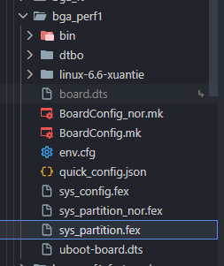

# SDK 使用自定义 Rootfs 打包固件

## 概述

在 Tina Linux SDK 开发过程中，有时需要使用自定义的 rootfs 文件系统，例如：

-   使用 Buildroot 构建的 rootfs
-   使用 debootstrap 构建的 Debian 系 rootfs
-   其他自定义 Linux 发行版
-   调试使用，需要使用之前打包的 rootfs 文件

本文档介绍如何在保持 Tina SDK 内核和引导程序不变的情况下，使用自定义 rootfs 进行固件打包。

## 前提条件

-   已配置好的 Tina Linux SDK 环境
-   准备好的自定义 rootfs 镜像文件

## 操作步骤

### 1\. 准备 rootfs 镜像

首先需要准备一个可用的 rootfs 镜像文件。以下是几种常见方式：

**Buildroot 构建：**

```bash
# Buildroot 构建完成后生成的镜像
output/images/rootfs.ext4
```

**Debian debootstrap 构建：**

```bash
# 创建 ext4 镜像
dd if=/dev/zero of=debian_rootfs.img bs=1M count=512
mkfs.ext4 debian_rootfs.img
mount debian_rootfs.img /mnt
# 使用 debootstrap 安装 Debian
debootstrap --arch=riscv64 sid /mnt http://mirrors.tuna.tsinghua.edu.cn/debian
umount /mnt
```

### 2\. 放置 rootfs 文件到板级配置目录

将准备好的 rootfs 镜像文件复制到板级配置目录，并将后缀名改为 `.fex`：

```bash
# 以 bga_perf1 板级为例
cp debian_rootfs.img device/config/chips/v861/configs/bga_perf1/debian_rootfs.fex
```

> **注意：** 打包系统要求 `downloadfile` 字段指定的文件必须以 `.fex` 结尾。



### 3\. 修改分区表配置

编辑板级分区表文件 `sys_partition.fex`，修改 rootfs 分区的 `downloadfile` 字段：

**文件路径：**

```
device/config/chips/v861/configs/bga_perf1/sys_partition.fex
```

SPI NOR 方案：

```
device/config/chips/v861/configs/bga_perf1/sys_partition_nor.fex
```

**修改前：**

```
[partition]
    name         = rootfs
    size         = 1048576
    downloadfile = "rootfs.fex"
    user_type    = 0x8000
```

**修改后：**

```
[partition]
    name         = rootfs
    size         = 1048576
    downloadfile = "debian_rootfs.fex"
    user_type    = 0x8000
```

![image-20260326151933560](data:image/png;base64,iVBORw0KGgoAAAANSUhEUgAAAccAAACRCAYAAAC2XHPsAAAgAElEQVR4nO3dUUgb2fs38O8u69s0MWCy2lSWNDXI1MoacbsUUWi2aNG7Un50BUEQBEHw8i+lgl5UsBTfy0KhUBAKgivL4p1lld0sWKS8vwZTsG6Q+HfDYq2uKSRVi+36XsxMMjNJJolmTKzfDxRMTmbmzEw6z5wzJ+f5oubb7w9winxdXo5/trYKXQ0iIipiXxa6AseNgZGIiDI5dcGRiIgoEwZHIiIiDQZHIiIiDQZHIiIija/yubKKupsQypPfjyxNY2kDAGy40HgNzrNSwVYA869W81kFIiKiI8trcNx8NY1N5RsWD65cdSAWE1+a3d+j4u0fmA9FAFSh9roHV9zv8N9QJJ/VICIiOhJDu1XNDgdMWyv46734eif0qyIQrmJzCzBZyoysAhERUc4MDI5VuOgCwiF2mxIR0cliWHA0u6thU7QakziaIJTvMHgSEVHRMSg4VuGiy4zI2zSBz+LBldoKRJZ+TR88iYiICsSQ4Gh2V8O2u4r/3UhRaPHgytUqYO0PaQQrERFRcTEgOEqtxtUAdrRFisDIEapERFSs8vpTDgCoqPPAtrsKf4pWYYW7CiYAcF1Ds0t+dwfhF+xeJSKi4vHFaUtZRURElAmnjyMiItJgcCQiItJgcCQiItJgcCQiItJgcCQiItJgcCQiItJgcCQiItJgcCQiItLI+ww5J4W3bwytTulF1I+n9ycQLGiNEoSOYXTVWxF+NoDHvlyXbkHvaDuced8nab3Sq8PVjYjoZMhrcKyouwmhPPn9yNK0OMm4ownNtRWJgq0A5l8VLmVVbPEJHkwuH/NWa3D7bg9szw8ZXLz9GGnaLkAwn8PjwTnE63+s2yYiOl55DY6br6axqXzD4sGVqw7EYtLrjeeYj8+5asOFxmu44n7HScg1gpP3MDR52KXlIEZERIdlaLeq2eGAKW3C4wh2i3Ky8Rb0jl7Gn+PbaOxuQCmQ3O3q7cdIW3zmdFUXo7dvDI3bT/ALfkRXvVVVrurKbRvDSJv4Z6IFq+y6jCIwfg9T8kaFTtyR6wMXukYbpII1zA4+hA+J7lhxozMYeqQOkqpyTb2FjmHcwk9YsPfE68iuUyI6rQwMjlW46ALCL9J1m1ahonwHm0XZanShtRuYHRyAT+pGvNXxMhHAal9jaPCh+FFvP0ba+uH1iQEKAErre9AVnsHQ4JwYkJo6Ifgm4HuUWF/qblW51deC3tFmdVFwAg8GJ3S7VeUWp9AxjC67ptDbj676bcwO3hPr6e3HSNswbq8nAnBpfQ8aF59g6NGyqt7F8iyWiOi4GDZa1eyuhi1Fq9HsvoHm6zfRfN2Tsrw4RBEYl4PdMhZDUZTav5HK5vBY2SLzvUYYdpwTlIv78VT6TNC/gpjVjsrjqXgaNbjd5EJscTYewOF7iNmwFe6GmsTHwjPxZ7DFUW8iosIwqOUoJTxeSm417oR+xXxI/NvsvoHmRiv8CykSIxebMgcEAEFoukcBAFEo27+x0MtEays4gQeDx1THDCJvjnvwERHRyWRIcDS7q9MmPFba2djAnqsUFqD4g+O7DQQhdlm2OhPP+VJ2gRYp2/kaAHKArMG5MgDbBawQEVGRMqBbVWo1rmZuDVa4q2DaWlePcC02Qidu1VsRXlJ0pUa3sS796e1L/PYvO8t4+w5w1rYcrj7r24hZq1EvZP6ocpuLoShK61vhld/ytsJjXcPCsf+UhYio+OW95VhR50nbajS7b6DBZU68UeDfOaZnhad7DB7plXLUZnByHuHR9vho0diiH2FndU5r9z2awaXRdoyMtkvrkEarakbBOrvH4NGOWg1O4JfFYXTF6ye3YsWBPp74YFRp/dKo1eDkPTzFMLpGx9AKQB4Ny8GoRETJvqj59vuDQleiEOSfXCRPAiB2k0aUAYkUjjiJARHRCcC5VYmIiDRO7dyqgPi7vpF6FN3cqsVJM7dqQetCRGSsU9utSkRElA67VYmIiDROXXD8ujxF2hAiIiKFUxcciYiIMmFwJCIi0mBwJCIi0jjVP+UgOvFUsyppZlMiokPLa3CsqLsJIcV4l8jSNJZU08nZcKHxGpxndxB+8WuRpq0iKjCd3J2iFvS2uZiUmsgAeQ2Om6+m1ZOIWzy4ctWBWEz9ObP7ezjfbyJy1pLPzROdLoIDNqxhgYGRKO8M7VY1OxwwaRMaWzy47ALCL9ZRWp7bhN0nXwt6Ry/jz/FtNHY3oBRInp1HM/l4olUgLhtZtMNTb0VscQYhdzs8VmVXmmbycWnScTKI3LL7Gbgln0/VMVfPKpR0roVO3JGXUy6ret8Vn+Q+Mcm8pNKeWDZJhm0TkS4Dg2MVLrqA8Atl1g0bLtRVAWt/4K/3Zag1buNZsVgs+PjpEz7s7eVUfubMGXxVUoKDgwPsvE/uE9Yvd6G1G5gdHIBPuoD94J1AUA6Ata8xNPhQ/Ki3HyNt/fD65AuiCx77DIaeXcZIWztszwYwWzuGxoYaILgMb18PPO9mMHR/DnKgvNPxt2py9ZKSEvyfM2dS1u1o+6Vfrrfdo5Yftd6Z6C5vbUBX95p4PoVO3Oluxm1hDlPBGty+2w7b4hMMTS5DPh9dfRtS8GxBb3cDIs8G8CB+89Muna8JPBicSNutKnQMo6s+nn4FrXKmFUVg9vYpt01EuTIsOJrd1bBtrWBJeS1xXIYTq/CHIgDKjNp0VkpKSmA6exYHQMrgqFf+77//wmQy4QBIebHVL48iMC4Huzn8GW5HYzwJ8RweP1J81Pca4bZmnBMA8eoYRWBuDqi8DET9+N0HVMbvMFpwybmG2UG51bKMqedrGGn6DgKWVRfXdHU72n5lLtcrO0r5oeulbbnJNC3urM9n8CVC0QbYKgFUivkyZ+PBaRlTP/vh7r4ML+aw3tEMZ9SPp/Fm4BweP7uc8nxpBSfvYWgS0s0T1K1JhVJ35nURUWoGBUcp4fHSquq92loLwi+eZ0yCfBz29/ext7uLj58+5Vx+AGAvTWszm3I93r4xtKqyJ0cRyWZBwQEbXIlWRHzxbdXH9vf3xbodJE+pe9T90ivX2+5Ryw9dr6DUQstAd/3RFSzGo88ypu4PiH96oUqKndK7DcMCl+/RE5y72xPvkuWgHaLcGBIcze7q5ITHjkrYYIbt6k0or/22qzfhLFDS4/cZutjSlX/c38fH/f20y2UqT0foGEarU/lcScwtmb21tK0IpffaEVKSo+5XpvJ02z1q+aHrlWXL8bDnE1Y7KoFEANQ+IyxzQFCUC+ftANQ3M4cnBuopQNrPMfSCAZIoWwYER7nVGFC3EDeeY35D/bna69WI8accaorWhrevHc5sW47BlwhFe9Da1wIfB+FkJ8uW46H4XiPc1o7Gjhr45GeOTS7EFp+INy/+FcTqG1TPm3+otyL8TPF8cX0bMWs16gUgeJQmZnAju+8QEcXlPThW1HmSW42UleDkPMKj7fGusNiiH2FntiN6lzF1/wlwtwcjo+3xd2OLT1QDcui4zOHxINA7KuUMBcQWqXwughN4MA7c6R7DSJv4VmzxiTQ4B/HP/LI4jK7uMXgAZNszkDRSNdW6iUjXqcvn+HV5Of7Z2ip0NYiIqIhxblUiIiINBkciIiINBkciIiINBkciIiINBkciIiINBkciIiINBkciIiINBkciIiINBsciJHQMY2R0DL3eQteEiOh0yuv0cRV1NyGUJ78fWZrG0gYAiwdXrlbBpCws0KTjRPkiZlJRJp2WZZl8Wk5wrSnXZmhRZtbQ5nRUlWsSZic+oF6/ah1MhkykktfguPlqGpvKNyweXLnqgCqZwu4q/AuBokhbVazi+fqoyIlzmGLRj1iKOXDVyaeVyYyX1etosyMcjqrmQhU6htGKGQzJ+TmTEl/rzJvre4gh1TyqYpB2b/+tqNsYWsv8eDrIgEiUimHJjgHA7HDAtLXCrBsqmkmhVXfsyrLklkiq1oK6NZBlS4XywtvXjMj4AKbQiTv1mkKhE43OKALj8vGfw++LzejSJCD29rXDGZ7B0+1mdNkTi1farYgpghnWtxGD4gO5EL6D27qGBTmQCp1oLGNLkUiPgcGxChddQPhF8XaZWiwWfPz0CR/SJLJNV/5VSQnOnDkDIHWOQb1yb187bItPEtkZVObweFBuZSTncVS3KFvQO3oZf6q64ZQtFTFQJrdUAEtpKXBwkJSv8ij7lU15uu0etfyo9cok3fK+R/fEP4QUC1XaUapMhOztl25sFDkevf1S/s45oEN9vn1La2ht60HvmwE89tXg9n8aUBqeySIjRzJvSwMgp8oCIDRUo/TdCurvjqFLupFi9hYiNcOCo9ldDdvWCpa017mzVWi4XiW92ETwt+fqrthjUlJSAtPZszgAUgZHvfIvAJhMJhwg9cU2U3mppvVwGN6+duDZgOJi2YJL8oUWALCMqedrGGlSb6ukpCRRN02QOep+6ZXrbfeo5YeuV5bJjjOtX1d8G2uYHZzBpdFmnBMABMX8jmHpHCbFV99DDPla0DsqprSKpbihKq3XpMNK1UsgdKLRuYaFR4llK+1WwFkNjA9gKCjXUQ7Eue0e0efKoOAoJzzWtBrfB/Df3wLxl2b3DTRcbwIKECD39/ext7uLj58+5Vz+5ZdfYm9vDwcHqbN96ZX7Hj3Bubs98ZyNykEWWfP2i8+jlMsJDtjgQuvoGFqVn42qM8sfAGnrdpT9ylSut92jlh+6XlkmO860/rSsDejqXsPsoHQTI3SiEdv4MwgIHT+Krfx0597bj5E2OwLjA3gcbBHzQroTXaHqXgSxl2CkD0kB0tuSusUZW/wp0WUfnMBCuAGN52sAsPVIBBgUHM3u6qwSHu9sbGDPlXTffmzSdd9lKv/w4QM+fPiQdjn98mVM3R/AFCDdsY+hF7kEyBb0tkHRQlTKnAz34/4+Pu7vH6LeRyvX2+5Ryw9dryxbjpnWn5L0jDA0rjgflXaURrexjhrUu62AtV2VmBpox8hoMwLjPwFNLsQWn0gBTE6c3I4fvBMIJp3gZSyGovBoH0kmPfeUqxZFqf0bMBASpWdAcJRbjZlGpNpwoa4Kpq1AQbpVi0JwA5GcFqjB7bva7lR5XS8Rivagta8FPg7CyU6WLcfDrfslQtEGeP7TicX7EwhC7EaNhWYRxDKC8g2SROgYRpd9XgrKNbgNqAOY9zKciCKwnmJbQidu1VsRfpa61Til6b8P+lcQ627GbWFOLJOCaGiOwZJI9kXNt9/n2Fekr6LuJgRL6p9rmN030OAyx1/vrf2B/4ZyCw9H9XV5Of7Z2jrWbSZoRqpCMxAi5e/TEqNWU45WVbUWNaNVteunvEp9PpSjjNXnQ+9cqIMjkPxdSb/eVCObE92y2t9eKstd6ZcnOuXyHhyLXWGDIxERnQScPo6IiEiDwZGIiEiDwZGIiEiDwZGIiEij6INj9Pb/IHr7fwpdDSIiOkWKOjjKQdE69X8LXBMiIjpNijo4AmJgZMuRiIiOU1EHRwZGIiIqBEPzOR7V59+tKs50Ynt+HNkQ9HNF5le6/VLP+qKeMUYqS5GR3ts3hlZnqmUKTayzbfEJHvi/w53uBkQOM5G8gdSz+GSeezd3uX2Hk2cCSiX9d+E4GHHMxHVuY3bwISAnmmY+zaKW1+BYUXcTQnny+5GlaSxtpPncVgDzr9LnfJRbj59vgDwu+rkij4Oc2DfXBMy+R+Jcst6+MTQaU7UTyds3hsZtnZsFoRO36oHA+ACnhssWjxlJ8hocN19NqycRt3hw5aoDiRR4NlxovAbn+wDmf8ucBJndqp+TGpwrA8LP0wVGOXifJH8jEgXwZhkIfoMIooikmhi8ULQJl0+MAn4XDDpmwTfbgHsb6wCwHQWwwVZjkTO0W9XscMC0tYK/5MxPjstiYNRpKSp9nt2qyZOPhxV/ayezjud79PZjpGk7qSsm0U31N27f/RH4eR62bnn9uXUJKbsvk7teNZNdJ3V56e8X8A1s2jm6U+3zIVqWhZtEW0w/Jkq+oMstu1/wY3z/VPk7tSmzNPue7nyojpczfcJj4bwdgDqfZ2Ll6knuc+uuznCuszgfyn1THpOM3wVNvbXL3sJPWLD3pFx3NrI/Zor9ks4jFMdQ3D/F/z/fw0Tuzsl7GMq+SlQgBgbHKlx0AeEXiUBYca4Ce+9jqL1+EzbpPW2Xq5aR3aoWiwUfP33Ch729nMrPnDmDr0pKcHBwgJ0UOR/Tl4spp2zxrO7S8xq52NsvPZe4J/6H8vZjpG0Yt9fvYWp9GzGrHZWAzh2nFZ7uZilBrrjuxo4a+LK46Akdw+JzkEEx4Akdw+jq7sdb6T+30NEK/CxljpfqfavjpXQx0NkvbQBoEzPbKwO3nLhXDPQZq6qpeCfuSEmBp4LSMVPUG8h8vjI5yvKl9T3oCs9gaHBO3L+mTgi+CQTRgl7pGeUDHyAHnDsdf+PB5LL++ZCOV7puVXVQbYgn1k4EwBb0Ko9ZTjJ8h7M4H3C2o3HxCYYeLUvf8X54fdl8F1rQW/saQ4MPpR1VLysfb3nd6uOtL+Mx09uv4AQePLNjpO1H3Pbfw1Rlvzow0olkWHA0u6th21rBUvxaYsNZC2AqL8Vfv01jCQAcTWiuvYELsV8TrUsFI7tVS0pKYDp7FgdAyuCoV/7vv//CZDLhAEh5sUxb7m2FB348TRmspHx/i08S/6F8DzFbO4bGhhpgcgMRSFcLRSuy0m5FbPvv+FrCz+S7dDkBbjZJbVvwQ70V4WeJi0hw8icE3D245AV8PiA4+VBxgdGsW2+/4jkTxYs/8jxgRWioBpRZ7X2zCDQl6g3onI8skx1nOt+6on48ldYV9K8gVi/e4KCjWRxwEj8Wc3j87DJGmr6DgG8yng898jNaoWMYXe6VNAM/rHA31ADBHAc36X6HszsfCM8kArrvNcJt7VntFzCHx48UL32vEW5rxjkBiTtGxbqVxztTcMx0zDLul+8hnp4fRldLJ1DmQjhVzlU6UQwKjnLC4+Tu08jS88RzyY3XCFddQ2kpgBTXHCO7Vff397G3u4uPnz7lXH4AYC9NazObcj2RN+kuVn8jEhUvBN5aIPxOusjGl6k51PYSMjwvSxVIwuk+fHwq7VaUKrsWJcqqpT0fWSY7Psr5jIVeJi6ywQk8GBT/FADgnd5zJyOfX87h8bgDd7rl45a/Vk4250NNfG5rS1uupm7hAUA0x4Thh5PNfgUnf0Lgbg8872YSXah0YhkSHM3uath2V+FXdZdGsPseqLDYgBy+zkZ2q77P0ApIV/5xfx8f9/fTLpepXI/tfA0SLT1xEIv4CGQZb99ZcamyBbaybfz+3I4fvDWIlOXrImqFTXWLrXxGKHYBIt6VdsguUINkel6W9nxk2XI8yvnUVeaAstGjft6ldz7yQHFjIHQMo2u0H8hTgMzt+eU3sFmz+w4LHcOa7srjHXmdab+8fT1wh2YQcCe6x+nkMmASAKnVuBrAjqZk8+0mTK7LqJDfcFyG8+wmNtM8c/zsRquubyNmrUa9IL709imzuYtdlaX1rfDKb3lb4bGuYUH5n+y8Awi9RHB9G7baVtis23h75MEnc/gzDDibOiFVDYLU7fe74moZb9UKnbilGDSkv1/G8i2tobT+R9wWMn82SXACDwYHMKT9l+uAoMNs2r+CmLUBP8RPttS1/XwCwSzPx/p2FKXu73CYXVfV5U2aASipZDjXuZ4Pcb9yGB0alUZ8QvppULb1jm+wE3dGxzBytzOn45Zxv7zic8aFyTlM/ewHDvudpKKR95ZjRZ0nRatRsvEcfssNNFy/KX0xNxH87bn65x8Kn91o1eAEflkcRlf3GDwQ70Rn0YNLcvHkPTzFMLpGx9AKQB4RJ18P17ejaK2vRmB8AggCof/0wBP14/dstq0Z5efsHoNHMeLO92gA6BuLD0QQu9rk5y5z+H2xGV2KwTSBxSg8cssxw37p04yCRTtGRtsVrTfNyEipayt+F+97iCH0Y0TadqLuRT4YIjiBB+PAnW75mEr7JFVa/3xIq5C68eKfyXakr+a7oP2eZaq37rnO5nw4pXMMaEY9638XgpPzCI+2KwbL+BF2VmdT66PT2y/peMafMwYnsBAeQ2v3MHBsI6cp376o+fb7g0JXIh25OzWf3apfl5fjn62tvKyLiIg+T5xblYiISINzqxJRXPJoUKUT0F1NlCdFHRwBzq1KdJzk3/sRnXbsViUiItI4ES1HIiKi41TULUciIqJCYHAkIiLSYHAkIiLSYHAkIiLSyOuAnIq6mxDKk98XczbacKHxGpxntaU7CL9InbKKjlmahMqUnjo5dY6/A9ROfK5JIK2/bs1Ua0lTx6mn3cttMnAiymtw3Hw1rZ4n1eLBlasOxGIAEMFfC9P4S1nuaEJzLbDLwEgnkSY5tbdvDK13O7Ge1c1FC3q7qxGKJxzWJJDOsG5vn5Qa6X5i/tlEJghNQmKhE3e6e9D7Jr+5NIk+Z4b+lMPscMC0tZK2VVhxrgJ7a3+knXj88yOm2IkoJiNOyuaumRRae8ev15qQ1/ULfox/JpxNcmFVC8almexanlgZ6paL6r0W9I5exp/j22iU15NTK+gkSk5O7Zvzo7FbzFgRhHhMoTh/4uwz0r4LDtiwjT/jUXQZb98B7izX3eiMIjAutxSlieHd30HAMoJSNpdZ+XsTnMBCuAGttS2Az/iMI0SfAwOfOVbhogsIh5ITHgMALB5cKN/EX6HjSFWapgoWC86YTDmXf1VSAktpKSylSZkAsypPrwW9bXYExhPpk1RdYfHWhFj2dNGOVk3qndL6HnTZ56XyqCrtUVpy6qZna2JQi6dvkgKY7zXCcOGSN7GIt9YFhF8rApwLrd12LAwOYGjwCQJowK2OmqzrDUA8ZhZL2mqmKzfufOgtL+YhDPnl8yPmvCyN52GcwINnijRHUkqj+E1B8CVCUVfiOHj70eqU15dh3ZV2lCrTPHn7xRsPq5gAWzhvV50bMQ8i4vkjiSgzw1qOZnc1bFsrWErXanRXAQVsNZaUlMB09iwOAHxIkeVdr/wLACaTCQcA3ot9xjmV67PC3VADBJOfD3lrFWlxACmFT7PYmpAvlFE/nkrPnoL+FcTqxQvm0Z4hSi2TeMujBZdULRdATHsktwbF3JQe+zcAlrOqd0lJSeKYpUgyrVd+6PORZbJj/fUnnv2Fnw1gtnYMjXLCat9DPD0/jK6WTqBMfQyAZUzdH8Bih5iiTGxNa9NGpVn3G2391zA7OINLo804JyCe7zDeCxH14+k4cKs7H98FotPBoOAoJTxe0ms17mCzgK3G/f197O3u4uOnTzmXf/nll9jb28PBQepsX5nK05vD43EH7nSLOQvV3Y81OFcGONsS+f9EUSiPYiz0MnHxC07gwWCOVUgj6F9BrPsyvJiDz3sZzvA8Hme6ypY5IGRZ7wNA95jplR/6fAQn8GBwIsNO6K3fCk93D8LPBjDkA8TuUCCylLixkXMuet7NSJ+RSYHv3QyGBufEbufRMVyKd4PrrbsVsDagq3sNs4NSwBU60Sh30zZAzJlY5sfTwYfi98Hbj1JFomAi0mdIcDS7q9MnPIbYajRtBQo+QjVVCyWb8g8fPuDDhw9pl8tUrktxwRYvmP2A4vlcVs8QjRB8iVC0R+xarXUhvPQw8zLvNhAEUI/M9f64v4+P+/uHKj/0+ciy5Zh6+b8RiQK20BPFfondoRFFBPL29cAdmkHArRwwA0B+LnhfauXLia6bOiH4XmZY9zZisCM0rnhuW2mPB7/gm22gfhuzyme+5+3Au9dsNRJlyYBnjlKrcTWAnVTFUqsx7bPIz5703AiKZ0FpBN9sK16JXZXOtn540y5xROvbiFnFQR/JljH1fA3OpmE0lvnxu16AFjpxq96K8NIcjqXehyU/a9X+e5TNoBVxv+LPFAEIHc1wap4FtjrXsDA5h6mf/YDisyI7zsVf16DebZVuKDKsO/gSoagVnv/Iz22lATxyr4H0jLi1r0Vadwt+iJ8PIsrGFzXffp9r35+uirqbECyr8C+kCo7Sbx3fBzD/qjDB8evycvyztVWQbQNQj0YNz2AW7YnRqpqRquJzvMTIVkA76hOqUaFJI18PQX9UqfiTAVvSb+bUv6kDkluKevU+yVT7pdwn6Vwqj4M4WjVxTpOOiabFmnbdALS/c0z+HaP6nBSsx4HohMp7cCx2BQ+OJ1ryT1H03yciOpk4fRxlzdvXDmd4ngGQiD57RZ/PkY4uqftOJbnrVkvsDoTUtcfnVkT0+WO3KhERkQa7VYmIiDROXXBkq5GIiDI5dcGRiIgoEwZHIiIiDQZHIiIiDQZHIiIijbz+zrGi7iaE8uT3I0vTWNpI/RllGRERUTHIa3DcfDWtzs9o8eDKVQfkFHhm9w0ICGD+N2leVUcTmmubULHxvGB5HYmIiLQM7VY1Oxwwba3EU1NZLGbsvX+X+EAshuQ0w0RERIVlYHCswkUXVKmpNt9uwuS6hloHANhwoa4Kpq11thqJiKioGDZ9nNl9Aw2WlRSpqapQe90DG4C9tT/w31Ak1eJEREQFY1DLUUp4/FYTGB1NaL5ejdiLacz/FsCu6xqaGz0wG1MJIiKiQzEkOJrd1bDtruJ/VaNQbbhQVYG9tf8nPYNcxdJvAUTOVuGiw4haEBERHY4BwVFqNa4GsJOi1GQpS7xwVMKGnfhoViIiomKQ93yOFXUe2HZX4U/67WIEfy0EUHrdg+brHum9HYRf/BofzUpERFQMTl0+RyIiokw4fRwREZEGgyMREZEGgyMREZEGgyMREZEGgyMREZEGgyMREZEGgyMREZEGgyMREZEGgyMREZFGXqePq6i7CaE8+f3I0jSWNlJ8ZncV/oXUc7ASEREVSl6D4+araXXiYosHV6464hOLm903IFhW4f9NDIgVdTfRUBdNkfORiIiocAztVjU7HDBtrUgTiydn6zMza/4AAABySURBVNgMrWKvvBIVRlaCiIgoRwYGxypcdAHhkLJVqElP9T6KXVhw1mJcLYiIiHJlWHA0u6thi7caAWAVm1tmON1V8c9U1HlgM6oCREREh5T3fI4iqQt1Sf0scfNVABWKfI6RpQAi5ZXYZT5HIiIqIv8feODipJizeckAAAAASUVORK5CYII=)

### 4\. 执行打包

完成上述配置后，执行打包命令生成固件：

```bash
# 初始化环境
source build/envsetup.sh

# 选择目标板配置
lunch
# 选择 v861_bga_perf1-openwrt 或对应配置

# 执行打包
pack
```

打包完成后，固件输出路径为：

```
out
```

## 原理说明

### 为什么必须放到 device 目录下？

打包脚本 `build/pack` 在执行时，会从预定义的文件列表中复制资源文件到打包输出目录。关键代码如下：

**文件：** `build/pack`（第 200 行）

```bash
configs_file_list=(
    ...
    ${LICHEE_CHIP_CONFIG_DIR}/configs/${PACK_BOARD}/*.fex
    ...
)
```

**文件：** `build/pack`（第 707-709 行）

```bash
LOGD "copying configs file"
for file in ${configs_file_list[@]} ; do
    cp -f $file ${LICHEE_PACK_OUT_DIR} 2> /dev/null
done
```

**变量解析：**

-   `LICHEE_CHIP_CONFIG_DIR` = `device/config/chips/v861`
-   `PACK_BOARD` = `bga_perf1`（示例）
-   `LICHEE_PACK_OUT_DIR` = `out/v861/perf1/openwrt/image`

**打包流程：**

```
┌─────────────────────────────────────────┐
│  device/config/chips/v861/configs/      │
│  └── bga_perf1/                         │
│      ├── sys_partition.fex              │
│      ├── debian_rootfs.fex  ◄── 你的文件 │
│      └── ...                            │
└─────────────────┬───────────────────────┘
                  │ pack 脚本复制 *.fex
                  ▼
┌─────────────────────────────────────────┐
│  out/v861/perf1/openwrt/image/          │
│  ├── sys_partition.fex                  │
│  ├── debian_rootfs.fex                  │
│  └── ...                                │
└─────────────────────────────────────────┘
```

因此，`pack` 命令会自动将 `device/config/chips/v861/configs/bga_perf1/` 目录下的所有 `.fex` 文件复制到打包输出目录。如果将 rootfs 文件放到 `out` 目录下，它不会被自动复制，打包时会因找不到文件而报错。

## 分区表字段说明

| 字段 | 说明 |
| --- | --- |
| `name` | 分区名称，必须唯一，最大 12 个字符 |
| `size` | 分区大小，单位为扇区（512 字节） |
| `downloadfile` | 要烧录的文件名，必须以 `.fex` 结尾 |
| `user_type` | 分区类型标识 |

## 注意事项

### 分区大小设置

确保分区大小足够容纳 rootfs 镜像：

-   `size` 字段单位为扇区（512 字节）

计算公式：

```
扇区数 = 镜像大小(字节) / 512
```

例如，512MB 的 rootfs 镜像：

```
size = 1048576    # 512MB = 512 * 1024 * 1024 / 512
```

### 文件格式要求

-   文件名必须以 `.fex` 结尾
-   支持 ext4、squashfs 等常见 Linux 文件系统格式
-   如使用 squashfs，确保内核已启用相应支持

### 恢复默认配置

如需恢复使用 Tina 默认 rootfs，将 `downloadfile` 改回 `rootfs.fex` 即可：

```
downloadfile = "rootfs.fex"
```

## 常见问题

### Q: 打包时报错找不到文件？

检查文件是否正确放置在板级配置目录：

```bash
ls device/config/chips/v861/configs/bga_perf1/*.fex
```

### Q: 烧录后无法启动？

1.  检查 rootfs 是否与内核架构匹配
2.  确认 rootfs 包含正确的 init 程序
3.  检查设备树配置是否与 rootfs 兼容，init 程序调用是否正确

### Q: 如何查看当前分区表配置？

```bash
cat device/config/chips/v861/configs/bga_perf1/sys_partition.fex
```

### Q: 支持哪些 rootfs 格式？

-   ext4（推荐，可读写）
-   squashfs（只读，压缩，节省空间）
-   ubifs（适用于 NAND Flash）
-   其他 rootfs（内核开启驱动即可支持）
