# SDK 固件编译

本章节主要介绍获取V821 SDK后，如何编译SDK，以及编译SDK中的单个组件。

## SDK 整体编译

### 检查SDK文件

下载完成后的 SDK 应有如下文件，可以使用 `ls` 或者 `tree -L 1` 命令检查

```
.
├── brandy
├── bsp
├── build
├── build.sh -> build/top_build.sh
├── device
├── kernel
├── openwrt
├── platform
├── prebuilt
├── rtos
└── tools

10 directories, 1 file
```

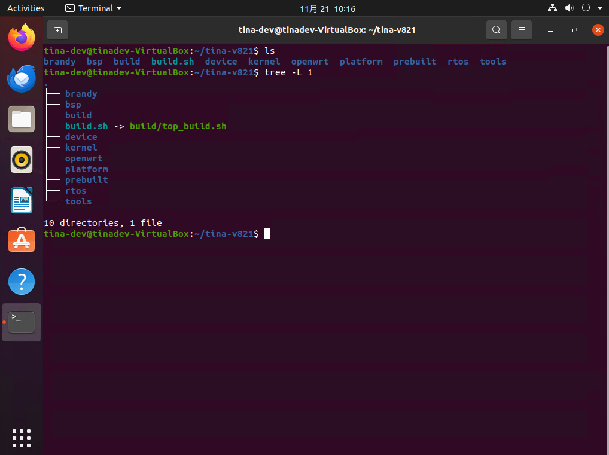

### 初始化环境

使用命令 `source build/envsetup.sh` 初始化SDK编译环境，初始化后便可以使用快捷指令与SDK相关指令。

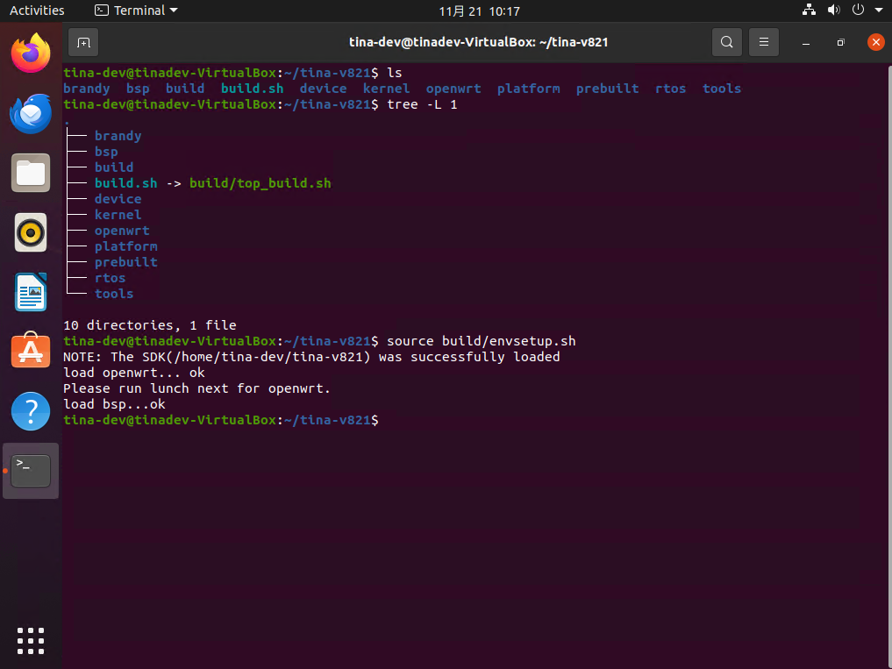

### 选择方案

首先需要明确方案与开发板的关系：

| 开发板名称 | 丝印名称 | 方案 | 方案描述 |
| --- | --- | --- | --- |
| [全志 PERF2B 开发板](https://docs.aw-ol.com/docs/soc/v821/hardware/development-board/perf2b) | V821M2-WXX\_PER2\_B\_4L | v821-perf2b-tina | PERF2B 开发板配套板级，支持验证多目输入，支持 PMC，支持低功耗，电池，带屏方案 |
| [全志 PERF2B 开发板](https://docs.aw-ol.com/docs/soc/v821/hardware/development-board/perf2b) | V821M2-WXX\_PER2\_B\_4L | v821-perf2b\_fastboot-tina | PERF2B 开发板配套**快起**板级，支持多目输入，支持 PMC，支持低功耗，电池，带屏方案 |
| [全志 PERF2 开发板](https://docs.aw-ol.com/docs/soc/v821/hardware/development-board/perf2) | V821M2-WXX\_PER2\_4L | v821-perf2-tina | PERF2 开发板配套板级，支持验证多目输入 |
| [全志 PERF2 开发板](https://docs.aw-ol.com/docs/soc/v821/hardware/development-board/perf2) | V821M2-WXX\_PER2\_4L | v821-perf2\_fastboot-tina | PERF2 开发板配套**快起**板级，支持多目输入验证 |
| [全志 IPC 原型机开发板](https://docs.aw-ol.com/docs/soc/v821/hardware/development-board/ipc_monocular) | V821M2-WXX\_PRO\_MONOCULAR\_IPC\_2L | v821-ipc-tina | IPC 板级配套最小化配置板级方案，支持 8M Flash，原型机配置 |
| [百问网 AvaotaF1 核心板](https://docs.aw-ol.com/docs/soc/v821/hardware/development-board/100ask_avaotaf1) | Avaota F1 | v821-100ask\_avaota\_f1-tina | 适配 100ASK Avaota F1 的方案板级，常电方案，基于 PERF2 板级差异化适配 |

:::tip

:::note

开发板名称请查看开发板 PCB 上的丝印确认

:::

:::
:::danger

:::note

v821-perf2-tina 和 v821-perf2b-tina 是两块完全不同的硬件型号，其供电配置完全不同，请选择你实际使用的板卡开发，以防选错无法启动烧录！

:::

:::

-   SDK 1.3
-   SDK 1.0~SDK 1.2

使用命令 `lunch` 选择编译的方案，这里以选择 `v821-perf2-tina` 为例，选择 7

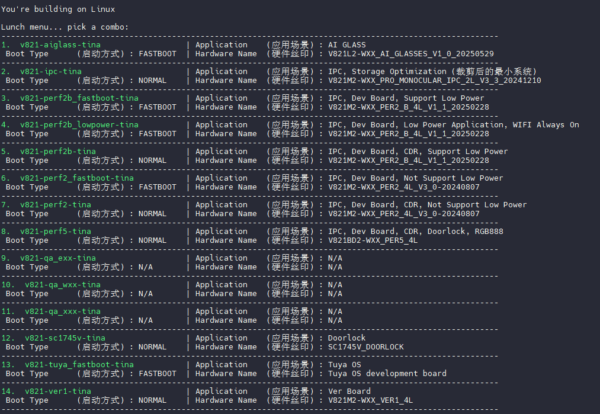

选择需要开发的板级后需要选择芯片，请根据芯片丝印型号选择，上面的所有板级都 P2P 支持以下芯片：

![image-20251124140126761]()

选择芯片后需要选择编译的波特率，提供 115200 和 1500000 两个波特率，更高的波特率可以减少 CPU 打印时间占用，增加性能

![image-20251124140252504]()

使用命令 `lunch` 选择编译的方案，这里以选择 `v821-perf2-tina` 为例，选择 4

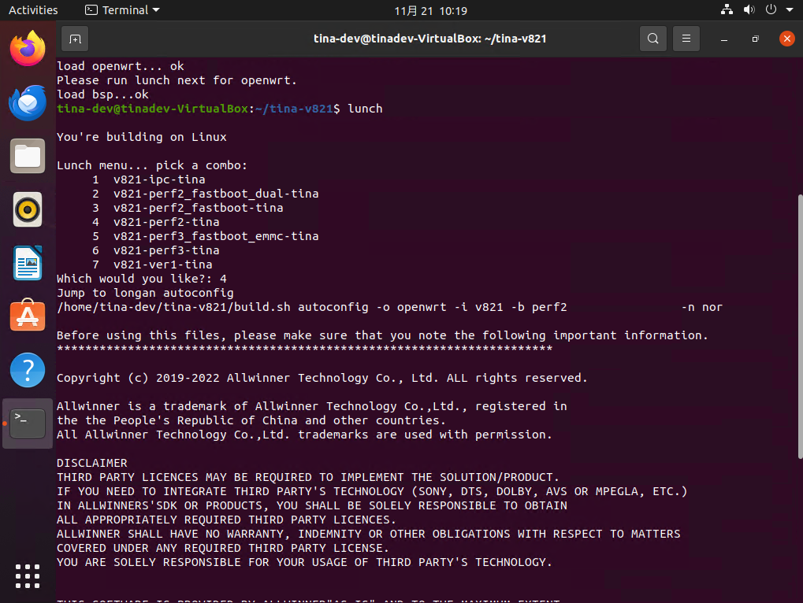

### 阅读免责声明

如果是一次下载使用SDK，`lunch` 选择方案后，需要等待8s来阅读免责声明，并按提示输入Y并回车确认接受免责声明。输入之后这份SDK，再做其他操作不会再有这个等待和提示。

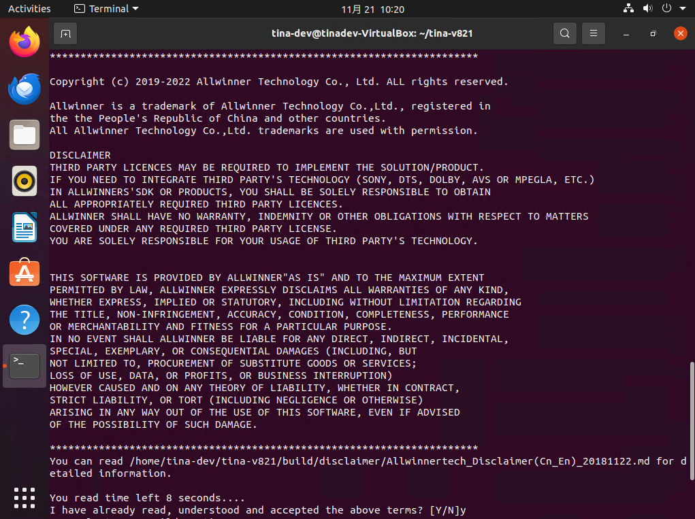

### 等待初始化环境

确认后需要等待 SDK 解压工具链，初始化开发环境

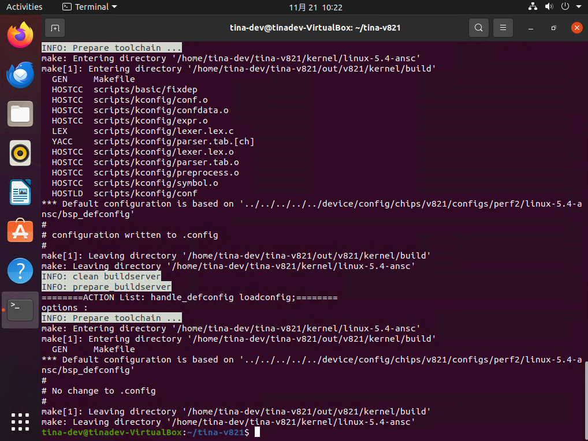

#### 演示

Loading asciinema cast...

### 完整编译SDK

使用命令 `m` 或 `make` 完整编译 SDK，也可以使用快捷命令 `mp` 执行编译和打包的动作。可以使用 `m -jN` 参数N为并行编译进程数量，依赖编译服务器CPU核心数，如 4 核PC，可 `m -j4`

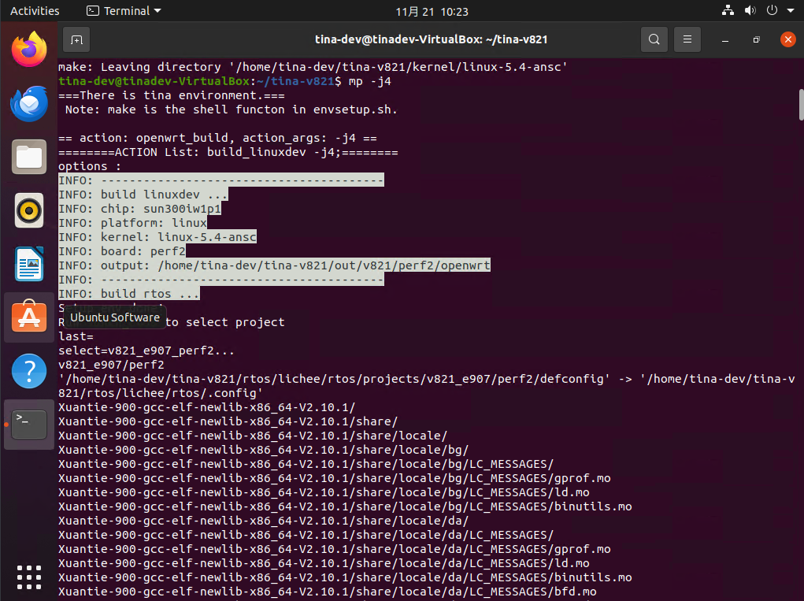

### 打包固件

SDK 编译完成，需要使用`pack`命令打包固件，其会在`out`目录下输出固件

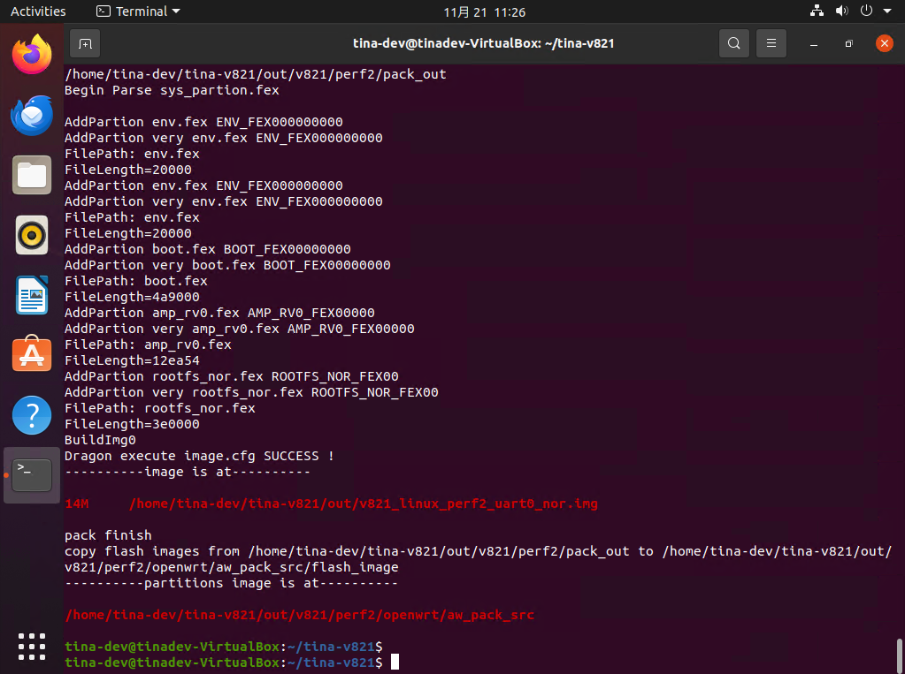

可以在 SDK 目录中的 `out` 文件夹找到

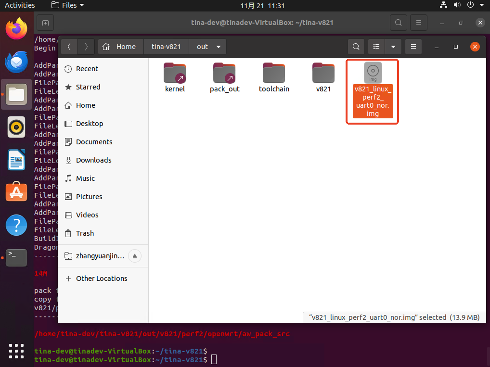

## SDK 组件单独编译

在开发过程中，会需要单独编译某一模块，但是完整编译太慢效率较低，这时可以使用单编命令。

| 命令 | 作用 | 作用范围 |
| --- | --- | --- |
| mboot | 编译boot0和uboot | boot0和uboot |
| mboot0 | 编译boot0 | boot0 |
| muboot | 编译uboot | uboot，uboot设备树 |
| mkernel | 编译内核 | 内核，设备树 |
| mrtos | 编译rtos镜像 | rtos镜像 |
| mkmpp | 编译eyesee-mpp-middleware | eyesee-mpp-middleware |
| cleanmpp | 清除eyesee-mpp-middleware的编译 | eyesee-mpp-middleware |

### 编译内核与内核设备树

使用命令 `mkernel` 可以单独编译内核与设备树，之后可以用 `p` 命令打包固件，编译后的 Kernel 固件会自动拷贝到 `out` 目录下 `out/kernel/build` 中

```
mkernel
```

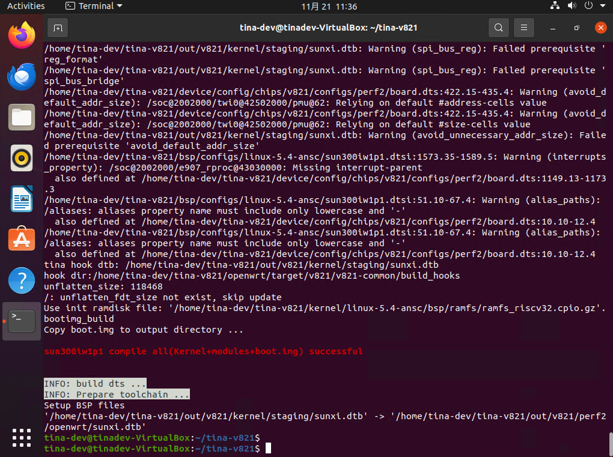

### 编译 RTOS

RTOS 可以使用 `mrtos` 编译，编译完成后使用 `pack` 打包，编译后的 RTOS 固件会自动拷贝到 `device` 目录下对应板级配置中。例如这里使用的 `v821-perf2` 板，会拷贝到 `device/config/chips/v821/configs/perf2/bin/amp_rv0.bin`

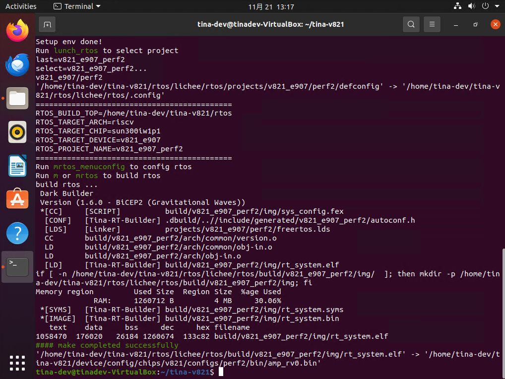

### 清理 RTOS 编译

可以使用 `mrtos clean` 命令清除上一次的 RTOS 编译产物。

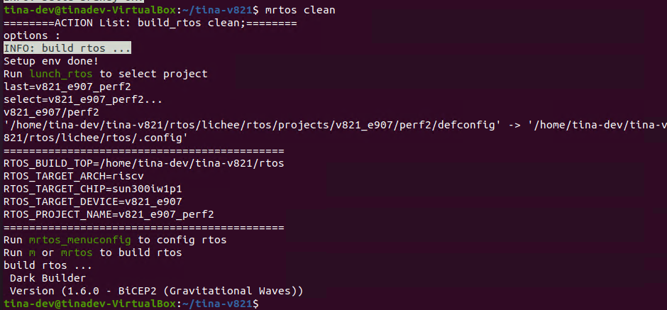

### 编译 U-Boot 与 U-Boot 设备树

U-Boot 可以使用`muboot`目录编译，编译前会自动执行 `clean` 清除之前的编译产物。编译完成后使用 `pack` 打包，输出的 U-Boot 文件会自动拷贝到 `device` 目录下对应板级配置中。例如这里使用的 `v821-perf2` 板，会拷贝到 `device/config/chips/v821/configs/perf2/bin`

```
muboot
```

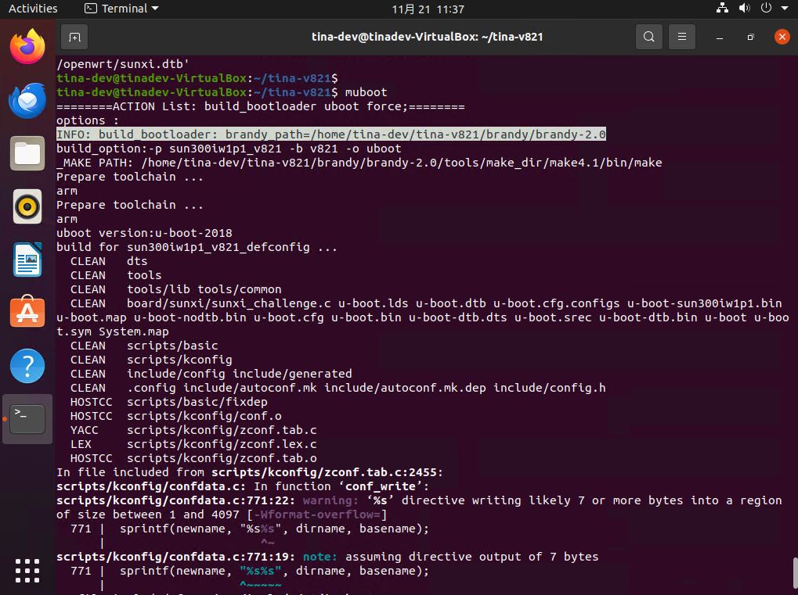

### 编译 SPL

SPL 可以用 `mboot0` 来编译，编译前会自动执行 `clean` 清除之前的编译产物。编译完成后使用 `pack` 打包，输出的 boot0 文件会自动拷贝到 `device` 目录下对应板级配置中。例如这里使用的 `v821-perf2` 板，会拷贝到 `device/config/chips/v821/configs/perf2/bin`

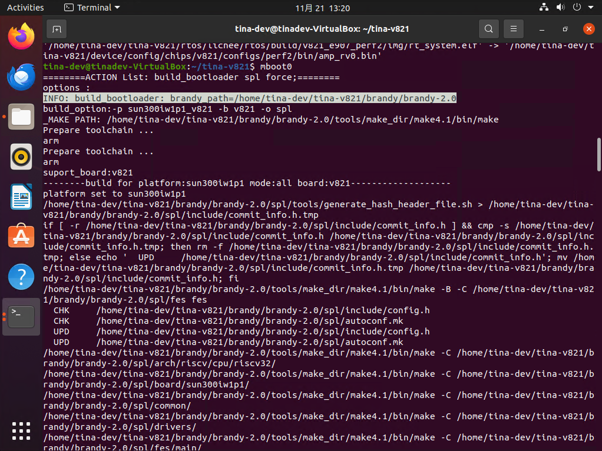

### 编译 U-Boot和SPL

可以使用命令 `mboot` 同时编译 `U-boot` 和 SPL，编译前会自动执行 `clean` 清除之前的编译产物。该命令会先编译 U-Boot 然后再编译 SPL

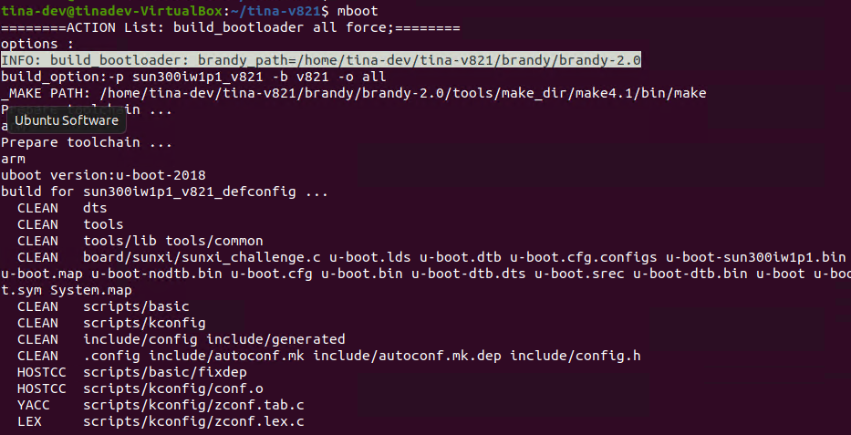

### 编译 MPP

可以使用 `mkmpp` 命令单独编译 mpp，请注意编译前需要在 `menuconfig` 中配置需要编译的软件包

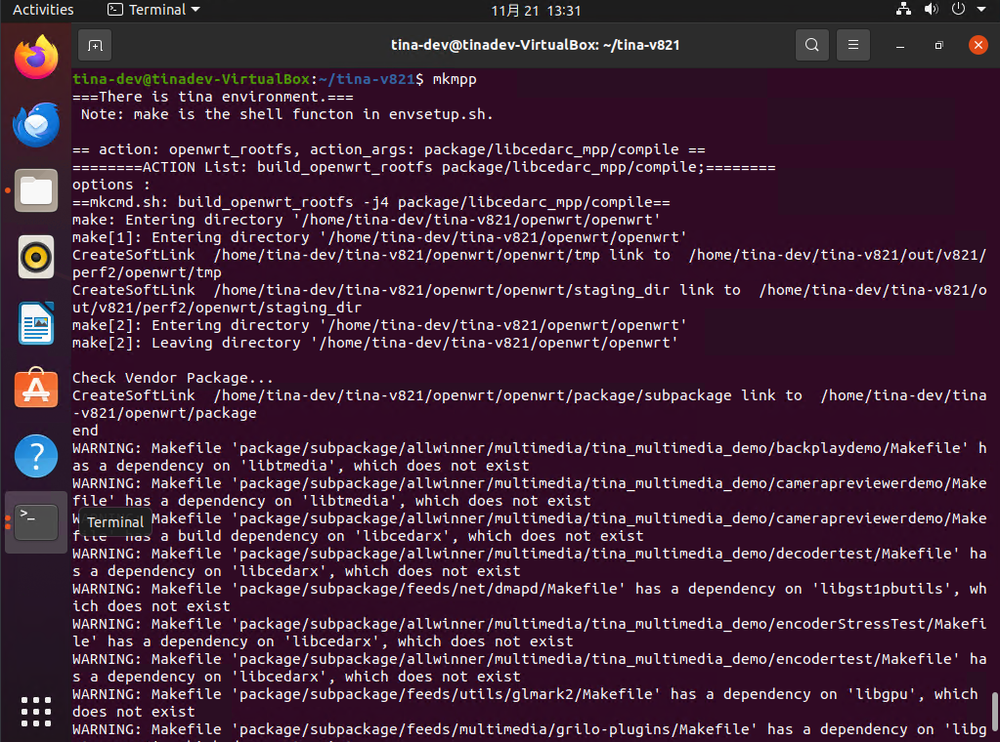

### 清除 MPP 编译

使用 `cleanmpp` 命令清除 MPP 编译产物

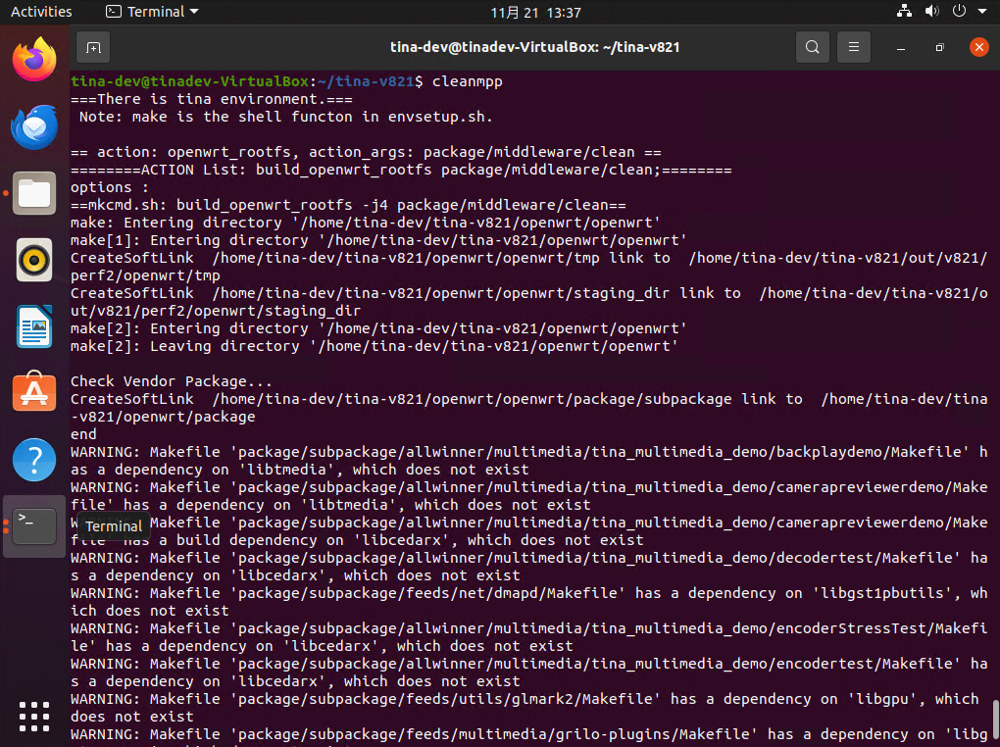

### 单独编译某一软件包

SDK 支持单独编译某一软件包，方便加速开发，这里以 `mtd-utils` 为例，介绍单独编译某一软件包的方法

**以 Package 方式编译**

```
make openwrt_rootfs package/mtd-utils/compile
make openwrt_rootfs package/mtd-utils/clean
```

-   `package` 是指在 `openwrt/openwrt/package`, 和 `openwrt/package` 目录下搜索该软件包。 `tools` 是指在 `openwrt/openwrt/tools` 下搜索
-   `mtd-utils` 是定义软件包的 Makefile 所在目录的目录名，编译其他软件包时，替换该字段即可
-   `compile` 换成 `clean` 是清理软件包编译文件

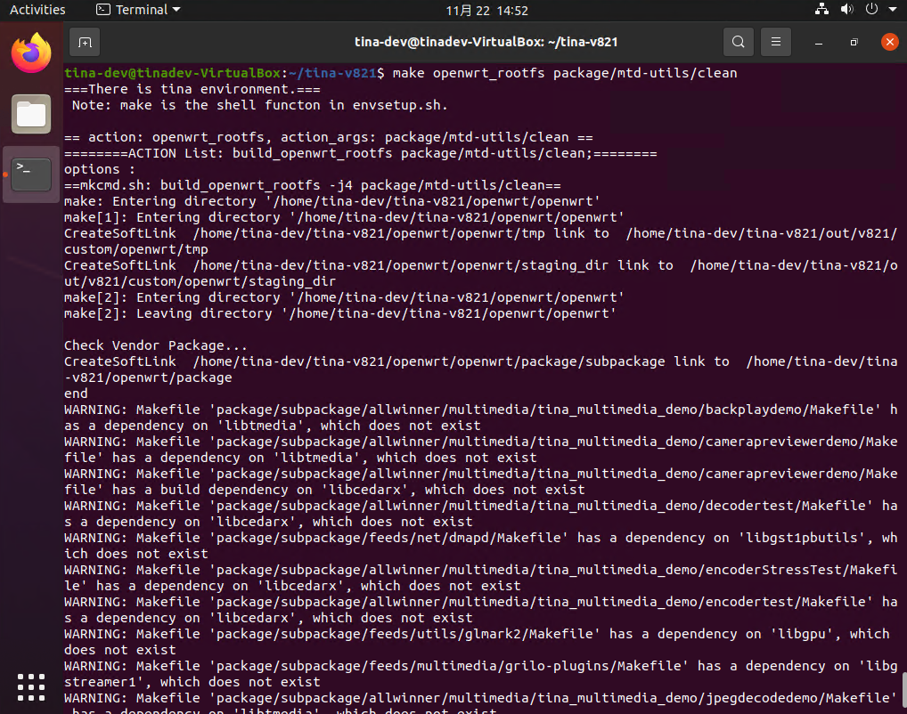

**以路径方式编译**

也可以使用软件包 `Makefile` 所在目录相对于`openwrt`原生代码根目录的相对路径来直接指定编译软件包

-   `mtd-utils` 软件包位置：`openwrt/openwrt/package/utils/mtd-utils`

编译指令：

```
make openwrt_rootfs package/utils/mtd-utils/compile
make openwrt_rootfs package/utils/mtd-utils/clean
```

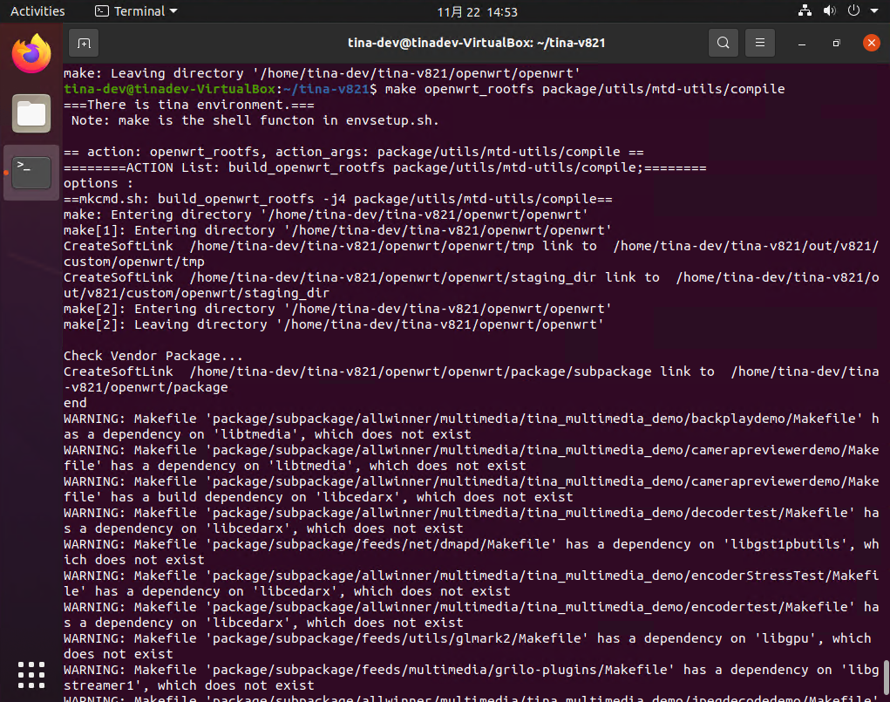

SDK为了区分openwrt原生代码与新增代码，软件包的 `Makefile` 放在 `openwrt/package/` 目录下，但编译时需嵌入到 `openwrt` 原生代码的标准路径，SDK 使用了软链接方式，将其软链接到 `openwrt/openwrt/package/subpackage`。这里以 `eyesee-mpp-middleware`包为例：

-   实际位置：`openwrt/package/allwinner/eyesee-mpp/middleware`
    
-   软链接之后的位置：`openwrt/openwrt/package/subpackage/allwinner/eyesee-mpp/middleware`
    

编译指令：

```
make openwrt_rootfs package/subpackage/allwinner/eyesee-mpp/middleware/compile
make openwrt_rootfs package/subpackage/allwinner/eyesee-mpp/middleware/clean
```

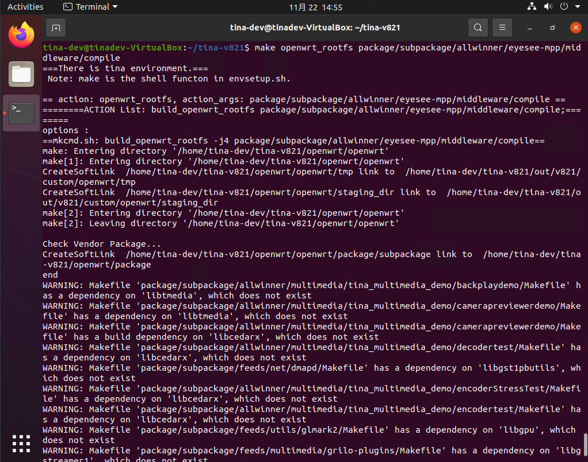

**以快捷指令方式编译**

SDK 提供一个快捷指令：`mmo` 只需要在 `mmo` 指令后面跟上需要编译的软件包名即可编译

```
mmo mtd-utils
```

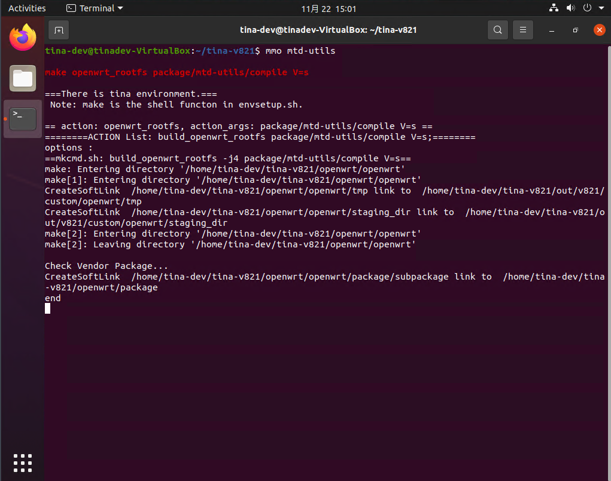

如果需要清理上一次编译产物，重新编译，则使用 `mmo -B` 命令

```
mmo mtd-utils -B
```

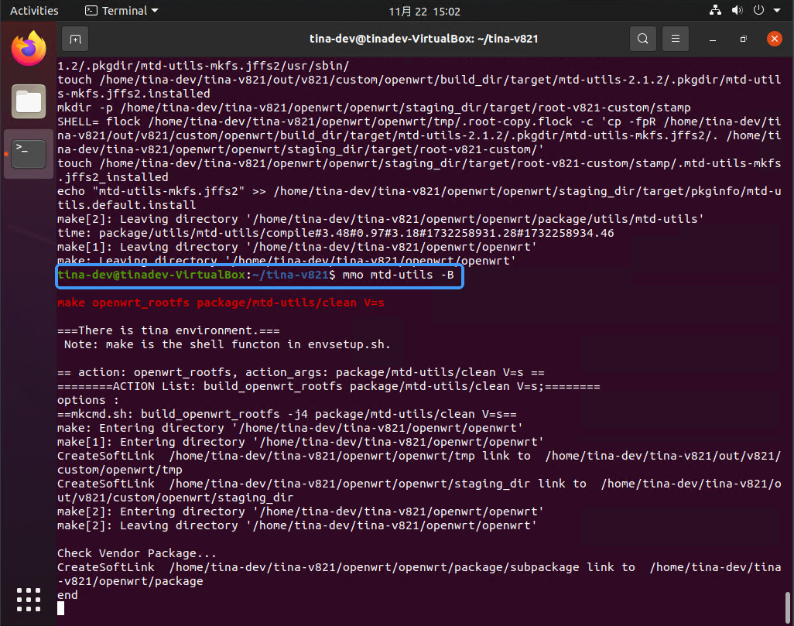

**前往文件夹下编译**

SDK 也支持在文件夹下编译软件包，例如 `mtd-utils` 位于 `package/utils/mtd-utils`，可以前往文件夹单独编译这个软件包

编译指令：

```
cd openwrt/openwrt/package/utils/mtd-utils
mm # 编译软件包、
mm -B # 先 clean 后重新编译软件包
```

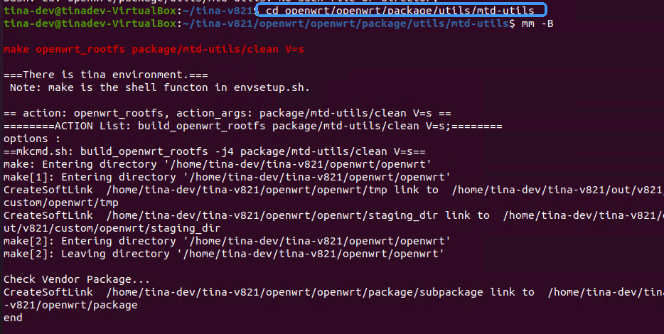

## SDK 快捷命令

SDK 提供了一系列方便开发的快速跳转指令，在开发过程中可以使用这些指令快速跳转目录，执行操作。

| **命令** | **命令有效目录** | **作用** |
| --- | --- | --- |
| make | tina根目录 | 编译整个sdk |
| pack | tina根目录 | 打包固件 |
| m | tina下任意目录 | make的快捷命令，编译整个sdk |
| p | tina下任意目录 | pack的快捷命令，打包固件 |
| m menuconfig | tina下任意目录 | 任意目录启动软件包配置界面 |
| m kernel\_menuconfig | tina下任意目录 | 任意目录启动内核配置界面 |
| mrtos menuconfig | tina下任意目录 | 任意目录启动内核配置界面 |
| croot | tina下任意目录 | 快速切换到tina根目录 |
| cconfigs | tina下任意目录 | 快速切换到方案的bsp配置目录 |
| cplat | tina下任意目录 | 快速切换到tina方案配置目录 |
| cout | tina下任意目录 | 快速切换到方案的输出目录 |
| cboot0 | tina下任意目录 | 快速切换到boot0源码目录 |
| cboot | tina下任意目录 | 快速切换到uboot源码目录 |
| ckernel | tina下任意目录 | 快速切换到linux源码目录 |
| cbsp | tina下任意目录 | 快速切换到bsp驱动源码目录 |
| crtos | tina下任意目录 | 快速切换到rtos源码目录 |
| cgrep | tina下任意目录 | 在c/c++/h文件中查找字符串 |
| mm \[-B\] | 软件包目录 | 编译软件包，-B指编译前先clean |
| cmpp\_s | tina下任意目录 | 快速切换到mpp middleware源码目录 |
| cmpp\_p | tina下任意目录 | 快速切换到mpp middleware配置目录 |
| clibcedarc\_s | tina下任意目录 | 快速切换到libcedarc软件包目录 |
| clibcedarc\_p | tina下任意目录 | 快速切换到libcedarc配置目录 |
| crtmedia\_s | tina下任意目录 | 快速切换到rt-media源码目录 |
| crtmedia\_p | tina下任意目录 | 快速切换到rt-media配置目录 |
