# SDK 系统资源配置

## 内存划分与调整

本章节将讨论在启动过程中的各个阶段，物理内存的占用及其生命周期，重点分析在应用运行阶段，系统为用户开发留出的内存余量，以及典型多媒体场景下的内存占用情况。同时，还将介绍AW内存统计工具ramparser的使用方法。

下文会介绍常电方案与快起方案的区别，常电代表普通启动通路，系统完整启动后运行应用程序。快起代表快速启动通路，通过深度优化定制达到快速启动出图的速度。

### 内存布局注意事项

#### **RTOS 内存布局**

-   在设计 RTOS 方案时，**内核无法释放的内存**（如 `no-map` 内存）应紧跟在 RTOS 内存之后进行分配。例如：
    -   `rv_vdev0buffer`
    -   `vdev0vring0`
    -   `vdev0vring1`
    -   `e907_rpbuf_reserved`
    -   `irq`
    -   ...其他 no-map 内存
-   这些内存区域不应与其他系统内存冲突，以保证内存的合理利用和系统的稳定运行。

#### **内核起始地址对齐**

-   RV32 内核的起始地址必须是 **4MB 对齐**，确保内存分配的正确性和系统启动时不会发生问题。
-   可能的起始地址选择：
    -   0x0
    -   0x400000
-   **注意**：不正确的内核起始地址配置会导致系统无法启动，必须选择合适的对齐地址。

#### **内存浪费问题**

-   如果选择将内核的起始地址配置在 `0x400000`（4MB对齐）时，**0x0 到 0x400000** 区域的内存将无法使用。这是由于 RV32 内核 VM 是线性内存排布的限制。
-   这部分内存会被内核标记为 `ignore`，即使该区域没有被其他程序占用，**也无法使用**，导致内存资源浪费。

#### **OpenSBI 内存地址和 PMP 保护**

-   **OpenSBI** 的内存地址必须是 **固定的**，并且设置 **PMP（物理内存保护）** 保护。
-   OpenSBI 的地址应配置在一个**特定的位置**，避免随意挪动。这是确保系统稳定性、资源合理分配和安全性的关键。
-   OpenSBI 起始地址需要 128K 对齐

#### **Uboot 启动与内存配置**

-   Uboot 启动后会将自身代码重定向到内存的末尾，因此 **内存末尾区域不应占用过多空间**。
-   如果占用了末尾区域，可能会与 Uboot 的重定向发生冲突，导致系统启动失败或者踩内存。
-   应保持 Uboot 启动所需的内存空间，避免占用末尾内存区域。

#### **总结**

-   **内存布局的合理配置**：确保内核无法释放的内存紧跟 RTOS 内存，避免内存浪费和冲突。
-   **内核起始地址的正确配置**：内核的起始地址必须是4MB对齐，选用合适的地址（0x0 或 0x400000）。
-   **避免内存浪费**：内核起始地址配置不当会导致内存浪费，特别是在选择 0x400000 地址时，0x0 到 0x400000 的区域将不可用。
-   **固定 OpenSBI 地址与PMP保护**：为保证系统的稳定性和安全性，OpenSBI 的地址需要固定且设置物理内存保护。
-   **Uboot 启动区域管理**：避免占用内存末尾区域，确保 Uboot 的重定向不会被干扰。

### ramparser 介绍

SDK提供了ramparser工具用于内存统计。ramparser会按模块对内核、媒体（包括ion内存占用）以及用户进程的内存使用情况进行详细统计。我们可以使用ramparser -a命令对整体内存进行统计分析，而使用ramparser -p pid命令则可以跟踪特定进程的内存使用情况，帮助定位内存相关问题。

```
Usage : ramparser [option]
Options:
      -k all                       : 显示内核空间内存使用情况；
      -k vma                       : 显示内核空间的vmalloc内存使用情况；
      -k pagesort [input] [output] : 根据堆栈追踪排序页面所有者；
      -u                           : 显示用户空间内存使用情况；
      -a                           : 显示内核空间和用户空间的内存使用情况；
      -p pid                       : 显示指定进程的详细内存信息并输出到屏幕；
      -p all                       : 显示所有进程的内存使用情况，等同于 '-u'；
      -r                           : 显示所有预留内存；
      -s                           : 打印size_pool信息；
      -S unslab                    : 打印slab内存信息；
      -v                           : 打印版本信息；
      -V                           : 打印更多的详细信息；
```

示例输出 `ramparser -a`

```
-----*****Mem Used Info For Kernel Space*****-----

Kernel stack      =    424 Kb
Kernel pagetables =     60 Kb
Kernel vmalloc    =   2960 Kb
Kernel modules    =      0 Kb
Kernel cma        =     64 Kb
Kernel dma_alloc  =      0 Kb (dma + dma pool + iommu)

Slab               =   8292 Kb (recalim + unrecalim + alloc_pages)
   slab_recalim    =   1876 Kb
   slab_unrecalim  =   6416 Kb
   slab buddy(>8K) =      0 Kb

Buddy Pages  =   3884 Kb
  lru_anon   =    248 Kb (≈ anon + shmem(anon) + mlock)
    anon     =    256 Kb
    shmem    =      4 Kb
    mlock    =      0 Kb
  lru_file   =   3636 Kb (≈ buffer + cached - shmem(file))
    buffer   =   1332 Kb
    cached   =   2308 Kb

dmabuf          =    280 Kb
   heap uncache =      0 Kb
   heap         =      0 Kb
   cma          =      0 Kb
   ion          =    280 Kb
   other        =      0 Kb

-----*****Mem Used Info For User Space*****-----

ther number on the left is the actual allocated memory.
ther number on the right is the logic allocated memory.
e.g.
        4/16      : logic malloc 16K, but phys alloc 4K

Pid    Code+Rodata(Kb)    Data(Kb)      heap(Kb)      Stack(Kb)     mmap(Kb)       lib(Kb)    share(Kb)   pss(Kb) Process
1          220/288          4/4           4/4           4/132         0/0         412/604            0       220 /sbin/init
122         64/68           4/4           4/4           8/132        32/416       540/604            0       245 /bin/adbd
177         36/44           4/4           4/4           8/132        16/272       560/744            0       308 wifi_daemon
198        284/288          4/4           4/4           4/132         8/8         540/604            0       331 -/bin/sh
Rss total: 2.70 Mb , Pss total: 1.08 Mb

size pool info:
pool[0]: 264 KB of 23 MB uesed

Mem Used Summary(For kernel space only):
Mem    Total           64 Mb   (Free 10.44 Mb, Available 13.35 Mb)
Kernel Reserved         35.69 Mb   (Not Include Nomap Reserved mem)
Kernel Nomap Reserved    4.30 Mb

Watermark:
    normal: min 636K, low 792K, high 948K
```

**内核空间内存使用情况**

-   内核栈 (Kernel stack): 424 Kb
-   内核页表 (Kernel pagetables): 60 Kb
-   内核vmalloc (Kernel vmalloc): 2960 Kb
-   内核模块 (Kernel modules): 0 Kb
-   内核CMA (Kernel cma): 64 Kb
-   内核DMA分配 (Kernel dma\_alloc): 0 Kb（包括 DMA、DMA池和IOMMU）

**Slab分配**

-   总Slab内存: 8292 Kb
    -   slab\_recalim: 1876 Kb
    -   slab\_unrecalim: 6416 Kb
    -   slab buddy (>8K): 0 Kb

**Buddy页面**

-   总Buddy页面内存: 3884 Kb
    -   lru\_anon (匿名页面): 248 Kb
        -   anon: 256 Kb
        -   shmem (共享内存): 4 Kb
        -   mlock (锁页): 0 Kb
    -   lru\_file (文件页面): 3636 Kb
        -   buffer (缓冲区): 1332 Kb
        -   cached (缓存): 2308 Kb

**DMABUF内存使用**

-   总内存: 280 Kb
    -   ion: 280 Kb
    -   其他: 0 Kb

**用户空间内存使用情况**

以下为每个进程的内存分配情况，列出了实际分配内存和逻辑分配内存。

| **Metric** | **Pid 1 (/sbin/init)** | **Pid 122 (/bin/adbd)** | **Pid 177 (wifi\_daemon)** | **Pid 198 (-/bin/sh)** |
| --- | --- | --- | --- | --- |
| **Code+Rodata (Kb)** | 220/288 | 64/68 | 36/44 | 284/288 |
| **Data (Kb)** | 4/4 | 4/4 | 4/4 | 4/4 |
| **Heap (Kb)** | 4/4 | 4/4 | 4/4 | 4/4 |
| **Stack (Kb)** | 4/132 | 8/132 | 8/132 | 4/132 |
| **Mmap (Kb)** | 0/0 | 32/416 | 16/272 | 8/8 |
| **Lib (Kb)** | 412/604 | 540/604 | 560/744 | 540/604 |
| **Share (Kb)** | 0 | 0 | 0 | 0 |
| **PSS (Kb)** | 220 | 245 | 308 | 331 |

-   Rss total: 2.70 Mb
-   Pss total: 1.08 Mb

**内存池信息**

-   size pool:
    -   pool\[0\]: 23 MB 中使用了 264 KB 的内存

**内核空间内存总结**

-   总内存: 64 Mb
    
    -   空闲内存 (Free): 10.44 Mb
    -   可用内存 (Available): 13.35 Mb
-   内核保留内存: 35.69 Mb
    
-   内核不映射保留内存: 4.30 Mb
    

**水位信息 (Watermark)**

-   normal (常规):
    -   min: 636 Kb
    -   low: 792 Kb
    -   high: 948 Kb

### 预留内存

**预留内存配置文件**

预留内存是在 `dts` 设备树上设置，以下是 PERF2 板级 `board.dts` 的路径：

```
device/config/chips/v821/configs/perf2/linux-5.4-ansc/board.dts
```

设置方法是

```
reg(保留内存) = < 物理起始地址高32bit，物理起始地址低32bit 长度大小高32bit 长度大小低32bit> 
```

**预留内存 e907\_mem\_fw**

`e907_mem_fw`：rtos镜像存放空间，**在rtos与kernel建立通信后会被 kernel 释放.**

`v821-perf2` 单目配置

```c
e907_mem_fw: e907_mem_fw@81444000 {
        /* boot0 & uboot0 load elf addr */
        reg = <0x0 0x81444000 0x0 0x00200000>;
};
```

`perf2_fastboot_dual` 双目配置

```c
e907_mem_fw: e907_mem_fw@81484000 {
        /* boot0 & uboot0 load elf addr */
        reg = <0x0 0x81484000 0x0 0x0025B000>;
};
```

> 这一块配置地址如果修改，会在编译的时候，自动修改boot0的配置宏，让boot0加载rtos\_fw的地址跟着bord.dts变化：
> 
> `autogen_dts_info.h:16:#define DTS_RESERVED_e907_mem_fw_ADDR 0x81484000`

**预留内存 rv\_ddr\_reserved**

`rv_ddr_reserved`：rtos系统的运行空间

v821-perf2 单目配置

```c
rv_ddr_reserved: rvddrreserved@81000000 {
        reg = <0x0 0x81000000 0x0 0x400000>;
        no-map;/*不会被映射到linux系统，linux系统完全看不到该内存*/
};
```

perf2\_fastboot\_dual 双目配置

```c
rv_ddr_reserved: rvddrreserved@81000000 {
        reg = <0x0 0x81000000 0x0 0x440000>;
        no-map;
};
```

rtos的运行地址需要再rtos编译的时候指定。这个保留地址应该和rtos代码仓库中的defconfig配置文件一致：

```
lichee/rtos/projects/v821_e907/{LICHEE_BOARD}/defconfig
```

配置如下

```
CONFIG_ARCH_START_ADDRESS=0x81000000
CONFIG_ARCH_MEM_LENGTH=0x400000
```

大核起来后会把下面小节介绍的保留地址传递给小核，让小核使用正确的保留地址。小核接收到地址后初始化会有如下打印：

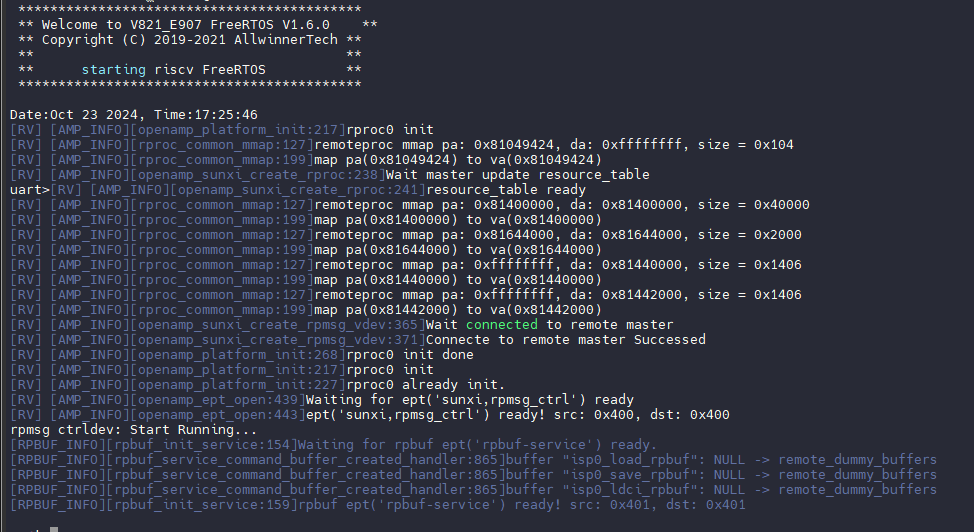

**预留内存rv\_vdev0buffer**

`rv_vdev0buffer`：用于和E907通信的共享内存，一般256K。

v821-perf2 单目配置

```c
/*
* The name should be "vdev%dbuffer".
* Its size should be not less than
*     RPMSG_BUF_SIZE * (num of buffers in a vring) * 2
*   = 512 * (num of buffers in a vring) * 2
*/
rv_vdev0buffer: vdev0buffer@81400000 {
        compatible = "shared-dma-pool";
        reg = <0x0 0x81400000 0x0 0x40000>;
        no-map;/*不会被映射到linux系统，linux系统完全看不到该内存*/
};
```

perf2\_fastboot\_dual 双目配置

```c
rv_vdev0buffer: vdev0buffer@81440000 {
        compatible = "shared-dma-pool";
        reg = <0x0 0x81440000 0x0 0x40000>;
        no-map;
};
```

**预留内存rv\_vdev0buffer/rv\_vdev0vring1**

`rv_vdev0buffer/rv_vdev0vring1`：存放和E907通信相关的控制信息，一般每个8K。

v821-perf2 单目配置

```c
/*
* The name should be "vdev%dvring%d".
* The size of each should be not less than
*     PAGE_ALIGN(vring_size(num, align))
*   = PAGE_ALIGN(16 * num + 6 + 2 * num + (pads for align) + 6 + 8 * num)
*
* (Please refer to the vring layout in include/uapi/linux/virtio_ring.h)
*/

rv_vdev0vring0: vdev0vring0@81440000 {
        reg = <0x0 0x81440000 0x0 0x2000>;
        no-map;/*不会被映射到linux系统，linux系统完全看不到该内存*/
};

rv_vdev0vring1: vdev0vring1@81442000 {
        reg = <0x0 0x81442000 0x0 0x2000>;
        no-map;/*不会被映射到linux系统，linux系统完全看不到该内存*/
};
```

perf2\_fastboot\_dual 双目配置

```c
rv_vdev0vring0: vdev0vring0@81480000 {
        reg = <0x0 0x81480000 0x0 0x2000>;
        no-map;
};

rv_vdev0vring1: vdev0vring1@81482000 {
        reg = <0x0 0x81482000 0x0 0x2000>;
        no-map;
};
```

**预留内存e907\_share\_irq\_table**

`e907_share_irq_table`：存放GPIO中断信息，rtos据此判断GPIO是否属于自己，8K。

v821-perf2 单目配置

```c
e907_share_irq_table: share_irq_table@81644000 {
        reg = <0x0 0x81644000 0x0 0x2000>;
        no-map;/*不会被映射到linux系统，linux系统完全看不到该内存*/
};
```

perf2\_fastboot\_dual 双目配置

```c
e907_share_irq_table: share_irq_table@816EE000 {
        reg = <0x0 0x816EE000 0x0 0x2000>;
        no-map;
};
```

**预留内存e907\_rpbuf\_reserved**

`e907_rpbuf_reserved`:该内存预留是为两核之间消息通讯。

v821-perf2 单目配置

```c
e907_rpbuf_reserved:e907_rpbuf@81646000 {
        compatible = "shared-dma-pool";
        reg = <0x0 0x81646000 0x0 0x20000>;
        no-map; /*不会被映射到linux系统，linux系统完全看不到该内存*/
};
```

perf2\_fastboot\_dual 双目配置

```c
e907_rpbuf_reserved:e907_rpbuf@816F0000 {
        compatible = "shared-dma-pool";
        reg = <0x0 0x816F0000 0x0 0x40000>;
        no-map;
};
```

**预留内存isp\_dram\_reserved**

`isp_dram_reserved`： 用于rtos小核vin模块使用的内存池。

这一块会涉及rtos小核那边出图buf，如果分辨率有变化或者使用双目，需要调节这里的预留空间大小。

释放：在kernel 初始化vin/isp 驱动后会释放这块区域。

v821-perf2 单目配置

```c
isp_dram_reserved:isp_dram@81666000 {
        reg = <0x0 0x81666000 0x0 0x0069A000>;
};
```

perf2\_fastboot\_dual 双目配置

```c
isp_dram_reserved:isp_dram@81730000 {
        reg = <0x0 0x81730000 0x0 0x005d0000>;
};
```

### 内存池

**预留内存size\_pool/cma（可根据方案需要修改）**

这两个都是设置 ION 内存的， 这里 ION 内存池是给 Linux 音视频等多媒体使用的。

-   CMA内存：CMA（Contiguous Memory Allocator）内存是一种用于分配连续物理内存的机制。CMA通常用于设备驱动程序或其他需要大块连续内存的场景，例如图形处理或视频处理。除了多媒体申请使用，在系统内存不足情况下，Linux系统也可能申请该内存给自己使用；
-   size\_pool：全志自己定义的 ION 内存池，它只给特定申请它的人使用，Linux系统无法使用。

v821-perf2 单目配置

```c
size_pool {
        reg = <0 0x82000000 0 0x01400000>;
};

linux,cma {
        size = <0x0 0x400000>;
};
```

perf2\_fastboot\_dual 双目配置

```c
size_pool {
        reg = <0 0x82000000 0 0x01400000>;
};

linux,cma {
        size = <0x0 0x400000>;
};
```

size\_pool 除了在内存上先留出一段空间预留。其空间使用也被heap\_size\_pool描述的模块管理着：

```c
heap_size_pool@0{
        compatible = "allwinner,size_pool";
        heap-name  = "size_pool";
        heap-id    = <0x7>;
        heap-base  = <0x82000000>;  //size_pool起始地址
        heap-size  = <0x01400000>;  //size_pool的大小
        heap-type  = "ion_size_pool";
        thrs = <512>; //走cma分配阈值
        sizes = <0 20480>;  //size_pool的大小，单位M
        fall_to_big_pool = <1>;
};
```

如果要改size\_pool 内存池大小，需要改三个地方：

（1）size\_pool中reg的大小； （2）heap\_size\_pool中heap-size （3）sizes的大小数值；

ION 内存分配规格如下图所示：

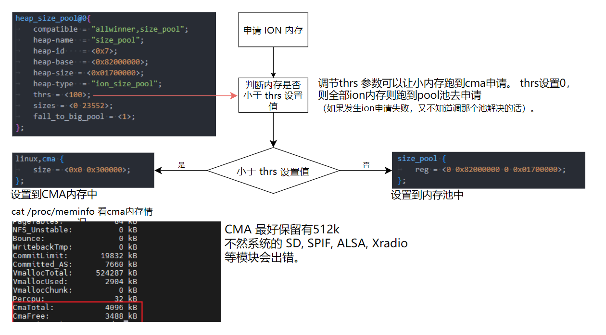

### 注意事项

-   小内存分配到CMA上，可以有效的防止 size\_pool 产生内存碎片。
-   以上介绍的保留内存配置，除了 size\_pool 和 cma 的内存池大小可以随方案更改，其他保留内存已规划好，请勿随意更改。否则很容易引起踩内存而导致数据异常或者CPU死机等情况。

## SPI NOR 介质布局

### SPI NOR 常电存储介质布局

SPI NOR 介质快启系统的存储布局，从**分割线①**分开来看，可以分两个区域

1.  分割线①左边（白色方格）：是 `boot0/uboot` 启动分区； 它的区域划分由 `uboot-board.dts` 和 `boot0`源码管理； 从用户层看它是 `/dev/mtd0`分区。是裸分区。
2.  分割线①右边（橙色方格）：是用户定义的分区；它的区域划分由 `sys_partition_nor.fex` 管理；如 `boot` 分区放内核镜像，`env` 分区放`env`镜像；从用户层看，他们是`/dev/mtd1`、`/dev/mtd2`

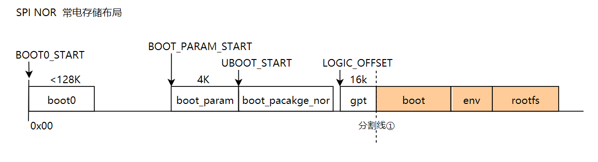

| **分区名称** | **描述** |
| --- | --- |
| **boot0** | 存储 `boot0` 镜像文件，由 SDK 编译生成，用于设备启动的初始阶段。 |
| **boot\_param** | 存储 `spinor` 和 `DDR` 优化参数。 |
| **boot\_package\_nor** | 存储 `opensbi` 镜像的分区，通常用于存放常电下的 `opensbi` 和 `uboot`。 |
| **gpt** | 存储分区表，NOR Flash 恒定大小为 16KB，包含分区信息用于设备管理。 |
| boot | 逻辑 boot 分区 |
| env | 逻辑 env 分区 |
| rootfs | 逻辑 rootfs 分区 |

### SPI NOR 存储介质布局配置

SPI NOR 存储介质布局由 `uboot-board.dts` 管理，这里以常电 PERF2 方案为例，讲解配置相关细节。

配置文件路径：

```
device/config/chips/v821/configs/perf2/uboot-board.dts
```

配置内容：

```c
nor_map {
    flash_size = <16384>;
    logic_offset = <608>; 
    secure_logic_offset = <2016>;
    rtos_logic_offset = <2016>;
    rtos_secure_logic_offset = <2016>;
    boot_param_start = <272>; 
    boot_param_size = <8>;
    uboot_start = <280>;
    uboot_size = <328>;
    boot0_start = <0>; 
    status = "okay";
};
```

这个配置片段定义了一个 **NOR Flash** 存储映射 (`nor_map`)，用于指定不同分区在Flash存储中的起始位置和大小。以下是每个参数的总结：

**配置项解释**：

| **配置项** | **描述** | **单位** | **值** |
| --- | --- | --- | --- |
| **flash\_size** | Flash 存储的总大小 | 扇区（512字节） | 16384 |
| **logic\_offset** | 逻辑分区表的起始地址 | 扇区（512字节） | 608 |
| **secure\_logic\_offset** | 安全启动方案的逻辑分区表起始地址 | 扇区（512字节） | 2016 |
| **rtos\_logic\_offset** | RTOS 方案的逻辑分区表起始地址（不适合v821方案） | 扇区（512字节） | 2016 |
| **rtos\_secure\_logic\_offset** | 安全启动的 RTOS 逻辑分区起始地址（不适合v821方案） | 扇区（512字节） | 2016 |
| **boot\_param\_start** | boot\_param 分区的起始偏移 | 扇区（512字节） | 272 |
| **boot\_param\_size** | boot\_param 分区的大小 | 扇区（512字节） | 8 |
| **uboot\_start** | uboot 分区的起始偏移 | 扇区（512字节） | 280 |
| **uboot\_size** | uboot 分区的大小 | 扇区（512字节） | 328 |
| **boot0\_start** | boot0 分区的起始偏移（固定从0开始） | 扇区（512字节） | 0 |
| **status** | 配置状态 | \- | "okay" |

-   所有偏移和大小的单位是 **扇区**，每个扇区为 **512 字节**。
-   各分区的起始地址和大小都需要按照设备的启动要求进行配置，确保各分区对齐并满足功能需求。
-   `status = "okay"` 表示该配置项有效，设备可以正常工作。

## 内核模块优化

在开发过程中，会发现 RISC-V 架构的 KO 文件较 ARM 架构 KO 文件大很多

1.  **重定位格式差异**：
    
    -   RISCV采用的是`RELA`重定位格式，而ARM则使用`REL`格式。`RELA`格式相较于`REL`格式，每个重定位项会多占用 4 字节的空间，因此 RISCV 的重定位信息占用的空间相对较大。
2.  **变量地址读取方式**：
    
    -   RISCV在变量地址的读取上采用了高低位配合的方式。这种方式在某些情况下可能导致重定位项的数量增加，相较于ARM32架构，RISCV可能会多出一些符号。由于这些符号需要在符号表中进行记录，从而使得RISCV的符号表也相应增大。
3.  **分支目标计算方式**：
    
    -   RISCV架构在链接阶段才会计算分支目标地址，这与ARM架构不同。这种延迟计算的方式导致RISCV在.o文件中生成大量的`.Lxxx`代码段，这些代码段包含了大量的符号和重定位项，进一步增加了 KO 文件的体积。

基于此，为了减小内核大小，Tina 在生成 rootfs 时对指定的模块进行预处理，从而优化系统性能和存储占用。优点如下：

1.  **显著减小内核模块的大小**：
    -   通过预处理，Tina 可以有效地减少内核模块的体积，平均可减小约50%的模块大小。这样一来，系统的存储资源得以节省，尤其在资源有限的嵌入式系统中尤为重要。
2.  **加快内核模块加载速度**：
    -   预处理后的模块加载更加高效，因为其体积较小，加载时需要的时间和内存也相应减少。这将提高系统的响应速度，尤其是在启动和模块动态加载时的性能表现。

:::danger

:::note

危险

:::
:::note

由于预处理，导致**内核模块与内核强依赖**。

预处理后的模块和内核具有很强的关联性。因此，在进行 OTA 升级时，必须确保内核和模块同步升级。如果内核版本更新而模块未同步更新，可能会导致模块无法正常加载或运行，从而引发系统不稳定或错误。例如下图：

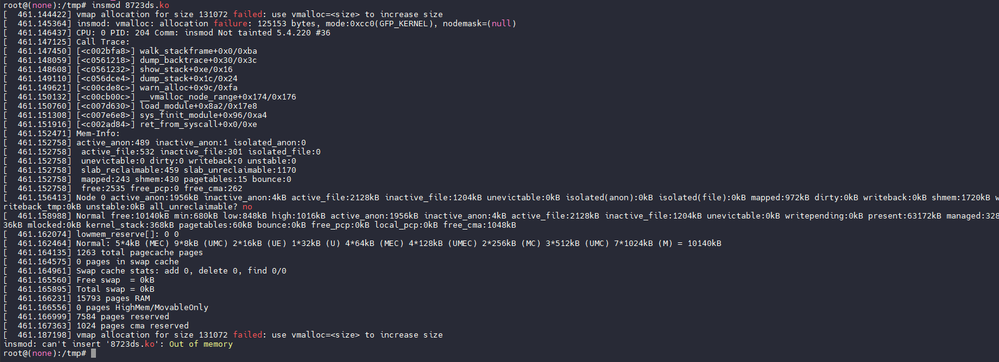

:::

:::

### 配置内核模块优化功能

这里以 perf2b 板级为例，演示配置内核模块优化功能，优化对象是 RTL8723D WIFI 驱动。

先记录下未优化前的驱动大小：

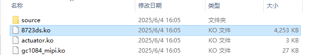

首先先将模块加入编译中，内核勾选驱动

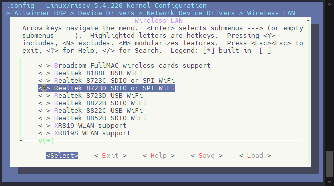

然后前往板级目录下修改 `openwrt/target/v821/v821-perf2b/modules.mk` 将模块加入编译

```makefile
define KernelPackage/wlan-rtl8723ds
  SUBMENU:=$(WIRELESS_MENU)
  TITLE:= rtl8723ds wlan support
  FILES+=$(LICHEE_OUT_DIR)/$(LICHEE_IC)/kernel/build/bsp/drivers/net/wireless/rtl8723ds/8723ds.ko
  AUTOLOAD:=$(call AutoProbe, 8723ds.ko)
endef

define KernelPackage/wlan-rtl8723ds/description
 Kernel modules for rtl8723ds wlan support
endef

$(eval $(call KernelPackage,wlan-rtl8723ds))
```

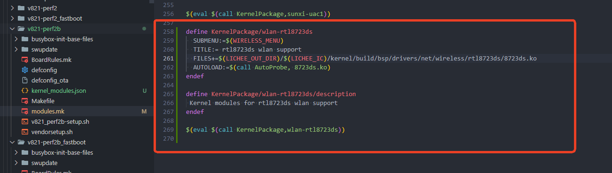

然后进 OpenWRT 勾选该模块

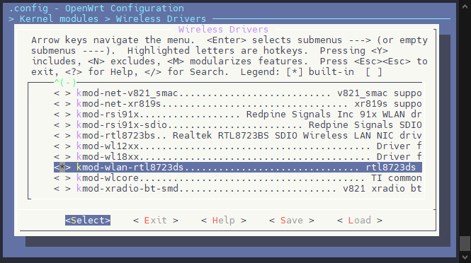

:::warning

:::note

注意

:::
:::note

仅有在 OpenWRT 中勾选了的模块才会进行裁剪。否则即使配置了也不会裁剪。

:::

:::

前往板级目录下 `openwrt/target/v821/v821-perf2b` 新建配置文件 `kernel_modules.json`

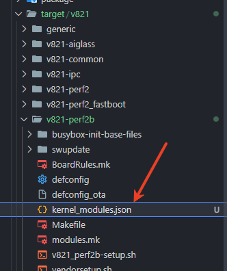

写入配置内容

```json
{
        "status" : "okay",
        "core" : {
                "base" : "0xd7800000",
                "size" : "128M",
                "core_space" : "240K",
                "init_space" : "16K"
        },
        "modules" : {
                "8723ds.ko" : 0
        }
}
```

如果有多个 ko，后面的 ID 依次递增即可

:::danger

:::note

不需要裁剪的 KO 一定不要加到列表中，裁剪什么加什么。

:::

:::

```json
{
        "status" : "okay",
        "core" : {
                "base" : "0xd7800000",
                "size" : "128M",
                "core_space" : "240K",
                "init_space" : "16K"
        },
        "modules" : {
                "8723ds.ko" : 0,
                "aic8800.ko" : 1
        }
}
```

:::note

:::note

备注

:::
:::note

注意 ID 不要超出分为地址范围。

计算方法：

$$\text{最大 ID} = \frac{\text{size}}{\text{core\_space} + \text{init\_space}} - 1$$

注：`size`，`core_space`，`init_space` 在配置文件里配置。

:::

:::

可以看到处理后的 KO 仅有 1.7M

```
8723ds.ko:  4303008(4303.01K) ->  1754548(1754.55K) -59%
```

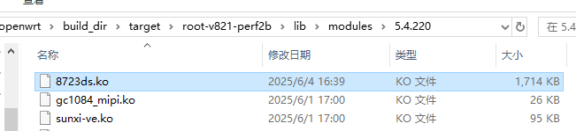

### 常见问题

**没发现 ko 变化大小**

1.  检查配置文件 `kernel_modules.json` 是否在板级目录下，例如 `lunch` 时选择的 `v821-perf2b-tina` 则前往文件夹 `openwrt/target/v821/v821-perf2b` 查看是否存在配置文件 `kernel_modules.json`。
2.  配置文件 `kernel_modules.json` 中是否包含不使用的 KO 文件，如果有不用的 KO 或者不需要裁剪的 KO，请不要加入裁剪列表。
3.  配置文件 `kernel_modules.json` 适配启用，检查 `kernel_modules.json` 中的 `"status" : "okay"` 是否配置正确。如果配置 `"status" : "disabled",` 则不会进行裁剪。

:::note

:::note

常见错误

:::
:::note

经常有开发者会复制其他方案的 `kernel_modules.json` 到这个方案，然后忘记修改 `"status" : "disabled",` 导致没有启用功能。请注意配置。

:::

:::

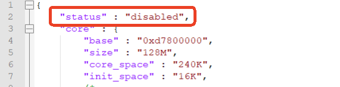

**安装模块时爆内存**

报错如下：

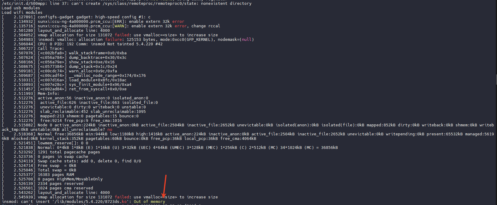

此时需要适当增加配置文件的 `size`，`core_space`，`init_space` 大小

```json
{
	"status" : "okay",
	"core" : {
		"base" : "0xd7800000",
		"size" : "512M",
		"core_space" : "4096K",
		"init_space" : "64K"
	},
	"modules" : {
		"8723ds.ko" : 0
	}
}
```

这样就可以安装模块了

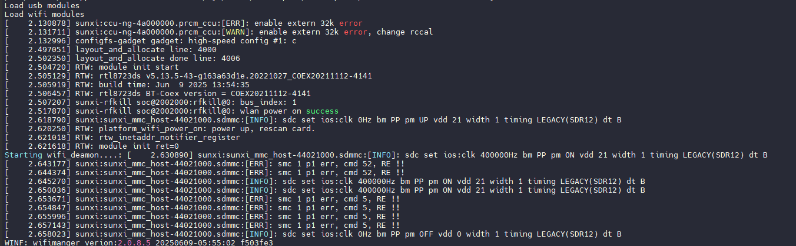
