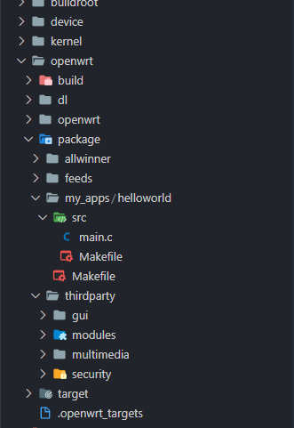
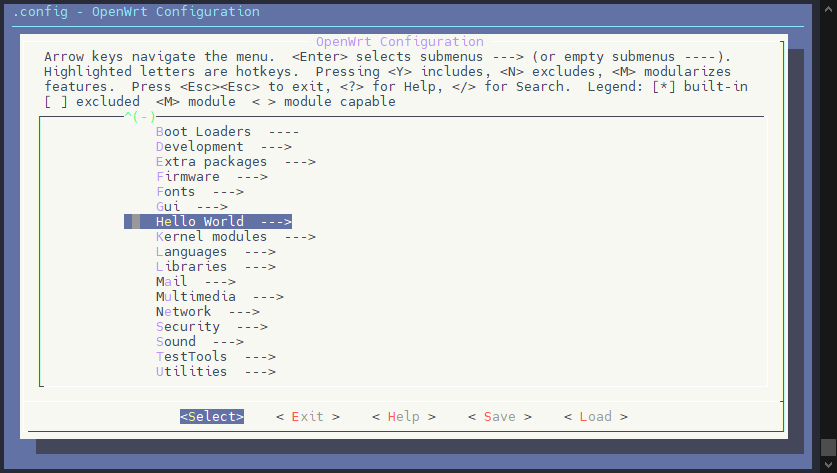
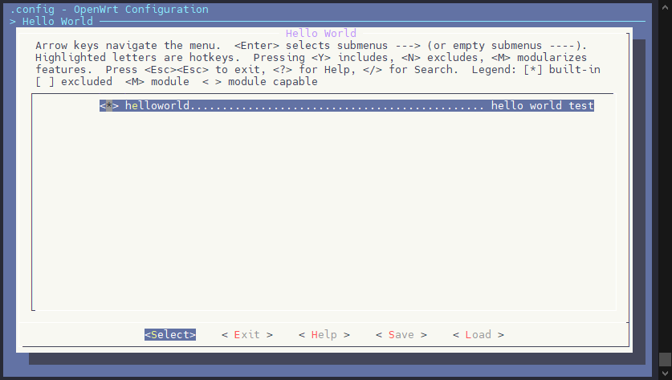
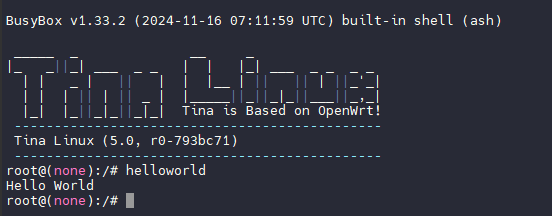
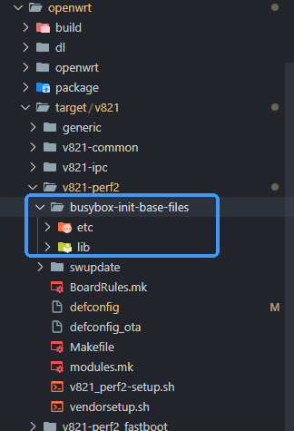
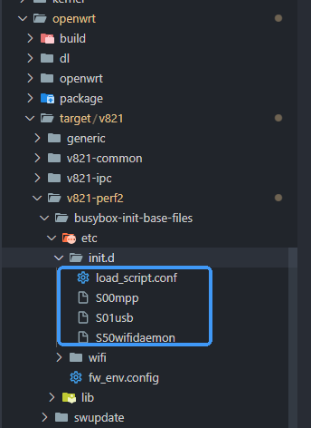
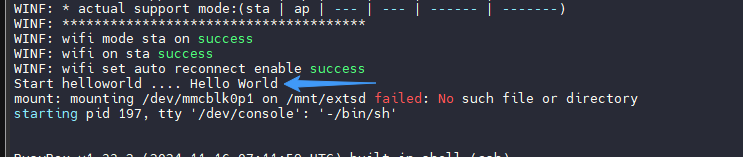

# 编写 Hello World

## Tina 增加 Package

在 Tina 里新增一个 Hello World 软件包，使用 Tina 编译 Hello World 并一同打包进入 Tina Linux。

这个方法不但适用于 Hello World 程序，同样也适用于所以希望将自己的软件包整合进入 Tina Linux 的情况。通过这个方法，可以很方便的管理多库编译链接，解决编译链接的难题，也可以提供Tina Linux 的底层调用库函数的接口，免去单独交叉编译的麻烦。

首先，在 Tina Linux SDK 的 `openwrt/package` 文件夹新建一个存放项目文件的 `helloworld` 文件夹，并准备 外层 `Makefile` 和 `src` 文件夹，在 `src` 文件夹里建立一个编译使用的 `Makefile`，把源码放到 `src` 文件夹里目录结构如下：



首先编写外层 `Makefile` 供 Tina Linux 检索查找。注意这个Makefile最后需要空行，否则会出现 `Makefile:30: *** missing separator. Stop.***` 错误

```makefile
include $(TOPDIR)/rules.mk
include $(INCLUDE_DIR)/package.mk

PKG_NAME:=helloworld
PKG_RELEASE:=1

PKG_BUILD_DIR := $(BUILD_DIR)/$(PKG_NAME)
SRC_CODE_DIR := ./src/

define Package/$(PKG_NAME)
	SECTION:=hello
	CATEGORY:=Hello World
	TITLE:=hello world test
endef

define Package/$(PKG_NAME)/description
	Hello World
endef

define Build/Prepare
	mkdir -p $(PKG_BUILD_DIR)
	$(CP) ./src/* $(PKG_BUILD_DIR)/
endef

define Package/helloworld/install
	$(INSTALL_DIR) $(1)/usr/bin
	$(INSTALL_BIN) $(PKG_BUILD_DIR)/helloworld $(1)/usr/bin/
endef

$(eval $(call BuildPackage,$(PKG_NAME)))
```

然后编写用于编译 `helloworld` 的 `Makefile`

```makefile
main: main.o
	$(CC) $(LDFLAGS) main.o -o helloworld

main.o: main.c
	$(CC) $(CFLAGS) -c main.c

clean:
	rm *.o helloworld
```

和 `main.c` 的 `helloworld` 源码

```c
#include <stdio.h>

int main(int argc, char const *argv[])
{
    printf("Hello World\n");
    return 0;
}
```

之后 `make menuconfig` 里就可以找到 `Hello World` 了



可以进入并勾选它



编译，打包，烧写开发板，就可以直接运行 `helloworld` 命令了



## 将文件打包进入 Tina Linux

Tina Linux 提供 `busybox-init-base-files` 作为 `rootfs` 的接口提供用户将文件打包进入固件的功能。`busybox-init-base-files` 内的文件在打包编译系统的时候会覆盖进入 `rootfs` 内。注意如果放入的是可执行程序，需要保证其依赖的lib也一同放入，否则依赖关系会检查不过。

对于`v821-perf2` 板级来说，文件夹的路径 `openwrt/target/v821/v821-perf2/busybox-init-base-files`



## 配置开机自启

开机自启可以说是嵌入式 Linux 投入应用中最主要的一环。这里以自启动 `helloworld` 介绍一下 Tina Linux 如何配置开机自启功能

对于`v821-perf2` 板级来说，开机自启动主要的配置位于 `openwrt/target/v821/v821-perf2/busybox-init-base-files/etc/init.d` 文件夹内。系统启动后会按顺序执行这里的脚本，可以通过编写这里的脚本实现开机自启功能。



编写一个 `S99helloworld` 的启动脚本，`S99` 代表他会等待之前的 `Sxx` 脚本执行完毕他才会执行，这里的排序是字符的顺序。然后赋予可执行权限`chmod 777 S99helloworld` ，否则系统启动会出现`rc.final: line 26: /etc/init.d/S99helloworld: Permission denied`

```bash
#!/bin/sh
#
# Start helloworld ....
#

start() {
      printf "Start helloworld .... "
      helloworld
}

stop() {
    printf "Stopping helloworld .... "
}

case "$1" in
    start)
    start
    ;;
    stop)
    stop
    ;;
    restart|reload)
    stop
    start
    ;;
  *)
    echo "Usage: $0 {start|stop|restart}"
    exit 1
esac

exit $?
```

编译、打包烧录，可以看到开机运行了 hellowrold


