# 双目常电 RTSP IPC 应用

本文将以 V821 PERF2 板为示例，搭配不同摄像头，演示搭建双目 Smart IPC 场景功能，包括：

| 项目 | 双目 1M 插值 2M 场景 | 双目 2M 场景 | 双目 2M 合并一路场景（上下拼接） |
| --- | --- | --- | --- |
| 摄像头 | GC1084 + GC1084 | GC2083 + GC2083 | GC2083 + GC2083 |
| 编码方式 | 在线编码 | 在线编码 | 在线编码 |
| 主码流 | H.264，1280x720@15fps | H.264，1920x1080@15fps | H.264，1920x2160@15fps |
| 子码流 | H.264，640x480@15fps | H.264，640x480@15fps | H.264，640x480@15fps |
| SD卡 | 录像 + 写卡 + 读卡 | 录像 + 写卡 + 读卡 | 录像 + 写卡 + 读卡 |
| WiFi RTSP 主码流图传 | √ | √ | √ |
| 抓拍（JPEG编码） | √ | √ | √ |
| 人形检测 + 主码流图传画框 | √ | √ | √ |
| 音频 | 录制+播放 | 录制+播放 | 录制+播放 |

## 硬件准备

### 双目 1M 硬件

V821 Perf2 板 + 双目 GC1084 实物图如下：

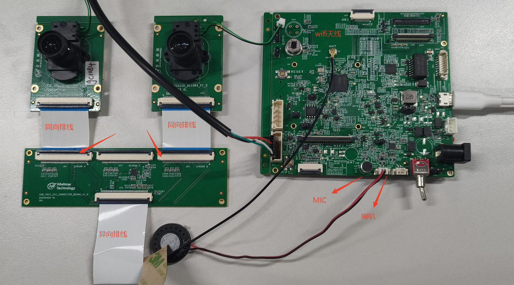

连接示意图如下：

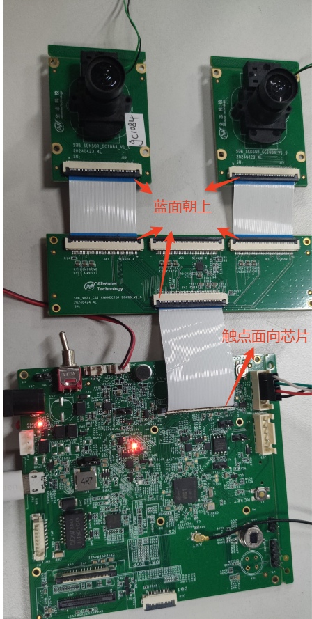

### 双目 2M 硬件

V821 PERF2 板 + 双目 GC2083 板子连接示意图同上节双目 GC1084 连接一样，需要注意的是双目 GC2083 的sensor0（sensor A） 和sensor1（sensor B） 位置是固定的，不能对换。

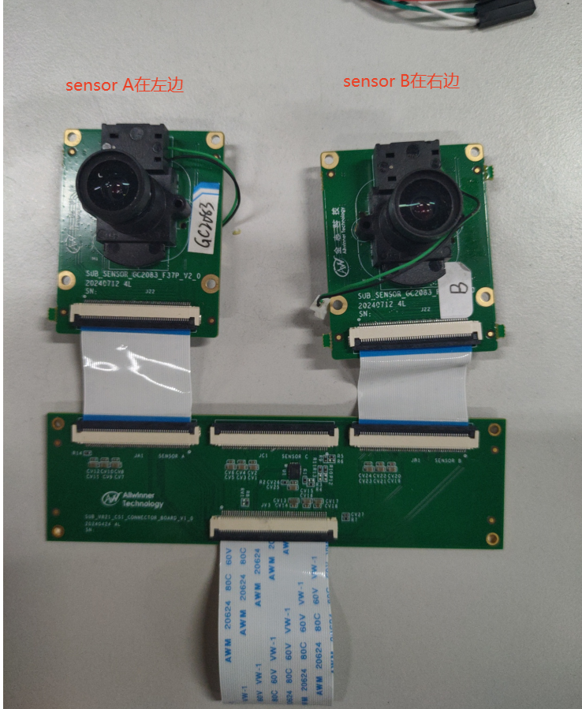

其中sensor0（sensor A） 和sensor1（sensor B）子板的差异如下：

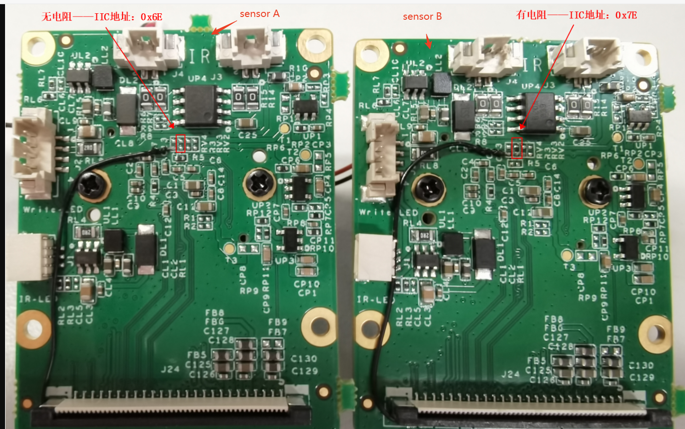

## 应用勾选

常电 IPC 场景使用的应用是 sample smartIPC\_demo，运行 `m menuconfig` 然后勾选如下选项

```
Allwinner  --->
	eyesee-mpp  --->
		[*]   select mpp sample
		[*]     mpp sample smartIPC_demo
```

编译后的可执行文件会存放在 `platform/allwinner/eyesee-mpp/middleware/sun300iw1/sample/bin` 文件夹中


将 Sample 复制到 TF 卡中，同时准备一个测试音频 `test.wav` 也放进 TF卡中。接入 V821 开发板使用。V821 在每次启动时都会尝试挂载 TF 卡到 `/mnt/extsd` 目录下。目前 SDK 未配置自动挂载功能。如果是启动后插入 TF 卡，需要手动挂载。

```
mount /dev/mmcblk0p1 /mnt/extsd
```

系统启动后可以用 `mount` 命令查看挂载情况


## 系统配置

（1）开启硬件人形缩放

由于场景需要音频+人形的全功能场景，需要配置SDK硬件人形缩放功能。使用 `quick_config` 选择选项de\_resize\_config，启用硬件人形缩放功能，quick\_config 序号请根据输出选择

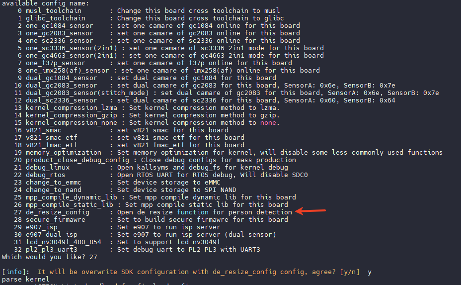

## 双目 1M 插值 2M 场景

### 选择双目 GC1084 摄像头

运行 `quick_config` 选择双目 GC1084 摄像头配置，运行即可

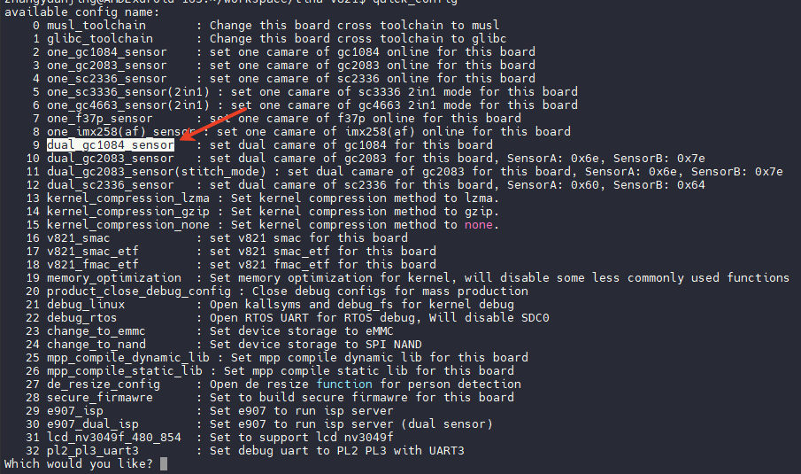

### 修改配置参数

在默认的 `sample_smartIPC_demo.conf` 基础上，修改如下参数：

```
region_link_enable = 0
region_link_tex_detect_enable = 0
region_link_motion_detect_enable = 0

audio_test_enable = 1
motionAlarm_on = 1

main_rtsp_id = 0
main_isp_algo_freq = 5
main_src_width = 1280
main_src_height = 720
main_src_frame_rate = 15
main_encode_width = 1920
main_encode_height = 1080
main_encode_frame_rate = 15
main_online_en = 1
main_online_share_buf_num = 1
main_2nd_enable = 1
main_2nd_src_width = 640
main_2nd_src_height = 480
main_2nd_src_frame_rate = 15
main_2nd_encode_width = 640
main_2nd_encode_height = 480
main_2nd_encode_frame_rate = 15
main_2nd_take_picture = 1
main_2nd_pdet_enable = 1

sub_enable = 1
sub_rtsp_id = 1
sub_isp_algo_freq = 5
sub_src_width = 1280
sub_src_height = 720
sub_src_frame_rate = 15
sub_encode_width = 1920
sub_encode_height = 1080
sub_encode_frame_rate = 15
sub_online_en = 1
sub_online_share_buf_num = 1
sub_2nd_enable = 1
sub_2nd_src_width = 640
sub_2nd_src_height = 480
sub_2nd_src_frame_rate = 15
sub_2nd_encode_width = 640
sub_2nd_encode_height = 480
sub_2nd_encode_frame_rate = 15
sub_2nd_take_picture = 1
```

### 连接网络

使用命令扫描 WIFI 网络

```
wifi -s
```

找到需要连接的 WIFI 网络后，使用命令连接

```
wifi -c <SSID> <PASSWORD>
```

连接成功后会显示 `wlan0: link becomes ready`


### 运行 Sample

执行命令

```
/mnt/extsd/sample_smartIPC_demo -path /mnt/extsd/sample_smartIPC_demo.conf
```

此时可以从喇叭中听到播放的音频，打开 VLC，输入开发板的地址，即可拉流查看，若出现人形则人形画框

-   通道 0 的 RTSP 地址

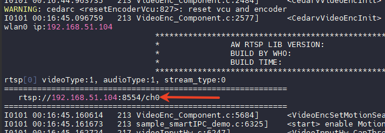

-   通道 1 的 RTSP 地址

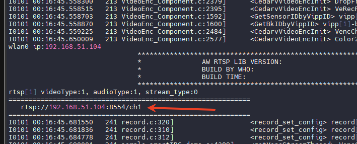

使用 VLC 即可打开查看码流（摄像头画面颜色不同是镜头差异）

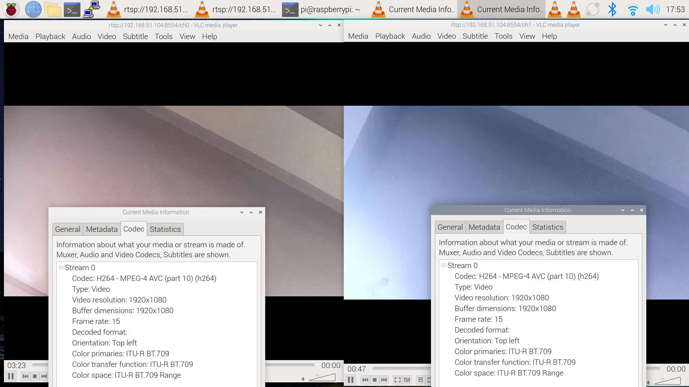

## 双目 2M 场景

### 选择双目 GC2083 摄像头

运行 `quick_config` 选择双目 GC2083 摄像头配置，运行即可

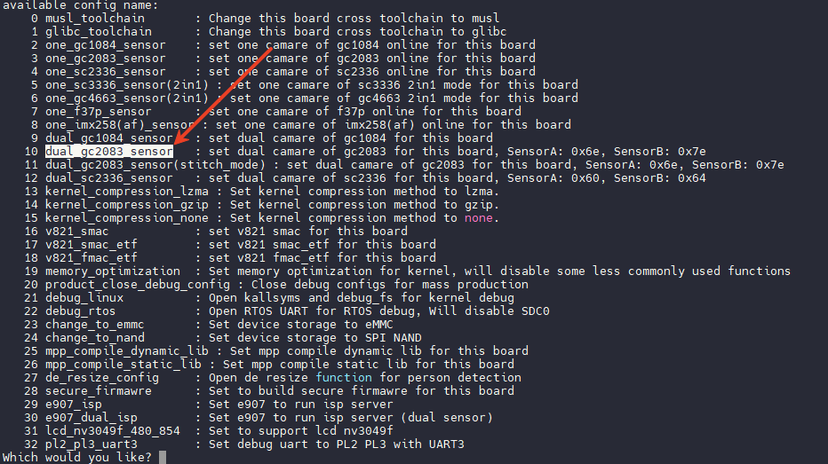

### 修改配置参数

在默认的 `sample_smartIPC_demo.conf` 基础上，修改如下参数，也可以运行 `sample_smartIPC_demo-dual-rtsp.conf` 配置：

```
region_link_enable = 0
region_link_tex_detect_enable = 0
region_link_motion_detect_enable = 0

audio_test_enable = 1
motionAlarm_on = 1

main_rtsp_id = 0
main_isp_algo_freq = 5
main_src_width = 1920
main_src_height = 1080
main_src_frame_rate = 15
main_encode_width = 1920
main_encode_height = 1080
main_encode_frame_rate = 15
main_online_en = 1
main_online_share_buf_num = 1
main_2nd_enable = 1
main_2nd_src_width = 640
main_2nd_src_height = 480
main_2nd_src_frame_rate = 15
main_2nd_encode_width = 640
main_2nd_encode_height = 480
main_2nd_encode_frame_rate = 15
main_2nd_take_picture = 1
main_2nd_pdet_enable = 1

sub_enable = 1
sub_rtsp_id = 1
sub_isp_algo_freq = 5
sub_src_width = 1920
sub_src_height = 1080
sub_src_frame_rate = 15
sub_encode_width = 1920
sub_encode_height = 1080
sub_encode_frame_rate = 15
sub_online_en = 1
sub_online_share_buf_num = 1
sub_2nd_enable = 1
sub_2nd_src_width = 640
sub_2nd_src_height = 480
sub_2nd_src_frame_rate = 15
sub_2nd_encode_width = 640
sub_2nd_encode_height = 480
sub_2nd_encode_frame_rate = 15
sub_2nd_take_picture = 1
```

### 连接网络

使用命令扫描 WIFI 网络

```
wifi -s
```

找到需要连接的 WIFI 网络后，使用命令连接

```
wifi -c <SSID> <PASSWORD>
```

连接成功后会显示 `wlan0: link becomes ready`


### 运行 Sample

执行命令

```
/mnt/extsd/sample_smartIPC_demo -path /mnt/extsd/sample_smartIPC_demo.conf
```

## 双目 2M 合并一路场景（上下拼接）

### 选择双目 GC2083 拼接摄像头

运行 `quick_config` 选择双目 GC2083 拼接摄像头配置，运行即可

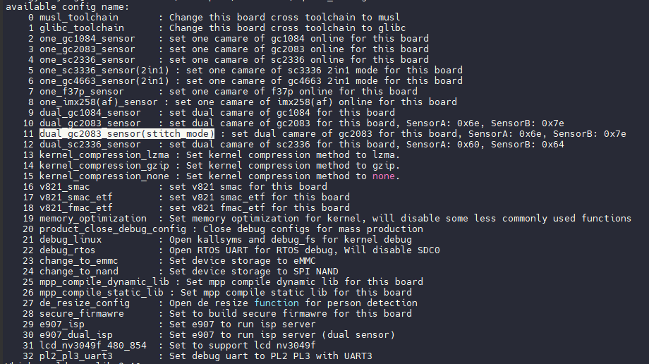

### 修改配置参数

在默认的 `sample_smartIPC_demo.conf` 基础上，修改如下参数：

```
region_link_enable = 0
region_link_tex_detect_enable = 0
region_link_motion_detect_enable = 0

audio_test_enable = 1
motionAlarm_on = 1

main_rtsp_id = 0
main_isp_algo_freq = 5
main_src_width = 1920
main_src_height = 1080
main_src_frame_rate = 15
main_encode_width = 1920
main_encode_height = 1080
main_encode_frame_rate = 15
main_online_en = 1
main_online_share_buf_num = 1
main_2nd_enable = 1
main_2nd_src_width = 640
main_2nd_src_height = 480
main_2nd_src_frame_rate = 15
main_2nd_encode_width = 640
main_2nd_encode_height = 480
main_2nd_encode_frame_rate = 15
main_2nd_take_picture = 1
main_2nd_pdet_enable = 1

sub_enable = 1
sub_rtsp_id = 1
sub_isp_algo_freq = 5
sub_src_width = 1920
sub_src_height = 1080
sub_src_frame_rate = 15
sub_encode_width = 1920
sub_encode_height = 1080
sub_encode_frame_rate = 15
sub_online_en = 1
sub_online_share_buf_num = 1
sub_2nd_enable = 1
sub_2nd_src_width = 640
sub_2nd_src_height = 480
sub_2nd_src_frame_rate = 15
sub_2nd_encode_width = 640
sub_2nd_encode_height = 480
sub_2nd_encode_frame_rate = 15
sub_2nd_take_picture = 1
```

### 连接网络

使用命令扫描 WIFI 网络

```
wifi -s
```

找到需要连接的 WIFI 网络后，使用命令连接

```
wifi -c <SSID> <PASSWORD>
```

连接成功后会显示 `wlan0: link becomes ready`


### 运行 Sample

执行命令

```
/mnt/extsd/sample_smartIPC_demo -path /mnt/extsd/sample_smartIPC_demo.conf
```

此时可以从喇叭中听到播放的音频，打开 VLC，输入开发板的地址，即可拉流查看，若出现人形则人形画框
