# 常电 RTSP IPC 应用

本文将以 V821 PERF2 板为示例，搭配不同摄像头，演示搭建 Smart IPC 场景功能，包括：

| 项目 | 1M 场景 | 1M 插值 2M 场景 | 2M 场景 | 4M 场景 |
| --- | --- | --- | --- | --- |
| 摄像头 | GC1084 | GC1084 | GC2083 | GC4663 |
| 编码方式 | 离线编码 | 离线编码 | 离线编码 | 离线编码 |
| 主码流 | H.264，1280x720@30fps | H.264，1280x720@30fps 插值 1920x1080@30fps | H.264，1920x1080@30fps | H.264，2560x1440@15fps |
| 子码流 | H.264，640x480@30fps | H.264，640x480@30fps | H.264，640x480@30fps | H.264，640x480@15fps |
| SD卡 | 录像 + 写卡 + 读卡 | 录像 + 写卡 + 读卡 | 录像 + 写卡 + 读卡 | 录像 + 写卡 + 读卡 |
| WiFi RTSP 主码流图传 | √ | √ | √ | √ |
| 抓拍（JPEG编码） | √ | √ | √ | √ |
| 人形检测 + 主码流图传画框 | √ | √ | √ | √ |
| 音频 | 录制+播放 | 录制+播放 | 录制+播放 | 录制+播放 |

## 应用勾选

常电 IPC 场景使用的应用是 sample smartIPC\_demo，运行 `m menuconfig` 然后勾选如下选项

```
Allwinner  --->
	eyesee-mpp  --->
		[*]   select mpp sample
		[*]     mpp sample smartIPC_demo
```

编译后的可执行文件会存放在 `platform/allwinner/eyesee-mpp/middleware/sun300iw1/sample/bin` 文件夹中

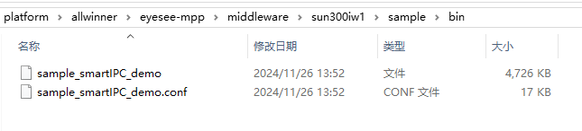

将 Sample 复制到 TF 卡中，同时准备一个测试音频 `test.wav` 也放进 TF卡中。接入 V821 开发板使用。V821 在每次启动时都会尝试挂载 TF 卡到 `/mnt/extsd` 目录下。目前 SDK 未配置自动挂载功能。如果是启动后插入 TF 卡，需要手动挂载。

```
mount /dev/mmcblk0p1 /mnt/extsd
```

系统启动后可以用 `mount` 命令查看挂载情况

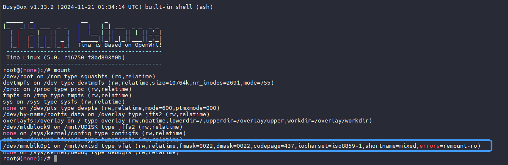

## 1M 单目场景

### 系统配置

（1）开启硬件人形缩放

由于场景需要音频+人形的全功能场景，需要配置SDK硬件人形缩放功能。使用 `quick_config` 选择选项 21，启用硬件人形缩放功能

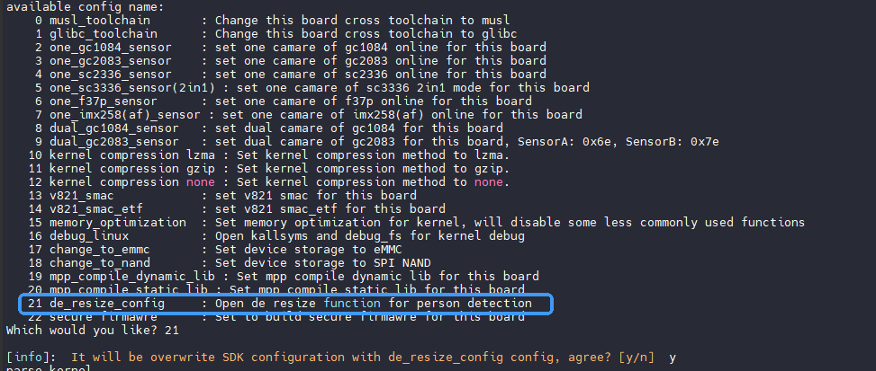

（2）增加音频CMA内存

然后编辑设备树，增加 CMA 内存预留空间给音频使用，单目场景也可以释放一些内存池的内存出来给到CMA，前往修改设备树

```
device/config/chips/v821/configs/perf2/linux-5.4-ansc/board.dts
```

修改如下，CMA增加预留内存，内存池配置从20M改为15M：

```c
reserved-memory {
	size_pool {
		reg = <0 0x82000000 0 0x00f00000>;
	};

	linux,cma {
		size = <0x0 0x600000>;
	};
};

heap_size_pool@0{
    compatible = "allwinner,size_pool";
    heap-name  = "size_pool";
    heap-id    = <0x7>;
    heap-base  = <0x82000000>;
    heap-size  = <0x0f00000>;
    heap-type  = "ion_size_pool";
    thrs = <512>;
    sizes = <0 15360>;
    fall_to_big_pool = <1>;
};
```

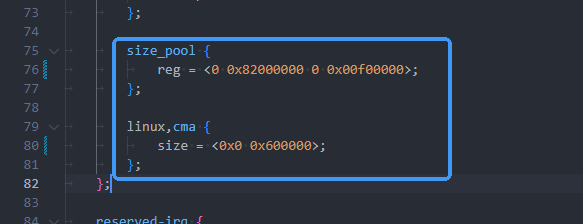

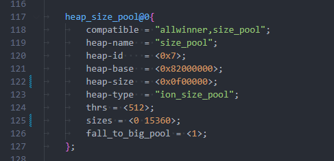

### 场景搭建

准备如下材料

-   V821 PERF2 开发板
-   GC1084 摄像头
-   排线（用于连接摄像头）
-   TF 卡（用于存放应用）
-   串口线（用于调试）
-   USB线（用于下载烧录）
-   路由器（提供网络连接）
-   天线（联网）
-   平板 / PC / 手机（用于查看码流）

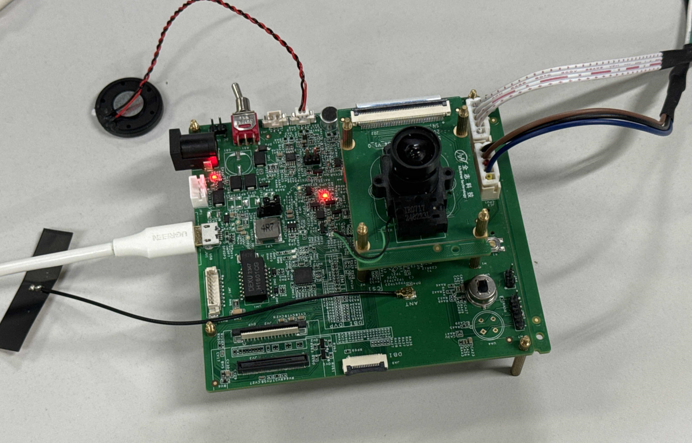

### 修改配置文件

在运行前需要修改配置文件，开启相关配置，完整配置文件可以在本文附录查看。

（1）配置Wi-Fi 进行 RTSP 推流，配置音频测试。修改项如下

```
rtsp_net_type = 3
audio_test_enable = 1
```

（2）配置主码流为离线编码，分辨率`1280x720` 帧率 `30fps`，`rtsp id` 为 0，码率为 1M，保存码流到 `/mnt/extsd/mainStream` 文件，单个文件时长 `2` 分钟，滚动保存 10 份码流。修改项如下

```
main_rtsp_id = 0
main_src_frame_rate = 30
main_encode_frame_rate = 30
main_online_en = 0
main_save_one_file_duration = 120
```

（3）配置子码流为离线编码，分辨率 `640x480` 帧率 `30fps`，码率为 256K，配置10s 抓拍一次，启用人形检测，每 500ms 检测一次

```
main_2nd_enable = 1
main_2nd_src_frame_rate = 30
main_2nd_encode_frame_rate = 30
main_2nd_online_en = 0
main_2nd_take_picture = 1
main_2nd_pdet_enable = 1
main_2nd_pdet_run_interval = 15
```

### 连接网络

使用命令扫描 WIFI 网络

```
wifi -s
```

找到需要连接的 WIFI 网络后，使用命令连接

```
wifi -c <SSID> <PASSWORD>
```

连接成功后会显示 `wlan0: link becomes ready`

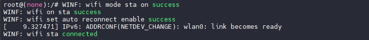

### 运行 Sample

执行命令

```
/mnt/extsd/sample_smartIPC_demo -path /mnt/extsd/sample_smartIPC_demo.conf
```

此时可以从喇叭中听到播放的音频，在手机上打开 VLC，输入开发板的地址，即可拉流查看，若出现人形则人形画框

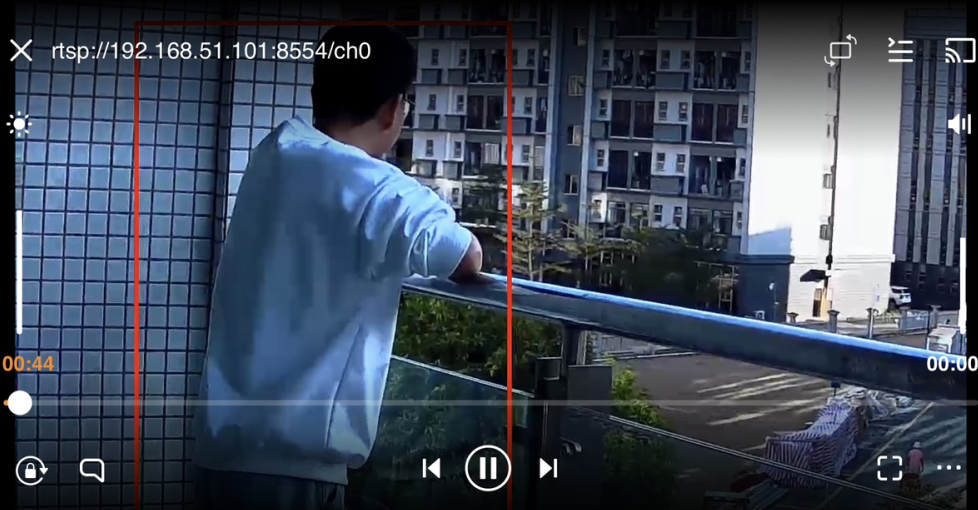

## 1M 插值 2M 场景

在 1M 单目场景的 `sample_smartIPC_demo.conf` 基础上，修改如下参数：

```
audio_test_enable = 1
motionAlarm_on = 1
main_rtsp_id = 0
main_src_width = 1280
main_src_height = 720
main_src_frame_rate = 30
main_encode_width = 1920
main_encode_height = 1080
main_encode_frame_rate = 30

main_2nd_enable = 1
main_2nd_src_width = 640
main_2nd_src_height = 480
main_2nd_src_frame_rate = 30
main_2nd_encode_width = 640
main_2nd_encode_height = 480
main_2nd_encode_frame_rate = 30
main_2nd_take_picture = 1
main_2nd_pdet_enable = 1
```

### 运行 Sample

执行命令

```
/mnt/extsd/sample_smartIPC_demo -path /mnt/extsd/sample_smartIPC_demo.conf
```

## 2M 单目场景

### 切换摄像头到GC2083

在测试 720P 摄像头正常后，可以切换摄像头到 GC2083 测试 1080P 的常电 IPC 功能

（1）在 SDK 中运行 `quick_config` 设置摄像头为 GC2083，选择配置 3 即可

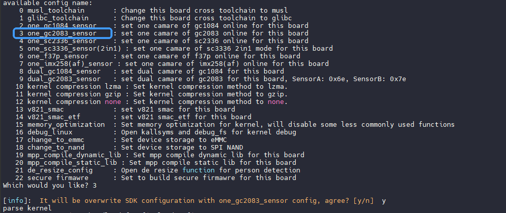

（2）配置分辨率为 `1920x1080`，帧率为15fps，码率改为 2M 码率，同时子码流也需要修改帧率到30fps

```
main_src_width = 1920
main_src_height = 1080
main_src_frame_rate = 30
main_encode_width = 1920
main_encode_height = 1080
main_encode_frame_rate = 30
main_encode_bitrate = 2097152

main_2nd_src_frame_rate = 30
main_2nd_encode_frame_rate = 30
```

（3）然后编辑设备树，增加 CMA 内存预留空间给音频使用，单目场景也可以释放一些内存池的内存出来给到CMA，前往修改设备树

```
device/config/chips/v821/configs/perf2/linux-5.4-ansc/board.dts
```

修改如下，CMA增加预留内存，内存池配置从20M改为16M：

```c
reserved-memory {
    size_pool {
        reg = <0 0x82000000 0 0x01000000>;
    };

    
	linux,cma {
		size = <0x0 0x800000>;
	};
};

heap_size_pool@0{
    compatible = "allwinner,size_pool";
    heap-name  = "size_pool";
    heap-id    = <0x7>;
    heap-base  = <0x82000000>;
    heap-size  = <0x01000000>;
    heap-type  = "ion_size_pool";
    thrs = <512>;
    sizes = <0 16384>;
    fall_to_big_pool = <1>;
};
```

### 运行 Sample

执行命令

```
/mnt/extsd/sample_smartIPC_demo -path /mnt/extsd/sample_smartIPC_demo.conf
```

此时可以从喇叭中听到播放的音频，在手机上打开 VLC，输入开发板的地址，即可拉流查看，若出现人形则人形画框

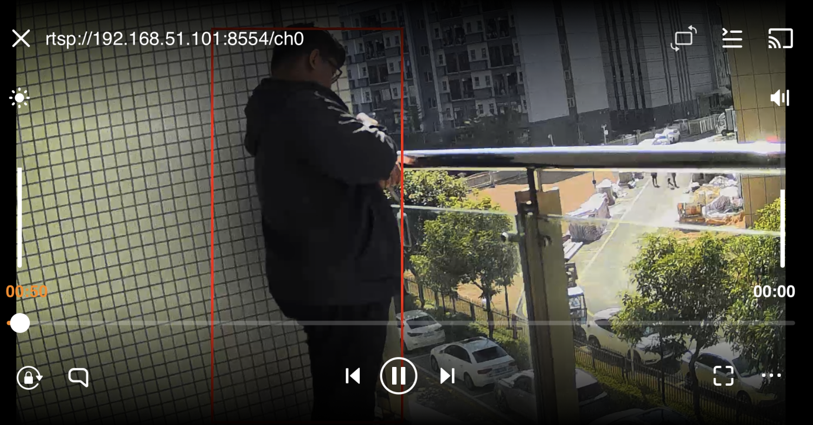

## 4M 单目场景

### 切换摄像头到GC4663

在测试 720P 摄像头正常后，可以切换摄像头到 GC4663 测试 1440P 的常电 IPC 功能

（1）在 SDK 中运行 `quick_config` 设置摄像头为 GC4663 ，选择配置 6 即可

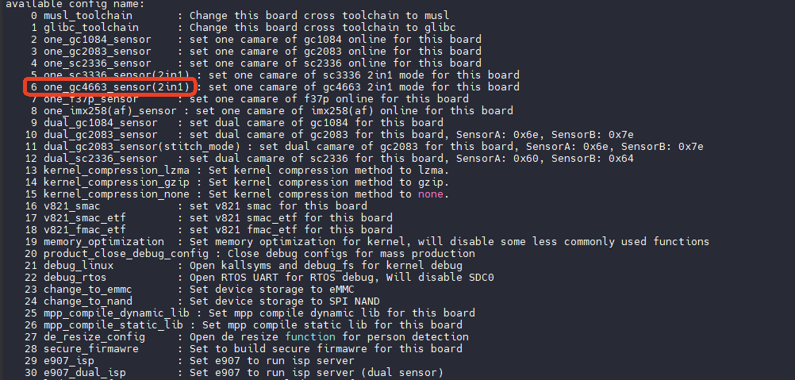

（2）在 SDK 中运行 `quick_config` 执行内存优化功能，选择配置 19 即可

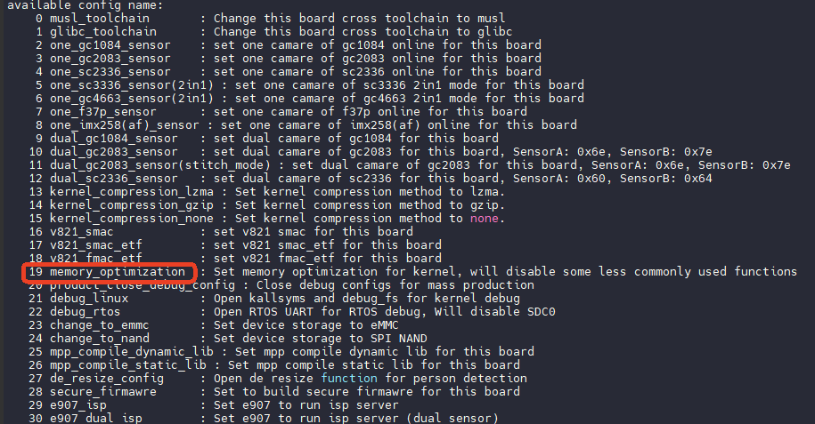

内存优化后请根据提示操作，重新配置环境变量

![image-20250106142704507](data:image/png;base64,iVBORw0KGgoAAAANSUhEUgAAAqYAAACKCAYAAAB4ioj7AAAfE0lEQVR4nO3dP3Krut8G8Oe+82vCUEEKGjqIW3XMZLyAOGvwGrKSU2UNXsOxF5DJDB2tAx0NRaBiyO3uW/An2MYgDI6x83yqc0wQXwkJZEngf+7v7//78+cPXl9fUZf9+z8QEREREf2U/7t0AEREREREADumRERERDQR7JgSERER0SSwY0pEREREk8AnnOi2qBqU6j8JsvSCsTSZenxEREQXxI4p3RAbs7mDuyjGFwCkAcLAR3bpsCoaTMspOqY67owY4WaN+MJRERERTQU7pnRjYoTeGTt7xgKPAtie1KFMEHrr4t82Zk/WuLERERFdOa4xJSIiIqJJ4Igp/Q6qAzHXEHqAKex8Oj31sfXWiKt1nhpM8QzT0AAAWbTGh1csBVAdiLlTrQ+dPdn5P6I13j2/2l8Xz5g17U9ERESdpDumirWEsLTGbbH3ilDldm4/3/Zt1LipJxumscbHZo0MGnSxxMwKqo6lLpYwsYa38ZGpNkyxwIMVwwsSIHXhbdzWqXxdLDEr94cGc7783n8gtj9uv/72R0TU7R/+JCndjnzd5mfT+k/VgZjbiN9WCMsRUmOBRyuB9+Yig43Zk4Ps6PbaZ40dU8n9ZWIlIiL6pdj7pF8kPv56JlXDHWJ8nvr6JlXDHTTo8xeY9c9T98QEiYiIfh9O5XP7VWw/+1RimuALNhQVtTWnfff3z/b6J7Y/br/p9kdEVOBUPt2Qrql8bbfjuDfVrouXfI2o973GVI9Wu2tEm5YEFHb2B6AYDkw1wTbwcYhT+URERPvY+yQqxN4KoXiGeFoAKJ6q339wKXURRjZm5ZR97an82Fthu7O/i7CxU0pERERN2DGl3yF14W32PovWeN+ZokwQeiuEHUnF3grvjVuSlm1ERETUhR1TujH29ztGU/fIE/GXYmP2tIBe/d/H5wWjISIimhp2TOmG+Nhupjx1PvX4iIiILos/SUpEREREk8AR00YadAP4ipITp4GH7j/UpY9/41QHM+FAVyG9XGD3dU9+4y9HERER/XbsmDZRbZgif7XQSR27ofsPdenj3zjdcnAXrfDe46dGs2CF9wDVa6uIiIjoUL+OqWoXI0XFjTX1sfXW/V5I3vJb4z9C5vhNT3D3MXT/Nj8RP7XQoKj5aDQRERGNq0fH1MZsvgC8Fd7Lm7Jqw7QcfHlTevKZiIiIiK6RfMdU1XAHH2F9pCj1EXr1P9Kgi2fMjHxENYvW+Ch+BSefwnSgFH9ZvdKn9oLybhpM8QzzaPoa4gDQLRvKScevv85nbx1g8Ys/XxGgG0Ac+LizHCjwEb6ti18Batn/4FVBAJAgrP+CUNHR/86fi4+y0z80fsnyCz3AFHn59R0RV4wFHsp9kSD2/mJbfYnp/uWlw/pTy/9J22v564qvc7sGc76EqRb/FS94BL7XmErlj4iIiNrId0zTBF9wYM4BJXARNzxYo4tl/pOMGx9ZcSN/sOL8Jx1TF97GHTSVr4slzDL94icjq/QBADZMdQ1vsz7cLnX88nU++c9FNsmCFcI0f5Blu3kFxAtMw0UYJB37774qSLGWEIa/0+nTDQuI/uLdS5B3IpcQIsk7niPEL1V+xhofmzUyaPn5tALJLw42TKEj9l7hRUDeSbShR670edbFEjPVxfbNRZzmP+mpG0AW9dh+rP51xte1PUH49oqwSFcJ+PvhREREY+vxuigf27c1vqDnHaanFzzO6yOANu6NBGFQjlDl/1YMuxrlG2Yv/dRvSL9r+1AxshTI0rjoqJ/IWEBYMbZ7I2lxsK6NSCcIIx9QtR8tv7h2/uLex9egqzYUtdjfk++UVvF5btVZzyIXYdRze2v964pvSPxEREQ0VL+Hn1If27dy9Cwf0ZuJYkRN1XAHDXr5G+LVPu44kaoa7hDjs3VaOe84TprqQAgd4dvqsNNjOBCWU3SMCldTfj62bxpmwsGDtYCCBHHwF1vZJ9e74pPa3lb/uuIbGD8RERENNuB1UfmInmnlI2pZmuAL/u4auzGlCb6Qj2YdX/Ood2y/NBuzuYMv7/V7XWl9m3Dw5a3glaOmxgKPzSsK+pMqv6HHyKfZgXy9phAO9ECyPnTFJ7W9o/51xTckfiIiIhpMfipfdTATdm00T4Np2EBarjX18RnZ+d8Uf6EYDmaWvZtOmiArOpD9+PiMNJjFg035g0I2ssjfefilfXuf458SY9v+Gsz5Anq0blmbmCBD/Y0H9uGfnBy/TPkNoObn+ui0f9GxNMuXzB/kr4ivfHE98vpjGn22t9S/rvi6tnfpzN/u390bh5tyNmbzFzyKMZegEBERXYceDz+5CKMFHsSi6vBkkQuv9mBM7K2wFc8QT4tqexj4DenkN18T6PVUfuytEO6kv8bHzlSrjzC18PC0+H4qf38qVur4PraeBVH8TRasigdiZDXtb+cdKnWBxyL+3afyfYSBhQdRxJX62EY+sN+BOTX+IJEovwFSFyEWVdkjzd9W8D3aWMQklvkocEP+yvozmztFfC4+vP7bG+tfV3yd8Xfpzt/u3+VP9ZfnZocKAHwJPxER/T7/3N/f//fnzx+8vr7ubMj+vbIfhWp6XQ/RVdIAcG0rERH9Pj2eyiein8FOKRER/U7smBIRERHRJFzZfH0L/j48ERER0VXjiCkRERERTQI7pkREREQ0CeyYEhEREdEksGNKRERERJPAjikRERERTQI7pkREREQ0CeyYEhEREdEksGNKRERERJPAjikRERERTQI7pkREREQ0CeyYEhEREdEksGNKRERERJPAjikRERERTQI7pkREREQ0CeyYEhEREdEk/G+shBRrCWFpxf98bDdrxGMlTrdPdSDmGsJR6o0G3QC+ogRZ8clJ9dNY4NFK4L25VTp0JqOef7puh+2XrhzbN/Uw2ohpFqzwvnnFO2/idGmqDVM4uKt9xPpJdCUa2i8R/R7yI6bGAo/Crn2QIAtceIE/flT0KyjWEkJ18e6NXIdSF95m3CSbnC3+czIWeBS43RmNqedv6vFNwQ+134u49Pm/9PGJJPScyq9Ngao2ZvMFBGJ4QXKO2C5Mg6ICSK91Omnq8dswLQ3xNXXqdowfv6ICWbr3oaoB6S22L/ptxq3fU7++EdGpTl9jmvoIAwdC1QHIXlg06OIZMyNf65dFa3x4/veFRbVhWg7MaruLD+976lUxFngQNhQAQILY+4ttlMin38nG7MlCFujQLQApoKhx7dvlsPRl4jfFcy3/tfSb1ugcrIHsG/9u+Q4vvx4MC3rqwot2P1asBUwrL6PT8r+ADuC0dc75ly1dBYAEYdCyd2P8LeVXxu8BZlkHUh9bb404zbc/7OdvL8+D6r/qQMydYl9g9lTMfkTrfMS3q3yL7XEA6E3nR0J3/PkxRVP5dOnKX1E+R9vXKPEPKH+p/LXUn9bjazDnSyjBK7YH7a3PqP9563d3++2+vnVeP1viE3MbXxGgG0Ac+LizHCjwEb6tEabD8z/o/OP62z/Qcn0vzj28eh1tqrdFHUldrv2/YaM9/CRDF0vMsIa3+b5YPljfI666YQHRX7x7CfKLzBJCJEXDtWEKHbH3WnQGNOjChh65VUPqSl+ODV1d42NTNmit2jIsfbn4zTJ91YYpFuPHr7rYvrmIU0AxHOgGkEVj5K8PDaZlIw5e9y4sNkx1DW+zPjH/PrabvK7MnqzeUeliAT1dw3v7Ln/AlY6/u/xsmMYaH5s1Mmj531tBXr9TH3G6xL2xRlycD8WwoVT1Y2D9T114G3fgVN6Q89Mdf2v5dJHI37D2NZHybymftuNnKaCrGvYHEe5UDVkqF8l56zcg137br2/t57e7fmXBCmGaPyi53bwC4gWm4SIMkoH5H3r+J1L/Bl2f2/YvBroMG4iK82E4MFX/4MsU3b7TH35S86lM2YsaYOPeSBAG5Tek/N+KYVff4uJgjbD6BpggjHxA1artgAZdtfMpHCSIvd2bWlf6chLEQe1bYPp90Rmefo/4U/888XtuNcKSRS7C2jfRccpPguHARP3Y37EPz/+pmsu/UWP8MuVXPzcJ4p36nSCOEuiGXaVnWlr+N5WfqP9thp6ftviLz46Wz1BjtK/Ll//x8mk/fhz5UNR8LFIXL8UbKjQoal7vuv1E/e5bBjh+fW48v131K0aWIr+npQm+Rs3/GC5f/4a1n/b9s8hHZljFiDnyuhIFe9cIH1s+xHrzeo6Y2t9TAEiQBWv5b0uqhjto0OcvMOufp7URKcOBsJyi4e1v97F90zATDh6sBRQkiIO/2JbHl0l/CKn061NRRczVN1OZ+GN8ykxbnhx/S/rnLr/KsdFSoLwxXIR0+R+JX6r82vOXBS7ip3yUIFT3lwpcuP5LxN+uI/7B6XcY3L4mXv5dx0+T6qZ/ryaAakOJAF2Ni2nqDmev3wNJnd8B9WuE/A8z8fo3xv7FqLppuYgDPe9ov13rMwg0xOkPP/WVJviC3/IeMxsz4eDLW8Erv8EbCzzWZ3TSfBoayNfbCOFAD4r0OtMfSCr9cirqWBpd8effhqXW1PXVlf65y6/UOj2jny//XWTL/1j8o5Sfj89oAdPQkKk2smi12/m9ZP0HMPj8tMV/bmO0r4uXf1tsHccv828Bd9FfhOozdCOGcjAidWL6Ujrq9xA/cv284PkFJlD/hl6fu/bPR1RNy4aSatBT/8iXJg0K+NDbLRv/l5+KC8S9sb/Bx2dkYya+h+4Vw8HM2nsFVbkGSrVh1rep+d8enzaQSX+IgelLxa9VC8PL/GdROfWRl6tZviR+v3yk4tdgCqd4uCeP3zTq28coPxuz+QseRXNedcPOR04a9x0z//ruyHuptX4eHl8+/nHKL458KIaDe2NvinWs+p8myJrKRqp8W85P5cj574x/JMfy19W+upy7/AfrOn6ef93QEUcJ4iiGbug9lmKduX4f6FtGA8+vVPojXB9PPf9X0/7bSOwfBYhVB0IcS9vG7GkJsTMzSbfmDA8/+dh6FoR4wSPyxeTldH/srbAVzxBPCwDFGsdqHZ+PMLDwIIqpiNTHNvKBsgORugixwMPTonriMXzb/XbYnv5wg9KXjD/cSX+Nj2qqsyzXZT6KvF8+PeKfzZ0q/g9vpPzVqQCgNXzuwDR8hJtjNyQfYWpVZZRF9aUiffJf/G0xrVWvg131M5wvi/zn39530u+If5TyiwLEIn/qdGe0YKz6n7oIo7zzaAK1p4Jlyvfw/Hw0LeVpOv8S8Y/iaP662pdEumct/+G6jv+VJlCMcuo+n87/6vGqprPW7x1t7bc9vpPPr4RR8n/q+b+m9n9U2/X9+28+owV0w0fYmHaMLE1wl0qO9NNV+uf+/v6/P3/+4PX1dWdD9u+PPrBPN+Xw6V8gf+jCTOVuMlN07fEP0usnBZvPPxFdqR/8SdGr/OESGtX4U/lETZ2ScrTxWjt11x7/j2IZEdEpTn1bA90SDovSz7j2nxm89viJiCZMFy+YGcUUP99d+quxY0pE3dgxJ/q9fqD9x94r3s97CLoSnMonIiIioklgx5SIiIiIJoEdUyIiIiKaBHZMiYiIiGgS2DElIiIioklgx5SIiIiIJoEdUyIiIiKaBHZMiYiIiGgS2DElIiIioklgx5SIiIiIJoEdUyIiIiKaBHZMiYiIiGgS2DElIiIioklgx5SIiIiIJoEdUyIiIiKahP9dOoCroToQcw3hZo14cGIadAP4ihJkxSeKtYSwtOJ/PrYyxzEWeLQSeG9ulQ6dyajn/4eMWD9Oqp9jusbyJyKi3nqOmGrQRf0GRSdRbZjCwV3toyxY4X3zind2Mq/YtbeP4/FfR/289vInIqKeHdMEsfcXofqMmXGegH6F1IX3AyM/irXEo7DPfJSRGQs8Pi2gXzqOk1x7+2D8RER0WSdM5SeIvdUEptM0KCqANJnwCM4l2TAtDbHnj5aiogJZuvehqgFpMtoxrt9U2sepGD8REV3OqGtMFWOBB2FDAVCOXmyjeqdFgymeYRr5VFsWrfHh+XnHsmkN2cEaORuzJwtZoEO3AKSAosa19W4adPGMWZW+iw+vPvW4v712fNk8WguYVp7H0+IvRwNPWadnYzZfQFcBIEEYtOxtWNBTF15U/7Al/2X8HmCW5zD1sfXWiNN8+8N+/vbyLHP+24/vFPsCs6dipDda493zu8u32B4HgN50fiR0x58fUzSVzxhUG6bl1NpHrf52nR8AverH2CTPT3v8Xe0X5y1/IiK6uBE7pjZMoSP2XovOkAZd2NAjt7pR6WIJE2t4Gx+ZasMUCzxYMbygz4ibDV1d42NTdmi+15PpYomZ6mL75iJOAcVwoBtAFtW2l8eHBnO+7Hl8G6a6hrdZnxi/j+3GR9nB7ksXC+jpGt7bd/kBbsNfajAtG3HwunNT786/DdNY42OzRlas15tZQd4xTH3E6RL3xhpxUZ6KYUOpzq/c+T96/NSFt3HzzozAiQ/XDDk/3fG3ls8IdMMCor949xLkX+KWECKppd9+fPn6cSld8be333OXPxERXd7Ir4vSoKt2PsWOBLG3e1O/NxKEQdGhTH2EgZ93bnodI0Ec1EbB0u9O1b2RIPTcagQli1yEtZvazvGRnHD8MeI/VXP5NTIcmKjnvWH/xvzXyzZBHPmAqn2PIEYJdMOu0jMtLf+bSo/zf1L5dxl6ftriLz47Wj7DxcEaYTVCmyA8SL/t+D3qx8VIxH+0/XbtT0REt2DEEVMf2zcNM+HgwVpAQYI4+IttOVqlarhDjM9zTbt1pa9quIMGff4Cs/552mdEKT5cY/lTpMuvebRULv/t+csCF/GTA1P1Ear7SwVkzv/Q8u8y5Px0xD84fQmGA2E5Rce4IHt+zt2+RjE0/gu2PyIi+hHjvsc0zafhgHy9nhAO9KCYkk0TfCEfjTrLmrCu9NMEX/AHvgdRP1/8XWTLz8g7jtto7/NR8u/jM1rANDRkqo0sWu12fjvP/9Djdxl4ftriPzsbM+Hgy1vBK0dNjQUeZVd8nLt9ndu1x09ERKMYbypfdTCz2qZNfXxGWvXgUP6gh40sKqce8xuTWb6DsNgur0hfOMXDH/kaNdOob7cxE98xKkYes7wx49d3R8ZKRTr3B6+7aS6/g1QNOx/ZPNgyRv6BOPKhGA7ujXxqvyJ1/iWOnybImspGqnxbzk/Fxmz+gkexF2tn/D8hQYZyhPnE+t9RPwY7Vj/P3n6JiOg3GG/ENHURYoGHp0X1xGz4tjvaFHsrhOIZ4mkBoHhqupoq9bH1LAixzEeJUh/byAd63Jhib4WteMZs7hTpu/jwDrd/H9/tuQ7PR5haVR6zaF17sKZP/MXfFtPaWbBqSOcFj3vbYm+FcL4s4s/XE+6krzowDR/hpvlhn+H5BxAFiMUCeuoirI9sSZ7/zuOnLsIo7zyawPdT+VLle3h+PpoefFIBYO8l7BLxn5ePMLDwIIp8n1j/W+vHSHE218/zt18iIrp9/9zf3//3588fvL6+7mzI/uWvlV4bXbzATFc933JwI3r9ZKUG4BeWERER0cSN/FQ+XUw5WvobO6W9sYyIiIimiMOityJ14W0uHQQRERHR6dgxpdvAjjkREdHV41Q+EREREU0CO6ZERERENAnsmBIRERHRJLBjSkRERESTwI4pEREREU0CO6ZERERENAnsmBIRERHRJLBjSkRERESTwI4pEREREU0CO6ZERERENAnsmBIRERHRJLBjSkRERESTwI4pEREREU0CO6ZERERENAnsmBIRERHRJPzv0gE006AbwFeUILt0KI064lMdzIQDXQWQuvDe3Inmo0Z1IOY24rcVwrT/7oq1hLC04n8+tps14h7bfyVjgUcrOb1+9NlfdSDmGsIplPsE2wfrZ4NrrV9DTbB+Tl6v8z/1+3th6PWZTjbNjqlqwxR5JZ9kheiIT7cc3EUrvAfJj4d2KVmwwnuA6gLVdzv9HlNsH7+nfmpQDABT7xQcdf74p1g/b8rU7+90cfJT+cYCj08vtVGF4rO5A6XPEY0FHp8W0Nv+JnXhTfmbd2t8GhQV+Ep5USM6xPZxWTpM4eDu0mGc7Nzxd9RPmfvXLRsj/1O/v9PF9V5jqljO722URESj0KCoWr8v9XRDeP6Jjuk5le8jjmyYlou4cZpDgymeYRr5qGoWrfHh+flwvepA1EZXZ092/o9ojXfPLz61Mau+jTWt89Kgi2fMqvRdfHj19R/722vHrxTHOGntUFt8Gsz5EqZa/Fe84BGQX6PUtEZnb42LYizwIOyiDBPE3l9so/p5kMm/nHzNXYzt2xpxueZUtWFaTu387pf/MO35y8se3iu2UblHXuZK8Iptmq+R/YoA3QDiwMed5UCBj/BtjTCVKb8Obfkvz58HmOUxUh9br1Z+sDGbL/K1a0gQBn3HDLr27z7/irWAaeXxHbbP9vq3W8fz45uG7Bqs7vYx+Py0KfIXB4DelH8Jw+OzMXuykAU6dAtACihqnF9Huspfqn4Ndc31S0Lr9aujfkrdv7rKp+X8d8Z+4fuDVP7zmETb9a/l/j68fbX0D9Tu+8Pw6zONpfca08/AzS+MweHFQhdLmFjD2/jIVBumWODBiuEFSTF87+aNSeBIY/Sx3fgoG/A+XSwxU11s31zEKaAYDnQDyKLa9vL4xYWmOv4o2uJLEL69Iqx3lqKmNE5lwxQ6Yu8VXgTkjdCGHrlVOY6Vf8Va4sE4vGDqhgVEf/HuJci/hCwhRLJ7YTpb/nyEgQNh2EBUHM9wYKp+Xs7FDSULVgjT/EGW7eYVEC8wDRdhoHeWX5fu/NswjTU+Nmtk0PLzYQXVdl0soKdreG/f7QNwpUuoa//u82/DVNfwNuvD9il1/CXMk+Pvah/d9Xu4IfkfKz4burrGx6bssPVZz9pev+SU17BD11G/jsffmX5r++2onxL3L7nr75Dz3+bM9wep+3dX/Wy7fw5vX139A6Dt/pAMvj7TePq/Lir1EcOBaexvsHFvJAiDosGlPsLAh2LYI01XFOl7bvUNLItchNHe9vL4SI4c38d284r3q3zSToOu2lCKb3SxV2+0svlvV46Uhm+HF544WCOsvsEmCCMfGHU6qi1/QBb5yAyrWkqiGzYQBbW/iZGlQJbGQJrgq2f6XbrznyCulX+8s725fcjr2l/m/A9pn0PjlzHs/HQben0aI756HQHQa61tW/0a6vbr13mvX7LX3yHnv8v57w/thtbPIe2rq38AtN8ffuL6RrJOeCo/P3mPlgMlqH2sarhDjM/RppX2dKWvariDBn3+ArP+eXor33h8bN80zISDB2sBBQni4C+25bfdUfKvQVd9ZLBxb6wR74/4Gg6E5RQXjlPSb9ORPyD/UpQui6Uken4heZO9eEik36Uz//mFr9HQ9jFK/W+Jb+jxBxvh/HQakP8fia/LkPg73Hz9wnmvXxe///zE/aHLBdvXua+v9KNOe11U5CK0ljCNWqcgTfCF/NvOeGuearrSTxN8wZd+j5qCK3xdSppPUwD5ehwhHOhBkd9e+T8mQeitEarAo1jC3HmnqY2ZcPDlreCVow7GAo+HKy5O15a/Mr7Az9ewpRr01O/3ztXO9NsMzP/Q9jFK/dfPd/wxSJ+fU9vvgPz3iu8K3Xz9OvP1a5Tr79AYzn1/OLMh7evc11f6USf+8lOCOEryqdSKj89Iqxa+5wvN7Xz6tb5rmiArLmDt9v+mSL988THyNSTfSwp8fEY2ZuJ7akIxHMyseoxAvr5lCTH4lR8yeeihaBhm+Tquovwqap6X49MisvmXEK2xLcp6fxoqQ/kNfC++vXzcHyz16Njemb8ytiB/UEQ01K02sum3ksj/Uc3tY7z9Zc5/S/vsqn+D4+8gfX6GtF+569Og+nmqzvI/txuvXwCGtd/C0fvXiNffI8edxP1B+v7dZS+Nwe2rq38guf9Z6x/JOvkF+1ngIrZ2bw6xt0IoniGeFvnfRGt87A/Fpy7CyMasnFLYf6oPAOBj61kQxd9kwQpekCD2VtiKZ8zmTpG+iw9v9/jbneO7DetEYmRpgrs0GPDNsTm+YYo0xTL/Fp/62EY+UDas1EWIBR6eFtUTj/vrQOXyLyf2VgjnSzxYfpE3H2Fg4UEU520/voN85E+1HpbNke0S+Sv3/4wW0A0fYZ8yl07/GNn8H1eWaX5+8tHfMffvPv8+wtSqyiCL1rVz01H/9o+f+vkavR7xt5I+PzE+Ix93Jx33MP8H16fB9fNU3eV/bjddv0ZovwBa719jXn+b4p/E/UHq/i2Zl5375/D21dU/kNl/yPWZxvPP/f39f3/+/MHr6+vOhuzfaf4oFJFiLSFUd6S3AdDJLvaTfTZmcw1hn+Pe0k9m/hb8SUiiX+nEqXyiS8mns+KIndIfZzjVOwLLadteyylGocGcO0DD6+royk2ifhHRpXFYlK6GLl4wM4opwlHfEUtSIh+f4hmPovaC7iDB7ouzG5z0YxbHxd6q30NvdB2O1i8i+k04lU9EREREk8CpfCIiIiKaBHZMiYiIiGgS2DElIiIioklgx5SIiIiIJoEdUyIiIiKaBHZMiYiIiGgS2DElIiIioklgx5SIiIiIJoEdUyIiIiKaBHZMiYiIiGgS2DElIiIioklgx5SIiIiIJoEdUyIiIiKahP8HJ8Jrnx0x1a8AAAAASUVORK5CYII=)

（3）修改配置文件，修改分辨率，帧率，与 ISP 模式，大分辨率拼接模式需要使用 NV21 数据格式。

> 完整配置文件可参考：`platform/allwinner/eyesee-mpp/middleware/sun300iw1/sample/sample_smartIPC_demo/sample_smartIPC_demo-4M-rtsp.conf`

```
main_isp = 1
main_isp_algo_freq = 5
main_vipp = 1
main_src_width = 2560
main_src_height = 1440
main_pixel_format = "nv21"
main_src_frame_rate = 15
main_vi_stitch_mode = 1 
main_encode_width = 2560
main_encode_height = 1440
main_encode_frame_rate = 15
main_encode_bitrate = 1572864

main_2nd_enable = 1
main_2nd_vipp = 5
main_2nd_vi_stitch_mode = 1
```

（4）开启人形DE缩放功能

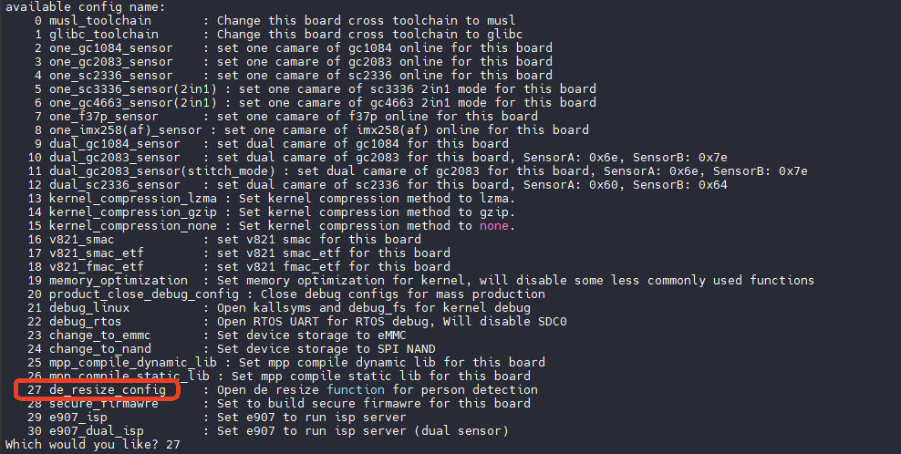

### 运行 Sample

执行命令

```
/mnt/extsd/sample_smartIPC_demo -path /mnt/extsd/sample_smartIPC_demo-4M-rtsp.conf
```

此时可以从喇叭中听到播放的音频，在手机上打开 VLC，输入开发板的地址，即可拉流查看，若出现人形则人形画框

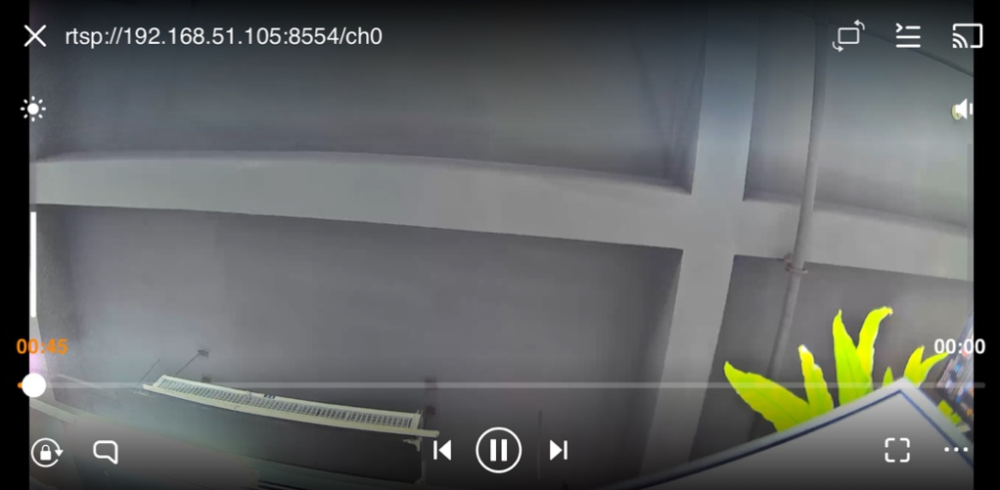

在PC端的VLC可以看到相关参数

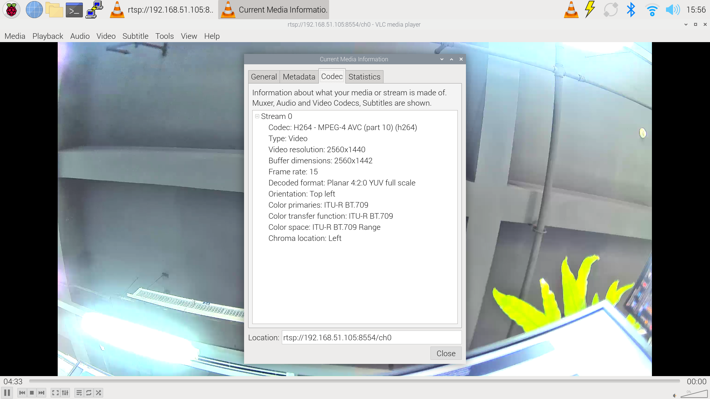
