# EMAC - 以太网络

以太网是一种局域网通信技术，遵循IEEE802.3协议规范，包括10 Mbps、100 Mbps、1000 Mbps和10 Gbps等多种速率的以太网。以太网与TCP/IP协议族的物理层（L1）和数据链路层（L2）相关，其中数据链路层包括逻辑链路控制（LLC）和媒体访问控制（MAC）子层。以太网在TCP/IP协议族中的位置如下图所示：

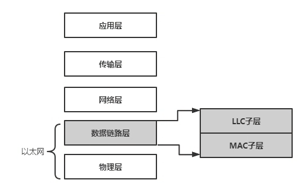

Linux 内核中网络设备框架如下图所示：

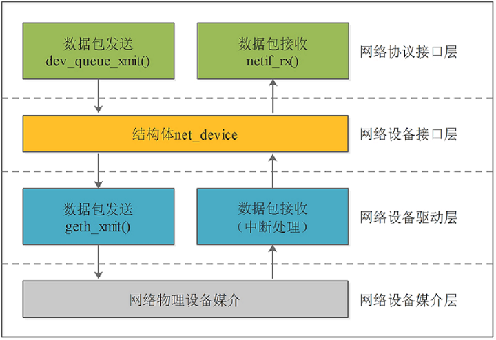

1.  网络协议接口层：向网络协议层提供统一的数据包收发接口，通过dev\_queue\_xmit()发送数据，并通过netif\_rx()接收数据
2.  网络设备接口层：向协议接口层提供统一的用于描述网络设备属性和操作的结构体net\_device，该结构体是设备驱动层中各函数的容器。
3.  网络设备驱动层：实现net\_device中定义的操作函数指针（通常不是全部），驱动硬件完成相应动作。
4.  网络设备媒介层：完成数据包发送和接收的物理实体，包括网络适配器和具体的传输媒介。

## 模块配置

### Kernel 协议栈配置

对于 Linux 系统，使用以太网需要配置以太网协议栈，包括如下配置项

```
CONFIG_PACKET
CONFIG_UNIX
CONFIG_UNIX_DIAG
CONFIG_NET_KEY
CONFIG_INET
CONFIG_IP_MULTICAST
CONFIG_IP_ADVANCED_ROUTER
CONFIG_IP_FIB_TRIE_STATS
CONFIG_IP_MULTIPLE_TABLES
```

### Kernel 驱动配置

#### GMAC 配置说明

GMAC 控制器描述如下图所示，其支持最高千兆网络。

:::warning

:::note

注意

:::
:::note

部分芯片硬件只引出了 RMII 接口，仅支持外接百兆以太网 PHY，仅支持百兆网络。

:::

:::

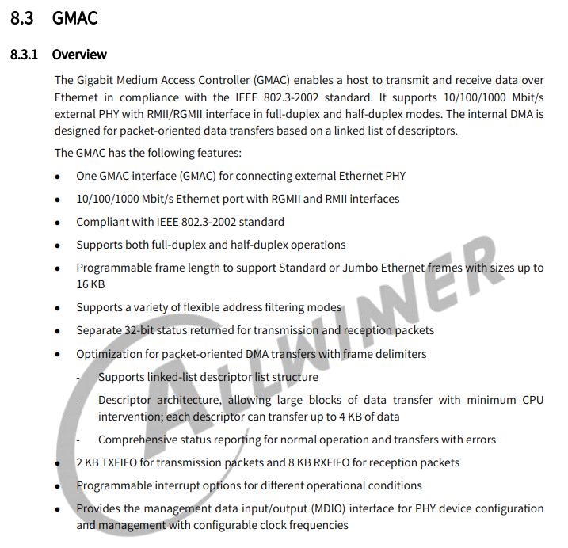

内核配置项目为：

```
CONFIG_AW_GMAC
CONFIG_AW_GMAC_MDIO
```

设备树配置项目：

```c
mdio0: mdio@44500048 {
    compatible = "allwinner,sunxi-mdio";
    #address-cells = <1>;
    #size-cells = <0>;
    reg = <0x0 0x44500048 0x0 0x8>;
    status = "okay";
};

gmac0: gmac@44500000 {
    compatible = "allwinner,sunxi-gmac";
    reg = <0x0 0x44500000 0x0 0x1000>,
    <0x0 0x43000030 0x0 0x160>;
    interrupts-extended = <&plic0 47 IRQ_TYPE_LEVEL_HIGH>;
    interrupt-names = "gmacirq";
    clocks = <&ccu CLK_BUS_GMAC>, <&ccu CLK_GMAC_FANOUT>, <&ccu CLK_HBUS_GMAC>, <&ccu CLK_MBUS_GMAC>;
    clock-names = "gmac", "phy25m", "hbus", "mbus";
    assigned-clocks = <&ccu CLK_GMAC_27M>, <&ccu CLK_GMAC_FANOUT>;
    assigned-clock-parents = <&aon_ccu CLK_PLL_VIDEO_1X>, <&ccu CLK_GMAC_27M>;
    assigned-clock-rates = <25000000>;
    resets = <&ccu RST_BUS_GMAC>;
    /*
	 * max-mtu < tx_fifo - head_size
	 * tx_fifo: 1024 (platform-dependent)
	 * head_size: 18 (fixed)
	 */
    max-mtu = <950>;
    status = "disabled";
};
```

-   `compatible` 表征具体的设备，用于驱动和设备的绑定；
-   `reg` 设备使用的地址；
-   `interrupts` 设备使用的中断；
-   `clocks` 设备使用的时钟；
-   `status` 是否使能该设备节点；
-   `phy-handle` phy器件句柄；

板级设备树配置：

```c
&pio {
    gmac0_pins_default: gmac_pins@0 {
		pins = "PD1", "PD2", "PD3",
			"PD4", "PD5", "PD6", "PD7",
			"PD8", "PD9", "PD10", "PD11";
		function = "rmii";
		allwinner,drive = <3>;
		bias-pull-up;
	};

	gmac0_pins_sleep: gmac_pins@1 {
		pins = "PD1", "PD2", "PD3",
			"PD4", "PD5", "PD6", "PD7",
			"PD8", "PD9", "PD10", "PD11";
		function = "io_disabled";
	};
};

&mdio0 {
	status = "okay";
	phy0: ethernet-phy@0 {
		/* JL11x1 */
		compatible = "ethernet-phy-id937c.4024",
			"ethernet-phy-ieee802.3-c22";
		reg = <0>;
		max-speed = <100>;  /* Max speed capability for rmii */
		reset-gpios = <&pio PC 16 GPIO_ACTIVE_LOW>;
		/* PHY datasheet rst time */
		reset-assert-us = <200000>;
		reset-deassert-us = <150000>;
		status = "okay";
	};
};

&gmac0 {
	phy-mode = "rmii";
	pinctrl-names = "default", "sleep";
	pinctrl-0 = <&gmac0_pins_default>;
	pinctrl-1 = <&gmac0_pins_sleep>;
	sunxi,phy-clk-type = <0>;
	phy-handle = <&phy0>;
	tx-delay = <0>;
	rx-delay = <0>;
	status = "okay";
};
```

-   `phy-mode` GMAC与PHY之间的物理接口，如MII、RMII、RGMII等；
-   `pinctrl-0` 设备active状态下的GPIO配置；
-   `sunxi,phy-clk-type` 配置phy使用的时钟，0表示使用soc内置的25 M 时钟；
-   `tx-delay` tx时钟延迟，tx-delay取值0-7，一档约536 ps（皮秒）；
-   `rx-delay` rx时钟延迟，rx-delay取值0-31，一档约186 ps（皮秒）；
-   `gmac3v3-supply` gmac电源脚，根据实际情况配置；
-   `status` 是否使能该设备节点。
-   phy子节点配置（_**注：更换PHY器件需要更改此属性**_）：
    -   `reg` 表征phy地址，
    -   `max-speed` 表征phy的最大速率，
    -   `reset-gpios` 表征phy硬件复位的引脚，
    -   `reset-assert-us` 硬件复位拉低时间，
    -   `reset-deassert-us` 硬件复位拉

## 调试说明

常用以太网调试的软件包：

### ifconfig

使用`ifconfig -h`查看支持的参数，如下所示：

```
/ # ifconfig -h
Usage:
  ifconfig [-a] [-v] [-s] <interface> [[<AF>] <address>]
  [add <address>[/<prefixlen>]]
  [del <address>[/<prefixlen>]]
  [[-]broadcast [<address>]]  [[-]pointopoint [<address>]]
  [netmask <address>]  [dstaddr <address>]  [tunnel <address>]
  [outfill <NN>] [keepalive <NN>]
  [hw <HW> <address>]  [mtu <NN>]
  [[-]trailers]  [[-]arp]  [[-]allmulti]
  [multicast]  [[-]promisc]
  [mem_start <NN>]  [io_addr <NN>]  [irq <NN>]  [media <type>]
  [txqueuelen <NN>]
  [[-]dynamic]
  [up|down] ...

  <HW>=Hardware Type.
  List of possible hardware types:
    loop (Local Loopback) slip (Serial Line IP) cslip (VJ Serial Line IP)
    slip6 (6-bit Serial Line IP) cslip6 (VJ 6-bit Serial Line IP) adaptive (Adaptive Serial Line IP)
    ash (Ash) ether (Ethernet) ax25 (AMPR AX.25)
    netrom (AMPR NET/ROM) rose (AMPR ROSE) tunnel (IPIP Tunnel)
    ppp (Point-to-Point Protocol) hdlc ((Cisco)-HDLC) lapb (LAPB)
    arcnet (ARCnet) dlci (Frame Relay DLCI) frad (Frame Relay Access Device)
    sit (IPv6-in-IPv4) fddi (Fiber Distributed Data Interface) hippi (HIPPI)
    irda (IrLAP) x25 (generic X.25) infiniband (InfiniBand)
    eui64 (Generic EUI-64)
  <AF>=Address family. Default: inet
  List of possible address families:
    unix (UNIX Domain) inet (DARPA Internet) inet6 (IPv6)
    ax25 (AMPR AX.25) netrom (AMPR NET/ROM) rose (AMPR ROSE)
    ipx (Novell IPX) ddp (Appletalk DDP) ash (Ash)
    x25 (CCITT X.25)
```

-   \-a：显示全部接口信息；
-   \-s：显示摘要信息；

![显示摘要信息](data:image/png;base64,iVBORw0KGgoAAAANSUhEUgAAAo8AAACKCAYAAADLwqDhAAAAAXNSR0IArs4c6QAAAARnQU1BAACxjwv8YQUAAAAJcEhZcwAADsMAAA7DAcdvqGQAACEzSURBVHhe7Z09srQ4sobvQtodu91pi2i73Ylou2YNvYSK8e8qKtoaZxZw3YropXwRswRupn4gJVI/FAgQ9RpPnCoEIjOVKt4jkPifn376adyTYXgQ/HkYH49hUV5keI7vH6/xoZURj9eP8f38oN6dKJ6/YD8AAAAAQM8kxePwfI8/Xg+1LM0wPt/v8cni8fH64PgSXP+P8fXQyo7g7PMDAAAAAJxLQjw+xtePD0QSj7q9n+NAn1l87j9CCPEIAAAAAHAmunjkUUMnAtXyGNr//SaxSILzB8Gf+e+PH7TtVVuPFaz2uPi2rxVttkwQ2DiMj5c/L9mwOC/VEZQ/5nJ/q5n9cOU/3vTd3H53xxbPn7OfkXW8x+dzZYwL/O33P8ff/vrv+A/DX+Ovv593ax8AAAAA90URj5+Nrg0Dizc67jnQZyfGaJt9/nENLMI08cWkbeNzsxjzgm94PMen2M+Ue8E4PEw908iosVcKSuvL8rZ7TWx0+7Xz7yce/zn+SoLx77/778P48//+a/x5sR8AAAAAwDaW4nHtqOMEC6s9nnf8RDzyMe7cwXaPUi79NOIxUz7xqXgsnH8zLB7/O/72xz/Hv/2ilQMAAAAA7EMkHmvEUQwd83qNrxfftubb1PTZjKrxtk/E0Qfi0Y90ym0SrXwhHjPlEx+Kx+r6c1iBaG9LM3+GI4u//Gv89d9/uVvXf42//oHb1gAAAADYn1A8sqDJiTCVYRweD/s8IYmhx+NJ4vE9vp4Ps1TPIeJRG9krlR8pHkvn3xl+/nEhLgEAAAAAdiAQj/xc3qczpPlYK6py4q+GnBBMizfzTCGLV3fc+mce9xSPS/ubPvPIo458y9p9h3gEAAAAQCtm8agJqGpYVDnBxKLr4+cdHVTHNHM7ELM58bbDbGu5/8fikVDtt8ea879f+8+2/kPMtv73n+Pf8ewjAAAAABowiccto47gA1RxCgAAAABwbax43DTqCKrgZ0Gn1zXaUUiIdQAAAAD0RjhhBjQkvq0ubpsDAAAAAHQCxCMAAAAAAKhmvXgceCkeP/EDz+wBAAAAAHzC8JzvSK5fKvE8VotHTKwBAAAAANiRzuaeOPEolpERLEVi5VI1IIRnVnNM5RJGJlFo2/s5PnkNSBF3iWkDc3yYVOa/la1LIu2F92/iTXZL23jtyyhvFJ/yUO6tWGrJxOddWX9r+xf1W6b6Sucv2lfgYP/eHPd4QXxR3p1/hlL+pdd23exfY4ydgX0z9hpw7f7b3P5F+1mO6r9H+3d0/71G/jXuv4s6bD3BOZV+cGWikUcrDm2Dye1hedCIoIxJHEo48WPIP47vN/9Ahrf+OWEX8Vc6yvXEo7BvsJ098CPYR/kxKOA7so1VlKdRp1slHJnW9ivtly2Pz19jX46D/Rvoe/BjXDp/jX05ao4P9lnpH5HNP/V3U5xjq38Hov7+MC3jt7X/CprYH7dfTKl9d2z/I/w7vP8KTsm/I/ov11F6zO+e4tFuXyhnGQwKaKjs40CVF/G+7Wxkl3xPFowmtpx89vstxSOxtG/OrfW2c7yi/9JkZxSd7qMLT2v7lfpL5cE5quzLcIJ/q+y/un+l/CNMnbIvS5u2+ncgyYv3lfuvoIn9SvuVyoNz7Nj+R/m3yv6r+3eF/hudTyUrHq3/Vh+RLzu/ZOQTdht5fJAzT7mOISWBDC4nBTtb9frAoh2d4ZOPk4MbnL+zr3HCEmrn2SN5WxLbx/+ZaXliOgcnf6qDJNA6ldzmPhsxvrZuprX9Svtly+Pz19qX4gz/eJvP7bX+Eavyu7V/MtdS26Lvgf219l2A9MWbaBU/9/nj/itoYr+Sn9nyUn5vaP/D/ONtR/VfwSn5p3zfvf/KeKbQ7HRwXNgeczyd3wjJUn2NaXfbOggWBTtW/gFKeU2we2FKPo4f3662MTQJGvmodp44eYlPO2cTjH3cqT1v8k/LIZs/q9u11PnNZ66XYkt/V/8ot7Z/Ub89x5TvpfNX25fgEP+i9uFtvp4q/8Tx/ONM+6V/hyJa+1fKP4Ot2+ae/ExU23c+2Yt3q/ht7b+CJvYv2o85sP8K2vkXtQ9vO6r/Ck7JP4Pss/IzsUf7Leog4uu3ZqfhmvpoP/H4IMe5YWVwvHPJoDj8j0fMycHZDdm5xOdq8ajE73ricbbP2Ka0t/V3Fs+yzHYQ2f7ieC1/5Db52diS+0dFobX9Uf0LSuevtC/JGf7xNp/bVf7JusmGNQ+kt/avlH8OUz/3ybis0r4rkLt4N4uf/GxitbL/CprYH7XfglL77tj+h/nH247qv4JT8s9h6m/Vf2U8U2h2prbX1NeYncSjbbjFfyOTc1ye+0Hg8pWN0RNR8nlsZwgT4A7iUc8jnyPa/iWU/JH5FcWHY7iqY7W2v7R/6fxV9mU4wb8gP1f7t5LW/pXyL9r2iMuq7LsG6Yt3w/ht7b+CJvaX9i+1b6l8BUf5d2j/FZySf9G2Jv1XO19MSjzW2n8wO4pHcs5vV+7J+x+Eumcebfnrw/9eLsci+SzV4nHqOG67i++q5G2J5l+0zbevL4+/lwjzI8rTRaez8aqOT2v7E+2fLZfbKuzLUnH8nv4VZ2vG27TyNZTqJzb5R/j91fybsL+DPDISlFXYdxXYT63fNI3f1v4raGJ/qa1K7btj+x/h3+H9V9DEP8Lvf1r/5f2LYs9f55dlgf3XeubRBjMcetaCa/fTnBuenHDuWJ4tt5gNtHa29Sw0uyeRaPXikaAfWH5Id46P7wgXQPVPXADMxSH6z0nbloVyLzUbf3HxIYxNlfW3tt/UP7fd5INv59L5S+XBdoWD/dPXiVvr3wpa+2fI5J/A/MjH9ZbsC7afi/r70zp+pq4oPiZma+q3NLHf2DLn9+SDP0+pfXds/yP8O7z/Ck7JP0Gz/st11Ig92s/rqLBuq72M/dQ+F5xtDQAAAAAALkutGG0IxCMAAAAAwFXhx/imOSV2FLJ61LMREI8AAAAAAJflei9RgXgEAAAAAADV7CMezcOr+zwwCwAAAAAArgvE494Mj/HxGE4fUr4tiC8A/YL+C8AtWCceU1Pyq8SjnCr/Hl8nP+zZBjt9fxkjMc1+QtknG59viF+JVHwJuiiFSxmdOxNtf+7e/lv9Q/+4PrX99/M3lFwX9N++2eCf0U0+ty3BM4u+nLZNxxhNRdt4RvXi+Kh/KLrsiJeIHCYezfpJ/oLOPxQUBG29yH6h5OIZUK8X+RbHwpVlEq4Un/vHr0RFfKcOab+37jxHcvf23+of+sfVWfP7aL8jv/sB/mVY6KYo3005L04+78Pi7/0mATiJR3G8O394fNinDhaPmdk8XgXHeOO8eCQngoXCp4U22dlw4c0jnDsWSgjz3wD7Gjbk8scxphSfb4hfiVx8eVvYme8Vn7u3/1b/0D+uT6b/aoMPfEE8eR27/UD/7ZuN/pXEnSt/0jarEWwf4e+qeEwcnyxvxCQerbIOR24WYkcx0uDEpRz58fXN5Xf+cZAoP44unrPwjoa9S/H5qviV0OJr8zceeUyL9c64e/tv9Q/9oyOU/ov87hv4l4f3lccP0euFfTmfh+vk73wtS4lHHnmk46fBkricOFA8cocOlbUaHMVIgwlu5vgp+OKinqqre3RxI+H3drPYnhq/FJ+vil+JVHwpNqmR8965e/tv9Q/9oyO0/ivaTXxHfncC/Mtj9pWDR1SHvD5NdXH9fLvaaoNQPMrj31Tu+4o83n0njhOPJjjSOMcq8Rht530X4jFRfivK4pEJGhfxW0H64jOP5g7j44DOcxh3b/+t/qF/dETi95HacJowc5F39+4G+m/fbPWP9w2Oj+7MynLxOTXyaLbL+hT7jhOPlYJnGQRHMbhc/52fiZB8IB6L8fmm+JVQ4qvln7atW+7e/lv9Q//oB6X/KiC/ewL+ZdF0k9yW0FXmHIp4XIzUnyse42ce6eT8LsV4uQRjZBjEebsSHKHMbf3u+w1nY80oP44UH47l9F+KiVfofyk+3xO/Ekp8zTZl5LH2P8MOuHv7b/UP/aMXtP7LF7vnNMFy8VjPDUD/7ZtN/iniL7g+rRaPRLDN2+PFZPRMZSMm8WiHUslYMoLhdfLm2dIzcp9J2VaIR6OWP10nqQtsA06xMfiYcLKImejsv3xmwe2Tj8/d41ciF1+CBbq/7cUEs/3vwN3bf6t/394/rk6h/3L5dNv6PT4Xv4+9g/7bNxv8M0LP5baDJ8ZM16dPxKPrT3L0UV7/jnjmX4hHAAAAAAAA8kA8AgAAAACAaiAeAQAAAABANRCPAAAAAACgGiMezYOZ7kFL7cFNAAAAAAAAmHDkUZs1DQAAAAAAgAPicQWDWG4nnAo/mHWV5tHbeAS3VE7w2lHTPvpSAOnzAywV0Ttb/bt7fO4O8rtv4F+Skq5aLOXzHt9yjW1lqZ4jFgEvAfFYiV1ziWIjFrJ9TouEUmKR8EsvyllRLtfVVBYhzZ8fYJHavtnq393jc3eQ330D/zJUiUdR7uqf9EL/4lEq728b+Soly1bxuISTdd7/fp1xXzg+eD1Wv2z17+7xuTvI776Bf1nWikciqL938WiVtxOMpIzXiqGucXF5UiPOt43dfyEGKw7lsHM4rF0qj4j/syme/8vR8pY7XPCGo46Bf3nuHp+7g/zuG/iXRztewnXJcr7+k16Yrv9xOdGReFwq71slRwkTFxbLfrSVR2FJxCUar/Ru1lS5SQgjDiNxufL8X8eUt2KEV+lw3QL/8tw9PncH+d038C/PdLxSxpi67KDQdP2Xr+dUztWPeNS2s0NfJR7X+V9q3Gx5PLL77fEvcff4wL886B99g/zuG/iXRztewnWJcjuIJPZXju9HPH77yKPxP4pLwf9N4pEJ6l9//u9imZ9X6Fz7Af/y3D0+dwf53TfwL8tK8biYI9GFeDRB0m+3fvUzj4SdwJK4bUyN+5rK7PfgtvTqchtfmRzZ8wOXn05Mx8+M3gD4l+fu8bk7yO++gX8ZzPV+jXiMt/nzeTF5Df0ViUeCjGZhYyZlBMaxYCG168u8kPwaYv9dIrmyh1iDcfHMQrGc/pMQcbf1x/HNnR+E8SlMSOoS+Jfn7vG5O8jvvoF/SdxgkT1W4Ad/NPHoBKMcfZzXgb6G/lqKRwAAAAAAABJAPAIAAAAAgGogHgEAAAAAQDUQjwAAAAAAoBqIx+4Yxp9/H8a/qWUAAAAAAG3ZXTwOw4Pgz8P4iGYUgx345V/jb3/9Of6slQEAAAAANCYpHj9bhHIYn2+3mCZPP199/EbUKe8rOPt4AAAAAICLkxCPHy7yyesZubeesPg8fBFLiEcAAAAAgKbo4pFF0JpX39H+7zeJRb+AJX22i1nStprFrP0K7FyPq+PHm76L1wGZ2+DTIp3RIpmlRTiJcBHud7hId8XxZlX34PzCr5rjN/PP8de//jv+w4Db1gAAAAA4B0U88q3n9aOOw8Dijo57DvTZiUHaZp9/LODE1ywIbV1SfPnvvlx9PU9y5I9HUt/jc/KJ638u90seT+d/vuh4fz5ebV4Rh5nj94NFJMQjAAAAAM5hKR5ZAK0ZdZzY8LyjEY/hi8dDO5z4S5aLbUnxyGLTT+ZJkDxeYdX59wTiEQAAAADnEYnHT0YdeRTuNb5efNuab1PTZ34H45u3VYpQP1Ipt0lxlrotvEa8UR2v6dZ64t2UueMfZIN4t+Tq8xeRt6Vzt6YhHgEAAABwHqF4/Ej8DOPwcM8Dkph6kMhikfZ6PsxSPbuIRzNyWGFXpf38/KO6X/J4P4FICM7APrGtxs5NQDwCAAAA4DwC8cjPFX46Q9o872hGLCuFnqQoHuNnHlkAkkglgTrtz5h6otvbbjvvOx+bEHmp4/1tcz8iy5NnzOhqJB6Tx+8Ji8e/xr//opUBAAAAALRlFo+agKtmw/OOjHbuxchePNv6Gc3Gtsh9pB3DM5zJnRJ4tcfzBJqFeCRSx+/K73+Ov7nb27/98ZnYBwAAAAD4hEk8bhl1BAAAAAAA34EVj5tGHQEAAAAAwLcQTpgBAAAAAAAgA8QjAAAAAACopgvxyO/Jniah3P32+sBLHTlflQk5XVJ4LOKr2hcAAADonL5GHr/g2cxbTlyqbTc8ewsAAABcnuSEGTMaxEvSiG2n87G4sG/OmUe3LKtFWvNFwD95w8+BfOo/xCMAAABwG1TxuF04DuMwVL5dZg2bxYUVZx+P7O0mHlPxgXiEeAQAAACuzUI8poVjvEj3/MYWi32zzJOON++4fvO+rh5fP4mPYKHtYKHuUv1EK/FYss+Uu+2SYBHwDfFxdgV1M/KZR36rTVB//DzkchH1fLkS3xQ1/ufsc/F9ioXW17fvBvsBAAAAsBuBeGRhkxpZCl8PqIkw+/7n4KI+uHInPuYyFgKh+CjXT2TFRQ25evP2GTIjb5viM2GP00Ye+Y02z+nd2rSfFj8Sm17w8usbp9cp+vKsfRXk/M/Z5+I7nd+93nFN++5iPwAAAAA2I8Qjiw8eFdPEi3u3sxwpZCERzAZW9vGY+nPH19RPZMRFHQnRUbRPbFPPvzE+E9a+qtvWpfgFVMa3RNJ/BVl/bXyT7buT/QAAAADYzPKZRyMQogu1KSdxGRNcvDMCRhMFC3FRqt/vVyleVHLiMWOf3Kadf2t8JjLi8UHnoDK1/lJcauNbIuW/KVtpnxbflB972Q8AAACAzagTZvwt0PnCzMInI04MG8RjVf1ESlxU00g8bo3PREo88rG8Xdi9iF+u7sr4lsj6n7HPxDeyT4tvsn13sh8AAAAAm1HFoxcDUmSFz5zZZ+peT/lMYEbAVIizcv2MFyly2xo2ikdNBDk2xWciJx7pWL/dPTO4iB99r3vmMRXfAkn/C/aZ48T5U888Ztp3F/sBAAAAsJmEeCTMKJMUCsvZvOFs6Yw4qhJnpfoddJy/hbkUHymsKPN1T+fwx1fZZ5E2spiZyzbEZyIlHkksiZnKZiY4fS/FL7S9Mr4FUv5n7XPxjWdby3onku27j/0AAAAA2IYVjwAAAAAAAFQA8QgAAAAAAKqBeAQAAAAAANVAPAIAAAAAgGrWi8fhOb785BNlQgkAAAAAAChjXgntJoJWv4TjAqwWj7xkSv0sZwAAAAAAkEVb9eXCOPFYWMpmIr2UDMhglj2imMrlaUyi0Lb3074HWsRdYtrAHB8mlflvJbXczdF4/ybeZLe0TVm/UfEpD+VesFTPvOaj1ulMfHjJILEtSWv7F/VbpvpK5y/aV+Bg/94cd7mMUu/+GUr5t1yGy69Nutm/xhg7A/tm7DXg2v23uf2L9rMc1X+P9u/o/nuN/Gvcfxd12HqCcyr94MpEI49WHNoGk9vD8qARQRmTOJRw4seQfxzfb/6BDG/9c8Iu4q90lOuJR2HfYDt74Eewj/JjUMB3ZBurKE+jTrdKODKt7VfaL1sen7/GvhwH+zfQ9+DHuHT+Gvty1Bwf7LPSPyKbf+rvpjjHVv8ORP39YVrGb2v/FTSxP26/mFL77tj+R/h3eP8VnJJ/R/RfrqP0mN89xaPdvlDOMhgU0FDZx4Fau4i1+M+gd1zyPVkwmthy8tnvtxSPxNK+ObfW287xiv5Lk51RdLqPLjyt7VfqL5UH56iyL8MJ/q2y/+r+lfKPMHXKvixt2urfgSQv3lfuv4Im9ivtVyoPzrFj+x/l3yr7r+7fFfpvdD6VrHi0/lt9RL4sXhJyPLuNPPIbRZ7Tu41pP0oCGVxOCnbWD4fnX59XsqMzfPJxcnCD83f2NU5YQu08eyRvS2L7+D8zLU9M5+DkT3WQBFqnktvcZyPG19bNtLZfab9seXz+WvtSnOEfb/O5vdY/YlV+t/ZP5lpqW/Q9sL/WvguQvngTreLnPn/cfwVN7FfyM1teyu8N7X+Yf7ztqP4rOCX/lO+7918ZzxSanQ6OC9tjjqfzGyFZqq8x7W5bB8GiYMfKP0Aprwl2L0zJx/Hj29U2hiZBIx/VzhMnL/Fp52yCsY87tedN/mk5ZPNndbuWOr/5zPVSbOnv6h/l1vYv6rfnmPK9dP5q+xIc4l/UPrzN11Plnzief5xpv/TvUERr/0r5Z7B129yTn4lq+84ne/FuFb+t/VfQxP5F+zEH9l9BO/+i9uFtR/VfwSn5Z5B9Vn4m9mi/RR1EfP3W7DRcUx/tJx4f5Dg3rAyOdy4ZFIf/8Yg5OTi7ITuX+FwtHpX4XU88zvYZ25T2tv7O4lmW2Q4i218cr+WP3CY/G1ty/6gotLY/qn9B6fyV9iU5wz/e5nO7yj9ZN9mw5oH01v6V8s9h6uc+GZdV2ncFchfvZvGTn02sVvZfQRP7o/ZbUGrfHdv/MP9421H9V3BK/jlM/a36r4xnCs3O1Paa+hqzk3i0Dbf4b2RyjstzPwhcvrIxeiJKPo/tDGEC3EE86nnkc0Tbv4SSPzK/ovhwDFd1rNb2l/Yvnb/Kvgwn+Bfk52r/VtLav1L+RdsecVmVfdcgffFuGL+t/VfQxP7S/qX2LZWv4Cj/Du2/glPyL9rWpP9q54tJicda+w9mR/FIzvntyj15/4NQ98yjLX99+N/L5Vgkn6VaPE4dx2138V2VvC3R/Iu2+fb15fH3EmF+RHm66HQ2XtXxaW1/ov2z5XJbhX1ZKo7f07/ibM14m1a+hlL9xCb/CL+/mn8T9neQR0aCsgr7rgL7qfWbpvHb2n8FTewvtVWpfXds/yP8O7z/Cpr4R/j9T+u/vH9R7Pnr/LIssP9azzzaYIZDz1pw7X6ac8OTE84dy7PlFrOB1s62noVm9yQSrV48EvQDyw/pzvHxHeECqP6JC4C5OET/OWnbslDupWbjLy4+hLGpsv7W9pv657abfPDtXDp/qTzYrnCwf/o6cWv9W0Fr/wyZ/BOYH/m43pJ9wfZzUX9/WsfP1BXFx8RsTf2WJvYbW+b8nnzw5ym1747tf4R/h/dfwSn5J2jWf7mOGrFH+3kdFdZttZexn9rngrOtAQAAAADAZakVow2BeAQAAAAAuCr8GN80p8SOQlaPejYC4hEAAAAA4LJc7yUqEI8AAAAAAKCafcSjeXh1nwdmAQAAAADAdYF43JvhMT4ew+lDyrcF8QWgX9B/AbgF68Rjakp+lXiUU+Xf4+vkhz3bYKfvL2MkptlPKPtk4/MN8SuRii9BF6VwKaNzZ6Ltz93bf6t/6B/Xp7b/fv6GkuuC/ts3G/wzusnntiV4ZtGX07bpGKOpaBvPqF4cH/UPRZcd8RKRw8SjWT/JX9D5h4KCoK0X2S+UXDwD6vUi3+JYuLJMwpXic//4laiI79Qh7ffWnedI7t7+W/1D/7g6a34f7Xfkdz/AvwwL3RTluynnxcnnfVj8vd8kACfxKI535w+PD/vUweIxM5vHq+AYb5wXj+REsFD4tNAmOxsuvHmEc8dCCWH+G2Bfw4Zc/jjGlOLzDfErkYsvbws7873ic/f23+of+sf1yfRfbfCBL4gnr2O3H+i/fbPRv5K4c+VP2mY1gu0j/F0Vj4njk+WNmMSjVdbhyM1C7ChGGpy4lCM/vr65/M4/DhLlx9HFcxbe0bB3KT5fFb8SWnxt/sYjj2mx3hl3b/+t/qF/dITSf5HffQP/8vC+8vgher2wL+fzcJ38na9lKfHII490/DRYEpcTB4pH7tChslaDoxhpMMHNHD8FX1zUU3V1jy5uJPzebhbbU+OX4vNV8SuRii/FJjVy3jt3b/+t/qF/dITWf0W7ie/I706Af3nMvnLwiOqQ16epLq6fb1dbbRCKR3n8m8p9X5HHu+/EceLRBEca51glHqPtvO9CPCbKb0VZPDJB4yJ+K0hffObR3GF8HNB5DuPu7b/VP/SPjkj8PlIbThNmLvLu3t1A/+2brf7xvsHx0Z1ZWS4+p0YezXZZn2LfceKxUvAsg+AoBpfrv/MzEZIPxGMxPt8UvxJKfLX807Z1y93bf6t/6B/9oPRfBeR3T8C/LJpuktsSusqcQxGPi5H6c8Vj/MwjnZzfpRgvl2CMDIM4b1eCI5S5rd99v+FsrBnlx5Hiw7Gc/ksx8Qr9L8Xne+JXQomv2aaMPNb+Z9gBd2//rf6hf/SC1n/5YvecJlguHuu5Aei/fbPJP0X8Bden1eKRCLZ5e7yYjJ6pbMQkHu1QKhlLRjC8Tt48W3pG7jMp2wrxaNTyp+skdYFtwCk2Bh8TThYxE539l88suH3y8bl7/Erk4kuwQPe3vZhgtv8duHv7b/Xv2/vH1Sn0Xy6fblu/x+fi97F30H/7ZoN/Rui53HbwxJjp+vSJeHT9SY4+yuvfEc/8C/EIAAAAAABAHohHAAAAAABQDcQjAAAAAACoBuIRAAAAAABUY8SjeTDTPWipPbgJAAAAAAAAE448arOmAQAAAAAAcEA8rmAQy+2EU+EHs67SPHobj+CWygleO2raR18KIH1+gKUiemerf3ePz91BfvcN/EtS0lWLpXze41uusa0s1XPEIuAlIB4rsWsuUWzEQrbPaZFQSiwSfulFOSvK5bqayiKk+fMDLFLbN1v9u3t87g7yu2/gX4Yq8SjKXf2TXuhfPErl/W0jX6Vk2Soel3CyzvvfrzPuC8cHr8fql63+3T0+dwf53TfwL8ta8UgE9fcuHq3ydoKRlPFaMdQ1Li5PasT5trH7L8RgxaEcdg6HtUvlEfF/NsXzfzla3nKHC95w1DHwL8/d43N3kN99A//yaMdLuC5Zztd/0gvT9T8uJzoSj0vlfavkKGHiwmLZj7byKCyJuETjld7Nmio3CWHEYSQuV57/65jyVozwKh2uW+BfnrvH5+4gv/sG/uWZjlfKGFOXHRSarv/y9ZzKufoRj9p2duirxOM6/0uNmy2PR3a/Pf4l7h4f+JcH/aNvkN99A//yaMdLuC5RbgeRxP7K8f2Ix28feTT+R3Ep+L9JPDJB/evP/10s8/MKnWs/4F+eu8fn7iC/+wb+ZVkpHhdzJLoQjyZI+u3Wr37mkbATWBK3jalxX1OZ/R7cll5dbuMrkyN7fuDy04np+JnRGwD/8tw9PncH+d038C+Dud6vEY/xNn8+Lyavob8i8UiQ0SxszKSMwDgWLKR2fZkXkl9D7L9LJFf2EGswLp5ZKJbTfxIi7rb+OL6584MwPoUJSV0C//LcPT53B/ndN/AviRsssscK/OCPJh6dYJSjj/M60NfQX0vxCAAAAAAAQAKIRwAAAAAAUA3EIwAAAAAAqOYS4vE///m/LNoxAAAAAADgeCAeAQAAAABANbuLx2F4EPx5GB/RjOIUmmCUaMcAAAAAAIDjSYrHzxahHMbn2y2mydPPK4/XBKNEOwYAAAAAABxPQjx+uMgnr2fk3nrC4rN2EUtNMEq0YwAAAAAAwNH8NP4/hp4vaBExnyIAAAAASUVORK5CYII=)

-   add/del：添加对应网口的ipv6地址；

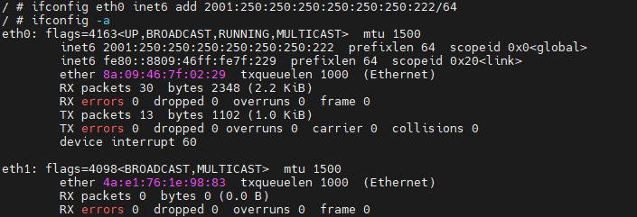

-   netmask：设置子网掩码；

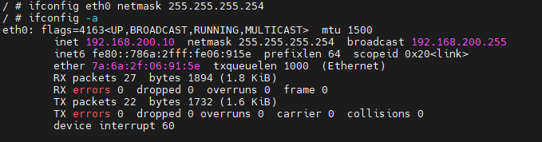

-   hw：设置mac地址；

![设置mac地址](data:image/png;base64,iVBORw0KGgoAAAANSUhEUgAAAkkAAACaCAIAAAAy10vLAAAAAXNSR0IArs4c6QAAAARnQU1BAACxjwv8YQUAAAAJcEhZcwAADsMAAA7DAcdvqGQAACYfSURBVHhe7Z1LbiPLsYbvQs5QhiYCPGg0cDxoCSbQg4bhmQVPWx5pAV6C4CEBr0I4Iw+4CgHeAPdwAC9BNyLfkRmRVUlVUVTp/yB0s6IiIyOTyfhZD5L/9+r4ZQM8PP/+8nQXNj4yd08vvz8/hI3l2Mz8VGx1XO8AZhFshw+ubQ9Pzw/+BcmCsJESt6C2bXJ+iK2OCwCwEB/9uO3u4fnld8dLrHYfniWP27Y4P8xWxwUAWIYNnZMEAAAAHO+rbXcPD3fKm+67p/CmfKWTTWZ8I5+VWOr4bMnjvBHeq18AAJhiSW27u/PKwArhLRMYxXHtmwPM+Gcu1tC2mVw9Pt7sdmFjFXY3q3cBADgn09o2u4KRo5MMko43Vby1S+Y7SQFNS9VtL5F8aPk8KfPnGdBY/gvyePjr6+tfD49hk9ndHI5spL/j4WaGJF09Hr5H/6+N/9XeRRNdaOz2IYj/kyl9DSkdvz1OJBS6K/6+70OTnCfFicYOxbiOX0U6+29Hb1fGq2D5j8YB4FKY1La2pBlQpXPSFv8/mbVL5plKcs2INjhfN4l3M+b/PANaWNvumPC4A8vJ8dvhUArJ1f5A+nEVHpNOHG7cYxMq0PvH4M9KKf2pi+P+62Gmth21Er/7enz9fvBd7G72+4l8BI/fUkw/WC+NTke/9TMq8+HHaVwU89VLozJeBct/NA4Al8OUtlFFm1Sqh+cXwh9lpP8nDje4UjrK4sjFUpC7Lu+LKyOn45vifjlfc5Ub6Trx1XyI1OTl6WnOqVLt/r2m29CJmaeYdO8VNlT0OEq76VDL5E9Y9zHS0J6f6N0PrxRymMiGSzYfjlBhNYWn0AYPV+F8JNRQ+ZMskZz8ctNqWxvH0rZ+3e/mw9p83HvdlXFYL4W2NXG4bZEzDSHsJc8Uc0Yc078fB4CLpq9tM4qhg96Cu6JF/7sW896T+0rXhFc6ZeV5efI18u7h6SnuZXuo5A/UKgiCq8WxpHJiMlxnUHU+VfxJbcv+rhfh3uRh5lklSDv6/Rpx2naTkXxbH+f0/HtxeE9Wu7k37lCRtbRNHK842tpdUB9/xMiztc2doJPn6JzG7ONp0uZcYi+fSjBYd4vjtgnNtrTN1DzPUnEAuGi62kaFqF8LM1TCnCs1kQWwi+rN1VBarTykPW215VS0buMnqnyM+CZdf9qsurXyDAnG3W3DCisOPXDtooH8CjeF1NIht3hzZv69OFXQmUQFanAnzdQ9NawilSa55kHnFG3rsbuhuh/bsgaQDkVNmp2SlxkpzOn6VhK5DqX+ed11QwiaFPdODs3yH40DwCXR0bZQYqe4e3om3Fkm/p/flj9P3//goUrX9tD0ayVS2VPZtOyBzrhkPhNxGthfUvpT86rbE/NvmIjz4E4Z0zG1dGthB8np+UtynMnBqOja9kgyMHokcfWY9cAfiFzt+M8X7quBYPmQ6+Tjm9qTVSRK7+5xzjnAq324l+T7gS8Z+mij+Vj+J48LgAvA1ra2lunc3T088EWvlyf3/8sz/T/3U2LUR9tFW4OtgijtacuquYE2fqLKx4hvUjWX0M5qr5mn6KmTbqAfh56TpzvSN75e2I/D/rYH7az29vq14mSnERRt6wpb927+VKNvDsfvx/DnDpVYIeLlJUcvjrwu1dcANU48HkpUWlJtMvPz6V8nq+JY/pNxALhcTG0bKkKxmHWKmoraiVLMyY8c44WdOdfb1Jrr6YhF7VrFV5KVZH/XgmTePXRwt7K9naeL4x63lwtbunHcIRs/8gdvzmziO/NOb85fjVM4DVBp245PRZrCRs7x7JyHDm7CCUN6zMdtSo0mQaqFpB+HhCefTnT3p1jnJJs4Ho6QlcPBnuK4TYxRibP7Gu7/FOdIXT72/Y1KHMu/GweAi8bQtqpsTUDeoYAONPLE2+mKgqf2zUcezvH3ufdJ+sdEXU67Y6vzYWe3/Tx+n2QQ40TaFbrv5fmGz7cVcVz2bld+1Gex/I049ZMxhS/E6c9VZKcrhVEe/fDxkLv1saD4PJxxHUvRtjYO6Y31ubryOlkluko+hJON2sjymW5XiR8qiKhx4ufbvh/3ej7t59LUOJZ/Jw4AF42ubaMV6FOASQEAgA+Cpm3V+/HPzAN+SwUAAD4e9r0kgCnPrVWn6AAAAFwo0DYAAABb43217XP/xg0AAIB1WFLb8Bs3AAAALoFpbZtd8MnRSQZJx5sEYm2FgYIBAMDGmdQ2UqoxaYv/nwy0DQAAwJuY0rY55wcf8Bs3U/zpH7/++79/++//6O8v//7XH4IVAADAKvS1be4hDn7jps8f//nbr3/3Te9+/ff//vbvf7jHAAAAVqGrbVTa51ZzEgznWqtDH9W71R4rD2lPWxxAswfma5sR/438/be//QeHbgAAsCIdbetoQMkdfuOm4B9/dice3d9vfwxG0rN//eU/yf4/aBsAAKyKrW1Uyi0JEOA3biZhwftzOCeJ4zYAAFgdU9uGKnnUhEobJlE7UbSH/Mhx5HpbEaDupK9twrWKryQ7C9K2//76d/fwT//4lQ7goG0AALAmhrZ16r8CebuqT1IwJG1EvJuxUA217/H7JP1jYkDb2nzY2W3P/I0bnT/887e/hLORv/3xnzhuAwCAddG1rZYDQGBSAADgg6BpW/fA5nOB37gBAIAPiH0vCWDwGzcAAPDxgLYBAADYGkto29nOYcrfpom3eRA4gwoAACDzkbRNv5njXa8O3j3M/zAfAB8TXuVY5OCDMa5tpDCVlvTUJR9qzf2uEhOjm3fUNu66Omo0xltctntJn84jsn3GBPHMZ/L1P2GX8XM+7fVCl335ZqGI86J450Ay0SYOwePKA/OhZPqB3u05vkGaXT/b1IDtec7z858fCex+fcRMmcw7jHdZ5Cy9geppIKp5k7vCtFWzZtkBWIt1tc35urVcFaRTMLqxe18Z6tj9OEDRuzFeTjEWtTJdZw+VkB9PjENMYRFTdMUbqYD6PSm+KKzOIGxFHK7Vxa4yUd4n5LmJU3ZL3D08yXpGu0UmFm4orLJui/rhX5mglkWeBPfvt/IjHaNfNwBpd6azj3dZ5Cydip+JZ/nBVWXGPK5Pt0M+SZYdgPWwtI3WYHhvll7jbklL/CJlu/qbMrSO80vAe4UNhlf5vBd903HZqonLcH1J6ZRdpFDiN2vyaIvs+1Agrrr1S1gbb5Vh9hKN1XEQbijclXQv/C27zKfa8m7CNjOORIlTtFTphStx+TwV3wtAj7mlsyt5ntgvN5P2XoJvHy+505pc4CSfSzx8hStPDeHWOtsl6vz0Rpm4c18CRK7lAF3HSlNrVoZmC4Bl0LWNFiOtP7cam3Xs94UNB7skTSgqT7WKxQon2FF9iRgYLwrNzO+cg0TdlUdWeVziO7RcZsGF8g8P3bBqikjuoY/obdZ47Xngh9Y8e02jHF0hZIvoq/iOMWmnWhc2qn7FZtwokhFxiLSriiPQ4rhAnfotfDv4fKgH8qbH7iG39PbgVGTXy5Mx+g1RwxbRixP3iVic0Mh47+Jbr7dpXEyc/9eTkqOoxtWkZUOuZSjXYYCGEGNY8U/vF4DTUbVNrr5qLdKm8prR/MOajrvbhmNUL5GIYc7k/OVIhJ0eDlQZahC65Kaxd3O80RIfF/NQXtaJakyyRba27nHATPKX9myO+UTKzfyYGsfUyrEQaU8Vp0SNQ7DExvpHGQVrQLrahHyoDz4Z6R9xS5lnTqGTp8PoN0QNW0QnTt61yHjT+xdxbmEuKZnYgeiINqpRVOOy02og13pQHvcWK+4L8fk/DpwSsOwArImmbbwIJeVrYP5rxrKfSBUuopq9PCQm82GJ8S1mlBnf0ONnw2vQRHyfSfm9lK5BcHFVwrXualuKX1T4ws4Rk0+VT7HJD4scwkMRv8i/ilOgxxGI42ZPCjxByic+CH3IfPKWtLcY/TaZ23EK16ZVYGi8H17biBzVin96vwCcjnXcZi5l3lntNdeuWMWVl2PofIwWgFDMPsUY28in2vKUxwQcuIH38Xv0iLeG2iQiGukW9sqj3uyekyTSprBzlJiEyKfc4hYlvrWIU6Yj4xTocSqa1ma4aj3IfIgwNjlReUvaW4x+Q9SwxZgJckYlJ453wXOSLoPYgeiIc5X5VfPTpGVDrubEFlFFxBl2AFZk8nqbq7HNfWLiNWG/Zlwc97g6kcSwxSgPKtaLQo0cr5/xQRDVkDIfN67STm+1g3poafaR/m5LGS9fkXcd+G6jPbuHPXJePTz/pG/URIbM/jKHctM/9D0X4clc9JT8i4aUfpmNa5wXRFwPRhyaT/IN9vnHMdxeuBb5eOIY/A4XoZw2a4FEjH7LmQmsOl4K/jZNi6Txxg5ER8qwOONg8gux2m9CDYshFa8X10vexx1o69+yA7Aeura5NUiLlkmHDYm0KyzS9Brz0OotX2H5ZJyMws18zZ5J1U1BTCh1m3rlCpXPAbo9KZ3CXvrXafapX6rWeFOKfF0v2IjcsUu13zX3lcmR6hx4WxtZDK/583YRn58YmYwyRVYccqbhxnG1M0p++QnJUCPqoghYx6ccYrku5i1nGp/bjGjd9ls3KPeuP943k14QsYOqo/p1Wprq14UFj7EgDlebfkeatmoaLDsAa2Fp2ydgrZIDToZKL54RAMACfDJtozec4W1mPgYAlwE9I3QQEDYAAOAtfLbjtvJca3XWDbwvd2+/AgUAAJ5PfE4SAADARoG2+dOTOBkGNkJxhwxW9QioA9sC2nbGNX31+Hiz24WNVdjdrN4F+BicYVVf2G/f8L2Yb7mCfqHaxpdRyg9hgZl8Pm3ju5rlCj7Tmn48/PX19a+Hx7DJ7G4ORzbS3/FwM0OSrh4P36P/18b/au+iiS40dvsQxP/JlL6GlI7fHicSCt0Vf9/3oUnOk+JEY4diXMevIp39t6O3K+NVsPxH49i06+cyWX1V+48HVF2MfgZgwc8GNPc9+wQLRK7vVgcMOuuqGRmYA7TtjWvaffNWeNyB5eT47XAoheRqfyD9uAqPSScON+6xCRXo/WPwZ6WU/tTFcf/1MFPbjlqJ3309vn4/+C52N/v9RD6Cx28pph+sl0ano9/6GZX58OM0Lor56qVRGa+C5T8ap0enBl0U61Zqjt789o2fG1eF6WCjmKZR+wkow+2HbPeeow7Y9LJd97ncKlvVNu1+SF4hEr9e/MrRb6DU4jC0Et3Pr/zuv3hrcuHt9nw4QoXVFJ5CGzxchfORUEPlT7JEcvLLTattbRxL2/p1v5sPa/Nx73VXxmG9FNrWxOG2Rc40hLCXPFPMGXFM/36c2Vjrx+9J76zFRl4++bsC/Hrz+wlaSvldubVuR/w9VauAHd8MpKL+9o3MLPc/aj8BrTWFVyOyr8R7+Rj6PIzUgdE4Vj4F2vDABNvUNr+q3dLhVZFfQES74t3aikuNFl/eb8fhPcXqLOL3oCJraZs4XnG0tbugPv6IkWdrmztBJ8/ROY3Zx9OkzbnEXj6VYLDuFsdtE5ptaZupeZ6l4gzSrh8Hmd3yELvz+im/46oqVLGlf6ist1F/T9XKYcfX1/8U5Fu4WnmO2k9Ba0y2zkjavfY8+MfeTk5FT7ynrgOnxJmR7emT80nZpLbJhVAti3YNtcs1bHXiVEFnEhWowZ00U/fUsIpUmuSaB51TtK3H7obqfmzLGkA6FDVpdkpeZqQwp+tbSeQ6lPrnddcNIWhS3Ds5NMt/NE6fdv0EeIc8hjfWD6+3IkL2WsjfU7ViOvHtOD3Itegi9BjD0U6/d9R+AjGGgAOWSIe2uyoIOYSt/IgRW3KX55Q4brMz/P5eoLFFbeO1JemvIfYvLGnN9eJUC3MmurY9kgyMHklcPWY98AciVzv+84X7aiBYPuQ6+fim9mQVidK7e5xzDvBqH+4l+X7gS4Y+2mg+lv/J41Kxq4xbL8Wq6K2rkfU26u+pWhGj8ach16JhL88R+wlwqKYxBSzjV7R7e3lKclda0qfEGc8WTLHV47aRVWKtxV6c7DSCom1dYevezZ9q9M3h+P0Y/tyhEitEvLzk6MWR16X6GqDGicdDiUpLqk1mfj7962RVHMt/Ms4I7frxuFX0RP/kdSEXSdoaXW+nrM+mFTMaf5IqoGhZRB21n4CWNNk6Edu95jzQIyuO1u8pcdzO/t6mH9Bn89fb+EpH/I0SB688uUzMtdiJc9paq7Rtx6ciTWEj53h2zkMHN+GEIT3m4zalRpMg1ULSj0PCk08nuvtTrHOSTRwPR8jK4WBPcdwmxqjE2X0N93+Kc6QuH/v+RiWO5d+NM0i7fhi/UuSjcv2I35Rhc3go7IW/WG+j/h6/M2x4dH97/U9BrqIHF9+1lZftRu0nQO3rrPsh16sDp8TR8inQugETbFPbeOXk+5He9Bs9RpzRxeYLcfpzFdnpSmGURz98PORufSwoPg9nXMdStK2NQ3pjfa6uvE5Wia6SD+FkozayfKbbVeKHCiJqnPj5tu/HvZ5P+7k0NY7l34kzTL1+3GooVlC5lZdP+ZtKhbn+DSZ9vY36e+K+YqVq/r31b8FjLEjN3+/zbW3aVY5iHpg0FSH9perAKXGYOp+M1guYYqvaBsCFgQK1LiQpG51frJyTgLYBcBZQodaGDnzEWdltwIe2WDcnAG0D4CxA2wA4I9A2AAAAWwPatj58bfkjv2Ovro0DAMDFA21bH2jbZXBhFy74lrkNXh4C4DLYorY9lPf+vhT1g3fkIi23VuQ0bVsmvSXusT5N29ad3hPGRQm1z8JonBF/noFM/tbBhJoRAGAJtqptsarSm2MqK6mA5F2l08q8n7a5GK5nNw8nhrs8bTthXOogRuOM+QsXdRGcNrMAgGm2rm11/QglZlZRcU5P+Y168b6bv1TAm6s38FTzGnvoMz6kjstA2T+anZMgppq9tcOABpqIXE5nDVnFnIeqvsce7PzLEZQDWH9cqtdonEF/OT2q/7zkAQDDfILjtqp6cDkhZlQU7+lrLYlZ8b7bfV2Of3z3VPTGPb+EPdQinA3lONyU/n+h0u1sHp+pdy/jM7IyOsiUzrDSwKYu1nDIIoJrXXQwG3seRA9Vwkr+wdaM9wzj0pxG44z6k0Pyl/OWmZU8AGCY7V9va44DuETNKihl+SWsMpTthoeL88xHJlWtl/5Va9pU/MnlYe6vxYVaHIehBJxHZx5CF0wdXs9fjcOu646rGoJnNM6oPztk9APSOckDAMbZ+HEb1yFZO1xl4t/Ina4ooZZFKGwqj/QunI9lIt5e+SdcElTbtFQkZflVqx7fyuB7nnEvQyf/IXpxeJ/baqK3+XfGu/a4Upolo3FG/cUM0PGo8nwqswQAWILNX2+rqlrcN6emtE3Dlm8cdwi7Vu1SHG5XOtC2nYPvJGzUGJWyQuRTVeYBzHlw+M3KSCgZkmkig9XG1eZHjMYZ9K/GUm161LwAAG9m+/eSlJvlHrXUCLh6sQ+XHnG9xBUk39TZyx28x22019sI7+CdCZ+D3yR/caWpaBWgg5t0lW86e8Z5uRgzG6iY8+DhyHzAJYy+VW3Tx3uWcZFfnc1EHHd/S34Lw4z1K1yUiSPIpc0KAPB2PoG2uW2uIFW11YqvgB30+yT5FJozstX+zZFgFB3VSZT+oo5y3mFXGk3Zby/zTGoxt4FCMw/BHuH51ep8m7813nOMS5eRThw3rLrJSL8uQII/aFm30HMCALydLWrbUria3pZsUPFB5onSHBWSlWUH0gbAakDbbKBts+DDk48xTXTMOPX5gjPCh4BQNgBWAtpmA22bwp91a89SAgDA+wJtAwAAsDWgbcDg0q4G4erUpZFvrMHzAi4OaBswgLaBLnhCwCWzRW2j11zmAn7j5hyM3xM/yaWVrln5rDAPm2LB+bmoy9F43kHNVrUtvujcZ2xzScy7Sqe3cL27vt6FxyWW3WLUX+AG4wY55zPFM6FIipbcMeHxedHzEawyDwX1yAdmwpo3y74Ki85PX9s+7rjARti6ttUvQd6iCjn7Pef144/7158/6e/440uhPV8OP3/sb++PP++P9+Tw43HCfr0fibP78uPonF9/3h++XDtbBxpwrvpvezudP1r9JD6TTl08P/GXaLrv4swdpPfLfLdkcHYZKJ95t+wM1aQmDmPlo7LgPJjjyhHFpp2/Pm+avYqfRuPtWge516pbnaXmh5sKJtcJfwlNSj86cxj/HeJk8yHzPmM+VZYaF9gUn+C4rVrq4YU5a/k//vj5GqToen//83ibZIY0qVCp6wl7jnP9ZUYcMt7vv7iHLK63USANqlezeKWP4WeO27qviJI1q6gy8R155R/c/QzPt5dxnJNir/PRWG0eYhjRQblh5e/3tPOm26382Z6caUFzX/zQe4QGZJ/67J4V/0SqcB5tXGRVfxMqTpUbH5tSRn6MrkF06rDwuMBG2P71tvRCi7iX0qzV7zQmy9CP1/vbIELVroxqH41DRtK/LzslvkZ4bccq4AtD2DeErApiSy0Yhn9VjibtVhzTbrD+PIQemDK66V/vymj2IjqTXHrzRg/P/ptHgSpdjzauCjEuFyBa6v89kyEXHhfYCBs/buP1Lhe6ewXw+ZLp5X99G08Mxr/TtI3jpJOTc7SNmxzu713v94d8kGeQaoRnshZY9OJoQS3/U+ySvr/FqL9FL07cKI1W/oyVhGa3+u3kw6dO+dwfv4fTuhEsNT+BKpzHCEpHv+UcVeOKjcL/bJf081x4XGAjbP56Gy/8YqnHfcLHgoSn0CTBiLZVxlnHf4EdOZs5JMSrWS0585BVQWzJXQHDv53yvp0fqRkb8U2ExzrzELYam9WTdMxo9irj5GLZC8ozlTai5Rvmx6MG0JJjI3lGa3JJAaKl+H8osxSRefO4wEbY/r0k5Wa5p/JSKa63kczcHm7DRbBBbetfb2v86aDtNnU6R9v8WHy9mDMsE9/Yx6ESUVQM2pM3EpV/8ODqMmIv47g96cqRnY+O83c+i86D6Jb2vTxXs5H9Zf7eW0tatXOYYC3HW1Xr1JQO2tJVLJ+Be9zBefm28xr0UEUkJVfijN5THVdslBr75HwYOZ86zn+pcYGN8Am0zW3za4ZfS8ULr9rUKe+TvH3MIjSmbRTHvk9S8d/dxvsk739o0VrSfX1v/HwPT4qP09wnqc6VeT/hG+6TLH8LxsrHYrl5aMcV4OXUZGLlb82bYS/vDkzjdfOW13PRtMxS66VlqfkhqrQ8+rjEbLbjio3KkRnzabHguMBG2KK2gfdFLXqEZQcAgKWBtoGlgbYBAN4baBtYGmgbAOC9gbYBAADYGtC29eHjFeUC+4cBx1sAgI8GtG19oG2XAd9Ld0FPA98KOHVzOwDgRDaobQ98j3ZNvMe4KNJya0VO07Zl0lvi3ujTtG3d6T1hXJRQ+yyMxhnx5xnINJ8lMDICACzBlo/blNKRC25+tDrvp20uhuv5LZ9pvTxtO2Fc6iBG44z5Cxd1EZw2swCAaT6ZtsUSM6uoOCf9s8b8ZQneXL2B5xNNtb0oa/yQOi4DZf9odk6CmGr21g4DGsQEzBqyijkPVX2PPdj5lyMoB7D+uFSv0TiD/nJ6VP95yQMAhvls2ubLCTGjonhPX2vddwWlaO5rgPzju/ybHb6a8Rez82NqEb9nKDSl/1+odDubx1c/717GZ2RldLgBBRPJwdTFGg5ZRNCnYwb2PIgeqoSV/IOtGe8ZxqU5jcYZ9SeH5C/nLTMreQDAMJ9P21yJmlVQyvJLWGUo2zsd+t9grGq99K9a06biTy5n/02TzjyELpg6vJ6/Godd1x1XNQTPaJxRf3bI6Aekc5IHAIzz6bTNVaZ5v3ETalmkDEfvwt3RX8DbK/8E27m21eLm7SVlumrV41sZzv6bJr04vM9tNdHb/DvjXXtcKc2S0Tij/mIG6HhUUzHdCgB4K59N22ItmVNTqoKYw/nGcYewa9UuxeF2pQNt2zn4TsJGjVEpK0Q+VWUewJwHh9+sjISSIZkmMlhtXG1+xGicQf9qLNWmR80LAPBmPpe2leVFLTUCrl7swyHE9RIX2Dd19nIH73Eb7fU2wjt4Z8Ln4DfJX1xpKloF6OAmXeWbzp5xXi7GzAYq5jx4ODIfcAmjb1Xb9PGeZVzkV2czEcfd35LfwjBj/QoXZeIIcmmzAgC8nc+kbVW11YqvgB30+yT5FJozslX89grVvLQnGkVHdRKlv6ijobg6YoUs++1lnkkt5jZQaOYh2CNcw7U63+Zvjfcc49JlpBPHDatuMtKvC5B4iW96CvScAABvZ8va9lZcTW9LNqj4IPNEaY4KycqyA2kDYDWgbTbQtlnw4cnHmCY6Zpz6fMEZ4UNAKBsAKwFts4G2TeHPurVnKQEA4H2BtgEAANga0DZgcGlXg3B1arPcPcz+4P7lw6d7AuKEhmUvGJ2HTc3b4kDbgAG0DZyHTZ78twbVGezoPGxy3pZjg9rmLwJVuKrIe/JakFsfnPF74if5kNq2wjx8SDAPnvebhxO07QPwkdbVlo/blGKY9WwpZbveXV/vwuMSy24x6i9wg3FDnfOZ4pko00fcMeHxedHzESw1D/UIB0ZszY9lX4Wl5uENWOO17KPMivOe87BFbbuAdTXAJ9M2t7LIOHuBXT/+uH/9+ZP+jj++FNrz5fDzx/72/vjz/nhPDj8eJ+zX+5E4uy8/js759ef94cu1s3UQA33bayd/tPpJfCadunh+4i/RdN/FmTtI7+PojVz8aLLLQPnMu2Vn6LXSxGGsfFROmAcz/9xSbNp56vOj2av4KWtv1zrIvVbd6pwwDxbleIvJ5y+V0exD8xDsnirF0XlWWX8eKKqep92fbtfnwX7ezXkz17M2oe+3rs7BZ9M2/5wQs56Wxx8/X4MUXe/vfx5vk8yQJhUqdT1hz3Guv8yIQ8b7/Rf3kMX1NgqkQbXK9GHPgl8xfo27r4gq4vCe4tUS/q/8g7uf4fn2Mo5zUux1Phrj86DnLwOVG1aefk87P7rdypPtyZnKDvfFD71HaED2qc/oWfHHcdmHr1OhGUodW7/xFFrMnIcM7S0S9t5xHubNs8YZ5iHlKdczU/WesOwMxSt3uYzDtvq8V/5GPtzjZa2r8/D5tC081XOeFacxWYZ+vN7fBhGqdmVU+2gcMpL+fdkp8TXCmuP/eFjF4h1ETpjYUufS8I+JBCbtVhzTbjA8D2b8EIkpo5j+9a6MZi+iM8mlNz/08Oy/baQm3yK8rCb9ULS3zFA6z4qvsfo8dPJsnuWEZWcoRDUPFLLzvLf+Wj5xAgLZazK+ZLH5PBOfTtvcM8PnM6afluvbeGIw/p2mbRwnnZyco23c5HB/73q/P+SDPIPq1aIOew69OFpQy/8Uu6Tvb7Gkf9wojVaejNWZZrf67eTDp5r4HBx1KU6JqYzOg0UVp4SOCsq5yPFH5iFDe4uOTplnjbXnoR9/ZiuBnAdi4nlv503Lp5Pnu6yrc/HZtI1s7vmJ/3ch4Sk0STCibZVx1vFfYEfOZg4JMdDea2cCOWFiS+4KGP6cwYidH6kZG/FNhMeMeejF91uNzYooHTOa3aoRlr2gPKNkI1rOmAcLLQPGJxF3CK9OE9Xuob1litVmST9OhXBeZx4Ke+Vl9dfLg0Lou4znvfI38rm4dXUmPpe2lc/gnGezuN5GMnN7uA0XwQa1rX+9rfGng7bb1OkcbfNj8et4zrBMfGMfh5ZuMX20p3lBNP7Bg1f9iL2M4/akM/92PjrO3/nMfrGq+TC07+W5GnX2l3l6by051c5hgrUcl1WD6M11urrlM3CPOzgv33ZeAwOfqO+bMi2elnidpn5e3K64UWDZPfVe7ndsnnVcHOe+yjwUebp5kJlZPXYyoV1FjOnnXfpb+VzeujoPn0nb+DkWS6dejQrlfZK3j1mExrSN4tj3SSr+u9t4n+T9Dy1aC59c4FMLc84t9PD6w3Ga+yTVuUr9UsfhdeJiPL/hPsn4gmOsfCxG50HLP8Cv3qZHK09rfgx7edNaGpebH6UGySy1XloWWw/leFMgMWuz1ollj8Ru0ogH59li3XmoZqLuoB5UxLITctf0816H0vK5xHV1DrasbeB9qF5LCcsOAABLA20DSwNtAwC8N9A2sDTQNgDAewNtAwAAsDU+gbaNXn5WWPu3JPBbFQAAsCTQthmsfTINJ+sAAGBRoG0fDRrORQnhYD7FTcTlPdMf6d5iAMDlA21j6hOCl3yC8ERts34TxLLPZiQfPkCNmtZ8BtY9R3cnDg8AAEq2qm35o5byM7/lZzCNzzaKTS61jqremp/lVOL30OL7BNpAbJfkRla/FH/2b45U80Auft6c3fgstqRorcGD1VxST0yVBQAAnMA2tc0XUVeXxXcCZbsrodEsyqlWW6mdMHGc/nfwiPiTyPjcNElIcyBTbzN2v7ynUKOuvRo5ufhALp8Qv/1uIS0fHRf/KYpwfk9g9QsAAKeySW2T1TFvWfayupK1LdVkLG0yTsaMP4WMz9nYcWizTrDTb9U4odktjRnOx4DjUNOowald6Dd2Mz8gAAAYbFHbejVakmt0dKoKd4CsRcAqfqIXv083fpUSbVa9zxlXjWa3+h3Nx+K0+AAAMM5nO24zq7D3Mupq1dDw6sbvIhsOa0mn36pxQrP3tKdwrprSptl7Bbmq4xIRqywAAOAEPu31Nt7znH87wxfY+jdNIqL4Ehxn4npbE7+HjN/XtkppHHa/VeOEaucwwVrOG/co5lO01PKxcL2GacvnJEP+vi/3cOa0AQCAwTa1LdZjd3rOvE+y/O0MgquqWaXTHRBhv4hTNOnE71LG72tb9i1FwOq3aRww7EWU6rdXjN+mYbR8LNLn2Op5w+fbAAALslVtA8tRaS0AAFw80DYwBbQNAPDRgLaBKaBtAICPBrQNAADA1oC2AQAA2BrQNgAAAFsD2gYAAGBrQNsAAABsDWgbAACArQFtAwAAsDWgbQAAALYGtA0AAMDWgLYBAADYGtA2AAAAWwPaBgAAYGtA2wAAAGwNaBsAAICtAW0DAACwNaBtAAAAtsUvv/w/97mrD2uW9a0AAAAASUVORK5CYII=)

-   arp：打开或者关闭对应网口是否支持arp功能，如下图所示，关闭arp协议，ping不通，打开之后就可以ping通；

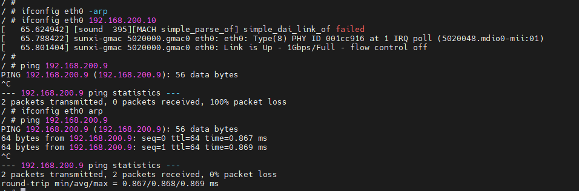

### route

设置和查看路由表都可以用 route 命令，设置内核路由表的命令格式是：

```shell
# route  [add|del] [-net|-host] target [netmask Nm] [gw Gw] [[dev] If]
```

其中：

-   add：添加一条路由规则；
-   del：删除一条路由规则；
-   \-net：目的地址是一个网络；
-   \-host：目的地址是一个主机；
-   target：目的网络或主机；
-   netmask：目的地址的网络掩码；
-   gw：路由数据包通过的网关；
-   dev：为路由指定的网络接口。

示例：


```shell
route add -host 192.168.200.9 dev eth0 #添加eth0的目的地址为192.168.200.9
route add -host 192.168.200.9 gw 192.168.200.1 #添加到目的地址192.168.200.9经过网关192.168.200.1
```

### mii\_reg

`mii_reg` 工具是GMAC驱动中提供的调试节点，其主要作用是对外部PHY寄存器地址进行读写操作。

启动网卡：

```shell
ifconfig eth0 up
```

进入操作目录：

```shell
cd sys/devices/platform/soc@3000000/450000.eth
```

注：不同的目录可能会因板卡不同有差异，此处为大致路径。

读取对应的phy寄存器：

```shell
addr: PHY地址
reg: PHY寄存器
val: 数据
```

写操作：

```shell
echo addr reg val > mii_write; cat mii_write
eg:
echo 0x00 0x1f 0xa43 > mii_write; cat mii_write
```

读操作：

```shell
echo addr reg > mii_read; cat mii_read
eg:
echo 0x10 0x06 > mii_read; cat mii_read
```

一次读多位寄存器操作: 0x01~0x0a

```shell
cat mii_reg
```

-   `udhcpc`
-   `ethtool`

### 常用测试方法

#### 查看网络设备信息

-   查看网口状态：`ifconfig eth0 -a`
-   查看收发包统计：`cat /proc/net/dev`
-   查看当前速率：`cat /sys/class/net/eth0/speed`

#### 打开/关闭网络设备

-   打开网络设备：`ifconfig eth0 up`

对于 GMAC 会显示 LOG：

```
sunxi-gmac 4500000.gmac0 eth0: eth0: Type(9) PHY ID 001cc916 at 1 IRQ poll (4500048.mdio0-mii:01)
```

插上网线

-   关闭网络设备：`ifconfig eth0 down`

```
sunxi-gmac 4500000.gmac0 eth0: Link is Down
```

### 配置网络设备

-   配置静态IP地址：`ifconfig eth0 192.168.1.110`
-   配置MAC地址：`ifconfig eth0 hw ether 00:11:22:aa:bb:cc`
-   动态获取IP地址：`udhcpc -i eth0`
-   PHY强制模式：`ethtool -s eth0 speed 1000 duplex full autoneg on`（设置1000 Mbps速率、全双工、开启自协商）

### 测试网络联通

-   设备连通性测试

ping 对端 ip 地址，本机ip和对端ip的前三个网段需相同才能ping通。

```
ping 192.168.1.100
```

-   TCP 吞吐测试

假设 Server 端 IP 为：192.168.1.100

```
Server端：iperf3 -s -i 1
Client端：iperf3 -c 192.168.1.100 -i 1 -t 60
```

-   UDP 吞吐测试

假设 Server 端 IP 为：192.168.1.100

```
Server端：iperf3 -s -u -i 1
Client端：iperf3 -c 192.168.1.100 -u -b 1000M -i 1 -t 60
```

### 本地网络环路性能测试

```
iperf3 -s &;iperf3 -c 127.0.0.1
```

### delay参数节点

delay参数调试节点是GMAC驱动中提供的调整千兆RGMII接口时序的节点。

进入操作目录：

```shell
cd /sys/devices/platform/soc/gmac/
```

注：不同的目录可能会因板卡不同有差异，此处为大致路径。

调整rxdelay时序：

```shell
#rx_delay：val - rxdelay参数，0~31共32挡，每档将采样时间推迟约130ps
echo val > rx_delay; cat rx_delay
```

调整txdelay时序：

```shell
#tx_delay：val - txdelay参数，0~7共8档，每档将采样时间推迟约536ps
echo val > tx_delay; cat tx_delay
```

### jumbo帧测试方法

准备两台均支持jumbo帧的板卡直连对测。

步骤：

以千兆网卡为例；

（1）板卡A：`ifconfig eth0 mtu 8100`，板卡B：`ifconfig eth0 mtu 8100`（设置eth0的mtu大小为8100）；

（2）板卡A：`ifconfig eth0 192.168.200.10`，板卡B：`ifconfig eth0 192.168.200.9`；

（3）板卡A：`ping 192.168.200.9 -s 8000`（传输8000长度的数据）。

注：

（1）百兆网卡不存在带宽不足情况，一般不需要使用jumbo帧；

（2）百兆网卡支持的 jumbo 帧范围为1500至4000，千兆网卡支持的 jumbo 帧范围为 1500 至 8100；

（3）测试时两端mtu无需设置成相同大小；

（4）ping通即表明测试通过；

（5）ping传输8000长度的原因：mtu为整个以太网帧的长度，ping工具指定的长度8000为纯数据长度，不包括ICMP及以太网报头的长度。

### 以太网回环测试

**问题背景：**

以太网能正常up，但是ping不通。

**复现步骤：**

ping对端设备，例如`ping 192.168.200.9。`

**问题分析：**

-   PHY被设置成回环模式后，从MAC经过RMII/RGMII发送过来的数据不会再被发送到MDI上，而是在PHY内部PCS层进行回环，被回环到RGMII/RMII的接收通道，如下图所示；

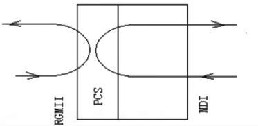

-   当设置了PHY的回环模式后，往外发包，如果小机端的rx能正常接收到数据，说明需要检查PHY到对端的硬件电路有无异常，反之需要检查RMII/RGMII接口的硬件电路有无异常；

**测试办法：**

-   通过GMAC驱动提供的节点，设置PHY的回环模式；

```
cd /sys/devices/platform/soc@3000000/4500000.gmac0 #注：此处为大致路径，不同版本内核路径有轻微差异
echo 2 > loopback_test; cat loopback_test
```

-   往外ping包，观察tx和rx的增长数量是否一致，若tx和rx的增长数量一致，则需要重点排查PHY到对端的硬件电路有无异常；若不一致（例如rx收不到包或数量少于tx），则需要重点排查RMII/RGMII接口的硬件电路有无异常。

## 以太网带宽测试

-   对端准备一块经过验证的千兆带宽达标（>=900Mbps）或百兆带宽达标的（>=90Mbps）板子/PC；
-   保持测试板卡系统处于低负载状态，关闭无关DEBUG选项及不跑非原生应用；
-   将对端与测试板卡用网线直连；
-   指定双方IP地址为同一网段，例如：测试板卡 `ifconfig eth0 192.168.200.10`，对端：`ifconfig eth0 192.168.200.9`，PC的IP地址修改请参考7.2章节；
-   发送测试：对端输入`iperf -s -i 1`，测试板卡输入`iperf -c 192.168.200.9 -i 1 -t 60`；
-   接收测试：测试板卡输入`iperf -s -i 1`，对端输入`iperf -c 192.168.200.10 -i 1 -t 60`。

若按照上述步骤测试后，千兆带宽不达标，可能的影响因素包括：

-   **单核CPU算力：** DDR频率、CPU自身算力、CPU频率、CPU的访存能力都会影响到CPU算力；
-   **IP差异：** GMAC使用AHB总线比GMAC-200的AXI总线带宽少10~40M左右；
-   **系统负载：** 以太网性能测试属于CPU消耗型任务，测试时系统需要保持在低负载的状态下，并且关闭无关的内核DEBUG选项；
-   **硬件信号：** 硬件信号时序（保证建立保持时间最优，请使用7.4章节节点调试），硬件信号质量；
-   **对端的发送与接收能力：** 以太网测试时确保对端是经过验证的千兆带宽达标的平台；
-   **总线抢占：** 其他模块抢占GMAC的AHB总线及新GMAC的AXI总线带宽；
-   **中断抢占及调度抢占：** Android固件建议在测试时把GMAC中断放在单独的核上（比如大核，命令例如：`echo f0 > /proc/irq/498/smp_affinity`，注：498是指GMAC的中断号，具体请以实际平台为准），Linux固件由于场景简单，一般无此需求。

注：

-   为什么要使用一块经过验证千兆带宽达标的板子直连对测；
    -   千兆达标的板子：对端的带宽吞吐能力会直接影响到测试板卡的吞吐；
    -   直连对测：避免引入无关因素，比如路由器的吞吐能力；
-   若测试千兆请使用**千兆网线；**

## 常见问题

### ifconfig命令无eth0节点

**问题现象**

执行ifconfig eth0无相关log信息。

**常见原因**

以太网模块配置未打开或存在GPIO冲突。

**排查步骤：**

（1）抓取内核启动log，检查驱动probe是否成功；

（2）如果无驱动相关打印，请确认以太网基本配置是否打开；

（3）如果驱动probe失败，请log定位具体原因，常见原因是GPIO冲突导致。

### 网络不通或网络丢包

**问题现象：**

ping不通对端设备、无法动态获取ip地址或有丢包现象。

**问题分析：**

一般原因是tx/rx通路不通

**排查步骤：**

（1）检查 `ifconfig eth0 up` 是否正常；

（2）检查 `eth0` 能否动态获取 `IP` 地址；

（3）若步骤1正常，但步骤2异常，需首先确认 `TX/RX` 哪条通路不通；

（4）若无法动态获取 `IP` 地址，可配置静态 `IP`，和对端设备互相 `ping`，如果和电脑对测，确保防火墙不会影响测试；

（5）检查对端设备能否收到数据包，若能收到，则说明 `TX` 通路正常，否则 `TX` 通路异常；

（6）检查本地设备能否收到数据包，若能收到，则说明 `RX` 通路正常，否则 `RX` 通路异常；

（7）若 `TX` 通路异常，可调整 `tx-delay` 参数或对照原理图检查 `TX` 通路是否异常，如漏焊关键器件；

（8）若 `RX` 通路异常，可调整 `rx-delay` 参数或对照原理图检查 `RX` 通路是否异常，如漏焊关键器件；

（9）若经过上述排查步骤问题仍未解决，需检查 `PHY` 供电与 `GPIO` 耐压是否匹配。

### 插入网线内核不打印 Link is Up

#### 内核打印 `Link is Up` 的条件

-   保持网线插入网口，并连接以太网功能正常的对端设备；
-   `ifconfig up` 网卡后，软件会起一个 1s 的轮询机制；
-   轮询查询 `PHY` 的 `02` 寄存器的 `Link status` 标志位，若为 `1`，则根据 `PHY` 的速率/双工 更改 `MAC` 的速率/双工，并打印 `Link is up - xxxMbps/Full` ，若为 `0`，则打印 `Link is Down`；
-   只有 `Link status` 发生改变时才会打印，比如 `0->1` `1->0`；
-   `PHY` 的 `Link status` 标志位是只读的，根据两端 `PHY` 的自协商情况完成置 `1`/清 `0`，若遇到频繁 `Up/Down` 的情况，请排查硬件问题。

#### 常见问题

-   以太网 PHY 外围电路不对，导致无法 Link UP：
    
    -   客户设计板子，空贴了 RSET 电阻，导致以太网 PHY 参考电压错误，导致无法 Link UP
    
    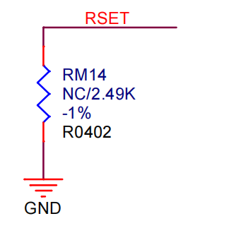
    
-   以太网 MDI 接口外围电路不对，导致无法 Link UP：
    
    -   客户设计的板子，以太网外围电路使用 Chip Lan 方式，使用 3.3 欧电阻串接分立变压器，出现插入网线无法 Link 的问题，与 PHY 原厂沟通确认，此电路采用的网口变压器是分离的方式，需要加 ac couple，否则会引入dc offset，因此需要串 100nF 电容进行隔直 DC 分量，而不是 3.3 欧电阻
    
    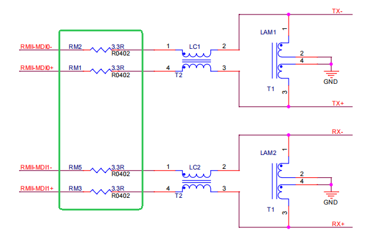
    
-   软件操作不当，导致无法 Link UP：
    
    -   系统启动默认没有执行 `ifconfig eth0 up`，此时插入网线系统不会检测是否有网线插入，请先执行 `ifconfig eth0 up`

### 找不到 PHY

运行 `ifconfig eth0 up` 显示如下输出

```
# GMAC
[ 25.506200] sunxi-gmac gmac0 eth0: Error：Could not connect to phy
```

-   检查 `PHY` 是否正确初始化：确保给 `PHY` 供给了 `25M` 时钟，正确设置了 `PINMUX`，以及确保 `PIN BANK` 电压已开启（如果适用）。如果出现 `PHY` 供电异常，可以检查供电电路以确保正常工作。此外，确保在激活网卡之前给 `PHY` 做了复位操作，以确保其处于正确的状态。如果遇到问题，请参考第六章的指南来检查 `PHY` 的硬件最小系统。
    
-   在更换了 `PHY` 之后，要特别注意 `PHY` 地址是否发生了变化。如果 `PHY` 地址发生了变化，需要相应地更新配置文件或软件中的 `PHY` 地址。这可能涉及到重新编译驱动程序或更新设备树等操作。确保在更新后，系统能够正确识别并与新的 `PHY` 进行通信。
    
-   使用示波器检查 `PHY` 的 `25M` 时钟是否正常，并使用万用表检查 `PHY` 的供电情况，包括 `AVDD33`、`DVDDIO`、`ADVDD10OUT`、`DVDD10OUT` 等电压是否正常。
    
-   在设备树（`dts`）中配置 `PHY` 的复位引脚：请参考原理图，将复位引脚配置到设备树的 `phy` 子节点的 `reset-gpios` 属性中。
    
-   处理 `PHY` 地址变更：结合原理图上 `PHYADD` 相关引脚的电平，将 `PHY` 地址配置到设备树的 `phy` 子节点的 `reg` 属性中。如果无法确定 `PHY` 地址，有以下两种方法可以获取：
    
    -   使用`mii_reg` 工具手动读取对应地址的 `PHY` 寄存器，若能正确读取到寄存器（例如 `phyid` 寄存器），则表示 `PHY` 的地址为当前地址。
        
    -   打开 `mdio` 驱动（`GMAC` 对应 `sunxi-mdio.c`，`GMAC200` 对应 `stmmac_mdio.c`）开头的 `DEBUG` 宏，启动日志会打印 `PHY` 地址。以 `GMAC-200` 为例，日志如下所示，`PHYADDR` 即为 `PHY` 地址，将这个值写入设备树 `phy` 子节点的 `reg` 属性中。
        

```shell
[    2.814160] dwmac-sunxi 4510000.ethernet: PHYADDR = 1, PHYID = 0x1cc916
```

### MAC复位失败

运行 `ifconfig eth0 up` 显示如下输出

```
# GMAC
[ 11.315214] sunxi-gmac gmac1 eth0: Error: Mac reset failed, please check phy and mac clk
```

1.  **时钟引脚方向不正确**：
    -   对于 `RMII` 接口，确保 `MAC` 的 `TXCK` 引脚是输入，由 `PHY` 输出该信号。
    -   对于 `RGMII` 接口，确保 `MAC` 的 `RGMII_CLKIN` 是输入，由 `PHY` 输出该信号。
2.  **供给 `PHY` 的 `25M` 时钟偏差过大**：
    -   检查供给 `PHY` 的 `25M` 时钟频率是否在合理范围内（一般为 `25Mhz` ± `0.02Mhz`），请参考 `PHY` 的数据手册。
    -   如果时钟频率偏差过大，可能需要调整时钟源或修复时钟信号的源头问题。
3.  **时钟信号频率不稳定**：
    -   对于 `RMII` 接口，确保回给 `MAC` 的时钟信号频率在合理范围内。对于 `10M` 和 `100M` 的速率，时钟频率应为 `5Mhz` 和 `50Mhz`；对于 `1000M` 的速率，时钟频率应为 `125Mhz`。
    -   对于 `RGMII` 接口，时钟频率应为 `25Mhz`（对应 `100M` 速率）或 `125Mhz`（对应 `1000M` 速率）。
    -   如果时钟频率不稳定，可能需要检查时钟信号的源头和信号线路，确保其稳定性和质量，可能需要重新布线或者使用更稳定的时钟源。

一般情况下PHY不需要PHY驱动，走内核的通用驱动，但某些厂商的PHY需要特殊的PHY驱动支持，如果按照通用PHY的调试方法仍无法调通，请联系PHY厂商提供资料。

### 以太网PHY硬件排查方法

#### 电源检查

-   电压检查：用万用表测试电压，需满足规格书要求。对于PHY，需要检查PHY的电源电压和IO供电，以RTL8211，为例，VDD与IO供电要求如下：

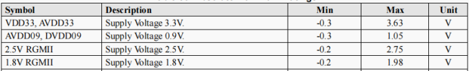

-   上电时序（示波器测量）、电压值（万用表测量）满足规格书要求。
-   上电波形检查：用示波器测试电源供电和IO供电的上电波形，核对是否存在电压过冲或跌落；若有电压波动，要求不能超过规格书的电压要求的范围，否则PHY可能工作异常；

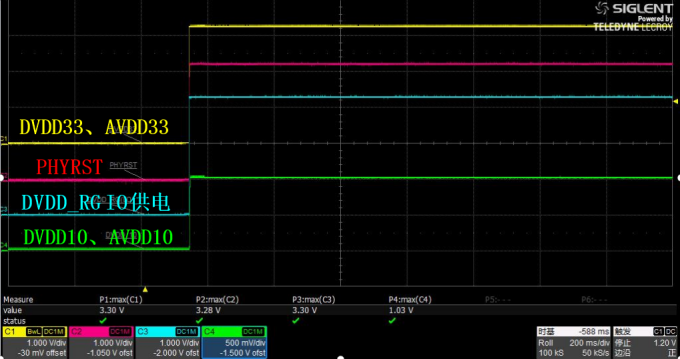

-   上电时序检查：根据规格书，确定PHY的上电时序是否正常；

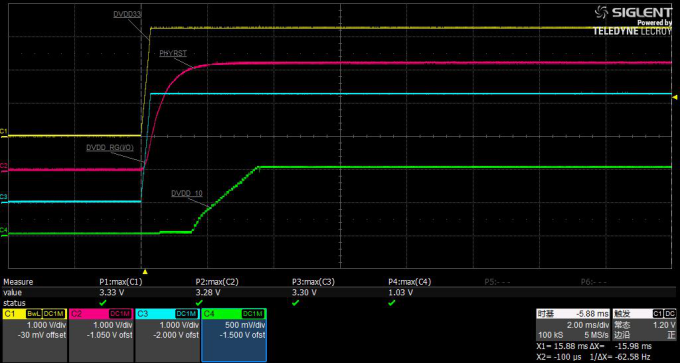

#### PHY 复位检查

用示波器测试上电波形是否满足规格书要求的Reset时序，一般要求PHYRST拉低10ms。示波器测量实际波形如下，实测PHYRSTB低电平为20.1ms，满足时序要求：

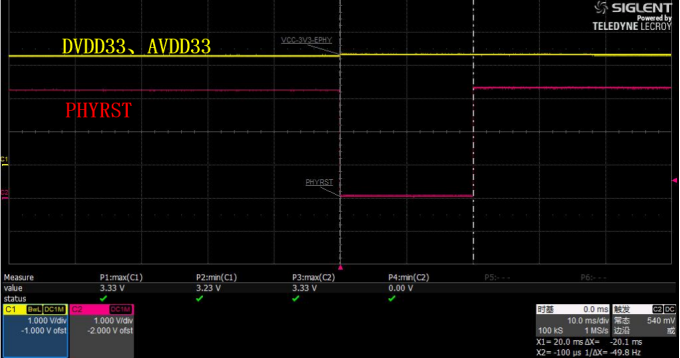

#### 时钟检查

PHY的基准时钟一般由晶振或SOC 25M\_CLK提供，用示波器测试信号是否存在，频率偏差是否过大：

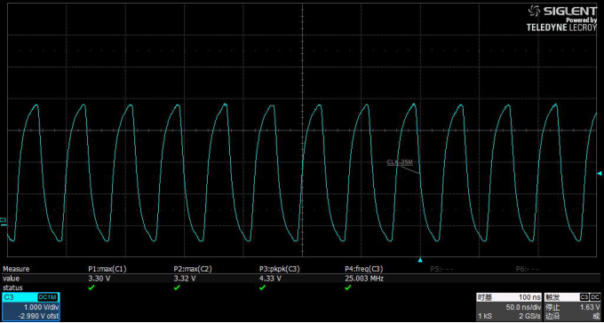

#### 外围电路配置

根据PHY规格书检查电路配置，如rtl8211，其兼容了RGMII和GMII两个模式，IO电压可以配置为3.3V、2.5V、1.8V、1.5V等，需要通过外围电路配置，若配置错误，可能引起工作异常；

-   信号检查：检查SOC端输出信号（RMII与RGMII）是否存在错接，少接的情况；
-   PHY地址检查：确认是否与软件设定相匹配；

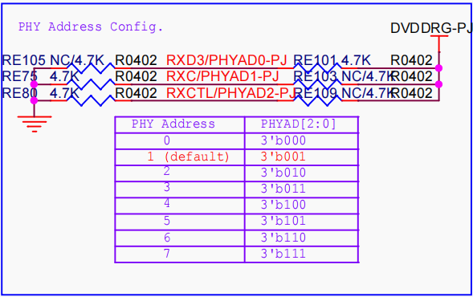

-   时钟配置以选择晶振输入或SOC 25M时钟输入；
    -   其中使用PHY使用SOC时钟输入时，XTAL-IN引脚需要接GND；

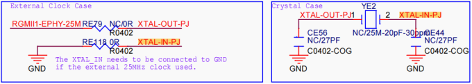

-   IO电压配置：要求SOC IO供电与PHY IO供电相匹配；

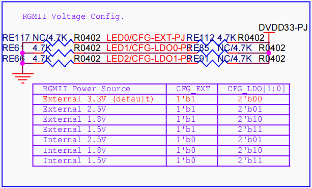

-   参考时钟配置：以RTL8201为例，REF\_CLK 下拉，表示时钟输出;

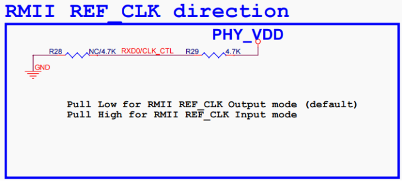

-   模式配置：以RTL8201为例，可以配置RMII 或 MII两个2模式，SOC一般只支持RMII/RGMII两种，需要配置RMII/RGMII

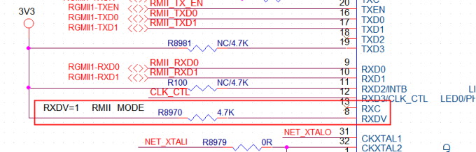
