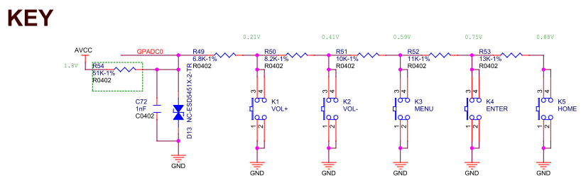
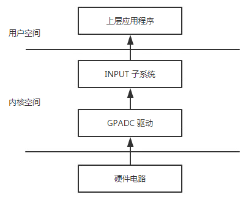
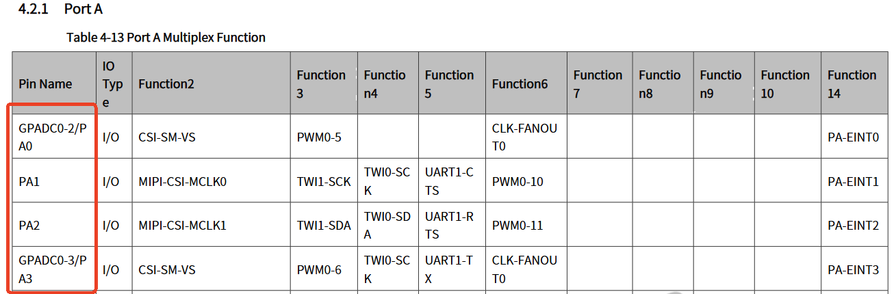
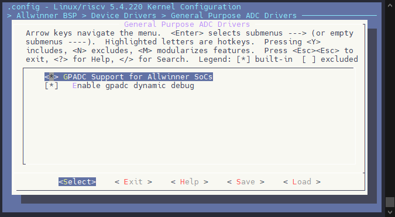
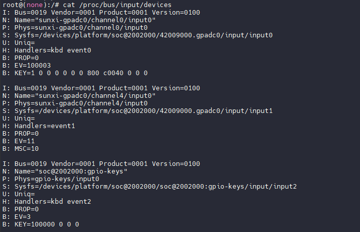
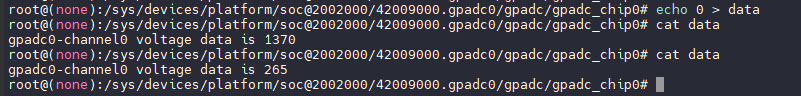
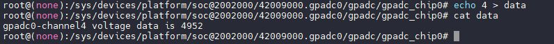
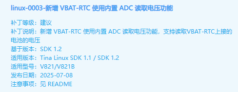

# GPADC - ADC 按键与采样

GPADC是12bit分辨率，10位采集精度的模数转换模块，具体精度和通道数可以参考芯片手册，模拟输入范围0～1.8V，最高采样率1MHz，并且支持数据比较，自校验功能，同时工作于可配置以下工作模式：

1.  Single mode： 在指定的通道完成一次转换并将数据放在对应数据寄存器中；
2.  Single-cycle mode： 在指定的通道完成一个周期转换并将数据放在响应数据寄存器中(注：该模式在R528中没有)；
3.  Continuous mode： 在指定的通道持续转换并将数据放在响应数据寄存器中；
4.  Burst mode： 边采样边转换并将数据放入32字节的FIFO，支持中断控制。



部分GPADC接口也开始慢慢用于KEY模块按键的读取，一般包括 VOL+、VOL-、HOME、MENU、ENTER 等等，GPADC0用于KEY的电路如上图。

AVCC-AP为1.8V的供电，不同的按键按下，GPADC0口的电压不同，CPU通过对这个电压的采样来确定具体是那一个按键按下。如上图， VOL+、VOL-、MENU、ENTER、HOME/UBOOT 对应的电压分别为 0.21V、0.41V、0.59V、0.75V、0.88V。

:::tip

:::note

提示

:::
:::note

部分芯片（如 V821）的 Channel4 固定为 VBAT-RTC 的 ADC，用于读取当前接到 VBAT-RTC 上电源的电压，用于计算当前电池剩余电量。使用这个功能需要配置 CH4 为 ADC 功能。其电压计算方式为：

$$V_{\text{BAT}} = \text{CH4\_GPADC\_DATA} \times 4$$

具体芯片是否支持此功能，请参考对应芯片的数据手册。

:::

:::

## 软件框架介绍



在 GPADC 模块触发中断后，驱动程序会开始采集数据。采集到的数据经过处理并转换为相应的键值，随后通过input子系统上传至 `/dev/input/event` 节点。应用程序可以通过访问该节点来获取相关数据。

## 模块配置介绍

### 设备树配置

在 SoC 级的 dtsi 文件中，提取了内存基地址、中断控制、时钟等共性信息，这些配置适用于该类芯片的所有平台。SoC级的 dtsi 文件路径为：`bsp/configs/linux-5.4-ansc/{chip_platform}.dtsi`，以下为 `gpadc0` 的配置示例：

bsp/configs/linux-5.4-ansc/\{chip\_platform\}.dtsi

```c
gpadc0: gpadc0@42009000 {
	compatible = "allwinner,sunxi-gpadc-v104";
	reg = <0x0 0x42009000 0x0 0x400>;
	interrupts-extended = <&plic0 58 IRQ_TYPE_LEVEL_HIGH>;
	clocks = <&ccu CLK_GPA>, <&ccu CLK_GPADC0_24M>;
	clock-names = "bus", "hosc";
	resets = <&ccu RST_BUS_GPADC>;
	reset-names = "bus";
	vref-supply = <&pmu_soc_ldo1>;
	status = "disabled";
};
```

:::tip

:::note

提示

:::
:::note

`{chip_platform}` 为对应芯片平台的标识符（如 V821 对应 sun300iw1p1），具体名称和路径请参考对应芯片的 SDK 目录结构。

:::

:::
:::tip

:::note

提示

:::
:::note

这部分 GPADC 设备树不需要配置，使用 SDK 默认配置即可

:::

:::

在板级配置的 `board.dts` 中，配置每个 GPADC 通道的配置项，属性，功能，模式。具体配置可以使用 GPADC 配置向导生成设备树。

## GPADC 配置向导

### 步骤 1: 选择 GPADC 控制器

选择需要配置的 GPADC 控制器，请参照手册（大部分芯片仅有一个控制器，这个是选择 GPADC 控制器不是通道）:请选择控制器GPADC0GPADC1GPADC2

  

#### GPADC 示例配置

```c
&gpadc0 {
	channel_num = <5>;
	channel_select = <0x3>;
	channel_data_select = <0x3>;
	channel_compare_select = <0x3>;
	channel_cld_select = <0x3>;
	channel_chd_select = <0x3>;
	channel0_compare_lowdata = <1700000>;
	channel0_compare_higdata = <1200000>;
	channel1_compare_lowdata = <460000>;
	channel1_compare_higdata = <1200000>;
	deferred-device;
	status = "okay";
	keyadc0 {
		key_cnt = <5>;
		key0_vol = <210>;
		key0_val = <KEY_VOLUMEUP>;
		key1_vol = <410>;
		key1_val = <KEY_VOLUMEDOWN>;
		key2_vol = <590>;
		key2_val = <KEY_MENU>;
		key3_vol = <750>;
		key3_val = <KEY_OK>;
		key4_vol = <880>;
		key4_val = <KEY_HOME>;
	};
};
```

**channel\_num = &lt;5>;**

-   **功能**：指定平台支持的最大通道数。在这个例子中，平台最多支持 5 个通道。
-   **配置方法**：查看手册可知该平台支持多少通道的 ADC

**channel\_select = &lt;0x3>;**

-   **功能**：设置要启用的通道。值`0x3`是16进制，转化为二进制是`0000 0011`。
    -   对应的二进制位表示的是通道的启用情况，最低位表示通道0，第二位表示通道1，以此类推。
    -   `0x3`二进制为`0000 0011`，意味着启用了通道0和通道1（最低两位为1，表示启用）。
    -   **解释**：`0x3`启用了第0和第1通道。

**channel\_data\_select = &lt;0x3>;**

-   **功能**：使能通道的数据采集。值`0x3`是16进制，转化为二进制是`0000 0011`。
    -   类似于`channel_select`，每个二进制位表示一个通道的采集使能，位为1表示启用该通道的数据采集。
    -   `0x3`表示启用了第0和第1通道的数据采集功能。
    -   **解释**：`0x3`表示启用第0和第1通道的数据采集。

**channel\_compare\_select = &lt;0x3>;**

-   **功能**：使能通道的比较功能。值`0x3`是16进制，转化为二进制是`0000 0011`。
    -   每个二进制位表示是否启用对应通道的比较功能，1表示启用，0表示不启用。
    -   `0x3`表示启用了第0和第1通道的比较功能。
    -   **解释**：`0x3`启用了第0和第1通道的比较功能。

**channel\_cld\_select = &lt;0x3>;**

-   **功能**：使能通道的数据“小于比较”功能（即低阈值比较）。值`0x3`是16进制，转化为二进制是`0000 0011`。
    -   每个二进制位表示是否启用对应通道的“数据小于比较”功能，1表示启用，0表示不启用。
    -   `0x3`表示启用了第0和第1通道的“小于比较”功能。
    -   **解释**：`0x3`启用了第0和第1通道的数据“小于”比较功能。

**channel\_chd\_select = &lt;0x3>;**

-   **功能**：使能通道的数据“大于比较”功能（即高阈值比较）。值`0x3`是16进制，转化为二进制是`0000 0011`。
    -   每个二进制位表示是否启用对应通道的“数据大于比较”功能，1表示启用，0表示不启用。
    -   `0x3`表示启用了第0和第1通道的“大于比较”功能。
    -   **解释**：`0x3`启用了第0和第1通道的数据“大于”比较功能。

**channel0\_compare\_lowdata = &lt;1700000>;**

-   **功能**：指定第0通道的低阈值（当数据大于该值时触发中断）。此值为`1700000`，是一个整数，没有二进制位的表示。该配置与二进制相关的部分是比较值的触发。

**channel0\_compare\_higdata = &lt;200000>;**

-   **功能**：指定第0通道的高阈值（当数据小于该值时触发中断）。此值为`200000`。

**channel1\_compare\_lowdata = &lt;1700000>;**

-   **功能**：指定第1通道的低阈值。当第1通道的数据大于`1700000`时将触发中断。

**channel1\_compare\_higdata = &lt;200000>;**

-   **功能**：指定第1通道的高阈值。当第1通道的数据小于`200000`时将触发中断。

:::info

:::note

信息

:::
:::note

-   配置项`channel_select`、`channel_data_select`、`channel_compare_select`、`channel_cld_select`、`channel_chd_select`等，使用16进制表示通道的启用和功能选择，二进制的每一位代表一个通道。
-   比较阈值`channel0_compare_lowdata`、`channel0_compare_higdata`等则是整数值，用来定义当通道数据小于或大于该值时触发中断的条件。
-   当 GPADC 通道用作按键，那么此通道的 `data_select` 不能打开，因为打开 `data` 中断，会一直上报

例如，`0x3`代表二进制`0000 0011`，表示启用了通道0和通道1的相关功能。

:::

:::

配置功能：

通道 0：

-   模式: 按键 上限: 1699999 uV, 下限: 1200000 uV
    -   按键 0 - 键值: 110, 电压: 280 mV
    -   按键 1 - 键值: 111, 电压: 480 mV

通道 1：

-   模式: 按键
    -   按键 0 - 键值: 112, 电压: 270 mV
    -   按键 1 - 键值: 113, 电压: 340 mV

通道 4：

-   模式: ADC

```c
&gpadc0 {
	channel_num = <5>;
	channel_select = <0x13>;
	channel_data_select = <0x10>;
	channel_compare_select = <0x2>;
	channel_cld_select = <0x2>;
	channel_chd_select = <0x2>;
	channel1_compare_lowdata = <1200000>;
	channel1_compare_higdata = <1699999>;
	status = "okay";
	keyadc0 {
		key_cnt = <2>;
		key0_vol = <280>;
		key0_val = <110>;
		key1_vol = <480>;
		key1_val = <111>;
	};
	keyadc1 {
		key_cnt = <2>;
		key0_vol = <270>;
		key0_val = <112>;
		key1_vol = <340>;
		key1_val = <113>;
	};
};
```

### 工作模式配置

GPADC支持不同工作模式的配置，支持模式如下：

-   **单次模式**：GPADC 在这种模式下只进行一次采样，然后停止。
-   **单周期模式**：GPADC 在每个采样周期内进行一次采样。
-   **连续模式**：GPADC 连续的进行采样。
-   **突发模式**：GPADC 在短时间内快速进行多次采样，然后停止。

默认GPADC采用连续模式。

若要配置GPADC为不同工作模式，需要在 `board.dts` 里面配置相关参数，参考如下：

```c
 &gpadc0 {
     gpadc_mode_select = <0x2>;
     status = "okay";
};
```

gpadc\_mode\_select配置值参考如下:

| **工作模式** | gpadc\_mode\_select值 |
| --- | --- |
| 单次模式 | 0x0 |
| 单周期模式 | 0x1 |
| 连续模式 | 0x2 |
| 突发模式 | 0x3 |

### 引脚复用配置

部分芯片平台上，GPADC 引脚和 GPIO 是复用的，但是不是作为功能复用的，没有写到后面的 Function 里，所以需要使用这个 GPADC 的时候，需要将 GPIO MUX 切换为 `io_disabled`，即可使用 GPADC 功能。

:::tip

:::note

提示

:::
:::note

具体哪些 GPADC 通道与 GPIO 复用，请参考对应芯片的数据手册。

:::

:::

这里以 PA0 引脚的 GPADC2 为例，配置为按键模式：



```c
&pio {
	gpadc0_ch2_default: gpadc0_ch2@0 {
		pins = "PA0";
		function = "io_disabled";
	};
};

&gpadc0 {
	channel_num = <5>;
	channel_select = <0x4>;
	channel_data_select = <0x0>;
	channel_compare_select = <0x4>;
	channel_cld_select = <0x4>;
	channel_chd_select = <0x4>;
	channel2_compare_lowdata = <1200000>;
	channel2_compare_higdata = <460000>;
	pinctrl-names = "default";
	pinctrl-0 = <&gpadc0_ch2_default>;
	status = "okay";
	keyadc2 {
		key_cnt = <2>;
		key0_vol = <560>;
		key0_val = <110>;
		key1_vol = <840>;
		key1_val = <111>;
	};
};
```

### 内核驱动配置

```
Allwinner BSP  --->
    Device Drivers  --->
    	General Purpose ADC Drivers  --->
    		<*> GPADC Support for Allwinner SoCs
    		[*]   Enable gpadc dynamic debug       <- 调试功能
```



## 模块接口说明

### evdev\_open

```c
static int evdev_open(struct inode *inode, struct file *file);
```

**功能描述**：程序（C语言等）使用`open(file)`时调用的函数。打开一个gpadc设备，可以像文件读写的方式往gpadc设备中读写数据。

**参数说明**：

-   `inode`：inode节点
-   `file`：file结构体

**返回值**：

-   文件描述符

### evdev\_read

```c
static ssize_t evdev_read(struct file *file, char __user *buffer, size_t count, loff_t *ppos);
```

**功能描述**：程序（C语言等）调用`read()`时调用的函数。像往文件里面读数据一样从gpadc设备中读数据。底层调用`gpadc_xfer`传输数据。

**参数说明**：

-   `file`: file结构体
-   `buffer`: 写数据buf
-   `ppos`: 文件偏移

**返回值**：

-   成功返回读取的字节数，失败返回负数

### evdev\_write

```c
static ssize_t evdev_write(struct file *file, const char __user *buffer, size_t count, loff_t *ppos);
```

**功能描述**：程序（C语言等）调用`write()`时调用的函数。像往文件里面写数据一样往gpadc设备中写数据。底层调用`gpadc_xfer`传输数据。

**参数说明**：

-   `file`: file结构体
-   `buffer`: 读数据buf
-   `ppos`: 文件偏移

**返回值**：

-   0: 成功
-   负数：失败

### evdev\_ioctl

```c
static long evdev_ioctl(struct file *file, unsigned int cmd, unsigned long arg);
```

**功能描述**：程序（C语言等）调用`ioctl()`时调用的函数。像对文件管理i/o一样对gpadc设备管理。该功能比较强大，可以修改gpadc设备的地址，往i2c设备里面读写数据，使用smbus等等，详细的可以查阅该函数。

**参数说明**：

-   `file`: file结构体
-   `cmd`: 指令
-   `arg`: 其他参数

**返回值**：

-   0: 成功
-   负数：失败

### sunxi\_gpadc\_read\_channel\_data

```c
u32 sunxi_gpadc_read_channel_data(u32 controller_num, u8 channel);
```

**功能描述**：内核态中获取某个gpadc控制器具体通道的电压值

**参数说明**：

-   `controller_num`: 具体的gpadc控制器
-   `channel`: 具体的gpadc控制器的通道

**返回值**：

-   获取到的电压

## 功能开发

GPADC功能主要用于获取输入的电压，广泛应用于电压监测、按键输入等场景。

-   **步骤1**：调用 `open` 打开文件路径，获取文件描述符。

```c
gpadc_fd = open("/dev/input/event3", O_RDONLY);
```

-   **步骤2**：调用 `read` 读取 `GPADC` 数据。

```c
read(gpadc_fd, &data, sizeof(data));
```

-   **步骤3**：判断上报事件。
    
    -   如果是按键事件，调用以下接口进行处理：
    
    ```c
    if(data.type == EV_KEY && data.value == 1)
    {
        printf("key %d pressed\n", data.code);
    }
    else if(data.type == EV_KEY && data.value == 0)
    {
        printf("key %d released\n", data.code);
    }
    ```
    
    -   如果是 ADC 数据事件，调用以下接口进行处理：
    
    ```c
    if(data.type == EV_MSC)
    {
        printf("adc data %d\n", data.value);  // 接收到的ADC数据
        printf("adc vol: %d mv\n", 18000 * data.value / 4096);  // 电压值，单位为毫伏
    }
    ```
    
-   **步骤4**：使用完毕后，关闭设备。
    

```c
close(gpadc_fd);
```

:::info

:::note

信息

:::
:::note

注意事项：

-   确保 `open` 的路径正确，确认 `event` 编号无误。
-   在进行电压换算时，确保参考电压值正确，通常参考电压为 1.8V。

:::

:::

## 编程示例

该 Demo 用来读取GPADC模块用于KEY的按键上报事件（其他类似）。其循环10次读取按键上报事件输入，并且显示出相应按键的值。

```c
#include <stdio.h>
#include <linux/input.h>
#include <stdlib.h>
#include <sys/types.h>
#include <sys/stat.h>
#include <fcntl.h>
#include <sys/time.h>
#include <limits.h>
#include <unistd.h>
#include <signal.h>

#define DEV_PATH "/dev/input/event3"   /* 查看devices节点下Handlers时间编号，不同gpadc修改event编号，如event1 */
const int key_exit = 102;
static int gpadc_fd = 0;

unsigned int test_gpadc(const char * event_file)
{
    int code = 0, i;

    struct input_event data;

    gpadc_fd = open(event_file, O_RDONLY);

    if(gpadc_fd <= 0)
    {
        printf("open %s error!\n", event_file);
        return -1;
    }

    for(i = 0; i < 10; i++) /* 读10次 */
    {
        read(gpadc_fd, &data, sizeof(data));
        /* 如果是按键，调用用以下接口 */
        if(data.type == EV_KEY && data.value == 1) /* 按键按下判断 */
        {
            printf("key %d pressed\n", data.code);
        }
        else if(data.type == EV_KEY && data.value == 0) /* 按键释放判断 */
        {
            printf("key %d releaseed\n", data.code);
        }
        /* 如果是adc，调用以下接口 */
        if(data.type == EV_MSC)
        {
            printf("adc data %d\n", data.value); /* 接收到的数据 */
            printf("adc vol: %d mv\n", 18000 * data.value / 4096 ); /* 电压值，单位mv */
        }
    }

    close(gpadc_fd);
    return 0;
}

int main(int argc,const char *argv[])
{
    test_gpadc(DEV_PATH);
    return 0;
}
```

## 调试方法

### EVENT接口

在内核中，查看 `/proc/bus/input/devices`，确认GPADC的数据上报节点。

```
cat /proc/bus/input/devices
```

输出如下

```
root@(none):/# cat /proc/bus/input/devices
I: Bus=0019 Vendor=0001 Product=0001 Version=0100
N: Name="sunxi-gpadc0/channel0/input0"
P: Phys=sunxi-gpadc0/channel0/input0
S: Sysfs=/devices/platform/soc@2002000/42009000.gpadc0/input/input0
U: Uniq=
H: Handlers=kbd event0
B: PROP=0
B: EV=100003
B: KEY=1 0 0 0 0 0 0 800 c0040 0 0 0

I: Bus=0019 Vendor=0001 Product=0001 Version=0100
N: Name="sunxi-gpadc0/channel4/input0"
P: Phys=sunxi-gpadc0/channel4/input0
S: Sysfs=/devices/platform/soc@2002000/42009000.gpadc0/input/input1
U: Uniq=
H: Handlers=event1
B: PROP=0
B: EV=11
B: MSC=10
```



然后直接在内核中 cat 相应的 event 节点，当GPADC模块采集到数据的时候，可以看到 GPADC 模块上报的数据。

注：不同的板子 `event` 节点的顺序不同。

```
cat /dev/input/event0
```

## SYSFS 节点

节点位于 SYSFS 内，用下面的命令进入

```
cd /sys/class/gpadc/gpadc_chip0/
```

### GPADC 通道开关

```
echo gpadc0,0 > status # 关闭gpadc0，'，'后可以为0或1， 0表示关闭，1表示开启；
cat status             # 查看gpadc各通道开关状态；
```

### GPADC 采样率

```
echo 5000 > sr # 设置gpadc采样率为10000，gpadc采样率范围为400~100000；
cat sr         # 查看gpadc当前采样率。
```

### 获取 ADC 通道电压

```
echo 0 > data   # 设置到 CH0 作为采集通道
cat data        # 获取当前电压值
```

配置 CH0 读取通道电压，没有按键按下时是 1370mV，按下按键是 265mV



:::tip

:::note

提示

:::
:::note

如果是通道 4 获取当前 VBAT-RTC 的 电压，直接获取的 DATA 便是转换过的电压



1.2 SDK 需要打入如下补丁



:::

:::

### 配置按键电压值

调试用功能，用于配置按键和电压值

```
echo vol0,125 > vol # 设置gpadc按键0的采样电压为125；
cat vol             # 查看所有按键的采样电压值与按键索引映射；
```

### 滤波阈值

```
echo 6 > filter # 设置滤波阈值为 6；
cat filter      # 查看滤波阈值。
```
