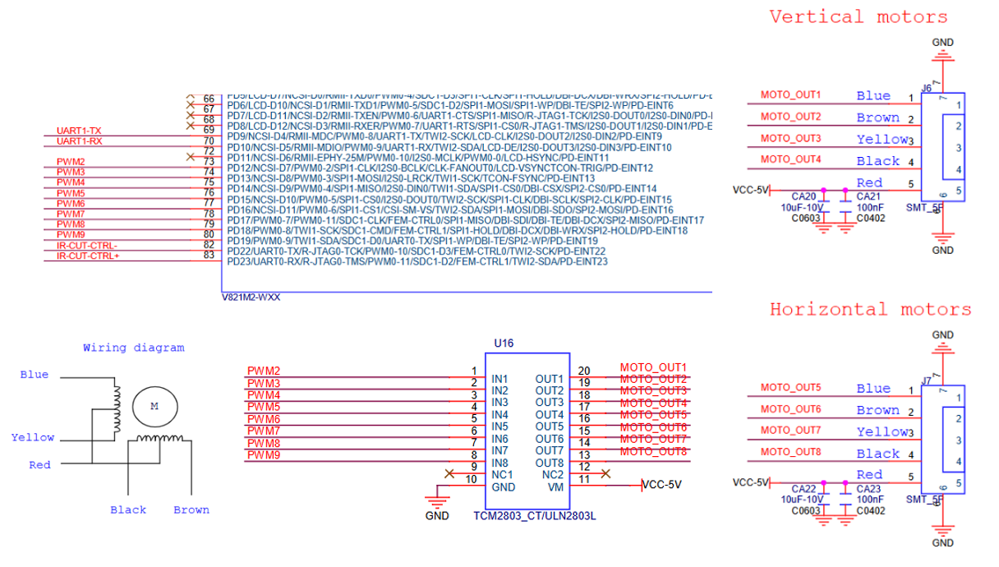
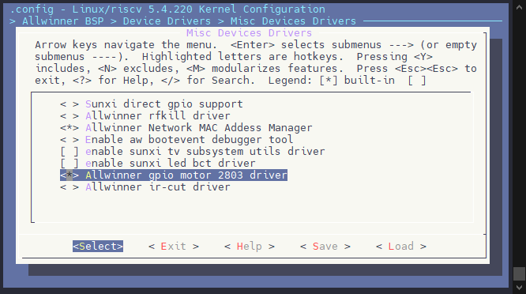
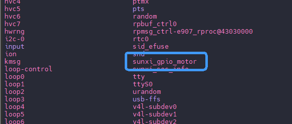

# GPIO Motor - 步进电机驱动

SDK 内置了步进电机驱动，支持驱动两路步进电机，适用于 2803 系列步进电机驱动芯片。该驱动通过 GPIO 控制步进电机的相位信号，可实现精确的步进控制，支持多种运动方向和速度调节。

其电路连接如下图所示：



## 驱动配置

### 内核驱动配置

执行 `make kernel_menuconfig` 进入内核配置驱动，前往下列路径

```
Allwinner BSP  --->
	Device Drivers  --->
		Misc Devices Drivers  --->
			<*> Allwinner gpio motor 2803 driver
```



### 设备树配置

步进电机的设备树配置如下，只需要修改对应的 IO 到对应的引脚即可：

```c
/{
    gpio-motor@0 {
        compatible = "allwinner,gpio-motor";
        ab-pin-black = <&pio PD 12 GPIO_ACTIVE_HIGH>;
        ab-pin-yellow = <&pio PD 13 GPIO_ACTIVE_HIGH>;
        ab-pin-brown = <&pio PD 14 GPIO_ACTIVE_HIGH>;
        ab-pin-blue = <&pio PD 15 GPIO_ACTIVE_HIGH>;
        cd-pin-black = <&pio PD 16 GPIO_ACTIVE_HIGH>;
        cd-pin-yellow = <&pio PD 17 GPIO_ACTIVE_HIGH>;
        cd-pin-brown = <&pio PD 18 GPIO_ACTIVE_HIGH>;
        cd-pin-blue = <&pio PD 19 GPIO_ACTIVE_HIGH>;
        status = "okay";
    };
};
```

正常配置后会生成节点 `/dev/sunxi_gpio_motor`



## 模块使用

GPIO Motor 支持使用普通文件I/O读写或 IOCTL 控制

```c
/*
* Copyright (c) 2019-2025 Allwinner Technology Co., Ltd. ALL rights reserved.
*
* Allwinner is a trademark of Allwinner Technology Co.,Ltd., registered in
* the the people's Republic of China and other countries.
* All Allwinner Technology Co.,Ltd. trademarks are used with permission.
*
* DISCLAIMER
* THIRD PARTY LICENCES MAY BE REQUIRED TO IMPLEMENT THE SOLUTION/PRODUCT.
* IF YOU NEED TO INTEGRATE THIRD PARTY’S TECHNOLOGY (SONY, DTS, DOLBY, AVS OR MPEGLA, ETC.)
* IN ALLWINNERS’SDK OR PRODUCTS, YOU SHALL BE SOLELY RESPONSIBLE TO OBTAIN
* ALL APPROPRIATELY REQUIRED THIRD PARTY LICENCES.
* ALLWINNER SHALL HAVE NO WARRANTY, INDEMNITY OR OTHER OBLIGATIONS WITH RESPECT TO MATTERS
* COVERED UNDER ANY REQUIRED THIRD PARTY LICENSE.
* YOU ARE SOLELY RESPONSIBLE FOR YOUR USAGE OF THIRD PARTY’S TECHNOLOGY.
*
*
* THIS SOFTWARE IS PROVIDED BY ALLWINNER"AS IS" AND TO THE MAXIMUM EXTENT
* PERMITTED BY LAW, ALLWINNER EXPRESSLY DISCLAIMS ALL WARRANTIES OF ANY KIND,
* WHETHER EXPRESS, IMPLIED OR STATUTORY, INCLUDING WITHOUT LIMITATION REGARDING
* THE TITLE, NON-INFRINGEMENT, ACCURACY, CONDITION, COMPLETENESS, PERFORMANCE
* OR MERCHANTABILITY AND FITNESS FOR A PARTICULAR PURPOSE.
* IN NO EVENT SHALL ALLWINNER BE LIABLE FOR ANY DIRECT, INDIRECT, INCIDENTAL,
* SPECIAL, EXEMPLARY, OR CONSEQUENTIAL DAMAGES (INCLUDING, BUT
* NOT LIMITED TO, PROCUREMENT OF SUBSTITUTE GOODS OR SERVICES;
* LOSS OF USE, DATA, OR PROFITS, OR BUSINESS INTERRUPTION)
* HOWEVER CAUSED AND ON ANY THEORY OF LIABILITY, WHETHER IN CONTRACT,
* STRICT LIABILITY, OR TORT (INCLUDING NEGLIGENCE OR OTHERWISE)
* ARISING IN ANY WAY OUT OF THE USE OF THIS SOFTWARE, EVEN IF ADVISED
* OF THE POSSIBILITY OF SUCH DAMAGE.
*/

#include <errno.h>
#include <fcntl.h>
#include <linux/serial.h>
#include <stdio.h>
#include <stdlib.h>
#include <string.h>
#include <sys/ioctl.h>
#include <sys/stat.h>
#include <sys/time.h>
#include <sys/types.h>
#include <termios.h>
#include <unistd.h>

/* dir mode define */
#define DIR_UP		 0x01
#define DIR_DOWN	 0x02
#define DIR_AB_SHIFT 0x00
#define DIR_RIGHT	 0x01
#define DIR_LEFT	 0x02
#define DIR_CD_SHIFT 0x02

typedef struct sunxi_motor_device_status {
	int x;	    /* X-coordinate step of the motor device */
	int y;	    /* Y-coordinate step of the motor device */
	int dir;    /* Direction of movement of the motor device */
	int status; /* Motor device status */
} sunxi_motor_device_status_t;

typedef struct sunxi_motor_cmd {
	int dir;			  /* Direction of rotation for the motor command */
	int ab_step;		  /* Number of steps to move the motor in up and down dir */
	int ab_time_per_step; /* Time duration for each microstep in up and down dir */
	int cd_step;		  /* Number of steps to move the motor in left and right dir */
	int cd_time_per_step; /* Time duration for each microstep in left and right dir */
	int block;			  /* block flag for motor commands */
} sunxi_motor_cmd_t;

/* ioctl define */
#define MOTOR_DRV_MAGICNUM     'm'
#define MOTOR_DRV_SET_STOP     _IO(MOTOR_DRV_MAGICNUM, 0)
#define MOTOR_DRV_SET_STOP_AB  _IO(MOTOR_DRV_MAGICNUM, 1)
#define MOTOR_DRV_SET_STOP_CD  _IO(MOTOR_DRV_MAGICNUM, 2)
#define MOTOR_DRV_SET_START    _IO(MOTOR_DRV_MAGICNUM, 3)
#define MOTOR_DRV_SET_BLOCK    _IOW(MOTOR_DRV_MAGICNUM, 4, int)
#define MOTOR_DRV_SET_PARA     _IOW(MOTOR_DRV_MAGICNUM, 5, sunxi_motor_para_t)
#define MOTOR_DRV_SET_CMD      _IOW(MOTOR_DRV_MAGICNUM, 6, sunxi_motor_cmd_t)
#define MOTOR_DRV_GET_CMD      _IOR(MOTOR_DRV_MAGICNUM, 7, sunxi_motor_cmd_t)
#define MOTOR_DRV_GET_STATUS                                                   \
	_IOR(MOTOR_DRV_MAGICNUM, 8, sunxi_motor_device_status_t)
#define MOTOR_DRV_SET_STATUS                                                   \
	_IOR(MOTOR_DRV_MAGICNUM, 9, sunxi_motor_device_status_t)

void show_usage(void)
{
	printf("Usage: gpio_motor <mode> <direction> <steps> <time_per_step> <block>\n");
	printf("    - mode:\n");
	printf("        0: Control via file IO\n");
	printf("        1: Control via IOCTL\n");
	printf("        2: Terminate non-blocking movement\n");
	printf("        3: Get movement parameters\n");
	printf("    - direction:\n");
	printf("        1: DIR_UP\n");
	printf("        2: DIR_DOWN\n");
	printf("        3: DIR_RIGHT\n");
	printf("        4: DIR_LEFT\n");
	printf("        5: DIR_LEFT_UP\n");
	printf("        6: DIR_RIGHT_UP\n");
	printf("        7: DIR_LEFT_DOWN\n");
	printf("        8: DIR_RIGHT_DOWN\n");
	printf("    - block:\n");
	printf("        0: Non-blocking mode\n");
	printf("        1: Blocking mode\n");
	printf("\nExample:\n");
	printf("gpio_motor 0 1 100 1 1\n");
	printf("    - Use file system mode\n");
	printf("    - Direction: up\n");
	printf("    - Move 100 steps\n");
	printf("    - Time per step: 1000us\n");
	printf("    - Blocking mode\n");
}

int main(int argc, char *argv[])
{
	int fd, mode = 0;
	sunxi_motor_device_status_t status;
	sunxi_motor_cmd_t cmd;

	if (argc != 6) {
		show_usage();
		return 1;
	}

	mode		  = atoi(argv[1]);
	cmd.ab_step	  = atoi(argv[3]);
	cmd.ab_time_per_step = atoi(argv[4]);
	cmd.cd_step	  = atoi(argv[3]);
	cmd.cd_time_per_step = atoi(argv[4]);
	cmd.block	  = atoi(argv[5]);

	switch (atoi(argv[2])) {
		case 1:
			cmd.dir	= DIR_UP << DIR_AB_SHIFT;
			break;
		case 2:
			cmd.dir	= DIR_DOWN << DIR_AB_SHIFT;
			break;
		case 3:
			cmd.dir	= DIR_RIGHT << DIR_CD_SHIFT;
			break;
		case 4:
			cmd.dir	= DIR_LEFT << DIR_CD_SHIFT;
			break;
		case 5:
			cmd.dir	= (DIR_LEFT << DIR_CD_SHIFT) | (DIR_UP << DIR_AB_SHIFT);
			break;
		case 6:
			cmd.dir	= (DIR_RIGHT << DIR_CD_SHIFT) | (DIR_UP << DIR_AB_SHIFT);
			break;
		case 7:
			cmd.dir	= (DIR_LEFT << DIR_CD_SHIFT) | (DIR_DOWN << DIR_AB_SHIFT);
			break;
		case 8:
			cmd.dir	= (DIR_RIGHT << DIR_CD_SHIFT) | (DIR_DOWN << DIR_AB_SHIFT);
			break;
		default:
			cmd.dir	= 0;
			break;
	}

	fd = open("/dev/sunxi_gpio_motor", O_RDWR);
	if (fd == -1) {
		perror("Failed to open the device node");
		return 1;
	}

	if (mode == 0) {
		if (write(fd, &cmd, sizeof(sunxi_motor_cmd_t)) < 0) {
			perror("Failed to write to the device...");
			close(fd);
			return -1;
		}
	} else if (mode == 1) {
		if (ioctl(fd, MOTOR_DRV_SET_CMD, &cmd) == -1) {
			perror("Failed to perform ioctl MOTOR_DRV_SET_DATA");
			close(fd);
			return errno;
		}
	} else if (mode == 2) {
		if (ioctl(fd, MOTOR_DRV_SET_STOP, NULL) == -1) {
			perror("Failed to perform ioctl MOTOR_DRV_GET_DATA");
			close(fd);
			return errno;
		}
	} else {
		if (read(fd, &status, sizeof(sunxi_motor_device_status_t)) !=
		    sizeof(sunxi_motor_device_status_t)) {
			perror("Failed to read status from the device node");
			close(fd);
			return 1;
		}

		printf("x: %d\n", status.x);
		printf("y: %d\n", status.y);
		printf("dir: %d\n", status.dir);
		printf("status: %d\n", status.status);
	}

	if (read(fd, &status, sizeof(sunxi_motor_device_status_t)) !=
	    sizeof(sunxi_motor_device_status_t)) {
		perror("Failed to read status from the device node");
		close(fd);
		return 1;
	}

	printf("x: %d\n", status.x);
	printf("y: %d\n", status.y);
	printf("dir: %d\n", status.dir);
	printf("status: %d\n", status.status);

	close(fd);
	return 0;
}
```

### 关键结构体与常量

**电机运动方向常量 (`DIR_*`)：**

-   `DIR_UP`、`DIR_DOWN`、`DIR_RIGHT`、`DIR_LEFT` 分别表示电机的基本运动方向。
-   `DIR_AB_SHIFT` 和 `DIR_CD_SHIFT` 是用于控制电机在 A/B（垂直方向）和 C/D（水平方向）上的运动位移。

**电机状态结构体 (`sunxi_motor_device_status_t`)：**

-   保存电机的状态信息，包括当前的 `x` 和 `y` 坐标、运动方向以及电机的状态。

```c
typedef struct sunxi_motor_device_status {
   int x;        /* 电机在 X 方向的步数 */
   int y;        /* 电机在 Y 方向的步数 */
   int dir;      /* 电机的运动方向 */
   int status;   /* 电机的状态 */
} sunxi_motor_device_status_t;
```

**电机命令结构体 (`sunxi_motor_cmd_t`)：**

-   包含了控制电机的参数，如方向、步数、每步时间、以及是否阻塞等。

```c
typedef struct sunxi_motor_cmd {
   int dir;              /* 电机命令的运动方向 */
   int ab_step;          /* 电机在垂直方向的步数 */
   int ab_time_per_step; /* 电机在垂直方向每步的时间 */
   int cd_step;          /* 电机在水平方向的步数 */
   int cd_time_per_step; /* 电机在水平方向每步的时间 */
   int block;            /* 是否阻塞的标志 */
} sunxi_motor_cmd_t;
```

**IOCTL 命令定义：**

-   用于与电机驱动交互的各种 IOCTL 命令：
    -   `MOTOR_DRV_SET_CMD` 用来发送电机命令。
    -   `MOTOR_DRV_GET_CMD` 用来获取当前电机命令。
    -   `MOTOR_DRV_SET_STOP` 和其他命令用来停止电机或设置电机状态。

```c
#define MOTOR_DRV_MAGICNUM     'm'
#define MOTOR_DRV_SET_STOP     _IO(MOTOR_DRV_MAGICNUM, 0)
#define MOTOR_DRV_SET_STOP_AB  _IO(MOTOR_DRV_MAGICNUM, 1)
#define MOTOR_DRV_SET_STOP_CD  _IO(MOTOR_DRV_MAGICNUM, 2)
#define MOTOR_DRV_SET_START    _IO(MOTOR_DRV_MAGICNUM, 3)
#define MOTOR_DRV_SET_BLOCK    _IOW(MOTOR_DRV_MAGICNUM, 4, int)
#define MOTOR_DRV_SET_PARA     _IOW(MOTOR_DRV_MAGICNUM, 5, sunxi_motor_para_t)
#define MOTOR_DRV_SET_CMD      _IOW(MOTOR_DRV_MAGICNUM, 6, sunxi_motor_cmd_t)
#define MOTOR_DRV_GET_CMD      _IOR(MOTOR_DRV_MAGICNUM, 7, sunxi_motor_cmd_t)
#define MOTOR_DRV_GET_STATUS   _IOR(MOTOR_DRV_MAGICNUM, 8, sunxi_motor_device_status_t)
#define MOTOR_DRV_SET_STATUS   _IOR(MOTOR_DRV_MAGICNUM, 9, sunxi_motor_device_status_t)
```

### 主函数流程

**命令行参数：**

程序接受 5 个命令行参数：

-   `mode`：指定操作模式（例如文件 I/O 或 IOCTL）。
-   `direction`：定义电机的运动方向。
-   `steps`：电机移动的步数。
-   `time_per_step`：每步的时间（单位为微秒）。
-   `block`：指定是否为阻塞模式。

**设置电机命令：**

根据传入的 `direction` 参数，计算出对应的运动方向，使用移位操作（例如 `DIR_UP`、`DIR_DOWN` 等）来设置电机的方向。方向信息会根据 `DIR_AB_SHIFT` 或 `DIR_CD_SHIFT` 放入 `cmd.dir`。

**打开设备文件：**

通过 `open()` 函数打开 `/dev/sunxi_gpio_motor` 设备文件。如果打开失败，会打印错误信息并退出程序。

**根据模式执行操作：**

根据 `mode` 参数的不同，程序执行不同的操作：

-   **模式 0（文件 I/O）**：通过 `write()` 将电机命令写入设备。
-   **模式 1（IOCTL）**：通过 `ioctl()` 发送电机命令。
-   **模式 2（停止电机）**：使用 `MOTOR_DRV_SET_STOP` 命令停止电机。
-   **模式 3（获取电机状态）**：使用 `MOTOR_DRV_GET_STATUS` 命令获取电机状态，并打印出来。

**读取电机状态：**

执行命令后，程序会通过 `MOTOR_DRV_GET_STATUS` IOCTL 命令读取电机的状态，并输出当前的 `x`、`y` 坐标、方向和状态。

**关闭设备：**

最后，程序使用 `close()` 函数关闭设备文件。

### 示例用法

-   **模式 0**：文件系统模式。让电机以 100 步向上移动，每步 1000 微秒，阻塞模式：

```
gpio_motor 0 1 100 1000 1
```

-   **模式 1**：IOCTL 模式。与文件系统模式类似，但使用 IOCTL 控制电机：

```
gpio_motor 1 1 100 1000 1
```

-   **模式 2**：停止电机：

```
gpio_motor 2 1 0 0 0
```

-   **模式 3**：获取电机当前状态：

```
gpio_motor 3 0 0 0 0
```
