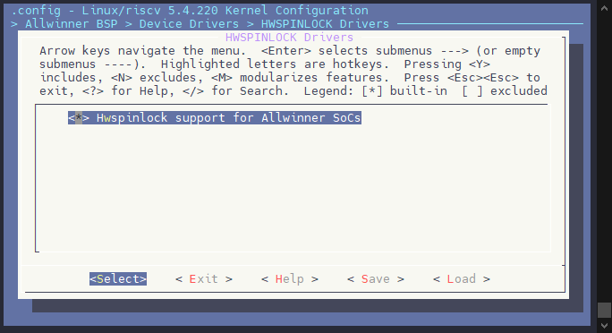
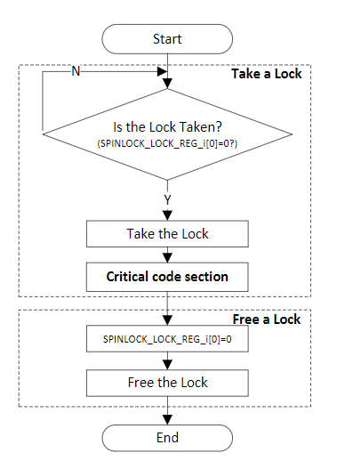
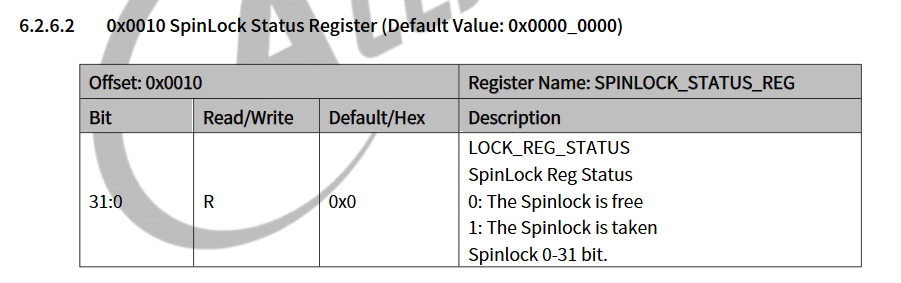
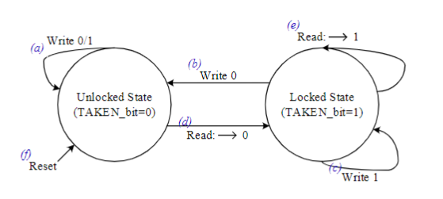

# HWSPINLOCK - 硬件自旋锁

HWSPINLOCK（硬件自旋锁）是一种锁机制，用于在多处理器系统中对共享资源进行保护，以防止多个处理器同时访问同一资源而导致数据不一致或竞争条件。硬件自旋锁通常由处理器提供支持，在硬件层面实现了对锁的获取和释放操作，以减少对操作系统的干预和加速锁操作的执行速度。

HWSPINLOCK的功能包括：

1.  **忙等待**：当一个处理器尝试获取HWSPINLOCK时，如果锁已经被其他处理器持有，该处理器将会进入一个忙等待的状态，不断轮询直到获取到锁为止。
2.  **原子操作**：HWSPINLOCK的获取和释放通常是通过硬件提供的原子操作来实现的，确保在多处理器环境下这些操作是线程安全的。
3.  **低开销**：相较于软件自旋锁，在多处理器系统中使用HWSPINLOCK可以减少锁操作的开销，提高锁的性能和效率。
4.  **可嵌入性**：HWSPINLOCK通常可以直接嵌入到处理器的指令集中，使得在应用程序中使用锁变得更加方便和高效。

总的来说，HWSPINLOCK提供了一种高效的并发控制机制，适用于对于需要频繁访问和操作的共享资源进行保护的场景。在多处理器系统中，合理使用HWSPINLOCK可以有效地避免竞争条件和提高系统的性能。

-   有32个lock单位
-   两种lock状态：Locked 和 Unlocked
-   处理器的Lock时间是可预见的（少于200cycles）

## 模块配置

### 驱动配置

```
Allwinner BSP  --->
    Device Drivers  --->
        HWSPINLOCK Drivers ->
            <*> Hwspinlock support for Allwinner SoCs
```



### 设备树配置

```c
hwspinlock: hwspinlock@43005000 {
    compatible = "allwinner,sunxi-hwspinlock";
    reg = <0x0 0x43005000 0x0 0x1000>;
    interrupts-extended = <&plic0 55 IRQ_TYPE_LEVEL_HIGH>;
    #hwlock-cells = <1>;
    clocks = <&ccu CLK_SPLOCK>;
    clock-names = "clk_hwspinlock_bus";
    resets = <&ccu RST_BUS_SPLOCK>;
    reset-names = "rst";
    num-locks = <32>;
    status = "disabled";
};
```

-   compatible: 用来匹配驱动，固定为 `allwinner,sunxi-hwspinlock`
-   reg: 寄存器地址
-   hwlock-cells : 用于指定其他驱动使用mbox的时候要传的参数个数
-   clocks: 时钟源
-   clock-names: 时钟名
-   resets: reset\_control控制模块复位
-   resets-names: 模块复位控制器名称
-   num-locks: hwspinlock锁个数

设备端设备树配置

```c
&hwspinlock {
    status = "okay";
};
```

### hwspinlock模块使用场景

在多核系统中，`Hwspinlock` 提供了一种硬件同步机制，通过 `lock` 操作防止多个处理器同时访问共享数据，从而确保数据的一致性。

当某个处理器锁定 `spinlock0` 后，状态变为锁定（locked），此时执行特定的代码。代码执行完毕后，解锁操作将允许其他处理器进行读写操作。



当处理器使用 `hwspinlock` 时，需要通过 `SPINLOCK_STATUS_REG` 寄存器读取 `hwspinlock` 的状态。



#### 操作细则

-   **读操作**：读取 `SPINLOCK_LOCK_REG` 返回值为 0 时，表示锁已进入 `locked` 状态；再次读取 `SPINLOCK_STATUS_REG` 返回 1，说明已被锁定。
    
-   **写操作**：当 `spinlock` 处于 `locked` 状态时，写入 `SPINLOCK_LOCK_REG` 为 0 可将其转换为 `unlocked` 状态，其他状态的写入操作无效。
    
-   **复位操作**：复位后，默认 `spinlock` 处于 `unlocked` 状态。
    



#### `hwspinlock` 状态

-   当 `spinlock` 处于 `unlocked` 状态时，写入 0 或 1 均无效。
    
-   当 `spinlock` 处于 `unlocked` 状态时，进行读操作，返回 0，说明已进入 `locked` 状态。
    
-   当 `spinlock` 处于 `locked` 状态时，写入 0 可将其转换为 `unlocked` 状态。
    
-   当 `spinlock` 处于 `locked` 状态时，写入 1 无效。
    
-   当 `spinlock` 处于 `locked` 状态时，再次读取该状态位，返回 1，表示已是 `locked` 状态。
    
-   复位操作后，默认状态为 `unlocked`。
    

> 当释放锁（即 `locked` 状态变为 `unlocked`）时，会产生中断。

#### 切换状态

-   `SPINLOCKN_LOCK_REG(0~31)` 读 0 时，进入 `locked` 状态。
-   执行应用代码时，当前 `SPINLOCK_STATUS_REG` 对应位状态为 1。
-   `SPINLOCKN_LOCK_REG(0~31)` 写 0 时，进入 `unlocked` 状态，释放对应的 `spinlock`。

#### 中断应用

-   首先使能中断寄存器 `SPINLOCK_IRQ_EN_REG`，将对应的通道位置 1 来开启中断。
-   当锁 `n` 被释放时，会产生中断，`SPINLOCK_IRQ_STA_REG` 的第 `n` bit 位置 1，通知其他 CPU 执行中断处理函数。在中断处理函数中，会检查 32 个硬件锁对应的中断状态寄存器 `SPINLOCK_IRQ_STA_REG` 中的每个 bit 位。如果检测到申请的 `n` 通道的锁已被释放，则可以获得锁。
-   执行完中断处理函数后，需要清除 pending 位。

## 驱动接口

内核提供了一系列的 `hwspinlock` 接口，用于实现硬件自旋锁的管理和操作，这些接口都定义在 `drivers/hwspinlock/hwspinlock_core.c` 文件中。以下是一些重要的 `hwspinlock` 接口的介绍：

#### hwspin\_lock\_register

-   函数原型：`int hwspin_lock_register(struct hwspinlock_device *bank, struct device *dev, const struct hwspinlock_ops *ops, int base_id, int num_locks)`
-   功能描述：注册一个新的硬件自旋锁设备实例
-   参数说明：
-   bank: hwspinlock 设备，通常提供大量硬件锁
-   dev：支持的设备
-   ops：此设备的 hwspinlock 处理程序
-   base\_id：这个bank中第一个硬件自旋锁的id
-   num\_locks：这个设备能提供的hwspinlock的数量
-   返回值：成功时返回 0，失败时返回错误码

#### hwspin\_lock\_unregister

-   函数原型：`int hwspin_lock_unregister(struct hwspinlock_device *bank)`
-   功能描述：注销硬件自旋锁设备
-   参数说明：
-   bank: hwspinlock 设备，通常提供大量硬件锁
-   返回值：成功时返回 0，失败时返回错误码

#### hwspin\_lock\_request

-   函数原型：`struct hwspinlock *hwspin_lock_request(void)`
-   功能描述：请求 hwspinlock。hwspinlock设备用户调用此函数，以便为他们动态分配未使用的 hwspinlock,**(动态申请)**。应该从进程上下文调用（可能睡眠）。
-   参数说明：无
-   返回值：返回分配的 hwspinlock 的地址，或在错误时返回 NULL

#### hwspin\_lock\_request\_specific

-   函数原型：`struct hwspinlock *hwspin_lock_request_specific(unsigned int id)`
-   功能描述：请求特定的 hwspinlock，用户应该调用此函数，以便为他们分配特定的 hwspinlock,**(静态申请)**。应该从进程上下文调用（可能睡眠）。
-   参数说明：
-   id：请求的特定 hwspinlock 的索引
-   返回值：返回分配的 hwspinlock 的地址，或在错误时返回 NULL

#### hwspin\_lock\_free

-   函数原型：`int hwspin_lock_free(struct hwspinlock *hwlock)`
-   功能描述：释放特定的 hwspinlock。应该从进程上下文调用（可能睡眠）
-   参数说明：
-   hwlock：要释放的特定hwspinlock。
-   返回值：成功时返回 0，失败时返回错误码

#### sunxi\_hwspinlock\_trylock

-   函数原型：`static int sunxi_hwspinlock_trylock(struct hwspinlock *lock)`
-   功能描述：获取锁资源
-   参数说明：
-   lock：要获取的特定hwspinlock。
-   返回值：成功时返回 1，失败时返回0

#### sunxi\_hwspinlock\_unlock

-   函数原型：`static void sunxi_hwspinlock_unlock(struct hwspinlock *lock)`
-   功能描述：释放锁资源
-   参数说明：
-   lock：要释放的特定hwspinlock。
-   返回值：无

#### sunxi\_hwspinlock\_relax

-   函数原型：`static void sunxi_hwspinlock_relax(struct hwspinlock *lock)`
-   功能描述：获取锁资源
-   参数说明：
-   返回值：无

## 使用示例

在下述示例中，`USE_HWSPINLOCK_ID` 表示我们需要使用的 `hwspinlock` 的ID号，在上锁前先调用`hwspin_lock_request_specific()` 获取锁资源，然后调用 `__hwspin_trylock()`执行上锁行为；在解锁时需要先调用 `__hwspin_unlock()`解锁，再调用`hwspin_lock_free()`接口释放锁资源。

```c
#define	USE_HWSPINLOCK_ID	10

struct sunxi_hwspinlock_test {
        struct hwspinlock *hwlock;
        unsigned long flag;
};

static int sunxi_hwspinlock_taken(struct sunxi_hwspinlock_test *hwlock_test)
{
    int err;

    if (!hwlock_test->hwlock) {
        hwlock_test->hwlock = hwspin_lock_request_specific(USE_HWSPINLOCK_ID);
        if (!hwlock_test->hwlock) {
            pr_err("Lock request is failed!\n");
            return -EIO;
        }
    }

    err =  __hwspin_trylock(hwlock_test->hwlock, HWLOCK_IN_ATOMIC, &hwlock_test->flag);
    if (err){
        pr_err("lock is already taken!\n");
        return -EBUSY;
    }
    pr_info("lock-%d is taken successfully!\n", USE_HWSPINLOCK_ID);

    return err;
}

static int sunxi_hwspinlock_free(struct sunxi_hwspinlock_test *hwlock_test)
{
    int err;

    if (!hwlock_test->hwlock) {
        pr_err("lock is already free!\n");
        return -EIO;
    }
    __hwspin_unlock(hwlock_test->hwlock, HWLOCK_IN_ATOMIC, &hwlock_test->flag);

    err = hwspin_lock_free(hwlock_test->hwlock);
    if (err < 0) {
        pr_info("Lock release failed!\n");
        return -EIO;
    }
    pr_info("Lock-%d free successfully!\n", USE_HWSPINLOCK_ID);

    return err;
}
```
