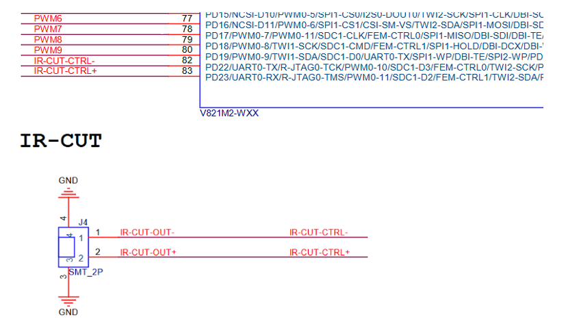
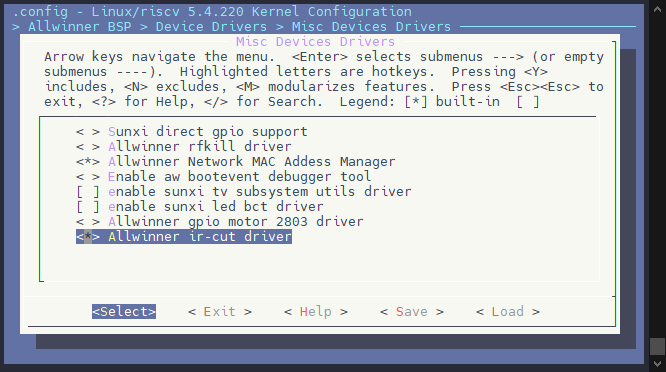
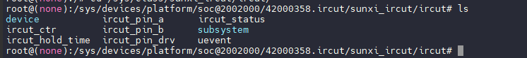

# IR-CUT - 内置 IR-CUT 驱动

IR-CUT（Infrared Cut）是一种红外截止滤波器，用于摄像头系统中自动切换红外光滤镜。在白天或光照充足时，IR-CUT 滤镜会滤除红外光，确保图像色彩还原准确，避免红外光干扰导致的色彩失真；在夜间或低光照环境下，IR-CUT 滤镜会移除或切换，允许红外光通过，配合红外补光灯实现清晰的夜视效果。通过 IR-CUT 的自动切换，摄像头可以在不同光照条件下都能获得最佳的成像质量。

:::tip

:::note

提示

:::
:::note

-   部分芯片（如 V821）内置了 IR-CUT 直驱功能，支持直接驱动 IR-CUT 省下独立 IR-CUT 驱动的成本。具体支持直驱的引脚请参考芯片数据手册。
-   其他芯片没有内置 IR-CUT 直驱功能，需要挂载 IR-CUT 驱动芯片。

:::

:::

其电路连接如下图所示：



## 驱动配置

### 内核驱动配置

执行 `make kernel_menuconfig` 进入内核配置驱动，前往下列路径

```
Allwinner BSP  --->
	Device Drivers  --->
		Misc Devices Drivers  --->
			<*> Allwinner ir-cut driver
```



### 设备树配置

IR-CUT 设备树配置如下，需要区分芯片是否支持直驱功能：

-   支持直驱功能的芯片（如 V821），compatible 为 `allwinner,sun300iw1-ircut`，可直接驱动 IR-CUT
-   不支持直驱功能的芯片，compatible 为 `allwinner,ircut`，需要挂载 IR-CUT 驱动芯片

:::tip

:::note

提示

:::
:::note

具体芯片是否支持 IR-CUT 直驱功能，请参考对应芯片的数据手册。支持直驱的具体引脚也请参考芯片手册。

:::

:::

-   不支持直驱
-   支持直驱（如V821）

```c
&ircut {
	compatible = "allwinner,ircut";
	ircut_pin_a = <&pio PD 22 GPIO_ACTIVE_HIGH>;
	ircut_pin_b = <&pio PD 23 GPIO_ACTIVE_HIGH>;
	ircut_pin_drv = <3>;
	ircut_open = <GPIO_ACTIVE_HIGH GPIO_ACTIVE_LOW>;
	hold_time = <1000>;
	status = "okay";
};
```

```c
&ircut {
	compatible = "allwinner,sun300iw1-ircut";
	ircut_pin_a = <&pio PD 22 GPIO_ACTIVE_HIGH>;
	ircut_pin_b = <&pio PD 23 GPIO_ACTIVE_HIGH>;
	ircut_pin_drv = <3>;
	ircut_open = <GPIO_ACTIVE_HIGH GPIO_ACTIVE_LOW>;
	hold_time = <1000>;
	status = "okay";
};
```

| 字段 | 含义 |
| --- | --- |
| **ircut\_pin\_a** | 定义了 IR CUT 滤镜控制引脚 A，连接到 `PD 22` 引脚，GPIO 高电平有效 |
| **ircut\_pin\_b** | 定义了 IR CUT 滤镜控制引脚 B，连接到 `PD 23` 引脚，GPIO 高电平有效 |
| **ircut\_pin\_drv** | 定义了 IR CUT 滤镜引脚驱动能力，可配置驱动能力 0，1，2，3，根据 IR CUT 物料实际调整 |
| **ircut\_open** | 定义了 IR CUT 滤镜开启时的电平：  
`<GPIO_ACTIVE_HIGH GPIO_ACTIVE_LOW>` 表示控制引脚 A 高电平，控制引脚 B 低电平会控制 IR CUT 滤镜开启 |
| **hold\_time** | 定义了 IR CUT 滤镜切换的保持时间，单位是毫秒 |
| **status** | 设置设备的状态为 `"okay"`，表示该设备启用 |

## 模块使用

IR-CUT 模块启动后会在 sys 中创建控制节点，节点路径如下：

```
/sys/devices/platform/soc@2002000/42000358.ircut/sunxi_ircut/ircut
```



节点的含义如下：

| 节点 | 含义 | 读取 | 写入 |
| --- | --- | --- | --- |
| ircut\_ctr | 控制是否启用IR-CUT，如果是支持的引脚会启用直驱模式 | 获取当前 ircut 功能启用状态  
enable，disable | 设置 ircut 功能启用状态  
enable，disable |
| ircut\_status | 设置 IR-CUT 状态，会根据设备树设置的 ircut\_open 的电平去操作 IR CUT，然后等待设备树设置的 hold\_time 后将双引脚拉低，这个节点是阻塞的以保证操作完成。 | 获取当前 ircut 状态  
open，close，unknow | 设置 ircut 状态  
open，close |
| ircut\_pin\_drv | 设置 IR-CUT 引脚的驱动能力 | 获取当前驱动能力，获取值 0，1，2，3 四个档位 | 设置当前驱动能力，设置值 0，1，2，3 四个档位 |
| ircut\_hold\_time | 设置 IR-CUT 的切换保持时间，单位ms | 获取当前保持时间 | 设置保存时间，单位ms |
| ircut\_pin\_a | 设置 IR-CUT 引脚 A 的电平 | 获取当前电平  
0，1 | 设置电平  
0，1 |
| ircut\_pin\_b | 设置 IR-CUT 引脚 B 的电平 | 获取当前电平  
0，1 | 设置电平  
0，1 |

### 使用示例

（1）配置启用 IR-CUT

```
echo enable > ircut_ctr
```

（2）设置 IR-CUT 开启

```
echo open > ircut_status
```

（3）设置 IR-CUT 关闭

```
echo close > ircut_status
```

（4）单独设置 IR-CUT PIN A 的电平为高

```
echo 1 > ircut_pin_a
```

（5）单独设置 IR-CUT PIN B 的电平为低

```
echo 0 > ircut_pin_b
```

（6）关闭 IR-CUT 驱动功能

```
echo disable > ircut_ctr
```

（7）调试 HOLD 时间到 1000ms

```
echo 1000 > ircut_hold_time
```

（8）设置引脚驱动能力

```
echo 3 > ircut_pin_drv
```

### 测试程序

```c
#include <stdio.h>
#include <stdlib.h>

#define IRCUT_DIR "/sys/devices/platform/soc@2002000/42000358.ircut/sunxi_ircut/ircut"

// 定义一个函数，用于写入值到指定的文件
void write_to_file(const char *file, const char *value) {
    FILE *fp = fopen(file, "w");
    if (fp == NULL) {
        perror("Failed to open file");
        exit(EXIT_FAILURE);
    }
    fprintf(fp, "%s\n", value);
    fclose(fp);
}

int main() {
    // 配置启用 IR-CUT
    write_to_file(IRCUT_DIR "/ircut_ctr", "enable");
    printf("IR-CUT enabled.\n");

    // 设置引脚驱动能力
    write_to_file(IRCUT_DIR "/ircut_pin_drv", "3");
    printf("IR-CUT pin drive strength set to 3.\n"); 

    // 调试 HOLD 时间到 1000ms
    write_to_file(IRCUT_DIR "/ircut_hold_time", "1000");
    printf("IR-CUT hold time set to 1000ms.\n");

    // 设置 IR-CUT 开启
    write_to_file(IRCUT_DIR "/ircut_status", "open");
    printf("IR-CUT opened.\n");

    // 设置 IR-CUT 关闭
    write_to_file(IRCUT_DIR "/ircut_status", "close");
    printf("IR-CUT closed.\n");

    // 单独设置 IR-CUT PIN A 的电平为高
    write_to_file(IRCUT_DIR "/ircut_pin_a", "1");
    printf("IR-CUT PIN A set to high.\n");

    // 单独设置 IR-CUT PIN B 的电平为低
    write_to_file(IRCUT_DIR "/ircut_pin_b", "0");
    printf("IR-CUT PIN B set to low.\n");

    // 关闭 IR-CUT 驱动功能
    write_to_file(IRCUT_DIR "/ircut_ctr", "disable");
    printf("IR-CUT driver disabled.\n");

    return 0;
}
```
