# PMC - 电源控制模块

V821 芯片内置 PMC（Power Control），用于系统电源控制，包括：

1.  DCDC/LDO/Switch等电源的开关、参数配置；
2.  内部各独立供电电路的开启关闭；
3.  晶振时钟源相关控制。
4.  支持上电、下电、休眠、唤醒等使用场景，每个使用场景都有各自的触发源触发，并由 PowerControl 配合执行后续的系列开关动作。

PMC 的动作基本都由硬件自动完成，预留部分可配置参数由软件配置。

## PL 组 IO 功能

PL 组的 IO 均可作为 Wake UP IO 使用，作为独立唤醒 IO，其中 PL0，PL1，PL2 复用 PMC 功能，当启用 PMC 功能时，GPIO 和 Wake UP IO 功能不可使用、PL0 默认为 PMC\_EN0，除非有外部供电模块，一般不建议将 PL0 作为 GPIO，而是作为电源使能引脚使用。PL 口 IO 也支持 VSYS 掉电后的 IO 电平保持，保留输出状态。PL 组 GPIO 内部结构如下图所示：

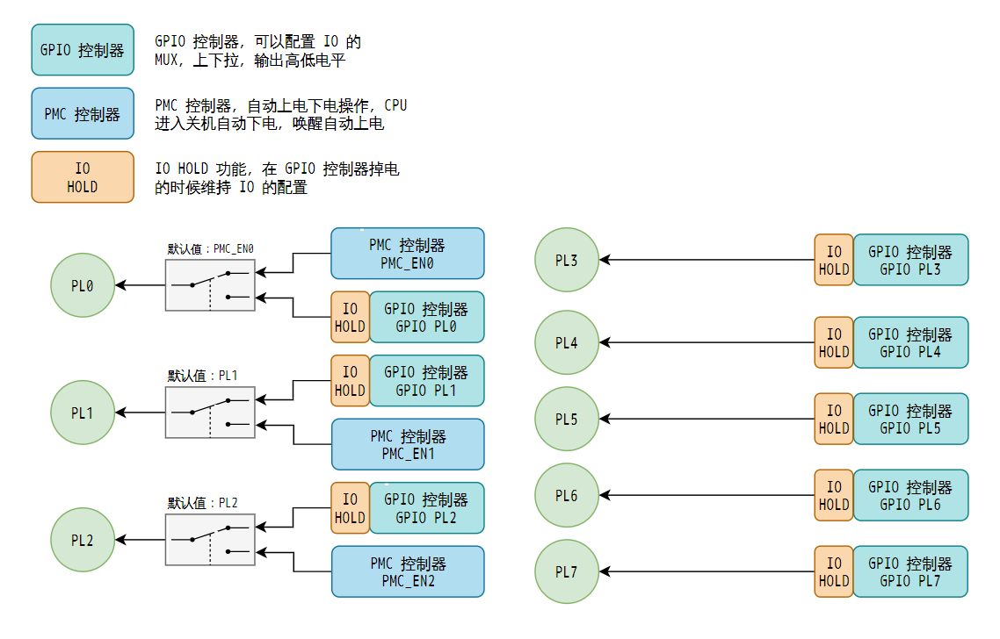

## PMC 硬件功能配置

一般来说，PMC IO 控制的对应关系对应下表所示：

| 方案 | PMC\_EN0/PL0 | PMC\_EN1/PL1 | PMC\_EN2/PL2 | PL6 | 休眠唤醒支持的模式 |
| --- | --- | --- | --- | --- | --- |
| 常电/CDR方案 | PMC | GPIO | GPIO | GPIO | 支持 poweroff 关机模式 |
| 电池方案，不使用调压功能 | PMC | PMC | GPIO | GPIO | 支持 super standby, ultra standby, poweroff 模式 |
| 电池方案，使用调压功能 | PMC | PMC | PMC | GPIO | 支持 super standby, ultra standby, poweroff 模式，支持动态调压 |
| 电池方案，不使用调压功能，AOV | PMC | PMC | GPIO | PMC | 支持 super standby, ultra standby, poweroff 模式，支持独立控制 DRAM 电源 |
| 电池方案，使用调压功能，AOV | PMC | PMC | PMC | PMC | 支持 super standby, ultra standby, poweroff 模式，支持独立控制 DRAM 电源，支持动态调压 |

:::warning

:::note

注意

:::
:::note

PMC\_EN0/PL0 默认作为 PMC 功能，**这个引脚在硬件设计时请尽量不用做普通 IO**

:::

:::

### 常电 IPC 方案

:::tip

:::note

注意芯片型号，常电IPC方案使用的芯片型号是 V821M2

:::

:::

-   VDD-SYS晚于3.3V上电
-   PMC\_EN0/PL0：控制 VDD-SYS 上电时序，建议不作为 GPIO 使用（限制较多）
    -   PMC\_EN0 为常供，只有执行 `poweroff` 才会下电
-   PL1~PL7 用户可作为 GPIO 使用

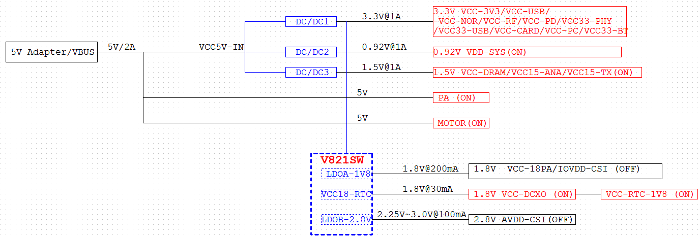

### CDR 方案

:::tip

:::note

注意芯片型号，CDR 方案使用的芯片型号是 V521D2-WXX

:::

:::

-   PMC\_EN0/PL0：控制 VDD-SYS上电时序
    -   EN0 为常供，只有执行 `poweroff` 才会下电
-   PL1~PL7 具备唤醒/开机功能（唤醒电平只能为1.8V）
-   唤醒源可支持做ACC DET，G-INT，VBUS-DET，PWRON（需接到PL口IO上）
-   一路12V转5V DCDC+SOC三路DCDC供电（3.3V,0.92/1V,1.5V）+一路G-SENSOR LDO供电。若AHD/CMOS需1.2V则需增加一路LDO/DCDC供电
-   VBAT-RTC可直接电池或者纽扣电池供电，无需外挂LDO（电池需外挂charger芯片）
-   SOC 电源输入采用 MOS 管开关方式控制，关机下可断开 DCDC 输入源，避免 DCDC 漏电影响功耗
-   关机下保持VBAT-RTC供电以及外设G-SENSOR供电其他均断电
-   VBUS-DET 和 ACC 需通过隔离转换到 1.8V 接入到 PL 口 IO 实现接入唤醒/开机功能，开机后可作为普通 IO，实现 VBUS 和 ACC 状态检测
-   VBAT-RTC输入电压范围 2.1~6V，单节锂电池方案，可直接接到 VBAT-RTC，实现常供 RTC 不掉电
-   纽扣电池方案，可纽扣电池直接接 VBAT-RTC，无需外挂 LDO

:::warning

:::note

注意

:::
:::note

-   当正常关机 (hibernation)，VBAT-RTC 功耗 10uA 左右，若非正常关机，异常掉电状态，VBAT-RTC 功耗 40uA 左右
-   如果对非正常关机功耗要求较高，需外挂RTC芯片降低功耗

:::

:::

### 电池IPC/门铃方案

:::tip

:::note

注意芯片型号，电池IPC/门铃方案使用的芯片型号是 V821L2 系列的低功耗方案芯片

:::

:::

电池IPC/门铃方案需要 4 路 DCDC，包括 3 路低静态漏电 DCDC 3.3V，0.92V/1V，1.5V + 1路普通DCDC 1.5V + 1路LDO（唤醒外设PIR等供电）+ 1路PMOS开关（3.3V非唤醒源外设/IO供电）

-   DCDC1 为 RF 3.3V 供电（需低静态漏电）
-   DCDC2 为 VDD-SYS 0.92V/1V 供电（需低静态漏电）
-   DCDC3 为 DRAM 1.5V 供电
-   DCDC4 为 RF 1.5V 供电（需低静态漏电）
-   PMOS1 为 3.3V 非唤醒源外设/IO 供电
-   LDO1 为唤醒源外设供电，如 PIR，Gsensor 等
-   电池为单节电池可直接接 VBAT-RTC，确保 VBAT-RTC 不掉电，若为多节电池，需额外增加降压电路，保证输入到 VBAT-RTC 在 2.1V~6V 范围内

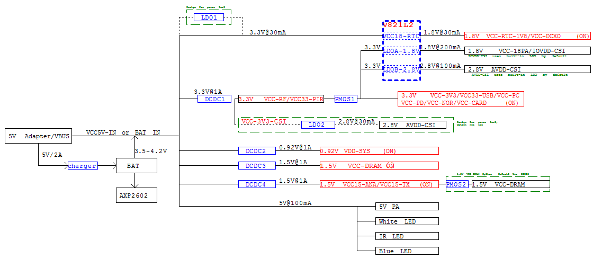

PWR-EN0 和 EN1为硬件控制，触发唤醒源，由硬件拉高IO，EN2（PL2）为软件控制，启动时可由软件控制拉高，不需要使用可做普通IO/唤醒IO使用：

-   PWR-EN0（PL0）：控DCDC1-3V3(RF3.3V),DCDC4-1V5(RF1.5V),DCDC2-0V92/1V(VDD-SYS)
    -   PWR-EN0 为常供，只有执行 `poweroff` 才会下电，执行 `echo mem > /sys/power/state` 不会下电
    -   芯片内部各模块有独立供电开关，在 DRAM 自刷新状态下会自动关闭芯片内部各模块电源
-   PWR-EN1（PL1）：控DCDC3-1V5(VCC15-DRAM),PMOS1(非唤醒源外设和IO供电)
-   PWR-EN2（PL2）：做双目控制DCDC2 (VDD-SYS)在休眠下调压达到休眠降功耗的作用（若无需做调压，PL2可释放出来做普通IO使用）

工作模式与电源供电方式：

-   正常工作/唤醒状态模式：PL0,PL1,(PL2)都拉高，DCDC 均开启供电
-   Wi-Fi保活模式：PL0拉高，PL1,(PL2)拉低；保持VBAT-RTC（VCC18-RTC），RF供电（3.3V和1.5V），小核供电（0.92V/1V），不掉电；其他除唤醒源外电源（PMOS+DRAM1.5V）均掉电；支持 WIFI 唤醒，IO（PL2~PL7）唤醒，RTC定时唤醒
-   hibernation（关机）模式：PL0,PL1,(PL2)都拉低；只保持VBAT-RTC（VCC18-RTC）不掉电；其他电源都掉电；此模式只支持IO（PL2~PL7）唤醒，RTC定时唤醒

:::tip

:::note

电源 DCDC 器件选型上，为保证休眠功耗，对应 DCDC 型号选型有特殊要求：

:::
:::note

-   休眠保活下需常供电的 DCDC 必须选用低静态漏电的 DCDC（quiescent current $\le$ 5uA）
-   DCDC1-3V3 (RF3.3V) ---- 考虑 WIFI 瞬态峰值较高，以及 MOS 管开启抽电电流影响，建议选用 1A 以上的 DCDC
-   DCDC4-1V5 (RF1.5V) ---- 平均电流较小，瞬态较高，要求 DCDC 选择 500mA 以上
-   DCDC2-0V92/1V (VDD-SYS) ---- 电流稳定，瞬态不会太高，0.8A 以上 DCDC 可满足
-   DCDC3-1V5 (VCC15-DRAM) 休眠保活下常关，无静态漏电要求，带载选择 500mA 以上
-   对于其他唤醒外设供电要求，建议选用低静态漏电的 LDO
-   DCDC 的分压电阻阻值建议选用百 K 级别以上，降低外围的静态漏电流

:::

:::

### 电池 WIFI AOV 方案

:::tip

:::note

注意芯片型号，电池 WIFI AOV 方案使用的芯片型号是 V821L2-WXX 低功耗方案芯片

:::

:::

主要供电路径：

-   单节电池无需要另外加 DCDC 转换，可直接到后级 DCDC 上
-   唤醒外设中断需接到PL口IO上
-   输入源做VBUS和VBAT电源输入切换选择，对二极管选型要求最大正向电压在350mV@1A以内，反向漏电要求小于5uA
-   4 路 DCDC（3路低静态漏电DCDC 3.3V,0.92V/1V,1.5V+1路普通DCDC 1.5V）+3路LDO（1路LDO供唤醒外设PIR等和2路LDO供CMOS 1.8V和2.8V，若需1.2V需再增加1路LDO）+2路PMOS开关（3.3V非唤醒源外设/IO供电和CMOS供电）

其中电源方案如下：

-   DCDC1 为 RF 3.3V 供电（需低静态漏电）
-   DCDC2 为 VDD-SYS 0.92V/1V 供电（需低静态漏电）
-   DCDC3 为 DRAM 1.5V 供电
-   DCDC4 为 RF 1.5V 供电（需低静态漏电）
-   PMOS1为 3.3V 非唤醒源外设/IO供电
-   PMOS2 为 CMOS 供电 LDO 的 3.3V 输入源（LDO2~LDO4输入）
-   LDO1 为唤醒源外设供电，如 PIR 等
-   LDO2~LDO4 为 CMOS 独立供电 LDO 1.2V,1.8V,2.8V（通用设计，这里不体现）
-   电池为单节电池可直接接 VBAT-RTC，确保 VBAT-RTC 不掉电，若为多节电池，需额外增加降压电路，保证输入到 VBAT-RTC 在 2.1~6V 范围内

需要控制外部电源的 PMC 与 IO 如下：

-   电源上通过 PL0，PL1，PL2 和 PL6 控制，其中 PL0 和 PL1 为硬件控制，触发唤醒源，由硬件拉高 IO，PL2 和 PL6 为软件控制，启动时由软件控制拉高
    -   PL0（PWR-EN0）：控DCDC1-3V3(RF3.3V),DCDC4-1V5(RF1.5V),DCDC2-0V92/1V(VDD-SYS)
        -   PWR-EN0 为常供，只有执行 `poweroff` 才会下电，执行 `echo mem > /sys/power/state` 不会下电
        -   芯片内部各模块有独立供电开关，在 DRAM 自刷新状态下会自动关闭芯片内部各模块电源
    -   PL1（PWR-EN1）：控PMOS1(非唤醒源外设和IO供电)
    -   PL2（PWR-EN2）：控制DCDC2(VDD-SYS)在休眠下调压达到休眠降功耗的作用（若无需做调压，PL2可释放出来做普通IO使用）
    -   PL6：控DCDC3-1V5(VCC15-DRAM)，PMOS2

## PMC 软件配置

:::tip

:::note

SDK 版本注意

:::
:::note

在 SDK 1.1 版本，仅支持配置开关 PMC 功能，在 SDK 1.2 版本支持精细化配置 PMC 各个管脚，下面请选择对应的 SDK 参考

:::

:::

-   SDK 1.2
-   SDK 1.1

**BOOT0 相关配置 - SDK1.2**

首先确认当前方案使用的配置文件，这里以 perf2b 板级为例，查看 `BoardConfig_nor.mk` 和 `BoardConfig.mk` 中配置的 `LICHEE_BOOT0_BIN_NAME`，分布对应 SPI NOR 方案与 eMMC 方案下使用的 BOOT0 配置。


如果 `BoardConfig_nor.mk` 和 `BoardConfig.mk`中没有配置 `LICHEE_BOOT0_BIN_NAME` ，则标识方案使用默认配置，根据具体存储器件选择 `mmc.mk`，`spinor.mk`，`nand.mk` 即可

| 软件方案 | 存储器件 | 配置文件 |
| --- | --- | --- |
| 普通 | SPI NOR | `brandy/brandy-2.0/spl/board/sun300iw1p1/spinor.mk` |
| 普通 | SPI NAND | `brandy/brandy-2.0/spl/board/sun300iw1p1/nand.mk` |
| 普通 | eMMC/SD NAND | `brandy/brandy-2.0/spl/board/sun300iw1p1/mmc.mk` |
| 快起 | SPI NOR | `brandy/brandy-2.0/spl/board/sun300iw1p1/spinorfastboot.mk` |
| 快起 | eMMC/SD NAND | `brandy/brandy-2.0/spl/board/sun300iw1p1/mmcfastboot.mk` |

前往 `brandy/brandy-2.0/spl/board/sun300iw1p1` 找到配置文件


这里以 `spinorpmc.mk` 为例，配置项如下：

```
CFG_SUNXI_PL_1V8=y           # 配置 PL 使用 1.8V 电平
CFG_PMC_EN1_FOR_PWRCTRL=y    # 配置 PMC_EN1/PL1 作为 PMC 功能
CFG_PMC_EN2_FOR_PWRCTRL=y    # 配置 PMC_EN2/PL2 作为 PMC 功能
CFG_PMC_PL6_FOR_PWRCTRL=y    # 配置 PL6 作为 PMC 使用控制外部电源
# CFG_PMC_PL7_FOR_PWRCTRL=y  # 配置 PL7 作为 PMC 使用控制外部电源（特殊设计，一般不使用，默认注释）
```

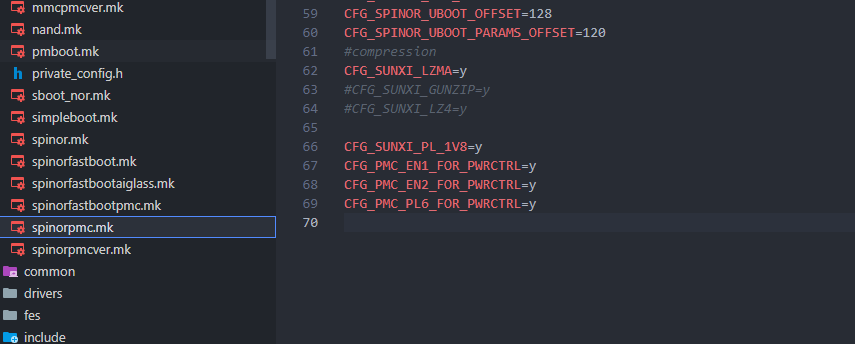

另外 fes 文件夹中的配置是执行 fes 时使用的，也需要配置，否则可能会出现 fes 烧录阶段无法启动的问题

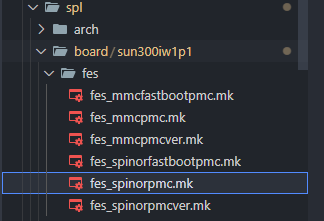

**RTOS 相关配置**

由于 V821 休眠唤醒需要 RTOS 参与，所以需要配置 RTOS 相关

输入 `mrtos menuconfig` 进入 RTOS 配置页面

```
System components  --->
  aw components  --->
    [*] PowerManager Support  --->
       [*]   pmc en1 for pwrctrl                # 配置 PMC EN1 启用 PMC 功能
       [*]   pmc en2 for pwrctrl                # 配置 PMC EN2 启用 PMC 功能
       [*]   pmc pl6 for pwrctrl                # 配置 PL6 用作 PMC 功能
       [ ]   pmc pl7 for pwrctrl                # 配置 PL7 用作 PMC 功能（特殊设计，一般不使用）
```

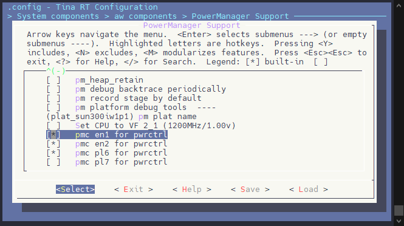

**BOOT0 相关配置 - SDK1.1**

首先确认当前方案使用的配置文件，这里以 perf2b 板级为例，查看 `BoardConfig_nor.mk` 和 `BoardConfig.mk` 中配置的 `LICHEE_BOOT0_BIN_NAME`，分布对应 SPI NOR 方案与 eMMC 方案下使用的 BOOT0 配置。


如果 `BoardConfig_nor.mk` 和 `BoardConfig.mk`中没有配置 `LICHEE_BOOT0_BIN_NAME` ，则标识方案使用默认配置，根据具体存储器件选择 `mmc.mk`，`spinor.mk`，`nand.mk` 即可

| 软件方案 | 存储器件 | 配置文件 |
| --- | --- | --- |
| 普通 | SPI NOR | `brandy/brandy-2.0/spl/board/sun300iw1p1/spinor.mk` |
| 普通 | SPI NAND | `brandy/brandy-2.0/spl/board/sun300iw1p1/nand.mk` |
| 普通 | eMMC/SD NAND | `brandy/brandy-2.0/spl/board/sun300iw1p1/mmc.mk` |
| 快起 | SPI NOR | `brandy/brandy-2.0/spl/board/sun300iw1p1/spinorfastboot.mk` |
| 快起 | eMMC/SD NAND | `brandy/brandy-2.0/spl/board/sun300iw1p1/mmcfastboot.mk` |

前往 `brandy/brandy-2.0/spl/board/sun300iw1p1` 找到配置文件


这里以 `spinorpmc.mk` 为例，配置项如下：

```
CFG_PM_ENABLE_PMC=y  # 启用 PMC 功能
CFG_SUNXI_PL_1V8=y   # 配置 PL 使用 1.8V 电平
CFG_PM_PMC_PL6=y     # 使用 PL6 控制 DRAM 供电，AOV 方案
```

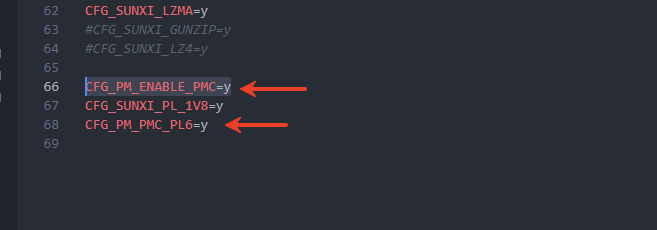

另外 fes 文件夹中的配置是执行 fes 时使用的，也需要配置，否则可能会出现 fes 烧录阶段无法启动的问题


**RTOS 相关配置**

由于 V821 休眠唤醒需要 RTOS 参与，所以需要配置 RTOS 相关

输入 `mrtos menuconfig` 进入 RTOS 配置页面

```
System components  --->
  aw components  --->
    [*] PowerManager Support  --->
       [*]  pm enable pmc                      # 配置启用 PMC 功能
       [ ]  pm pmc using PL6 GPIO as power ctl # 配置启用 PL6 作为电源控制引脚
```

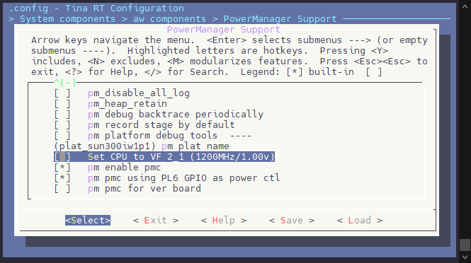

## 开机唤醒源的获取

### 开机唤醒源硬件寄存器

V821 在硬件上支持三种唤醒源，包括

-   Wake UP IO
-   SYS RTC
-   Wake UP Timer

其中的唤醒源可以读取 `0x4a000880` 寄存器，其含义如下：

| 唤醒源 | 描述 | 使用场景 | 寄存器位 |
| --- | --- | --- | --- |
| Wake UP IO | PL0~7 中任意一个引脚，IO 唤醒  
使用示例：  
1\. 关机后按住 POWER ON按键，唤醒系统  
2\. 使用 GSensor 中断脚连接 Wake UP IO 唤醒系统 | IO 按键唤醒  
GSensor 唤醒  
ACC 打火唤醒 | BIT(2) |
| SYS RTC | 使用 RTC 进行唤醒  
使用示例：  
设置 10s 后唤醒系统：echo +10 > /sys/class/rtc/rtc0/wakealarm | 定时唤醒记录  
长时间闹钟唤醒  
时间以秒为单位 | BIT(1) |
| Wake UP Timer | 使用 Wake UP Timer 进行唤醒  
使用示例：  
设置休眠后 100ms 唤醒系统：echo 700 > /sys/class/ae350\_standby/time\_to\_wakeup\_ms | 短时间唤醒  
AOV 场景短时唤醒  
时间以毫秒为单位  
休眠开始时才计时 | BIT(0) |

:::tip

:::note

提示

:::
:::note

其中 Wake UP IO 的唤醒具体引脚，可以查看寄存器 `0x4A000058` 其 BIT0~7 分别对应 Wake UP IO 0~7

:::

:::

V821 在硬件上支持三种开机源，包括

-   rtc\_wdg\_rst
-   det\_rst
-   pwron\_rst

通过读取寄存器 `0x4A0001D4` 可以获取当前唤醒源

| 开机源 | 描述 | 使用场景 | 寄存器值 |
| --- | --- | --- | --- |
| cold\_boot | 冷启动  
上电启动 | 插电开机 | BIT(31)  
BIT(29)  
BIT(28) |
| rtc\_wdg\_rst | 看门狗触发重置开机 | 看门狗长时间未喂狗，导致重启开机 | BIT(31) |
| det\_rst | 由于 3V3，1V8，0V9 中任意一路电源出现异常跌落或掉电，触发重置开机 | 电源跌落掉电导致重置开机 | BIT(29) |
| pwron\_rst | 使用内置 RESET 信号触发重置开机 | 内部信号触发重置开机 | BIT(28) |

### 开机唤醒源 RTC 寄存器

:::info

:::note

信息

:::
:::note

SDK 1.3 新增功能

:::

:::

由于还存在一些软件开机的场景，例如 WIFI/BT 唤醒，这种场景下硬件唤醒源就不够用了，所以默认 SDK 提供一个统一的 RTC 寄存器 `0x4A000214` 用于开机唤醒源判断。这个寄存器是由硬件寄存器和软件唤醒共同维护，可以方便的读取寄存器来解析含义。

```
复位源(Reset Source)：

- bit31 - rtcwdg ：RTC看门狗复位。当RTC看门狗定时器超时未被重置时，系统会通过此位标记由看门狗触发的复位。
- bit29 - detect ：检测到某种异常状态触发的复位。
- bit28 - poweron ：电源开启复位。当系统首次上电或从完全断电状态恢复时，会通过此位标记。

唤醒源(Wakeup Source)：
- bit11 - wlan ：由无线局域网模块触发的唤醒。
- bit10 - alarm1 ：由RTC闹钟1触发的唤醒。
- bit9  - alarm0 ：由RTC闹钟0触发的唤醒。
- bit8  - wakeup timer ：由专门的唤醒定时器触发的唤醒。
- bit7  - bit0 ：分别对应唤醒输入输出端口7到0(wakeup io7到wakeup io0)。当这些特定GPIO端口的状态发生变化时，可触发系统从低功耗状态唤醒。
```

### 在 BOOT 阶段获取唤醒源

#### 在 BOOT0 阶段获取唤醒源

BOOT0 在启动的时候会打印重置唤醒源

![image-20251120202514414](data:image/png;base64,iVBORw0KGgoAAAANSUhEUgAAAhUAAAByCAYAAADkiiO1AAAgAElEQVR4nO3df2gjZ4Mf8K832X1jR3tvIofUvMXIzFhxDo6rXpfUEDYWXD1b77UvaZHpwWFEDh1IR16290JlvbQohRWFSE5JMH1BglflRV3uCpWg4YU3++6YtyhZcvg98Ikr9N6NPYOF6YtJ105zq9jZZHfdP2YkjWRJMyONJP/4fsAk69E888yMdueZZ555viMvvfTSMdp47733sLa21vC7w6+fbfFJL2YWp/HgzkfYb7nsBlBaw/29dlvqXJYoxZFK+iECAMqQY7cQlcuGdTyQku9gVfIAABQ5gZVYEQoACEEU8kF9XQM5AV+saF4dIYhC3gM5A0hhrQ4N5Td9Lj2bgNyhnLbLO+i4/1b2T/AjEg4iUjs+OazEcob6+7G6OQ8lMwUpDEAFRGEH0dkE5F6PHxERXRitWgjOcrkxii3s4wZ8i16MATjc28BnpQ0cWirAj0hyCnJsAQEZ0BoQfkhyrnZxlpJZrCKBwGwRCjyI5LNIhXcQyJQBNYfAbA6Q4igloV0obe+EHxEhgcBsAorgRyQVr5ffdyb7b2H/JGkeWL8FX6wMwINIMotCstzUKPBDEhJYma02xrQGiDPHj4iILoJLg9mMF+OubXx2Zw2f3rmNfczB5/PaWN8DSfBDFADtTj1nuLD5cV0qI52p9hxo/y9K/pN3110zlK8W+1C+mU77b07OJJCu9eyUkV4vAqKnqf5lyBlD74s6iAYTERGdJwNqVGxhd3tL75k4wO7eFuByY8zSukVEl3JQpSBS+XWUNrNYDXvqiwUPBHgQya+jtKn/JP0O138HiupwkZaZ7L8VUhCFvh4fIiKiQTz+qBzgCO7eylBziC7lAGjjCwrJIKSM3g2vlqGi2NVYBeumIAqAPKyGRaf9N+XHajIINRZCoNpbIcVRCverskREdFENoKdiCw/2vJic9uo9E25MTniByoG1MRVCEKvhTo8airgr+7GarH9GlLR1GihlKHrjwD4PItU6CH5Ewn4octNATbUMFX5cl9oUYba8HdP913XcvzIUVAd2avW3rafjR0REF8FAHn/sl25j3zUH3+JNvL64jHFsoFTasraymkMa80jpXfeFMJBearxLl2MhRBFEQf9MagG4KxdPliOj/pjE1iOAItKqXod8HJKSwMqJQZpFRGNFCMlqPZsfUZgt737/O+9fEenMDiR9u6XUPJTmY2O1Hl0fPyIiughG+v9KqV1OluWAHl4FJSIiukgcHFPhxcyi/kZHZQOle1ZfGa2uewPjtT9v4YFzFSMiIqIBcKhRsYX7dyw+zujL+kRERDRs/X/746xTcwjMDrsSREREp59zAzVdbozVfoaw/pCI4Wx9/ofNOJpf7jBbPhRSHKVWU28TERH1wKGeCi9mrs1hdG8fRwBQ2TZMdmWFG5PTc/orp+MYndjH7mkZqGlCyYTgy6A2oNPuciIiovPCwccf+9gttWkIuLyY8d3AuAsADnC4vYHStnEMxQF2Sx/p/6+9/eE4ZlcQERH11QDGVLgx6buB0b3b+HT7QPvztWXMVLYsppYSERHRWdD/ya9cXoy7trC7faD/4gC721sYrz3uMCdK8drEVqXNbC3ivM4DKVkfu1AwzK4JQZ8UK+mHFvFtc/ImIYjCZhyRcL0ODeUPhNn+xSEZj1E+Dqlh5ks/VvP14xfhrJhERNQHAwoU60U9+ts3uwDf7C3cXfA3DHjUos9zCMwuwDcbgizGkQobo7sX9JjvIqKzejkxO7NK+hERPsbK7AJ8S4nG8geg4/5V67eg1282hKjib5imXEpqs4AGZhfgW8oBEmfDJCIi5/W/UVHZwn7Fi8npaqiYG5PTXsDlxqjlQi5y9LmV/TPGlpchN0SbN62v15+IiMhpAxhTcYDd0gbGfMt4fRpAZUuLPp840N4UMVVEdMmD1VQQqXAcIsqQM7cQrWZv6NHnUn4dEeNqas7BfRhi9Lml/etQP8EDATu4O7TodiIiuigGM/lVZQP3723U/jg2vYzJyrb1V04vcvR5r/unp6MONbqdiIguBEcDxX66+RdO14+IqC/e+PzFYVeB6NxxpKfik5d/DWz+2omiiIgG4pOXvwDgfONidOQYR8cjjpbZyqURQHjmCb5/5Vt8//IT+K48xtPjY/zHh8/jrx5d7vv2iVrpuVFR/YtJRHQWffLyF441LP7R5Sf48e98heWDq3jicMOiVSPi6sjTxg+NACuuQ/yrR991dNtEVvXUqGCDgojOAycaFm+OPsLbzx/ifz2+7EiDwlIjooXLI22faBP1naMDNc/lM0o9s6O/A0GJaNCcvCn6N65DXH/uGzwdGcH/OLrSVRndNiKM9p+OIPnw+a62T+SErhsVzX8hz2WDAmD0OdE59cbnLzb8O9Ztb8V/euEhfu/yE4yNHOPbY+CTR9YaFc+MHEN45im+f/lbfP/KE/iufAuXzV6Gh8eXUPrmGfzNt8/ib765DPXJM3jKjgoaIud6Klxuw7TbBzisOFbyYMq3Q4qjFC4jsJTTJ5yiM2WQ508IopD3Q14KIc1Xes+dvxz/Ev/g0jEujxzjGMD/7NCgYCOCLgLHGhUz1/7QPPrc5cW4ax9Hewc2YtGBsxyNTkTnzwuXjpEf/xJXRo5RHT3x1fEIPjz6Tu0zbETQRTSY6HMAgBcz125gHFu4f+ejpkaFG5O+P8TkhBvAAfa3f4H7tQAyoGM0eqsxD+xJqJPiTeFpZSiZHAKDnqr7TEbP+7G6GQdiC4g2VVoMZ1EQcjYzZE4pwY/VVBCSUM3LKSK6kuBkaW38/uXHeP+Fh7jSNBbz6fEIjo5H8K9Hv2Yjgi6swcyoCTcmr93A6N4W9idOLh33LWMSGyjd2cChy4uZa8uYqawNKRrdo2WMqOUhNUj6sf1i/WIu+LGaj6OAHQSqU51TG9r059rFtvFYCYIHiroznGo5Svs+IBaCT65Ofe9HJByEGutHo3zYf79684PnHuHPrh6daFAAwHOXnuK/uP/eVnlsRNB5M7iU0r2PUCptt1jgxUsTB9jd3tB6LypaTPr4hNe5bQt+RBqiw4NNYWDaHWkknEVh8x2kUu9oceLG5S2jwz2I5NexKuEEMZyt9xD0vP0O0ed2qUWkM2WIwpThl53LH2r0PND5+PU1+r0MpeWVzwPReIBMz2+dGM6itNlcPwvR9saPS3GU8vo29OWRcH3/bX0/BA8EFHFXNjSa1CLSDQ0KT9P+2agfAPvf7+bj1+v3s1qH9aZ62XPTdYQ/u3qEq216H6wMz6wcj+CTR1ewVhnFnxz8Dv7Fg+/i333pwn8/fA7bj9mgoLNvQI2KA+xub7Ve5HJjFPsNAy8PK/tNAzN7I0nzwPotPTo9BBlBFE5c1PyQhBxWZkMILIXgW6onobaPDtcuOoJw8h8x451s79s3iz63QfAjInm0JFNL5Q8/et78+PUv+l1Vqw0w/aJk2K6qli3WTyOGs0hJO1qvkeHRQu/n14+IoO//UsLe+no2TCQfR0TytLzgSsksItX62S3fUMeO32+xiOiS9t1YWQckwxes1++nE957oYJ/PvqobYOindaNiOfZiKBza3A9FabcmLx2E75qRLqtaHTDHXCLu2A5k0C6didWRrohGhy139fjwwGo1c93jg6X14u1u34puY5C2APtTrYMWd+mo9vvKtrdcHzyQSATMowRsFL+cKPnzY9f/6LfFXVHK0vwQFDLUKR5SJiCKNR7MaycXzGcRSG8g/RS85gSJ47fyf2zvn4R0aUEVEwhksxqd/z5xl66VsfP/vk1+X6v5GoNLUXOIe3Y99Own3qj0u5jl79wf4l/fOUxxiw0KL5C50aE07NsEp02AxpTYcUBdu+tYRcAJgBUrEajAw1jBgB9oKZhsRREIRzU/9HRWY1GN4sOV8pQkvOQYsB1sQyIfogyIAk79VcIe95+r9Hu9eMjhrNayqtcHWNhVv4piJ43PX59jH5XylAEDyRpCpBzSAtBiFK5sUzT+nkgiUUo8OO6lIBsvOI5cvw67L8VahHRpWpDS3vUsZr8WOtN6vX4mTErv9fvZ49+9fIXeBaA1abApWPgvx1+B3/77Sn6p5VogIb/za8c4AhejLmAff0RyJhrHLATjd6RH6vJINRYCIHq3WRzo6MTs+jw6vIwIMi3kBbegSTtQJQ/1hs5TmzfuWh3JXMLaSmLSDgHOVO2Vv5Qo+f7fP4sra/1VKjrRagIIhL2Q1SLUC3Xr4z0SgJpESgls4gohjkrHDl+Uw5G22s9LZGw1tOi9Hr8zFj6+9XD97OBByLsDRD9q0dX8Oqzj/Hipad4dDyCsZFjXOrQwhgdOca7L1Tw3sMx/Orr7mbWJDrLTsHjjy082DPMQ+HyYnLajf29NmMwulKGAuPIdhuDBFHEXdmjXUharq8tl6QpyHIZ8voOJGmq6c2AXrfvx6phcJooBRvGDNijdx+Hg3oXt0n5gvb/7bu6LdZPKUPRL37d1Ll/58/MDhTVD0kq4q4MKLJ2967tj836yQlEZQ8iKeNgQZPjVx3zUB1D0LL8k/unyEVrF08hqG3bOPh4wW/Yv9bHr1a+pfp1opefCtYGr4pSEBHJuLyX72eVH6ub2ZODSk38+y+fR2D/u/jB/gv4D3//PP7r0XP4398+i2+OR/DV0xF83eJxxtWRY/xb1xH+aOyRjS0RnQ8DalR4MbN4E68v3sB4w/9r9ku3sQsvfIs38fq1OWD7toOvkxaRzuxASupjClLz2oXBBjkWQlrUR5jng0DT+tpgPr0LWikDgqc2iM+p7UcRrI1wTy0Ad22W0Vjgx5ANF4KO5as5pDGPVHXkfRgnxgVYqp+qPSeP5O2+/dH/89eZPnZCLWs9E/p/641Ge/WTYyGkEWwY6Nj5+BURjRWBcLZD+UWkVf0c5bVBqStWu//VHNLr80il6m9PSMghYBhIW61zoWX5VurXmRzTB9fm6/tvfETU6/dTswNFLUOp9SDa89XTEfz6m8v4aWUU4S+u4p/+3xcQ+X9X8UFlFOtfX8bnTy7hMYCHT0fw9Bi4eukp/mTsCD+86kx/K9FZMfLSSy+1HX303nvvYW1treF3h19rT0yasz/+dPaP8WAgs1xqk18NZltEpxwD73riZIbR2Mgxfu/yY/z+lcd47fJjiM8+AQD85eF3kP3K+rBzorPMwTEVXsws6nNLVDZQurfh0JiIatn1ng1gCw8cK5uIqHeHx1pvxq+/uYyf6r+beuYJpvTGBdFF4Fij4v6dNfMPdW0L9+84OcaCiKj/dp48g50nzwy7GkQDM/y3P4ioe2oOgdlhV4KISMPocyIiInIEo8+JiIjIEacj+tzlxYzvBsZdgO3o8/MQ7c3oaSIiOgdOQfS5G5PTbjworeF+BVoDw3b0+VmO9mb0NBERnQ+nIPr8ALuljdoU3ahs4cEeMOpyd7edsxbtzejpzq4u4udvvoXF772Fn7/5Af7uzQ/wd3/wFhavGj80gR++9mNt2Zsf4Oev+TBtc/3FdusTEZFlw48+b+by4qUJ4KhyYP7ZVs5atDejpy3w4e1/WMKPPvxz/O6H7+JHD314/1Vfbeniaz/G27iDH3z45/jdX/0Mv7z6Ft5/dcLW+u9X1//w3RbrExGRFacg+0MzNr2M17uepvssR3szetrcHn75mxK29f+/839KwNUJvTfBh3/2vT38pLr8YQn/+TclTH/P2NtgY33stVifiIisODXzVBxu38an29ACxXzL8OE2SttWeyvOeLQ3o6dN7GH7YZtFVycwjT38st1yS+tPYPEPPsDbxt8/vNNNRYmILrRT06ioqWxhd3sak9NejG3bn+r77EV7N2P0tC0P97ANH6avAujYsOi0fgk/+fBnYDOCiKg3w3/84ZrDzLS3PrGVy4vJaS9QsTuXRdUZi/Zm9HSPSvjlbyfw9qv644qrPvzwVR+2f1t9nGFlfR/eNwzOnP7eYsOYCyIismZAPRWNgWDji15An69iv7KB3coNvLJ4o9awONz7CKVSD1kf8seQk/Fab4UcCyGa1N54APQxAxljdHIcqc24dmFUi62jvdutX6XmkJa1+OYIAMgJa4M11RzS63GkUvFaw0KRW0RPN2y/OXp6HoVkFqWwVv+oXISdK3d1/1bzwdr2V2IW99/C8dNo0dOC0l30dCd3/vpdTL/2Fn7+5lsAgO3f/gw/+o31QTl3/vpdoGH9O/jJb0oO15KI6Pxj9DkRXVhORp8TEaPPiYiIyCGMPiciIiJHDH+gJhEREZ0LzjUqXG6M1X4cK7X/5QtBFDaziNh9a4OIiIgaMPqciIiIHHEKos/dmLy2jMmG3gf9ddPan9tHn69urgOxBcO03BoxnEVByFnP4DjNGI3ehhaU1vH8r8+fiKRv+G5I8abwtzKUTA6B5leG2/Igkj/Z06VkQoaUXA8iyXcQ0YPWFDmBlZg+z4gQRKFVyJqaQ6CrKc2JiIbnFESfaw637UzLXaeo0C+2jdNCC4IHirrTRV1PG0ajt7dj4fzPWyinPs07BO14F7BjaBR0UkZ6aQFpvXEhyaET62mBcAkEZotQ9M+lwnr5ag6B2VzT59cRUYtn4PgTETU6BdHnvVFa/svrgWi89RP8TdHh7eO3xXAWpc14bXbJanmdo887RI/ryyPhejx4c3R4R4xG76Bs7fzboRaRzpQhClNdFtDMZiCdEEREKkOWncxOISIajFMTfV5LKV1cxsy023LJqlq9AOgXJUNXtqoncUrSPLB+S4/mDkFGEIXkyamsxXAWKWlHu2s1PFroHP1thR8R4WOsdBNdzmj0jqyc/6HSA9sU46MqpQxF8KDV2GBR8kOUc0hf+EdbRHQWnYJXSg+we28Nn97RfkqlLYxOL2OmzWOSZoq6A4geiIIHglqGIs1DwhREoX4XK2cSSNfu/LTALoiNF2gxnEUhvNNiimknos97iS5nNHonVs6/LYKWozKcR2fatuX1czAOiIgupFOXUnq4t4HPtr3wTXiBPQsTXul3fZI0Bcg5pIUgRKncGOctBVEIBxvDvhqiyz2QxCIU+HFdSkA2XvEciT5vulO1i9Ho7Zme/zIUmPXa+LG6We3hKEPJJCyOp3CYNA9JzSEwmDhcIiLHnbpGhW1qGSq0O1V1vQgVQS3RUy1Cuw76sZoMQo2FEKj2VkhxLXyrpoz0SgJpESgls4gooXr3syPR51MORpczGv3k9judfyuKDW+HOKrV8RM9ENVyU/08evpsiAM0iejMGv7jjxPR53N4ZdqNfSu9FAC0XgA/JKmIuzKgyNrdez06HNDuVo1vTrSJBpcTiOox4PWue5Pob0vR4x2iy80wGt2EyfnX9/+6VN9/SRrk442m81NrPDSdf8EPSeAATSI6205B9PkWHmDOEH1+gP3Sbdy3nFxdfXau3/lV7wBrF40i0pl5pJLriCRhGg0ux0JI57NIhYu1LvDO0edWoseLSKvztXjwxuhyE4xGN2F+/rXHL1mUktDrZ+P4m2qapyKsHWfjPBWdz49GCgchygkEOECTiM4wRp/3mxBEIe/p8fEJEfUDo8+JnMXocyIiInIEo8+J2tImBWv7pIhTaRMRNei6UfHG5y82dB1+8vIX7DpsRc0hMDvsSlB3iojOcs6I84qPPoic5+hAzea/pERERHRx9PRKKVv2RHQe8N8yImf0PE8F/zIS0VnGf8OInOPI5FdvfP5P8Kezf+xEUUREA/HG5y+yQUHkMEfHVPzLz1+0NHfEuO8mJiu3Udo+gPa66BwO793GbkVbPja9DJ9rA5+WWr3x0TRPhT4PhJwBJH3WQkVOYCVWbIoGfwcRfVbFE8sFPyLhoGF5DisN0eJ+rG7OQ8lMQQoDUAFR2DFM7ezHar4al15GOrODiFS28WaA8S2Dpimjq/NcxIBIddZKtYjoijFJ1Wz9FnHickLLDrGkw/ETgijk/ZCXtKnNq8Fs0aVE07Teeh3tvjHRap4PKY5SuH58RSmOVG1GzzLk2C1EG2am9EBKvlOLXD/5/bCw/Y7Hv/P3y379mr9/5sRwFikhh8D6PEpJNH43N4NQlupTz4vhLApCTjv/UhylJJDOTEHCLQQyU7XvekQq8u0WIrJlCNN0uzHmAo4qB9ofXW6MYh+HlfonDiv7gMtdn7rbVOdocbNocGvR6J2iweOQlIRefg6Q7EyDDdQSOttOkOVHZEHfv9kQooq/Pg222fqqvt+xouFzCzYaFNaj1dtFx/eXebS6I9H1HY5/5+NjsX4douUt1S+8g3Src9oier2W7Gr4mCIXAckPUZqHJNud1ZSISDPwRsW4bxmTlY9aTMPtxuS1m/BNu7U/utwYtVxqp+hv82hwK9HoptHgTeU7y7jtshaNfaJ+/WItWr19dHxVd9Hm1nSKVncmur798bdyfCzUr220vDkpGQdiZjO2ehDJr6NQy4DxwBjaC7UIGX6kwn5GrxNR1wbaqBj3LWPGtYFSy8caB9i9t6Y/EgFQOcCR5ZI7RIu3uFM7QQqikF9HaVP/OdFL0YGV8nvW7/I7sLR/Hkjijh4dP6iKVRURXcpBlYJI5ddR2sxi1dgLoUezR7o9vwB6+35ZqV8P51eKY1XMIa1oSa21hozQ3BNTRnppoR7pfiIlVXtsJwpaMBsRUTcG1qjQGhRbJ6fvrhzgCOMYc9V/NeYaByoHNqb5njKkeDZRy1A7La9Go2dCeve0vUcD5uWfcZb2T4uOD8SK2qOAtp/tU++KmkN0KYTA7AICsR1I4WD98YIezV577FP9carHxMrxMa1fb98fBX6kUu9oP0k/AD9WU0HtPLQoXxSmmlJ8dXKiwyM4IiJzA2hUuDHuu9m6QQEA2MKDPTcmp+e0MRQuLyZtRZ8DnaPFTaLBAViORm+pdfnd67WB0mZ9pQylq7KtHD9dy+j4qi6jzc2i202j1U2i2Xtmcnws1a9TtLwJOYHAUqj+Ux07s5TQB2ZW6xc01M/DRxxE1Bf9b1S4vJicAOCag2/xJl7Xf2pjJwDsl25jF15t+bU5YNtO9DlQjxZfRymvD5o0REvLsRDSCKJgWG6MBk9ndiAl9a7x1Lw2aM0GORZCWozr5QcBm+sb9yMa24Gkd9UXbA0mNFlf1Z7T1x4D2HgE0Pn4tf7syYGQWrS5YnsQYBHRWFGLFG91ftQc0tDP/eY6CmGcGNchx0KIVuu/uY7UAnC363N0UsfjY7V+ih+r+Xr9ZAe7C7T6+evfz0wIUXZHEFEfdB193miQceRnLPqciIjogmD0ORERETnCoUZFv6PJGX1ORER02g1h8isiIiI6j5x7/NEwA+ZBwwyZZ6L8fm9/SPXXJqWqDppsmsKbiIjIQQ41KryYuTaH0b19bcKqyjZ2t7ccHFNheOUU4xid2MfuQAdq9rp/w6u/kgnBl0Etw4KIiKhfHByouY/dUusL5djEDbzi8+oX1QPsl36B+3sHlpcDB9gtfaT/v/b2h216cFL3d+rt9s+NyWvLmHQZf7eF+w2NBgfqf6EZA7vKkDO3EG3zSmtLgh+rqXhtHoiTgV09lk9ERAAGMk/FHCYntvHZvTV8emcNn97bwqhvGTMTFpfb1jRd8YAcbt/W6n9nDZ863AvRcsKqE9Mwn19aYFexHtgWzmLV8gxaHkRScQjVwLfZEGSxMTCut/KJiKiq/42Kygbul7bqYwgqG9jdA0ZdbmvLLdFitSPhLAqb2nTFtZkbBX1Sour0xS3zHzyQktlaNkQh2WpGyCERgkjlm2ah1OPMa78T/Ih0W38heHKWSymOUkNcevPxsRPG1atqYFfOENhVhrRQP39iONtYXyGIwmZ1unBtFlF13RAI1hA7bl4+ERFZM/zoc9vL22kTTW4h+rv36GlgbHpZny10GTPTdhpEJtQiZLUxqEuU/BANM1Nai27vXi/R4WK43hhp/rHUG2AhulvJhBBVqrN4+rGaD0KNhQzTVAPCQrUh5IEkebQyLJZPRETWODimwppq9PmnbabhNlveXrtocjP6nepSY/S09bApLV11V//T2MQcXvEtY6ayZnOq8Xa0O+vIgl+f/lvPbjA0iuSMcZyIFt0eCWsXxd5Ds6rHpzE6PBL2Q8yYH6faQNGeeRDJZyHJIQRU1KK7q9uXYwlc38yiIAGinIDPMHBGjoUgJrXeKwBQ5FbTjHcun4iIzA20UVGLPr/XeiIrs+V9od+p3nUoWvxwbwOfbXvhm/ACtkLR2lMyOcibQUQyRaTFeUhqDgHjaFMpiEI42Dj2Qs05su1qdLiUX0fE+HunyrdMi+5OA4CEFtHdRaQzQS1bY8WY66E1FkQ5BN9sGYAHUvgdFJJoSqM1K5+IiMwMrFHRNvrc4vK+0VMwRQG1norTp4i7chwRyQNF8EORQ4Y7aD26PRZCoDpWQIqjFHZo03p0eLrLt2Ya58loJMcWzIOtWpwfLbr748ZeBCGIVHgH6cwUIqkg5Gq0ueCHJGjjJDRlyHIRSn4eUqwI2Wr5RERk6hREn5std0jb6O8eo6ddc5iZ9tYntnLN4RXb0e3m5PUiRCmI61LzQEPAUnS7fvG83rxfZtHiPUaHK5mQPtbj5I+1pEwr0d3VcRQJpPXxFbUxJdX9rjVsPJAkP8RaTwSjwYmInDL86HML0eiO6BD93VP0dGULDzCNV6p1v+bFUcludLsF8seQBT8ktdjUo2I1ul2LEBeSzbHoJtHi6H90uBmz6G4pGYckJ2q/k2MJyFJcHwhaRHQpB0jVAaNZrEo7iK7kDOMxGA1OROQERp8PfJuMbiciovOJ0ee26tDt/p2G+hMREfUXo88Hsv1h15+IiKj/GH1OREREjmD0+aC2z+hzIiI65xh9bgmjz4mIiMycgujzAUWH9yv63DUH37U5Qy+ErmEwJ6PPe9NbNLkoxZGqzbNRhhy7heiJuT6IiKhX/Z9RsxZt/pHW5e+ag+/aMmZKjdkYh9u3Udq2GyLWit5PqwAAAAIBSURBVEeb4EotD2ZGxMoGSnc2Gn417ruJyYpzPTWigIbAKwBa9LnlfJOzTYsmzyEwm4Mi+LGaz2JVtTh5lhBEZOFjrCwltGMoBFHIZ7EKq5NvERGRVcOPPnfEKYo+d81hcuIA+3tONJDA6PNeo8/VHKKxYr1Rpk+CJgh8FERE5LSBp5TWos2bLrpj08t4fRoADrC//Qvct91r4YckJLAyq6dpVi8aqnaH2+nxhxZ9nkNUTyoVpSAkCVC6uJMdm/BibG8DJacGYqpFyGoW16VEbZZPLfo8dzL6PKYFZkWSWRSS5abArO5p0ecJBGaLUPSArlR4BwELjyB6zv5oEfimqDuAVE9hVTIhRIV1pMJFBDJT+pTdC3r0eTMPRBFQ1y9GLw8R0SCdguhzp6LDhxV9buTF5LQb+yUn56Rg9Lmm++hzIymZRURpv5yIiLp3qqLPgf5Eh3fkZPT5xDTGKxsoOZz7wehzoPvo87pqj1RgiWFhRET9cGqiz4fGsehzNyanvTjcu92H/WP0edfR5zqtQVFEYKnbXigiIjIz/OjzAUWH9y36vMrlxbjLwQGaTRh93mX0OTyQkutsUBARDcDwo88HFR3er+hz3fj0HMb2NrDbr5kyGX3eXfS54NcaiEK9/o37T0RETmH0+cC3yehzIiI6nxh9bqsOjD4nIiJq5/8DwvO4gDbxhckAAAAASUVORK5CYII=)

**其功能如下：**

-   **重置源识别**：自动检测并显示系统重启的原因，如冷启动、用户重启、看门狗重置等
-   **唤醒源识别**：识别设备从低功耗状态唤醒的触发源，包括唤醒IO、定时器、闹钟和WLAN等
-   **可读性输出**：以清晰易读的格式展示硬件源信息，便于快速理解系统状态
-   **启动时自动显示**：系统启动过程中自动执行，无需手动操作

**支持的类型：**

| 重置源 | 描述 |
| --- | --- |
| cold\_boot | 冷启动，通常是首次加电或深度断电后的启动 |
| user\_reboot | 用户主动重启系统 |
| rtc\_wdg\_rst | RTC看门狗超时导致的系统重置 |
| det\_rst | 检测重置，通常是硬件故障或异常检测触发的重置 |
| pwron\_rst | 上电重置，电源开启时的初始重置 |

| 唤醒源 | 描述 |
| --- | --- |
| WUP\_IO\[0-7\] | 对应编号的唤醒IO引脚触发的唤醒 |
| WUP\_TIMER | 唤醒定时器超时触发的唤醒 |
| ALARM0 | 闹钟0触发的唤醒 |
| ALARM1 | 闹钟1触发的唤醒 |
| WLAN | WLAN模块触发的唤醒 |

**输出示例**

系统启动时，硬件源管理功能会自动输出类似以下格式的信息：

```
Reset Sources: cold_boot 
Wakeup Sources: WUP_IO2 WUP_TIMER 
```

如果没有检测到特定类型的硬件源，则会显示"none"：

```
Reset Sources: none
Wakeup Sources: none
```

#### 在 U-BOOT 中获取唤醒源

在 U-Boot 代码中可以用 `readl` 获取寄存器的值，并进行判断

```c
复位源(Reset Source)：

- bit31 - rtcwdg ：RTC看门狗复位。当RTC看门狗定时器超时未被重置时，系统会通过此位标记由看门狗触发的复位。
- bit29 - detect ：检测到某种异常状态触发的复位。
- bit28 - poweron ：电源开启复位。当系统首次上电或从完全断电状态恢复时，会通过此位标记。

唤醒源(Wakeup Source)：
- bit11 - wlan ：由无线局域网模块触发的唤醒。
- bit10 - alarm1 ：由RTC闹钟1触发的唤醒。
- bit9  - alarm0 ：由RTC闹钟0触发的唤醒。
- bit8  - wakeup timer ：由专门的唤醒定时器触发的唤醒。
- bit7  - bit0 ：分别对应唤醒输入输出端口7到0(wakeup io7到wakeup io0)。当这些特定GPIO端口的状态发生变化时，可触发系统从低功耗状态唤醒。
```

在 U-BOOT 命令行可以使用 `md` 命令获取寄存器的值

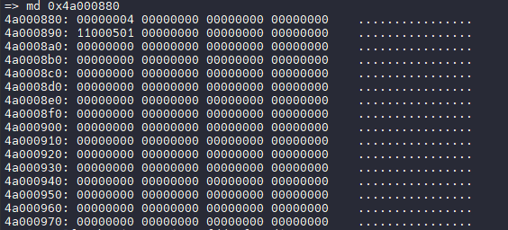

### 在 RTOS 中获取唤醒源

在 RTOS 代码中可以用 `readl` 获取寄存器 `0x4A000214` 的值，并进行判断

```c
复位源(Reset Source)：

- bit31 - rtcwdg ：RTC看门狗复位。当RTC看门狗定时器超时未被重置时，系统会通过此位标记由看门狗触发的复位。
- bit29 - detect ：检测到某种异常状态触发的复位。
- bit28 - poweron ：电源开启复位。当系统首次上电或从完全断电状态恢复时，会通过此位标记。

唤醒源(Wakeup Source)：
- bit11 - wlan ：由无线局域网模块触发的唤醒。
- bit10 - alarm1 ：由RTC闹钟1触发的唤醒。
- bit9  - alarm0 ：由RTC闹钟0触发的唤醒。
- bit8  - wakeup timer ：由专门的唤醒定时器触发的唤醒。
- bit7  - bit0 ：分别对应唤醒输入输出端口7到0(wakeup io7到wakeup io0)。当这些特定GPIO端口的状态发生变化时，可触发系统从低功耗状态唤醒。
```

### 在 Kernel 内获取开机&唤醒源

:::tip

:::note

SDK 1.2 新增内核获取启动原因驱动 sunxi\_startup\_info

:::

:::

使用功能前需要勾选内核驱动

```
Allwinner BSP  --->
	Device Drivers  --->
		Misc Devices Drivers  --->
			<*> Allwinner startup-info driver
```

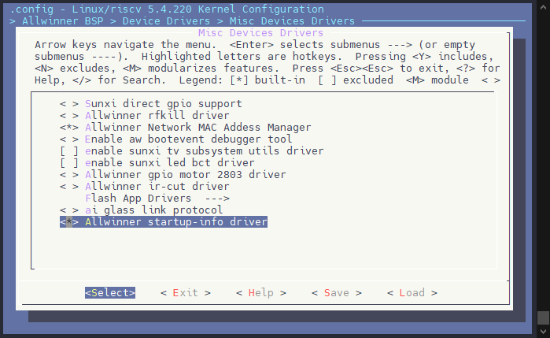

之后启动后便可在下面所示 SYSFS 路径查看开机唤醒源

```
/sys/class/sunxi_startup_info/startup_info/
```

![image-20250529140541200](data:image/png;base64,iVBORw0KGgoAAAANSUhEUgAAAq0AAAAwCAYAAAA7O0MfAAAXu0lEQVR4nO2dT2gb17rAf33cbeA5qyR3IWkmi3Rni+tFFy8Tux7f0HIp1IbCXSjuVUAKKbxmYftCK4fYN1DZi/TCDZWgIqkWhQtWIZRXEo9rR+mii15s724XmZFmcZus4kKgdNe3mBlpJEua0R/H/74fFFyd+c755pwzX86f75zvtXg8/hvAL7/+jsODxspWBr1dslVkarqI+SpVEgRBEARBEA6M1w7noFUQBEEQBEEQ6vzXQSsgHAxqqsDO1rr7X4dV7ROK1E83RND1COpBq3Fk6bP+lAQrq25fXU1IOwwcaR9BOCwci0GrmspQSkUOWo02RNCzBdL7OOpRFQ1VccvSw9WDmU8yHJ9gWNwsWiL10wWKRjqbQDloPY4qfdafnkqgGNJf9w1pH0E4NBz8oFXPdFzJUnXfLHWrwMqewalGOhXFMOz91rRHbIz1KulU/zNsNVVgJ6s1/RpBX0449acnWJmI9lnK/tFa/5NTfr8cWv2tIlPxJYz9yDvAPhz6/MPQV/1FUFWwrP7tX0/9S9ongANuH0E4ZnQxaI2gKq94C1DPUMpqvlWvMkpqgbRvyqumEuhGkZz1KhXrEqNIjkSfq60a6VQEY73c+LOioVPGsEBVophWtZ9C9pE2+p+Y8vvlqOt/0ByA/TpSHHT/kvbpzEG3jyAcDgIGrc4p/nSqQGlrgeXlBUoNs94I6Wzd96+U1ZqMTod0JUFpa92dOWqseP6DtZmkxkpWw5hPkvNWUa0iOcO/Be783fJDPnWZr9+Z4fK5Gb5+51P+/c6n/Ht8hsun/A+d4YPRvzpp73zK16PDnO9S/nI7+QZsDMNGn2g1S3bfPcjXSb+IbhXJedN9PUNptUBpNYGqJFheLVBKRVBTC5Syg/GbUvWM00beKndI14NQ+gfm79TLSsNAP0J6tf5bV/q1KN9z3aj3zy7rTdGa+nejfJB+/erfUV5JNH2rOKtWXj/z0v15rGbQGyaEhcZ+qSQobRV8k0bfd9vDaliw/p3sA4H139F+BeUfsv7Sqfo77LV/QXSov8D2cb6FHbc99Gwrn8kg++x/t176l7TPQbaPIJxEQqy0auhKkbl4kqnpJMPTxdo2iZ4tkKbIVHyC4eklDDXDsm/7vmO65f4+XwbKzMYnnNXUeXcAql9Ep8yaASia6yJQYBIbVfG2wKOoio3Z1klomOu/3+HGgw95/cEn3Hg5zJ0Lw7XUy6N/5ToP+dODD3l94z6PTs1w58KZruTvePIPPmkhX8e0qqD2upIQIZ3SMPI+fyhjibm5RXIGGPkkc3NlTMrMTi8ylx+E35RGOhvFmHfbJb7I2oTW4zZdC/0D8y+TyzcN9PUEacXtE13p16p8p3+uqGVmp5085tZB7+IFdf0irC+65ScxSFDyTbo669ev/oNoH430xBPmXP1nTY2VVL2+zXySWTPhfrMaK6sJrPmkb1fD+2572ToN0D/IPhBU//VyWtqvEPmHegfFrb8W9i+YoPrr1D42uWnn95xFvR59PpNB9rlOD/1L2oeDbR9BOJmEGLTaGPly/WOp+eZoTOo2OS/NKpPLl1F1b7YYlN4ZVYmC8QQD0FMZdHPJMZz4Z/uRAOf45zz6cYen7t8P/7MDp864q6HD/PHcc+566S93+MePO5w/518t7UKe5y3km2ipr2sYOzno6wnS7J1lmxaoqo1p2JhqBNV4gmHZmANzlYig1w552Rjzxd78utroH5S/aZQx9Yu1fyj1Ca3WJ7rSr2X5bv+cK2JYXnndrWQY+aX6LgA2ufVy08QkSL9+9O9Cvi3+b9t2diyaJlbG/BJWqkBpNYNuLDE70JWe/vQPrn8335b2axD0bt/C5h/UPu3pwv7uU/+S9unEINpHEE4evR/EUiIoVNsPkILSQ+M4sjsuAHaXDu3PefqyTdKpM5zvlB5K/gzXxz+tuQf8e3S4zcP90GqWHSGdzbCSXUBXnEH9SkoD9SIrA3INgDKz00UsPcHyartDcL3qHzJ/q4xhOb5cfiPfnX5tyh9E/9QTlGqHBJu2RgP161P/gbRPmPd3VrxVxV/3g2AA+nes/1fBIOzbPuUfun/vY/+S9mlP3+0jCCeT3getlo1F1J2F95AeBjWCirP972wTR1AUn+G0bHq2SS+f85QznD8V/Gh7ec91wPffxkN35bUFbfXtMDtv2BKvY6w/wQRUq0xu3cbxm33C2iAd9a0is9NJpuITTM1X0VOJ7t0D2ugfLn+7vvqgX0S3yrVV0dD6tSu/7/6psZJNYHmHBFttXQbp14/+YeX7RUmwnKqSy0N6ecB3TPalf4j633f6tG/7Sdj+vW/9S9qnI4NoH0E4gfRx5VWZNcOZBTqO7xrplOZs6YZKdzFtzBYfr2lVa9vpRt7x99nZWmAS/0qrU0bYu0kb2eHRT2e4fsHdzj81zAcXhnn60077Qece+WHu+A5fnT93ucHn1Y8+0eLdAcfZv7D3UIFfLt+8LWe7eUUw8kXnui+lylq+jGHY3c3ILRsLjcnmwpUEK6n+t9Ja699F/sYTDMXxhWuov5Dybcv3+udyonZ4QtVb3PDQrn4AsDG9/uj279Dv16/+QfKu3mlvdaxZv1B4fqxL5Fz/1r0+iR5dDhDCtn8b++DQof7D0i7/UPUXwr6FZtADrHD2t+/vU9qnR/psH0E4ofR1T6sxnySHe8pz1fE7ncvbodMB90YA3JOWvi0ko0jO2xq2vMMySWbnkw0zdmO9dz+lhz98wl0uO7cDjM/wx5f3ufHj867kb3jy73zKnd/Do//stHjS2dpufZdsFdOyMRt8NV2UBGnd2Z7dS8TxZzVxDq21kg9Fmdn5Mop7urXkOyiX4yLL3snWFOSmuzxw00n/0Pl7qwxN+YSR71h/Tv+cNbXaPcDLE2DsUaBN/VAml6/WTwUvX8Q0fCtJQfr1q3+gvKM3XmSvZv1CoGcb/ViN+SUMPdN0o4NXVhV9tbmOOhC2/dvZh6D6D0uH/IPrr0zOct+hnX0LRQ/1F4JA+zuI71Pap2f6ah9BOKG8Fo/HfwP45dffHbQue1ESlFY1rPlFZtsGD4iQXl2AueThvatVz7CTspnqMhqKnl0nbSWZOqJGa1D6q6kCJaXY9fai1J+wbygJSqsRcvsVVOEVcKz7l7SPIBxLDj4iViesIlPTRUgt1O+y2zPLtZ0ZvX5YI4VESE9Eyc116Uh/1GfZA9O/x0u1pf4EoT3Svw430j6C0JLDvdIqnGj0rBNIwDSWmHrlhziE3nEujW97aMedjB7p09AdV/JOwPsfdqR9BOFYIoNWQRAEQRAE4dBzuN0DBEE4GKJXeXfzNrGD1kMQhO7ZE3JZEI4HMmgVBEEQBEEQDj0yaBUOFj3DTif/MuFkc+k2SVnxPbrI9y0IwgA5QoPWGGdPxzh70GocWyKoSti42ScRqR/heNHysnxlMHeQCsLhQuz3caH9oPX0X/j42iJvjy7y8bXvuHvtOz6eHGsaNMZ4e7LI3T3pMd5+7zuSLXrI2dEidyfHavLxlvIeYySvLfL2aJGPr90iqd/i42uLxPt6ZaGOc4o2nSpQ2lpgeXmhKTJXBD1bqF83lm0M4qDqGedi7C03NvmeyGQd5BX3Uu2s5urRfXzyMOWnO5bftAKkZ9hZ9Ycq7bZ+msOcdq6//Wbo0m3e3fye5Ob3JDe/ZPySb72ylc/qpdsk711lyJ/HTD2Pd2+ON6Z1yp9xxje/Z/ySv4AY8Xv134L1+57kzfFaXsna/9fzi9380pVv0i96lXc3v2T85pdO3jNufpu3iUe7rMjDSKj+2/n7W15tklcSlFYT4b5/r3z/N7iaqUWXG8T3fXKJkF5dbxHEw7mzulaHitZk39qHWVZTBWfFu2GiEqJ9/Y/7+5ebnk7V279b+yb2W+iFgJXWMd4a2qTw2f9w/Z8LbA8tkhyt/8MSnyzyFvf42570Cs924ezpvZt6Z4diPNut1uSTnvxniT35ezqMDN2j8FmCv/0zwfV/3mOrz5cW/GjoSpG5eJKp6STD0/WQgXq2wApFpuJONDJDzbBcuydXI52NYsy7ccXji6xNaA1GpKO85f4+XwbKzHYdnzxc+Wmv/OmlJv0HVD+qF61tgrl10H0KdK6//WackZsxqrfeoDD2BoWxj6hob3a5zT7OSORbNsfeoPD+R1SjtxmbidXTOua/wfYXFWKab5B56Soj0Q0qj0PIVz/nq7E3KNzaADbYGHOfu7VRyy5280vGcZ8b+3OTfg4/f/FnvvoCYldibI+9wcbjcaKXToazQefvr4xhNYYnVnUN1RdZL7j/aqQnnjDnps+aGiteKNW+v++TjBPpUGmx6q0oESfEOaDrF2F90bV/SQxah1lWUwWW9Sqz8SUMXwCe/u2TRlpx279r+yr2W+iNgEFrhW/+tckzgBeb/N+/NjmreKuhY4yo7dO3zE3ODjlLGvHJ7/h4NAbEODtUYdus7JWn0pR/XYft2jPAi8pAXlzwsDHyvnjXlneZtRN6NldLc/5uDJkbQVc0d5vRxpj3x8gOI98vXZRvlXssP6B+5oq1fwhMwwk52bL8fXn/IGJEo+M4n2GFyq3P6e7rqbD9xQa7ANUNtr7YYEh707fa2jn/3ccb7F6qD0Rj2jg8/tb3TD/6jRO75NOPSgv9KuxWYbdagWqFn7t696NOUP9zwkrrE1rt+cYgHmH6r//bsB1ZVbZgB4GxXkZVnH8/9awXVMcJ3e2FAzfyS+RqkSJtci3qX00VKKWqLULwDsI+9WtfxX4L3RNwOWuVZy/aJJ2OcZYq2+3Sd6s8U8eIAyNDFRga46wJI6erfPPCk48Rf+873vLLvbjX7TsI+4ESQSGCvrpO2v+7VXT/KDM7HWFlOcFyKoOKjZFfZNaL4BIo3y9hyq+ytl+hfYPy3/f3D2KDjfcLjN+8ytiV2wxRofLFR2zc72bY6gz6es6/+i3V6peMzMSo3I85g8z3N8LLdyKq8N/EiN37nhH/79VCF+93jAnR/8x8EWMrQTpfJqdeRLeKTBnh5aGKeVhDZx91TBszexF9HiZVG1QN1QBdqdbDlesJSqlEo29yQ/tE0NUyJhqT+hKGf9Q6EPvUT/uL/RZ6I2DQGuXsaaDVwPRFhWdcCk4fHeOsdZNvhm4RV6ucNTed7f0XFZ6xyTefLch2/2HEsrEod47dbRWZnXY+YlXPUMom0PPu82Hk+9YxqHxnFm/sh+ELyv9VvH8Q1c/ZeP9zwPUfvXmV2P2PuljNjDEUhUq7gWtg/s7q58iVNxmqxohVN/iq2o18p3ez+JkNtse6eZ8TRKj+V2bNyJDWI5iKhmkkG1akDrz/nmQ8+5ICxVgkpyyg61Wf+4bGSjaBNZ9kyltt1TPspPyZ2OTmlsipsJMtkDaT9QHvQNo32p99Ffst9ECAe0CMt/7gbtefHuPtP4zxzPK26jfZNoPTR5Qo22aFLbPKiBKt+bM66WMkfYevzqp/ITk6hnAYKLNmaKz4nM9VPVH3WVOcv9tvlQTIe5g2pmv8uiJU+RHS3jOKRjqlYRredpNjtNKej5KbHh43/+VE7XCDqidI6/70EO+/X0SvMj7TeHCqgarFz4wz4vmARseJXxlveijGyBU3Dzd9t/ytsx0flL/H42+pRJO8e9Mn2418tcKuO3huZIPK43HGfYevhi45eZ4IAvtvuP5nrJdR9QSTen3buRv5QHr9vk88jn3R9SiGYWOsV9H1aM2f1cHGxFuZ7GC/jCVmXVtVt5cB7RvKPnawr0GI/RZ6JGDQusk3u2Mkr33H3fcWGdldoPBDfV1jay3BN7zv3C7QIv3ZboWzp10Xg90qnI7x7EWjfMGTv+bcNrBtbg76HYUeMeaTzJKonfBcnoA1w/V5s4rkuMiyd7IyxR6/qY7yHpbjR5Re7fJ0ccjyc175qxl0c4k5b/uJMrPzZUi5p0OXL2I26xamfkyNldX6+/m34EK9/35R/Zxt3mTMO1l/Bbbf969KbrBxawOuuKfvb77JbnmjKZMNtm03j3u3iVY/4itv+z4w/3oezsGrDbYbXAdCylc/Z/sxjNzbe3tA5daf2eBq7QaCMQ0qj5vf4bgS3H9D9T/jCYaioVvlPStOA+m/vX7fApZloyruFrxpgxLBsur2K5evomfXQ9kvzxb6DxJ1bt8w9rFMznJt8B77GvRyYr+F3ngtHo//BvDLr02eAqf/wsfvRWX7XhCEvhia+ZJ3I583nPwXBOEIoyQorUZk+1x45Ryh4AKCIBw9xhm5EqOyZxVXEARBELoj4CCWIBwEzqXQbUM/WkWmpovhfKeEAyN20wkksPv4I756fNDaCILwahD7Lewf7d0DhGPNjf9Ndky/83e5OkgQBEEQhMODuAcIgiAIgiAIh55jMWhVUxk3YshhxIlfnG67V9I/ai2qSAR9T/xmQRAEQRCEo8/BD1r1DDsd/F9UPVG7kmJnq8DKnsGpRjoVbbpj8DDh3LGXTiX6Dv+mpgotroyJoC8nnPrTE6xM7LnQUhAEQRAE4cjTxaA1gqq84rjSeoZSVsPMJxmOTzA8XUZJLZD2XVStphLoRrEe6eMwYhTJkehztbU5NriLoqHj3LGoKs2XTwuCIAiCIBwPAk5faaxsXcTMR9FTgAWqUmW2djdbhHR2gbS7JW0aS8zN+yNidEhXEpRW66uPK1vuCqKxxPB82Sk7q2HMT5DzLoKziuSMBGk9Qi5v422HG/kWF/6euszX42e4+wNcHx3mPMDLHW78cJ+HL72HzvDB6AzXz50B4OlP97nxww5Pu5C/PDrDnVbyDTjRZtITGuy5nNg9aRl0olJvig2uZyilouBOJJZXNVQlAixQUsrMzcvpTEEQBEEQjg8hVlo1dKXIXDzJ1HSS4eli7TJhPVsgTZGp+ATD00sYaqYh4kbHdMv9fb4MlJmNTzirqfPuoE6/iE6ZNQNQvKgVBSaxURVvCzyKqtiYbUdnw1z//Q43HnzI6w8+4cbLYe5cGK6lXh79K9d5yJ8efMjrG/d5dGqGOxfOdCV/x5N/8EkL+TqmVQW115VqJ5ydkfcNRI0l5uYWyRlg5JPMzZUxKTM7vchcXgasgiAIgiAcL0IMWm2MvG/1tBZGTmNSt8l5aVaZXL6MqnuxeoPSO6MqUSfEIKCnnBBuw/FF1vD5tCoROoe0fs6jH72Vz+c8/M8OnDrjrJoyzB/PPeeul/5yh3/8uMP5c+6qarfyPG8h30RLfd0Be8dV1gRpivUVZxfTAlW1MQ0bU42gGk8wLNsJ+ycIgiAIgnCM6P1yViWCQpW1dgOkoPTQRFBVai4AlmUTMFL18ZynL9sknTrDeZ7zqF16KPkzXB7/lOv+318+DKtcSLxV1okmt4sEKlEUBUhlUFXHvWIlGyEnrgGCIAiCIBwzeh+0WjYWzlVLRquBaVB6GNQIKmVME9cftIqi+FZaLZuex8Qvn/OUYc6fAjoOXDvJ73D3wX1CD1Pb6htBxW490NQTpJUys02rrMb6E5iIoltlZtdhUrUxjCesyUEsQRAEQRCOIX1ceVVmzXBWAVUARSOd0jANz5UgKN3FtDGJuveM+n62qrXtdCPv+MPubC0wif9qK6eM3u4m3eHRT2e4fsHdzj81zAcXhnn6U6uDVO3kh7kzWncHOH/ucoPPqx99osW7A85BrAKlNtd+6RMaZr7uR+xgu3lFMPJF57ovpcpavoxhtBn8CoIgCIIgHGH6it1qzCfJZRcobWUA93aAvB06HXBvBHAOWqWhfnuAUSSXKpBOFTHyZWanW9wQABjrZVZSGmoPh48e/vAJ50dn+PqdGcA9/f/j867kaZB/yN0fd1o86fj3GtOt7pKtYlo2ivmkaWAKKAnSeplcvJVcxPFnzeMcWjOeMBtac0EQBEEQhKPFa/F4/DeAX37ta/y6PygJSqsa1vwis22DB0RIry7AXPLw3tWqZ9hJ2Z2vtGolll0nbSWZah7oD4Ab/5vsmH7n74WBlykIgiAIgtArBx8RqxPu3aWkFtyIWOstwrXa5PJVdL05UtRhIUJ6IkpursuVYG+VdR8GrIIgCIIgCEeNw73SKuwbstIqCIIgCMJRQgatgiAIgiAIwqHncLsHCIIgCIIgCALw/+UF7I26A075AAAAAElFTkSuQmCC)

#### 获取唤醒源

使用节点即可获取唤醒源，命令如下：

```bash
cat /sys/class/sunxi_startup_info/startup_info/wakeup_source
```

| 唤醒源 | 描述 | 使用场景 |
| --- | --- | --- |
| wakeup\_io | PL0~7 中任意一个引脚，IO 唤醒  
使用示例：  
1\. 关机后按住 POWER ON按键，唤醒系统  
2\. 使用 GSensor 中断脚连接 Wake UP IO 唤醒系统 | IO 按键唤醒  
GSensor 唤醒  
ACC 打火唤醒 |
| sysrtc | 使用 RTC 进行唤醒  
使用示例：  
设置 10s 后唤醒系统：echo +10 > /sys/class/rtc/rtc0/wakealarm | 定时唤醒记录  
长时间闹钟唤醒  
时间以秒为单位 |
| wakeup\_timer | 使用 Wake UP Timer 进行唤醒  
使用示例：  
设置休眠后 700ms 唤醒系统：echo 700 > /sys/class/ae350\_standby/time\_to\_wakeup\_ms | 短时间唤醒  
AOV 场景短时唤醒  
时间以毫秒为单位  
休眠开始时才计时 |
| 空 | 本次启动不是通过唤醒源启动的 | 重置开机场景，查看 `reset_source` |

例如这里使用 `wakeup_io` 唤醒，打印如下：

![image-20250529140623695](data:image/png;base64,iVBORw0KGgoAAAANSUhEUgAAAqEAAABMCAYAAABd524rAAAYOklEQVR4nO3dPWjj2N4G8GdfbpvuFmG2kDlKMdsZQ9oIFp+5aS5bJLUIuJAgC+9OYXsbp0iacVxkX7gDdmEYXMfFsE0mxywo7UBwd6cYCavYIX3gcrt9C0m27NiSbOXDk3l+sLBj+UjH5yjy3+fzu1Kp9BdC//nv30BERERE9ND+56kzQERERETfHgahRERERPToGIQSERER0aNjEEpEREREj45BKBERERE9OgahRERERPToGIQSERER0aN7NkGobjXQt7SnzsYCGmSzC1s+3BV0YUAX4bXkupYDERERUWA9glDZwPC6gUUxmi5NtM4HGF4PMLzuonUn2DRgWwUo5T90TlfkQw1GsC0Tes4z6VYXw6Yx86oGeWoG5SdNtMqFnFchIiIielhLBqEadKHlDqSWIhvoNw24nQqKpTKK+w6EdQRbTN6iWyak6qHtPWbGlqR6aMPM2RpqwLY0qIEz/bIwIOFAeYAuCnC9UZ6LEBERET24DPt0Gmhd78DtFCAtAB6gixGqpRMoAIAGu3kEO+wCdtUJanUH7jh9wnFhon8+aR1sXYctfOoExboTXLtpQNXLaKvwTV4PbWXClhraHR9R97PqzARmALCxi99/3MTbj8DhdhFbAHA7xOuP73BxG71pEz9vH+DwxSYA4POXd3j9cYjPS6Tf3T7A2bz0U3wo5cMuG4CazauB1nUD0uthb78XK7sZcid4T1QWsoG+VQDCHwan5wZ0oQE4Ql84qNUTzkVERET0hDK2hBqQoodaqYK9/QqK+z2M46BmFzZ62CuVUdw/gdIbOI11lyce98LX6w4AB9VSOWjtrIdBmtyBhINLBUAYYZd8F6/gQxdRl3MBuvDhLoy2ijj8fojX73/BD+/f4PVtEWcvi+Oju9u/4hAX+Of7X/DDH+/wYeMAZy83l0p/FqV//2ZO+gnXGwH6qi3JGmzLgOrEAkt1glrtGG0FqE4FtZoDFw6q+8eodRiAEhER0frKGIT6UJ1Y66YXjb008Er6aEfHPAftjgNdGmGglXY8mS4KgLqCAiCtBqR7gmLpGJeIjQkVGsTCMwDADT58ilomb3Dx5xDY2AxaNVHEP17c4G10/HaIf30aYutF2Oq5bHrczEk/Y25+wwA8sRXUhI3epEU45HqArvtwlQ9X16CrKyjPh7vOQxOIiIjom5ehOz6B0CAwwuWigCfteGYadB3jLnfP85ESecbc4PPtgkMbm9jCDT4sOp4p/SZ2f/wNh/HXby+yZi6jqBW0PDPMwYSOAoQAYDWg68FwhlZTQ5td8URERLTG8gWhng8PwdJAal6gmXY8C12DDgeui3A85QhCxFpCPR8rx7i3N/iMIrY2ACQGoknph3j7/h0yh50L86tBhz8/cJQmbOGgOtMKqgZXQLkA6TmoDoBXug+lrnDJiUlERES05nIu0eTgUgWtdDoACAO2ZcBVUdd92vGQ68NFIVznMvayNxp3X6tOMJ50eH2EV4gvxRRcY7W1MYf48GUThy/D7vONIn5+WcTnL/MmFi1KX8TZ9qT7fevF7tSY0ThZnvPZAQQTk7roL1imSpYNuJ3JONyAH55Lg+r0guWpxAiXHQdKLQhmiYiIiNZEvpZQAKpeQbt5hP51A0A4+73jZz4OIJzxHkw8soHJ7HjVQ9vqwrZ6UB0H1f05M+ABqIGDlmVAX2EyzsXHN9jaPsDvPx0ACGe3f7pZKj2m0l/g7afhnHcG42PV/ry1TEdwPR/CvZoJNAEIE7Z00C7NS6cF40E7CCZxqStUM+eciIiI6Ol8VyqV/or+8Z//5o5J758w0T834NWPUV24GL0G+/wIqFXWd61Q2cDQ8pOXYJqXrDmA7VWwNxu4ExEREX3F1mPHpCTh2pmwjsIdkwZztuf00e6MIOXsTkLrQoNdLqBdW7KlNmoFZQBKREREz8z6t4QSERER0bOz/i2hRERERPTsMAglWpFudcdDRIYLVjagSLCCxWq7hVHu8hNmuOPcAMPYVsl0X55h/QgT/esu7MxrchMt79kEobrVmDNWdF1owfalDxil6MIIl7hadbkqWpbbqQTbzC452eybJAzYTTP7HhM0LWf5ScuEULxfHwzrh2gl6xGEykZiS5IuY78Sr7to3Qk2DdhWIVgrcy35UIMRbCv/L1zd6mLYnJ2ApUGemkH5SROtciHnVZaUUn/LmP/5Hs9TXz+vtc2/18Ne6eTuEmT34R7vvyc5fxa5yi/Ycc7z8j8fV7q/WD8pnrh+iJ7QkkGoBl08cpeabKDfNGKtTg6EdTTVRaBbJqTqre/yTECw5inMnK2hBmxLgxrMrJcqDEg4UB6gi0KwyP9XacHn+2aun9fXnv+n9gTPt6/KU99frJ9kT10/zx3vv4eQIQg10LpuwLa66F8f4fT0aGZnHw12czI2rt80Ziop4bgw0b8ehL/cDLSi8XXjX3IGWk0jWPA+auX0emhP7ZAU/P/cP7yNXfz+0wF2Xxzg959+w79/+g3//vEAuxvxN23i5+1fg2M//YbfY7sfZU2/uyj9FB9K+ZDleb9Sw8+eNhZI7kB6PbSjn9uygf55F/1zE7owcXreRd/SoFtH6DeztroGQwUm9TOTThgz9WcuUX9Lmv18AHTZCK4RtYJPDTUIrtmaCuw12OeT15LTp18/tXzSJJVfhvzlzX9iemHe3aVLNib3YXQ8fo7zBuTUD8Du9H17ZxxZ7L5YobUqPf8p919K+Sc+39LOn7H8bGvyGe4+H9MklF9q/QR/C8OwPmRz3pjDtOd3/LOtcn+xfp6mfqafg3FTraWp5T+T7nr67//u83H2+/1hyz/9+ZgWfyTkD0CW+Cf5+yGhfAhA5pZQA1L0UCtVsLdfQXF/soWkbHZho4e9UhnF/WBrzdNYd3nicS98ve4AcFAtlYPWznoYUModSDi4VACEEXbJd/EKPnQRdTkXoAsf7sJBNEUcfj/E6/e/4If3b/D6tji1rebu9q84xAX++f4X/PDHO3zYOMDZy82l0p9F6d+/mZN+wvVGgL7qL6lg+1MV3xVKnaBWO0ZbAapTQa3mwIWD6v4xahl3j5LNLlq6g+p+UPa1ASBjf5VS7gCD46BeShUomOhHD7C0+sv7+WDAbhag6uF5S8e4LBuxB0CwhupUYC9N2CK8Z1LTp10/vXzSJJZfav7y5n+Z9IsYsMtXqIX5r7oGWtakvN1OBVXXDP+mDbTOTXj1+KYR0X2xSldlSv4z3H/J5T+5ztzn273c3wZsEZbfnOdjurTyS6ofH+394PW2h0k5xsYcpj2/J1a4v1g/eLr6Cb4Thbj7XiG0cW9ZtvIPAtBTOUK1dAIV63GUzS5aUf5KlRXKL0/5pz/fspdf8nWS4p/E78/c5fP8ZQxCfahObM/z8diVYCvKdnTMc9DuONBlFO2nHU+miwKggq0spdWAdE+CGw3xX9taymDwG3z4FO0Ff4OLP4fAxmbYWlnEP17c4G10/HaIf30aYutFvDVzifS4mZN+xtz8hg+ypAHp0oSN2VY6wPUQbN2pfLi6Bl1dQXk+3ExDE8L6qfXGDxZXTV9DdU4mrdDw0R44OQLpBAs+H6BBjidd+VD13tTD3lUOXLkzfvDIsjG+Z7KkT75+evmkSS+/tPzlyf8S6ReK/+37QY/DTP2r+gk8q4v+eQNSnaB6rwM/8+U/2/276Pl2H1Z//mU9f1r9LLbE8/mB7i/WT5J89aMGzrixRjajTV6CrZ6j+RNZyl+3uuhbI7T3ZwPtmfyFZblc+eUt/6T7L1/8Ec9jYvyz8PvhPsrn+cs3MUloEBgtDnjSjmcWDNwOutz9JQdw3+Dz7YJDG5vYSjqeKf0mDn/8bdwd/+/t4oI35zGvFUKD3Wyg1TyCFEGQ3rIMQN9BK2uXcZb6kSb640lhObraE81vhQQcVPd78KSJ0/MFk9I8B8oLxkLF/+gzp0+6/n3cv4nll5a/nPnPnD5Jls8ftEjrIl729+Ee8v8o92+S+3j+PdD5M9/fD3h/sX4Wy1s/rh/+QDfwSvcBaUAXBqSInTO1/DVIfQQXBl7NdqEIDWI8pGDV+stT/in3373FHwtkin/yls/zly8I9Xx4KIS/QlY4noWuQQ+7FoJuV226i8HzsfI9dnuDz9jE1kb6Wxenj7rqY//9cRG2jM6xML8Jv46nupgn1OAKLgDdc9Ae+AjGnV7hMuvA9NT6MdBqmvCiSWErd7WnWPD5gjz2UN2vYK9Uxl59BGmZM93JsV+XcgfSc6a6i9LTJ1w/9/2bofzS8pcn/1nT5yVMnFojtDuAfXrPaxzmyv8j3b+Jcj7/HlLW+/vB7i/WT6K89ROlt3Yg1DHarhGsZTruKcpS/j7atRPs1Z2ga1vMnj82DKJ0dzhBupzln3T/3Uf8kXjtLPFP3vJ5/nIu0eTgUgW/woKBxgZsywi6SDMdD7k+3DmV6Xqjcfe16gTjOYbXR3iFeEtocI3V1sYc4sOXTRy+DLvPN4r4+WURn78MFweRd9IXcRabjLT1YndqzGicLM/57ACCwc/du4Ok4+k6s91cfnguDarTC7pXxAiXHQdK+Rlv8rB+Ts3xYHNdzs7g9+FG5R3W3x0L6i+r+Z8PwQLOVoauC3UFJYKxTFPlmzH9wutnKh+ED5s5LQUAEssvLX9585+WPsy3HbUeLKrfRNE40BO0w/Gh88aUBZa8R7LWf+L9l+H+XfX8mcovw/Mvs/v+Qs32fM7998n6WVHO+hl/NwbLF6rBCFLOrp6SsfzVCarhs3BS3w4uVTB5OHpNl+ZkzOtDl3/q/ZdSfrmff2nfDynlQwDuYZ1QVa+gjXCW4nkwbrPW8TMfBxDOeMek2Tr6ElM9tKOuVi8a/FtBtV6Z+sWmBquPs7j4+AZvsRvMfv/xAP+4fYfXn26WSv86Sv/Tbzj7Hvjw53DOO4Ou4vlrmY7gej7cqbGMIWHClkF3513B+B7XRTCJa176FKoeDpYPy/60DKjxSRy0O6PJrM3THbhqTkvFovrLIunzeT20sYPTaGahhTnjkoJ8Bq0AM+fJkj6xfNPKZ3L9at2BaEbX0cavJ5ZfWv7y5j81fZBvRDs/LarfBLI5PQ5U1U+gZGPOrFwH1foI8ny2jBJkrf+F91/G+zdLPhacP738HLS98DMsev5lskL5ZZD6fL6Pv0/Wz8py1Q+CtUf1qPvd9QGhxYazLVf+UV7iE2tUvYJqlL/w+XipYsOhHrL8M9x/yeWX//mX9v2QXD4EAN+VSqW/on/8579/e8q8zCdM9M8NePVjVBcuRq/BPj8CapX1XStUNjC0fOwt2RQvmwPYXgV7Kz0Y1999fT7d6qIvekt3533t5fu15/9ZEyb65xraD7VI/yN41vcX6+dpPYPyp/zWY8ekJF4Pe/s9wDqarLV151emH/yik+vazK3BLhfQri05FiTlV+5X794+34qLNH/t5fu155/WG++v9cb6oWdg/VtCiRLIZrAgs6uCwfP0tQgWgV44iSX88flVD+BPbOn5Bj7/umP9PC2WP4FBKBERERE9gYftjr+zhd86C2bYcxFZIiIiooe3/mNCH4swYDfNlN2XiIiIiOg+sP894vWwV3rqTBARERF9G9gSSkRERESPLjEItc8HcxadDtZkHC8ILAzYze5k+aSEfct1q4vhdWO8u0BAg5xKH1t0Xph3dxGSDQzPw2uEx22rMV4Mdip9JgZa0b6uc2fjaTOfb7VF8YmIiIhoIjEIdV1M79MeEkIbb/0l5Q4wOA73Ra1AYf62fbrVxakcoVo6mdrbWza7aKGHvSi93pjakSGdAVtcoVYqo7h/skL6aG/X+QvmymYXdpS/lc5PRERERLMSg1A1cKCLAoBgPcZgkfhgq8ho+0nVOUF7vJORj/bAAfTpWea61UXfGs3Z0i3YyrLdifaKDf5/uS04Y+k9Z4X0SWbyd+/nJyIiIvo2JU9Mcn24zR3IOvBK9wHdgK4AKUaT7TGlib5lQo93sXu92D80SN2BCwOv5Mn0vttCg4AGeT6AjUXp04T74j4EoUFghMt13QqUiIiI6CuVHIR6PjwY0C1AqGO0xRGkHEFXV2GLpoFW04RXr2Avag2VDQyt+El8tGsnaOvAsNmF7cb2d/d8eHBy7h1bgC4w1cV/b6LP/1DnJyIiIvpGpcyOd3CpNEhZgFI+1GAEKQvj8aABHy7CAFQYsK0F+7erE1SVBvs0PnHJwaUy0IpN9tGliVZ0jjAItKMxmHPPr8G2wvThcVc5K27nVZhu0Q0///2dn4iIiIiADEs0eZ4PXYRd3q4PCA2eF40BddDujCCb4ezy0x24avH+3apeQRvm1MQeVa+gCnM8u/20DFyOz+GgWncAq5twfgdtbwen1wMMzxuQ7glqHR/Lc1CtjyDPw1nwYR6jPPdzn5+IiIiIIl/33vHCRP9cy9mdT0RERESPjYvVExEREdGj+8qaPpdhoDV38fmQ18Pefo9jO4mIiIiewNfdHU+5vP7fSuLxs//rPlJOiIiI6FvD7ngiIiIienTPJgjVrcZ4Rvv60YLtPxeODchPF0a4vJQGKde1HIiIiIgC6xGEygaGCeM3dWmiFS6dNLzuonUn2DRgW4XxVqLrJ1hj1bbM3Nt96lYXw+bdtVLlqRmUnzTRKhdyXoWIiIjoYS0ZhGrQhfa4+6bLBvpNA26ngmKpjOK+A2EdwY4tKq9bJqTqTXZiWkeqhzbMnK2hwcL9ajCzVqowIOFAeYAuZjcTICIiIlo/GWYiGWhd78DtFCAtAB6gixGq47U5NdjNI9hhF7CrTlCrx3cUSjguTPTPJ62DreuwhU+doFh3gms3Dah6Ge1oIVCvh7YyYUsN7Y6PqPtZdeYskr+xi99/3MTbj8DhdhFbAHA7xOuP73BxG71pEz9vH+DwxSYA4POXd3j9cYjPS6Tf3T7A2bz0U3wo5cMuG8CdBffDmfxpM/blTvCeqCxkA32rAIQ/DE7PDehCA3CEvnBQq3P2PxEREa2njC2hBqTooVaqYG+/guJ+b7w4vGx2YaOHvVIZxf0TKL0xtSNS4nEvfL3uAHBQLZWD1s56GKTJHUg4uFQAhBF2yXfxCj50EXU5F6ALH+7CaKuIw++HeP3+F/zw/g1e3xZx9rI4Prq7/SsOcYF/vv8FP/zxDh82DnD2cnOp9GdR+vdv5qSfcL0RoK/akhxsH6o6scBSnaBWO0ZbAapTQa3mwIWD6v4xah0GoERERLS+MgahPlQn1ro53rbTwCvpox0d8xy0Ow50Ge0Fn3Y8mS4KgLqCAiCtYMvMYukYl4iNCRUaxMIzAMANPnyKWiZvcPHnENjYDFo1UcQ/XtzgbXT8doh/fRpi60XY6rlsetzMST9jbn7DADyxFdSEjd6kRTjkeoCu+3CVD1fXoKsrKM8PtlklIiIiWlP5FgYVGgRGuFwU8KQdz0yDrmPc5e55PlIiz5gbfL5dcGhjE1u4wYdFxzOl38Tuj7/hMP767UXWzGUUtYKWZ4Y5mNBRgBAArAZ0PRjO0GpqaLMrnoiIiNZYviDU8+EhWBpIzQs0045noWvQ4cB1EY6nHEGIWEuo52PlGPf2Bp9RxNYGgMRANCn9EG/fv0PmsHNhfjXo8OcHjtKELRxUZ1pB1eAKKBcgPQfVAfBK96HUFS45MYmIiIjWXM4lmhxcqqCVTgcAYcC2DLgq6rpPOx5yfbgohOtcxl72RuPua9UJxpMOr4/wCvGlmIJrrLY25hAfvmzi8GXYfb5RxM8vi/j8Zd7EokXpizjbnnS/b73YnRozGifLcz47gGBiUhf9BctUybIBtzMZhxvww3NpUJ1esDyVGOGy40CpBcEsERER0ZrIvU+nqlfQbh6hf90AEM5+7/iZjwMIZ7wHE49sYDI7XvXQtrqwrR5Ux0F1f84MeABq4KBlGdBXmIxz8fENtrYP8PtPBwDC2e2fbpZKj6n0F3j7aTjnncH4WLU/by3TEVzPh3CvZgJNAMKELR20S/PSacF40A6CSVzqCtXMOSciIiJ6Ouu/d7ww0T834NWPUV24GL0G+/wIqFXWd61Q2cDQ8pOXYJqXrDmA7VWwNxu43wPuHU9ERERPZT12TEoSrp0J6yjcMWkwZ3tOH+3OCFLO7iS0LjTY5QLatSVbaqNW0AcIQImIiIie0vq3hNKDYUsoERERPRUGoURERET06Na/O56IiIiInh0GoURERET06BiEEhEREdGjYxBKRERERI+OQSgRERERPToGoURERET06BiEEhEREdGjYxBKRERERI/uu7///e9/pb+NiIiIiOj+/D9vo/7NoE9OIwAAAABJRU5ErkJggg==)

#### 获取开机源

若本次开机**不是通过唤醒开机**的，可以使用节点获取开机源，命令如下：

```bash
cat /sys/class/sunxi_startup_info/startup_info/reset_source
```

| 开机源 | 描述 | 使用场景 |
| --- | --- | --- |
| cold\_boot | 冷启动  
上电启动 | 插电开机 |
| rtc\_wdg\_rst | 看门狗触发重置开机 | 看门狗长时间未喂狗，导致重启开机 |
| rtc\_wdg\_rst  
user\_reboot | 用户主动执行 `reboot` 命令 | 用户主动执行了 `reboot` 命令，导致开机 |
| det\_rst | 由于 3V3，1V8，0V9 中任意一路电源出现异常跌落或掉电，触发重置开机 | 电源跌落掉电导致重置开机 |
| pwron\_rst | 使用内置 RESET 信号触发重置开机 | 内部信号触发重置开机 |
| 空 | 本次开机并非重置开机 | 唤醒场景，查看 `wakeup_source` |

例如冷启动，可以获取当前为冷启动：

![image-20250529142251022](data:image/png;base64,iVBORw0KGgoAAAANSUhEUgAAAmoAAAAuCAYAAACYhDUsAAAQ20lEQVR4nO2dvW/byLbAf/fhte6NbEGDTJF9lWAgtzSBhSbr5iKFXQsBVJBAFribwvI2chE3kVUkD7gBpEJAoNoqgm0Sj7EA3S5gqNsUIWEWu3DvP+C9gqS+LH5I9IecPT8gQKzRmTlzznB0OJ//ePI///w/7hLVZNiCvc1D9JxkS9VwnRrKBAjR3dfsdcOJb9i0z2v4u3U6wd2ovDCqydAJ2dnt45fIxnJ6DMw+lX1v4lMD9/gAGnU6VpNh9Wwm/ZbJ8d8izK/f3bFU+WaNwbFB5wbqX5b7tt+9cIPt717yv3UM3OMeVrfKXskKLNW+xD853LN/bpsH75/V5L/Skwws08C6O11ANRm0bPxuncpmlcquh+kc4Jrjr1hODaX7qxukAeg+HWq4qkwmNq5joE9nHkLTRuGhA7DMDfzgokwh90hK/f425Zfloet/39xD//aguO/2Jf7JJs8/Yr9sHpZ9ZgI1m/Z5E9fpMTg/4OjogMF5k3G8YeC2egzPTxmenzJo2TMVzUg3awzOTxm27Lic6DvR33HZLRu9X6ej4xG0oE9HGyhljPJXKqVxrm3z6/MXbD96wa/P3/HH83f88cMLttcmv7TOT09/idKev+PXpxUeLyi/nSY/RYjWIapqz0mL635cy24kagsV9OkkryWqyeC4x+C4hmXWODruMXAMLOeAQauWldMEBmrKPzM6mPaM/2oL+G9BZusHWKoZlXF+yvC8R3vkd0ZltqeCXwP3ePxZtnx++bn2ySPLfgX0K6t/prxZm3mWid5+k3aYpE/mcdyMR7bj/J3edLs1awzOexMvUhPtYrasAuTrn9P+cuyf2b/l5V/Qfq4zrsP1/jGPDPvl+id6FoaxP1Qr+c6kDfL678m6LdO+xD/36Z8iv98qI//8/idD/gZ+H4qUnx1fZPh/KfvMts9s+90mc0bUbJTZp7FZZ2e3TmW3PxrCVK0eLn12NqtUdg/RVpMjZ2zMzPQg/nzfAzz2NqvRqFkybKu2UHicaMC0aceN+hkhlrkRl7CBZYb4qfOJFV5+N+TVx5/5/uMbXl1VePukMkrdfvoLL/nEvz7+zPe/feDz2gvePllfSP5tIv/xzRz5MX5wAdayEbuB69jo7sTUqT6k0XhNR4Pu1mk0PHw89nZf0+j2C+WqWj3alsfebmT7ximoiZat1Bacvo78sllHU2OQPGh5/itbP2zc1gZ6P8538zUnVXviIfLodGeCX1XDNeM2kyufV36+ffLItF+ufmX1X0Q+DRu3ekYj1n/Pt2k7Y3v73Tp7fi1+pm3axzWC/cklCEm7WGbaI0f/Au0v2/7jcub2bzfSvm1cM7bfnP4xnzz7ZfknpLMbfd4JGNtxYvlFXv89Zon2Jf7hfv0z1iHr97ud5L9Zn8k/v//IlC/tn2LlF7NPdjmZ9sn6fcy03+0yJ1AL0V1v3ACCZH2YzTMV0knSAo9O18NSSVSZl56NZW6APkMDymmi/MPIWUy+tRmYqTkAXPL5y5Cv8f8//TmEtfV41KvCj48ueZ+kXw35z5chjx9NjootIM/lHPkZ5uobN+Ks9Wuqhsvs2xL4AVhWiK9DfMvA0mfoIMQvNA0c+6fRR8ff9/V0Gbp7OB7NJKRz6pUINjNIqR8YKNPGStYn7venOkRfe/hqa/Twqqo9ajNF5LPLz7dPHvn2y9OvjP4LyKcy+eyH0cj1jP/1/iGB02Nw3ETpw9LrbKYpp3+x9pvWv90Ey/d/RfPP8086C/TPt9S+xD9Z3IR/ZnUg/fc7tsV0/ln+LSJflgXKX9p/OfZJ7f/vov7pZKxRm8E0MLlIDwry0gtjYFnE05shwUIP6iVfr1KS1tZ5nJVeSH6dlz+8G019/vG0kvLlMsx7WzJwW03arQOUGQWybccGa4t20em5Iv5RNQbHp6Oh3aWnNTNJexv02NvtE6gaR/Foanv2bSXw0EG0NmPywSksn1X+TbTfTPvl6VdS/8LyWRSpfzSyaZmTtr8JbkD/O2m/WdxE/3dL+Rdu37fYvsQ/6ZT2T5H8k+nXJfqnXPmyFCn/Fv1XKL65zfpnUzxQC0ICNuJod4n0IlgGFtHUZjTFZWCaE84KQpb209UlX1nn8Vr+V9Plk2nRiX+/fYpH2OaQqm/GW9bUdN4YfXqGD1iBR+c0JFoHd8ZJ0cW+uf6xabdqBMlGjqWnNXNIqV+kY5+93To7m1V29i9QTm1m6m7iLUZtoQJv9PZTTD6j/NLtt4D98vQro39R+bKYNY6cCzpdcI8WXMOXRyn976j9ZlKy/7tNirbvW2tf4p9MbsI/uflPTEluXp96zfRvEfmy5JZ/i/4rFN/ccv0zKB6o4XGio2g+Wpxp4zp2NB1VKD3GD/HnGMQPLkZThbobzT8Pzw94xuSIWlSGylpkncqQz3+t8/JJPFW5VuGnJxW+/jVMD7SuyVd4O7GB4PGj7ak1bJOo6py6A9GCxt71hY+Tct3ZKYUwzstAd/toHYJ5wUnXQ+uwYEOJ/XNUGy1wtdTsztQQP7F37L9rpPivKPPrB5g12k6BYWR9hjajtS1T9i0on1p+IfsQP7A2z+b+QmXYL0+/svrnycd6u8lbapp/M0nWpR3SiderXV9jlLBgGynq/8z2V6D9Lpt/IfsV6P8Kc9M/SsX659LPp/hnSUr6p1D+0Ya9xIeWqo3X0OX6N0c+Ydnfh0LlZ9indP+W1/8XrP8tsUCgRrQjk3h3x3G0jqwxccZZXjoQ7+RkPISYdPS6TyeZ1gqSBX119vbrU29e+nT5eeFPv7/hPdvRrs4fXvDj1QdefblcSP5VIv/8HW+/g89/Dud8M5qW03retO0FfhDiT62tijFruCqaWrqOEa1P84k2XsyTz0HvxwtcY9sfVUGPMvHodC/Gu5GOtvD1nDfeNP8VIat+QZ8OWxwlO2oc6OzOW7SbvE3O5FNEPtO+efYZl7+372G2knKM0eeZ9svTr6z+ufKR3ji9bP9moFrT69L0/iFaNWd24iZlXaCOZ22UQVH/p7a/gu23iB4p+efbz6MTxHVI6/8KsYT9CpDbP9/E8yn+WZpS/imY/16Sf9y/nSQ2KuDfTPmEZX8fCpafbp/y/Vte/1+o/rfEP+78wNsszBqDY5tg/zV7c4McmDrwdVXPUlvywFvVOsUN6uws+SCuOjdVv2UPenzo9n3o+n/TrNBByMvyTbcv8Y/wgFloRO3WCfrs7PbBORifVXLtbSWM3szUXS9ELYqBW92g01h0sWe5t6WV58bqt+RBnA/dvg9df2G1kfa12oh//tas1oiaIGSgWtHhtr4+ZGeVrk0RcogOmkxdeB6/oN3FotxbI3PE5m9Q/1VH/HOPiH3LIoGaIAiCIAjCinJjU5+WM75aofD1MdeueMhg3hURgiAIgiAI3zA3FqiNL1KXIUxBEARBEISbYLU2E6wCqrnUhdKCIAiCIAg3jQRqgiAIgiAIK8pMoGagWuO1ZoNr90gauFPpix48Oz5Mbnjew13iZGfLaY4OnLtefp5+GelmfJBdy470vLf76ARBEARBECKmAjXV6tG2klsBqjROQanpdJc+O5tVKrvRNU9HC5zKrFrRacI78Vo2Fj4LzcY1z2iklJ+nX2Z6EH++78HknV5yDIQgCIIgCPfERKAWXXvUafRHF137OroOYiq9m9yt5Y0vyC5U1Hz5xcgqP0+/svoLgiAIgiDcLeNAzTQwucBPu5YpLz2PsvIAZfS7kfIFQRAEQRDujnGgFoQEWbfe56XnUVYeoIx+N1K+IAiCIAjC3TEx9elxog3coxoqDmYsVcNVM+lOPFVo2riOja+96XPTgpAAm2fXzreYL78YWeXn6VdQfz/El4BOEARBEIQVYOYKKQPVOqCtogX2vu7T2J88wNbAbR3gjtIPaex71w+4Vc3Rjkq/W2dndJGsgXuc7PaMLld3VVjsnq/4rjbdBRUHW9fvfMzTr5j+qtUb2QB9KBsKBEEQBEG4F+SuT0EQBEEQhBVFDrwVBEEQBEFYUf77vhWIsGlnXdsU9ItNjwqCIAiCIHxDyNTn34RX/65npr/9394daSIIgiAIQlFk6lMQBEEQBGFFeZCBmuU0GSxwddXdEt2X6qbO45bHMu34+BADpVbVDoIgCIIglOXuAzXVZJixHs1StamL29vXAjIb19lA63Cu/P0Tok8vcJ3ZC+0Xx3J6cy6FN1BHtch+qka7ulGyFEEQBEEQVpWMQM3AMo27vQczPn/N79ajC9F3PUznID53LcJyaijdp7PKV0HpPh1qJUfVbFzHQJ/OnOFm2ig8dACWuYEfXJQpRBAEQRCEFWZm16dN+3wLv7uBcoAALPOCvc1DorvZSxwoa9YYHI9Hmdrn8UjR6EBZm3bLRu9XxxfBB306uoarDDrdkGSqT8+7zH1tm19/WOf97/DyaYXHAFdDXv3+gU9XyZfW+enpC14+Wgfg618fePX7kK8LyG8/fcHbefJThGgd4lZt0LO6xjtc83ayqq3oO4ktVJOBswFx8Hx0bGOZBnDAwPRmDiYWBEEQBOFbYM6Imo0y+zQ26+zs1qns9hnFCq0eLn12NqtUdg/RVpOjianJzPQg/nzfAzz2NqvRqFly6r/aQuFxogHTjqc/ezwjxDKT6b0NLDPET41IKrz8bsirjz/z/cc3vLqq8PZJZZS6/fQXXvKJf338me9/+8DntRe8fbK+kPzbRP7jmznyY/zgAqxlRySjq650dyL40oc0Gq/paNDdOo2Gh4/H3u5rGl0J0gRBEAThW2ROoBaiuxOjZEGyFszmmQrpJGmBR6frYan47szc9GwscwP0GRpQThPlH1LZfM0JE2vUTIPsKzgv+fwlGeG65NOfQ1hbj0bHqPDjo0veJ+lXQ/7zZcjjR/Ho2aLyXM6Rn2GuvnGQmjmaVsOlPx5ZjPEDsKwQX4f4loGlz9BBiL/K08CCIAiCICxN8QNvTQOTC07SgoK89MIYWBaj6c0gCMmJzia45OtVStLaOo+55HNaeiH5dbZ/eMfLyc+vPhVVriDJaFp1Zkq5hsUGpgk4TSwrmjputww6Mu0pCIIgCN8kxQO1ICQgOhZCzwvG8tKLYBlYePg+8fquC0xzYkQtCFk6Dry65CsVHq8BmcFalvyQ9x8/UDg0S9XXwCKcH1ypGq7psTczmqZPz6C6gQo89k7hmRWi9RknsplAEARBEL5ZFjiew+NER6M9FoBp4zo2vk6mSfPSY/wQn434HLCJj4OL0VSh7kbr24bnBzxj8hiOqIzlzg4b8vmvdV4+iacq1yr89KTC17/mbQZIk6/w9ul4qvPxo+2pNWyTqOqcugPRZoIeg5QjSlTVxu+O1wVGhHFeBrrbj44mMS846XponRLwCYIgCILw4Fnork+9X6fTOmBw3gTiXZ3dsHA6EO/kjDYLuDDe9an7dJwertNHdz32dufs7AT0qUfbsbGWWED/6fc3PH76gl+fvwDiXZtfLheSZ0r+E++/DOd8M1qvp3fnnfV2gR+EmP7ZTDAGmDVc5dHZnCdnROvTukQbL/QZe4U1FwRBEAThIbJad32aNQbHNsH+a/ZSD7Q1cI8PoFFf3bPUVJOhEy58kbxqneIGdXZmg9sbQO76FARBEISHx2pdIRWfLYZzEN9McDrnqqiQTvcCpWZP7F8VDNzqBp3GgiN+yWjaLQRpgiAIgiA8TFZrRE24NWRETRAEQRAeHhKoCYIgCIIgrCirNfUpCIIgCIIgjJBATRAEQRAEYUWRQE0QBEEQBGFF+X/kJBkRQfy3HgAAAABJRU5ErkJggg==)

输入 `reboot` 可以获取当前为 `reboot` 开机

![image-20250529142736123](data:image/png;base64,iVBORw0KGgoAAAANSUhEUgAAAsAAAABLCAYAAAB+xzHdAAAVhElEQVR4nO3dP4jj1r4H8G8et51+2BTyk7bYdMaw7Yi3+Ozd5pJiXIsFFxJs4GYL2xcenmKHB7FdbC7cgF0Ygmu7WNLszjF5aNrA4C5brPSs4obpF0K6vEKSLXusP7bGY8/4+4HAxmeOdHSOLB8d/XTOF6VS6U8A+P2Pv2B9z/Dsf/8H/zn7/5/x83/9N/6P6UxnOtOZvufpRESH64t8HWAiIiIiovvlP3ZdACIiIiKiu8QOMBEREREdFHaAiYiIiOigsANMRERERAeFHWAiIiIiOijsABMRERHRQWEHmGgDmtnH5Goc/NeE2HWB9poCIRRouy7GvZWz/lQDnWFwrg4NtsOtY/sQ3UcPogOsmU2MTGXXxYihQLT6sLbYQ9JUHZoa7Evsaz08LE6vimKpjGJlAGfXhdl3qg6rZUDddTnuq5z1J0wDquT5ujVsH6J7afcdYNFMHEHTROTu+KqPzo2Org7LLEBKb9sl3ZAHOZ7CMvPf2WtmH5OWvvSpAtE2/PoTBjrlQs69rCml/dax+vjuzq73n9felt8d4LR0DrmNbd/i+beT7WeRq/4UaBrguvmvjxudX2yfFDtun23bh/YhirFGB1iBpt7xY0zRxKilR0bbbKjmGazIrbZmGhBygK57lwVbkxygCyPnKLAOy1Qgx/bix6oOARvSBTS1AMed5tnJDsUc38HsP6/7Xv5d28H17V7Z9fnF9kmW1j6sv2Ssn0OU0gHW0blqwjL7GF2dod0+w2jhbk6B1ZrHQo5a+tIJlJCuGhhdjYM7Vh2dMJ5ydgero9PSIRtVdMPRXXeArow+5vf/vfJLf/QCP339Ei8evcRPX3+PX7/+Hr8+e4kXR9E/OsY3T//hp339PX56WsTjNfO/iMu/wIOUHkR51d15cOxpsV/iBMIdoBsOM4gmRsM+RkMDmmqgPexjZCrQzDOMWllHm/3wjHn7LOVT9aX2M9ZovzUtHx8ATTT9fYSj/wvhHf4+Ows3FQqs4fyz5Pzp+0+tnzRJ9ZehfHnLn5hfNZa+y/BHa8LzMEyPbmPYhFi4+ewvnreqgdFVP3KDGjkvNhgFSi9/yvmXUv+J17e07WesP8ucH8PN62OahPpLbR//uzAJ2kO0VsWYpl2/o8e2yfnF9tll+2T5/RYJ20+//iTkv4Xfhyz7T+5fJLT/RvWzfH4m1x/tvwwjwDqEOkC9VMVppYpiZTB71CNafVgY4LRURrFyDqk10Y6EKCSmu8HnDRuAjVqp7I/yNoLOrDiBgI0LCUDVgzCIPp7Dg6aGj/kL0FQPTmzQVBGvvpzg9btv8dW77/D6cxFvnxRnqS+e/gOv8B5/e/ctvvr5R3w4eom3T47Xyv82zP/uuxX55xx3Cmib3mEqsEwdsheJD5PnqNffoCsB2auiXrfhwEat8gb1XrY4MtHqo6PZqFX8uq+PARG5YghxAozf+O1SqkLCwCi8gKW1X97jgw6rVYBsBNstvcFFWY9cnGx0e0s3FcKApQbnTGr+tP2n10+axPpLLV/e8q+TP44Oq3yJelD+mqOjY87r2+lVUXOM4DutozM04Daqkacx4XmxyePhlPJnOP+S63++n5XXt1s5v3VYalB/K66P6dLqL6l9PHQr/uddF/N6jMSYpl2/5zY4v9g+2G37zMuQ9PvdCbdfqi5tP/36kZg/d/tk23+2+kneT2L9JP0+JtYf3QcZOsAeZM+ef7FmsUo6ngsP3TDNtdHt2dBEeBeUlp5MUwuAvIQEIMwmhHPufwkQHWVQUl48uMaHjxN8Cv79/t8T4Og4GKUt4q+PrvFDmP55gn99nODxo+go7hr5cb0i/5KV5Q0uDkkvPwgDFpbv7gHHBTTNgyM9OJoCTV5Cuh6cTOEgQfvUB5DB3ztycR+ydz4ffYeH7tjO0YlPEHN8gAIxe8HPg2wMFn5oHGnDESezi6Io67NzJkv+5P2n10+a9PpLK1+e8q+RP1b0u+/5T1qW2l82zuGafYyGTQh5jtqtBvrmK3+28zfu+nYbNr/+Zd1+WvvEW+P6vKXzi+2T5DbaZ7kMiP/9DupicftJ7Zslf15r7H/j9kupn9jr/10cP23b5i/BqQpUTOM7W2npmfkvCfhhDt6aLwtc49PnmKSjYzxOSs+U/xivnn0/C4H49Wkx5o/zWHV3r8BqNdFpnUGo/g1Cx9QB7QSdrI/ps7SPMDCavYCYI7whUdzohY1aZQBXGGgPY16AdG1I1499i16QMudP2v9tnL+J9ZdWvpzlz5w/SZbj90fiNTVa97fhFsp/J+dvktu4/m1p+5nP7y2eX2yfeLnbJ8v2wzCMDa5PqfnzyrL/LbZfpv7NNo+f7sLmHWDXg4tCcHe2QXoWmgINfoiD/6hbgapGvgSuh43P/8/X+IRjPD5K/9P4/GF4ROS/n98HI8IrxJY3YVRg4bH+nBxfwgGguTa6Yw9+nPElLrK+pJLaPjo6LQNu+ALixuENKWKOzy/jALVKFaelMk4bUwjTWHqEH7nrFicQrj27W8+WP2H/uc/fDPWXVr485c+aPy/VQNucotsDrPYtz2Gaq/x3dP4mynn926as5/fWzi+2T6LbaJ/U7UdCE0o3QzAS2zdL/rxS97/F9svUv9ny8dPW5ZgGzcaF9O8+/ZcKdFim7j+WzpQecDw4K040x53OQgZkz4/vmVyd4TmiI8D+Pjab+3aCD78d49WTIGThqIhvnhTx6bdJfAf2Rv4i3kZefHv86MVCjHCUKK84dgB+IH7/ZsB+NF9v+dGiF2xLgewN/Cng1Ckuejak9DJ+AYP2aRuzFzM0sTxThQcnrO+g/W6Iab+sVh8f/MnhzQyPk+QlpOrHDi7Ub8b8sfvPVD8ILoQ6nq/85U+ov7Ty5S1/Wv6g3FY4qhLXvonCuN9zdIN44JsxnKE1z5Gs7Z94/mU4fzfdfqb6y3D9y+y2f+yzXZ9zfz/ZPhvK2T6Ztu+/aB62oSaMeYxyavum5A9t+vuQaf8J9ZP7+pZ2/c94/LTXcs0DLBtVdBG87Tn043TrPS9zOoBgZgfMHyWEP6BygG74eNsNA9GrqDWqCyMFcrx53M37X77DD3jhz/Lw7CX++vlHvP54vVb+12H+r7/H2y+BD/+erPhL//H86rmKp3BcD85C7GpANWAJ/xHzTYof/+vAf2FwVf4UshG8mBHUfbsMyNlGbHR70/nbye0TOHLFCE1c+2WRdHzuAF2coB2+YWsC3cqql03C0Y+l7WTJn1i/afUz33+tYUNthftRZp8n1l9a+fKWPzW/X26EK9rFtW8C0VqM+5WNc0jRXJqZI9zXFGK4XEcJsrZ/7PmX8fzNUo6Y7afXn42uGxxD3PUvkw3qL4PU6/NtfD/ZPhvL1T4Zt18Ltx9c3y7COsrQvon5Q5v+PmTcf3z95L++pV3/Mx0/7bUvSqXSnwDw+x9/2XVZblINjIY63MYb1GIXulBgDc+AenV/5wIWTUxMD6drPh4RrTEst4rTDS9w++62jk8z+xipg7Ufod73+r3v5X/QVAOjoYLuthYAuQMP+vxi+xAdvN2vBJfEHeC0MgDMs/lcezfurj1/JEHs66MHBVa5gG593ZcU8t3d771bO74NJ+i/7/V738tP+43n135j+xDltt8jwEQJRMtf9MKR5zi98xdoaHP+BPSxL0wFN773+mWSxBHGAzj+fcf22SHWL+0HdoCJiIiI6KDsdwjEum4sdUhEREREtOhhdYCJiIiIiFLk7wCLJiZJ8TyHjvVDREREtFfW6AAr0NSs65g/RId+/EREREQPQ8qbbzo6VydwegUIE4ALaOoUtdK5v/pWJN62cxUuYHEemY9VgWidoROs1ObIAeqNLG93KrCGfWi98myS/dDinK86OsNmsFKLPx3aqu1YkXRLrDMfb8LxA9BEE+3ZSjAeZHS+4kz1Q0RERER3LcPUDzqEeo56KVhiUA3m4XUHOC0N/Ef8Lcw6hVGi1UdHG6BWGUC6/lKBQgBO6szj/gpnQlUALM5zqKqKv0wygpWonHOcVmw4qg6r3QQwWNi/lZCeTczxQ4fVKkA2yjiVgN/Z1yFksCxlhvohIiIioruXIQTCg+xF1h93s0687S//2637nV/AHwHuZuwFyrENTS0A8Od79RfA8Jf/9ZcUDrYfls210e1FR1bT0rNKOn4FQtWDdc49yMYma7ITERER0V3a3iwQqgIVUzibLk/seHDECQR0PNc8QOjQVB1CDbaZtv28+09lo1YZwBUG2sMxJld9dG5pDXgiIiIi2p7tdYBdDy4KwehojvzmCVT5Bl1HhxAKNHkZhBikbD/v/jOVcYBapYrTUhmnjSmEaXC2ByIiIqI9l78D7HhwVnY0bVxIBVbbCF5S82OArcw9RD+/EAVI6UGOpxCiMIv/nW3fDF5CU3VYpn5z/7HpOakGOuG2k8TWDxERERHtQv4OsOvH9VrDMSZXY0xa806mbFRRc3R0grR2GZBrBMm6rgctDHlwPEBV4EZicGWjiq7WxOhqjMnQAORijO9CevvkRnou7gBdnKB95R/byAS6lRUvuiXUDxERERHdvS9KpdKfAPD7HxkmhLjvRBMTc51p0IiIiIjooXnYSyELYzYHMeCHQzjSZueXiIiI6IDtaNhXRydpeWB3cDujtNLGResMk1a4EMc56j3v7vZPRERERHvnsEIgiIiIiOjgPewQiCSqgVHSKDARERERPUiH2wEmIiIiooPEDvC2iSYmHGkmIiIi2ht71AFWoKlK+sISW8tPRERERIcgvgO8KkZWNDEZGrNOpiaCRSauxphc9SNTjoUUiFY/SB9j1FpeOc2fjcEy+xhdnaHdPlszLjctf9r+Ac2cH8PNdAVWYv6EdNXwt9vSg3JyIQwiIiKifZBjBFiH1SpANsoolsoolt7goqwvdF5Fq48OBjgtlVEsVSG1JtrmcidZh1AHqJeqOK1UUawMbq6mllKOuPzp+9dhqZeol8ooVs5vpItWH1aYf910N/i8YQOwUSsF9dS4xdXoiIiIiGhtOUMgFAhVh6YCgAfZiHZedTwXHrq9cOEJ/9+aWB5F9SB7kcUpIksdZxOXP8v+I+muvZS+lH/tdCIiIiLaRzkm/7VRqyjotA20zSY0eJC9N6j1gg6oqkCFAjEcw4pmcwd5yptdpv1P4bhJ+ae42DSdiIiIiPZSvtUv3AFqFb9DqYkmRi0DonfujwK7HlzY6JbO1wxpuCWZ9l+ApgJyVSfW9eBC3zydiIiIiPZSfAhE0MGzwphWVYdlRl7gUg10zKTH/TYupI5O5MUwTfh57kaW/SuwwmMIjs+RYciEjQuZJz3geHCCjjYRERER7V5CDLCNWsMGzGCWg/YJHBl5gcsdoIsTtMMZEEygW1kcbZWNKmowZrMstMvAhby7l8DS92+j6wbHMGxCOOc47XkL+bth/iC9vkY6AL+eJGANOQsEERER0T74olQq/QkAv/+RLxqCiIiIiOg+2KOFMIiIiIiItm9Ph339BS5iF8RwBzitDBZjbYmIiIiIMmAIxIF6/fdqYvrbf/bvqCREREREd4shEERERER0UB5EB1gzmxjdWGJ5Xyj+ksmx8Rz5abPV+BQIsa/1QERERLQfdt8BFk1MEuJ9NWGgE04hdtVH50ZHV4dlFiDlukso3xUPcjyFZRq5l0jWzP6KadQUiLbh158w0CkXcu6FiIiI6GFbowOsQFOV3J24tYgmRi0dTq+KYqmMYsWGap7BiiwqoZkGhBygu8+rsckBujByjgL7i5LI8dI8yqoOARvSBTS1AMed5tkJERER0YOX8uabjs7VCZxeAcIE4AKaOkVttrywAqt1Bit47O7Ic9Qb0ZXQEtJVA6PhfFS0cxWMbMpzFBu2v++WDtkooxuuruEO0JUGLKGg2/MQPvKXvRWLaxy9wE/PjvHDL8Crp0U8BoDPE7z+5Ue8/xz+0TG+efoSrx4dAwA+/fYjXv8ywac18r94+hJvV+Vf4EFKD1ZZB24sBBLMeJE2s4U48f8mrAvRxMgsAMFNSXuoQ1MVAGcYqTbqDc6SQURERLRKhhFgHUIdoF6q4rRSRbEymK32Jlp9WBjgtFRGsXIOqTXRjoQoJKa7wecNG4CNWqnsj/I2gg6iOIGAjQsJQNWDMIg+nsODpoaP+QvQVA9ObE+viFdfTvD63bf46t13eP25iLdPirPUF0//gVd4j7+9+xZf/fwjPhy9xNsnx2vlfxvmf/fdivxzjjsFtE1H0P0ll2Uv0qmV56jX36ArAdmrol634cBGrfIG9R47v0RERERxMnSAPcheZFTXDWNtdTwXHrphmmuj27OhCT3o5KWlJ9PUAiAvIQEI019muFh6gwtEYoBVBWrsFgDgGh8+hiOy13j/7wlwdOyP5qKIvz66xg9h+ucJ/vVxgsePgtHedfPjekX+JSvLG3T+E0d/DVgYzEfCA44LaJoHR3pwNAWavIR0PTj7HA5CREREtGObT/6rKlAxxUVcZystPTMFmoZZmIPrekjp9UZc49PnmKSjYzzGNT7EpWfKf4wXz77Hq+jnn99nLVxG4ehveSm0xICGAlQVgNmEpvkhJJ2Wgi7DH4iIiIhibd4Bdj248Kffkqs6uWnpWWgKNNhwHATxs1OoamQE2PWwcf/68zU+oYjHRwASO8FJ+Sf44d2PyNzljS2vAg3e6k6rMGCpNmpLo79yfAmUCxCujdoYeK55kPISF3wJjoiIiChRjmnQbFxIf3RSAwBVh2XqcGQYLpGWHnA8OCgE89hGPnans5AB2fPjhydXZ3iO6HRn/j42m/t2gg+/HePVkyBk4aiIb54U8em3VS+xxeUv4u3TecjD40cvFmKEo0R5xbED8F+C62MUMxWcKOtwevO4a58XbEuB7A38KeDUKS56NqSM6UgTEREREYA8I8AAZKOKbusMo6smgGCWh56XOR1AMLOD/5KbBcxngZADdM0+LHMA2bNRq6yY6QGAHNvomDq0DV78ev/Ld3j89CV++volgGAWh4/Xa+XHQv73+OHjZMVf+vHQsrJqruIpHNeD6lwudXIBqAYsYaNbWpVP8eN/e/BfGJSXqGUuOREREdHh+qJUKv0JAL//kasvvB2qgdFQh9t4g1rsQhcKrOEZUK/u71zAoomJ6SVPc7YqW2sMy63idPmm4Ra8/ns1Mf3tP/u3vk8iIiKifbD7leCSBHPjwjwLVoIbr1jy2EO3N4UQyyuk7QsFVrmAbn3NEepw9HcLnV8iIiKiQ7bfI8C0NRwBJiIiokPFDjARERERHZT9DoEgIiIiIrpl7AATERER0UFhB5iIiIiIDgo7wERERER0UNgBJiIiIqKDwg4wERERER0UdoCJiIiI6KD8P22V89FA5rOyAAAAAElFTkSuQmCC)

## 寄存器进入 USB 升级模式

若需要软件控制进入 USB 烧录模式，需要对寄存器 `0x4a0001d0` 写入 `0x429b0001` 使下一次启动进入烧录模式。

:::tip

:::note

提示

:::
:::note

这个寄存器写入后带电重启仍会保持，需要在烧录之前写入 `0x429b0000` 将其清零，否则会一直进入 USB 烧录模式

在 SPL 代码中，SPL 启动时会自动清除烧录位。

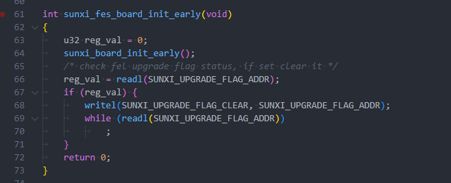

:::

:::

## 快速启动功能

V821 每次启动镜像加载成功后，启动介质ID、以及备份ID等均会被记录到寄存器 `0x4a000258` 中。在 `poweroff` 唤醒、`rtc_wdg` 复位场景下，通过该寄存器获取到启动介质信息，直接访问、启动，达到快起目的。该流程亦成为“热启动”。

但是当需要带电池卡升级时，这个功能会导致无法正常卡升级，此时需要清除这个寄存器的数据再重启系统。

在 BOOT0，UBOOT，RTOS 中可以这样配置：

```c
writel(0x0, 0x4a000258);
```

在 Linux 中可以通过 `sunxi_dump` 配置

```bash
echo 0x4a000258 0x0 > /sys/class/sunxi_dump/write
```

## 异常掉电保护

**V821芯片内置异常掉电保护功能**，且默认启用。该功能包括VCC\_DET和VSYS\_DET，用于低压保护，主要应用场景如下：

1.  **加快上电**：电源正常时，可根据实际电压情况判断是否成功上电。
2.  **异常处理（初次上电）**：在初次上电时，默认启用 VSYS\_DET 功能。如果 VCC\_SYS 没有电源，系统将无法完成上电过程。
3.  **异常处理（掉电检测）**：当上电后突然拔掉电源，VCC\_DET 和 VSYS\_DET将检测到电压下降至特定阀值，并复位整个系统。

对于正常运行的产品，在突然断电的场景下，保护 **Flash** 数据尤为重要。由于断电后内部电压逐渐下降，当 Flash 工作电压接近 $2\text{V} \sim 2.7\text{V}$ 时，可能会产生不稳定状态，特别是在 SPI Flash 正在访问时，可能会导致数据异常。因此，在此场景下，需要通过 VSYS\_DET 和 VCC\_DET 对芯片进行复位，确保系统正常运行。

默认情况下，软件配置异常掉电保护如下：

-   VSYS\_DET 配置掉电阈值 600mV 复位系统
-   VCC15\_DET 默认未启用
-   VCC33\_DET 配置上电阈值3.1V，掉电阈值 2.9V 复位系统

### 配置异常掉电保护功能

:::danger

:::note

危险

:::
:::note

关闭异常掉电保护**仅在调试过程中排查问题使用**，量产产品使用会造成**数据损坏**等一系列问题，修改前请联系全志 FAE

:::

:::

配置异常掉电保护包括三个寄存器，包括配置 3V3 掉电阈值，和启用掉电检测功能。

-   默认上电时，默认会启用 VSYS\_DET 掉电检测复位功能，禁用 VCC33\_DET 掉电检测复位功能。
-   在 BOOT0 阶段，软件会配置该寄存器，启用 VSYS\_DET 掉电检测复位功能，和 VCC33\_DET 掉电检测复位功能。

brandy/brandy-2.0/spl/board/sun300iw1p1/board.c

```c
void rtc_set_vccio_det_spare(void)
{
	u32 val = 0;

	/* set detection threshold to 2.9V */
	val = readl(SUNXI_PMU_RTC_BASE + VCC33_DET_CTRL_REG);
	val &= ~(VCCIO_THRESHOLD_MASK << 8);
	val |= (VCCIO_THRESHOLD_VOLTAGE_2_9);  // <- 修改这个宏
	writel(val, SUNXI_PMU_RTC_BASE + VCC33_DET_CTRL_REG);

	/* enable vccio debonce */
	val = readl(SUNXI_PRCM_BASE + POR_RESET_CTRL_REG);
	val &= ~VCC33_DET_RSTN_ENABLE;
	writel(val, SUNXI_PRCM_BASE + POR_RESET_CTRL_REG);
}
```

修改 3V3 上电/掉电电压需要修改代码里的宏 `VCCIO_THRESHOLD_VOLTAGE_2_9` 配置如下：

```c
#define VCCIO_THRESHOLD_VOLTAGE_2_7	  (0 << 8) // 上电阈值2.9V，掉电阈值2.7V
#define VCCIO_THRESHOLD_VOLTAGE_2_6	  (1 << 8) // 上电阈值2.8V，掉电阈值2.6V
#define VCCIO_THRESHOLD_VOLTAGE_2_8	  (2 << 8) // 上电阈值3.0V，掉电阈值2.8V
#define VCCIO_THRESHOLD_VOLTAGE_2_9	  (3 << 8) // 上电阈值3.1V，掉电阈值2.9V
#define VCCIO_THRESHOLD_VOLTAGE_3_0	  (4 << 8) // 上电阈值3.2V，掉电阈值3.0V
#define VCCIO_THRESHOLD_VOLTAGE_3_1	  (5 << 8) // 上电阈值3.3V，掉电阈值3.1V
#define VCCIO_THRESHOLD_VOLTAGE_3_2	  (6 << 8) // 上电阈值3.4V，掉电阈值3.2V
#define VCCIO_THRESHOLD_VOLTAGE_3_3	  (7 << 8) // 上电阈值3.5V，掉电阈值3.3V
```

如果需要关闭这个功能，如下修改

brandy/brandy-2.0/spl/board/sun300iw1p1/board.c

```c
void rtc_set_vccio_det_spare(void)
{
	u32 val = 0;

	/* set detection threshold to 2.9V */
	val = readl(SUNXI_PMU_RTC_BASE + VCC33_DET_CTRL_REG);
	val &= ~(VCCIO_THRESHOLD_MASK << 8);
	val |= (VCCIO_THRESHOLD_VOLTAGE_2_9);
	writel(val, SUNXI_PMU_RTC_BASE + VCC33_DET_CTRL_REG);

	/* disable vcc33 debonce */
	val = readl(SUNXI_PRCM_BASE + POR_RESET_CTRL_REG);
	val |= VCC33_DET_RSTN_ENABLE;
	writel(val, SUNXI_PRCM_BASE + POR_RESET_CTRL_REG);
}
```

如果需要关闭 VSYS\_DET 掉电复位功能，增加如下代码关闭功能

brandy/brandy-2.0/spl/board/sun300iw1p1/board.c

```c
void rtc_set_vccio_det_spare(void)
{
	u32 val = 0;

	/* set detection threshold to 2.9V */
	val = readl(SUNXI_PMU_RTC_BASE + VCC33_DET_CTRL_REG);
	val &= ~(VCCIO_THRESHOLD_MASK << 8);
	val |= (VCCIO_THRESHOLD_VOLTAGE_2_9);
	writel(val, SUNXI_PMU_RTC_BASE + VCC33_DET_CTRL_REG);

	/* disable vcc33 debonce */
	val = readl(SUNXI_PRCM_BASE + POR_RESET_CTRL_REG);
	val |= VCC33_DET_RSTN_ENABLE;
	writel(val, SUNXI_PRCM_BASE + POR_RESET_CTRL_REG);
    
	/* 关闭 VSYS_DET 掉电复位功能 */
	val = readl(SUNXI_PRCM_BASE + POR_RESET_CTRL_REG);
	val |= (1 << 0);
	writel(val, SUNXI_PRCM_BASE + POR_RESET_CTRL_REG);
}
```

### 寄存器配置说明

-   VSYS\_DET 掉电/上电检测阈值：`0x4a000860`
    -   这个寄存器软件默认没有配置，使用默认值 `600mV` 掉电阈值

| 寄存器位 | 上电默认值 | 软件配置值 | 功能 |
| --- | --- | --- | --- |
| 31:11 | \\ | \\ | \\ |
| 10:9 | 0x1 | 软件未修改 | VSYS 掉电检测阈值电压选择  
00: 550mV掉电阈值  
01: 600mV掉电阈值  
10: 650mV掉电阈值  
11: 700mV掉电阈值 |
| 8:0 | \\ | \\ | \\ |

-   VCC\_DET 掉电/上电检测阈值：`0x4a000864`

| 寄存器位 | 上电默认值 | 软件配置值 | 功能 |
| --- | --- | --- | --- |
| 31:27 | \\ | \\ | \\ |
| 26:24 | 0x0 | 软件未修改 | VCC15 掉电检测电压配置  
000: 上电阈值1.4V，掉电阈值1.3V  
001: 上电阈值1.3V，掉电阈值1.2V  
010: 上电阈值1.5V，掉电阈值1.4V  
011: 上电阈值1.6V，掉电阈值1.5V  
100: 上电阈值1.7V，掉电阈值1.6V  
101: 上电阈值1.8V，掉电阈值1.7V  
110: 上电阈值1.8V，掉电阈值1.7V  
111: 上电阈值1.8V，掉电阈值1.7V |
| 23:17 | \\ | \\ | \\ |
| 16 | 0x0 | 软件未修改 | VCC15 掉电检测功能配置  
0: 禁用 VCC15 掉电检测功能  
1: 启用 VCC15 掉电检测功能 |
| 15:11 | \\ | \\ | \\ |
| 10:8 | 0x0 | 0x3 | VCC33 掉电检测电压配置  
000: 上电阈值2.9V，掉电阈值2.7V  
001: 上电阈值2.8V，掉电阈值2.6V  
010: 上电阈值3.0V，掉电阈值2.8V  
011: 上电阈值3.1V，掉电阈值2.9V  
100: 上电阈值3.2V，掉电阈值3.0V  
101: 上电阈值3.3V，掉电阈值3.1V  
110: 上电阈值3.4V，掉电阈值3.2V  
111: 上电阈值3.5V，掉电阈值3.3V |
| 7:0 | \\ | \\ | \\ |

-   掉电检测复位功能寄存器：`0x4a000024`

| 寄存器位 | 上电默认值 | 软件配置值 | 功能 |
| --- | --- | --- | --- |
| 31:5 | \\ | \\ | \\ |
| 4 | 0x1 | 0x0 | VCC33\_DET 掉电检测触发时是否 RESET 系统  
1: 不 RESET 系统  
0: RESET 系统 |
| 3:1 | \\ | \\ | \\ |
| 0 | 0x0 | 0x0 | VSYS\_DET 掉电检测触发时是否 RESET 系统  
1: 不 RESET 系统  
0: RESET 系统 |
