# SPI NOR - NOR 存储器件

本文将讲述 SoC 搭配 SPI NOR 作为存储设备使用的相关配置，新物料支持等说明。SoC SPIF 控制器功能如下：

SPI Flash 控制器（SPiF）是一个同步的串行通信接口，允许以更少的软件中断进行快速的数据通信。与 SPI 不同，SPiF 通常设计用于更高速的 Flash 设备，并且仅在 Master 模式下工作。

-   支持多种 SPI 模式
    -   标准 SPI
    -   双输出/双输入 SPI 和双 I/O SPI
    -   四输出/四输入 SPI、Quad I/O 和 QPI
-   可编程串行数据帧长度
    -   1 位到 32 位
-   支持单速率传输（STR）模式和双速率传输（DTR）模式
-   高速时钟频率
    -   150 MHz（STR 模式）
    -   100 MHz（DTR 模式）
-   软件写保护
    -   通过软件实现对全部或部分存储区的写保护
    -   顶部/底部块保护
-   可编程事务间延迟
-   支持模式 0 模式 1 模式 2 和模式 3
-   支持控制信号配置
    -   一个片选信号支持多个外设
    -   芯片选择（SPIF\_CS）和 SPI 时钟（SPIF\_CLK）的极性和相位可配置

## SPI NOR 新物料适配

### 未适配 SPI NOR 物料的报错

U-Boot 未支持物料导致烧录失败：

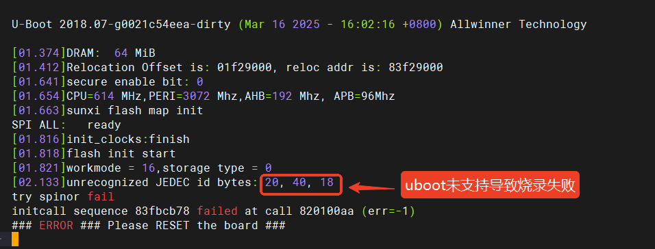

Kernel 未支持物料导致启动失败：

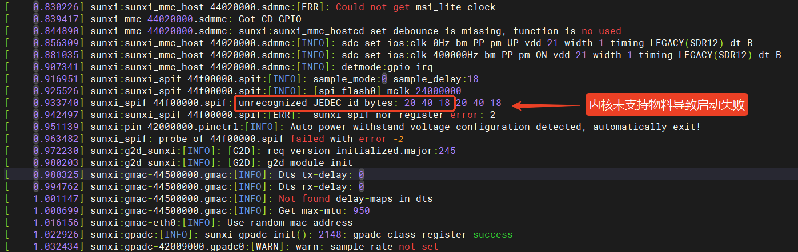

### 了解新物料的特性

在拿到一款 SPI NOR 物料时，需要仔细阅读其手册。下图是 `PY25Q256HB` 物料的介绍页，可以看出支持 SPI，Dual SPI，QPI，DTR 模式，支持 4K 擦写。

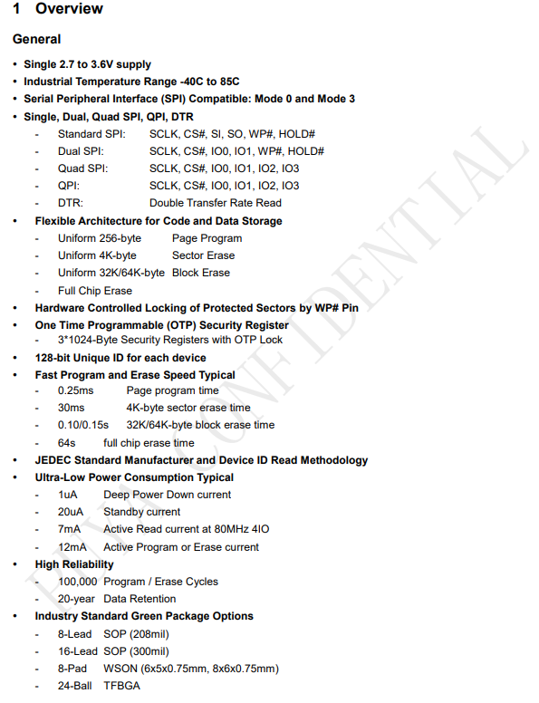

换一个物料 `BY25Q128ES`，手册中没有提到 DTR，这款物料不支持 DTR 模式。

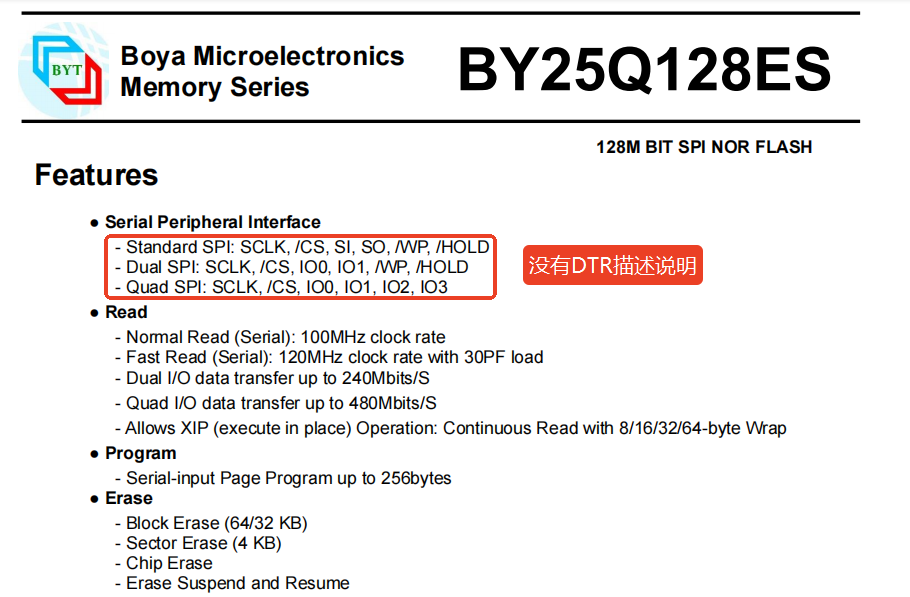

在文档后面电器参数章节，可以找到其运行的最高主频，在之后配置中需要小于这里的最高频率，切勿超频运行。

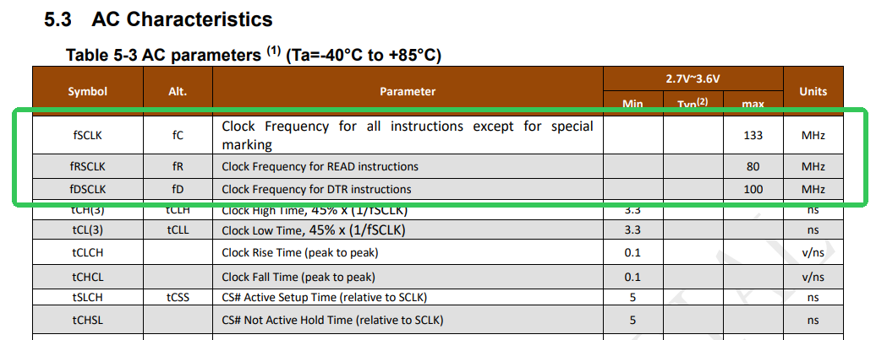

部分 NOR 手册中还会标明其不同模式下支持的速率，可以作为参考

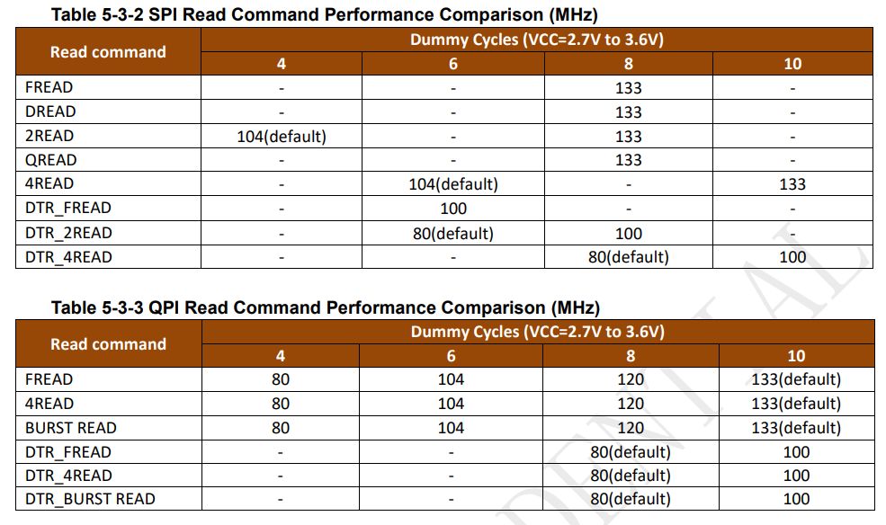

-   在 DTR 模式下默认 80M，读指令10可以支持100M

一般在文档末尾可以找到 SPI NOR 物料的器件 ID，适配新物料时需要重点关注。

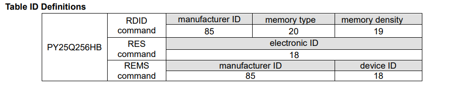

-   ID 是 `0x852019`

还可以找到 NOR 物料的内存布局

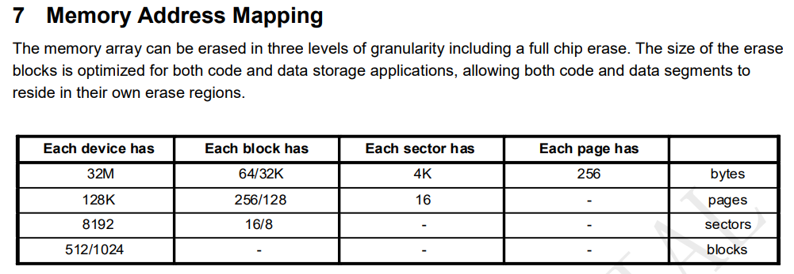

-   每个存储设备有 32MByte 空间
-   每个块（扇区）有 64K（或者32K）
-   总共有512（或1024）个块（扇区）

一般使用 64K 模式，则 NOR 物料为 64K \* 512 = 32MByte

### 适配 U-Boot 驱动

添加新物料，U-Boot 需要修改文件 `brandy/brandy-2.0/u-boot-2018/drivers/mtd/spi/spi-nor-ids.c`，U-Boot 使用一个列表存放支持的物料。我们只需要把新增的物料加入列表即可。

可以先找一下类型生产厂家的型号，例如这里找 PUYA 的型号，加上新物料 `py25q256hb`

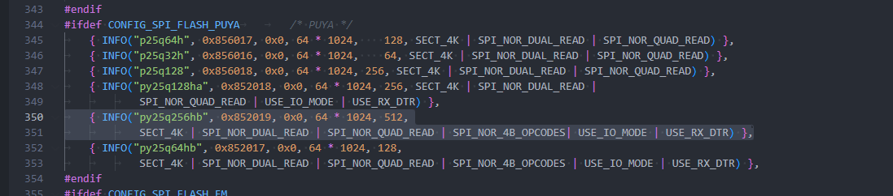

这里通过 `INFO` 宏定义了一个设备的信息，包括设备名称、ID、扇区大小、扇区数量、页面大小和一些设备特性。还有一个 `INFO6` 宏，如果芯片的 EXT\_ID 较多可以使用这个宏。

**1\. 宏定义部分**

```c
#define INFO(_name, _jedec_id, _ext_id, _sector_size, _n_sectors, _flags) \
        INFO_NAME(_name) \
        .id = { \
            ((_jedec_id) >> 16) & 0xff, \
            ((_jedec_id) >> 8) & 0xff, \
            (_jedec_id) & 0xff, \
            ((_ext_id) >> 8) & 0xff, \
            (_ext_id) & 0xff, \
        }, \
        .id_len = (!(_jedec_id) ? 0 : (3 + ((_ext_id) ? 2 : 0))), \
        .sector_size = (_sector_size), \
        .n_sectors = (_n_sectors), \
        .page_size = 256, \
        .flags = (_flags),
```

-   **INFO宏**：这个宏用于定义设备的一些基本信息。它接受六个参数：
    -   `_name`：设备名称。
    -   `_jedec_id`：设备的JEDEC ID。
    -   `_ext_id`：扩展ID。
    -   `_sector_size`：扇区大小。
    -   `_n_sectors`：扇区数量。
    -   `_flags`：标志，通常是 SPI NOR 的一些附加的配置或特性。

**2\. 宏中的内容**

-   **INFO\_NAME(\_name)**：宏调用 `INFO_NAME`，传递设备的名称 `_name`。
-   **.id**：这部分将 `_jedec_id` 和 `_ext_id` 以特定的方式拆分为字节数组。具体拆分方法：
    -   将 `_jedec_id` 右移16位、8位、0位，分别取出低8位，组成前三个字节。
    -   将 `_ext_id` 右移8位、0位，分别取出低8位，组成后两个字节。 结果是将 `jedec_id` 和 `ext_id` 组合成一个5字节的 ID，通常是一个设备标识符。
-   **.id\_len**：根据 `jedec_id` 和 `ext_id` 是否为0来计算 ID 的长度。具体来说：
    -   如果 `jedec_id` 为0，表示没有有效的 ID，ID 长度为0。
    -   否则，ID 长度是3（固定的前3个字节），如果 `ext_id` 非零，则再加2个字节。
-   **.sector\_size**：设置扇区的大小为 `_sector_size`。
-   **.n\_sectors**：设置设备的扇区数量为 `_n_sectors`。
-   **.page\_size**：设置页面大小为256字节，这个值是固定的。
-   **.flags**：设置设备的一些标志（如双读、四读、4字节操作码、使用IO模式等）。

**3\. 使用这个宏的实例**

```c
{ INFO("py25q256hb", 0x852019, 0x0, 64 * 1024, 512, SECT_4K | SPI_NOR_DUAL_READ | SPI_NOR_QUAD_READ | SPI_NOR_4B_OPCODES | USE_IO_MODE | USE_RX_DTR) }
```

-   **"py25q256hb"**：设备的名称。
-   **0x852019**：设备的JEDEC ID。
-   **0x0**：扩展ID，这里是0，表示没有扩展ID。
-   **64 \* 1024**：扇区大小为64KB。
-   **512**：扇区数量为512个。
-   **SECT\_4K | SPI\_NOR\_DUAL\_READ | SPI\_NOR\_QUAD\_READ | SPI\_NOR\_4B\_OPCODES | USE\_IO\_MODE | USE\_RX\_DTR**：这些是设备的特性标志。每个标志位的作用如下：
    -   `SECT_4K`：表示扇区大小是4KB。
    -   `SPI_NOR_DUAL_READ`：支持SPI NOR的双读模式。
    -   `SPI_NOR_QUAD_READ`：支持SPI NOR的四读模式。
    -   `SPI_NOR_4B_OPCODES`：支持4字节操作码，**大于128Mib（16MByte）的设备需要配置**。
    -   `USE_IO_MODE`：使用IO模式。
    -   `USE_RX_DTR`：使用接收数据传输模式。

完整的标志位及其含义如下表所示：

| **标志位** | **位掩码** | **描述** |
| --- | --- | --- |
| **SECT\_4K** | `BIT(0)` | 支持4KB的扇区。 |
| **SPI\_NOR\_NO\_ERASE** | `BIT(1)` | 不需要擦除命令。 |
| **SST\_WRITE** | `BIT(2)` | 使用SST字节编程模式。 |
| **SPI\_NOR\_NO\_FR** | `BIT(3)` | 不支持快速读取模式。 |
| **SECT\_4K\_PMC** | `BIT(4)` | 支持4KB扇区PMC操作。 |
| **SPI\_NOR\_DUAL\_READ** | `BIT(5)` | 支持双读模式（Dual Read）。 |
| **SPI\_NOR\_QUAD\_READ** | `BIT(6)` | 支持四读模式（Quad Read）。 |
| **USE\_FSR** | `BIT(7)` | 使用标志状态寄存器（Flag Status Register）。 |
| **SPI\_NOR\_HAS\_LOCK** | `BIT(8)` | 支持通过状态寄存器（SR）进行锁定/解锁操作。 |
| **SPI\_NOR\_HAS\_TB** | `BIT(9)` | 状态寄存器（SR）支持顶部/底部保护（Top/Bottom Protect）。必须与 `SPI_NOR_HAS_LOCK` 一起使用。 |
| **SPI\_S3AN** | `BIT(10)` | 支持Xilinx Spartan 3AN系列的系统闪存。该闪存的制造商ID与Atmel闪存相同，因此无法通过制造商ID进行区分。 |
| **SPI\_NOR\_4B\_OPCODES** | `BIT(11)` | 使用专用的4字节地址操作码，支持128Mib以上的内存大小。 |
| **NO\_CHIP\_ERASE** | `BIT(12)` | 不支持芯片擦除。 |
| **SPI\_NOR\_SKIP\_SFDP** | `BIT(13)` | 跳过解析SFDP表格。 |
| **USE\_CLSR** | `BIT(14)` | 使用CLSR命令（Clear Status Register）。 |
| **SPI\_NOR\_INDIVIDUAL\_LOCK** | `BIT(16)` | 支持单独的块/扇区锁定模式。 |
| **SPI\_NOR\_HAS\_LOCK\_HANDLE** | `BIT(17)` | 锁定操作支持有锁定句柄。 |
| **SPI\_NOR\_OCTAL\_READ** | `BIT(18)` | 支持八通道读取模式（Octal Read）。 |
| **USE\_IO\_MODE** | `BIT(19)` | 支持地址和数据线宽度可变的IO模式。 |
| **USE\_RX\_DTR** | `BIT(20)` | 支持接收数据传输模式（RX DTR）。 |
| **USE\_TX\_DTR** | `BIT(21)` | 支持发送数据传输模式（TX DTR）。 |
| **USE\_DQS** | `BIT(22)` | 支持DQS模式。 |
| **OCTAL\_SPINOR** | `BIT(23)` | 支持八通道SPI NOR模式。 |
| **SPI\_NOR\_STACK\_DIE** | `BIT(24)` | 支持使用多芯片堆叠（multi-die）操作。 |

### 适配 Kernel 驱动

添加新物料，Kernel 需要修改文件 `bsp/drivers/mtd/spi-nor-5.4/spi-nor.c`，Kernel 使用一个列表存放支持的物料。我们只需要把新增的物料加入列表即可。

可以先找一下类型生产厂家的型号，例如这里找 PUYA 的型号，加上新物料 `py25q256hb`

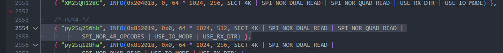

这里通过 `INFO` 宏定义了一个设备的信息，包括设备名称、ID、扇区大小、扇区数量、页面大小和一些设备特性。还有一个 `INFO6` 宏，如果芯片的 EXT\_ID 较多可以使用这个宏。

```c
#define INFO(_jedec_id, _ext_id, _sector_size, _n_sectors, _flags)	\
		.id = {							\
			((_jedec_id) >> 16) & 0xff,			\
			((_jedec_id) >> 8) & 0xff,			\
			(_jedec_id) & 0xff,				\
			((_ext_id) >> 8) & 0xff,			\
			(_ext_id) & 0xff,				\
			},						\
		.id_len = (!(_jedec_id) ? 0 : (3 + ((_ext_id) ? 2 : 0))),	\
		.sector_size = (_sector_size),				\
		.n_sectors = (_n_sectors),				\
		.page_size = 256,					\
		.flags = (_flags),
```

-   **INFO宏**：这个宏用于定义设备的一些基本信息。它接受五个参数：
    -   `_jedec_id`：设备的JEDEC ID。
    -   `_ext_id`：扩展ID。
    -   `_sector_size`：扇区大小。
    -   `_n_sectors`：扇区数量。
    -   `_flags`：标志，通常是 SPI NOR 的一些附加的配置或特性。

**2\. 宏中的内容**

-   **.id**：这部分将 `_jedec_id` 和 `_ext_id` 以特定的方式拆分为字节数组。具体拆分方法：
    -   将 `_jedec_id` 右移16位、8位、0位，分别取出低8位，组成前三个字节。
    -   将 `_ext_id` 右移8位、0位，分别取出低8位，组成后两个字节。 结果是将 `jedec_id` 和 `ext_id` 组合成一个5字节的 ID，通常是一个设备标识符。
-   **.id\_len**：根据 `jedec_id` 和 `ext_id` 是否为0来计算 ID 的长度。具体来说：
    -   如果 `jedec_id` 为0，表示没有有效的 ID，ID 长度为0。
    -   否则，ID 长度是3（固定的前3个字节），如果 `ext_id` 非零，则再加2个字节。
-   **.sector\_size**：设置扇区的大小为 `_sector_size`。
-   **.n\_sectors**：设置设备的扇区数量为 `_n_sectors`。
-   **.page\_size**：设置页面大小为256字节，这个值是固定的。
-   **.flags**：设置设备的一些标志（如双读、四读、4字节操作码、使用IO模式等）。

**3\. 使用这个宏的实例**

```c
INFO(0x852019, 0x0, 64 * 1024, 512, SECT_4K | SPI_NOR_DUAL_READ | SPI_NOR_QUAD_READ | SPI_NOR_4B_OPCODES | USE_IO_MODE | USE_RX_DTR)
```

-   **0x852019**：设备的JEDEC ID。
-   **0x0**：扩展ID，这里是0，表示没有扩展ID。
-   **64 \* 1024**：扇区大小为64KB。
-   **512**：扇区数量为512个。
-   **SECT\_4K | SPI\_NOR\_DUAL\_READ | SPI\_NOR\_QUAD\_READ | SPI\_NOR\_4B\_OPCODES | USE\_IO\_MODE | USE\_RX\_DTR**：这些是设备的特性标志。每个标志位的作用如下：
    -   `SECT_4K`：表示扇区大小是4KB。
    -   `SPI_NOR_DUAL_READ`：支持SPI NOR的双读模式。
    -   `SPI_NOR_QUAD_READ`：支持SPI NOR的四读模式。
    -   `SPI_NOR_4B_OPCODES`：支持4字节操作码，**大于128Mib（16MByte）的设备需要配置**。
    -   `USE_IO_MODE`：使用IO模式。
    -   `USE_RX_DTR`：使用接收数据传输模式。

完整的标志位及其含义如下表所示：

| **标志位** | **位掩码** | **描述** |
| --- | --- | --- |
| **SECT\_4K** | `BIT(0)` | 支持4KB的扇区。 |
| **SPI\_NOR\_NO\_ERASE** | `BIT(1)` | 不需要擦除命令。 |
| **SST\_WRITE** | `BIT(2)` | 使用SST字节编程模式。 |
| **SPI\_NOR\_NO\_FR** | `BIT(3)` | 不支持快速读取模式。 |
| **SECT\_4K\_PMC** | `BIT(4)` | 支持4KB扇区PMC操作。 |
| **SPI\_NOR\_DUAL\_READ** | `BIT(5)` | 支持双读模式（Dual Read）。 |
| **SPI\_NOR\_QUAD\_READ** | `BIT(6)` | 支持四读模式（Quad Read）。 |
| **USE\_FSR** | `BIT(7)` | 使用标志状态寄存器（Flag Status Register）。 |
| **SPI\_NOR\_HAS\_LOCK** | `BIT(8)` | 支持通过状态寄存器（SR）进行锁定/解锁操作。 |
| **SPI\_NOR\_HAS\_TB** | `BIT(9)` | 状态寄存器（SR）支持顶部/底部保护（Top/Bottom Protect）。必须与 `SPI_NOR_HAS_LOCK` 一起使用。 |
| **SPI\_S3AN** | `BIT(10)` | 支持Xilinx Spartan 3AN系列的系统闪存。该闪存的制造商ID与Atmel闪存相同，因此无法通过制造商ID进行区分。 |
| **SPI\_NOR\_4B\_OPCODES** | `BIT(11)` | 使用专用的4字节地址操作码，支持128Mib以上的内存大小。 |
| **NO\_CHIP\_ERASE** | `BIT(12)` | 不支持芯片擦除。 |
| **SPI\_NOR\_SKIP\_SFDP** | `BIT(13)` | 跳过解析SFDP表格。 |
| **USE\_CLSR** | `BIT(14)` | 使用CLSR命令（Clear Status Register）。 |
| **SPI\_NOR\_INDIVIDUAL\_LOCK** | `BIT(16)` | 支持单独的块/扇区锁定模式。 |
| **SPI\_NOR\_HAS\_LOCK\_HANDLE** | `BIT(17)` | 锁定操作支持有锁定句柄。 |
| **SPI\_NOR\_OCTAL\_READ** | `BIT(18)` | 支持八通道读取模式（Octal Read）。 |
| **USE\_IO\_MODE** | `BIT(19)` | 支持地址和数据线宽度可变的IO模式。 |
| **USE\_RX\_DTR** | `BIT(20)` | 支持接收数据传输模式（RX DTR）。 |
| **USE\_TX\_DTR** | `BIT(21)` | 支持发送数据传输模式（TX DTR）。 |
| **USE\_DQS** | `BIT(22)` | 支持DQS模式。 |
| **OCTAL\_SPINOR** | `BIT(23)` | 支持八通道SPI NOR模式。 |
| **SPI\_NOR\_STACK\_DIE** | `BIT(24)` | 支持使用多芯片堆叠（multi-die）操作。 |

## SPI NOR 设备树配置

配置 SPI NOR 一般在设备树中配置，包括 `uboot` 设备树和 `kernel` 设备树。

### U-Boot 设备树配置

**SPIF 引脚配置如下：**

```c
&pio {
	spif_pins_a: spif@0 {
		allwinner,pins = "PC8", "PC9", "PC11";
		allwinner,pname = "spif_mosi", "spif_clk", "spif_miso";
		allwinner,function = "spif";
		allwinner,muxsel = <2>;
		allwinner,drive = <3>;
		allwinner,pull = <0>;
	};

	spif_pins_b: spif@1 {
		allwinner,pins = "PC6", "PC7", "PC10";
		allwinner,pname = "spif_wp", "spif_hold", "spif_cs0";
		allwinner,function = "spif";
		allwinner,muxsel = <2>;
		allwinner,drive = <3>;
		allwinner,pull = <1>;   // only CS should be pulled up
	};

	spif_pins_c: spif@2 {
		allwinner,pins = "PC6", "PC7", "PC8", "PC9", "PC10", "PC11";
		allwinner,function = "gpio_in";
		allwinner,muxsel = <0xf>;
		allwinner,drive = <1>;
		allwinner,pull = <0>;
	};
};
```

该配置描述了为 SPI Flash（SPIF）接口所分配的 GPIO 引脚，并为每个引脚设置了特定的属性，如功能、驱动能力和上拉/下拉设置。

**配置详解**

1.  **spif\_pins\_a: spif@0**
    
    -   **功能**：该部分配置了 SPI 接口的主要信号引脚，包含 MOSI（主输出从输入）、SCK（时钟信号）和 MISO（主输入从输出）。
    -   **引脚**：
        -   `PC8`：MOSI（Master Out Slave In）
        -   `PC9`：SCK（Serial Clock）
        -   `PC11`：MISO（Master In Slave Out）
    -   **属性**：
        -   `allwinner,function = "spif"`：此配置将引脚功能设置为 SPI Flash。
        -   `allwinner,muxsel = <2>`：选择多路复用功能为 SPI Flash。
        -   `allwinner,drive = <3>`：设置驱动能力为最大值，确保信号强度足够。
        -   `allwinner,pull = <0>`：不启用任何上拉或下拉电阻。
2.  **spif\_pins\_b: spif@1**
    
    -   **功能**：该部分配置了 SPI Flash 的其他控制引脚，包含写保护（WP）、挂起（Hold）和片选（CS0）。
    -   **引脚**：
        -   `PC6`：WP（Write Protect，写保护）
        -   `PC7`：Hold（挂起）
        -   `PC10`：CS0（Chip Select 0，片选信号）
    -   **属性**：
        -   `allwinner,function = "spif"`：此配置将引脚功能设置为 SPI Flash。
        -   `allwinner,muxsel = <2>`：选择多路复用功能为 SPI Flash。
        -   `allwinner,drive = <3>`：设置驱动能力为最大值。
        -   `allwinner,pull = <1>`：启用片选引脚（CS0）的上拉电阻，以确保在没有有效片选信号时该引脚保持高电平。
3.  **spif\_pins\_c: spif@2**
    
    -   **功能**：此部分配置了 SPI Flash 引脚的备用功能，将这些引脚配置为 GPIO 输入模式。
    -   **引脚**：
        -   `PC6`、`PC7`、`PC8`、`PC9`、`PC10`、`PC11`
    -   **属性**：
        -   `allwinner,function = "gpio_in"`：将这些引脚的功能设置为普通 GPIO 输入。
        -   `allwinner,muxsel = <0xf>`：选择 GPIO 输入模式。
        -   `allwinner,drive = <1>`：设置低驱动能力，适用于 GPIO 输入模式。
        -   `allwinner,pull = <0>`：不启用上拉或下拉电阻。

**说明**

-   **allwinner,pins**：指定每个组的引脚标识符。
-   **allwinner,pname**：每个引脚的功能名称。
-   **allwinner,function**：配置引脚的具体功能，这里设置为 `"spif"` 表示 SPI Flash。
-   **allwinner,muxsel**：选择引脚的多路复用功能。
-   **allwinner,drive**：设置引脚的驱动能力。`<3>` 表示最大驱动能力，适用于 SPI 信号线。
-   **allwinner,pull**：配置引脚的上下拉电阻。`<0>` 表示不使用上下拉电阻，`<1>` 表示启用上拉电阻。

**SPIF 设备节点：**

```c
&spif {
	clock-frequency = <100000000>;
	pinctrl-0 = <&spif_pins_a &spif_pins_b>;
	pinctrl-1 = <&spif_pins_c>;
	pinctrl-names = "default", "sleep";
	/*spi-supply = <&reg_dcdc1>;*/
	status = "disabled";

	spif-nor {
		device_type = "spi_board0";
		compatible = "spi-nor";
		spif-max-frequency = <100000000>;
		m25p,fast-read = <1>;
		/*individual_lock;*/
		reg = <0x0>;
		spif-rx-bus-width=<0x04>;
		spif-tx-bus-width=<0x04>;
		dtr_mode_enabled=<1>;	/* choose double edge trigger mode */
		io_mode_enabled=<1>;	/* 1_x_x && x_x_x mode */
		status="disabled";
	};
};
```

该设备节点配置了 SPI Flash 设备（SPIF），定义了其工作时的引脚设置、时钟频率、数据传输模式以及总线宽度等参数。默认状态为禁用，需要显式启用。通过设置如 `fast-read`、双边缘触发模式和 4 位数据总线宽度等，设备支持高效的数据传输。配置中的 `pinctrl` 定义了不同的引脚控制模式，用于设备的正常工作与睡眠状态下的引脚管理。

**配置详解**

```c
&spif {
	clock-frequency = <100000000>;
	pinctrl-0 = <&spif_pins_a &spif_pins_b>;
	pinctrl-1 = <&spif_pins_c>;
	pinctrl-names = "default", "sleep";
	/*spi-supply = <&reg_dcdc1>;*/
	status = "disabled";
```

1.  **clock-frequency = `<100000000>`**
    
    -   设置 SPI Flash 时钟频率为 100 MHz。该频率决定了 SPI 数据传输的速度。
2.  **pinctrl-0 = `<&spif_pins_a &spif_pins_b>`**
    
    -   配置了 SPI 引脚组 `spif_pins_a` 和 `spif_pins_b`，用于设备的默认运行模式。
3.  **pinctrl-1 = `<&spif_pins_c>`**
    
    -   配置 `spif_pins_c` 引脚组作为 SPI 的“睡眠”模式下的引脚配置。
4.  **pinctrl-names = "default", "sleep"**
    
    -   引脚控制名称，定义了两种模式：`default` 表示默认引脚配置，`sleep` 表示在设备进入睡眠模式时的引脚配置。
5.  **status = "disabled"**
    
    -   配置该 SPI Flash 设备为初始禁用状态，一般会自动根据 BOOT0 识别到的存储设备启用，这里不需要设置。

```c
	spif-nor {
		device_type = "spi_board0";
		compatible = "spi-nor";
		spif-max-frequency = <100000000>;
		m25p,fast-read = <1>;
		/*individual_lock;*/
		reg = <0x0>;
		spif-rx-bus-width=<0x04>;
		spif-tx-bus-width=<0x04>;
		dtr_mode_enabled=<1>;	/* choose double edge trigger mode */
		io_mode_enabled=<1>;	/* 1_x_x && x_x_x mode */
		status="disabled";
	};
```

6.  **spif-nor**
    
    -   这是 SPI Flash NOR 类型的设备节点，用于描述特定于 SPI Flash NOR 存储器的配置。
7.  **device\_type = "spi\_board0"**
    
    -   设定设备的类型为 `spi_board0`，用于标识 SPI 总线上的设备。
8.  **compatible = "spi-nor"**
    
    -   该设备兼容 SPI NOR 存储器，标明设备与 NOR 型 SPI Flash 兼容。
9.  **spif-max-frequency = `<100000000>`**
    
    -   设置该 SPI Flash 设备的最大传输频率为 100 MHz。
10.  **m25p,fast-read = `<1>`**
     
     -   启用 `fast-read` 模式，该模式提升了 SPI Flash 数据读取的速度。
11.  **reg = `<0x0>`**
     
     -   表示设备的 SPI 总线地址或寄存器地址，`0x0` 可能代表该设备的起始地址。
12.  **spif-rx-bus-width = `<0x04>`**
     
     -   配置接收总线宽度为 4 位（Quad SPI）。这表示数据传输时采用 4 位并行模式，提高数据传输速率。
13.  **spif-tx-bus-width = `<0x04>`**
     
     -   配置发送总线宽度为 4 位。类似于接收宽度，该设置确保发送数据采用 4 位并行模式。
14.  **dtr\_mode\_enabled = `<1>`**
     
     -   启用双边缘触发模式（Double-Edge Trigger Mode）增加传输性能（需要物料支持）。
15.  **io\_mode\_enabled = `<1>`**
     
     -   启用 I/O 模式，允许 SPI 总线以支持 1\_x\_x 和 x\_x\_x 模式的形式进行数据传输。
16.  **status = "disabled"**
     
     -   配置该 SPI Flash 设备为初始禁用状态，一般会自动根据 BOOT0 识别到的存储设备启用，这里不需要设置。

#### 配置示例

-   单线模式
-   双线模式
-   四线模式
-   单线模式 + DTR
-   双线模式 + DTR
-   四线模式 + DTR

单线模式一般用于调试使用，用于排除硬件走线问题。

```c
&pio {
	spif_pins_a: spif@0 {
		allwinner,pins = "PC8", "PC9", "PC11";
		allwinner,pname = "spif_mosi", "spif_clk", "spif_miso";
		allwinner,function = "spif";
		allwinner,muxsel = <2>;
		allwinner,drive = <3>;
		allwinner,pull = <0>;
	};

	spif_pins_b: spif@1 {
		allwinner,pins = "PC10";
		allwinner,pname = "spif_cs0";
		allwinner,function = "spif";
		allwinner,muxsel = <2>;
		allwinner,drive = <3>;
		allwinner,pull = <1>;   // only CS should be pulled up
	};

	spif_pins_c: spif@2 {
		allwinner,pins = "PC8", "PC9", "PC10", "PC11";
		allwinner,function = "gpio_in";
		allwinner,muxsel = <0xf>;
		allwinner,drive = <1>;
		allwinner,pull = <0>;
	};
};

&spif {
	clock-frequency = <100000000>;
	pinctrl-0 = <&spif_pins_a &spif_pins_b>;
	pinctrl-1 = <&spif_pins_c>;
	pinctrl-names = "default", "sleep";
	status = "disabled";

	spif-nor {
		device_type = "spi_board0";
		compatible = "spi-nor";
		spif-max-frequency = <100000000>;
		m25p,fast-read = <1>;
		reg = <0x0>;
		spif-rx-bus-width=<0x01>;
		spif-tx-bus-width=<0x01>;
		status="disabled";
	};
};
```

双线模式一般用于省 IO，会降低读写速度。

```c
&pio {
	spif_pins_a: spif@0 {
		allwinner,pins = "PC8", "PC9", "PC11";
		allwinner,pname = "spif_mosi", "spif_clk", "spif_miso";
		allwinner,function = "spif";
		allwinner,muxsel = <2>;
		allwinner,drive = <3>;
		allwinner,pull = <0>;
	};

	spif_pins_b: spif@1 {
		allwinner,pins = "PC10";
		allwinner,pname = "spif_cs0";
		allwinner,function = "spif";
		allwinner,muxsel = <2>;
		allwinner,drive = <3>;
		allwinner,pull = <1>;   // only CS should be pulled up
	};

	spif_pins_c: spif@2 {
		allwinner,pins = "PC8", "PC9", "PC10", "PC11";
		allwinner,function = "gpio_in";
		allwinner,muxsel = <0xf>;
		allwinner,drive = <1>;
		allwinner,pull = <0>;
	};
};

&spif {
	clock-frequency = <100000000>;
	pinctrl-0 = <&spif_pins_a &spif_pins_b>;
	pinctrl-1 = <&spif_pins_c>;
	pinctrl-names = "default", "sleep";
	status = "disabled";

	spif-nor {
		device_type = "spi_board0";
		compatible = "spi-nor";
		spif-max-frequency = <100000000>;
		m25p,fast-read = <1>;
		reg = <0x0>;
		spif-rx-bus-width=<0x02>;
		spif-tx-bus-width=<0x01>;
		status="disabled";
	};
};
```

```c
&pio {
	spif_pins_a: spif@0 {
		allwinner,pins = "PC8", "PC9", "PC11";
		allwinner,pname = "spif_mosi", "spif_clk", "spif_miso";
		allwinner,function = "spif";
		allwinner,muxsel = <2>;
		allwinner,drive = <3>;
		allwinner,pull = <0>;
	};

	spif_pins_b: spif@1 {
		allwinner,pins = "PC6", "PC7", "PC10";
		allwinner,pname = "spif_wp", "spif_hold", "spif_cs0";
		allwinner,function = "spif";
		allwinner,muxsel = <2>;
		allwinner,drive = <3>;
		allwinner,pull = <1>;   // only CS should be pulled up
	};

	spif_pins_c: spif@2 {
		allwinner,pins = "PC6", "PC7", "PC8", "PC9", "PC10", "PC11";
		allwinner,function = "gpio_in";
		allwinner,muxsel = <0xf>;
		allwinner,drive = <1>;
		allwinner,pull = <0>;
	};
};

&spif {
	clock-frequency = <100000000>;
	pinctrl-0 = <&spif_pins_a &spif_pins_b>;
	pinctrl-1 = <&spif_pins_c>;
	pinctrl-names = "default", "sleep";
	status = "disabled";

	spif-nor {
		device_type = "spi_board0";
		compatible = "spi-nor";
		spif-max-frequency = <100000000>;
		m25p,fast-read = <1>;
		reg = <0x0>;
		spif-rx-bus-width=<0x04>;
		spif-tx-bus-width=<0x04>;
		status="disabled";
	};
};
```

```c
&pio {
	spif_pins_a: spif@0 {
		allwinner,pins = "PC8", "PC9", "PC11";
		allwinner,pname = "spif_mosi", "spif_clk", "spif_miso";
		allwinner,function = "spif";
		allwinner,muxsel = <2>;
		allwinner,drive = <3>;
		allwinner,pull = <0>;
	};

	spif_pins_b: spif@1 {
		allwinner,pins = "PC10";
		allwinner,pname = "spif_cs0";
		allwinner,function = "spif";
		allwinner,muxsel = <2>;
		allwinner,drive = <3>;
		allwinner,pull = <1>;   // only CS should be pulled up
	};

	spif_pins_c: spif@2 {
		allwinner,pins = "PC8", "PC9", "PC10", "PC11";
		allwinner,function = "gpio_in";
		allwinner,muxsel = <0xf>;
		allwinner,drive = <1>;
		allwinner,pull = <0>;
	};
};

&spif {
	clock-frequency = <100000000>;
	pinctrl-0 = <&spif_pins_a &spif_pins_b>;
	pinctrl-1 = <&spif_pins_c>;
	pinctrl-names = "default", "sleep";
	status = "disabled";

	spif-nor {
		device_type = "spi_board0";
		compatible = "spi-nor";
		spif-max-frequency = <100000000>;
		m25p,fast-read = <1>;
		reg = <0x0>;
		spif-rx-bus-width=<0x01>;
		spif-tx-bus-width=<0x01>;
        dtr_mode_enabled=<1>;	/* choose double edge trigger mode */
		io_mode_enabled=<1>;	/* 1_x_x && x_x_x mode */
		status="disabled";
	};
};
```

```c
&pio {
	spif_pins_a: spif@0 {
		allwinner,pins = "PC8", "PC9", "PC11";
		allwinner,pname = "spif_mosi", "spif_clk", "spif_miso";
		allwinner,function = "spif";
		allwinner,muxsel = <2>;
		allwinner,drive = <3>;
		allwinner,pull = <0>;
	};

	spif_pins_b: spif@1 {
		allwinner,pins = "PC10";
		allwinner,pname = "spif_cs0";
		allwinner,function = "spif";
		allwinner,muxsel = <2>;
		allwinner,drive = <3>;
		allwinner,pull = <1>;   // only CS should be pulled up
	};

	spif_pins_c: spif@2 {
		allwinner,pins = "PC8", "PC9", "PC10", "PC11";
		allwinner,function = "gpio_in";
		allwinner,muxsel = <0xf>;
		allwinner,drive = <1>;
		allwinner,pull = <0>;
	};
};

&spif {
	clock-frequency = <100000000>;
	pinctrl-0 = <&spif_pins_a &spif_pins_b>;
	pinctrl-1 = <&spif_pins_c>;
	pinctrl-names = "default", "sleep";
	status = "disabled";

	spif-nor {
		device_type = "spi_board0";
		compatible = "spi-nor";
		spif-max-frequency = <100000000>;
		m25p,fast-read = <1>;
		reg = <0x0>;
		spif-rx-bus-width=<0x02>;
		spif-tx-bus-width=<0x01>;
        dtr_mode_enabled=<1>;	/* choose double edge trigger mode */
		io_mode_enabled=<1>;	/* 1_x_x && x_x_x mode */
		status="disabled";
	};
};
```

```c
&pio {
	spif_pins_a: spif@0 {
		allwinner,pins = "PC8", "PC9", "PC11";
		allwinner,pname = "spif_mosi", "spif_clk", "spif_miso";
		allwinner,function = "spif";
		allwinner,muxsel = <2>;
		allwinner,drive = <3>;
		allwinner,pull = <0>;
	};

	spif_pins_b: spif@1 {
		allwinner,pins = "PC6", "PC7", "PC10";
		allwinner,pname = "spif_wp", "spif_hold", "spif_cs0";
		allwinner,function = "spif";
		allwinner,muxsel = <2>;
		allwinner,drive = <3>;
		allwinner,pull = <1>;   // only CS should be pulled up
	};

	spif_pins_c: spif@2 {
		allwinner,pins = "PC6", "PC7", "PC8", "PC9", "PC10", "PC11";
		allwinner,function = "gpio_in";
		allwinner,muxsel = <0xf>;
		allwinner,drive = <1>;
		allwinner,pull = <0>;
	};
};

&spif {
	clock-frequency = <100000000>;
	pinctrl-0 = <&spif_pins_a &spif_pins_b>;
	pinctrl-1 = <&spif_pins_c>;
	pinctrl-names = "default", "sleep";
	status = "disabled";

	spif-nor {
		device_type = "spi_board0";
		compatible = "spi-nor";
		spif-max-frequency = <100000000>;
		m25p,fast-read = <1>;
		reg = <0x0>;
		spif-rx-bus-width=<0x04>;
		spif-tx-bus-width=<0x04>;
		dtr_mode_enabled=<1>;	/* choose double edge trigger mode */
		io_mode_enabled=<1>;	/* 1_x_x && x_x_x mode */
		status="disabled";
	};
};
```

### Kernel 设备树配置

```c
&spif0 {
	clock-frequency = <100000000>;
	pinctrl-0 = <&spif_pins_default &spif_pins_cs>;
	pinctrl-1 = <&spif_pins_sleep>;
	pinctrl-names = "default", "sleep";
	spif-rx-bus-width = <0x4>;
	spif-tx-bus-width = <0x4>;
	dtr_mode_enabled;				/* choose double edge trigger mode */
	io_mode_enabled;				/* 1_x_x && x_x_x mode */
	status = "okay";

	spif-nor  {
		device_type = "spi_board0";
		compatible = "spif-nor";
		spi-max-frequency = <0x5f5e100>;
		reg = <0x0>;
		status = "okay";
	};
};
```

该配置描述了一个 **SPI Flash (SPIF)** 控制器的设备节点设置。配置包括时钟频率、引脚控制、数据传输模式以及 SPI NOR 存储器的配置。该节点支持高频率的 SPI 通信，并启用了双边缘触发模式和 4 位总线宽度来提高数据传输速率。

```c
&spif0 {
	clock-frequency = <100000000>;
	pinctrl-0 = <&spif_pins_default &spif_pins_cs>;
	pinctrl-1 = <&spif_pins_sleep>;
	pinctrl-names = "default", "sleep";
	spif-rx-bus-width = <0x4>;
	spif-tx-bus-width = <0x4>;
	dtr_mode_enabled;				/* choose double edge trigger mode */
	io_mode_enabled;				/* 1_x_x && x_x_x mode */
	status = "okay";
```

1.  **clock-frequency = `<100000000>`**
    
    -   设置 SPI Flash 控制器的时钟频率为 100 MHz。时钟频率决定了数据传输的速度。
2.  **pinctrl-0 = `<&spif_pins_default &spif_pins_cs>`**
    
    -   设置引脚控制配置为 `spif_pins_default` 和 `spif_pins_cs`，这些配置定义了 SPI 控制器的正常运行引脚。
3.  **pinctrl-1 = `<&spif_pins_sleep>`**
    
    -   设置引脚控制配置为 `spif_pins_sleep`，该配置用于设备进入睡眠模式时的引脚设置。
4.  **pinctrl-names = "default", "sleep"**
    
    -   定义了两种引脚控制模式：`default` 表示正常工作模式，`sleep` 表示睡眠模式下的引脚配置。
5.  **spif-rx-bus-width = `<0x4>`**
    
    -   配置接收总线宽度为 4 位（Quad SPI）。这是为了提高数据传输速率，支持同时传输更多数据位。
6.  **spif-tx-bus-width = `<0x4>`**
    
    -   配置发送总线宽度为 4 位。确保发送数据时采用 4 位并行模式。
7.  **dtr\_mode\_enabled**
    
    -   启用双边缘触发模式（Double-Edge Trigger Mode）
8.  **io\_mode\_enabled**
    
    -   启用 I/O 模式，支持 1\_x\_x 和 x\_x\_x 模式
9.  **status = "okay"**
    
    -   设置设备的状态为“正常”（`okay`），表示该设备已启用。

```c
	spif-nor  {
		device_type = "spi_board0";
		compatible = "spif-nor";
		spi-max-frequency = <0x5f5e100>;
		reg = <0x0>;
		status = "okay";
	};
```

10.  **spif-nor**
     -   该节点配置了一个 SPI NOR 存储器（`spif-nor`）设备，适用于存储设备，如 Flash 存储器。
11.  **device\_type = "spi\_board0"**
     -   该字段指定了设备的类型为 `spi_board0`，用于标识 SPI 总线上的设备。
12.  **compatible = "spif-nor"**
     -   指定该设备兼容 SPI NOR 存储器，表明该设备是一个 SPI Flash 存储设备。
13.  **spi-max-frequency = `<0x5f5e100>`**
     -   设置该设备的最大 SPI 时钟频率为 100 MHz（0x5f5e100，十六进制表示为 100,000,000 Hz）。
14.  **reg = `<0x0>`**
     -   指定设备的地址或寄存器地址。`0x0` 表示该设备在 SPI 总线上的起始地址。
15.  **status = "okay"**
     -   配置该 SPI Flash 设备为初始禁用状态，一般会自动根据 U-Boot 识别到的存储设备启用，这里不需要设置。

#### 配置示例

-   单线模式
-   双线模式
-   四线模式
-   单线模式 + DTR
-   双线模式 + DTR
-   四线模式 + DTR

单线模式一般用于调试使用，用于排除硬件走线问题，需要与 U-Boot 同样配置。

```c
&pio {
  	spif_pins_default: spif@0 {
		pins = "PC9", "PC8", "PC11"; /* clk, mosi, miso */
		function = "spif";
		allwinner,drive = <1>;
	};

	spif_pins_cs: spif@1 {
		pins = "PC10"; /* wp, hold, cs */
		function = "spif";
		allwinner,drive = <1>;
		bias-pull-up;
	};

	spif_pins_sleep: spif@2 {
		pins = "PC9", "PC8", "PC11", "PC10";
		function = "io_disabled";
	};  
};

&spif0 {
	clock-frequency = <100000000>;
	pinctrl-0 = <&spif_pins_default &spif_pins_cs>;
	pinctrl-1 = <&spif_pins_sleep>;
	pinctrl-names = "default", "sleep";
	spif-rx-bus-width = <0x1>;
	spif-tx-bus-width = <0x1>;
	status = "okay";

	spif-nor  {
		device_type = "spi_board0";
		compatible = "spif-nor";
		spi-max-frequency = <0x5f5e100>;
		reg = <0x0>;
		status = "okay";
	};
};
```

双线模式一般用于省 IO，会降低读写速度。

```c
&pio {
  	spif_pins_default: spif@0 {
		pins = "PC9", "PC8", "PC11"; /* clk, mosi, miso */
		function = "spif";
		allwinner,drive = <1>;
	};

	spif_pins_cs: spif@1 {
		pins = "PC10"; /* wp, hold, cs */
		function = "spif";
		allwinner,drive = <1>;
		bias-pull-up;
	};

	spif_pins_sleep: spif@2 {
		pins = "PC9", "PC8", "PC11", "PC10";
		function = "io_disabled";
	};  
};

&spif0 {
	clock-frequency = <100000000>;
	pinctrl-0 = <&spif_pins_default &spif_pins_cs>;
	pinctrl-1 = <&spif_pins_sleep>;
	pinctrl-names = "default", "sleep";
	spif-rx-bus-width = <0x2>;
	spif-tx-bus-width = <0x1>;
	status = "okay";

	spif-nor  {
		device_type = "spi_board0";
		compatible = "spif-nor";
		spi-max-frequency = <0x5f5e100>;
		reg = <0x0>;
		status = "okay";
	};
};
```

```c
&pio {
    	spif_pins_default: spif@0 {
		pins = "PC9", "PC8", "PC11"; /* clk, mosi, miso */
		function = "spif";
		allwinner,drive = <1>;
	};

	spif_pins_cs: spif@1 {
		pins = "PC6", "PC7", "PC10"; /* wp, hold, cs */
		function = "spif";
		allwinner,drive = <1>;
		bias-pull-up;
	};

	spif_pins_sleep: spif@2 {
		pins = "PC6", "PC7", "PC9", "PC8", "PC11", "PC10";
		function = "io_disabled";
	};
};

&spif0 {
	clock-frequency = <100000000>;
	pinctrl-0 = <&spif_pins_default &spif_pins_cs>;
	pinctrl-1 = <&spif_pins_sleep>;
	pinctrl-names = "default", "sleep";
	spif-rx-bus-width = <0x4>;
	spif-tx-bus-width = <0x4>;
	status = "okay";

	spif-nor  {
		device_type = "spi_board0";
		compatible = "spif-nor";
		spi-max-frequency = <0x5f5e100>;
		reg = <0x0>;
		status = "okay";
	};
};
```

```c
&pio {
  	spif_pins_default: spif@0 {
		pins = "PC9", "PC8", "PC11"; /* clk, mosi, miso */
		function = "spif";
		allwinner,drive = <1>;
	};

	spif_pins_cs: spif@1 {
		pins = "PC10"; /* wp, hold, cs */
		function = "spif";
		allwinner,drive = <1>;
		bias-pull-up;
	};

	spif_pins_sleep: spif@2 {
		pins = "PC9", "PC8", "PC11", "PC10";
		function = "io_disabled";
	};  
};

&spif0 {
	clock-frequency = <100000000>;
	pinctrl-0 = <&spif_pins_default &spif_pins_cs>;
	pinctrl-1 = <&spif_pins_sleep>;
	pinctrl-names = "default", "sleep";
	spif-rx-bus-width = <0x1>;
	spif-tx-bus-width = <0x1>;
	dtr_mode_enabled;				/* choose double edge trigger mode */
	io_mode_enabled;				/* 1_x_x && x_x_x mode */
	status = "okay";

	spif-nor  {
		device_type = "spi_board0";
		compatible = "spif-nor";
		spi-max-frequency = <0x5f5e100>;
		reg = <0x0>;
		status = "okay";
	};
};
```

```c
&pio {
  	spif_pins_default: spif@0 {
		pins = "PC9", "PC8", "PC11"; /* clk, mosi, miso */
		function = "spif";
		allwinner,drive = <1>;
	};

	spif_pins_cs: spif@1 {
		pins = "PC10"; /* wp, hold, cs */
		function = "spif";
		allwinner,drive = <1>;
		bias-pull-up;
	};

	spif_pins_sleep: spif@2 {
		pins = "PC9", "PC8", "PC11", "PC10";
		function = "io_disabled";
	};  
};

&spif0 {
	clock-frequency = <100000000>;
	pinctrl-0 = <&spif_pins_default &spif_pins_cs>;
	pinctrl-1 = <&spif_pins_sleep>;
	pinctrl-names = "default", "sleep";
	spif-rx-bus-width = <0x2>;
	spif-tx-bus-width = <0x1>;
	dtr_mode_enabled;				/* choose double edge trigger mode */
	io_mode_enabled;				/* 1_x_x && x_x_x mode */
	status = "okay";

	spif-nor  {
		device_type = "spi_board0";
		compatible = "spif-nor";
		spi-max-frequency = <0x5f5e100>;
		reg = <0x0>;
		status = "okay";
	};
};
```

```c
&pio {
    	spif_pins_default: spif@0 {
		pins = "PC9", "PC8", "PC11"; /* clk, mosi, miso */
		function = "spif";
		allwinner,drive = <1>;
	};

	spif_pins_cs: spif@1 {
		pins = "PC6", "PC7", "PC10"; /* wp, hold, cs */
		function = "spif";
		allwinner,drive = <1>;
		bias-pull-up;
	};

	spif_pins_sleep: spif@2 {
		pins = "PC6", "PC7", "PC9", "PC8", "PC11", "PC10";
		function = "io_disabled";
	};
};

&spif0 {
	clock-frequency = <100000000>;
	pinctrl-0 = <&spif_pins_default &spif_pins_cs>;
	pinctrl-1 = <&spif_pins_sleep>;
	pinctrl-names = "default", "sleep";
	spif-rx-bus-width = <0x4>;
	spif-tx-bus-width = <0x4>;
	dtr_mode_enabled;				/* choose double edge trigger mode */
	io_mode_enabled;				/* 1_x_x && x_x_x mode */
	status = "okay";

	spif-nor  {
		device_type = "spi_board0";
		compatible = "spif-nor";
		spi-max-frequency = <0x5f5e100>;
		reg = <0x0>;
		status = "okay";
	};
};
```

## SPI NOR 稳定性测试

在适配新物料之后，需要进行稳定性测试。

| 序号 | 测试项目 | 要求（非兼容性测试） | 要求（兼容性测试） | tina-test测试指令 | 规格要求 | 备注 |
| --- | --- | --- | --- | --- | --- | --- |
| 1 | 重启 | 3000次 | 1000次 | tt /stress/reboot | 系统能正常启动 |  |
| 2 | 常温读写老化 | 48小时 | 12小时 | tt /stress/storage/fulldisk | 读写压测正常，没有 check fail |  |
| 3 | 高温读写老化 | 80℃/24小时 | 不用做 | tt /stress/storage/fulldisk | 读写压测正常，没有 check fail | 可取IC+dram+flash规格最小值 |
| 4 | 低温读写老化 | \-40℃/24小时 | 不用做 | tt /stress/storage/fulldisk | 读写压测正常，没有 check fail | 可取IC+dram+flash规格最大值 |
| 5 | 掉电 | 8000次/上电25s/掉电2s | 4000次/上电25s/掉电2s | tt /stress/storage/power-fail | 系统能正常启动，没有 check fail |  |
| 6 | 高温保持 | 125℃/10小时 | 不用做 |  |  |  |
| 7 | 休眠唤醒 | 1000次/10s休眠/10s唤醒 | 5次/10s休眠/10s唤醒 | tt /stress/standby | 休眠唤醒正常，读写压测正常，没有 crc error/squash error |  |
| 8 | 性能 | 在常温读写老化后进行 | 在常温读写老化后进行 | 顺序读写：tt /spec/storage/seq；随机读写：tt /spec/storage/rand |  |  |

## SPI NOR 常见问题

报错：`unrecognized JEDEC id：`

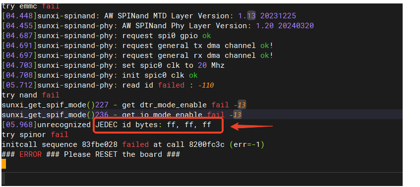

排查：读ID失败，且读出来是全FF，一般是硬件问题，检测 Flash 是否有虚焊，或者检查原理图接线是否正确，或者MUX是否正确。
