# Standby - 休眠唤醒

V821 是一款集成了 RISC-V MCU 和 RISC-V CPU 的多核芯片，旨在提供高效的应用处理和低功耗的通信功能。该芯片设计采用独立的 PM 软件框架，以实现两个核心的灵活管理和调度。

RISC-V MCU 运行于应用域，主要负责 Wi-Fi 通信功能，支持实时操作系统（RTOS），优化对实时任务的处理能力。与此同时，RISC-V CPU 位于独立的电源域上，运行 Linux 系统，主要负责用户应用的处理。芯片内部的 `pwrctrl` 硬件负责管理 APP 域的上下电。在启动和 Standby 休眠状态下，RISC-V MCU 通过 `pwrctrl` 直接控制其电源，而 RISC-V CPU 的电源控制则由 RISC-V MCU 负责，这样确保了 RISC-V MCU 不仅能够有效管理自身电源状态，还能协调 RISC-V CPU 的启动和休眠。

在应用功能划分中，Wi-Fi 保活场景下，RISC-V MCU 唤醒后能够进行保活交互，而不需要唤醒 RISC-V CPU。在 Wi-Fi 用户数据交互的场景中，RISC-V MCU 唤醒后需要唤醒 RISC-V CPU 以处理用户数据，这要求 RISC-V MCU 的休眠唤醒框架具备对不同场景的处理能力。

为了优化功耗和唤醒速度，V821 芯片支持两种类型的休眠场景：

-   DDR 掉电模式，具有低休眠功耗，但唤醒速度较慢。在该模式下，仅将 RISC-V MCU 的现场保存在 SRAM 中（SRAM 保持通电），而 RISC-V CPU 的现场不进行保存，唤醒时需重启。
-   DDR 自刷新模式，虽然休眠功耗较高，但唤醒速度较快。在这种模式下，DDR 处于自刷新状态，RISC-V MCU 和 RISC-V CPU 的现场均能保存于 DDR 中，唤醒时两个核心可以从最近的断点处恢复，从而提升系统的响应速度。

## 休眠唤醒功能

目前板级配置中，仅有部分板级配置了休眠唤醒功能，若需使用功能请使用如下支持板级。

:::tip

:::note

提示

:::
:::note

若使用的板级不支持，可以参考支持的板级进行修改，配置方法请参考 [休眠唤醒功能配置](#%E4%BC%91%E7%9C%A0%E5%94%A4%E9%86%92%E5%8A%9F%E8%83%BD%E9%85%8D%E7%BD%AE)

:::danger

:::note

危险

:::
:::note

由于休眠唤醒配置项较多较复杂，且休眠唤醒实现功能较多，建议基于现有配置完成的板级二次开发，减少工作量方便同步环境配置。

:::

:::

:::

:::

| 板级 | 配置 | 休眠唤醒支持 |
| --- | --- | --- |
| V821-IPC | 最小化压缩常电 8M Flash 系统，未配置休眠唤醒功能 | 否 |
| V821-PERF2 | PERF2 标准系统，支持超级待机模式，超低功耗待机模式，关机模式 | 支持 |
| V821-PERF2B | PERF2B 标准系统，支持PMC电源管理，支持超级待机模式，超低功耗待机模式，关机模式 | 支持 |
| V821-PERF2-FASTBOOT | PERF2 快起系统，支持超级待机模式，超低功耗待机模式，关机模式 | 支持 |
| V821-PERF2B-FASTBOOT | PERF2B 快起系统，支持PMC电源管理，支持超级待机模式，超低功耗待机模式，关机模式 | 支持 |

### 超级待机模式

超级待机模式下，RISC-V CPU、大部分外设、RISC-V MCU关闭电源，DRAM 进入自刷新模式。唤醒时候RISC-V CPU，RISC-V MCU都会从休眠的现场恢复运行。

-   PWR-EN0 为常供，只有执行 `poweroff` 才会下电，执行 `echo mem > /sys/power/state` 不会下电。芯片内部各模块有独立供电开关，由休眠模式自动控制各模块电源，在 DRAM 自刷新状态下会自动关闭芯片内部各模块电源，所以 PWR-EN0 控制的 VDD-SYS 需要常供。

| PMC 引脚 | 供电范围 | 电源情况 |
| --- | --- | --- |
| PMC-EN0 | 控DCDC1-3V3(RF3.3V),DCDC4-1V5(RF1.5V),DCDC2-0V92/1V(VDD-SYS) | 保持供电（芯片内各电源下电） |
| PMC-EN1 | 非唤醒源外设和IO供电 | 下电 |
| PMC-EN2 | 控制DCDC2(VDD-SYS)在休眠下调压达到休眠降功耗的作用（若无需做调压，PL2可释放出来做普通IO使用） | 拉低，降功耗 |
| PL6 | DRAM 电源 | 保持供电 |
| RTC | RTC 电源 | 保持供电 |

```
echo mem > /sys/power/state
```

### 超低功耗待机模式

超低功耗待机模式下，RISC-V CPU、大部分外设、RISC-V MCU关闭电源，DRAM 也关闭电源，唤醒时候RISC-V CPU会重启，RISC-V MCU会从休眠的现场恢复运行（通过 SRAM 保存现场）。

-   PWR-EN0 为常供，只有执行 `poweroff` 才会下电，执行 `echo mem > /sys/power/state` 不会下电。芯片内部各模块有独立供电开关，由休眠模式自动控制各模块电源，在 DRAM 自刷新状态下会自动关闭芯片内部各模块电源，所以 PWR-EN0 控制的 VDD-SYS 需要常供。

| PMC 引脚 | 供电范围 | 电源情况 |
| --- | --- | --- |
| PMC-EN0 | 控DCDC1-3V3(RF3.3V),DCDC4-1V5(RF1.5V),DCDC2-0V92/1V(VDD-SYS) | 保持供电（芯片内各电源下电） |
| PMC-EN1 | 非唤醒源外设和IO供电 | 下电 |
| PMC-EN2 | 控制DCDC2(VDD-SYS)在休眠下调压达到休眠降功耗的作用（若无需做调压，PL2可释放出来做普通IO使用） | 拉低，降功耗 |
| PL6 | DRAM 电源 | 下电 |
| RTC | RTC 电源 | 保持供电 |

```
echo 1 > /sys/class/ae350_standby/use_ultra_standby; poweroff
```

### 关机模式

超低功耗待机模式下，RISC-V CPU、大部分外设、RISC-V MCU关闭电源，DRAM 也关闭电源，仅有 RTC 与唤醒功能保留供电。唤醒时候 RISC-V CPU，RISC-V MCU 都是重启。

-   PWR-EN0 下电，只有 RTC 有电‘

| PMC 引脚 | 供电范围 | 电源情况 |
| --- | --- | --- |
| PMC-EN0 | 控DCDC1-3V3(RF3.3V),DCDC4-1V5(RF1.5V),DCDC2-0V92/1V(VDD-SYS) | 下电 |
| PMC-EN1 | 非唤醒源外设和IO供电 | 下电 |
| PMC-EN2 | 控制DCDC2(VDD-SYS)在休眠下调压达到休眠降功耗的作用（若无需做调压，PL2可释放出来做普通IO使用） | 下电 |
| PL6 | DRAM 电源 | 下电 |
| RTC | RTC 电源 | 保持供电 |

```
echo 0 > /sys/class/ae350_standby/use_ultra_standby; poweroff
```

## 休眠唤醒功能测试

### 支持 Wakeup IO 功能

| **项目** | **内容** |
| --- | --- |
| **用例名称** | 支持 Wakeup IO 功能 |
| **功能说明** | 验证支持 Wakeup IO 唤醒源 |
| **前置条件** | 正确配置 PM 功能，正确配置 Wakeup IO: PL7 |
| **操作步骤** | 1\. PL7 接地  
2\. PL7 接入高电平  
3\. 查看打印 |
| **预期结果** | PL7 状态变化后 2s 打印 Wupio 打印 （不可配置 share-io 功能） |

关键日志：

```
root@(none):/# [   64.963238] sunxi_wupio soc@2002000:wakeup_io: sunxi:wupio_sunxiWakeIO[7] is detected!
[   64.972110] sunxi_wupio soc@2002000:wakeup_io: sunxi:wupio_sunxiWakeIO[7] is detected!
```

:::tip

:::note

提示

:::
:::note

这里的 2s 是设备树配置的消抖时间，可以修改设备树的 `debounce_us` 配置

```
debounce_us = <2000000>;
```

:::

:::

### 支持 Wakeup IO 唤醒

| **项目** | **内容** |
| --- | --- |
| **用例名称** | 支持 Wakeup IO 唤醒，包括超级待机，关机，超低功耗待机三种模式 |
| **功能说明** | 验证支持 Wakeup IO 唤醒源 |
| **前置条件** | 正确配置 PM 功能，正确配置 Wakeup IO: PL7 |
| **操作步骤** | 1\. 进入超级待机模式：`echo mem > /sys/power/state`  
2\. 将 PL7 接地/拉高（根据硬件决定） 2 秒  
3\. 进入休眠状态：`poweroff`  
4\. 将 PL7 接地/拉高（根据硬件决定） 2 秒  
5\. 进入超低功耗待机：`echo 1 > /sys/class/ae350_standby/use_ultra_standby; poweroff`  
6\. 将 PL7 接地/拉高（根据硬件决定）2秒 |
| **预期结果** | 三种模式下 PL7 状态变化 2 秒后，系统成功唤醒 |

日志：

-   超级待机模式：

```
root@(none):/# echo mem > /sys/power/state
[  272.520921] PM: suspend entry (deep)
...
[  272.839009] PM: suspend exit
root@(none):/# [  272.931933] configfs-gadget gadget: high-speed config #1: c
```

:::tip

:::note

提示

:::
:::note

这里的 2s 是设备树配置的消抖时间，可以修改设备树的 `debounce_us` 配置

```
debounce_us = <2000000>;
```

:::

:::

-   关机模式：

```
root@(none):/# poweroff
The system is going down NOW!
Sent SIGTERM to all processes
Requesting system poweroff
[  181.422764] sunxi:rtc:[INFO]: reboot_deal(): empty arg
[  181.428607] sunxi:sunxi_riscv_pm:[INFO]: hib poweron_source is 0x7ff
ac327 send hard syn message: 0x260202
ac327 receive hard syn message feedback: 0x260202
[  181.437953] sunxi:sunxi_riscv_pm:[INFO]: hib ultra_poweron_source is 0x7ff
ac327 send hard syn message: 0x260202
ac327 receive hard syn message feedback: 0x260202
[  181.471549] sunxi:twi-42502000.twi0:[INFO]: shutdown finish
ac327 send hard syn message: 0x280202
ac327 receive hard syn message feedback: 0x280202
[  181.480515] sunxi-rproc 43030000.e907_rproc: skip shutdown
[  181.491915] sunxi:vin:[WARN]: video4 device have been closed!
[  181.498370] sunxi:vin:[WARN]: video0 device have been closed!
[  181.524026] reboot: Power down
ae350_system_reset(): CPU[0] SHUTDOWN
ac327 send hard syn message: 0x80240202
ac327 receive hard syn message feedback: 0x240202
[0]HELLO! BOOT0 is starting!
[2]BOOT0 commit : 48a890f536-dirty
[6]set pll start
[9]set pll end
```

-   超低功耗待机模式：

```
root@(none):/# echo 1 > /sys/class/ae350_standby/use_ultra_standby; poweroff
ac327 send hard syn message: 0x300202
ac327 receive hard syn message feedback: 0x300202
The system is going down NOW!
Sent SIGTERM to all processes
Requesting system poweroff
[   44.427630] sunxi:rtc:[INFO]: reboot_deal(): empty arg
[   44.433439] sunxi:sunxi_riscv_pm:[INFO]: hib poweron_source is 0x7ff
ac327 send hard syn message: 0x260202
ac327 receive hard syn message feedback: 0x260202
[   44.442799] sunxi:sunxi_riscv_pm:[INFO]: hib ultra_poweron_source is 0x7ff
ac327 send hard syn message: 0x260202
ac327 receive hard syn message feedback: 0x260202
[   44.476406] sunxi:twi-42502000.twi0:[INFO]: shutdown finish
ac327 send hard syn message: 0x280202
ac327 receive hard syn message feedback: 0x280202
[   44.485393] sunxi-rproc 43030000.e907_rproc: skip shutdown
[   44.496726] sunxi:vin:[WARN]: video4 device have been closed!
[   44.503179] sunxi:vin:[WARN]: video0 device have been closed!
[   44.524184] reboot: Power down
ae350_system_reset(): CPU[0] SHUTDOWN
ac327 send hard syn message: 0x80240202
ac327 receive hard syn message feedback: 0x240202
......

[1]HELLO! PMBOOT is starting!
[3]PMBOOT commit : 48a890f536-dirty
[7]set pll end
[8]wakeup_req: wakeup io
```

### 支持 Wakeup Timer 唤醒

| **项目** | **内容** |
| --- | --- |
| **用例名称** | 支持 Wakeup Timer 唤醒，包括超级待机，关机，超低功耗待机三种模式 |
| **功能说明** | 验证支持 Wakeup Timer 唤醒源 |
| **前置条件** | 正确配置 PM 功能，正确配置 Wakeup Timer |
| **操作步骤** | 1\. 设置唤醒定时器为7秒：`echo 7000 > /sys/class/ae350_standby/time_to_wakeup_ms`  
2\. 进入超级待机模式：`echo mem > /sys/power/state`  
3\. 等待设置唤醒时间。  
4\. 设置唤醒定时器为7秒：`echo 7000 > /sys/class/ae350_standby/time_to_wakeup_ms`  
5\. 进入超低功耗待机模式：`echo 0 > /sys/class/ae350_standby/use_ultra_standby; poweroff`  
6\. 等待设置唤醒时间。  
7\. 设置唤醒定时器为7秒：`echo 7000 > /sys/class/ae350_standby/time_to_wakeup_ms`  
8\. 进入休眠模式：`echo 1 > /sys/class/ae350_standby/use_ultra_standby; poweroff`  
9\. 等待设置唤醒时间。 |
| **预期结果** | 等待设置唤醒时间后系统唤醒 |

日志：

-   超级待机模式：

```
root@(none):/# echo 7000 > /sys/class/ae350_standby/time_to_wakeup_ms
ac327 send hard syn message: 0x260202
ac327 receive hard syn message feedback: 0x260202
[   24.934525] sunxi:ae350_standby_debug:[INFO]: time_to_wakeup_ms change to 5000
root@(none):/# echo mem > /sys/power/state
[   27.578271] PM: suspend entry (deep)
...
[   27.800643] PM: suspend exit
root@(none):/# [   27.949779] configfs-gadget gadget: high-speed config #1: c
```

-   关机模式：

```
root@(none):/# echo 7000 > /sys/class/ae350_standby/time_to_wakeup_ms
ac327 send hard syn message: 0x260202
ac327 receive hard syn message feedback: 0x260202
[   28.897457] sunxi:ae350_standby_debug:[INFO]: time_to_wakeup_ms change to 7000
root@(none):/# echo 0 > /sys/class/ae350_standby/use_ultra_standby; poweroff
ac327 send hard syn message: 0x300202
ac327 receive hard syn message feedback: 0x300202
The system is going down NOW!
Sent SIGTERM to all processes
Requesting system poweroff
[   34.087356] sunxi:rtc:[INFO]: reboot_deal(): empty arg
[   34.093168] sunxi:sunxi_riscv_pm:[INFO]: hib poweron_source is 0x7ff
ac327 send hard syn message: 0x260202
ac327 receive hard syn message feedback: 0x260202
[   34.102519] sunxi:sunxi_riscv_pm:[INFO]: hib ultra_poweron_source is 0x7ff
ac327 send hard syn message: 0x260202
ac327 receive hard syn message feedback: 0x260202
[   34.136202] sunxi:twi-42502000.twi0:[INFO]: shutdown finish
ac327 send hard syn message: 0x280202
ac327 receive hard syn message feedback: 0x280202
[   34.145182] sunxi-rproc 43030000.e907_rproc: skip shutdown
[   34.156513] sunxi:vin:[WARN]: video4 device have been closed!
[   34.162956] sunxi:vin:[WARN]: video0 device have been closed!
[   34.184051] reboot: Power down
ae350_system_reset(): CPU[0] SHUTDOWN
ac327 send hard syn message: 0x80240202
ac327 receive hard syn message feedback: 0x240202
[0]HELLO! BOOT0 is starting!
[2]BOOT0 commit : 48a890f536-dirty
[6]set pll start
```

-   超低功耗待机模式

```
root@(none):/# echo 7000 > /sys/class/ae350_standby/time_to_wakeup_ms
ac327 send hard syn message: 0x80260202
ac327 receive hard syn message feedback: 0x260202
[  318.075397] sunxi:ae350_standby_debug:[INFO]: time_to_wakeup_ms change to 7000
root@(none):/# echo 1 > /sys/class/ae350_standby/use_ultra_standby; poweroff
The system is going down NOW!
Sent SIGTERM to all processes
Requesting system poweroff
[  343.208698] sunxi:rtc:[INFO]: reboot_deal(): empty arg
[  343.214538] sunxi:sunxi_riscv_pm:[INFO]: hib poweron_source is 0x7ff
ac327 send hard syn message: 0x260202
ac327 receive hard syn message feedback: 0x260202
[  343.223860] sunxi:sunxi_riscv_pm:[INFO]: hib ultra_poweron_source is 0x7ff
ac327 send hard syn message: 0x260202
ac327 receive hard syn message feedback: 0x260202
[  343.257455] sunxi:twi-42502000.twi0:[INFO]: shutdown finish
ac327 send hard syn message: 0x280202
ac327 receive hard syn message feedback: 0x280202
[  343.266455] sunxi-rproc 43030000.e907_rproc: skip shutdown
[  343.277769] sunxi:vin:[WARN]: video4 device have been closed!
[  343.284229] sunxi:vin:[WARN]: video0 device have been closed!
[  343.304072] reboot: Power down
ae350_system_reset(): CPU[0] SHUTDOWN
ac327 send hard syn message: 0x80240202
ac327 receive hard syn message feedback: 0x240202
......

[1]HELLO! PMBOOT is starting!
[3]PMBOOT commit : 48a890f536-dirty
[7]set pll end
```

### 支持 RTC Alarm 唤醒

| **项目** | **内容** |
| --- | --- |
| **用例名称** | 支持 RTC Alarm 唤醒，包括超级待机，关机，超低功耗待机三种模式 |
| **功能说明** | 验证支持 RTC Alarm 唤醒源 |
| **前置条件** | 正确配置 PM 功能，正确配置 RTC Alarm |
| **操作步骤** | 1\. 设置RTC闹钟，10秒后触发中断：`date; echo +10 > /sys/class/rtc/rtc0/wakealarm`  
2\. 进入超级待机模式：`echo mem > /sys/power/state`  
3\. 等待设置唤醒时间。  
4\. 设置RTC闹钟，10秒后触发中断：`date; echo +10 > /sys/class/rtc/rtc0/wakealarm`  
5\. 进入超低功耗待机模式：`echo 0 > /sys/class/ae350_standby/use_ultra_standby; poweroff`  
6\. 等待设置唤醒时间。  
7\. 设置RTC闹钟，10秒后触发中断：`date; echo +10 > /sys/class/rtc/rtc0/wakealarm`  
8\. 进入休眠模式：`echo 1 > /sys/class/ae350_standby/use_ultra_standby; poweroff`  
9\. 等待设置唤醒时间。 |
| **预期结果** | 等待设置唤醒时间后系统唤醒 |

日志：

-   超级待机模式：

```
root@(none):/# date; echo +10 > /sys/class/rtc/rtc0/wakealarm
Thu Jan  1 00:22:33 UTC 1970[  648.159665] sunxi:rtc-4a000c00.rtc:[WARN]: Warning: Using internal RC 16M clock source. Time may be inaccurate!

[  648.172741] sunxi:rtc-4a000c00.rtc:[WARN]: Warning: Using internal RC 16M clock source. Time may be inaccurate!
[  648.184092] sunxi:rtc-4a000c00.rtc:[WARN]: Warning: Using internal RC 16M clock source. Time may be inaccurate!
[  648.195435] sunxi:rtc-4a000c00.rtc:[WARN]: Warning: Using internal RC 16M clock source. Time may be inaccurate!
root@(none):/# echo mem > /sys/power/state
[  651.296731] PM: suspend entry (deep)
[  651.300953] Filesystems sync: 0.000 seconds
[  651.317428] Freezing user space processes ... (elapsed 0.001 seconds) done.
[  651.326631] OOM killer disabled.
[  651.330258] Freezing remaining freezable tasks ... (elapsed 0.002 seconds) done.
[  651.341369] printk: Suspending console(s) (use no_console_suspend to debug)
l▒[  651.350162] sunxi:rtc-4a000c00.rtc:[WARN]: Warning: Using internal RC 16M clock source. Time may be inaccurate!
[  651.350193] sunxi:uart-ng-uart-ng0:[INFO]: uart0 suspend
[  651.351103] sunxi:gpadc-42009000.gpadc0:[INFO]: sunxi gpadc suspend
[  651.351258] sunxi:sunxi_spif-44f00000.spif:[INFO]: [spi-flash0] suspend finish
[  651.364164] MBUS_PMU 43102000.mbus-controller: suspend okay
[  651.364690] sunxi:twi-42502000.twi0:[INFO]: suspend late
[  651.382204] sunxi:pin-42000000.pinctrl:[INFO]: pinctrl suspend
[  651.382633] sunxi:pin-42000000.pinctrl:[INFO]: pinctrl resume
[  651.383314] sunxi:rtc-4a000c00.rtc:[WARN]: Warning: Using internal RC 16M clock source. Time may be inaccurate!
[  651.405279] sunxi:twi-42502000.twi0:[INFO]: resume early
[  651.405677] MBUS_PMU 43102000.mbus-controller: resume okay
[  651.406326] sunxi:sunxi_spif-44f00000.spif:[INFO]: [spi-flash0] mclk 24000000
[  651.406340] sunxi:sunxi_spif-44f00000.spif:[INFO]: [spi-flash0] resume finish
[  651.406525] sunxi:sunxi_mmc_host-44020000.sdmmc:[INFO]: dat3_imask c0000000
[  651.406608] sunxi:gpadc-42009000.gpadc0:[INFO]: sunxi gpadc resume
[  651.414208] sunxi:uart-ng-uart-ng0:[INFO]: uart0, select set 0, baud 115200, uartclk 192000000 beyond rance[24000000, 120000000]
[  651.414353] sunxi:uart-ng-uart-ng0:[INFO]: uart0, select set 0, baud 115200, uartclk 192000000 beyond rance[24000000, 120000000]
[  651.414366] sunxi:uart-ng-uart-ng0:[INFO]: uart0 resume. DLH: 0, DLL: 104.
[  651.414390] sunxi:rtc-4a000c00.rtc:[WARN]: Warning: Using internal RC 16M clock source. Time may be inaccurate!
[  651.574057] OOM killer enabled.
[  651.577581] Restarting tasks ... done.
[  651.582813] PM: suspend exit
```

-   关机模式：

```
root@(none):/# date; echo +10 > /sys/class/rtc/rtc0/wakealarm
Thu Jan  1 00:23:05 UTC 1970[  673.381634] sunxi:rtc-4a000c00.rtc:[WARN]: Warning: Using internal RC 16M clock source. Time may be inaccurate!

[  673.394806] sunxi:rtc-4a000c00.rtc:[WARN]: Warning: Using internal RC 16M clock source. Time may be inaccurate!
[  673.406200] sunxi:rtc-4a000c00.rtc:[WARN]: Warning: Using internal RC 16M clock source. Time may be inaccurate!
[  673.417557] sunxi:rtc-4a000c00.rtc:[WARN]: Warning: Using internal RC 16M clock source. Time may be inaccurate!
root@(none):/# echo 0 > /sys/class/ae350_standby/use_ultra_standby; poweroff
ac327 send hard syn message: 0x300202
ac327 receive hard syn message feedback: 0x300202
The system is going down NOW!
Sent SIGTERM to all processes
Requesting system poweroff
[  678.015765] sunxi:rtc:[INFO]: reboot_deal(): empty arg
[  678.021575] sunxi:sunxi_riscv_pm:[INFO]: hib poweron_source is 0x7ff
ac327 send hard syn message: 0x260202
ac327 receive hard syn message feedback: 0x260202
[  678.030943] sunxi:sunxi_riscv_pm:[INFO]: hib ultra_poweron_source is 0x7ff
ac327 send hard syn message: 0x260202
ac327 receive hard syn message feedback: 0x260202
[  678.064524] sunxi:twi-42502000.twi0:[INFO]: shutdown finish
ac327 send hard syn message: 0x280202
ac327 receive hard syn message feedback: 0x280202
[  678.073488] sunxi-rproc 43030000.e907_rproc: skip shutdown
[  678.084848] sunxi:vin:[WARN]: video4 device have been closed!
[  678.091290] sunxi:vin:[WARN]: video0 device have been closed!
[  678.114114] reboot: Power down
ae350_system_reset(): CPU[0] SHUTDOWN
ac327 send hard syn message: 0x80240202
ac327 receive hard syn message feedback: 0x240202
[0]HELLO! BOOT0 is starting!
[2]BOOT0 commit : 48a890f536-dirty
[6]set pll start
```

-   超低功耗待机模式

```
root@(none):/# date; echo +10 > /sys/class/rtc/rtc0/wakealarm
Thu Jan  1 00:23:46 UTC 1970[   27.467816] sunxi:rtc-4a000c00.rtc:[WARN]: Warning: Using internal RC 16M clock source. Time may be inaccurate!

[   27.480910] sunxi:rtc-4a000c00.rtc:[WARN]: Warning: Using internal RC 16M clock source. Time may be inaccurate!
[   27.492267] sunxi:rtc-4a000c00.rtc:[WARN]: Warning: Using internal RC 16M clock source. Time may be inaccurate!
[   27.503604] sunxi:rtc-4a000c00.rtc:[WARN]: Warning: Using internal RC 16M clock source. Time may be inaccurate!
root@(none):/# echo 1 > /sys/class/ae350_standby/use_ultra_standby; poweroff
ac327 send hard syn message: 0x300202
ac327 receive hard syn message feedback: 0x300202
The system is going down NOW!
Sent SIGTERM to all processes
Requesting system poweroff
[   31.982851] sunxi:rtc:[INFO]: reboot_deal(): empty arg
[   31.988693] sunxi:sunxi_riscv_pm:[INFO]: hib poweron_source is 0x7ff
ac327 send hard syn message: 0x260202
ac327 receive hard syn message feedback: 0x260202
[   31.998029] sunxi:sunxi_riscv_pm:[INFO]: hib ultra_poweron_source is 0x7ff
ac327 send hard syn message: 0x260202
ac327 receive hard syn message feedback: 0x260202
[   32.031627] sunxi:twi-42502000.twi0:[INFO]: shutdown finish
ac327 send hard syn message: 0x280202
ac327 receive hard syn message feedback: 0x280202
[   32.040593] sunxi-rproc 43030000.e907_rproc: skip shutdown
[   32.051973] sunxi:vin:[WARN]: video4 device have been closed!
[   32.058433] sunxi:vin:[WARN]: video0 device have been closed!
[   32.084244] reboot: Power down
ae350_system_reset(): CPU[0] SHUTDOWN
ac327 send hard syn message: 0x80240202
ac327 receive hard syn message feedback: 0x240202
......

[1]HELLO! PMBOOT is starting!
[3]PMBOOT commit : 48a890f536-dirty
[7]set pll end
[8]wakeup_req: sysrtc
[10]reset_src: rtc wdg rst
[12]reset_src: det rst
```

### 休眠状态中 LDO 开关控制

| **项目** | **内容** |
| --- | --- |
| **用例名称** | 支持 RTC Alarm 唤醒，包括超级待机，关机，超低功耗待机三种模式 |
| **功能说明** | 验证支持 RTC Alarm 唤醒源 |
| **前置条件** | 正确配置 PM 功能，万用表 |
| **操作步骤** | 1\. 设置LDO1V8/LDO2V8休眠关闭：`echo 0 > /sys/class/ae350_standby/standby_ldo_onoff`  
2\. 进入超级待机模式：`echo mem > /sys/power/state`  
3\. 用万用表测量LDO1V8/LDO2V8电压。  
4\. 设置LDO1V8/LDO2V8休眠关闭：`echo 3 > /sys/class/ae350_standby/standby_ldo_onoff`  
5\. 进入超级待机模式：`echo mem > /sys/power/state`  
6\. 用万用表测量LDO1V8/LDO2V8电压。  
7\. 设置LDO1V8/LDO2V8休眠关闭：`echo 0 > /sys/class/ae350_standby/standby_ldo_onoff`  
8\. 进入超低功耗待机模式：`echo 1 > /sys/class/ae350_standby/use_ultra_standby; poweroff`  
9\. 用万用表测量LDO1V8/LDO2V8电压。  
10\. 设置LDO1V8/LDO2V8休眠关闭：`echo 3 > /sys/class/ae350_standby/standby_ldo_onoff`  
11\. 进入超低功耗待机模式：`echo 1 > /sys/class/ae350_standby/use_ultra_standby; poweroff`  
12\. 用万用表测量LDO1V8/LDO2V8电压。 |
| **预期结果** | 用万用表测量LDO1V8 / LDO2V8电压和实际配置开关状态一致 |

## 休眠唤醒功能配置

### Linux 端软件配置

#### 配置休眠唤醒功能

Linux 端对接到的是标准的 Linux PM 框架，开启 Linux 的 PM 框架即可。执行 \`make kernel

```
Power management options  --->
	[*] Suspend to RAM and standby
	-*- Device power management core functionality
```

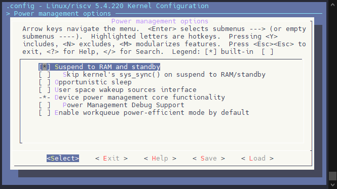

另外 V821 扩展了多种休眠唤醒模式，需要开启功能配置节点

```
Allwinner BSP  --->
	Device Drivers  --->
		RISCV suspend Drivers  --->
			<*> Allwinner sunxi riscv suspend support
			<*>   Andes sunxi Standby Debugging Driver
```

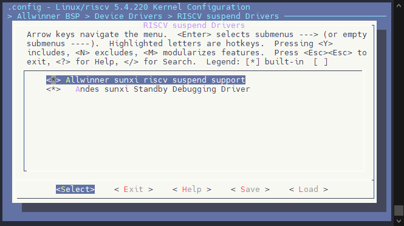

设备树配置：

board.dts

```c
/{
	poweron-source {
		hib_poweron_source  = <0x000007FF>;
		ultra_poweron_source  = <0x000007FF>;
	};
	
	ae350_standby_debug:ae350_standby_debug@1 {
		compatible = "allwinner,sun300iw1-ae350-standby-debug";
		mboxes = <&msgbox 2>;
		mbox-names = "ae350-notify";
		memory-region = <&efuse_ram_reserved>;
		status = "okay";
	};
};
```

#### 配置 BOOT\_PKG 偏移

:::tip

:::note

提示

:::
:::note

SPI NOR 需要配置这个部分。

:::

:::

配置内核选项 `CONFIG_SPINOR_UBOOT_OFFSET` 对应到 UBOOT 的 flash\_map 配置中。

```
Allwinner BSP  --->
	Device Drivers  --->
		<*> Memory Technology Device (AW_MTD) support  --->
			(96)  spinor uboot offset
```

例如这里 IPC 方案的 `device/config/chips/v821/configs/ipc/uboot-board.dts` 是 96

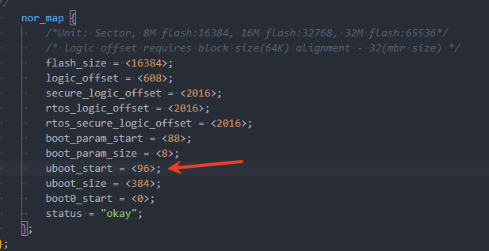

则对应配置 96

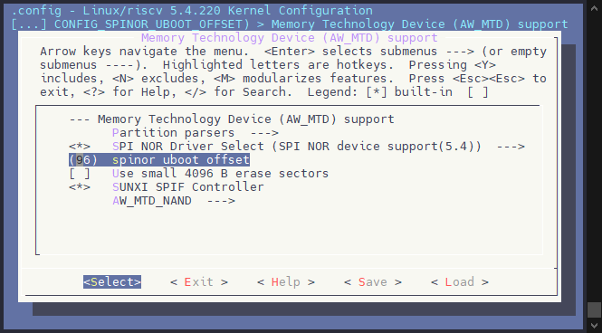

如果配置是 128

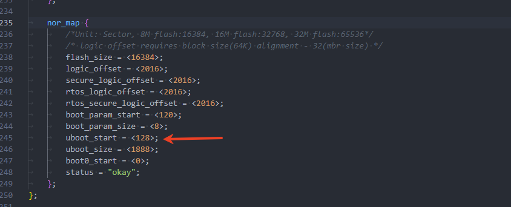

则对应配置 128 即可

#### 配置按键唤醒源驱动

在 V821 芯片中，PL组的引脚均可作为 WUPIO 唤醒引脚，我们可以配置 PL 组引脚作为唤醒源。此时需要勾选相关驱动。

```
Allwinner BSP  --->
	Device Drivers  --->
		WUPIO Drivers  --->
			<*> WUPIO Support for Allwinner SoCs
```

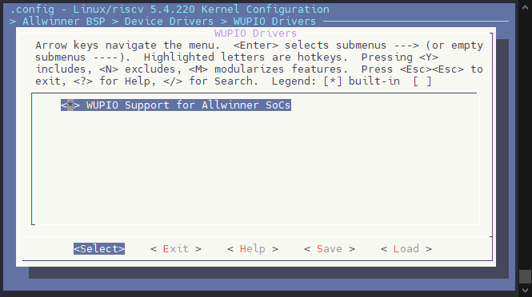

:::tip

:::note

提示

:::
:::note

下面的功能为 SDK 1.2 所支持的，SDK 1.1 暂未支持

:::

:::

如果该 WUPIO 需要作为普通按键使用，则需要开启 `CONFIG_AW_WUPIO_KEYBOARD_GPIO`，以支持 Linux 将其看作普通按键。

```
Allwinner BSP  --->
	Device Drivers  --->
		WUPIO Drivers  --->
			<*>   GPIO Buttons With WUPIO Support
```

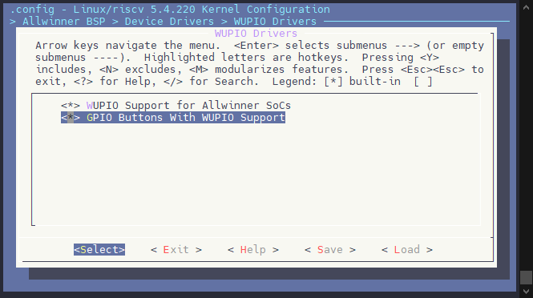

:::danger

:::note

危险

:::
:::note

使用 `CONFIG_AW_WUPIO_KEYBOARD_GPIO` 驱动，请一定关闭内核的 `CONFIG_KEYBOARD_GPIO` 驱动，不要开下图的驱动否则导致驱动资源冲突

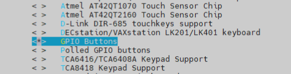

`CONFIG_AW_WUPIO_KEYBOARD_GPIO` 驱动仅为内核原生 `CONFIG_KEYBOARD_GPIO` 驱动增加 WUPIO 共享支持，其用法与内核原生驱动一致！

可以用这行命令确认是否开了两个驱动：

```bash
dmesg | grep gpio-key
```

正常情况，只开了一个驱动：

![image-20250606202719354](data:image/png;base64,iVBORw0KGgoAAAANSUhEUgAAA50AAAA4CAYAAAB+FZyKAAAePklEQVR4nO3dX2hj2Z3g8W8v8xi296npDP4jVykTtVI7GE1RwTVg2S5r/LCRXIHZFCsyrXVrHfthQBF0cFWMbWxT7SqmQREsg91ujSM2KNTuQJdthlCRXbYMa9GhYwzT4yhT6rL8ZyZNP01vhpC37MO9V76Sr3Sv/tmS6/eBgm5fnT/3nHP/nHvOPfc1l8v1B3R+9/s/ohq+yAbB3DjD0WzhBscoq4l7dKYe4w8nOXB4CD+aoG/L4Ld4iO75yflHiGT04TuIuaZY037mnWc/eIz/7jIHFtKPDuVYiiY5AJzeeRKzMK3FZzF+JW8TuEmfha2gbOYo3P8AT5T4ay2fEvEbhzfgGGU1cZttNU5fZIO5rifnyjYfP+D0jjJ2LUcomizK2wRu4CheKu9VlN9b/5n/89P/yI+7/y//oP3N++d8/D/+H4HhfyQD/Jfod5jmYwKhIzJvdfLXj76Je+vn/Ncf/VtRPG2k/tvP+J+/spq43n/ir1f/AtuH/5t31wu3lE+/k/f3v0nnj9X/V7f/Fb9S8l/l/uXDV7MrQgghhBBCXKD/UJdYHKME3WliJTs5aeK5Xhb2NthPTNB3+LhEhyhJaOaUvsQG+3sbrIbstaefWWYJNe29DRJBiPsr6zQqDskdn3CU2qk47Fp4nHjXBIm9DfYf9cJWuugX58vnQQXlsxYeJ45fib9seIt55R4LurJfC48zrcW/t8HCAGw+SxaFTLKZUvbFuB1UX35m/iH0c/4XTuL73+Hjn34Td+5jpvQdToBf/SM/TsFf/fQ7fLz/HT6Odl5Q+ke8O/Uv8N//Qkn3URuHW/9Sefy2b6rxO6HC8EIIIYQQQlym1+ox0llylPGCXHb6FdOPpBqNtLYoZ2iFhC1Bd7i4QyqEEEIIIYR4VdU+0mk6ytlgl52+Fd5Rol5t5NBOONjD0daWburuVeBhLNBO6rl0OIUQQgghhBBnqnuBUy+zzLCrDjlp1fStWN9iMzLJ/mw7AEep6qe/NiNfZIM5t7Jfw+vmvxdCCCGEEEK8OuoyvVYIIYQQQgghhDBSn4WExNXinWf/6SjOy86HqDM7Pq+9vvXqGGV1b4Wwo56RCiGEEEKIq+RKdTqdoXnrK95eODu+yAphb+NScDo8OB1qWt5mLYdG8RDdm8d32dloZo5+grMBXrWWIYQQQgghLlfzdDq98+yX6TQ4vaNEnyqf7NjfWyF6rnPpYSzQxvazZn1XMsva81MCwdpHEJ2hFfYjnqK/2hl65GcIwBtgbqCrxlTElZNZZvgKrJIshBBCCCFaSxWdTjtOR52n6JnxzpOYvU0uNk63a5Bu/y62wGTBlD5nyI87lSCSuciMVWg9Tpx7jNU02llilVhHP33s8iwDzmttHOUOa0lElHQJ7V8IIYQQQogWZnHVIA/RvV5y8Tb6AsAxdHacMp0fNbETjkwScOtWZw0ndZ8EKbPdMcpq4h6d6i/n9jaYA0g9Vr/36CE620NqZpCItjJqZplY6h7BITuRTBawM9TfTipm8LmO17/Fz/re5INfwvf+7AY2gN9+yg9/+SEffan9qI0f3Hqbd776BgC53/yEd3/xCf9UQfhv33qb94zCF8jybOuExIAH1ovz6iG6N4H7+Iny/c5SVeHtVX6jlYV3ntVgG3S00wksPL1NZ0c7MMmqbZcH4TJx6dN+OoG7A+CEePz0bJNjlNXEbXIpcLshFd/FFrhHJ2ni/im1k2/HF5lkrkT9O73zLMz2qHV8QmrmIaF1/Yi0nfDTRQK69AP9x+XLoa7M0jdv/yX3X/0O63Yc+gJKGZw/PmrIn6X41bYFQFqXb138ZY9f65yhFRKBU6b9U6zlHwCVax9K3pgZJLR+9vvw00VsMf3fhBBCCCFEq6pgpLOHPluCB64Rhu+O0O2P529cfZFFAiTwuwbp9j9mu2uCBd3017LbM8sMuwbpnkmj3BAPKqOZYbVT5u3FTZrNdcDhUafYrnCHEzpt2hTSLmwdJ+RelMr7Db73x/u8u/p93lp9nx/++w3e+/rN/NZv33qXd/g5f7n6fd7a/gnPv/Jd3ne2VRT+PS386vsG4c8cvDyFLluVI2XKNz5TMV1nbH2KB/cfEktBKj7Og/u7HJFm2v+QB0vWOm2+yATuw8dq/SSgv+fcb3JLI/jj4A50EHMNMp3qoW/IroZfZE6rX9d4Uf17GJttY3tGrVfXQzYH+gumUfsiiwRM0m8ka+mXb/+l918JG7Dt8KDE8VF7/sziTxJyDdLtekyqVPxljl+rnKEVFvrVzrhuxkH58kmyFD/BPaCbLu4NEOhQj3khhBBCCNHyKuh0nrC9pBv9yGgjVR7uuE+Ia9sySSKxNJ39/WrHymx7ec5rbZDaYQ3wjSmdo27XQzZpP/uRw6aMQJb0Bc9/rY08nvLRv34KX3mTbwBwE89Xv+DvtO1ffsLf/POn2N7sVrdXGJ5Tg/BFOjoMFnNROwZlRzkDBHjCUtHN+EEGrnedkHuW5eBrHXSmdljLZDmwNNXYuH4KnfJZRu0wHx+TLReerEH9ttN3TVvkKMtaeFk30mYl/Uaymr7F9m+4/9W3f2v5q3/81sMrbGPKCGfsbvEoqnn5HDzb5cjdm38Q4RvoyR/zQgghhBCi9dX+UU6HDRunbJbq4Jhtt8zO9S7yU2izuRNMepo6X5D9ssSm19+kiy9IltpuKfwb9Pf9iHf0f//t51YzZ5E2yjlVNG05gI02bB3A2Dy2LmUULBqxsWRlam2t9eOwYaMdd2KDgP7vx8fqfyQJ+W1EH/lZCEzQyQmp+ENC0Wx90q9Vw/cftE574/LX6Pj103Ph/BTddtxdaY7o4Y4X1vQPRayUT2aL7eNFgiE7a9EupZPqN5gqL4QQQgghWlLtnc5Mjhy3ue4AjG5czbZb0WXDSZLPDiEw4IH1Q+w23UinmkZVvvycQ/4U++tA2Y5nufCf8sHqh3xkNcy50UKNHSdZ446iOuVwumiU89nzHYYG/LiPd5l+DneCbaS2dth8aXEhoVrrJ5MjR5pYuVVRM8uE7i4DyvudidkAvqj6+3q0j1pcxP7TVmP8ZvlrdPxJQq5yncAT4veniHxtnv3ZFcIvRs4W9LJUPsroZyDYj/NlB+7jXZaaeUEwIYQQQghRkTp8MiXJZqqdwJhHmS7n8BAO9nC0taV2nsy2q14cc6TdPOscvDzNT0ddW3pMqmuC/b1J7nByLg/aO4aV+YTkb97gna/fVKbDvn6TH/zJDXKf7xssBFQq/A3eu3UzP532G23f4m+dNw1/7Rsw2HdAGU1aJFHiszG+gR6O4vGiG/csB+tJPqOdVGyZtfUcdJyyGU2ytl6i83qOcf1Yl2Qz1cNcxJOfLun0jhINqe/oOZT/Lj1Vs9b0a9Xg/QfAQvuvKX+VxF98jFk8Pq1Yn2I61U7gkf6zQFbKB1jfIdVxj8RslWkLIYQQQoimVftIJ7AWHud6ZJLE3gSgrk4ZzVreDqgr0t5mTpuGp61eux4nHtSm3iUJ3TUecVl7nmYu2I8zarWzdeajX7yP/dbb/P3wdwF19dmDU5NQheEpCL/BB7/+xOCXyvtt20tG45yH5I5PsB0avMvmGCXoThMLG4WzK+9zvkBZdCm1Q8hyzhVr4XGuP11U6+eEeDwN/ZWFp6B+nxBbUusps8zS0DwLexPK6rXHyqq3a0Xh8+kfp4lvVZZ+rWpNv+z+A5AmnuvNl4Fh+68pf1bjTxKa6WVVPcaO4uMMR7PWjs8K87oQ2mJYjcO8fJS8baYmcLvTxKpMWwghhBBCNKfXXC7XH/R/+N3v69IPrS/tsx3nPrWhZyf8dBLujzTvtzq98+wHK/8UiC+yQTA3nr+Jv/KqKiflsyabZadxNjL9EtRPmpSfXlohff4aEf8lcYZWSNgSZytXCyGEEEKIK6EO02svQGaZYX8CgpPs722wv7fB6rlPOmSJxE7pG/IYRnH57IQH2ojfr7Ajo41yXuUOp3eUqFerT3v10ztbNX0zzZ6/uvAwFmgn9Vw6nEIIIYQQV00TDmuWkCk9tTZvfYrhi8lNFbJEwiOVB8ssM+yqf26ayvoWm5FJ9meVxaFqmd7Zkumbafb81cgX2WDOrezXsHybUwghhBDiymmN6bVCCCGEEEIIIVqS9em1DjvO/L8G5khUpy71Y8fntZdZaVaIy9SA9ukYZXVvhbCc06zzzrP/dLQB54nWO/84Qyv5Vz72S6w8XjeOUaJP1bQaUv5CiMvzql/fWu/8X6jV838xLHY6PUQTkyyMBRgbCzA2VO4TGK3N6fVcXsNxVJu2nbBWN2OTLCSqvPlx9BOcDVDNh2eEaDhpn1dbC9bvQXSEbtcg3f4nHDU4Ld/YPWxb40p69VjkTAjRPFrw/FdXrb7/zZ7/qvsX9VXBQkKnxMJThMJThKLJJrvg2QlHtCfOK0TPLTJkkWOUhdkJ5gwajjM0z6q2iFGkuNNdJn3HaD5cwb9zT6o9RBMGaVsKnyWi1U04Qa66vVffH72kVVC9840fKWggp1c3ClHUBpzeeV0drugWBdKYtd/y2xsdf92Or1pdZvt8hThDK+xHLmFBtiap30vZf9Pzn53rXZB7efnvcl9G+cj5VZcfKf+6xi/Xt4tVsv22yP1na+a/RP/iErTG6rUmfJFFAuzidw3S7U9AYJGot9JY7IQf3WY7nj63xRlaIdEPMf8g3a5BHjy3MaSLv2z6mWWGXUo47d90iqLVR+2En05gS6VJFSduKby4VN55ErO3ycXUUQj/LrbApDKlxTHK2MAOD9S20+3fxTZb2D7N2m/Z7Y2O38J2cZXUfxVhw+n+jsu+9JVy1VdRVl/BqDr8JZSPnF91pPzl+tbKWv382or5L9O/uARXoNPp4Y77hPiSOt0ok2QpfoJ7oLIngc7QJH2HCSIvz8c/FmgnFZtiTf3+58H6MpH1s+0Vpe8YJeg+YftZ0RPrrccMh3fMM1oqfE08REu9l+QYZXVvHp/+aePTeXyOwu3hUiPBWnh9nPp3wrSR3NkeoIc5LY1zT5LUPFbxLlNlT0qNR7J9Bdv1efAQne0hNTNCRPuGbGaZWKqdviE7ZJYJhZMcaN+OzSwTS4Htmj0fvnz7Mdne6Pgtt+9y9WMnrHtKHg4V13+Z9qOPu+R7c2b1Z53yjp6ufavx+0rGr+St8CZF2V/tb+btz4TDU7R/hWVcc/x63l7cx09YKlhF2FMwyhG+VhyoTPk4Rs9P93eMspoI6P5mXr+ljz+T9KmwfIr331L7NFGu/kzPf9qxs0igA9yzRjNdzNq/h+jePOHQCqt7kyw8miShlbP6zlc0sqKO8mgza+aN3wMzaB9yfr2I86uU/+WWv1zfive3qutbqetL099/tnj+rfYvLkDrdzodNmyc8lnm7E8HL0+hy1bBgelhLHBKzOij9A4bNtLk0DcK/U1DZek7h27TmUoQyej/miUStfbkxDh8rZKEXIN0ux6XeBLSQ3BghweuQbpd40wf9jA35inYHrCp2/2P2e6aYMHqFBVtJHcmDaSZ1kZ0jeqiKh7GZtvYntFGih+yOdBfcBArTzoT6pPO8/n3RRaZ69plOj/SzdlIt7cXN2k21wGHdnO+wh1O6LR1GeSnaJqcWfupuH3XOf46HF++yCKBw8dnT5L7e4p+YdZ+yrdPs/qzyhlaYaH/lGnX2QMmLf45LX7XeFH8Bjcp3gCBDrVNWGh/ZnxDvfD8oRp+nG3ukYic3TTVGv8Z5RuwqVjh+4K+yATuMvVXtnwyW2wf93BHd9OinMN2dNOQzOu35PFnln5F5WO8/zWd3zCpP9PzX5bIXSVc/BhS2n7o3um01v576LMleOAaYfjuCN3+eME0sNzSCP44uAMdxFyDTKd6lE6FafnI+fXizq9S/nJ9a+XrW6nza6vcf7Zq/q33Ly5C63c685SnL6taZXV0WJ677ItMwEy5udg99F07azSFN32VpF/r0PxlDe2fsL2kvcebZe15uuikfEJc255JEoml6ezvr/MLy+qBXdUCGu30XfOo0/yyrIWXdXWtPekslX91+/1lw5Fu57U2UG+gfWPKzXm36yGbtBvmRLtAhc59j9Ks/Vhr342L32x7qfoxLt9CtbQfs/qzxja2QiJwSuxu8XmgKH6y5+I/eLbLkbs3f6H1DfTk24SiXPsztxadOhtlIEvk3PFXW/x53gABzj/FLV9/ZuWT5dlW4chCZeew8seflfqxXD6G+w+1nt/M668WVtu//hwOZPQzZZSb7oOXp3B8TMk5NCXLR86vjT+/IuXf0Pjl+tbw61vJ9mumGe4/af38N4kr1OlUnggPR9VLZrmLp553nrmuJyy9KHrXpeCdozSxqO6gNLxpsJC+4dB8BWoNX7XCJ4GVb79MSUL+J+T6/SwkjBZ6Ov+ks4DZ9jzlCaxyM50lmzs59wtfZIW5rif4DZ+imbUf8/bV2PirPL4slV8N7cdS/PrpL0ZTmNpxd51yROGI3Fn87QQSuvCzRU+y1dG8YMiO/iKuMGl/VnhHWX1aKv06xA+UfIpr6fgoXz4H0QQpt1+ZrlnpOazm9K2WT6mn2FDz+a1s/dXI8vmpVmWe8sv5tQ7xm22X8pfrWymtcH0rd3410wz3n62e/+bR+p3OTI4cbVzXzVF3XmuDw5zlxnHEbRYeKe+6LGhzox8FlJukTK78arCW01cabfULANUavpEK979xqlwAI7NM6O4Iw65B/DOnuAO698kM6q8wrMl2UB9AZPnsEHVEx47dVvgkWLlg7uIvflJq1n4stq+GxV/R8WVQP1bKr5b2Yyl+bfqL9q/4ae8J8ftTDM+kcc8WfdMskyOnn7ai/SsoZ93TYW8v7uNdnukvIuXanykP0dl7Z4t45KfS1Ct+VcGUqeL9Nzs+zMonyab6DphvoMJzWD3St1I+pfYfqO38ZqH+amGp/ddBufKR82vjz69S/nJ9K6kFrm9lz6+1uuTzX80u6v65ObR+p1O9oQmMaS/Wlpq+pb6PUPwS9voUw3dHzv5pc6PvTqnvTSbZTPUQDGnh7IQHenQnJYvpO/rp66hhAaBaw1tWzQHQTmDMk9//gs5xJkcO7SnZ2fZzXhxzVDZtD9G9xbMFMKxyjBINlXvxXqu/EvnXtj8azb/87fSOElafGB68PM1PxVlbekyqa4L9vUnuoD0JtuOLbBhfMAvSL9V+zLY3Ov4Kji/D+jEu30Llyr9YcRsxq78KrE8xrdb1WXtRjv853XnD6VXaVGHYHVId90jMFqVt2v6sOCGnPXcvLr+6xK9MmTqKxw2mRZnVn7XyWXueprM/wB3TRdBK1G+J4880fYvlU3r/wVL7VM9z50YSgLL1pzE9/5VSx/ZfRsnykfPrhZxfpfzl+tbK17fy51e95rz/bPX8N5Mr0OmEtfA4cW6T2NtgP+GH+LjBnH+gA+iyVRX/ts2vxL+3SB+FUzyspO8bu1dmASBtesQE7vwKVIUnt/Lh6yVJaOaUPnWqxarlaXpp4rleFvY22E9M0Hf4mAfaNBWShGbSEFhUpm486uWzLYMn/eqqdPlpHufemT0kd3zCUcG7BBZklllCzdveBokgxP2FTwKV+lPr91z+le3Th7eZU/O2MADPtPpdjxPXpp5kkoTuDtLtGiEUHlFe5nb0E3QDHffU9nO+bM3aT9ntjY7fwnaz+lkLjxPvmlDCP+qFc/Vfrv3oGbdPs/qrhBLXvYIX+dfC40xr8av1v/ms+KYkyWZK2ZeYPm0L7a+8JEvxU/q0VUuLj5+a40ddEbso3zoF9Zfwn6s/S+WzvkOqo+f8U/KifS1VvyWPP7P0rZSPyf5ba5/Kec42W3z8mdSfxvT8V1o927+hcuUj59fGn1+l/OX61srXN9Pza/n9N9fg+89Wz7+F/sVFes3lcv1B/4ff/f6PDH7mIbrXy2bLf7jWDtZm6rewC64rxyiriQ5iLd82auAYZTVxm9zMQ0LrV7191YF3nv3gsfLk+gq1H2dohYQtUceVly+GL7JBMDd+9j7TK6bs/l+h9lmtS28fr/j5Vcq/xcj1rUBD2+8FlG+r57/ZVDDSqfsGTBXfSmwOV/WEqX+RfAL3ZWfnVZNZZtifgOCk4ZPYV553VPftrmZ+N7kWrfjRaCp4intFver7b6YZyudVPr9K+Tc/ub6V1gzttxatnv8mZDSsaSBJyNViN1OvFKmfS5dJErordWBofYvNyCT7s8riE0epOk//u2S+yAZzbmW/hi98ZekaZZYZdl12Ji7Rq77/ZpqlfF7V86uUf/OT61tpzdJ+q9Xq+W9CFqfXiqsqHAqW3R6Jxi4oJ0IIIYQQQoir6EosJCSEEEIIIYQQojldqU6nMzTfxO8a2PFFVnRL/def0+HB6VDT8jZrOQghhBBCCCFeJc3T6fTOl13G1+kdVb6zubfB/t4K0XOdSw9jgbYL+I5ltbKsPT8lEKx9ESZnaMVgSX07Q4/8DAF4A8wNdNWYihBCCCGEEELUropOpx2nw36xq9d650nM3iYXG6fbNUi3fxdbYJKw7kOozpAfd8O/Y1mj9Thx7jFW02hniVXEHP30oXwDz3mtjaPcYS2JCCGEEEIIIURdWFw1SPn2Yy7eRl8AOIbOjlOm89+WsROOTBJw61bvCid1S0aX2e4YZTVxj071l3N7G8wBpB6r3wPyEJ3tITUzSERbOSuzTCx1j+CQnUgmC9gZ6m8nFTNYXe31b/Gzvjf54JfwvT+7gQ3gt5/yw19+yEdfaj9q4we33uadr74BQO43P+HdX3zCP1UQ/tu33uY9o/AFsjzbOiEx4IH14rx6iO5N4D5+onzfqVRVeHuV32hl4Z1nNdgGHe10AgtPb9PZ0Q5Msmrb5UG4TFxCCCGEEEII0WAVfaezz5bggWuE4bsjdPvj+Y+Z+iKLBEjgdw3S7X/MdtcEC7rpr2W3Z5YZdg3SPZMG0ky7BpXRTO0DtN5e3KTZXAccHnWK7Qp3OKHTpk0h7cLWcULuRam83+B7f7zPu6vf563V9/nhv9/gva/fzG/99q13eYef85er3+et7Z/w/Cvf5X1nW0Xh39PCr75vEP7MwctT6LJVOVKsfAMqFdN1JNeneHD/IbEUpOLjPLi/yxFppv0PebAkHU4hhBBCCCHE5aqg03nC9pJu9DKjvTvp4Y77hLi2LZMkEkvT2d+vdqzMtpfnvNYGqR3WAN/YBO7Dx3S7HrJJ+9mPHDZlBLKkL3j+a23k8ZSP/vVT+MqbfAOAm3i++gV/p23/8hP+5p8/xfZmt7q9wvCcGoQv0tHB+WV+koRcg3SXHeUMEOAJS0XfSjrIwPWuE3LPshx8rYPO1A5rmSwHzTzVWAghhBBCCPFKqP2jnA4bNk7ZLNXBMdtumZ3rXeSn0GZzJ5j0NHW+IPtliU2vv0kXX5Astd1S+Dfo7/sR7+j//tvPrWbOIm2Uc6po2nIAG23YOoCxeWxdPQBEIzaWZGqtEEIIIYQQ4pLV3unM5Mhxm+sOwKhjabbdii4bTpJ8dgiBAQ+sH2K36UY61TSq8uXnHPKn2F8HynY8y4X/lA9WP+Qjq2GOjzFeY9eOk6xxR9EbINCRZrpolPPZ8x2GBvy4j3eZfg53gm2ktnbYfCkLCQkhhBBCCCEuXx0+mZJkM9VOYMyjTJd1eAgHezja2lI7T2bbVS+OOaJN6ZzqHLw8zU9HXVt6TKprgv29Se5wci4PfUPVfJvyE5K/eYN3vn5TmQ77+k1+8Cc3yH2+b7AQUKnwN3jv1s38dNpvtH2Lv3XeNPy1b8Bg3wFlIaFFEiU+G+Mb6OEofvYerSLLwXqSz2gnFVtmbT0HHadsRpOsrZfovAohhBBCCCHEBap9pBNYC49zPTJJYm8CUFenjWYtbwfUFWlvM5fYIABnq9eux4kHFwmG7KxFk4TuGqxQC6w9TzMX7McZrbyz9dEv3sd+623+fvi7gLr67MFpReEpCL/BB7/+xOCXyvut20tG45yH5I5PsB3uFHUsAccoQXeaWNgonF15n/MFyqJLqR1ClnMuhBBCCCGEEI31msvl+oP+D7/7fV36ofXlGGU1cZvczENC68YTU8FO+Okk3B9p3m91eufZDx6X/ySKAV9kg2BunOHijnodhEPBstsj0Vjd0xRCCCGEEEK8OuowvfYCZJYZ9icgOMn+3gb7exushoqn0maJxE7pG/JcShbN2QkPtBG/X+HiPtooZwM6nEIIIYQQQgjRaK0x0ikaRkY6hRBCCCGEEI0knU4hhBBCCCGEEA3TGtNrhRBCCCGEEEK0JOl0CiGEEEIIIYRoGOl0CiGEEEIIIYRoGOl0CiGEEEIIIYRoGOl0CiGEEEIIIYRomP8PPZFWIKON+WAAAAAASUVORK5CYII=)

开多了驱动打印是这样的

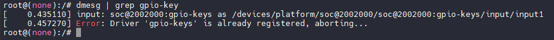

:::

:::

#### 配置按键唤醒源设备树

# WUPIO 配置向导

## Step 1: 选择作为 WUPIO 的引脚

PL1
PL2
PL3
PL4
PL5
PL6
PL7

设备树配置唤醒按键，这里以 PL7 作为示例，PL7 可作为普通按键和 WUPIO。在系统正常启动使用的时候，是作为普通按键，当系统进入休眠自动注册为 WUPIO。

board.dts

```c
#include <dt-bindings/input/linux-event-codes.h> // 导入 linux,code = <KEY_POWER>; 的定义

&soc {
	gpio-keys {
		compatible = "gpio-keys";
		status = "okay";
		wakeup_io = <&wakeup_pin1>;
		power {
			label = "Power";
			gpios = <&rtc_pio PL 7 GPIO_ACTIVE_HIGH>;
			linux,code = <KEY_POWER>;
			debounce-interval = <30>;
			status = "okay";
		};
	};
};

&wakeup_io {
	status = "okay";
	wakeup_pins {
		wakeup_pin1:wakeup-pin@1 {
			gpio_info = <&rtc_pio PL 7 GPIO_ACTIVE_HIGH>;
			edge_mode = "positive";
			clk_src = <0>;
			debounce_us = <2000000>;
			share-io;  // 共享 IO
			status = "okay";
		};
	};
};
```

如果该 WUPIO 是专用的，例如外挂 WIFI 的唤醒源，则不需要配置共用功能。配置如下（这里以 PL5 为例）：

```c
&wakeup_io {
	status = "okay";
	wakeup_pins {
		wakeup_pin1:wakeup-pin@1 {
			gpio_info = <&rtc_pio PL 5 GPIO_ACTIVE_HIGH>;
			edge_mode = "positive";
			clk_src = <0>;
			debounce_us = <2000000>;
			status = "okay";
		};
	};
};
```

如果既有专用 IO，也有共用IO，则配置如下：

```c
#include <dt-bindings/input/linux-event-codes.h> // 导入 linux,code = <KEY_POWER>; 的定义

&soc {
	gpio-keys {
		compatible = "gpio-keys";
		status = "okay";
		wakeup_io = <&wakeup_pin1>;
		power {
			label = "Power";
			gpios = <&rtc_pio PL 7 GPIO_ACTIVE_HIGH>;
			linux,code = <KEY_POWER>;
			debounce-interval = <30>;
			status = "okay";
		};
	};
};

&wakeup_io {
	status = "okay";
	wakeup_pins {
		wakeup_pin1:wakeup-pin@1 {
			gpio_info = <&rtc_pio PL 7 GPIO_ACTIVE_HIGH>;
			edge_mode = "positive";
			clk_src = <0>;
			debounce_us = <2000000>;
			share-io; // 共享 IO
			status = "okay";
		};
		
		wakeup_pin2:wakeup-pin@2 {
			gpio_info = <&rtc_pio PL 5 GPIO_ACTIVE_HIGH>;
			edge_mode = "positive";
			clk_src = <0>;
			debounce_us = <2000000>;
			status = "okay";
		};
	};
};
```

:::warning

:::note

注意

:::
:::note

`gpio-keys` 的配置不要分开写，如果有多个按键请写在一起，像这样有两个 `gpio-keys` 节点会只使用后面定义的节点的配置，导致解析错误。

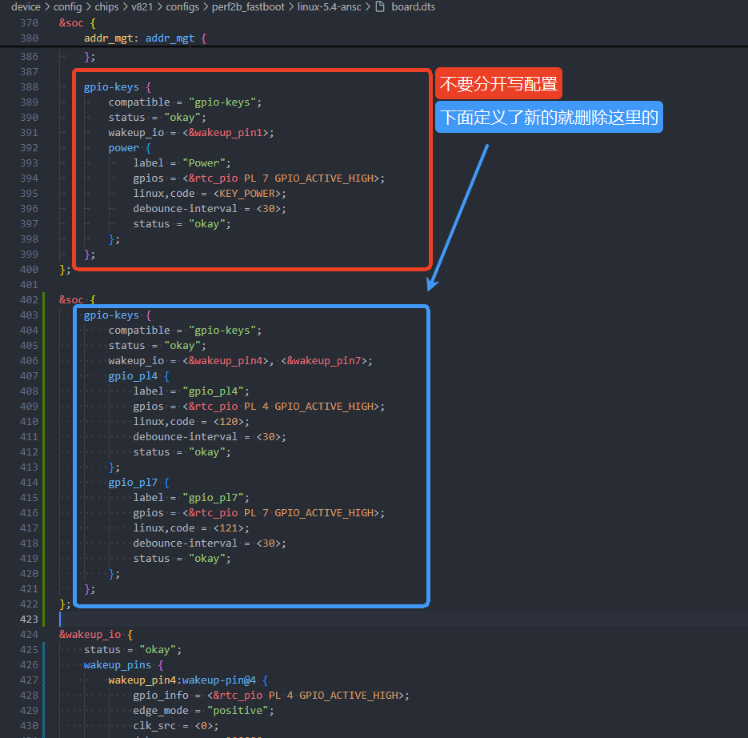

解析错误报错如下。

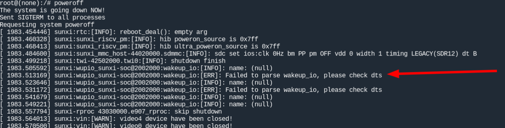

:::

:::

### RTOS 端软件配置

RTOS 端需要启用 PM 框架，配置相关功能，执行 `mrtos menuconfig`

```
System components  --->
	aw components  --->
		[*] PowerManager Support  --->
			--- PowerManager Support
			(0x02000000) PM Firmware's space base
			(0x21c00) PM Firmware's space size
			(0x81244000) Rtos firmware reserved memory address
			(500) Dram power open dration of us
				Select standby load storage type (SPINOR)  --->
			[*]   pm_standby_memory
			(plat_sun300iw1p1) pm plat name
			[ ]   Set CPU to VF 2_1 (1200MHz/1.00v)
			[*]   pm enable pmc
			[ ]   pm pmc using PL6 GPIO as power ctl
```

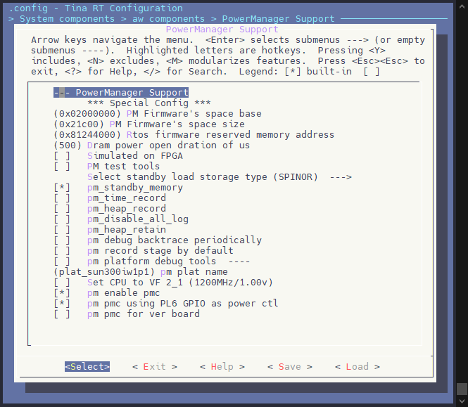

以下是关于配置项的说明表：

| 配置项 | 描述 |
| --- | --- |
| (0x02000000) PM Firmware's space base | PM固件的空间基地址，表示固件在内存中的起始地址。这里运行在 SRAM 中 |
| (0x21c00) PM Firmware's space size | PM固件的空间大小，以字节为单位，指示固件在 SRAM 内存中所占用的大小。 |
| (0x81244000) Rtos firmware reserved memory address | 实时操作系统（RTOS）固件保留的内存地址，用于系统唤醒后加载 RTOS 固件。需要与设备树中 `e907_mem_fw` 配置项对应 |
| (500) Dram power open duration of us | DRAM供电开启持续时间，以微秒为单位，指示系统初始化和内存供电的持续时间。与外部 DCDC 上电时间强相关，一般建议留有裕度，否则会造成休眠唤醒失败。 |
| Select standby load storage type (SPINOR) | 选择待机时加载的存储类型，这里使用 SPINOR。 |
| \[\*\] pm\_standby\_memory | 指示启用待机模式时使用内存 SRAM，需要勾选。 |
| (plat\_sun300iw1p1) pm plat name | PM平台名称，描述当前正在使用的电源管理平台的版本或型号。**不用修改**。 |
| \[ \] Set CPU to VF 2\_1 (1200MHz/1.00v) | 如果方案配置 CPU 运行频率最高 1.2GHz，需要勾选这个配置。 |
| \[\*\] pm enable pmc | 选项，表示启用电源管理控制器（PMC）以管理设备的电源状态。**使用休眠唤醒必须启用PMC相关功能** |
| \[ \] pm pmc using PL6 GPIO as power | 表示PMC使用PL6 GPIO引脚控制电源，**若硬件没有使用PMC且PL6不需要控制外部电源则无需配置** |

然后需要开启休眠唤醒相关的外设驱动：

```
CONFIG_DRIVERS_PRCM
CONFIG_DRIVERS_RTC_WATCHDOG
```

启用 PRCM 控制器驱动，`mrtos menuconfig`

```
Drivers Options  --->
	soc related device drivers  --->
		PRCM Devices  --->
			[*] enable prcm driver
```

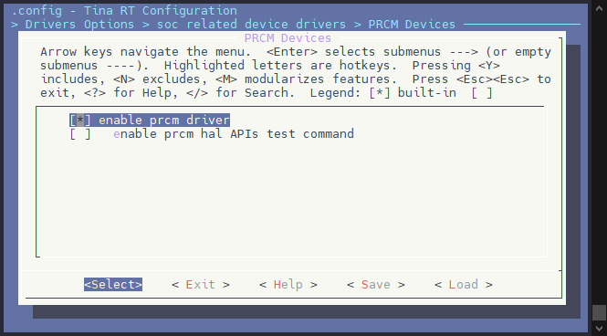

启用 RTC\_WATCHDOG 相关驱动

```
Drivers Options  --->
	soc related device drivers  --->
		RTC WATCHDOG Devices  --->
			[*] enable rtc watchdog driver
```

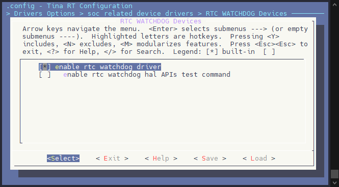

另外还需要配置休眠内存分配，需要修改板级对应的链接脚本，将不需要休眠的数据放到非休眠内容段内。这里以 perf2b 板级为例，修改文件

:::warning

:::note

注意

:::
:::note

此部分仅为示例实现，具体使用到需要保留现场的函数需要根据 RTOS 开发功能而定。

:::tip

:::note

提示

:::
:::note

完整的配置可以参考已经配置休眠唤醒的板级。

:::

:::

:::

:::

rtos/lichee/rtos/projects/v821\_e907/perf2b/freertos.lds.S

```c
OUTPUT_ARCH("riscv")
OUTPUT_FORMAT("elf32-littleriscv","elf32-littleriscv","elf32-littleriscv")

/* Linker script to configure memory regions. */
MEMORY
{
	RAM (rwx)   : ORIGIN = CONFIG_ARCH_START_ADDRESS, LENGTH = CONFIG_ARCH_MEM_LENGTH
}

__RAM_BASE = ORIGIN(RAM);
__MSP_STACK_LENGTH = 0x100;

ENTRY(_start)

SECTIONS
{
	.flash_driver :
	{
		/* this section must be the first section which is before bss section,
		* it is used for flash driver which is shared for rtos and pm_standby firmware,
		* in standby wakeup process, firmware will load rtos without this section,
		* so flash_bin section must 512 byte align, because a flash section is 512 byte,
		* to avoid memory cover
		*/
		. = ALIGN(512);
		__flash_driver_start__ = .;
		KEEP(*(.flash_bin))
		. = ALIGN(512);
		__flash_driver_end__ = .;
	} > RAM

	.text :
	{
		. = ALIGN(4);
		__text_start__ = .;
		KEEP(*(.start))
		*(.vectors)
		*(*.text)
		*(.text*)
		*(.nonxip_text*)
		*(.sram_text*)
		KEEP(*(.init))
		KEEP(*(.fini))

		/* .ctors */
		*crtbegin.o(.ctors)
		*crtbegin?.o(.ctors)
		*(EXCLUDE_FILE(*crtend?.o *crtend.o) .ctors)
		*(SORT(.ctors.*))
		*(.ctors)

		/* .dtors */
		*crtbegin.o(.dtors)
		*crtbegin?.o(.dtors)
		*(EXCLUDE_FILE(*crtend?.o *crtend.o) .dtors)
		*(SORT(.dtors.*))
		*(.dtors)

		*(.rodata*)
		*(.srodata*)
		*(.nonxip_rodata*)
		*(.sram_rodata*)

		KEEP(*(.eh_frame*))

#ifdef CONFIG_PMP_ADDR_ALIGN
	. = ALIGN(CONFIG_PMP_ADDR_ALIGN);
#else
		. = ALIGN(4);
#endif
		__text_end__ = .;
	} > RAM

	__etext = .;
	_sidata = .;
#ifdef CONFIG_PM_STANDBY_MEMORY
	.data_saved :
	{
		. = ALIGN(4);
		__stby_saved_data_start__ = .;
		KEEP(*(.standby_saved_data))
		__stby_saved_data_end__ = .;
	}  > RAM

	.data_unsaved :
	{
		. = ALIGN(4);
		__stby_unsaved_data_start__ = .;
		*(.standby_unsaved_data*)
		*build/RTOS_TARGET_PROJECT_PATH/drivers/rtos-hal/hal/source/ccu/?*(.data*)
		*build/RTOS_TARGET_PROJECT_PATH/components/common/aw/multi_console/?*(.data*)
		*build/RTOS_TARGET_PROJECT_PATH/components/common/thirdparty/openamp/?*(.data*)
		*build/RTOS_TARGET_PROJECT_PATH/components/common/aw/rpbuf/?*(.data*)
		*build/RTOS_TARGET_PROJECT_PATH/components/common/aw/pm/common/pm_testlevel.o(.data*)
		*build/RTOS_TARGET_PROJECT_PATH/components/thirdparty/console/commands/?*(.data*)
		. = ALIGN(16);
		__init_process_stack_start__ = .;
		. += 4096;
		__init_process_stack_end__ = .;
		. = ALIGN(16);
		__freertos_irq_stack_bottom = .;
		. += 4096;
		__freertos_irq_stack_top = .;
		PROVIDE( __global_pointer$ = . + 0x400 );
		__stby_unsaved_data_end__ = .;
	} > RAM
#endif
	.data :
	{
		. = ALIGN(4);
		__data_start__ = .;
		_sdata = .;

		*(vtable)
		*(.data*)
		*(.sdata*)
		*(.nonxip_data*)
		*(.sram_data*)

		. = ALIGN(4);
		/* preinit data */
		PROVIDE_HIDDEN (__preinit_array_start = .);
		KEEP(*(.preinit_array))
		PROVIDE_HIDDEN (__preinit_array_end = .);

		. = ALIGN(4);
		/* init data */
		PROVIDE_HIDDEN (__init_array_start = .);
		PROVIDE(__ctors_start__ = .);
		KEEP(*(SORT(.init_array.*)))
		KEEP(*(.init_array))
		PROVIDE(__ctors_end__ = .);
		PROVIDE_HIDDEN (__init_array_end = .);

		. = ALIGN(4);
		/* finit data */
		PROVIDE_HIDDEN (__fini_array_start = .);
		KEEP(*(SORT(.fini_array.*)))
		KEEP(*(.fini_array))
		PROVIDE_HIDDEN (__fini_array_end = .);

		KEEP(*(.jcr*))
#ifndef CONFIG_PM_STANDBY_MEMORY
		. = ALIGN(16);
		__init_process_stack_start__ = .;
		. += 4096;
		__init_process_stack_end__ = .;
		. = ALIGN(16);
		__freertos_irq_stack_bottom = .;
		. += 4096;
		__freertos_irq_stack_top = .;
		PROVIDE( __global_pointer$ = . + 0x400 );
#endif
		. = ALIGN(4);
		__data_end__ = .;
		_edata = .;
	} > RAM

	.version_table : {
	KEEP(*(.version_table))
} > RAM

	.resource_table : {
	KEEP(*(.resource_table))
} > RAM

	.digest : ALIGN(4)
{
	_digest_start = ABSOLUTE(.);
	KEEP (*(.digest))
	. = ALIGN (4);
	_digest_end = ABSOLUTE(.);
} > RAM

.FSymTab : {
		_syscall_table_begin = .;
	KEEP(*(FSymTab))
	_syscall_table_end = .;
} > RAM

.VSymTab : {
		__vsymtab_start = .;
	KEEP(*(VSymTab))
	__vsymtab_end = .;
} > RAM

.ttcall : {
		_tt_begin = .;
	KEEP(*(ttcall))
	_tt_end = .;
} > RAM

#ifdef CONFIG_COMPONENTS_AMP_USER_RESOURCE
	.amp_user_rsc (NOLOAD):
	{
		. = ALIGN(4);
		__amp_user_rsc_start__ = .;
		*(.amp_user_rsc)
		. = ALIGN(4);
		__amp_user_rsc_end__ = .;
	} > RAM
#endif

	.heap (COPY):
	{
		__end__ = .;
		__heap_start__ = .;
		_heap_start = .;
		end = __end__;
		*(.heap*)
		__HeapLimit = .;
	} > RAM

	/* .stack_dummy section doesn't contains any symbols. It is only
	* used for linker to calculate size of stack sections, and assign
	* values to stack symbols later */
	.stack_dummy (COPY):
	{
		*(.stack*)
	} > RAM
#ifdef CONFIG_PM_STANDBY_MEMORY
	.bss_saved :
	{
		. = ALIGN(4);
		__stby_saved_bss_start__ = .;
		KEEP(*(.standby_saved_bss))
		__stby_saved_bss_end__ = .;
	}  > RAM

	/* .bss_usnaved section must at last, but before .bss section, because .bss_unsaved section is NOLOAD */
	.bss_unsaved (NOLOAD):
	{
		. = ALIGN(4);
		__stby_unsaved_bss_start__ = .;
		*(.standby_unsaved_bss*)
		*build/RTOS_TARGET_PROJECT_PATH/drivers/rtos-hal/hal/source/ccu/?*(.bss*)
		*build/RTOS_TARGET_PROJECT_PATH/components/common/aw/multi_console/?*(.bss*)
		*build/RTOS_TARGET_PROJECT_PATH/components/common/thirdparty/openamp/?*(.bss*)
		*build/RTOS_TARGET_PROJECT_PATH/components/common/aw/rpbuf/?*(.bss*)
		*build/RTOS_TARGET_PROJECT_PATH/components/common/aw/pm/common/pm_testlevel.o(.bss*)
		*build/RTOS_TARGET_PROJECT_PATH/components/thirdparty/console/commands/?*(.bss*)
		__stby_unsaved_bss_end__ = .;
	} > RAM
#endif
	.bss (NOLOAD):
	{
		. = ALIGN(4);
		__bss_start__ = .;
		_sbss = .;
		*(.bss*)
		*(.sbss*)
		*(COMMON)
		*(.nonxip_bss*)
		*(.sram_bss*)

		. = ALIGN(4);
		__bss_end__ = .;
		_ebss = .;
	} > RAM

	. = ALIGN(8);

	/* Set stack top to end of RAM, and stack limit move down by
	* size of stack_dummy section */
	__StackTop = ORIGIN(RAM) + LENGTH(RAM);
	_estack = __StackTop;
	__heap_end__ = _estack - __MSP_STACK_LENGTH;
	_heap_end = __heap_end__;
	__StackLimit = __StackTop - SIZEOF(.stack_dummy);
	PROVIDE(__stack = __StackTop);

	/* Check if data + heap + stack exceeds RAM limit */
	ASSERT(__StackLimit >= __HeapLimit, "region RAM overflowed with stack")
}
```

增加了 `data_saved` 和 `data_unsaved` 段配置

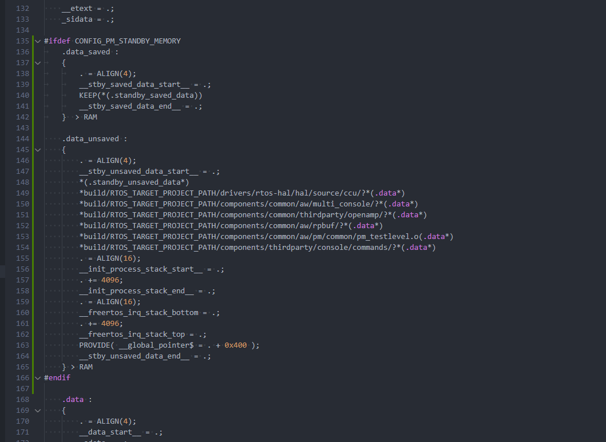

增加了栈指针导出

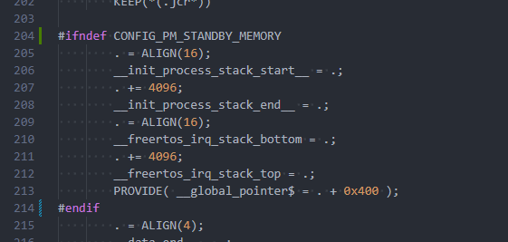

增加了 `bss_saved` 和 `bss_unsaved` 段配置

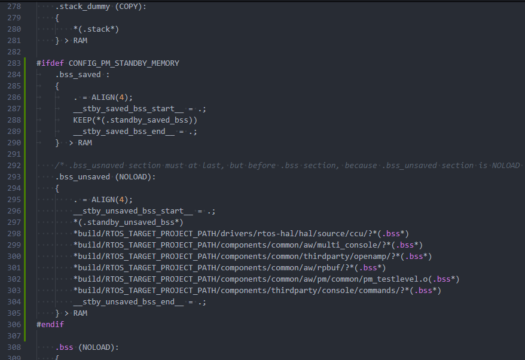

另外方案对应的 main.c 函数也需要增加 PM 会使用到的 `init_openamp`，`deinit_openamp_sync` 函数功能，这两个函数不可在线程中运行，必须同步阻塞运行。

例如这里在 `rtos/lichee/rtos/projects/v821_e907/perf2b/src/main.c` 中实现的功能：

:::warning

:::note

注意

:::
:::note

此部分仅为示例实现，具体使用到需要初始化与反初始化的函数需要根据 RTOS 开发功能而定。

:::tip

:::note

提示

:::
:::note

完整的配置可以参考已经配置休眠唤醒的板级。

:::

:::

:::

:::

需要增加的内容已在下方示例代码中高亮说明：

rtos/lichee/rtos/projects/v821\_e907/perf2b/src/main.c

```c
#include <stdio.h>
#include <stdint.h>
#include <string.h>
#include <unistd.h>
#include "interrupt.h"
#include <portmacro.h>
#include "FreeRTOS.h"
#include "task.h"
#include <hal_time.h>

#include <console.h>

#ifdef CONFIG_DRIVERS_MSGBOX
#include <hal_msgbox.h>
#endif

#ifdef CONFIG_COMPONENTS_PM
extern int pm_init(int argc, char **argv);
#endif

#ifdef CONFIG_GEN_DIGEST
/* format: 4bytes image size + 16bytes digest */
__attribute__((section(".digest"))) const unsigned char digest_data[20];
#endif

#ifdef CONFIG_COMPONENTS_OPENAMP
#include <openamp/sunxi_helper/rpmsg_master.h>
#include <openamp/sunxi_helper/openamp.h>

#ifdef CONFIG_COMPONENTS_RPBUF
extern int rpbuf_init(void);
#endif

void init_amp_app(void)
{
#ifdef CONFIG_COMPONENTS_AMP_USER_RESOURCE
	extern void show_all_user_resource(void);
	show_all_user_resource();
#endif

#ifdef CONFIG_RPMSG_CLIENT
	rpmsg_ctrldev_create();
#endif

#ifdef CONFIG_RPMSG_HEARBEAT
	extern int rpmsg_heart_init(void);
	rpmsg_heart_init();
#endif

#ifdef CONFIG_MULTI_CONSOLE
	extern int multiple_console_init(void);
	multiple_console_init();
#endif

#ifdef CONFIG_COMPONENTS_RPBUF
	rpbuf_init();
#endif
}

void deinit_amp_app(void)
{
#ifdef CONFIG_COMPONENTS_RPBUF
	extern void rpbuf_deinit(int rproc_id);
	rpbuf_deinit(0);
#endif

#ifdef CONFIG_MULTI_CONSOLE
	extern int multiple_console_deinit(void);
	multiple_console_deinit();
#endif

#ifdef CONFIG_RPMSG_HEARBEAT
	extern int rpmsg_heart_deinit(void);
	rpmsg_heart_deinit();
#endif

#ifdef CONFIG_RPMSG_CLIENT
	rpmsg_ctrldev_release();
#endif

#ifdef CONFIG_RPMSG_NOTIFY
	extern int rpmsg_notify_deinit(void);
	rpmsg_notify_deinit();
#endif
}

void init_amp_framework(void)
{
#if defined(CONFIG_ARCH_RISCV_PMP) && !defined(CONFIG_PMP_EARLY_ENABLE)
	__attribute__((__unused__)) int pmp_ret;

#ifdef CONFIG_COMPONENTS_RPBUF
	extern int set_pmp_for_rpbuf_reserved_mem(void);
	pmp_ret = set_pmp_for_rpbuf_reserved_mem();
	if (pmp_ret)
	{
		printf("set PMP for rpbuf reserved mem faild, ret: %d\n", pmp_ret);
	}
#endif

#endif

	openamp_init();
}

void deinit_amp_framework(void)
{
	openamp_deinit();
}

void openamp_init_thread(void *param)
{
	(void)param;
	init_amp_framework();
	init_amp_app();

#ifdef CONFIG_INIT_NET_STACK
	extern int xradio_link_init(int pm_flag);
	xradio_link_init(0);
#endif
#ifdef CONFIG_DRIVERS_V821_USE_SIP_WIFI
	extern int xradio_rpmsg_create(void);
	xradio_rpmsg_create();
#endif

	hal_thread_stop(NULL);
}

void pm_openamp_init_thread(void *param)
{
	(void)param;
	init_amp_framework();
	init_amp_app();

#ifdef CONFIG_INIT_NET_STACK
	extern int xradio_link_init(int pm_flag);
	xradio_link_init(1);
#endif

	hal_thread_stop(NULL);
}

void openamp_deinit_thread(void *param)
{
	(void)param;

	deinit_amp_app();
	deinit_amp_framework();

	hal_thread_stop(NULL);
}

int init_openamp(void)
{
	void *thread;
	thread = hal_thread_create(pm_openamp_init_thread, NULL,
							"amp_init", 8 * 1024, HAL_THREAD_PRIORITY_SYS);
	if (thread != NULL)
		hal_thread_start(thread);
	else
		return -1;

	return 0;
}

int deinit_openamp(void)
{
	void *thread;
	thread = hal_thread_create(openamp_deinit_thread, NULL,
							"amp_deinit", 4 * 1024, HAL_THREAD_PRIORITY_SYS);
	if (thread != NULL)
		hal_thread_start(thread);
	else
		return -1;

	return 0;
}

int deinit_openamp_sync(void)
{
#ifdef CONFIG_DRIVERS_V821_USE_SIP_WIFI
	/* todo: implement this function */
	//xradio_rpmsg_relaese();
#endif

#ifdef CONFIG_INIT_NET_STACK
	extern void xradio_link_deinit(void);
//	xradio_link_deinit();
#endif
	deinit_amp_app();
	deinit_amp_framework();

	return 0;
}
#endif

#ifdef CONFIG_COMMAND_AUTO_START_MEMTESTER
static void auto_memtester_thread(void *param)
{
	extern int cmd_memtest();
	cmd_memtest();
	hal_thread_stop(NULL);
}
#endif

#ifdef CONFIG_COMPONENTS_TCPIP
extern void cmd_tcpip_init(void);
#endif

void cpu0_app_entry(void *param)
{
	(void)param;

#ifdef CONFIG_COMPONENTS_PM
	pm_init(1, NULL);
#endif

#ifdef CONFIG_COMPONENTS_OPENAMP
	void *thread;
	thread = hal_thread_create(openamp_init_thread, NULL,
							"amp_init", 8 * 1024, HAL_THREAD_PRIORITY_SYS);
	if (thread != NULL)
		hal_thread_start(thread);
#endif

#ifdef CONFIG_COMPONENTS_TCPIP
	//tcpip stack init
	cmd_tcpip_init();
#endif

#if defined(CONFIG_COMPONENT_CLI) && !defined(CONFIG_UART_MULTI_CONSOLE_AS_MAIN)
	vCommandConsoleStart(0x1000, HAL_THREAD_PRIORITY_CLI, NULL);
#endif

#ifdef CONFIG_COMMAND_AUTO_START_MEMTESTER
	void *autotest_thread;
	autotest_thread = hal_thread_create(auto_memtester_thread, NULL,
			"auto_memtester", 8 * 1024, HAL_THREAD_PRIORITY_SYS);

	if (autotest_thread != NULL)
		hal_thread_start(autotest_thread);
#endif

	vTaskDelete(NULL);
}
```

:::warning

:::note

注意

:::
:::note

如果启用了小核压缩 & 自解压功能，PM 功能将不可用，需要配置小核镜像非压缩。执行 `mrtos menuconfig`

```
Kernel Options  --->
	[*] kernel Compress Support  ---> (取消勾选)
```

小核关闭压缩后可能分区表配置放不下，报错如下：

![image-20250430095733175](data:image/png;base64,iVBORw0KGgoAAAANSUhEUgAAAdQAAAB3CAYAAAC62LGYAAAep0lEQVR4nO2dT2gbWZ7Hv3aiGDwQcpjkYG+jTMmXZS9GeNLsJbWTdfXMpXvo2NfoogUppHPIQVZgURZaDLTkgYb2BEsHsYv6aqXp7ks6ZXpWfVkmbYwvzVwsjUWPfUgO2xOYsI6TeA9VkqpK9VdVpX/+fsBg+9V771e/91RP70/9vlM///nPTwHg97//PT777DNoefl/5+GIlMNeqoWV1SoazlfbIyRQ2xIhryZRavotbByIIiYAaLb8+84lMQFoGH0rRIFmCwAgFbaxjipWslU0BBHrWzkgu4yMPCADCSFkTJn2nkXE+tY29na3sbdbQVowSd9tp+cgGVJjUg613W7+dSlqWVMsVVHK6KnDAiGB2m4OkraOLUN+QUS6UFHr30atkEBMl7+C9UJFsS2VUMvJae4zCkmXX+zmd4WI9d0c0qkKarsPUCw+UGzWpfvxn9E+/f0VtwxlCgnUthLq/0S8J7VQKqtfjpp1lMotSMuipzskhJCziOcBVSrkIDXyWIkvY3G1CkjGh20dmfgyFuN59E5qRKQLVyFnl7EYX8Zi/GM8WRZ7Bg1AGUyL0gEy8TxkT7NVEenl77AWX8ZiPIlMQ8R6qmujJF0Htj9W609CRgK1gv4eGuUkVsqAlIqiFF9GRhYhqQOXVKgoM7h2/lgOxVS0Y/NeZ7DT/6zrblKEJFSxFk9iZTWJxdWqxlf+/CcVKliP1ZFZVa5Z2wak9gXNOuSmiPc0GWKSiJj8nVKXEIWAA90MttE8AGJRj18aCCHk7OFxQG3PYOqaGUzdY5VRSIKoLHWiBTlb7Rk4YqkKaqkDlFbNBhUnWpDb9qEFebuuGxDkch4ludW5tmRIhzqgNJoHQLMF/VhuuH8ov8ckZZbaKCfVga73R79kqrURneVWd9j5T7Vvrdr5EtKQqyh1LmhBlrUzThHpVFTxkaGO9NY2auoXBWWgJYQQYoe3AdVkBuONOjKrVTSlBIpb6pJlymTJMnaABvQzKfc42CclUNvSzB4LHpYzhSgEdbDpK79vHPznon0a5SpkKaEsYUvXITW1A26bFkqry1gpqwN9zxcLQgghRlycOtLQbKEJZXbkbRlWW0YVmdUqAHU/sJCAVNbORFsoreVRigF7hQrSjSAPKIlYLyTQzCax0p6lSjnspdza3kITdZRMl2PbM2vzPWE5qIM9dv5z1T51PJFzSEtRNAQRDTmpmykb88eEq0Dju4EdmiKEkHHF45JvHU/kKNIp9SCOICKdspuhXVWXJlWEBNZTLg/xyHlk5CjSxUTA+3ctNKAOpo72G6njiSxiXXMQKSYlOnu07pd83eLVf2r7FBOdg1gxKYG0YaYvb9cRkxJ4T1KWgHvypxKa9jVbEiaEEGLE86EkOZtEKaaeNN1KALLVw7aOTPYAkro8WktFgWYVJVxHsX0CNQXbfVI5m0QJic6hH//UUSofQCqoy7XF62hY2m9tUwaJzknb4jLwxGMZbm3tx39yVj2ItdW1TzY6WP4OsiBCatZ7ZrKKz8Vu+5aTfGWGEEJcMOX7PVRCCCGE9PMeKiGEEEKMcEAlhBBCAoADKiGEEBIAHFCdkHLY21JOveojIfWGBfSEkOiGcNwyO8kchSTpIxQFWj+xx7F9hk1v/5h02P/JqMMB1QOd12ICEAKQUgkIsk15goh0IaGLUBRk/cQex/YZNib9Y9Jh/yejjrdjvBcv48/vzPb8+/GPLdx7YZZ+gv3nP+H9Zy8t8hvSAQARfPTOZdy5GAEA7L94jns/vsS+6/zjQBSxGNDctgk52KxiJT44iyaHKNKFB0hLUSghHj9GpuwltKNShmP7DJth9g8ph70ClDjbQzKBkFGkjxnqS9z7oYV/1Pzce2GRvv8T9i9fxtdXIq7Tf/POHO7gJ7z/Qwv/+MMRvpm5jE895CeTRBQxwbDsbTYlE7rvKUuFCtKod8UbUhWDMAEhbXr7FyF+CHfJ9/glHj4/wcKMxYDXkz6LX188wcNn6owUJ/jDs5dYuPgzLHgqX5VA62vvy0mezg/tOMBKuZ0AEzo77eXb3NThS17Oj7ydKp+XTnUl5gKVtwtdfs5N+9j7N5aq6K9Xfea2HznL89n1D22aVR/20T8Etb0Lor4uXTzrqKH/GMt3SveJXf8F4CyfqI3VXUE6lfPU/uRsE+6AOjOLOxcjePw3iyVZY/rMBSzgBPvHmmuOT7A/EzEfUJ3K7wNneTo/KEHnF+NKfOKODJtuT8hOvs0ZO3k5V/l9ytsBItKCKp+3mvdcf7sMU3m70OXnnNvHyb+NchKZRju6l4j1LSV2tLt41G7kDe36RztN+Vkpt1Sfda/w1T+aar5sXV9XthspTFkhUK8zaX+ndL+46b928olSoYK0zeff7+eLTDZ9DKiz+PSfovhz52cOH81YpC9cAp4dGZaEndI91G+ZX/2wez68EIQ83TCxl5dzgz95u26dWv95qb9dhrm83bDl59z5V87m0UxVUNvKQZLzHkM3OssbukLKoZY6QEb3GfDfP+wx//x0y3dK949z/1X+b96/nD7/YfuPjDt9xBZ8iXs/PMdjF+kLV+bw9TuX8I3ueqd09/X3l98GdYbzZFy1ylR5OWlrG2nt/5tV92VICdRSCf1epZf8vuT9nGmUq5B3E0iX6yjFFPm5FQv5uRIASAhOfs61f+solRNKrOU1L1/I6sisRrFeTKCYyiHW76EqIYFa4SpKq0n9YBxE/7Ct1+HzM4jPl5/+68r+EP1Hxp5Qg/XuP3uOhxfncOdKBI+fnTinH7/CPmaxMAOgvew7E8HC8Ym6p+ql/ChiaHmboQYhTzdMHOTlnPEpbwegrZATnv+GKD/n1r9CAsXUAUrlq0gXE5C9rJQ4yhs60V5mXu5dZvbdPxxw+vyE/vkKQp7Ryf4Q/UfGnpDfQ1UPFV2+hN+4Sn+Jb15EcOfKrLpnGsFHV2ax/+LvpgOqdfki1ncrhsMGbnApT6d+8PoTQPfCVfNTrZb128vLucOPvB0A9PqvIdcDfW/Qv/ycevDM84ESN/5tD2h5lNT91N49PAu8yBsC6O0fUaRtl5mD6B8AGi00TPum+een2/5O6S6x/fz5lWe0+/wH5D8ysQSwhxq1f23lxd/xGLO4Y3WNIf3xj0d4iEv4Wt2f/fXxc9wzmd3al3+ARrOFRvuwigfcydPVkcnWIRQ00mqBYyLf5qJ+f/Jy/uXtgDpKTVVibks54LXm+T1QB4KQnxMAxLy3m5N/pYJ+QJOzechSzt2rO57kDU36hyAqOrhSzvKUbyDyg80qSjK6p2E1Xxjakos1i/Z3SneHVf8PRp6x8/kvXu/5/A9OvpGMI5RvI8EhJFDbio7JkpgS+IEQW6Qc9lItrDA6E3EBQw+SMwoHU2KClNC8+xsNZcuCTC6cgpIBobxQb7ny2axyFkCGj1zHk8ID7BWUQbUhh7BlQSYWLvkSQgghAcAlXysor0bCZOTl4QghXuEU1IKOfJfVco8gIl2IoiTnO8uUjXISi2V0DucQYoVj/yKEjB2UbzOF8mrEijMiD0cI8Qzl28gZhvJwhJDgoHybjiHLq6nyZ5JWwmsrp7ys37nGh7yaU/2DgPJwQ5WHI4SEB+XbdIyCvJqI9LIqfxZPItMQdaHN/Mqr+ZGf0h+60v+4naVRHm6Y8nCEkDChfNtAcSP/pJWWailxaDUPbH/yav7kpxrlZEdr0/jjVqKM8nB2DEIejhASFpRvGySu5J8c5M98y1MNWX6K8nDWhC4PRwgJE8q3DZJhy6v5rD+WqlgKAchZN7NUysPZMgh5OEJIaFC+zRfjJq/mr/4glnwpD2dHyPJwhJBQoXxb34ynvNpw5acoD+dYdZjycISQUGEsXzI+UB6OEDLCMJYvIaHAwZSQswanoGRCoDwcIWS4cEAl44Nt/OQ6MnG+QkIIGR5c8nVCynVCvQUqzzb28nC99hFCyFmGA6oHOq+NBLB02JHvsipPEJEuJHQReIKs3zcm9o0VghjuF4KwyyeEjByUbxsKEyAPN+r22SJifSsHCXVkNHq2AABBxHqxK0jQkKtYy2q+wOjSW2iUq1gpm72HalH+KCDlsFcAMmNxWpqQ8YHybeSMEUV6KwdBrpsMJlGkizkIjbwmOL02cIKa3l5ZiH9s8g6oXfmTRq/8HSFnGcq39SB29zYDl8UasjycC2Ja6bjdCtYlY3ACO/u0aVY+HLJ8HADIeaxkvzNJUCJfNbc14gTaSEmCCElQJNugppfKdUgpQz+zLN8ZZ/87+c+YbpR6UyI46dpKF2kpapDXM5ZvI39HyBmH8m0GpIISfacjIC0FGdZtFOTh7BCRLlzt2hX/GE+WRcPD0s6+dprys1JuqZJowdgXhHxcexA0p44nMiAstwcR5eBVo3ngtnCH8p1w9r+T/6RCBeuxOjKrShlr24DULqCp5svWoWurbF2XP90u31Iez0L+jpAzDuXbdBjks1R5sPHBnzybQhSSIKoxiluQs30+LKUcaqkDZHRtMHz5OCfkrKrRqs4QdaENVb3UdGeAUeIKByffppRp7X8n/6npa9XOl5iGXEXJtW/M+39v+1jJ3xFytqF8mxZVQPrJuIo1+5ZnqyOzGsV6MYFiKocYWpDLHyPjNVaukECtcBWl1aR+MB4F+ThbokhvVRCTk1iMtwBEIaUeoFaAOotTBqtYsaIo5DTrKMl1QApIvs3J/07+89t/x73/EzJkKN+mxUSea6zwLQ8HoFlFZlV5QMekHGqFBKSyl/LaaijLKBl9OHT5OAdM9khluY7G1nVIWfWQkcY/bZvSQcm3Gcrv8b+T//z233Hv/4QMGcq36WjLc+nlwXqwlGcLmgHLwwnKte6Xh432KSdctWooQdoX+pJv26+aJV1JEhHTCIjHUonOKzUxKYGiqXxbnzj638l/av8t6m1MG/tJo4WGad8y7/9By+MRMqlQvs2AnE2iFMt15blM5cWs5dmCYwjycM0qSlCl0Xa3UUsBpVWr2aSJfYKoPMilnOUp3+HKxwHd0605SLrf1XtarQJSRXPK9gCZte4+cKPcwnvF9j2Lyv3Ibst3wIX/nfwnZ5PINLon1YvLgGxswKayr5re6j3lq8jTqeWHJY9HyIRC+TZCCCEkABh6kBBCCAkATkEDY9Tlw0bdPkIIGW84oAbGqMuHjbp9hBAy3nDJd2KhvBohhAwSDqiTyqTLq1EejRAyYlC+bRgMQj5rUuXVbNOVSEf6YPx1nZ9jUg7FznucLcjZj5GRR+y1EMqrETKWhBp6EDOz+HThMr7GEd7vvEtqn67Itz3H+z+8xD4i+GhhDp9ecZ9/tIgqL883PUZsOtNo5M9MT1A5pSsBIFbM3p0UEkgvf4e11TwaTeXv2lYF6wguFvBowf5HyCChfJsWIYHabg7pVFdCq0e+ShAN8lbGOmzkrVzJZ9lztuXVXKZb0awik60rg6n6d0kGBMF9YA7KqxFCrAj3lG9bXs1qSdaYrsq3fWMh39YTftCp/L4QkRbyWInn0RBEpIs5FFMHnRmPJF0Htj/GYlYJnp4uVFArtHQSWIq8VR5rcTVkW/uB3axiJV71saTXlfdakQHl4SxCkrWKJO3TvCLWd68b8utP+sZSFdQkM3m1PFbidTTUJVTt/dsRTKzdlhpL1+pLhlO6KvOWUq61D+4fRSwGNLfdLvk6+9/Jf4q8mhKvV24qoQElCWjIcNU/FHk1tXyT/tm207T/EUJCpY8BVQk9+Gnn7xM83D/CH47N0k/w+Edz+TbrdC/1W+X384qIUb7quhLbtKy8oynrAsW3UNquI51SDsc0NP8PT95KkfeShToaTUXeqy/a8mpxE3m1Vb08mPb+7WiUk1gs92dOMCh6syX1r5iUQLFQwXrTfDCXChWkG3ksevpWY+d/J/+10/Xyau6XYw3lm/TPth8or0bI4KF8Ww8H3SVBM6QEaqmEPrD4wOTHzrq8mjcachVrgojastgTk7k9U1xZ9fLFi/JqhBBrKN/Ww1Ub+SoR64UEmtkkVtonQ6Wcurw4IM6yvFpAKINpvb/IUJRXI4RYQPm2Hpzkq1pooD0jsZB3c8JSPsuBsy6v5oTRP4JRXi0KqbDd/2BKeTVCiA2Ub+uhjlJTldDqka+qo1Q+gKTKpu0Vr6PRj/SYjXyWY74zLa/mkN6s44nGP3tbIppaeTVBVAYvIaE5qetBfo/yaoQQGyjfpkVIoLYV7XvJkxBCyNmFoQcJIYSQADhjU9BRhvJqhBAyznBA1TLU+LeUVyOEkHFm+Eu+Us57iMBBICQ6B0dG0r6h41Mejv4lhEwYnKFaIKUSEOQkFnmC0hxBRLoQRclUDcaZofv36g384upf8NN//wX/OxwLCCETxvBnqP0g5UwCvweJGuN1UkO2BeG/ZhUrfZ+GHrZ/b+DGf/4ON/7j33BpSBYQQiaP8RxQx4YoYsIwRbCHXf8o8gvE//N3uPTf3+IvwzaFEDJReFvyNXtPU8phL9VSTqCq6XIZkNRoLg05j7VsXReAfX0rp0aKaaFUPjDUISKdSiCtymI15CrWsurpViGBmma/bX1XfeFdzmvUXqKQCg86slq99dthEKgubGOvAMMJ2yjShQca+0zub/c6GuWrkFIAmkBMOHCnLOPGf3b+carflf+c0J5G1ot3d/pHFki3owU168is5dVQeUH4NwDq/45H/wXc+Jd/DbJUQsgZJ4QZqoi08B3W4stYXM1DjuVQ1ESikQpKdJeV+DIWV6uApI8S1JFHiy9jMZ6EjARq7UgxzaqSL1uH8jBXQ9tpBgNFPku9Lp7sqd8eRa1kMZ5EqanEn11U7Ww/0BX5LLV8k/tr+0ASqliLJ7GymsTiatVTrF1b/9n5x6l+F/5zpp3P6guCqIh4q/ZlGqIm9F5Q/vXDX7D7X98GWB4hhCiEMKAa5c/qiEnt2Kaq/JQhXYtczqPUDjyvyqMh5nbZ0lC+aku3fr+Y299bvh/5LPvy3flnmPJd2rpbShzdftvP0r+EEDJ6hHDK10b+zI38lB95tLDlxwYinzXK8nFucLDfjkD8ewM3/vg7/KLz97f49lf/zv1SQkjohDCg2sifOcpP+ZRH8yk/5q78sOWzRlw+LkwC8e+3+PZX/xykVYQQ4gpvS77qAy/d3tMylS+zk5cyl5/S40IezVbeqn/5MWcGIZ81wvJxPQRRhhbKkxFCxhePe6h1ZLJ1IFWxkS+zkz9T5adiOVV+KgHo8ruUR3OQtwpTfix8+awRlo8z2NkjDxcA4fv3Bm788X+Q/OPv8Avd74QQ4o9g5dsof+YP+o8QQsYWBnYghBBCAuAMxfIdtjyai/rXQqvcBcP2DyGEjDfBLvkSQgghZxQu+YbNqMrTmSEkUAtVdEBfl718W688XKx9GG53O2RxBDf2OTFk+wkhA4cDKhkKHfk2Q+jBDoKIdCEB7Vs5jbLN9YO2z4kh208IGTze1nQvXsaf35nt+ffjH1u498Is/QT7z3/C+89eWuQ3pAMAIvjoncu4czECANh/8Rz3fnyJfdf5JwAph70C3AXUH0tU+bZtm9dhmlWsxAdnkR4X9jkxVPsJIcOgj03Sl7j3w3M8dpM+M4tPFy7jaxzh/WcnrtJ/884c7uA53v/hJfYRwUcLc/j0ivv8ZJBElcAOzRZnXISQM0+4S77HL/Hw+QkWZiIu02fx64snePhMnZHiBH949hILF3+GBU/li1jvZ+/LbA9RuweqpqdTuU7giFrBGLhd7O697Wqkyjp1iEgXuntptYLGRkENaFAQu/fQE3ghCkmX30PgeCGB2m4F64UK9nYrWE+1A2DkdHbGnO5vN4d0qoLa7gMUiw887LtG1WASil86ASp07aS57772GX34x419du0XiP2EkHEl3AF1ZhZ3Lkbw+G8WS7LG9JkLWMAJ9o811xyfYH8mYj6gOpUfCuMsT6fQKCexUgakVBSl+DIysghJapdhf3/ta/qTp3OWb3OWh7MndPk+R/k8f/YTQsaXPgbUWXz6T1H8ufMzh49mLNIXLgHPjpT9VdfpHuq3zK8+1EI5/DHu8nSKGkyjeaDGZvZyf91rhicPZ0fY8n1+248QMsmEuoe6cGUOX79zCd/orndKd19/f/n9MsHydAB8ya8Nm0H4Z+Tl8wghwyLUyA37z57j4cU53LkSwWOTQ0M96cevsI9ZLMwAaC/7zkSwcHyi7ql6KT+KGMI4LDPB8nQA7OXjRpzQ/TPh8nmEEF+E/B6qeqjo8iX8xlX6S3zzIoI7V2bVPdMIProyi/0XfzcdUK3LF7G+W/EepODMy9MBzvJxg8RCHk5tp/d6GncQ/vEin+fVfkLIOBPAHmoUX1+xOMULAC/+jseYxR2rawzpj388wkNcwtfq/uyvj5/jnt0rMablH6DRbKEhf+dxpkJ5OrP7WwlUPs29HdbycEo7CYXetHD940U+rz/7CSHjC2P5eoHyaoQQQixg6EFCCCEkADigEkIIIQHgaU13b3c7LDvGivXdIA+5kHFhMb48bBMIISMMZ6hh83QTM/e/wtSw7XDD4Ve4cGtzMJ3i8CtE7icxcyvZp3+OMP30SJdv6oucUt6tJGaCuo9xaj9CyFDhqSMyFKYffYmpd/M4/nCuvwIOd3B+4xCvP7+NU/Vfpx/mcfwhlC8G9w+DMpUQQlzhbUB9uomZjZ2ef7+9W8HJNbP0OZze/C1efbhkkd+QDgA4wvmNTZx7egQAOL12Gyd3l5SHpqv8E8DTTcxsACef38bbYdsSCkeYPgRO3+1zMAWA+Q/w6vPgLCKEEL/0MUNdcnjQa9IPdxC5v4kLyONVZyZinz69kcM53Marz5dwiiOcv59D5Av3+ckgOcLUIYD5uc4skRBCzirhLvnOL+H1zTlc+OsRAJMBryd9B+eezuHNJ+qMFHN4fXMJM492MPXhB70PbcvydxC5tYnp+d/i1Scm+axQlwpfa78wPN3EzKN5pRw1/e1NYPrRDqZgmEG3676/ielDxf43Nw33fbiD84++1MzAf4uTu6qNh1/hwv0vO/t1kVtJ5Zdrt3F8tz0LP8L0xiYiZjN4V/f3PU6vAdNPgbc3f4mpR19iCkt488ltvFYvm/5iE+ft7u/W9zi9eYTpRwDmganDOZezaeUL0rn2auxGEjMAoG0nO/906m/vjzp9uTO3wd5/Du1HCCEWhDugHu7g/J+O8PamxZKsMf3wCFOYw5t5zTXz8zg9PFQe7l7LD4UdnPvrbbz6/DZOD3dwfmNTN4Oe3tjE9PxtvPpkqZMOdG9o+un3wLu3cXx3Dsrydg4XNuaUAXP+A7z6/APbJd/pjRwitjN4Z05v5vHqH3K48OgQJ59XgI0kzj89Aq4531/bB9N/vY2Tz9WB6PDIZc1zeP1JBa9Vu6duqlsF2vuz8w8AZRCtoD2we8XJf07tRwghVvQxoO50Z04AgDm8+SSP1/Nm6XN4ezdveGg6pXup3yp/+6EbBnN4c1MdSOaXDDNowwxbTT/3qJv77YfaQXIOr99dwrlHR+ZfGHrwOIO3sP/tPHA6P6d8WQEMJ1jt7k9Txk3NrG4+uFmcP/844eQ/5/YjhBArQt1DnfoihwsbX2Jad71Tuvv6+8vvF2VAMsVshm3k6Ve48OhLZe+xzbzLGdDhEaZwhOn7SZzT/t9tflfY3N8g8OMfJ5z856b9CCHEglCXfE8/vI03f8rh/BdHpkuSPenzczjF95g+RPehfniIKXUm5a185eEY/GGZI719Wszs17GDyMaXOL2bx6trqr1PNzHjdgY0P4dTLOn3eAPH5v5Cx6d/nHDyn2P7EUKINSG/w68sqU09+tKiImP6Et5cO8I59UAMcITzj3Zw+q7VoRur8ncQuZXzHqRgfg6n2MH5L9Q9wcMdnH9kfE1IY5+a3rXPYL9p/jmctg9QmaZDXYo9Ug/GaFnCm2s7iGzsdJZpp55+hcgXJmX0jd39DQIX/ulg5iN02vHcU2OCk//ctB8hhJgTwB6qesjF6lDMtV/iLTaVWaTZt35t+ofKnuibjU1cuLWplH3tNk7sDtwY8ivM4XR+Dqfzv/Q4k1vCyd0lXNjIKbOi+SWcvLuEc3/SX/PmH75H5NZm9xSsxr63d/N4cz+HC7cUO97cXAL+1M37+ub3iHROt5qVD2D+A7y+9j0i7aVJzSnft3fzONH557d4HeihrN77G9wrSS79o157cvd7XLivXKvvg+127E1z8p99+xFCiDWe5NvOfCxfs9dqyJmBsXwJIXYwli8hhBASAIzlOzFoAx6Y4DXIBSGEEE94GlC55KUSrw3bAu/88Bnw5DPn6wghhPTF5C75Cgmsb21jb3cbe1sJxADEUhXl791t7O3mIIVQZy2wcqOQpChigZQ1gpi0z8gTaPsOgXG3P1CcPl8T+PkTEqjtVpAWhm3IKBBO+07sgCqlEhDkJBbjy1hcraIBoFHW/z3SCCLShQQmte+btQ8hA0MQ8V7K5vM14Z+/M09I7fv/hplHKDnsEfcAAAAASUVORK5CYII=)

此时需要修改对应方案的分区表，配置到小核固件的大小。需要对齐到 128

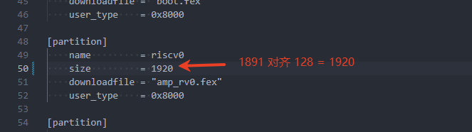

内核端也需要关闭小核解压功能

```
Allwinner BSP  --->
	Device Drivers  --->
		Remoteproc drivers  --->
			< > Allwinner remoteproc decompress firmware from partition # 取消勾选
```

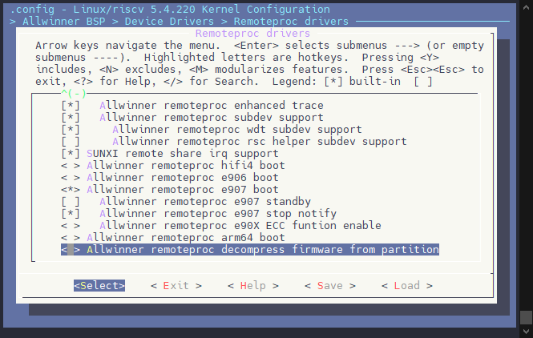

:::

:::

### 软件方案配置

除了软件上的配置，休眠唤醒如果需要使用**超低功耗待机模式**， 还需要增加休眠唤醒引导 PMBOOT，例如这里 IPC 方案，如果要配置则需要编辑 `device/config/chips/v821/configs/ipc/boot_package_nor.cfg` 增加配置项，另外超低功耗待机模式下，不支持对 opensbi，u-boot 进行压缩。如果配置了压缩请修改为不带压缩的版本。

```
item=opensbi,            opensbi.fex
item=u-boot,             u-boot-spinor.fex
item=pmboot,             pmboot_spinor.fex
```

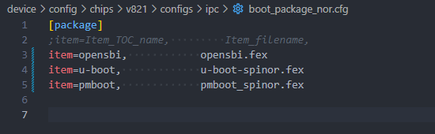

:::note

:::note

备注

:::
:::note

如果配置不压缩模式，打包报错，则是因为没有压缩的情况下原先的 flash\_map 已经放不下固件了，需要适当扩大配置。

```
ERROR flashmap logic_offset start block: 608 is less than uboot_start last block: 896
```

![image-20250430153340914](data:image/png;base64,iVBORw0KGgoAAAANSUhEUgAAAs4AAAA9CAYAAAC9de+yAAAUWUlEQVR4nO3dP4zbRr4H8G8ezs+AH7AvTVIc3oI+0kUubhYqErhZAs8an5urJAR4DRs5EIGkSaEVkINSWHgBJBVpLgCFixo1AQKpSuPbWR/ANEGaxTbGa0yeiH1IkTQXA2fAz0VeQVKi/pGUSFq76+8HCBDviDNDzWg0In+ceeOdd9/7FUREREREFOtfdl2BC027jc/HH+CHsw/ww/g21F3VQ9xJX75qYHw6gLmzysbT6gOcnZ4E/7UgMuWmQAgFWk51IyIiIorDiXOMu+Zt/E4+wvsH3+D9yhO4u67QFeD0azgolXFQHcLJmpmqw+wYu/tBQ0RERK+VqztxFnfww9kd3N06gz2oKvB351mOlaJcuUNUSm3IVWmilcMVbSIiIqKZqztxppwo0FSGQxARERGtmTgrEJ1ZLOq4Y8xPnFQd5rp01cD4tAUhWhiHsayjFkTa++nabXx9dgd3xR18fRbGF9/B3bkK7OHD3n0/7ewDfN3bn92u1277x/X2Aezj8zCP3n7KCuzhw/EH+OHsPh5owN3eqhjnpPIXrnRHY5RTnd/+LLb67D4+zDBr9WOKF9//xfbVFybGOnqnLZj1Acann6Hb/cxvUyBl+ybln5WO3ro4adXw69XR51/X0WfvSbTupwP0hJJr7YiIiOhqWjlxFp0BepqNRrWMg1IZRyeAiMxOhDgETh76saqlGiQMjCMTE0CHWf4OR0F6w9HRq+tL5ay3jwf3/hd/OvgG7x88wqfuPj43ZxPfu737eIAn+K+Db/B+5Xv8Tb2D/zb3/EQn+HvjHMA5Pj34xo9RbpynLPsZ/lLxy/3KAR43vlmKcY4tP5fzu4O77vdB/k8AkXbSP0+rD9AVEzRKbchIgLboDNDDEJWw/bQWuvXFyaMOoQ5xVKqhUq3hoDqMhETEt2+6/LOw0SiVcbAqTMMNym3akdeF/w7q3rkJ2Qz+XnqI47LOkA4iIiJKtGLirOOe8GAdDaeTLUcOYUVmKLLfhiW94F8erBMb0KK38z3Ivh08/OVBLqUneYa/WefBRPUZHh+fA+pecFV3H3fFM3wVpjvn+It1DlXsv6KHxPIof/Pz25RWH2Bcn8CqLk4ug/aNtI/Vt6GJxavC0TYE4Hpr0hbbN23+u6RAqDo0FQA8yOZwdZw0ERERUcRvlv6iKlAxwXHcEhLCwLhuBBOPgDuM/GMCJ9MSFL/AXbfkgraH3+EXPM68JMOWcim/6PNTIDQbDnTcE23I6KxQVaBCgRidwIweMtd+SWLaN5f8i2SjUVXQ6xro1lvQ4EH2H6LR95IPJSIiotfa8sTZ9eDCvxonV06OdPQ6BtxmDZXwqrNo4axeaD1nnGf4O/ahatjN5Lno8nPJ34N11IalAWedAUynBitsS9eDCxvWutUosio6/zy4QzSq/kReEy2MOwZE/wLXl4iIiC6EFaEaNo6lArNrTB/40oQBcy4I1IODYNKs6jA3il/O6hyP5R4emEFohLaPD819uPJ8fp1l9xlc/DvU3OMDEsoPJr4PwpjnID1r/luRbTSCtpy9DTaOpY5e5IE9TRgbxqDHSZl/8APt3trgYh29kf9QX3wT3py/8xFyPDir0lS/LhcnbISIiIgui5UPB8pm8MDXyF95oFtG5Ha/Das/gegEqxJ0D+FIe1U2hXnceISvEKyeMb6D/3S/x5+shfWWnSf4SgIPxpuuqpG1/HN82jgHzGDVje5/wJWbxSg/bjzCV2qw6sb4NrDh8VGyWYMFY+7hPNmsoQFjurJEtwwc59iG6fK30WjaUIN+NF718KAKQIt7qNBGozmBGK3Iw/Xj8s3Rwqoa7hAWDtENV/yoY0UcOBEREdGyN955971fd10JotUUAIw9JiIioouBG6DQBcZJMxEREV0cnDgTEREREaXAiTMRERERUQqXbuLsbyG9ZrtlIiIiIqKCXLqJs9Ov+VslV4fY1R4oRERERPT6uXQTZyIiIiKiXXgFE2cFmqpwwwkiIiIiutSWt9xWDYxHCqwmYIa7trk2GkftyBbcCszOZzCFv+GEI9s4atqR0AkdvdNDOP2bEHUALqCpEzRKbUjVwHikw5WAEIDs21DrBjTYsKptf2toVYdZNyL5D3HUZGgGEREREe3OmivOOszydzgqlXFQCnYRjGyZLDoDmBiiUirjoNqG1FpzO9OFeQh1iKNSDZVqDQfV4dzubE6/hkofEHUFVqmMhtQhgomyEIfAyUM/lrlUg4SBcedVbutNRERERDRvzcTZg+yHV5A9yBMb0MJwCx33hAcrTHdtWH0bmtAXwjGieQBwo5tZTOC4gONOANeDi3my34Ylw9d7sObKJyIiIiJ69ZZDNQCEE9uVVAUqJjhel54HYWBcN6Cpkb+5wwILJCIiIiKKt/nDga4HFzfnJ7W50tHrGHDDZedKZRw07aIKIyIiIiJKZYtVNWwcSwVmPQjNUHWYdR2OtHN8eM+DgyBUI8h/ievBhY573AGFiIiIiF6BrZajk80aLBgYn57gbNSCcNo46nvJB6Ziw+pPIDrB7oDdQzhy1RVnG42mDTV43Xjp4UQiIiIiovy88c677/2660oQEREREV103DmQiIiIiCgFTpyJiIiIiFLgxJmIiIiIKIX4ibNqoDcKHtIbGdAAaPWB/+/TE5ydtpD7ohaqgXER+RZCgRCXbGOWhPe38PYlIiIiuqRiJ86ibkCVwXrK1SEc+FtlR//9WlN1mB0DhS1pvQNsXyIiIqLV1uwcCAAKNA1wT/JaZu4KcoeolHZdCSIiIiJ6FRjjTERERESUwoqJswJzdIKz0wFMFbONSIIY51RUHWZnFis77swfq4mWv3nKqV9OT6zYvCT6mlELIoyHUA2MTwfodQb+sfVgI5bTFszpa2LKD2J8zfos/3FH3zBOWUcvJg441fnFUiDm6q8v1V+se3+Szj+sY6bzj6kfERER0RW1YuLswaqWcVCqwXIB2SxvHPMqxCFw8tA/rlSDhIFxJ9w2W4fZuTnLt/QQx2V9YfKpwyx/h6Pg+Iajo7ew7bbTr6HSB0RdgVUqoyF1iGCCGl9+kL8a5F9tQ2otdDfaedBGo1TGQakNuZSW5vziic4APQxRCeu/VL/496fo80+uHxEREdHVU0iohuy3YckwNtqDdWIDWnT1CQVC1aGpfrpsDhcmoB5k3w4m6h7k0vETOC7guBPA9eBuXL4HK8zftWH1bWgiz6umSecXR8c9EalfUNf5+sW/P8Wef5r6EREREV09MQ8HZiAMjOtGMHEMuMPgf2w0qgp6XQPdegsaPMj+QzT60YcQ/YlxMeXnkH+sNOcXQ1WgQoEYncCM/n2T+hd5/qnqR0RERHT1FDBx1tHrGHCbNVTCq56ihbN65CXuEI2qP9HSRAvjjgHRXxX2UFD5uAlNBWRRk+cs5+d6cGHDWhkGkkbB55+5fkRERESX0/ahGq4HFzrurQze9eAgmLSpOsxofLJqoFcv+rZ+TPkAAAVmWIcg3ZH2lusW35y/spv5/GwcSx29yAN3mjCWYrzj5XD+a9s3j/oRERERXT4ZYpxtNJo21GDVjfH04TAbVn8yW42jewhH2rPD3CEsHKIbrshQB6xqnlcvE8oPX+MGdRi1IJw2jtKGUizk02hOIEaR9yCH85PNGhowpqtedMvA8dI5rK/TNudfWTr/de2btX5EREREl9Mb77z73q+7rsQrpRoYjxSGGhARERHRRrgBChERERFRCpw4ExERERGl8PqFahARERERbeFqX3FWDfRG81uGa/XZVtGrtsvOo8xxEfnmpPDzn6NACGV3G6OsaP+N0mlzCf3/1Xz+BjDV5Jdefvl/vl7t+FCACz7+Xvj6XXIXvv9yfLwSrvTEWdQNqLI2t2W4069tvIX4VfJKz1/VYXYM7Oozuqr9N0mn/L3un79cFfD5YvvQZXbZ++9lr//rYnnivPcW/ue2svTfF3vr0n+Lb9++EXP8QjoA4Bo+3v/t9DXf7t/ArY2OT0OBpgGuu80yc5QLd4jKzlYvSWr/gvuHaBV7xeOy53/JafXWdDnGcWdx3XYFZie8cjRAL7KUIwBA1Wd3Ok5PMO5sebdjp5+vHWP/jHfZx4eL3r4XvX67lDS+zaUPMF6xB0T8+Lp7a644P8cnTzz8PvLfJ8/WpD/9B56+9Ra+ffta6vT7+7/FR/gH/vjEw++f/Ii/Xn8LX2xwPBHlRYGm7jCc5hLS6gOMBWBVyzgolXF0okBEvkFFZwATNirBlSPUB+hN0xWY3RZUp+2nl2qQmoFxhxsI0euI48/VkjS+Benhnd7SQ0jRioyPyePrRZA9VOPFc3z580vcur5mYruUfgN/2HuJL396jqcAgJf480/PcWvv32ZXnTfJf4kCc+T/kjFVzDYC2SSGVdUjV4yWfzFpYvZr6Ox0gJ5QlvOIvmbUggjvpwYxRr3OILgaFW4k0prFHcWVH8RImYX+IlMWyl9xRS3yi9GstxbeXx292DgtBSLm/c1Wv6T2T+4fye27WH99oX1OcNbR59+HDSZGseWnyT+h//rHtWDWBxiffoZu97NZ3F0O9QeyXjFI7n9p+48fMxj5/E0F57ZxbLsOs65A9tvTLesdOYQlZ+n3hAerH9xqdW1YfQ+iHL5//k6j7km4U6cHKTe96xH/+Uo1PmUS0/9TlJ+pfmn757rxF0g1voq44xPrt9AmYnF83OSOxYbpHH+SZfl+5/iYIGF8U3UI1R8TEaRbfRuiHpaTNL5eDNknztdv4KO9a3j0y/N06df/FbfwEk9fRF7z4iWeXr+2euKclP8SL/ilUoPlArJZ3jhmSIhD4ORh8IuoBonoLyYdZufmLN/SQxyX9YUvLx1m+TscBcc3HH1pS2qnX0OlD4i6AqtURkPqEMEHNL78IH81yL/ahtRa6C7eDs7Av2I2DK6YLecvOgOY4S/K6hAQi4OGjUapjIM1t5FFZ4CeZqMx/UWJjX5Rxtcvqf2T0pPbV3QG6IXll2rz5bvB35t25H0I/51GQvkp8k/uP345Qh3iqFRDpVrDQXXot1Xm+gfnkKF/pul/afqPVh+gKyZolGaDcGaqAhU2HES/+KITLwUqJnAi5TnuBNDCq2o2jiWglvXpDzkhFP81qcV9vtKMT9nE9v/E8jPWL1X/jB9/U42vCeN3NvGfj1Tj77p0jj+JMn2/c3xMkHF8SxpfL4g1E+cb+GIhzvjj62vSb70J/PTjQihHUnqSrMdnI/ttWDLyi+jEjnzxAYACoerQVD9dNocLX2AeZD/yi2vpeP+L1XEngOthsc8ml+//Sptd0bKhibyuOodXzNblvzp94/yPhlv+okyqXx7i2neh/KAtXl35yZL7T5Dv9BwA5BrrnaV9Uva/hP6j1QcY1ycx290HX3pbPYSjQ6izidXqiYF/Z2O6Vb2qTB/ik83gmOCKlnDaOFra8j6LbP0nXpr+n1R+kfUL8owZf9OMr/Hjd/b6bTq+pk/Pw2Uff7LWr/j+eZXHx9jxzbUhXf+qsk+BWdfnxsd04+tupYxx/hF/frE6/Y8/A/f338T9NcevTk+S9fiMhIFxJLh9/jaMjUZ1CFcY6I7WPPyzcMUp3/JzyD/OiitmG6Vnzb/o4xMltK+qQJ0LVcn5NmKq/pUgsf8UrcD2TdX+CoQ2gQMd9wqJjbPnJ45rJgZWtYzK9Asj/IGswBwNoLmzK16Wm+cXQw79J05i/08qv+D6AUjsf7scX5PyL3r8TXQVxp8Emb/fs7rK42PS+OZP6l0xmIZIQtoLFxDTjK+7lTlU4+lPP+PLFzfw0ZqH95bSX/wfnuIabkWvYF+/hlsvXgYxz5vlnz8dvY4BN1wWZtVtGHeIRrWGSqmMSnMCUTdyvBWaovwgjqgQrgc3Lv+k9Kz5F318qjJi2tf14EZv0YX/5bl8UKb+lab/FK3A9k3V/h6sozYqTdu/rbn2tVsMxivuECXVT1NvAo7n948gxu84EuMnpQ1HHOY3hhQ5PqXp/0nlFzp+Jrngn4+ix980Lv34E2fX3+/AlR4f04xv7nAaRnJQbUMiMj4mja8XRA7rOAcP97217qrwYvpz/PXZNXz0drgE3TV8/PYNPH32z5UT5+T8t+R6cNf+4vLgIGh4VfdvJYRUA7160cujxJQPILy9oUXSHWlvNnFbe/42jmVc/qvT11v8EAfHd43pAwmaMGCmHpmS6pdRYvvaOJY6epEHMjRhLMdAOh6cbQbItP0rNv+k/pPCtvUHkKp/Zu1/afqPbKMRvHb5/dTROx1ssRmF3/7T+kGBWdZnA/+0/kak/op/uz963pFblULo0Lb+wlhoo7zGp9j2ien/SeXnVb9M/TOHz8c6wfs2vRW98fi93fi79Pl6rccfFP/9zvFxtRTjm1afr1s3Oj4mjq8XQ8oYZyV+Obhn/8QjxFwVXkh/dP4jvsSb+DaIn/7Di5/xyU8vt89/KzYaTRtqsKrCNBYRNqz+ZLbaQvcQjoz8InWHsHCIbhi4XkdMnNB29YotP3yNG9Rh1NoyRnLd+fsxSlYYo7Qif9mswdKC4P3uoX+rZW0ZE4jRfBmyGTxwE/y9WwbkBm9gUv0ySdG+sllDYxrD5df/ePE9cP24sukt7bS3K9P2r7X5p+k/KeuxTf3DOiz0z8pS+2Trf2n7T5jX8sM3EziuB0d+t/FnVzZrkGokhg9DVCJXrfwy9aD+BtCvoTEtxL8VDBFZ51lM0Dja5o7Fis9XbuNTfPus7f9J5edVv637Z06fj5j8G00bCHeASzl+VxbH16TxN2n8e63HH78ehX6/c3xce25J45vT93CvG56X7tc3UkjS+HoRvPHOu+/9uutK0AZUA+ORAusibXwgWjire6hwtyMiIiK6wq70lttUEGFE1rZU8g2VICIiIrqgfrPrCtAlJG0cdz7DWcefPDsyr1AJf2H8tTFV7pBXtYmItsLxlSgPDNUgIiIiIkrh/wF+rE/vifU/1QAAAABJRU5ErkJggg==)

此时需要修改板级对应的 `uboot-board.dts` 扩大分区表，例如这里 IPC 板级，修改文件：`device/config/chips/v821/configs/ipc/uboot-board.dts`

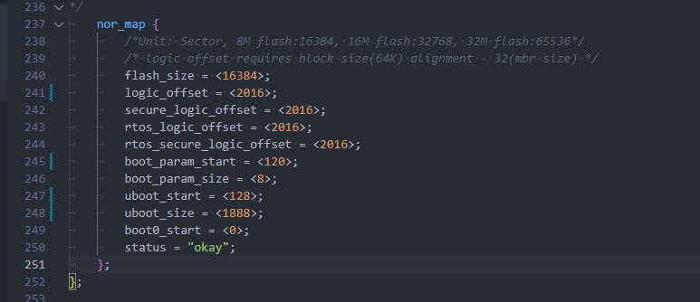

device/config/chips/v821/configs/perf2b/uboot-board.dts

```c
nor_map {
	/*Unit: Sector, 8M flash:16384, 16M flash:32768, 32M flash:65536*/
	/* logic offset requires block size(64K) alignment - 32(mbr size) */
	flash_size = <16384>;
	logic_offset = <2016>;
	secure_logic_offset = <2016>;
	rtos_logic_offset = <2016>;
	rtos_secure_logic_offset = <2016>;
	boot_param_start = <120>;
	boot_param_size = <8>;
	uboot_start = <128>;
	uboot_size = <1888>;
	boot0_start = <0>;
	status = "okay";
};
```

另外还需要到 Linux 内核配置 BOOT\_PKG 偏移，配置内核选项 `CONFIG_SPINOR_UBOOT_OFFSET` 对应到 UBOOT 的 flash\_map 配置中。

```
Allwinner BSP  --->
	Device Drivers  --->
		<*> Memory Technology Device (AW_MTD) support  --->
			(128)  spinor uboot offset
```

:::

:::

如果是 MMC 方案休眠唤醒，则在 `boot_package.cfg` 中配置

```
item=pmboot,                 pmboot_sdcard.fex
```

:::warning

:::note

注意

:::
:::note

注意编辑 `boot_package_nor.cfg` 或 `boot_package.cfg` 时，需要文件底部留空行，否则会出现打包报错！

:::

:::

另外还需要配置设备树配置同步 BOOT0 联动机制，方便动态配置 BOOT0 的参数内容。这个配置大部分板级已经默认启用，若未启用例如 IPC 板级，编辑 `device/config/chips/v821/configs/ipc/BoardConfig_nor.mk` 增加以下配置：

```
LICHEE_GEN_BOOT0_DTS_INFO:=yes
```

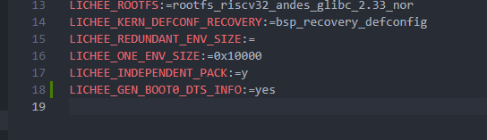

执行完成之后需要重新加载 SDK

```
source build/envsetup.sh
lunch
```

## 常用调试方法

### 控制台挂起时的日志输出

```bash
echo N > /sys/module/printk/parameters/console_suspend
```

**说明：**

-   `console_suspend` 是内核参数，控制系统进入挂起模式（如休眠）时是否休眠控制台。
-   设置为 `N` 表示启用在系统挂起时不休眠控制台日志输出。通常用于调试或优化电源管理，开放打印日志信息。

**示例：**

-   设置为 `N`：`echo N > /sys/module/printk/parameters/console_suspend`，启用挂起时的控制台日志输出（会输出更多的日志信息，适合调试电源管理问题）。
-   设置为 `Y`：`echo Y > /sys/module/printk/parameters/console_suspend`，禁用挂起时的控制台日志输出。

### 内核初始化调用调试信息

```bash
echo Y > /sys/module/kernel/parameters/initcall_debug
```

**说明：**

-   `initcall_debug` 是一个内核调试参数，启用后，内核在启动时会输出详细的初始化调用调试信息。
-   设置为 `Y`，可以帮助开发者查看内核启动过程中初始化函数的详细过程，特别是在调试内核启动问题时非常有用。

**示例：**

-   设置为 `Y`：`echo Y > /sys/module/kernel/parameters/initcall_debug`，启用内核初始化调用调试，输出详细的启动过程信息。
-   设置为 `N`：`echo N > /sys/module/kernel/parameters/initcall_debug`，禁用内核初始化调用调试，减少启动过程中的调试信息输出。

### 电源管理调试信息输出

```bash
echo 1 > /sys/power/pm_debug_messages
```

**说明：**

-   `pm_debug_messages` 控制电源管理调试信息的输出。
-   设置为 `1` 后，系统会输出与电源管理相关的调试信息，包括系统的睡眠、唤醒等操作。此命令适用于调试电源管理流程，帮助识别和解决电源管理中的问题。

**示例：**

-   设置为 `1`：`echo 1 > /sys/power/pm_debug_messages`，启用电源管理调试信息输出，详细记录睡眠、唤醒等操作。
-   设置为 `0`：`echo 0 > /sys/power/pm_debug_messages`，禁用电源管理调试信息输出，减少调试信息的量。

### 电源管理操作的时间打印

```bash
echo 0 > /sys/power/pm_print_times
```

**说明：**

-   `pm_print_times` 控制是否打印电源管理操作的时间信息。
-   设置为 `0`，表示禁用电源管理操作的时间打印。此命令适用于减少调试输出信息，优化日志，或在不需要时间打印时提高系统性能。

**示例：**

-   设置为 `0`：`echo 0 > /sys/power/pm_print_times`，禁用电源管理操作的时间打印，避免在日志中记录过多时间信息。
-   设置为 `1`：`echo 1 > /sys/power/pm_print_times`，启用电源管理操作的时间打印，记录系统在不同电源管理操作中的耗时（有助于诊断性能问题）。
