# U-Boot - U-Boot 相关功能配置

### 目录结构

源码位于brandy/brandy-2.0/u-boot-2018目录，挑选常用的目录说明，结构如下：

```
├── arch	#芯片arch相关文件
├── board
│   └──sunxi	#板级公共功能实现
├── cmd		#通用命令
├── common	#社区通用功能
├── configs	#defconfig配置
├── drivers	#驱动目录
├── env		#启动变量
├── include	#通用头文件
├── lib		#通用函数实现
├── sprite	#量产烧写相关功能
```

## 进入 U-Boot 控制台

在启动的时候一直按住 `s` 键，即可进入 U-boot 控制台。

### 编译烧录使用

编译uboot的快捷命令是：

```
muboot
```

编译产物有3个，如下：

```
u-boot-efex.bin	#烧录阶段使用，只存在于固件中。对应sun300iw1p1_efex_defconfig
u-boot-spinor-sun300iw1p1.bin	#nor介质常电启动使用，快启不使用
u-boot-sun300iw1p1.bin	#nand和emmc介质常电启动使用
```

#### 配置说明

方案通过 `device/config/chips/{IC}/configs/{BOARD}/BoardConfig_nor.mk` 或 `BoardConfig.mk` 文件的 `LICHEE_BRANDY_DEFCONF` 变量指定 `uboot` 的使用的 `defconfig` 文件。如：

```
LICHEE_BRANDY_DEFCONF:=sun300iw1p1_v821_defconfig

则此文件对应编译产物u-boot-sun300iw1p1.bin；编译时nor方案会自动指定配置为sun300iw1p1_v821_nor_defconfig，对应编译产物为u-boot-spinor-sun300iw1p1.bin
```

## 添加新的宏配置

操作步骤如下：

1.  修改 `Kconfig`。不同目录下都有 `Kconfig` 文件，找一个合适的添加。如：添加 `mytest` 配置

```
config mytest
	bool "this is mytest"	#配置描述
	default n	#默认不使能
	help
		xxx	#详细描述
```

2.  在对应的 `defconfig` 文件使能新建的配置

```
CONFIG_MYTEST=y
```

3.  在 `c` 代码中使用`CONFIG_MYTEST`宏去管控代码

## 命令行调试

执行help，则可以看到支持的命令。列举几个命令使用方法：

`cmp` 内存比较命令，比较两段内存，以一个 `word` 进行比较 `count=X`，表示比较 X 个 word 字节的内存数据。

```
cmp addr1 addr2 count
```

fdt修改设备树命令；用法较多，参考：

```
fdt set    <path> <prop> [<val>]    - Set <property> [to <val>]
fdt mknode <path> <node>            - Create a new node after <path>
fdt rm     <path> [<prop>]          - Delete the node or <property>
```

env相关命令

```
printenv	#打印所有env变量
setenv name value	#设置变量名name的值为value
saveenv		#保存env变量到flash
```

## 在 U-Boot 下配置内核设备树

`fdt` 命令在 U-Boot 中用于操作设备树（Device Tree），主要是用来解析、修改和查看设备树（FDT，Flattened Device Tree）的内容。

```
fdt - flattened device tree utility commands

Usage:
fdt addr [-c]  <addr> [<length>]   - Set the [control] fdt location to <addr>
fdt move   <fdt> <newaddr> <length> - Copy the fdt to <addr> and make it active
fdt resize [<extrasize>]            - Resize fdt to size + padding to 4k addr + some optional <extrasize> if needed
fdt print  <path> [<prop>]          - Recursive print starting at <path>
fdt list   <path> [<prop>]          - Print one level starting at <path>
fdt get value <var> <path> <prop>   - Get <property> and store in <var>
fdt get name <var> <path> <index>   - Get name of node <index> and store in <var>
fdt get addr <var> <path> <prop>    - Get start address of <property> and store in <var>
fdt get size <var> <path> [<prop>]  - Get size of [<property>] or num nodes and store in <var>
fdt set    <path> <prop> [<val>]    - Set <property> [to <val>]
fdt mknode <path> <node>            - Create a new node after <path>
fdt rm     <path> [<prop>]          - Delete the node or <property>
fdt header                          - Display header info
fdt bootcpu <id>                    - Set boot cpuid
fdt memory <addr> <size>            - Add/Update memory node
fdt rsvmem print                    - Show current mem reserves
fdt rsvmem add <addr> <size>        - Add a mem reserve
fdt rsvmem delete <index>           - Delete a mem reserves
fdt chosen [<start> <end>]          - Add/update the /chosen branch in the tree
                                        <start>/<end> - initrd start/end addr
NOTE: Dereference aliases by omitting the leading '/', e.g. fdt print ethernet0.
```

1.  **查看设备树的节点**
    
    ```
    fdt print <node-path>
    ```
    
    这个命令打印设备树中指定路径（）下的节点内容。 例如：
    
    ```
    fdt print /soc@2002000/vind@45800800/sensor@5812000
    ```
    
    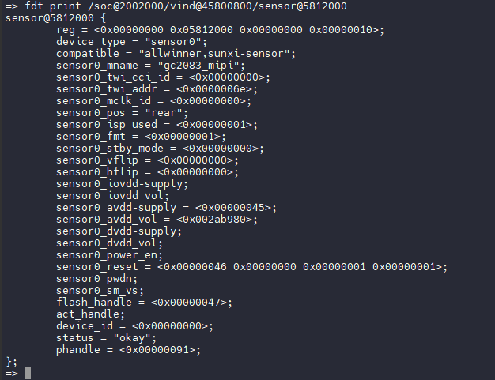
    
2.  **查看整个设备树**
    
    ```
    fdt print
    ```
    
    这个命令会显示设备树的所有内容。
    
3.  **设置设备树节点的属性**
    
    ```
    fdt set <node-path> <property-name> <value>
    ```
    
    这个命令修改指定节点的属性值。 例如：
    
    ```
    fdt set /soc@2002000/vind@45800800/sensor@5812000 status disabled
    ```
    
    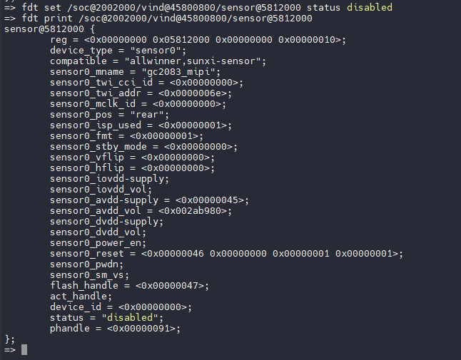
    
4.  **删除设备树的属性**
    
    ```
    fdt rm <node-path> <property-name>
    ```
    
    这个命令删除设备树节点的某个属性。 例如：
    
    ```
    fdt rm /soc@2002000/vind@45800800/sensor@5812000 status
    ```
    
    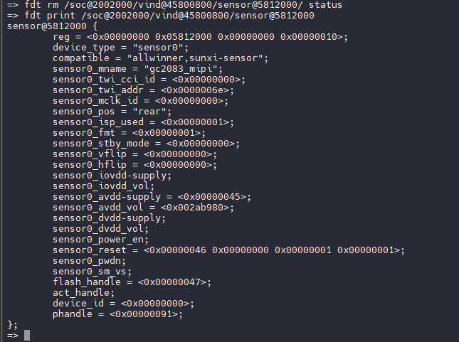
    
5.  **添加设备树的属性**
    
    ```
    fdt set <node-path> <property-name> <value>
    ```
    
    如果属性不存在，会创建并设置它。 例如：
    
    ```
    fdt set /soc@2002000/vind@45800800/sensor@5812000 sensor0_twi_addr <0x7e>
    ```
    
    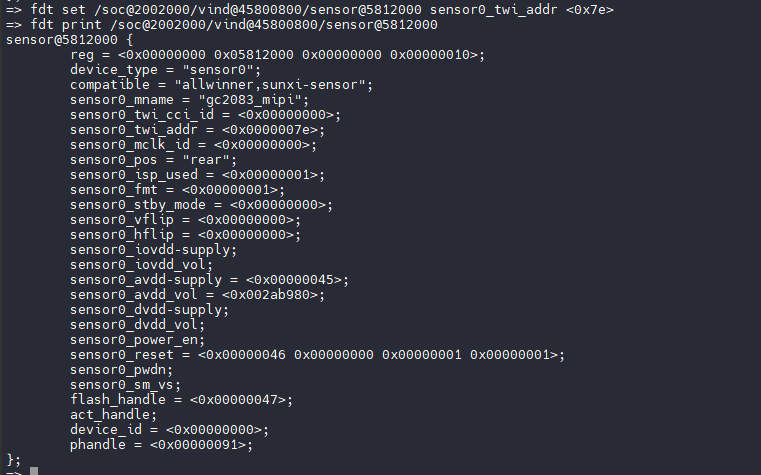
    

## U-Boot 使用 PWM 功能

### 配置启用 PWM 驱动

首先确认板级使用的 U-Boot 配置文件，这里以 `100ask_avaota_f1` 板级为例：

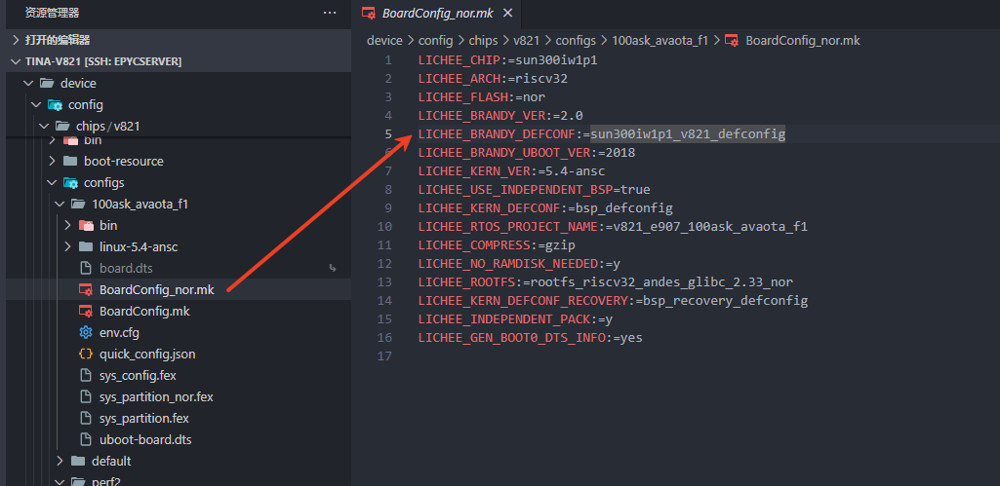

可以看到配置项 `LICHEE_BRANDY_DEFCONF:=sun300iw1p1_v821_defconfig` 表示板级使用的 U-Boot 配置文件是 `sun300iw1p1_v821_defconfig`

前往 `brandy/brandy-2.0/u-boot-2018/configs` 查看配置，找到 `sun300iw1p1_v821_defconfig`，增加配置项开启 PWM 驱动

```
CONFIG_PWM_SUNXI=y
```

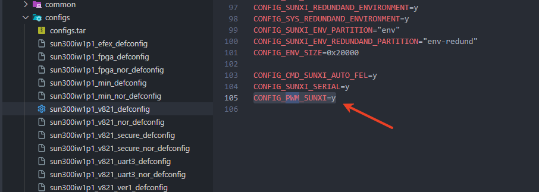

### 配置 PWM 设备树

回到板级配置，找到 U-Boot 使用的设备树，增加 PWM 的配置项

```c
&pwm8_pin_a {
	allwinner,pins = "PD18";
	allwinner,function = "pwm_8";
	allwinner,muxsel = <0x4>;
	allwinner,drive = <10>;
	allwinner,pull = <2>;
};

&pwm8_pin_b {
	allwinner,pins = "PD18";
	allwinner,function = "io_disabled";
	allwinner,muxsel = <0xf>;
	allwinner,drive = <3>;
	allwinner,pull = <2>;
};

&pwm8 {
	pinctrl-names = "active", "sleep";
	pinctrl-0 = <&pwm8_pin_a>;
	pinctrl-1 = <&pwm8_pin_b>;
	status = "okay";
};
```

然后需要加上使用到的 PWM 的 `aliases`

```c
&aliases {
	spi0 = &spi0;
	spif = &spif;
	pwm8 = &pwm8;
};
```

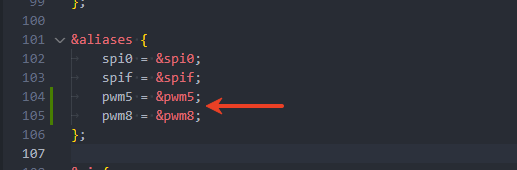

### 测试 U-Boot 下 PWM 功能

首先输入 `help` 查看是否有测试命令 `sunxi_pwm`

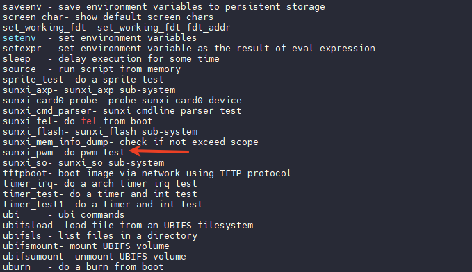

然后切换设备树，将设备树切换回 U-Boot 的设备树

:::tip

:::note

提示

:::
:::note

在启动过程中，设备树会切换到 Kernel 内核使用的设备树，此时运行 `sunxi_pwm` 命令会报错

```
error:fdt err returned FDT_ERR_BADPATH
```

如果日志中打印 `change working_fdt` 则表示当前设备树已经切换到内核设备树了

:::

:::

查看日志找到 U-Boot 设备树的地址，找到 `change working_fdt` 这一行，前面是 U-Boot 的设备树地址，后面是 Kernel 的设备树地址。所以这里 U-Boot 的设备树地址是 `0x838deea0`

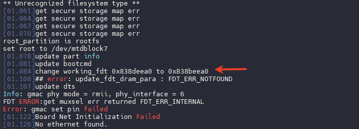

```
fdt addr 0x838deea0 # 改成上面日志的地址
```

:::danger

:::note

危险

:::
:::note

请**根据日志里 U-Boot 设备树的地址配置 U-Boot 设备树**，请**不要**参考下面的错误示例，直接复制使用上面的命令！**U-Boot 设备树的地址是自动配置的，每一个固件都不一样！**

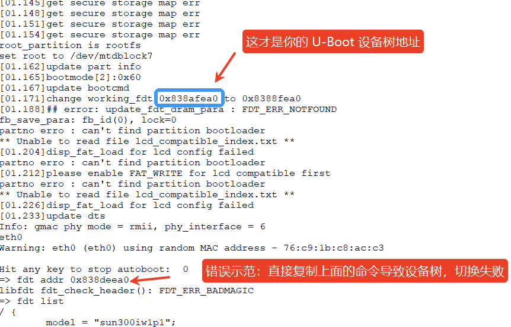

:::

:::

查看刚才配置的 `pwm8` 是否正确

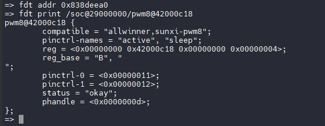

执行测试，输入

```
sunxi_pwm 8 50000 100000
```

![image-20250513154957035](data:image/png;base64,iVBORw0KGgoAAAANSUhEUgAAAtkAAABOCAYAAAD1sQpMAAASEklEQVR4nO3dP3LqSLsG8GduffsQ1dqAiwVYCe0NQKyEQMpu3QCIOIGJgODWzaSAhBg24CbRWYDLG5AKbWJqsrmBJBA2SA1q/tjn+VW5aubIat5uSe2m9Ur9V7vd/hclf//zH5xiewusxRJPo+jEb1jwV7+AYR9BcrIYIiIiIqIf7fSIukyOsfYc2CJF0Ds1wAZs6ULGS3Q5wCYiIiKiP9hf58xkV5JjrDsphqMlYhORERERERF9U+YG2UREREREBAD4r3sH8FgsSGnBvncYRERERPStcZBdJhz4Uxfi3nHQZYTDL0lERET0EDjILkuW6LYnUPeO41zCwXy1wcd79rOeumcMNC34pX2znzHk59+ZLvJtC8w962sZV92uw8F8Ncb86Jeke8dvon5ERET0nXCQ/e1Z8GdjiHiCbruDp3YfynaxnjpnlRKHfTy1O/nP4RcNOV3AR5SV31sC3gJzebvtWm2wGkOo6OgXpHvH37x+RERE9N00HmTb3gLrqQspLp+ds+UY690s6gJzWSpLuFh/nlmVY3ys8tnaYnu5jNUYsjSdaXuL/e/v9lnA3/2Og/nJWdwa+ef73v7z11Mn/6xslvjYgMr2FviYOrtY5tNFPsvp5uWMS/FVacEWQLKJ8re6pFAqPacGNRy8yBRBmL81JokQhClkx7nRdk1qgu7o9wPGb6h+RERE9K3UDrJtb/EplWD/M5dAHL5iuAFeZsUg0YF9VlKzA3/aghoVs6iveOs45w104cDv/MYwn8kdxA7m3n4QE4d9DGIXM89CllbgIhmVF8yJMDgyg3vW54v883sTKHucf1aKOAbEkS8gQliIk+1BjN0QkJ6FoN3BQGX5xfUivClAdPYDeykPy9axP86f0hmEBYEt4tK7z+NkC9h57vO1t2tJEYQn3t9+7/iN1I+IiIi+m9pB9mEaweHPQAFAilgtMejlA2Q8YzbLZpP1ZmIBwIIUxeA8hRotzxzsplBhaSZ3E30ZxKjRBIm3wHo1hlSTPHZTskHefqYygi2zQa/aRLBFCwAgpxusPQuABdsuzzhng7A42QJJinPX8lGjPhSKGfAFZDzBMNSdzU4R9PbHtDuKII6mM2Sz8utiAC6sT7nP197e1L3jv3b9iIiI6JE8QE52hEFviUS6mK0ufTDscKbw1OcEYZqtWnlq1vNiFZ8fp4jlMyQcvNgpIB3YwoEUOjHrsOCvFrCT13yg3EeQnJ+TvQtXLTE8ms6QDca7xeD9y5eBa29v6t7xX7t+RERE9Egap4sAFmzp5m+3+IUX/MZwmKVNBLqjiGSJQa+PbruD7mgL6blnpotoEC5m3hZBCPizc96+oaN1OkUmSZGgBdt7hlCvCOL8NXPqt5m3mAgHUkR4281cp1Aqygf2BhTxl3PcRSv78nCL7d89/mvXj4iIiB5S43QR2/uFWQd4G/azfOgwOm+GVrhZHvep7UmKBA783W12B7537ixtkYc9QZDnZ5+e6a0YMJ9kwS/qkMcXqyJ9JcKbsiBlC0qlUJstpGydnTN9Ut4+L7vZfwtSOrB1Z0o/t7/IctfVppjtz+L3PbdUv1tub+re8V+7fkRERPSIGqeLxGEf3dESKrnwjRbJEgGeMSvezOEBQa/8AGKEwSgCihn12TNidd4ARU4P87DVaAIlx0fyjiMMRlvIVRGLbtpKhCDJ67Aaf8mJTpIUdpEeEqeAsJBc2l5HPnvQWwKy9OCi3GIwXOrNlCZRlke/ezOLg2TUP8hZV6M+AjhZzvfKBcLbbq9XvB1mDHnw348Rf/P6ERER0XfzV7vd/rf8D3//8597xfI9CRfrlYXgOy5iQ0RERERX8QAPPhIRERER/Syctq7kYF61OE2yRHd4y3iIiIiI6DtguggRERERkWFMFyEiIiIiMoyDbCIiIiIiw77PIFuOD17LxvJvXD4RERERafs+g2zKWbCFZXjFSiIiIiIyqf7Bx/w90CoEZL4yYKwmGI4ixLDgrxaww86XxTVsb4G1WOIptLBeOUgUICWgwgjCc2EjQqCz9LpwsV4dWQZdTfA0KhalsSCnvzCX2eIx+/jyWOQYs2mxqmEKNXrFQKVnlF+tcfnCge+58HfxLzEclReTcTB/f0YctiA9AAlgiy0G7QmUgfiJiIiIyCzNmWwHvviNYbuDp94Eyh5j5lkAUsQxIMTXlRGFsA6WDo/DProhID0LQbuDgXIgpcaKiskS3XYnHzBGGBTLupcGkHK6wBz577X7pfjy2KctqFGxHPwr3jrOPq1Co/zatmlYvpTPwOY1378PhWPLvjuQYolhu49ur4+n3jJb/KZx/ERERERkmuYgO0UQ5jPDSYQgjGDLbOZWbSLYogUAkNNiKXILtp1CFbO5yJYUj5MtkKSom7w+j4MXWYovj7WIL2NBCge2yLar0dLw6ozNylfhBMGurVIEmwiwP6eEpFDhfnYexpZlJyIiIiLTNAfZ2SD5qDhFLJ8h4eDFTgHpwBYOpKjYxyRhQcCCv9rg4z3/OZgFjjDoLZFIF7PVBh/vC8w9jRl0bQbKly7WJ+MnIiIiou9Gc+WZFmwBqGOD5iRFAge2Bwj1ikD8gpRb2Oq34dniE5IUCSIE7cnpz0uWGPSWALL86fXUhQwrfv/sGJqU72A+dZGM+ugWs9lyjA/PVHBEREREdGuaM9kW/Pyhx+whPQexKlIXIrwpC1K2oFQKtdlCytZBPrYRcYo4H+wfivCmHMyn+/QQW7qYe/lssMj+u/ZtHCfLr2Gk/BQxigcls/Y926XxExEREZFxmoPsCEHyjNn7Bh+rMWQ8wTDc5wQnSQq7SA+JU0BYSEznDCdLBAr7tJBSSoUa9TGAi3WebjHrAG8q2u+HPPb3DdYeEPSOzDJXlF8bV6PyIwThFnKa//vsGbG64KHFS+MnIiIiIuO0X+FXmY5BREREREQ7XIyGiIiIiMgwDrKJiIiIiAyrTxchIiIiIqKzcCb7pixIebjIjO0t9u/Hfh/vV4rU3E5XJlysr9nuwsX6fQH/Wm+FuUn8D3xePnp8P4lwMS8evF659W9curmv/e/P8tPrV+eC+v/p/aNRf/r5dxwH2bckHPhTF+XxVBz2s2XQe8v9ao5nbCciegTScyHUA/dXR/rfH+Wn16/On17/e2P7H1U/yJbjLzOotrfgK+IukSzR5VtaLnPkPKQbevT2f/T4fjwLtg3zr2416af3v03qd+3r5xbXZ1X9f0L9rqkufp36/fTr60KcySaiB2LBFrzleEtHF7AS1s3jyPD4E9HPYWSQbcvxbiGYj/cF5vJzB21BTve5xeupxgqJZcKBf7B/Kd+vyHkqx7AaQ551z8L6VP5hfOfX73M+ooP5VfOqrx1/Rfl5+/ve/jO+Ht8Gx1/kiwxNHRy048GdlOr616urP4DK86uufhrl57IcfN3z14K/2mB+5IT6crfp0vi12r9B+UBe7hi+t8D6/Rdms1/6eYw3ia/u80+d/xrHJ8/Jn08X2bXpFYtqjTXy9DWPf03/OVt9amvhYr1yS/9W1T5WvgBW9lzBblGtg5zsuuuz4vg3ap9y+RXPvdT2j3Wa959Vf7/q42tQP83+tbp/qIhf9/o80a56/VtF/Y30DxXu3f+g4firLn6t+tW1f934zNovove+gO+NH/SZjssYGGQ78KctqFEny8Vrv+Kt4xw0tJwuMMcS3XYHT+0+lD3GzNPvyKR8Bjavefl9KLhYfzrIfuc3hvn2Qezsl1XXKX+6gF/E15t8ik+zfnaEQS/7neEGkAdnWoRBu4OnK91KuXb81eXnnyHy9j+yvdHxT/L9RhH27Vj8v2589e1Xffyqz6+6+tWXn7G9BWZyi0F7ApXoRJ4ijgFxZNZRCAtxsm0ev0b7N22fogwplhi2++j2+njqLfWulZvFV+XU+a97fLJnL7ohID0LQbuDgXIgawd7euVX9p9JBJU4eCmdj7Z0YKvfu/avbp8UQS/79yDBvp8p5WTrXZ/Vx/+y9ilU9b/1/WMdI/3nyfNTJ74G9dPsX6uvj4r4ta7PU3Svn4r6G+gfKt29/2k4/qqLX6t+deOb+vr78SS/PpaA/FmpyIbSRSxI4eS3HVOoUbmDdPAiUwRhlHe62X/bUv/bmgonCFSR65ci2ESAXb6lmEKVyldftlf5FF8SHYlPo37D5W5gFKtsifPbuHb8OuVXbW9+/JvXX2P/yuNXdX7V1U/v/LC9BdbeFkHvvC9iahPBFi0A2Szi2rOQ5cemUKVr5vL4dZgov1wGAKO5vdev/6nzT+/4bBEnyAYNSQqt71c5nfKr+8/s92SnNKjzrKyNjLSP7vVZdfwvbx89Vf1jHTP9Z/XfrybxGapf5fFv8ve3mt7109T14q8v30T/c93xV3Nn1D+/Pn6S+pdixyliVH2rijDoWZjPXMy8MWykUOErBmF+AQgLAhbkagO/vFuy1I9Sulh77mHu4MH+WSd8EWFBYIu3k/vr1K9q/yu7dvxa9atofxPHv0rT9r92/bTKtyDtCDEcvMgJ1Dl/QeMU8fQZcgS82ClgO7AVIMUWQQJkj3pf+/jc8fhruWP9tY5PA3XlA7X9Zxwuod5d+GGEwH6GTJboFudg0/a5d/9Yq6Z/rHPt/rNpfEbqV3f8G/z9raNzfjd2xfjrym/c/9xg/NVYXf0fuX9ozszKM8kSg1520Gw5xnrqQob5jFySIkGE4OJUCQfzqYtk1Ee3+OYqx/jwjESex5d9Czx5i762fjX7X9O149eqX6tm/ybHv0bT9jeyf0X9tMpPEQwnCGzgY7qAH/f1/4AU5XuAUK8IxC9IuT243d8o/qauXX5TRuKrO/8bHJ86teXr9J8R3tQYvrQQCwex6h/MKDdqn3v3jzqq+sfafU30n1eMr+n+975+r3393JuJ9r3q+OvKvkP/0FB9ukjeCC9F/pvIcuF2+VDCxdyruvUQ4U05mJeS7W3pnpUzDaSIUXwzc+CftW+dCG/Kgl/UIS8/VvntC636WfBn7i6Z35Yu/JNJfa3jT/Pv2vnEbie3Xzv+mvIBAFXbTRx/5HdUjrWdTnxVzj1+x/avqt8Z5asJBvnv6t/Ky8qXsgWlUqjNFlK2DvJ9m8WfO9n+hspv6q7x1Z3/TY6PTvx15df3n2oTwZYuXuTn2/BN26fp9Wnap3Oktn+sY6L/rHB2fBfWr7J/vWb/Xefc6+fEZ1z8+Zru1f+YGn/Vxa9dv3Pb4Pj18ZNo5GRH2bekYuXB1RgynmBY3I5IlgjwjFnx5KqHL3mlatTHAO7u6dJZB3hTunk3EYJwu39qffaMWHtfPWrUR1DEd2n9Yme32tmsgxO3/CMMRlvIVVGW9WlbBDE9tq16+7Xjryw/jy1I8s84sr3Z8ce+Hgr7p5BLD77Wx1dN//hV7F9Rv3PKL+pyzoN3SZLCFvktuTgFhHXW+4q1jk9F+xspv6m7xld9/jc9PnWqy9fsP9VvKOFAJtGXGaWm7dP0+jTnSP+r0T/Wad5/Vjgrvgb1q+lfr9l/1+6qff1U/H1t8Pl6Qd6p/zE1/qqLX6t+VeOb6voHdv72kdkzYPpvw5391W63/y3/w9//mMkgoT+EcLFeWY97O4romnj+ExGZI8f48FJ0H3HV2AtwMRoiIiIiuj3plt7tbd05ncw8TlsTERER0e2pCG/TX/iYZgPtWN0rnew67p4u8j//3a/c/r//t7hRJEREREREZjBdhIiIiIjIMA6yiYiIiIgM4yCbiIiIiMgwDrKJiIiIiAxrPMi2vUW2jKfQXzyDiIiIiOgnq32ViO0tTq7co0YdDMJXDKUDf7bAXKRQ4RKBirLVmYiIiIiI/kCGX+FnQXoufOnARoRgOEFQM9jmK/yIiIiI6KdhTjYRERERkWHN00WUBVs68D0XMk8XGQ4nTBchIiIioj9W7SA7Dvt4Ck9vt71fmIkIwbCPQfJzlsIkIiIiIrpU4zXU47CProlIiIiIiIh+COZkExEREREZxkE2EREREZFhHGQTERERERlm+D3ZRERERETEmWwiIiIiIsM4yCYiIiIiMoyDbCIiIiIiwzjIJiIiIiIyjINsIiIiIiLDOMgmIiIiIjKMg2wiIiIiIsM4yCYiIiIiMoyDbCIiIiIiwzjIJiIiIiIyjINsIiIiIiLDOMgmIiIiIjKMg2wiIiIiIsM4yCYiIiIiMuz/AUDrf3usUwTLAAAAAElFTkSuQmCC)

使用示波器查看结果

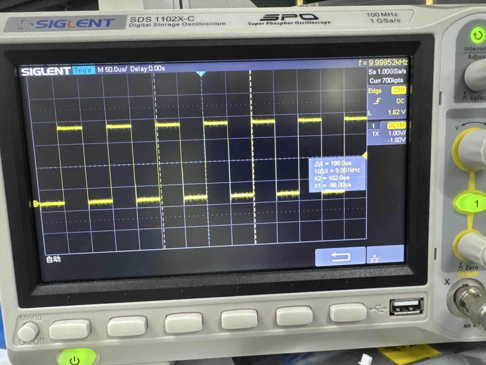
